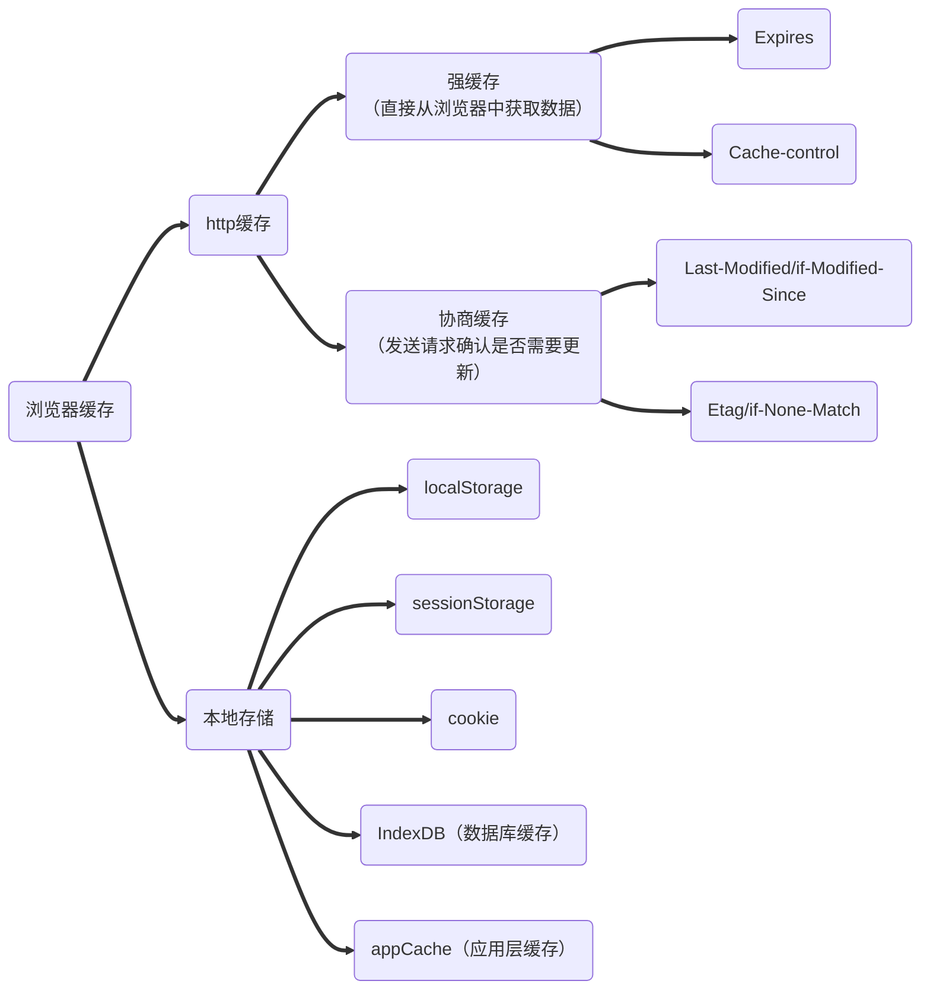

[toc]

# 1 在浏览器中输入 URL 发生了什么？

我们首先需要了解：**什么是 URL？**

URL ，全称为 "Uniform Resource Locator"，即统一资源定位符，URL 其实就是一个给定的独特资源在 Web 上的地址，每一个有效的 URL 都对应这一个资源 


URL 分为以下三部分：

- 协议

- 主机名（计算机名 + 域名）

  > 这里省略掉了端口号，显然端口号是访问主机上特定资源的通道

- 请求资源路径名


当我们在浏览器中输入 URL 后会进行如下步骤：

**01 浏览器解析 URL** 

浏览器会将 URL 拆分为：协议、主机名、端口号、路径等部分


**02 浏览器检查缓存**

浏览器检查缓存，看是否有缓存的副本可用，如果有则直接从缓存中获取网页并显示。

对于浏览器缓存我们可以将其分为如下几类：



当强缓存失效后，客户端（浏览器）开始进行协商缓存，对于协商缓存的 last-modified 字段我们不再说明，主要了解一下 Etag（Entity tag），Etag 的出现主要是为了解决 `last-modified` 机制下，缓存文件在 1s 内被频繁修改，这样客户端在第二次发送了 `if-modified-since` 字段后，服务器会误判文件未修改（因为该字段是以时间为度量标准，且精确度仅精确到秒），从而返回 304 状态码

Etag 即是资源的唯一标识，生产 Etag 的方法包括抗冲突散列函数（hash）、时间戳的hash值或修订号，每次文件修改都会重新生成一个唯一的标识，这就导致 Etag 效率低于 Last-Modified，但是精度度较高，因此优先级也会高


**03 DNS 查询**

DNS，全称"Domain Name System"，即域名系统，主要作用是进行域名解析（即通过域名映射到真正能够访问服务器的IP地址）

> DNS 存在的意义很简单，就是为了便于记忆，例如百度的 IP 地址为 【110.242.68.66】，这一串数字显然是十分难以记忆的，而且还可能会更换，但是使用 【baidu.com】就不一样了

DNS 查询步骤如下，若下面其中有一步成功则直接跳到建立链接部分

- 浏览器自身的 DNS

  ```bash
  # 例如 Chrome 自身的 dns 管理地址如下
  chrome://net-internals/?#dns
  ```

- 本地 hosts 文件，如果是 windows 平台，那么 host 文件位置位于 ==C:\Windows\System32\drivers\etc\HOSTS==

- 向域名服务器发送请求：本地域名服务器，然后通过迭代的方式，依次向【根域名服务器 -> 顶级域名服务器 -> 权威域名服务器】发送请求


**04 发送网络请求**

当客户端拿到 IP 后，会发送对应的网络请求，经过 TCP/IP 体系结构（也即 "工业四层模型"），达到运输层时会发起三次握手，抵达上层拿到资源后返回再次经过时发起四次挥手


**05 浏览器开始解析资源**

当拿到对应资源后，浏览器就开始要解析拿到的资源，根据资源的不同，解析方式也有所差异，例如：

- HTML 文件：HTML 解析器将标签解析为一棵 AST 抽象语法树（DOM 树）
- CSS 文件：进行 CSSOM 树构建，在该过程中会发生回流（reflow）与重绘（repaint）

  - 回流：当页面的大小、尺寸、元素位置（排版）发生改变时，就会发生回流

  - 重绘：当页面的颜色、背景等发生改变时，就会发生重绘

    > 回流一定会引起重绘，但重绘不一定会引起回流

- JS 文件：由浏览器自带的引擎解析，例如 Chrome 采用的就是 V8 引擎


# 2 CDN

CDN，全称为 "Content Delivery Network"，即内容分发网络，作用：<strong style="color:red">优化网络资源请求时间</strong>

CDN 是构建在现有网络基础上的智能虚拟网络，依靠部署在各地的==边缘节点==，使用户就近获取所需的内容，降低网络拥塞和提高命中率。CDN 涉及的关键技术包括：

- 内容缓存
- 内容分发
- 负载均衡
- 内容管理

使用 CDN 的好处：

1. 加速用户访问资源速度
2. 隐藏主服务器的 IP ，防止 DDoS 攻击等网络安全威胁
3. 节省带宽，减轻服务器的压力


