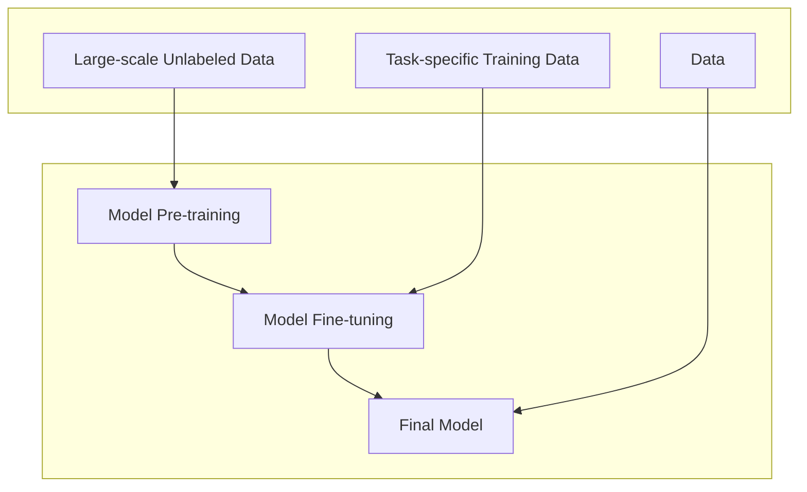

# 1 NLP Basic

## 1.1 Basic Tasks

Basic Tasks of MLP

1. Part-of-Speech Tagging(POS Tagging): 即词性标注， 在 NLP 中，NLTK(Natural Language Toolkit)就是一个常用的 Python 库，它有一台标准的英文词性标签，如下是 NLTK 关于词性标注英文简称及其分类：

   - nouns:

     | abbreviation                 | meaning                                                      |
     | ---------------------------- | ------------------------------------------------------------ |
     | `NN(Noun, singular or mass)` | 普通名词的单数，物体可以是单数或不可数的，例如 "dog"， "water" |
     | `NNS(Noun, plural)`          | 普通名词复数                                                 |
     | `NNP(Proper noun, singular)` | 专有名词单数                                                 |
     | `NNPS(Proper noun, plural)`  | 专有名词复数                                                 |
     
   - verbs

     | abbrevation                                     | meaning                    |
     | ----------------------------------------------- | -------------------------- |
     | `VB(Verb, base form)`                           | 动词原形                   |
     | `VBD(Verb, past tense)`                         | 动词过去式                 |
     | `VBG(Verb, gerund/present participle)`          | 动词现在分词               |
     | `VBN(Verb, past participle)`                    | 动词的过去分词             |
     | `VBP(Verb, non-3rd person singular participle)` | 动词的非第三人称单数现在时 |
     | `VBZ(Verb, )`                                   |                            |

   - adjectives

     | abbrevation                   | meaning      |
     | ----------------------------- | ------------ |
     | `JJ(adjective)`               | 形容词       |
     | `JJR(Adjective, comparative)` | 形容词比较级 |
     | `JJS(Adjective, superiative)` | 形容词最高级 |

   - Adverbs

     | abbrevation                | meaning    |
     | -------------------------- | ---------- |
     | `RB(Adverb)`               | 副词       |
     | `RBR(Adverb, comparative)` | 副词比较级 |
     | `RBS(Adverb, superiative)` | 副词最高级 |

   - Pronouns

     | abbrevation                  | meaning                         |
     | ---------------------------- | ------------------------------- |
     | `PRP(Personal pronoun)`      | 人称代词，例如 "I", "you", "he" |
     | `PRP$(Possessive pronoun)`   | 物主代词，例如 "mine", "yours"  |
     | `WP(Wh-pronoun)`             | wh-疑问代词，例如 "who", "what" |
     | `WP$(Possessive wh-pronoun)` | wh-物主代词，例如 "whose"       |

   - Prepositions and Conjunctions

     | abbrevation                                    | meaning                                  |
     | ---------------------------------------------- | ---------------------------------------- |
     | `IN(Preposition or subordinating conjunction)` | 介词或者从属连词，例如 "in"， "beacause" |
     | `CC(Cooridnating conjunction)`                 | 并列连词，例如 "and", "but", "or"        |

   - Punctuation

     | abbrevation            | meaning |
     | ---------------------- | ------- |
     | `.(Period)`            | 句号    |
     | `,(Comma)`             | 逗号    |
     | `:(Colon)`             | 冒号    |
     | `((Left parenthesis)`  | 左括号  |
     | `)(Right parenthesis)` | 右括号  |
     | `''(Quotation mark)`   | 引号    |

2. Named entity recognition(NER): 即命名实体识别，从文本中识别处具有特定意义的实体（通常是指专有名词），例如 PERSON, LOCATION, TIME, DATE, ORGANIZATION

3. Co-reference Resolution: 即共指消解，在一段话中，我们会使用两个或多个表达式指代同一个事物，例如 "*Bill said Alice would came soon, and she did*" 这句话中，Alice 和 she 指的是同一个人

4. Basic dependencies:  即基本依赖关系，主要是指句子的语法结构，例如 **主谓宾定状补** 之类


## 1.2 Distributed Word Representation

### 1.2.1 word representation

word representation: a process that transforms the symbols to the machine understandable meanings


**Goal**

- Compute word similarity: 计算词之间的相似度，例如 $WR(\text { Star }) \simeq WR(\text { Sun })$

- Infer word relation: 推测词之间的关联性，例如 $\text { WR(China) }- \text { WR(Beijing) } \simeq \text { WR(Japan) }- \text { WR(Tokyo) }$


**problems**

1. missing nuance: 缺少的细微差别，有些词汇在不同的场景下具有不同的 synonym 

2. missing new meanings of words: 旧词新意

   ```
   AS FOR APPLE
   APPLE --> FRUIT(old)
   APPLE --> COMPANY(new)
   
   AS FOR AMAZON 
   AMAZON --> JUNGLE(old)
   AMAZON --> COMPANY(new)
   ```

3. subjective: 语言或文本中带有主观色彩的部分。例如 "I like this restaurant" 这就是一种主观的情感

4. data sparsity: 在 NLP 任务中，训练数据中某些特征、词语等出现频率非常低（符合 Zipf 定律，即少数词高频，大多数词低频）

5. requires human labor to create and adapt


### 1.2.2 one-hot representation

为了能够使得计算机能够识别和区分词汇，我们需要将词汇转换为离散的符号，例如 word ID 或者 one-hot，如下：

| word | ID   | one-hot vector     |
| ---- | ---- | ------------------ |
| star | 1    | [0, 0, 1, 0, 0, …] |
| sun  | 2    | [0, 0, 0, 1, 0, …] |

- vector dimension 会随着单词个数的增加而增加
- order is not important

> [!note]
>
> 这种方法在比较两个文档之间的相似度时比较有效，但是这种做法其实是默认了词与词之间是相互正交的（orhogonal），没有关联的


### 1.2.3 represent word by context

> [!tip]
>
> you shall know a word by the company it keeps

当我们使用 one-hot 去代表词的时候，词与词之间的相似度计算都为 0， 这显然不好，为了更加合理地表示词与词之间地关系，我们计算词的上下文来表示词与词之间的关系，具体实现思路可以是先找到词的上下文向量，然后构建一个 Term-Term Matrix，矩阵中的每一个元素值都代表该上下文 Term 出现的次数，然后构建的 Term-Term Matrix 来计算相似度

但是这种方法仍然存在问题：

- increase in size with vocabulary

- require a lot of storage

- sparisity issues for those less frequent words

  > [!note]
  >
  > 当一个词在某句话中出现频次非常少时，仍然存在稀疏问题


### 1.2.4 word embedding

**distribute representation** 

- build a dense vector for each word learned from large-sclae text corpora 


`Word2Vec` 就是一种实现 word embeding 的方法


## 1.3 Language Modeling

Language Modeling: a task of **predicting the upcoming word**.

The two abilities:

1. compute ==joint probability== of a sequence of words
   $$
   P(W)=P\left(w_1, w_2, \cdots, w_n\right)
   $$
   
2. compute ==conditional probability== of an upcoming word 
   $$
   P\left(w_n \mid w_1, w_2, \cdots, w_{n-1}\right)
   $$

这里基于一个假设：the probability of an upcoming word is only determined by all its **previous words**，即：
$$
\begin{align*}
P(\text{Never, too, late, to, learn}) =\ & 
P(\text{Never}) \times 
P(\text{too} \mid \text{Never}) \times 
P(\text{late} \mid \text{Never, too}) \\
& \times P(\text{to} \mid \text{Never, too, late}) \times 
P(\text{learn} \mid \text{Never, too, late, to})
\end{align*}
$$
 推而广之，我们可以将 Language Model 构建为如下形式：
$$
P(w_1, w_2, \cdots, w_n) = \prod_{i} P(w_i \mid w_1, w_2, \cdots, w_{i-1})
$$


### 1.3.1 N-gram

N-gram: Collect statistics about how frequent different n-grams are, and use these to predict the next word.

**e.g., 4-gram**
$$
P(w_j \mid \text{never too late to}) = \frac{\text{count}(\text{too late to } w_j)}{\text{count}(\text{too late to})}
$$
problems

1. need to store count for all possible n-grams
2. not considering contexts farther than 1 or 2 words
3. not capturing the similarity between words


## 1.4 neural language model

> [!tip]
>
> Ref: https://jmlr.org/papers/volume3/bengio03a/bengio03a.pdf


## 1.5 Paradigms behind Big Models



# 2 Neural Network Basic

## 2.1 Train model by PyTorch

