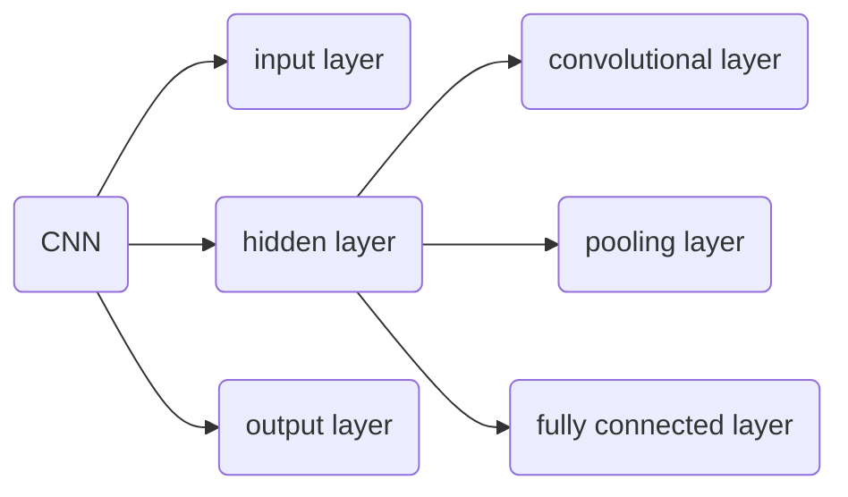
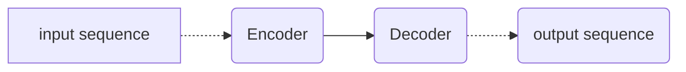

[toc]

# 1 Convolutional Neural Network

**:book:前置知识：Fully Connected Layer vs. Convolutional Layer**

|          |                    Fully Connected Layer                     |                     Convolutional Layer                      |
| :------: | :----------------------------------------------------------: | :----------------------------------------------------------: |
|   说明   | 神经元输入层的每个节点通过一个权重矩阵进行线性转换，即输入向量的每一个输入都影响输出向量的每一个输出 |         神经元中的每一个输入节点不一定和输出节点相连         |
|   图示   |  |  |
| 输出大小 |               $n_{out}=I_{row}\times W_{col}$                |     $n_{\text {out }}=\frac{n_{\text {in }}+2 p-k}{s}+1$     |


---

>[!note]
>
>A **convolutional neural network** (**CNN**) is a [regularized](https://en.wikipedia.org/wiki/Regularization_(mathematics)) type of [feed-forward neural network](https://en.wikipedia.org/wiki/Feed-forward_neural_network) that learns [features](https://en.wikipedia.org/wiki/Feature_engineering) by itself via [filter](https://en.wikipedia.org/wiki/Filter_(signal_processing)) (or kernel) optimization.

Convolutional Neural Network(CNN) 即卷积神经网络，是一个正则化的前馈神经网络，通过滤波器或卷积核优化自身学习特征。卷积神经网络一般用在计算机视觉中，例如图像识别，除此之外还有：

1. 推荐系统
2. 自然语言处理
3. 脑机接口

最经典的应用就是 Play Go。

CNN 主要用于处理图像，对于一个图像，我们可以用一个 tensor 表示，结构为 [Width * Height * Channel]，其中 Channel 即为通道，一般是 RGB 三类通道，也可以是 CMYK 四类通道


> [!tip]
>
> 可参考 paper: [ https://doi.org/10.48550/arXiv.1511.08458](https://doi.org/10.48550/arXiv.1511.08458)


CNN 主要结构如下：



- 卷积层（convolutiona; layer）：卷积神经网络的核心，卷积层由一组 *滤波器（filter）/ 卷积核（kernel）*组成，其具有较小的*感受野（receptive field, RF）*，主要是用于生成 **feature map**

  

  卷积核的 tensor 结构为 $(N, C, H, W)$，分别代表 kernel_size, channel, height, width，卷积核的 channel 数目和输入层的 channel 数目相同，所以不需要我们指定

  $N$ 个卷积核会产生 $N$ 个feature map，对于新产生的 feature map 的宽和高满足如下式子：
  $$
  \begin{align*}
  \text{height}_{\text{out}} &= \left(\text{height}_{\text{in}} - \text{height}_{\text{kernel}} + 2 \cdot \text{padding}\right) / \text{stride} + 1 \\
  \text{width}_{\text{out}} &= \left(\text{width}_{\text{in}} - \text{width}_{\text{kernel}} + 2 \cdot \text{padding}\right) / \text{stride} + 1
  \end{align*}
  $$
  在卷积层中，卷积核会与当前层的输入矩阵进行点积操作（一般是 Frobenius inner product），激活函数一般是 ReLu 函数

- 池化层（pooling layer）：池化层主要是对卷积后的 feature map 进行下采样操作（subsample），池化层也有一个池化核，大小由我们指定，它会对 feature map 进行扫描，通常有如下两种计算方式：

  - Max pooling: 取池化核矩阵的<b style="color: orange">最大值</b>作为矩阵值

    > [!tip]
    >
    > Max pooling 会将图片模糊化

  - Average pooling: 取池化核矩阵的<b style='color: orange'>平均值</b>作为矩阵值

  

  > [!note]
  >
  > 池化层的主要目的为了降维以提高计算性能

- 全连接层：在经过若干个卷积和池化操作后，我们需要用到全连接层进行**分类**。该层主要功能是**特征提取**，输入是一般是一维向量（经过 Flatten 处理后的结果），将输入与一组权重矩阵做乘积运算后添加偏置项，再经过激活函数输出结果

  > [!tip]
  >
  > 1. 全连接层一般需要两层或以上（先是总体特征提取后进行判断，然后是局部特征提取判断）
  > 2. 现在一些比较优异的网络模型例如 ResNet 和 GoogleNet 都使用 global average pooling（GAP）替换 FC 层


如下是 **LeNet** 这个经典 CNN 的结构图


卷积神经网络中还有很多内容需要我们深挖，例如：

1. 卷积核的值是如何产生的，是随机的，还是需要我们预先定义？
2. 我们是如何将 subsampling 后的 tensor 扁平化转化为一维向量？
3. 我们为什么要使用 CNNs 处理图像，直接使用 FC 处理图像不可以吗？

在卷积神经网络中，主要有两大核心思想：

- **局部连接**（Local Connectivity）：通过卷积核实现
- **参数共享**（Parameter Sharing）：为了减少参数，不同的区域使用相同的权重和偏置


# 2 Self-attention

## 2.1 引入

我们可能会输入很复杂的情况的，例如在做文字处理时，每个句子的长度不一

- Input is **a vector**

  

- Input is a **set of vectors**

  

所以，现在就有一个问题：在处理文字的时候，我们应该如何用一组向量表示一段话？

1. 方法1：使用 **One-hot Encoding**，每一个单词用一个向量表示，例如：

   - apple = [1, 0, 0, 0,...]
   - bag   = [0, 1, 0, 0,...]
   - cat   = [0, 0, 1, 0,...]
   - ...

   但是这样处理会有一个问题就是单词是有语义的，直接这么处理会导致每个单词之间没有任何关系，而且向量长度会因为单词数目众多变得很长，计算开销比较庞大

2. 方法2：为了避免出现上面的情况，我们可以采用 **World Embedding**

   

现在我们再来考虑输出：

1. 对于输入的每一个向量都有一个标签与之对应

   

   例如：词性标注（Part-Of-Speech tagging, POS tagging），分析一段话中每个单词所对应的单词的词性

2. 整个序列的输出只有一个标签

   

   例如：sentiment analysis（文本情感分析），对语句进行情感分析，分析这段话是积极的还是消极的，也就是说对于构成语句的一组向量，输出只有一个 label，positive or negative

3. 模型自决输出标签的数量，这种任务又被称为 **seq2seq**

   

   

我们以 POS tagging 为例，如何做词性标注，为一整个句子中的每个单词标注对应的词性？

- 如果仅对句子中的每个单词做全连接，显然是有问题的，因为同一个单词在同一个句子可能会有不同的词性，例如 I saw a saw(我看到一把锯子)，前面一个名词是动词，后面的则是名词
- 如果我们对一整个句子做全连接，这就会导致 *参数过多，性能下降* 以及 *过拟合* 的问题发生
- 使用 self-attention 技术 ✅


## 2.2 概念

self-attention: 自注意力机制，在处理输入序列时，动态地关注序列中的不同部分，然后<b style='color: orange'>根据它们之间的关系调整对应的权重</b>。

> [!note]
>
> 该机制最典型的应用就是在 [Transfoemer](https://arxiv.org/abs/1706.03762) 模型中，同时也是现在大语言模型（GPT， [BERT](https://arxiv.org/abs/1810.04805)等）的核心

假设序列中待查询的单词的向量记为 $q$(query， 查询向量)，与之有关的单词的向量记为 $k$(key，箭向量)


他们之间的关系分别用 $a_{1, 2}$, $\alpha_{1, 3}$, $\alpha_{1, 4}$ 表示，除此之外，还好建立自己与自己的联系 $\alpha_{1, 1}$，所以应该如何计算关系向量 $\boldsymbol{a}$ 呢？

有多种计算方式，下面列举两种：

- 第一种方式是 Dot-product, 即让目标向量和有联系的向量与权重矩阵做点积，再对产生的矩阵做点积得到关系向量
- 第二种方式是 Additive

这里我们主要采用的第一种方法，然后根据下图右边部分计算 $\alpha_{1, 1}$, $a_{1, 2}$, $\alpha_{1, 3}$, $\alpha_{1, 4}$, 之后再经过 softmax 归一化得到 $\alpha_{1, 1}^{\prime}$, $a_{1, 2}^{\prime}$, $\alpha_{1, 3}^{\prime}$, $\alpha_{1, 4}^{\prime}$


我们以 $\alpha_{1,2}^{\prime}$ 为例，首先计算 $q^1=W^q\alpha^1$, $k^2=W^k\alpha^2$ , 那么 $\alpha_{1, 2}=q^1 \cdot k^2$, $\alpha_{1, 2}^{\prime}=softmax(\alpha_{1, 2})$，得到的 $\alpha^{\prime}$ 即为 attention score。

接下来，我们需要从 attention score 中提取信息，示意图如下


上图中，$W^v$ 和 $W^q, \ W^k$ 类似，都是一个线性变化的权重矩阵，它主要讲输入特征映射为与任务相关的 Value 向量，$V=[v^1, v^2, v^3, v^4]$， 得到的 Value 向量与 attention score 点积后再相加得到 $b^1$, 即 $b^1 = \sum_i \alpha'_{1,i} v^i$

$b^1$ 与那个那个特征最接近说明 query 向量最相关的 key 向量就是那个，同理可以计算出 $b^2,\ b^3, \ b^4$


上图是计算的全过程，我们可以看到基本上都是通过矩阵联合起来进行运算的，其中除了 $W^q, \ W^k, \ W^v$ 需要我们通过训练得到，其他的参数都是已经提供的


:wink:拓展：Multi-head Self-attention


## 2.3 positional encoding

在上面的 self-attention 中，我们可以看到我们在做词性标注的时候，忽略了一个比较重要的因素 —— 位置，所以我们需要考虑为每一个位置的信息单独设置一个 vector $e^i$

这个 positional encoding 有如下几个特征：

1. hand-crafted（人为设置）
2. learned from data（从现有数据中训练得来）


## 2.4 其他应用

1. [Self-attention for Speech](https://arxiv.org/abs/1910.12977): 由于一个 vector 只能表示 10ms 的会话，因此一段话的 vector 序列是非常长的，我们就需要用到 **Truncated Self-attention**

2. [Self-attention for Image](https://www.researchgate.net/figure/Color-image-representation-and-RGB-matrix_fig15_282798184)：一张图像也可以看做是一组 vector，下图中 (r, g, b) 代表一个 vector，所以对于下图由 5 × 10 个 vector 组成

   

3. Self-Attention GAN
4. DEtection Transformer (DETR)

5. Self-attention for Graph


## 2.5 Self-attention vs CNN

CNN: self-attention that can only attends in a receptive field

> CNN is simplified self-attention. 

Self-attention: CNN with learnable receptive field

> Self-attention is the complex version of CNN.


# 3 Transformer

Transformer 是一种处理序列数据的深度学习架构，由 Google 在[《Attention is all you need》](https://arxiv.org/abs/1706.03762) 中提出，核心思想是注意力机制，主要应用在 NLP 领域。

Transformer 是 Seq2Seq 的进化，它使用 self-attention 取代了 RNN 或 LSTM，这使得在处理大规模并行运算时更好。

## 3.1 Seq2Seq

Seq2Seq（Sequence-to-Sequence）：输入和输出都是一个 sequence，并且 sequence 的输入和输出长度不一，输入由人手动控制，输出由 model 决定。应用场景如下：

1. speech recognition(语音辨识)：输入一段语音，输出一段文字
2. machine translation(机器翻译)：输入一段文字，输出一段文字
3. speech translation(语音翻译)：输入一段语音，输出一段文字
4. speech synthesis(语音合成)：输入一段文字，输出一段语音

Seq2Seq 的主要结构如下：



传统的 Seq2Seq 主要就是使用 RNN 分别构建编码器和解码器，编码器逐步读取输入序列中每一个元素，并将其转化为一个固定大小的 context, 解码器就这个 context 生成输出序列。

## 3.2 Seq2Seq 进化体 —— Transformer

完整且经典的 transform 架构图如下：


:apple:**编码阶段**

1. 输入向量进入 Input Embedding 层，将输入序列中的单词转化为固定维度的向量

2. 进行 positional enconding，由于之前的 Seq2Seq 使用的 RNN，没有考虑到位置，无法捕捉序列中的单词的顺序信息，所以这里添加一个**位置向量**

3. 进入到核心的 block —— Multi-Head Attention，经过多头注意力机制处理后添加 Residual Network + Normalization 处理

   > [!note]
   >
   > 1. Residual Network（ResNet）即残差网络，原向量经过 self-attention layer 后得到的向量 + 原向量为最终结果
   > 2. 上述的 Norm 是 Layer Norm 而不是 Batch Norm

4. 后面就再经过 FC layer，再用 Residual Network + Normalization 处理一次

5. 重复 3，4 过程 N 次得到最终的 context(上下文向量)


:green_apple:解码阶段


# 4 GAN

## 4.1 基本介绍

GAN(Gerative Adversarial Network): 生成式对抗网络，由生成器（Generator）和判别器（Discrimator）两个神经网络组成，它们各自的作用为：

1. 生成器：从*随机噪声*中生成假样本，使其逼近真实数据
2. 判别器：区分生成器产生的假样本和真实数据，输出一个概率值表示输入的样本是真实数据的概率
3. 对抗训练：训练过程中，生成器和判别器通过交替更新各自权重来进行对抗

:sunglasses:补充：随机噪声是从分布中通过抽样得来，常用的分布有如下几类：

|         Guassian/Normal Distribution(高斯/正态分布)          |                Uniform Distribution(均匀分布)                |
| :----------------------------------------------------------: | :----------------------------------------------------------: |
|    $f(x) = \exp\left(-\frac{(x-\mu)^2}{2\sigma^2}\right)$    |        $f(x)=\frac{1}{b-a},\  s.t.\ a \leq x \leq b$         |
|  |  |

```python
import numpy as np
import matplotlib.pyplot as plt
import seaborn as sns

# 设置图形风格
sns.set_style('whitegrid')

# 生成正态分布的数据
mu, sigma = 0, 1
normal_data = np.random.normal(mu, sigma, 10000)

# 生成均匀分布的数据
a, b = -3, 3
uniform_data = np.random.uniform(a, b, 10000) # return low + (high-low) * random_sample()

# 创建绘图
fig, axes = plt.subplots(1, 2, figsize=(15, 5))

# 正态分布
sns.histplot(normal_data, bins=50, kde=True, color='skyblue', ax=axes[0]) # bins 表示切割为 50 个箱体，kde 为启用核密度
axes[0].set_title('Gaussian Distribution')
axes[0].set_xlim([-5, 5])

# 均匀分布
sns.histplot(uniform_data, bins=50, kde=True, color='green', ax=axes[1])
axes[1].set_title('Uniform Distribution')
axes[1].set_xlim([-5, 5])

plt.tight_layout()
plt.show()
```


GAN 的三种形式：

1. Typical GAN
2. Conditional GAN
3. Unsupervised Conditionl GAN


生成器会将已知结构的简单分布转换为复杂分布


对于初始训练数据 $x$，我们需要添加一个概率分布，使得对应的输出也是概率产生，从而使得输出的结果不再单一，具有一定的创造性。

如果我们将 GAN 用于训练图像，那么判别器将用


