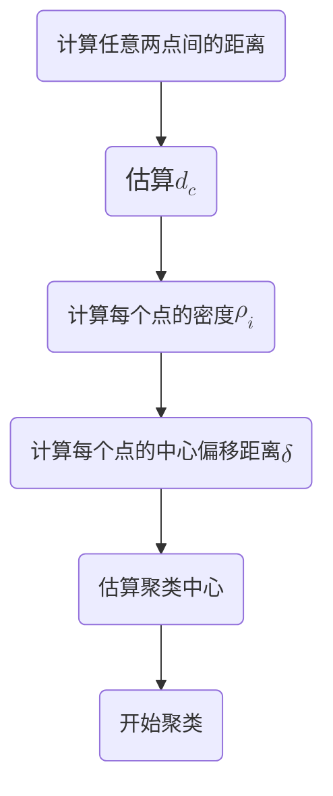

# Density Peak

> [!tip]
>
> paper: [Clustering by fast search and find of density peaks](https://www.science.org/doi/10.1126/science.1242072)

## 基本思想

密度峰值聚类（DPC）算法是一种**不需要迭代**，可以一次性找到聚类中心的聚类方法。其主要思想如下：

1. 聚类中心的密度应当比较大
2. 聚类中心应当离比其密度更大的点较远

:question:**问1**：如何计算聚类中心的密度？

计算聚类中心的密度的方法主要有两种：

1. 截断核（Cut-off kernel）
   $$
   \rho_i=\sum_j \chi\left(d_{i j}-d_c\right)
   $$
   其中:

   - $d_{ij}$：点 $i$ 和点 $j$ 之间的距离
   - $d_c$：截断距离（cut-off distance），由人工设定或者自动选取
   - $\chi(x)=1$，如果 $x<0$，否则 $\chi(x)=0$

2. 高斯核（Gaussian Kernel）
   $$
   \rho_i=\sum_j \exp \left(-\left(\frac{d_{i j}}{d_c}\right)^2\right)
   $$

:vs:两种方法的比较

| 方法   | 公式                                  | 特点             |
| ------ | ------------------------------------- | ---------------- |
| 截断核 | $\rho_i = \sum_j \chi(d_{ij} - d_c)$  | 简单、对距离敏感 |
| 高斯核 | $\rho_i = \sum_j e^{-(d_{ij}/d_c)^2}$ | 平滑、鲁棒性更强 |

在整个算法过程中，主要计算两个参数：

1. 局部密度 $\rho_i$
2. 到密度比其大的点的最小距离 $\delta_i=min_{j:\rho_j > \rho_i}(d_{ij})$

当局部密度 $\rho$ 和 中心偏移距离 $\delta$ 都比较大时， 我们就可以认为这是一个聚类中心

:question:**问2**：$d_c$ 应该如何设置？

论文中提供了一种关于 $d_c$ 的确定方式，就是根据落在 $d_c$ 圆区域内的平均点数，占总点数的 $1\% \sim 2\%$ 来进行确定

## 整体框架

DPC 算法的整体框架如下：

