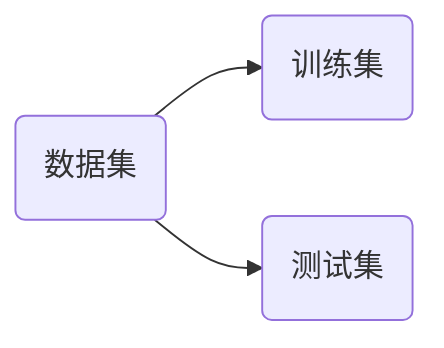
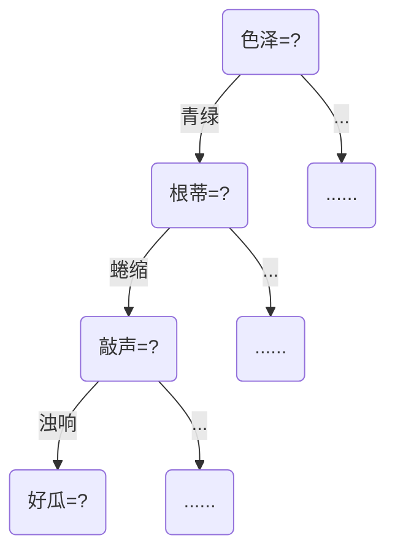

# 1 绪论

> [!NOTE]
>
> 机器学习的定义：<u>利用经验改善系统自身的性能</u>

随着时代的发展，机器学习目前主要是研究<u>智能数据分析的理论和方法</u>，并已成为智能数据分析技术的主要源泉之一


## 1.1 机器学习过程


> [!note]
>
> 补充P问题和NP问题
>
> - P 问题：多项式时间内可以解决的问题
> - NP 问题：多项式时间内可以验证解是否有效的问题

## 1.2 计算学习理论

计算学历理论中最重要的理论模型-PAC（probably approximately correct，概率正确）learning model，**是指以高概率得到很好的模型**。
$$
P\left( |f\left( x \right) -y|\leqslant \epsilon \right) \geqslant \delta
$$

> - $x$：未知数据
>
> - $f(x)$：预测模型得到的值
> - $y$：最终正确值
> - $\epsilon$：误差值，为一个非负数，值越小代表越精确
> - $\delta$：拿到准确数据的概率，范围为[0, 1]，值越大说明该由该模型得到结果越准确


## 1.3 基本术语

- 数据集（Data set）：被用于用来训练和测试的数据集合

  > 训练和测试，其中训练（training）≠ 测试（test），用来训练数据和测试数据应该是分开的，测试即学得模型后使用其进行预测过程。

- 示例（instance）：通常是指数据集中的一条记录或者一个数据点，但是没有输出结果

  样例（example）：含有输入-输出结果的一条完整的记录

- 属性（attribute）：反映事件或对象在某方面的表现或性质的事项，另称为特征（feature），其值即为属性值。属性的类别主要由如下几类：

  - 标称属性（nominal attribute）

    ```python
    @attribute outlook{sunny, overcats, rainy}
    @attribute windy{TRUE, FALSE}
    ```

  - 数值属性（numeric attribute）

    ```py
    @attribute temperture real
    @attribute humidity real
    ```

    > 这里的 ==real== 指的是实数

  - 二元属性（binary attribute）

  - 序数属性（ordinal attribute）

- 属性空间：由属性构成的多维空间，也称为<u>样本空间或输入空间</u>

- 特征向量（feature vector）：一个由各种属性构成的事物可以在属性空间中找到对应的点，该点对应的坐标向量被称为特征向量

- 标记空间（label space）：也称为输出空间，由类别标记构成的空间

- 假设（hypothesis）：学得的模型对应相关数据的某种潜在规律

- 真值（ground truth）：训练集对监督学习技术分类的准确性

- 簇（cluster）：将训练集中的数据划分为若干组，每组称为一个 "簇"


> [!TIP] 
>
> 1. 分类和回归属于监督学习，其中分类是将实例数据划分到合适的分类中，而回归则是用于预测数值型数据，典型的例子例如数据**拟合曲线**
>
> 2. "泛化"用于表明<u>学出来的模型适用于新样本的能力</u>，该能力越强，说明学得的模型越能很好地适用于整个样本空间。

若预测的是离散值，此类学习任务被称为 "分类"（classification），若预测的事连续值，此类学习任务被称为 "回归"（regression）。

对于只涉及两个类别的 "二分类"（binary class）任务，通常会称呼一个为 "正类"（positive class），另一个为 "反类"（negative class）；涉及多个类别时，则会被称为 "多分类任务"（multi-class classification）。

|          | 输入空间${\mathcal{X}}$                                      | 输出空间$\mathcal{Y}$             |
| -------- | ------------------------------------------------------------ | --------------------------------- |
| 二分类   | $\{(\boldsymbol{x}_1,y_1),(\boldsymbol{x}_2,y_2),\ldots,(\boldsymbol{x}_m,y_m)\}$ | $\{-1,+1\}$ 或 $\{0,1\}$          |
| 多分类   | $\{(\boldsymbol{x}_1,y_1),(\boldsymbol{x}_2,y_2),\ldots,(\boldsymbol{x}_m,y_m)\}$ | $\lvert \mathcal{Y} \lvert > 2$   |
| 回归任务 | $\{(\boldsymbol{x}_1,y_1),(\boldsymbol{x}_2,y_2),\ldots,(\boldsymbol{x}_m,y_m)\}$ | $\lvert \mathcal{Y} \lvert \in R$ |

> 这里需要注意的是 $\boldsymbol{x}$ 是一个多维向量，代表了示例，具体到上述的西瓜例子 {色泽：青绿；根蒂：蜷缩；敲声：浊响}


根据训练数据是否有标记信息，我们可以将其区分为监督学习（supervise learning）和无监督学习（unsupervised learning），分类和回归任务主要使用监督学习，而聚类则是使用无监督学习。

> [!tip]
>
> 区分分类（classification）和聚类（clustering）
>
> - 分类用于监督学习，而聚类用于无监督学习
> - 根据输入实例对应的类标签对输入实例进行分类的过程称为分类，而在没有类标签帮助的情况下根据实例的相似性对实例进行分组称为聚类

机器学习的目标：使学得的模型能更好地适用于 "新样本"，而不仅仅是在训练样本上工作得更好。


## 1.4 归纳偏好

归纳（induction）和演绎（deduction）是科学推理的两大基本手段，两者区别如下：

- 归纳：从特殊到一般的 "泛化"（generalization）过程
- 演绎：从一般到特殊的 "特化"（specialization）过程

> [!tip]
>
> 归纳学习有狭义和广义，<u>广义的归纳学习大体相当于从样例中学习，而狭义的归纳学习则要求从训练数据中学得概率</u>，因而归纳学习又被称为 "概率学习"


归纳偏好（Inductive Bias）：是指机器学习算法在学习过程中对某种类型假设的偏好。

> 任何一个有效的机器学习算法必有其偏好，否则由于 "版本空间"（version space）中存在多个假设与训练集一致，该算法将会被这些假设所迷惑，缺乏明确性

当我们有多个模型、多个假设时，我们一般采取奥卡姆剃须刀法则（Occam's razor），即多个假设与观察一致时，我们选择最简单的一个。

> [!warning]
>
> 即使我们可以采取奥卡姆剃须刀法则，即遇到多个假设与观察一致时，选择最简单的一个，但是判定那个假设更加简单却并不容易

学习算法的归纳偏好是否与问题本身匹配，大多数时候直接决定了算法能够取得好的性能。


## 1.5 NFL定理

NFL（No Free Lunch Theorem）定理：一个算法 $\mathfrak{L}_a$ 若在某些问题上比另一个算法 $\mathfrak{L}_b$ 好，必存在另一些问题 $\mathfrak{L}_b$ 比  $\mathfrak{L}_a$ 好。

> [!warning]
>
> NFL定理的一个重要前提就是所有"问题"出现的机会相同或所有问题同等重要


# 2 模型评估与选择

## 2.1 泛化能力

泛化能力是指<u>模型在未见样本（unseen instance）的表现能力。</u>


## 2.2 过拟合和欠拟合

误差（error）：<u>学习器在训练集上的误差被称为"训练误差"（training error）或"经验误差"（empirical error），在新样本上的误差被称为 "泛化误差"（generalization error）</u>

- 泛化误差：在 "未来" 样本上的误差
- 经验误差：在训练集上的误差，亦称为 "训练误差"


由于"过拟合"（overfitting）现象的存在，泛化误差并不是越小越好，同样经验误差也不是越小越好


> [!tip]
>
> 与 过拟合（overfitting）相对的是欠拟合（underfitting），对于欠拟合，我们有多重解决方案，例如在决策树学习中<u>扩展分支、在神经网络学习中增加训练轮数</u>，而过拟合则较难解决


## 2.3 三大问题

模型选择（Model Selection）具有如下的三个问题：

1. 如何获得测试结果？  =>   评估方法

   > 评估方法是为了解决如何获得**未见样本**
   >
   > > [!WARNING]
   > >
   > > 使用合适的评估方法，我们可以利用现有数据对泛化误差进行估计

2. 如何评估性能优劣？  =>   性能度量

3. 如何判断实质差别？  =>   比较校验

   > 比较校验的目的视为说明模型在统计意义上表现好


## 2.4 评估方法

我们需要使用一个 "测试集" 来测试学习器对新样本的判别能力，然后以测试集上的测试误差（testing error）作为泛化误差的近似值。

关键：怎么获得 "测试集"（test set）？

**常见方法**

- 留出法（hold-out）：直接将数据集 $D$ 划分为两个互斥的集合，其中一个集合作为训练集 $S$，另外一个作为测试集 $T$

  > 在这其中，需要满足 $D=S\cup T$，$S\cap T=\varnothing $
- 交叉验证法（cross validation）：先将数据集 $D$ 划分为 $k$ 个大小相似的互斥子集，然后每个子集 $D_i$ 尽量保持数据分布的一致性，每次用 $k-1$ 个子集的并集作为训练集，余下的那个子集作为测试集，这样就可以获得 $k$ 组训练 / 测试集，从而可以进行 $k$ 次训练和测试，最终返回的是这 $k$ 个测试结果的均值。
- 自助法（bootstrapping）：自助采样，对于包含 $m$ 个样本的数据集 $D$，我们对其进行采样产生数据集 $D'$，每次随机中从 $D$ 中挑选一个样本，将其拷贝放入 $D'$，然后将其重新放回 $D$，操作重复 $m$ 次后我们就得到包含 $m$ 个样本的数据集 $D’$，于是我们可以将 $D'$作为训练集，$D-D'$ 用作测试集。


> [!warning]
>
> 1. 测试集应该的满足的基本条件：**与训练集互斥**
> 2. 在模型选择完成后，学习算法和参数配置已选定，此时应该**用数据集 $D$ 重新训练模型**

### 2.4.1 留出法



将已有的数据集拆分为训练集和测试集两部分，同时需要注意以下几点：

1. 保持数据分布一致性（例如：<b style="color:skyblue">分层采样</b>）

2. 多次重复划分（例如：100次随机划分）

3. 测试集不能太大，也不能太小（例如：测试集占整个数据集比例控制在$\frac{1}{5}$ ~ $\frac{1}{3}$​之间

   > [!note]
   >
   > 测试集 $T$ 如果过大，那么训练集 $D$ 就会变小，那么会降低训练出来的模型的**保真性**（fidelity）；反之，则会测试的结果不够准确


### 2.4.2 交叉验证法


如果我们划分数据集的份数为 $k$，重复测试 $p$ 次，那么我们可以称为 "p次k折交叉验证"，如上图即为 10次10折校验。

如果数据集 $D$ 中包含 $m$ 个样本当 $k=m$ 时，则得到交叉验证法的特例：留一法（Leave-One-Out, 简称为 LOO），留一法的好处很显然，被实际评估的模型与期望评估的用 $D$ 训练出的模型相似，但是缺陷也很明显就是对计算的开销较大。


### 2.4.3 自助法

自助法，亦称为 "有放回采样"、"可重复采样"


自助法为了保证训练集与原样本的规模相同，将部分样本进行重复，但是同时这也**改变了数据分布**。


## 2.5 调参与验证集

- 算法的参数：一般由人工设定，亦称为 "超参数"
- 模型的参数：一般由学习确定


> [!note]
>
> 区分：算法参数和模型参数
>
> 例如对于一个模型而言，我们首先需要确定拟合函数的次数，这个阶段即是由人为确定的，我们称为 "超参数"，在确定好次数后，我们假定该拟合函数为 $y=ax^2+bx+c$ ，在该函数中 $a、b、c$ 这个三个系数即为模型的参数，需要我们通过学习（训练）得到


> [!note]
>
> 区分：训练集 VS 测试集 VS 验证集（validation set）
>
> 数据集包含训练集和测试集，而我们通常<b style="color:skyblue">把学得模型在实际使用中遇到的数据</b>称为测试数据，也即测试集，而<b style="color:skyblue">模型评估与选择</b>中用于评估测试的数据集称为验证集（从训练集中抽出）


## 2.6 性能度量

性能度量（performance measure）是**衡量模型泛化能力**的评价标准，性能度量反映了任务需求，我们在使用不同的性能度量往往会导致不同的评判结果。这意味着<u>评价一个模型好不好，不仅取决于算法和数据，还取决于任务需求</u>。


- 回归（regression）任务常用均方误差
  $$
  E(f ; D)=\frac{1}{m} \sum_{i=1}^m\left(f\left(\boldsymbol{x}_i\right)-y_i\right)^2
  $$

  > 其中，对于概率分布 $\mathcal{D}$ 和概率密度 $p( \cdot )$，均方误差为：
  > $$
  > E(f ; \mathcal{D})=\int_{\boldsymbol{x} \sim \mathcal{D}}(f(\boldsymbol{x})-y)^2 p(\boldsymbol{x}) \mathrm{d} \boldsymbol{x}
  > $$
  > 
  
- 错误率(error rate):

$$
E(f ; D)=\frac{1}{m} \sum_{i=1}^m \mathbb{I}\left(f\left(\boldsymbol{x}_i\right) \neq y_i\right)
$$

- 精度（accuracy）：精度 = 1 - 错误率 

$$
\begin{aligned}
\operatorname{acc}(f ; D) & =\frac{1}{m} \sum_{i=1}^m \mathbb{I}\left(f\left(\boldsymbol{x}_i\right)=y_i\right)
=1-E(f ; D)
\end{aligned}
$$

下面我们将真实类别与学习器预测类别的组合划分为真正例（true positive）、假正例（false positive）、真反例（true negative）、假反例（false negative） 


- 查准率（precision）：在所有预测的正例中真正例的概率
  $$
  P=\frac{TP}{TP+FP}
  $$

- 查全率（recall）：在所有正例中正例真正被挑出来的概率
  $$
  R=\frac{TP}{TP+FN}
  $$

> [!caution]
>
> 查准率和查全率往往是一对矛盾的概率，如果查准率高，那么查全率往往较低，反之则反


我们以查全率为横轴，以查准率为纵轴作图，就可以得到查全率-查准率曲线图（P-R曲线），具体如下：


在上述的 P-R 图中，<u>如果某一个学习器的查准率和查全率所勾勒的曲线能够完全 "包住" 另一个学习的曲线，那么前者的性能肯定更优</u>，例如学习器 B 和学习器 C 相比较，学习器 C 更加优秀<u>；如果两个学习器所勾勒出的曲线存在交叉点，此时就会依据情况而定，一般通过比较其与横轴和纵轴构成的图形的面积来判断性能优劣。</u>

但是由于[面积大小不太好估算]，因此额外设计了一个叫做 "平衡点"（Break-Event Point，简称 BEP）的度量标准，他考察的主要是 "查准率 = 查全率" 时的取值，例如学习器 A 的 BEP为 0.64，而学习器 B 的 BEP 为 0.8，因而我么可以得出结论学习器 A 更优。

度量方法：

1. $F1$ 度量，$F_1$ 度量其实就是查准率和查全率的调和平均（harmonic mean）

$$
\frac{1}{F_1}=\frac{1}{2} \cdot (\frac{1}{P} + \frac{1}{R}) \\
F_1 = \frac{2 \times TP}{样例总数 + TP -TN}
$$

2. $F_\beta$ 度量，$F_\beta$ 则是查准率和查全率的加权调和平均，定义如下
   $$
   \frac{1}{F_\beta}=\frac{1}{1+\beta ^ 2}(\frac{1}{P} + \frac{\beta^2}{R})  \\
   F_\beta=\frac{(1+\beta ^2) \times P \times R}{(\beta^2 \times P) + R}
   $$
   
   > 在上式中，当 $\beta$ = 1 时，$F_\beta$ 度量退化为 $F_1$ 度量，当 $\beta > 1$ 时，对查全率影响更大，当 $\beta < 1$ 时，对查准率影响更大


## 2.7 比较校验

在某种度量下取得评估结果后，我们不能直接比较以评价优劣， 原因有如下三点：

1. 测试性能不等于泛化性能
2. 测试性能会随着测试集的变化而变化
3. 很多机器学习算法本身具有一定的随机性


统计假设校验（hypothesis test）为学习器性能比较提供了重要依据

两学习器比较

- 交叉验证 t 校验（基于成对 t 校验）
  - k折交叉验证：5*2交叉验证
- McNemar校验（基于列联表，卡方校验）


# 3 线性回归

## 3.1 概念


线性模型（linear model）试图学得一个通过属性的线性组合来进行预测的函数，如下：
$$
f(x)=w_1x_1+w_2x_2+...+w_dx_d+b
$$
将其简化为向量形式：
$$
f(x)=w^Tx+b
$$


<b style="color:green">离散属性的处理：若有 "序"（order），则连续化，否则，转化为 k 维向量</b>

至于如何确定 $w$ 和 $b$，关键在于如何衡量 $f(x)$ 和 $y$ 之间的差别，我们可以用均方误差（square loss）来衡量性能，如下式，求均方误差最小化时，$w$ 和 $b$ 的取值
$$
\
\begin{aligned}
\left(w^*, b^*\right) & =\underset{(w, b)}{\arg \min } \sum_{i=1}^m\left(f\left(x_i\right)-y_i\right)^2 \\
& =\underset{(w, b)}{\arg \min } \sum_{i=1}^m\left(y_i-w x_i-b\right)^2
\end{aligned}

\\对 E_{(w, b)}=\sum_{i=1}^m\left(y_i-w x_i-b\right)^2 进行最小二乘参数估计
$$

> [!tip]
>
> - $arg$：是变元（argument）的缩写
> - $arg min$：代表使得后面的式子达到最小值时变量的取值
> - $argmax$​：代表使得后面的式子达到最大值时变量的取值


## 3.2 最小二乘解

我们找回上一节的线性方程，然后分别对 $w$ 和 $b$ 求偏导
$$
E_{(w, b)}=\sum_{i=1}^m\left(y_i-w x_i-b\right)^2
$$
结果如下：
$$
\begin{aligned}&\frac{\partial E_{(w,b)}}{\partial w}=2\left(w\sum_{i=1}^mx_i^2-\sum_{i=1}^m\left(y_i-b\right)x_i\right)\\&\frac{\partial E_{(w,b)}}{\partial b}=2\left(mb-\sum_{i=1}^m\left(y_i-wx_i\right)\right)\end{aligned}
$$
令导数为 0，得到闭式（closed-form）解：
$$
w=\frac{\sum_{i=1}^m y_i\left(x_i-\bar{x}\right)}{\sum_{i=1}^m x_i^2-\frac{1}{m}\left(\sum_{i=1}^m x_i\right)^2} \quad b=\frac{1}{m} \sum_{i=1}^m\left(y_i-w x_i\right)
$$

> [!note]
>
> 通过最小二乘法估计得到的线性模型一定要满足**均方误差最小**，后面我们通过求偏导为什么要等于 0？
>
> 偏导反应的是一个函数的变化率，当变化率为 0 时代表模型误差不再发生变化，由于模型误差可以无限大，因而得到的极值点一定是其最小值点


## 3.3 多元（multi-variate）线性回归

在实际生活中，更多情形是像前面的数据集，是多维的，我们把数据集 $D$ 用一个 $m \times (d+1)$ 大小的矩阵 $X$，每一行对应一个示例，该行前 $d$ 个元素对应示例的 $d$ 个属性值，最后一个恒置为 1 ，用于合成偏置项 $b$
$$
\boxed{f\left(\boldsymbol{x}_i\right)=\boldsymbol{w}^\mathrm{T}\boldsymbol{x}_i+b\text{ 使得 }f\left(\boldsymbol{x}_i\right)\simeq y_i}\\\boldsymbol{x}_{i}=(x_{i1};x_{i2};\ldots;x_{id})\quad y_{i}\in\mathbb{R}
$$

$$
\text{把}w\text{和 }b\text{ 吸收入向量形式 }\hat{\boldsymbol{w}}=(\boldsymbol{w};b)\text{数据集表示为}
$$

$$
\mathbf{X}=\begin{pmatrix}x_{11}&x_{12}&\cdots&x_{1d}&1\\x_{21}&x_{22}&\cdots&x_{2d}&1\\\vdots&\vdots&\ddots&\vdots&\vdots\\x_{m1}&x_{m2}&\cdots&x_{md}&1\end{pmatrix}=\begin{pmatrix}\boldsymbol{x}_1^\mathrm{T}&1\\\boldsymbol{x}_2^\mathrm{T}&1\\\vdots&\vdots\\\boldsymbol{x}_m^\mathrm{T}&1\end{pmatrix}\quad\boldsymbol{y}=(y_1;y_2;\ldots;y_m)
$$

$$
同样采用最小二乘法求解, 有 \\
\begin{gathered}
\hat{\boldsymbol{w}}^*=\underset{\hat{\boldsymbol{w}}}{\arg \min }(\boldsymbol{y}-\mathbf{X} \hat{\boldsymbol{w}})^{\mathrm{T}}(\boldsymbol{y}-\mathbf{X} \hat{\boldsymbol{w}}) \\
\text { 令 } E_{\hat{\boldsymbol{w}}}=(\boldsymbol{y}-\mathbf{X}\hat{\boldsymbol{w}})^{\mathrm{T}}(\boldsymbol{y}-\mathbf{X} \hat{\boldsymbol{w}}), \text { 对 } \hat{\boldsymbol{w}} \text { 求导: } \\
\frac{\partial E_{\hat{\boldsymbol{w}}}}{\partial \hat{\boldsymbol{w}}}=2 \mathbf{X}^{\mathrm{T}}(\mathbf{X} \hat{\boldsymbol{w}}-\boldsymbol{y}) \text { 令其为零可得 } \hat{\boldsymbol{w}}
\end{gathered}
$$

$$
若 \mathrm{X}^{\mathrm{T}} \mathbf{X} 满秩或正定, 则 \hat{\boldsymbol{w}}^*=\left(\mathbf{X}^{\mathrm{T}} \mathbf{X}\right)^{-1} \mathbf{X}^{\mathrm{T}} \boldsymbol{y} \\
若 \mathrm{X}^{\mathrm{T}} \mathrm{X} 不满秩, 则可解出多个 \hat{\boldsymbol{w}},此时需求助于归纳偏好，或引入正则化（regularization）
$$


## 3.4 广义（Generalized）线性模型


对于 $lny=\boldsymbol{w}^Tx+b$ 来说，其形式上仍然是线性回归，但实质上是在求输入空间到输出空间的<u>非线性函数映射</u>，其中的对数函数起到了<u>将线性回归模型的预测值与真实标记</u>联系起来的作用。

考虑到单调可微函数 $g(\cdot)$，令
$$
y=g^{-1}(w^Tx+b)
$$
这样得到的模型即为 "广义线性模型"（generalized linear model），其中的 $g(\cdot)$ 也被称为联系函数（link function）。


## 3.5 对率回归

对率回归全称为 "对数几率回归"，即将线性模型用于分类任务的解决方法，我们只需要找到一个单调可微函数将真实标记 $y$ 与现行回归模型的预测值联系起来即可。


> [!tip]
>
> 对数几率回归虽然有 "回归" 两字，但是实际上是一种==分类学习方法==，这种方法由于是直接对分类可能性进行建模，所以无需事先假设数据分布，避免假设分布不准确所带来的问题


# 4 决策树

## 4.1 决策树的基本流程

决策树（decision tree）基本 "树" 结构进行决策，其特点如下：

- 每个 "内部结点" 对应于某个属性上的 "测试"(test)
- 每个分支对应于该测试的一种可能结果（即该属性的某个取值）
- 每个 "叶节点" 对应于一个 "预测结果"

学习过程：通过对训练样本的分析来确定 "划分属性"（即内部结点所对应的属性）

预测过程：将测试示例从根节点开始，沿着划分属性所构成的 "判定测试序列" 下行，直到叶节点



在构建好决策树后，我们采取的策略即："分而治之"

自根至叶的递归过程，在每个中间结点寻找一个 "划分" (spilt or test)属性

三种停止条件：

1. 当前结点包含的样本全属于同一类别，无需划分。

   > 例如：当前所有结点的数据都是好瓜，那么自然就不需要再划分什么。
2. 当前属性集为空，或是所有样本在所有属性上取值相同，无法划分。

   > 例如：两个样本的标记都为正例，但是他们颜色属性相同，那么无法在颜色属性上对其进行划分
3. 当前结点包含的样本集合为空，不能划分

   > 例如：对样本集合按颜色划分，颜色类别包含青绿、乌黑和浅白，但是样本中却没有青绿色西瓜，因此我们就不能再青绿色属性上继续划分

实现代码如下：

```python
输入: 训练集 D = {(X1, Y1) , (X2, Y2), ... , (Xm, Ym)}; 
属性集 A={α1, a2, ..., ad}.
过程: 函数TreeGenerate(D, A) 
1:  生成结点 node;
2:   if D 中样本金属于同一类别 C then 
3:   将 node 标记为 C 类叶节点；return
4:  end if 
5:  if A= 0 ORD 中样本在 A 上取值相同 then
将 node 标记为 C 类叶结点 return
递归远目，情形(2).
6:  将 node 标记为叶结点，其类别标记为 D 中样本数最多的类; return 
7:  end if 
我们将在下一节讨论如
8: 从 A 中选择最优划分属性向;
何获得最优划分属性
9:
for 仇的每一个值 a~ do 
10: 
11:  if Dv 为空 then
为 node 生成一个分支;令 Dv 表示 D 中在岛上取值为 4 的样本子集;
递归返回，情形(3).
12:  将分支结点标记为叶结点，其类别标记为 D 中样本最多的类; return 
13:       else 
从 A 中去掉 α..
14:  以坚eeGenerate(Dv) A \ {α*} )为分支结点
15:       end if 
16:  end for 
输出:以 node 为根结点的‘棵决策树
```


## 4.2 信息增益（Information Gain）

在决策树学习中，最为关键的是选择最优划分属性，一般而言，我们希望随着划分过程的不断进行，决策树的分支结点所包含的样本尽可能属于同一类别。

信息熵（entropy）是<u>度量样本集合 "纯度"（purity）最常用的一种指标</u>，假定当前样本集合 D 中第 k 类样本所占的比例为 $p_k$，则 D 的信息熵定义为：
$$
\operatorname{Ent}(D)=-\sum_{k=1}^{|\mathcal{Y}|} p_k \log _2 p_k
$$

> [!note]
>
> $Ent(D)$ 的值越小，则 $D$ 的纯度越高
>
> > 计算信息熵时约定，若 $p=0$ 或者 $p=1$ 时，则 $plog_2p=0$;  $Ent(D)$ 的最小值为 0， 最大值为 $log_2|\mathcal{y}|$​
> >
> > 因此，我们可以思考，纯度比较高时，例如取极端情况，样本全部都属于同一类别，此时 $Ent(D)$ 的值为 0，当样本所属类别均匀分布时，例如 $\frac{1}{3}$，$Ent(D)=-(3 \times \frac{1}{3}log_2\frac{1}{3})=log_23$，推而广之可以得到上面的结论

**信息增益直接以信息熵为基础，计算当前划分对信息熵所造成的变化**


**概念解析**

离散属性 $a$ 的取值：$\left\{a^1, a^2, ... , a^V\right\}$

$D^V$：$D$ 中在 $a$ 上取值 = $a^v$ 的样本集合

以属性 $a$ 对数据集 $D$​ 进行划分所获得的信息增益为：
$$
\operatorname{Gain}(D, a)=\operatorname{Ent}(D)-\sum_{v=1}^V \frac{\left|D^v\right|}{|D|} \operatorname{Ent}\left(D^v\right)
$$
> [!note]
>
> 在上式中，$Ent(D)$ 为划分前的信息熵，即对样本标记进行划分的信息熵，$Ent(D^v)$ 为划分后的信息熵，即对样本按某个属性划分的信息熵，其中 $\frac{D^v}{D}$ 代表该属性值在该属性样本中所占的比重

信息增益越大，则意味着使用属性 $a$ 来进行划分所获得 ==纯度提升== 越大，而对于信息增益大的属性，我们需要将其放在决策树的上面，如再重新划分划分后重复上一步，直到出现上述的终止条件时终止。

> 对于信息增益相同的属性，任选一个放在子树的根节点位置即可


## 4.3 其他属性划分

信息增益，对可取值数目较多的属性有所偏好，但是这<b style="color:green">存在明显弱点，例如考虑将 "编号" 作为一个属性</b>，当我们按编号进行划分时，每条样本都将成为一个单独的分支，这样的分支纯度已经达到最大，但是这样划分的决策树显然不具有泛化能力，无法对新样本进行预测，因此我们引入增益率来选择最优划分属性。

增益率：$Gain\_ratio(D,a)=\frac{Gain(D,a)}{IV(a)}$

其中 $\operatorname{IV}(a)=-\sum_{v=1}^v \frac{\left|D^v\right|}{|D|} \log _2 \frac{\left|D^v\right|}{|D|}$，$IV(a)$ 也被称为属性 $a$ 的固有值。

属性 $a$ 的可能取值数目越多（即 $v$ 越大），则 $IV(a)$ 的值通常就越大，其增益率就会变小。也就是说，<u>信息增益对可选值数目多的属性有所偏好，而增益率则对可选值数目少的属性有所偏好</u>。

> [!tip]
>
> 启发式：先从候选划分属性中找出信息增益高于平均水平的，再从中选取增益率最高的


### 4.3.1 基尼指数（Gini Index）

基尼指数被用在 CART 决策树中来选择划分属性。下式是用来衡量数据集 $D$ 的基尼值，其中 $k$ 和 $k'$ 代表从数据集中随机抽取的两个样本，$k \neq k'$ 代表两个样本的类别标记不同。
$$
Gini(D)=\sum^{|y|}_{k=1}\sum_{k'\neq k}p_kp_{k'}=1-\sum^{|y|}_{k=1}p^2_k
$$

> 基尼系数反映了从 $D$ 中随机抽取两个样例，其类别标记不一致的概率，$Gini(D) 越小，数据集 $ $D$ 的纯度越高

属性 $a$ 在数据集 $D$ 中的基尼指数为

$$
\mathrm{Gini\_index}(D,a)=\sum_{v=1}^{V}\frac{|D^{v}|}{|D|}\mathrm{Gini}(D^{v})
$$
所以，我们一般会在候选属性集合 $A$ 中选择基尼指数最小的属性作为最优划分属性。


## 4.4 决策树的剪枝（Pruning）

研究表明：划分选择的各种准则虽然对决策树的尺寸有较大的影响，但<b style="color:green">对泛化性能的影响很有限</b>

例如信息增益与基尼指数产生的结果，仅在约2%的情况下不同

<b style="color:orange">而剪枝方法和程度对决策树泛化性能的影响更加显著</b>

在数据带噪时甚至可能将泛化性能提升25%

> 性能提升原因：剪枝（pruning）是决策树对付 "过拟合" 的主要手段

为了尽可能正确分类训练样本，有可能造成分支过多导致过拟合，所以我们可以<b style="color:skyblue">通过主要去掉一些分支来降低过拟合的风险</b>

**基本策略**

- 预剪枝（pre-pruning）：提前终止某些分支的生长
- 后剪枝（post-pruning）：生成一颗完全树，再自底向上剪枝

<u>判断某个结点应不应该进行去除，通过留出法等评估方法来比较即可。</u>


## 4.5 预剪枝和后剪枝

- 时间开销
  - 预剪枝：测试时间开销<b style="color:orange">降低</b>，训练时间开销<b style="color:orange">降低</b>
  - 后剪枝：测试时间开销<b style="color:orange">降低</b>，训练时间开销<b style="color:skyblue">增加</b>
- 过/欠拟合风险
  - 预剪枝：过拟合风险<b style="color:orange">降低</b>，欠拟合风险<b style="color:skyblue">增加</b>
  - 后剪枝：过拟合风险<b style="color:orange">降低</b>，欠拟合风险<b style="color:green">基本不变</b>


## 4.6 缺失值的处理

现实应用中，经常会遇到属性值 "缺失"（missing）现象

仅使用无缺失的样例 -> 对数据的极大浪费

使用带缺失值的样例，需解决：

Q1：如何划分属性选择？

Q2：给定划分属性，若样本在该属性上的值缺失，如何进行划分？

<b style="color: skyblue">基本思路：样本赋权，权重划分</b>

> [!note]
>
> - 在计算信息增益时，我们不将缺失样本算在总样本数据中，在获取到样本集在某个属性上的信息增益<b style="color:green">乘上一个无缺失值样本例占比$\rho 
>   $</b>
> - 权重划分的解释：给定划分属性，若样本在该属性上的值缺失，会按权重同时进入所有分支


## 4.7 连续值的处理

由于决策树主要处理的是离散属性，但是有时候会碰到连续属性，例如螺丝的尺寸，人的身高，这时候我们就要考虑将连续属性进行离散化，最常见的策略就是采用二分法，例对于连续属性 $a$ 在区间 $[a^i, a^{i+1})$ 中取任意值所产生的划分结果相同，因此，对于连续属性 $a$，我们可以考察包含 $n-1$ 个元素的候选划分点集合
$$
T_a=\left\{\left.\frac{a^i+a^{i+1}}{2} \right\rvert\, 1 \leqslant i \leqslant n-1\right\}
$$
此时就可以将连续属性看做离散属性对待。


# 5 支持向量机

## 5.1 支持向量机基本型

训练样本分开的超平面很多，下面哪一个更好？


很明显，<b style="color:green">"正中间" 的黄线鲁棒性最好，受样本干扰最小，泛化能力最强</b>


上图中，能使得距离超平面最近的这几个训练样点能使下面式子中等号成立，他们被称为 <b style="color:orange">支持向量（support vector）</b>
$$
\left.\left\{\begin{array}{ll}\boldsymbol{w}^\mathrm{T}\boldsymbol{x}_i+b\geqslant+1,&y_i=+1;\\\boldsymbol{w}^\mathrm{T}\boldsymbol{x}_i+b\leqslant-1,&y_i=-1.\end{array}\right.\right.
$$
两个异类支持向量到超平面的距离之和为：
$$
\gamma=\frac{2}{\|\boldsymbol{w}\|}
$$
其中 $\gamma$ 被称为 "间隔"。

---

最大间隔：寻找参数 $\boldsymbol{w}$ 和 $b$，使得 $\gamma$ 最大
$$
\begin{aligned}\arg\max_{\boldsymbol{w},b}&\frac{2}{\|\boldsymbol{w}\|}\\\mathrm{s.t.}&\qquad y_i(\boldsymbol{w}^\top\boldsymbol{x}_i+b)\geq1,i=1,2,\ldots,m.\end{aligned}
$$
为了最大化间隔，<b style="color:orange">仅需最大化 $\|\boldsymbol{w}\|^{-1}$，这等价于最小化 $\|w\|^2$</b>，于是，上式可以重写为
$$
\begin{aligned}\arg\min_{\boldsymbol{w},b}&\frac{1}{2}\|\boldsymbol{w}\|^2\\\mathrm{s.t.}&\qquad y_i(\boldsymbol{w}^\top\boldsymbol{x}_i+b)\geq1,i=1,2,\ldots,m.\end{aligned}
$$
上式为<u>支持向量机（Support Vector Machine，简称为SVM）基本型</u>

上述的问题是一个<b style="color:skyblue">凸二次规划问题</b>，能用优化计算包求解，但可以有更为高效的办法。


## 5.2 对偶问题与解的特性


## 5.3 SMO 求解方法


## 5.4 特征空间映射

若不存在一个正确划分两类样本的超平面时，我们应该如何处理？

解决方案：将样本从原始空间映射到一个更高维的特征空间，是样本在这个特征空间内线性可分。


> [!note]
>
> 如果原始空间是有限维（属性数有限），那么一定存在一个高维特征空间使样本线性可分


## 5.5 核函数


## 5.6 软间隔

现实中很难确定合适的核函数，使训练样本在特征空间中线性可分，但是<u>即便貌似线性可分，也很难断定是否是因过拟合造成的</u>。

我们可以引入<b style="color:orange">软间隔（Soft Margin）</b>，允许一些样本不满足约束。


## 5.7 正则化


# 6 神经网络

## 6.1 神经网络模型

神经网络是由具有适应性的<b style="color:skyblue">简单单元</b>组成的广泛并行互连的<b style="color:skyblue">网络</b>，它的组织能够模拟生物神经系统对真实世界物体所作出的交互反应。

神经网络是一个很大的学科领域，<b style="color:orange">本章节仅讨论神经网络与机器学习的交集</b>

神经网络最基本的成分是神经元（neuron）模型，即我们上面所说的简单单元。


### 6.1.1 M-P神经元模型


- 理想激活函数是阶跃函数，0 表示抑制神经元，而 1 表示激活神经元

- 但由于阶跃函数具有不连续、不光滑等不好的性质，常用的是 Sigmoid 函数


> 激活函数（activation function）：又称为响应函数、挤压函数


在神经系统的感知机中只有两层神经元，第一层是外界输入信号 -> 输出层，第二层是 M-P 神经元，亦称为 "阈值逻辑单元"（threshold logic unit），其中第一层才是真正的功能神经元（functional neuron），用来处理与、或、非等逻辑运算，而第二层是则是直接通过激活函数处理，但如果我们需要解决非线性可分问题，需要考虑使用多层神经元，即更改我们的神经网络的网络结构。


**网络结构**

- 多层网络：包含隐层的网络
- 前馈网络：神经元之间不存在同层连接也不存在跨层连接
- 隐层和输出层神经元亦称 "功能单元"（Functional Unit）

> 神经网络模型中两个最重要的要素分别是<b style="color:orange">网络结构</b>和<b style="color:orange">神经元模型</b>


> 目前神经网络使用最广泛的模型为多层前馈网络


## 6.2 万能逼近能力

> [!tip]
>
> 万有逼近性（Universal approximation）：仅需一个包含足够多神经元的隐层，多层前馈神经网络就能以任意精度逼近任意复杂度的连续函数

但是，<b style="color:skyblue">如何设置隐层神经元数是未决问题（Open Problem），实际常用 "试错法"</b>

> 对于泰勒展开式、傅里叶变化、决策树等都具有万有逼近性


## 6.3 BP算法推导

BP（Back Propagation）算法，即误差逆传播算法（error Back Propagation），主要使用与**训练多层网络**。

> BP算法是迄今最成功、最常用的神经网络算法，可用于多种任务（不仅限于分类）

给定训练集 $D=\left\{\left(\boldsymbol{x}_1, \boldsymbol{y}_1\right),\left(\boldsymbol{x}_2, \boldsymbol{y}_2\right), \ldots,\left(\boldsymbol{x}_m, \boldsymbol{y}_m\right)\right\}, \boldsymbol{x}_i \in \mathbb{R}^d, \boldsymbol{y}_i \in \mathbb{R}^l$

- 输入：$d$ 维特征向量
- 输出：$l$ 个输出值
- 隐层：假定使用 $q$ 个隐层神经元


> 假定功能单元均使用 Sigmoid 函数


对于训练例$(x_k, y_k)$，假定网络的实际输出为 $\hat{y}_k=(\hat{y_1}, \hat{y}_2, ..., \hat{y}_l)$
$$
\hat{y}_j=f(\beta_j-\theta_j)
$$

> - $\beta_j$ 表示第 j 个输出神经元的净输入，$\theta_j$ 表示第 j 个输出神经元的阈值

网络在 $(x_k, y_k)$ 上的均方误差为：
$$
E_k=\frac{1}{2}\Sigma^l_{j=1}(\hat{y}_j^k-y_j^k)^2
$$

> [!warning]
>
> 注意：这里添加 $\frac{1}{2}$ 的原因是为了求导后的形式更加美观


假设输入层神经元的数目为 $d$，中间隐层的神经元数目为 $q$ ，输出层神经元的数目为 $l$，那么我们需要通过学习确定的参数数目为：
$$
(d+l+1)q+1
$$
BP 是一个迭代学习算法，在迭代的每一轮中采用<u>广义感知学习规则</u>，通过不断学习加强对模型的认知：
$$
v \leftarrow v + \Delta v
$$
BP算法基于<b style="color:skyblue">梯度下降</b>策略，以目标的负梯度方向对参数进行调整，对于误差 $E_k$，给定学习率 $\eta$，则有
$$
\Delta w_{h j}=-\eta \frac{\partial E_k}{\partial w_{h j}}
$$
// 听不太懂，后面补充


## 6.4 缓解过拟合

**主要策略**

1. 早停（early stopping）

   - 若训练误差连续 $a$ 轮的变化小于 $b$，则停止训练
   - 使用验证集：若训练误差降低、验证误差升高，则停止训练

2. 正则化（Regularization）

   - 在误差目标函数中增加一项描述网络复杂度，例如
     $$
     E=\lambda \frac{1}{m} \sum_{k=1}^m E_k+(1-\lambda) \sum_i w_i^2
     $$

     > 后面添加的一项权重更加用于偏好比较小的连接权和阈值，使网络输出更加 "光滑"


# 7 贝叶斯分类器

## 7.1 贝叶斯决策论（Bayesian Decision Theory）

**概率框架下实施决策的基本理论**

给定 $N$ 个类别，令 $\lambda_{ij}$ 代表将一个真实样本标记为 $c_j$ 的样本误分类为 $c_i$ 所产生的损失，则基于**后验概率**将样本 $\boldsymbol{x}$ 分到 $c_i$ 的条件风险为：
$$
R\left(c_i \mid \boldsymbol{x}\right)=\sum_{j=1}^N \lambda_{i j} P\left(c_j \mid \boldsymbol{x}\right)
$$
贝叶斯准则（Bayes decision rule）：为最小化总体风险，只需在每个样本上选择那个能使条件风险 $R(c|\boldsymbol{x})$ 最小的类别标记，即
$$
h^*(\boldsymbol{x})=\underset{c \in \mathcal{Y}}{\arg \min } R(c \mid \boldsymbol{x})
$$

- $h^*$ 称为贝叶斯最优分类器（Bayes optimal classifier），其对应的总体风险 $R(h^*)$称为贝叶斯风险（(Bayes risk）
- $1-R(h^*)$ 反应分类器能达到的最佳性能，即通过机器学习所能产生的模型精度的理论上限


## 7.2 生成式判别模型

$P(c| \boldsymbol{x})$ 在现实中通常难以直接获得，从这个角度来看，**机器学习所要实现的是基于有限的训练样本尽可能准确地估计出后验概率**，下面有两种基本策略：

- 判别式（Discriminative）模型

  - 思路：直接对 $P(c| \boldsymbol{x})$ 建模

    > 代表模型：决策树、BP神经网络、SVM

- 生成式（Generative）模型

  - 思路：先对联合概率分布 $P(\boldsymbol{x} | c)$ 建模，再由此获得 $P(c| \boldsymbol{x})$ （the probability of c given x）
    $$
    P(c| \boldsymbol{x})=\frac{P(\boldsymbol{x},c)}{P(x)}
    $$

    > 代表模型：贝叶斯分类器


## 7.3 贝叶斯分类器和贝叶斯学习

$$
贝叶斯学习 \neq 贝叶斯分类器
$$

> 贝叶斯分类器是一种生成式模型，并且使用了贝叶斯公式，我们将其称为贝叶斯分类器，而贝叶斯学习主要是使用**分布估计**，贝叶斯分类器中大多是做**点估计**


## 7.4 极大似然估计

先假设某种概率分布形式，再基于训练样例对参数进行估计

假定 $P(\boldsymbol{x} | c)$ 具有确定的概率分布式形式，且被参数 $\theta_c$ 唯一确定，则任务就是利用训练集 $D$ 来估计参数 $\theta_c$

$\theta_c$ 对于训练集 $D$ 中第 $c$ 类样本组成的集合 $D_c$ 的似然（Likelihood）为
$$
p(D_C|\theta_c) = \prod_{x \in D_c} P(x | \theta_c)
$$
连乘易造成下溢（由于计算机精度导致，例如 0.1\*0.2\*0.3 在某些低精度计算机中由于下溢会导致结果为 0 ），因此我们考虑使用对数似然（Log-Likelihood）
$$
LL(\theta_c)=\log P(D_c\mid\theta_c)=\sum_{x\in D_c}\log P(x\mid\theta_c)
$$
于是，$\theta_c$ 的极大似然估计为 $\hat{\theta}_c=\arg\max_{\theta_c}LL(\theta_c)$


## 7.5 朴素贝叶斯分类器

在前面的公式 $P(c| \boldsymbol{x})=\frac{P(\boldsymbol{x},c)}{P(x)}$ 中，最难得的应该是所有属性的联合概率 $P(\boldsymbol{x},c)$ ，因为会出现"组合爆炸"的问题

解决方法：<b style="color:orange">假定属性相互独立</b>
$$
P(c \mid \boldsymbol{x})=\frac{P(c) P(\boldsymbol{x} \mid c)}{P(\boldsymbol{x})}=\frac{P(c)}{P(\boldsymbol{x})} \prod_{i=1}^d P\left(x_i \mid c\right)
$$

> $d$ 为属性数，$x_i$ 为 $x$ 在第 $i$ 个属性上的取值

其最小化分类错误率的贝叶斯最优分类器为：
$$
h_{n b}(\boldsymbol{x})=\underset{c \in \mathcal{Y}}{\arg \max } P(c) \prod_{i=1}^d P\left(x_i \mid c\right)
$$


## 7.6 拉普拉斯修正（Laplacian Correction）

若某个属性值在训练集中没有与某个类同时出现过，则直接计算会出现问题，因为概率连乘将会 "抹去" 其它属性提供的信息。

> 当某个类未出现时，概率会直接算作 0，此时联合概率为 0


**解决方案**

令 $N$ 表示训练集 $D$ 中可能得类别数，$N_i$ 表示第 $i$ 个属性可能得取值数，我们将每个属性的取值数都+1，保证没有属性为空或者属性值为0
$$
\hat{P}(c)=\frac{\left|D_c\right|+1}{|D|+N}, \quad \hat{P}\left(x_i \mid c\right)=\frac{\left|D_{c, x_i}\right|+1}{\left|D_c\right|+N_i}
$$

> 这种做法假设了属性值与类别服从均匀分布，这是额外引入的 bias


# 8 集成学习

## 8.1 概念

集成学习（Ensemble Learning）：从使用一个学习器解决问题发展到使用多个学习器解决问题


> 如果每个学习器都是相同的，那么我们将其称为 "同质集成"，例如如果每个学习器都是决策树，那么我们称其为决策树集成；如果每个学习器都是神经网络，那么我们称为神经网络集成；而如果学习器不尽相同，那么我们称其为 "异质学习"。


## 8.2  好而不同


> 如上图，左边的学习器集成通过 Majority Voting 得到的 Ensemble 是完全正确的，右上则是和原本的学习器得到的 Ensemble 保持一致，右下则完全错误，若我们想让集成学习得到的结果好，那么我们应该令个体学习器 "好而不同"


**误差-分歧分解（error-ambiguity decomposition）**
$$
E=\overline{E}-\overline{A}
$$

> [!tip]
>
> - $E$：Ensemble error，代表最终的集成错误
> - $\overline{E}$：error of individuals，个体的错误
> - $\overline{A}$："ambiguity of individuals"，个体的差异
>
> 通过上式，我们可以得出一个结论：如果我们想要让最终的集成错误越小，那么得保证个体的错误尽量小并且个体的差异（或多样性，diversity）尽量大
>
> > The more accurate and diverse the individual learners, the better the ensemble

但是上面的式子存在两点不足：

1. 这个差异没有一个明确的定义
2. 错误差异的分解只适用于带有平方损失（squared loss）的回归设置（regression setting）


## 8.3 两类常用集成学习方法

- 序列化方法：学习器之间存在强依赖关系，必须串行生成

  - AdaBoost

  - GradientBoost

    > XGBoost 就是对 GradientBoost 的高效实现

  - LPBoost

  - ……

- 并行化方法：学习器之间不存在强依赖关系，可以并行生成

  - Bagging
  - Random Forest
  - Random Subspace


## 8.4 Boosting

在集成学习中，异质集成的差异化难以通过配对（alignment）等方式进行衡量，所以我们主要研究的事同质集成的配对。

Boosting 算法的流程图如下：


> [!note]
>
> 由上图我们可以看到：
>
> 1. Boosting 算法中的学习器是串联的，将数据集丢给学习器后，学习器反过来验证数据集，并且数据集调权（一开始都是1，正确的样本权重下降，错误的样本权重上升，以示重视）打包后给到下一个学习器
> 2. Boosting 算法的输出是所有及学习器的加权求和


## 8.5 Bagging 


> Random Forest 是具有代表性的 Bagging 算法


## 8.6 多样性度量

多样性（diversity）是集成学习的关键。

多样性度量一般通过两分类器的预测结果<b style="color:skyblue">列联表</b>定义

|      | h~i~=+1 | h~i~=-1 |
| ---- | ------- | ------- |
| h~j~ | a       | c       |
| h~j~ | b       | d       |

- 不合度量（disagreement measure）
- 相关系数（correlation coefficient）
- Q-统计量（Q-statistic）
- K-统计量（K-statistic）
