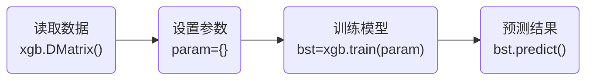

# 0 sklearn 入门

scikit-learn，又写作sklearn，是一个开源的基于python语言的机器学习工具包。它通过NumPy, SciPy和 Matplotlib等python数值计算的库实现高效的算法应用，并且涵盖了几乎所有主流机器学习算法。


# 1 决策树

## 1.1 概述

**决策树的工作方式**

决策树（decision tree）是一种**非参数**的**有监督学习**方法，它能够从一系列有特征和标签的数据中总结出决策规则，并用树状图的结构来呈现这些规则，以解决分类和回归问题。

> - 非参数：不需要对数据进行太大预处理操作，可以处理绝大多数数据结构
> - 有监督学习：需要为数据集添加标记标签

决策树算法本质上是一种图结构，我们只需要问一系列问题就可以对数据进行分类，例如下面这组数据集，这是一系列已知物种以及所属类别的数据：


现在，我们将动物们分为哺乳类和非哺乳动物，那么根据上面的数据集，我们可以得到下面的决策树：


在这颗决策树中，最初的问题[体温=？]叫做**根节点**，在得到结论前的每个问题都是**中间节点**，而得到的每个结论都是叶子节点

> 决策树算法的<u>两个核心问题</u>：
>
> 1. 如何从数据表中找出最佳节点和最佳分支
> 2. 如何让决策树停止生长，防止过拟合


## 1.2 sklearn 中的决策树

sklearn 中的决策树的类都在 "tree" 这个模块之下，这个模块总共包含五类：

| 类                         | 说明                                    |
| -------------------------- | --------------------------------------- |
| tree.DecisionTreeClassifier | 分类树                                  |
| tree.DecisionTreeRegressor | 回归树                                  |
| tree.export_graphviz       | 将生成的决策树导出为 DOT 格式，画图专用 |
| tree.ExtraTreeClassfier    | 高随机版本的分类树                      |
| tree.ExtraTreeRegressor    | 高随机版本的回归树                      |

sklearn 建模的基本流程


流程对应的代码如下：

```python
from sklearn import tree

# 实例化，建立评估模型对象
clf = tree.DecisionTreeClassifier()
# 用训练集数据训练模型
clf = clf.fit(x_train, y_train)
# 导入测试集
result = clf.score(x_test, y_test)
```


## 1.3 DecisionTreeClassifier

```python
class sklearn.tree.DecisionTreeClassifier(
        *, 
        criterion='gini', 
        splitter='best', 
        max_depth=None, 
        min_samples_split=2, 
        min_samples_leaf=1, 
        min_weight_fraction_leaf=0.0, 
        max_features=None, 
        random_state=None, 
        max_leaf_nodes=None, 
        min_impurity_decrease=0.0, 
        min_impurity_split=None, 
        class_weight=None, 
        presort='deprecated', 
        ccp_alpha=0.0
)
```


### 1.3.1 criterion

为了将表格转化为一棵树，决策树需要找出最佳节点和最佳的分支方法，对于分类树而言，衡量的 "最佳" 的指标叫做 "不纯度"。通常而言，不纯度越低，决策树对训练集的拟合效果越好。

不纯度基于节点来计算，<u>树中每个节点都会有一个不纯度，并且子节点的不纯度一定是低于父节点的，换言之，在同一颗决策树中，叶子节点的不纯度一定是最低的</u>。

criterion 参数值有两类，分别代表着两种不同的计算方法，分别为：

1. `entropy`：使用信息熵（Entropy）来计算不纯度
   $$
   \begin{aligned}
   \operatorname{Entropy}(t) & =-\sum_{i=0}^{c-1} p(i \mid t) \log _2 p(i \mid t)
   \end{aligned}
   $$

   > 其中 $p(i|t)$ 代表标签分类 $i$ 在节点 $t$ 上的占比

2. `gini`：使用基尼系数（Gini Impurity）来计算不纯度
   $$
   \begin{aligned}
   \operatorname{Gini}(t) & =1-\sum_{i=0}^{c-1} p(i \mid t)^2
   \end{aligned}
   $$

   > 当使用信息熵时，sklearn 实际计算的是基于信息熵的信息增益（Information Grain），即父节点和子节点的信息熵之差


> [!tip]
>
> 基尼系数 VS 信息熵
>
> - 相较于基尼系数，信息熵对不纯度更加敏感，对不纯度的惩罚更强。然而，在实际使用过程中，信息熵和基尼系数的效果基本相同
>
> - 由于信息熵存在对数运算，因此信息熵的计算比基尼系数更缓慢
> - 对于高纬度或者 ==noise== 很多的数据，信息熵很容易出现过拟合，基尼系数在这种情况下效果较好

| 参数               | criterion                                                    |
| ------------------ | ------------------------------------------------------------ |
| 如何影响模型?      | 确定不纯度的计算方法，帮忙找出最佳节点和最佳分枝，不纯度越低，决策树对训练集 的拟合越好 |
| 可能的输入有那些？ | 不填默认基尼系数，填写gini使用基尼系数，填写entropy使用信息增益 |
| 怎样选取参数？     | 通常就使用基尼系数<br/>数据维度很大，噪音很大时使用基尼系数<br/>维度低，数据比较清晰的时候，信息熵和基尼系数没区别 当决策树的拟合程度不够的时候，使用信息熵<br/>两个都试试，不好就换另外一个 |

决策树分支的基本流程


决策树停止生长条件：

1. 没有更多的特征可用
2. 整体的不纯度指标已经最优


**示例代码**

```python
# import pandas as pd
# 导入树模块
from sklearn import tree
# 从sklearn的数据集中导入红酒数据模块
from sklearn.datasets import load_wine
# 导入测试集划分模块
from sklearn.model_selection import train_test_split
# 导图图表工具
import graphviz

# 导入数据集, 此时 wine 是一个对象, 对象中包含 data, frame, target_names, target 等属性
# win.data: 特征空间
# wine.target: 标记空间
# wine.feature_names: 特征属性集
# wine.target_names: 样本标记集
wine = load_wine()
# 将数据丢入测试划分模型，test_size 表示 测试集比训练集的大小
Xtrain, Xtest, Ytrain, Ytest = train_test_split(wine.data, wine.target, test_size=0.3)
# 实例化评估模型
clf = tree.DecisionTreeClassifier(criterion="entropy")
# 训练模型
clf = clf.fit(Xtrain, Ytrain)
# 使用接口导出模型的精度
score = clf.score(Xtest, Ytest)

feature_name = ['酒精', '苹果酸', '灰', '灰的碱性', '镁', '总酚', '类黄酮', '非黄烷类酚类', '花青素', '颜色强度',
                '色调', '稀释葡萄酒', '脯氨酸']

dot_data = tree.export_graphviz(clf
                                ,out_file=None
                                ,feature_names=feature_name
                                ,class_names=["琴酒", "雪梨", "贝尔摩德"]
                                ,filled=True
                                ,rounded=True)
graph = graphviz.Source(dot_data.replace('helvetica', 'Microsoft YaHei'), encoding='utf-8')
graph.view()
```

```python
# 特征重要程度
clf.feature_importances_
# 将重要度与特征参数联系起来
list(zip(feature_name, clf.feature_importances_) 或者 [*zip(feature_name, clf.feature_importances_]
```


### 1.3.2 random_state & spliter

在前面的代码中，我们会发现 score 的值运行不稳定，原因在于决策树在建树时，是靠优化节点来追求一颗优化的树，但是最优的节点不一定能保证得到最优的树，所以 sklearn 采取集成算法，通过建更多不同的树，从中取最好的。如何保证建不同的树，sklearn **采取的方法是每次分支时不使用全部特征，而是随机选取一部分特征，再从中选取不纯度相关指标最优的作为分支用的节点。**

在 `DecisionTreeClassifier` 方法中，`random_state` 都可以用来设置分支中的随机模式的参数，默认为 `None`，在高纬度表现更加明显，而低纬度，随机性几乎不会显现。

`spliter` 也是用来控制决策树中随机选项，输入值有如下两种：

- `best`： 决策树在分枝时虽然随机，但是还是会优先选择更重要的特征进行分枝
- `random`:  决策树在分枝时会更加随机，树会因为含有更多的不必要信息而更深更大，并因这些不必要信息而降低对训练集的拟合

> The strategy used to choose the split at each node. Supported strategies are “best” to choose the best split and “random” to choose the best random split.

```python
clf = tree.DecisionTreeClassifier(criterion="entropy"
                                  , random_state=30
                                  , splitter="random"
                                  )
```


### 1.3.3 剪枝参数

在不加限制的情况下，一颗决策树会持续生长直到衡量不纯度的指标最优或者没有更多特征可用为止，但这样的决策树往往会出现过拟合的现象。也就是说，训练出来的模型在训练集上表现很好，但是在测试集上却表现很糟糕。

为了让决策树具有更好的泛化性，我们需要对决策树进行剪枝。**剪枝策略对决策树的影响巨大，正确的剪枝策略是优化决策树算法的核心。**

- `max_depth`: 限制树的最大深度，超过设定深度的节点分支全部剪掉

  > [!note]
  >
  > 这是使用最为广泛的剪枝参数，特别是在高纬度低样本时特别有效，一般而言，从 3 开始使用
- `min_samples_leaf`: 一个节点在分支后的每个子节点都必须包含至少 min_samples_leaf 个训练样本，否则分支就不会发生。

  > [!note]
  >
  > 该参数一般搭配 `max_depth` 使用，在回归树中可以让模型变得更加平滑
  >
  > 该参数设置的太小会造成过拟合，设置的过大会组织模型学习数据
  >
  > 一般而言，建议从 5 开始使用
- `min_samples_split`: 一个节点必须要包含至少 min_samples_split 个训练样本，这个节点才允许被分支
- `max_features`: 直接限制分支时考虑的特征个数，超过限制个数的特征都会被舍弃，类似于 max_depth，但 max_features 是用来限制高纬度数据的过拟合参数，一般而言，建议使用 PCA、ICA 或者选择模块中的降维算法

  > [!note]
  >
  > max_features 的默认值 $\left[ \sqrt{n\_features} \right]$
- `min_impurity_decrese`: 限制信息增益的大小，当信息增益小于设定数值的分支时不会发生

  > [!warning]
  >
  > 该功能是在 0.19 版本中更新的功能，在 0.19 版本之前使用的事 `min_impurity_split`


如何确定每个参数需要填写的值？

我们可以通过确定超参数的曲线来进行判断，超参数的曲线是一条以超参数为横坐标，模型的度量为坐标线的曲线，它用来衡量不同超参数取值下模型的表现的线

```python
import matplotlib.pyplot as plt
test = []
for i in range(10):
    clf = tree.DecisionTreeClassifier(max_depth=i+1
                                      , criterion="entropy"
                                      , random_state=30)
    clf = clf.fit(Xtrain, Ytrain)
    score = clf.score(Xtest, Ytest)
    test.append(score)
plt.plot(range(1, 11), test, color='red', label="max_depth")
plt.legend()
plt.show()
```


## 1.4 重要属性和接口

**重要属性**

- `feature_importances_`: 查看各个特征对模型的重要性

**重要接口**

- `fit()`: 训练模型的接口
- `score()`: 得到训练模型的评分
- `apply()`: 输入测试集返回每个测试样本所在的叶子结点的索引
- `predict()`: 输入测试集返回每个测试样本的分类/回归结果

```python
# 返回每个测试样本所在叶子节点的索引
clf.apply(Xtest)

# 返回每个测试样本的分类回归结果
clf.predict(Xtest)
```


# 2 随机森林

## 2.1 集成算法概述

集成学习（ensemble learning）是时下非常流行的机器学习算法，它本身**不是一个单独的机器学习算法，而是通过在数据上构建多个模型，集成所有模型的建模结果**。基本上所有的机器学习领域都可以看到集成学习的身影，在现实中集成学习也有相当大的作用，它可以用来做<u>市场营销模拟的建模，统计客户来源，保留和流失，也可用来预测疾病的风险和病患者的易感性</u>。在现在的各种算法竞赛中，<u>随机森林，梯度提升树（GBDT），Xgboost</u>等集成算法的身影也随处可见，可见其效果之好，应用之广。

> [!note] 
>
> 集成算法会考虑多个评估器的建模结果，汇总之后得到一个综合的结果，**以此来获取比单个模型更好的回归或分类表现。**

多个模型集成成为的模型叫做集成评估器（ensemble estimator），组成集成评估器的每个模型都叫做基评估器（base estimator）。

通常而言，有三类集成算法：<u>装袋法（Bagging），提升法（Boosting）和stacking</u>。


bagging 的核心思想是**构建多个相互独立的评估器**，然后然后对其预测进行平均或多数表决原则来决定集成评估气的结果，代表算法是**随机森林算法**。

boosting 方法中，基评估器是相关的，是按顺序一一构建的，其核心思想是**结合弱评估器的力量一次次对难以评估的样本进行预测，从而构成一个强评估器**，代表算法是 **Adaboost 和梯度提升树**。


## 2.2 sklearn 中的集成算法

| 类                                 | 功能                                    |
| ---------------------------------- | --------------------------------------- |
| ensemble.AdaBoostClassifier        | AdaBoost分类                            |
| ensemble.AdaBoostRegressor         | Adaboost回归                            |
| ensemble.BaggingClassifier         | 装袋分类器                              |
| ensemble.BaggingRegressor          | 装袋回归器                              |
| ensemble.ExtraTreesClassfier       | Extra-trees分类（超树，极端随机树）     |
| ensemble.ExtraTreesRegressor       | Extra-trees回归                         |
| ensemble.GradientBoostingClassifier | 梯度提升分类                            |
| ensemble.GradientBoostingRegressor | 梯度提升回归                            |
| ensemble.IsolationForest           | 隔离森林                                |
| **ensemble.RandomForestClassfier** | **随机森林分类**                        |
| **ensemble.RandomForestRegressor** | **随机森林回归**                        |
| ensemble.RandomTreesEmbedding      | 完全随机树的集成                        |
| ensemble.VotingClassfier           | 用于不合适估算器的软投票/多数规则分类器 |


## 2.3 RandomForestClassifier

随机森林是 Bagging 集成算法中最具代表性，它的所有基评估器都是决策树。

```python
class sklearn.ensemble.RandomForestClassifier(
        n_estimators=100, 
        *, 
        criterion='gini', 
        max_depth=None, 
        min_samples_split=2, 
        min_samples_leaf=1, 
        min_weight_fraction_leaf=0.0, 
        max_features='sqrt', 
        max_leaf_nodes=None, 
        min_impurity_decrease=0.0, 
        bootstrap=True, 
        oob_score=False, 
        n_jobs=None, 
        random_state=None, 
        verbose=0, 
        warm_start=False, 
        class_weight=None, 
        ccp_alpha=0.0, 
        max_samples=None, 
        monotonic_cst=None
)
```

sklearn 中随机森林算法和决策树算法中有些参数所代表的含义是相同，单个决策树的准确率越高，随机森林的准确率也会越高，因而 bagging 算法是依赖于平均值或者少数服从多数的原则来决定集成结果的。


### 2.3.1 n_estimators

`n_estimatos` 代表森林中树的数量，即基评估器的数量，这个参数对随机森林模型的精确性影响是单调的，`n_estimators` 越大，模型的效果往往越好，但是由于任何模型都有决策边界，当 n_estimators 达到一定程度之后，随机森林的精确性往往不再上升或开始波动

> [!tip]
>
> `n_estimators` 并不是越大越好，该值越大，需要消耗的计算资源越大，训练时间也会变的很长，该值默认值为 10，在 jupyter 0.22 版本之后该值默认为 100


1. 导入所需的库

   ```python
   # 导入需要的随机森林模块
   from sklearn.ensemble import RandomForestClassifier
   # 导入红酒数据
   from sklearn.datasets import load_wine
   # 从划分模块中引入测试，训练接口
   # 导入测试集划分模块
   from sklearn.model_selection import train_test_split
   ```

2. 加载需要的数据集

   ```python
   wine = load_wine()
   
   # 特征空间数据
   wine.data
   # 样本标记空间数据
   wine.target
   ```

3. 建模后进行测试

   ```python
   X_train, X_test, Y_train, Y_test = train_test_split(wine.data, wine.target, test_size=0.3)
   # 实例化决策树和随机森林, 注意random_state用来固定随机树和随机森林, 但是固定随机森林不代表固定里面的每一棵树
   clf = DecisionTreeClassifier(random_state=0)
   rfc = RandomForestClassifier(random_state=0)
   
   clf = clf.fit(X_train, Y_train)
   rfc = rfc.fit(X_train, Y_train)
   score_c = clf.score(X_test, Y_test)
   score_r = rfc.score(X_train, Y_train)
   ```


一组 10 折交叉验证的效果对比

```python
from sklearn.model_selection import cross_val_score
import matplotlib.pyplot as plt

rfc = RandomForestClassifier(n_estimators=25)
rfc_s = cross_val_score(rfc, wine.data, wine.target, cv=10)

clf = DecisionTreeClassifier()
clf_s = cross_val_score(clf, wine.data, wine.target, cv=10)

plt.plot(range(1, 11), rfc_s, label='Random Forest')
plt.plot(range(1, 11), clf_s, label='Decision Tree')
plt.legend()
plt.show()
```


十组 10 折交叉验证的效果对比

```python
from sklearn.model_selection import cross_val_score
import matplotlib.pyplot as plt

rfc_l = []
clf_l = []
for i in range(10):
    rfc = RandomForestClassifier(n_estimators=25)
    rfc_s = cross_val_score(rfc, wine.data, wine.target, cv=10).mean()
    rfc_l.append(rfc_s)
    clf = DecisionTreeClassifier()
    clf_s = cross_val_score(clf, wine.data, wine.target, cv=10).mean()
    clf_l.append(clf_s)

plt.plot(range(1, 11), rfc_l, label='Random Forest')
plt.plot(range(1, 11), clf_l, label='Decision Tree')
plt.legend()
plt.show()
```


### 2.3.2 random_state

随机森林本质上是一种装袋集成算法（bagging），装袋集成算法是对基评估器的预测结果进行平均或用多数表决原则来决定评估器的结果。

由于装袋法的这种特性，如果随机森林中所有的树的判断结果都是一致的，那么无论随机森林采用何种集成原则来求结果，都应该无法比单颗决策树的效果更好，但为什么我们使用了一样的 DecisionTreeClassifier，一样的参数、测试集和训练集，可随机森林的众多树会有不同的结果？

原因：sklearn 中的分类树 DecisionTreeClasifier 自带随机性。与决策树相同，随机森林也有 random_state 参数，只不过<u>在分类树中， random_state 只控制生成一棵树，而随机森林中的 random_state 控制的是生成森林的模式</u>。

```python
# 查看森林中树的状况
clf = clf.fit(X_train, Y_train)
rfc = rfc.fit(X_train, Y_train)

for i in range(len(rfc.estimators_)):
    print(rfc.estimators_[i].random_state)
```

> 用 bagging 算法时，其分类器应当是相互独立的，且随机性越大越好


### 2.3.3 bootstrap & oob_score

要让基分类器尽量都不一样，一种很容易理解的方法是使用不同的训练集来进行训练，而袋装法正是通过有放回的 随机抽样技术来形成不同的训练数据，bootstrap 就是用来控制抽样技术的参数。

**bootstrap 参数默认True，代表采用这种有放回的随机抽样技术。**通常，这个参数不会被我们设置为 False。


有放回抽样也存在一些问题，例如部分样本可能会被多次重复抽中，而另一些样本则有可能被忽略。一般而言，自助集大约平均会包含 63% 的原始数据，因为每一个样本被抽到某个自助集中的概率为：
$$
\underset{n\rightarrow \infty}{\lim}\left( 1-\left( 1-\small{\frac{1}{n}} \right) ^n \right) \approx 0.632
$$
因此，会有 37% 的训练数据会被浪费掉，没有参与建模，这些数据会被成为袋外数据（out of bag data， oob）。除了我们最开始就划分好的测试集外，这些数据也可以被用来作为集成算法的测试集。**换言之，在使用随机森林时，我们可以不用划分测试集和训练集，只需要使用袋外数据来测试我们的模型即可。**

> [!warning]
>
> 当然这是建立在样本数据 n 的值足够大的情况下，当 n 较小时，训练数据也可能全部参与建模

如果希望用袋外数据来测试，则需要在实例化时就将 oob_score 这个参数调整为 True，训练完毕之后，我们可以用 随机森林的另一个重要属性：oob_score_ 来查看我们的在袋外数据上测试的结果：

```python
# 无需划分训练集和测试集
rfc = RandomForestClassifier(n_estimators=25, oob_score=True)
rfc.fit(wine.data, wine.target)

# 通过 oob_score_ 来查看我们在袋外数据上测试的结果
r_score = rfc.oob_score_
```


### 2.3.4 重要属性和接口

除了前面的 `n_estimators`、`random_state`、`bootstrap`、`oob_score` 四大参数之外，还介绍了 `.estimators_` 和 `.oob_score_` 这两个重要属性，当然随机森林也有 `.feature_importances_` 这个属性用来得到特征的重要性

常用接口如下：

- `apply`
- `fit`
- `predict`
- `score`
- `predict_proba`: 输入测试样本返回每个测试样本被分到每一类标签的概率，标签有几个分类就返回几个几个概率；如果是二分类问题，那么返回的数据大于 0.5 的，被分为 1，小于 0.5 的，被分为 0

```python
# 得到随机森林的特征重要性
rfc.feature_importances_

# 输入测试集得到每个样本所在叶子节点的索引
rfc.apply(X_test)

# 输入测试集得到每个样本在决策树最后的分类
rfc.predict(X_test)

# 输入测试样本返回每个样本被分到每一类样本的概率
rfc.predict_proba(X_test)
```


> [!note]
>
> Baging 的要求除了要求评估器尽量保持相互独立外，还有一个必要条件就是<u>基分类器的判断准确率至少要超过随机分类器</u>，也就是说基分类器的判断准确率至少要超过 50%


## 2.4 偏差和方差

一个集成模型(f)在未知数据集(D)上的泛化误差E(f:D)，由方差(var)，偏差(bias)和噪声($\varepsilon$)共同决定。
$$
E(f;D)=bias^2(x)+var(x)+\varepsilon^2
$$
:question:**区分偏差和方差**

如下图所示，每个红点就是集成算法中的一个基评估器产生的预测值。红色虚线代表这些预测值的均值，而蓝色线则代表这些数据本来的面貌。

- 偏差：**模型的预测值与真实值之间的差异**，即每一个红点到蓝线的距离。在集成算法中，每个基评估器都有自己的偏差，集成评估器的偏差是所有基评估器偏差的均值。**模型越精确，偏差越低。**
- 方差：模型每一个输出结果与模型预测值的平均水平之间的误差，即每一个红点到红色虚线的距离，**衡量的是模型的稳定性**。模型越稳定，方差越低。


总而言之，<b style="color:orange">偏差衡量的是模型预测的准确性，方差衡量的是模型预测的稳定性</b>。

|            | 偏差大                                                       | 偏差小                                                       |
| ---------- | ------------------------------------------------------------ | ------------------------------------------------------------ |
| **方差大** | 模型不适合这个数据<br />换模型                               | 过拟合<br />模型和复杂<br />对某些数据集预测很准确<br />对某些数据集预测很糟糕 |
| **方差小** | 欠拟合<br />模型相对简单<br />预测很稳定<br />但对所有的数据预测都不太准确 | 泛化误差小，是我们的目标                                     |

通常而言，方差和偏差有一个很大，泛化误差都会很大。然而，方差和偏差是此消彼长，不可能同时达到最小值。


我们调参的目的就是为了使得方差和偏差达到一个完美平衡，虽然这两个参数不能同时达到最小值，但是他们组成的泛化误差却可以有一个最低点，我们就是要寻找这个最低点。由于随机森林的基评估器本身拥有较低的偏差和较高的方差，因此决策树本身就是属于预测比较 "准确" 的模型，比较容易过拟合。**所以以随机森林为代表的装袋法的训练过程中旨在降低方差，即降低其复杂度，随机森林参数的默认设定都是假设模型本身在泛化误差最低点的右边。**

**RFC 参数设置**


**RFC 属性列表**


**RFC 接口列表**


## 3 机器学习调参思想

- 调参的目的：提升某个模型评估指标，例如对于随机森林来说，我们需要提升的是模型在未知数据上的准确率（由 score 或者 oob_score_）
- 影响因素：在机器学习中，我们用来衡量模型在未知数据上的准确率的指标，该指标叫做**泛化误差**（Genelization error）


:bell:**对泛化误差的解释**

当模型在未知数据（测试集或袋外数据）上表现糟糕，说明模型的泛化程度不够，泛化误差大，模型的效果不好。

观察下图，准确地描绘了泛化误差和模型复杂度的关系，当模型太复杂时，就会过拟合，当模型太简单，就会欠拟合。


对于树而言，树越茂盛，深度越深，枝叶越多，模型也就越复杂。而随机森林是以树模型为基础，所以随机森林也是天生复杂度高的模型。所以随机森林的参数都是朝一个目标：减少模型的复杂度，把模型往上图的左边移动，防止过拟合。

泛化误差的背后其实是 "偏方-方差困境"，原理简化如下：

1. 模型太复杂或者太简单，都会让泛化误差高，我们追求的是位于中间的平衡点
2. 模型太复杂就会过拟合，模型太简单就会欠拟合
3. 对树模型和树的集成模型而言，树的深度越深，枝叶越多，模型越复杂
4. 树模型和树的集成模型的目标，都是减少模型复杂度，把模型往图像的左边移动

**各参数对模型在未知数据上的评估性能的影响**

| 参数              | 对模型在未知数据上的评估性能的影响                           | 影响程度                 |
| ----------------- | ------------------------------------------------------------ | ------------------------ |
| n_estimators      | 提升至平稳，该参数不影响单个模型的复杂度                     | :star::star::star::star: |
| max_depth         | 有增有减，默认为最大深度，即最高复杂度，向复杂度降低的方向调 | :star::star::star:       |
| min_samples_leaf  | 有增有减，默认最小限制为1，即最高复杂度，向复杂度降低的方向调 | :star::star:             |
| min_samples_split | 有增有减，默认最小限制为2，即最高复杂度，向复杂度降低的方向调 | :star::star:             |
| max_features      | 有增有减，默认为auto，是特征总数的开方，位于中间复杂度，既可以向复杂度高的方向调，也可以向复杂度低的方向调 | :star:                   |
| criterion         | 有增有减，一般使用 gini                                      | 看具体情况而定           |


:pen:**训练：在乳腺癌数据集上进行建模**

1. 导入所需要的库

   ```python
   # 导入乳腺癌数据
   from sklearn.datasets import load_breast_cancer
   # 导入随机森林分类器
   from sklearn.ensemble import RandomForestClassifier
   # 导入自动调参工具（网格搜索）
   from sklearn.model_selection import GridSearchCV
   # 导入模型选择中的交叉验证
   from sklearn.model_selection import cross_val_score
   # 导入画图工具
   import matplotlib.pyplot as plt
   import pandas as pd
   import numpy as np
   ```

2. 导入数据

   ```python
   cancer_data = load_breast_cancer()
   # 得到数据矩阵的行数和列数, 其中 shape 是 numpy 中的函数
   cancer_data.data.shape
   # 得到矩阵的样本标记
   cancer_data.target
   # 得到特征空间
   cancer_data.data
   ```

   > [!warning]
   >
   > 乳腺癌数据为二分类（classes=2），特征值为正实数(real, positve)，维度为 30（dimensionality=30），样本总数为 569（samples total=569）

3. 进行一次简单建模，看看模型在数据集上的效果

   ```python
   rfc = RandomForestClassifier(n_estimators=100, random_state=90)
   score_pre = cross_val_score(rfc, cancer_data.data, cancer_data.target, cv=10).mean()
   print(score_pre)  # 0.9648809523809524
   ```

   > [!warning]
   >
   > 这里测试得到的分数表现还不错，但在现实的数据集上，基本不可能什么都不调

4. 随机森林调参的第一步：先对 `n_estimatos` 进行调参

   ```python
   score_l = []
   for i in range(0, 200, 10):
       # n_jobs=-1 表示会使用随机森林的全部内核
       rfc = RandomForestClassifier(n_estimators=i+1
                                    , n_jobs=-1
                                    , random_state=90
                                    )
       score = cross_val_score(rfc, cancer_data.data, cancer_data.target, cv=10).mean()
       score_l.append(score)
   print(max(score_l), (score_l.index(max(score_l)) * 10 + 1))  # 0.9631265664160402 71
   # 设置图像的长和宽
   plt.figure(figsize=(20, 5)
   plt.plot(range(1, 201, 10), score_l)
   plt.show()
   ```

   经过调参后得到跑出的得分曲线如下：

   

5. 明确好范围，进一步优化学习曲线，在这里最高点在 111 的位置处

   ```python
   score_l = []
   for i in range(65, 75):
       # n_jobs=-1 表示会使用随机森林的全部内核
       rfc = RandomForestClassifier(n_estimators=i
                                    , n_jobs=-1
                                    , random_state=90
                                    )
       score = cross_val_score(rfc, cancer_data.data, cancer_data.target, cv=10).mean()
       score_l.append(score)
   print(max(score_l), [*range(65, 75)][score_l.index(max(score_l))])  # 0.9666353383458647 73
   # 设置图像的长和宽
   plt.figure(figsize=(20, 5)
   plt.plot(range(65, 75), score_l)
   plt.show()
   ```

   测试结果如下：

   

   通过调整 n_estimators 后，效果提升显著，模型的交叉验证得分提升 0.003 左右

6. 在调整完 n_estimators 之后，我们进行网格搜索，我们使用网格所搜对参数一个个进行调整。

   > [!note]
   >
   > 不同时调整多个参数的原因：
   >
   > 1. 同时调整多个参数运行会非常缓慢
   > 2. 同时调整多个参数，会让我们无法理解参数的组合是怎么来的，即使网格搜索调出来的结果不好，我们也无从下手
   >
   > 因此，为了使用复杂度-泛化误差方法，我们需要对参数进行一个个的调整

   ```python
   """
   对于以下参数，需要我们看趋势从跑出结果的曲线中再选取一个更小的区间
   param_grid = {'n_estimators': np.arange(0, 200, 10)}
   param_grid = {'max_depth': np.arange(1, 20, 1)}
   param_grid = {'max_leaf_nodes: np.arange(25, 50, 1)}
   对于以下参数，我们可以找到一个范围，或者说我们知道他们的取值和随着他们的取值，模型的整体准确率会如何变化
   这样的参数我们可以直接跑网格搜索
   param_grid = {'criterion': ['gini', 'entropy']}
   param_grid = {'min_samples_split': np.arange(2, 2+20, 1)}
   param_grid = {'max_features': np.arange(5, 30, 1)}
   """
   ```

7. 开始按参数对模型整体准确率的影响程度进行调参，首先调整 max_depth

   ```python
   param_grid = {'max_depth': np.arange(1, 20, 1)}
   # 由于乳腺癌数据很小，所以我们采用1~10或者1~20这样的数据进行试探
   # 对于像 digit recongnition 这样的大型模型而言，我们应该从30~50层深度开始
   rfc = RandomForestClassifier(n_estimators=73
                                , random_state=90
                                )
   GS = GridSearchCV(rfc, param_grid, cv=10)
   GS.fit(cancer_data.data, cancer_data.target)
   
   print("the best_params_ is:", GS.best_params_)  # the best_params_ is: {'max_depth': np.int64(8)}
   print("the best_score_ is:", GS.best_score_)    # the best_score_ is: 0.9666353383458647
   ```

   我们可以看到最佳深度为 8，最佳分数为0.9666353383458647，和前面的几乎没有改变

8. 考虑到 max_depth、min_samples_split 等参数都是往模型复杂度降低的方向调整，所以我们可以考虑使用 max_features 参数进行调整

   ```python
   param_grid = {'max_features': np.arange(5, 29, 1)}
   rfc = RandomForestClassifier(n_estimators=73
                                , random_state=90
                                )
   GS = GridSearchCV(rfc, param_grid, cv=10)
   GS.fit(cancer_data.data, cancer_data.target)
   
   print("the best_params_ is:", GS.best_params_)  # the best_params_ is: {'max_features': np.int64(24)}
   print("the best_score_ is:", GS.best_score_)    # the best_score_ is: 0.9666666666666668
   ```

   可以看到 score 大小又提高了一点

9. 最后我们可以调整 criterion 来进行测试

   ```python
   param_grid = {'criterion': ['gini', 'entropy']}
   rfc = RandomForestClassifier(n_estimators=73
                                , random_state=90
                                , max_depth=24
                                )
   GS = GridSearchCV(rfc, param_grid, cv=10)
   GS.fit(cancer_data.data, cancer_data.target)
   
   print("the best_params_ is:", GS.best_params_)  # the best_params_ is: {'criterion': 'gini'}
   print("the best_score_ is:", GS.best_score_)    # the best_score_ is: 0.9666353383458647
   ```

   可以看到 score 反而下降了，还有一些其他参数我们也可以像上面的方法进行调参，从而得出最佳参数


> [!tip]
>
> API 接口参考文档：https://scikit-learn.org/stable/api/index.html


# 4 数据预处理和特征工程

## 4.1 概述

**数据挖掘的五大流程**


1. 获取数据
2. 数据预处理：是指从数据中检测、纠正或删除损坏、不准确、不适用于模型的记录的过程。
3. 特征工程：将原始数据转化为更能代表预测模型的潜在问题的特征的过程，可通过挑选最相关的特征，提取特征以及创造特征来实现。其中创造特征又经常以降维算法的方式来实现。
   - 可能遇到的问题：特征之间有相关性，特征与样本标记无关，特征太多或太少
   - 特征工程的目的：(1)降低计算成本; (2)提升模型上限
4. 建模，测试模型并预测结果
5. 上线，验证模型效果


## 4.2 sklearn 中的数据预处理和特征工程

sklearn 官网就有两大版块是关于数据预处理和特征工程的


- preprocessing 模块：几乎包含数据预处理的所有内容
- impute 模块：填补缺失值专用
- feature_selection 模块：包含特征选择的各种方法的实践
- decomposition 模块：包含降维算法


数据预处理主要包括<u>无量纲化、缺失值处理</u>


## 4.3 数据无量纲化（dimensionless）

在机器学习算法实践中，我们需要将不同规格的数据转换到同一规格，或不同分布的数据转换到某个特定分布的需求，这种需求统称为 "无量纲化"，例如：

1. 梯度和矩阵为核心的算法中，像<u>逻辑回归、支持向量机、神经网络、无量纲化</u>可以加快求解速度
2. 在距离类模型，例如 <u>K 近邻、K-Means 聚类</u>中可以提升模型精度，避免某一个取值范围特别大的特征会对距离计算造成影响

数据的无量纲化可以是线性的，也可以是非线性的。

1. 线性：
   - 去中心化（Zero-centered / Mean-subtraction）：让所有记录减去一个固定值，即让数据样本平移到某个为止
   - 缩放处理（Scale）：除以一个固定值，将数据固定在某个范围内
2. 非线性


### 4.3.1 preprocessing.MinMaxScaler

当数据 x 按照最小值中心化，再按极差（最大值 - 最小值）缩放，数据移动了最小值个单位，并且会被收敛到 [0, 1] 之间，而这个过程就叫做数据归一化（Normalization，又称为 Min-Max Scaling）

> [!warning]
>
> Noramlization 是归一化，不是正则化（regularization）；归一化是数据预处理的一种手段，而正则化则不是

归一化后的数据服从正则分布，公示如下：
$$
x^* = \frac{x-min(x)}{max(x)-min(x)}
$$
在 sklearn 中，我们使用 preprocessing.MinMaxScaler 来实现这个功能。MinMaxScaler 有一个重要参数 feature_range，控制我们希望把数据压缩到范围，默认是 [0, 1]

```python
from sklearn.preprocessing import MinMaxScaler

data = [[-1, 2], [-0.5, 6], [0, 10], [1, 18]]

"""
    # 以二维数据表的形式打印显示出来
    import pandas as pd
    df = pd.DataFrame(data)
    print(df)
"""

# 实现归一化
scaler = MinMaxScaler()
scaler = scaler.fit(data)  # 这里本质上是生成 min(x) 和 max(x)
result = scaler.transform(data)
"""
训练和转化过程可以一步到位
 result_ = scaler.fit_transform(data)
"""

inverse_result = scaler.inverse_transform(result)  # 将归一化的结果进行逆转

# 使用 MinMaxScaler 的参数 feature_range 实现将数据归一化到 [5, 10] 范围内
scaler_param = MinMaxScaler(feature_range=[5, 10])
result_param = scaler.fit_transform(data)

# 当数据集 x 中的特征数量非常多时，fit 由于数据量过大会报错
# 此时我们可以使用 partial_fit 作为训练接口
# scaler = scaler.partial_fit(data)
```


:pick:**BONUS：使用 numpy 实现归一化**

```python
import numpy as np
X = np.array([[-1, 2], [-0.5, 6], [0, 10], [1, 18]])

# 归一化
X_nor = (X - X.min(axis=0)) / (X.max(axis=0) - X.min(axis=0))

# 逆转归一化
X_returned = X_nor * (X.max(axis=0) - X.min(axis=0)) + X.min(axis=0)
```


### 4.3.2 preprocessing.StandardScaler

当数据 $x$ 按均值 $\mu$ 去中心化后，再按标准差 $\sigma$ 进行缩放，数据就会服从为均值为 0 ，方差为 1 的正态分布（即标准分布），而这个过程，就叫做**数据标准化**（Standardization，又称为Z-score normalization），公式如下：
$$
x^*=\frac{x-\mu}{\sigma}
$$

```python
from sklearn.preprocessing import StandardScaler
data = [[-1, 2], [-0.5, 6], [0, 10], [1, 18]]

# 实例化
scaler = StandardScaler()
# 本质上是生成均值和方差
scaler.fit(data)

# 查看均值属性 mean_
print(scaler.mean_)
# 查看方差属性 var_
print(scaler.var_)

# 通过接口导出数据标准化后的结果
x_std = scaler.transform(data)
# 使用 mean() 查看均值
print(x_std.mean())
# 使用 std() 查看方差
print(x_std.std())

# 使用 fit_transform(data)一步到位，相当于先fit后再进行transform
scaler.fit_transform(data)

# 使用 inverse_transform 逆标准化
scaler.inverse_transform(x_std)
```

对于 StandardScaler 和 MinMaxScaler 来说，空值 None 会被当做是缺失值，在 fit 的时候会忽略，在 transform 的时候保持缺失 NaN 状态。

去量纲化过程不是具体的算法，但是在 fit 接口中，依然只允许导入至少二维数组，如果导入一位数组会报错

```ABAP
ValueError: Expected 2D array, got 1D array instead
```


### 4.3.3 StandardScaler 和 MinMaxScaler 的选择

由于 MinMaxScaler 对异常值非常敏感，所以在大多数机器学习算法中，会选择 StandardScaler 进行特征缩放。

在 <u>PCA、聚类、逻辑回归、支持向量机、神经网络</u>这些算法中，StandardScaler 往往是最好的选择。

MinMaxScaler 在不涉及<u>距离向量、梯度、协方差计算以及数据需要被压缩到特定区间</u>时使用广泛，例如数字图像处理中量化像素强度时，都会使用 MinMaxScaler 将数据压缩到 [0, 1] 区间中。

除了 StandardScaler 和 MinMaxScaler 之外，sklearn 中也提供了其他的缩放处理，例如：

- 需要压缩数据，却不影响数据的稀疏性（不影响矩阵中 0 的个数）—— MaxAbsScaler
- 异常值多，噪声非常大 —— RobustScaler

详情如下：


> [!tip]
>
> sklearn 中不提供<b style="color: green">中心化数据</b>操作，因为中心化数据只需要 pandas 广播减去某个数即可


## 4.4 缺失值处理

机器学习和数据挖掘中所使用的数据，永远不可能是完美的。在数据挖掘过程中，通常会存在重要的字段缺失值很多，但又不能舍弃字段的情况。因此，数据预处理中非常重要的一项就是处理缺失值。

```python
import pandas as pd
# index_col 表示选取那一列作为索引，同时这一列不参与特征计算
data = pd.read_csv(r'D:\Document\PyProject\exercise\data\Narrativedata.csv', index_col=0)
# data.head() 表示取出数据前几行，默认是前 5 行
print(data.head())
```


### 4.4.1 impute.SimpleImputer

```python
class sklearn.impute.SimpleImputer(*, missing_values=nan, strategy='mean', fill_value=None, copy=True, add_indicator=False, keep_empty_features=False)
```

> Replace missing values using a descriptive statistic (e.g. mean, median, or most frequent) along each column, or using a constant value.


**参数如下**：

| 参数           | 含义&输入                                                    |
| -------------- | ------------------------------------------------------------ |
| missing_values | 告诉 SimpleImputer，数据中的缺失值长什么样，默认为空值 np.nan |
| strategy       | 填补缺失值的策略，默认均值<br />输入 "mean" 使用均值填补（仅对数值型特征可用）<br />输入 "median" 用中值填补（仅对数值型特征可用）<br />输入 "most_frequent" 用众数填补（对数值型和字符特征特征都可用）<br />输入 "constant" 表示请参考参数 "fill_value" 中的值（对数值型和字符型特征都可用） |
| fill_value     | 当参数 strategy 为 "constant" 的时候可用，可输入字符串或数字表示要填充的值，常用 0 |
| cpoy           | 默认为 True，将创建特征矩阵的副本，反之则会将缺失值填补到原本的特征矩阵中 |

**示例代码**

```python
# 查看数据的详细信息
data.info()
"""
    <class 'pandas.core.frame.DataFrame'>
    Index: 891 entries, 0 to 890
    Data columns (total 4 columns):
     #   Column    Non-Null Count  Dtype  
    ---  ------    --------------  -----  
     0   Age       714 non-null    float64
     1   Sex       891 non-null    object 
     2   Embarked  889 non-null    object 
     3   Survived  891 non-null    object 
    dtypes: float64(1), object(3)
    memory usage: 34.8+ KB
    None
"""
```

查看上述信息，本来实体一共有 891，但是在 age 那一列数据缺失比较多，所以我们接下来打算填补 age 这一列的数据值

```python
# 填补年龄
# 1. 首选我们需要取出年龄这一列的数据，但保证矩阵仍然是一个二维的
# 取出 Age 字段索引的这一列，并且将其转换为一列，其中 -1 表示自动转换，如果原数据矩阵为 m*n，那么转化后行数=m*n/1
Age = data.loc[:, "Age"].values.reshape(-1, 1)  # 注意：转化后的数据仍然为二维的

from sklearn.impute import SimpleImputer
# 实例化 1，默认值以均值填补
imp_mean = SimpleImputer()
# 实例化 2，使用中位数填补
imp_median = SimpleImputer(strategy="median")
# 实例化 3，使用 0 进行填补
imp_0 = SimpleImputer(strategy="constant", fill_value=0)

# 使用 fit_transform 一步转化
imp_mean = imp_mean.fit_transform(Age)
imp_median = imp_median.fit_transform(Age)
imp_0 = imp_0.fit_transform(Age)

print(imp_mean[:20])
print("--------------------")
print(imp_median[:20])
print("--------------------")
print(imp_0[:20])

# 在这里我们使用中位数填补 Age
data.loc[:, "Age"] = imp_median

# 再次查看具体数据
print(data.info())
"""
    <class 'pandas.core.frame.DataFrame'>
    Index: 891 entries, 0 to 890
    Data columns (total 4 columns):
     #   Column    Non-Null Count  Dtype  
    ---  ------    --------------  -----  
     0   Age       891 non-null    float64
     1   Sex       891 non-null    object 
     2   Embarked  889 non-null    object 
     3   Survived  891 non-null    object 
    dtypes: float64(1), object(3)
    memory usage: 34.8+ KB
    None
"""
```

再填补完 Age 字段信息后再来填补 Embarked 字段的信息

```python
# 使用众数填补 Embarked
Embarked = data.loc[:, "Embarked"].values.reshape(-1, 1)
imp_fre = SimpleImputer(strategy="most_frequent")

imp_fre = imp_fre.fit_transform(Embarked)
data.loc[:, "Embarked"] = imp_fre

print("---------**************------------------")
print(data.info())
```


**BONUS: 用 Pandas 和 Numpy 进行填补的方式**

```python
import pandas as pd
data = pd.read_csv(r'D:\Document\PyProject\exercise\data\Narrativedata.csv', index_col=0)

# fillna 在 DataFrame 里面直接进行填补
data.loc[:, "Age"] = data.loc[:, "Age"].fillna(data.loc[:, "Age"].median())

data.dronpna(axis=0, inplace=True)
# .dropna(axis=0) 表示删除所有有缺失值的行，.dropna(axis=1) 表示删除所有有缺失值的列
# inplace 参数为 True 表示在原数据集上进行修改，为 False 表示生成一个复制对象，不修改原数据，默认为 False
```


## 4.5 处理分类特征：编码与哑变量

在机器学习中，大多数算法，譬如逻辑回归、支持向量机 SVM， k 近邻算法等都只能处理数值型数据，不能处理文字，但是在 sklearn 中，除了专用来处理文字的算法，其他算法在 fit 的时候全部要求输入数组或矩阵，也不能导入文字型数据。

> [!warning]
>
> 虽然手写决策树和朴素贝叶斯可以处理文字，但是 sklearn 中规定必须要导入数值型模型

然而，在现实生活中，许多标签和特征在数据收集完毕的时候，都不是以数字来表现的，例如付款的方式可能包含 ["支付宝", "现金", "微信"]。

在这种情况下，为了让数据适应算法和库，我们必须要将数据进行编码，换言之，**将文字型数据转换为数值型**。


### 4.5.1 preprocessing.LabelEncoder

该函数为标签专用，能够将分类转换为分类数值（只能转换为 0 和 1）

```python
from sklearn.preprocessing import LabelEncoder
import pandas as pd

data = pd.read_csv(r'D:\Document\PyProject\exercise\data\Narrativedata.csv', index_col=0)

# 下面表示的是取出最后一列所有的行
y = data.iloc[:, -1]

# 实例化
le = LabelEncoder()
# 导入数据
le = le.fit(y)
print(le)
# 调入接口转换数据
label = le.transform(y)
print(label)

# attribute.classes_ 用来查看标签中的类别数
print(le.classes_)

# fit 和 transform 操作可以直接一步到位
le.fit_transform(y)
# 使用 inverse_transform 可以进行逆转化
le.inverse_transform(label)

# 让标签等于我们运行出来的结果
data.iloc[:, -1] = label
```

```python
# 缩减写法，直接一步将最后一列数据转换为数字类型
data.iloc[:, -1] = LabelEncoder().fit_transform(data.iloc[:, -1])
```


### 4.5.2 processing.OrdinalEncoder

该函数为特征专用，能够将分类特征转换为分类数值

```python
# 复制一份数据
from sklearn.preprocessing import OrdinalEncoder
data_ = data.copy()
# 查看第二列到最后一列的样本分类
print(OrdinalEncoder().fit(data_.iloc[:, 1: -1]).categories_)
data_.iloc[:, 1:] = OrdinalEncoder().fit_transform(data_.iloc[:, 1:])
print(data_.head())
```


### 4.5.3 preprocessing.OneHotEncoder

**独热编码，创建哑变量**

前面无论是 LabelEncoder 还是 OrdinalEncoder 都是将分类直接转化为对应的数字，但是忽略了分类之间的存在的联系，例如：

1. 舱门（S, C, Q）：这三种取值 S, C, Q 是相互独立的，彼此之间完全没有任何联系，即 $S \ne C \ne Q$ 的概念，这是<b style="color:orange">名义变量</b>

2. 学历（小学, 初中, 高中）：三种取值不完全独立，在性质上有 高中>初中>小学 这样的联系，学历有高低，但是学历取值之间却不是可以计算的，这是<b style="color:orange">有序变量</b>
3. 体重（>45kg, >90kg, >135kg）：各个取值之间有联系且可以相互计算，例如 135kg-90kg=45kg，分类之间可以通过数学计算相互转化，这是<b style="color:orange">有距变量</b>

然而我们在对特征进行编码的时候，这三种分类数据都会被我们转化为 [0, 1, 2]，但是如果我们这么分类，会忽略数字钟自带的数学性质，给算法传达一些不准确的信息，从而影响我们建模。

类 OrdinaEncoder 可以用来处理有序变量，但对于名义变量，我们只有使用哑变量（Dummy Variables）的方式来处理：

> [!tip]
>
> 什么是哑变量（Dummy Variables）?
>
> 哑变量（Dummy Variables）又称为指示变量（indicator variable），采用 0 和 1 来表示可能会改变结果的一些绝对效应的存在与否。例如对于性别，我们可以使用 0 代表女性，1 代表男性。


这样变化可以, 可以让算法彻底领悟，原来三个取值是没有可计算性质的，是 "有你就没有我" 的不等概念。例如性别和舱门都是这样的名义变量。因此，我们需要使用独热编码，将两个特征都转换为哑变量。

> [!tip]
>
> 什么是独热编码（One-Hot）?
>
> 在数字电路和机器学习中，One-Hot 是指一个 high(1) 和其他全是 low(0) 的二进制位的组合；同样地，One-Cold 就是一个 low(0) 和其他全是 high(1) 的二进制位的组合。


**示例代码**

```python
from sklearn.preprocessing import OneHotEncoder
import pandas as pd
data = pd.read_csv(r'D:\Document\PyProject\exercise\data\Narrativedata.csv', index_col=0)
# 取出数据中的第二列到倒数第二列，即 Sex,Embarked 这两列
X = data.iloc[:, 1: -1]

# 实例化，categories='auto' 表示自动识别每个标签类别个数
enc = OneHotEncoder(categories='auto').fit(X)
result = enc.transform(X).toarray()
# print(pd.DataFrame(result))
# 上述代码也可以简化为：OneHotEncoder(categories='auto').fit_transform(X).toarray()
# 还原代码：pd.DataFrame(enc.inverse_transform(result)

# 获取独热编码的特征名: enc.get_feature_names_out()
# axis=1，表示跨行进行合并，也就是将量表左右相连；如果 axis=0，就是将量表上下相连
new_data = pd.concat([data, pd.DataFrame(result)], axis=1)

# 删除列名为 Sex 和 Embarked 的这两列
new_data.drop(['Sex', 'Embarked'], axis=1, inplace=True)

# 修改列名，其中结合前面的 enc.get_feature_names_out() 来查看使用独热编码的列名
new_data.columns = ['Age', 'Survived', 'Sex_female', 'Sex_male', 'Embarked_C', 'Embarked_Q', 'Embarked_S', 'Embarked_nan']
print(new_data.head())
```

除了特征可以做哑变量外，标签也可以做哑变量，我们可以使用类 sklearn.preprocessing.LabelBinarizer 对标签做哑变量，许多算法都可以处理多标签问题（例如决策树），但这样的方法在现实中不常见。


BONUS：数据类型以及常见的统计量


## 4.6 处理连续型特征：二值化与分段

### 4.6.1 sklearn.preprocessing.Binarizer

根据阈值将数据二值化（将特征值设置为 0 或者 1），用于处理连续型变量。

- $>threshold$: 将其值映射为 1
- $\le threshold$：将其值映射为 0

二值化值对文本计数数据的常见操作，通常用来代表某种现象的存在与否，它还可以用作考虑布尔随机变量的估计器的预处理步骤，例如使用贝叶斯设置中的伯努利分布进行建模。

```python
# 下面我们将对数据中的年龄进行二值化
from sklearn.preprocessing import Binarizer
import pandas as pd


data = pd.read_csv(r'D:\Document\PyProject\exercise\data\Narrativedata.csv', index_col=0)
# 首先删除第一列中所有 Age=nan 的行
data.dropna(axis=0, how='any', inplace=True)
# 取出数据的 Age 一列，并将该列的值取出来重塑为一列
X = data.iloc[:, 0].values.reshape(-1, 1)

# 实例化 Binarizer 分类器，并设置阈值为 30
transformer = Binarizer(threshold=30).fit_transform(X)
# 查看转换后的数据结果
print(transformer)
```


### 4.6.2 preprocessing.KBinsDiscretizer

该类用于将连续型变量划分为分类变量的类，能够将连续型变量排序后按顺序分箱后编码。总共包含三个重要参数：

> [!tip]
>
> - 连续变量（Continuous Variables）：是指可以取无限多个值的变量，这些值通常是数值，并且在一定范围内是连续的，例如身高、体重等
> - 分类变量（Categorical Variables）：是指取值有限且离散的变量，这些取值通常表示不同的类别或分类
>   - 名义变量（Nominal Variables）：没有内在顺序的分类变量，例如性别（男、女）
>   - 有序变量（Ordinal Variables）：具有内在顺序的分类变量，例如教育水平（小学、中学、大学）、满意度（不满意、一般、满意）

| 参数     | 含义&输入                                                    |
| -------- | ------------------------------------------------------------ |
| n_bins   | 每个特征中分箱的个数，默认5，一次会被运用到所有导入的特征    |
| encode   | 编码的方式，默认 "onehot"<br />"onehot": 做哑变量，之后返回一个稀疏矩阵，每一列是一个特征中的一个类别，含有该类别的样本表示为 1，不含的表示为 0<br />"ordinal": 每个特征的每个箱都被编码为一个整数，返回每一列是一个特征，每个特征下含有不同整数编码的箱的矩阵<br />"onehot-dense": 做哑变量，之后返回一个密集数组 |
| strategy | 用来定义箱宽的方式，默认 "quantile"<br />"uniform": 表示等宽分箱，即每个特征中每个箱的最大值之间的差为(feature.max() - feature.min())/(n_bins)<br />"quantile": 表示等位分箱，即每个特征中的每个箱内的样本数量都相同<br />"kmeans": 表示按聚类分箱，每个箱中的值到最近的一维 k 均值聚类的簇心的距离都相同 |

**示例代码**

```python
from sklearn.preprocessing import KBinsDiscretizer
import pandas as pd

data = pd.read_csv(r'D:\Document\PyProject\exercise\data\Narrativedata.csv', index_col=0)
data.dropna(axis=0, how='any', inplace=True)
X = data.iloc[:, 0].values.reshape(-1, 1)


est = KBinsDiscretizer(n_bins=3, encode='ordinal', strategy='uniform')
est.fit_transform(X)

# 查看转换后分的箱，其中 ravel() 函数用来降维，set 用来降重
print(set(est.fit_transform(X).ravel()))

print('---------------------------------')
# 实例化另一种编码方式为onehot的KBins分类器
est = KBinsDiscretizer(n_bins=3, encode='onehot', strategy='uniform')
# 查看转换后分的箱：变成哑变量
print(est.fit_transform(X))

# toarray() 用于将稀疏矩阵转换为幂零矩阵
print(est.fit_transform(X).toarray())
```


# 5 特征选择

当数据预处理（data processing）完成后，我们就要开始进行特征工程（Feature Engineering）

| 特征提取<br />（feature_extraction）                         | 特征创造<br />（feature_creation）                           | 特征选择<br />(feature_selection)                            |
| ------------------------------------------------------------ | ------------------------------------------------------------ | ------------------------------------------------------------ |
| 从文字，图像，声音等其他非结构化数据中提取新信息作为特征。比如说，从淘宝宝贝的名称中提取出产品类别，产品颜色，是否是网红产品等 | 把现有特征进行组合，或互相计算，得到新的特征。比如说，我们有一列特征是速度，一列特征是距离，我们就可以通过让两列相处，创造新的特征：通过距离所花的时间 | 从所有的特征中，选择出有意义，对模型有帮助的特征，以避免必须将所有特征都导入模型去训练的情况。 |


# 6 sklearn 中的降维算法

## 6.1 维度概述

<b style="color:green">对于数组和 Series 而言，维度即 shape 功能返回的结果，shape 中返回了多少个数字就是几维。</b>

索引以外的数据，不分行列的叫一维，有行列之分的叫做二维，也称为表。一张表最多二维，复数的表构成了更高的维度。当一个数组中存在 2 张 3 行 4 列的表时，shape 返回的是 (更高维, 行, 列)。当数组中存在 2 组 2 张 3 行 4 列的表时，数据就是 4 维，shape 返回的是 (2, 2, 3, 4)


数组中的每一张表，都可以是一个特征矩阵或是一个 DataFrame，这些结构永远只有一张表，所以一定有行列，其中行是样本，列是特征。一般而言，维度指的都是特征的数量。

随机森林通过随机抽取若干特征来建树，就是避免高维计算，特征选择的目的是通过降维来降低算法的计算成本，这里面的 "降维" 指的是减少特征的个数。除此之外，降维还有一个目的是能够**数据可视化**，对于三维及以下的特征矩阵，是可以被可视化的，这样有助于帮助我们理解数据的分布。


## 6.2 sklearn 中的降维算法

sklearn 中降维算法都被包括在模块 decomposition 中，这个模块本质是一个矩阵分解模块。矩阵分解可以用在<u>降维、深度学习、聚类分析、数据预处理、低纬度特征学习、推荐系统、大数据分析</u>等领域。


SVD 和主成分分析 PCA 都属于矩阵分解算法中的入门算法，都是通过分解特征矩阵来进行降维。


## 6.3 PCA 和 SVD

在降维过程中，我们会减少特征的数量，这意味删除数据，数据量变少则表示模型可以获取的信息变少，模型的表现可能会因此受到影响。

同时，在高维数据中，必然存在一些特征是不带有效信息的，或者有一些特征带有的信息和其他一些特征是重复的（例如可能会存在线性相关）。

我们希望在降维的过程中，能够减少特征的数量，又保留大部分有效信息，可以的做法有将那些带有重复信息的特征合并，并删除那些带无效信息的特征，最后逐渐创造出能够代表原特征矩阵大部分信息的、特征更少的新特征矩阵。

PCA 去除无效信息的特征的方法为<b style="color:orange">方差过滤</b>，方差越小，则意味着这个特征上很有可能大量取值都相同，那么该特征的取值对于整个模型而言就没有区分度，反之，方差越大则说明这个特征上带有大量的信息。

PCA 使用的信息量衡量指标，就是样本方差，又称为可解释性方差，方差越大，特征所带的信息量就越多。
$$
\operatorname{var}=\frac{1}{n-1} \sum_{i=1}^n\left(x_i-\hat{x}\right)^2
$$
其中，$var$ 代表一个特征的方差，$n$ 代表样本量，$x_i$ 代表一个特征中每个样本取值，$\hat{x}$ 代表这一列样本的均值，上面的公式是为了得到**样本方差的无偏估计**，用来消除系统误差。

**下面有一组简单的二维数据的降维示例**


我们可以看到，本来 $x_1$ 和 $x_2$ 数据都是一样的，我们将其放在坐标轴上，$(x_1, x_2)$ 作为坐标轴上的一个点，将组标轴逆时针旋转 $45^{\circ}$ 后，每个点的横坐标和纵坐标发生改变，改变后的每个点假设其为 $(x_1^*, x_2^*)$，其中 $x_1^*$ 的样本方差变成了 2，$x_2^*$ 的样本方差变成了 0，因此我们可以直接特征 $x_2^*$ 去除，仅保留特征 $x_1^*$

| 过程 | 二维特征矩阵                                                 | n维特征矩阵                                                  |
| ---- | ------------------------------------------------------------ | ------------------------------------------------------------ |
| 1    | 输入原数据，结构为 (3,2)<br />找出原本的2个特征对应的直角坐标系，本质<br />是找出这2个特征构成的2维平面 | 输入原数据，结构为 (m,n)<br />找出原本的n个特征向量构成的n维空间v |
| 2    | 决定降维后的特征数量：1                                      | 决定降维后的特征数量：k                                      |
| 3    | 旋转，找出一个新坐标<br />本质是找出2个新的特征向量，以及它们构成的新2维平面<br />新特征向量让数据能够被压缩到少数特征上，并且总信息量不损失太多 | 通过某种变化，找出n个新的特征向量，以及它们构成的新n维空间V  |
| 4    | 找出数据点在新坐标系上，2个新坐标轴上的坐标                  | 找出原始数据在新特征空间V中的n个新特征向量上对应的值，即"将数据映射到新空间中" |
| 5    | 选取第1个方差最大的特征向量，删除没有选中的特征，成功将2维平面降为1维 | 选取前k个信息量最大的特征，删除没有被选中的特征，成功将n维空间V降为k维 |

在步骤3当中，我们用来**找出n个新特征向量，让数据能够被压缩到少数特征上并且总信息量不损失太多的技术就是矩阵分解**。

PCA 和 SVD 是两种不同的降维算法，但他们都遵从上面的过程来实现降维，只是两种算法中矩阵分解的方法不同，信息量的衡量指标不同。

- PCA 采用方差作为信息量的衡量指标，并通过**特征值**分解找出空间 V
- SVD 使用**奇异值**分解找出空间 V


:thought_balloon:思考：PCA 和特征选择技术都是特征工程的一部分，他们存在什么不同？

- 特征选择是从已存在的特征中选取携带信息最多的，选完之后的特征依然具有可解释性，我们依然知道这个特征在原数据的哪个位置，代表着原数据上的什么含义

- PCA 是将已经存在的特征进行压缩，降维完毕后的特征不是原本的特征矩阵中的任何一个特征，而是通过某些方式组合起来的新特征。**在新的特征矩阵生成之前，我们无法知晓 PCA 都建立了怎么样的新特征向量，新特征矩阵生成之后也不具有可读性**

  > [!note]
  >
  > 以 PCA 为代表的降维算法是特征创造（feature creation 或 feature construction）中的一种，同时 PCA 一般不适用于探索特征之间关系的模型（例如线性模型），因为无法解释新特征和标签之间的关系


## 6.4 PCA

PCA(Principal Component Analysis): 即主成分分析法，是一种被广泛使用的数据降维算法，属于非监督的机器学习算法。

### 6.4.1 重要参数 n_components

n_components 代表我们降维后需要的维度，即降维后需要保留的特征数量，一般输入的范围 $[0, min(X.shape)]$

范围中的整数。

类似于 KNN 中的 K 和随机森林中的 n_estimatos，这是一个我们需要人为确定的超参数，设定的值会影响模型的表现，如果留下的特征太多就达不到降维的效果，如果留下的特征太少，不那么新特征向量可能无法容纳原始数据集中大部分信息。

因此，我们可以从降维的目标说起：如果我们希望可视化一组数据来观察分布，往往将数据降到三维及以下。

**示例代码**

1. 调用库和模块

   ```python
   import matplotlib.pyplot as plt
   # import iris datasets
   from sklearn.datasets import load_iris
   # 从降维模块中引入 PCA 算法
   from sklearn.decomposition import PCA
   import pandas as pd
   ```

2. 提取数据集

   ```python
   # extract iris datasets
   iris = load_iris()
   # 提取 iris 数据集
   x = iris.data
   # iris 的样本标记
   y = iris.target
   
   # 查看作为数组，x 是几维？
   # print(x.shape)
   # A Constructor, is used to construct a Two-dimensional, size-mutable, potentially heterogeneous tabular data
   # 查看作为数据表或特征矩阵，x 是几维？
   # print(pd.DataFrame(x))
   ```

3. 建模

   ```python
   # 实例化PCA
   pca = PCA(n_components=2)
   # 拟合矩阵获得新的矩阵
   x_dr = pca.fit_transform(x)
   
   # 或者像下面这样一部到位
   # x_dr = PCA(2).fit_transform(x)
   
   # x_dr[y == 0, 0] 用于去除第 0 列中，target=0 的数据集
   # iris.target_names[0] 用于取出 target=0 的特征名
   ```

4. 可视化

   ```python
   """
       plt.figure()
       plt.scatter(x_dr[y == 0, 0], x_dr[y == 0, 1], c='red', label=iris.target_names[0])
       plt.scatter(x_dr[y == 1, 0], x_dr[y == 1, 1], c='black', label=iris.target_names[1])
       plt.scatter(x_dr[y == 2, 0], x_dr[y == 2, 1], c='orange', label=iris.target_names[2])
       plt.legend()
       plt.title('PCA of IRIS dataset')
       plt.show()
   """
   colors = ['red', 'black', 'orange']
   plt.figure()
   for i in range(3):
       # scatter 函数中参数 c 用于设置颜色，参数 alpha 用于设置不透明度
       plt.scatter(x_dr[y == i, 0]
                   , x_dr[y == i, 1]
                   , alpha=.7
                   , c=colors[i]
                   , label=iris.target_names[i]
                   )
   plt.legend()
   plt.title('PCA of IRIS dataset')
   plt.show()
   ```

5. 探索降维后的数据

   ```python
   # explained_variance_ 用于查看降维后每个新特征向量上所带信息量大小（可解释方差大小）
   pca.explained_variance_
   # explained_variance_ratio_ 用于查看降维后每个新特征向量所占的信息量占原数据总信息量的百分比
   pca.explained_variance_ratio_
   # explained_variance_ratio 类和
   pca.explained_variance_ratio_.sum()
   ```
   
   

分布图如下：


鸢尾花的分布被展现在我们眼前了，明显这是一个分簇的分布，并且每个簇之间的分布相对比较明显，也许 versicolor 和virginia 这两种花之间会有一些分类错误，但setosa肯定不会被分错。

这样的数据很容易分类，可以预见，KNN，随机森林，神经网络，朴素贝叶斯，Adaboost这些分类器在鸢尾花数据集上，未调整的时候都可以有 95% 上下的准确率。


6. 使用累积可解释方差贡献率曲线选择最好的 n_components

   当参数 n_components 中不填写任何值，则默认返回 `min(X.shape)` 个特征，一般来说，样本量都会大于特征数目，所以什么都不填就相当于转换了新特征空间，但没有减少特征的个数。一般来说，不会使用这种输入方式。但我们却可以使用这种输入方式来画出累计可解释方差贡献率曲线，以此选择最好的 n_components 的整数取值。

   累积可解释方差贡献率曲线是一条以降维后保留的特征个数为横坐标，降维后新特征矩阵捕捉到的可解释方差贡献 率为纵坐标的曲线，能够帮助我们决定 n_components 最好的取值。

   ```python
   import numpy as np
   pca_line = PCA().fit(x)
   plt.plot([1, 2, 3, 4], np.cumsum(pca_line.explained_variance_ratio_))
   # 限制x坐标轴的显示为整数
   plt.xticks([1, 2, 3, 4])
   plt.xlabel('number of components')
   plt.ylabel('cumulative explained variance ratio')
   plt.show()
   ```

   累积可解释方差贡献率曲线图表如下：

   


# 7 逻辑回归


逻辑回归（logistic regression）本质是一种名为 "回归" 的线性分类器


## 7.1 sklearn 中的逻辑回归

| 逻辑回归相关的类                      | 说明                                              |
| ------------------------------------- | ------------------------------------------------- |
| linear_model.LogisticRegression       | 逻辑回归分类器（又叫logit回归，最大熵分类器）     |
| linear_model.LogisticRegressionCV     | 带交叉验证的逻辑回归分类器                        |
| linear_model.logistic_regression_path | 计算Logistic回归模型以获得正则化参数的列表        |
| linear_model.SGDClassifier            | 利用梯度下降求解的线性分类器（SVM，逻辑回归等等） |
| linear_model.SGDRegressor             | 利用梯度下降最小正则化后的损失函数的线性回归模型  |
| metrics.log_loss                      | 对数损失，又称为逻辑损失或交叉熵损失              |

| 模型评估指标             | 说明     |
| ------------------------ | -------- |
| metrics.confusion_matrix | 混淆矩阵 |
| metrics.roc_auc_score    | ROC曲线  |
| metrics.accuracy_score   | 精确性   |


**示例代码**

```python
from sklearn.linear_model import LogisticRegression as LR
from sklearn.datasets import load_breast_cancer
import numpy as np
import matplotlib.pyplot as plt
from sklearn.model_selection import train_test_split
from sklearn.metrics import accuracy_score

data = load_breast_cancer()
x = data.data
y = data.target

"""
    :param penalty: the type of LogisticRegression
    :param solver: the optimization method of logistic regression loss function 
    :param C: regularization intensity
    :max_iter: maximum number of iterations
"""
lrl_1 = LR(penalty='l1', solver='liblinear', C=0.5, max_iter=1000)
lrl_2 = LR(penalty='l2', solver='liblinear', C=0.5, max_iter=1000)

# 逻辑回归的重要属性 coef_(对应到公式的 \theta) ，此外还有一个参数 intercept_ 代表截距
lrl_1 = lrl_1.fit(x, y)
print('lrl_1.coef_: ', lrl_1.coef_)

lrl_2 = lrl_2.fit(x, y)
print('lrl_2.coef_: ', lrl_2.coef_)
```

通过对比可以看到，当我们选择设置 L1 正则化后，许多特征的参数都被设置为 0 ，这些特征在真正建模的时候，就不会出现在我们的模型中，而 L2 正则化是对所有的特征都给出参数，不会进行减少。

```python
l_1 = []
l_2 = []
l_1_test = []
l_2_test = []

"""
    returns
    ----------
    x_train: 包含所有的自变量，这些变量将用于训练模型
    x_test: 将数据中剩余 30% 的自变量部分用于预测
    y_train: 训练数据的因变量
    y_train: 测试数据的因变量 
"""
x_train, x_test, y_train, y_test = train_test_split(x, y, test_size=0.3, random_state=30)

"""
    Return evenly spaced numbers over a specified interval.
   
    Parameters
    ----------
    start : array_like
        The starting value of the sequence.
    stop : array_like
        The end value of the sequence, unless `endpoint` is set to False.
        In that case, the sequence consists of all but the last of ``num + 1``
        evenly spaced samples, so that `stop` is excluded.  Note that the step
        size changes when `endpoint` is False.
    num : int, optional
        Number of samples to generate. Default is 50. Must be non-negative.
"""
for i in np.linspace(0.05, 1, 19):
    lrl_1 = LR(penalty='l1', solver='liblinear', C=i, max_iter=1000)
    lrl_2 = LR(penalty='l2', solver='liblinear', C=i, max_iter=1000)

    lrl_1 = lrl_1.fit(x_train, y_train)
    # lrl_1.predict(x_train), y_train) 等同于 lrl_1.score(x_train, y_train)
    l_1.append(accuracy_score(lrl_1.predict(x_train), y_train))
    l_1_test.append(accuracy_score(lrl_1.predict(x_test), y_test))

    lrl_2 = lrl_2.fit(x_train, y_train)
    l_2.append(accuracy_score(lrl_2.predict(x_train), y_train))
    l_2_test.append(accuracy_score(lrl_2.predict(x_test), y_test))


graph = [l_1, l_2, l_1_test, l_2_test]
color = ['green', 'black', 'lightgreen', 'gray']
label = ['L1', 'L2', 'L1 Test', 'L2 Test']

plt.figure(figsize=(6, 6))
for i in range(len(graph)):
    plt.plot(np.linspace(0.05, 1, 19), graph[i], color[i], label=label[i])

# 参数 loc 控制位置，表示右下角
plt.legend(loc=4)
plt.show()
```

对比如下：


我们可以看到，在乳腺癌数据中，l1 和 l2 正则化差距不大，在正则化强化 C 逐渐变弱的情况下，拟合 l1 表现更好，大概在 C=0.9 左右的位置，表现基本没有任何变化，说明模型的效果已经达到最佳


# 8 聚类算法

## 8.1 概述

聚类算法又叫做“无监督分类”，其目的是将数据划分成有意义或有用的组（或簇）。这种划分可以基于我们的业务 需求或建模需求来完成，也可以单纯地帮助我们探索数据的自然结构和分布。

比如在商业中，如果我们手头有大量 的当前和潜在客户的信息，我们可以使用聚类将客户划分为若干组，以便进一步分析和开展营销活动，最有名的客户价值判断模型 RFM，就常常和聚类分析共同使用。

再比如，聚类可以用于<u>降维和矢量量化</u>（vector quantization），可以将高维特征压缩到一列当中，<u>常常用于图像，声音，视频等非结构化数据，可以大幅度压缩数据量</u>。


**聚类 vs 分类**


|          | 聚类                                                         | 分类                                                         |
| -------- | ------------------------------------------------------------ | ------------------------------------------------------------ |
| 核心     | 将数据分成多个组<br />探索每个组的数据是否有联系             | 从已经分组的数据中去学习<br />把新数据放到已经分好的组中去   |
| 学习类型 | 无监督，无需对标签进行训练                                   | 有监督，需要标签进行训练                                     |
| 典型算法 | K-Means,DBSCAN,层次聚类,光谱聚类                             | 决策树,贝叶斯,逻辑回归                                       |
| 算法输出 | 聚类结果是不确定的<br />不一定能够反映数据的真实分类<br />同样的聚类，根据不同的业务需求<br />可能是一个好结果，也可能是一个坏结果 | 分类结果是确定的<br />分类优劣势客观的<br />不是根据业务或算法需求决定 |


## 8.2 sklearn 中的聚类算法

聚类算法在 sklearn 中有两种表现形式，分别如下：

1. 类（class）：需要实例化，训练并使用接口和属性来调用结果
2. 函数（function）：只需要输入特征矩阵和超参数，即可返回聚类的结果和各种指标。


## 8.3 k-means 算法

作为聚类算法的典型代表，k-means 算法是最简单的聚类算法，完成聚类的关键在于**簇和质心**。

k-means 算法将一组 N 个样本的特征矩阵 M 划分为 K 个无交集的簇，直观上看簇就是一组一组聚集在一起的数据，在一个簇中的数据就认为是同一类。簇就是聚类的结果表现。

簇中所有的数据的均值 $\mu$ 通常被称为这个簇的质心（centroids）。在一个二维平面中，一簇数据点的质心的横坐标就是该簇数据点横坐标的均值，纵坐标就是这一簇数据点的纵坐标的均值，在高维空间同理。

在 k-means 算法中，簇的个数 K 是一个超参数，需要我们人为输入。KMeans 的核心任务就是根据我们设定好的 K，找出 K 个最优的质心，并将离这些质心最近的数据分别分配到这些质心代表的簇中去。具体过程可以总结如下：

1. 在 N 个数据中，随机挑选 k 个数据作为聚类的初始质心
2. 将数据点分配到距离该数据点**欧式距离**最短的质心所在的簇中
3. 重新计算这 K 个簇数据的坐标均值，并将新的均值作为聚类的中心
4. 重复 2、3 两个步骤，直到簇中心的坐标不再变换或者达到规定的迭代次数时停止扩散，最终形成 K 个聚类


:bell:**簇内误差平方和的定义**

通过聚类算法得出的簇应该满足 "同一个簇中的数据具有相似性，而不同簇中的数据是不同" 的性质，也就是追求 "簇内差距小，簇间差异大"，而这个差异我们通过**样本点到其所在簇的质心的距离**来进行衡量。

距离度量方法包括如下几种（其中 $x$ 表示簇中的一个样本点，$\mu$ 表示该簇中的质心，$n$ 表示每个样本中的特征数目，$i$ 表示组成点 $x$ 的每个特征）：
$$
欧几里得距离: d(x, \mu)=\sqrt{\sum_{i=1}^n\left(x_i-\mu_i\right)^2} \\曼哈顿距离: d(x, \mu)=\sum_{i=1}^n\left(\left|x_i-\mu\right|\right) \\余弦距离: \cos \theta=\frac{\sum_1^n\left(x_i * \mu\right)}{\sqrt{\sum_1^n\left(x_i\right)^2} * \sqrt{\sum_1^n(\mu)^2}}
$$


如果我们采用欧几里得距离，则一个簇中所有样本点到质心的距离的平方和为（其中 $m$ 为一个簇中样本的个数，$j$ 是每个样本的编号，$l$ 为一个簇的编号）：
$$
\begin{aligned}
\text { Cluster Sum of Square (CSS) } & =\sum_{j=0}^m \sum_{i=1}^n\left(x_i-\mu_i\right)^2 \\
\text { Total Cluster Sum of Square } & =\sum_{l=1}^k C S S_l
\end{aligned}
$$
上面的公式我们称为簇内平方和，又叫做 inertia；下面的公式我们称为整体平方和，又叫做 total inertia，实际上

在质心不断变化迭代的过程中，整体平方和是越来越小的，当整体平方和最下的时候，质心就不再发生变化，k-means 的求解过程就变成了一个最优化问题。


> [!tip]
>
> **k-means 有损失函数吗？**
>
> 损失函数式用来衡量模型的拟合效果的，只有有求解参数需求的算法，才会有损失函数，因此 k-means 没有损失函数，对比来看，在决策树中，我们衡量分类效果的指标准确度 accuracy 所对应的损失叫做泛化误差，但是我们不能通过最小化泛化误差来求解某个模型中需要的信息，我们只是希望模型的效果上表现的泛化误差很小，因此决策树、KNN 等算法，也是没有损失函数的


当我们选择不同的距离，我们有自己对应的 inertia

| distance vector | centroids | inertia                                |
| --------------- | --------- | -------------------------------------- |
| 欧几里得距离    | 均值      | 最小化每个样本点到质心的欧式距离之和   |
| 曼哈顿距离      | 中位数    | 最小化每个样本点到质心的曼哈顿距离之和 |
| 余弦距离        | 均值      | 最小化每个样本点到质心的余弦距离之和   |


**:question:讨论 k-means 时间复杂度**

k-means 算法的平均复杂度是 $O(k*n*T)$，其中 $k$ 是我们的超参数，即所需要的簇数，$n$ 是整个数据集中的样本量，$T$ 是需要迭代的次数（相对的，KNN 的平均复杂度是 $O(n)$），在最坏的情况下，k-means 的复杂度可以写作 $O(n^{(k+2)/p})$，其中 $n$ 是整个数据集的样本量，$p$ 是特征总数。

在具体实践过程中，比起其他聚类算法，k-means 算法已经比较快。


sklearn 中 KMeans 类

```python
class sklearn.cluster.KMeans(n_clusters=8, *, init='k-means++', n_init='auto', max_iter=300, tol=0.0001, verbose=0, random_state=None, copy_x=True, algorithm='lloyd')
```

| parameters | description                                                  |
| ---------- | ------------------------------------------------------------ |
| n_clusters | The number of clusters to form as well as the number of centroids to generate |
| n_init     | Number of times the k-means algorithm is run with different centroid seeds |
| max_iter   | Maximum number of iterations of the k-means algorithm for a single run |


**代码示例**

01 使用 KMeans 对模拟样本进行聚簇

```python
from sklearn.cluster import KMeans
from sklearn.datasets import make_blobs
import matplotlib.pyplot as plt

"""
    mke_blobs 生成数据集
    
    :desc 用于创建样本集
    :n_samples 生成的样本数量
    :n_features 产生的特征数
    :centers 类别数
    :random_state 随机生成器的种子，可以固定生成的数据
    
"""
x, y = make_blobs(n_samples=500, n_features=2, centers=4, random_state=1)

# 设置簇类数量
n_clusters = 4

"""
    n_clusters 分类的簇的数量
    random_state 随机生成器的种子
"""
cluster = KMeans(n_clusters=n_clusters, random_state=0).fit(x)

# 得到质心
centroids = cluster.cluster_centers_

# 提前准备好簇群颜色
color = ['red', 'pink', 'orange', 'gray']

"""
    fig: figure，画窗
    ax: axex，画窗中创建的笛卡尔坐标区  
"""
fig, ax = plt.subplots(1)

for i in range(n_clusters):
    # x[y == i, 0] 取出符合 y == i 条件的第0行
    # x[y == i, 1] 取出符合 y == i 条件的第1行
    ax.scatter(x[y == i, 0], x[y == i, 1]
               , marker='o'
               , s=8
               , c=color[i]
               )

# 画出各个簇中的质点
# ax.scatter(centroids)
ax.scatter(centroids[:, 0], centroids[:, 1]
           , marker='x'
           , s=15
           , c='black')
plt.show()
```

我们通过使用 KMeans 类的 fit 方法返回的对象中的 labels_ 属性与调用 fit_predict 函数返回的数据是一样的

```python
# KMeans 中 fit_predict 源码
def fit_predict(self, X, y=None, sample_weight=None):
    return self.fit(X, sample_weight=sample_weight).labels_
```

测试样例如下：

```python
cluster = KMeans(n_clusters=n_clusters, random_state=0).fit(x)
print(cluster.labels_ == cluster.fit_predict(x))
```


02 判断 KMeans 方法的优劣

```python
# 逐步提高聚簇数量，观察 inertia 值的改变
for i in range(4, 9):
    cluster = KMeans(n_clusters=i, random_state=0).fit(x)
    print('聚簇数量: {}, inertia: {}'.format(i, cluster.inertia_))
    
"""
    聚簇数量: 4, inertia: 908.3855684760615
    聚簇数量: 5, inertia: 835.6245005367675
    聚簇数量: 6, inertia: 752.7163094271173
    聚簇数量: 7, inertia: 706.8620113824744
    聚簇数量: 8, inertia: 578.7615453759137
"""
```

通过观察可以看到，随着聚簇数量越来越多，簇内总和在逐渐变小，但是这个 inertia_ 这个衡量指标是否合理？以及应该如何找到最佳簇数的值？


## 8.4 聚类算法中的模型评估指标

不同于分类和回归模型，聚类算法的模型评估并不是一件简单的事情。

- 在分类中，由于分类的结果存在正误，所以我们可以使用准确率(accurate)、混淆矩阵(confusion matrix)、ROC曲线等指标进行评估
- 在回归中，由于要拟合数据，我们可以使用 SSE 均方误差，使用损失函数来衡量模型的拟合程度

但是上述衡量指标都不能够用于聚类。


> [!note]
>
> 聚类模型的结果不是某种标签输出，并且聚类的结果是不确定的，其优劣由业务需求或算法需求决定，永远没有正确答案。


如何衡量聚类算法的效果？

前面提到过，KMeans 的目标是确保 "簇内差异小，簇外差异大"，所以我们可以通过 inertia 来作为簇内差异来衡量聚类的效果。

即 inertia 值越小，模型越好，但这个指标存在如下缺点：

- 计算容易受到特征数目的影响，数据维度很大的时候，inertia 计算量会陷入维度诅咒，计算量会爆炸

- inertia 的值受到超参数 K 的影响的，但是实际上我们会发现，随着 K 的增大，inertia 会越来越小，但这并不代表模型的效果越来越好

- inertia 对数据的分布有假设，它假设数据满足凸分布，并且假设数据是各项同性的（isotropic），即是说数据的属性在不同方向上代表相同的含义，但现实中数据往往不是这样，所以使用 inertia 作为评估指标，会让聚类算法在一些细长簇、环形簇或者不规则形状的流形时表现不佳

  


我们选择使用的指标，可以分两种情况看：

01 当真实标签已知时：虽然聚类中不输入真实标签，但不代表我们的数据中不存在真实标签，当然，显示情况中拥有真实标签的情况非常少见，如果出现，我们更偏向使用分类算法，但是如果我们有样本真实聚类情况数据，我们可以用以下三种方法进行度量。

| 模型评估指标                                                 | 说明                                                         |
| ------------------------------------------------------------ | ------------------------------------------------------------ |
| **互信息分**<br/>普通互信息分<br/>metrics.adjusted_mutual_info_score (y_pred, y_true) <br />调整的互信息分<br/>metrics.mutual_info_score (y_pred, y_true) <br/>标准化互信息分<br/>metrics.normalized_mutual_info_score (y_pred, y_true) | 取值范围在(0,1)之中<br/>越接近1，聚类效果越好<br/>在随机均匀聚类下产生0分 |
| V-measure：基于条件上分析的一系列直观度量<br/>同质性：是否每个簇仅包含单个类的样本<br/>metrics.homogeneity_score(y_true, y_pred) <br/>完整性：是否给定类的所有样本都被分配给同一个簇中 metrics.completeness_score(y_true, y_pred) <br/>同质性和完整性的调和平均，叫做V-measure metrics.v_measure_score(labels_true, labels_pred) <br/>三者可以被一次性计算出来：<br/>metrics.homogeneity_completeness_v_measure(labels_true, labels_pred) | 取值范围在(0,1)之中<br/>越接近1，聚类效果越好<br/>由于分为同质性和完整性两种度量，可以更仔细地研究，模型到底哪个任务 做得不够好<br/>对样本分布没有假设，在任何分布上都可以有不错的表现 在随机均匀聚类下不会产生0分 |
| 调整兰德系数<br/>metrics.adjusted_rand_score(y_true, y_pred) | 取值在(-1,1)之间，负值象征着簇内的点差异巨大，甚至相互独立，正类的 兰德系数比较优秀，越接近1越好<br/>对样本分布没有假设，在任何分布上都可以有不错的表现，尤其是在具 有"折叠"形状的数据上表现优秀<br/>在随机均匀聚类下产生0分 |


02 当真实标签未知时，使用轮廓系数

现在我们作出如下假设：

1. 样本与其自身所在簇的其他样本的相似度为 a ，$a=\frac{1}{n}\sum_{j=1}^n{v_{ij}}, \ i \in \{p_1,p_2,…,p_n\}$
2. 样本与其他簇中样本的相似度 b，b 的值等于样本与下一个最近的簇中所有点之间的平均距离

单个样本的轮廓系数计算公式为：
$$
s=\frac{b-a}{max(a, b)}
$$
转换为分段式，得到：
$$
s= \begin{cases}1-a / b, & \text { if } a<b \\ 0, & \text { if } a=b \\ b / a-1, & \text { if } a>b\end{cases}
$$
轮廓系数的取值范围为 $[-1, 1]$。当样本点与自己所在簇中样本更相似时，轮廓系数为正；当样本点与簇外的样本更相似时，轮廓系数为负。

总之，轮廓系数越接近于 1 越好，负数则代表聚类效果非常差。

如果一个簇中大多数样本具有比较高的轮廓系数，那么这个簇总的轮廓系数就会越高，则平均轮廓系数也会越高，则聚类是合适的；如果许多样本点具有低轮廓系数甚至负值，则聚类是不合适，聚类的超参数 K 可能设定得太大或太小。

- metrics 模块中的类 silhouette_score：返回的一个数据集中，所有样本的轮廓系数的均值
- metrics 模块中的 silhoute_sample：参与与轮廓系数一致，但返回的是数据集中每个样本自己的轮廓系数

```python
from sklearn.metrics import silhouette_score
from sklearn.metrics import silhouette_samples
from sklearn.datasets import make_blobs
from sklearn.cluster import KMeans

x, y = make_blobs(n_samples=500, n_features=2, centers=4, random_state=1)
cluster = KMeans(2, random_state=0).fit(x)
y_pred = cluster.predict(x)

# 查看簇内系数的平均值
print('簇内系数的平均值:', silhouette_score(x, y_pred))

# 查看数据集中每个样本自身的簇内系数
print("数据集中每个样本自身的簇内系数", silhouette_samples(x, y_pred))
```

轮廓系数的优点有很多，它在有限空间中取值，使得我们对模型的聚类效果有一个 "参考"，并且轮廓系数对数据的分布没有假设，因此在很多数据集上都表现良好。同时，它在每个簇的分割比较清洗时表现最好。

轮廓系数也存在一些缺点，<u>例如在凸型的类上会表现虚高，比如基于密度进行的聚类，或通过 DBSCAN 获得的聚类结果，如果使用轮廓系数来衡量，则会表现出比真实聚类效果更高的分数。</u>

我们也可以通过画图来判断最佳 K 值是多少，示例代码如下：

```python
from sklearn.metrics import silhouette_score
from sklearn.datasets import make_blobs
from sklearn.cluster import KMeans
import matplotlib.pyplot as plt

x, y = make_blobs(n_samples=500, n_features=2, centers=4, random_state=1)

silhouette_score_list = []
cluster_list = range(2, 7)

for i in cluster_list:
    cluster = KMeans(i, random_state=0).fit(x)
    y_pred = cluster.predict(x)
    silhouette_score_list.append(silhouette_score(x, y_pred))

# plt.figure(figsize=(20, 5))
plt.xticks(cluster_list)
plt.xlabel('Hyperparameter K')
plt.ylabel('Silhouette Coefficient')
plt.plot(cluster_list, silhouette_score_list)
plt.show()
```


可见在上述生成的数据集中，最好的超参数 K 的值应该为 2。


除了轮廓系数（Silhouette Conefficient）最常用外，我们还可以使用卡林斯基-哈拉巴斯指数（Calinski-harabaz Index, 简称为 CHI，也被称为方差比标准），戴维斯-布尔丁指数（Davies-Bouldin）以及权变矩阵（Contingency Matrix）可以使用。

- 卡林斯基-哈拉巴斯指数

  ```python
  sklearn.metrics.calinsk_harabaz.silhouette_score(x, y_pred)
  ```

- 戴维斯-布尔丁指数

  ```python
  sklearn.metrics.davies_bouldin.silhouette_score(x, y_pred)
  ```

- 权变矩阵

  ```python
  sklearn.metrics.cluster.contingency_matrix(x, y_pred)
  ```

在这里我们主要介绍一下 Calinski-Harabaz 指数，该指数越高越好，对于有 k 个簇的聚类而言，Calinski-Harabaz 指数写作如下公式：
$$
S(k)=\frac{Tr(B_k)}{Tr(W_k)} \times \frac{N-k}{k-1}
$$
其中 $N$ 为数据集中的样本量，$k$ 为簇中的个数，$B_k$ 是组间离散矩阵，即不同簇之间的协方差矩阵，$W_k$ 是簇内离散矩阵，即一个簇内数据的协方差矩阵，而 $Tr$ 表示矩阵的**迹**。

数据之间的离散程度越高，协方差矩阵的迹就会越大；数据之间的离散程度越低，协方差矩阵的迹就会越大。

根据上述公式不难看出，由于 $\frac{N-k}{k-1}$ 是正数， $Tr(B_k)$ 越大越好，$Tr(W_k)$ 越小越好，所以反应在 $S(k)$ 上值越大越好。

```python
from sklearn.metrics import calinski_harabasz_score
from sklearn.datasets import make_blobs
from sklearn.cluster import KMeans

x, y = make_blobs(n_samples=200, n_features=2, centers=4, random_state=1)
cluster = KMeans(n_clusters=4, random_state=0).fit(x)

y_pred = cluster.predict(x)
score = calinski_harabasz_score(x, y_pred)
print('卡林斯基-哈拉巴斯指数: ', score)
```

虽然 calinski-harabasz 指数没有界，在凸型数据上的聚类也会表现虚高，但是相较于轮廓指数，他有一个巨大的优点，就是计算速度非常快，我们可以使用指令 `timeit` 来计算一个命令的运算时间。


**:wind_chime:案例：基于轮廓系数来选择 n_clusters**


# 9 SVM

## 9.1 概述

支持向量机（SVM，support vector machines），源于统计学习理论，是我们除了集成算法外，接触的第一个强学习器。

SVM 包含算法的功能：

|            | 功能                                                         |
| ---------- | ------------------------------------------------------------ |
| 有监督学习 | 线性二分类与多分类（Linear Support Vector Classification）<br />非线性二分类与多分类（Support Vector Classification, SVC）<br />普通连续型变量的回归（Support Vector Regression）<br />概率型连续变量的回归（Bayesian SVM） |
| 无监督学习 | 支持向量聚类（Support Vector Clustering, SVC）<br />异常值检测（One-class SVM） |
| 半监督学习 | 转导支持向量机（Transductive Support Vector Machines, TSVM） |

通过下面图对每种算法的效果进行对比，可以发现 SVM 无论是在线性还是非线性分类中都是比较优秀的存在


SVM 应用广泛的领域主要包括手写<u>识别数字、人脸识别、文本和超文本的分类、图像分类、蛋白质分类</u>。

从学术的角度看，SVM 是最接近深度学习的机器学习算法，线性 SVM 可以看做是神经网络的单个神经元、非线性的 SVM 则与两层的神经网络相当，非线性的 SVM 如果添加多个核函数，则可以模仿多层的神经网络。


## 9.2 SVM 工作原理

支持向量机的分类方法，是在这组分布中找出一个超平面作为决策边界，使模型在数据上的分类误差尽量接近于小，尤其泛化误差尽量小。


> [!note]
>
> 什么是超平面？
>
> 在几何中，超平面是一个空间的子空间，它是维度比所在空间小一维的空间。例如，如果数据空间本身是三维的，则其超平面则是二维平面，而如果数据空间本身是二维的，则其超平面是一维的直线。
>
> 在二分类问题中，如果一个超平面能够将数据划分为两个集合，其中每个集合中包含单独的一个类别，我们就称这个平面是数据的 "决策边界"

下图展示了**拥有更大边际的决策边界在分类中的泛化误差更小**，这一点可以由结构化风险最小化定律来证明（SRM）。

边际很小的情况，是一种模型在训练集上表现很好，却在测试集上表现糟糕的情况，所以会出现过拟合。


<b style="color:orange">支持向量机，就是通过找出边际最大的决策边界，来对数据进行分类的分类器</b>


## 9.3 对于支持向量机的三层理解

和逻辑回归中的过程一样，SVM 也是通过最小化损失函数来求解一个用于后续模型使用重要信息：决策边界。


### 9.3.1 Sklearn 中的支持向量机


除了特别表明是线性的两个 LinearSVC 和 LinearSVR 之外，其他所有的类都是同时支持线性和非线性的，NuSVC 和 NuSVR 可以手动调节支持向量的数目，其他参数都与最常用的 SVC 和 SVR 一致的。

> [!warning]
>
> 注意：OneClassSVM 是无监督的类

除了本身所带的类之外，sklearn 还提供了直接调用 libsvm 库的几个函数。

官网：https://www.csie.ntu.edu.tw/~cjlin/libsvm/


## 9.4 sklearn.svm.SVC

```python
class sklearn.svm.SVC(*, C=1.0, kernel='rbf', degree=3, gamma='scale', coef0=0.0, shrinking=True, probability=False, tol=0.001, cache_size=200, class_weight=None, verbose=False, max_iter=-1, decision_function_shape='ovr', break_ties=False, random_state=None)
```


线性 SVM 可视化的代码如下：

```python
from sklearn.datasets import make_blobs
from sklearn.svm import SVC
import matplotlib.pyplot as plt
import numpy as np


def plot_svc_decision_function(model: object, ax: object = None):
    print(type(model))
    if ax is None:
        # 获取当前子图，如果不存在，则创建新的子图
        ax = plt.gca()
    # 得到平面上两条坐标轴的最大值和最小值
    x_lim = ax.get_xlim()
    y_lim = ax.get_ylim()

    # 在最大值和最小值之间形成30个规律的数据
    x_axis = np.linspace(x_lim[0], x_lim[1], 30)
    y_axis = np.linspace(y_lim[0], y_lim[1], 30)

    # meshgrid 函数用于将两个一维向量转换为特征矩阵, 其中 x_axis 最后的值为将 [x_axis, x_axis, ……], y_axis 最后的值为 [y_axis, y_axis, ……]，一共 30 个数组
    x_axis, y_axis = np.meshgrid(x_axis, y_axis)
    # np.vstack 函数用于将两个一维数组合成在一起形成二维数组，最后添加的 T 主要用于转置
    # 在下式中，xy 就是已经形成的网格，它是遍布在整个画布上密集的点
    xy = np.vstack([x_axis.ravel(), y_axis.ravel()]).T

    # 画出坐标轴中的网格
    plt.scatter(xy[:, 0], xy[:, 1], s=1)

    # decision_function 是一个重要的函数，用于返回每个输入样本所对应的到决策边界的距离
    # 然后再将这个距离转换为 x_axis 的结构，这是由于画图的函数 contour 要求 Z 的结构必须与 X 和 Y 保持
    Z = model.decision_function(xy).reshape(x_axis.shape)

    # 画决策边界和平行于决策边界的超平面
    ax.contour(x_axis, y_axis, Z
               , colors='k'  # k 代表黑色，即CMYK中的K
               , levels=[-1, 0, 1]  # 绘制三条等高线，分别是Z=-1, Z=0和Z=1的三条线
               , alpha=0.5  # 设置透明度
               , linestyles=['--', '-', '--']  # '--' 代表虚线，'-' 代表实线
               )

    # 设置ax的视图限制
    ax.set_xlim(x_lim)
    ax.set_ylim(y_lim)

    plt.show()


if __name__ == '__main__':
    # usage: generate dataset parameter: cluster_std, The standard deviation of the clusters
    # 注意：X 表示特征数据，y 表示目标变量，大写字母 X 用于矩阵，小写字母 y 用于向量，同时是为了区分输入数据和输出数据
    X, y = make_blobs(n_samples=100, centers=2, random_state=0, cluster_std=0.6)

    # 建模，通过 fit 计算出对应的决策边界
    # kernel 用于表示核函数类型，其中 linear 表示该函数为线性的核函数
    clf = SVC(kernel='linear').fit(X, y)
    # 参数 c 代表颜色，参数 s 代表点的大小，cmap 即 Colormap，常和 c 搭配使用
    plt.scatter(X[:, 0], X[:, 1], c=y, s=50, cmap='rainbow')
    plot_svc_decision_function(clf)

    # ------------探索建立好的模型---------------
    # 1. 预测模型
    predict_result = clf.predict(X)
    print('predict_result: ', predict_result)

    print(y == predict_result)

    # 2. 返回预测数据的平均准确度
    predict_accuracy = clf.score(X, y)
    print('predict_accuracy: ', predict_accuracy)

    # 3. 返回支持向量
    print('support_vectors_: ', clf.support_vectors_)

    # 4. 返回每个类中支持向量的个数
    print('n_support: ', clf.n_support_)
```


> 在上述图像中，中间的实线我们称之为==决策边界==，平行于决策边界的两条虚线超平面经过的点被称为==支持向量==，他们之间的距离叫做==边际==
>
> 支持向量机分类器，就是以找出最大化的边际 $d$ 为目标来求解损失函数，以求解出参数 $w$ 和 $b$，来构建决策边界，然后用决策边界来分类的分类器

:blossom:理解函数 `contour`​

- 作用：用于绘制等高线
- 语法：`matplotlib.axes.Axes.contour([X, Y,] Z, [levels], **kwargs)`
- 理解：想象一下，在三维空间中，其中二维 X 和 Y 是两条坐标轴上的取值，而 Z 代表高度。Contour 函数的作用就是将由 X 和 Y 构成平面上的所有点中，高度一致的点连接成线段的函数，在同一条等高线上的点具有相同的 Z 值。我们可以利用这个性质来绘制我们的决策边界

| 参数   | 含义                                                         |
| ------ | ------------------------------------------------------------ |
| X,Y    | 选填。二维平面上所有点的横纵坐标取值，一般要求是二维结构且shape与Z保持一致，往往通过`numpy.meshgrid()`这样的函数来创建。<br />如果X和Y都是一维的，则Z的结构必须为`(len(Y), len(X))`<br />如果不填写，则默认`X=range(Z.shape[1])`, `Y=range(Z.shape[0])` |
| Z      | 必填。平面上所有点对应的高度                                 |
| levels | 可不填，不填默认显示所有的等高线，填写用于确定等高线的数量和位置。如果填写整数 n，则显示 n 个数据区间，即绘制 n+1 条等高线，水平高度自动调整 |


**推广到非线性情况**

我们之前的代码和所讲解的原理以及绘图的过程，都是基于数据本身是线性可分的情况。如果我们把数据推广到非线性数据，例如环型数据中，我们应该如何画出决策边界？

```python
# 代码不完全----------
from sklearn.datasets import make_circles
from sklearn.svm import SVC
import matplotlib.pyplot as plt
import numpy as np
from mpl_toolkits import mplot3d
# 从另一个文件中导入画SVC决策边界的函数
from SVMVisualization import plot_svc_decision_function

# interact 是互动控件，fixed 函数用于创建固定值的 Widget
from ipywidgets import interact, fixed


def plot_3d(elev=30, azim=30, X=0):
    ax = plt.subplot(projection='3d')
    ax.scatter3D(X[:, 0], X[:, 1], r, c=y, s=50, cmap='rainbow')
    # 该函数用于切换绘制图像的视角，azim 沿着 z 轴旋转，elev 沿着 y 轴旋转
    ax.view_init(elev=elev, azim=azim)
    ax.set_xlabel('x')
    ax.set_ylabel('y')
    ax.set_zlabel('r')
    plt.show()


if __name__ == '__main__':
    '''
        :description: 用于生成环型样本

        :parameter
        ---------------
        n_samples: 设置样本数量
        noise: 设置噪声
        factor: 默认值为 0.8，内外圆的比例因子, factor=r_inner/r_outer
        random_state: 设置随机种子

    '''
    X, y = make_circles(n_samples=500, factor=.1, noise=.1, random_state=1)

    # clf = SVC(kernel='linear').fit(X, y)
    # plot_svc_decision_function(clf)
    #
    r = np.exp(-(X ** 2).sum(1))
    # rlim = np.linspace(min(r), max(r), 0.2)

    interact(plot_3d, elev=[0, 30], azim=(-180, 180), X=fixed(X))
```


在上述操作中，我们将数据所在的二维平面转换为了三维空间，我们的超平面就是一个二维平面。我们可以使用一个平面将两类数据隔开，该平面即我们的决策边界。我们使用 r 作为数据的第三维度来将数据升维的过程，被称为 "核变换"，即将数据投影到高维空间，以寻找能够将数据完美分割的超平面，也就是寻找能够让数据线性可分的高维空间。


## 9.5 非线性 SVM 和核函数

在前面，我们学习到 "**支持向量机分类器，就是在数据空间中找出一个超平面作为决策边界，利用这个决策边界来对数据进行分类，并使分类误差尽量小的模型**"。

但由于不是所有的数据都是线性可分的，例如下面的环型数据，对于下面的环型数据，我们需要对它进行一个升维变化，将数据从原始的空间 $x$ 投射到新空间 $\Phi(x)$ 中。升维之后，我们可以找出一个平面将数据分隔开。


但是这种手段存在一个问题就是我们很难找一个函数 $\Phi(x)$ 来满足我们的需求，并且我们并不知道数据会会被映射到一个多少维度的空间中，可以会陷入"维度诅咒"。为了避免这些问题，我们可以使用核函数来帮助我们，核函数 $K(x,x_{test})$ 能够用原始数据空间中向量计算来表示升维后的空间中的点积 $\Phi(x)\  \cdot \ \Phi(x_{test})$ ，以帮助我们避免寻找 $\Phi(x)$。

这个功能由参数 kernel 和一系列与核函数相关的参数来进行控制，包括 gamma、coef0 和 degree。

> [!tip]
>
> 核技巧（kernel trick）：是一种能够使用数据原始空间中的向量计算来表示升维后的空间中点积结果的数学方式。具体表现为 $K(u,v)=\Phi(u) \cdot \Phi(v)$。而这个原始空间中的点积函数 $K(u,v) $，我们就称之为 "核函数"(kernel function)

核函数能够帮助我们解决如下三个问题：

1. 有了核函数后，我们无需担心 $\Phi$ 是什么样，因为非线性 SVM 中的核函数都是正定核函数（positive definite kernel functions），都满足美世定律（Mercer's therem），确保高维空间中任意两个向量的点积一定可以被低维空间中这两个向量的某种计算来表示
2. 使用核函数计算低纬中的向量关系比计算原本的 $\Phi(x_i) \cdot \Phi(x_{test})$ 简单
3. 由于计算是在原始空间中进行，所以避免了维度诅咒的问题

选用不同的核函数，就可以解决不同数据分布下的寻找超平面问题。我们对 SVC 中参数 `kernel` 进行解析：

| 输入    | 含义       | 解决问题 | 核函数的表达式                           | 参数gamma | 参数degree | 参数coef0 |
| ------- | ---------- | -------- | ---------------------------------------- | --------- | ---------- | --------- |
| linear  | 线性核     | 线性     | $K(x,y)=x^Ty=x\cdot y$                   | No        | No         | No        |
| poly    | 多项式核   | 偏线性   | $K(x, y)=(\gamma(x \cdot y)+r)^d$        | Yes       | Yes        | Yes       |
| sigmoid | 双曲正切核 | 非线性   | $K(x, y)=tanh(\gamma(x \cdot y)+r)$      | Yes       | No         | Yes       |
| rbf     | 高斯径向基 | 偏非线性 | $K(x, y)=e^{-\gamma\|x-y\|^2}, \gamma>0$ | Yes       | No         | No        |

对于线性核函数而言，kernel 是唯一一个可以影响它的参数，但是对其他三种非线性核函数，它们还受到 gamma、degree 和 coef0 的影响。对于各个参数的含义解析如下：

| 参数   | 含义                                                         |
| ------ | ------------------------------------------------------------ |
| degree | 整数，非必填项，默认值为 3<br />代表多项式核函数的次数，如果核函数没有选择 poly，那么这个参数会被忽略 |
| gamma  | 浮点数，非必填项，默认 'auto'<br />输入 'auto'，自动使用 $\frac{1}{n\_features}$ 作为 gamma 的取值<br />输入 'scale'，则使用 $\frac{1}{n\_features\times X.std()}$ 作为 gamma 的取值<br />输入 'auto_deprecated'，则表示没有传递明确的 gamma 值（不推荐使用） |
| coef0  | 浮点数，可不填，默认为 0.0<br />对应核函数中的 r,作为核函数的常数项，只在参数 kernel 为 'poly' 和 'sigmoid' 时有效 |


我们在处理环形数据这种非线性情况，可以使用高斯径向基核函数，如下：

```python
from sklearn.datasets import make_circles
from sklearn.svm import SVC
import matplotlib.pyplot as plt

# plot_svc_decision_function 为自定义函数
from SVMVisualization import plot_svc_decision_function

if __name__ == '__main__':
    X, y = make_circles(n_samples=500, factor=0.3, noise=0.1, random_state=1)

    clf = SVC(kernel='rbf').fit(X, y)
    plt.scatter(X[:, 0], X[:, 1], c=y, s=50, cmap='rainbow')
    plot_svc_decision_function(clf)
```


### 9.5.1 探索核函数在不同数据集上的表现

除了 linear 外的核函数都能处理非线性情况，那究竟如何选择核函数呢？


> 上述数据，从上到下分布类型依次为：月牙形、环形、随机重叠、带有噪点的线性分布

通过观察对比，我们可以得出下面的结论：

1. rbf 核函数在上面的分布中都表现的很优秀，而 sigmoid 核函数则表现一般
2. 线性核函数和多项式核函数的表现是正相关的，一般而言，如果线性核函数在某个数据集中表现良好，那么多项式核函数在该数据集中也能得到不错的分数
3. 在线性数据集中，线性核函数和多项式核函数即便有扰动项也可以表现不错，可见多项式核函数虽然也可以处理非线性情况，但更偏向于线性的功能


:currency_exchange:**使用乳腺癌数据集探索核函数的性质**

```python
from sklearn.datasets import load_breast_cancer
from sklearn.svm import SVC
from sklearn.model_selection import train_test_split
from time import time
import datetime

# 从乳腺癌数据中提取数据
breast_cancer_data = load_breast_cancer()
X = breast_cancer_data.data
y = breast_cancer_data.target

# 划分训练集和测试集(训练集占70%，测试集占30%)
X_train, X_test, y_train, y_test = train_test_split(X, y, test_size=0.3, random_state=420)

kernel = ['linear', 'poly', 'rbf', 'sigmoid']

for k in kernel:
    t0 = time()
    # attention: 由于乳腺癌数据维度达到了30层，所以这里我们设置degree为1，降低多项核的计算量，cache_size 用于设置缓存大小，加快运行速度
    clf = SVC(kernel=k
              , gamma='auto'
              , degree=1
              , cache_size=5000
              ).fit(X_train, y_train)
    print('The accuracy under kernel %s is %f' % (k, clf.score(X_test, y_test)))
    # %M: 分，%S: 秒，%f: 微秒
     print('The running time of the program is: ', datetime.datetime.fromtimestamp(time() - t0).strftime('%M:%S:%f'))
```

运行结果为：

```
The accuracy under kernel linear is 0.929825
The running time of the program is:  00:00:275790
The accuracy under kernel poly is 0.923977
The running time of the program is:  00:00:052060
The accuracy under kernel rbf is 0.596491
The running time of the program is:  00:00:035005
The accuracy under kernel sigmoid is 0.596491
The running time of the program is:  00:00:004006
```

从上面的结果我们会发现，乳腺癌数据应该是一个线性数据集，在线性和偏线性核函数中跑出的效果很好。而 rbf 和 sigmoid 两个擅长非线性的核函数在该数据集中表现效果不好。其次，线性核函数的运行速度也远不如非线性的这两个核函数。

但是，我们在之前分析过，rbf 核函数应该是一个 "万能" 的核函数，在线性和非线性数据中也可以表现的非常好，但是为什么在该数据集中表现如此糟糕？

其实，这里真正的问题是数据的量纲问题。虽然那我们不能说 SVM 是完全的距离类模型，但是它严重受到数据量纲的影响。我们可以探索一下乳腺癌数据集的量纲：

```python
from sklearn.datasets import load_breast_cancer
import pandas as pd

data = load_breast_cancer()
X = data.data
y = data.target

data = pd.DataFrame(X)
data.describe([0.01, 0.05, 0.2, 0.5, 0.75, 0.99]).T
```


通过比较 99% 所在位置的数据和 max 位置所在的数据，我们发现数据真的存在严重的量纲不一的问题，所以我们需要对数据进行无量纲化处理，使用 StandardScaler 进行无量纲化处理，如下：

```python
import pandas as pd
from sklearn.preprocessing import StandardScaler

breast_cancer_data = load_breast_cancer()
X = StandardScaler().fit_transform(breast_cancer_data.data)
y = breast_cancer_data.target

print(pd.DataFrame(X).describe([0.1, 0.2, 0.5, 0.75, 0.99]).T)
```

再次运行测试，会发现无论是泛化误差还是时间开销都改善很多：

```
The accuracy under kernel linear is 0.976608
The running time of the program is:  00:00:006041
The accuracy under kernel poly is 0.964912
The running time of the program is:  00:00:002041
The accuracy under kernel rbf is 0.970760
The running time of the program is:  00:00:004001
The accuracy under kernel sigmoid is 0.953216
The running time of the program is:  00:00:001997
```


### 9.5.2 使用网格搜索对 SVM 进行调整

对于高斯径向基核函数，调整 gamma 的方式比较简单，可以通过画学习曲线来观察高斯径向基核函数 rbf 的参数 gamma 在乳腺癌数据集中的表现，代码如下：

```python
from sklearn.datasets import load_breast_cancer
from sklearn.svm import SVC
from sklearn.preprocessing import StandardScaler
from sklearn.model_selection import train_test_split
import matplotlib.pyplot as plt
import numpy as np

# 提取数据
breast_cancer_data = load_breast_cancer()

# 数据无量纲化
X = StandardScaler().fit_transform(breast_cancer_data.data)
y = breast_cancer_data.target

X_train, X_test, y_train, y_test = train_test_split(X, y, test_size=0.3, random_state=420)

score = []
# logspace 返回的是在对数刻度上均匀间隔的数字，下式是将 [10^-10, 10^1] 中取 50 个点
gamma_range = np.logspace(-10, 1, 50)
for gamma in gamma_range:
    clf = SVC(kernel='rbf'
              , gamma=gamma
              , cache_size=5000
              ).fit(X_train, y_train)

    score.append(clf.score(X_test, y_test))

print('the max score is : %s, the value of gamma is : %s' % (max(score), gamma_range[score.index(max(score))]))
plt.plot(gamma_range, score)
plt.show()
```

运行结果如下：

```
the max score is : 0.9766081871345029, the value of gamma is : 0.012067926406393264
```


对于多项式核函数，由于有三个参数共同影响，且参数影响的规律比较难判断，因此我们可以使用网格搜索来进行，代码如下：

```python
from sklearn.datasets import load_breast_cancer
from sklearn.svm import SVC
from sklearn.preprocessing import StandardScaler
# StratifiedShuffleSplit 数据集划分函数，与 train_test_split 函数类似，但是不同之处在于前者是分层采样，后者是随机采样
from sklearn.model_selection import StratifiedShuffleSplit
# 网格搜索函数，用于多参数联调中寻找最优解
from sklearn.model_selection import GridSearchCV
from time import time
import numpy as np
from datetime import datetime

# 设置起始时间
t0 = time()

# 提取数据
breast_cancer_data = load_breast_cancer()
X = breast_cancer_data.data
X = StandardScaler().fit_transform(X)
y = breast_cancer_data.target

# 提供网格参数数据
gamma_range = np.logspace(-10, 1, 50)
coef0_range = np.linspace(0, 5, 10)
param_grid = dict(gamma=gamma_range, coef0=coef0_range)

# 交叉验证和网格搜索
cv = StratifiedShuffleSplit(n_splits=5, test_size=0.3, random_state=420)
grid = GridSearchCV(SVC(kernel='poly', degree=1, cache_size=5000), param_grid=param_grid, cv=cv)

grid.fit(X, y)

# 得到最佳参数搭配
print('The best parameters are %s with a score of %0.5f' % (grid.best_params_, grid.best_score_))
print('The running time is %s' % (datetime.fromtimestamp(time() - t0).strftime('%M:%S:%f')))
```

测试结果如下：

```
The best parameters are {'coef0': np.float64(0.0), 'gamma': np.float64(0.09540954763499924)} with a score of 0.96959
The running time is 00:10:032672
```

在前面，我们通过线性核函数得分为 0.976608，rbf 核函数得分为 0.970760。

而在多项核函数，网格搜索为我们返回的参数 coef0=0，gamma=0.095409，但是整体得分为 0.96959，很明显没有超过线性核函数和 rbf 核函数，因此我们就可以直接放弃多项式核函数，直接使用 rbf 或者 linear。


### 9.5.3 软间隔和重要参数 C

不是所有的数据都是完全线性可分的，可能存在一条直线能够将大部分数据点的类别划分正确，但无论如何也无法将全部的点对齐，如下图，斜小角位置存在紫色点，在这种情况下没有任何一条直线能够将数据完全分隔开


> [!note]
>
> 区分硬间隔（Hard Margin）和软间隔（Soft Margin）
>
> - 当两组数据是完全线性可分时，我们可以找出一个决策边界使得训练集上的分类误差为 0，我们就称这两种数据之间是存在 "硬间隔" 的。
>
> - 当两组数据几乎是完全线性可分的，但决策边界在训练集上存在较小的训练误差，我们就称这两种数据之间存在 "软间隔"


当我们数据之间存在软间隔时，我们的决策边界就不是单纯寻求最大边际，因为对于软间隔数据而言，边际越大，被分错的样本也会越多，因此我们需要寻找一个 "最大边际" 与 "被分错样本数量" 之间的平衡。

参数 C 用于**权衡训练样本的正确分类**与**决策函数的边际最大化**两个不可同时完成的目标，希望找出一个平衡点来让模型的效果达到最佳。

| 参数 | 含义                                                         |
| ---- | ------------------------------------------------------------ |
| C    | 浮点数，默认为1，必须大于等于0，非必填<br />C值大小决定了模型对分类精度与边界的权衡，C增大时，决策边界收缩，模型会更拟合数据；C减小时，决策边界扩大，模型更简单<br />如果我们的数据很嘈杂，那我们往往会减小C的值 |

示例代码

```python
from sklearn.datasets import load_breast_cancer
from sklearn.preprocessing import StandardScaler
from sklearn.model_selection import train_test_split
from sklearn.svm import SVC
import matplotlib.pyplot as plt
import numpy as np

breast_cancer_data = load_breast_cancer()
X = StandardScaler().fit_transform(breast_cancer_data.data)
y = breast_cancer_data.target

X_train, X_test, y_train, y_test = train_test_split(X, y, test_size=0.3, random_state=0)


def test_kernel(model):
    score = []
    C_range = np.linspace(0.01, 30, 50)
    for i in C_range:
        clf = SVC(kernel=model, C=i, cache_size=5000).fit(X_train, y_train)
        score.append(clf.score(X_test, y_test))

    print('kernel function: %s, Parameter C: %s, Best Score: %f' % (model, C_range[score.index(max(score))], max(score)))
    plt.plot(C_range, score)
    plt.show()


kernel_model = ['linear', 'poly', 'rbf', 'sigmoid']
for i in kernel_model:
    test_kernel(i)
```

```
kernel function: linear, Parameter C: 0.01, Best Score: 0.970760
kernel function: poly, Parameter C: 20.207346938775512, Best Score: 0.982456
kernel function: rbf, Parameter C: 5.518367346938775, Best Score: 0.988304
kernel function: sigmoid, Parameter C: 0.6220408163265306, Best Score: 0.947368
```

在我们调整完 C 的值后，可以发现 rbf 核函数的准确率达到了 0.988304， 这是一个比较大的提升，因此，我们可以直接使用 rbf 核函数，此时 C 的值为 5.518367346938775。

在不同的核函数中调整 C 的取值，观察那个的极限性能最佳：

```python
from sklearn.datasets import load_breast_cancer
from sklearn.preprocessing import StandardScaler
from sklearn.model_selection import train_test_split
from sklearn.svm import SVC
import matplotlib.pyplot as plt
import numpy as np

breast_cancer_data = load_breast_cancer()
X = StandardScaler().fit_transform(breast_cancer_data.data)
y = breast_cancer_data.target

X_train, X_test, y_train, y_test = train_test_split(X, y, test_size=0.3, random_state=0)

fig, axs = plt.subplots(2, 2)
# 调整子图之间的间距，避免标题与坐标轴重叠
fig.tight_layout()

C_range = np.linspace(0.01, 30, 50)
kernel_model = ['linear', 'poly', 'rbf', 'sigmoid']
for index, model in enumerate(kernel_model):
    score = []
    for c in C_range:
        clf = SVC(kernel=model, C=c, cache_size=5000).fit(X_train, y_train)
        score.append(clf.score(X_test, y_test))

    col = index % 2
    row = index // 2

    axs[row, col].set_ylim(0.6, 1)
    axs[row, col].plot(C_range, score)
    axs[row, col].set_title(model + ' kernel')
    print('kernel function: %s, Parameter C: %s, Best Score: %f' % (model, C_range[score.index(max(score))], max(score)))

plt.show()
```

```
kernel function: linear, Parameter C: 0.01, Best Score: 0.970760
kernel function: poly, Parameter C: 20.207346938775512, Best Score: 0.982456
kernel function: rbf, Parameter C: 5.518367346938775, Best Score: 0.988304
kernel function: sigmoid, Parameter C: 0.6220408163265306, Best Score: 0.947368
```


此时，我们找到了乳腺癌数据下的最优解：rbf 核函数下的 98.8% 的准确率。当然，我们还可以使用交叉验证来改进我们的模型，获得不同测试集和训练集上的交叉验证结果。


# 10 多元线性回归

## 10.1 linear_model.LinearRegression

```python
class sklearn.linear_model.LinearRegression(*, fit_intercept=True, copy_X=True, n_jobs=None, positive=False)
```

| 参数          | 含义                                                         |
| ------------- | ------------------------------------------------------------ |
| fit_intercept | 布尔值，非必填项，默认值为 True<br />是否计算此模型的截距，如果设置为 False，则不会计算截距 |
| normalize     | 布尔值，非必填项，默认值为 False<br />当 fit_intercept 设置为 False 时，将忽略此参数；如果设置为 True，则特征矩阵 X 在进入回归之前会被减去均值（中心化）并除以 L2 范式（缩放）<br />如果希望进行标准化，则需要再 fit 数据之前使用 StandardScaler |
| copy_X        | 布尔值，非必填项，默认值为 True<br />如果为 True，则将在 X.copy() 上进行操作，否则原本的特征矩阵 X 可能会被线性回归影响并覆盖 |
| n_jobs        | 整数或None，非必填项，默认为 None<br />用于计算的作业数，只在多标签的回归和数据量足够大的时候才生效，除非 None 在 joblib.parallel_backend 上下文中，否则 None 统一为 1<br />如果输入 -1，则表示使用全部的 CPU 来进行计算 |

线性回归的类比较简单，仅有四个参数就可以完成一个完整的算法，并且这四个参数没有一个是必填，也就是说：

1. 对于线性回归，我们不需要考虑调参
2. 线性回归的性能，往往取决于数据本身，而非我们的调参能力
3. 线性回归对数据的要求很高，但现实中大部分连续型变量之间都存在或多或少的线性联系，所以线性回归虽然简单，却很强大

> [!tip]
>
> sklearn 中的线性回归可以处理多标签问题，只需要在 fit 的时候输入多维度标签就可以

建模过程如下：

1. 导入需要的模块和库

   ```python
   from sklearn.linear_model import LinearRegression as LR
   from sklearn.model_selection import train_test_split
   from sklearn.datasets import fetch_california_housing as fch
   import pandas as pd
   ```

2. 导入数据，并进行处理

   ```python
   house_info = fch()
   X = pd.DataFrame(house_info.data)
   y = house_info.target
   
   '''
   对 california_houing 数据的特征名进行分析
       'MedInc': 该街区住户的收入中位数
       'HouseAge': 该街区房屋使用年代的中位数
       'AveRooms':  该街区平均的房屋数量
       'AveBedrms': 该街区平均的卧室数目
       'Population': 街区人口
       'AveOccup': 平均入住率
       'Latitude': 街区的纬度
       'Longitude': 街区的经度
   '''
   X_train, X_test, y_train, y_test = train_test_split(X, y, test_size=0.3, random_state=420)
   
   # 由于 train_test_split 是随机取样，因此对于 X_train 和 X_test 的索引会变得杂乱，我们需要重新进行分配
   for i in [X_train, X_test]:
       i.index = range(i.shape[0])
   ```

3. 建模，用建好的模型预测结果

   ```python
   reg = LR().fit(X_train, y_train)
   # 返回测试集的回归结果
   yhat = reg.predict(X_test)
   ```

4. 探索建好的模型

   ```python
   # 查看线性回归模型的系数 w
   print(reg.coef_)
   w = pd.DataFrame([*zip(X.columns, reg.coef_)])
   w.columns = ['feature', 'coefficient']
   print(w)
   
   # 查看线性回归模型的截距
   print(reg.intercept_)
   ```

| 属性       | 含义                                                         |
| ---------- | ------------------------------------------------------------ |
| coef_      | 数组，shape=(n_features,) or (n_targets, n_features)<br />线性回归方程中估算出的系数。如果在 fit 中传递多个标签（当 y 为二维或以上时），则返回的系数是 shape 为(n_targets, n_features) 的二维数组，而如果仅传递一个标签，则返回的系数为长度为 n_features 的一维数组 |
| intercept_ | 数组，线性回归中的截距项                                     |


## 10.2 回归类的模型评估指标

回归类算法的模型评估一直都是回归算法中的一个难点，而回归则是对数值大小进行预测，像之前的无监督算法，我们是使用轮廓系数对算法进行评估，回归类与分类型算法的模型评估是相似的，即找真实标签和预测值的差异，只不过在分类模型中是判断是否 $x=y$，在回归算法中，我们有两种不同的角度看待回归的效果：

1. 是否预测到了正确的数值
2. 是否拟合了足够多的信息


### 10.2.1 是否预测到了正确的数值

RSS（残差平方和）用来衡量预测试与真实值之间的差异，他既是我们的损失函数，也是我们回归模型的评估指标
$$
RSS=\sum_{i=1}^m(y_i-\hat{y_i})^2
$$
但是 RSS 存在一个比较致命的缺点，即没有上限，它的范围在 $[0, +\infin)]$，因此我们只知道 RSS 越小越好，但是不清楚小到什么程度才算好，于是为了应付这种情况，我们使用 MSE（mean squared error）来衡量我们预测值和真实值之间的差异：
$$
MSE=\frac{1}{m}\sum_{i=1}^m(y_i-\hat{y_i})^2
$$
MSE（均方误差）在 sklearn 中，我们有两种方式调用这个评估指标：

1. 使用 sklearn 专用的评估模块 metrics 中的类 mean_squared_error

   ```python
   from sklearn.metrics import mean_squared_error as MSE
   print(MSE(y_test, yhat))
   # 0.5309012639324571
   ```

2. 调用交叉验证的类 cross_val_score 并使用里面的参数 scoring 来设置使用均方误差

   ```python
   from sklearn.model_selection import cross_val_score
   print(cross_val_score(reg, X, y, cv=10, scoring='neg_mean_squared_error'))
   # [-0.48922052 -0.43335865 -0.8864377  -0.39091641 -0.7479731  -0.52980278 -0.28798456 -0.77326441 -0.64305557 -0.3275106 ]
   ```


:warning: **注意事项**

1. 由于回归模型的指标不同，不是像分类模型判断是否 $x=y$，因此我们在使用函数得出 score 时，一定要确定好预测值和真实值参数所在的位置，例如 MSE 是将真实值放在第一个位置，测试值放在第二个位置

   ```python
   # MSE 函数的定义
   def mean_squared_error(
       y_true,	 # 真实值
       y_pred,  # 预测值
       *,
       sample_weight=None,  # 样本权重
       multioutput="uniform_average",
       squared="deprecated",
   )
   ```

2. 使用交叉验证中的均方误差得出的值为负数

   虽然在均方误差的值永远为正，但是 sklearn 的参数 scoring 下，均方误差作为评判标准时，确实计算 "负均方误差"(neg_mean_squared_error)。

   这是因为 sklearn 在计算模型评估指标时，会考虑指标本身的性质，均方误差本身就是一种误差，所以被 sklearn 划分为模型的一种损失（loss）。

   与 MSE 类似的还有 MAE（mean absolute error，绝对值误差），不同点在于 MSE 使用的是 L2 范式，而 MAE 使用的是 L1 范式。
   $$
   M A E=\frac{1}{m} \sum_{i=0}^{m-1}\left|y_i-\hat{y}_i\right|
   $$


### 10.2.2 是否拟合了足够的信息

对于回归类算法而言，只探索数据预测是否准确是不够的，除了数据本身的数值大小之外，我们还希望我们的模型能够捕捉到数据的规律，例如数据的分布规律、单调性等，而是否捕获这些信息并无法使用 MSE 来衡量。


在上图中，红线是我们的真实标签，而蓝线是我们的拟合模型，如果我们的数据只集中在前半段，那么看上拟合效果是非常不错的，真实标签和我们的预测结果几乎重合，但是到了后半部分，拟合效果却非常糟糕，虽然 MSE 会很小，但是这些的拟合结果并不是一个好结果。

我们在学到降维算法 PCA 时提到过 "方差越大，信息量越多"，因此我们可以使用方差来衡量数据上的信息量，这个信息量不仅包括了数值的大小，还包括了我们希望捕捉的那些规律，我们使用 $R^2$ 来帮助我们进行度量
$$
R^2=1-\frac{\sum_{i=0}^m\left(y_i-\hat{y}_i\right)^2}{\sum_{i=0}^m\left(y_i-\bar{y}\right)^2}=1-\frac{R S S}{\sum_{i=0}^m\left(y_i-\bar{y}\right)^2}
$$
在上式中，RSS 是真实值与预测值之间的差值的平方和，也即我们没有捕获的信息量，分母是真实标签所携带信息量，因此 $\frac{RSS}{\sum_{i=0}^m(y_i-\bar{y})^2}$ 的值越小越好，$R^2$ 越接近 1 越好。

$R^2$ 的调用方式有三种：

1. 直接从 metrics 中导入 让_score

   ```python
   from sklearn.metrics import r2_score
   # param1: 真实值, param2: 预测值
   print(r2_score(y_test, yhat)) # 0.6043668160178817
   ```

2. 从线性回归 LinearRegression 调用接口 score

   ```python
   from sklearn.linear_model import LinearRegression as LR
   X_train, X_test, y_train, y_test = train_test_split(X, y, test_size=0.3, random_state=420)
   reg = LR().fit(X_train, y_train)
   
   # param1: 测试集的数据部分, param2: 测试集的真实标签结果
   print(reg.score(X_test, y_test)) # 0.6043668160178817
   ```

3. 在交叉验证中，输入 "r2" 来调用

   ```python
   from sklearn.model_selection import cross_val_score
   print(cross_val_score(reg, X, y, cv=10, scoring='r2').mean()) # 0.511006861052455
   ```

在前面我们知道 MSE=0.5309012639324571，似乎并不是一个特别大的数，但是我们的 $R^2$ 并不高，说明我们的模型比较好地拟合了一部分数据的数值，却没有能正确拟合数据的分布，我们可以通过画图进行观察，

```python
import matplotlib.pyplot as plt

plt.plot(range(len(y_test)), sorted(y_test), c='black', label='data')
plt.plot(range(len(yhat)), sorted(yhat), c='red', label='predict')
plt.legend()
plt.show()
```


 可见，虽然大部分数据被拟合的都比较好，但是在图像的开头和结尾处却存在较大的拟合误差，如果未知数据在两侧较多，那么我们的模型效果肯定就比较差，也就是说，我们在有限的数据集上预测效果还行，但是却没有正确拟合到数据的分布。


:thought_balloon:可解释性方差分数（explained_variance_scorem EVS）
$$
EVS=1-\frac{\operatorname{Var}\left(y_i-\hat{y}\right)}{\operatorname{Var}\left(y_i\right)}
$$


# 11 朴素贝叶斯

## 11.1 真正的概率分类器

在许多算法应用中，**特征与标签之间的关系并非是决定性的**，例如预测一个人是否会在泰坦尼克号是否会在泰坦尼克号海滩中生存下来，我们可以建一颗决策树来学习我们的训练集，在训练中，其中一个人的特征为：30岁, 男, 普通舱，他最后在泰坦尼克号海滩中去世，当我们测试的时候，发现另一个人的特征也为：30岁, 男, 普通舱，那么根据我们的决策树必然会给这个人打上标签：去世。然后这个人的真实情况并不一定是去世了。

算法得出的结论，永远不是 100% 确定的，更多的是判断出一种 "样本的标签更可能是某类的可能性，而非一种确定"。

每种算法使用不同的指标来衡量这种可能性，例如：

1. 决策树使用的就是叶子节点上占比较多的标签所占的比例：通过接口 `predict_proba` 调用
2. 逻辑回归使用的是 sigmoid 函数压缩后的似然：通过接口 `predict_proba` 调用
3. SVM 使用的是样本点到决策边界的距离：通过接口 `decision_function` 调用

但上述标签的本质，都是一种 "类概率" 的表示，通过归一化或 sigmoid 函数将这些指标压缩到 0~1 之间，让他们表示我们的模型对预测结果有多大的把握（置信度），但是朴素贝叶斯算法才是真正地使用概率来衡量可能性。

朴素贝叶斯是一种直接衡量标签和特征之间的概率关系的有监督算法，是一种专注于分类的算法。


## 11.2 朴素贝叶斯原理

朴素贝叶斯（Naive Bayes）被认为是最简单的分类算法之一。在了解其原理之前，我们需要了解概率论的基本理论。

假设有两个随机变量 X 和 Y，他们的取值为 x 和 y，有了这两个随机变量，我们可以定义两种概率：

1. 联合概率："X 取值为 x 和 Y 取值为 y" 两个事件同时发生的概率，我们可以表示为 $P(X=x, Y=y)$
2. 条件概率：在 "X 取值为 x" 的前提下，"Y 的取值为 y" 的概率，表示为 $P(Y=y | X=x)$

在概率论中，我们知道，<u>两件事情的联合概率等于这两个事件任意条件概率 * 这个条件事件本身的概率</u>，公式为：
$$
P(X, Y)=P(Y|X)\times P(X)=P(X|Y) \times P(Y)
$$
由上式，我们可以推导出贝叶斯理论等式：
$$
P(Y|X)=\frac{P(X|Y) \times P(Y)}{P(X)}
$$
在这个式子中，我们可以把特征 X 当做我们的条件事件，而我们要求解的标签 Y 当成是我们被满足条件后会被影响的结果，而两者之间的概率关系就是 $P(Y|X)$，这个概率在机器学习中，被我们称之为是标签的后验概率（posterior probability），即我们先知道条件，再去求解结果，而标签 Y 在没有任何限制下取值为某个值的概率，被我们写作 $P(Y)$，与后验概率相反，这是完全没有任何条件限制下的标签的先验概率（prior probability）

假设 $\boldsymbol{X}$ 是一个包含 n 个特征的取值的特征向量，$\boldsymbol{X}$ 包含样本在 n 个特征 $X_i$ 上的分别的取值 $x_i$，即 $\boldsymbol{X}=\left\{X_1=x_1, X_2=x_2, \ldots X_n=x_n\right\}$

如果 $\boldsymbol{X}$ 中各特征都是相互独立的，那么我们可以得到如下的全概率公式：
$$
P(\boldsymbol{X})=\sum_{i=1}^m P\left(y_i\right) \times P\left(\boldsymbol{X} \mid Y_i\right)
$$
但是现实情况下，其特征是不可能相互独立的，其中必然存在一定的联系，但我们为了方便计算，假设其相互独立，因此这也是被称为 "朴素"(naive) 的原因。

之前，我们学习到的算法都有一个特点：这些算法先从训练集中学习，获取某种信息来建立模型，然后用模型对测试集进行预测，例如：

1. 逻辑回归中，我们首先要从训练集中获取让损失函数最小的参数，然后用参数建立模型，再对测试集进行预测
2. 支持向量机中，我们首先从训练集中获取让边际最大的决策边界，然后用决策边界对测试集进行预测

但是我们发现这些过程似乎并没有出现在朴素贝叶斯中，我们直接将数据代进去就可以得到最终的结果，这说明朴素贝叶斯是一个不建模的算法，以往不建模的算法例如 KMeans、PCA 等都是无监督学习，而朴素贝叶斯是第一个有监督、不建模的分类算法。


## 11.3 sklearn 中的朴素贝叶斯

Sklearn 基于这些分布以及这些分布上的概率估计的改进，为我们提供了四个朴素贝叶斯的分类器

| 类                          | 含义                     |
| --------------------------- | ------------------------ |
| `naive_bayes.BernoulliNB`   | 伯努利分布下的朴素贝叶斯 |
| `naive_bayes.GaussianNB`    | 高斯分布下的朴素贝叶斯   |
| `naive_bayes.MultinomialNB` | 多项式分布下的朴素贝叶斯 |
| `naive_bayes.ComplementNB`  | 补集朴素贝叶斯           |
| `naive_bayes.BayesianRidge` | 贝叶斯岭回归             |

虽然朴素贝叶斯使用了过于简化的假设，但是这个分类器在许多情况中都运行良好，例如文档分类和垃圾邮件过滤中效果很好。


### 11.3.1 GaussianNB

```python
class sklearn.naive_bayes.GaussianNB(*, priors=None, var_smoothing=1e-09)
```

高斯朴素贝叶斯，通过假设 $P(x_i|Y)$ 是服从高斯分布（也即正态分布）来估算每个特征下每个类别上的条件概率

| 参数          | 含义                                                         |
| ------------- | ------------------------------------------------------------ |
| prior         | 类数组结构。表示类的先验概率                                 |
| var_smoothing | 浮点数，可不填。<br />在估计方差时，为了追求估计的稳定性，将所有特征的方差中最大的方差以某个比例添加到估计的方差中 |

**示例代码**

```python
from sklearn.naive_bayes import GaussianNB
from sklearn.datasets import load_digits
from sklearn.model_selection import train_test_split
from sklearn.metrics import confusion_matrix as CM

digits = load_digits()

X, y = digits.data, digits.target
X_train, X_test, y_train, y_test = train_test_split(X, y, test_size=0.3, random_state=420)

# 建模，探索建模结果
gnb = GaussianNB().fit(X_train, y_train)

# 查看分数
acc_score = gnb.score(X_test, y_test)
print('acc_score: ', acc_score)

# 查看预测结果
y_pred = gnb.predict(X_test)

# 查看预测的概率结果
prob = gnb.predict_proba(X_test)
print('prob: ', prob)

# 使用混淆矩阵来查看贝叶斯分类结果
cm = CM(y_test, y_pred)
print('confusion matrix: ', cm)
```


# 12 XGBoost

XGBoost 的全称为 eXtreme Gradient Boosting，它是经过优化的分布式梯度提升库，是大规模并行 boosting tree 的工具。


## 12.1 xgboost库与XGB的sklearn API

xgboost 是一个独立的、开源的、专门提供梯度提升树以及 XGBoost 算法应用的算法库。

> [!tip]
>
> xgboost 参考文档：https://xgboost.readthedocs.io/en/latest/index.html

xgboost 库要求我们必须要提供适合的 Scipy 环境，如果我们是使用 anaconda 安装的 python，那么 Scipy 环境应该没有什么问题。

```cmd
# window 环境的安装和更新
pip install xgboost
pip install --upgrade xgboost
```

```python
# 使用 xgboost 中相关的类和函数
import xgboost as xgb
```

使用 xgboost 的流程如下：



其实比较核心的为 (1)使用 DMatrix 读取数据;(2)使用 train 训练数据

> [!warning]
>
> 使用 xgboost 与 sklearn 不同，xgboost 中涉及的参数过多，所以我们需要先使用字典设定参数集，再使用 train() 进行训练数据

```python
params{eta, gamma, max_depth, min_child_weight, max_delta_step, subsample, colsample_bytree,colsample_bylevel, colsample_bynode, lambda, alpha, tree_method string, sketch_eps, scale_pos_weight, updater, refresh_leaf, process_type, grow_policy, max_leaves, max_bin, predictor, num_parallel_tree}
```

```python
xgboost.train(params, dtrain, num_boost_round=10, evals=(), obj=None, feval=None, maximize=False,
early_stopping_rounds=None, evals_result=None, verbose_eval=True, xgb_model=None, callbacks=None,
learning_rates=None)
```

除了直接导入 xgboost 库后使用，我们也可以使用 xgboost 库中 XGBRegressor。我们通过调用该类，可以使用 sklearn 惯例中的实例化，fit 和 predict 的流程来运行 XGB

```python
class xgboost.XGBRegressor(max_depth=3, learning_rate=0.1, n_estimators=100, silent=True, objective='reg:linear', booster='gbtree', n_jobs=1, nthread=None, gamma=0, min_child_weight=1, max_delta_step=0, subsample=1, colsample_bytree=1, colsample_bylevel=1, reg_alpha=0, reg_lambda=1, scale_pos_weight=1,
base_score=0.5, random_state=0, seed=None, missing=None, importance_type='gain', **kwargs)
```

对于我们而言，使用 xgboost 中设定的建模流程来建模和使用 sklearn API 中的类来建模，模型效果比较相似，但是 xgboost 库本身的运算速度（尤其是交叉验证）以及调参手段要比 sklearn 简单


## 12.2 XGBoost 中的三大模块

XGBoost 本身的核心是基于梯度提升树实现的集成算法，整体上由三个部分组成：

1. 集成算法本身
2. 用于集成的弱评估器
3. 应用中的其他过程


## 12.3 提升集成算法：重要参数 n_estimators

XGBoost 的基础是梯度提升（Gradient Boosting），它是典型的 Boosting 算法。集成算法通过在数据上构建多个弱评估器（？weak learner），汇总所有弱评估器的建模结果，以获取比单个模型更好的回归或分类表现。

> [!tip]
>
> 弱评估器被定义为是表现至少比随机猜测更好的模型，即预测准确率不低于 50% 的任意模型

之前随机森林是一次性建立多个平行独立的弱评估器的装袋法（bagging），这次的 XGBoost 是逐一构建弱评估器，经过多次迭代逐渐累积多个弱评估器的提升法（Boosting），在提升法中比较出名的还有 Adaboost 和梯度提升树，XGBoost 就是由提升树发展而来的。

梯度提升树中可以有回归树，也可以有分类树，两者都是以 CART 树算法作为主流，XGBoost 背后也是 CART 树，这意味着 XGBoost 中所有的树都是二叉的。

首先，梯度提升回归树是专注于回归的树模型的提升集成模型，建模过程如下：首先生成一棵树，然后逐渐迭代，每次迭代过程中都增加一棵树，逐渐形成众多树模型集成的强评估器


对于分类树而言，每个被放入模型的任意样本 $i$ 最终都会落在一个叶子节点上，而对于回归树，每个叶子节点的值是这个叶子节点上所有样本的均值：


在梯度提升树中，每个样本的预测结果都可以表示为所有树上的结果的加权求和：
$$
\hat{y}_i^{(k)}=\sum_k^K \gamma_k h_k\left(x_i\right)
$$
其中，$K$ 是树的总数，$k$ 代表第 $k$ 棵树，$\gamma_k$ 代表第 $k$ 棵树的权重，$h_k$ 代表第 $k$ 棵树上的预测结果。

值得注意的事，XGB 作为 GBDT 的改进版本，其每个叶子节点上都会有一个预测分数（prediction score），也被称为叶子权重，其中 $f_k$ 代表第 $k$ 棵决策树，$x_i$ 代表样本 $i$ 所对应的特征向量，假设这个集成模型有 $K$ 棵决策树，则整个模型在样本 $i$ 上给出的预测结果为：
$$
\hat{y}_i^{(k)}=\sum_k^K f_k(x_i)
$$

> [!note]
>
> GBDT 中预测值是由所有弱分类器上的预测结果的加权求和，其中每个样本上的预测结果就是样本所在的叶子节点的均值。
>
> 而 XGBT 中的预测值是所有弱分类器上的叶子权重直接求和得到，计算叶子权重是一个复杂的过程。

在集成算法中，我们最重要的超参数即弱评估器的数量 $K$

| 参数含义               | xgb.train()  | xgb.XGBRegressor()                                           |
| ---------------------- | ------------ | ------------------------------------------------------------ |
| 集成中弱评估器的数量   | num_round=10 | n_estimators=100                                             |
| 训练中是否打印冗余信息 |              | verbosity=1<br />0（silent），1（warning），2(info), 3(debug) |

**示例代码**

```python
# file plot_learning_curve.py
# desciption 专门用于绘制学习曲线的函数
from sklearn.model_selection import learning_curve
import matplotlib.pyplot as plt
import numpy as np

'''
     用于绘制学习曲线
     
     :parameter
     ----------------------
     estimator: 评估器的数量
     title: 绘制学习曲线图像的标题
     x: 训练数据的特征空间
     y: 训练数据的样本空间
     ax: 选择的子图
     y_lim: 设置的纵坐标的取值范围
     cv: 交叉验证折数
     n_jos: 使用的线程数
'''


def plot_learning_curve(estimator, title, x, y
                        , ax=None
                        , y_lim=None
                        , cv=None
                        , n_jobs=None):
    train_sizes, train_scores, test_scores = learning_curve(estimator, x, y, shuffle=True, n_jobs=n_jobs, cv=cv)

    # 这里推荐使用 is 进行比较，而不是 ==，因为 a is b 是判断a,b所指向的内存地址是相同，相较 == 速度更快
    if ax is None:
        ax = plt.gca()
    else:
        ax = plt.figure()

    ax.set_title(title)

    if y_lim is not None:
        ax.set_ylim(y_lim)

    ax.set_xlabel('Training examples')
    ax.set_ylabel('Score')

    ax.grid()
    ax.plot(train_sizes, np.mean(train_scores, axis=1), 'o-', color='r', label='Training score')
    ax.plot(train_sizes, np.mean(test_scores, axis=1), 'o-', color='g', label='Test score')

    # loc='best' 表示自动寻找最佳位置
    ax.legend(loc='best')
    plt.show()
```

```python
# file xgb
# desciption 演示 xgboost 的文件
from xgboost import XGBRegressor as XGBR
from sklearn.ensemble import RandomForestRegressor as RFR
from sklearn.linear_model import LinearRegression as LR
from sklearn.model_selection import KFold, cross_val_score as CVS, train_test_split as TTS
from sklearn.metrics import mean_squared_error as MSE
import pandas as pd
import numpy as np

# 从外部文件导入自定义学习曲线的函数
from plot_learning_curve import  plot_learning_curve

# 导入波士顿房价数据集
data_url = "http://lib.stat.cmu.edu/datasets/boston"
# sep='\\s+' 代表匹配任何空白字符，等价于 [\f\n\r\t\v]; skiprows 表示跳过的行数，header指定表头
raw_df = pd.read_csv(data_url, sep='\\s+', skiprows=22, header=None)
# np.hstack 表示按列进行堆叠，另外还有一个 vstack 表示按行进行堆叠
X = np.hstack([raw_df.values[::2, :], raw_df.values[1::2, :2]])
y = raw_df.values[1::2, 2]

# 划分数据集和测试集
X_train, X_test, y_train, y_test = TTS(X, y, test_size=0.3, random_state=420)
# 构造 xgb 回归模型, verbosity=0 表示开启静默模式，不打印树的任何信息
reg = XGBR(n_estimators=100, verbosity=0)
# 对测试集进行预测
y_pred = reg.fit(X_train, y_train).predict(X_test)
# 对比测试集的真实值和预测值进行打分，该评估指标为 R^2
score = reg.fit(X_train, y_train).score(X_test, y_test)
print('score: ', score)
# 查看均方误差
mse = MSE(y_test, y_pred)
print('mse: ', mse)

# 查看模型的特征重要性(树模型的优势)
reg.feature_importances_

# 进行 5 折交叉验证得到一个评估分数，这里如果我仅放入验证集那么就是一个严谨的交叉验证，如果我们将全数据放入那么就是一个不严谨的交叉验证
xgb_score = CVS(reg, X_train, y_train, cv=5, scoring='neg_mean_squared_error')
print('xgb score: : ', xgb_score.mean())

# 使用随机森林和线性回归作为一个对比
rfr = RFR(n_estimators=100)
rfr_score = CVS(rfr, X_train, y_train, cv=5, scoring='neg_mean_squared_error')
print('rfr score: ', rfr_score.mean())

lr = LR()
lr_score = CVS(lr, X_train, y_train, cv=5, scoring='neg_mean_squared_error')
print('lr score: ', lr_score.mean())

# 提供测试/训练的拆分索引来分割测试/训练集上的数据
cv = KFold(n_splits=5, shuffle=True, random_state=420)
plot_learning_curve(reg, 'XGB', X_train, y_train, cv=cv, n_jobs=-1)
```

运行结果如下：

```
score:  0.8944233876354999
mse:  9.824313950042608
xgb score: :  -18.478343936844272
rfr score:  -16.915897672072436
lr score:  -25.34950749364848
```


使用学习曲线观察 n-estimator 对模型的影响

```python
x_axis = range(10, 1010, 50)
rs = []
for i in x_axis:
    reg = XGBR(n_estimators=i, random_state=420)
    rs.append(CVS(reg, X_train, y_train, cv=cv).mean())
plt.figure(figsize=(20, 5))
plt.plot(x_axis, rs, c='red', label='XGB')
print(x_axis[rs.index(max(rs))], max(rs))
plt.legend()
plt.show()
```

 


## 12.4 基于方差-偏差困境改进的学习曲线

在机器学习中，我们用来衡量模型在未知数据上的准确率的指标，叫做**泛化误差（Genelization error）**。一个集成模型（f）在未知数据集（D）上的泛化误差 $E(f;D)$，由方差（var）、偏差（bais）和噪声（$\varepsilon$）共同决定。其中偏差就是训练集上的拟合程度决定，方差是模型的稳定性决定，而噪音是不可控的。泛化误差越小，模型越理想。
$$
E(f;D)=bias^2+var+\epsilon^2
$$

在数据量较多的时候，模型极度不稳定、方差很大的情况比较少会出现，所以我们过往直接取学习曲线中 score 较大的点，但是在波士顿房价数据较少的情况下（只有 506 条数据），所以模型会相对不稳定，因此我们需要将方差也纳入考虑的范围，基于这种思路，我们来改进学习曲线：

1. 导入所需的库

   ```python
   from xgboost import XGBRegressor as XGBR
   from sklearn.model_selection import train_test_split as TTS
   from sklearn.model_selection import cross_val_score as CVS, KFold
   import pandas as pd
   import numpy as np
   import matplotlib.pyplot as plt
   ```

2. 导入和处理数据集

   ```python
   data_url = "https://lib.stat.cmu.edu/datasets/boston"
   raw_df = pd.read_csv(data_url, sep='\\s+', skiprows=22, header=None)
   X = np.hstack([raw_df.values[::2, :], raw_df.values[1::2, :2]])
   y = raw_df.values[1::2, 2]
   X_train, X_test, y_train, y_test = TTS(X, y, test_size=0.2, random_state=420)
   
   x_axis = range(50, 1050, 50)
   ```

3. 绘制学习曲线，观察R2、方差和泛化误差的最佳情况

   ```python
   '''
        :var
        rs 拟合模型的拟合效果
        var 方差
        ge 泛化误差
   '''
   rs = []
   var = []
   ge = []
   
   cv = KFold(n_splits=5, shuffle=True, random_state=420)
   for i in x_axis:
       reg = XGBR(n_estimators=i, random_state=420)
       cv_results = CVS(reg, X_train, y_train, cv=cv)
       rs.append(cv_results.mean())
       var.append(cv_results.var())
       # 计算泛化误差
       ge.append((1 - cv_results.mean())**2 + cv_results.var())
   
   # 打印R2最高时所对应情况
   print('index: ', x_axis[rs.index(max(rs))], 'max rs: ', max(rs), 'current var: ', var[rs.index(max(rs))])
   # 打印方差最低时所对应情况
   print('index: ', x_axis[var.index(min(var))], 'current rs: ', rs[var.index(min(var))], 'min var: ', min(var))
   # 打印泛化误差可控部分的情况
   print('index: ', x_axis[ge.index(min(ge))], 'current rs: ', rs[ge.index(min(ge))], 'current var: ', var[ge.index(min(ge))], 'min ge: ', min(ge))
   plt.figure(figsize=(20, 5))
   plt.plot(x_axis, rs, c='red', label='XGB')
   plt.legend()
   plt.show()
   ```

4. 观察学习曲线和打印结果

   

   ```
   index:  150 max rs:  0.859014433768106 current var:  0.0015416313295340254
   index:  250 current rs:  0.8590144234714501 min var:  0.0015416305976284105
   index:  150 current rs:  0.859014433768106 current var:  0.0015416313295340254 min ge:  0.021418561215261783
   ```

   当 estimator 的值为 150 时，R2 达到最大值，分数为 0.859；当 estimator 的值为 250 时，方差值达到最小，为 0.0015；当 estimator 的值为 150，可控泛化误差达到最小，值为 0.0214


```python
x_axis = range(100, 200, 5)

rs = np.array(rs)
var = np.array(var)*0.01
plt.figure(figsize=(20, 5))
plt.plot(x_axis, rs, c='black', label='XGB')
# 添加方差线
plt.plot(x_axis, rs+var, c='red', linestyle='-.', label='XGB+')
plt.plot(x_axis, rs-var, c='red', linestyle='-.', label='XGB-')
```


查看泛化误差的可控部分的学习曲线，如下：

```python
plt.plot(x_axis, ge, c='red')
```


我们可以得出如下结论：

1. XGB 中的树的数量决定了模型的学习能力，树的数量越多，模型的学习能力越强。只要 XGB 中树的数量足够多，模型的学习能力可以达到 100%，因此 XGB 也是天生过拟合的模型。但是在这种情况下，模型会变得非常不稳定
2. 树的数量对模型的提升存在极限，最开始时，模型的表现会随着 XGB 的树的数量一起提升，但是达到某个点后，随着树的数量的增多，模型会过拟合，并且时间开销开始变大


## 12.5 有放回随机抽样：重要参数 subsample

我们在训练模型之前，必然会有一个巨大的数据集，我们都知道树模型是天生过拟合的模型，并且如果数据量太过巨大，树模型的计算会变得非常缓慢，因此，我们需要对我们的原始数据集进行有放回抽样（boostrap）。

在有放回抽样中，我们每次只能抽取一个样本，若我们需要 N 个样本就需要抽取 N 次。每次抽取一个样本的过程是独立的，这一次被抽到的样本会被放回到数据集中，下一次还可能被抽到，因此在抽取的数据集中可能存在一些重复的数据。


无论是 bagging 还是 boosting 算法中，有放回抽样都是为了防止过拟合，让单一弱分类器变得更加轻量级，而在实际应用中，每次抽取 50% 左右的数据就能够拥有不错的效果。sklearn 的随机森林中也有名为 boostrap 的参数来帮助我们控制这种随机有放回的抽样。同时这样做还可以保证集成算法中每个弱分类器都是不同的模型，基于不同的数据建立的自然是不同的模型。

在梯度提升树中，我们每一次迭代都要重新建立一颗新的树，因此我们每次迭代中，都要有放回抽取一个新的训练样本，但是这并不能保证每次建树后，集成的效果都比之前好。因此，在梯度提升树中，每构建一个评估器，都让模型更加集中于数据集中容易被判断错的那些样本。


在 sklearn 中，我们使用参数 subsample 来控制我们的随机抽样。在 xgb 和 sklearn 中，该参数都默认为 1 且不能取到 0，这说明我们无法控制模型是否进行随机有放回抽样，只能控制抽样抽出来的样本量的多少。

| 参数含义                                    | xgb.train() | xgb.XGBRegressior()    |
| ------------------------------------------- | ----------- | ---------------------- |
| 随机抽样的时候抽取的样本比例，范围为 (0, 1] | subsample   | subsampple，默认为 0.8 |

除了让模型更加集中于那些困难样本外，采样会减少样本的数量，从而使得过拟合严重，因此 subsample 参数通常是在样本量本身很大的时候来调整和使用。

示例代码：subsample 的学习曲线

```python
from xgboost import XGBRegressor as XGBR
from sklearn.model_selection import train_test_split as TTS, cross_val_score as CVS, KFold
import pandas as pd
import numpy as np
import matplotlib.pyplot as plt


data_url = "https://lib.stat.cmu.edu/datasets/boston"
raw_df = pd.read_csv(data_url, sep='\\s+', skiprows=22, header=None)
X = np.hstack([raw_df.values[::2, :], raw_df.values[1::2, :2]])
y = raw_df.values[1::2, 2]
X_train, X_test, y_train, y_test = TTS(X, y, test_size=0.3, random_state=0)

# subsample 的取值
x_axis = np.linspace(0, 1, 20)
rs = []
cv = KFold(n_splits=5, random_state=0, shuffle=True)
for i in x_axis:
    reg = XGBR(n_estimators=130, subsample=i, random_state=420)
    rs.append(CVS(reg, X_train, y_train, cv=cv).mean())
plt.plot(x_axis, rs, c='green', label='XGB')
print('max rs: ', x_axis[rs.index(max(rs))], max(rs))
plt.legend()
plt.show()
```

最终结果为：

```
max rs:  0.7894736842105263 0.8190980959203286
```


细化学习曲线

```python
x_axis = np.linspace(0.5, 1, 20)
rs, var, ge = [], [], []

cv = KFold(n_splits=5, random_state=0, shuffle=True)
for i in x_axis:
    reg = XGBR(n_estimators=130, subsample=i, random_state=420)
    cv_result = CVS(reg, X_train, y_train, cv=cv)
    rs.append(cv_result.mean())
    var.append(cv_result.var())
    ge.append((1 - cv_result.mean()) ** 2 + cv_result.var())

print('max rs: ', x_axis[rs.index(max(rs))], max(rs))
print('min var: ', x_axis[var.index(min(var))], min(var))
print('min ge: ', x_axis[ge.index(min(ge))], min(ge))

rs = np.array(rs)
var = np.array(var)

plt.plot(x_axis, rs + var, c='red', linestyle='-.', label='XGB+')
plt.plot(x_axis, rs, c='green', linestyle='--', label='XGB')
plt.plot(x_axis, rs - var, c='red', linestyle='-.', label='XGB-')
plt.legend()
plt.show()
```

结果如下：

```python
max rs:  0.8157894736842105 0.822800799269579
min var:  0.8157894736842105 0.004514462417790564
min ge:  0.8157894736842105 0.03591401915729058
```


通过上图，我们可以观察到 score 的最高点在 subsample=0.8157894736842105 这个位置，此时 score=0.822800799269579

但是在该点处可以看到方差波动较大，因此我们在测试集上进行测试，观察泛化误差的效果究竟如何？

```python
reg = XGBR(n_estimators=130, subsample=0.8157894736842105, random_state=420).fit(X_train, y_train)
print('score: ', reg.score(X_test, y_test))
print('MSE: ', MSE(y_test, reg.predict(X_test)))
```

结果如下：

```
0.8977842468630204
9.51157294184408
```

在这里发现参数的效果还是有一点提升作用，subsample 的值由 0.8 → 0.85789 后，抽样比例提升后，效果提升，这里是由于数据集过少，升高抽样的比例反而会让数据效果更差，而降低抽样的比例会让数据效果变得更好。


## 12.6 迭代决策树：重要参数eta


# 13 神经网络

## 13.1 神经网络基本原理

神经网络，全称为人工神经网络（Artificial Neural Network, ANN），是深度学习的基础，通过模拟生物神经系统得学习过程来实现预测。

神经网络原理是基于感知机，而感知机的原理就是使用一条线性决策边界 $z=w\cdot x+b$ 来划分数据集，将其表示为神经元形式如下：


不同的特征数据被输入后，我们通过==神经键（Synapse）==将它输入到我们的神经元中，每条神经键上对应不同的参数 $w$ 和 $b$，知道这两个参数后，我们可以得到决策边界 $z=w\cdot x+b$，然后由决策函数 $sign(z)$ 进行判断，最终预测出标签 $y$ 并将结果输出，其中函数 $sign(z)$ 又被称为 "激活函数"。

在神经网络中，最重要的两点分别是：

1. 确定激活函数
2. 找出参数向量 $w$


神经网络一共有 3 层：

1. 输入层（Input Layer）：输入矩阵用，每个神经元上都是一个特征向量
2. 输出层（Output Layer）：输出预测标签用
3. 隐藏层（Hidden Layer）：靠近输入层的地方叫做 "上层"，靠近输出层的地方叫做 "下层"，每个下层的神经元都必须处理上层的神经元中的激活函数处理完毕的数据

通过下面的神经网络进行分析


对于第 2 层而言，由于上层有三个神经元，因此本层的每个神经元都对应三个特征参数 $w$，那么对于第 2 层就有：
$$
\begin{aligned}
& a_1^2=\sigma\left(z_1^2\right)=\sigma\left(w_{11}^2 x_1+w_{12}^2 x_2+w_{13}^2 x_3\right) \\
& a_2^2=\sigma\left(z_2^2\right)=\sigma\left(w_{21}^2 x_1+w_{22}^2 x_2+w_{23}^2 x_3\right)
\end{aligned}
$$
而对于第 3 层，由于第 2 层有神经元，所以第三层每个输入结构都会对应两个 $w$，因此在第 3 层有：
$$
\begin{aligned}
&a_1^3=\sigma\left(z_1^3\right)=\sigma\left(w_{11}^3 a_1^2+w_{12}^3 a_2^2\right)\\
&a_2^3=\sigma\left(z_2^3\right)=\sigma\left(w_{21}^3 a_1^2+w_{22}^3 a_2^2\right)\\
&a_3^3=\sigma\left(z_3^3\right)=\sigma\left(w_{31}^3 a_1^2+w_{32}^3 a_2^2\right)
\end{aligned}
$$
那么，输出层，就有：
$$
\begin{aligned}
& a_1^4=\sigma\left(z_1^4\right)=\sigma\left(w_{11}^4 a_1^3+w_{12}^4 a_2^3+w_{13}^4 a_3^3\right) \\
& a_2^4=\sigma\left(z_2^4\right)=\sigma\left(w_{21}^4 a_1^3+w_{22}^4 a_2^3+w_{23}^4 a_3^3\right)
\end{aligned}
$$
而 $a_1^4$ 和 $a_2^4$ 就是我们每个标签下对应的概率，在这个过程中，我们有两点需要注意：

1. 神经网络中，每一层的结果是相互嵌套，而不是迭代。boosting 算法中由于使用的是梯度下降，下一层的参数组合会覆盖调上一层的参数组合
2. 神经网络中，每一个系数都是相互独立的，每一层的系数之间也是相互独立的，例如 $w_{11}、w_{21}、w_{31}、w_{22}、…$ 都是相互独立的


## 13.2 sklearn 中的神经网络

sklearn 是专注于机器学习的库，不是用于深度学习的平台，因此这个神经网络不具备做深度学习的功能

| 类                           | 含义                                                |
| ---------------------------- | --------------------------------------------------- |
| neural_network.BernoulliRBM  | 伯努利限制波尔兹曼机器（RBM），一种随机递归神经网络 |
| neural_network.MLPClassifier | 多层感知器分类器                                    |
| neural_network.MLPRegressor  | 多层感知器回归器                                    |


### 13.2.1 MLPClassifier

```python
class sklearn.neural_network.MLPClassifier(hidden_layer_sizes=(100,), activation='relu', *, solver='adam', alpha=0.0001, batch_size='auto', learning_rate='constant', learning_rate_init=0.001, power_t=0.5, max_iter=200, shuffle=True, random_state=None, tol=0.0001, verbose=False, warm_start=False, momentum=0.9, nesterovs_momentum=True, early_stopping=False, validation_fraction=0.1, beta_1=0.9, beta_2=0.999, epsilon=1e-08, n_iter_no_change=10, max_fun=15000)
```

在 MLPClassifier 中的重要参数：hidden_layer_sizes

| 参数               | 含义                                                         |
| ------------------ | ------------------------------------------------------------ |
| hidden_layer_sizes | 元组结构，length=n_layers-2，默认值(100, ); 元祖中包含多少个元素，就表示设定多少隐藏层; 元祖中的第i个元素表示第i个隐藏层中的神经元数量 |

示例代码

```python
from sklearn.neural_network import MLPClassifier as DNN
# from sklearn.model_selection import cross_val_score as cv
import matplotlib.pyplot as plt
from sklearn.datasets import load_breast_cancer
from sklearn.model_selection import train_test_split as TTS

data = load_breast_cancer()
X, y = data.data, data.target

X_train, X_test, y_train, y_test = TTS(X, y, test_size=0.3, random_state=420)

# 测试随着单个层数中神经元个数的增多，ANN 预测的能力的变化趋势
score_1 = []
for i in range(200, 2000, 100):
    dnn_1 = DNN(hidden_layer_sizes=(int(i),), random_state=420, max_iter=400).fit(X_train, y_train)
    score_1.append(dnn_1.score(X_test, y_test))
print('max_score: %s' % (max(score_1)))
plt.plot(range(200, 2000, 100), score_1)
plt.show()

# 测试随着神经元层数的增多，ANN 预测的能力的变化趋势
score_2 = []
layers = [(100,), (100, 100), (100, 100, 100), (100, 100, 100, 100), (100, 100, 100, 100, 100),
          (100, 100, 100, 100, 100, 100)]
for lay in layers:
    dnn_2 = DNN(hidden_layer_sizes=lay, random_state=420, max_iter=400).fit(X_train, y_train)
    score_2.append(dnn_2.score(X_test, y_test))
print('max_score: %s' % (max(score_2)))
plt.plot(range(1, 7), score_2)
plt.xlabel('the total number of layers')
plt.show()
```

测试结果如下：

```python
max_score: 0.9298245614035088
max_score: 0.9239766081871345
```

<table><tr>
<td></td>
<td></td>
</tr></table>
