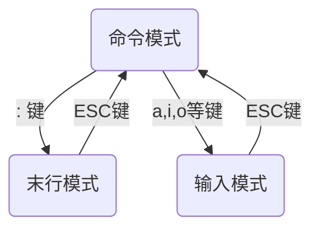

# 1 Linux 了解

## 1.1 终端


> "#" 是一个身份识别符，如果用超级管理员登录，则显示 "#"，否则显示为 "$"


**关机命令**

- shutdown (正常关机)
- halt(关闭内存)
- init 0

## 1.2 Linux 中的备份功能

在 VM 中备份方式有两种：

- 快照：又称==还原点==，就是保存在拍快照时候的系统的状态（包含了所有内容），在后期的时候可以随时恢复。<font color="red">侧重于短期备份或频繁备份，做快照的时候虚拟的操作系统一般处于开启状态</font>
- 克隆：就是==复制==的意思。侧重于长期备份，做克隆的时候必须得关闭

**创建快照步骤**：

1.在 VM 中找到相应的虚拟机，右键打开快照 → 拍摄快照


2.命令并描述好后拍摄快照


3.此时弄乱桌面或新建文件


4.想要恢复到拍照时的状态，右键点击快照 → 快照管理器 ，选择需要恢复的快照即可


创建克隆步骤：

1.首先我们需要将虚拟机关闭

在命令行执行`shutdown -h now`

2.右键虚拟机，选择管理 → 克隆


3.选中从当前状态或现有快照进行克隆


4.选中创建完整克隆后，为完整克隆的镜像添加存储路径，克隆的文件以一个相同的系统镜像文件存在


## 1.3 文件目录

<font color="red">在 Linux 中，一切皆文件</font>

| 目录 | 说明                                                         |
| ---- | ------------------------------------------------------------ |
| bin  | 全称binary，该目录中存储的都是一些二进制文件，文件都是可以被运行的 |
| dev  | 该目录中主要存放的是外接设备，例如光盘，在其中的外接设备是不能直接被使用的，需要手动挂载 |
| etc  | 该目录下主要存储一些配置文件                                 |
| home | 表示除了 root 用户以外的其他用户的家目录，类似与 windows 的user 目录 |
| proc | process，表示进程，该目录中存储的是 Linux 中运行的进程       |
| root | 表示 root 用户自己的目录                                     |
| sbin | 全称是 super binary，该目录下存储一些可以被执行的二进制文件，但必须要 root 权限 |
| tmp  | "temporary"的简写，存储一些临时文件                          |
| usr  | 存放的是用户自己安装的软件，类似于 windows 下的 program files |
| var  | 存放的程序/系统的日志文件                                    |
| mnt  | "mount"的简写，当外接设备需要挂载的时候，就需要挂载到 mnt 目录下 |


# 2 指令

一个完整的指令的标准格式：

```bash
指令 [选项 | 参数] [操作对象]
```

> 一个指令可以包含多个选项，也可以包含多个选项

## 2.1 基础指令

### 2.1.1 ls

ls 是 list 的简称，意为列表，使用该命令可以查看目录下的列表文件

1. 输出当前目录下的文件（默认不包含隐藏文件）

   ```bash
   ls
   ```

2. 输出当前目录下的文件（含隐藏文件，隐藏文件通常是以`.`开头）

   ```bash
   ls -a
   ```

3. 输出文件的长格式，包含属性详情信息

   ```bash
   ls -l
   ```

4. 以可读性较高的形式展示数据（需要搭配 `-l`）

   ```bash
   ls -lh
   ```

5. 搭配目录路径和通配符可以列出指定目录下指定文件类型的信息，例如：

   ```bash
   ls /etc/*.conf
   ```

   

`ls`  还可以使用选项 `--color`使得输出信息中带有着色效果，这个开关默认是打开的，如下图：


> 我们也可以观察到每列首字母，如果首字母为`d`代表这是一个文件夹，如果为横杠`-`代表是一个文件

ls 输出的颜色主要有以下几种：

- 白色：表示普通文件
- 蓝色：表示目录 
- 绿色：表示可执行文件
- 红色：表示压缩文件
- 浅蓝色：链接文件，主要是使用 `ln `命令建立的文件
- 红色闪烁：表示链接文件有问题
- 黄色：表示设备文件
- 灰色：表示其他文件

### 2.1.2 pwd

`pwd`命令全称是"print working directory" ，打印当前工作目录的意思

```bash
pwd
```


### 2.1.3 cd

`cd`命令的全称是"change directory"，改变目录

```bash
cd 路径
```

1. 省略路径，跳转到当前使用者的家目录

   ```
   cd
   ```

2. 路劲为`~`，跳转到当前使用者的家目录

   ```bash
   cd ~
   ```

3. 路径为`..`，跳转到==上一级==目录

   ```bash
   cd ..
   ```

4. 路径为`.`，返回到自己当前目录（相当于无效操作）

   ```bash
   cd .
   ```

5. 路径为`-`，返回到==上一次==所在目录

   ```bash
   cd -
   ```

6. 路径为`/`，跳转到根目录

   ```bash
   cd /
   ```


### 2.1.4 mkdir 

`mkdir` 的全称为 `make directory`，用于创建目录

1. 在当前工作目录下创建文件abc

   ```bash
   mkdir abc
   ```

2. 在指定目录下创建文件 abc

   ```bash
   mkdir path/abc
   ```

3. 添加选项`-p`，用于递归创建多级目录

   ```bash
   mkdir -p a/b/c
   # 在当前目录下创建a,目录a下创建b,目录b下创建c
   ```

4. 在当前工作目录一次性创建多个目录

   ```bash
   mkdir a b c
   ```

5. 创建目录的同时赋予权限，使用`-m xxx`（其中的 xxx 代表的是数字权限设定法）

   ```bash
   mkdir -m xxx a
   ```

   

### 2.1.5 touch 

`touch`用于创建文件和修改时间戳。当文件不存在时，则会创建一个空内容的文本文件；当文件存在则会对文件的 Atime(acess time：访问时间)和Ctime(change time：状态修改时间)

1. 在当前工作目录下创建文件

   ```bash
   touch a
   ```

2. 在当前工作目录下批量创建连续文件

   ```bash
   touch 文件名{最小数值..最大数值}.扩展名
   ```

3. 在当前工作目录批量创建文件

   ```bash
   touch a b c
   ```

4. 修改指定文件的查看时间和修改时间

   ```bash
   toucb -d "2022-08-25 17:02" a
   ```

对于第4个修改时间戳，我们来测试一下：

1.首先，在当前用户的家目录下新建一个文件 a

```bash
touch a
```

2.查看其状态：

```bash
stat a
```


3.修改其时间戳为"2022-08-24 02:04:43"并再次查看其状态

```bash
touch -d "2022-08-24 02:04:43" a
stat a
```


### 2.1.6 cp

`cp`是"copy"的缩写，用于将一个或多个文件或目录复制到指定位置，常用用于==备份==操作。其实参数 `-r`最常使用，用于递归复制，`-f`用来当文件中存在同名文件时，强制覆盖，不再询问

语法格式：

```bash
cp [选项] 源文件 目标文件
```

1. 复制文件a到当前的工作目录并且重命名为b

   ```bash
   cp a b
   ```

2. 复制目录a连同里面的文件一起

   ```bash
   cp -r a b
   ```

3. 复制文件a并命名为b且强制覆盖已存在文件 b

   ```bash
   cp -f a b
   ```

> 注意事项：
>
> 在 CentOS 7 中，文件与目录是不能够重名的，如果我们现创建目录再创建同名文件，虽然不会报错，但创建同名文件失败，反过来则会直接报错
>
> 我们在递归创建目录时，如果目录里面有文件或目录会直接忽视掉这个目录(omitting directory)


### 2.1.7 mv

`mv`是"move"的简写，用于移动或重命名文件

语法格式：

```bash
mv [选项] 源文件 目标文件
```

| 选项 | 说明                                 |
| ---- | ------------------------------------ |
| -i   | 若存在同名文件，则向用户询问是否覆盖 |
| -f   | 覆盖已有文件，不进行任何提示         |

### 2.1.8 rm 

`rm`是"remove"的简写，用于删除文件或目录。`rm`命令中最长使用选项便是 `-r`用于递归删除目录及其所有的子文件，另外`-f`用于强制删除。

> `rm`是一个危险的指令，像是命令`rm -f /*`会将 Linux 中所有的文件删除，这将对 Linux 系统造成严重的破坏。当我们处于 root 用户时，删除文件，Linux 系统默认会对删除操作进行询问；而当我们 处于普通用户时，删除文件要么`permission denied`，要么直接删除不进行询问

**常用选项：**

| 选项 | 说明                       |
| ---- | -------------------------- |
| -f   | 强制删除                   |
| -i   | 删除前对删除操作进行询问   |
| -r/R | 递归删除子文件下的所有文件 |

`rm`指令同样可以搭配通配符进行批量删除


### 2.1.9 vim

vim 全称"Vi Improved"，是 Vi 编辑器的提升版本，目前是 Linux 系统字符界面下最常用的文本编辑工具。<font color="red">在 Linux 系统中一切都是文件，而配置一个服务就是在修改其配置文件的参数</font>。我们可以使用 vim 在编辑文件，并且当文件不存在时，会自动创建文件。

常用选项:

| 选项 | 说明     |
| ---- | -------- |
| -R   | 只读模式 |
| -v   | Vi 模式  |
| -s   | 静默模式 |


### 2.1.10 输出重定向

一般命令的输出都会显示在终端，但如果我们想要这些命令的执行结果保存在文件中进行后序的分析/统计，这时我们就要用到输出重定向

- `>`：<font color='red'>覆盖</font>
- `>>`：<font color="red">追加</font>

语法

```bash
正常执行的指令 >/>> 文件的路径
```


### 2.1.11 cat

`cat`是"concatenate"的简写，<font color="red">用于在终端上查看文本内容</font>。其实除了 `cat`外，Linux 中还提供了`head`、`tail`、`more`、`less`等命令来查看文件内容，`cat`适合查看那内容较少、纯文本的文件，而如果遇到内容多的文件，终端会一直向下滚动，只能通过 Ctrl + C 命令来终止查看程序。

1. 查看文件内容

   ```bash
   cat file_name
   ```

2. 显示行数(对空行也显示行数)

   ```bash
   cat -n file_name
   ```

3. 显示行数(对空行不显示行数)

   ```bash
   cat -b file_name
   ```

   

## 2.2 进阶指令

### 2.2.1 df

`df`是"Disk Free"的缩写，其功能是显示磁盘空间使用情况，默认单位是Kb

语法：

```bash
df [选项] [对象磁盘/分区]
```

`df`命令最常使用的选项是`-h`，以一种==易阅读==的方式显示。若我们省略对象磁盘/分区，那么就会显示系统所有对象磁盘/分区的磁盘使用情况，里面的参数主要有：磁盘或分区名、总空间大小、已使用空间大小、可用大小，使用率、挂载的位置等

1. 查看指定类型的文件系统的磁盘分区使用情况

   ```bash
   df -t 文件格式
   # 文件格式例如 xfs
   ```

2. 查看系统所有的磁盘分区使用情况，并且以易阅读的形式显示

   ```bash
   df -h 
   ```

   

### 2.2.2 free

free 命令的功能是显示系统内存使用量情况

语法

```
free [选项]
```


| 选项                        | 说明                           |      |
| --------------------------- | ------------------------------ | ---- |
| -b                          | 以 Byte 为单位显示内存使用情况 |      |
| -k                          | 以 kb 为单位显示内存使用情况   |      |
| -m                          | 以 mb 为单位显示内存使用       |      |
| -g                          | 以 Gb 为单位显示内存使用情况   |      |
| <font color="red">-h</font> | 以易读的单位显示内存使用情况   |      |


### 2.2.3 head 指令

head 用于显示文件开头的内容，默认是前 10 行

1. 显示指定行数

   ```bash
   head -n <num> doc
   ```

2. 显示指定字符数

   ```bash
   head -c <num> doc
   ```

### 2.2.4 tail 指令

`tail`指令用来查看文件尾部内容，它和 head 是反过来的，<font color="red">默认会在终端界面上显示出指定文件的末尾十行</font>

语法

```bash
tail [选项] 文件
```

| 选项                            | 说明                       |
| ------------------------------- | -------------------------- |
| -c num                          | 输出文件尾部 num 个字符    |
| <font color="red">-f num</font> | 持续显示文件最新追加的内容 |
| -n num                          | 输出文件尾部n行内容        |

### 2.2.5 less 

`less` 命令和 `more` 命令是一对双胞胎，两者功能类似，都是用于分页显示，但`less`命令更加强大，`less`命令不仅可以从前向后(PageDown键)进行浏览，还可以从后向前(PageUp键）浏览，而`more`只能从前向后浏览文本内容

常用选项：

| 选项 | 说明               |
| ---- | ------------------ |
| -N   | 显示每一行的行号   |
| -i   | 忽略搜索时的大小写 |

### 2.2.6 wc

`wc`是"word count"的缩写，其功能是用于统计文件的字节数、单词数以及行数等

1. 统计文件的行数

   ```bash
   wc -l file_name
   ```

2. 统计文件的字节数

   ```bash
   wc -c file_name
   ```

3. 统计文件的单词数

   ```bash
   wc -w file_name
   ```

### 2.2.7 *date

`date` 指令用于显示或设置系统日期与时间日期。标准的时间格式为：

`MMDDhhmm[CC][YY][.ss]`，其中 `MM `为月份，`DD `为日，`hh` 为小时，`mm` 为分钟，`CC` 为年份前两位数字，`YY` 为年份后两位数字，`ss` 为秒数

1. 显示当前时间

   ```bash
   date
   # 打印结果为：Thu Aug 25 22:36:57 CST 2022
   # cst表示的时区，可以视为China Stardard Time,除此外还有 PDT、PST等时区
   ```

2. 以"年-月-日"的形式显示当前的日期

   ```bash
   date +%F	# 执行结果为：2022-08-25
   ```

3. 以"年-月-日 时:分:秒"的格式显示当前的日期

   ```bash
   date "+%F %T" # 执行结果为：2022-08-25 22:52:32
   ```

- %F：表示完整的年月日（相当于 "+%Y-%m-%d"）
- %T：表示完整的时分秒（相当于 "%H:%M:%S"）
- %Y：表示四位年份
- %m：表示两位月份（带前导0）
- %d：表示日期（带前导0）
- %H：表示小时（带前导0）
- %M：表示分钟（带前导0）
- %S：表示秒数（带前导0）


### 2.2.8 cal

`cal`是 "calendar"的简写，用来显示日历，<font color="red">如果后面跟着一个参数，则表示年份，如果跟着两个参数，从前到后依次代表月份、年份，而如果没有参数，默认是当前月份</font>

语法格式：

```bash
cal [参数] [月份] [年份]
```

1. 显示当前月份的日历

   ```bash
   cal -1
   ```

2. 显示近三个月的日历（其实也就是本月、上一个月和下一个月）

   ```bash
   cal -3
   ```

3. 显示指定年月的日历

   ```bash
   cal 8 2022
   ```

### 2.2.9 clear

`clear` 是 Linux 中的一个清屏命令，但其实在 Linux 中还有其他命令可以清除屏幕，例如：

- Ctrl+L（常用）
- reset

Ctrl + L 的效果和 `clear`的效果一样，并不是真正地将屏幕中的命令清除，本质上只是让终端向后翻一页，<font color="red">保留历史命令操作记录</font>

`reset`则是重新初始化屏幕，<font color="red">会将历史命令操作记录清除</font>

> 除此之外，不同的终端所使用的的清屏命令也是不相同的，例如 windows的命令行的清屏命令就是`cls`，而MySQL的清屏命令就是`system cls`


### 2.2.10 *管道

管道命令是 Linux 中比较重要的一个命令，主要用于==过滤==，==扩展处理==，管道不能单独使用，必须要配合指令一起使用，主要起<font color="red">辅助作用</font>

管道符：`|`

案例：

1. 通过管道查询查询根目录下包含字母"y"的文档名称

   ```bash
   ls / | grep y
   ```

   > grep 的作用是查找，或者说"抓取"，是一个强大的文本搜索工具

2. 统计根目录下的文档数目

   ```bash
   ls / | wc -l
   ```

   

## 2.3 高级指令

### 2.3.1 hostname

`hostname`用于显示和设置系统的主机名

语法：

```bash
hostname [选项]
```

常用选项：

- -d：显示DNS域名
- -i：显示主机的ip地址


### 2.3.2 id

`id`指令用于显示用户和用户组信息

1. 显示当前用户的身份信息

   ```bash
   id
   ```

2. 显示当前用户的所属群组GID

   ```bash
   id -g
   ```

3. 显示当前用户的身份码UID

   ```bash
   id -u
   ```

4. 查询某一用户的身份信息

   ```bash
   id 用户名
   ```


### 2.3.3 whoami

`whoami`指令用于显示当前登录的用户名，<font color="red">一般用于 shell 脚本，用于获取当前操作的用户名方便记录日志</font>


### 2.3.4 ps 

`ps`指令是"process status"的缩写，其功能是用于<font color="red">显示当前系统的进程状态</font>。

经常搭配 `kill`命令使用来中断和删除不必要的服务进程，避免浪费服务器资源的浪费。

常用选项：

| 选项 | 说明                          |
| ---- | ----------------------------- |
| -A   | 显示所有程序                  |
| -f   | 显示 UID 、PPIP、C、STIME栏位 |
| -e   | 等同于 -A，列出所有的程序     |

例如：


- UID：执行该进程的用户 ID
- PID：进程ID
- PPID：该进程的父进程 ID，如果一个程序的父级进程找不到，该程序的进程称之为僵死进程
- C：CPU 的使用率
- STIME：进程的启动时间
- TTY：终端设备，发起该进程的设备识别符号，如果显示为问号`?`则表示该进程并不是由终端设备发起的
- TIME：进程的执行时间
- CMD：该进程的名称或对应的路径


### 2.3.5 top

`top`指令用于实时显示系统运行状态 ，退出命令：`q`


- PID：进程ID

- USER：该进程对应的用户

- PR：优先级。其中PR范围为[100,40]，值越低，优先级越高，rt就是pr的值为0

- VIRT：虚拟内存

- RES：常驻内存

- SHR：共享内存

  > 一个进程实际使用的内存 = RES - SHR

- S：表示 CPU 的占用百分比

- %CPU：表示 CPU 的占用百分比

- %MEM：表示内存的占用的百分比

- TIME+：执行的时间

- COMMAND：进程的名称或者路径


快捷键：

- M：表示经结果按照内存（MEM）从高到低进行降序排序
- P：表示将结果 CPU 的使用率按照从高到底进行降序排序
- 1：显示 CPU 的详细信息

### 2.3.6 du

`du`命令是"Disk Usage"的缩写，用来查看文件或目录的大小

语法：

```bash
du [选项] 文件
```

选项

| 选项 | 说明                       |
| ---- | -------------------------- |
| -a   | 显示目录中==所有文件==大小 |
| -k   | 以 KB 为单位显示文件大小   |
| -m   | 以 MB 为单位显示文件大小   |
| -g   | 以 GB 为单位显示文件大小   |
| -h   | 以易读的方式显示文件大小   |
| -s   | 仅显示总计                 |

### 2.3.7 find

`find`命令的功能是根据给定的路径和条件查找相关文件或目录，其语法格式如下：

```bash
find 路径 [选项][选项值]
```

 `find`命令中常用的三个选项分别是

- `-name`：按照文档名称进行搜索（可以结合正则表达式进行模糊搜索）
- `-type`：按照文档的类型进行搜索
- `-size`：按照文档的大小进行搜索，其中+50KB 代表查找超过 50KB 的文件，而 -50KB 代表查找小于 50KB 的文件

1. 在当前目录中搜索所有大于1M大小的文件

   ```bash
   find . -size +1M
   ```

2. 在当前目录中搜索所有以.conf 结尾的文件

   ```bash
   find . -name "*.conf"
   ```

3. 在当前目录中搜索所有目录

   ```bash
   find . type d
   ```

   > 这里类型的选项值有：
   >
   > b：块设备
   >
   > d：目录
   >
   > c：字符设备
   >
   > p：管道
   >
   > l：链接文件
   >
   > f：文本文件

4. 搜索当前目录下属于指定用户的文件

   ```bash
   find . -user xxx
   ```

### 2.3.8 sercice

`service`命令用来控制系统服务的实用工具，可以<font color="red">启动、停止、重新启动和关闭系统服务，还可以显示所有系统服务的当前状态</font>

语法格式：

```bash
service 服务名 start/stop/restart
```

显示所有服务的状态：

```bash
service --status-all
```


### 2.3.9 kill

`kill`命令的作用用于杀死进程。Linux 系统中如需结束某个进程，既可以使用如`service`或`systemctl`的管理命令来结束服务，也可以使用 `kill`命令直接结束进程信息

语法格式：

```bash
kill [选项] PID
```

在`kill`命令中最长使用的选项是`-9`，用于强制结束进程；`-l`用于列出系统支持的全部信号列表。

`kill`命令一般需要搭配`ps`命令来查找进程（有时还需要使用 `grep`进行查找指定的一组进程），而`killall`指令则将这两个过程结合起来，`killall`是使用进程名称来杀死一组进程。


### 2.3.10 ifconfig

`ifconfig`是"network interface configuring"的缩写，用来显示或设置网络设备参数信息，在 windows 中类似的指令为`ipconfig`

<font color="red">注意：通常不建议使用 ifconfig 命令配置网络设备的参数信息，因为服务器一旦重启，配置的参数会自动失效，推荐编写到配置文件，这样会更加稳定</font>


### 2.3.11 reboot

`reboot`用于重启计算机

1. 重启计算机

   ```bash
   reboot
   ```

2. 模拟重启当前系统

   ```bash
   reboot -w
   ```

   > 只写关机与开机的日志信息

### 2.3.11 shutdown 指令

`shutdown`命令在之前提过，是用来关闭服务器的系统，作用同于`poweroff`命令

1. 将当前服务器关机

   ```bash
   shutdowon -h now
   ```

2. 将当前服务器重启

   ```bash
   shutdown -r now
   ```

3. 取消服务器已有的关机任务

   ```bash
   shutdown -c
   ```

4. 设定当前的服务器指定时间自动关机，格式为"小时:分钟"

   ```bash
   shutdown -h 21:00
   ```

5. 设定当前的服务器5分钟后关机，同时发出警告信息给所有已登录的用户

   ```bash
   shutdown +5 "System will shutdown after 5 minutes"
   ```

   

### 2.3.12 uptime 命令

`uptime`命令主要用来查看系统负载，`uptime`可以显示现有时间、系统已经运行的时间，登录的用户数量、系统过去1分钟、5分钟和15分钟的平均负载

1. 显示当前系统的运行负载情况

   ```bash
   uptime
   ```

2. 显示系统开始运行时间

   ```bash
   uptime -s
   ```

3. 显示系统运行时间

   ```bash
   uptime -p
   ```


### 2.3.13 uname

`uname`命令来自英文词组"Unix name"的缩写，其功能是用于查看系统主机名、内核及硬件架构等信息。

1. 显示系统内核名称

   ```bash
   uname
   # 显示结果为：Linux
   ```

2. 显示系统所有相关信息（含内核名、主机名、版本号以及硬件架构）

   ```bash
   uname -a
   ```

3. 显示系统内部版本号

   ```bash
   uname -r
   # 3.10.0-1160.el7.x86_64
   ```

4. 显示系统硬件架构

   ```bash
   uname -i
   # x86_64
   ```

### 2.3.14 netstat

`netstat`命令来自英文"network statistics"的缩写，主要用来显示网络状态


### 2.3.15 man

`man`是"manual"的简写，用于查看帮助手册


### 2.3.16 rpm 

`rpm`命令是"RedHat Package Manager"的缩写，中文翻译为红帽软件包管理器，主要用于在 Linux 系统下对软件包进行安装、卸载、查询、验证、升级等工作

1. 安装 rpm 包

   ```bash
   rpm -ivh rpm包名
   ```

2. 卸载 rpm 包

   ```bash
   rpm -evh rpm包名
   ```

3. 升级某个软件包

   ```bash
   rpm -Uvh rpm包名
   ```

选项：

- -i：安装软件包
- -e：卸载软件包
- -U：升级软件包
- -v：显示命令执行过程
- -h：安装时列出标记


### 2.3.17 yum 

`yum`命令是"yellowdogUpdater,modifier"的缩写，其功能是基于 RPM 技术进行软件包的管理工作。

`yum`软件仓库及命令能够自动处理软件依赖关系，一次性安装所需全部软件，无需繁琐的操作

1. 安装指定的服务及相关软件包

   ```bash
   yum install httpd
   ```

2. 更新指定的服务及相关软件包

   ```bash
   yum update httpd
   ```

3. 卸载指定的服务及相关软件包

   ```bash
   yum remove httpd
   ```


### 2.3.18 systemctl

`systemctl`命令是"system control"的简写，其功能是用于管理系统服务。从REHL/CentOS 7 开始初识话进程服务`init`被替代成了`systemctl`服务

1. 启动指定服务

   ```bash
   systemctl start sshd
   ```

2. 停止指定服务

   ```bash
   systemctl stop sshd
   ```

3. 重启指定服务

   ```
   systemctl restart sshd
   ```

4. 使指定服务开机自启

   ```bash
   systemctl enable sshd
   ```

5. 关闭某服务的自启

   ```bash
   systemctl disable sshd
   ```

6. 查看某服务的状态

   ```bash
   systemctl status sshd
   ```

   

# 3 Vim 编辑器

## 3.1 介绍

vim 的英文全称为"Vi improved"，它是 Vi 编辑器的提升版本，其中最大的改进表示添加了代码着色功能，并且在某些编程场景下还能自动修正代码。

在 Linux 系统中一切都是文件，而配置一个服务就是在修改其配置文件的参数

Vim 的三种模式：

- 命令模式：控制光标移动，可以对文本进行复制、粘贴、删除和查找等工作
- 输入模式：正常的文本录入
- 末行模式：保存或退出文档，以及设置编辑环境



vim编辑器打开文本时，默认是命令模式，当我们想要由命令模式进入到输入模式时，可以

**命令模式中常用的命令**

| 命令 | 作用                                               |
| ---- | -------------------------------------------------- |
| dd   | 删除（剪切）光标所在整行                           |
| 5dd  | 删除（剪切）从光标处开始的5行                      |
| yy   | 复制光标所在整行                                   |
| 5yy  | 复制从光标处开始的5行                              |
| n    | 显示搜索命令定位到的下一个字符串                   |
| N    | 显示搜索命令定位到的上一个字符串                   |
| u    | 撤销上一步的操作                                   |
| p    | 将之前删除（dd）或复制（yy）过的数据粘贴到光标后面 |

**末行模式中常用的命令**

| 命令          | 作用                                 |
| ------------- | ------------------------------------ |
| :w            | 保存                                 |
| :q            | 退出                                 |
| :q!           | 强制退出（放弃对文档的修改内容）     |
| :wq!          | 强制保存退出                         |
| :set nu       | 显示行号                             |
| :set nonu     | 不显示行号                           |
| :命令         | 执行该命令                           |
| :整数         | 跳转到该行                           |
| :s/one/two    | 将当前光标所在行的第一个one替换成two |
| :s/one/two/g  | 将当前光标所在行的所有one替换成two   |
| :%s/one/two/g | 将全文中的所有one替换成two           |
| ?字符串       | 在文本中从下至上搜索该字符串         |
| /字符串       | 在文本中从上至下搜索该字符串         |

