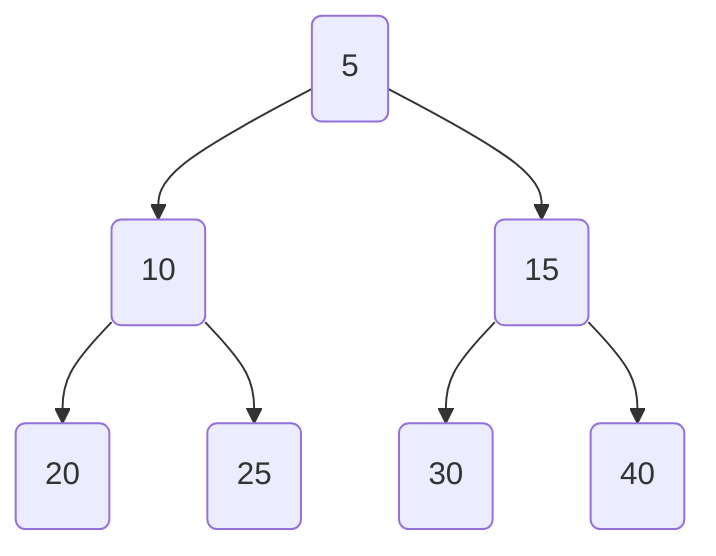
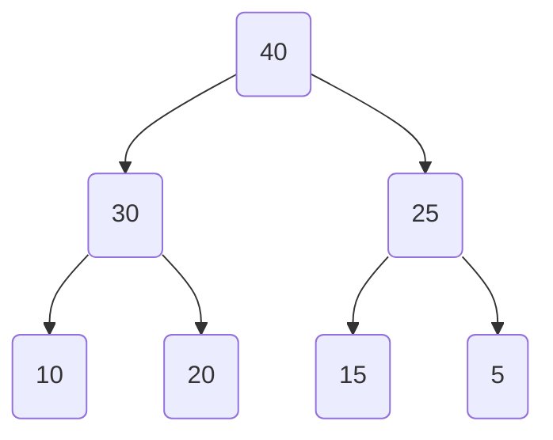

# 堆排序

## 1 什么是堆？

堆：一种特殊的<strong style="color: orange">完全二叉树</strong>，特殊在需要满足以下的其中一个性质：

- 小根堆（Min Heap）：任何一个节点的值 $\geq$ 其子节点

  > [!note]
  >
  > 根节点（即堆的顶部）即为整个堆的最小值

- 大根堆（Max Heap）：任何一个节点的值 $\leq$ 其子节点

  > [!note]
  >
  > 根节点（即堆的顶部）即为整个堆的最大值


:tipping_hand_man:Min Heap 示例



:tipping_hand_woman:Max Heap 示例



> [!warning]
>
> 堆并不是<strong style="color: orange">完全有序</strong>的结构，只是部分有序，没有明确要求左右孩子之间的大小关系


## 2 堆排序的实现思路

堆排序是<u>利用堆的性质，不断从堆顶取出元素，然后进行排序</u>。

例如：如果我想要<strong style="color: orange">进行升序排序，那么选择大根堆</strong>。取出堆顶元素，将其放在数组末尾。


### 2.1 堆的表示

**:bulb:我们需要使用结构体或者类来表征堆吗**

答：不需要。因为堆是一颗完全二叉树，因此我们完全可以使用数组来存储堆中的元素。


如果数组的索引从 0 开始，那么对于索引为 $i$ 的节点而言：

1. 左孩子节点索引为：$2i+1$
2. 右孩子节点索引为：$2i+2$
3. 其父节点索引为：$(i - 1)/2$


对于长度为 $n$ 的堆而言， 最后一个非叶子节点的索引为：$n/2-1$，推导如下：

对于某个节点 $i$ 而言，如果存在孩子节点，那么满足: $2i+1 < n$，因此我们可以得到：$i < (n - 1) /2 $

我们要得到满足这个条件，最小的 $i$，因此 $i=(n-2)/2=n/2-1$,


### 2.2 堆化（以大根堆为例）

向下堆化：节点下沉，维持大根堆性质

```cpp
void heapifyDown(int arr[], int n, int i)
{
  int largest = i;
  int left = 2 * i + 1;
  int right = 2 * i + 2;

  if (left < n && arr[left] > arr[largest])
  {
    largest = left;
  }

  if (right < n && arr[right] > arr[largest])
  {
    largest = right;
  }

  if (i != largest)
  {
    swap(arr[i], arr[largest]);
    heapifyDown(arr, n, largest);
  }
}
```


堆排序：首先构建好堆，然后每次取出堆顶的元素（`arr[0]`）放在数组末尾，之后再将新的 `arr[0]` 进行下沉堆化操作

```cpp
void heapSort(int arr[], int n)
{
  /**
   * Build heap starting from the last non-leaf node
   */
  for (int i = n / 2 - 1; i >= 0; i--)
  {
    heapifyDown(arr, n, i);
  }

  /**
   * Sort: Place the largest element at the end one by one
   */
  for (int i = n - 1; i > 0; i--)
  {
    swap(arr[0], arr[i]);
    heapifyDown(arr, i, 0); // readjust the arr[0]
  }
}
```


## 3 复杂度分析

# 相关习题

## 1 Kth Largest Element

> [!tip]
>
> 题目：[215. 数组中的第K个最大元素](https://leetcode.cn/problems/kth-largest-element-in-an-array/)

题目解析：题目要求的很简单，即数组排序后，返回第 K 个最大的元素，要求时间复杂度控制在 $O(n)$


### 1.1 解法1：构建大根堆后进行 K-1 次删顶操作

```
class Solution
{
public:
  int findKthLargest(vector<int> &nums, int k)
  {
    int n = nums.size();
    int cnt = 1;

    if (k > n)
      throw "The k is illegal";

    for (int i = n / 2 - 1; i >= 0; i--)
    {
      heapify(nums, n, i);
    }

    for (int i = n - 1; i >= n - k + 1; i--)
    {
      swap(nums[0], nums[i]);
      heapify(nums, i, 0);
    }

    return nums[0];
  }

  void heapify(vector<int> &nums, int n, int i)
  {
    int largest = i;
    int left = 2 * i + 1;
    int right = 2 * i + 2;

    if (left < n && nums[left] > nums[largest])
    {
      largest = left;
    }

    if (right < n && nums[right] > nums[largest])
    {
      largest = right;
    }

    if (i != largest)
    {
      swap(nums[i], nums[largest]);
      heapify(nums, n, largest);
    }
  }
};
```

