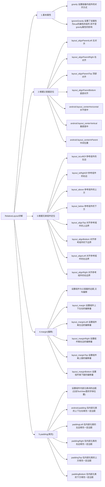
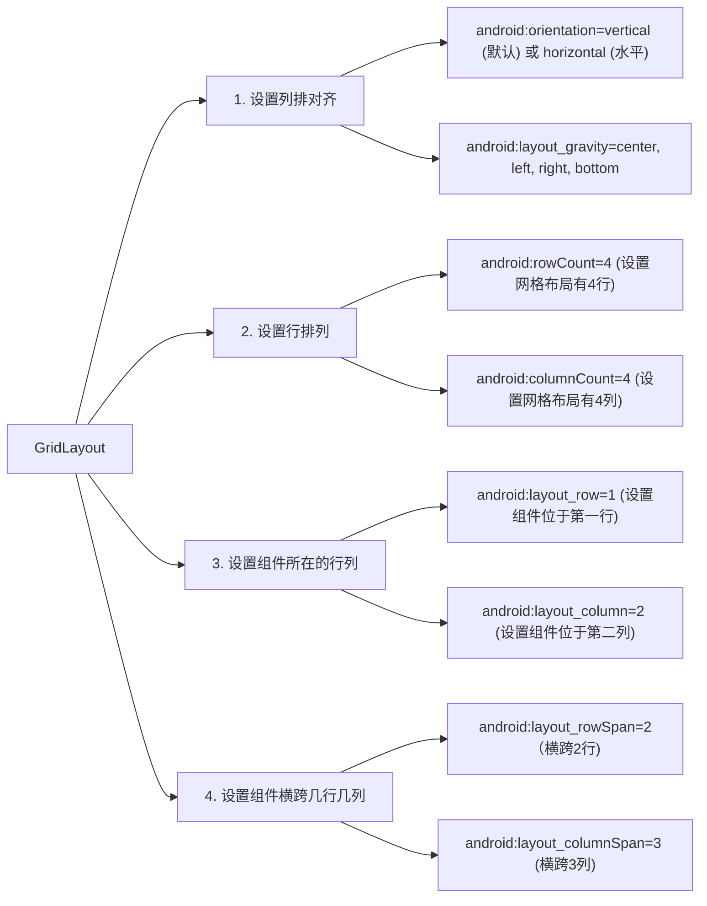

>  [!tip]
>
>  Android Development Document: https://developer.android.google.cn

# 1 Android Studio Base Operation

## 1.1 How to run and debug

运行和调试的方法主要有两种，一种是在自己手机上进行运行和调试，另一种就是使用模拟器（emulator），在模拟器上进行调试

### Debugging on emulator


界面设置安卓模拟器的版本以及竖屏(portrait)还是横屏(landscape)


发布到模拟器的方法：点击 Android Studio 中的 `Run App` 即可

### Debugging on physical device

打开手机的 `Developer options`， 打开 `USB Debugging` 即可，此时 PC 和真机之间就是通过 `adb(Android Debugging Bridge)` 进行连通的


## 1.2 migrate the config of AVD and Gradle

默认情况下，`.android` 和 `.gradle` 文件夹都会放在 C 盘的用户目录下，`.android` 文件夹下存放着 AVD(**Android Virtual Device**) 相关配置，而 `.gradle` 文件夹下存放着与 Gradle 打包编译相关的缓存，随着开发的进行，这两个文件家会越来越大，因此我们需要将其进行迁移

- `.gradle` 文件夹位置的更改可以直接在 Android Studio 中进行更改
- `.android` 文件夹位置需要结合环境，变量名为 `ANDROID_USER_HOME`

> [!note]
>
> 需要特别提醒的是，当我们将 `.gradle` 迁移后，Android Studio 启动项目时，识别依赖会存在延迟


# 2 Beginner

## 2.1 Log API

> [!tip]
>
> https://developer.android.com/reference/android/util/Log

- `Log.v()`: VERBOSE
- ` Log.d()`: DEBUG
- `Log.i()`: INFO
- `Log.w()`: WARN
- `Log.e()`: ERROR

> [!tip]
>
> 在 Android Studio 2024.2.2 版本中，log 日志都会存放到 `Logcat` 中


## 2.2 Dev Language

安卓的开发的主要两大技术路线

- native development：使用安卓官方提供的工具进行开发，优点是运行流畅，缺点是不能跨平台
- hybrid development：相当于在应用中内置一个浏览器，开发人员只需要将页面嵌入其中，优点是跨平台，缺点就是不如原生应用流畅

官方编程语言主要包括：

- Kotlin(recommended)
- Java


## 2.3 Database

在桌面开发或者 web 开发时，使用的数据库通常都是 MySQL、Oracle、SQL Sever 等等，而在 Android 无法直接操作上述几种数据库，它自己内置了专门的数据库，叫 `SQLite`


## 2.4 Project Structure

App 项目下主要两块，一块是 `app module`，另一块是 `gradle scripts`

在 `app module` 下主要就如下文件或目录：

1. `main/AndroidManifest.xml`: APP 的运行配置文件
2. `main/res`: 存放当前模块的资源文件，其下又有如下目录
   - `drawable`: 存放图形相关文件，例如启动程序图标的 background 和 foreground
   - `layout`: 存放 APP 页面的布局文件
   - `mipmap`: 存放各种 APP 启动图标
   - `values`: 一些常量定义的文件，例如 `color`、`app_name` 以及 `night_theme` 等等
3. `main/java`: 存放程序源代码
4. `androidTest / test`: 测试文件，其中 `test` 文件夹主要存放的单元测试代码


`gradle scripts` 下面主要是工程的**编译、测试、打包、部署**的配置文件

> [!tip]
>
> `gradle` 在 Android Dev 中的作用类似于 `maven` 在 Java Web 中的作用


**编程配置文件**

在项目中，有很多 `build.gradle.kts` 文件，该文件指定了项目的编译规则，主要分为两类：

- 项目级别：一般位于当前项目下，指定了当前项目的总体编译规则
- 模块级别：对应具体模块，每个模块都有自己的 `build.gradle.kts`，该文件指定了当前模块的详细编译规则

我们主要关注模块级别的编译规则，下面是一份示例

```groovy
// 声明使用的插件配置
plugins {
    alias(libs.plugins.android.application)
}

android {
    // 定义项目的命名空间，与包名保持一致
    namespace = "com.example.myapplication"
    // 声明编译时 SDK 的版本
    compileSdk = 35
	
    defaultConfig {
        applicationId = "com.example.myapplication" // 应用唯一标识
        minSdk = 28	 // 应用支持的最低的 SDK 版本
        targetSdk = 35  // 应用目标的 SDK 版本
        versionCode = 1
        versionName = "1.0"

        testInstrumentationRunner = "androidx.test.runner.AndroidJUnitRunner"
    }

    buildTypes {
        release {
            isMinifyEnabled = false	// 是否启动代码混淆，防止有人反编译得到源代码
            // 指定 ProGuard 配置文件，用于代码混淆和优化
            proguardFiles(
                getDefaultProguardFile("proguard-android-optimize.txt"),
                "proguard-rules.pro"
            )
        }
    }
    compileOptions {
        sourceCompatibility = JavaVersion.VERSION_11
        targetCompatibility = JavaVersion.VERSION_11
    }
}

// 定义项目依赖的库
dependencies {
	// 添加 AndroidX 的 appcompat 库，用来兼容旧版本的 Android
    implementation(libs.appcompat)
    // 添加 Material Design 组件库
    implementation(libs.material)
    // 添加 Android X 的 activity 库，用于支持 activity
    implementation(libs.activity)
    implementation(libs.constraintlayout)
    // 添加 Junit 测试框架，用于单元测试
    testImplementation(libs.junit)
    // 添加 Android 的测试扩展库，用于 Android 测试
    androidTestImplementation(libs.ext.junit)
    // 添加 Espresso 测试库，用于 UI 测试
    androidTestImplementation(libs.espresso.core)
}
```

> [!tip]
>
> 如果想要知道具体的 SDK 和 Android 版本的对应关系，可以参考[官网](https://developer.android.com/tools/releases/platforms)


**manifest 文件**

```xml
<?xml version="1.0" encoding="utf-8"?>
<!-- AndroidManifest.xml 的根节点为为 manifest -->
<!-- xmlns:android 定义了 XML 的命名空间，用来访问 Android 的资源 -->
<manifest xmlns:android="http://schemas.android.com/apk/res/android"
    xmlns:tools="http://schemas.android.com/tools">
	<!-- manifest 的 applciation 节点-->
    <application
        android:allowBackup="true"
        android:dataExtractionRules="@xml/data_extraction_rules"
        android:fullBackupContent="@xml/backup_rules"
        android:icon="@mipmap/ic_launcher"
        android:label="@string/app_name"
        android:roundIcon="@mipmap/ic_launcher_round"
        android:supportsRtl="true"
        android:theme="@style/Theme.MyApplication"
        tools:targetApi="31">
        <activity
            android:name=".MainActivity"
            android:exported="true">
            <intent-filter>
                <action android:name="android.intent.action.MAIN" />

                <category android:name="android.intent.category.LAUNCHER" />
            </intent-filter>
        </activity>
    </application>

</manifest>
```

在 application 节点下的属性说明如下：

1. `android:allowBackup`: 是否允许备份。允许用户备份系统应用和第三方应用的 apk 和数据，以便在刷机或数据丢失后恢复应用，用户可以通过 `adb backup` 以及 `adb restore` 来进行对应用数据的备份和恢复
2. `android:icon`: APP 在手机屏幕上的图标
3. `android:label`: APP 在手机屏幕上显示的名称
4. `android:roundIcon`: 指定 APP 的圆角图标
5. `android:supportsRtl`: 是否支持文字从右往左显示
6. `android:theme`: 指定应用主题风格


## 2.5 Activity

> [!tip]
>
> What is Activity?
>
> An Activity can be thought of as **a Java class that is typically associated with a screen**, representing a part of an Android application. Each activity may contain user interface elements and enables the user to interact with the application. For example, in an email application, an activity could represent a screen displaying the inbox.
>
> more info reference: https://medium.com/@ogulcankirtay/what-is-activity-in-android-25a55ed2fcba

在 `AndroidManifest.xml` 中，我们可以看到 `activity` 相关的节点配置，如下：

```xml
<activity
    android:name=".MainActivity"
    android:exported="true">
    <intent-filter>
        <action android:name="android.intent.action.MAIN" />

        <category android:name="android.intent.category.LAUNCHER" />
    </intent-filter>
</activity>
```

- `android:name`: 声明一个名为 `MainActivity` 这个类
- `android:exported`: 控制该 Activity 是否可以被其他程序启动


## 2.6 Display and Handle

在 Android Dev 中，界面设计和操作逻辑是分开的

- `xml` 文件用于描述 APP 界面
- `Java` 用于处理 APP 交互逻辑

> [!tip]
>
> 我们可以将 `xml` 类比为 `html` 专门用来显示页面，而 `Java` 的作用类似于 `Js` 在前端的作用，主要用于完成交互逻辑 


**exercise**

结合 `xml` 和 `Java` 开发一个 "Hello, World" 界面，要求文字居于页面正中间

1. 在 `res/layout` 添加布局页面 `activity_main.xml`

   ```xml
   <?xml version="1.0" encoding="utf-8"?>
   <LinearLayout
       xmlns:android="http://schemas.android.com/apk/res/android"
       android:layout_width="match_parent"
       android:layout_height="match_parent"
       android:gravity="center"
       android:orientation="vertical">
       <!-- android:gravity 主要用于控制内容对齐方式-->
       <!-- android:orientation 主要用于控制子视图堆叠方式-->
   
       <TextView
           android:id="@+id/tv"
           android:layout_height="wrap_content"
           android:layout_width="wrap_content"
           />
       <!--
       Attributes layout_height and layout_width are required
       -->
   </LinearLayout>
   ```

2. 修改 `src` 下的 `MainActivity` 代码

   ```java
   public class MainActivity extends AppCompatActivity {
   
       @Override
       protected void onCreate(Bundle savedInstanceState) {
           super.onCreate(savedInstanceState);
           // 将 activity_main.xml 文件中定义的界面布局加载到屏幕中
           setContentView(R.layout.activity_main);
           // 通过 id 得到文本节点
           TextView tv = findViewById(R.id.tv);
           // 将节点的内容进行替换
           tv.setText("Hello, World!");
       }
   }
   ```


## 2.7 How to Create a new Page

如果我们需要创建一个完整的页面，通常需要如下步骤：

1. 在 layout 目录下创建 XML 文件
2. 创建与 XML 文件对应的 Java 代码
3. 在 `AndroidSManifest.xml` 中注册页面配置

:office: Exercise: 创建两个 Activity ，其中一个 Activity 充当主页面，拥有一个点击的按钮，另一个 Activity 是副页面，界面中主要展现欢迎的界面，通过点击主页面的按钮我们可以跳转到副页面中

1. `MainActivity` 的 `Java`  文件以及 `xml` 文件

   ```java
   /**
    * Main_Activity.xml
    */
   public class MainActivity extends AppCompatActivity {
   
       @Override
       protected void onCreate(Bundle savedInstanceState) {
           super.onCreate(savedInstanceState);
           // 将 activity_main.xml 文件中定义的界面布局加载到屏幕中
           setContentView(R.layout.activity_main);
   
           View btn = findViewById(R.id.btn);
           btn.setOnClickListener(new View.OnClickListener() {
               @Override
               public void onClick(View v) {
                   // Intent 是一个消息传递对象
                   Intent intent = new Intent();
                   /*
                    setClass() 用于明确指定需要启动的对象
                    param 1: 指定当前 Activity 的上下文对象
                    param 2: 指定需要启动的目标对象
                    startActivity 用于启动一个新的 Activity
                    */
                   intent.setClass(MainActivity.this, JumpPage.class);
                   startActivity(intent);
               }
           });
       }
   }
   ```

   ```xml
   <!--
    activity_main.xml
   -->
   <?xml version="1.0" encoding="utf-8"?>
   <LinearLayout
       xmlns:android="http://schemas.android.com/apk/res/android"
       android:layout_width="match_parent"
       android:layout_height="match_parent"
       android:gravity="center"
       android:orientation="vertical">
   
       <!-- 添加跳转按钮 -->
       <Button
           android:id="@+id/btn"
           android:layout_width="wrap_content"
           android:layout_height="wrap_content"
           android:text="@string/jump_hint"
           />
   
   </LinearLayout>
   ```

2. 跳转页面 `JumpPage` 的 `Java`  文件以及 `xml` 文件

   ```java
   /**
    * JumpPage.java
    */
   public class JumpPage extends AppCompatActivity {
   
       @Override
       protected void onCreate(Bundle savedInstanceState) {
           super.onCreate(savedInstanceState);
           EdgeToEdge.enable(this);
           setContentView(R.layout.activity_jump_page);
       }
   }
   ```

   ```xml
   <!--
   	activity_jump_page.xml
   -->
   <LinearLayout
       xmlns:android="http://schemas.android.com/apk/res/android"
       android:layout_width="match_parent"
       android:layout_height="match_parent"
       android:gravity="center"
       android:orientation="vertical">
   
       <TextView
           android:id="@+id/welcome"
           android:layout_height="wrap_content"
           android:layout_width="wrap_content"
           android:text="@string/destination"
           />
   </LinearLayout>
   ```

   > [!tip]
   >
   > 字符常量都是定义在 `strings.xml` 文件中
   >
   > ```xml
   > <resources>
   >     <string name="destination">Welcome to the destination!</string>
   >     <string name="jump_hint">click</string>
   > </resources>
   > ```

3. 将 `MainActivity` 和 `JumpPage` 这两个 Activity 注册到 `AndroidManifest` 清单配置中

   ```xml
   <!-- 
   	AndroidManifest.xml
   -->
   <application>
       <activity
           android:name=".JumpPage"
           android:exported="false" />
       <activity
           android:name=".MainActivity"
           android:exported="true">
           <intent-filter>
               <action android:name="android.intent.action.MAIN" />
   
               <category android:name="android.intent.category.LAUNCHER" />
           </intent-filter>
       </activity>
   </application> 
   ```


## 2.8 Simple Control

### 2.8.1 Text Setting

在 Android Dev 中，设置文本内容主要有两种方式：

1. 在 XML 文件中，通过 `android:text` 属性设置文本

   ```xml
   <!-- 直接在 LinearLayout 节点中添加 TextView 节点，对应的 TextView 界面中添加 android:text 文本内容 -->
   <TextView
           android:id="@+id/banner"
           android:layout_height="wrap_content"
           android:layout_width="wrap_content"
           android:text="Hello, World!"
           />
   ```

2. 在 Java 代码中，调用 `TextView` 对象的 `setText()` 设置文本

   ```java
   TextView banner = findViewById(R.id.banner);
   banner.setText("young man!");
   ```


如果我们设置文本的大小，那么我们也有两种方式

- 在 Java 代码中调用 `setTextSize()`

  > [!tip]
  >
  > 默认情况下，通过 `setTextSize()` 设置的文本大小的默认单位为 `px`，在源码中对应的类型为 `TypedValue.COMPLEX_UNIT_SP`

- 在 XML 文件中通过属性 `android:textSize` 指定文本大小，但是此时就需要指定字号单位，常用字号单位主要包括如下几类：

  - `px`: **pixel**
  - `dp`: **Density-independent Pixel**
  - `sp`: **Scale-independent Pixel**

  ```xml
  <TextView
      android:id="@+id/banner"
      android:layout_height="wrap_content"
      android:layout_width="wrap_content"
      android:textSize="30px"
      />
  <!--
  warning: 这里的 textSize 我们必须要指定其单位，如果只有数值则会报错
  -->
  ```


**设置文本颜色**

- Android 我们可以通过 `setTextColor()` 来设置文本颜色

  ```java
  banner.setTextColor(Color.GREEN);
  banner.setTextColor(Color.parseColor("#336699"));
  banner.setTextColor(Color.rgb(255, 0, 0));
  banner.setTextColor(Color.argb(255, 213, 126, 255));
  ```

- 通过在 XML 文件添加相应的颜色属性设置文本颜色

  ```xml
  <TextView
      android:textColor="@color/purple_700"
  />
  ```


**设置文本的背景（高亮）**

1. 通过 Java 代码获取 `TextView` 后，使用 `setBackgroundColor()` 或者 `setBackgroundResource()` 方法对其背景色进行设置

   ```java
   banner.setBackgroundColor(Color.YELLOW);
   // OR
   banner.setBackgroundResource(R.color.teal_200);
   ```

2. 通过在 XML 文件中添加 `android:background` 属性

   ```XML
   <TextView
       android:background="@color/black"
   />
   ```


### 2.8.2 View Setting

如果我们想要设置视图的宽高，那么我们可以在 XML 文件中通过属性 `android:layout_width` 和 `android:layout_width`，宽高的取值主要有下列三种：

1. `match_parent`: 表示与父容器大小保持一致

2. `warp_content`: 表示与容器内容自适应

3. 以 `dp` 为大小的具体尺寸

   > [!note]
   >
   > 一般而言，我们在设置 `width / height` 时，使用的尺寸单位为 `dp`，而在设置字体大小时，使用的尺寸单位为 `sp`


我们也可以通过 Java 代码来对宽高进行修改

```java
// 通过 ID 得到 TextView 对象
TextView viewObject = findViewById(R.id.view);
// 通过 getLayoutParams() 得到布局相关的参数信息
ViewGroup.LayoutParams layoutParams = viewObject.getLayoutParams();
// 分别设置 width 和 height
layoutParams.width = 200;
layoutParams.height = 200;
```


### 2.8.3 Spacing Setting

间距主要有两种，一种是内间距，另一种是外间距:

- `layout_margin` 指定当前视图与平级视图之间的间距，包括 `layout_margin`, `layout_marginLeft`, `layout_marginLeft`,`layout_marginTop`, `layout_marginRight`, `layout_marginBottom`
- `padding` 指定了当前视图与内部的下级视图之间的距离，包括 `padding`, `paddingLeft`, `paddingTop`, `paddingRight`, `paddingBottom`


### 2.8.4 Arrange

设置视图的对齐方式主要包括两种：

- `layout_gravity`: 指定当前视图相对于上级视图的对齐方式
- `gravity`: 指定下级视图相对于当前视图的对齐方式

> [!tip]
>
> `layout_gravity` 和 `gravity` 的取值包括了 `left`, `top`, `right`, `bottom`，并且还可以同竖线连接，例如 `left|top` 表示左上角对齐

```xml
<?xml version="1.0" encoding="utf-8"?>
<LinearLayout xmlns:android="http://schemas.android.com/apk/res/android"
    android:layout_width="match_parent"
    android:layout_height="match_parent"
    android:gravity="center"
    android:orientation="horizontal">

    <!-- 设置第一个视图 -->
    <!--
        layout_width=0dp 代表视图的宽度自适应需要结合
        需要结合上级视图 android:orientation="horizontal"
        同时为了避免出现尺寸不可见的问题，我们需要添加权重 weight
     -->
    <LinearLayout
        android:layout_width="0dp"
        android:layout_height="200dp"
        android:layout_gravity="top"
        android:layout_weight="1"
        android:background="#0B4AAF"
        android:gravity="top"
        android:orientation="horizontal">

        <LinearLayout
            android:layout_width="0dp"
            android:layout_height="100dp"
            android:layout_weight="1"
            android:background="#4CAF50"
            android:layout_margin="10dp"/>

        <LinearLayout
            android:layout_width="0dp"
            android:layout_height="100dp"
            android:layout_weight="1"
            android:background="#4CAF50"
            android:layout_margin="10dp"/>
    </LinearLayout>

    <LinearLayout
        android:layout_width="0dp"
        android:layout_height="200dp"
        android:layout_gravity="top"
        android:layout_weight="1"
        android:background="#E91E63"
        android:orientation="horizontal"
        android:padding="10dp" />
</LinearLayout>
```

通过上述 XML 设置样式，我们可以得到下列界面


## 2.9 Image Unit

| name                            | explain                                                      |
| ------------------------------- | ------------------------------------------------------------ |
| px(pixel)                       | 构成图像的基本单元，单个像素的大小并不固定                   |
| Resolution                      | 是指屏幕的垂直方向和水平方向的像素数量                       |
| DPI (Dots Per Inch)             | 屏幕斜线上每英寸的像素点                                     |
| Density                         | 每平方英寸的像素数，Density=DPI*DPI                          |
| DIP(Density-independent Pixels) | 可简写为 DP，密度无关像素，DIP 是开发中使用的长度单位，但是最后也是需要转换为 px, px = DIP * DPI / 160 |

> [!tip]
>
> 对于相同分辨率的手机而言，屏幕越大，相同 DP 的组件所占用的屏幕比例越小


## 2.10 Common Layout

### 2.10.1 LinearLayout

线性布局内部的各视图的排列方式主要有两种：

- orientation 的属性值设置为 horizontal 时（default），内部视图再**水平方向**上**从左往右**排列
- orientation 的属性值设置为 vertical 时，内部视图再**垂直方向**上**从上往下**排列


`LinearLayout` 中的 `layout_weight` 是指线性布局下的下级视图所占宽高的比例

- `layout_width=0dp` 时，`layout_weight` 代表水平方向的宽度比例
- `layout_height=0dp` 时，`layout_weight` 代表垂直方向的宽度比例


### 2.10.2 RelativeLayout

`RelativeLayout` lets child views specify their position relative to the parent view or to each other 



```xml
<?xml version="1.0" encoding="utf-8"?>
<RelativeLayout xmlns:android="http://schemas.android.com/apk/res/android"
    android:layout_width="match_parent"
    android:layout_height="match_parent"
    android:paddingLeft="16dp"
    android:paddingRight="16dp" >
    <EditText
        android:id="@+id/name"
        android:layout_width="match_parent"
        android:layout_height="wrap_content"
        android:hint="reminder" />
    <!-- Spinner 组件在安卓开发中代表的是下拉列表 -->
    <!-- android:layout_below="@id/name" 代表该组件的位置位于 name 组件之下 -->
    <!-- android:layout_toLeftOf="@+id/times" 代表该组件的位置位于 times 组件的左边 -->
    <Spinner
        android:id="@+id/dates"
        android:layout_width="0dp"
        android:layout_height="wrap_content"
        android:layout_below="@id/name"
        android:layout_alignParentLeft="true"
        android:layout_toLeftOf="@+id/times" />
    <Spinner
        android:id="@id/times"
        android:layout_width="96dp"
        android:layout_height="wrap_content"
        android:layout_below="@id/name"
        android:layout_alignParentRight="true" />
    <Button
        android:layout_width="96dp"
        android:layout_height="wrap_content"
        android:layout_below="@id/times"
        android:layout_alignParentRight="true"
        android:text="done" />
</RelativeLayout>
```

上述布局中，最终实现的效果如下：


### 2.10.3 GridLayout

`GridLayout` is a layout that places its children in a rectangular *grid*.

网格布局中重要的属性设置



```xml
<?xml version="1.0" encoding="utf-8"?>
<GridLayout xmlns:android="http://schemas.android.com/apk/res/android"
    android:layout_width="match_parent"
    android:layout_height="match_parent"
    android:columnCount="2"
    android:rowCount="2">

    <Button
        android:layout_row="0"
        android:layout_column="0"
        android:background="#00BCD4"
        android:text="Cell 1" />

    <Button
        android:layout_row="0"
        android:layout_column="1"
        android:background="#673AB7"
        android:text="Cell 2" />

    <Button
        android:layout_row="1"
        android:layout_column="0"
        android:background="#9C27B0"
        android:text="Cell 3" />

    <Button
        android:layout_row="1"
        android:layout_column="1"
        android:background="#E91E63"
        android:text="Cell 4" />
</GridLayout>
```

显示效果如下


### 2.10.4 ScrollView

`ScrollView` 即滚动视图，更加准确地来说是垂直方向的滚动视图，当我们需要垂直方向滚动，`layout_width` 设置为 `match_parent`，而 `layout_height` 属性值设置为 `wrap_content`

> [!note]
>
> 与之相对的，还有 `HorizontalScrollView`，这是水平方向的滚动视图，为了满足水平方向的滚动，我们需要将 `layout_width` 设置为 `wrap_content`，而 `layout_height` 设置为 `matc_parent`

**示例**

```xml
<?xml version="1.0" encoding="utf-8"?>
<LinearLayout xmlns:android="http://schemas.android.com/apk/res/android"
    android:layout_width="match_parent"
    android:layout_height="match_parent"
    android:orientation="vertical">

    <HorizontalScrollView
        android:layout_width="wrap_content"
        android:layout_height="200dp"
        android:background="@color/teal_200">

        <LinearLayout
            android:layout_width="wrap_content"
            android:layout_height="match_parent">

            <TextView
                android:layout_width="200dp"
                android:layout_height="match_parent"
                android:background="#F44336" />

            <TextView
                android:layout_width="200dp"
                android:layout_height="match_parent"
                android:background="#9C27B0" />

            <TextView
                android:layout_width="200dp"
                android:layout_height="match_parent"
                android:background="#4CAF50" />
        </LinearLayout>
    </HorizontalScrollView>
</LinearLayout>
```


## 2.11 Button

`Button` 控件是由 `TextView` 派生而来的，但是和 `TextView` 不同的是：

1. `Button` 拥有默认的按钮背景，而 `TextView` 默认无背景
2. `Button` 内部文本默认居中对齐，而 `TextView` 的内部文本默认靠左对齐
3. `Button` 会默认将英文字母转换为大写，而 `TextView` 保持原始的英文大小写

**示例**

```xml
<?xml version="1.0" encoding="utf-8"?>
<LinearLayout xmlns:android="http://schemas.android.com/apk/res/android"
    android:layout_width="match_parent"
    android:layout_height="match_parent"
    android:orientation="vertical">

    <Button
        android:layout_width="100dp"
        android:layout_height="50dp"
        android:text="Click" />

    <TextView
        android:layout_width="100dp"
        android:layout_height="50dp"
        android:text="Click" />

</LinearLayout>
```


### 2.11.1 Click Event

类似于 `Vue.js` 的 *订阅-发布* 机制，我们可以在 Button 上添加 Click 点击事件

```xml
<Button
        android:id="@+id/button_send"
        android:layout_width="wrap_content"
        android:layout_height="wrap_content"
        android:onClick="sendMessage"
        android:text="sendMessage" />
```

```java
    public void sendMessage(View view) {
        TextView btnSeed = (TextView) view;
        btnSeed.setText("This button has already been clicked.");
    }
```

对 `sendMessage()` 的要求：

1. 方法为 `public`
2. 返回值为 `void`
3. 定义一个 `View` 作为其唯一的入参（这个 `View` 即是点击的视图）

不过现在更加推荐的方式是使用 `Listener`，  因为这种方式不仅适用于 Activity ，而且适用于 Fragment，实现方法如下：

```java
// 方法1： 添加匿名内部类
public class MainActivity extends AppCompatActivity {
    private Button mButton;

    @Override
    protected void onCreate(Bundle savedInstanceState) {
        super.onCreate(savedInstanceState);
        setContentView(R.layout.activity_main);

        mButton = findViewById(R.id.button_send);
        // 为当前实例添加一个匿名内部类，在内部类里实现 OnClick()
        mButton.setOnClickListener(new View.OnClickListener() {
            @Override
            public void onClick(View view) {
                mButton.setText("This is the after Result");
            }
        });
    }
}
```

```java
// 方法2：自定义 listener 事件
public class MainActivity extends AppCompatActivity {

    @Override
    protected void onCreate(Bundle savedInstanceState) {
        super.onCreate(savedInstanceState);
        EdgeToEdge.enable(this);
        setContentView(R.layout.activity_main);
        Button button_seed = findViewById(R.id.button_send);

        TextView my_view = findViewById(R.id.change_view);
        button_seed.setOnClickListener(new MyOnClickListener(my_view));
    }

    /**
     * 注意：对监听的实现类需要
     */
    static class MyOnClickListener implements View.OnClickListener {
        private TextView myView;

        public MyOnClickListener(TextView myView) {
            this.myView = myView;
        }

        @Override
        public void onClick(View v) {
            myView.setText("I'm come back!");
        }
    }
}
```


除了 `setOnClickListener` 这种普通点击事件外，在安卓开发中还有长按点击事件 `setOnLongClickListener`，应该如何区分 *点击* 和 *长按* 之间的区别？如果按钮按住超过 `500ms`，那么就会触发 *长按* 事件。


### 2.11.2 Enable/Disable

通过属性 `.isEnabled()` 方法，我们可以查询当前按钮控件的状态，通过 `setEnabled()`，我们可以设置当前按钮控件的状态

*示例：通过一个按钮控制另一个按钮的启用和禁用*

```xml
<?xml version="1.0" encoding="utf-8"?>
<LinearLayout xmlns:android="http://schemas.android.com/apk/res/android"
    android:layout_width="match_parent"
    android:layout_height="match_parent"
    android:orientation="vertical"
    android:gravity="center">

    <Button
        android:id="@+id/btn_toggle"
        android:layout_width="wrap_content"
        android:layout_height="wrap_content"
        android:onClick="sendMessage"
        android:text="toggle" />

    <Button
        android:id="@+id/btn_view"
        android:layout_width="wrap_content"
        android:layout_height="wrap_content"
        android:text="enable" />
</LinearLayout>
```

```java
protected void onCreate(Bundle savedInstanceState) {
    super.onCreate(savedInstanceState);
    EdgeToEdge.enable(this);
    setContentView(R.layout.activity_main9);

    Button toggleBtn = findViewById(R.id.btn_toggle);
    toggleBtn.setOnClickListener(new View.OnClickListener() {
        @Override
        public void onClick(View v) {
            Button changeViewBtn = findViewById(R.id.btn_view);
            changeViewBtn.setEnabled(!changeViewBtn.isEnabled());
        }
    });
}
```


## 2.12 ImageView

在安卓开发的目录结构中，图片资源通常位于 `res/drawable` 目录下，设置图像视图的显示图片主要有如下两种方式

1. 在 XML 文件中，通过属性 `android:src` 加载图片资源，属性值格式为 `@drawable/xxx`

   ```xml
   <ImageView
       android:id="@+id/img_component"
       android:layout_width="wrap_content"
       android:layout_height="wrap_content"
       android:contentDescription="launch"
       android:src="@drawable/ic_launcher_background"
       />
   ```

2. 在 Java 代码中，我们也可以通过 `setImageResource()` 进行设置，属性值的格式为 `R.drawable.xxx`

   ```java
   protected void onCreate(Bundle savedInstanceState) {
       super.onCreate(savedInstanceState);
       EdgeToEdge.enable(this);
       setContentView(R.layout.activity_main);
   
       ImageView imageView = findViewById(R.id.img_component);
       imageView.setImageResource(R.drawable.ic_launcher_foreground);
   }
   ```


## 2.13 ImageButton

`ImageButton` 是显示图片的图像按钮，通过定位源码，我们可以看到 `ImageButton` 是继承自 `ImageView`，而不是 `Button`

*ImageButton vs Button*

- `Button` 既可以显示文本，也可以显示图片，而 `ImageButton` 只能显示图片，而不是显示文本
- `ImageButton` 上的图像可按比例缩放，而在 `Button` 上设置的图像会拉伸变形
- `Button` 只能靠背景显示一张图片，而 `ImageButton` 可分别在前景和背景显示图片，从而实现两种图片叠加的效果


*ImageButton vs ImageView*

- `ImageButton` 有默认的按钮背景（灰色背景），而 `ImageView` 默认无背景
- `ImageButton` 默认的缩放类型为 `center`, 而 `ImageView` 默认的缩放类型为 `fitCenter`


## 2.14 display Text and Image

如果我们想要同时展示文本与图像，那么可以使用的方法包括：

1. 利用 `LinearLayout` 对 `ImageView` 和 `TextView` 组合布局

2. 通过 `Button` 的 `drawable***` 属性设置文本周围的图标

   ```xml
   <Button
       android:layout_width="wrap_content"
       android:layout_height="wrap_content"
       android:drawableLeft="@drawable/ic_launcher_background"
       android:text="图标在左">
   </Button>
   ```

   除了 `drawableLeft` 之外，我们还可以使用 `drawableBottom`, `drawableRight`, `drawableTop`, `drawablePadding` 等属性


# 3 Activity

## 3.1 Start & Stop

如果我们想要从当前页面跳转到新的页面，那么我们可以使用如下代码实现：

```java
startActivity(new Intent(SourceActivity.this, TargetActivity.class));
    
// OR first define, then start

Intent intent = new Intent();
intent.setClass(SourceActivity.this, TargetActivity.class);
startActivity(intent);
```

从当前页面回到上到一个页面，只需要将当前页面关闭即可，返回的代码如下：

```java
finish()
```


> [!tip]
>
> 为了在实际操作上，看到延迟的效果，我们可以结合 `Handler()` 处理消息以及使用 `postDelayed()` 延迟执行某个任务
>
> ```java
> Handler handler = new Handler(Looper.getMainLooper());
> handler.postDelayed(new Runnable() {
>     @Override
>     public void run() {
>         // 在这里执行延迟后的事件
>         finish();
>     }
> }, 1000);
> ```


## 3.2 Lifecycle

> [!tip]
>
> More Info Reference:https://developer.android.com/guide/components/activities/activity-lifecycle

关于 Activity 的生命周期，具体我们可以参考下图


在其生命周期中，最重要的回调分别是：

- `onCreate()`: 在整个生命周期中仅执行一次

  ```java
  public void onCreate(Bundle savedInstanceState)
  ```

  > [!tip]
  >
  > 对于 `onCreate()` 方法，方法内接受一个 `Bundle` 类型的变量，变量存储着 `Activity` 之前保留的状态信息

- `onStart()`: 在 Activity 从不可见的状态转为可见的状态，但是用户无法还无法与系统交互时，该函数会被调用，在该函数被调用完成后，会立即进入到 `Resumed` 的状态，并且开始调用 `onResume()`

- `onResume()`: 当 Activity 进入 `foreground` 并且可以与用户进行交互时，该函数被被调用，直到发生了一些失去焦点，用户无法继续与当前 Activity 进行交互的事件，例如另一个程序的唤醒或者弹窗遮罩将 Activity 掩盖

- `onPause()`: 当 Activity 不处于 `foreground` 的时候，会调用该函数（注意：这并不意味着当前 Activity 被销毁，当前 Activity 仍然是可见的，并且很快会恢复），由于 `onPause()` 执行之间非常短暂，因此不要再 `onPause()` 回调函数中执行以下操作：

  - save application
  - save user data
  - make networks call
  - execute database transactions

- `onStop()`: 当 Activity 对用户不再可见时，此时进入到 `Stopped` 状态，并且程序开始调用该函数，当执行的任务是 CPU 密集型（CPU-intensive）的关机任务时，我们也可以使用 `onStop()`

- `onDestory()`: 在 Activity 销毁之前，该函数被调用，系统调用该函数的两种原因：

  - 用户完全销毁了 Activity 或者在 Activity 上调用了 `finish()`

  - 配置发生发生改变，例如设备旋转，或者进入多窗口模式


## 3.3 Launch Modes 

> [!tip]
>
> [reference link](https://medium.com/@anandgaur2207/launch-modes-in-android-9ab993a9c3b9#:~:text=Launch%20modes%20are%20configurations%20that%20determine%20how%20an,the%20launchMode%20attribute%20or%20programmatically%20using%20Intent%20flags.)

APP 打开 Activity 时，Activity 会被存储到一个栈内，针对栈内 Activity 的处理，衍生出几种不同的处理方式，修改的方式是直接在 `AndroidManifest` 文件中修改 `activity` 标签的 `android:launchMode` 属性，目前属性值主要包括 `standard`（default），`singleInstance`，`singleTask`，`singleTop`，`singleInstancePerTask` 五类

- `standard`: 每次启用一个 activity， 就会在 activity stack 顶部创建一个 activity 实例并放入

  

- `SingleTop`: 在这种启动模式下，要求栈的顶部不能重复创建相同 Activity 的实例，在这种情况下，我们会用实例的 `onNewIntent()` 方法创建新的实例

  

- `singleTask`: 在这种启动模式下，如果任务中没有现有的 Activity，则会直接创建并放入到 Activity Task 中，如果存在，那么就会重复调用，此时如果发现存在的 Activity 不是在顶部，就会对栈顶部的 Activity 进行逐个销毁，直到出现需要重复调用的 Activity

  

- `singleInstance`: 设置启动模式为 `SingleInstance` 的 Activity 会单独开一个 Task，并且它还具备 `SingleTask` 的特点，它会确保没有其他的 Activity 放置在同一个 Task 中

  
  
  > [!note]
  >
  > 假设 Task A 的 `launch mode` 为 `standard`， Task B 的 `launch mode` 为 `singleInstance`：
  >
  > 当我们从 A 启动 B 后，A 在 `back stack 1` 中，B 在 `back stack 2` 中，并且在 `back stack 2` 中只存在任务 B， 当我们再次从任务 B 中启动 Activity C 时，C 会进入默认的任务栈，通常是 `back stack 2`


在 Android12(API31) 中新增 `singleInstancePerTask`，该模式和 `singleInstance` 最大的不同在于，`singleInstancePerTask` 可以在每个 Task 中各自拥有一个独立的实例，不同 Task 之间互不影响，而 `singleInstance` 是会确保在 ==全局范围== 内有且仅有一个实例存在。


​	


## 3.4 Intent

An `intent` is an abstract description of an operation to be performed. The two of main methods is as follows:

1. `startActivity()`: launch an activity 
2. `broadcastIntent()`: send `intent` object to any interested `BroadcastReceiver` components


Android provide us two methods to communicate with a background `Service`

1. `Context.startService(Intent)`
2. `Context.bindService(Intent, BindServiceFlags, Executor, ServiceConnection)`


Body Of Intent:

There are two important things intent:

1. `action`: The general action to be performed, such as `ACTION_VIEW`, `ACTION_EDIT`, `ACTION_MAIN`, etc.

2. `data`: The data to operate on.


Types of Android Intents:

1. implicit intent: this way doesn't specify the component

   ```java
   // ACTION_VIEW: An implicit intent used to view a specific resource
   Intent intent = new Intent(Intent.ACTION_VIEW);
   /* Uri.parse(): convert the string to Uri object
     `setData()` is typically paired with an `Intent` action to specify what we should be done with data
      - `Intent.ACTION_VIEW`: View the data(e.g., open a webpage or media file)
      - `Intent.ACTION_EDIT`: Edit the data
      - `Intent.ACTION_DIAL`: dial a phone number
    */
   intent.setData(Uri.parse("https://www.geeksforgeeks.org"));
   // launch a new activity from current context
   startActivity(intent);
   ```
2. explicit intent: this way specify the component

   ```java
   // create a `intent` object, and specifies the activity that will navigate to
   Intent intent = new Intent(getApplicationContext(), MainActivityTwo.class);
   // launch a new activity from current context
   startActivity(intent);
   ```


### 3.4.1 explicit intent

