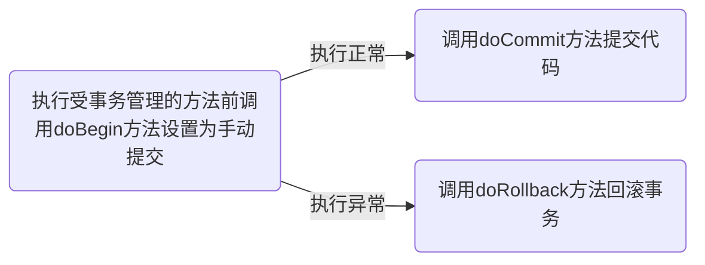

## 5.1 依赖注入和单例多例

在默认情况下，我们通过 `@Component`、`@Repository`、`@Controller`、`@Service` 创建的 bean 对象都是单例的，如果我们希望将其配置成多例的，可以添加注解 `@Scope(value = "prototype")` 来使得对象以多例形式返回

我们对下面的这段代码进行分析：

```java
@Component
@Scope(value = "prototype")
public class UserService {
    @Resource
    private UserDao userDao;

    // 将 init 定义为初始化方法
     @PostConstruct
    public void init() {
        System.out.println("UserService-init()");
    }
}
```

我们需要知道，Spring 底层是如何帮助我们通过 `@Resource` 进行自动注入，又是如何做到通过 `@Scope(value = "prototype")` 帮助我们将 UserService 这个 bean 对象设置为多例的？

---

这临时加入之前学过的后置处理器 `BeanPostProcessor`，我们配置后置处理器，如下：

```java
// 这里可以在beans.xml中添加<bean class="xxx"/>,也可以直接添加注解注入后置处理器，但一定将其添加到包扫描器中
@Component
public class MyBeanPostProcessor implements BeanPostProcessor {
    @Override
    public Object postProcessBeforeInitialization(Object bean, String beanName) throws BeansException {
        System.out.println(beanName + "----" + bean.getClass());
        return BeanPostProcessor.super.postProcessBeforeInitialization(bean, beanName);
    }

    @Override
    public Object postProcessAfterInitialization(Object bean, String beanName) throws BeansException {
        System.out.println(beanName + "----" + bean.getClass());
        return BeanPostProcessor.super.postProcessAfterInitialization(bean, beanName);
    }
}
```

打印语句会在每个 bean 对象 `init()` 方法前后执行，多例对象由于在是 `getBean()` 方法后才创建的，所以输出语句会在单例对象输出语句之后。


## 5.2 AOP 和 BeanPostProcessor 的关系

我们结合之前的 SmartDog、SmartAnimal 案例与后置处理器，执行如下代码：

```java
ApplicationContext ioc = new ClassPathXmlApplicationContext("beans.xml");
SmartAnimal smartAnimal = ioc.getBean(SmartAnimal.class);
smartAnimal.sum(1, 2);
```

输出结果如下：

```
smartAspect----class com.xzh.spring.aop.SmartAspect
smartAspect----class com.xzh.spring.aop.SmartAspect
smartDog----class com.xzh.spring.aop.SmartDog
smartDog----class com.sun.proxy.$Proxy15
@@@, showBeginLog()
###, showBeginSuccessLog
```

我们会发现，在 SmartDog 的 `init()` 方法执行前后类型发生改变，这是由于 AOP 返回的对象是一个代理对象

**解析**

1. AOP 底层是基于 BeanPostProcessor 机制的
2. 即在 Bean 创建好之后，根据是否需要 AOP 处理，决定 返回代理对象，还是原生 Bean
3. 在返回代理对象时，就可以根据要代理的类和方法来返回
4. 这个机制本质上就是 <strong style="color:red">BeanPostProcessor + 动态代理技术</strong>


## 5.3 spring 底层机制


## 5.4 扩展：类加载器

- Bootstrap 类加载器：对应路径 `jre/lib`
- Ext 类加载器：对应路径 `jre/lib/ext`
- App 类加载器：对应路径 `classpath`


手动实现 spring 底层机制的代码后续补上

# 6 JDBC Template

spring 为我们提供了一个操作数据库（表）的功能强大的类 jdbcTemplate，我们可以同 ioc 容器来配置一个 jdbcTemplate 对象，使用它来完成对数据库表的各种操作


## 6.1 基本介绍

我们在可以 spring-framework 包中找到 javadoc-api/index.html，其中包含 JdbcTemplate 的相关 api

- 所在包的位置：org.springframework.jdbc.core

- 相关构造方法

  | `JdbcTemplate()`Construct a new JdbcTemplate for bean usage. |
  | ------------------------------------------------------------ |
  | `JdbcTemplate(DataSource dataSource)`Construct a new JdbcTemplate, given a DataSource to obtain connections from. |
  | `JdbcTemplate(DataSource dataSource, boolean lazyInit)`Construct a new JdbcTemplate, given a DataSource to obtain connections from. |


## 6.2 环境搭建

spring5 jdbcTemplate 需要的 jar 包如下：

```
// 数据源
c3p0-0.9.1.2.jar
// mysql 驱动
mysql-connector-java-5.1.8-bin.jar
spring-jdbc-8.0.29.jar
spring-orm-5.3.8.jar
spring-tx-5.3.8.jar
```

对应的 Maven 依赖：

```xml
<dependency>
    <groupId>c3p0</groupId>
    <artifactId>c3p0</artifactId>
    <version>0.9.1.2</version>
</dependency>
<dependency>
    <groupId>mysql</groupId>
    <artifactId>mysql-connector-java</artifactId>
    <version>8.0.29</version>
</dependency>
<dependency>
    <groupId>org.springframework</groupId>
    <artifactId>spring-jdbc</artifactId>
    <version>5.3.8</version>
</dependency>
<dependency>
    <groupId>org.springframework</groupId>
    <artifactId>spring-orm</artifactId>
    <version>5.3.8</version>
</dependency>
<dependency>
    <groupId>org.springframework</groupId>
    <artifactId>spring-tx</artifactId>
    <version>5.3.8</version>
</dependency>
```


**spring 数据库和 monster 表准备**

```mysql
--   创建数据库
CREATE DATABASE spring;
-- 切换数据库
USE spring;
--   创建 monster 表
CREATE TABLE monster(
id INT PRIMARY KEY,
`name` VARCHAR(64) NOT NULL DEFAULT '',
skill VARCHAR(64) NOT NULL DEFAULT ''
)CHARSET=utf8;
INSERT INTO monster VALUES(100, '青牛怪', '吐火');
INSERT INTO monster VALUES(200, '黄袍怪', '吐烟');
INSERT INTO monster VALUES(300, '蜘蛛怪', '吐丝');
```


**创建配置文件**

```
jdbc.username=root
jdbc.password=123
jdbc.driverClass=com.mysql.cj.jdbc.Driver
jdbc.url=jdbc:mysql://localhost:3306/spring
```


**配置 xml 文件**

```xml
<!--引入外部的jdbc.properties-->
<context:property-placeholder location="classpath:jdbc.properties"/>
<!--配置数据源-->
<bean class="com.mchange.v2.c3p0.ComboPooledDataSource" id="dataSource">
    <!--给数据源对象配置属性值,注意：这里的name属性值底层都是用的c3p0中的setter，所以字段名不能自定义-->
    <property name="user" value="${jdbc.username}"/>
    <property name="password" value="${jdbc.password}"/>
    <property name="driverClass" value="${jdbc.driverClass}"/>
    <property name="jdbcUrl" value="${jdbc.url}"/>
</bean>
```


**测试程序**

```java
// 获取容器
ApplicationContext ioc = new ClassPathXmlApplicationContext("beans.xml");
// 获取数据源的bean对象
DataSource dataSource = ioc.getBean("dataSource", DataSource.class);
// 获取连接
Connection connection = dataSource.getConnection();
System.out.println("获取连接" + connection);
connection.close();
```


## 6.3 jdbsTemplate ——CRUD

**添加数据**

```java
// 测试通过jdbcTemplate对象完成添加数据
// 获取 ioc 容器
ApplicationContext ioc = new ClassPathXmlApplicationContext("beans.xml");
// 获取 jdbcTemplate 对象
JdbcTemplate jdbcTemplate = ioc.getBean("jdbcTemplate", JdbcTemplate.class);

// 添加数据方式一
String sql_1 = "INSERT INTO monster VALUES(400, '红孩儿', '枪法')";
jdbcTemplate.execute(sql_1);
System.out.println("finished");

// 添加数据方式二
String sql_2 = "INSERT INTO monster VALUES(?, ?, ?)";
int affected = jdbcTemplate.update(sql_2, 500, "白骨精", "伪装");
System.out.println("更新成功，受影响行数为: " + affected);
```


**修改数据**

```java
// 修改数据
String sql_3 = "UPDATE monster SET skill = ? WHERE id = ?";
int affected = jdbcTemplate.update(sql_3, "美人计", 500);
System.out.println("update finished, affected rows = " + affected); 
```


**批量处理数据**

```java
// 准备参数
String sql = "INSERT INTO monster VALUES(?, ?, ?)";
List<Object[]> batchArgs = new ArrayList<Object[]>();
batchArgs.add(new Object[]{600, "老鼠精", "偷粮食"});
batchArgs.add(new Object[]{700, "猫精", "抓老鼠"});

// 调用 batchUpdate api
int[] ints = jdbcTemplate.batchUpdate(sql, batchArgs);

for(int anInt : ints) {
    System.out.println("anInt=" + anInt);
}

System.out.println("finished...");
```


**查询后封装数据**

```java
// 准备参数，注意字段要与bean对象属性对应上
String sql = "SELECT id as monsterId,  name, skill FROM monster WHERE id = 100;";

// 使用 RowMapper 接口来对返回的数据进行封装，底层使用的反射机制（调用了setter）
// 注意点1：查询记录的表的字段和 Monster 对象中的属性要一一对应
// 注意点2：需要传入Monster的类对象，因为底层用到了反射机制
// 注意点3：使用 BeanPropertyRowMapper 要求 Monster 对象必须提供一个无参构造器
RowMapper<Monster> rowMapper = new BeanPropertyRowMapper<>(Monster.class);

Monster monster = jdbcTemplate.queryForObject(sql, rowMapper);
System.out.println(monster);
```


**查询后封装成对象集合**

```java
// sql语句中添加预处理占位符
String sql = "SELECT id AS monsterId, name, skill FROM monster WHERE id > ?";
// 使用rowMapper 进行数据封装
RowMapper<Monster> rowMapper = new BeanPropertyRowMapper<>(Monster.class);
// 使用query方法进行查询后返回list<Object>
List<Monster> monsterList = jdbcTemplate.query(sql, rowMapper, 200);

for(Monster monster : monsterList) {
    System.out.println(monster);
}

System.out.println("finished...");
```


**返回单行单列**

```java
// 编写 sql 语句
String sql = "SELECT name FROM monster WHERE id = ?";

// 执行queryForObject，参数1为sql语句，参数2为查询的单行单列数据的数据类型
String name = jdbcTemplate.queryForObject(sql, String.class, 100);
System.out.println(name);
```


## 6.4 具名参数

在使用具名参数之前，我们需要先配置具名参数对象 NamedParameterJdbcTemplate 

```xml
<!--配置NamedParameterJdbcTemplate对象-->
<bean class="org.springframework.jdbc.core.namedparam.NamedParameterJdbcTemplate" id="namedParamJdbcTemplate">
    <!--通过构造器，指定数据源-->
    <constructor-arg name="dataSource" ref="dataSource"/>
</bean>
```


**测试插入操作**

```java
ApplicationContext ioc = new ClassPathXmlApplicationContext("beans.xml");
NamedParameterJdbcTemplate namedParamJdbcTemplate = ioc.getBean("namedParamJdbcTemplate", NamedParameterJdbcTemplate.class);
/* 使用api
    <T> T query(String var1, Map<String, ?>;
  */
// 准备参数 [:mon_id, :name, :skill],要求按照规定的名字进行设置,其实就是put的时候key要保证正确
String sql = "INSERT INTO monster VALUES(:mon_id, :mon_name, :mon_skill)";
Map<String, Object> paramMap = new HashMap<>();
paramMap.put("mon_id", 800);
paramMap.put("mon_name", "蚂蚁精");
paramMap.put("mon_skill", "打洞");

int affected = namedParamJdbcTemplate.update(sql, paramMap);

System.out.println("finished, affected rows = " + affected);
```


## 6.5 sqlparametersource

```java
ApplicationContext ioc = new ClassPathXmlApplicationContext("beans.xml");
NamedParameterJdbcTemplate namedParamJdbcTemplate = ioc.getBean("namedParamJdbcTemplate", NamedParameterJdbcTemplate.class);
/**
 * 具名方法我们除了使用上述的传入 HashMap 容器的方式，还可以通过 BeanPropertySqlParameterSource 对修改的monster 对象进行封装，需要的注意的是，此时具名属性名和monster对象的属性名要一一对应
 */
// 1. 准备sql语句
String sql = "INSERT INTO monster VALUES(:monsterId, :name, :skill)";
Monster monster = new Monster(311, "大象精", "喷水");
SqlParameterSource beanPropertySqlParameterSource = new BeanPropertySqlParameterSource(monster);
int affected = namedParamJdbcTemplate.update(sql, beanPropertySqlParameterSource);
System.out.println("finished, the affected rows = " + affected);
```


## 6.6 DAO 中注入 jdbcTemplate

流程如下：

1. 首先创建好 MonsterDao 类，里面注入 jdbcTemplate

   ```java
   @Repository
   public class MonsterDao {
       // 注入 jdbcTemplate 对象
       @Resource
       private JdbcTemplate jdbcTemplate;
   
       // 完成保存任务
       public void save(Monster m) {
           String sql = "INSERT INTO monster VALUES(?, ?, ?)";
   
           int affected = jdbcTemplate.update(sql, m.getMonsterId(), m.getName(), m.getSkill());
           if(affected > 0) {
               System.out.println("finished");
           } else {
               System.out.println("error");
           }
       }
   }
   ```

2. 在 test 中进行测试程序，如下：

   ```java
   ApplicationContext ioc = new ClassPathXmlApplicationContext("beans.xml");
   MonsterDao monsterDao = ioc.getBean("monsterDao", MonsterDao.class);
   Monster monster = new Monster(111, "小鸭精", "游泳");
   monsterDao.save(monster);
   ```


# 7 声明式事务

## 7.1 简述

传统的编程式事务如下：

```java
// 1. 获取连接
Connection connection = JdbcUtils.getconnection();
try {
    // 2. 设置事务不自动提交
    connection.setAutoCommit(false);
    // 3. 进行各种 CRUD

    // 4. 提交
} catch(Exception e) {
    // 5. 回滚
} finally {
    // 6. 断开连接，关闭资源
}
```

传统的编程式事务，缺点是代码冗余，且效率低下，不利于扩展，优点是易于理解 ，但是在 spring 下，我们可以使用声明式事务，我们以用户购买商品为例，正常购买商品应该包含三个步骤：

1. 通过商品 id 获取价格
2. 购买商品（某人购买商品，修改用户的余额）
3. 修改库存量

使用声明式事务，代码复用性得到提高、扩展性更好

我们首先准备要模拟的表：

```mysql
-- 用户表
CREATE TABLE `user_account`(
user_id INT UNSIGNED PRIMARY KEY AUTO_INCREMENT,
user_name VARCHAR(32) NOT NULL DEFAULT '',
money DOUBLE NOT NULL DEFAULT 0.0
)CHARSET=utf8;
INSERT INTO `user_account` VALUES(NULL,'张三', 1000);
INSERT INTO `user_account` VALUES(NULL,'李四', 2000);
-- 商品表
CREATE TABLE `goods`(
    goods_id INT UNSIGNED PRIMARY KEY AUTO_INCREMENT,
    goods_name VARCHAR(32) NOT NULL DEFAULT '',
    price DOUBLE NOT NULL DEFAULT 0.0
)CHARSET=utf8;
INSERT INTO `goods` VALUES(NULL,'小风扇', 10.00);
INSERT INTO `goods` VALUES(NULL,'小台灯', 12.00);
INSERT INTO `goods` VALUES(NULL,'可口可乐', 3.00);
-- 库存表
CREATE TABLE `goods_amount`(
    goods_id INT UNSIGNED PRIMARY KEY AUTO_INCREMENT,
    goods_num INT UNSIGNED DEFAULT 0
)CHARSET=utf8;
INSERT INTO `goods_amount` VALUES(1,200);
INSERT INTO `goods_amount` VALUES(2,20);
INSERT INTO `goods_amount` VALUES(3,15);
```


编码 GoodsDao，其中提供了各种操作数据库表的方法

```java
@Repository
public class GoodsDao {
    @Resource
    private JdbcTemplate jdbcTemplate;

    /**
     * 查询 sql,用于根据id查询商品的价格
     * @param id 待查询商品的id
     * @return Float 为 float 的包装类
     */
    public Float queryPriceById(Integer id) {
        String sql = "SELECT price FROM goods WHERE goods_id = ?";
        return jdbcTemplate.queryForObject(sql, Float.class, id);
    }

    /**
     * 用于更新用户的账户(这里主要是减少操作)
     * @param user_id 修改的账户id
     * @param money 修改的金额数
     * @return  Boolean 包装类
     */
    public Boolean updateBalance(Integer user_id, Float money) {
        String sql  = "UPDATE user_account SET money = money - ? WHERE user_id = ?";
        int affected = jdbcTemplate.update(sql, money, user_id);
        return affected > 0;
    }

    /**
     * 用于修改goods_amount中货物数量
     * @param goods_id 修改的货物id
     * @param num 修改的货物数量
     * @return Boolean 包装类
     */
    public Boolean updateAmount(Integer goods_id, Integer num) {
        String sql = "UPDATE goods_amount SET goods_num = goods_num - ? WHERE goods_id = ?";
        int affected = jdbcTemplate.update(sql, num, goods_id);
        return affected > 0;
    }
}
```


编码 GoodsService 

```java
// 将 GoodsService 注入到容器中
@Service
public class GoodsService  {
    // 定义 userDao,并通过注解完成注入
    @Resource
    private GoodsDao goodsDao;

    // 用户购买商品方法

    /*
     @Transactional 注解用于让方法体进行事务控制
     */
    @Transactional
    public void buyGoods(int user_id, int goods_id, int amount) {
        // 1. 得到商品的价格, 乘上数量后得到总价
        Float price = goodsDao.queryPriceById(goods_id);
        Float total = price * amount;
        // 2. 减少用户余额

        Boolean aBoolean = goodsDao.updateBalance(user_id, total);
        // 3. 更新商品库存
        Boolean aBoolean1 = goodsDao.updateAmount(goods_id, amount);
    }
}
```


**配置和开启声明式事务管理**

```xml
<!--
    配置事务管理器——对象
    1. DataSourceTransactionManager 对象即事务管理对象
    2. 一定要配置数据源属性，指定事务管理对象是对那个数据源进行管理控制
-->
<bean class="org.springframework.jdbc.datasource.DataSourceTransactionManager" id="transactionManager">
    <property name="dataSource" ref="dataSource"/>
</bean>
<!--配置启动基于注解的声明式事务管理功能-->
<tx:annotation-driven transaction-manager="transactionManager"/>
```


## 7.2 `@Transaction` 底层原理

`@Transaction` 底层用到的还是 AOP 切面编程，核心原理如下：




## 7.3 声明式事务的传播机制

在了解什么是声明式事务的传播机制的问题前，我们现考虑下面这个场景：

假如，我将 `f1()` 声明为一个事务，而在 `f1()` 方法体中油调用了 `f2()`，而这个 `f2()` 又恰好被 `@Transaction` 修饰，即也是一个事务，那么此时事务的传播是如何进行的呢？


### 7.3.1 声明式事务传播机制种类

**事务管理种类**


> 常用的事务种类就是 `REQUIRE` 和 `REQUIRE_NEW`


**REQUIRE 传播机制**


**REQUIRE_NEW 传播机制**


**事务传播机制的设置方法**                                                                                                                                                                                                                                                                                                                                                                                                                                                                                                                                                                                                                                                                                                                                                                                                                                                                                                                                                                                                                                                                                                                                                                                                                                                                                                                                                                                                                                                                                                                                                                                                                                                                                                                                                                                                                                                                                                                                                                                                                                                                                                                                                                                                                                                                                                                                                                                                                                                                                                                                                                                                                                                                                                                                                                                                                                                                                                                                                                                                                                                                                                                                                                                                                                                                                                                                                                                                                                                                                                                                                                                                                                                                                                                                                                                                                                                                                                                                                                                                                                                                                                                                                                                                                                                                                                                                                                                                                                                                                                                                                                                                                                                                                                                                                                                                                                                                                                                                                                                                                                                                                                                                                                                                                                                                                                                                                                                                                                                                                                                                                                                                                                                                                                                                                                                                                                                                                                                                                                                                                                                                                                                                                                                                                                                                                                                                                                                                                                                                                                                                                                                                                                                                                                                                                                                                                                                                                                                                                                                                                                                                                                                                                                                                                                                                                                                                                                                                                                                                                                                                                                                                                                                                                                                                                                                                                                                                                                                                                                                                                                                                                                                                                                                                                                                                                                                                                                                                                                                                                                                                                                                                                                                                                                                                                                                                                                                                                                                                                                                                                                                                                                                                                                                                                                                   

```java
@Transactional(propagation = Propagation.REQUIRES_NEW)
public void buyGoods(int user_id, int goods_id, int amount)
```


对于 `REQUIRES_NEW` 和 `REQUIRE` 两者之间的区别，我们举例如下：

```java
@Transactional
public void multiTest() {
    // 内部事务1：1号用户购买1号商品。购买数量是1个
    goodsService.buyGoods(1, 1, 1);
    // 内部事务2：2号用户购买2号商品，购买数量是1个
    goodsService.buyGoods(2, 2, 1);
}
```

- 如果设置事务的传播机制为 `REQUIRE_NEW`，那么如果内部事务2出错，也不会影响到内部事务1和外部整体事务，即<strong style="color:red">各事务之间是独立的</strong>
- 如果设置事务的传播机制为 `REQUIRE`，那么如果内部事务2出错，内部事务1和外部整体事务都需要回滚


### 7.3.2 声明式事务的隔离级别

**事务的隔离级别**


注意：

1. mysql 数据库默认的隔离级别一般为 REPEATABLE_READ
2. 查看数据库默认的隔离级别：`SELECT @@global.tx_isolation`


设置事务的隔离级别的方式如下：

```java
@Transactional(propagation = Propagation.REQUIRES_NEW, isolation = Isolation.READ_COMMITTED)
public void buyGoods(int user_id, int goods_id, int amount)
```


### 7.3.3 超时回滚

如果一个事务的执行时间超过某个时间限制，就让该事务回滚，此时我们就可以通过设置事务的超时回滚来实现，基本语法如下：

```java
@Transactional(timeout = 2 )	// 单位：second
public void buyGoods(int user_id, int goods_id, int amount)
```

- 如果没有设置 timeout，那么默认参数值为 -1，表示使用事务的默认超时时间
- 我们如果想要模拟场景，可以使用 `Tread.sleep()` 来修改程序进行测试


