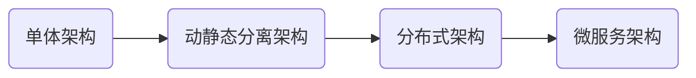

[toc]

# 1 基本引入

## 1.1 提出问题

1. 没有微服务，是不是就不能开发大型项目

   答案是否定的。没有微服务。我们可以对大型项目进行模块划分，对各个模块进行实现，模块之间更多的是通过 API 调用完成，哦合度较高，不利于扩展和维护

2. 标准的微服务解决方案（spring cloud 和 cloud alibaba）出现的原因和价值是什么？

   - 微服务可以根据业务的不同，将一个大项目，分解成为不同的服务，例如：搜索服务、网关服务、配置服务、存储服务、发现服务等等
   - 各个服务通过分布式方式进行工作，从而可以高效、快速、稳定地完成复杂的功能

Spring 社区整合优质组件（主要是 Netflix + Alibaba + 自己开发），如下：

- 服务熔断降级组件：Sentinel
- 服务发现和注册组件：Nacos
- 负载均衡组件：Ribbon
- 网关组件：Gateway


## 1.2 系统架构演变



### 1.2.1 单体架构


缺点：只适合小规模使用，如果用户数据激增会出现服务器瘫痪问题


### 1.2.2 动静分离架构


将静态页面和动态页面解耦分离，使用不同系统承载对应流量的架构设计方法。对于这种架构，我们可以采用静态缓存 + 文件存储的形式减少应用服务器的压力

- 对于静态资源，例如：HTML、JS、CSS、图片等资源将其放入文件服务器中，而动态资源，例如 servlet 和一些根据不同的参数生成的动态页面仍然放入到 web 应用服务器中，减少对 web 服务器的压力
- 从数据库中得到的缓存放入 Redis 这类缓存服务器中，减少了对数据库服务器的压力


### 1.2.3 分布式架构


- 将应用服务器拆分为多个应用服务器，通过 Nginx 的网关将不同的请求分散到不同的应用服务器
- 将数据库服务器拆分为主从数据库


### 1.2.4 微服务架构


- 微服务是系统架构上的一种设计风格，主旨是将一个原本独立的系统拆分为多个小型服务，这个小型服务都在各自独立的进程中运行，服务之间通过 HTTP 的 RESTFUL API 进行通信协作
- 被拆分的每个一个小型服务都围绕着系统中的某一项或一些耦合度较高的业务功能进行构建，并且每个服务都维护着自身的数据存储、业务开发、自动化测试案例以及独立部署机制。由于有轻量级的通信协作基础，所以这些微服务可以使用不同的语言来编写


## 1.3 Spring Cloud 全面说明

1. Spring Cloud 来源于 Spring，是更高层次的、架构视角的综合性大型项目， 目标旨在构 建一套标准化的微服务解决方案，让架构师在使用微服务理念构建系统的时，面对各环节的问题都可以找到相应的组件来处理
2. Spring Cloud 是 Spring 社区为微服务架构提供的一个 "全家桶" 套餐。套餐中各个组件 之间的配合， 可以减少在组件的选型和整合上花费的精力，可以快速构建起基础的微服务 架构系统，是微服务架构的最佳落地方案
3. Spring Cloud 天然支持 Spring Boot(有版本对应要求)，使用门槛较低
4.    解决与分布式系统相关的复杂性——网络问题，延迟开销，带宽问题，安全问题
5.    处理服务发现的能力，服务发现允许集群中的进程和服务找到彼此并进行通信
6. 解决冗余问题，冗余问题经常发生在分布式系统中
7.    解决负载平衡，改进跨多个计算资源（例如计算机集群，网络链接，中央处理单元）的工作负载分布


## 1.4 Spring Cloud 核心组件


- Spring Cloud Alibaba 中文文档：https://sca.aliyun.com/zh-cn/docs/2022.0.0.0/user-guide/nacos/quick-start/

- Netflix 的 github 仓库：https://github.com/Netflix


## 1.5 分布式示意图


1. Spring Cloud 是微服务的落地
2. Spring Cloud 体现了微服务的弹性设计
3. 微服务的工作方式一般是基于分布式的
4. Spring Cloud 仍然是 Spring 家族一员，可以解决微服务的分布式工作方式带来的各种问题
5. Spring Cloud 提供了很多组件，比如服务发现、负载均衡、链路终端、分布式追踪和监控、甚至提供 API gateway 功能


## 1.6 Spring Cloud 和 Spring Boot 版本对应关系

> 参考官网地址：https://spring.io/projects/spring-cloud

| Cloud Version                                                | Boot Version                          |
| ------------------------------------------------------------ | ------------------------------------- |
| [2022.0.x](https://github.com/spring-cloud/spring-cloud-release/wiki/Spring-Cloud-2022.0-Release-Notes) aka Kilburn | 3.0.x, 3.1.x (Starting with 2022.0.3) |
| [2021.0.x](https://github.com/spring-cloud/spring-cloud-release/wiki/Spring-Cloud-2021.0-Release-Notes) aka Jubilee | 2.6.x, 2.7.x (Starting with 2021.0.3) |
| [2020.0.x](https://github.com/spring-cloud/spring-cloud-release/wiki/Spring-Cloud-2020.0-Release-Notes) aka Ilford | 2.4.x, 2.5.x (Starting with 2020.0.3) |
| [Hoxton](https://github.com/spring-cloud/spring-cloud-release/wiki/Spring-Cloud-Hoxton-Release-Notes) | 2.2.x, 2.3.x (Starting with SR5)      |
| [Greenwich](https://github.com/spring-projects/spring-cloud/wiki/Spring-Cloud-Greenwich-Release-Notes) | 2.1.x                                 |
| [Finchley](https://github.com/spring-projects/spring-cloud/wiki/Spring-Cloud-Finchley-Release-Notes) | 2.0.x                                 |
| [Edgware](https://github.com/spring-projects/spring-cloud/wiki/Spring-Cloud-Edgware-Release-Notes) | 1.5.x                                 |
| [Dalston](https://github.com/spring-projects/spring-cloud/wiki/Spring-Cloud-Dalston-Release-Notes) | 1.5.x                                 |


## 1.7 Spring Cloud 服务选型


# 2 入门实操

## 2.1 搭建微服务环境

项目目录结构，使用 dependencyManagement 管理依赖，但是需要注意，该标签只是用于锁定版本，本身并不会引入依赖


创建项目


项目设置


父工程的 pom.xml

```xml
<project xmlns="http://maven.apache.org/POM/4.0.0" xmlns:xsi="http://www.w3.org/2001/XMLSchema-instance"
         xsi:schemaLocation="http://maven.apache.org/POM/4.0.0 http://maven.apache.org/xsd/maven-4.0.0.xsd">
    <modelVersion>4.0.0</modelVersion>

    <groupId>com.xzh</groupId>
    <artifactId>e-commerce-center</artifactId>
    <version>1.0-SNAPSHOT</version>
    <!--表明这是一个父工程，用于聚合管理其他模块-->
    <packaging>pom</packaging>

    <!-- 指定项目名，默认为 arttifactId-->
    <name>e-commerce-center</name>

    <properties>
        <java.version>1.8</java.version>
        <maven.compiler.source>1.8</maven.compiler.source>
        <maven.compiler.target>1.8</maven.compiler.target>
        <project.build.sourceEncoding>UTF-8</project.build.sourceEncoding>
        <mysql.version>8.0.23</mysql.version>
        <druid.version>1.1.17</druid.version>
        <mybatis.spring.boot.version>2.2.0</mybatis.spring.boot.version>
        <log4j.version>2.17.2</log4j.version>
    </properties>

    <dependencyManagement>
        <dependencies>
            <dependency>
                <groupId>org.springframework.boot</groupId>
                <artifactId>spring-boot-dependencies</artifactId>
                <version>2.2.2.RELEASE</version>
                <type>pom</type>
                <scope>import</scope>
            </dependency>

            <dependency>
                <groupId>org.springframework.cloud</groupId>
                <artifactId>spring-cloud-dependencies</artifactId>
                <version>Hoxton.SR1</version>
                <type>pom</type>
                <scope>import</scope>
            </dependency>

            <dependency>
                <groupId>com.alibaba.cloud</groupId>
                <artifactId>spring-cloud-alibaba-dependencies</artifactId>
                <version>2.1.0.RELEASE</version>
                <type>pom</type>
                <scope>import</scope>
            </dependency>

            <dependency>
                <groupId>mysql</groupId>
                <artifactId>mysql-connector-java</artifactId>
                <version>${mysql.version}</version>
            </dependency>

            <dependency>
                <groupId>com.alibaba</groupId>
                <artifactId>druid</artifactId>
                <version>${druid.version}</version>
            </dependency>

            <dependency>
                <groupId>org.mybatis.spring.boot</groupId>
                <artifactId>mybatis-spring-boot-starter</artifactId>
                <version>${mybatis.spring.boot.version}</version>
            </dependency>

            <dependency>
                <groupId>org.apache.logging.log4j</groupId>
                <artifactId>log4j</artifactId>
                <version>${log4j.version}</version>
            </dependency>
        </dependencies>
    </dependencyManagement>
</project>
```

> 当我们聚合了子模块后，父工程的 pom.xml 会自动生成对应的 modules 用于管理子模块，例如：
>
> ```xml
> <modules>
>     <module>member-service-provider-10000</module>
> </modules>
> ```

## 2.2 创建会员中心微服务

### 2.2.1 搭建环境

01 创建 module：member-service-provider-10000 

> member 代表这是一个会员服务，service-provider 代表这是用来提供服务的模块，后面的数字 10000 代表服务的端口号

02 在 pom.xml 文件中引入相关的依赖

```xml
<?xml version="1.0" encoding="UTF-8"?>
<project xmlns="http://maven.apache.org/POM/4.0.0"
         xmlns:xsi="http://www.w3.org/2001/XMLSchema-instance"
         xsi:schemaLocation="http://maven.apache.org/POM/4.0.0 http://maven.apache.org/xsd/maven-4.0.0.xsd">
    <modelVersion>4.0.0</modelVersion>
    <parent>
        <groupId>com.xzh</groupId>
        <artifactId>e-commerce-center</artifactId>
        <version>1.0-SNAPSHOT</version>
    </parent>

    <artifactId>member-service-provider-10000</artifactId>

    <properties>
        <maven.compiler.source>8</maven.compiler.source>
        <maven.compiler.target>8</maven.compiler.target>
        <project.build.sourceEncoding>UTF-8</project.build.sourceEncoding>
    </properties>

    <dependencies>
        <!--spring-boot-starter-web 是从父项目中的 spring-boot-dependencies 继承而来-->
        <dependency>
            <groupId>org.springframework.boot</groupId>
            <artifactId>spring-boot-starter-web</artifactId>
        </dependency>

        <!--spring-boot 程序的监控系统：可以实现系统的健康指标-->
        <!--备注：由于spring-boot-starter-actuator已经引入了spring-boot-starter-web，为了避免重复引入，我们可以将上面的依赖去掉-->
        <dependency>
            <groupId>org.springframework.boot</groupId>
            <artifactId>spring-boot-starter-actuator</artifactId>
        </dependency>

        <!--引入mysql驱动-->
        <dependency>
            <groupId>mysql</groupId>
            <artifactId>mysql-connector-java</artifactId>
        </dependency>

        <!--引入mybatis场景-->
        <dependency>
            <groupId>org.mybatis.spring.boot</groupId>
            <artifactId>mybatis-spring-boot-starter</artifactId>
        </dependency>

        <!--指定数据库连接池，由于父项目中没有指定版本，需要我们手动指定-->
        <dependency>
            <groupId>com.alibaba</groupId>
            <artifactId>druid-spring-boot-starter</artifactId>
            <version>1.1.17</version>
        </dependency>

        <dependency>
            <groupId>org.springframework.boot</groupId>
            <artifactId>spring-boot-starter-jdbc</artifactId>
        </dependency>

        <dependency>
            <groupId>org.projectlombok</groupId>
            <artifactId>lombok</artifactId>
        </dependency>

        <dependency>
            <groupId>org.springframework.boot</groupId>
            <artifactId>spring-boot-starter-test</artifactId>
        </dependency>
    </dependencies>

</project>
```

> 这里需要注意的是：
>
> - `junit-vintage-engine` 是 JUnit 4 中使用的测试引擎
> - `junit-jupiter-engine` 是 JUnit 5 中使用的测试引擎
>
> 新版本的 spring-boot 默认使用的是 JUnit 5，所以需要我们在引入依赖spring-boot-starter-test时需要排除 JUnit 4
>
> ```xml
> <dependency>
>     <groupId>org.springframework.boot</groupId>
>     <artifactId>spring-boot-starter-test</artifactId>
>     <scope>test</scope>
>     <exclusions>
>         <exclusion>
>             <artifactId>junit-vintage-engine</artifactId>
>             <groupId>org.junit.vintage</groupId>
>         </exclusion>
>     </exclusions>
> </dependency>
> ```

03 配置 application.yml 文件

```yaml
server:
  port: 10000 # 配置项目端口号

spring:
  application:
    name: member-service-provider-10000 # 配置应用的名称
  datasource:
    type: com.alibaba.druid.pool.DruidDataSource # 配置项目使用的数据源
    url: jdbc:mysql://localhost:3306/spring_cloud?useUnicode=true&characterEncoding=UTF-8&useSSL=true&serverTimezone=Asia/Shanghai
    username: root
    password: 486101620
mybatis:
  mapper-locations: classpath:mapper/*.xml # 指定 mapper.xml 文件的位置
  type-aliases-package: com.xzh.springCloud.entity # 指定类型别名
```


04 建立对应的数据库表文件

```sql
CREATE DATABASE IF NOT EXISTS `spring_cloud`;
USE `spring_cloud`;

CREATE TABLE member
(
    id     BIGINT AUTO_INCREMENT COMMENT '主键' PRIMARY KEY,
    name   VARCHAR(64) NULL COMMENT '用户名',
    pwd    CHAR(32)    NULL COMMENT '密码',
    gender TINYINT     NULL COMMENT '性别',
    email  VARCHAR(64) NULL COMMENT '邮箱',
    mobile VARCHAR(20) NULL COMMENT '手机号码'
) COLLATE = utf8mb4_unicode_ci;

INSERT INTO `member` VALUES(NULL, 'Smith', MD5('123'), 1, 'smith@sougou.com', '123456789101');
```


05 创建对应的 entity

```java
/**
 * @Description: 用户类
 */
@Data
@AllArgsConstructor
@NoArgsConstructor
public class Member {
    private Long id;
    private String name;
    private Integer gender;
    private String pwd;
    private String mobile;
    private String email;
}
```

```java
/**
 * 用于返回 JSON 格式的对象
 */
public class Result<T> {
    private String code;
    private String msg;
    private T data;

    public String getCode() {
        return this.code;
    }

    public void setCode(String code) {
        this.code = code;
    }

    public String getMsg() {
        return this.msg;
    }

    public void setMsg(String msg) {
        this.msg = msg;
    }

    public T getData() {
        return this.data;
    }

    public void setData(T data) {
        this.data = data;
    }

    public Result() {
    }

    public Result(T data) {
        this.data = data;
    }

    public static Result success() {
        Result result = new Result();
        result.setCode("200");
        result.setMsg("success");
        return result;
    }

    public static <T> Result<T> success(T data) {
        Result<T> result = new Result(data);
        result.setCode("200");
        result.setMsg("success");
        return result;
    }

    public static <T> Result<T> success(String msg, T data) {
        Result<T> result = new Result(data);
        result.setCode("200");
        result.setMsg(msg);
        return result;
    }

    public static Result error(String code, String msg) {
        Result result = new Result();
        result.setCode(code);
        result.setMsg(msg);
        return result;
    }

    public static <T> Result<T> error(String code, String msg, T data) {
        Result<T> result = new Result(data);
        result.setCode(code);
        result.setMsg(msg);
        return result;
    }
}
```


### 2.2.2 注意事项

1. 如果前端是以 json 格式发送添加信息，那么我们需要使用 `@RequestBody`，才能将数据封装到对应的 bean 中，同时保证 HTTP 请求头中的 content-type 是 application/json 格式

   ```java
   @PostMapping("/member/save")
   public Result saveMember(@RequestBody Member member) {
       int i = memberService.saveMember(member);
       if(i > 0) {
           return Result.success("添加会员成功", i);
       } else {
           return Result.error("401", "添加会员失败");
       }
   }
   ```

2. 如果前端是以表单的形式提交或者是 parameters，则不需要使用 `@RequestBody`

3. 在 Spring Boot 中进行测试时，引入的 Junit 是 org.junit.jupiter.api.Test，同时要在引入的 starter 中排除 JUnit4


## 2.3 创建会员服务消费微服务

### 2.3.1 需求说明

模块之间的调用关系如下：


需要完成业务

1. 创建服务消费模块 member-service-consumer-80 并完成相应
2. 创建 controller
3. 完成测试


### 2.3.2 搭建环境

01 创建模块 member-service-consumer-80

02 配置 pom.xml 

```xml
<?xml version="1.0" encoding="UTF-8"?>
<project xmlns="http://maven.apache.org/POM/4.0.0"
         xmlns:xsi="http://www.w3.org/2001/XMLSchema-instance"
         xsi:schemaLocation="http://maven.apache.org/POM/4.0.0 http://maven.apache.org/xsd/maven-4.0.0.xsd">
    <modelVersion>4.0.0</modelVersion>
    <parent>
        <groupId>com.xzh</groupId>
        <artifactId>e-commerce-center</artifactId>
        <version>1.0-SNAPSHOT</version>
    </parent>

    <artifactId>member-service-consumer-80</artifactId>

    <properties>
        <maven.compiler.source>8</maven.compiler.source>
        <maven.compiler.target>8</maven.compiler.target>
        <project.build.sourceEncoding>UTF-8</project.build.sourceEncoding>
    </properties>

    <dependencies>
        <dependency>
            <groupId>org.springframework.boot</groupId>
            <artifactId>spring-boot-starter-web</artifactId>
        </dependency>

        <!--spring-boot 程序的监控系统：可以实现系统的健康指标-->
        <!--备注：由于spring-boot-starter-actuator已经引入了spring-boot-starter-web，为了避免重复引入，我们可以将上面的依赖去掉-->
        <dependency>
            <groupId>org.springframework.boot</groupId>
            <artifactId>spring-boot-starter-actuator</artifactId>
        </dependency>

        <dependency>
            <groupId>org.projectlombok</groupId>
            <artifactId>lombok</artifactId>
        </dependency>
    </dependencies>
</project>
```


03 配置 application.yml

```yml
server:
  port: 80
spring:
  application:
    name: member-service-consumer-80
```


### 2.3.3 RestTemplate

基本介绍

1. RestTemplate 是 Spring 提供的用于访问 Rest 服务的模板类
2. RestTemplate 提供了多种便捷**访问远程 HTTP 服务**的方法
3. 通过它我们呢可以发出 HTTP 请求，去调用其他微服务的 Cointrooler 提供的 API 接口


### 2.3.4 Run DashBoard

基本介绍：当 Spring Cloud 的服务有多个时，管理多个服务的启动使用 run 会不好管理，这时我们就可以使用 Run Dashboard

开启步骤

01 找到项目根目录下的 .idea 文件夹，打开其中的 workspace.xml 文件

02 添加 RunDashboard 组件

```xml
<?xml version="1.0" encoding="UTF-8"?>
<project version="4">
  <component name="RunDashboard">
    <option name="configurationTypes">
      <set>
        <option value="SpringBootApplicationConfigurationType" />
      </set>
    </option>
  </component>
</project>
```

> 注意：IDEA 版本不同，配置方式可能会略微有所差异，上面的配置方法主要用于 IDEA 2023


### 2.3.5 注意事项

1. RestTemplate 中的方法是以 JSON 格式处理对象的，所以在发送请求时，我们最好添加 `@RequestBody` 并使用 JSON 格式进行处理


## 2.4 公共模块

对于微服务而言，模块复用是一个比较基础的概念，如果多个模块之间存在相同模块，我们可以将其抽取出来，使用 maven 将其打包为 jar 包，其他模块需要使用时直接引入依赖即可

实现步骤

1. 创建公共模块 e_commerce_center-common-api

2. 抽取公共依赖

   ```xml
   <?xml version="1.0" encoding="UTF-8"?>
   <project xmlns="http://maven.apache.org/POM/4.0.0"
            xmlns:xsi="http://www.w3.org/2001/XMLSchema-instance"
            xsi:schemaLocation="http://maven.apache.org/POM/4.0.0 http://maven.apache.org/xsd/maven-4.0.0.xsd">
       <modelVersion>4.0.0</modelVersion>
       <parent>
           <groupId>com.xzh</groupId>
           <artifactId>e-commerce-center</artifactId>
           <version>1.0-SNAPSHOT</version>
       </parent>
   
       <artifactId>e_commerce_center-common-api</artifactId>
   
       <properties>
           <maven.compiler.source>8</maven.compiler.source>
           <maven.compiler.target>8</maven.compiler.target>
           <project.build.sourceEncoding>UTF-8</project.build.sourceEncoding>
       </properties>
   
       <!--引入公共模块所需要的依赖-->
       <dependencies>
           <dependency>
               <groupId>org.projectlombok</groupId>
               <artifactId>lombok</artifactId>
               <!--optional::true 用来阻止依赖传递-->
               <optional>true</optional>
           </dependency>
       </dependencies>
   </project>
   ```

3. 抽取公共类

4. 使用 maven 进行打包

   

   > 在打包完成之后，会在 target 目录中生成对应的 jar

5. 引入公共模块依赖，具体的坐标我们可以在 target/maven-archiver/pom.properties 中看到

   ```properties
   version=1.0-SNAPSHOT
   groupId=com.xzh
   artifactId=e_commerce_center-common-api
   ```


# 3 Spring Cloud 微服务组件

## 3.1 Eureka 服务注册与发现

### 3.1.1 提出问题


在前面的项目中，服务提供中心为服务消费中心所使用，但是会存在如下问题：

1. 只有一个服务提供，可用性较差，在高并发的情况下会导致宕机
2. 解决第一点的问题，我们可以考虑使用集群，也就是说提供多个提供服务，但是这样又会引出其他问题，例如如何取发现可以使用的服务，又用什么方法去使用服务
3. 这就引出了服务注册和负载均衡，所以我们要去学习 Eureka，虽然 Eureka 已经逐渐开始被淘汰，大部分企业转向 Nacos，但是基本思想是相通的，学习 Eureka 可以给我们提供很好的思路


### 3.1.2 引入 Eureka 项目架构剖析


上图解析

1. 会员中心-提供服务，在项目中，会做成集群，提供高可用
2. Eureka Server 如果有必要的话，也可以做成集群
3. Eureka 包含两个组件：Eureka Server 和 Eureka Client
4. Eureka Server 提供注册服务，各个微服务节点通过配置启动后，会在 Eureka Server 中进行注册，Eureka Server 中的服务注册表会存储所有可用服务节点的信息，服务节点的信息可以在界面中直观看到
5. Eureka Client 通过注册中心进行访问，是一个 Java 客户端，用于简化 Eureka Server 的交互，客户端同时也具备一个内置的、使用轮询（round-robin）负载算法的负载均衡器，在应用启动后，将会向 Eureka Server 发送心跳（默认周期：30s）。如果 Eureka Server 在多个心跳周期内没有接收到某个节点的心跳，Eureka Server 将会从服务注册表中将这个服务节点移除（默认周期：90s）


### 3.1.3 服务治理

1. 在传统的 RPC 远程调用框架中，管理每个服务于服务之间的依赖关系比较复杂，管理困难，所以需要治理服务

   > RPC 的全称为 "remote procedure call"，即远程过程调用，是指运行在不同服务器之间的相互通信

2. 服务治理实现服务调用、负载均衡、容错等，实现服务发现与注册


### 3.1.4 服务注册与发现

1. Eureka 采用的是 CS 架构，也就是说会提供一个 Eureka Server 和 Eureka Client
2. 系统中的其它微服务，使用 Eureka 的客户端连接到 Eureka Server 并维持心跳连接，通过 Eureka Server 来监控系统中各个微服务是否正常运行
3. 在服务注册与发现中，有一个注册中心。当服务器启动时，会把当前自己服务器的信息，例如服务器通讯地址等以别名的方式注册到注册中心
4. 服务消费者或者服务提供者，以服务别名的方式去注册中心上获取到实际的服务提供者通讯地址，然后通过 RPC 调用服务


### 3.1.4 创建 Eureka模块

1. 创建模块 e-commerce-eureka-server-9001

2. 配置 pom.xml

   ```xml
   <?xml version="1.0" encoding="UTF-8"?>
   <project xmlns="http://maven.apache.org/POM/4.0.0"
            xmlns:xsi="http://www.w3.org/2001/XMLSchema-instance"
            xsi:schemaLocation="http://maven.apache.org/POM/4.0.0 http://maven.apache.org/xsd/maven-4.0.0.xsd">
       <modelVersion>4.0.0</modelVersion>
       <parent>
           <groupId>com.xzh</groupId>
           <artifactId>e-commerce-center</artifactId>
           <version>1.0-SNAPSHOT</version>
       </parent>
   
       <artifactId>e-commerce-eureka-server-9001</artifactId>
   
       <properties>
           <maven.compiler.source>8</maven.compiler.source>
           <maven.compiler.target>8</maven.compiler.target>
           <project.build.sourceEncoding>UTF-8</project.build.sourceEncoding>
       </properties>
   
       <dependencies>
           <dependency>
               <groupId>org.springframework.boot</groupId>
               <artifactId>spring-boot-starter-web</artifactId>
           </dependency>
   
           <dependency>
               <groupId>com.xzh</groupId>
               <artifactId>e_commerce_center-common-api</artifactId>
               <version>1.0-SNAPSHOT</version>
           </dependency>
   
           <dependency>
               <groupId>org.projectlombok</groupId>
               <artifactId>lombok</artifactId>
           </dependency>
   
           <dependency>
               <groupId>org.springframework.cloud</groupId>
               <artifactId>spring-cloud-starter-netflix-eureka-server</artifactId>
           </dependency>
   
           <dependency>
               <groupId>org.springframework.boot</groupId>
               <artifactId>spring-boot-starter-actuator</artifactId>
           </dependency>
       </dependencies>
   </project>
   ```

3. 配置 application.yml 文件

   ```yaml
   server:
     port: 9001
   eureka: # 配置 eureka
     instance:
       hostname: localhost # 服务主机名
     client:
       register-with-eureka: false # 配置不向注册中心注册自己
       fetch-registry: false # 表示自己就是注册中心，作用就是维护注册服务实例，不需要区间所服务
       service-url:
         defaultZone: http://${eureka.instance.hostname}:${server.port}/eruerka/ # 设置 eureka server 交换模块，查询服务和注册服务都需要依赖这个地址
   ```

4. 配置主程序类

   ```java
   /**
    * @Description: 主程序类 注解 @EnableEurekaServer 表示该程序作为 eureka server 存在
    */
   @SpringBootApplication
   @EnableEurekaServer
   public class EurekaApplication {
       public static void main(String[] args) {
           SpringApplication.run(EurekaApplication.class, args);
       }
   }
   ```


将前面的 provider 微服务模块作为 Eureka Client 注册到该 Eureka Server 中，实现步骤如下：

01 在 member-service-provider-10000 中引入 eureka-client 的 jar 包

```xml
<dependency>
    <groupId>org.springframework.cloud</groupId>
    <artifactId>spring-cloud-starter-netflix-eureka-client</artifactId>
</dependency>
```

02 在 member-service-provider-10000 模块的 application.yml 中进行相应的配置

```yaml
eureka:
  client:
    register-with-eureka: true # 将自己注册到注册中心
    # 注意：如果是单节点，那么下面的配置我们可以不需要配置，但是如果是一个集群，那么我们需要配置才能配合 ribbon 使用负载均衡
    fetch-registry: true  # 表示从 eureka server 中抓取注册信息
    service-url:
      defaultZone: http://localhost:9001/eureka/
```

03 在主启动类中添加注解

```java
@SpringBootApplication
@EnableEurekaClient
public class MemberProviderApplication {
    public static void main(String[] args) {
        SpringApplication.run(MemberProviderApplication.class, args);
    }
}
```

04 测试

在前面的配置完成之后进行测试，首先启动 eureka server，之后启动 eureka client，最后直接访问 server 的 url 进行查看即可


看到注册成功后，配置 consumer 模块也是同样的道理


### 3.1.5 底层维护机制

- 服务注册：将服务信息注册到 server
- 服务发现：从注册中心获取注册服务
- 服务信息：底层容器就是一个 map，其中 k—服务名，v-调用地址


### 3.1.6 Eureka 自我保护模式

1. 在默认情况下，Eureka 启动了自我保护模式

2. 自我保护模式理论说明

   - 默认情况下 Eureka client 定时向 Eureka server 端发送心跳包

   - 如果 Eureka 在 server 端在一定时间内（默认 90s）没有收到 Eureka client 发送的心跳包，便会直接从服务注册列表中剔除该服务

   - 如果 Eureka 开启了自我保护模式/机制，那么在短时间（90s）内丢失了大量的服务实例心跳，这时候 Eureka Server 会开启自我保护机制，不会剔除该服务（该现象可能出现在如果网络不通或者阻塞）

     > 因为这时候客户端仍然能够正常发送心跳，只是网络延迟问题，而保护机制是为了解决此问题而产生

3. 自我保护是属于 CAP 里面的 AP 分支，保证高可用和分区容错性

   > CAP 是分布式系统中一个理论，其中 CAP 分别代码三种特性
   >
   > - Consistency（一致性）
   > - Availability（可用性）
   > - Partition tolerance（分区容忍性）
   >
   > 该理论认为 CAP 中不可能同时做到这三点，最多只能满足其中两点

4. 自我保护模式是一种应对网络异常的安全保护措施。他的架构哲学是宁可同时保留所有微服务（健康的微服务和不健康的微服务都会保留）也不盲目注销任何健康的微服务。使用自我保护模式，可以让 Eureka 集群更加健壮


**实践**

在 Eureka Server 中关闭自我保护机制（在生产环境中，一般不会去禁用自我保护机制）

```yaml
eureka:
  server:
    enable-self-preservation: false # 禁用自我保护机制
    eviction-interval-timer-in-ms: 2000 # 设置超时时间为 2s，即如果在 2s 内没有收到心跳包则丢弃
```

在 Eureka Client 中设置发送心跳时间间隔和最长踢出时间

```yaml
eureka:
  instance:
    lease-renewal-interval-in-seconds: 1 # 设置客户端向服务器发送心跳的时间间隔为 1s(默认是 30s)
    lease-expiration-duration-in-seconds: 2 # 设置服务端收到最后最后一次心跳等待的时间上限为 2s, 超时则会踢出(默认是 90s)
```


### 3.1.7 搭建 Eureka Server 集群


1. 微服务 RPC 远程服务调用最核心的是实现高可用
2. 如果注册中心只有 1 个，一旦出现故障会导致整个服务环境不可用
3. 解决方法：搭建 Eureka 注册中心集群，实现负载均衡 + 故障容错

创建 e-commerce-eureka-server-9002 模块，大体配置与 e-commerce-eureka-server-9001 相同，部分差异在于需要将 eureka server 相互添加到彼此的注册中心中

 01 e-commerce-eureka-server-9001 的 application.yml 配置

```yml
server:
  port: 9001
eureka: # 配置 eureka
  instance:
    hostname: eureka9001.com
  client:
    register-with-eureka: false # 配置不向注册中心注册自己
    fetch-registry: false # 表示自己就是注册中心，作用就是维护注册服务实例，不需要从server中获取服务
    service-url:
      defaultZone: http://eureka9002.com:9002/eureka/ # 设置 eureka server 交换模块，查询服务和注册服务都需要依赖这个地址
```


02 e-commerce-eureka-server-9002 的 application.yml 配置

```yaml
server:
  port: 9002
eureka:
  instance:
    hostname: eureka9002.com
  client:
    register-with-eureka: false
    fetch-registry: false
    service-url:
      defaultZone: http://eureka9001.com:9001/eureka/
```


03 在配置完成后为了可以通过 eureka9002.com:9002 和 eureka9001.com:9001 进行访问，我们需要配置 hosts 文件，如下

```shell
# eureka mapping Start
127.0.0.1 eureka9001.com
127.0.0.1 eureka9002.com
# eureka mapping End
```


04 将 member-service-provider-10000 模块同时注册到上面的 eureka 集群中

```yaml
server:
  port: 10000 # 配置项目端口号

spring:
  # ……
eureka:
  client:
    # ……
    service-url:
      defaultZone: http://eureka9001.com:9001/eureka/,http://eureka9002.com:9002/eureka/ # 将该服务添加到 eureka server 集群中
```

同样的道理，将服务消费模块也添加到集群中


### 3.1.8 搭建【会员中心服务提供方】集群

创建 member-service-provider-10002 模块，步骤与之前的创建 member-service-provider-10000 类似，只需要在创建后模块后将源码拷贝，然后做部分修改，例如端口号

**注意事项**

1. 由于上述的两个会员中心提供模块是作为一个集群提供服务的，所以需要将 spring.application.name 进行统一

   ```yaml
   # member-service-provider-10000
   server:
     port: 10000
   
   spring:
     application:
       name: member-service-provider
   ```

   ```yaml
   # member-service-provider-10002
   server:
     port: 10002
   
   spring:
     application:
       name: member-service-provider
   ```

2. 这样消费方通过统一的别名进行负载均衡调用


**对比**

当我们提供不同的程序名时，在注册实例中显示如下：

| Application                       | AMIs        | Availability Zones | Status                                                       |
| :-------------------------------- | :---------- | :----------------- | :----------------------------------------------------------- |
| **MEMBER-SERVICE-PROVIDER-10000** | **n/a** (1) | (1)                | **UP** (1) - [Administrator:member-service-provider-10000:10000](http://administrator:10000/actuator/info) |
| **MEMBER-SERVICE-PROVIDER-10002** | **n/a** (1) | (1)                | **UP** (1) - [Administrator:member-service-provider-10002:10002](http://administrator:10002/actuator/info) |

当我们提供相同的程序名时，在注册实例中显示如下：

| Application                 | AMIs        | Availability Zones | Status                                                       |
| :-------------------------- | :---------- | :----------------- | :----------------------------------------------------------- |
| **MEMBER-SERVICE-PROVIDER** | **n/a** (2) | (2)                | **UP** (2) - [Administrator:member-service-provider:10002](http://administrator:10002/actuator/info) , [Administrator:member-service-provider:10000](http://administrator:10000/actuator/info) |


### 3.1.9 设置服务消费方

01 修改请求接口

```java
@RestController
@Slf4j
public class MemberConsumerController {
    // 定义一个基础的 member_service_provider_url 作为基础 url 地址，使用 shift + ctrl + u 完成大小写的快速切换
    /**
     * 1. MEMBER-SERVICE-PROVIDER 就是服务提供方[集群], 注册到 Eureka Server 的别名
     * 2. 也就是服务提供方[集群]对外暴露的名称为 MEMBER-SERVICE-PROVIDER
     * 3. MEMBER-SERVICE-PROVIDER 目前有两个可用域，如果我们想要实现负载均衡，那么我们需要
     * 使用在 RestTemplate 上添加 @LoadBalanced 注解赋予其负载均衡的能力，也就是自动使用某个算法选择使用服务
     * 默认是轮询算法
     */
    public static final String MEMBER_SERVICE_PROVIDER_URL = "http://MEMBER-SERVICE-PROVIDER";

    @Resource
    private RestTemplate restTemplate;

    @PostMapping("/member/consumer/save")
    public Result saveMember(@RequestBody Member member) {
        log.info("info = {}", member.toString());
        return restTemplate.postForObject(MEMBER_SERVICE_PROVIDER_URL + "/member/save/", member, Result.class);
    }

    @GetMapping("/member/consumer/get/{id}")
    public Result getMemberById(@PathVariable("id") Long id) {
        return restTemplate.getForObject(MEMBER_SERVICE_PROVIDER_URL + "/member/get/" + id, Result.class);
    }

}
```


02 为 RestTemplate 添加配置负载均衡的注释

```java
@Configuration
public class CustomizationBean {
    @Bean
    @LoadBalanced
    public RestTemplate getRestTemplate() {
        return new RestTemplate();
    }
}
```


配置完成之后，我们便可以开始进行测试，另外做出下面几点说明：

1. 注解 `@LoadBalanced` 底层支持是 Ribbon 算法
2. Ribbon 和 Eureka 整合后 consumer 直接调用服务而不用再关心地址和端口号，并且该服务还有负载功能


### 3.1.10 DiscoveryClient

Discovery 是用来获取 Eureka Server 服务注册信息，即 Eureka 的另一大功能  —— 服务发现

**配置方法**

01 在启动类中添加注解 `@EnableDiscoveryClient` 启动服务发现

```java
@SpringBootApplication
@EnableEurekaClient
@EnableDiscoveryClient
public class MemberProviderApplication10002 {
    public static void main(String[] args) {
        SpringApplication.run(MemberProviderApplication10002.class, args);
    }
}
```


02 在 eureka client 端的 controller 层去自动装配 DiscoveryClient

```java
@Slf4j
@RestController
public class MemberController {

    // 装配 DiscoveryClient
    @Resource
    private DiscoveryClient discoveryClient;

    /**
     * 测试程序
     */
    @GetMapping("/member/consumer/discovery")
    public Object discovery() {
        List<String> services = discoveryClient.getServices();  // 得到注册中心中服务名
        for (String service : services) {
            log.info("=================================================");
            log.info("服务名 = {}", service);
            List<ServiceInstance> instances = discoveryClient.getInstances(service);    // 根据 service 名得到拥有实例
            log.info("-------------------------------------------------");
            for (ServiceInstance instance : instances) {
                log.info("id = {}, host = {}, port = {}, uri = {}", instance.getInstanceId(), instance.getHost(), instance.getPort(), instance.getUri());
            }
            log.info("-------------------------------------------------");
            log.info("=================================================");
        }

        return discoveryClient;
    }
}
```


**注意事项**

1. DiscoveryClient 不要引入依赖包

   ```java
   import com.netflix.discovery.DiscoveryClient; // ×
   import org.springframework.cloud.client.discovery.DiscoveryClient; // √
   ```

2. 我们既可以在服务消费方使用 DiscoveryClient 来完成服务发现，同样也可以在服务提供方使用


## 3.2 Ribbon

### 3.2.1 基本介绍

1. Spring Cloud Ribbon 是基于 Netflix Ribbon 实现的一套客户端复杂均衡的工具
2. Ribbon 主要功能是提供客户端**负载均衡算法和服务调用**
3. Ribbon 客户端组件提供一系列完善的配置项例如连接超时、重试等
4. Ribbon 会基于某种规则（例如简单轮询、随机连接等）去连接指定服务

> 官方文档：https://github.com/netflix/ribbon
>
> 注意：
>
> 1. ribbon 目前已经停更，处于维护状态
> 2. 将来可以使用 Spring Cloud LoadBalancer 替代


### 3.2.2 LB（Load Balance）

LB 是 "Load Balance" 的简称，也就是我们前面经常提到的【负载均衡】

LB 的分类

1. 集中式 LB：即在服务的消费方和提供方之间使用独立的 LB 设施（可以是硬件、如 F5，也可以是软件，如 Nginx），由**该设施**负责把访问请求通过某种策略转发至服务的提供方
2. 进程内 LB：将 LB 逻辑集成到消费方，**消费方**从服务注册中心获知有哪些服务地址可用，然后再从这些地址中选择出一个合适的服务地址

> 注意
>
> - 两种 LB 的区别是决定选择服务主体的是设施还是消费者，即将服务线路的选择权是否交给用户
> - Ribbon 就属于进程内 LB，它只是一个类库，集成于消费方进程，消费方通过它来获取到服务提供方的地址


### 3.2.3 Ribbon 的原理

Ribbon 架构和原理图


> 服务消费者模块会缓存一个可用服务列表

1. 先选择 Eureka Server，它优先选择在同一个区域内负载较少的 server
2. 在根据用户指定的策略，从 server 取到的服务注册列表中选择一个地址
3. Ribbon 提供了多种选择策略：轮询、随机选择和根据响应时间加权选择

**Ribbon 常见负载算法**

| 策略名                     | 描述                                                         |
| -------------------------- | ------------------------------------------------------------ |
| BestAvailableRule          | 选择一个最小的并发请求的 server。逐个考察 server，如果 server 被 tripped(跳闸)了，则忽略，再选择其中     ActiveRequestsCount 最小的 server |
| AvailabilityFilteringRule  | 过滤掉那些因为一直连接失败的被标记为 circuit tripped 的后端 server，并过滤掉那些高并发的的后端 server (active connections 超过配置的阈值) |
| WeightedResponse  TimeRule | 根据响应时间分配一个 weight，响应时间越长，weight 越小,被选中的可能性越低 |
| RetryRule                  | 对选定的负载均衡策略机上重试机制。在一个配置时间段内当选择 server 不成功，则一直尝试使用 subRule 的方式选择一个可用的 server |
| RoundRobinRule             | 轮询 index，选择 index 对应位置的server                      |
| RandomRule                 | 随机选择一个 server。在 index 上随机,选择 index 对应位置的 server |
| ZoneAvoidanceRule          | 复合判断 server 所在区域的性能和 server 的可用性选择 server  |


### 3.2.4 LB 算法切换

01 在消费者服务中添加配置类

```java
@Configuration
public class RibbonRule {
    /**
     * 配置注入自己的均衡算法
     */
    @Bean
    public IRule myRibbonRule() {
        // 选择返回的算法为 RandomRule
        return new RandomRule();
    }
}
```

> 如果我们想要切换所使用的负载均衡算法，可以直接通过 new 一个 LB 算法的类返回即可


02 在启动类中添加相应注解 `@RibbonClient`，设置自定义的 LB 算法名称和所使用的 LB 算法配置类

```java
@SpringBootApplication
@EnableEurekaClient
@RibbonClient(name = "RibbonClient", configuration = RibbonRule.class)
public class MemberConsumerApplication {
    public static void main(String[] args) {
        SpringApplication.run(MemberConsumerApplication.class, args);
    }
}
```


## 3.3 OpenFeign

### 3.3.1 基本介绍

1. OpenFeign 是一个声明式 Web Service 客户端，使用 OpenFeign 让编写 Web Service 客户端更加简单
2. 使用方法：定义一个服务接口然后在上面添加注解
3. OpenFeign 支持可插拔式的编码器和解码器
4. Spring Cloud 对 OpenFeign 进行了封装使其支持了 Spring MVC 标准注解和 HTTPMessageConverters
5. OpenFeign 可以与 Eureka 和 Ribbon 组合使用以支持负载均衡
6. OpenFeign 的 `@FeignClient` 可以解析 Spring MVC 的 `@RequestMapping` 注解下的接口
7. OpenFeign 通过动态代理的方式产生实现类，实现类中做负载均衡并调用其他服务

> OpenFeign 的主要功能就是服务请求，我们使用其替代原本的 RestTemplate；
>
> > 官方文档：https://github.com/spring-cloud/spring-cloud-openfeign

:herb:拓展：OpenFeign 和 Feign 的区别

1. 引入的场景启动器不同

   ```xml
   <!---fegin-->
   <dependency>
       <groupId>org.springframework.cloud</groupId>
       <artifactId>spring-cloud-starter-feign</artifactId>
   </dependency>
   
   <!--OpenFeign-->
   <dependency>
       <groupId>org.springframework.cloud</groupId>
       <artifactId>spring-cloud-starter-openfeign</artifactId>
   </dependency>
   ```

2. Feign 本身并不支持 Spring MVC 的注解，它拥有自己的一套注解，而 OpenFeign 则是在 Feign 基础上支持了对 Spring MVC 注解的支持，例如 `@RequestMapping`


### 3.3.2 使用方法


01 创建模块 e-commerce-consumer-openfeign-81

02 配置 pom.xml

```xml
<?xml version="1.0" encoding="UTF-8"?>
<project xmlns="http://maven.apache.org/POM/4.0.0"
         xmlns:xsi="http://www.w3.org/2001/XMLSchema-instance"
         xsi:schemaLocation="http://maven.apache.org/POM/4.0.0 http://maven.apache.org/xsd/maven-4.0.0.xsd">
    <modelVersion>4.0.0</modelVersion>
    <parent>
        <groupId>com.xzh</groupId>
        <artifactId>e-commerce-center</artifactId>
        <version>1.0-SNAPSHOT</version>
    </parent>

    <artifactId>e-commerce-consumer-openfeign-81</artifactId>

    <properties>
        <maven.compiler.source>8</maven.compiler.source>
        <maven.compiler.target>8</maven.compiler.target>
        <project.build.sourceEncoding>UTF-8</project.build.sourceEncoding>
    </properties>

    <dependencies>
        <dependency>
            <groupId>org.springframework.cloud</groupId>
            <artifactId>spring-cloud-starter-openfeign</artifactId>
        </dependency>

        <dependency>
            <groupId>org.springframework.cloud</groupId>
            <artifactId>spring-cloud-starter-netflix-eureka-client</artifactId>
        </dependency>

        <dependency>
            <groupId>org.springframework.boot</groupId>
            <artifactId>spring-boot-starter-web</artifactId>
        </dependency>

        <!--spring-boot 程序的监控系统：可以实现系统的健康指标-->
        <!--备注：由于spring-boot-starter-actuator已经引入了spring-boot-starter-web，为了避免重复引入，我们可以将上面的依赖去掉-->
        <dependency>
            <groupId>org.springframework.boot</groupId>
            <artifactId>spring-boot-starter-actuator</artifactId>
        </dependency>

        <!--引入公共模块依赖-->
        <dependency>
            <groupId>com.xzh</groupId>
            <artifactId>e_commerce_center-common-api</artifactId>
            <version>1.0-SNAPSHOT</version>
        </dependency>

        <dependency>
            <groupId>org.projectlombok</groupId>
            <artifactId>lombok</artifactId>
        </dependency>
    </dependencies>
</project>
```

03 配置 application.yml

```yaml
server:
  port: 81
spring:
  application:
    name: e-commerce-consumer-openfeign-81
eureka:
  client:
    register-with-eureka: true
    fetch-registry: true
    service-url:
      defaultZone: http://eureka9001.com:9001/eureka/,http://eureka9002.com:9002/eureka/
```

04 主启动类的配置

```java
/**
 * 注解@EnableFeignClients表示启用openfeign
 */
@SpringBootApplication
@EnableEurekaClient
@EnableFeignClients
public class MemberConsumerOpenFeignApplication {
    public static void main(String[] args) {
        SpringApplication.run(MemberConsumerOpenFeignApplication.class, args);
    }
}
```


05 service 层和 controller 层的配置

```java
@Component
@FeignClient("MEMBER-SERVICE-PROVIDER")
public interface MemberFeignService {

    /**
     * 1. 远程调用的方式是 GET
     * 2. 远程调用的 url: http://MEMBER-SERVICE-PROVIDER/member/consumer/get/{id}
     * 3. MEMBER-SERVICE-PROVIDER 就是在 eureka 注册的服务
     * 4. openfeign 会根据负载均衡来决定调用的是哪个服务
     */
    @GetMapping("/member/get/{id}")
    public Result getMemberById(@PathVariable("id") Long id);
}
```

```java
@RestController
public class MemberConsumerFeignController {
    @Resource
    private MemberFeignService memberFeignService;

    @GetMapping("/member/consumer/openfeign/get/{id}")
    public Result getMemberById(@PathVariable("id") Long id) {
        return memberFeignService.getMemberById(id);
    }
}
```


### 3.3.3 OpenFeign 日志配置

**基本介绍**

1. 说明：OpenFeign 提供了日志打印功能，可以通过配置来调整日志级别，从而对 OpenFeign 接口的调用情况进行监控和输出
2. 日志级别
   - NONE：默认的，不显示任何日志
   - BASIC：仅记录请求方法、URL、响应状态码及执行时间
   - HEADERS：除了 BASIC 中定义的信息之外，还有请求和响应的头信息
   - FULL:除了 HEADERS 中定义的信息之外，还有请求和响应的正文及元数据


**日志配置**

01 添加配置类

```java
@Configuration
public class OpenFeignConfig {
    @Bean
    public Logger.Level loggerLevel() {
        return Logger.Level.FULL;
    }
}
```


02 在 application.yml 中指定要打印的类

```yaml
logging:
  level:
    # 对 MemberFeignService 接口调用过程打印信息 —— Debug
    com.xzh.springCloud.service.MemberFeignService: debug
```


### 3.3.4 OpenFeign 调用超时

只要是网络请求，肯定就会涉及超时的问题，如果网络请求的时间过长，那么该请求应当被打断，OpenFeign 中也设有超时时间，默认的超时时间为 1s

**模拟超时**

我们直接在服务提供方的 controller 层中，使用下面代码卡一下请求的时间

```java
try {
    TimeUnit.SECONDS.sleep(5);
} catch (InterruptedException e) {
    throw new RuntimeException(e);
}
```

当我们使用 OpenFeign 调用后就会发现网页重定向到超时页面


**设置超时时间**

```yaml
ribbon:
  # 1. 设置 feign 客户端超时时间（openfeign 默认支持 ribbon）
  # 2. ReadTimeout: 8000，表示建立连接从服务提供方获取可用资源所用全部时间为 8s
  # 3. ConnectionTimeout: 8000 ，表示两端连接所用时间为 8s
  ReadTimeout: 8000
  ConnectionTimeout: 8000
```


## 3.4 Gateway（重点）

没有使用网关服务，访问微服务的过程


使用网关服务，重构项目架构后


分布式微服务架构图


### 3.4.1 基本介绍

1. Gateway 是在 Spring 生态系统之上构建的 API 网关服务，基于 Spring、Spring Boot 和 Project Reactor 等技术
2. Gateway 旨在提供一种简单有效的方式来对 API 进行路由，以及提供一些强大的过滤器功能，例如熔断、限流、重试等
3. 核心功能
   - 鉴权
   - 流量控制
   - 熔断机制
   - 日志监控
   - 反向代理

:rainbow:**Gateway 和 Zuul 的区别**

1. Spring Cloud Gateway 作为 Spring Cloud 生态系统中的网关，目标是替代 Zuul
2. Spring Cloud Gateway 是基于 Spring WebFlux 框架实现的
3. Spring WebFlux 框架底层则使用了高性能的 Reactor 模式通信框架 Netty，提升了网关性能

:sparkles:**Gateway 特性**

- 动态路由
- 可以对路由指定 Preficate(断言) 和 Filter(过滤器)
- 集成 Hystrix 的断路器功能
- 集成 Spring Cloud 服务发现功能
- 请求限流功能
- 路径重写


### 3.4.2 基本原理

Gateway 的核心组件主要有三个：

- Routing 路由：路由是构建网关的基本模块，由 ID、目标 URI、一系列的断言和过滤器组成的，如果断言为 true 则匹配该路由
- Predicate 断言：对 HTTP 请求进行匹配，如果与断言相同则走后面的步骤，例如在学习 Java Web 时的 servlet-mapping 中的 url-pattern
- Filter 过滤：即使在请求前和请求后的相关业务处理


### 3.4.3 工作机制


1. 客户端向 Spring Cloud Gateway 发出请求，然后在 Gateway Handler Mapping 中找到与请求相匹配的路由，将其发送到 Gateway Handler Mapping
2. Hanlder 再通过指定的过滤器链将请求发送到实际的服务执行业务逻辑，然后返回
3. 过滤器之间用虚线分开是因为过滤器可能会在发送代理请求之前（"pre"）或之后（"post"）执行业务逻辑
   - Filter 在 "pre" 类型的过滤器可以做<u>参数校验、权限校验、流量监控、日志输出、协议转换</u>等
   - Filter 在 "post" 类型的过滤器中可以做<u>响应内容、响应头的修改、日志输出、流量监控</u>等


### 3.4.4 搭建 Gateway 微服务

前面的我们的消费方服务即要完成负载均衡，又需要进行服务请求，接下来我们将通过 Gateway 将消费者模块进行升级


- 网关本身也是一个微服务模块
- 通过网关暴露的接口，实现调用真正的服务

实现步骤

1. 创建网关模块 e-commerce-gateway-20000

2. 配置 pom.xml

   ```xml
   <?xml version="1.0" encoding="UTF-8"?>
   <project xmlns="http://maven.apache.org/POM/4.0.0"
            xmlns:xsi="http://www.w3.org/2001/XMLSchema-instance"
            xsi:schemaLocation="http://maven.apache.org/POM/4.0.0 http://maven.apache.org/xsd/maven-4.0.0.xsd">
       <modelVersion>4.0.0</modelVersion>
       <parent>
           <groupId>com.xzh</groupId>
           <artifactId>e-commerce-center</artifactId>
           <version>1.0-SNAPSHOT</version>
       </parent>
   
       <artifactId>e-commerce-gateway-20000</artifactId>
   
       <properties>
           <maven.compiler.source>8</maven.compiler.source>
           <maven.compiler.target>8</maven.compiler.target>
           <project.build.sourceEncoding>UTF-8</project.build.sourceEncoding>
       </properties>
   
       <dependencies>
           <dependency>
               <groupId>org.springframework.cloud</groupId>
               <artifactId>spring-cloud-starter-gateway</artifactId>
           </dependency>
   
           <dependency>
               <groupId>org.springframework.cloud</groupId>
               <artifactId>spring-cloud-starter-netflix-eureka-client</artifactId>
           </dependency>
   
           <!--注意：gateway 网关服务不需要使用 web 服务，所以下面的两个 jar 都不需要引入-->
           <!--<dependency>-->
           <!--    <groupId>org.springframework.boot</groupId>-->
           <!--    <artifactId>spring-boot-starter-web</artifactId>-->
           <!--</dependency>-->
   
           <!--<dependency>-->
           <!--    <groupId>org.springframework.boot</groupId>-->
           <!--    <artifactId>spring-boot-starter-actuator</artifactId>-->
           <!--</dependency>-->
   
           <!--引入公共模块依赖-->
           <dependency>
               <groupId>com.xzh</groupId>
               <artifactId>e_commerce_center-common-api</artifactId>
               <version>1.0-SNAPSHOT</version>
           </dependency>
   
           <dependency>
               <groupId>org.projectlombok</groupId>
               <artifactId>lombok</artifactId>
           </dependency>
       </dependencies>
   </project>
   ```

3. 配置 application.yml 文件

   ```yaml
   server:
     port: 20000
   spring:
     application:
       name: e-commerce-gateway
     cloud:
       gateway:
         # 配置路由，其本质其实就是 List<RouteDefinition> routes
         routes:
           - id: member_route01 # 路由的 id，程序员自己配置，要求唯一
             uri: http://localhost:10000  # gateway 最终访问的 url 实质上是 url = uri + path
             # 比如，客户端请求 http://localhost:20000/member/get/1
             # 如果根据断言的 Path 匹配成功后，最终访问的是 http://localhost:10000/member/get/1，如果匹配失败则返回 404
             predicates: # 断言，可以有多种形式
               - Path=/member/get/**
           - id: member_route02
             uri: http://localhost:10000
             predicates:
               # 匹配成功后，访问的实质地址为：http://localhost:10000/member/save
               - Path=/member/save
   eureka:
   #  instance:
   #    hostname: e-commerce-service
     client:
       register-with-eureka: true
       fetch-registry: true
       service-url:
         # 这里为了方便起见，使用 eureka server 的单机环境测试
         defaultZone: http://eureka9001.com:9001/eureka
   ```
   
   > 这里的 uri 已经固定了，所以启动该服务时是不需要开启 eureka server ，但是在实际开发中这里通常配置注册中心的


:herb:**拓展**

除了使用 application.yml 文件去配置 Gateway，我们还可以使用配置类的方式注入 Gateway 路由

```java
@Configuration
public class GatewayRoutesConfig {
    /**
     * 配置注册路由
     */
    @Bean
    public RouteLocator myRoutesLocator04(RouteLocatorBuilder routeLocatorBuilder) {
        RouteLocatorBuilder.Builder routes = routeLocatorBuilder.routes();
        return routes.route("member_router04", r -> r.path("/member/get/**").uri("http://localhost:10000")).build();
    }
}
```


### 3.4.5 动态路由

需求：**当客户端通过网关服务调用接口，路由能够动态地切换不同的服务接口**

直接修改配置的 uri 即可，application.yml 的设置如下：

```yaml
server:
  port: 20000
spring:
  application:
    name: e-commerce-gateway
  cloud:
    gateway:
      discovery:
        locator:
          enabled: true # 启用 discovery 的服务发现
      # 配置路由，其本质其实就是 List<RouteDefinition> routes
      routes:
        - id: member_route01 # 路由的 id，程序员自己配置，要求唯一
          uri: lb://member-service-provider  # gateway 最终访问的 url 实质上是 url = uri + path
          # 比如，客户端请求 http://localhost:20000/member/get/1
          # 如果根据断言的 Path 匹配成功后，最终访问的是 http://localhost:10000/member/get/1，如果匹配失败则返回 404
          predicates: # 断言，可以有多种形式
            - Path=/member/get/**
        - id: member_route02
          uri: lb://member-service-provider
          predicates:
            # 匹配成功后，访问的实质地址为：http://localhost:10000/member/save
            - Path=/member/save
eureka:
#  instance:
#    hostname: e-commerce-service
  client:
    register-with-eureka: true
    fetch-registry: true
    service-url:
      # 这里为了方便起见，使用 eureka server 的单机环境测试
      defaultZone: http://eureka9001.com:9001/eureka
```

> 修改的 uri 协议名为 lb，是 "load balance" 的简写，后面为提供服务名（注意：必须全部小写）


**注意事项**

1. 配置好动态路由后 Gateway 会根据注册中心上的为服务名，为请求创建动态路由，实现动态路由的功能，同时需要使用 lb 协议使其支持负载均衡算法
2. Gateway 可以配置自己的负载均衡算法，配置方法和前面的相同，直接使用配置类进行配置即可


### 3.4.6 Predicate

基本介绍：Predicate 就是一组匹配规则，当请求匹配成功就执行对应的 Route，如果匹配失败则放弃处理 / 转发

> 参考文档：https://docs.spring.io/spring-cloud-gateway/docs/current/reference/html/#gateway-request-predicates-factories

#### 3.4.6.1 The After Route Predicate Factory

需求：只有在 2023-08-28 12:10:00 之后的请求才能进行匹配 / 转发

```yaml
spring:
  cloud:
    gateway:
      routes:
      - id: after_route
        uri: https://example.org
        predicates:
        - After=2023-08-28T12:10:00.692+08:00[Asia/Shanghai]
```


#### 3.4.6.2 The Before Route Predicate Factory

```yaml
spring:
  cloud:
    gateway:
      routes:
      - id: before_route
        uri: https://example.org
        predicates:
        - Before=2017-01-20T17:42:47.789-07:00[America/Denver]
```


#### 3.4.6.3 The Between Route Predicate Factory

```yaml
spring:
  cloud:
    gateway:
      routes:
      - id: between_route
        uri: https://example.org
        predicates:
        - Between=2017-01-20T17:42:47.789-07:00[America/Denver], 2017-01-21T17:42:47.789-07:00[America/Denver]
```


#### 3.4.6.4 The Cookie Route Predicate Factory

需求：请求带有 cookie 键值对为：role-admin 才断言成功

```yaml
spring:
  cloud:
    gateway:
      routes:
      - id: cookie_route
        uri: https://example.org
        predicates:
        - Cookie=role, admin
```

> cookie 的 key 和 value 支持正则表达式的写法


#### 3.4.6.5 The Header Route Predicate Factory

需求：要求请求头 header 中又 X-Request-Id，并且值中含有1个或者更多的数字

```yaml
spring:
  cloud:
    gateway:
      routes:
      - id: header_route
        uri: https://example.org
        predicates:
        - Header=X-Request-Id, \d+
```


### 3.4.7 Filter

**介绍**

1. 路由过滤器可以用于修改进入 HTTP 请求和返回的 HTTP 响应
2. Spring Cloud Gateway 内置了多种路由过滤器，它们都由 GatewayFilter 工厂类来产生

类型

- GatewayFilter: https://docs.spring.io/spring-cloud-gateway/docs/current/reference/html/#gatewayfilter-factories
- GlobalFilter: https://docs.spring.io/spring-cloud-gateway/docs/current/reference/html/#global-filters

AddRequestParameter 示例如下

```yaml
spring:
  cloud:
    gateway:
      routes:
      - id: add_request_parameter_route
        uri: https://example.org
        filters:
        - AddRequestParameter=color, blue
```

> 上面的过滤器表作用是在断言成功的请求中添加请求参数 color=blue


#### 3.4.7.1 自定义 GlobalFilter

需求如下：

1. 自定义全局 GlobalFilter
2. 如果请求参数 username=admin, pwd=123456 则放行

添加 filter 组件

```java
@Component
@Slf4j
public class CustomGlobalFilter implements GlobalFilter, Ordered {
    /**
     * 核心业务代码
     * @param exchange the current server exchange
     * @param chain provides a way to delegate to the next filter
     */
    @Override
    public Mono<Void> filter(ServerWebExchange exchange, GatewayFilterChain chain) {
        MultiValueMap<String, String> queryParams = exchange.getRequest().getQueryParams();
        // 请求得到 username 参数名中的第一个参数值，等价于 get("username").get(0)
        String username = queryParams.getFirst("username");
        // 请求得到 pwd 参数名中的第一个参数值
        String pwd = queryParams.getFirst("pwd");
        log.info("username = {}, pwd = {}", username, pwd);
        if(!("admin".equals(username) && "123456".equals(pwd))) {
            // 当不满足条件时，返回 406 NOT_ACCEPTABLE 状态响应
            exchange.getResponse().setStatusCode(HttpStatus.NOT_ACCEPTABLE);
            return exchange.getResponse().setComplete();
        }
        // 验证通过时放行
        return chain.filter(exchange);
    }

    /**
     * 该方法用来控制过滤器执行的顺序，
     * @return 返回的是数字类型，其中数字越小，优先级越高
     */
    @Override
    public int getOrder() {
        return 0;
    }
}
```

