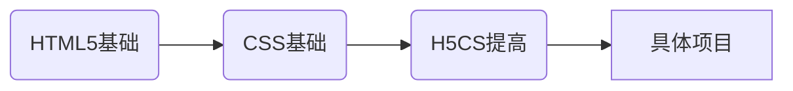
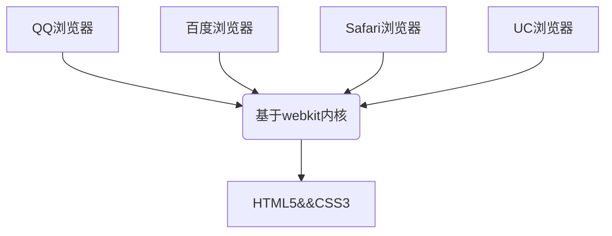

感谢黑马程序员 pink老师提供的视频教程，内容均来自b站黑马程序员官方视频

[toc]

# 0 导读——学习路线



# 1 HTML 基础

## 1.1 简介

- 什么是网页？

  <font color="red">网站</font>是指在因特网上根据一定的规则，使用HTML等制作的用于展示特定内容相关的网页的集合。<font color="red">网页</font>是网站的"一页"，通常是 <font color="red">HTML 格式的文件</font>，他要通过浏览器来阅读。
  
- 网页的组成

  网页是构成网站的基本元素，它通常是由<font color="red">图片、链接、文字、声音、视频</font>等元素组成。通常我们看到的网页常见的是以 .html 或 .htm 后缀结尾的文件，因此将其俗称为 <font color="red">HTML 文件</font>

- HTML 的定义

  <font color="red">HTML</font>指的是<font color="red">超文本标记语言(Hyper Text Markup Language)</font>，它是用来描述网页的一种语言。HTML 不是一种编程语言，而是一种标记语言。

  标记语言是一套标记标签（markup tag）

- 网页的形成

  网页是由网页元素组成的，这些元素时利用 html 标签描述出来，然后通过浏览器解析来显示给用户的

  > 前端人员开发代码 → 浏览器显示代码(解析、渲染) → 生成最后的 Web 页面

所谓超文本，有两层含义：

1. 它可以加入图片、声音、动画、多媒体等内容（超越了文本限制）
2. 它还可以从一个文件跳转到另一个文件，与世界各地主机的文件连接（超链接文本）


## 1.2 常用浏览器以及内核

### 1.2.1 常用浏览器

浏览器是解析、运行、显示网页的平台。常用的浏览器主要包括了IE、Firefox、Chrome、Safari 和 Opera ，平时称为五大浏览器。

> IE 11在 2022 年 6 月 15 日已经停用，微软推出 edge 浏览器来替代速度慢的 IE

### 1.2.2 浏览器内核

浏览器内核（渲染引擎）：负责读取网页内容、整理讯息、计算网页的显示方式并显示页面

| 浏览器       | 内核    | 备注                                                |
| ------------ | ------- | --------------------------------------------------- |
| IE           | Trident | IE、猎豹、360极速浏览器、百度浏览器                 |
| Firefox      | Gecko   | 火狐浏览器内核                                      |
| Safari       | Webkit  | 苹果浏览器内核                                      |
| Chrome/Opera | Blink   | Chrome/Opera 浏览器内核。Blink 其实是 Webkit 的分支 |

目前国内一般浏览器都会采用 Webkit / Blink 内核，如 360、UC、QQ、搜狗


## 1.3 Web 标准

<font color="red">Web 标准</font>是由 W3C 组织和其他标准化组织制定的一系列标准的集合。

### 1.3.1 为什么需要 Web 标准

遵循 Web 标准除了可以让不同的开发人员写出的页面更加标准、更加统一外，还具有以下优点：

1. 让 Web 的发展前景更加广阔
2. 内容能被更广泛的设备访问
3. 更容易被搜索引擎搜索
4. 降低网站流量费用
5. 使得网站更易于维护
6. 提高页面浏览速度


### 1.3.2 Web 标准的构成

主要包含==结构（Structure）==、==表现（presentation）==和==行为（behavior）==

| 标准 | 说明                                                         |
| ---- | ------------------------------------------------------------ |
| 结构 | 结构用于对**网页元素**进行整理和分类，现阶段主要学的是 HTML  |
| 表现 | 表现用于设置网页元素的版式、颜色、大小等**外观样式**，主要指的是 CSS |
| 行为 | 行为是指网页模型的定义及**交互**的编写，现阶段主要学的是 Javascript |

Web 标准提出的最佳体验方案：<font color="red">结构、样式、行为相分离</font>

简单理解就是：<font color="red">结构写到 HTML 文件中，表现写到 CSS 文件中，行为写到 Javascript 中</font>


# 2 HTML 基础标签

## 2.1 HTML 基本语法规范

1. HTML 标签是由<font color="red">由尖括号包围起来的关键词</font>，如`<html></html>`
2. HTML 标签通常是<font color="red">成对出现的</font>，我们称为<font color="red">双标签</font>。标签中第一个标签为开始标签，第二个为结束标签
3. 有些特殊的标签必须是单个标签（极少情况），例如`<br />`，我们称之为单标签

## 2.2 标签关系

双标签关系可以分为两类：包含关系和并列关系

```html
<!-- 包含关系示例 -->
<head>
    <title></title>
</head>

<!-- 并列关系 -->
<head></head>
<body></body>
```

## 2.3 HTML 基本结构标签

| 标签名            | 定义       | 说明                                                       |
| ----------------- | ---------- | ---------------------------------------------------------- |
| `<html></html>`   | HTML 标签  | 页面中最大的标签，根标签                                   |
| `<head></head>`   | 文档的头部 | head 标签中我们必须要设置的标签是 title                    |
| `<title></title>` | 文档的标题 | 让页面拥有一个属于自己的网页标题                           |
| `<body></body>`   | 文档的主体 | 元素包含文档的所有内容，页面内容基本上都是放在 body 里面的 |

## 2.4 VsCode推荐插件

| 插件                                                      | 作用                            |
| --------------------------------------------------------- | ------------------------------- |
| Chinese (Simplified) (简体中文) Language Pack for VS Code | 中文（简体）语言包              |
| open in browser                                           | 右击选择浏览器打开html文件      |
| Auto Rename Tag                                           | 自动重命名配对的HTML / XML 标签 |
| CSS Peek                                                  | 追踪至样式                      |


### 2.4.1 vscode 一些常用快键键

- Alt+Shfit + ↓ 或 ↑ ：向上或向下复制粘贴行代码 
- Ctrl + Enter：实现光标换行
- Ctrl + L：选中单行


## 2.5 DOCTYPE 和 lang 以及字符集的作用

### 2.5.1 文档类型声明标签

`<!DOCTYPE>`文档类型声明，作用就是告诉浏览器网页使用的HTML的版本。如下：

```html
<!DOCTYPE html>
```

这句代码的意思是：**当前页面采取 HTML5 版本显示网页。**

注意：

1. `<!DOCTYPE>`声明位于文档中的最前面的位置，处于 `<html>` 标签之前
2. `<!DOCTYPE>`不是一个 HTML 标签，它就是文档类型声明标签


### 2.5.2 lang 语言种类

用来定义当前文档显示的语言

1. `en` ：定义语言为英语
2. `zh-ch` ：定义语言为中文

> 其实对于文档显示来说，定义成 `en`的文档也可以显示中文，定义为`zh-cn`的文档也可以显示英文，这个主要用于提示搜索引擎当前页面所使用的的语言，在网页翻译的插件作用尤为明显


### 2.5.3 字符集

字符集（character set）是多个字符的集合。以便计算机能够识别和存储各种文字。在 `<head>`标签内，可以通过`<meta>`标签的`charset`属性来规定 HTML 文档该使用那种字符编码

```html
<meta charset="UTF-8">
```

> `charaset`属性常用到的属性值有：GB2312、BIG5、GBK和UTF-8，其中GB2312代表的是简体中文、BIG5代表的繁体中文、GBK 综合了简体和繁体中文，还加入了日文、韩文等字符，而目前最常用应该是 UTF-8，被称为万国码，基本包含了全世界所有国家需要用到的字符


## 2.6 标签语义

根据标签的语义，在合适的地方给一个合理的标签，可以使页面结构更加清晰


## 2.7 HTML 常用标签

### 2.7.1 *标题标签

为了使网页更具有语义化，我们经常会在页面中用到标题标签。HTML 提供了六个等级的网页标题，即`<h1> - <h6>`。h 为 head 的缩写

```html
<h1>我是一级标题</h1>
<h2>我是二级标题</h2>
<h3>我是三级标题</h3>
<h4>我是四级标题</h4>
<h5>我是五级标题</h5>
<h6>我是六级标题</h6>
```

> 标签显示为加粗，重要性从上到下递减


### 2.7.2 *段落和换行标签

在网页中，要把文字有条理地显示出来，就需要将这些文字分段显示。在 HTML 标签中，`<p>`标签用于<font color="red">定义段落</font>，它可以将整个网页分为若干个段落

```html
<p> 我是一个段落标签 </p>
```

> p 为 paragraph 的简写

<font color="red">标签语义：用于将 HTML 文档分割成若干段落</font>

在 VS code 中，如果文本太长，在一行显示不方便，我们可以打开 VS code 的自动换行功能，快捷键为 Alt + Z，如下：


**特点：**

1. 文本在一个段落中会根据浏览器窗口大小自动换行
2. 段落和段落之间保有空隙

在 HTML 中，如果我们希望某段文本强制换行显示，就需要使用换行标签`<br>`

> `<br>`为"break"的简写

**特点：**

1. `<br>`是个<font color="red">单标签</font>
2. `<br>`标签只是简单地开始新的一行，跟段落不一样，段落之间会有一定的<font color="red">间距</font>


### 综合案例：体育新闻

要求实现效果如下：


实现代码如下：

```html
<!DOCTYPE html>
<html lang="en">
<head>
    <meta charset="UTF-8">
    <meta name="viewport" content="width=device-width, initial-scale=1.0">
    <meta http-equiv="X-UA-Compatible" content="ie=edge">
    <title>体育新闻</title>
</head>
<body>
    <h1>水花61分伊戈达拉制胜抢断 西决勇士再胜开拓者总分2-0</h1>
    <h4>数据统计：水花兄弟合砍61分</h4>
    <p>库里22投11中，三分14投4中，罚球11罚全中得到37分8篮板8助攻，职业生涯季后赛得分30+次数来到35次，超过哈登排名现役第3位，仅次于詹姆斯和杜兰特。汤普森22投8中，三分8投4中得到24分3篮板2助攻，德拉蒙德-格林得到16分10篮板7助攻5盖帽，凯文-鲁尼得到14分7篮板2助攻，今天勇士有7名替补出场。</p>
    <h4>兄弟对决升级：小库里给哥哥造成压力</h4>
    <p>库里兄弟是NBA历史上第一对在分区决赛相遇的兄弟。在西决第1场中，小库里没有给哥哥造成压力，他出场19分钟，7投1中只得到3分3篮板2助攻，在场期间输掉10分。但在西决第2场中，小库里攻防两端都打出杰出的表现，全场送出4次抢断，包括直接抢断自己的哥哥库里，在防守端给库里造成了极大的困扰。</p>
    <p>作者:<br>pink老师2019-8-8</p>
</body>
</html>
```


## 2.8 文本格式化标签

在网页中，有时需要为文字设置**粗体**、*斜体*或<u>下划线</u>等效果，这时候就需要用到 HTML 中的文本格式化标签，使文字以特殊的方式显示

**标签语义**：突出重要性，比普通文字更重要

| 语义   | 标签                           | 说明                                      |
| ------ | ------------------------------ | ----------------------------------------- |
| 加粗   | `<strong></strong>`或`<b></b>` | 推荐使用`<strong></strong>`，语义更加强烈 |
| 倾斜   | `<em></em>`或`<i></i>`         | 推荐使用`<em></em>`，语义更加强烈         |
| 删除线 | `<del></del>`或`<s></s>`       | 推荐使用`<del></del>`，语义更加强烈       |
| 下划线 | `<ins></ins>`或`<u></u>`       | 推荐使用`<ins></ins>`，语义更加强烈       |


## 2.9  div 标签和 span 标签

div 标签和 span 标签没有语义，他们就是一个普通的盒子，用来装内容

> div 是 "division" 的缩写，表示分割、分区。span 表示跨度、跨距

特点：

1. div 标签用来布局，但是一行只能放一个 div，是一个大盒子
2. span 标签用来布局，一行上可以有多个 span，是一个小盒子


## 2.10 图像标签和路径

### 2.10.1 图像标签

在 HTML 标签中，``标签用于定义 HTML 页面中的图像

```html

```

> `img` 为image的缩写，`src` 是`img`的<font color="red">必选属性</font>，用于<font color="red">指定图像文件的路径</font>

图像标签的属性：

| 属性   | 属性值       | 说明                                            |
| ------ | ------------ | ----------------------------------------------- |
| src    | 图片路径     | 必要属性                                        |
| alt    | 文本         | 替换文本，当图像不能显示时显示这个alt里面的文本 |
| title  | 文本         | 提示文本。鼠标悬停时提示图片内容的文本          |
| width  | 像素或百分比 | 设置图片的宽度                                  |
| height | 像素或百分比 | 设置图片的高度                                  |
| border | 像素或百分比 | 设置图片的边框粗细                              |

即使图片路径出现错误，title 提示文本仍然有效，我们将鼠标悬停在**裂开图片**或者是**替换文本**上都可以显示出提示文本，如下图：


我们对于宽度和高度的设置，通常只需要修改其中一个即可，浏览器解析器会自动帮助我们等比例缩放，如果我们同时设置宽度和高度，可能会造成图像失真的情况

```html
<!-- 测试代码 -->


```

效果如下:


**图像标签注意点：**

1. 图像标签可以拥有多个属性，必须写在标签名的后面

2. 属性之间不分先后顺序，标签名和属性、属性与属性之间均以空格分开

   > 例如：`img` 和 `title`，`title` 和 `width` 之间都需要用空格分隔

3. 属性采取键值对的格式，即 key="value"的格式

### 2.10.2 路径

路径可以分为：

- 相对路径：以引用文件所在位置为参考基础，而建立出的目录路径
- 绝对路径：从根目录开始追踪的路径，一般以盘符为起点

| 相对路径   | 符号 | 说明                                                        |
| ---------- | ---- | ----------------------------------------------------------- |
| 同一级路径 |      | 图像文件位于  HTML 文件同一级，如``    |
| 下一级路径 | /    | 图像文件位于 HTML 文件下一级，如`` |
| 上一级路径 | ../  | 图像文件位于 HTML 文件上一级，如``  |

**特别需要我们注意的：**

相对路径使用的是斜杆`/`，而绝对路径使用的是反斜杠`\`，例如`"C:\Users\Administrator\Desktop\前端测试\素材\1985.jpg"`

绝对路径如果引用其他网站的图片，例如`http://www.itcast.cn/`，也是使用斜杆

## 2.11 *超链接标签

在 HTML 标签中 ，`<a>`标签用于定义超链接，作用是**从一个页面链接到另一个页面**

### 2.11.1 超链接语法格式

```html
<a href="跳转目标" target="目标窗口的弹出方式"> 文本或图像 </a>
```

> a 是 "anchor" 的缩写，意为：锚

两个属性的作用如下：

| 属性   | 作用                                                         |
| ------ | ------------------------------------------------------------ |
| href   | 用于指定链接目标的 url 地址，（必要属性）当标签应用 href 属性时，它就具有了超链接的功能 |
| target | 用于指定链接页面的打开方式，其中`_self`为默认值，表示在当前页面中打开，`_blank`为在新窗口中打开 |

### 2.11.2 链接分类

1. 外部链接：又称"反向链接" 或 "导入链接"，是指通过一个网站的链接到另一个网站的链接

   ```html
   <a href="https://www.tencent.com">腾讯</a>
   ```

2. 内部链接：在同一网站域名下的页面内容的彼此相互链接

3. 空链接：未指派的链接

   ```html
   <a href="#">首页</a>
   ```

4. 下载链接：如果 href 链接的是一个压缩包或文件，那么会下载这个文件

5. 网页元素链接：在网页中各种网页元素，如文本、图像、表格、音频、视频等都可以添加超链接

6. 锚点链接：在本页面中实现内部元素之间或与从内部元素到其他页面的跳转，主要是为了解决页面内容过长，查看不方便的问题

#### 锚点链接

实现步骤：

1. 在链接的文本的 href 属性中，设置属性值为 #id 的形式，如`<a href="#one">第一集</a>`
2. 找到目标位置标签，里面添加 `id= name`，如`<p id="one">第一集介绍</p>`

##### 拓展：链接到其他页面的锚点

锚点链接不仅可以链接到本页面的元素内容，还可以链接到其他页面，语法如下;

```html
<a href="链接的文本地址#锚点名称">…</a>
```

> 建立锚点链接的步骤概括来说就两步：①打锚；②抛锚，与链接到同一页面中的锚点不同，链接到其他锚点时，需要在打锚时前面加上链接的文本地址


## 2.12 HTML 中的注释和特殊字符

### 2.12.1 注释

注释的作用是来帮助开发人员理解和阅读代码的，注释里面的内容不会被执行

HTML 中的行注释和块注释都是以`<!--`开头，以`-->`结束，如下：

```html
<!-- 这是一个注释 -->
```

> 行注释在 VS code 中的快捷键为：Ctrl + /，块注释在 VS code 中的快捷键为：Ctrl + Shfit + /


### 2.12.2 特殊字符

在 HTML 页面中，一些特殊的符号很难或者不方便直接使用，此时我们就可以使用下面的字符替代

| 特殊字符 | 描述        | 代码       |
| -------- | ----------- | ---------- |
| &nbsp;   | 空格符      | `nbsp;`    |
| &lt;     | 小于符      | `&lt;`     |
| &gt;     | 大于符      | `&gt;`     |
| &yen;    | 人名币/日元 | `&yen;`    |
| &copy;   | 版权        | `&copy;`   |
| &reg;    | 注册商标    | `&reg;`    |
| &deg;    | 摄氏度      | `&deg;`    |
| &plusmn; | 正负号      | `&plusmn;` |
| &times;  | 乘号        | `&times;`  |
| &divide; | 除号        | `&divide;` |
| &sup2;   | 平方        | `&sup2;`   |
| &sup3;   | 立方        | `&sup3;`   |


# 3 HTML 高阶标签

## 3.1 表格标签

### 3.1.1 表格的主要作用

表格主要用于<font color="red">显示、展示数据</font>，表格可以让数据显示地非常工整，可读性好。


### 3.1.2 表格的基本语法

```html
<table>
    <!-- 单元行 -->
    <tr>
        <!-- 单元格 -->
        <td></td>
    </tr>
</table>
```

1.  `<table></table>`是用于定义表格的标签
2. `<tr></tr>`标签用于定义表格中的行，必须嵌套在 `<table></table>`标签中
3. `<td></td>`用于定义表格中的单元格，必须嵌套在`<tr></tr>`标签中

### 3.1.3 表头单元格标签

一般表头单元格位于表格的第一行或第一列，表头单元格里面的文本内容居中加粗显示

`<th>`标签表示 HTML 表格的表头部分

```html
<table>
    <th>姓名</th>
        …
    <tr>
    	…
    </tr>
</table>
```

```html
<table>
    <tr>
        <th>姓名</th>
        <th>性别</th>
        <th>年龄</th>
    </tr>
    <tr>
        <td>张学友</td>
        <td>男</td>
        <td>58</td>
    </tr>
    <tr>
        <td>郭富城</td>
        <td>男</td>
        <td>51</td>
    </tr>
    <tr>
        <td>黎明</td>
        <td>男</td>
        <td>57</td>
    </tr>
</table>
```

显示效果如下：


### 3.1.4 表格相关属性

表格标签的这部分属性实际开发中并不常用，后面会通过 CSS 来设置

| 属性名       | 属性值                  | 描述                                                         |
| ------------ | ----------------------- | ------------------------------------------------------------ |
| align        | left \| center \| right | 规定表格相对周围元素的对齐方式                               |
| border       | 像素值 或""             | 规定表格单元是否拥有边框，如果有数值，表示的是边框的粗细，默认为""，表示没有边框 |
| cellpadding  | 像素值                  | 规定单元边沿与其内容之间的空白，默认是 1 像素                |
| cellspacing  | 像素值                  | 规定单元格之间的空白，默认 2 像素                            |
| width/height | 像素值或百分比          | 规定表格的宽度、高度                                         |

区分 cellpadding 和 cellspacing:


> 当我们设置 cellspacing 的值为 0时，"双线变单线"

### 3.1.5 表格的结构标签

使用场景：因为表格可能很长，为了更好地表示表格的语义，可以将表格分割为==表格头部==和==表格主体==两大部分

在表格标签中，分别用：<font color="red">`<thead>`标签表示表格的头部，`<tbody>`标签表示表格的主体区域</font>，这样可以更好地分清楚表格结构

1. `<thead></thead>`：用于定义表格的头部。`<thead>`内部必须拥有`<tr>`标签，一般是位于第一行
2. `<tbody></tbody>`：用于定义表格的主体，主要用于存放数据本体
3. 以上两个标签都是放在 `<table></table>`标签中

### 3.1.6 合并单元格

特殊情况下，可以把多个单元格合并成一个单元格

合并单元格的方式：

- 跨行合并：rowspan="合并单元格个数"
- 跨列合并：colspan="合并单元格的个数"

目标单元格：

- 跨行：最上侧单元格为目标单元格，写合并代码
- 跨列：最左侧单元格为目标单元格，写合并代码


案例：个人简历

```html
<table border="1" cellspacing="0" cellpadding="0">
    <tr>
        <td colspan="5" align="center">个人简历</td>
    </tr>
    <tr>
        <td>姓&nbsp;&nbsp;名:</td>
        <td>&nbsp;&nbsp;&nbsp;&nbsp;&nbsp;&nbsp;&nbsp;&nbsp;</td>
        <td>性&nbsp;&nbsp;别:</td>
        <td>&nbsp;&nbsp;&nbsp;&nbsp;&nbsp;&nbsp;&nbsp;&nbsp;</td>
        <td rowspan="4">照片</td>
    </tr>
    <tr>
        <td>婚姻状况:</td>
        <td>&nbsp;&nbsp;&nbsp;&nbsp;&nbsp;&nbsp;&nbsp;&nbsp;</td>
        <td>出生年月:</td>
        <td>&nbsp;&nbsp;&nbsp;&nbsp;&nbsp;&nbsp;&nbsp;&nbsp;</td>
    </tr>
    <tr>
        <td>民&nbsp;&nbsp;族:</td>
        <td>&nbsp;&nbsp;&nbsp;&nbsp;&nbsp;&nbsp;&nbsp;&nbsp;</td>
        <td>政治面貌:</td>
        <td>&nbsp;&nbsp;&nbsp;&nbsp;&nbsp;&nbsp;&nbsp;&nbsp;</td>
    </tr>
    <tr>
        <td>身&nbsp;&nbsp;高:</td>
        <td>&nbsp;&nbsp;&nbsp;&nbsp;&nbsp;&nbsp;&nbsp;&nbsp;</td>
        <td>学&nbsp;&nbsp;历:</td>
        <td>&nbsp;&nbsp;&nbsp;&nbsp;&nbsp;&nbsp;&nbsp;&nbsp;</td>
    </tr>
</table>
```

## 3.2 列表标签

表格是用来展示数据的，那么<font color="red">列表就是用来布局的</font>，列表最大的特点就是整齐有序，它作为布局更加自由和方便

### 3.2.1 无序列表

无序列表的基本语法格式如下：

```html
<ul>
    <li>列表项1</li>
    <li>列表项2</li>
    <li>列表项3</li>
</ul>
```

> 1. 无序列表的各个列表项之间没有顺序级别之分，是并列的
> 2. `<ul></ul>`中只能嵌套`<li></li>`，直接在`<ul></ul>`标签中输入其他标签或是文字的做法是不被允许的
> 3. `<li></li>`之间相当于一个容器，可以容纳所有元素
> 4. 无序列表带有自己的样式属性，我们通常会使用 CSS 将前面的小圆点去除

无序列表中的属性主要有 type，其属性值可以为：

- disc：默认实心圆
- circle：空心圆
- square：方块
- none：不显示

### 3.2.2 有序列表

无序列表即为==有排列顺序==的列表，其各个列表都会按照一定的顺序排列定义

在 HTML 标签中，`<ol>`标签用于定义有序列表，列表排序以数字来显示，并且使用`<li>`标签来定义列表项

有序列表的基本语法格式如下：

```html
<ol>
    <li>列表项1</li>
    <li>列表项2</li>
    <li>列表项3</li>
</ol>
```

> 有序列表的注意事项和无序列表基本一致

`ol`的属性有 type 和 start，type 表示有序列表前面的样式符号的类型， start 表示起始顺序是多少

type 的属性值有：A、a、I、i、1（默认样式是数字，还可以从大写或小写的字母或落罗马数字中进行选择）

### 3.2.3 自定义列表

自定义列表常用于对术语或名词进行解释和描述，定义列表的列表项前没有项目符号

如下图：


在 HTML 标签中，`<dl>`标签用于定义描述列表（或定义列表），该标签会与`<dt>`（定义项目）和`<dd>`（描述子项目）一起使用

语法格式如下：

```html
<dl>
	<dt>名词1</dt>
    <dd>名词1解释1</dd>
    <dd>名词1解释2</dd>
</dl>
```

## 3.3 表单标签

### 3.3.1 为什么需要表单

使用表单的目的是为了<font color="red">收集用户信息</font>

在网页中，我们也需要跟用户进行交互，收集用户信息，这时候就需要用到表单

### 3.3.2 表单的组成

在 HTML 中，一个完整的表单通常由<font color="red">表单域、表单控件（也称为表单元素）和提示信息</font>三部分构成


### 3.3.3 表单域

**表单域**是一个<font color="red">包含表单元素的区域</font>

在 HTML 标签，`<form>`标签用于定义表单域，以实现用户信息的收集和传递

<font color="red">`<form>`会把范围内的表单元素信息提交给服务器</font>

```html
<form action="url地址" method="提交方式" name="表单域名称">
各种表单元素控件
</form>
```

常用属性：

| 属性   | 属性值   | 作用                                               |
| ------ | -------- | -------------------------------------------------- |
| action | url地址  | 用于指定接受并处理表单数据的服务器程序的 url 地址  |
| method | get/post | 用于设置表单数据的提交方式，其取值为get/post       |
| name   | 名称     | 用于指定表单的名称，以区分同一个页面中的多个表单域 |

### 3.3.4 表单标签

#### 3.3.4.1 input 表单元素

在英文单词中，input 是 输入的意思，而在 表单元素中 input 标签用于收集用户信息

在input 标签中，包含一个 type 属性，根据不同的 type 属性值，输入字段拥有很多的形式（可以是文本字段、复选框、掩码后的文本控件、单选按钮、按钮等）

```html
<input type="属性值" />
```

- input 标签为单标签
- type 属性设置不同的属性值用来指定不同的控件类型

type 属性的属性值及描述如下：

| 属性值   | 描述                                                         |
| -------- | ------------------------------------------------------------ |
| button   | 定义可点击按钮（多数情况下，可以通过 javascript 启动）       |
| checkbox | 定义复选框                                                   |
| file     | 定义输入字段和"浏览"按钮，供文件上传                         |
| hidden   | 定义隐藏的输入字段                                           |
| image    | 定义图像形式的提交按钮                                       |
| password | 定义密码字段。该字段中的字符被掩码                           |
| radio    | 定义单选按钮                                                 |
| reset    | 定义重置按钮。重置按钮会清除表单中的所有数据                 |
| submit   | 定义提交按钮。提交按钮会把表单数据发送到服务器               |
| text     | 定义单行的输入字段，用户可在其中输入文本。默认宽度为 20 个字符 |

例如：

```html
<form action="">
    用户名: <input type="text" value="老大"><br>
    密码: <input type="password"><br>
    <!-- 要实现多个实体的单选功能，需要给每个实体添加相同的name -->
    性别: <input type="radio" name="gender" value="男">男 <input type="radio" name="gender" value="女">女 <br>
    爱好: <input type="checkbox" name="hobby">吃饭 <input type="checkbox" name="hobby">睡觉 <input type="checkbox" name="hobby">打豆豆
    <input type="submit" value="免费注册">
    <input type="reset" value="重置">
</form>
```

除 type 属性外，`<input>`标签还有其他很多属性，其中常用属性如下：

| 属性        | 属性值        | 描述                                                         |
| ----------- | ------------- | ------------------------------------------------------------ |
| name        | 由用户 自定义 | 定义 input 元素的名称                                        |
| value       | 由用户自定义  | 规定 input 元素的值                                          |
| checked     | checked       | 规定此 input 元素首次加载时应当被选中                        |
| maxlength   | 正整数        | 规定输入字段中的字符的最大长度                               |
| placeholder | 由用户自定义  | 提供可输入字段预期值的提示信息，该提示在输入字段为空时显示，并在字段获得焦点时消失 |

注意事项：

1. name 和 value 是每个表单元素都有的属性值，主要给后台人员使用
2. name 表单元素的使用，要求<font color="red">单选按钮和复选按钮都要有相同的 name 值</font>
3. placeholder 和 value 不同，placeholder是提示信息，并不会传入后台，而 value 的值则会传入到后台共开发人员使用
4. checked 属性主要针对单选按钮和复选按钮，主要用刚打开页面时，默认选中的表单元素


**问题1：**有些表单元素刚打开页面时默认显示文字字段怎么实现？

答：可以给这些表单元素设置 value = "默认属性值" 的形式

```html
<input type="text" value="默认属性值">
```

**问题2：**页面中表单元素很多，如果区分不同的表单元素

答：可以通过设置相同的 name 来定义同一表单元素

```html
<input type="radio" name="gender">男
<input type="radio" name="gender">女
```

**问题3**：如何让页面一打开就让某个单选按钮或者复选按钮处于选中状态？

答：使用 checked 属性表示 默认选中状态

```html
<input type="radio" checked="checked">
```

**问题4：**如何让 input 表单元素展示不同的形态？

答：给 input 表单标签设置 type 属性


#### 3.3.4.2 label 标签

label 标签为 input 元素定义标注（标签）

为实现如下效果，即我们在点击按钮旁边的头像，即可以实现选中对应的按钮


这时候我们可以通过 label 标签实现这一功能

label 标签用于绑定一个表单元素，当点击 label 标签内的文本时，浏览器就会自动将焦点（光标）转到或者选择对应的表单元素上，用来增加用户体验。

**语法：**

```html
<label for="sex"></label>
<input type="radio" name="sex" id="sex">
```

> 核心：label 标签的<font color="red"> for 属性</font>应当与相关元素的 <font color="red">id 属性相同</font>


#### 3.3.5 select 下拉表单元素

在页面中，如果有多个选项让用户选择，并且想要节约页面空间，我们可以使用 select 标签空间定义<font color="red">下拉列表</font>，语法如下：

```html
<select>
	<option>选项1</option>
	<option>选项2</option>
	…
</select>
```

例如：

```html
<form>
    籍贯:
    <select>
        <option>山东</option>
        <option>北京</option>
        <option selected="selected">天津</option>
    </select>
</form>
```

执行结果如下：


注意事项：

1. select 中至少包含一对 option
2. 在 option 中定义 `selected="selected"`，当前项即为默认选中项

### 3.3.6 textarea 文本域标签

使用场景：当用户输入 内容较多的情况下，我们就不能使用 文本框 表单了，此时我们可以使用 textarea 标签。在表单元素中，<font color="red"> textarea 标签是用于定义多行文本输入的控件</font>，语法如下：

```html
<form>
	<textarea rows="2" cols="30">个人简介</textarea>
</form>
```

> 1. 通过 textarea 标签可以轻松创建多行文本输入框
> 2. cols 和 rows 用来控制显示的每行字符数和显示的行数


# 4 CSS 层叠样式表

## 4.1 CSS 简介

CSS 的主要用于<font color="red">美化网页，布局页面</font>

CSS 是层叠样式表(Cascading Style Sheets)的简称，有时我们也会称之为 ==CSS 样式表== 或 ==级联样式表==

CSS 主要用于设置 HTML 页面中的==文本内容==（字体、大小、对齐方式等）、==图形的外形==（宽高、边框样式、边距等）以及==版面的布局和外观显示样式==

## 4.2 CSS 语法规范

CSS规则主要是由两个主要部分组成的：<font color="red">选择器以及一条或多条声明，一条声明是由一个或多个键值对组成的</font>


- <font color="red">选择器</font>是用于指定的 CSS 样式的 HTML 标签，花括号内是对该对象设置的具体样式
- 属性和属性值以"键值对"的形式存在
- 属性和值之间使用英文的 分号`:`分隔
- 键值对之间以英文的冒号`;`分隔

## 4.2 CSS 代码风格

### 4.2.1 样式格式书写

1. 紧凑格式

   ```css
   h3 {color: deeppink; font-size: 20px;}
   ```

2. 展开格式（==推荐==）

   ```css
   h3 {
   	color: deeppink;
   	font-size:20px;
   }
   ```

   > 但是显然，这样书写会产生许多空白符，造成浪费，但我们仍然推荐这么书写，在实际开发过程中，我们会使用代码压缩工具来去除这些空白符

### 4.2.2 样式大小写

强烈推荐样式选择器、属性名、属性值等关键字全部使用**小写字母**，特殊情况除外


### 4.2.3 空格规范

1. 在属性值前面，冒号`:`后面，保留一个空格
2. 选择器（标签）和大括号`{`中间保留空格

## 4.3 CSS 选择器

选择器的作用简单来说就是用来<font color="red">选择指定的标签</font>

选择器可以分为==基础选择器==和==复合选择器==两大类：

- 基础选择器是由<font color='red'>单个选择器</font>组成的
- 基础选择器又包括：<font color="red">标签选择器、类选择器、id选择器和通配符选择器</font>

关于 CSS 的选择器，我们可以参考 w3school的[参考手册](https://www.w3school.com.cn/cssref/css_selectors.asp)，我们摘取其中重要的选择器来讲解

### 4.3.1 基础选择器

#### 4.3.1.1 标签选择器

<font color="red">标签选择器</font>（元素选择器）是指用 HTML 标签名称作为选择器，按标签名称分类，为页面中某一类标签指定统一的 CSS 样式

**语法：**

```
标签名 {
	属性1: 属性值1;
	属性2: 属性值2;
	属性3: 属性值3;
	…
}
```

**作用：**标签选择器可以把某一类标签全部选择出来，比如所有的 div标签和 span标签

**优点：**能快速为页面中同类型的标签统一设置样式

**缺点：**不能设置差异化样式，只能选择这一类的全部标签


#### 4.3.1.2 类选择器

如果想要差异化选择不同的标签，单独选择一个或者某几个，可以使用<font color='red'>类选择器</font>

语法

```css
.className {
	属性1: 属性值1;
	…
}
```

样式的定义通过点`.`来定义，结构则需要 **class 属性**来调用 class 类的意思

对于长名称或词组可以使用下划线`_`来作为选择器命令，不要使用纯数字、中文等命名，尽量使用英文字母来表示，并且命名要有意义

在附件的 web 规范手册中有相关说明，这里截取其中的命令规范来看：

```
  头：header 
  内容：content/container
  尾：footer
  导航：nav    
  侧栏：sidebar
  栏目：column
  页面外围控制整体布局宽度：wrapper
  左右中：left right center
  登录条：loginbar
  标志：logo
  广告：banner
  页面主体：main
  热点：hot
  新闻：news
  下载：download
  子导航：subnav
  菜单：menu
  子菜单：submenu
  搜索：search
  友情链接：friendlink
  页脚：footer
  版权：copyright
  滚动：scroll
  内容：content
  标签页：tab
  文章列表：list
  提示信息：msg
  小技巧：tips
  栏目标题：title
  加入：joinus
  指南：guild
  服务：service
  注册：regsiter
  状态：status
  投票：vote
  合作伙伴：partner
(二)注释的写法:
  /* Footer */
  内容区
  /* End Footer */
(三)id的命名:
  (1)页面结构
  容器: container
  页头：header
  内容：content/container
  页面主体：main
  页尾：footer
  导航：nav
  侧栏：sidebar
  栏目：column
  页面外围控制整体布局宽度：wrapper
  左右中：left right center

  (2)导航
  导航：nav
  主导航：mainbav
  子导航：subnav
  顶导航：topnav
  边导航：sidebar
  左导航：leftsidebar
  右导航：rightsidebar
  菜单：menu
  子菜单：submenu
  标题: title
  摘要: summary

  (3)功能
  标志：logo
  广告：banner
  登陆：login
  登录条：loginbar
  注册：regsiter
  搜索：search
  功能区：shop
  标题：title
  加入：joinus
  状态：status
  按钮：btn
  滚动：scroll
  标签页：tab
  文章列表：list
  提示信息：msg
  当前的: current
  小技巧：tips
  图标: icon
  注释：note
  指南：guild
  服务：service
  热点：hot
  新闻：news
  下载：download
  投票：vote
  合作伙伴：partner
  友情链接：link
  版权：copyright
```


#### 4.3.1.3 类选择器 - 多类名

我们可以给一个标签指定<font color="red">多个类名</font>，从而达到更多的选择目的。这些类名都可以选出这个标签

```css
<div class="red font20">亚瑟</font>
```

- 在标签 class 属性中写多个类名
- 多个类名中间必须必须以空格分隔
- 使用多类名可以提高代码复用度，节省代码量，并且使得修改起来也更加方便

#### 4.3.1.4 id 选择器

id 选择器可以为标有特定 id 的 HTML 元素指定的特定的样式

HTML 元素以 ID 属性来设置 id 选择器， CSS 中 id 选择器以 `#` 来定义

语法规范如下：

```css
#id {
	属性1: 属性值1；
	…
}
```

**id 选择器和 类选择器之间的区别：**

- id选择器是以`#`开头定义的，而类选择器是以`.`开头定义的
- id 选择器在 HTML 中通过 `id`  属性来获取使用，而类选择器是通过`class`属性来获取使用的
- 同一个页面中一个 id 选择器只能出现一次，是唯一的，而类选择器可以出现多次，所以 id 选择器的针对性更强
- 类选择器在修改样式中使用更多，而 id 选择器一般用于页面唯一性的元素上，经常和 Javascript 搭配

#### 4.3.1.5 通配符选择器

在 CSS 汇中，通配符选择器使用 `*`来定义，它表示选取页面中所有元素(标签)

**语法**

```css
* {
	属性1: 属性值1;
	…
}
```

通配符选择器使用最多的场景便是<font color="red">清除浏览器默认的内外边距</font>，具体语法如下：

```css
* {
	margin: 0;
    padding: 0;
}
```

> 通配符选择器不需要调用，默认是作用于页面全局


### 4.3.2 复合选择器（也称高级选择器）

在 CSS 中，可以根据选择器的类型将选择器分为<font color="red">基础选择器</font>和<font color="red">复合选择器</font>，复合选择器就是建立在基础选择器之上的，是由基本选择器组合形成的

复合选择器主要包括了以下四类：

- <font color="red">后代选择器</font>
- 子选择器
- 并集选择器
- 交集选择器
- <font color="red">伪类选择器</font>

#### 4.3.2.1 后代选择器

**后代选择器**可以选择父元素里面子元素，其写法就是把外层标签写前面，内层标签写在后面，中间用空格分隔，语法如下：

```css
元素1 元素2{
	样式声明
}
```

- 元素1 和 元素2 中间用==空格==隔开
- 元素1 是父级，元素2 是后代（子级、孙子级都可以）


#### 4.3.2.2 子选择器

**子选择器**只能选择作为某元素最近一级的子元素，语法如下：

```css
元素1 > 元素2 {
	样式声明	
}
```

> 上述语法表示<font color="red">选择元素1里面的所有直接后代元素2</font>


#### 4.3.2.3 并集选择器

**并集选择器**可以选择多组标签，同时为他们定义相同的样式，通常用于集体声明，语法如下：

```css
元素1, 元素2 {
	样式声明
}
```

#### 4.3.2.4 交集选择器

**交集选择器**用于选择多组标签的重叠部分，为同时具有这几组标签的元素定义样式，语法如下：

```css
选择器1选择器2 {
	样式声明
}
```

- 注意两类选择器最好不要是同时是标签选择器，因为交集选择器中间是没有符号连接的
- 交集选择器中如果有标签选择器，那么标签选择器必须要写在最前面

**示例：**

```css
p.pink {
	color: pink; 
}
/* 既要选择具有p标签同时具有pink这个类的元素 */
```


#### 4.3.2.5 伪类选择器

**伪类选择器**用于向某些选择器添加特殊的效果，比如给链接添加特殊的效果，或选择第一个，第n个元素

伪类选择器书写最大的特点就是<font color="red">冒号(:)表示</font>，比如：:hover、:first-child

伪类选择器分很多，比较常见的有<font color="red">链接伪类、结构伪类</font>

##### 4.3.2.5.1 链接伪类选择器

```css
/* 选择所有未被访问的链接 */
a:link      
/* 选择所有已被访问的链接 */
a:visited
/* 选择鼠标指针悬停其上的链接 */
a:hover
/* 选择活动链接(鼠标按下未弹起的链接) */
a:active
```

<font color="red">链接伪类选择器注意事项</font>

1. 为了确保生效，请按照 ==LVHA== 的顺序声明：link、visited、hover、active
2. 记忆法：**l**o**v**e **ha**te 或 **lv** 包包 **ha**o
3. 因为 a 链接在浏览器中具有默认样式，所以我们实际工作中都需要给链接单独指定样式

> 关于链接伪类的书写顺序，首先就是<font color="red"> link 必须放在首位</font>，link 不放在首位，前面的链接伪类失效；<font color="red">hover 必须放在 active 之前</font>，因为鼠标悬停包含了鼠标激活，如果将 hover  放在 active 后面 ，active 失效；<font color="red">hover 必须放在 link 和 visited 之前</font>；<font color="red">为确保 visited 有效，我们设置的网址必须有效</font>，这样才能记录在浏览器中

实际开发中的写法：

```css
a {
	color: black;
    text-decoration: none;
}

a:hover {
	color: blue;
}
```

##### 4.3.2.5.2 :focus 伪类选择器

<font color="red">:focus 伪类选择器</font>用于获取获得焦点的表单元素

焦点就是光标，一般情况下 `<input>`类表单元素才能获取，因此这个选择器也主要针对于表单元素而言的：

```css
input:focus {
	background-color: yellow;
}
```

 例如：

```css
/* CSS 样式表部分代码 */
input:focus {
    background-color: pink;
}
```

```html
<!-- HTML 主体结构代码 -->
<input type="text">
```

显示效果如下：

我们一将光标定位到输入框中就会发现，背景颜色变成了粉红色


## 4.4 CSS 字体属性

在 CSS 中， font 属性用于定义字体系列（font-family)、大小（font-size）、粗细（font-weight）和字体样式（font-style）

### 4.4.1 font-family

```css
/* css样式表中内容 */
p {
    font-family: Microsoft Yahei;
}
```

```html
<!-- html 结构主体内容 -->
<p>我的字体是微软雅黑</p>
<p>添加字体样式时尽量少使用中文，兼容性不太好</p>
```

- font-family 后面可以接多个字体样式，各个字体样式之间使用逗号分隔，显示优先级从左到右递减
- 一般情况下，如果有空格隔开的多个单词组成的字体，需要加引号
- <font color="red">尽量使用系统默认自带的字体</font>，确保在任何用户的浏览器中都能正常显示
- 我们通常直接给 body 标签设置 font 属性，例如 `body{font-family: "Microsoft Yahei", tahoma, sans-serif, "Hiragino Sans GB";}`

```css
.font32 {
	font-family: Arial, "Microsoft Yahei", "宋体"};
}
```


### 4.4.2 font-size

CSS 中 使用 font-size 属性来==定义字体大小==

```css
p {
	font-size: 20px;
}
```

- px 是我们网页中最常使用的长度单位
- Chrome 浏览器默认的字体大小为 16px
- 不同浏览器可能默认显示的自豪大小不一致，我们尽量给出一个明确大小，不要使用默认大小
- 可以给 body 指定整个页面文字的大小


### 4.4.3 font-weight

CSS 使用 font-weight 属性==设置字体的粗细==

font-weight 可选参数：

- **normal**：正常粗细，默认，在 number 中为400
- **bold**：粗体，在 number 中为 700
- **bolder**：特粗体
- **lighter**：细体
- number：100 | 200 | 300 | 400 | 500 | 600 | 700 | 800 |900

### 4.4.4 font-style

CSS 中使用 font-style 来设置文本的风格

| 属性值 | 作用                               |
| ------ | ---------------------------------- |
| normal | 默认值，浏览器会显示标准的字体样式 |
| italic | 浏览器会显示斜体的字体样式         |

> 注意：平时我们很少给文字加斜体，相反要将斜体标签（em，i）改回不倾斜的字体

### 4.4.5 font 复合属性

为了节省代码量，我们可以将font 的属性值都写在一起

```css
font:font-style font-weight font-size/line-height font-family;
```

> - 属性值的书写顺序有严格的要求，不能随意颠倒顺序
> - 不需要设置的顺序可以省略（取默认值），但<font color="red">必须保留 font-size 和 font-family 属性</font>，否则 font 属性将不起作用


## 4.5 CSS 文本属性

CSS 文本属性可以定义文本的==外观==，例如文本的颜色、对齐方式、装饰文本、缩颈、行高等

### 4.5.1 color

| color表示方式             | 属性值                          |
| ------------------------- | ------------------------------- |
| 预定义的颜色值            | red、green、blue等              |
| 十六进制                  | #000，#fff，#FF0000等           |
| RGB代码（后来还增加了 a） | rgb(255,0,0)、rgb(100%,0%,0%)等 |

### 4.5.2 text-align 

`text-align` 属性用于设置元素内文本内容的水平对齐方式

| 属性值 | 解释             |
| ------ | ---------------- |
| left   | 左对齐（默认值） |
| right  | 右对齐           |
| center | 居中对齐         |

### 4.5.3 text-decoration

`text-decoration`属性规定添加到文本的修饰。可以给文本添加下划线、删除线、上划线等

 

| 属性值       | 描述                         |
| ------------ | ---------------------------- |
| none         | 默认。没有装饰线（最常使用） |
| underline    | 下划线。链接  a 自带下划线   |
| overline     | 上划线。（几乎不用）         |
| line-through | 删除线。（不常用）           |

### 4.5.4 text-indent

`text-indent`属性用来指定文本的第一行缩进，通常是<font color="red">将段落的首行缩进</font>

```css
p {
	text-decoration: 2em;
}
```

> `em`是一个相对单位，就是当前元素(font-size)1个文字的大小，如果当前元素没有设置大小，则会按照父元素的1个文字大小

### 4.5.5 line-height

`line-height`属性用于设置行间的距离（行高）。可以控制行与行之间的距离

```css
p {
	line-height: 26px;
}
```

**行间距的组成：**


通过上图，我们来分析行间距的组成，首先，文字的默认高度为 16px，我们设置行间距为 26px，那么我们可以知道上间距和下间距各分得 5px 


我们在网易新闻上可以找一篇文章来测试一下，首先我们需要做的就是将 windows 的屏幕缩放比例改成 100% ，windows 会默认屏幕缩放大小为 200%（win11版本）


之后我们打开网易新闻，将截图之后使用 FastStone Capture 里面的标尺工具进行测量，如下图：


可以测得行间距约34px（测量时保证上边距和测量上一行文字的下沿对齐，一直测到本行文字下沿）

按==快捷键 F12 打开 chrome 自带的调试工具==，在里面查看 line-height 设置值，可以看到恰好 是34px


[自行测试网址](https://www.163.com/news/article/HG1VP7CE000189FH.html)

<font color="red">最后，我们需要知道改变行高实际上改变的是文字的上下间距，文字本身的高度并不会发生改变</font>


## 4.6 * CSS 引入方法

按照 CSS 样式书写的位置（或者引入的方式）不同，可以将 CSS 引入方法分为三大类：

1. 行内样式表（行内式）
2. 内部样式表（嵌入式）
3. 外部样式表（链接式、导入式）

### 4.6.1 内部样式表

内部样式表（内嵌样式表）是写到 HTML 页面内部，是将所有的CSS代码抽取出来，单独放到一个 style 标签中

```css
<style>
	div{
    
	}
</style>
```

> style 标签理论上可以放在任何地方，但是还是推荐将 style 标签放在 head 标签中

- 内嵌式代码结构清晰，但是并没有完全实现结构与样式相分离

### 4.6.2 行内样式表

行内样式表（内嵌样式表）是在<font color="red">元素标签内部的 style 属性中设定 CSS 样式。</font>适合于修改简单样式。

语法格式如下：

```html
<div style="color:red; font-size: 16px;">行内式</div>
```

- style 其实就是标签的属性
- 行内式只能控制当前的标签设置样式

### 4.6.3 外部样式表

实际开发中都是采用外部样式表，适合于样式比较多的情况。核心是：<font color="red">样式单独写到 CSS 文件中，之后把 CSS 文件引入到 HTML 页面中使用</font>

引入外部样式表分为两步：

1. 新建一个后缀名为 .css 的样式文件，把所有的 CSS 代码都放入此文件中

2. 在 HTML 页面中，使用 link 标签引入 HTML 文件，link 标签需要放在 head 标签里面

   ```css
   <link rel="stylesheet" href="css文件路径">
   ```

上面介绍的是外部样式表中的链入式，下面我们来了解一下导入式，导入式首先也是需要先创建一个 CSS 文件，之后在 style 标签中导入，导入语法如下：

```css
<style>
	@import url("css/tyle.css");
</style>
```


## 4.7 Chrome 调试工具

Chrome 浏览器提供了一个非常好的调试工具，可以用来调试我们的 HTML 结构 和 CSS 样式，快捷键为 F12

使用调试工具的一些技巧：

1. Ctrl + 滚轮 可以对开发者工具界面进行放缩
2. 在调试工具中，左边是 HTML 元素结构，右边是 CSS 样式，我们可以直接对其中CSS的代码进行修改
3. Ctrl + 0 复原浏览器大小
4. 如果出现样式前有<font color="red">黄色叹号提示</font>，代表样式属性书写错误

# 5 Emmet 插件

Emmet 语法的前身是 Zen Coding ，它使用缩写来提高 HTML/CSS 的编写速度，VS code中已经集成了该语法

我们在 Emmet 插件时，首先需要激活插件，在 VS code 中找到 设置，搜索 emmet ，将 tab 触发器激活：


## 5.1 快速生成 HTML 语法

1. 生成标签：==标签名== + tab
2. 批量生成相同标签：==标签名*num== + tab
3. 生成父子层级的标签：==父标签 > 字标签== + tab
4. 生成兄弟关系的标签：==兄标签 + 弟标签== + tab
5. 生成带有类名或者id名：==.demo 或者 #demo== + tab
6. 如果生成的 div 类名是有顺序的，可以用自增符号 `$`
7. 生成标签的同时创建内容，使用大括号`{}`包括内容
8. 生成表单的同时创建type属性，例如：`input:search` + tab

第六点举例：我们使用 .demo$*5 + tab，之后就可以生成：

```html
<div class="demo1"></div>
<div class="demo2"></div>
<div class="demo3"></div>
<div class="demo4"></div>
<div class="demo5"></div>
```

使用 h$*5 + tab，就可以生成：

```html
<h1></h1>
<h2></h2>
<h3></h3>
<h4></h4>
<h5></h5>
```

第七点举例：我们使用 div{css用来修改样式} + tab，就会生成

```html
<div>css用来修饰样式</div>
```

再将第六点和第七点结合起来，使用 div{$}*5 + tab，就会生成

```html
<div>1</div>
<div>2</div>
<div>3</div>
<div>4</div>
<div>5</div>
```

## 5.2 快速生成 CSS 语法

CSS 基本采取简写形式即可

1. 比如 w200 + tab  可以生成：`width: 200px`
2. 比如 lh26 + tab 可以生成：`line-height: 26px`
3. 比如 tac + tab 可以快速生成：`text-align: center;`

> 这里需要注意的是我们需要在选择器中才能快速生成


## 5.3 使生成的标签竖排

我们使用 tab 生成 HTML 中的块级元素时，vscode 默认是竖排，但是遇到行内元素或是行内块元素时，快键生成的标签就会挤在一起，如下：


为了使得我们在快速生成行内元素或行内块元素时也能显示为竖排，我们可以到 emmet 的 setting.json 文件中进行设置

1. 设置中搜索 emmet

2. 找到 preferences 的设置

   

3. 添加错行代码

   ```
   "output.inlineBreak": 2
   ```

   

设置成功后，我们回来查看：


<font color="green">配置成功</font>

**附：快速格式化代码**

VS code 中提供了快速格式化代码，会整理我们的代码，快捷键为：Shfit + Alt + F，为了能够实现当我们保存页面时自动格式化代码，我们可以对 emmet 插件进行设置“

1. 文件 → 首选项 → 设置
2. 搜索 format
3. 将下面的 on save选项勾选即可


设置完成之后，只要我们 Ctrl + S 保存后，代码就会自动格式化


# 6 CSS 元素显示模式

## 6.1 什么是元素的显示模式

元素显示模式就是<font color="red">元素（或标签）自己的显示方式</font>，是独占一行还是只占一块

HTML 元素一般分为==块元素==、==行内元素==、==行内块元素==三种类型


## 6.2 块元素

常见的块元素有 `<h1> ~ <h6>`，`<p>`，`<div>`、`<ul>`、`<ol>`，`<li>`等，其中<font color="red">`<div>`是最典型的块元素</font>

块级元素的**特点：**

- 独占一行
- <font color="red">高度、宽度、内外边距都可控制</font>
- 宽度默认是容器（父级元素）宽度的 100%
- 是一个容器及盒子，里面可放行内或者块级元素

**注意：**

- 文字类的元素内不能使用块级元素
- 像是 p 标签和 h1~h6 标签等里面都是不允许放置其他块级元素的

举例：

```html
<p><div>我是一个盒子</div></p>
```

我们打开调试工具，可以看到明明只书写了一个 p 标签，却在调回工具中显示了两个 p 标签


## 6.3 行内元素

常见的行内元素有 `<a>`、`<strong>`、`<b>`、`<em>`、`<i>`、`<del>`、`<s>`、`<ins>`、`<u>`、`<span>`等，其中<font color="red">`<span>`标签是最典型的行内元素</font>。在有些地方，==行内元素又称为内联元素==

行内元素的**特点：**

- 相邻行内元素在一行，一行可以显示多个（具体显示多少取决于浏览器屏幕宽度大小和行内元素本身内容多少）
- 高、宽以及垂直方向上的内外边距的设置是无效的
- 默认宽度就是它本身的宽度
- 行内元素只能容纳文本或其他行内元素

**注意：**

- 链接里面不能再嵌套链接
- 特殊情况链接 `<a>`里面可以放块级元素，但是给`<a>`转换一下块级模式最安全

例如：

```html
<a href="http://www.baidu.com">
    <a href="http://www.baidu.com">baidu</a>
</a>
```

> 这样书写是非法的

```css
/* css 样式表代码 */
span {
    background-color: pink;
    width: 200px;
    height: 200px;
    margin-top: 100px;
    margin-left: 100px;
}
```

```html
<!-- html 结构代码 -->
<span>我是一个段落标签</span>
```

显示效果如下：


很明显，<font color="red">垂直边距和宽高的设置无效，但是水平边距设置有效</font>

## 6.4 行内块元素

在行内元素中有几个特殊的标签 —— ``、`<input>`、`<td>`，他们<font color="red">同时具有块元素和行内元素的特点</font>，我们将其称为<font color="red">行内块元素</font>

行内元素的特点：

1. 和相邻行内元素（行内块）在一行上，但是它们之间会有空白缝隙，一行可以显示多个（行内元素的特点）
2. 默认宽度就是它本身内容的宽度（行内元素特点）
3. <font color="red">高度、行高、外边距以及内边距都可以控制（块级元素特点）</font>


## 6.5 元素模式总结

| 元素模式   | 元素排列               | 设置样式               | 默认宽度       | 包含                   |
| ---------- | ---------------------- | ---------------------- | -------------- | ---------------------- |
| 块级元素   | 一行只能放一个块级元素 | 可以设置宽度高度       | 容器的 100%    | 容器级可以包含任何标签 |
| 行内元素   | 一行可以放多个行内元素 | 不可以直接设置宽度高度 | 本身内容的宽度 | 容纳文本或其他行内元素 |
| 行内块元素 | 一行放多个行内块元素   | 可以设置宽度和高度     | 本身内容的宽度 |                        |

## 6.6 元素显示模式的转换

特殊情况下，我们需要元素模式的转换，简单理解，就是一个模式的元素需要另外一个模式的特性，比如==行内元素需要块级元素的可以设置宽和高的特性，我们就可以将行内元素转换为行内块元素==

```css
display: block | inline | inline-block
```

## 6.7 Snipaste 工具的使用

Snipaste 是一个简单而强大的截图工具

常用快捷键：

1. F1：截图，同时还可以测量大小，设置箭头、标注等
2. F3：在桌面置顶显示
3. Alt：取色，同时按 C 可以复制 RGB 色值(可以按 Shift 转换成十六进制色值)
4. Esc：取消图片显示


## 案例：小米侧边栏的制作

**核心思想：**

1. 将链接 a 转换为块级元素，让链接独占一行，并且可以设置宽度和高度
2. 使用链接伪类使得鼠标悬停时背景颜色发生改变

[小米商城](https://www.mi.com/shop)

**实现代码**

```css
/*CSS 样式表代码 */
/* 2022-08-31，小米侧边栏的一个版块为：232*38 */
/* 将 a 转化为块级元素 */
a {
    display: block;
    width: 232px;
    height: 38px;
    background-color: #a5a3a3;
    /* 去除下划线 */
    text-decoration: none;
    color: #fff;
    /* 在没有学习盒子模型之前使用缩进来实现空白边距 */
    text-indent: 2em; 
    /* 实现文字在盒子内垂直居中的效果 */
    line-height: 38px;
}
/* 链接伪类的实现 */
a:hover {
    background-color: #ff6700;
}
```

```html
<!-- HTML结构代码 -->
<a href="">手机</a>
<a href="">电脑</a>
<a href="">笔记本 平板</a>
<a href="">出行 穿戴</a>
<a href="">耳机 音箱</a>
<a href="">家电</a>
<a href="">智能 路由器</a>
<a href="">电源 配件</a>
<a href="">健康 儿童</a>
<a href="">生活 箱包</a>
```

**显示结果**


## 拓展：单行文字垂直居中

CSS 没有提供我们文字垂直居中的代码，这里可以通过一个小技巧来实现单行文字垂直居中

解决方案：<font color="red">让文字的==行高等于盒子的高度==即可实现单行文字的垂直居中</font>

**原理如下：**


简单理解：行高的上空隙和下空隙将文字挤到中间

**如果 line-height < height** 


文字偏上

**如果 line-height > height** 


文字偏下


# 7 CSS 背景

通过 CSS 背景属性，可以给页面元素添加背景样式

背景属性可以设置<u>背景颜色、背景图片、背景平铺、背景图片位置、背景图像固定</u>等


## 7.1 背景颜色

`background-color`属性定义了元素的背景颜色

```css
background-color: 颜色值;
```

一般情况下元素背景颜色默认值是 <font color="red">transparent</font> （透明），我们也可以手动指定背景颜色为透明色

## 7.2 背景图片

`background-image`属性描述了元素的背景图像，实际开发常见与 logo 或者一些装饰性的小图片或者超大的背景图片，优点是非常<font color="red">便于控制位置</font>（==精灵图==也是一种运用场景）

```css
background-image: none | url(url);
```

> url 里面使用相对路径或绝对路径定位背景图片

## 7.3 背景平铺

如果需要在 HTML 页面中对背景图像进行平铺，可以使用`background-repeat`属性来设置

```css
background-repeat: repeat | no-repeat | repeat-x | repeat-y
```

| 参数值    | 作用                               |
| --------- | ---------------------------------- |
| repeat    | 背景图片在纵向和横向上平铺（默认） |
| no-repeat | 背景图片不平铺                     |
| repeat-x  | 背景图片在横向上平铺               |
| repeat-y  | 背景图片在纵向上平铺               |

## 7.4 *背景位置

`background-position`属性可以改变图片在背景中的位置

```css
background-position: x y;
```

参数代表的意思是：x 坐标 和 y 坐标。可以使用 <font color="red">方位名词</font>或者<font color="red">精确方位</font>

| 参数值   | 说明                                                        |
| -------- | ----------------------------------------------------------- |
| length   | 百分数 \| 由浮点数和单位标识符组成的长度值                  |
| position | top \| center \| bottom \| left \| center \| right 方位名词 |

1. 参数为方位名词
   - 如果指定的两个值都是方位名词，则两个值的前后顺序无关，比如: left top 和 top left 效果一致
   - 如果只指定了一个方位名词，另一个值省略，则第二只默认居中对齐

2. 参数为精确单位
   - 如果参数值是精确单位，那么第一个肯定是 x 坐标，第二个肯定是 y 坐标
   - 如果只指定一个数值，那么该数值一定对应 x 坐标，另一个默认垂直居中

3. 参数为混合单位
   - 如果指定的两个值是精确单位和方位名词混合使用，则第一个值是 x 坐标，第二个值是 y 坐标

## 练习

**练习1**：利用背景位置属性来制作[王者荣耀官网](https://pvp.qq.com/)的"成长守护平台"的效果


我们打开调试工具，会发现其字体大小为 14px，使用的标签是h3 里面嵌套 a 标签


我们也可以从王者荣耀官网上去找到相同图片，直接 F12 打开调试工具，之后使用小箭头点击那个绿色 logo，之后我们便可以看到原图片，但是，现在腾讯使用的是精灵图，如下：


我们就需要手动去抠图

**代码如下：**

```css
/* css 样式表代码 */
a {
    text-decoration: none;
    /* 这里 color 放在 a 选择器中可以，但是放在 h3 选择器中则不行，而 font-weight 和font-size 都可以 ???*/
    /* a 不会继承父辈元素的字体颜色，继承的字体颜色的小于默认字体颜色 */
    color: #000000;                
    font-size: 14px;
    font-weight: 400;
}
/* 这里不要使用后代选择器 h3 a 来去除下划线，因为 a 是行内元素，无法设置宽和高 */
h3 {
    height: 40px;
    width: 118px;
    line-height: 40px;
    /* background-color: pink; */
    /* 拒绝使用插入图片，这会导致图片难以调整 */
    background-image: url(img/icon.png);
    background-repeat: no-repeat;
    background-position: left center;
    text-indent: 1.5em;  
}
```

```html
<!-- html 结构代码 -->
<h3><a href="#">成长守护平台</a></h3>
```

**效果图：**


**练习2**：王者荣耀的超大背景图显示

```css
/* 为了使得图片能够居中显示，我们也可以使用背景属性来完成 */
body {
    background-image: url(img/bg.jpg);
    background-repeat: no-repeat;
    background-position: top;
}
```


## 7.5 背景图像固定

`background-attachment`属性设置背景图像是否固定或者随着页面的其余部分滚动。

`background-attachment`后期可以制作==视差滚动==效果

```css
background-attachment: scroll | fixed;
```

| 参数   | 作用                           |
| ------ | ------------------------------ |
| scroll | 背景图像随对象内容滚动（默认） |
| fixed  | 背景图像固定                   |

## 7.6 背景属性复合写法

为了简化背景属性的代码，我么将这些属性合并简写到同一个属性 background 中。从而节约代码量。

<font color="red">当使用简写属性时，没有特定的书写顺序，一般习惯约定顺序为</font>：

```css
background: background-color background-image background-repeat background-attachment background-position;
```


## 7.7 背景色半透明

CSS3 为我们提供了背景颜色半透明的效果，即在RGB色值中多增加了一个 alpha 通道

```css
background: rgba(0,0,0,0.3);
```

- 在 rgba 中，最后一个参数 alpha 透明度，取值范围在 0~1 之间，其中 0 代表完全透明， 1 代表完全不透明
- 如果是 0.5，那么我们可以简写为 .5，其他的也是如此
- 背景半透明是指盒子的背景半透明，而盒子里面的内容不受影响
- CSS3 新增属性，是 IE9+ 版本浏览器才支持的


## 综合案例：五彩导航栏

```css
/* CSS 样式表代码 */
.nav a {
    display: inline-block;
    width: 120px;
    height: 58px;
    background-color: pink;
    /* 水平居中 */
    text-align: center;
    /* 垂直偏上 */
    line-height: 52px;
    color: #fff;
    text-decoration: none;
}
.nav .bg1 {
    background: url(img/bg1.png) no-repeat;
}
.nav .bg1:hover {
    background: url(img/bg11.png) no-repeat;
}
/* 其他四个元素依次类推 */
```

```html
<!-- HTML 结构代码 -->
<div class="nav">
    <a href="#" class="bg1">五彩导航栏</a>
    <a href="#" class="bg2">五彩导航栏</a>
    <a href="#" class="">五彩导航栏</a>
    <a href="#">五彩导航栏</a>
    <a href="#">五彩导航栏</a>
</div>
```

**显示效果如下：**


鼠标一悬停，背景图片发生改变


# 8 CSS 三大特性

CSS 有三个非常重要的特性：<font color="red">层叠性、继承性、优先级</font>

## 8.1 层叠性

相同的选择器给设置相同的样式，此时一个样式就会<font color="red">覆盖（层叠）</font>另一个冲突的样式。层叠性主要解决样式冲突

的问题

**层叠性原则：**

- 样式冲突，遵循的原则是<font color="red">就近原则</font>，那个样式离结构近，就执行那个样式
- 样式不冲突，不会层叠

```css
<style>        
    a {
        color: pink;
    }
    a {
        color: red;
    }
</style>
```

```html
<div><a href="#">上海自来水来自海上</a></div>
```

最终文字样式显示的是红色

## 8.2 继承性

CSS 中的继承：字标签默认会继承父标签的某些样式，如文本颜色和字号

```css
div {
    color: pink;
    font-weight: bold;
}
```

```html
<div>
    <p>上海自来水来自海上</p>
</div>
```

- 恰当地使用继承可以简化代码，降低 CSS 样式的复杂性
- 子元素可以继承父元素的样式（例如：text、font、line开头的这些文字样式可以继承以及 color 属性）

### 8.2.1 行高的继承

我们以下面的代码为例：

```css
body {
    font: 12px/1.5 "Microsoft YaHei";
}
/* 子元素继承了父亲 body 行高的 1.5 倍 */
/* 这个 1.5 倍是子元素本身 font-size 的 1.5 倍 */
div {
    font-size: 14px;
}
```

```html
<div>上海自来水来自海上</div>
<p>上海自来水来自海上</p>
```

最终，`div` 里面的文本的行高为$14px \times 1.5 = 21px$，`p `里面的文本的行高为$12px \times 1.5 = 18px$


所以我们可以**总结**：

- 行高可以跟单位也可以不跟单位
- 如果子元素没有设置行高，则会继承父元素行高的 1.5 
- 此时子元素的行高是：当前子元素 font-size * 1.5
- <font color="red">body 行高 1.5 这样的写法最大的好处就是里面的子元素可以根据自己的文字大小自动调整行高</font>

## 8.3 优先级

当同一个元素指定多个选择器，就会有优先级的产生

- 选择器相同时，则<font color="red">执行层叠性</font>

- 选择器不同时，则根据<font color="red">选择器权重</font>执行

  > 在 CSS 权威指南中，将权重又称作 ==特指度==

选择器权重如下所示：

| 选择器               | 选择器权重     |
| -------------------- | -------------- |
| 继承或者 *           | 0,0,0,0        |
| 元素选择器           | 0,0,0,1        |
| 类选择器，伪类选择器 | 0,0,1,0        |
| ID 选择器            | 0,1,0,0        |
| 行内式 style=""      | 1,0,0,0        |
| !important           | $\infty$无穷大 |

`!important`的使用方法：<font color="red">放在声明之后，分号之前</font>

```css
color: pink!important;
```

**优先级注意点：**

1. 权重是有4组数字组成的，但是==不会有进位==
2. 可以理解为类选择器永远大于元素选择器，id 选择器永远大于类选择器
3. ==等级判断从左往右==，如果某一位数值相同，则判断下一位数值
4. ==继承的权重是0==，如果该元素没有直接选中，不管父元素权重多大，子元素得到的权重都是0

关于第4点，举例如下：

```css
/* CSS 样式表代码 */
#father { 
    color: red;
}
p { 
    color: pink;
}
```

```html
<!-- HTML 结构代码 -->
<div id="father">
    <p>我是pink老师</p>
</div>
```

显示效果如下：


我们会发现，字体的颜色是粉红色，而不是红色，就是因为==从父元素 div  继承过来的权重为0==，所以在权重选择上，标签 p 的权重更大，因而字体显示为粉红色

再来看例2：

```css
/* CSS 样式表代码 */
div {
    color: green;
}
```

```html
<!-- HTML 结构代码 -->
<div>
    <a href="#">我是 green 老师</a>
</div>
```

显示结果如下：


当我们在<u>给链接标签 a 添加链接属性，也就是 href 之后，浏览器会默认给a 标签添加一个样式</u> `a{color: #0000EE;text-decoration:underline;}`，而由于`继承的权重为0 `，所以字体颜色仍然为蓝色，`color: green;`不生效，而当我们添加样式`a{color:green;}`，此时代码生效则是因为层叠性的缘故

## 8.4 CSS 权重的叠加

复合选择器会存在权重叠加的问题，举例如下：

- div ul li    ------->   0,0,0,3
- .nav ul li  ------->   0,0,1,2
- a:hover   ------->   0,0,1,1
- .nav a      ------->   0,0,1,1

**权重练习题1**

```css
/* CSS 样式表代码 */
.nav {
    color: red;
}

ul li {
    color: green;
}
```

```html
<!-- HTML 结构代码 -->
<div>
    <ul>
        <li>1</li>
        <li>2</li>
        <li>3</li>
    </ul>
</div>
```

虽然 .nav 的权重为 0,0,1,0 ，而 ul li  的权重为 0,0,0,2，但是最终的现实的文字颜色仍然是绿色，而不是红色，这是由于==继承的权重为0==


# 9 *CSS 盒子模型

页面布局有三大核心：<font color="red">盒子模型、浮动和定位</font>

## 9.1 看透网页布局的本质

网页布局的过程：

1. 先准备好相关的网页元素，网页元素基本都是盒子 BOX
2. **利用 CSS 设置好盒子样式，然后摆放到相应位置**（**核心**）

3. 往盒子里面装内容

## 9.2 盒子模型（Box Model）的组成

CSS 盒子模型本质上是一个盒子，封装周围的 HTML 元素，它包括：==边框、内外边距和实际内容==


### 9.2.1 边框（border）

`border`可以设置元素的边框，边框由三部分组成：边框宽度（粗细）、边框样式、边框颜色。语法如下：

```css
border: border-width | border-style | border-color
```

| 属性         | 作用                    |
| ------------ | ----------------------- |
| border-width | 定义边框粗细，单位是 px |
| border-style | 边框样式                |
| border-color | 边框颜色                |


### 9.2.2 边框的复合写法

CSS 边框属性允许指定一个元素边框的<font color="red">样式</font>和<font color="red">颜色</font>

**边框简写：**

```css
/* 边框的复合写法 */
border: 1px solid red;	
/* 没有顺序 */
```

**边框分开写：**

```css
/* 只设定上边框 ，其余同理 */
border-top: 1px solid red;
```

**课堂作业**：准备一个 200*200 的盒子，设置上边框为红色，其余边框为蓝色（<font color="red">提示：一定要注意边框的层叠性</font>）

```css
/* CSS 样式表代码 */
div {
    height: 200px;
    width: 200px;
    border: 1px solid blue;
    /* 注意上边框设置的红色样式一定要放在后面 */
    border-top: 1px solid red;
}
```

```html
<!-- HTML 结构代码 -->
<div>
</div>
```

**显示效果如下：**


### 9.2.3 表格细线边框

`border-collapse`属性控制浏览器绘制表格边框的方式。它控制相邻单元格的边框

```css
border-collapse: collapse;
```

具体作用我们可以举一个例子：

```css
/* CSS 样式表代码 */
table,td,th {
    border: 1px solid pink;
    text-align: center;
    /* border-collapse: collapse; */
}
table {
    width: 400px;
    height: 250px;
}
```

```html
<table cellspacing="0">
    <thead>
        <tr>
            <th>学号</th>
            <th>姓名</th>
            <th>专业</th>
            <th>学校</th>
        </tr>
    </thead>
    <tbody>
        <tr>
            <td>1</td>
            <td>pink</td>
            <td>软件工程</td>
            <td>itheima</td>
        </tr>
        <tr>
            <td>2</td>
            <td>pink</td>
            <td>软件工程</td>
            <td>itheima</td>
        </tr>
        <tr>
            <td>3</td>
            <td>pink</td>
            <td>软件工程</td>
            <td>itheima</td>
        </tr>
    </tbody>
</table>
```

效果如下：


我们会明显发现，明明设置的边框为 1px ，为什么最后显得特别粗？

其实这是由于设置的单元格之间以及单元格和大表格之间边的重叠导致 "1 + 1 = 2" 的效果，为了去除这个边框重叠的效果的，我们需要给表格边框设置 `border-collapse: collapse;`，这样即使边框重叠，最终也只显示一条边的大小

加上之后，实际的显示效果如下：


**总结**一下就是，`border-collapse: collapse;`的作用是==合并表格相邻边框==

### 9.2.4 边框会影响盒子的实际大小

假如我们设计一个盒子，其宽度和高度均为 200px，然后再设置它的边框为 1px ，那么这个盒子实际大小应该是 202 * 202，如下图： 


因而，我们如果在仿制网站的时候遇到需要测量带有边框的盒子，我们有两种解决方案：

1. 测量盒子大小的时候，不量边框
2. 如果测量的时候后包含了边框，则需要我们的 width/height 减去边框的宽度

### 9.2.5 内边距（padding）

`padding`属性用于设置内边距，即边框与内容之间的距离

| 属性           | 作用     |
| -------------- | -------- |
| padding-left   | 左内边距 |
| padding-right  | 右内边距 |
| padding-top    | 上内边距 |
| padding-bottom | 下内边距 |


### 9.2.6 padding 复合属性

`padding`属性（简写属性）可以有一到四个值

| 值的个数                     | 说明                                                         |
| ---------------------------- | ------------------------------------------------------------ |
| padding: 5px;                | 1个值，代表上下左右都有 5 像素的内边距                       |
| padding: 5px 10px;           | 2个值，代表上下内边距有 5 像素，左右内边距有 10 像素         |
| padding: 5px 10px 20px;      | 3个值，代表上内边距有 5 像素，左右内边距有 10 像素，下内边距有 20 像素 |
| padding: 5px 10px 20px 30px; | 4个值，代表上内边距 5 像素，右边距 10 像素，下边距 20 像素，左边距 30 像素 |


### 9.2.7 padding 会撑大盒子大小

当我们给盒子指定了 padding 值之后，发生了两件事：

1. 内容和边框之间有了距离，添加了内边距
2. padding 影响了盒子实际大小

也就是说，如果盒子已经有宽度和高度，此时再指定内边距，就会撑大盒子（不过其实不指定宽和高也会撑大）

**解决方案：**让 width /height  减去多出来内边距大小即可


### *案例： 新浪导航栏的制作

[新浪网](https://www.sina.com.cn/)


我们进入新浪网首页，会发现导航栏上每个元素的间距都是相同的，这时候如果我们为每个元素设置一个盒子，让文字在盒子内水平居中，显然会由于每个元素字数的不同而造成间距必然不同


```css
/* CSS 样式表 */
.nav{            
    height: 41px;
    border-top: 3px solid #FF8500;
    border-bottom: 1px solid #EDEEF0;            
    line-height: 41px;            
    background-color: #FCFCFC;
}
a {
    text-decoration: none;
}
.nav a {            
    display: inline-block;
    height: 41px;
    /* background-color: pink; */
    /* 通过设置 padding 值来完成内间距相等 */
    padding: 0 20px;
    font-size: 12px;
    /* 这里出现了一点小问题，一开始想写 font: 12px "Microsoft Yahei"; 但发现元素的下边距超出盒子的范围??? */
    color: #4C4C4C;
}
.nav a:hover {
    background-color: #EDEEF0;
    color: #FF8400;
}
```

```html
<!-- HTML 结构代码 -->
<div class="nav">
    <a href="#">微博</a>
    <a href="#">博客</a>
    <a href="#">邮箱</a>
    <a href="#">网站导航</a>
</div>
```


### 9.2.8 padding 不会撑开盒子的情况

<font color="red">如果盒子本身没有指定 width/height 属性，则此时 padding 不会撑开盒子大小</font>

**例1**：我们直接在 HTML 放一个 div 盒子，其 css  样式表如下：

```css
div {
    background-color: pink;
    /* width: 100%; */
    height: 200px;
    padding: 20px;
}
```

此时，我们打开浏览器查看效果：


我们会发现，此时高没有问题，是 $200 px + 20\times2 px =240px$

但是宽仍然没有发生改变（本来如果没有设置宽度，子元素应该和父元素宽度保持一致，但是我们加了内边距后，没有显示下放滚动条可说明盒子的宽没有发改变）

而如果我们加上代码`width:100%`，则会发现出现了滚动条，说明了盒子的宽度发生了改变

**例2**：我们在 div 中嵌套一个 p，之后给 div 设置宽和高，但是对于 p 我们只设置高或者只设置宽

```css
div {
    width: 200px;
    height: 200px;
    background-color: pink;
}
div p {
    height: 100px;
    padding: 20px;
    background-color: blue;
}
```

会发生 p  的高会变成为 140px，但是其宽并不会发生改变（也就是不会超出父盒子的大小）

### 9.2.9 盒子模型外边距 margin

`margin`属性用于设置外边距，即控制盒子与合资 之间的距离

| 属性          | 说明      |
| ------------- | --------- |
| margin-left   | 左外边距  |
| margin-right  | 右外边距  |
| margin-top    | 上外边距  |
| margin-bottom | 下外 边距 |

### 9.2.10 外边距典型应用 —— 水平居中

外边距可以让块级盒子<font color="red">水平居中</font>，但是必须满足两个条件：

1. 盒子必须要<font color="red">指定宽度</font>
2. 盒子的<font color="red">左右的外边距都设置为 auto</font>

```css
.header { width: 960px; margin: 0 auto;}
```

常见的写法，一下三种都可以：

- margin-left: auto;    margin-right:auto;
- margin: auto;
- <font color="red">margin: 0 auto;</font>

> 这里解释一下为什么要给块级元素指定宽度：如果我们不指定宽度，那么宽度默认就是

### 9.2.11 行内元素水平居中和行内块元素水平居中

由于行内元素没有宽度，所以我们无法用像块级元素一样的方法去给行内元素或行内块元素水平居中

如果我们想要让行内元素或者行内块元素水平居中，<font color="red">只需要给其父元素添加` text-align: center;`即可</font>

举例：`img` 是行内块元素，我们想让其在父盒子中水平居中

```css
/* CSS 样式代码 */
.father { 
    width: 200px;
    height: 200px;
    text-align: center;
    background-color: pink;
}
```

```html
<!-- HTML 结构代码 -->
<div class="father">
    
</div>
```

显示效果如下：

### 9.2.12 外边距合并

使用 `margin `定义块元素的垂直边距时，可能会出现外边距的合并。

主要有两种情况：

1. 相邻块元素垂直外边距的合并
2. 嵌套块元素垂直外边距的合并

#### 9.2.12.1 相邻块元素垂直外边距的合并

当上下相邻的两个块元素（兄弟关系）相遇时，如果上面的元素有下外边距 `margin-bottom`，下面的元素有上外边距 `margin-top`，<font color="red">则他们之间的垂直间距不是 `margin-bottom` 与 `margin-top` 之和，而不是取两个值中的较大者，这种现象被称为**相邻块元素垂直外边距的合并**</font>


**解决方案：**尽量只给一个盒子添加外边距

#### 9.2.12.2 嵌套块元素垂直外边距 的塌陷

<font color="red">对于两个嵌套关系（父子关系）的块元素，父元素有上外边距同时子元素也有上外边距，此时父元素会塌陷较大的外边距值</font>

举例：我们设置两个盒子，其中两个盒子相互嵌套，父盒子包含子盒子，这时候如果我们对两个盒子都设置了上外边距，如果子盒子的上外边距 > 父盒子的上外边距，此时父盒子塌陷

```css 
/* CSS 样式代码 */
.father { 
    height: 400px;
    width: 400px;
    background-color: purple;
    margin-top: 50px;
    
}
.son {
    height: 200px;
    width: 200px;
    background-color: pink;
    /* margin-top: 100px; */
}
```

```html
<!-- HTML 结构代码 -->
<div class="father">
    <div class="son"></div>
</div>
```

当前先去掉注释的那一行代码，显示效果如下图所示：


这时我们将注释的代码重新加上，本来按常理来说是子盒子会向下来100px，但是实际上效果如下：


我们可以看到子盒子在父盒子中的相对位置并没有发生改变，反而是父盒子还向下"掉了"100px，原理如下：


**解决方案:**

1. 为父元素定义上边框
2. 要让子盒子改变位置，可以不可以不用为子盒子添加上外边距，反过来给父盒子添加上内边距
3. 可以为父元素添加 `overflow: hidden;`

> 除了这三种以外,还有其他方法,例如:浮动、固定、绝对定位的盒子不会有塌陷问题


## 9.3 清除内外边距

网页元素很多都带有默认的内外边距，而且不同的浏览器默认的也不一致。因此我们在布局之前，首先要清除一下网页元素的内外边距，**例如**：我们随便在 body 里面添加一个文本"123"，打开谷歌浏览器，会发现：


这里默认会有一个 8px 的外边距

```css
* {
	padding: 0;
	margin: 0;
}
```

<font color="red">**注意**：行内元素为了照顾兼容性，尽量只设置左右内外边距，不要设置上下内外边距，但是转换为块级元素和行内块元素就可以了</font>

例如：我们一个 span 盒子设置一个外边距`margin: 20px;`，可以发现：


最终只添加了左右外边距，而上下外边距并没有添加上去


## 9.4 ps 基本操作

因而网页美工大部分效果图都是利用 PS(PhotoShop) 来做的，所以以后我们大部分切图工作都是在 PS 里面来完成的

- 文件 → 打开：可以打开我们要测量的图片
- Ctrl + R：打开标尺，或者 视图 → 标尺
- 右击标尺，把里面的单位改成像素
- Ctrl + 加号（+）可以放大视图，Ctrl + 减号（-）可以缩小视图
- 按住空格键，鼠标可以变成小手，拖动 PS 视图
- 用选区拖动，可以测量大小
- Ctrl + D 可以取消选择，或者在旁边的空白处点击一个也可以取消选区
- 需要取色的话可以按快捷键 I ，之后到前景色进行查看色值

选区的大小通过窗口 → 信息 面板可以进行查看


## 案例：[小米商城](https://www.mi.com/shop)产品模块


代码如下：

```css
/* CSS 样式表文件 */
* {
    margin: 0;
    padding: 0;
}
/* 为了使得更加凸显模块，可以仿制小米官网，设置浅灰色的背景色 */
body {
    background-color: #f5f5f5;
}
.box {
    width: 298px;
    height: 415px;
    background-color: #fff;
    /* 由于已经设置了宽度，为使盒子在浏览器中水平居中，设置 auto */
    margin: 100px auto;
}
/* 将图片宽度设置成与父盒子一样宽，同时为了防止图片变性形，不要设置高度 */
.box img {
    width: 100%;
}
.review {
    height: 70px;
    padding: 0 28px;
    /* 这里我们给上边距用 margin ,由于已经设置了 height ，所以如果使用 padding 会撑大盒子大小，影响后面的盒子 */
    margin-top: 20px;
}
.appraise {
    font-size: 12px;
    color: #b0b0b0;
    padding: 0 28px;
    margin-top: 20px;
}
.info {
    font-size: 14px;
    margin-top: 20px;
    padding: 0 28px;
}
.info h4 {
    display: inline-block;
    font-weight: 400;
}
.info span {
    color: #ff6700;
}
.info em {
    font-style: normal;
    color: #ebe4e0;
    margin: 0 6px 0 15px;
}
```

```html
<!-- HTML 结构文件 -->
<div class="box">
        
    <p class="review">快递牛，整体不错蓝牙可以说秒连，红米给力</p>
    <div class="appraise">来自于11738432的评价</div>
    <div class="info">
        <h4>Redmi AirDots真无线蓝…</h4>
        <em>|</em>
        <span>99.9元</span>  
    </div>
</div>
```

**效果图如下：**


## 案例：快报模块的制作

```css
/* CSS 样式表 */
* {
    margin: 0;
    padding: 0;
}
.box {
    width: 250px;
    height: 165px;
    /* 将盒子水平居中，以便更好地观察 */
    margin: 100px auto;
    border: 1px solid #ccc;
}
.box h3 {
    width: 233px;
    height: 32px;
    padding-left: 15px;
    border-bottom: 1px dotted #ccc;
    font-size: 14px;
    line-height: 32px;
    font-weight: 400;
}
li {
    /* 利用这行代码去除小 li 前面的圆点 */
    list-style: none;
}
.box ul li a {
    font-size: 12px;
    color: #666;
    text-decoration: none;
}
/* 为每一个小 li 指定行高 */
.box ul li {
    height: 23px;   /* 让行高改为 23px，使其垂直居中 */
    line-height: 23px;
}
/* 为每一个小 li 指定一个左外边距 */
.box ul li {
    margin-left: 16px;
}
/* 为整体的 ul 指定上边距(内或外) */
.box ul {
    margin-top: 7px;
}
/* 添加悬停时添加下划线效果 */
.box ul li:hover {
    text-decoration: underline;
}
```

```html
<!-- HTML 结构 -->
<div class="box">
    <h3>品优购快报</h3>
    <ul>
        <li><a href="#">【特惠】爆款耳机5折秒！</a></li>
        <li><a href="#">【特惠】母亲节，健康好礼低至5折！</a></li>
        <li><a href="#">【特惠】爆款耳机5折秒！</a></li>
        <li><a href="#">【特惠】9.9元洗100张照片！</a></li>
        <li><a href="#">【特惠】长虹智能空调立省1000</a></li>
    </ul>
</div>
```

最终显示效果如下：


# 10 CSS3 新增样式

## 10.1 圆角边框

在 CSS3 中，新增了<font color="red">圆角边框</font>样式，这样我们的盒子就可以变成圆角了

<font color="red">border-radius</font>属性用于设置元素的外边框圆角，语法如下：

```css
border-radius: length;
```

<font color="red">radius （圆的半径）原理</font>：（椭）圆与边框的交集形成圆角效果


> length 值越大，弧度越大，一般而言，我们也可以设置百分数为，百分数表示的是盒子的宽度和高度的百分比

- 参数值可以是==数值==或者==百分比==的形式

  > 如果我们设置的参数为百分数，那么相当于$length= 百分比 \times 宽/高$

- 该数值一个简写属性，后面可以跟四个值，分别代表<font color="red">左上角、右上角、右下角、左下角</font>

- 如果后面跟两个值，代表对角线<u>左上-右下、右上-左下</u>；如果后面跟三个值，代表第一个值代表<u>左上</u>，第二个值代表<u>右上-左下</u>，第三个值代表<u>右下</u>

- 分开写：`border-top-left-radius`、`border-top-right-radius`、`border-bottom-left-radius`、`border-bottom-right-radius`

**例1**：我们想要让width和height为200px的正方形利用`border-radius`转换为圆形

```css
border-radius: 100px/50%;
```

**例2**：如果我们想要制作一个圆角矩形的话，那么只需要让`border-radius`的值为高度的一半即可，如下：

```css
.juxing {
    width: 300px;
    height: 100px;
    background-color: pink;
    /* 将圆角设置为高度的一半即可 */
    border-radius: 50px;
}
```

效果如下：


## 10.2 *盒子阴影

在CSS3 中新增了盒子阴影，我们可以使用<font color="red">box-shadow</font>属性为盒子添加阴影

**语法如下：**

```css
box-shadow: h-shadow v-shadow blur spread color inset;
```

| 值       | 描述                                   |
| -------- | -------------------------------------- |
| h-shadow | ==必需==。水平阴影的位置，允许负值     |
| v-shadow | ==必需==。垂直阴影的位置，允许负值     |
| blur     | 可选。模糊边距                         |
| spread   | 可选。阴影的尺寸                       |
| color    | 可选。阴影的颜色（默认是黑色）         |
| inset    | 可选。将外部阴影（outset）改为内部阴影 |

> - h-shadow 的值为正数，表示阴影向左移动，为负数，表示阴影向右移动；v-shadow的值为正数，表示阴影向下移动，为负数，表示向上移动
> - 默认是外阴影，但是**不可以写 outset 这个单词**，否则会导致阴影无效
> - **盒子阴影不占用空间，不会影响其他盒子排列**


**举例**：制作一个鼠标悬停阴影效果

```css
.juxing {
    width: 200px;
    height: 200px;
    background-color: pink;
    /* 将圆角设置为高度的一半即可 */
    border-radius: 50%;
}
div:hover {
    box-shadow: 10px 10px 10px rgba(0,0,0,.3);
}
```

效果图如下：


## 10.3 文字阴影

在 CSS3 中，我们可以使用 `text-shadow`属性来将阴影应用与文本

**语法：**

```css
text-shadow: h-shadow v-shadow blur color;
```

| 值       | 描述                           |
| -------- | ------------------------------ |
| h-shadow | 必需。水平阴影的位置，允许负值 |
| v-shadow | 必需。垂直阴影的位置，允许负值 |
| blur     | 可选。模糊的边距               |
| color    | 可选。阴影的颜色（默认是黑色） |

# 11 浮动

## 11.1 传统网页布局的三种方式

- 普通流（标准流）
- 浮动
- 定位

### 11.1.1 标准流

<font color="red">所谓的标准流：就是标签按照规定好的默认方式排列</font>

1. 块级元素会独占一行，从上向下顺序排列
   - 常用元素：div、hr、p、h1~h6、ul、ol、dl、form、table
2. 行内元素会按照顺序，从左到右顺序排列，碰到父元素边缘则自动换行
   - 常用元素：span、a、i、em等

以上都是标准流布局，我们前面学习的就是标准流，<font color="red">标准流是最基本的布局方式</font>

## 11.2 为什么需要浮动

首先我们想问一下问题：

**1.如何让多个块级盒子（div）水平排列成一行**


如果我们使用标准流的做法，那么这将很难完成，虽然转换为行内块元素可以实现一行显示，但是它们之间会有较大的的空白缝隙，难以控制

**2.如何实现两个盒子的左右对齐**

 

我们会发现，使用标准流将很难完成

总结：有很多的布局效果，标准流没有办法完成，此时可以利用浮动完成布局，<font color="red">因为浮动可以改变元素标签默认的排列方式</font>

浮动最典型的应用：<font color="red">可以让多个块级元素在一行内排列显示</font>

网页布局的第一准则：<font color="red">多个块级元素纵向排列找标准流，多个块级元素横向排列找浮动</font>

## 11.3 什么是浮动

`float`属性用于创建浮动框，将其移动到一边，直到左边缘或右边缘及<u>包含块</u>或另一个浮动框的边缘

```css
选择器 {float: 属性值;}
```

| 属性值 | 描述                 |
| ------ | -------------------- |
| none   | 元素不浮动（默认值） |
| left   | 元素向左浮动         |
| right  | 元素向右浮动         |

## 11.4 浮动特性

加了浮动之后的元素，会具有很多特性，需要我们掌握

1. <font color="red">浮动元素会脱离标准流(脱标)</font>
2. 浮动的元素会在一行内显示并且元素==顶部对齐==
3. 浮动元素会==具有行内块元素的特性==

### 11.4.1 脱标

设置了浮动（float）的元素最重要特性：

1. 脱离标准普通流的控制（浮）移动到指定位置（动）
2. 浮动的盒子<font color="red">不再保留原先的位置</font>

### 11.4.2 浮动的同一行盒子顶端对齐

如果多个盒子都设置了浮动，则它们会按照属性值一行内显示并且顶端对齐排列

**注意：**<font color="red">浮动的元素时相互紧靠在一起的（和行内元素不同，中间不会有缝隙），如果父级宽度装不下这些浮动的盒子，多出的盒子会另起一行</font>

**举例：**以下代码设置了四个不同宽和高的矩形，我们通过它们来观察期顶端是否对齐

```css
/* CSS 样式表 */
div {
    width: 200px;
    height: 200px;
    float: left;
    background-color: pink;
}
.num2 {
    height: 300px;
    background-color: red;
}
.num3 {
    height: 150px;
    background-color: green;
}
.num4 {
    width: 300px;
    background-color: orange;
}
```

```html
<!-- HTML 结构代码 -->
<div class="num1"></div>
<div class="num2"></div>
<div class="num3"></div>
<div class="num4"></div>
```

效果图如下：


通过观察，我们会发现，其顶端确实都是对齐的

### 11.4.3 浮动元素具有行内块元素的特性

<font color="red">任何元素都可以浮动，不管原先是什么模式的元素，**添加浮动之后具有行内块元素的特性**</font>

- 如果块级盒子没有设置宽度，默认宽度和父级一样，但是添加浮动，它的小大小将根据内容来决定
- 浮动的盒子中间没有缝隙，是紧挨着一起的
- 行内元素同理

**举例：**一般而言，假如我们给一个 span 的行内元素添加如下样式，那么显然在浏览器中是不会显示任何内容的

```css
span {
    width: 200px;
    height: 200px;
    background-color: red;
}
```

但是，如果此时我们在里面添加浮动`float: left;`，我们再次打开浏览器，可以看到如下效果：


<font color="green">样式生效</font>

再来，如果我们给 span 行内元素添加如下的样式

```css
span {
    float: left;
    height: 200px;
    background-color: red;
}
```

那么我们发现，在上面的样式中我们并没有指定宽度，而添加浮动后，宽度会和内容的多少挂钩


## 11.5 浮动元素经常和标准流父级搭配使用

通过前面对浮动的学习，我们知道，浮动的元素通常都会紧贴浏览器边缘或是其他浮动元素的边缘，但是小米商城的官网却不是如此


可以很明显地发现，两侧都留有较大的空白缝隙，所以我们的解决方案就是<font color="red">先用标准流的父元素排列上下位置，之后内部子元素采取浮动排列左右位置，符合网页布局的第一准则</font>


## 案例：小米商城主页面大导航栏

```css
/* CSS 样式表 */
* {
    margin: 0;
    padding: 0;
}
li {
    list-style: none;
}
a {
    text-decoration: none;
}
.box {
    width: 1226px;
    height: 460px;
    background-color: pink;
    /* 让盒子在浏览器中居中显示 */
    margin: 0 auto;

}
/* 不使用浮动，左盒子和右盒子将采取标准流的方式即上下摆放 */
.box div {
    float: left;
}
.left {
    width: 234px;
    height: 460px;
    background-color: #A5A3A3;
}
.right {
    width: 992px;
    height: 460px;
}
.right img {
    height: 460px;
    max-width: 992px;
}
ul li {
    width: 219px;
    height: 43px;
    /* background-color: pink; */
    line-height: 43px;
    padding-left: 15px;
}
ul {
    margin: 15px 0;
    /* padding: 0 15px; */
}
ul li a {
    color: white;
    font-size: 14px;
}
ul li:hover {
    background-color: #FF6700;
}
```

```html
<!-- HTML 结构代码 -->
<div class="box">
    <div class="left">
        <ul>
            <li><a href="#">手机</a></li>
            <li><a href="#">电脑</a></li>
            <li><a href="#">笔记本 平板</a></li>
            <li><a href="#">出行 穿戴</a></li>
            <li><a href="#">耳机 音响</a></li>
            <li><a href="#">家电</a></li>
            <li><a href="#">智能 路由器</a></li>
            <li><a href="#">电源 配件</a></li>
            <li><a href="#">健康 儿童</a></li>
            <li><a href="#">生活 箱包</a></li>
        </ul>
    </div>
    <div class="right"></div>
</div>
```

效果如下：


## 案例：小米布局案例

```css
/* CSS 样式表 */
* {
    margin: 0;
    padding: 0;
}
li {
    list-style: none;
}
.box {
    width: 1226px;
    height: 285px;
    background-color: pink;
    margin: 0 auto;
}
.box li {
    float: left;
    width: 296px;
    height: 285px;
    background-color: purple;
    margin-right: 14px;
}
/* 提高选择器的权重 */
/* .box .last {
    margin-right: 0;
} */
.box li:last-child {
    margin-right: 0;
}
```

```html
<!-- HTML 结构代码 -->
<ul class="box">
    <li></li>
    <li></li>
    <li></li>
    <li class="last"></li>
</ul>
```

最终显示的结果为：


## 案例：小米商城手机模块

接下来我们要制作下面这个模块


我们的布局思想如下：


对于官网上的宽高，我们除了使用测量工具外还可以直接打开调试工具进行查看


<font color="red">网页布局的第二准则：先设置盒子大小，之后设置盒子的位置</font>

(网页布局的第一准则：标准流上下排列，浮动左右排列)

```css
/* CSS 样式表 */
* {
    margin: 0;
    padding: 0;
}
body {
    background-color: #F5F5F5;
}
.box {
    width: 1226px;
    height: 614px;
    background-color: pink;
    /* 让盒子在浏览器中居中显示 */
    margin: 0 auto;
}
.left {
    width: 234px;
    height: 614px;
    background-color: purple;
}
.box>div {
    float: left;
}
.right {
    width: 992px;
    height: 614px;
    background-color: orange;
}
.right>div {
    float: left;
    width: 234px;
    height: 300px;
    background-color: #fff;
    margin-bottom: 14px;
    margin-left: 14px;
}
```

```html
<!-- HTML 代码 -->
<div class="box">
    <div class="left"></div>
    <div class="right">
        <div>1</div>
        <div>2</div>
        <div>3</div>
        <div>4</div>
        <div>5</div>
        <div>6</div>
        <div>7</div>
        <div>8</div>
    </div>
</div>
```

**最终显示效果如下：**


## 11.6常见网页布局


第三个布局小试牛刀：

```css
/* CSS 样式表 */
* {
    padding: 0;
    margin: 0;
}
li {
    list-style: none;
}
.top {
    height: 50px;
    background-color: #ECECF8;
}
.banner {
    width: 980px;
    height: 120px;
    margin: 10px auto;
    background-color: #ECECF8;
}
.box {
    width: 980px;
    height: 420px;
    background-color: #fff;
    margin: 0 auto;
    /* overflow: hidden; */
}
.box .first li {
    float: left;
    width: 236px;
    height: 120px;
    margin-right: 12px;
    background-color: #ECECF8;
}
.box .first li:last-child {
    margin-right: 0;
}
.box .second li {
    float: left;
    width: 236px;
    height: 288px;
    background-color: #ECECF8;
    margin-right: 12px;
}
.box .second li:last-child {
    margin-right: 0;
}
.first>li {
    margin-bottom: 12px;
}
/* 这里很奇怪，为什么使用 .first { margin-bottom: 12px}; 却隔不开 */
.footer {
    height: 80px;
    background: #ECECF8;
    margin-top: 12px;
}
```

```html
<!-- HTML 代码 -->
<div class="top">top</div>
<div class="banner">banner</div>
<div class="box">
    <ul class="first">
        <li>1</li>
        <li>2</li>
        <li>3</li>
        <li>4</li>
    </ul>
    <ul class="second">
        <li>1</li>
        <li>2</li>
        <li>3</li>
        <li>4</li>
    </ul>
</div>
<div class="footer">footer</div>
```

最终效果如下：


## 11.7 浮动的两个注意点

1. 浮动和标准流的父盒子搭配

   > 先用标准流的父元素排列上下位置，之后内部子元素采取浮动排列左右位置

2. 一个元素浮动了，理论上其余的兄弟元素也要浮动

   > 浮动的盒子只会影响浮动盒子后面的标准流，不会影响前面的标准流

**举例：**我们三个盒子添加下面的样式

```css
/* CSS 样式表 */
.num1 {
    width: 200px;
    height: 200px;
    /* float: left; */
    background-color: pink;
}
.num2 {
    width: 300px;
    height: 100px;
    /* float: left; */
    background-color: blue;
}
.num3 {
    width: 100px;
    height: 300px;
    background-color: red;
}
```

我们先在浏览器中打开，查看效果：


可以看到很明显，三个块元素按照标准流上下排列

这时，如果我们给第二个盒子添加浮动`float: left;`，


此时第三个盒子会向前靠紧第一个盒子，而第二个盒子虽然添加了浮动但仍然会遵循标准流的父盒子，只会紧靠第一个盒子而不会直接浮动第一个盒子上面

## 11.8 为什么需要清除浮动

在前面，我们所介绍的浮动元素都有一个公同的特点就是都是有高度的

但是，在有些情况，我们是不需要高度的，例如以下两种情况：

**1.小米商城的商品货物栏**


我们可以看到这里有许多商品，我们不可能指定一个明确的高度，因为商品的数量会动态增加，所以在这种情况下，我们不能制定一个明确的高度

**2.新闻页面**

我们以腾讯新闻的两篇文章为例

[第一篇](https://new.qq.com/rain/a/20220903A015L300)是关于国际新闻，篇幅较长


[第二篇](https://new.qq.com/rain/a/20220903A03L7B00)是关于日常生活新闻，篇幅较短


可见在这种情况下，我们也不能给他们指定明确的高度

**所以，理想的情况是让子盒子撑开父亲，有多少子盒子，父盒子就有多高**

但是，如果我们不指定父盒子的高度就会有如下的效果：

```css
/* CSS 样式表 */
.box {
    width: 300px;
    background-color: pink;
    border: 1px solid green;
}
.num1 {
    float: left;
    width: 150px;
    height: 150px;
    background-color: red;
}
.num2 {
    float: left;
    width: 150px;
    height: 150px;
    background-color: purple;
}
```

```html
<div class="box">
    <div class="num1"></div>
    <div class="num2"></div>
</div>
```

效果如下：


本来我们想要的效果是，子盒子在父盒子里面进行扩充，结果由于子盒子全是浮动元素，父盒子作为标准流会判断里面没有内容，高度就变成为了0，我们通过下图来更加准确的了解其原理


**同时这也是一个经典的 BFC 问题**


**总结：**<font color="red">父盒子在很多情况下不方便给高度，虽然我们想利用浮动元素来完成排版布局，但由于浮动元素不再占用原文档流的位置，所以他会对后面的元素的排版产生影响，所以在这个时候我们就需要用到**清除浮动**</font>

## 11.9 清除浮动的本质

清除浮动元素的本质就是**清除浮动元素脱离标准流造成的影响**

- 如果父盒子本身有高度，则不需要清除浮动
- 清除浮动之后，父级就会根据浮动的子盒子自动检测高度。父级有了高度，就不会影响下面的标准流

**语法：**

```css
选择器 {clear: 属性值};
```


| 属性值 | 描述                                       |
| ------ | ------------------------------------------ |
| left   | 不允许左侧有浮动元素（清除左侧浮动的影响） |
| right  | 不允许右侧有浮动元素（清除右侧浮动的影响） |
| both   | 同时清除左右两侧浮动的影响                 |

但我们在实际工作中，几乎只有`clear: both;`

清除浮动的策略是：==闭合浮动==


## 11.10 清除浮动的方法

1. **额外标签法**也称为隔墙法，是 W3C 推荐做法
2. 父级添加 overflow 属性
3. 父级添加 after 伪元素
4. 父级添加双伪元素

### 11.10.1 额外标签法

**额外标签法**也称为隔墙法，是 W3C 推荐的做法

额外标签法会在浮动元素末尾添加一个空的标签。例如`<div style="clear: both"><div>`，或者其他标签（如`<br>`等）


例如，在之前的代码中我们可以直接修改为下面的这种写法：

```css
/* CSS 中新增的类名 */
.clear {
    clear: both;
}
```

```html
<div class="box">
    <div class="num1"></div>
    <div class="num2"></div>
    <div class="clear"></div>
</div>
```

最终显示效果如下：


- 优点：通俗易懂，书写方便

- 缺点：添加许多无意义的标签，结构比较差

<font color="red">注意：新增的空标签必须是**块级元素**</font>

**总结**：

1. 清除浮动的本质是？

   清除浮动元素脱离标准流造成的影响

2. 清除浮动的策略？

   闭合浮动，只让浮动元素在父盒子内部产生影响，不对父盒子外的其他的元素产生影响

3. 什么是额外标签法？

   隔墙法。就是在最后一个浮动的子元素后面添加一个额外标签，在给这个额外标签添加清除浮动样式

   （==实际工作中不常用==）

### 11.10.2 父级添加 overflow 属性

可以==给父级添加 overflow 属性==，将其属性值设置为==hidden、auto和 scroll==，我们经常使用的是 `overflow: hidden;`，这个属性即可清除浮动又可以解决嵌套盒子的塌陷问题

- 优点：代码简洁
- 缺点：无法显示出溢出部分

### 11.10.3 :after 伪元素法

`:after`方式是额外标签法的升级版，也是给父元素添加一堵墙

```css
/* 在 CSS样式表中添加下面一串代码  */
.clearfix:after {
    content: "";
    display: block;
    height: 0;
    clear: both;
    visibility: hidden;
}

.clearfix {
    /* IE6,7 专有 */
    *zoom: 1;
}
```

```html
<!-- 修改 HTML代码为下面的代码 -->
<div class="box clearfix">
    <div class="num1"></div>
    <div class="num2"></div>
</div>
```

- 优点：没有增加标签，结构更加简单
- 缺点：照顾低版本浏览器
- 代表网站：百度、淘宝网、网易等

### 11.10.4 双伪元素清除浮动

双伪元素的做法类似于在父盒子的前后都加上一堵墙，将其完全闭合，如下图：


给元素添加以下代码：

```css
.clearfix:before,.clearfix:after {
    content: "";
    display: table;
    /* 将模式转换为表格 */
}
.clearfix:after {
    clear: both;
}
.clearfix {
    *zoom: 1;
}
```

- 优点：代码更简洁
- 缺点：照顾低版本浏览器
- 代表网站：小米，腾讯等

### 11.10.5 总结清除的四种方法

| 方式                    | 优点               | 缺点                                |
| ----------------------- | ------------------ | ----------------------------------- |
| 额外标签法              | 通俗易懂，书写方便 | 添加了许多无意义的标签，结构较差    |
| 父级 `overflow:hidden;` | 书写简单           | 溢出隐藏                            |
| 父级 after 伪元素       | 结构化语义正确     | 由于 IE6~7不支持 :after，兼容性问题 |
| 父级双伪元素            | 结构化语义正确     | 由于 IE6~7不支持 :after，兼容性问题 |

# 12 PS 切图

PS 切图有很多中方式：<font color="red">图层切图</font>、切片切图、PS插件切图

## 12.1 图层切图

1.找到图片对应的图层


2.右键选则【导出png】即可


但是很多情况下，我们需要合并图层在导出：

1. 选中需要的图层，图层菜单 → 合并图层（Ctrl + E）
2. 右击  → 快速导出为 PNG

## 12.2 切片切图

1.利用切片选中需要的裁剪的部分


2.在【文件】菜单栏找到【导出】后选择【导出为Web格式所有格式】，之后我们将图片选择合适的格式存储到电脑上即可


3.注意这一块，默认是【全部切片】，我们要改成【选中切片】，之后我们会发现存储路径中多了一个images文件夹


4.导出完我们需要的切片后，选中切片，按住 delete 键即可删除切片

## 12.3 PS 插件切图

<font color="red">Cutterman</font>是一款运行在 Photoshop 中的插件 ，能够自动将所需要的图层进行输出，以替代传统的手工 "导出为 Web 所用格式" 以及使用切片工具进行挨个切图的繁琐流程

[Cutterman 官网](https://www.cutterman.cn/zh)

注意：Cutterman 插件要求安装的 PS 必须是完整版的，而不能是绿色版的，区分绿色版和完整版的关键就在于扩展功能是否可用


cutterman 工具的一些基本使用技巧

1.首先要选择自己制作的切片是网页端的还是安卓或ios端，以及图片的类型是 png 还是 jpeg


2.确定好存储位置


3.选中切片或选区或单个选区或多个选区之后导出


注意如果要选择的是多个图层合并起来的切片，那么需要勾选下面的一个小选项【合并选中图层】


# 13 综合案例：学成在线首页的制作


## 13.1 学成在线案例准备素材和工具

1. 学成在线 PSD 源文件
2. 开发工具: PS（切图）/cutterman 插件 + VScode (代码) + Chrome（测试）

这次案例采取的是结构与样式相分离的思想

1. 创建 study 目录文件夹 
2. 用 VS code 打开目录文件夹
3. study 目录内新建 images 文件夹，用于保存图片
4. 新建首页文件 index.html（约定成俗），新建样式表文件 style.css，在 html 中引入 style.css 文件

## 13.2  *CSS的书写顺序

建议遵循以下顺序：

1. 布局定位属性：`display / position / float / clear / visibility / overflow `(建议 display 第一个写)
2. 自身属性：`width / height / margin / padding / border / background`
3. 文本属性：`color / font / text-decoration / text-align / vertical-align / white-space / break-word`
4. 其他属性（CSS3）：`content / cursor / border-radius / box-shadow / text-shadow / background-gradient` …

## 13.3 页面布局整体思路

1. 必须确定页面的版心（可视区），我们测量可得知
2. 分析页面中行模块以及每个行模块中的列模块，其实就是页面布局的第一准则
3. 一行中的列模块经常浮动布局，先确定每个列的大小，之后确定列的位置，其实就是页面布局的第二准则
4. 制作 HTML 结构，我们遵循，现有结构，后有样式，结构永远最重要
5. 所以，需要先理清==布局结构==，再来书写代码，这需要平时的多积累


## 13.3 header 区域的制作

1.确认版心，如下图


我们的版心一般是一个整数，所以我们选择 1200px 作为我们的宽度

2.头部制作


- 1号是版心盒子 header 1200*42的盒子水平居中对齐，上下给一个 margin 值即可
- 版心盒子里面包含 2 号盒子 logo
- 版心盒子里面包含 3 号盒子 nav 导航
- 版心盒子里面包含 4 号盒子 search 搜索框
- 版心盒子里面包含 5 号盒子 user 个人信息
- 注意：要求里面的 4 个盒子都是浮动的

3.导航栏的制作，在实际制作中，我们不会直接用链接 a ，而是 li 包含链接的方法（li + a）的做法

1. li +a 语义更加清晰
2. 如果直接使用 a，搜索引擎容易辨别为有堆砌关键字嫌疑（故意堆砌关键字容易被搜索引擎有降权的==风险==），从而影响网站排名

4.搜索框制作，需要分为 input  文本框和 button 按钮 ，<font color="red">特别是input 文本框是不需要右边框的</font>\


## 13.4 banner 的制作


- 最外面的盒子是==通栏==的大盒子banner，不给宽度，给高度
- 版心盒子，要求水平居中
- 版心盒子里面的左侧盒子，即subnav 对应导航栏
- 版心盒子里面的右侧盒子，对应 course 课程

## 13.5 精品推荐小模块


- 大盒水平居中 goods 精品，处于版心位置，注意此处有个盒子阴影
- 1号盒子是标题 h3 左浮动
- 2号盒子里面放链接左浮动，good-item 举例可以控制链接的左右外边距（<font color="red">注意行内元素只给左右外边距）</font>
- 3好盒子右浮动 mod  修改

## 13.6 精品推荐大模块

- 1 号盒子为最大的盒子，box 版心水平居中对齐
- 2 号盒子为上面部分，box-hd 里面的左侧标题 h3 左浮动，右侧链a 右浮动
- 3 号盒子为底下部分，box-hd 里面是无序列表，有 10 个小 li 组成
- 小 li 外边距的问题，这里有一个小技巧：给 box-hd 宽度为 1215 就可以一行装开 5 个小 li

> VS code 快捷键 Ctrl+g 可指定跳转行

## 13.7 底部模块


- 1 号盒子是通栏大盒子，底部 footer 给高度，底色是白色
- 2 号盒子版心水平居中
- 3 号盒子版权 copyright 左对齐
- 4 号盒子连接组 links 右对齐

 

最后，完整的代码请到[个人仓库](https://gitee.com/Jiuling01/front-end-code.git)下载查看

# 14 CSS 定位

## 14.1 为什么需要定位

提问：以下情况是否能使用标准流或浮动实现吗？

1. 某个元素可以自由地在一个盒子内移动位置，并且压住其他盒子？

   > 这个就例如之前的【学成在线】的课程上的 HOT 标签我们就不能使用浮动来实现

   

2. 当我们在滚动窗口的时候，盒子是固定在屏幕的某个位置

   > 显然，这种效果用浮动也是很难完成的

以上效果，我们使用标准流和浮动否无法快速完成，所以<font color="red">需要定位来实现</font>

1. 浮动可以让多个块级盒子一行没有缝隙排列显示，经常用于横向排列盒子
2. 定位则是可以让盒子自由地在盒子内移动位置或者固定屏幕中的某个位置，并且可以业主其他盒子

## 14.2 定位组成

定位：将盒子<font color="red">定</font>在某一个<font color="red">位</font>置，所以定位也是在摆放盒子，按照定位的方式移动盒子

$定义 = 定义模式 + 边偏移$

- ==定义模式==用于指定一个元素在文档中的定位方式
- ==边偏移==则决定了该元素的最终位置

### 14.2.1 定位模式

定义模式决定元素的定位方式，它是通过 CSS 的 position 属性来设置的，其值可以分为四个

| 值         | 语义     |
| ---------- | -------- |
| `static`   | 静态定位 |
| `relative` | 相对定位 |
| `absolute` | 绝对定位 |
| `fixed`    | 固定定位 |

### 14.2.2 边偏移

边偏移就是定位的盒子移动到最终位置，有 top 、bottom、left 和 right 四个属性

| 边偏移属性 | 示例           | 描述                                                   |
| ---------- | -------------- | ------------------------------------------------------ |
| `top`      | `top: 80px`    | **顶端**偏移量，定义元素相对于其父元素**上边线的距离** |
| `bottom`   | `bottom: 80px` | **底部**偏移量，定义元素相对于其父元素**下边线的距离** |
| `left`     | `left: 80px`   | **左侧**偏移量，定义元素相对于其父元素**左边线的距离** |
| `right`    | `right: 80px`  | **右侧**偏移量，定义元素相对于其父元素**右边线的距离** |


### 14.2.3 静态定位

静态定位是元素的<font color="red">默认定位方式，无定位的意思</font>，语法如下：

```css
选择器 {position: static;}
```

- 静态定位按照标准流特性摆放位置，它没有边偏移
- 静态定位在布局时很少使用


### 14.2.4 *相对定位

相对定位是元素在移动位置的时候，是相对于==它原来的位置==而言的，语法如下：

```css
选择器 {position: relative;}
```

例如：原来有一个盒子其左上角对准坐标原点，我们给他设置相对定位后，再给它一个`top:100px`，那么这个盒子就会向y轴的负方向移动100px的距离


现在我们再给其一个`left:100px`，这个盒子会沿着x轴的正方向进行移动100px，最终的位置如下图


相对定位的**特点**：

1. 它是相对于自己原来的位置来移动的（<font color="red">移动位置的时候参照点是自己原来的位置</font>）
2. 原来在标准流的位置继续占用，后面的盒子仍然以标准流的方式对待它（<font color="red">不脱标，继续保留原来的位置</font>）

我们来以第二点来**举例**：如下面我设置了两个标准流的块级盒子，他们上下分布：

```css
/* CSS 样式表 */
.num1 { 
    position: relative;
    height: 200px;
    width: 200px;
    background-color: red;
    /* top: 100px; */
}
.num2 { 
    height: 200px;
    width: 200px;
    background-color: blue;
}
```

```html
<!-- HTML 结构 -->
<div class="num1"></div>
<div class="num2"></div>
```

显示效果如下：


接着我们添加边偏移`top:100px;`，最终显示效果如下：


可以发现，红色盒子下面盖住了蓝盒子的一半，同时蓝盒子并没有向上占位，而是继续呆在原来的位置，可见相对定位的盒子不脱标

### 14.2.5 *绝对定位

绝对定位是元素在移动位置的时候，是相对于它的祖先元素来说的，语法如下：

```css
选择器 {position: absolute;}
```

绝对定位的**特点**：

1. 如果**没有祖先元素**或者**祖先元素没有定位**，则以浏览器为准定位（Document 文档）
2. <font color="red">如果祖先元素有定位（相对、绝对、固定定位），则以**最近一级**的有定位的祖先元素为参考点移动位置</font>
3. <font color="red">绝对定位不再占有原先的位置，会**脱标**</font>

**举例**：现在我们设计了两个盒子，他们是嵌套关系，也就是父子的关系，我们不给父盒子设置定位或设置为浮动，给子盒子设置一个绝对定位：

```css
/* CSS 样式表 */
.father { 
    height: 500px;
    width: 500px;
    background-color: red;
}
.son { 
    position: absolute;
    height: 200px;
    width: 200px;
    background-color: blue;
    left: 0;
    bottom: 0;
}
```

```html
<!-- HTML 结构 -->
<div class="father">
    <div class="son"></div>
</div>
```

显示效果如下：


可见子盒子并不是以没有施加定位的父盒子为准的，而是以这个浏览器为准，进行边偏移

现在，我们给父盒子一个相对定位`position: relative;`，之后呈现的效果如下图：


此时，子盒子就是以父盒子为参考进行边偏移的

### 14.2.6 *固定定位

固定定位是元素固定在<font color="red">浏览器可视区的位置</font>。主要使用场景：可以在浏览器页面滚动时元素的位置不会不改变，语法如下：

```css
选择器 {position: fixed;}
```

固定定位的特点：（务必记住）

1. 以浏览器的可视窗口为参照点移动元素
   - 跟父元素没有任何关系
   - 不随滚动条的滚动而滚动
2. 固定定位不占用原来的位置
   - 固定定位也是==脱标==的，其实固定定位也可以看做是一种特殊的绝对定位


下面就是王者荣耀的可视区，以圈为定位点


**举例：**我们将可爱的小妲己设置为固定定位

```css
/* CSS 样式表 */
.dj {
    position: fixed;
    top: 20px;
    right: 20px;
}
```

```html
<!-- HTML 结构 -->
<div class="dj">
    
</div>
```

全屏时，小妲己的位置如下：


半屏时，小妲己的位置如下：


我们会发现，固定定位的元素的位置是相对于可视区的

### 14.2.7 固定定位小技巧 —— 固定到版心右侧

我们打开[新浪首页](https://news.sina.com.cn/)


会发现有两个组件紧靠在版心的右侧边缘，下面将介绍如何使用固定定位制作：

`left:50%+margin-left:版心width的一半}`=`靠近版心的位置`

简答来说，为了使组件固定在版心右侧位置:

1. 让固定定位的盒子 left: 50%，走到浏览器可视区的一半
2. 让固定定位的盒子 margin-left:版心宽度的一半，夺走版心宽度的一半位置到达版心的右侧边缘

接下来直接来一个**实践**：我们准备两个盒子，一个作为版本，内部填充红色；一个作为一旁的组件，内部填充蓝色

```css
/* CSS 样式表 */
.w {
    height: 1500px;
    width: 800px;
    margin: 0 auto;
    background-color: pink;
}
.fixed {
    position: fixed;
    left: 50%;
    margin-left: 400px;
    width: 200px;
    height: 200px;
    background-color: blue;
}
```

```html
<!-- HTML 结构 -->
<div class="w">
    <div class="fixed"></div>
</div>
```

最终的实现效果如下：


### 14.2.8 粘（nian）性定位(sticky)（了解）

粘性定位可以被认为是相对定位和固定定位的混合，语法如下：

```css
选择器 {position: sticky; top: 10px}
```

粘性定位的特点：

1. 以浏览器的可视窗口为参照点移动元素（固定定位特点）
2. 粘性定位<font color="red">占有原先的位置</font>（相对定位特点）
3. <font color="red">必须添加 top、left、right、bottom 其中一个才能有效</font>

```css
/* CSS 样式表 */
body {
    height: 3000px;
}
.fixed {
    /* 粘性定位 */
    position: sticky;
    top: 0;
    /* 当我们设置 top:0 时，代表只要滚动到距离上边缘0时开始固定在浏览器的可视区中 */
    width: 200px;
    height: 1000px;
    margin: 100px auto;
    background-color: blue;
}
```

```html
<!-- HTML 结构 -->
<div class="fixed"></div>
```

效果如下：


### 14.2.9 定位模式总结

| 定位模式 | 是否脱标         | 移动位置           | 是否常用       |
| -------- | ---------------- | ------------------ | -------------- |
| static   | 否               | 不能使用边偏移     | 很少           |
| relative | 否（占有位置）   | 相对于自身位置移动 | 常用           |
| absolute | 是（不占有位置） | 带有定位父级       | 常用           |
| fixed    | 是（不占有位置） | 浏览器可视区       | 常用           |
| sticky   | 否（占有位置）   | 浏览器可视区       | 当前阶段使用少 |


## 14.3 *子绝父相

"子绝父相"在定位布局中是一个非常重要的思想，在平时的网页布局中会经常使用，这个口诀展开来说就是：<font color="red">子级是绝对定位的话，父级要使用相对定位</font>

我们可以通过下面的一些解释来更好地理解

1. 子级绝对定位，就不会占有位置，我们可以放在父盒子的任意位置，且不会影响其他的兄弟元素
2. 父盒子需要加定位限制来确定子盒子是以父盒子为参考的，而不是其祖父盒子或曾祖父盒子，这样能更好地进行布局
3. 父盒子在布局时，自己必须要占用位置，保证整个页面的布局不会错乱，因而父亲只能选择相对定位

**总结：**<font color="red">因为父级需要占有位置，因此是相对定位，子级不需要占有位置，因此选择绝对定位</font>


## 案例：hot 模块的制作

我们在之前制作学成网的时候还有一个模块没有去完成，现在单独作为一个案例来分析，如下图：


在之前的代码中所做出的修改如下：

在 HTML 中增加一个 hot 图片，注意这里不推荐 pink 老师所使用的的 `em` 将 `img` 包裹，因为 `em` 是一个文本标签，里面包含的最好是文本，所以推荐使用 `div`标签


CSS 做出的修改：

首选要将原来设置的 `.box-bd ul li img`这种后代选择器，改为子代选择器`.box-bd ul li>img`，不然里面的`width:100%;`会将hot 放大


再新增样式：

```css
/* 父相 */
.box-bd ul li:first-child{
    position: relative;
}
/* 子绝 */
.box-bd ul li div {
    position: absolute;
    right: -4px;
    top: 4px;
}
```

最终显示效果如下：


## 14.4 定位的叠放的顺序

在使用定位布局时，可能会出现盒子重叠的情况，此时可以是使用`z-index`来控制盒子的前后次序（z轴）

语法

```css
选择器 {z-index: 1;}
```

- 数值可以是整数、负整数或0，默认是 auto ，数值越大，盒子越靠上
- 如果属性相同，则按照书写顺序，后来者居上
- **数值后面不能加单位**
- **只有定位的盒子才有 z-index 属性**

**举例：**现在我们有三个盒子，分别是熊大、熊二和强哥，我让它们的`z -index: auto;`，让给他们相对对应的样式

```css
/* CSS 样式表 */
.box {
    width: 200px;
    height: 200px;
}
.xiongda {
    position: absolute;
    background-color: green;
}
.xionger {
    position: absolute;
    background-color: blue;
}
.qiangge {
    position: absolute;
    background-color: red;
}
```

```html
<!-- HTML 结构 -->
<div class="xiongda box">熊大</div>
<div class="xionger box">熊二</div>
<div class="qiangge box">光头强</div>
```

效果如下：


满足同属性，后来者居上的规则，同样，我们要是将熊大的 z-index 的值设为 1，那么熊大就会跑到最上面去

## 14.5 定位的拓展

## 14.5.1 绝对定位的盒子居中

加了绝对定位的盒子不能通过`margin: 0 auto;`来实现水平居中

> 原因：和浮动元素一样，加了绝对定位后会脱标，脱标的元素是无法通过 auto 来控制位置的（脱标元素的 auto 默认就会往前面挤）

绝对定位的盒子自己的水平居中算法：

1. `left: 50%;`让盒子走到父级盒子中间边线上
2. `margin-left: 负的盒子宽度的一半;`,让盒子回来一半，抵达中线位置

示例代码如下：

```css
/* CSS 样式表 */
.box {
    position: absolute;
    left: 50%;
    width: 200px;
    height: 200px;
    margin-left: -100px;
    background-color: red;  
}
.guide {
    width: 1px;
    height: 1000px;
    background-color: #000;
    margin: 0 auto;
}
```

```html
<div class="box"></div>
<div class="guide"></div>
```

效果如下：


**垂直居中也是同样的道理**：首先让 top 走 50% ，再margin-bottom回来宽度的一半即可，添加的CSS 代码

```css
top: 50%;
margin-top: -100px;
```


### 14.5.2 定位特殊的特性

绝对定位和固定定位和浮动类似，当给定了盒子绝对定位或固定定位后将会具有行内块元素的特性。

1. 行内元素添加绝对或者固定定位后，可以直接设置高度和宽度
2. 块级元素添加绝对定位或者固定定位后，如果不给宽度或者高度，默认大小是内容的大小

3. <font color="red">浮动元素，绝对定位（固定定位）元素都不会触发外边距合并的问题</font>

4. <font color="red">绝对定位（固定定位)会完全压住盒子</font>
   - 浮动元素不同，只会压住它下面标准流的盒子，但不会压住下面标准流盒里面的文字（图片）
   - 这里留一个小疑问：为什么默认是块级元素压文本:question:

我们以第四点举例：

```css
/* CSS 样式表 */
.box {
    float: left;
    width: 200px;
    height: 200px;
    background-color: red;  
}
```

```html
<div class="box"></div>
<p>pink 老师讲的真真真真真真真好好呀！</p>
```

**效果图如下：**


我们可以在调试工具里面看到，虽然压住和 p 盒子，但并没有压住里面的文字，接下来我们将`position: absolute;`替换`float: left;`，效果图如下：


> 浮动之所以不会压住文字，因为浮动产生的目的最初是为了做文字环绕效果的。文字会围绕浮动元素


## 案例：[淘宝](https://www.taobao.com/)焦点图（轮播图）


1. 大盒子我们类名为: tb-promo    淘宝广告
2. 里面放一张图片
3. 左右两个按钮用链接就可以。左箭头 prev，右箭头 next
4. 底侧小圆点 ul 类名为 : promo-nav

**实现代码（后续学习了 JS 之后再来完整地做一个轮播图）：**

```css
/* CSS 样式 */
* {
    margin: 0;
    padding: 0;
}
li {
    list-style: none;
}
a {
    text-decoration: none;
    color: #fff;
}
.tb-promo {
    position: relative;
    width: 520px;
    height: 280px;
    background-color: pink;
    margin: 0 auto;
}
/* 统一图片尺寸 */
.tb-promo img {
    width: 520px;
    height: 280px;
}
.prev {            
    left: 0;
    border-top-right-radius: 15px;
    border-bottom-right-radius: 15px;
}
.next {        
    /* 如果一个盒子既有 left 属性又有 right 属性，默认执行 left  属性，top 和 bottom 也是默认执行 top 属性     */
    right: 0;
    border-top-left-radius: 15px;
    border-bottom-left-radius: 15px;
}
.arrow {
    position: absolute;
    top: 50%;
    width: 20px;
    height: 30px;
    margin-top: -15px;
    background-color: rgba(0,0,0,.2);
    text-align: center;
    line-height: 30px;
}
.promo-nav {
    position: absolute;
    left: 50%;
    margin-left: -35px;
    bottom: 15px;
    width: 70px;
    height: 13px;
    background-color: rgba(255,255,255,.3);
    border-radius: 7px;
}
.promo-nav li {
    float: left;
    width: 8px;
    height: 8px;
    margin: 3px;
    background-color: #fff;
    border-radius: 50%;
}
/* 这里注意权重问题 */
.promo-nav .selected {
    background-color: #ff5000;
}
```

```html
<!-- HTML 代码 -->
<div class="tb-promo">
    
    <!-- 左侧箭头 -->
    <a href="#" class="arrow prev">&lt;</a>
    <!-- 右侧箭头 -->
    <a href="#" class="arrow next">&gt;</a>
    <div class="promo-nav">
        <ul>
            <li class="selected"></li>
            <li></li>
            <li></li>
            <li></li>
            <li></li>
        </ul>
    </div>
</div>
```

**效果如下：**


## 14.6 网页布局总结

1. 标准流
   - 可以让盒子上下排列或左右排列，<font color="red">垂直的块级盒子显示就用标准布局</font>
2. 浮动
   - 可以多个块级元素一行显示或者左右对齐盒子，<font color="red">多个块级盒子水平显示就是用浮动布局</font>
3. 定位
   - 定位最大的特点就是由层叠的概念，就是可以让多个盒子前后叠压来显示，<font color="red">如果想让元素自由地在某个盒子中移动就是使用定位布局</font>

## 14.7 元素的显示与隐藏

类似于网站的广告，当我们点击右上角的:x:时就能关闭广告，当我们刷新页面时就会重新出现

本质：<font color="red">让一个元素在页面中隐藏或者显示出来</font>

- display 显示隐藏
- visibility 显示隐藏
- overflow 溢出显示隐藏

### 14.7.1 display 属性

`display`属性用于设置一个元素应如何显示

- `display: none;`：隐藏对象
- `display: block;`：除了转换为块级元素之外，<font color="red">同时还有显示元素的意思</font>

<font color="red">`display: none;`隐藏元素之后，不再占用原来的位置</font>

这个属性应用极其广泛，搭配 JS 还可以做很多网页特效

### 14.7.2 visibility 属性

`visibility`属性用于指定一个元素是可见还是隐藏的

- `visibility: visible;`：元素可视
- `visibility: hidden;`：元素隐藏

这个属性和 display 最大的不同在于：<font color="red">隐藏元素后，继续占有原来的位置</font>

### 14.7.3 overflow 属性

overflow 属性用于对溢出的部分进行显示和隐藏


- `overflow: visible;` ：默认， 超出的部分显示
- `overflow: hidden;`：超过的部分隐藏
- `overflow: scroll;`：溢出的部分显示滚动条，不溢出也显示滚动条
- `overflow: auto;`： 溢出自动显示滚动条，不溢出不显示滚动条

一般情况下，我们都不想让溢出的内容显示出来，因为溢出的部分会影响布局

但是如果有定位的盒子，请慎用 `overflow: hidden;`，因为它会隐藏多余的部分，如下图：


这个是我们制作的一个 hot 模块，边缘有些部分需要"跳出"盒子，如果我们使用 `overflow: hidden;`就会造成溢出隐藏，导致显示的内容不完整，这显然是不合适的


### 案例：土豆网悬停遮罩效果


> 现在的土豆网改成了悬停远近视差的效果

<font color="red">核心原理：原先半透明的黑色遮罩看不见，鼠标经过大盒子，就会显示出来。遮罩的盒子不占有位置，就需要用绝对定位和 display 配合使用</font>

```css
/* CSS 样式表 */
.box {
    position: relative;
    width: 448px;
    height: 252px;
    margin: 100px auto;
    background-color: pink;
}
.box img {
    width: 100%;
}
.mask {
    display: none;
    /* visibility: hidden; */
    position: absolute;
    top: 0;
    /* 这里设置宽和高都是100%，和父盒子相同更加合理 */
    width: 100%;
    height: 100%;
    background: rgba(0,0,0,.5) url(img/arr.png) no-repeat center;
}
/* 这一步代码十分关键，理清好逻辑关系，我们是如果鼠标悬停在外面的父盒子之后，mask这个盒子显示出来 */
/* 我们不能写 .box .mask:hover，因为我们隐藏之后就不能触发 */
.box:hover .mask{
    display: block;
}
```

```HTML
<div class="box">
    
    <div class="mask"></div>
</div>
```

---

这里比较关键的代码在拎出来：

```css
.box:hover .mask{
    display: block;
}
```

效果图如下：


# 15 CSS 高级技巧

## 15.1 精灵图

### 15.1.1 为什么需要精灵图


一个网页中往往会应用很多小的背景图片作为修饰，当网页中图像过多时，服务器会频繁地接收和发送请求图片，这将大大降低页面的加载速度。

因此，<font color="red">为了有效地减少服务器接受和发送请求的次数，提高页面的加载速度</font>，出现了==CSS 精灵图技术==（也成 CSS sprites、CSS 雪碧）

核心原理：<font color="red">将网页中的一些小背景图像整合到一张大图中，这样服务器只要请求一次就可以了</font>

### 15.1.2 精灵图的核心

使用精灵图核心：

1. 精灵技术主要针对于背景图片使用，就是把多个小图片整合到一张大图片中
2. 这个大图片也成为 Sprites 精灵图 或者雪碧图
3. 移动背景图片位置，此时可以使用 `background-position`
4. 移动的距离就是这个目标图片的 x 和 y（沿上和沿左都是负值）
5. 使用精灵图的时候需要精确测量（坐标多为负值）


### 案例：利用精灵图拼出 pink 老师的名字

```css
/* CSS 样式表 */
div {
    width: 500px;
    height: 500px;
    /* background-color: pink; */
    margin: 100px auto;
}
span {
    display: inline-block;
    background: url(img/sprites.png) no-repeat;
}
.p_name {
    width: 91px;
    height: 107px;
    background-position: -498px -271px;
}
.i_name {
    width: 60px;
    height: 103px;
    background-position: -327px -136px;
}
.n_name {
    width: 110px;
    height: 111px;
    background-position: -256px -268px;
}
.k_name {
    width: 105px;
    height: 107px;
    background-position: -495px -136px;
}
```

```html
<!-- html 代码 -->
<div class="name">
    <span class="p_name"></span>
    <span class="i_name"></span>
    <span class="n_name"></span>
    <span class="k_name"></span>
</div>
```

效果图如下：


## 15.2 字体图标

以下图标（<u>红色框标出来的都是字体图标</u>）


字体图标的使用场景：主要用于显示网页中通用的、常用的一些小图标

在最早以前，这些小图标都是通过精灵图来制作的，精灵图有诸优点，但是缺点也很明显：

- 整个图片文件较大
- 图片本身放大和缩小会出现失真的情况
- 一旦图片制作完毕想要更换非常复杂

此时，有一种技术的出现很好地解决了以上问题，就是字体图标==iconfont==

字体图标可以为前端工程师提供一种方便高效的图标使用方式，<font color="red">展示的是图标，本质属于字体</font>

### 15.2.1 字体图标的优点

- 轻量级：一个图标字体比系列的图像要小，一旦字体加载了图标就会马上渲染出来，减少服务器请求
- 灵活性：本质其实是文字，可以很随意的改变颜色、产生阴影、透明效果、旋转等
- 兼容性：几乎支持所有的浏览器，请放心使用

> 注意：字体图标不能替代精灵技术，只是对工作中图标部分技术的提升和优化

**总结：**

1. 如果遇到一些结构和样式比较简单的小图标，就用字体图标
2. 如果遇到一些结构和样式复杂一点的小图标，就是用精灵图

### 15.2.2 字体图标下载

推荐网站：

- [iconmoon 字库](https://icomoon.io/)
- [阿里 iconfont 字库](https://www.iconfont.cn/)

这里将以 iconmoon 为例进行展示：

1.进入相关网站


2.直接点击主界面，找到我们想要的字体图标，也可以一直滑动到最下面，点击从库中添加我们想要的图标


3.选中点击生成，并且直接下载到本地


4.下载好的是一个压缩包，我们解压之后里面会有很多文件，将 font 文件夹移动到指定位置 ，其中还会有一个 style.css 样式表，我们打开，复制其中的字体声明部分的代码到我们自己的代码中


5.最后就是打开 demo.html ，复制其中的字符便可直接使用


### 15.2.3 字体图标的追加和加载原理

如果在工作中，原来的字体图标不够用了，我们需要添加新的字体图标到原来的字体文件中，把压缩包中的 selection.json 重新上传，然后选中自己要更新的图标，重新下载压缩包，并替换原来的文件即可


字体图标的加载原理和浏览器向服务器发送请求的原理是一样，先将自己的请求发送到服务器，之后从服务器中得到自己需要的内容返回到本地，整个过程服务器只需要响应一次

## 15.3 CSS 三角做法

我们在小米商城或是京东官网都能看到一个很有意思的设计，就是小三角，如下图：


接下来我们来讲解一下如何实现这个效果：

首先我们来看一个很正常的案例：

```html
/* CSS 样式表 */
.box {
    height: 200px;
    width: 200px;
    border-top: 10px solid red;
    border-right: 10px solid green;
    border-bottom: 10px solid blue;
    border-left: 10px solid yellow;
}
```

```html
<!-- HTML 文档 -->
<div class="box"></div>
```

效果如下：


我们发现转角处是由斜线来分割的，接下来，我们将宽度和高度都设置为0，观察的效果如下：


是不是很有意思，居然整个图形是由四个小三角构成的，我们拿 FC 粗略的测量一下


会发现三角形的高恰是边框的高度 200px(这里我为了更好测量，将代码中的 border 的宽度设置成了 200px)

我们是不是只需要将其他三个边的颜色都设置成透明，保留一个即可完成一个 CSS 小三角的制作？

```css
/* CSS 样式表 */
.box {
    height: 0px;
    width: 0px;
    border-right: 200px solid transparent;
    border-left: 200px solid transparent; 
    border-top: 200px solid red;   
}
```

> 这里由于如果设置了下边框还会占据高度便没有进行设置

效果图如下：


我们再来玩花一点，制作一个底边为200px,高度也为200px的箭头向上的等腰三角形：

```css
/* CSS 样式表 */
.box {
    height: 0px;
    width: 0px;
    border-right: 100px solid transparent;
    border-left: 100px solid transparent; 
    border-bottom: 200px solid red;   
}
```

再来一个箭头向上的右倾的直角三角形：

```css
/* CSS 样式表 */
.box {
    height: 0px;
    width: 0px;
    border-bottom: 100px solid red;
    border-right: 100px solid transparent;
}
```

效果图如下：


### 案例：京东三角

具体做法可以先设计两个盒子，其中小盒子利用定位嵌入进大盒子即可，如下图


**代码：**

```css
/* CSS 样式 */
.box {
    position: relative;
    width: 180px;
    height: 400px;
    margin: 100px auto;
    background-color: pink;
}
.triangle {
    position: absolute;
    right: 10px;
    top: -7px;
    height: 0;
    width: 0;
    /* 为了照顾兼容性加的两行代码 */
    line-height: 0;
    font-size: 0;
    /* 为了照顾兼容性加的两行代码 */
    border-bottom: 10px solid pink;
    border-right: 10px solid transparent;
    border-left: 10px solid transparent;
}
```

```html
<!-- HTML 结构 -->
<div class="box">
    <div class="triangle"></div>
</div>
```

效果图如下：


## 15.4 CSS 用户界面相关样式

### 15.4.1 什么是界面样式

所谓的界面样式，就是更改一些用户操作样式，以便于提供更好的用户体验，主要包括：

- 更改用户的鼠标样式
- 表单轮廓
- 防止表单域拖拽

### 15.4.2 鼠标样式 cursor

```css
cursor: pointer;
```

设置或检索在对象上移动的鼠标指针采用何种系统预定义的光标形状

| 属性值      | 描述                     |
| ----------- | ------------------------ |
| default     | 小白箭头（默认）         |
| pointer     | 小手                     |
| move        | 移动（一个十字架的形状） |
| text        | 文本（光标）             |
| not-allowed | 禁止                     |

### 15.4.3 取消表单轮廓线

表单 Input 点击时默认会有一个蓝色边框，我们需要取消可以使用下面的代码：

```css 
input {
    outline: none; 
	/*或者*/
    outline: 0;
}
```


### 15.4.4 防止拖拽文本域

在 `textarea`的文本域，我们可以进行拖拽进行放大或缩写，这在实际开发中展示给用户显然是不合适的，所以我们需要设置防止拖拽文本域：

```css
textarea {
	resize: none;
    /* 同时取消文本的轮廓线 */
    outline: none;
}
```

> - 我们在制作 `textarea` 文本域的时候，中间最好不要多余的内容占空间
> - 我们需要文本和边框隔开一段距离，可以使用 padding 来隔开


## 15.5  `vertical-align`属性

CSS 中 `vertical-align` 属性使用场景：<font color="red">经常用于设置图片或者表单（行内块元素）和文字垂直对齐</font>

具体使用场景：例如[小米客服](https://www.mi.com/service)的图片和文字并排


官方解释：用于设置一个元素的<font color="red">垂直对齐方式</font>，但它只针对于<font color="red">行内元素或者行内块元素有效</font>，语法如下：

```css
vertical-align: baseline | top | middle | bottom
```

| 值       | 描述                                   |
| -------- | -------------------------------------- |
| baseline | 默认。元素放在父元素的基线上           |
| top      | 把元素的顶端与行中最高元素的顶端对齐   |
| middle   | 把此元素放置在父元素的中部             |
| bottom   | 把元素的顶端与行中最低的元素的顶端对齐 |

我们弄清基线、顶线、底线等的概念，如下图：


因此，如果我们需要让图片在父盒子中居中对齐，只需要将图片的样式添加一个 `vertical-align: middle;`即可

```css
/* CSS 样式表 */
span {
    display: inline-block;
    height: 200px;
    width: 100px;
    border: 1px solid red;
    vertical-align: middle;
}
```

```html
<!-- HTML 结构代码 -->
<span></span>我是pink老师
```

最终的显示效果如下：


### 15.5.1 解决图片底部默认空白缝隙问题

bug：图片底侧会有一个空白缝隙，原因是<font color="red">行内块元素会和文字的基线对齐</font>

例如：下面的这种情况


解决方案：

1. 给图片添加 `vertical-align: middle | top | bottom;`(推荐)
2. 把图片转换为块级元素`display:block;`

## 15.6 溢出文字省略号显示

### 15.6.1 单行文本溢出省略号显示

如下图的京东快报，这种情况在我们的Web开发中经常用到


单行文本溢出显示省略号--必须满足三个条件

```css
/* 1. 先强制一行内显示文本 */
white-space: nowrap;
/* 默认 normal 自动换行 */
/* 2. 超出部分隐藏  */
overflow: hidden;
/* 3. 文字用省略号替代超出的部分 */
text-overflow: ellipsis;
```

举例：

```html
/* CSS 样式表 */
div { 
    height: 100px;
    width: 80px;
    border: 1px solid red;
    white-space: nowrap;
    overflow: hidden;
    text-overflow: ellipsis;
}
```

```html
<!-- HTML 代码 -->
<div>啥也不说，此处省略一万字</div>
```

显示效果如下：


### 15.6.2 多行文字溢出显示省略号

多行文本溢出显示省略号，有较大兼容性问题，适合于 Webkit 浏览器或移动端（移动端大部分是 webkit 内核）

```css
overflow: hidden;
text-overflow: ellipsis;
/* 弹性伸缩盒子模型显示 */
display: -webkit-box;
/* 限制在一个块元素显示的文本的行数 */
-webkit-line-clamp: 2;
/* 设置或检索伸缩盒对象的子元素的排列方式 */
-webkit-box-orient: vertical;
```

## 15.7 布局技巧

### 15.7.1 margin 负值的运用

如下图，当我们两个盒子加边框且紧靠的时候，重叠边框线会产生 "1+1=2"的效果，重叠细线变粗


要解决这一问题，可以使用 margin-left 负值，让后面的盒子压住前面的盒子


> 在这里可能会疑惑，如果前面的盒子向左移动了假如1px的距离，那么后面的盒子移动不是不起效果吗？
>
> 其实我们设置了`float: left;`后，后面的盒子会先紧贴前面的盒子再向左移动 1px 的距离，所以这个不需要多虑

**实现代码：**

```css
/* CSS 样式表 */
* {
    margin: 0;
    padding: 0;
}
li {
    list-style: none;
}
.box {
    width: 505px;
    margin: 100px auto;
}
.box li {
    position: relative;
    float: left;
    width: 100px;
    height: 300px;
    margin-left: -1px;
    border: 1px solid red;
    
}
/* 1.如果盒子没有添加相对定位，可以在伪类选择器里面直接添加相对定位，相对定位默认会压住标准流的盒子 */
/* .box li:hover {
    position: relative;
    border: 1px solid blue;
} */
/* 2.如果每个盒子为了给盒子里面的子盒子添加相对定位，这时候可以通过 z-index:1 来提高层级 */
.box li:hover {
    z-index: 1;
    border: 1px solid blue;
}
```

```html
<!-- HTML 代码 -->
<ul class="box">
    <li></li>
    <li></li>
    <li></li>
    <li></li>
    <li></li>
</ul>
```

效果图如下：


### 15.7.2 文字围绕浮动元素

我们可以利用"<font color="red">浮动元素不会盖住标准流文本的特性</font>"来实现文字围绕图片的效果，如下图：


**实现代码：**

```css
/* CSS 样式表 */
* {
    margin: 0;
    padding: 0;
}
.box {
    width: 300px;
    height: 78px;
    border: 1px solid red;
    background-color: pink;
    margin: 0 auto;
}
.box .pic{
    float: left;
    padding: 5px;
    width: 120px;
}
.pic img {
    width: 100%;
}
.box p {
    margin-top: 5px;
    font-size: 14px;
}
```

```html
<!-- HTML 结构文件 -->
<div class="box">
    <div class="pic">
        
    </div>
    <p>【集锦】热身赛-巴西0-1秘鲁&nbsp;内马尔替补两人血染赛场</p>
</div>
```

**效果如下：**


### 15.7.3 行内块元素的巧妙运用

行内块元素在标准流中间总是会留有间隙，这某些场景下反而是一个优点，如下图，我们在制作底部的页面跳转栏的时候哦每个盒子之间留有一定的空隙


**实现代码如下：**

```css
/* CSS 样式 */
* {
    margin: 0;
    padding: 0;
}
.box {
    width: 1000px;
    margin: 0 auto;
}
.box li,button{            
    display: inline-block;
    width: 30px;
    height: 30px;
    text-align: center;
    line-height: 30px;
    background-color: #f7f7f7;
    border: 1px solid #ccc;
}
li {
    list-style: none;
}
a {
    text-decoration: none;
}
.box li a {
    color: #333;
}
.box .prev, .box .next{
    width: 85px;
}
.box .elp,.box .current {
    border: 0;
    background-color: transparent;
}
.box input {
    height: 28px;
    width: 60px;
    padding-left: 4px;
    background-color: #fff;
    border: 1px solid #000;
    outline: none;
}
.box button {
    width: 40px;
}
```

```html
<!-- HTML 结构代码 -->
<ul class="box">
    <li class="prev"><a href="#">&lt;&lt;上一页</a></li>
    <li><a href="#">1</a></li>
    <li class="current"><a href="#">2</a></li>
    <li><a href="#">3</a></li>
    <li><a href="#">4</a></li>
    <li><a href="#">5</a></li>
    <li class="elp"><a href="#">…</a></li>
    <li><a href="#">9</a></li>
    <li><a href="#">10</a></li>
    <li class="next"><a href="#">下一页&gt;&gt;</a></li>
    到第
    <input type="text">
    页
    <button>确定</button>
</ul>
```

### 15.7.4 CSS 三角新技巧

京东在搞促销活动的会有一下的界面：


我们会发现原价和现价被放在了两个梯形的盒子中，接下来我们将讲解如何使用：

原理图如下：


其实就是两个矩形，其中一个矩形嵌入一个三角形

**代码如下：**

```css
/* CSS 样式 */
.box {
    position: relative;
    float: left;
    width: 150px;
    height: 50px;
}
.current {
    width: 200px;
    background-color: red;
}
.origin {
    background-color: blue;
}
.spilit {
    position: absolute;
    bottom: 0;
    right: 0;
    float: right;
    width: 0;
    height: 0;
    border-left: 50px solid transparent;
    border-bottom: 50px solid blue;
}
```

```html
<!-- HTML 结构 -->
<div class="box current">
    <div class="spilit"></div>
</div>
<div class="box origin"></div>
```

**显示效果如下：**


## 15.8 CSS 初始化

不同浏览器对有些标签的默认值是不同的，为了消除不同的浏览器对 HTML 文本呈现的差异，照顾浏览器的兼容和，我们需要 CSS 初始化

简单理解：CSS 初始化时值重设浏览器的样式（也称为 CSS reset)

这里我们以京东初始化代码为例：

Unicode 编码字体：

把中文字体的名称用相应的 Unicode 编码来替代，这样就可以有效避免浏览器解释 CSS 代码的时候出现乱man的问题，比如：

- 黑体：\9ED1\4F53	
- 宋体：\5B8B\4F53
- 微软雅黑：\5F1E\8F6F\96C5\9ED1

```css
/* 把我们所有标签的内外边距清零 */
* {
    margin: 0;
    padding: 0
}
/* em 和 i 斜体的文字不倾斜 */
em,
i {
    font-style: normal
}
/* 去掉li 的小圆点 */
li {
    list-style: none
}

img {
    /* border 0 照顾低版本浏览器 如果 图片外面包含了链接会有边框的问题 */
    border: 0;
    /* 取消图片底侧有空白缝隙的问题 */
    vertical-align: middle
}

button {
    /* 当我们鼠标经过button 按钮的时候，鼠标变成小手 */
    cursor: pointer
}

a {
    color: #666;
    text-decoration: none
}

a:hover {
    color: #c81623
}

button,
input {
    /* "\5B8B\4F53" 就是宋体的意思 这样浏览器兼容性比较好 */
    font-family: Microsoft YaHei, Heiti SC, tahoma, arial, Hiragino Sans GB, "\5B8B\4F53", sans-serif
}

body {
    /* CSS3 抗锯齿形 让文字显示的更加清晰 */
    -webkit-font-smoothing: antialiased;
    background-color: #fff;
    font: 12px/1.5 Microsoft YaHei, Heiti SC, tahoma, arial, Hiragino Sans GB, "\5B8B\4F53", sans-serif;
    color: #666
}

.hide,
.none {
    display: none
}
/* 清除浮动 */
.clearfix:after {
    visibility: hidden;
    clear: both;
    display: block;
    content: ".";
    height: 0
}

.clearfix {
    *zoom: 1
}
```


# 16 HTML5 和 CSS3 提高

## 16.1 HTML5 新增特性

HTML5 的新增特性主要针对于以前的不足，增加了一些<font color="red">新的标签、新的表单和新的表单属性</font>等

这些新特性都有兼容性问题，基本是 IE9+以上版本的浏览器才支持，如果不考虑兼容性问题，可以大量使用这些新特性

### 16.1.1 HTML 新增的语义化标签

以前布局，我们基本使用 div 来做的，div 对于搜索引擎来说，是没有语义的

```html
<div class="header"></div>
<div class="nav"></div>
<div class="content"></div>
<div class="footer"></div>
```

HTML5 新增的语义化标签：

- `<header>`：头部标签
- `<nav>`：导航标签
- `<article>`：定义文档某个区域
- `<aside>`：侧边栏标签
- `<footer>`：尾部标签


注意：

- 这种语义化标准主要是针对<font color="red">搜索引擎</font>的
- 这些新标签在页面中可以使用多次
- 在 IE9 中，需要把这些元素转换为<font color="red">块级元素</font>
- 我们移动端更喜欢使用这些标签（移动端没有兼容性问题）
- HTML5 还增加了很多其他标签，我们以后再慢慢学

### 16.1.2 新增的多媒体标签

新增的多媒体标签主要包含两个：

1. 音频：`<audio>`
2. 视频：`<video>`

使用它们可以很方便地在页面中嵌入音频和视频，而不再去使用 flash 和其他浏览器插件

**1.视频**

当前的`<video>`元素支持三种视频格式：尽量使用 mp4 格式

| 浏览器            | MP4                | WebM               | Ogg                |
| ----------------- | ------------------ | ------------------ | ------------------ |
| Internet Explorer | :heavy_check_mark: | :x:                | :x:                |
| Chrome            | :heavy_check_mark: | :heavy_check_mark: | :heavy_check_mark: |
| Firefox           | :heavy_check_mark: | :heavy_check_mark: | :heavy_check_mark: |
| Safari            | :heavy_check_mark: | :x:                | :x:                |
| Opera             | :heavy_check_mark: | :heavy_check_mark: | :heavy_check_mark: |

语法如下：

```html
<video src="文件地址" controls="controls"></video>
```

为了考虑到兼容性问题，我们也可以这么写：

```html
<video width="320" height="240" controls>
    <source src="movie.mp4" type="video/mp4">
    <source src="movie.ogg" type="video/ogg">
    您的浏览器不支持 video 标签。
</video>
```

> 浏览器的执行从上往下执行，如果第一个不行就执行下一个

**video 常见属性**

| 属性     | 值                                     | 描述                                                         |
| -------- | -------------------------------------- | ------------------------------------------------------------ |
| autoplay | autoplay                               | 视频就绪自动播放（谷歌浏览器需要添加 muted 来解决自动播放的问题） |
| controls | controls                               | 向用户显示播放控件                                           |
| width    | pixels                                 | 设置播放器宽度                                               |
| height   | pixels                                 | 设置播放器高度                                               |
| loop     | loop                                   | 播放完是否继续播放该视频，循环播放                           |
| preload  | auto(预加载视频) \| none(不预加载视频) | 规定是否预加载视频（如果已经有 autoplay 就忽略该属性）       |
| src      | url                                    | 视频 url 地址                                                |
| poster   | image_url                              | 加载时的等待画面                                             |
| muted    | muted                                  | 静音播放                                                     |


**2.音频**

HTML5 在不使用插件的情况下，也可以原生的支持音频格式文件的播放，当然，支持的格式是有限的

当前的`<audio>`元素支持三种音频格式：

| 浏览器            | MP3                | Wav                | Ogg                |
| ----------------- | ------------------ | ------------------ | ------------------ |
| Internet Explorer | :heavy_check_mark: | :x:                | :x:                |
| Chrome            | :heavy_check_mark: | :heavy_check_mark: | :heavy_check_mark: |
| Firefox           | :heavy_check_mark: | :heavy_check_mark: | :heavy_check_mark: |
| Safari            | :heavy_check_mark: | :heavy_check_mark: | :x:                |
| Opera             | :heavy_check_mark: | :heavy_check_mark: | :heavy_check_mark: |

音频语法如下：

```html
<audio src="文件地址" controls="controls"></audio>
```

兼容性写法如下：

```html
<audio controls>
  <source src="horse.mp3" type="audio/mpeg">
  <source src="horse.ogg" type="audio/ogg">
  您的浏览器不支持 audio 元素。
</audio>
```

**audio 常见属性**

| 属性     | 值       | 描述                                              |
| -------- | -------- | ------------------------------------------------- |
| autoplay | autoplay | 如果出现该属性，则音频在就绪之后马上播放          |
| controls | controls | 如果出现该属性，则向yoghurt显示控件，比如播放按钮 |
| loop     | loop     | 如果出现该属性，则每当音频结束时就重新开始播放    |
| src      | url      | 要播放的音频的 url                                |

- Chrome 把音频和视频自动播放禁止了


### 16.1.3 新增 input 标签

| 属性值        | 说明                          |
| ------------- | ----------------------------- |
| type="email"  | 限制用户输入必须为 Email 类型 |
| type="url"    | 限制用户输入必须为 url 类型   |
| type="date"   | 限制用户输入必须为日期类型    |
| type="time"   | 限制用户输入必须是时间类型    |
| type="month"  | 限制用户输入必须为月类型      |
| type="week"   | 限制用户输入必须为周类型      |
| type="number" | 限制用户输入必须为数字类型    |
| type="tel"    | 手机号码                      |
| type="search" | 搜索框                        |
| type="color"  | 生成一个颜色选择表单          |

**新增的表单属性：**

| 属性         | 值        | 说明                                                         |
| ------------ | --------- | ------------------------------------------------------------ |
| required     | required  | 表单拥有的该属性表示其内容不能为空，必填                     |
| placeholder  | 提示文本  | 表单的提示信息，存在默认值将不显示                           |
| autofocus    | autofocus | 自动聚焦属性，页面加载完成自动聚焦到指定表单                 |
| autocomplete | off/on    | 当用户在字段开始键入时，浏览器基于之前键入过的值，应该显示出字段中填写的选项。默认已经打开，如autocomplete="on"，关闭“autocomplete="off"，需要放在表单内，同时加上 name 属性，同时成功提交 |
| multiple     | multiple  | 可以多选文件提交                                             |

如果我们如下写：

```html
<form action="">
    <input type="search" name="" id="" required>
    <input type="submit" value="提交">
</form>
```

如果我们搜索的内容为空，则无法提交


**示例：**

```css
/* CSS 样式表 */
input::placeholder {
    color: pink;
}
```

```html
<!-- HTML 结构代码 -->
<form action="">
    <input type="search" name="sea" id="" required placeholder="请输入文本" autofocus autocomplete="on">
    <!-- 要使autocomplete生效必须要设置 name 值  -->
    <!-- 设置多选文件 -->
    <input type="file" name="" id="" multiple>
    <input type="submit" value="提交">
</form>
```

效果图如下：


## 16.2 CSS3 新特性

**CSS3 现状**

- 新增 CSS3 特性有兼容性问题，IE9+ 才支持
- 移动端支持优于 PC 端
- 不断改进中
- 应用相对广泛
- 现阶段主要学习：==新增选择器==和==盒子模型==以及==其他特性==

### 16.2.1 CSS3 新增选择器

#### 16.2.1.1 属性选择器

属性选择器可以根据元素特定属性来选择元素，这样就可以不用借助于类或者 id 选择器

| 选择符        | 说明                                        |
| ------------- | ------------------------------------------- |
| E[att]        | 选择具有 att 属性的 E 元素                  |
| E[att="val"]  | 选择具有 att 属性且属性值等于 val 的 E 元素 |
| E[att^="val"] | 匹配具有 att 属性且以 val 开头的 E 元素     |
| E[att$="val"] | 匹配具有 att 属性且以 val 结尾的 E 元素     |
| E[att*="val"] | 匹配具有 att 属性且值中含有 val 的 E 元素   |

- 类选择器、属性选择器、伪类选择器的权重都为 0,0,1,0 

**示例代码：**

```css
/* CSS 样式表 */
/* 选择具有 value 属性的 input 标签 */
input[value] {
    color: pink;
}
/* 选择 type 属性值为 password 的input 标签 */
input[type="password"] {
    color: blue;
}
/* 选择 class 属性值以 icon 开头的 div 标签 */
div[class^="icon"] {
    color: red;
}
```

```html
<!-- 利用属性选择器可以不用借助类或者 id 选择器 -->
<input type="text" value="请输入文本内容">
<input type="text">
<input type="password" name="" id="">
<!-- 利用属性选择器可以选择属性值开头的某些元素 -->
<div class="icon1">小图标1</div>
<div class="icon2">小图标2</div>
<div class="icon3">小图标3</div>
```

#### 16.2.1.2 结构伪类选择器

结构伪类选择器主要根据<font color="red">文档结构</font>来选择元素，常用于根据父级选择里面的子元素

| 选择符           | 说明                           |
| ---------------- | ------------------------------ |
| E:first-child    | 匹配父元素中的第一个子元素E    |
| E:last-child     | 匹配父元素中的最后一个子元素 E |
| E:nth-child(n)   | 匹配父元素中的第n个子元素E     |
| E:first-of-type  | 指定类型 E 的第一个            |
| E:last-of-type   | 指定类型 E 的最后一个          |
| E:nth-of-type(n) | 指定类型 E 的第 n 个           |

`nth-child(n)`选择某个父元素的一个或多一个特定的子元素

- <font color="red">n 可以是数字、关键字和公式</font>
- n 如果是数字，就是选择第 n 个子元素（==子元素的排列顺序从1开始==）
- n 是关键字：`even`是偶数，`odd`是奇数
- <font color="red">n还可以是公式：常见的公式如下（如果是公式，则从0开始计数，但是第0个或者超出了元素的个数会被省略）</font>

| 公式 | 取值                                          |
| ---- | --------------------------------------------- |
| n    | 全部（0,1,2,3,…）                             |
| 2n   | 偶数（0,2,4,6,…）                             |
| 2n+1 | 奇数（1,3,5,…）                               |
| 5n   | 0,5,10,15,…                                   |
| n+5  | 从第5个元素开始（包含第5个）到最后（5,6,7,8） |
| -n+5 | 前5个（包含前5个）（5,4,3,2,1,0,…）           |

**`nth-child`和`nth-of-type`的区别** 

1. `nth-child` 对父元素里面所有的孩子排序选择（序号固定），先找第 n 个孩子，然后判断是否和 E 匹配
2. `nth-of-type`对父元素里面指定子元素进行排序选择，也就是说先去匹配 E ，再来找第 n 个孩子

下面将进行操作**演示**：


#### 16.2.1.3 *伪元素选择器

伪元素选择器可以帮助我们利用 CSS 创建新标签元素，而不需要 HTML 标签，从而简化 HTML 结构

| 选择符   | 简介                     |
| -------- | ------------------------ |
| ::before | 在元素内部的前面插入内容 |
| ::after  | 在元素内部的后面插入内容 |

更多的内容我们可以参考 [MDN官网](https://developer.mozilla.org/zh-CN/)

<font color="red">注意:</font>

- before 和 after 创建的元素属于行内元素
- 新创建的这个元素在文档树中是找不到的，所以我们称为==伪元素==
- 语法：`element::before{}`
- before 和 after 必须有 content 属性
- before 在父元素内容的前面创建元素，after 在父元素内容的后面创建元素
- <font color="red">伪元素选择器和标签选择器一样，权重为 0,0,0,1</font>

具体原理如下图：


**代码验证如下：**

```css
/* CSS 代码部分 */
div {
    height: 50px;
    width: 100px;
    background-color: pink;
}
/* content 必须要有 */
div::before {
    content:"我"
}
div::after {
    content:"小猪佩奇"
}
```

```html
<!-- HTML 结构 -->
<div>是</div>
```

**效果图如下：**


但是生成的伪元素在我们的文档树中是找不到的


#### 案例1：伪元素字体图标

```css
/* 该串代码需要自己去到 iconmoon 里面下载字体图标，这里仅供参考 */
@font-face {
    font-family: 'icomoon';
    src:  url('fonts/icomoon.eot?6s8254');
    src:  url('fonts/icomoon.eot?6s8254#iefix') format('embedded-opentype'),
        url('fonts/icomoon.ttf?6s8254') format('truetype'),
        url('fonts/icomoon.woff?6s8254') format('woff'),
        url('fonts/icomoon.svg?6s8254#icomoon') format('svg');
    font-weight: normal;
    font-style: normal;
    font-display: block;
}    
.box {
    position: relative;
    height: 30px;
    width: 180px;
    margin: 100px auto;
    /* background-color: pink; */
    border: 1px solid #000;
}    
.box::before {
    position: absolute;
    right: 5px;
    top: 50%;
    margin-top: -9px;
    /* content: ""; */
    content: '\e900';
    /* 前面需要加反斜杠来转义 */
    font-family: icomoon;
    font-size: 18px;
} 
```

```html
<div class="box"></div>
```

显示效果如下：


#### 案例2：伪元素制作土豆视频遮罩

我们在之前制作这个案例，但是那时候我们是通过盒子里面且嵌套一个 img ，然后使用"子绝父相"的方法来完成的，但是这样做会存在一个缺点，就是会一旦元素一多，就会造成大量的冗余，如下图：


结构十分混乱，此时我们可以通过伪元素来制作相关样式：

**相关代码如下：**

```css
/* CSS 样式 */
.tudou {
    position: relative;
    width: 448px;
    height: 252px;
    margin: 10px auto;
    border: 1px solid red;
}

.tudou img {
    width: 100%;
    height: 100%;
}

.tudou::after {
    content: '';
    display: none;
    position: absolute;
    top: 0;
    right: 0;
    width: 100%;
    height: 100%; 
    background: rgba(0,0,0,.5)  url(img/arr.png) center no-repeat;
}
/* 当我们在盒子上悬停的时候，其伪类样式执行 */
.tudou:hover::after {
    display: block;
}
</style>
```

```html
<!-- HTML 结构 -->
<div class="tudou">
    
</div>
<div class="tudou">
    
</div>
```

实际效果如下：


#### 案例3：讲解伪元素选择器清除浮动的原理

父级添加 after 伪元素的做法每一行代码的作用如下：


双伪元素清除浮动的代码作用如下：


## 16.3 CSS3 盒子模型

我们知道在CSS 中，盒模型主要是由 padding、border、margin 三部分组成的，而我们如果想要设计一个指定大小的盒子就不得不考虑到 padding 、border会增大盒子的大小，这时候我们就需要通过减去padding 或 border 的值来完成一个指定大小的盒子

而在 CSS3 中可以通过 `box-sizing`来指定盒模型，有 2 个值：即可指定为 `content-box`、`border-box`，这样我们计算盒子大小的方式就发生了改变

，可以分两种情况：

1. `box-sizing`：`content-box`盒子大小为 width + padding +border （以前默认的）
2. `box-sizing`：`border-box`盒子大小就为 width

所以以后如果我们可以在通配符选择器中这么写：

```css
* {
	margin: 0;
	padding: 0;
	box-sizing: border-box;
}
```

## 16.4 CSS 的其他特性

### 16.4.1 模糊图片

css3 滤镜`filter`

`filter ` CSS属性将模糊或颜色偏移等图形效果应用与元素

```css
filter: 函数();
/* 例如： filter: blur(5px); blur模糊处理，数值越大越模糊 */
```

当让除了 blur 函数之外还有其他的函数，具体可参考 [MDN](https://developer.mozilla.org/zh-CN/)

### 16.4.2 计算盒子宽度calc 函数

calc() 这个 CSS 含糊让你在声明 CSS 属性值执行一些计算

```css
width: calc(100% - 80px);
```

> - 括号里面可以通过 $+$、$-$、$\times$、$\div$ 来进行计算
> - 运算符两边需要有空格分隔

示例：让子盒子宽度用于比父盒子小 30px

```css
/* CSS 样式 */
.father { 
    width: 300px;
    height: 200px;
    background-color: pink;
}
.son {
    width: calc(100% - 30px);
    height: 200px;
    background-color: red;
}
```

```html
<!-- HTML 结构 -->
<!-- 让我们子盒子的宽度永远比父盒子小30px -->
<div class="father">
    <div class="son"></div>
</div>
```

### 16.4.3 *CSS3 过渡

CSS3 的过渡（transition）是 CSS3 中具有颠覆性的特征之一，我们在可以不使用 flash 动画或 Javascript 的情况下，当元素从一种样式变换为另一种样式时为元素添加效果

<font color="red">过渡，我们经常拿来和`:hover`一起搭配使用</font>

语法如下：

```css
transition: 要过渡的属性 花费时间 运动曲线 开始时间;
```

1. 属性：想要变化的 CSS 属性，宽度、高度、背景颜色、内外边距都可以。如果想要所有的属性要有变化过渡，写一个 `all` 即可
2. 花费时间： 单位是 秒（必须要写单位）比如:0.5s
3. 运动曲线：默认是 ease （可以省略）
4. 开始时间：单位是 秒（必须要写单位），可以设置延迟触发事假，默认是 0s（可以省略）


pink 老师给出的记忆过渡的口诀：<font color="red">谁做过渡给谁加</font>

同时改变宽和高的写法：

```css
transition: width .5s, height .5s;
```

### 16.5.4 进度条案例

在京东搞促销的时候，经常能看到下面的抢购进度条


我们可以通过 CSS 的过渡效果来完成，主要思想就是父盒子里面嵌套一个子盒子

实现代码：

```css
/* CSS 样式 */
.bar {
    width: 150px;
    height: 15px;
    padding: 1px;
    border: 1px solid red;
    border-radius: 7px;
}
.bar_in {
    width: 50%;
    height: 100%;
    background-color: red;
    border-radius: 7px;
    transition: all .5s;
}
.bar:hover .bar_in {
    width: 100%;
}
```

```html
<!-- HTML 结构 -->
<div class="bar">
    <div class="bar_in"></div>
</div>
```

pink 老师留下的作业：如何实现原来小米商城官网 logo 的 logo 平移变换效果？


 

```css
/* CSS 样式 */
.box {
    position: relative;
    height: 50px;
    width: 50px;
    overflow: hidden;
}
.pic {            
    position: absolute;
    height: 100%;
    width: 100%;
    transition: all .5s;
}
.box .pic img{

    height: 100%;
    top: 0;
    left: 0;
}
.pic:hover {
    margin-left: -100%;
}
```

```html
<!-- HTML 结构 -->
<div class="box">
    <div class="pic">
         
    </div>
</div>
```

## 16.5 广义的 H5

### 16.5.1 狭义的 HTML5 CSS3

狭义的 HTML5 指的是 HTML5 标签本身，狭义的 CSS3 指的是 CSS3 相关样式


### 16.5.2 广义的 HTML5 

广义的 HTML5 是 HTML5本身 + CSS3 + Javascript

虽然 HTML5 的一些特性仍然不被某些浏览器支持，但它室内一种发展趋势


## 16.6 CSS 2D 转换

<font color="red">转换（transform）</font>是 CSS3  中具有颠覆性的特征之一，可以实现元素的位移、旋转、缩放等效果

- 移动：translate
- 旋转：rotate
- 缩放：scale

### 16.6.1 二维坐标系

2D 转换是改变在二维平面上的位置和形状的一种技术，先来学习二维坐标系


### 16.6.2 2D 转换之移动 translate

2D 移动是 2D 转换里面的一种功能，可以改变元素在页面中的位置，类似于**定位**，语法如下：

```css
transform: translate(x,y);
transform: translateX(n);
transform: translateY(n);
```

如果我们想要只移动x轴或y轴，还可以这么写：

```css
transform: translate(x,0);
transform: translate(0,y);
```

**重点**

- 定义 2D 转换中的移动，沿着 X 和 Y 轴移动元素
- translate 最大的优点：<font color="red">不会影响到其它元素的位置</font>
- translate 中的百分比单位是相对于自身元素的，例如：`translate(50%,50%)`就是向右和向下移动自身宽高的一半
- <font color="red">对行内标签没有效果</font>

### 16.6.3 利用 translate 使得盒子垂直居中

我们使用以前定位的思想，使用 translate 来使盒子垂直居中

其实就是把 margin-top 或margin-bottom 改成 transform ，这样做的好处就是以后如果我们修改了盒子的宽和高，也不需要再进行改动

```css
/* CSS 样式 */
.box {
    position: relative;
    height: 400px;
    width: 400px;
    background-color: pink;
    margin: 0 auto;
}
.obj {
    position: absolute;
    height: 100px;
    width: 100px;
    background-color: red;
    top: 50%;
    transform: translate(0,-50%);
    /* 这一步其实就是在原来的 margin-top: -50px 进行修改的 */
}
```

```html
<!-- HTML 结构 -->
<div class="box">
    <div class="obj"></div>
</div>
```

最终的效果图如下：


### 16.6.4 2D 转换之旋转 rotate

2D 旋转指的是让元素在二维平面内顺时针或逆时针旋转，语法如下：

```css
transform: rotate(度数deg);
```

**重点：**

- rotate 里面跟度数，单位是 deg，比如`rotate(45deg)`
- 度数为正时，顺时针旋转；度数为负时，逆时针旋转
- 默认旋转的中心是元素的中心点

### 案例：三角形

我们之前做过这么一个案例：


那时我们是通过在盒子内通过定位来插入一个字体图标来完成的，其实我们也可以通过 rotate 来完成，具体原理如下：

首先我们制作一个盒子（最好是正方形的）：


之后我们将其旋转（顺时针或逆时针）$45^{\circ}$，将可以得到下面的图形：


截取下面的一半即可得到下拉三角的图标

**具体实现代码：**

```css
/* CSS 样式 */
.box {
    position: relative;
    width: 200px;
    height: 30px;
    /* background-color: pink; */
    margin: 10px auto;
    border: 1px solid #000;

}
.box::after {
    position: absolute;
    top: 8px;
    right: 11px;           
    content: "";
    width: 10px;
    height: 10px;
    transform: rotate(45deg);
    border-right: 2px solid #000;
    border-bottom: 2px solid #000;
    transition: all .2s;
}
/* 当鼠标悬停时箭头向上 */
.box:hover::after {
    transform: rotate(225deg);
    top: 12px;
}
```

```html
<!-- HTML 结构 -->
<div class="box"></div>
```

### 16.6.5 设置转换中心点 transform-origin

我们可以设置元素转换的中心点，语法如下：

```css
transform-origin: x y;
```

**重点**

- 注意后面的参数 x 和 y 用空格隔开
-  x,y 默认转换的中心点是元素的中心点（50%,50%）
- 还可以给 x，y 设置像素或者方位名词（top bottom left right center）

### 案例：旋转中心的应用


```css
/* CSS 样式 */
.box {
    width: 400px;
    height: 400px;
    border: 1px solid pink;
    margin: 100px auto;
    overflow: hidden;
}
.box::after {
    /* 结构伪类生成的是行内元素 */
    display: block;
    content: "";
    width: 100%;
    height: 100%;
    background-color: red;
    transform: rotate(180deg);
    transform-origin: left bottom;
    transition: all .5s;
}
.box:hover::after {
    transform: rotate(0);
}
```

```html
<!-- HTML 结构 -->
<div class="box"> </div>
```


### 16.6.6 2D 转换之 scale

scale  的作用是用来进行放大和缩小的，只要给元素添加上了这个属性就能控制它放大还是缩小，语法如下：

```css
transform: scale(x,y);
```

**注意**

- 注意其中的 x 和 y 用逗号分隔
- `transform:scale(1,1);`：宽和高都放大一倍，相当与没有放大
- `transform: scale(2,2);`：宽和高都放大两倍
- `trasnsform: scale(2)`：只写一个参数，第二个参数和第一个参数一样，相当上面的写法
- `transform: scale(0.5,0.5);`：缩小
- scale 缩放最大的优势是：可以设置转换中心点缩放（通过`transform-origin），默认中心点缩放，而且不影响其他的盒子

### 缩放案例1：图片缩放效果

```css
/* CSS 样式 */
.box {
    width: 520px;
    height: 280px;
    border: 1px solid red;
    margin: 100px auto;
    overflow: hidden;;
}
.box img:hover {
    transform: scale(1.1);
}
.box img {
    transition: all .5s;
}
```

```html
<!-- HTML 结构 -->
<div class="box">
    
</div>
```

效果图如下：


### 缩放案例2：分页按钮案例


```css
/* CSS 样式 */
li {
    list-style: none;
}
.box {
    width: 420px;
    margin: 100px auto;
}
.box li {
    float: left;
    height: 30px;
    width: 30px;
    line-height: 30px;
    text-align: center;
    margin: 5px;
    border: 1px solid pink;
    border-radius: 50%;
    cursor: pointer;
    transition: all .5s;
}
.box li:hover {
    transform: scale(1.1);
}
```

```html
<!-- HTML 结构 -->
<ul class="box">
    <li>1</li>
    <li>2</li>
    <li>3</li>
    <li>4</li>
    <li>5</li>
    <li>6</li>
    <li>7</li>
    <li>8</li>
    <li>9</li>
    <li>10</li>
</ul>
```


### 16.6.7 2D 转换综合写法

**注意：**

1. 同时使用多个转换，其格式为：`transform: translate() rotate() scale() …`等
2. 其顺序会影响转换效果（先旋转会改变坐标轴的方向）
3. <font color="red">当我们同时有位移和其他属性的时候，记得要将位移放在最前面</font>


## 16.7 动画

**动画（animation）**是 CSS3 中具有颠覆性的特征之一，可以通过设置多个节点来精确控制一个或一组动画，常用来实现复杂的动画效果

相比较过渡，动画可以实现更多变化，更多控制，连续自动播放等效果

### 16.7.1 动画的基本使用

制作动画分为两步：

1. 先定义动画
2. 再调用动画

**用 keyframes 定义动画（类似于定义类选择器）**

```css
@keyframes 动画名称 {
    0% {
        width: 100px;
    }
    100% {
        width: 200px;
    }
}
```

> keyframes 就是关键帧的意思

**动画序列**

- 0% 是动画的开始，100% 是动画的结束，这样的规则就是动画序列
- 在 @keyframes 中规定某项 CSS 样式，就能创建由当前样式主键改为新样式的动画效果
- 动画是使元素从一种样式逐渐变化为另一种样式的效果，您可以改变任意多的样式任意多的**次数**
- 请用百分比来规定变化发生的时间，或用关键词"**form**"和"**to**",等同于 "100%"和"0%"

**示例1：页面一加载，让盒子从左到右移动**     

```css
@keyframes move {
    0% {
        transform: translateX(0);
    }
    100% {
        transform: translateX(400px);
    }
}
.box {
    width: 200px;
    height: 200px;
    background: pink;
    /* 动画名称 */
    animation-name: move;
    /* 持续时间 */
    animation-duration: 2s;
}
```

**示例2：设置多个状态的变化，让盒子四周移动**


实现代码如下：

```css
@keyframes move {
    0% {
        transform: translate(0,0);
    }
    25% {
        transform: translate(1000px,0);
    }
    50% {
        transform: translate(1000px,300px);
    }
    75% {
        transform: translate(0,300px);
    }
    100% {
        translate: translate(0,0);
    }
}
.box {
    width: 100px;
    height: 100px;
    background: pink;
    /* 动画名称 */
    animation-name: move;
    /* 持续时间 */
    animation-duration: 5s;
}
```

### 16.7.2 CSS 动画常见属性

| 属性                      | 描述                                                         |
| ------------------------- | ------------------------------------------------------------ |
| @keyframes                | 规定动画                                                     |
| animation                 | 所有动画属性的简写属性，除了 animation-play-state 属性       |
| animation-name            | 规定 @keyframes 动画的名称（必须要）                         |
| animation-duration        | 规定动画完成一个周期所花费的秒（s）或毫秒（ms）              |
| animation-timing-function | 规定动画的速度曲线，默认是"ease"                             |
| animation-delay           | 规定动画何时开始的，默认是0                                  |
| animation-iteration-count | 规定动画被播放的次数，默认是1，还有 Infinite                 |
| animation-direction       | 规定动画是否在下一周期逆向播放，默认是 normal ，alternate 逆播放 |
| animation-play-state      | 规定动画是否在运行运行或暂停，默认是"running"，还有"paused"  |
| animation-fill-mode       | 规定动画结束后状态，保持 forwards 回到其实 backwards         |

其他几个都非常好理解，我们来主要看一下最后两个：

`animation-play-state`规定动画是否在运行或暂停，默认的 running 也就是自动播放的意思，而如果我们设置为 paused ，这个效果类似于 B 站的弹幕，我们将鼠标指针悬停在那一条弹幕上，弹幕被截获，停止左右滚动


`animation-fill-mode`规定动画结束后状态， forwards 表示留在结束的位置不返回原来位置，而 backwards 表示将返回原来位置，具体效果如下：

**默认的backwards:**


**设置的forwards:**

.gif)

### 16.7.3 动画简写

动画的简写顺序如下：

```css
animation: 动画名称 持续时间 运动曲线 开始时间 播放次数 是否反向 动画起始或结束的状态;
```

例如：

```css
animation: myfirst 5s linear 2s infinite alternate;
```

> - 这里还是需要注意顺序的，例如 持续时间就必须放在开始时间之前 
> -  暂停动画`animation-play-state: paused`经常会鼠标悬停`hover`搭配使用
> - 想要动画走回来，而不是直接跳回来`animation-direction:alternate`
> - 盒子动画结束后，停在结束位置：`animation-fill-mode:forwards`，并且这个属性不包含在简写属性里面

### 案例： 热点图案例


实现代码：

```css
/* CSS 样式 */
body {
    background-color: #333;
}
.map {
    position: relative;
    width: 747px;
    height: 616px;
    margin: 0 auto;
    background: url(img/map.png) no-repeat;
}
.city {
    position: absolute;
    width: 20px;
    height: 20px;

    top: 228px;
    right: 192px;
    /* border: 1px solid red; */
}
.city .dotted {
    position: absolute;
    top: 50%;
    left: 50%;
    transform: translate(-50%,-50%);
    width: 8px;
    height: 8px;
    background-color: #09f;
    border-radius: 50%;
}
.city div[class^="pluse"] {
    position: absolute;
    top: 50%;
    left: 50%;
    transform: translate(-50%,-50%);
    width: 8px;
    height: 8px;
    box-shadow: 0 0 12px #009dfd;
    border-radius: 50%;
    animation: pluse 2s linear infinite;
}
@keyframes pluse {
    0% {

    }
    70% {
        width: 40px;
        height: 40px;
        opacity: 1;
    }
    100% {
        width: 70px;
        height: 70px;
        opacity: 0;
    }
}
.map .city .pluse2 {
    animation-delay: .4s;
}
.map .city .pluse3 {
    animation-delay: .8s;
}
.beijing{
    top: 228px;
    right: 192px;
}
.guangdong {
    top: 523px;
    right: 186px;       
}
.taibei {
    top: 495px;
    right: 75px; 
}
```

```html
<!-- HTML 结构 -->
<div class="map">
    <div class=" city beijing">
        <div class="dotted"></div>
        <div class="pluse1"></div>
        <div class="pluse2"></div>
        <div class="pluse3"></div>
    </div>
    <div class="city guangdong">
        <div class="dotted"></div>
        <div class="pluse1"></div>
        <div class="pluse2"></div>
        <div class="pluse3"></div>
    </div>
    <div class="city taibei">
        <div class="dotted"></div>
        <div class="pluse1"></div>
        <div class="pluse2"></div>
        <div class="pluse3"></div>
    </div>
</div>
```

### 16.7.4 速度曲线之steps步长

`animation-timing-function`：规定动画的速度曲线，默认是"ease"

| 值          | 描述                                         |
| ----------- | -------------------------------------------- |
| linear      | 动画从头到尾是相同的，匀速                   |
| ease        | 默认。动画以低速开始，然后加快，在结束前变慢 |
| ease-in     | 动画以低速开始                               |
| ease-out    | 动画以低速结束                               |
| ease-in-out | 动画以低速开始和结束                         |
| steps()     | 指定了时间函数中的间隔数量（步长）           |

steps() 就是将过程分为几步来实现过渡，接下来我们利用 这个属性来完成一个打字机效果

### 案例：打字机效果的实现

```css
/* CSS 样式表 */
* {
    padding: 0;
    margin: 0;
}
.typer {
    width: 0;
    height: 30px;
    line-height: 30px;
    background-color: pink;
    animation: type 4s steps(7) infinite forwards;
    /* 这里指定了 steps 之后就不能指定 速度曲线 */
    /* 之所有6个字，但我们却分为7步，主要还是因为加了 infinite 属性 */
    /* 原因等以后回来解释 */
    white-space: nowrap;
    overflow: hidden;
}
@keyframes type {
    0% { 
        width: 0;
    }
    100% { 
        width: 7em;
    }
}
```

```html
<!-- HTML 结构 -->
<div class="typer">现在去吃饭吗</div>
```

**最终的显示效果如下：**


### 案例：奔跑的熊大

​	

```css
/* 为了更好的显示图片，我们将背景颜色进行修改 */
* {
    margin: 0;
    padding: 0;
}
body {
    background-color: #ccc;
}
.bear {
    position: absolute;
    width: 200px;
    height: 100px;
    background: url(img/bear.png) no-repeat;
    /* 可以同时添加多个动画效果 */
    animation: move_bear .7s infinite steps(8),move 4s forwards;
    z-index: 1;
}
@keyframes move_bear {
    0% { 
        background-position: 0 0;
    }
    /* 这里需要注意，由于加了 infinite 我们需要定位到 -1600px,而不能是 -1400px,否则会少一张图片 */
    100% {
        background-position: -1600px 0;
    }
}
@keyframes move {
    0% {
        left: 0;  
    }
    100% {
        /* 让熊大走到屏幕中间 */
        left: 50%;
        transform: translate(-50%,0);
        /* margin-left: -100px; */
    }
}
```

效果图如下：


## 16.8 3D 转换

### 16.8.1 认识3D

#### 16.8.1.1 3D 的特点

1. 近大远小
2. 物体后面遮挡不可见

#### 16.8.1.2 *三维坐标系

三维坐标系其实就是指立体空间，立体空间是由三个轴共同组成的

- X 轴：水平向右（**注意：x右边是正值，左边是负值**）
- Y 轴：垂直向下（**注意：y下面是正值，上面是负值**）
- Z 轴：垂直屏幕 （**注意：往外面试正值，往里面是负值**）


### 16.8.2 3D 移动之 translate(x,y,z)

3D 移动在 2D 移动的基础上多加了一个可以移动的方向，就是 Z 轴方向

- `transform: translateX(100px);`：仅仅只是在 x 轴上移动
- `transform: translateY(100px);`：仅仅是在 Y 轴上移动
- `transform: translateZ(100px);`：仅仅是在 Z 轴上移动
- `transform: translaste3d(x,y,z);`：其中 x、y、z 分别是指要移动的方向的距离

示例：

```css
/* transform: translateX(100px);
transform: translateY(100px); */
/* 这种写法是错误的，这样下面的语句会将上面的语句覆盖掉 */
/* 可行的写法 */
transform: translateX(100px) translateY(100px) translateZ(100px);
/* 我们也可以使用 translate3d(x,y,z) */
transform: translate3d(100px,100px,100px);
/* 注意：xyz是不能省略的，如果没有就写 0 */
```

### 16.8.3 透视 perspective

在 2D 平面上产生近大远小视觉立体，但是效果只是二维的

- 如果想要在网页产生 3D 效果需要透视（理解成 3D 物体投影在 2D 平面内）
- 模拟人类的视觉位置，可认为安排一只眼睛去看
- 透视我们也称为视距：视距就是人的眼睛到屏幕的距离
- 距离视觉点越近的在电脑平面上成像越大，越远成像越小
- 透视的单位是像素

<font color="red">透视写在被观察元素的父盒子上面的</font>


> perspective 改变的就是视距，也就是上图的 d


### 16.8.4 3D 旋转 rotate3d

3D 旋转指可以让元素在三维平面内沿着 x 轴、y 轴、在轴或者自定义轴进行旋转

**语法如下：**

- `transform: rotateX(45deg);`：沿着x轴正方向旋转45度
- `transform: rotateY(45deg);`：沿着y轴正方向旋转45deg
- `transform: rotateZ(45deg);`：沿着z轴正方向旋转45deg
- `transform: rotate(x,y,z,deg);`：沿着自定义x,y,z轴方向旋转

> 我们呈现出立体的效果，就需要给父元素加透视 perspective ，透视越小，3D 效果越逼真

#### 16.8.4.1 3D旋转之rotateX

**左手准则：**

- 左手的拇指方向指向 x 轴的正方向
- 其余手指的弯曲方向就是该元素沿着x轴旋转的方向


#### 16.8.4.2 3D旋转之rotateY

**左手准则**

- 左手的拇指指向y轴的正方向
- 其余手指的弯曲方向就是该元素沿着y轴旋转的方向（正值）


#### 16.8.4.3 3D旋转之rotatez

Z轴的旋转类似于 2D 的旋转，顺时针旋转为正方向，逆时针旋转为负方向

我们特别要注意 `transform: rotate(x,y,z,deg);`的这种写法，其中（x,y,z）是一个矢量，我们假如(x,y,z,deg)=(1,0,0,45deg)则表示沿x轴旋转45度，如果(x,y,z,deg)=(1,1,0,45deg)表示沿x轴和y轴的对角线进行旋转45度

### 16.8.2 3D呈现transform-style

- `transform-style`用于控制子元素是否开启三维立体环境
- `transform-style: flat;`：子元素不开启 3d 立体空间（默认）
- `transform-style: preserve-3d;`：子元素开启立体空间
- 代码写给父级，作用于子级，类似于perspective 

示例：

```css
/* CSS 样式 */
.box {
    perspective: 500px;
    transform-style: preserve-3d;
    transition: all .5s;
}
body {
    position: relative;
    width: 300px;
    height: 300px;
    border: 1px solid red;
    margin: 100px auto;
    /* 这里注意，如果我们给父盒子添加了边框，那么body的透视将对盒子里面的内容不起效果，我们这时候只能将 .box 设置一个透视 */
}
.box div[class^="sub_box"] {
    position: absolute;
    width: 200px;
    height: 200px;
}
.sub_box1 {
    background-color: blue;
}
.sub_box2 {
    background-color: red;           
    transform: rotateX(60deg);
}
/* 悬停时让盒子沿y轴旋转 */
.box:hover {
    transform: rotateY(180deg);
}
```

```html
<!-- HTML 结构 -->
<div class="box">
    <div class="sub_box1"></div>
    <div class="sub_box2"></div>
</div>
```


# 17 大案例：品优购


# 18 Web 服务器

## 18.1 什么是 Web 服务器

**服务器**（我们也称之为主机）是提供计算机服务的设备，<font color="red">它也是一台计算机</font>，根据服务器提供的服务类型不同，服务器有分为文件服务器、数据库服务器、应用程序服务器、**Web服务器**等

<font color="red">Web 服务器一般指的是网站服务器</font>，是指驻留于因特网上某种类型计算机的程序，可以向浏览器等 Web 客户端提供文档，也可以防止网站文件，让全世界浏览；可以放置数据文件，让全世界下载。

以下服务器我们主要是指的是 Web 服务器

根据服务器在网络中所在位置不同，又可以分为<font color="red">本地服务器</font>和<font color="red">远程服务器</font>

## 18.2 本地服务器

我们可以把自己的电脑设置为本地服务器，这样同一个局域网内的同学就可以访问你的网站。

<font color="red">远程服务器</font>通常是别的公司为我们提供的一台电脑（主机），我们只要把网站项目上传到这台电脑上，任何人都可以利用<font color="red">域名</font>访问我们的服务器了


# 19 浏览器的私有前缀

浏览器私有前缀是为了兼容老版本的写法，比较新版本的浏览器无需添加

## 19.1 私有前缀

- -moz-：代表 Firefox 浏览器的私有属性
- -ms-：代表 IE 浏览器的私有属性
- -webkit-：代表Safari、Chrome 私有属性
- -o-：代表 Opera 私有属性

## 19.2 提倡的写法

```css
/* 提倡的写法 */
-moz-border-radius: 3px;
-webkit-border-radius: 3px;
-o-border-radius: 3px;
border-radius: 3px;
```


# 18 移动 Web 开发流式布局

## 18.1 移动端基础

国内的 UC 和 QQ 、百度等手机浏览器都是根据 Webkit 修改过来的，国内尚无自主研发的内核，就像国内的收集操作系统都是基于 Android 修改开发的一样

<font color="red">总结：兼容移动端主流浏览器，处理 Webkit 内核浏览器即可</font>

## 18.2 手机屏幕现状

- 移动端设备屏幕尺寸非常多，碎片话严重
- Android 设备有多重分辨率
- 近年来 IPone 的碎片化也加剧了
-  作为开发者无需关注这些分辨率，因为我们常用的尺寸单位是 px

> 注意：作为前端开发，不建议大家去纠结 <font color="red">dp、dpi、pt、ppi等单位</font>

## 18.3 移动端调试方法

- Chrome DevTools（谷歌浏览器）的 模拟手机调试
- 搭建本地Web服务器，手机和服务器一个局域网内，通过手机访问服务器
- 使用外网服务器，直接 IP 或域名访问

**谷歌调试工具使用方法：**


## 18.4 视口

<font color="red">视口（viewport）</font>就是浏览器显示页面内容的屏幕区域，视口可以分为==布局视口、视觉视口和理想视口==

### 18.4.1 布局视口 layout viewport

布局视口指的是==整个网页的宽度==，但是由于移动端浏览器展示PC端的网页内容时，由于移动端的屏幕较小，网页会显示不全，需要我们上下左右滚动


### 18.4.2 视觉视口 visual viewport

视觉视口指的是==用户正在看到的网站的区域==，这个区域的宽度等同于屏幕的宽度。

我们在手机总缩放网页时，操作的是视觉视口，而布局视口仍保持原来的宽度


### 18.4.3 理想视口 ideal viewport

- 为了使网站在移动端有最理想的浏览和阅读宽度而设定
- 理想视口，对设备来讲，是最理想的视口尺寸
- 需要手动添写 meta 视口标签通知浏览器操作
- meta 视口标签的主要目的：布局视口的宽度应该与理想视口的宽度的一致

## 18.5 meta 视口标签

```css
<meta name="viewport" content="width=device-width, user-scalable=no,initial-scale=1.0, initial-scale=1.0, maximum-scale=1.0,minmum-scale=1.0">
```

| 属性          | 解释说明                                                   |
| ------------- | ---------------------------------------------------------- |
| width         | 宽度设置的是 viewport 宽度，可以设置 device-width 的特殊值 |
| initial-scale | 初始缩放比例，大于0的数字                                  |
| maximum-scale | 最大缩放比例，大于0的数字                                  |
| minimum-scale | 最小缩放比列，大于0的数字                                  |
| user-scalable | 用户是否可以缩放，yes或no（1或0）                          |

**标准的 viewport 设置**

- 视觉宽度和设备保持一致
- 视口的默认缩放比例是1.0
- 不允许用户自行缩放
- 最大允许的缩放比例是1.0
- 最小允许的缩放比例是1.0

## 18.6 二倍图

### 18.6.1 物理像素和物理像素比

- 物理像素点指的是屏幕显示的最小颗粒，是物理真实存在的，这是手机厂商在在出厂时就设置好了的
- 我们在开发的时候 1px 不是一定等于 1个物理像素
- PC 端页面，1px 等于1个物理像素，但是移动端就不尽相同
- 一个px能显示的物理像素点的个数，称为物理像素比或屏幕像素比

早期，PC 端和收集屏幕 / 普通收集屏幕：1CSS 像素 = 1 物理像素

Retina（视网膜屏幕）是一种显示技术，可以把更多的物理像素点压缩至一块屏幕上，从而达到更高的分辨率，并提高屏幕显示的细腻程度


### 18.6.2 多倍图

我们以 Iphone8 为例，其物理像素比为2

- 我们现在有一张50*50px 的图片，在手机 Retina 屏中打开，由于根据物理像素比放大两倍，造成图片模糊
- 现在我们采取在标准的 viewport 设置中，使用倍图来提高图片质量，解决高清设备中的图片模糊问题
- 首先我们事先准备好一张 $100\times100 px$的图片，在 CSS 中手动将其缩小两倍，之后放到手机上，由于物理像素比为2，会将其放大两倍，又变回了$100\times100px$的图片，此时显示的分辨率和原图片的分辨率相同

```css
/* 在 iphone8 手机环境下 */
img {
	/* 原始图片100*100px */
	width: 100px;
	height: 100px;
}
.box {
	/* 原始图片100*100px */
 	box-sizing: 50px 50px;
}
```

### 18.6.3 背景缩放 background-size

**background-size** 属性规定了背景图像的尺寸（CSS3 新增属性）

```css
background-size: 背景图片宽度 背景图片高度;
```

- 如果只写一个参数，代表的是宽度，图片等比例缩放
- 里面的单位可以跟百分比，相对于父盒子来说
- 里面的单位可以是 cover | contain
  - cover 把背景图像扩展至足够大，以使背景图像完全覆盖背景区域
  - contain 把图像扩展至最大尺寸，以使得其宽度和高度完全适应内容区域

**cover :**


**contain:**


> contain可能会有留白区域，而 cover 则会将将整个父盒子铺满

:bell: 如果我们想要很快切出相应倍率的图片，可以使用 cutterman 切图工具


## 18.7 移动端开发

### 18.7.1 移动端开发选择

**主流方案：**

1. 单独制作移动端页面（主流）
   - 京东商城手机版
   - 淘宝触屏版
   - 苏宁易购手机版
   - …
2. 响应式页面兼容移动端（其次）
   - 三星手机官网


#### 18.7.1.1 单独移动端页面（主流）

通常情况下，网址域名前加<font color="red">m(mobile)</font>可以打开移动端，<font color="red">通过判断设备，如果是移动设备打开，则跳转到移动端页面</font>

例如：

- 京东PC端官网：https://www.jd.com/
- 京东mobile端官网：https://m.jd.com/


#### 18.7.1.2 响应式兼容 PC 

通过判断屏幕的宽度来改变样式，以适应不同终端

缺点：制作麻烦，需要花费大量精力去调整==兼容性==问题

例如：

- 三星官网：https://www.samsungeshop.com.cn/


### 18.7.2 移动端技术解决方案

移动端浏览器基本以 webkit 内核为主，因此我们就考虑 Webkit 兼容性问题。

我们可以放心使用 H5 标签和 CSS3 样式

同时浏览器的私有前缀，我们只需要考虑添加 Webkit即可



### 18.7.3 移动端CSS 初始化 normalize.css

移动端CSS 初始化推荐使用 normalize.css 

- normalize.css：保护了有价值的默认值
- normalize.css：修复了浏览器的 bug
- normalize.css：是模块化的
- normalize.css：有详细的文档

[官网下载](http://necolas.github.io/normalize.css/)

### 18.7.4 移动端特殊样式

```css
/* CSS 盒子模型 */
box-sizing: border-box;
-webkit-box-sizing: border-box;
/* 点击高亮我们需要清除，设置为 transparent 完成透明 */
-webkit-tap-highlight-color: transparent;
/* 在移动端浏览器默认的外观在ios加上这个属性才能给按钮和输入框自定义样式 */
-webkit-appearance: none;
/* 禁用长按页面时的弹出菜单 */
img,a {-webkit-touch-callout: none;}
```


### 18.7.5 移动端常见布局

移动端布局和我们以前学习的 PC 端有所区别：

1. 单独制作移动端页面（主流）
   - 流式布局（百分比布局）
   - flex 弹性布局（强烈推荐）
   - less+rem+媒体查询布局
   - 混合布局
2. 响应式页面兼容移动端（其次）
   - 媒体查询
   - bootstrap

## 18.8 流式布局

- 流式布局，也就是百分比布局，也称为非固定像素布局
- 通过盒子的宽度设置成百分比来根据屏幕的宽度来进行伸缩，不受固定像素的限制，内容向两侧填充
- 流式布局方式是移动 Web 开发使用的比较常见的布局方式

为了防止宽度过大导致偏离太过或宽度过小导致文字被挤掉，我们通常还需要设置 min-width 和 max-width 来限制其伸缩的范围

- max-width：最大宽度
- min-width：最小宽度
- max-height：最大高度
- min-height：最小高度

## 案例：京东移动端页面制作

### 1.技术选型

方案：我们采取单独制作移动页面方案

技术：布局采用流式布局

### 2.搭建相关文件夹结构


### 3.app 布局


## 18.9 flex 布局

### 18.9.1 传统布局和 flex 布局

**传统布局**

- 兼容性好
- 布局繁琐
- 局限性，不能再移动端很好地布局

**flex 弹性布局**

- 操作方便，布局极为简单，移动端应用广泛
- PC 端浏览器支持情况交叉
- IE11 或更低版本，不支持或仅部分支持

**建议**

1. 如果是 PC 端页面布局，我们还是选择传统布局
2. 如果是移动端或者不考虑兼容性问题的PC端页面布局，我们还是使用 flex 弹性布局

### 18.9.2 flex 布局原理

flex 是 flexible Box 的缩写，意为"弹性布局"，用来为盒装模型提供最大的灵活性，任何一个容器都可以指定为 flex 布局

- 当我们为父盒子设为 flex 布局之后，子元素的 float、clear和vertical-align 属性将失效
- 伸缩布局 = 弹性布局 = 伸缩盒布局 = 弹性盒布局 = flex布局

采用 flex 布局的元素，称为 flex 容器（flex container），简称为"容器"，它的所有子元素自动成为容器成员，称为 flex 项目（flex item），简称为"项目"

<font color="red">总结 flex 布局原理：就是通过给父盒子添加 flex 属性，来控制子盒子的位置和排列方式</font>


### 18.9.3 布局父项常见属性

以下六个属性时对父元素设置的：

| 常见父项属性      | 说明                                                    |
| ----------------- | ------------------------------------------------------- |
| `flex-direction`  | 设置主轴的方向                                          |
| `justify-content` | 设置主轴上的子元素排列方式                              |
| `flex-swap`       | 设置子元素是否换行                                      |
| `align-content`   | 设置侧轴上的子元素的排列方式（多行）                    |
| `align-items`     | 设置侧轴上的子元素排列方式（单行）                      |
| `flex-flow`       | 复合属性，相当于同时设置了`flex-direction`和`flex-wrap` |


### 18.9.4 主轴和侧轴

在 flex 布局中，是分为主轴和侧轴两个方向的，同样的叫法有：行和列、x轴和y轴

- 默认主轴方向就是 x 轴方向，水平向右
- 默认侧轴方向就是 y 轴方向，水平向下


**属性值**

flex-direction 属性决定主轴方向（即项目的排列方向）

注意：主轴和侧轴是会变化的，就看 flex-direction 设置谁为主轴，剩下的就是侧轴，而我们的子元素跟着主轴来排列

| 属性值         | 说明                 |
| -------------- | -------------------- |
| row            | 默认值，方向从左到右 |
| row-reverse    | 从右到左             |
| column         | 从上到下             |
| column-reverse | 从下到上             |

### 18.9.5 justify-content 设置主轴上子元素的排列方式

justify-content 属性定义了项目在主轴上的对齐方式

<font color="red">注意：使用这个属性之前一定要确定好主轴是哪个</font>

| 属性值        | 说明                                          |
| ------------- | --------------------------------------------- |
| flex-start    | 默认值。从头部开始，如果主轴是x轴，则从左到右 |
| flex-end      | 从尾部开始排列                                |
| center        | 在主轴居中对齐（如果是x轴则水平居中）         |
| space-around  | 平分剩余空间                                  |
| space-between | 先两边贴边，再平分剩余空间                    |

### 18.9.6 flex-wrap 子元素是否换行

在 flex 布局中，如果我们一行子盒子的宽度超过父盒子的大小，那么会自动将子盒子自动进行放缩以适应父盒子大小，如果我们希望子盒子如果超出了父盒子大小就另起一行，而不是"自适应"大小，我们可以考虑使用 `flex-wrap`

- `flex-wrap` 就是用于设置子元素是否换行的

- 默认情况下，项目都是排在一条线上的，flex-wrap 属性用于定义是否换行，默认是不换行的

| 属性值 | 说明           |
| ------ | -------------- |
| nowrap | 默认值，不换行 |
| wrap   | 换行           |

### 18.9.7 align-items 设置侧轴子元素排列(单行)

该属性时控制子项在侧轴（默认是 y 轴）上的排列方式，在子项为单项的时候使用

| 属性值     | 说明                     |
| ---------- | ------------------------ |
| flex-start | 从上到下                 |
| flex-end   | 从下到上                 |
| center     | 挤在一起居中（垂直居中） |
| stretch    | 拉伸（默认值）           |

> - 我们如果想要体现 stretch 的作用，请不要给子盒子一个固定的高度
> - flex 布局默认是先主轴排列，才来完成侧轴的排列
> - align-items 只适用于单行子元素，无法实现多行的子元素的排列方式


### 18.9.8 align-content 设置侧轴上的子元素的排列方式（多行）

设置子项在侧轴上的排列方式并且只能用于出现<font color="red">换行</font>的情况，<font color="red">在单行下是没有效果的</font>

| 属性值        | 说明                                   |
| ------------- | -------------------------------------- |
| flex-start    | 默认值在侧轴的头部开始排列             |
| flex-end      | 在侧轴的尾部开始排列                   |
| center        | 在侧轴中间显示                         |
| space-around  | 子项在侧轴平分剩余空间                 |
| space-between | 子项在侧轴先分布在两头，再平分剩余空间 |
| stretch       | 设置子项元素高度平分父元素高度         |

**align-content 和 align-items 的区别**

- align-items 适用于单行情况下，只有上对齐，下对齐、居中和拉伸
- align-content 适应于换行（多行）的情况下（单行情况先无效），可以设置上对齐、下对齐、居中、拉伸以及平均分配剩余空间等属性值
- 总结就是单行找 align-items，多行找 align-content

### 18.9.9 flex-flow

flex-flow 属性时 flex-direction 和 flex-wrap 属性的复合属性

```css
flex-direction: column;
flex-wrap: wrap;
/* 复合写法如下 */
flex-flow: column wrap;
```

## 18.10 flex 布局子项常见属性

### 18.10.1 flex属性

flex 属性定义子项目分配剩余空间，用 flex 来表示占多少份数

```css
.item {
	flex: <number> /* default 0 */
}
```

**示例：我们现在想要一种效果，就是两边宽度固定，中间自适应**

```css
/* CSS 样式 */
section {
    display: flex;
    width: 60%;
    height: 150px;
    margin: 0 auto;
}
section div:nth-child(1) {
    width: 100px;
    height: 150px;
    background-color: pink;
}
section div:nth-child(3) {
    width: 100px;
    height: 150px;
    background-color: red;
}
section div:nth-child(2) {
    /* 占有剩余份额的100% */
    flex: 1;
    height: 150px;
    background-color: blue;
}
```

```html
<!-- HTML 结构 -->
<section>
    <div>1</div>
    <div>2</div>
    <div>3</div>
</section>
```

效果图如下：


### 18.10.2 align-self 控制子项自己在侧轴上的排列方式

**align-self** 属性允许单个项目有与其他项目不一样的对齐方式，可

覆盖 align-items 属性。默认值为 auto，表示继承父元素的 align-items 属性，如果没有父元素的 align-items 属性，如果没有父元素，则等同于 stretch


**order**属性定义项目的排列顺序，数值越小，排列越考前，默认为0。

注意：和 z-index不一样，z-idnex 是数值越大越往上


# 19 Bootstrap 

## 19.1 Bootstrap 简介

Bootstrap 来自 Twitter，是目前最受欢迎的前端框架。

- [中文网站](https://www.bootcss.com/)
- [官网](https://getbootstrap.com/)


## 19.2 Bootstrap 使用

使用步骤：

1. 创建文件夹结构
2. 创建 html 骨架结构
3. 引入相关样式文件
4. 书写内容

### 19.2.1 创建文件夹结构


我们将下载好的boostrap 压缩包解压，再将其中的文件放入对应的 bootstrap 文件夹中


### 19.2.2 创建 html 骨架结构

```html
<meta charset="utf-8">
<!-- 要求当前网页使用 IE 浏览器最高版本的内核来渲染 -->
<meta http-equiv="X-UA-Compatible" content="IE=edge">
<!-- 视口的设置：视口的宽度和设备一致，默认的缩放比例和 PC 端的一致，用户不能自行缩放 -->
<meta name="viewport" content="width=device-width, initial-scale=1">
<!-- 上述3个meta标签*必须*放在最前面，任何其他内容都*必须*跟随其后！ -->
    <!-- 解决 IE9 以下版本浏览器对 HTML5 新增的标签的不识别，并导致 CSS 不起作用问题 -->
    <script src="https://cdn.jsdelivr.cn/npm/html5shiv@3.7.3/dist/html5shiv.min.js"></script>
    <!-- 解决 IE9 以下浏览器对 CSS3 Media Query 的不识别 -->
    <script src="https://cdn.jsdelivr.cn/npm/respond.js@1.4.2/dest/respond.min.js"></script>
```


### 19.2.3 引入 bootstrap 的样式文档

```css
<link rel="stylesheet" href="bootstrap/css/bootstrap.min.css">
```


### 19.2.4 书写内容

接下来，我们可以直接在文档中找到对应的样式，复制粘贴到我们的 html 结构中就可以使用，[传送入口](https://v3.bootcss.com/css/)


注意：

- 如果 bootstrap 中原先给我们的样式不能使我们满足，可以自己添加类来覆盖 bootstrap 为我们定义好的类，当然，要注意权重问题
- 我们要清楚地知道 bootstrap 为我们定义了那些样式，以及这些样式能实现什么样的功能，才能更好地去修改

## 19.3 布局容器

Bootstrap 需要为页面和栅格系统包裹一个 .container 容器，Bootstrap 预先定义好了这个类，叫 .container ，它提供了两个作此用处的类

### 19.3.1 container 类

- 响应式布局的容器，固定宽度
- 大屏（>=1200px），宽度定为 1170px
- 中屏（>=992px），宽度定为 970px
- 小屏（>=768px），宽度定为 750px
- 超小屏（100%）


### 19.3.2 container-fluid 类

- 流式布局容器百分百宽度
- 占据全部视口（viewport）的容器
- 适合于单独做移动端开发


## 19.4 Bootstrap 栅格系统

<font color="red">栅格系统</font>，英文名称为"grid system"，也有人将其称为 "网格系统"，它是指将==页面布局==划分为等宽的列，然后通过列数的定义来模块化页面布局

Bootstrap 提供了一套响应式、移动设备优先的流式栅格系统，随着系统屏幕或视口（viewport）尺寸的增加，系统会自动分为最多<font color="red">12列</font>

### 19.4.1 栅格系统的使用

我们首先点击 bootstrap 3 的中文文档，找到其中 【全局CSS 样式】的 Normalize.css 介绍


**栅格系统参数**

栅格系统用于通过一系列的行（row）和列（column）的组合来创建页面布局，我们的内容就可以放入这些创建好的布局中

|                     | 超小屏幕 < 768px | 小屏设备 >= 768px | 中等屏幕 >= 992px | 宽屏设备（大桌面显示器）>= 1200px |
| ------------------- | ---------------- | ----------------- | ----------------- | --------------------------------- |
| .container 最大宽度 | 自动（100%）     | 750px             | 970px             | 1170px                            |
| 类前缀              | .con-xs-         | .col-sm-          | .col-md-          | .col-lg-                          |
| 列数（column）      | 12               | 12                | 12                | 12                                |

- 行（row）必须放在 container 布局容器中

- 我们实现列的平均分配，需要给列添加类前缀

- xs-extra small：超小；sm-small：小；md-mdedium：中等；lg-large：大

- 列（column）大于12，多余的列所在的元素将被作为一个整体另起一行排列

- 每一列默认有左右 15 px 的 padding

  

- 可以同时为一列指定多个设备的类名，以便划分不同的份数，例如："class = col-md-4 col-sm-6"

- "xs" 是 "Extra Small"的缩写，表示超小；"sm" 是 "small" 的缩写；"md" 是 "medium" 的缩写；"lg" 是 "large" 的缩写

对列数与12的关系的说明：

- 如果 $列数 = 12$，那么将会铺满整个屏幕
- 如果 $列数 < 12$，那么将会留有空白区域
- 如果 $列数 > 12$，那么最后一个多的列会另起一行


### 19.4.2 Bootstrap 列嵌套

<font color="red">栅格系统内置的栅格系统将内容再次嵌套。</font>简单理解就是一个列内再分成若干份小列。我们可以通过添加一个新的 .row 元素和一系列的 col-sm-* 元素到已经存在 .col-sm-* 元素内


在 bootstrap 中文网中，有这种布局效果，如下图：


我们可以看到看似每个盒子之间又具有空白间隙，实则就是利用到 bootstrap 中的列嵌套，将整个屏幕划分为四等份，每一等份内再嵌套一个列元素，用 margin 隔开上下左右边距

:heavy_exclamation_mark:<font color="red">提醒：这里不能直接在第一层列左右添加外边距，否则盒子会被挤下去</font>

现在我们自己来尝试制作一下大致外框

```html
<div class="container">
    <div class="row">
        <div class="col-md-4">
            <div class="row">
                <div class="col-md-6">a</div>
                <div class="col-md-6">b</div>
            </div>
        </div>
        <div class="col-md-4">
            <div class="col-md-6">a</div>
            <div class="col-md-6">b</div>
        </div>
        <div class="col-md-4">
            <div class="col-md-6">a</div>
            <div class="col-md-6">b</div>
        </div>
    </div>
</div>
```

上面的代码中，我们为第一个划分的列模块中使用 row 类再划分了了两个列模块，而其他的列模块中则直接使用 .col-md 来进行划分，效果如下：


我们可以看到，第一个列模块中的子列模块将内容全部占满，而第二个列模块由于内有 15px 的 padding，直接放子模块，子列模块划分的区域会小于父模块原本大小的区域

:bulb:row 类的妙用：取消父元素的 padding 值，而且高度自动和父级一样高


### 19.4.3 Bootstrap 列偏移

使用 .col-md-offset-* 类可以将列向右侧偏移，这些类实际是通过使用 * 选择器为当前元素增加了左侧的边距（margin）

```html
<!-- 列偏移 -->
<div class="container">
    <div class="row">
        <div class="col-md-4">左侧</div>
        <div class="col-md-4 col-md-offset-4">右侧</div>
    </div>
</div>
```

效果图如下：


### 19.4.4 Bootstrap 列排序

通过使用 `.col-md-push-*` 和 `.col-md-pull-*` 类就可以很容易地改变列的顺序


```html
<!-- 列排列 -->
<div class="container">
    <div class="row">
        <div class="col-md-4 col-md-push-8">左侧</div>
        <div class="col-md-8 col-md-pull-4">右侧</div>
    </div>
</div>
```

效果图如下：


## 19.5 响应式工具

为了加快对移动设备友好的页面开发工作，利用媒体查询功能，并使用这些工具可以方便地针对不同的设备展示或隐藏页面内容

| 类名       | 超小屏 | 小屏 | 中屏 | 大屏 |
| ---------- | ------ | ---- | ---- | ---- |
| .hidden-xs | 隐藏   | 可见 | 可见 | 可见 |
| .hidden-sm | 可见   | 隐藏 | 可见 | 可见 |
| .hidden-md | 可见   | 可见 | 隐藏 | 可见 |
| .hidden-lg | 可见   | 可见 | 可见 | 隐藏 |

- 与之相反的，visible-xs、visible-sm、visible-md、visible-lg 是显示页面内容

Bootstrap 其他（按钮、表 


# 20 补充内容

## 20.1 vw 和 wh

`vw` 和 `vh` 都是相对单位（类似于 `em` 和 `rem`）

- `vw`：全称为 "viewport width"，视口宽度单位
- `vh`：全称为 "viewport height"，视口高度单位

> 用公式来度量的话就是：
>
> - $1 vw = \frac{1}{100} 视口宽度$
> - $1 vh = \frac{1}{100} 视口高度$

:small_red_triangle:**注意事项**：`vw` 和 `vh` 和百分比是有区别的，百分比是相对于父元素而言的，而 `vw` 和 `vh` 是针对与当前视口而言的


## 20.2 Less

### 20.2.1 Less 介绍

Less（"Leaner Style Sheets" ），译为"更加精简的样式表"，是一门 CSS 扩展语言，也称为 **CSS 预处理器**。作为 CSS 的一种形式的扩展，它并没有减少 CSS 的功能，而是在现有的 CSS 语法上，为 CSS 加入**程序式语言**的特性。

它在 CSS 的语法基础上，引入了变量、Mixin、运算以及函数等功能，大大简化了 CSS 的编写，并且降低了维护的成本

> Less 的官网地址：https://less.bootcss.com/

:bulb:常见的 CSS 预处理器：[Sass](https://www.sass.hk/)、[Less](https://less.bootcss.com/)、[Stylus](https://www.stylus-lang.cn/)

**总结**：<strong style="color:red">Less 是一门 CSS 预处理语言，它扩展了 CSS 的动态特性</strong>


### 20.2.2 Less 变量

Less 中设置变量的语法格式如下：

```less
@name: value;
```

变量名的规范如下：

1. 必须以 `@` 为前缀
2. 不能包含特殊字符
3. 不能以数字开头
4. 大小写敏感


### 20.2.3 Less 编译

我们编写的 Less 代码不能直接引入到 HTML 中进行使用，使用时需要先将其转换为 CSS 代码，再进行引入，这里可以使用 VScode 中的一款插件：**Easy LESS**


安装完成之后即可自动帮助我们进行 `LESS => CSS` 的转换


### 20.2.4 Less 嵌套

我们经常用到的选择器的嵌套

```css
# header .logo {
	width: 300px
}
```

Less 嵌套写法

```less
#header {
	.logo {
		width: 300px
	}
}
```

如果遇见就 [交集 | 伪类 | 伪元素] 选择器

- 内层选择器的前面没有 `&` 符号，则它被解析为父选择器的后代
- 如果有 `&` 符号，则它就被解析为父元素自身或者父元素的伪类

对比如下：

1. 当我们没有添加 `&` 符号时

   

   > `:hover` 被解析为了后代选择器， `a` 与 `:hover` 中间多出了一个空格

2. 当我们添加了 `&` 符号时

   

   > `:hover` 被解析为了伪类选择器，`a` 与 `:hover` 是紧挨的，中间没有空格


### 20.2.5 Less 运算

示例代码如下：

```less
@baseFont: 16px;
div {
    width: @baseFont - 50;
    height: @baseFont * 2;
}
```

:warning:**注意**

1. 乘号（`*`）与 除号 （`/`） 的写法
2. <strong style="color:red">运算符左右两边必须要加上空格</strong>

   > 这与 `calc()` 类似，单位与数字紧贴，运算符左右两边必须留有空格
3. 对于两个不同单位的值之间的运算，运算结果取第一个值的单位
4. 如果两个值之间只有一个值有单位，则运算结果就取该单位

