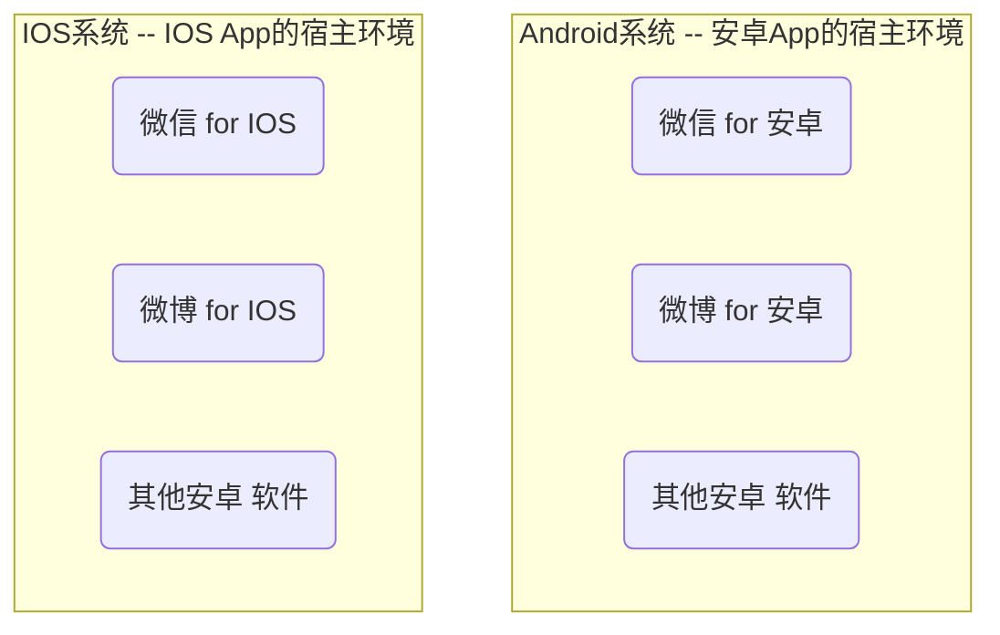
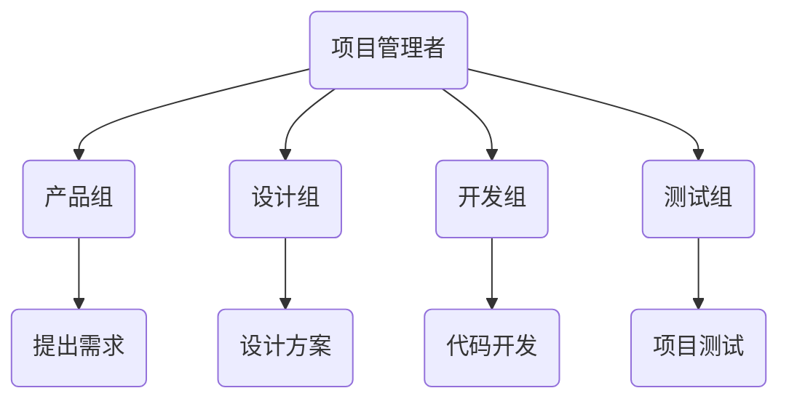
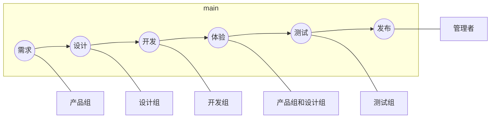

[toc]

# 1 小程序简介

## 1.1 小程序与普通网页开发的区别

1. 运行环境不同
   - 网页运行在<strong style="color:red">浏览器环境</strong>中
   - 小程序运行在<strong style="color:red">微信环境</strong>中
2. API 不同
   - 由于运行环境的不同，小程序中是<strong style="color:red">无法调用 DOM 和 BOM 的 API</strong>
   - 但是，在小程序中可以调用微信提供的各种 API，例如：
     - 地理定位
     - 扫码
     - 支付
3. 开发模式不同
   - 网页的开发模式：浏览器 + 代码编辑器
   - 小程序的开发模式：
     - 申请小程序开发账号
     - 安装小程序开发者工具
     - 创建和配置小程序项目


## 1.2 体验小程序

扫描下方二维码进行体验


## 1.3 注册小程序账号 & 安装开发者工具

**注册流程**

1. 打开浏览器，输入网址：https://mp.weixin.qq.com/，点击右上角的【立即注册】

   

2. 选择注册【小程序】

   

3. 填写好相关信息后在邮箱中点击链接激活账号

4. 选择主体类型：填写国家 / 地区（一般为中国大陆）和主体类型（一般为个人）

5. 主体信息登记

   > 个人类型暂不支持微信认证、微信支付及高级接口能力

6. 获取小程序的 AppID

   

   > 到 2022-12-29 时，其 AppID 可以在【开发】→ 【开发设置】 或者 【设置】 → 【账号信息】 中找到


**安装微信开发者工具**

下载官网：[传送门](https://developers.weixin.qq.com/miniprogram/dev/devtools/download.html)

我们一般选择稳定版本，如下：


安装完成之后，扫码登录即可


# 2 微信小程序的学习使用

## 2.1 快速创建第一个小程序项目

我们来到开发工具的设置，进行代理配置


设置完成之后，我们按如下操作新建小程序即可


之后选择工作目录以及填写自己的 AppID 即可


<strong style="color:red">这里有一点特别需要注意的是选择的开发语言，我们初学者主要选择 JS 模板，如下：</strong>


## 2.2 预览项目以及项目面板

- **方法一：直接在模拟器中进行查看**

  在工作区点击【编译】后即可在左侧区域查看到显示效果

- **方法二：在真机上预览项目效果**

  在工作区点击【预览】后，使用手机扫描二维码后即可查看到显示效果


项目模板方面，其他的我们不做过多介绍，唯一要注意的一点就是，我们在开发过程中选择的机型使用的是 ==iPhone 6/7/8==


## 2.3 工程项目的目录结构

默认情况下，JS 模板的目录结构如下：

```
project_01                      
├─ pages                        
│  ├─ index                     
│  │  ├─ index.js               
│  │  ├─ index.json             
│  │  ├─ index.wxml             
│  │  └─ index.wxss             
│  └─ logs                      
│     ├─ logs.js                
│     ├─ logs.json              
│     ├─ logs.wxml              
│     └─ logs.wxss              
├─ utils                        
│  └─ util.js                   
├─ app.js                       
├─ app.json                     
├─ app.wxss                     
├─ project.config.json          
├─ project.private.config.json  
└─ sitemap.json                 
```

- <strong style="color:orange">`pages` ：用来存放所有小程序的页面</strong>
- `utils`： 用来存放工具性质的模块
- <strong style="color:orange">`app.js` ：小程序的入口文件</strong>
- <strong style="color:orange">`app.json`：小程序项目的全局配置文件</strong>
- `app.wxss`：小程序项目的全局样式文件
- `project.config.json`：项目的配置文件
- `sitemap.json`：用来配置小程序及其页面是否允许被微信索引

小程序官方建议把所有的小程序的页面，都放在 pages 页面中，以单独的文件夹存在，其中，每个页面由 4 个基本文件组成，他们分别是：

1. `.js` 文件：页面的脚本文件，存放页面的数据、事件处理函数等
2. `.json` 文件：当前页面的配置文件，配置窗口的外观、表现等
3. `.wxml` 文件：页面的模板结构文件
4. `.wxss` 文件：当前页面的样式表文件


### 2.3.1 `app.json`

`app.json` 是当前小程序的全局配置，包括了小程序的所有<u>页面路径、窗口外观、界面表现、底部 tab</u> 等

- pages：用户记录当前小程序所有页面的路径
- window：全局定义小程序所有页面的背景色
- style：全局定义小程序组件所使用的的样式版本
- sitemapLocation：用来指明 sitemap.json 的位置、

**新增页面**

我们可以直接在 `app.json` 里的 pages 配置项中新增页面的存放路径，小程序开发者工具即可自动帮助我们创建出新的页面，如下图所示：


**修改项目首页**

只需要调整 app.json => pages 数组中的页面路径的前后顺序，即可修改项目的首页，小程序会把排在第一位的页面，当做项目首页进行渲染，如下图：


### 2.3.2 project.config.json

project.config.json 是项目配置文件，用来<strong style="color:red">记录我们对小程序开发工具所做的个性化配置</strong>

- setting 中保存了编译相关的配置
- projectname 中保存的是项目名称
- appid 中保存的是小程序的账号 ID


### 2.3.3 sitemap.json

微信现在已开放小程序内搜索，效果类似于 PC 网页的 SEO。sitemap.json 文件用来<strong style="color:red">配置小程序页面是否允许微信索引</strong>


### 2.3.4 页面的 .json 配置文件

小程序中的每一个页面，可以使用 .json 文件来对本页面的窗口外观进行配置，<strong style="color:red">页面中的配置项会覆盖 app.json 的 window 中相同的配置项</strong>


## 2.4 代码构成 -- WXML 模板

WXML（WeiXin Markup Language）是小程序框架设计的一套<strong style="color:orange">标签语言，用来构建小程序页面的结构</strong>，其作用类似于网页开发中的 HTML

### 2.4.1 WXML 和  HTML 的区别

1. 标签名称不同
   - `HTML`：`div`、`span`、`img`、`a`
   - `WXML`：`view`、`text`、`image`、`navigator`
2. 属性节点不同
   - `<a href="#">超链接</a>`
   - `<navigator url="/pages/home"></navigator>`
3. 提供了类似于 Vue 中的模板语法
   - 数据绑定
   - 列表渲染
   - 条件渲染


### 2.4.2 什么是 WXSS

WXSS（WeiXin Style Sheets）是一套==样式语言==，用于描述 WXML 的组件样式，类似于网页开发中的 CSS

**WXSS 与 CSS 的区别**

1. 提供了 `rpx` 尺寸单位
   - CSS 中需要手动进行像素单位换算，例如 `rem`
   - WXSS 在底层支持新的尺寸单位 `rpx`，在不同大小的屏幕上小程序会自动进行换算
2. 提供了全局的样式和局部样式
   - 项目根目录中的 app.wxss 会作用于所有小程序页面
   - 局部页面的 .wxss 样式仅对当前页面生效
3. WXSS 仅支持部分 CSS 选择器
   - 标签选择器、类选择器和 ID 选择器
   - 并集选择器、后代选择器
   - ::after 和 ::before 等伪类选择器


### 2.4.3 小程序中的 JS 文件

小程序中的 JS 文件主要用来处理业务逻辑和完成用户交互的

小程序中的 JS 文件分为 3 类，分别是：

1. `app.js`

   > 是<strong style="color:red">整个小程序项目的入口文件</strong>，通过调用 `App()` 来启东整个小程序

2. 页面的 `.js` 文件

   >是<strong style="color:red">页面的入口文件</strong>，通过调用 `Page()` 函数来创建并运行页面

3. 普通的 `.js` 文件

   > 是<strong style="color:red">普通的功能模块文件</strong>，用来封装公共的函数或属性供页面使用


## 2.5 宿主环境

### 2.5.1 什么是宿主环境

宿主环境（host environment）指的是<strong style="color:red">程序运行所必须的依赖环境</strong>



而<strong style="color:red">小程序的宿主环境是微信</strong>

小程序可以借助宿主环境提供的能力，完成许多普通网页无法完成的功能，例如：微信扫码、微信支付、微信登录、地理定位等等


### 2.5.2 小程序宿主环境包含的内容

1. 通信模型
2. 运行机制
3. 组件
4. API


#### 01 通信模型

 小程序中通信的主体是<strong style="color:red">渲染层和逻辑层</strong>

1. WXML 模板和 WXSS 样式工作在渲染层
2. JS 脚本工作在逻辑层


小程序中的通信模型分为两部分：

1. 渲染层与逻辑层之间的通信

   > 由微信客户端进行转发

2. 逻辑层与第三方服务器之间的通信

   > 由微信客户端进行转发


#### 02 运行机制

**小程序启动的过程**

1. 把小程序的代码包下载到本地
2. 解析 `app.json` 全局配置文件
3. 执行 `app.js` 小程序入口文件，调用 `App()` 创建小程序实例
4. 渲染小程序首页
5. 小程序启动完毕


**页面渲染过程**

1. 加载解析页面的 `.json` 配置文件
2. 加载页面的  `.wxml` 模板和 `.wxss` 样式
3. 执行页面的 `.js` 文件，调用 `Page()` 创建页面实例
4. 页面渲染完成


#### 03 组件

小程序中的组件也是宿主环境提供的，开发者可以基于组件快速搭建出漂亮的页面结构，官方把小程序的组件分为了 9 大类：

1. <strong style="color:red">视图容器</strong>
2. <strong style="color:red">基础内容</strong>
3. <strong style="color:red">表单组件</strong>
4. <strong style="color:red">导航组件</strong>
5. 媒体组件
6. map 地图组件
7. canvas 画布组件
8. 开发能力
9. 无障碍访问

## 2.6 组件

### 2.6.1 常见的视图类组件

1. view
   - 普通视图区域
   - 类似于 HTML 中的 div，是一个块级元素
   - 常用来实现页面的布局效果
2. scroll-view
   - 可滚动的视图区域
   - 常用来实现滚动列表效果
3. swiper 和 swiper-item
   - 轮播图容器组件和轮播图 item 组件


### 2.6.2 swiper 常见属性

| 属性                     | 类型      | 默认值            | 说明                 |
| ------------------------ | --------- | ----------------- | -------------------- |
| `indicator-dots`         | `boolean` | false             | 是否显示面板指示点   |
| `indicator-color`        | `color`   | rgba(0, 0, 0, .3) | 指示点颜色           |
| `indicator-active-color` | `color`   | #000              | 当前选中的指示点颜色 |
| `autoplay`               | `boolean` | false             | 是否自动切换         |
| `interval`               | `number`  | 5000              | 自动切换时间间隔     |
| `circular`               | `boolean` | false             | 是否采用衔接滑动     |


### 2.6.3 text 和 rich-text 组件的基本用法

1. text
   - 文本组件
   - 类似于 HTML 中的 span 标签
2. rich-text
   - 富文本组件
   - 支持把 HTML 字符渲染为 WXML 结构

**text 组件的基本使用**

通过 text 组件的 selectable 属性，实现长按选中文本内容的效果

> 最新版本，selectable 属性已经改成了 user-select，只不过目前 selectable 属性仍然可以使用


**rich-text 组件的基本使用**

通过 rich-text 组件的 nodes 属性节点，把 HTML 字符串渲染为对应的 UI 结构

示例：

```html
<rich-text nodes="<h1 style='color:red'>标题</h1>"/></rich-text>
```

显示如下：


### 2.6.4 button 和 image 组件的基本用法

1. button 
   - 按钮组件
   - 功能比 HTML 中的 button 按钮丰富
   - 通过 open-type 属性可以调用微信提供的各种功能（客服、转发、获取用户授权、获取用户信息等）
2. image 
   - 图片组件
   - image 组件默认宽度约 300px，高度约 240px
3. navigator 
   - 页面导航组件
   - 类似于 HTML 中的 a 链接

**button 按钮的基本使用**

示例代码如下：

```html
<view>
    ------- 通过 type 指定按钮的类型 -------
</view>
<button>默认按钮</button>
<button type="primary">主色调按钮</button>
<button type="warn">警告按钮</button>

<view>
    ------- 通过 size 指定按钮的大小 -------
</view>
<button size="default">默认按钮</button>
<button size="mini">小尺寸按钮</button>

<view>
    ------- plain 镂空按钮 -------
</view>
<button plain>镂空按钮</button>
```

显示效果如下：


**image 组件的基本使用**

`image` 组件中存在两个属性，一个是 `src` 属性，用来指定图片的文件位置，注意这里路径应从根路径出发，也就是`/images/xxx.png` 这种格式；另一个属性为 mode 属性，<strong style="color:red">用来指定图片的剪裁和缩放模式</strong>，常用的 mode 属性值如下：

| mode 值       | 说明                                                         |
| ------------- | ------------------------------------------------------------ |
| `scaleToFill` | (默认值)缩放模式，不保持纵横比缩放图片，使图片的宽高完全拉伸至填满 image 元素 |
| `aspectFit`   | 缩放模式，保持纵横比缩放图片，使图片的长边能完全显示出来。也就是说，可以完整地将图片显示出来，但是使得可能存在留白区域 |
| `aspectFill`  | 缩放模式，保持纵横比缩放图片，只保证图片的长边能完全显示出来。也就是说，图片通常只在水平或者垂直方向是完整的，另一个方向将会发生截取 |
| `widthFix`    | 缩放模式，宽度不变，高度自动变化，保持原图宽高比不变         |
| `heightFix`   | 缩放模式，高度不变，宽度自动变化，保持原图宽高比不变         |


## 2.7 小程序 API

小程序官方把 API 分为如下 3 类：

1. 事件监听 API
   - 特点：以 `on` 开头，用来监听某些事件的触发
   - 示例：`wx.onWindowResize(function callback)` 用来监听窗口尺寸变化的事件
2. 同步 API
   - 特点1：以 Sync 结尾的 API 都是同步 API
   - 特点2：同步 API 的执行结果，可以通过函数返回值直接获取，如果执行出错会抛出异常
   - 示例：`wx.setStorageSync(key, value)` 向本地存储中写入内容

3. 异步 API
   - 特点：类似于 jQuery 中的 `$.ajax(options)` 函数，需要通过 success、fail、complete 接收调用的结果
   - 示例：`wx.request()` 发起网络数据请求，通过 success 回调函数接收数据


## 2.8 协同工作

### 2.8.1 项目成员的组织结构




### 2.8.2 小程序的开发流程




# 3 小程序基础

## 3.1 数据绑定

在页面对应的 `.js` 文件中，配置 data 对象，使用时在模板中使用 <strong style="
color:red">Mustache 语法</strong>（双大括号）将变量包起来即可。语法格式为：

```js
// js 文件中
Page({
	data: {
		// 数据项
        name:'zs'
	}
})
```

```html
<!-- wxml 文件中 -->
<view>{{name}}</view>
```


**Mustache  语法的应用场景**

- 绑定内容
- 绑定属性
- 运算（三元运算、算术运算等）

这里有一点需要注意的是：在小程序中无论是绑定内容还是绑定属性，我们都是使用 Mustache 语法，不需要像 Vue 一样，如果是绑定属性，需要添加 `v-on` 或 `:`，示例如下：

```js
Page({
    data: {
        imgSrc:'http://www.xxx.baidu.png'
    },
})
```

```html
<image src="{{imgSrc}}" /></image>
```


## 3.2 事件绑定

事件是<strong style="color:red">渲染层到逻辑层的通讯方式</strong>。通过事件可以将用户在渲染层产生的行为，反馈到逻辑层进行业务处理。


**小程序中常用的事件**

| 类型   | 绑定方式                      | 事件描述                              |
| ------ | ----------------------------- | ------------------------------------- |
| tap    | `bingtap` 或 `bind:tap`       | 手指触摸后马上离开，类似于 click 事件 |
| input  | `bindinput` 或 `bind:input`   | 文本框的输入事件                      |
| change | `bindchange` 或 `bind:change` | 状态改变时触发                        |


**事件对象的属性列表**

当事件回调触发时，会收到一个事件对象 event，它的详细属性如下表所示：

| 属性             | 类型         | 说明                                         |
| ---------------- | ------------ | -------------------------------------------- |
| `type`           | `String`     | 事件类型                                     |
| `timeStamp`      | `Interger`   | 页面打开到触发事件所经过的毫秒数             |
| **`target`**     | **`Object`** | **触发事件的组件的一些属性值的集合**         |
| `currentTarget`  | `Object`     | 当前组件的一些属性值的集合                   |
| **`detail`**     | **`Object`** | **额外的信息**                               |
| `touches`        | `Array`      | 触摸事件、当前停留在屏幕中的触摸点信息的数组 |
| `changedTouches` | `Array`      | 触摸事件、当前变化的触摸点信息的数组         |


**`bindtap` 语法格式**

在模板字符串中为组件绑定事件

```html
<button bindtap="btnTapHandler" type="primary">点我</button>
```

在页面的 `.js` 文件中定义对应的事件处理函数

```js
Page({
    btnTapHandler(e) {
        console.log(e)
    }
})
```


## 3.3 数据处理

通过调用 `this.setData(dataObject)` 方法，可以给页面 data 中的数据重新赋值，示例如下：

```html
<view>
    count 的值为：<text>{{count}}</text>
</view>
<button bindtap="changeCount" type="primary">点我</button>
```

```js
Page({
    data: {
        count:0
    },
   	// 修改 count 的值
    changeCount() {
        this.setData({
            count: this.data.count + 1
        })
    }
})
```


## 3.4 事件传参

### 3.4.1 `bindinput` 语法格式

小程序的事件传参方法比较特殊，不能直接通过 `handler(...params)` 的形式传递参数，而因为小程序会把 `bindtap` 属性值，统一当做事件名称来处理

**正确传参方式**

先为组件提供 `data-*` 自定义属性传参，其中 `*` 代表的是参数的名字，示例代码如下：

```html
<button bindtap="btnHandler" data-info="{{1}}">事件传参</button>
```

- `info` 会被解析为<strong style="color:red">参数名</strong>
- 数值 `1` 会被解析为<strong style="color:red">参数值</strong>

获取参数值的方法：通过 `e.target.dataset.参数名` 即可获取到具体参数的值，示例代码如下：

```js
btnHandler(e) {
    console.log(e.target.dataset.info);
}
```


### 3.4.2 `bindinput` 语法格式

在小程序中，通过 `input` 事件来响应文本框的输入事件，语法格式如下：

```html
<input bindinput="inputHandler"/>
```

```js
inputHandler(e) {
    console.log(e.detail.value);
}
```


### 3.4.3 事件传参与数据同步

`input` 输入框中同时绑定 `value` 属性值和 `inputHandler` 事件，当输入框的数据发生改变，立马赋给 `num`，借此实现数据同步

```html
<text>num 的值为：{{num}}</text>
<input value="{{num}}" bindinput="inputHandler"/>
```

```js
Page({
    data: {
        num: 0,
    },
    inputHandler(e) {
        this.setData({
            num:e.detail.value
        })
    }
})
```


## 3.5 条件渲染

### 3.5.1 `wx:if`

在小程序中，使用 `wx:if="{{condition}}"` 来判断是否需要渲染该代码块

```html
<view wx:if="{{num > 0}}">条件渲染</view>
```

除此之外，还可以用 `wx:elif` 和 `wx:else` 来搭配使用（注意：判断语句代码块需要连续使用）：

```html
<view wx:if="{{num > 0}}">条件渲染if</view>
<view wx:elif="{{num == 0}}">条件渲染elif</view>
<view wx:else>条件渲染else</view>
```


### 3.5.2 结合 `block` 使用 `wx:if` 

如果要<strong style="color:red">一次控制多个组件的显示与隐藏</strong>，可以使用一个 `<block></block>` 标签将多个组件包装起来，类似于 Vue 中的 `template` 标签

```js
<block wx:if="{{num > 0}}">
    <view> view1 </view>
    <view> view2 </view>
    <view> view3 </view>
</block>
```

> :warning:注意：`block` 并不是一个组件，它只是一个容器，最终并不会渲染到页面中充当 WXML 结构


### 3.5.3 hidden

在小程序中，直接使用 `hidden="{{condition}}"` 也能控制元素的显示与隐藏


### 3.5.4 `wx:if` 和 `hidden` 对比

**运行方式不同**

- `wx:if` 以动态创建和移除元素的方式，控制元素的存在于消失
- `hidden` 以切换样式的方式，控制元素的显示与隐藏

**使用建议**

- 频繁切换时，建议使用 `hidden`
- 控制条件复杂时，建议使用 `wx:if` 搭配 `wx:elif` 、`wx:else` 进行展示与隐藏的切换


## 3.6 列表渲染

通过 `wx:for` 可以根据指定的数组，循环渲染重复的组件结构，语法示例如下：

```html
<view wx:for="{{array}}">
    索引是：{{index}},当前项是：{{item}}
</view>
```

> 默认情况下，当前循环的索引用 index 表示；当前循环项用 item 表示

当然，我们也可以手动指定索引和当前项的变量名

- 使用 `wx:for-index` 可以指定当前循环项索引的变量名
- 使用 `wx:for-item` 可以指定当前项的变量名

示例代码如下：

```html
<view wx:for="{{array}}" wx:for-index="idx" wx:for-item="itemname">
    索引是：{{idx}},当前项是：{{itemname}}
</view>
```


### 3.6.1  `wx:key` 的使用

类似于 Vue 列表渲染中的 `:key`，小程序在实现列表渲染时也采用了 diff 算法，通过指定 `wx:key` 来提高渲染的效率，示例代码如下：

```html
<view wx:for="{{userList}}" wx:key="id">
    id:{{item.id}},name:{{item.name}}
</view>
```

```js
userList: [
    {id:1, name:'张三'},
    {id:2, name:'李四'},
    {id:3, name:'王五'}
]
```


## 3.7 WXSS -- WXSS 与 CSS 之间的关系

WXSS 具有 CSS 大部分特性，同时，WXSS 还对 CSS 进行了扩充以及修改，以适应微信小程序的开发。与 CSS 相比，WXSS 扩展的特性还有：

- rpx 尺寸单位
- @import 样式导入


### 3.7.1 rpx 

rpx(responsive pixel) 是微信小程序独有的，用来<strong style="color:red">解决屏适配的尺寸单位</strong>

rpx 的实现原理，将设备屏幕栅格为 750 等份（即：当前屏幕的总宽度为 750 rpx）

- 在较小的设备上，1rpx 所代表的的宽度较小
- 在较大的设备上，1rpx 所代表的宽度较大

在 iPhone6 上，1px 中有 2 个物理像素点，而 iPhone6 的屏幕宽度为 375px，所以在 iPhone6 中，$1rpx = 0.5 px = 1 物理像素$

> 而官方推荐，开发微信小程序时，推荐设计师使用 iPhone6 作为视觉稿的标准


### 3.7.2 @import

`@import` 主要是用来导入外联样式表，导入样式表使用相对路径，用 `;` 来结束语句，如下：

```css
/**index.wxss**/
@import "/common/common.wxss"
```


## 3.8 全局配置

小程序根目录下的 `app.json` 文件是小程序的全局配置文件。常见的配置项如下：

1. pages
   - 记录当前小程序所有页面的存放路径
2. window
   - 全局设置小程序窗口的外观
3. tabBar
   - 设置小程序底部的 tabBar 效果
4. style
   - 是否启动新版的组件样式


小程序的窗口组成部分如下（可通过 window 节点进行相关配置）：


### 3.8.1 window 节点相关配置项

| **属性名**                     | **类型**    | **默认值** | **说明**                                                     |
| ------------------------------ | ----------- | ---------- | ------------------------------------------------------------ |
| `navigationBarTitleText `      | ` String `  | 字符串     | 导航栏标题文字内容                                           |
| `navigationBarBackgroundColor` | `HexColor`  | #000000    | 导航栏背景颜色，如 #000000                                   |
| `navigationBarTextStyle`       | `String`    | white      | 导航栏标题颜色，<strong style="color:red">仅支持 black / white </strong> |
| `backgroundColor`              | `HexColor ` | #ffffff    | 窗口的背景色                                                 |
| `backgroundTextStyle`          | `String`    | dark       | 下拉loading样式，<strong style="color:red">仅支持 dark / light</strong> |
| `enablePullDownRefresh`        | `Boolean`   | false      | 是否全局开启下拉刷新                                         |
| `onReachBottomDistance`        | `Number`    | 50         | 页面上拉事件触发时距底部的距离，单位为px                     |

示例图如下：


**设置上拉触底的距离**

上拉触底：上拉触底是移动端的专有名词，通过手指在屏幕上的上拉滑动操作，从而加载更多数据的行为。通过 window 配置项中的 `onReachBottomDistance` 来设置即可

> 注意：默认距离是 50px，如果没有特殊需求，使用默认值即可


### 3.8.2 tabBar 相关配置

`tabBar` 是移动端应用常见的页面效果，<strong style="color:red">用于实现多页面的快速切换</strong>。小程序通常将其分为：

- 底部 tabBar
- 顶部 tabBar

<center>
    
     
</center>


:warning:**注意**

- tabBar 中只能配置<strong style="color:red">最少 2 个，最多 5 个</strong> tab 页签
- 当渲染顶部 tabBar 时，不显示 icon，只显示文本

**tabBar 的 6 个组成部分**

1. `backgroundColor`：`tabBar` 的背景色
2. `selectIconPath`：选中的图片路径
3. `selectedColor`：tab 上的文字选中时的颜色
4. `borderStyle`：`tabBar` 边框的颜色
5. `iconPath`：未选中时的图片路径
6. `color`：`tab` 上文字的默认（未选中）的颜色

 


**`tabBar` 节点的配置项**

| **属性**          | **类型**    | **必填** | **默认值** | **描述**                                         |
| ----------------- | ----------- | -------- | ---------- | ------------------------------------------------ |
| `position `       | `String `   | 否       | bottom     | tabBar 的位置，仅支持 bottom/top                 |
| `borderStyle`     | `String`    | 否       | black      | tabBar 上边框的颜色，仅支持 black/white          |
| `color`           | `HexColor`  | 否       |            | tab 上文字的默认（未选中）颜色                   |
| `selectedColor`   | `HexColor`  | 否       |            | tab 上的文字选中时的颜色                         |
| `backgroundColor` | `HexColor`  | 否       |            | tabBar 的背景色                                  |
| **`list`**        | **`Array`** | **是**   |            | **tab 页签的列表，  最少 2  个、最多  5 个 tab** |


**每个 tab 项的配置选项**

| **属性**           | **类型** | **必填** | **描述**                                              |
| ------------------ | -------- | -------- | ----------------------------------------------------- |
| `pagePath`         | `String` | 是       | 页面路径，页面必须在 pages  中预先定义                |
| `text`             | `String` | 是       | tab 上显示的文字                                      |
| ` iconPath`        | `String` | 否       | 未选中时的图标路径；当 postion 为 top 时，不显示 icon |
| `selectedIconPath` | `String` | 否       | 选中时的图标路径；当 postion 为 top 时，不显示 icon   |

示例如下：

```json
"tabBar": {
    "list": [{
            "pagePath": "pages/index/index",
            "text": "index"
        },
        {
            "pagePath": "pages/list/list",
            "text": "list"
        }
    ]
},
```

### 3.8.3 tabBar 完整配置案例

**需求描述**，如下：


**实现步骤**

1. 在项目根目录创建 images 文件夹，将需要用到的小图标放到 image 文件夹里面

   > :star:注意命名规范
   >
   > - 图片名称中含有 `-active` 的是选中图标
   >
   > - 图片名称中不包含 `-active` 的是未选中（默认）图标
   >
   >   

2. 配置 pages 选项
   - 在 `app.json` 配置文件中，新增 `tabBar` 节点，在节点中，新增 list 数组，在 list 数组中，添加每一个 tab 项的配置对象，对象中包含的属性如下：
     - `pagePath` 指定当前 tab 对应的页面路径（必填）
     - `text` 指定当前 tab 对应的文件（必填）
     - `iconPath` 指定当前 tab 未选中的时候图片路径（可选）
     - `selectIconPath` 指定当前 tab 被选中后高亮的图片路径

```json
"tabBar": {
    "list": [{
        "pagePath": "pages/home/home",
        "text": "首页",
        "iconPath": "/images/home.png",
        "selectedIconPath": "/images/home-active.png"
    }, {
        "pagePath": "pages/message/message",
        "text": "消息",
        "iconPath": "/images/message.png",
        "selectedIconPath": "/images/message-active.png"
    }, {
        "pagePath": "pages/contact/contact",
        "text": "联系",
        "iconPath": "/images/contact.png",
        "selectedIconPath": "/images/contact-active.png"
    }]
},
```

:spiral_notepad:**备注**

>在旧版本中， tab 页面相关的路径需要放到 pages 项的最前面，而新版则可以不用遵守这一规则


## 3.9 页面配置

| **属性名**                     | **类型**    | **默认值** | **说明**                                                     |
| ------------------------------ | ----------- | ---------- | ------------------------------------------------------------ |
| `navigationBarTitleText `      | ` String `  | 字符串     | 导航栏标题文字内容                                           |
| `navigationBarBackgroundColor` | `HexColor`  | #000000    | 导航栏背景颜色，如 #000000                                   |
| `navigationBarTextStyle`       | `String`    | white      | 导航栏标题颜色，<strong style="color:red">仅支持 black / white </strong> |
| `backgroundColor`              | `HexColor ` | #ffffff    | 窗口的背景色                                                 |
| `backgroundTextStyle`          | `String`    | dark       | 下拉loading样式，<strong style="color:red">仅支持 dark / light</strong> |
| `enablePullDownRefresh`        | `Boolean`   | false      | 是否全局开启下拉刷新                                         |
| `onReachBottomDistance`        | `Number`    | 50         | 页面上拉触底事件触发时距页面底部距离，单位为px               |

:warning:**注意：当页面配置与全局配置冲突时，根据就近原则，最终的效果以页面配置为准**


## 3.10 网络数据请求 

### 3.10.1 小程序中网络数据请求限制

处于<strong style="color:red">安全性</strong>方面的考虑，小程序官方对数据接口的请求做出如下两个限制：

1. 只能请求 <strong style="color:red">HTTPS</strong> 类型的接口
2. 必须<strong style="color:red">将接口的域名添加到信任列表中</strong>

我们可以在小程序控制面板的【详情】中进行查看


### 3.10.2 配置 request 的合法域名

前往[官网](https://mp.weixin.qq.com/)登录微信小程序管理后台：【开发管理】→ 【开发设置】→ 【服务器域名】进行设置


:warning:**注意**

1. 域名只支持 https 协议
2. 域名不能使用 IP 地址或 localhost
3. 域名必须经过 ICP 备案
4. 服务器域名一个月内最多可申请 5 次修改


### 3.10.3 发起请求

调用微信小程序提供的 `wx.request()` 方法，可以发起 GET 数据请求，示例代码如下：

```js
// Get 请求
wx.request({
    url: 'https://www.xxx.xxx',
    method: 'GET',
    data: {
        name: 'zs',
        age: 18
    },
    success: (res) => {
        console.log(res);
    }
})

// POST 请求
wx.request({
    url: 'https://www.xxx.xxx',
    method: 'POST',
    data: {
        name: 'zs',
        age: 18
    },
    success: (res) => {
        console.log(res);
    }
})
```


很多情况下，我们需要在页面加载完成的时候，立即请求获取一些初始化的数据，此时需要在页面的 `onload` 事件中 中调用获取数据的函数，示例代码如下：

```js
onload: function(options) {
	this.getInfo()
	this.postInfo()
}
```


### 3.10.4 request 请求的注意事项

**跳过 request 合法域名校验**

如果后端程序员仅仅提供了 http 协议的接口、暂时没有提供 https 协议的接口。为了不耽误开发进度，可以自己手动设置不进行和法域名检验，如下：

【详情】→ 【本地设置】→ 勾选下面的选项


> 仅限在开发与调试阶段使用


**关于跨域和 Ajax 的说明**

跨域问题只存在于基于浏览器的 Web 开发中，而<strong style="color:red">小程序的宿主环境不是浏览器，而是微信客户端</strong>，所以**小程序中不存在跨域问题**

Ajax 技术的核心是依赖于浏览器中 XMLHttpRequest 这个对象，由于小程序的宿主环境是微信客户端，所以小程序中不能叫做 "发起 Ajax 请求"，而是叫做 <strong style="color:red">"发起网络数据请求"</strong>


# 4 视图与逻辑

## 4.1 页面导航

页面导航指的是<strong style="color:red">页面之间的相互跳转</strong>。例如：浏览器中实现页面导航的方式有如下两种：

1. `<a>` 链接
2. `location.herf`

小程序中实现页面导航的两种方式：

1. 声明式导航
   - 在页面上声明一个 `<navigator>` 导航组件
   - 通过点击 `<navigator>` 组件实现页面跳转
2. 编程式导航
   - 调用小程序的导航 API，实现页面的跳转


### 4.1.1 声明式导航

#### 01 跳转到 `tabBar` 页面

`tabBar` 页面指的是被配置为 `tabBar` 的页面

在使用 `<navigator>` 组件跳转到指定的 `tabBar` 页面时，需要指定 `url` 属性和 `open-type` 属性，其中：

- `url` 表示要跳转的页面的地址，必须以 `/` 开头
- `open-type` 表示跳转的方式，必须为 `switchTab` 

```html
<navigator url="/pages/message/message" open-type="switchTab">点我跳转到 message 页面</navigator>
```


#### 02 跳转到普通页面

在使用 `<navigator>` 组件跳转到普通的页面时，则需要指定 url 为普通页面路径，同时 `open-type` 属性的值为 `navigator`

```html
<navigator url="/pages/index/index" open-type="navigate">导航到index页面</navigator>
```

> 这里不指定 `open-type` 也是可以的，因为默认就是 `navigate`，但是需要注意的是 `url` 指向的是一定要是非 tab 页面


#### 03 后退导航

如果要后退到上一页面或多级页面，则需要指定 `open-type` 属性或者 `delta` 属性，其中：

- `open-type` 的值必须是 <strong style="color:red">`navigateBack`</strong>，表示进行后退导航
- `delta` 的值必须是<strong style="color:red">数字</strong>，表示要后退的层级

```html
<navigator open-type="navigateBack" delta="1">返回上一页</navigator>
```

> `delta` 的默认值为 1


### 4.1.2 编程式导航

#### 01 导航到 `tabBar` 页面

通过 `wx.switchTab(Object o)` 方法实现页面的跳转

```html
<button bindtap="gotoHome">点击我跳转到home页面</button>
```

```js
gotoHome() {
    wx.switchTab({
        url:'/pages/home/home'
    })
}
```


#### 02 导航到非 `tabBar` 页面

调用 `wx.navigateTo(Object o)` 方法可以跳转到 `tabBar` 的页面。其中 Object 参数对象的属性列表如下：

| 属性       | 类型     | 是否必选 | 说明                                                 |
| ---------- | -------- | -------- | ---------------------------------------------------- |
| `url`      | string   | 是       | 需要跳转的的非 `tabBar` 页面的路径，路径后可以带参数 |
| `success`  | function | 否       | 接口调用成功的回调函数                               |
| `fail`     | function | 否       | 接口调用失败的回调函数                               |
| `complete` | function | 否       | 接口调用结束的回调函数（调用成功、失败都会执行）     |

示例代码如下：

```html
<button bindtap="gotoList">点击我跳转到list页面</button>
```

```js
gotoList() {
    wx.navigateTo({
        url: '/pages/list/list',
        success() {
            console.log('跳转成功');
        }
    })
},
```


#### 03 后退导航

调用 `wx.navigateBack(Object o)` 方法，可以返回上一页或多级页面。其中 Object 参数对象可选的属性列表如下：

| 属性       | 类型     | 默认值 | 是否必选 | 说明                                                    |
| ---------- | -------- | ------ | -------- | ------------------------------------------------------- |
| `delta`    | number   | 1      | 否       | 返回的页面数，如果 delta 大于现有的页面数，则返回到首页 |
| `success`  | function |        | 否       | 接口调用成功的回调函数                                  |
| `fail`     | function |        | 否       | 接口调用失败的回调函数                                  |
| `complete` | function |        | 否       | 接口调用结束的回调函数                                  |


## 4.2 导航传参

### 4.2.1 声明式导航传参

`navigator` 组件中的 `url` 属性用来指定将要跳转到的页面的路径，同时，路径的后面还可以携带参数：

- 参数与路径之间使用 `?` 分隔
- 参数键与参数值之间用 `=` 分隔
- 不同键值对用 `&` 分隔

```html
<navigator url="/pages/info?name=zs&age=18"></navigator>
```


### 4.2.2 编程式导航传参

```
gotoList() {
    wx.navigateTo({
        url: 'url="/pages/info?name=zs&age=18"',
        success() {
            console.log('跳转成功');
        }
    })
},
```


### 4.2.3 在 `onload` 中接收导航参数

通过声明式导航传参或编程式导航传参所携带的参数，可以直接在`onLoad` 事件中获取到，示例代码如下：

```html
<!-- index.wxml -->
<navigator url="/pages/list/list?name=zs&age=18">点我跳转到非tabBar页面list同时传参</navigator>
```

```js
// list.js
onLoad(options) {
    console.log(options);
},
```

将参数保存下来供脚本使用

```js
onLoad(options) {
    this.setData({
        query: options
    })
},
```


## 4.3 页面事件

### 4.3.1 下拉刷新

下拉刷新是指在移动端中，通过手指在屏幕上的<strong style="color:red">下拉滑动</strong>操作，从而<strong style="color:red">重新加载页面数据的行为</strong>

#### 01 启动下拉刷新

设置 **`enablePullDownRefresh: true`** 即可 

在实际开发中，一般设置**局部开启下拉刷新**，因为一般而言，大多数页面是不需要开启下拉刷新效果的

#### 02 配置下拉刷新窗口的样式

| 配置项                | 属性值       | 说明                          |
| --------------------- | ------------ | ----------------------------- |
| `backgroundColor`     | hexColor     | 设置下拉窗口的背景色          |
| `backgroundTextStyle` | dark / light | 设置下拉刷新的 loading 的样式 |


#### 03 监听下拉刷新事件

**`onPullDownRefresh()`** 可用来监听用户的下拉动作，示例如下：

```js
onPullDownRefresh() {
    console.log('下拉刷新被触发');
}
```


#### 04 停止下拉刷新

当处理完下拉刷新后，下拉刷新的 loading 效果会一直显示，不会主动消失，所以需要调用 **`wx.stopPullDownRefresh()`** 来停止当前页面的下拉刷新，示例代码如下：

```js
onPullDownRefresh() {
    console.log('下拉刷新被触发');
    
    // 当事件处理完毕后调用该方法实现停止当前页面的下拉刷新
    wx.stopPullDownRefresh()
}
```


#### 05 特别注意

```
在小程序中，如果我们一旦修改了代码，一定要重新编译，否则页面效果可能会失灵
```


### 4.3.2 上拉触底

下拉触底是指在移动端上，通过手指在屏幕上的<strong style="color:red">上拉滑动</strong>操作，从而<strong style="color:red">加载更多数据</strong>的行为

> 上拉触底一般都是用于分页功能，当单个页面中数据比较多，我们可以通过下拉触底来加载更多的数据


#### 01 监听下拉触发事件

在页面的 JS 文件中，通过 `onReachBottom()` 方法即可监听当前页面的上拉触底事件，示例代码如下：

```js
onReachBottom() {
    console.log('下拉触底了');
}
```

> :alarm_clock:特别提醒：在模拟下拉触发的效果时，需要将页面设置的特别长，或者直接给一个高度很高的容器进行测试


#### 02 配置上拉触底距离

上拉触底距离指的是<strong style="color:red">触发上拉触底事件时，滚动条距离页面底部的距离</strong>

可以在全局或页面的 `.json` 文件中，通过 `onReachBottomDistance` 属性来配置上拉触底的距离，小程序默认的触底距离是 50px，在实际开发中，可以根据自己的需求来修改这个默认值

```json
"onReachBottomDistance": 150
```


#### 03 添加 loading 效果

我们可以前往[官方文档](https://developers.weixin.qq.com/miniprogram/dev/api/ui/interaction/wx.showLoading.html)进行查看


通过设置 **`wx.showLoading(Obejct o)`** 即可开启 loading 效果，同时要注意注意调用 **`wx.hideLoading(Obejct o)`** 来在适当时机关闭 loading 效果


## 4.4 扩展 -- 自定义编译模式

自定义编译模式，可以使得每次重新编译时指定打开的页面同时传入特定的参数进行调式等等，操作方法如下：


## 4.5 生命周期和生命周期函数

### 4.5.1 生命周期

生命周期（Life Cycle）是指<strong style="color:red">一个对象从创建、运行到销毁的整个过程，强调的是一个时间段</strong>

**分类**

1. 应用生命周期：特指小程序从启动、运行到销毁的过程
2. 页面生命周期：特指小程序中每个页面从加载、渲染到销毁的过程


### 4.5.2 生命周期函数

概念：生命周期函数是由小程序框架提供的内置函数，会伴随这生命周期，自动按次序执行

生命周期函数的作用：<strong style="color:red">允许程序在特定的时间点，执行某些特定的操作</strong>

> 注意：生命周期强调的是时间段，而生命周期函数强调的是时间点


#### 01 应用级别生命周期函数

小程序的应用级别生命周期函数在 app.js 中进行声明，示例代码如下：

```js
// app.js
App({
    // 小程序初始化时，执行此函数，全局只触发一次
    onLaunch(options) {},
    // 小程序启动时，或从后台进入前台显示时触发
    onShow(options) {},
    // 小程序从前台进入后台时触发
    onHide() {}
})

```

开发工具也给我们提供了对应的后台 / 前台的切换按钮，在 【工具】 → 【工具栏管理】→ 勾选 【后台】


#### 02 页面的生命周期函数

小程序的页面生命周期函数需要在页面的 JS 文件中进行声明

```js
Page({
    // 监听页面加载，一个页面只调用 1 次
    onLoad(options) {},
    // 监听页面显示
    onShow() {},
    // 监听页面初次渲染完成，一个页面只调用 1 次
    onReady() {},
    // 监听页面隐藏
    onHide() {},
    // 监听页面卸载,一个页面只调用 1 次
    onUnload() {}
 })
```

下面有一张不完整正确但是展示了基本流程的图示：


## 4.6 WXS 脚本

### 4.6.1 概念

`WXS` 的 全称为 "WeiXin Script"，是小程序独有的一套脚本语言，结合 WXML ，来构建页面。

> 由于 `wxml` 中无法直接在页面中调用 JS 中定义的函数，所以这时候就需要引入 `wxs`，所以 `wxs` 最为典型的应用场景就是<strong style="color:red">过滤器</strong>


### 4.6.2 WXS 与 JS 的关联

虽然 WXS 的语法类似于 JS，但是 WXS 和 JS 是完全不同的两种语言：

1. WXS 有自己的数据类型
   - `number` 数值类型、`string` 字符串类型、`boolean` 布尔类型、`function` 函数类型、`array` 数组类型、`date` 日期类型
2. `WXS` 不支持类似于 ES6 及以上的语法形式
   - 不支持：`let`、`const`、解构赋值、扩展运算符、箭头函数、对象属性简写…
   - 支持：`var` 定义变量、普通函数 `function`
3. `WXS` 遵循 Common.js 规范
   - `module` 对象和 `module.exports` 对象
   - `require()` 函数


**内嵌 WXS 脚本**

对于 `wxs` 脚本，需要指定其导出模块的对象名，脚本内部编写方法和属性值，之后将其暴露出去

```js
<view>{{m1.toUpper(name)}}</view>

<wxs module="m1">
    // 将文本转换为大写形式
    module.exports.toUpper = function(str) {
        return str.toUpperCase()
    }
</wxs>
```


**定义外联的 WXS 脚本**

`wxs` 代码还可以编写在以 `.wxs` 为后缀名的文件内，示例代码如下：

```html
<!-- wxml 模板 -->
<!-- 调用 m2 中的方法 -->
<view>{{m2.toUpper(name)}}</view>

<!-- 导入外联的 toUpper.wxs 脚本，并将导入的 module 对象命名为 m2 -->
<wxs src="/utils/toUpper.wxs"  module="m2"></wxs>
```

```js
// toUpper.wxs
function toUpper(str) {
    return str.toUpperCase()
}

module.exports = {
    toUpper:toUpper
}
```


**`wxs` 的特点**

`wxs` 大量借鉴了 JS 的语法，但是本质上，`wxs` 与 `js` 是两种完全不同的语言

> <strong style="color:red">`wxs` 作为 "过滤器"，经常配合 Mustache 语法进行使用，但是在 `WXS` 中定义的函数不能作为组件的事件回调函数</strong>

:warning:**注意**

`wxs` 的运行环境和 `js` 代码是隔离的，体现在如下两个方面：

1. `wxs` 不能调用 JS 中定义的函数
2. `wxs` 不能调用小程序提供的 API

**小程序性能好**

- 在 IOS 设备上，小程序内的 WXS 会比 JS 代码快 2 ~ 20 倍
- 在 Android 设备上，二者的运行效率无差异


# 5 组件

## 5.1 组件的创建和引用

**创建组件**

在项目的根目录中创建 components 文件夹，将所有的组件放入其中

新建组件时，右键，点击【新建 Component】


**引用组件**

组件的引用分为 "局部引用" 和 "全局引用"

- 局部引用：组件配置某个页面的 JSON 文件中，只能在当前被引用的页面中使用
- 全局引用：组件配置在 `app.json` 中，可以在每个页面中使用

配置方法如下（注意是配置在 `usingComponents` 节点中）

```json
"usingComponents": {
    "my-test":"/components/test/test"
}
```

在页面的 `wxml` 文件中使用组件

```html
<my-test></my-test>
```


:star:**组件和页面的区别**

组件和页面的基本结构是一样的，都是由 `.js`、`.json`、`.wxml`、`.wxss` 四个文件组成，但是他们之间也有明显的区别：

- 组件的 `.json` 文件中需要声明 `"component":true` 表示当前是一个组件
- 组件的 `.js` 文件中调用的是 `Component()` 函数，而页面的 `.js` 文件中调用的是 `Page()` 函数
- 组件的事件处理函数需要定义到 `methods` 节点中，而页面的事件处理函数都是与 `data` 同级的


## 5.2 自定义组件样式

**组件样式隔离**

默认情况下，自定义组件的样式只对当前组件生效，不会影响到组件之外的 UI 结构

:warning:**注意事项**

- `app.wxss` 中的全局样式对组件无效
- 只有 class 选择器才会有样式隔离效果，而 ID 选择器、属性选择器、标签选择器不受样式隔离的影响


**修改组件的样式隔离选项**

默认情况下，自定义组件的样式隔离特性能够<strong style="color:red">防止组件内外样式相互污染的问题</strong>，但是如果希望外界能够控制组件内部样式，此时可以通过 `stylesolation` 来修改组件的样式隔离选项用法如下：

```json
// 在组件的 .json 文件中新增如下配置
{
        "styleIsolation":"isolated"
}
```

`styleIsolation` 的可选值

| 可选值         | 默认值 | 描述                                                         |
| -------------- | ------ | ------------------------------------------------------------ |
| `isolated`     | 是     | 启动样式隔离                                                 |
| `apply-shared` | 否     | 表示页面的 `wxss` 样式将会影响到自定义组件，但自定义组件中的 `wxss` 中指定的样式不会影响到页面 |
| `shared`       | 否     | 表示页面 `wxss` 样式将会影响到自定义组件，自定义组件中 `wxss` 中指定的样式也会影响到页面和其他设置了`shared`或 `apply-shared` 的自定义组件 |


## 5.3 properties 属性

在小程序组件中，`properties` 是组件的对外属性，用接收外界传递到组件中的数据，示例代码如下：

1. 父组件的 `.wxml` 文件在添加子组件的同时传递参数给子组件

   ```html
   <my-test name="mini"></my-test>
   ```

2. 子组件中配置 `properties` 进行接收

   ```html
   <!-- wxml 文件 --> 
   <button bindtap="print">点我打印name值</button>
   ```

   ```js
   // js 文件
   Component({
       properties: {
           // 没有默认值的设置
           name:String,
           // 有默认值的设置
           age:{
               type:Number,
               value:18
           }
       },
       methods:{
           print() {
               console.log(this.properties.name);
               console.log(this.properties.age);
           }
       }
   })
   ```


## 5.4 watch 监听属性

数据监听器用于<strong style="color:red">监听和响应任何属性和数据字段的变化，从而执行特定的操作</strong>

基本语法格式如下：

```js
Component({
    observers: {
        'prop1, prop2': function(newValue1, newValue2) {
            // do something
        }
    }
})
```

**示例**

```html
<!-- wxml 文件 -->
<view>{{n1}} + {{n2}} = {{sum}}</view>
<button bindtap="add1">点我被加数自增</button>
<button bindtap="add2">点我加数自增</button>
```

```js
// js 文件
Component({
    data: {
        n1:0,
        n2:0,
        sum:0,
    },

    methods: {
        add1() {
            this.setData({
                n1: this.data.n1 + 1
            })
        },
        add2() {
            this.setData({
                n2: this.data.n2 + 1
            })
        }
    },
    observers: {
        'n1, n2': function(n1, n2) {
            this.setData({
                sum: n1 + n2
            })
        },
        n1(newValue) {
            console.log('n1发生改变@',newValue);
        },
        n2(newValue) {
            console.log('n2发生改变@',newValue);
        },
        sum(newValue) {
            console.log('sum发生改变@',newValue);
        }
    }
})
```


<strong style="color:red">小程序中的监视默认是浅度监视</strong>，如下：

```js
// components/test2/test2.js
Component({
    data: {
        person:{
            name:'zs',
            age:18
        }
    },

    methods: {
        incrementAge() {
            this.setData({
                'person.age': this.data.person.age + 1
            })
        }
    },
    observers: {
        'person.age': function(newValue) {
            console.log('person 的值发生改变', newValue);
        }
    }
})
```


## 5.5 纯数据字段

### 5.5.1 概念和作用

概念：<strong style="color:red">纯数据字段指的是那些不用于界面渲染的 data 字段</strong>

应用场景：某些 data 中的字段既不会展示在界面上，也不会传递给其他组件，仅仅在当前组件内部使用，带有这种特性的 data 字段适合被设置为纯数据字段，可以提高性能


### 5.5.2 配置方法

在 Component 构造器的 options 节点中，指定 `pureDataPattern` 为一个正则表达式，字段符合这个正则表达式的字段将会称为纯数据字段，示例代码如下：

```js
Component({
    options: {
        // 指定所有以 "_" 下划线开头的为纯数据字段
        pureDataPattern: /^_/
    },
    data: {
        a: true,    // 普通字段
        _b: true,   // 纯数据字段
    }
})
```


## 5.6 自定义组件的生命周期

### 5.6.1 组件全部的生命周期函数

小程序组件中可用的全部生命周期如下表所示：

| 生命周期函数   | 参数         | 描述说明                                 |
| -------------- | ------------ | ---------------------------------------- |
| **`created`**  | **无**       | **在组件实例刚刚被创建时执行**           |
| **`attached`** | **无**       | **在组件实例进入页面节点树时执行**       |
| `ready`        | 无           | 在组件在视图层布局完成后执行             |
| `moved`        | 无           | 在组件实例被移动到节点树另一个位置时执行 |
| **`detached`** | **无**       | **在组件实例被从页面节点树移除时执行**   |
| `error`        | Object Error | 每当组件方法抛出错误时执行               |

**主要的生命周期函数**

1. 组件实例刚被创建好的时候，`created` 生命周期函数会被触发
   -  此时还不能调用 `setData()`
   - 通常在这个生命周期函数中，只应该用于给组件的 `this` 添加一些自定义属性的字段
2. 在组件完全初始化完毕，进入页面节点树后，`attached` 生命周期函数会被触发
   - 此时，`this.data` 已经初始化完毕
   - 这个生命周期函数使用频繁，例如发送请求获取初识数据可以在此时进行
3. 在组件离开页面节点树后,`detached` 生命周期函数会被触发
   - 退出一个页面时，会触发页面内每个自定义组件的 `detached` 生命周期函数
   - 此时适合做一些清理性质的工作，例如解绑监听器


**设置生命周期函数**

在小程序组件中，设置生命周期有如下两种方式：

- 新的方式（推荐）：在 `lifetimes` 节点中定义，如下

  ```js
  Component({
      lifetimes: {
          attached() {},
          detached() {},
          // …
      },
  })
  ```

- 旧的方式（不推荐）：直接与 `data` 节点平级定义

  ```js
  Component({
          attached() {},
          detached() {},
      	// …
  })
  ```


### 5.6.2 组件所在的页面的生命周期

有时，<strong style="color:red">自定义组件的行为依赖于页面状态的变化</strong>，此时就需要用到组件所在页面的生命周期

在自定义组件中，组件所在页面的声明周期函数有如下 3 个，分别是：

| 生命周期函数 | 参数        | 描述                         |
| ------------ | ----------- | ---------------------------- |
| `show`       | 无          | 组件所在页面被展示时执行     |
| `hide`       | 无          | 组件所在的页面被隐藏时执行   |
| `resize`     | Object Size | 组件所在的页面尺寸变化时执行 |


**设置组件所在页面的生命周期函数**

直接在`pageLifetimes` 节点中定义即可，示例如下：

```js
Component({
    pageLifetimes: {
        show() {},
        hide() {},
        resize() {}
    },
})
```


## 5.7 插槽

### 5.7.1 概念

插槽：在自定义组件的 `wxml` 结构中，可以<strong style="color:red">提供一个 `<slot>` 节点（插槽），用于承载组件使用者提供的 `wxml` 结构</strong>


### 5.7.2 单个插槽

在小程序中，<strong style="color:red">默认每个自定义组件只允许使用一个 `<slot>` 进行占位</strong>，这种个数上的限制叫做单个插槽

```html
<!-- 组件的使用者，也即页面 --> 
<component-name>
    <view>这里是插入到组件插槽中的内容</view>
</component-name>
```

```html
<!-- 组件的封装者 -->
<view class="wrapper">
    <!-- 插槽位置 -->
    <slot></slot>
</view>
```


### 5.7.3 启用多个插槽

在小程序的自定义组件中，需要使用多 `<slot>` 时，可以在组件的 `.js` 文件中，设置如下配置项：

```js
Component({
    options: {
        multipleSlots: true         // 在组件定义时的选项中启用多 slot 支持
    }
})
```

同时，如果我们想要使用多个插槽时，那么我们需要为每个插槽设置不同的 `name` 以示区分

> 像这种赋予了 `name` 的插槽，我们也可以称呼其为<strong style="color:red">具名插槽</strong>

示例代码如下：

```html
<!-- 组件的使用者，也即页面 --> 
<component-name>
    <view slot="first">这里是组件的内部样式1</view>
    <view slot="second">这里是组件的内部样式2</view>
</component-name>
```

```js
<!-- 组件的封装者 -->
<view>
    <slot name="first"></slot>
    <slot name="second"></slot>
</view>
```

> 这里需要注意一点：事先启动多个插槽的配置，否则配置无效


## 5.8 组件通信

### 5.8.1 父子组件之间的通信

父子组件之间通信的方式有如下 3 种：

1. 属性绑定
   - 用于父组件向子组件的指定属性设置数据，仅能设置 JSON 兼容的数据
2. 事件绑定
   - 用于子组件向父组件传递数据，可以传递任意数据（包括属性和方法）
3. 获取组件实例
   - 父组件还可以通过 `this.selectComponent()` 获取子组件实例对象
   - 通过这种方式可以直接访问子组件中的所有属性和方法


### 5.8.2 属性绑定

属性绑定用于实现父向子传值，而且只能传递普通类型的数据，无法将方法传递子组件。示例代码如下：

```js
// 父组件的 data 节点
data: {
	count: 0
}
```

```html
<!-- 父组件的 wxml 结构 -->
<test-second count="{{count}}"></test-second>
```

```js
// 子组件的 properties 节点
properties: {
    count: Number
}
```

```html
<!-- 子组件的 wxml 结构 --> 
<text>父组件传递过来的 count 值为：{{count}}</text>
```


### 5.8.3 事件绑定

事件绑定用于实现<strong style="color:red">子向父</strong>传值，可以传递任何类型的数据，使用步骤如下：

1. 在父组件中定义一个函数，该函数通过自定义事件的形式传递给子组件

   ```html
   <!-- 使用 bind: 自定义事件名称的方式（推荐） -->
   <son bind:getCount="getCount"></son>
   
   <!-- 直接在 bind 后面写上自定义事件名称
   <son bindgetCount="getCount"></son>
   ```

2. 在父组件的 `wxml` 中，通过 `this.triggerEvent()` 触发事件

   ```html
   <button bindtap="sendCount">点我传递参数给父组件</button>
   ```

   ```js
   methods: {
       sendCount() {
           this.triggerEvent('getCount', {count:this.data.count})
       }
   }
   ```

3. 在父组件中使用 `e.detail` 接收参数

   ```js
   methods: {
       getCount(e) {
           console.log(e.detail.count);
       }
   }
   ```


### 5.8.4 获取组件实例

可以在父组件里调用 `this.selectComponent()`，获取子组件的实例对象，从而直接访问子组件的任意数据和方法。调用时需要传入一个选择器

```html
<!-- wxml 结构 --> 
<son bind:getCount="getCount" id="son"></son>
<button bindtap="getChild">点我得到子组件</button>
```

```js
getChild() {
    const son = this.selectComponent('#son')
    console.log(son);	// 子组件中的挂载的方法可以直接拿出来使用
    console.log(son.__data__.count);    // 得到子组件中的属性值
    son.setData({count: son.__data__.count + 1})  // 调用子组件中的setData方法
}
```


## 5.9 behaviors

`behaviors` 在小程序中，主要是用于<strong style="color:red">实现组件间代码共享</strong>，类似于 Vue 中的 `mixin`

使用方法如下：

1. 在 `/behaviors` 创建一个 `test.js` 文件，然后需要调用 `Behavior(Object object)` 方法创建一个共享的 `behavior` 实例对象

   ```js
   module.exports = Behavior({
       // 属性节点
       properties: {
   
       },
       // 私有数据节点
       data: {
           name: 'zs',
           age: 18
       },
       // 事件处理函数和自定义方法节点
       methods: {
           
       }
   
   })
   ```

2. 导入并使用 `behavior`

   ```js
   // components/test4/test4.js
   const test = require('../../behaviors/test')    // 注意：这里需要引入的只能是相对路径，并且
   Component({
       behaviors: [test]
   })
   ```

3. 最后可以直接将 `behaviors` 中的数据渲染到模板中

   ```html
   <view>{{name}} - {{age}}</view>
   ```


**`behavior` 中所有可用的节点**

| 可用的节点   | 类型              | 是否必填 | 描述                   |
| ------------ | ----------------- | -------- | ---------------------- |
| `properties` | `Object`或`Map`   | 否       | 同组件的属性           |
| `data`       | `Object`          | 否       | 同组件的数据           |
| `methods`    | `Object`          | 否       | 同自定义组件的方法     |
| `behaviors`  | `String`或`Array` | 否       | 引入其他的 `behaviors` |
| `cerated`    | `Function`        | 否       | 生命周期函数           |
| `attached`   | `Function`        | 否       | 生命周期函数           |
| `ready`      | `Function`        | 否       | 生命周期函数           |
| `moved`      | `Function`        | 否       | 生命周期函数           |
| `detached`   | `Function`        | 否       | 生命周期函数           |


:herb:**补充**

关于**同名字段的覆盖和组件规则**，详情参考[官方文档](https://developers.weixin.qq.com/miniprogram/dev/framework/custom-component/behaviors.html)


# 6 使用 `npm` 包

## 6.1 初步安装

**小程序对 `npm` 的支持和限制**

目前，小程序中已经支持使用 `npm` 安装第三方包，从而提高小程序的开发效率。但是，在小程序中使用 `npm` 包有如下 3 个限制：

1. 不支持依赖于 Node.js 内置库的包
2. 不支持依赖于浏览器内置对象的包
3. 不支持依赖于 C++ 插件的包

> 虽然 `npm` 的包很多，但是能供小程序使得的却不多


## 6.2 `vant` 组件库

`Vant Weapp` 是有赞前端团队开源的一套小程序 UI 组件库，它所使用的是 MIT 开源许可协议，对商业使用比较友好。

官网地址：https://vant-contrib.gitee.io/vant-weapp

**安装 `Vant` 组件库** 

打开工程终端，在空白处右键，选择【在外部终端窗口打开】，如下：


步骤如下：

1. **通过 `npm` 安装**

   ```bash
   # 通过 npm 安装
   npm i @vant/weapp -S --production
   
   # 通过 yarn 安装
   yarn add @vant/weapp --production
   
   # 安装 0.x 版本
   npm i vant-weapp -S --production
   ```

   > 在我们安装之前，还需要使用 `npm init` 初始化工程项目

2. **修改 `app.json`**

   将 `app.json` 中的 `"style":"v2"` 去除，由于小程序新版基本组件强行加上了许多样式，难以覆盖，不关闭会造成部分组件样式混乱

3. **修改 `project.config.json`（:question:）**

   开发者工具创建的项目，`miniprogramRoot` 默认为 `miniprogram`，`package.json` 在其外部，`npm` 构建无法正常工作。需要手动在 `project.config.json` 内添加如下配置，使开发者工具可以正确索引到 `npm` 依赖的位置。

   ```json
   {
     ...
     "setting": {
       ...
       "packNpmManually": true,
       "packNpmRelationList": [
         {
           "packageJsonPath": "./package.json",
           "miniprogramNpmDistDir": "./miniprogram/"
         }
       ]
     }
   }
   ```

   

4. **构建 `npm` 包（:question:）**

   

   > 新版已经没有【使用 npm 模块】该选项，所以直接【构建 npm】即可

   > 如果创建的是 JS 工程，那么到这一步就结束，而如果是 TS，则还需要进行第五步操作，详情参考官网

:warning:**注意**

```
由于目前新版开发者工具创建的小程序目录文件结构问题，npm构建的文件目录为miniprogram_npm，并且开发工具会默认在当前目录下创建miniprogram_npm的文件名，所以新版本的miniprogramNpmDistDir配置为'./'即可
```

自己曾经的错误警告如下：

```
message：发生错误 Error: C:\Users\Administrator\Desktop\mini\project_01\miniprogram\ 未找到 appid: wx06e62ff19ff10af5 openid: o6zAJs-NY1YnVeX1s_eH6aGSB-pg ideVersion: 1.06.2301040 osType: win32-x64 
```


**引入和使用`Vant` 组件**

以 Button 为例，只需要在 `app.json` 或 `index.json` 中配置 Button 对应的路径即可

```json
// 通过 npm 安装
// app.json
"usingComponents": {
  "van-button": "@vant/weapp/button/index"
}
```

引入组件后，可以在 `wxml` 中直接使用组件

```html
<van-button type="primary">按钮</van-button>
```


## 6.3 使用 CSS 变量定制 `Vant` 主题样式

`Vant Weapp` 使用 [CSS 变量](https://developer.mozilla.org/zh-CN/docs/Web/CSS/Using_CSS_custom_properties) 来实现定制主题

**CSS 变量**示例代码如下：

```html
<div class="box1">
    我是第一个盒子
</div>
<div class="box2">
    我是第二个盒子
</div>
```

```css
div[class^="box"] {
    width: 100px;
    height: 100px;
    border: 1px solid black;
}
/* 在html根节点上定义CSS变量 */
html {
    --main-color: #e31717;
}
/* box1 将背景色变为主色调 */
.box1 {
    background-color: var(--main-color);
}
/* box2 将字体颜色变为主色调 */
.box2 {
    color: var(--main-color);
}
```


**在小程序中定制全局主题样式**

在 `app.wxss` 中，写入 CSS 变量，即可对全局生效：

```css
page {
    /* 定制警告按钮的背景颜色和边框颜色 */
    --button-danger-background-color: #c52a2a;
    --button-danger-border-color: #0391c9;
}
```

```html
<van-button type="danger">按钮</van-button>
```

更多的配置参考官方的[配置文件](https://github.com/youzan/vant-weapp/blob/dev/packages/common/style/var.less)


## 6.4 API Promise 化

**基于回调函数的异步 API 的缺点**

默认情况下，小程序官方提供的异步 API 都是基于回调函数实现的，例如，网络请求的 API 需要按照如下的方式调用：

```js
wx.request({
    method: '',
    url: '',
    data: {},
    success: () => {

    },  // 请求成功的回调函数
    fail: () => {

    },  // 请求失败的回调函数
    complete: () => {

    }   // 请求完成的回调函数

})
```

缺点：<strong style="color:red">容易造成回调地狱的问题，代码可读性、维护性差</strong>

小程序的解决方案是将 **API Promise 化**，指的是通过额外的配置，将官方提供的、基于回调函数的异步 API，**升级改造为基于 Promise 的异步 API**，从而提高代码的可读性、维护性，避免回调地狱的问题

在小程序中，实现 API Promise 化主要依赖于 **`miniprogram-api-promise`** 这个第三方的 `npm` 包。

**安装**

```bash
npm install --save miniprogram-api-promise
```

> :warning:**注意**：在安装好了 `npm` 包后，要重新【构建 npm】，当然，事先需要把 下列文件夹删除，否则会报错（感觉小程序太拉了:sweat_smile:）
>
> 


**promise 化**

```js
// 在小程序入口文件（app.js）中，只需调用一次 promisifyAll() 方法，即可实现异步 API 的 Promise 化
import { promisifyAll } from 'miniprogram-api-promise'
// 创建一个空对象 wxp, 同时创建给全局对象 wx 添加一个属性 p,为空对象，和 wxp 指向同一个内存空间
const wxp = wx.p = {}
// 将 wx 身上所有的 api 全部都 promise 化并挂载到 wxp 上，同时由于 wx.p 也是指向和 wxp 同一块内存，所以可以利用 wx 全局对象的特性，直接使用 wx.p 来发送 promise 请求
promisifyAll(wx, wxp)
```


**使用**

```js
async getInfo() {
    const {data: res} = await wx.p.request({
        method: 'GET',
        url: 'https://xxx',
        data: {name: 'zs', age: 20}
    })
    console.log(res);
}
```


## 6.5 全局数据共享

<strong style="color:red">全局数据共享（又叫做：状态管理）</strong>是为了解决<strong style="color:red">组件之间数据共享</strong>的问题

开发过程中常用的全局数据共享方案有：`Vuex`、`Redux`、`Mobox`等


### 6.5.1 小程序中的全局数据共享方案

在小程序中，可使用 `mobx-miniprogram` 配合 `mobx-mniprogram-bindings` 实现全局数据共享。其中：

- `mobx-miniprogram` 用于创建 `Store` 实例对象
- `mobx-miniprogram-bindings` 用来把 `Store` 中的共享数据或方法，绑定到组件或页面中使用


**安装 `Mobx` 相关的包**

```bash
npm install --save mobx-miniprogram mobx-miniprogram-bindings
```


**创建 store 实例对象对象**

文件位置：`/store/store.js`

```js
// 改文件用于专门用来创建Store实例对象
import {observable, action} from 'mobx-miniprogram'

// 暴露 Store 实例对象
export const store = observable({
    // 数据字段
    num1: 1,
    num2: 2,
    // 计算属性
    /*
    @get:只读
    @set:可写
     */
    get sum() {
        return this.num1 + this.num2
    },

    // actions 函数，专门用来修改 store 中数据的值
    updateNum1: action(function(step) {
        this.num1 += step
    }),
    updateNum2: action(function(step) {
        this.num2 += step
    })
})
```


### 6.5.2 将 Store 中的成员绑定到页面中

在页面的 JS 文件中作如下配置：

```js
// pages/message/message.js
// 页面的 js 文件
import {createStoreBindings} from 'mobx-miniprogram-bindings'
import {store} from '../../store/store'
Page({
    onLoad() {
        // 绑定 Mobx store
        this.storeBindings = createStoreBindings(this, {
            store,  // 需要绑定的数据仓库
            fields: ['num1', 'num2', 'sum'],    // 将 this.data.num1 、… 绑定为仓库的 num1、…
            actions: ['updateNum1', 'updateNum2']   // 将 this.updateNum1、…绑定为仓库的 updateNum1 action、…
        })
    },

    onUnload() {
        this.storeBindings.destoryStoreBindings()
    }
})
```


**在页面上使用 Store 中的成员**

```html
<view>{{num1}} + {{num2}} = {{sum}}</view>
<van-button bindtap="incrementNum1" data-step="{{1}}">num1 自增</van-button>
<van-button bindtap="decrementNum2" data-step="{{-1}}">num2 自增</van-button>
```

```js
// 在 JS 文件中配置如下方法
Page({
    incrementNum1(e) {
        this.updateNum1(e.target.dataset.step)
    },
    decrementNum2(e) {
        this.updateNum2(e.target.dataset.step)
    }
})
```


### 6.5.3 将 Store 中的成员绑定到组件中

在组件的 JS 文件中作如下配置：

```js
// 组件的 JS 文件
import {
    storeBindingsBehavior
} from 'mobx-miniprogram-bindings'
import {
    store
} from '../../store/store'
Component({
    behaviors: [storeBindingsBehavior], // 通过 storeBindingsBehavior 来实现自动绑定
    storeBindings: {
        store, // 需要绑定的数据仓库
        fields: {
            num1: () => store.num1,             // 数据绑定的方式1
            num2: (store) => store.num2,        // 数据绑定的方式2
            sum: 'sum'                         // 数据绑定的方式3
        },
        
        actions: {  // 指定绑定的方法
            updateNum1: 'updateNum1',
            updateNum2: 'updateNum2'
        }

    },
})
```


**在组件中使用 store 中的成员**

```html
<view>{{num1}} + {{num2}} = {{sum}}</view>
<van-button bindtap="incrementNum1" data-step="{{1}}">num1 自增</van-button>
<van-button bindtap="decrementNum2" data-step="{{-1}}">num2 自增</van-button>
```


# 7 分包

## 7.1 概念

分包指的是<strong style="color:red">把一个完整的小程序项目，按照需求划分为不同的子包</strong>，在构建时打包成不同的分包，用户在使用时按需进行加载


**分包的优点**

- 优化小程序首次启动的下载时间
- 在多团队共同开发时可以更好地解耦协作


- **分包前项目的构成**

  分包前，小程序项目中<strong style="color:red">所有的页面和资源都被打包到一起</strong>，导致整个项目体积过大，影响小程序首次启动的下载时间

  

- 分包后，小程序项目由<strong style="color:red"> 1 个主包 + 多个分包</strong>组成

  - 主包：一般只包含项目的<strong style="color:red">启动页面或 `TabBar` 页面、以及所有的分包需要用到的一些公共资源</strong>
  - 分包：只包含和当前分包有关的页面和私有资源

  


## 7.2 分包加载规则

1. 在小程序启动时，<strong style="color:red">默认会下载主包并启动主包内页面</strong>
   - `tabBar` 页面需要放到主包中
2. 当用户进入分包内某个页面时，<strong style="color:red">客户端会把对应分包下载下来，下载完成后再进行展示</strong>
   - 非 `tabBar` 页面可以按照功能的不同，划分为不同的分包，进行按需下载


**分包的体积限制**

目前，小程序分包的大小有以下两个限制：

- 整个小程序所有包的总大小不超过 16M（主包 + 所有分包）
- 单个包（主包 / 分包）大小不能超过 2M


## 7.3 配置方法

<center>
    
    
</center>


**打包原则**

1. 小程序会按 `subpackages` 的配置进行分包，`subpackages` 之外的目录将被打包到主包中
2. 主包也可以有自己的 pages（即最外层的 `pages` 字段）
3. `tabBar` 页面必须在主包内
4. 分包之间不能互相嵌套


**引用原则**

1. 主包无法引用分包内的私有资源
2. 分包之间不能相互引用私有资源
3. 分包可以引用主包内的公共资源

