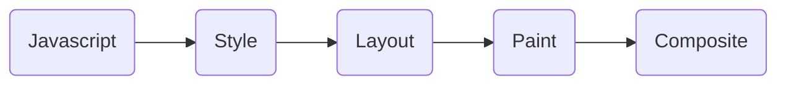
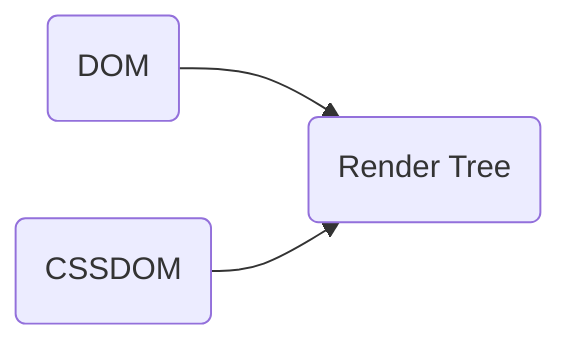

[toc]

# 1 性能监控工具

## 1.1 Chrome 

Chrome 中给我们提供了性能监控工具，例如 Network 栏和 Lighthouse，其中 Network 一栏中我们通过瀑布图可以看到很多信息

我们将鼠标悬停在瀑布流的条状柱中，可以看到一些信息，可能会包括 DNS 查询时间，SSL 协商时间以及比较重要的 TTLB 

> TTLB 字段主要反映后端响应时间，与后端优化密切相关，当然前端也可以采一些手段进行优化

对于瀑布图数据，我们可以使用右键，将其保存为 HAR 文件

Chrome 中的 Lighthouse 是一个性能评分监控台，其中的 Performance 就与网站的性能密切相关，数值越高，性能越好

## 1.2 性能测量工具

- Chrome DevTools 开发调试、性能评测
- Lighthouse 网站整体质量评估
- WebPageTest 多测试地点、全面性能报告

# 2 RAIL 模型

RAIL，由 Google 团队指定的一个以用户为核心的性能模型，其中 RAIL 是一系列单词的缩写：

- R：Response，即响应时间
- A：Animation，即动画特效
- I：Idle，空闲时间
- L：Load，加载时间

**RAIL 评估标准**

- 响应：处理事件应在 50ms 以内完成
- 动画：每 10s 产生一帧
- 空闲：尽可能增加空闲时间
- 加载：在 5s 内完成内容加载并可以交互

# 3 关键渲染路径

**浏览器渲染流程**

其中解析 HTML 标签时，会根据 dom 生成一颗 DOM 树，在解析 CSS 时，同样也会构造一个 CSSDOM 树，这两棵树又被称为 AST（抽象语法树），两颗树合并生成 Render Tree

**分析布局（layout）与绘制（paint）**

布局和绘制是浏览器渲染过程中最重要的两个流程

- 布局主要负责每个节点精确的位置和大小
- 绘制是像素化每个节点的过程

