# 空气质量二次建模

> [!note]
>
> 来源: 2021 年中国数学建模大赛 B 题f


# 出血性脑卒中临床智能诊疗建模

> [!note]
>
> 来源：2023 年中国数学建模大赛 E 题

## 01 题目描述

该题是**出血性脑卒中临床智能诊疗的建模问题** 。核心目标是利用 160 例患者的真实临床信息、治疗方案和多次CT影像检查数据，通过数据分析和建模，解决三个核心临床问题：

1. **血肿扩张风险建模**：要求参赛者首先<strong style="color: orange">识别出哪些患者在发病48小时内发生了血肿扩张</strong> ，然后基于患者的初期临床和影像信息，构建一个<strong style="color:orange">分类模型来预测所有患者发生血肿扩张的概率</strong> 。
2. **血肿周围水肿的演进规律分析**：要求参赛者<strong style="color:orange">构建水肿体积随时间变化的数学模型</strong> ，探索不同患者群体（亚组）的个体化演进模式 ，并分析不同治疗干预措施对水肿进展的影响 。
3. **患者远期预后预测**：要求参赛者综合利用所有可用信息（包括个人史、疾病史、治疗方法及所有影像特征），<strong style="color:orange">构建预测模型，以评估患者在90天后的功能恢复状态（mRS评分） </strong>。最终目标是找出影响预后的关键因素，为临床决策提供科学建议 。


## 02 数据集介绍


## 03 解题思路

### 3.1 判断前100例患者是否发生血肿扩张(分类任务)

建模思路：

1. **数据融合与时间计算**：读取`表1`, `表2`及`附表1`。利用`附表1`将`表2`中的影像流水号转换为精确的检查时间。
2. **标签生成 (任务 1.1)**：对前100位患者，根据其“发病到首次影像检查时间”，计算出每次后续检查距离发病的时间点。筛选出48小时内的检查，并根据“后续体积比首次体积增加≥6mL或相对体积增加≥33%”的定义，判断是否发生扩张，生成0/1标签。
3. **特征工程**：整合`表1`中的临床信息和`表2`、`表3`中**首次影像检查**对应的所有特征，构建特征矩阵X。
4. **模型训练 (任务 1.2)**：以生成的0/1标签为目标Y，在训练集上训练一个分类模型。**XGBoost **因其高性能和鲁棒性成为一个优秀的选择。
5. **概率预测**：使用训练好的模型对所有160名患者的特征矩阵进行预测

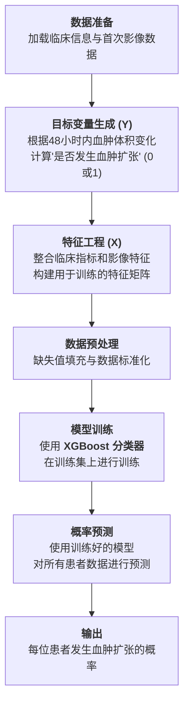


```python
import pandas as pd
import numpy as np
import xgboost as xgb
from sklearn.preprocessing import StandardScaler
from sklearn.impute import SimpleImputer

# --- 1. 加载数据 ---
# 请将文件放在代码同目录下
file_path = './'
df_info = pd.read_excel(file_path + '表1-患者列表及临床信息.xlsx')
df_volume = pd.read_excel(file_path + '表2-患者影像信息血肿及水肿的体积及位置.xlsx')
df_lookup = pd.read_excel(file_path + '附表1-检索表格-流水号vs时间.xlsx')
df_answer = pd.read_excel(file_path + '表4-答案文件.xlsx')

# --- 2. 任务1.1: 判断血肿扩张 ---
df_lookup['检查时间'] = pd.to_datetime(df_lookup['检查时间'], format='%Y%m%d%H%M%S')
time_map = dict(zip(df_lookup['流水号'], df_lookup['检查时间']))
df_volume['检查时间'] = df_volume['流水号'].map(time_map)

expansion_results = []
for patient_id in df_info['ID'][:100]:
    patient_info = df_info[df_info['ID'] == patient_id].iloc[0]
    patient_scans = df_volume[df_volume['ID'] == patient_id].sort_values(by='检查时间')
    
    first_scan_serial = patient_info['入院首次影像检查流水号']
    time_onset_to_first = patient_info['发病到首次影像检查时间间隔']
    
    first_scan = patient_scans[patient_scans['流水号'] == first_scan_serial]
    if first_scan.empty: continue
        
    initial_volume = first_scan['HM_volume'].iloc[0]
    initial_time = first_scan['检查时间'].iloc[0]
    
    is_expansion, expansion_time = 0, np.nan
    for _, row in patient_scans.iterrows():
        if row['流水号'] == first_scan_serial: continue
        
        time_from_onset = time_onset_to_first + (row['检查时间'] - initial_time).total_seconds() / 3600.0
        
        if time_from_onset <= 48:
            if row['HM_volume'] >= initial_volume + 6000 or row['HM_volume'] >= initial_volume * 1.33: # 注意：题目体积单位为10^-3 ml，6ml = 6000 * 10^-3 ml
                is_expansion = 1
                expansion_time = round(time_from_onset, 2)
                break
    expansion_results.append({'ID': patient_id, '是否发生血肿扩张': is_expansion, '血肿扩张发生时间': expansion_time})

# 更新答案表
results_df = pd.DataFrame(expansion_results).set_index('ID')
df_answer = df_answer.set_index('ID')
df_answer.update(results_df)
df_answer.reset_index(inplace=True)

# --- 3. 任务1.2: 构建预测模型 ---
# 特征工程 (仅展示部分，需整合表3)
df_info_processed = df_info.copy()
df_info_processed[['收缩压', '舒张压']] = df_info_processed['血压'].str.split('/', expand=True).astype(float)
df_info_processed = pd.get_dummies(df_info_processed, columns=['性别'], drop_first=True)

first_scan_data = df_info_processed.merge(
    df_volume, left_on='入院首次影像检查流水号', right_on='流水号', suffixes=('', '_vol')
)
# (此处省略整合表3的代码)

# 准备训练数据
features_cols = [col for col in first_scan_data.columns if col in df_info.columns or col.startswith('HM_') or col.startswith('ED_')] # 简化特征选择
X = first_scan_data.set_index('ID')[features_cols].select_dtypes(include=np.number)
y = df_answer.set_index('ID')['是否发生血肿扩张']

X_train = X.loc['sub001':'sub100']
y_train = y.loc['sub001':'sub100']

# 数据预处理
imputer = SimpleImputer(strategy='median')
scaler = StandardScaler()
X_train_processed = scaler.fit_transform(imputer.fit_transform(X_train))
X_all_processed = scaler.transform(imputer.transform(X))

# 模型训练与预测
model = xgb.XGBClassifier(objective='binary:logistic', use_label_encoder=False, eval_metric='logloss', random_state=42)
model.fit(X_train_processed, y_train)
probabilities = model.predict_proba(X_all_processed)[:, 1]

# 更新答案表
prob_df = pd.DataFrame({'ID': X.index, '血肿扩张预测概率': probabilities}).set_index('ID')
df_answer = df_answer.set_index('ID')
df_answer.update(prob_df)
df_answer.reset_index(inplace=True)

print("问题一完成。")
```


### 3.2 血肿周围水肿演进建模(回归和聚类任务)

建模思路：

**数据准备**：为前100位患者的所有水肿体积（ED_volume）数据点，计算出相对于发病时间的精确时间轴。

**全体模型**：将所有患者的时间-水肿体积数据点汇集起来，使用**非线性回归**（如Sigmoid函数，因其能模拟生物生长曲线）拟合出一条总体趋势曲线 y=f(x) 。计算每个数据点与该曲线的残差，并为每位患者汇总残差（如RMSE）。

**亚组模型**：

- **特征工程**：为每位患者提取能代表其水肿进展模式的特征，例如水肿峰值、达到峰值的时间、平均增长率等。
- **聚类分析**：使用**K-Means算法**对这些特征进行聚类，将患者分为3-5个亚组 。
- **分组回归**：对每个亚组内的数据点，独立进行非线性回归，拟合出该亚组特有的进展曲线。
- **残差计算**：计算每位患者的数据点与其所属亚组曲线的残差。

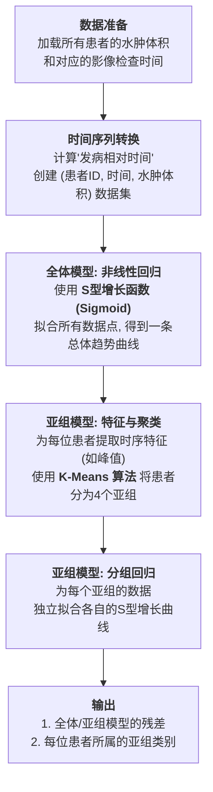


```python
from scipy.optimize import curve_fit
from sklearn.cluster import KMeans

# --- 1. 准备水肿时间序列数据 ---
edema_data = []
for patient_id in df_info['ID'][:100]:
    patient_info = df_info[df_info['ID'] == patient_id].iloc[0]
    patient_scans = df_volume[df_volume['ID'] == patient_id]
    if patient_scans.empty: continue
    
    first_scan_serial = patient_info['入院首次影像检查流水号']
    time_onset_to_first = patient_info['发病到首次影像检查时间间隔']
    initial_time = df_volume[df_volume['流水号'] == first_scan_serial]['检查时间'].iloc[0]

    for _, row in patient_scans.iterrows():
        time_from_onset = time_onset_to_first + (row['检查时间'] - initial_time).total_seconds() / 3600.0
        edema_data.append({'ID': patient_id, 'Time': time_from_onset, 'ED_volume': row['ED_volume']})

df_edema = pd.DataFrame(edema_data)

# --- 2. 任务2.1: 全体模型 ---
def sigmoid(x, L, k, x0):
    return L / (1 + np.exp(-k * (x - x0)))

try:
    p0 = [df_edema['ED_volume'].max(), 0.1, df_edema['Time'].median()]
    params_all, _ = curve_fit(sigmoid, df_edema['Time'], df_edema['ED_volume'], p0=p0, maxfev=5000)
    df_edema['predicted_all'] = sigmoid(df_edema['Time'], *params_all)
    df_edema['residual_sq_all'] = (df_edema['ED_volume'] - df_edema['predicted_all'])**2
    residuals_all = df_edema.groupby('ID')['residual_sq_all'].apply(lambda x: np.sqrt(x.mean())).rename('残差（全体）')
    
    df_answer = df_answer.set_index('ID')
    df_answer.update(residuals_all)
    df_answer.reset_index(inplace=True)
except Exception as e:
    print(f"全体模型拟合失败: {e}")


# --- 3. 任务2.2: 亚组模型 ---
# 提取聚类特征
cluster_features = df_edema.groupby('ID')['ED_volume'].agg(['max', 'mean']).join(
    df_edema.loc[df_edema.groupby('ID')['ED_volume'].idxmax()].set_index('ID')['Time'].rename('time_to_max')
).fillna(0)

# K-Means聚类
kmeans = KMeans(n_clusters=4, random_state=42, n_init=10)
cluster_features['subgroup'] = kmeans.fit_predict(StandardScaler().fit_transform(cluster_features))

# 分组回归和计算残差 (代码略)
# ...

# 更新答案表 (假设已计算好亚组残差和亚组标签)
df_answer = df_answer.set_index('ID')
# df_answer.update(residuals_subgroup) 
df_answer.update(cluster_features[['subgroup']].rename(columns={'subgroup': '所属亚组'}))
df_answer.reset_index(inplace=True)

print("问题二完成。")
```


### 3.3 mRS预后预测(分类任务)

建模思路：

1. **模型选择**：mRS是0-6的有序等级变量 ，应选用

2. **有序回归模型**（如`mord`库中的`OrdinalRidge`），它能充分利用标签的顺序信息。

3. **模型一 (任务 3.1)**：使用与问题一相同的**静态特征集**（仅首次影像信息 ），训练一个有序回归模型，并对所有160名患者进行预测。

4. **模型二 (任务 3.2)**：

   - **动态特征工程**：创建能反映疾病动态变化的特征。例如，将在问题一中计算的“是否发生血肿扩张”标签、问题二中得到的“水肿亚组类别”和“水肿增长率”等作为新特征。

   - **模型训练**：将静态特征与新的动态特征合并，构建一个更强大的特征集。在这个新特征集上训练另一个有序回归模型。

   - **预测**：对所有包含随访影像的患者（sub001-100, sub131-160 ）进行预测。


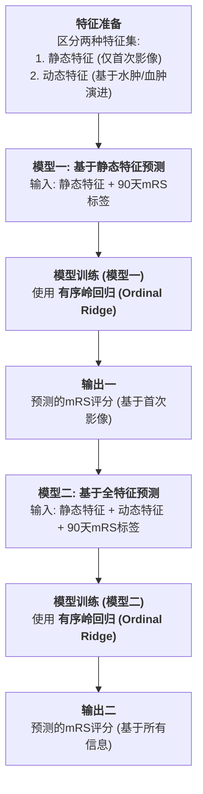


```js
# 需要先安装mord: pip install mord
import mord

# --- 1. 任务3.1: 基于首次影像预测 ---
# 使用问题一中已处理好的特征和预处理器
# X_train_processed, X_all_processed
y_mrs_train = df_info[df_info['ID'].str.contains('sub[0-9]{3}')].set_index('ID').loc['sub001':'sub100']['90天 mRS']

model_mrs1 = mord.OrdinalRidge(alpha=1.0)
model_mrs1.fit(X_train_processed, y_mrs_train)
predictions_mrs1 = model_mrs1.predict(X_all_processed)

# 更新答案表
mrs1_df = pd.DataFrame({'ID': X.index, '预测mRS（基于首次影像）': predictions_mrs1}).set_index('ID')
df_answer = df_answer.set_index('ID')
df_answer.update(mrs1_df)
df_answer.reset_index(inplace=True)


# --- 2. 任务3.2: 基于所有信息预测 ---
# 创建动态特征
dynamic_features = pd.concat([
    df_answer.set_index('ID')['是否发生血肿扩张'],
    df_answer.set_index('ID')['所属亚组']
], axis=1)

# 合并特征 (此处X来自问题一)
X_final = X.merge(dynamic_features, on='ID', how='left')

# 准备训练和预测数据
target_ids = [f'sub{str(i).zfill(3)}' for i in list(range(1, 101)) + list(range(131, 161))]
X_train_final = X_final.loc['sub001':'sub100']
X_predict_final = X_final.loc[target_ids]

# 预处理
imputer_final = SimpleImputer(strategy='median')
scaler_final = StandardScaler()
X_train_final_processed = scaler_final.fit_transform(imputer_final.fit_transform(X_train_final))
X_predict_final_processed = scaler_final.transform(imputer_final.transform(X_predict_final))

# 训练和预测
model_mrs2 = mord.OrdinalRidge(alpha=1.0)
model_mrs2.fit(X_train_final_processed, y_mrs_train)
predictions_mrs2 = model_mrs2.predict(X_predict_final_processed)

# 更新答案表
mrs2_df = pd.DataFrame({'ID': X_predict_final.index, '预测mRS': predictions_mrs2}).set_index('ID')
df_answer = df_answer.set_index('ID')
df_answer.update(mrs2_df)
df_answer.reset_index(inplace=True)

print("问题三完成。")
# df_answer.to_excel("表4-答案文件_已填充.xlsx", index=False)
```


# 能见度估计与预测

> [!note]
>
> 来源：2020 年中国数学建模大赛 E 题

## 01 题目描述

该题目的核心是研究大雾的演化规律，并对大雾的变化趋势进行预测。能见度对于高速公路行车安全和飞机起降至关重要。当能见度极低时，高速公路通常会封闭，航班起降也会受到限制甚至取消。传统的激光能见度仪存在成本高、维护难、探测范围有限等不足。近年来，基于视频的能见度检测方法受到了广泛关注，它通过分析视频图像来间接计算能见度数值。该方法旨在充分利用视频中包含的大雾变化过程信息，不仅可以提高能见度估计的精度，还可以对大雾的消散进行预测。

题目要求参赛者解决四个核心问题：

1. 建立能见度与气象因素的关系模型
2. 构建基于视频的深度学习估计模型
3. 设计一种不依赖能见度仪的估计算法
4. 建立模型预测大雾的变化趋势


## 02 解题思路

### 2.1 能见度与气象因素的关系（回归分析）

任务是建立模型描述能见度与地面气象观测（温度、湿度和风速等）之间的关系，并针对题目所提供的数据导出具体的关系式


该问题的核心是利用已知的气象数据作为自变量（特征），能见度作为因变量（目标），来寻找它们之间的函数关系。最直接的方法是采用多元线性回归，因为它能提供一个直观、易于解释的数学表达式。步骤如下：

1. **数据加载与探索**：加载`机场AMOS观测.zip`中的数据，理解各字段含义，检查数据质量，如是否存在缺失值或异常值。
2. **数据预处理**：清洗数据，对数值型特征进行标准化处理，以消除不同单位（量纲）对模型系数的影响。
3. **特征选择**：通过相关性分析（如计算皮尔逊相关系数）来确定与能见度最相关的气象因素，剔除不相关的特征。
4. **模型训练**：将数据集划分为训练集和测试集，使用训练集来训练多元线性回归模型。
5. **模型评估与导出**：在测试集上评估模型性能（如使用R²分数、均方误差等）。如果性能可接受，则提取模型的系数和截距，


建模流程：

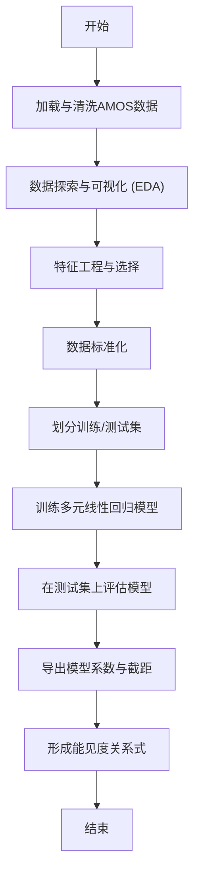

实现代码

```python
import pandas as pd
import numpy as np
from sklearn.model_selection import train_test_split
from sklearn.linear_model import LinearRegression
from sklearn.preprocessing import StandardScaler
from sklearn.metrics import mean_squared_error, r2_score
import io

# --- 模拟数据 ---
# 实际情况下，您需要从 "机场AMOS观测.zip" 加载数据
# 这里我们创建一个模拟的DataFrame
csv_data = """
timestamp,visibility_m,temperature_c,humidity_rh,wind_speed_mps
2020-01-01 00:00,1200,5.2,85,2.1
2020-01-01 01:00,1000,4.8,88,1.9
2020-01-01 02:00,800,4.5,92,1.5
2020-01-01 03:00,650,4.2,95,1.2
2020-01-01 04:00,900,4.6,91,1.8
2020-01-01 05:00,1500,5.5,84,2.5
2020-01-01 06:00,2000,6.1,80,3.1
2020-01-01 07:00,2500,7.0,75,3.5
"""
df = pd.read_csv(io.StringIO(csv_data))

# 1. 定义特征和目标
features = ['temperature_c', 'humidity_rh', 'wind_speed_mps']
target = 'visibility_m'

X = df[features]
y = df[target]

# 2. 数据标准化
scaler = StandardScaler()
X_scaled = scaler.fit_transform(X)

# 3. 划分数据集
X_train, X_test, y_train, y_test = train_test_split(X_scaled, y, test_size=0.3, random_state=42)

# 4. 训练多元线性回归模型
model = LinearRegression()
model.fit(X_train, y_train)

# 5. 模型评估
y_pred = model.predict(X_test)
mse = mean_squared_error(y_test, y_pred)
r2 = r2_score(y_test, y_pred)

print(f"模型评估:")
print(f"  均方误差 (MSE): {mse:.2f}")
print(f"  R^2 分数: {r2:.2f}\n")

# 6. 导出关系式
# 注意：关系式中的系数是基于标准化数据的。
# 为了得到原始数据的关系式，需要进行反向转换，或在原始数据上训练。
# 这里为简化，我们直接展示标准化数据训练出的模型系数。
coefficients = model.coef_
intercept = model.intercept_

print("能见度与标准化气象因素的关系式:")
formula = f"Visibility_m = {intercept:.2f}"
for feature, coef in zip(features, coefficients):
    formula += f" + ({coef:.2f} * scaled_{feature})"
print(formula)

# 演示如何使用模型进行预测
# 假设有新的气象数据：温度=5, 湿度=90, 风速=1.7
new_data = np.array([[5, 90, 1.7]])
new_data_scaled = scaler.transform(new_data)
predicted_visibility = model.predict(new_data_scaled)
print(f"\n新数据预测能见度: {predicted_visibility[0]:.2f} 米")
```


### 2.2 基于深度学习的能见度估计(计算机视觉 & 监督学习回归)

图像回归问题，目标是训练一个能从图像中提取视觉特征并映射到连续能见度值的深度学习模型。


1. **数据准备**：这是最关键的一步。需要编写脚本从视频中逐帧提取图像，并根据每帧的时间戳，从AMOS数据中匹配到最接近的能见度值，从而创建成对的`(图像, 能见度)`数据集。
2. **图像预处理**：将所有图像调整到统一的尺寸（例如224x224像素），进行归一化处理。
3. **模型架构**：采用迁移学习策略。使用一个在大型图像数据集（如ImageNet）上预训练的卷积神经网络（CNN），例如MobileNetV2或ResNet50，作为特征提取器。冻结其大部分底层权重，只训练顶部的少数几层和新添加的回归头（几个全连接层，最后输出一个神经元）。
4. **模型训练**：将数据集划分为训练、验证和测试集。使用均方误差（MSE）作为损失函数，Adam作为优化器进行训练。在训练过程中监控验证集的损失，以防止过拟合。
5. **精度评估**：训练完成后，在测试集上评估模型的性能，计算平均绝对误差（MAE）和均方根误差（RMSE）。


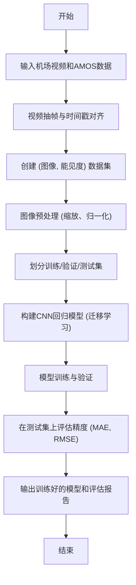

```python
import tensorflow as tf
from tensorflow.keras.layers import Dense, GlobalAveragePooling2D
from tensorflow.keras.models import Model
from tensorflow.keras.applications import MobileNetV2
from tensorflow.keras.preprocessing.image import ImageDataGenerator
import numpy as np
import pandas as pd

# --- 模拟数据和流程 ---
# 假设我们已经完成了数据准备，有了一个包含图像路径和对应能见度的DataFrame
# 实际操作中，你需要用OpenCV等工具来生成这些数据
image_data = {
    'filepath': [f'frame_{i:04d}.jpg' for i in range(100)],
    'visibility': np.random.randint(200, 5000, 100)
}
df = pd.DataFrame(image_data)

# 假设图像已经存在于 'images/' 目录下
# 为了让代码能运行，我们创建一些虚拟图像
import os
from PIL import Image
if not os.path.exists('images'):
    os.makedirs('images')
for fname in df['filepath']:
    dummy_img = Image.fromarray(np.uint8(np.random.rand(224, 224, 3) * 255))
    dummy_img.save(os.path.join('images', fname))
    
df['filepath'] = df['filepath'].apply(lambda x: os.path.join('images', x))

# 1. 划分数据
train_df, test_df = train_test_split(df, test_size=0.2, random_state=42)

# 2. 图像数据生成器
# 使用 ImageDataGenerator 从 DataFrame 加载图像并进行预处理
datagen = ImageDataGenerator(
    rescale=1./255.,
    validation_split=0.2 # 从训练集中再分出20%作为验证集
)

train_generator = datagen.flow_from_dataframe(
    dataframe=train_df,
    x_col='filepath',
    y_col='visibility',
    target_size=(224, 224),
    class_mode='raw', # 回归任务
    batch_size=16,
    subset='training'
)

validation_generator = datagen.flow_from_dataframe(
    dataframe=train_df,
    x_col='filepath',
    y_col='visibility',
    target_size=(224, 224),
    class_mode='raw',
    batch_size=16,
    subset='validation'
)

# 3. 构建模型 (迁移学习)
base_model = MobileNetV2(weights='imagenet', include_top=False, input_shape=(224, 224, 3))
base_model.trainable = False # 冻结预训练模型的权重

x = base_model.output
x = GlobalAveragePooling2D()(x)
x = Dense(128, activation='relu')(x)
predictions = Dense(1)(x) # 输出层，1个神经元，无激活函数

model = Model(inputs=base_model.input, outputs=predictions)

# 4. 编译模型
model.compile(optimizer='adam', loss='mean_squared_error', metrics=['mae'])
model.summary()

# 5. 训练模型
# 由于数据是随机生成的，训练效果没有实际意义，这里只演示流程
history = model.fit(
    train_generator,
    validation_data=validation_generator,
    epochs=5 # 使用真实数据时，需要更多epochs
)

print("\n模型训练完成。")

# 6. 评估模型 (在独立的测试集上)
# 准备测试数据生成器
test_datagen = ImageDataGenerator(rescale=1./255.)
test_generator = test_datagen.flow_from_dataframe(
    dataframe=test_df,
    x_col='filepath',
    y_col='visibility',
    target_size=(224, 224),
    class_mode='raw',
    batch_size=16,
    shuffle=False
)

print("\n在测试集上评估模型:")
eval_results = model.evaluate(test_generator)
print(f"测试集损失 (MSE): {eval_results[0]:.2f}")
print(f"测试集平均绝对误差 (MAE): {eval_results[1]:.2f}")
```


# 汽油辛烷值优化建模

> [!note]
>
> 来源：2023 年中国数学建模大赛 B 题


## 02 解题思路

### 2.1 数据处理(数据预处理 & 时间序列数据聚合)

参考附件一中已有的数据预处理结果，依据“样本确定方法”（附件二）对285号和313号数据样本的原始数据（附件三）进行预处理，并将处理后的数据补充到附件一的样本集中。

核心任务是根据规则将时序过程数据转换为截面数据样本。

1. **加载数据**：分别加载285号和313号样本的原始时序数据（附件三）以及辛烷值测量结果。
2. **确定时间窗口**：根据辛烷值的测量时刻，向前追溯两小时，确定需要进行聚合计算的时间窗口。
3. **聚合计算**：在该两小时时间窗口内，对所有的操作变量（共354个）求取平均值。
4. **整合样本**：将计算出的354个操作变量平均值，与该样本的其他信息（如原料性质、产品性质等）整合为一条完整的样本数据。
5. **数据追加**：将处理好的285号和313号两条新样本数据，追加到附件一的325个样本数据文件的末尾，形成一个包含327个样本的新数据集供后续使用。

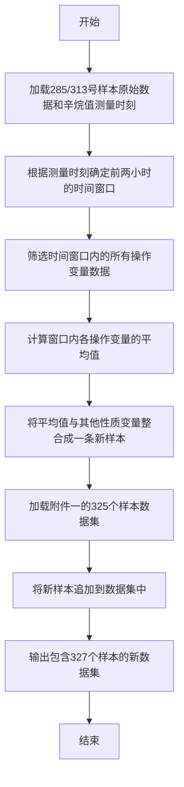

```python
import pandas as pd
import numpy as np
import io
from datetime import datetime, timedelta

# --- 模拟数据 ---
# 模拟附件一：325个样本数据.xlsx
main_data_csv = """
sample_id,RON_loss,sulfur_content,op_var_1,op_var_2
1,1.5,6.5,10.1,20.2
...
325,1.2,4.8,11.5,21.7
"""
main_df = pd.read_csv(io.StringIO(main_data_csv.replace('...', '')))

# 模拟附件三：285号和313号样本原始数据.xlsx
# 假设每个样本的原始数据包含时间戳和354个操作变量
# 为简化，这里只模拟2个操作变量
raw_data_285_csv = """
timestamp,op_var_1,op_var_2
2019-10-10 08:00:00,15.1,30.5
2019-10-10 08:03:00,15.2,30.6
2019-10-10 09:00:00,15.5,30.8
2019-10-10 09:57:00,15.6,31.1
2019-10-10 10:00:00,15.8,31.2
"""
raw_df_285 = pd.read_csv(io.StringIO(raw_data_285_csv), parse_dates=['timestamp'])

# 假设285号样本的辛烷值测量时刻和其它属性
sample_285_info = {
    'sample_id': 285,
    'measurement_time': datetime.strptime('2019-10-10 10:00:00', '%Y-%m-%d %H:%M:%S'),
    'RON_loss': 1.8,
    'sulfur_content': 7.1
}

# --- 数据处理流程 ---
def preprocess_sample(raw_df, sample_info):
    """
    根据给定的方法对单个样本进行预处理
    """
    end_time = sample_info['measurement_time']
    start_time = end_time - timedelta(hours=2)
    
    # 筛选时间窗口内的数据
    time_window_df = raw_df[(raw_df['timestamp'] >= start_time) & (raw_df['timestamp'] <= end_time)]
    
    # 计算操作变量的平均值
    op_vars_mean = time_window_df.drop(columns=['timestamp']).mean()
    
    # 创建新的样本行
    new_sample = {
        'sample_id': sample_info['sample_id'],
        'RON_loss': sample_info['RON_loss'],
        'sulfur_content': sample_info['sulfur_content']
    }
    new_sample.update(op_vars_mean.to_dict())
    
    return pd.DataFrame([new_sample])

# 处理285号样本
new_sample_285 = preprocess_sample(raw_df_285, sample_285_info)
print("处理后的285号样本:\n", new_sample_285)

# (类似地处理313号样本...)

# 将新样本追加到主数据集中
updated_df = pd.concat([main_df, new_sample_285], ignore_index=True)

print("\n追加新样本后的数据集:\n", updated_df)
```


### 2.2 寻找建模主要变量（特征工程 & 降维 ）

任务描述：从包括原料性质、吸附剂性质和354个操作变量在内的共367个变量中，通过降维方法筛选出用于建模的主要变量，数量建议在30个以下，并说明筛选过程及合理性 。提示考虑将原料辛烷值作为变量之一 

1. **数据准备**：使用问题一生成的包含327个样本的数据集。
2. **初步筛选（过滤法）**：
   - **移除低方差特征**：剔除那些在所有样本中几乎没有变化的变量，因为它们包含的信息量很少。
   - **移除高相关特征**：计算所有变量间的相关系数矩阵，对于相关性极高（如>0.95）的一对变量，可根据其与目标变量（RON损失）的相关性或业务理解，保留其一。
3. **特征重要性排序（嵌入法）**：使用能够输出特征重要性的模型（如随机森林或梯度提升树）对初步筛选后的特征进行训练。根据模型给出的重要性得分进行排序。
4. **最终选择**：
   - 根据重要性得分，选择排名前列的变量（例如前29个）。
   - 根据题目提示，确保“原料的辛烷值”被包含在内 。如果它不在前29名中，可以替换掉排名最末的变量。
   - 最终形成一个数量小于30的变量子集。这个过程兼顾了统计显著性和模型的预测能力，筛选出的变量对RON损失有较强的影响力且信息冗余度较低。

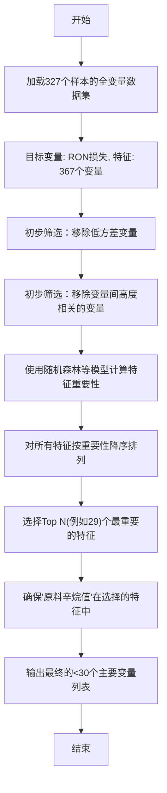

```python
import pandas as pd
import numpy as np
from sklearn.ensemble import RandomForestRegressor
from sklearn.feature_selection import VarianceThreshold

# --- 模拟数据 ---
# 模拟一个包含327个样本和较多特征的数据集
np.random.seed(42)
data = {
    'RON_loss': np.random.uniform(0.5, 2.0, 327),
    'raw_RON': np.random.uniform(85, 92, 327),
    'low_variance_feat': [1.0] * 327, # 低方差特征
    'feat_A': np.random.rand(327) * 10
}
# 创建一些高度相关的特征和一些随机特征
data['feat_A_correlated'] = data['feat_A'] * np.random.uniform(0.99, 1.01, 327)
for i in range(50):
    data[f'random_feat_{i}'] = np.random.rand(327)

df = pd.DataFrame(data)
df['RON_loss'] = df['RON_loss'] + df['raw_RON']*0.05 - df['feat_A']*0.1 # 人为制造一些关系

X = df.drop('RON_loss', axis=1)
y = df['RON_loss']

# 1. 初步筛选：移除低方差特征
selector_var = VarianceThreshold(threshold=0.01)
X_high_variance = selector_var.fit_transform(X)
# 获取保留的列名
retained_cols_var = X.columns[selector_var.get_support()]
X = pd.DataFrame(X_high_variance, columns=retained_cols_var)
print(f"移除低方差特征后，剩余特征数: {X.shape[1]}")

# 2. 初步筛选：移除高相关特征
corr_matrix = X.corr().abs()
upper = corr_matrix.where(np.triu(np.ones(corr_matrix.shape), k=1).astype(bool))
to_drop = [column for column in upper.columns if any(upper[column] > 0.95)]
X = X.drop(to_drop, axis=1)
print(f"移除高相关特征后，剩余特征数: {X.shape[1]}")
print(f"被移除的高相关特征: {to_drop}")


# 3. 使用随机森林计算特征重要性
model_rf = RandomForestRegressor(n_estimators=100, random_state=42)
model_rf.fit(X, y)
importances = model_rf.feature_importances_
feature_importance_df = pd.DataFrame({
    'feature': X.columns,
    'importance': importances
}).sort_values('importance', ascending=False)

print("\n特征重要性排序:\n", feature_importance_df.head(10))

# 4. 最终选择
# 选择重要性最高的29个特征，并确保原料辛烷值在内
num_main_variables = 29
main_features = list(feature_importance_df['feature'].head(num_main_variables))
if 'raw_RON' not in main_features:
    # 如果原料RON不在其中，则替换掉最不重要的一个
    main_features[-1] = 'raw_RON'
    
print(f"\n最终选择的 {len(main_features)} 个主要变量 (示例):")
print(main_features)
```


### 2.3 建立辛烷值（RON）损失预测模型（监督学习 & 回归建模）

**任务描述**：采用筛选出的主要变量和样本数据，通过数据挖掘技术建立辛烷值（RON）损失的预测模型，并进行模型验证 。

1. **数据准备**：使用包含327个样本和问题二筛选出的主要变量的数据集。
2. **模型选择**：考虑到化工过程的非线性和强耦合特性 ，应选择性能强大的非线性模型。梯度提升决策树（Gradient Boosting Decision Trees, GBDT）如XGBoost、LightGBM，或随机森林是很好的选择。它们能够有效处理变量间的复杂交互。
3. **数据划分**：将数据集按一定比例（如80:20）划分为训练集和测试集。
4. **模型训练与调优**：在训练集上训练模型。可以采用交叉验证（Cross-Validation）的方式来寻找模型的最优超参数（如树的数量、深度、学习率等），以防止过拟合，提高模型的泛化能力。
5. **模型验证**：在从未参与训练的测试集上评估模型的性能。常用的评估指标包括：
   - **均方根误差 (RMSE)**：衡量预测值与真实值之间的偏差大小。
   - **平均绝对误差 (MAE)**：直观反映预测误差的平均大小。
   - **决定系数 (R²)**：表示模型对数据方差的解释程度，越接近1越好。

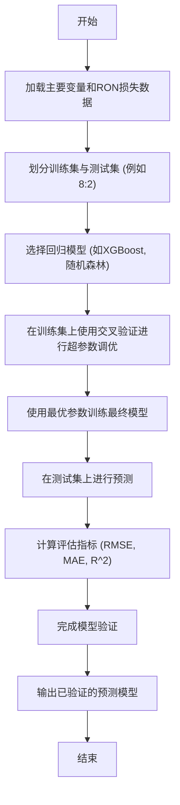

```python
import pandas as pd
import numpy as np
from sklearn.model_selection import train_test_split
from sklearn.ensemble import GradientBoostingRegressor
from sklearn.metrics import mean_squared_error, r2_score

# --- 模拟数据 ---
# 假设 X_main_features 是从问题二得到的包含主要变量的DataFrame
# 假设 y 是对应的RON损失
np.random.seed(42)
num_samples = 327
num_features = 25
X_main_features = pd.DataFrame(np.random.rand(num_samples, num_features), 
                               columns=[f'feat_{i}' for i in range(num_features)])
# 人为创建一个非线性关系
y = (1.5 + 
     0.8 * np.sin(X_main_features['feat_0'] * np.pi) + 
     0.5 * X_main_features['feat_1']**2 + 
     np.random.normal(0, 0.1, num_samples))

# 1. 划分数据集
X_train, X_test, y_train, y_test = train_test_split(
    X_main_features, y, test_size=0.2, random_state=42
)

# 2. 模型选择与训练
# 选择梯度提升回归树
gbr = GradientBoostingRegressor(
    n_estimators=100, 
    learning_rate=0.1, 
    max_depth=3, 
    random_state=42
)
print("开始训练RON损失预测模型...")
gbr.fit(X_train, y_train)
print("模型训练完成。")

# 3. 模型验证
y_pred = gbr.predict(X_test)
rmse = np.sqrt(mean_squared_error(y_test, y_pred))
r2 = r2_score(y_test, y_pred)

print("\n模型验证结果 (在测试集上):")
print(f"  均方根误差 (RMSE): {rmse:.4f}")
print(f"  R^2 分数: {r2:.4f}")

# 4. 示例预测
sample_to_predict = X_test.iloc[[0]]
prediction = gbr.predict(sample_to_predict)
print(f"\n对一个样本进行预测:")
print(f"  输入特征: \n{sample_to_predict}")
print(f"  预测RON损失: {prediction[0]:.4f}")
print(f"  实际RON损失: {y_test.iloc[0]:.4f}")
```


### 2.4 主要变量操作方案的优化（约束优化）

**任务描述**：在保证产品硫含量不大于5μg/g的前提下，利用模型为325个样本分别计算主要变量的优化操作条件，使得辛烷值（RON）损失降幅大于30%。优化过程中原料、待生吸附剂、再生吸附剂的性质保持不变 。


1. **构建硫含量预测模型**：除了问题三的RON损失模型，还需要建立一个以相同的主要变量为输入，以“产品硫含量”为输出的回归模型（下称“硫含量模型”）。训练方法与问题三类似。
2. **定义优化问题**：对于325个样本中的每一个样本，都需要独立求解一个优化问题：
   - **目标函数**：最小化RON损失模型的预测值，即 `minimize f(x) = RON_loss_model(x)`。
   - **决策变量 (x)**：问题二中筛选出的、可以实际操作调整的主要变量。原料性质等不可变变量作为常量传入。
   - **约束条件**：
     - 硫含量约束：`Sulfur_model(x) <= 5`。
     - RON损失降低约束：`RON_loss_model(x) <= original_RON_loss * (1 - 0.3)`。
     - 变量边界约束：每个操作变量都有其物理或工艺上的操作范围（可从数据本身的min/max或附件四推断）。
3. **求解优化**：使用数值优化算法求解。`scipy.optimize.minimize`库中的`SLSQP` (Sequential Least Squares Programming) 算法非常适合处理这类问题。对每个样本，以其当前的操作条件为初始点开始搜索，找到满足所有约束条件并使RON损失最小化的最优操作条件。


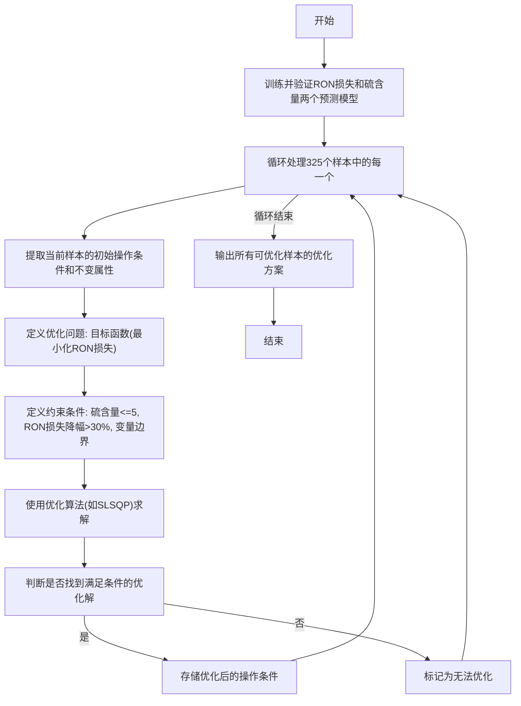

```python
import numpy as np
from scipy.optimize import minimize

# --- 假设模型和数据已准备好 ---
# 假设 gbr_ron_loss 和 gbr_sulfur 是已经训练好的模型
# def ron_loss_model(X): return gbr_ron_loss.predict(X)
# def sulfur_model(X): return gbr_sulfur.predict(X)

# 为演示，我们创建简单的模拟函数
def ron_loss_model(x):
    return 2.0 - 0.5 * x[0] + 0.2 * x[1]**2 

def sulfur_model(x):
    return 10.0 - 0.8 * x[0] - 0.3 * x[1]

# 假设当前样本的初始状态
# x_initial 是可操作变量的初始值
x_initial = np.array([5.0, 6.0]) 
# non_operational_vars 是固定不变的变量，模型可能也需要它们
# 为简化，这里的模型只用了可操作变量
original_ron_loss = ron_loss_model(x_initial)
original_sulfur = sulfur_model(x_initial)

print(f"初始状态:")
print(f"  操作条件: {x_initial}")
print(f"  RON损失: {original_ron_loss:.4f}")
print(f"  硫含量: {original_sulfur:.4f}")


# 1. 定义目标函数
def objective(x):
    return ron_loss_model(x)

# 2. 定义约束条件
constraints = [
    {'type': 'ineq', 'fun': lambda x: 5.0 - sulfur_model(x)}, # 硫含量约束
    {'type': 'ineq', 'fun': lambda x: original_ron_loss * 0.7 - ron_loss_model(x)} # RON损失降低30%
]

# 3. 定义变量边界
# 假设操作变量范围是 [0, 10]
bounds = [(0, 10), (0, 10)]

# 4. 求解优化
print("\n开始进行优化求解...")
result = minimize(
    objective, 
    x_initial, 
    method='SLSQP', 
    bounds=bounds, 
    constraints=constraints
)

# 5. 输出结果
if result.success:
    optimized_x = result.x
    optimized_ron_loss = ron_loss_model(optimized_x)
    optimized_sulfur = sulfur_model(optimized_x)
    
    print("优化成功!")
    print(f"  优化后操作条件: {optimized_x}")
    print(f"  优化后RON损失: {optimized_ron_loss:.4f} (降低了 {((original_ron_loss - optimized_ron_loss) / original_ron_loss * 100):.2f}%)")
    print(f"  优化后硫含量: {optimized_sulfur:.4f}")
else:
    print("优化失败:", result.message)
```


### 2.5 模型的可视化展示（数据可视化 & 仿真）

**任务描述**：对133号样本，以图形展示其主要操作变量从初始值逐步调整到优化值的过程中，对应的汽油辛烷值和硫含量的变化轨迹。每次调整的幅度参考附件四 

这个任务需要模拟一个逐步优化的过程，并将其路径可视化。

1. **获取起点和终点**：起点是133号样本的原始操作条件，终点是问题四为其计算出的优化操作条件。
2. **获取步长**：从附件四中查找每个主要操作变量对应的“每次允许调整幅度值Δ” 。
3. **生成调整路径**：
   - 计算每个变量从起点到终点的总距离 `dist = x_optimal - x_initial`。
   - 确定需要的最大步数 `max_steps = max(abs(dist / delta))`。
   - 通过线性插值，生成从起点到终点的包含 `max_steps` 个中间点的路径。确保每一步的移动距离不超过Δ。
4. **路径点预测**：对于路径上的每一个中间点（代表一组操作条件），使用问题三和问题四中训练好的RON损失模型和硫含量模型，预测该点的RON损失和硫含量。
5. **绘制轨迹图**：创建一个二维图表，横轴为RON损失，纵轴为硫含量。将路径上每个点的预测结果 `(RON_loss, sulfur_content)` 绘制出来，并用箭头连接，形成一条从初始状态指向优化状态的轨迹。

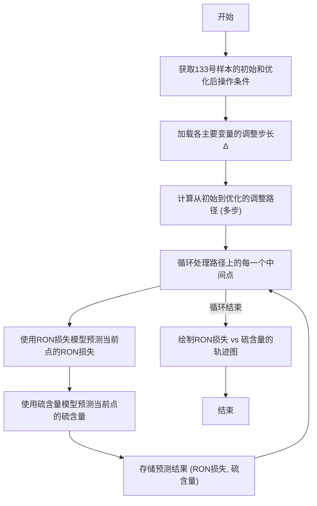

```python
import numpy as np
import matplotlib.pyplot as plt

# --- 假设模型和数据已准备好 ---
# 沿用问题四的模拟模型
# def ron_loss_model(x): ...
# def sulfur_model(x): ...

# 133号样本的初始和优化条件 (来自问题四的结果)
x_initial_133 = np.array([8.0, 3.0])
x_optimal_133 = np.array([3.0, 8.0])

# 附件四中各变量的调整步长 Δ
deltas = np.array([0.5, 0.5]) 

# 1. 生成调整路径
total_change = x_optimal_133 - x_initial_133
num_steps = int(np.max(np.abs(total_change / deltas))) + 1

path = np.array([
    np.linspace(start, end, num_steps) 
    for start, end in zip(x_initial_133, x_optimal_133)
]).T

print("生成的调整路径 (前5步):\n", path[:5])

# 2. 路径点预测
path_ron_loss = np.array([ron_loss_model(p) for p in path])
path_sulfur = np.array([sulfur_model(p) for p in path])

# 3. 绘制轨迹图
plt.figure(figsize=(10, 8))
plt.plot(path_ron_loss, path_sulfur, marker='o', linestyle='-', label='优化轨迹')

# 标记起点和终点
plt.scatter(path_ron_loss[0], path_sulfur[0], color='red', s=100, zorder=5, label='初始点')
plt.scatter(path_ron_loss[-1], path_sulfur[-1], color='green', s=100, zorder=5, label='优化点')

# 添加箭头指示方向
for i in range(len(path) - 1):
    plt.arrow(path_ron_loss[i], path_sulfur[i], 
              path_ron_loss[i+1] - path_ron_loss[i], 
              path_sulfur[i+1] - path_sulfur[i],
              shape='full', lw=0, length_includes_head=True, head_width=.05, color='gray')

plt.title("样本133优化过程轨迹图")
plt.xlabel("RON 损失")
plt.ylabel("硫含量 (μg/g)")
plt.gca().invert_xaxis() # RON损失越小越好，将较小值放在右侧
plt.grid(True)
plt.legend()
plt.show()
```


# 算法归纳

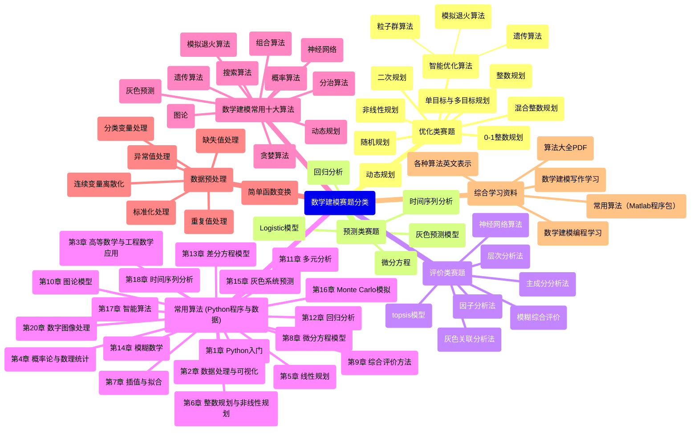

