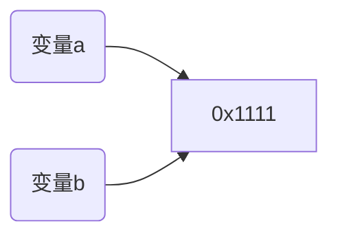

> C++ 在线靶场：https://cpp.sh/

[toc]

# 1 基础部分

VS2022 格式化代码快捷键：Shift + Alt + F8

删除当前行：Ctrl + L

QT 格式化代码快捷键：Ctrl + I

删除当前行：Ctrl + D

> 需要自己配置

## 1.1 const 注意事项

1. 被 `const` 修饰的变量在声明时需要立即初始化

   ```c++
   const int a = 10;
   ```

2. 被 `const` 修饰的变量既不能修改值，也不能取址

   ```c++
   const int a = 10;
   a++;	// error，编译错误
   int* b = &a;	//error, 编译错误
   ```


## 1.2 声明和定义

- 声明：说明变量的名称和类型，只作用于编译器，<strong style="color:red">不分配空间</strong>

- 定义：声明变量并进行初始化的过程，<strong style="color:red">分配空间</strong>

  > 初始化：对变量进行赋值或引用的过程

**示例**

```c++
// 定义
int a[4] = {1, 2, 3} // [1, 2, 3, 0]

// 声明
int a[4];
a[0] = 1;	// [1, 未知, 未知, 未知]
```


## 1.3 对 string 和 char 的转换

```c++
void insert(string str) {
    int _size = str.size();
    char* ch = new char[_size + 1];
    strcpy_s(ch, _size + 1, str.c_str());	// 引入头文件 <cstring>, _size + 1 的目的是保留一个 '\'
    cout << ch << endl;
}
```


## 1.4 .h 文件和 .c/.cpp 文件存放的内容

- `.h` 文件：即头文件
- `.c` 文件：即源代码文件

`.h` 文件中存放的内容有如下：

1. include所需要的头文件。 如 `#include<linux/pid.h>`

2. 宏定义。      如：`#define SIZE 10;`

3. 类型的定义。    如： `typedef struct student{} student`

4. 外部变量的声明。  如： `extern struct task_struct \*task;`

5. 函数的声明。    如： `int sum(int a, int b)`

6. static inline 函数。如：`static inline sum(int a, int b);`

`.c` / `.cpp` 文件中存放的内容有如下：

1. 需要的头文件

2. 全局变量。即头文件中的 `extern int 变量名` 声明的变量在这儿要进行定义与初始化

3. 只在本文件中使用的变量。即 `static 变量类型`

4. 全局函数的实现。即头文件中的 `extern int 函数名` 声明的函数要在这儿进行实现

5. 局部函数的实现。即 `static 变量类型 函数名`


# 2 进阶部分

## 2.1 函数的声明

```c++
#include <iostream>
using namespace std;

// 声明函数
int max(int a, int b);

int main() {
	int a, b;
	cin >> a >> b;
	cout << max(a, b) << endl;
	system("pause");
	return 0;
}

// 定义函数
int max(int a, int b) {
	return a > b ? a : b; 
} 
```

:warning:**注意事项**

1. 声明函数中没有方法体，而定义函数中存在方法体
2. <strong style="color:red">声明可以有多次，但定义只能有一次</strong>
3. 使用函数之前一定要有函数的声明，并且后面需要去定义该函数，否则会报错
4. 我们也可以直接将函数的定义写在函数的调用前面，就不需要提前声明函数


## 2.2 分文件编写

函数的分文件编写的作用：让代码结构更加清晰

函数分文件编写的 4 个步骤：

1. 创建后缀名为 `.h` 的头文件
2. 创建后缀名为 `.cpp` 的源文件
3. 在头文件中写函数的声明
4. 在源文件中写函数的定义

**示例**

:cry:这里 dev c++ 实现不了，不知道是啥问题，以后解决


## 2.3 指针

### 2.3.1 指针的基本概念

**指针的作用：** 可以通过指针间接访问内存


* 内存编号是从0开始记录的，一般用十六进制数字表示

* 可以利用指针变量保存地址

  

### 2.3.2 指针变量的定义和使用

指针变量定义语法： `数据类型 * 变量名；`

**示例：**

```C++
int main() {

	//1、指针的定义
	int a = 10; //定义整型变量a
	
	//指针定义语法： 数据类型 * 变量名 ;
	int * p;

	//指针变量赋值
	p = &a; //指针指向变量a的地址
	cout << &a << endl; //打印数据a的地址
	cout << p << endl;  //打印指针变量p

	//2、指针的使用
	//通过*操作指针变量指向的内存
	cout << "*p = " << *p << endl;

	system("pause");

	return 0;
}
```


指针变量和普通变量的区别

* 普通变量存放的是数据,指针变量存放的是地址
* 指针变量可以通过" * "操作符，操作指针变量指向的内存空间，这个过程称为**解引用**


> 总结1： 我们可以通过 & 符号 获取变量的地址

> 总结2：利用指针可以记录地址

> 总结3：对指针变量解引用，可以操作指针指向的内存


### 2.3.3 指针所占内存空间

提问：指针也是种数据类型，那么这种数据类型占用多少内存空间？

**示例：**

```C++
int main() {

	int a = 10;

	int * p;
	p = &a; //指针指向数据a的地址

	cout << *p << endl; //* 解引用
	cout << sizeof(p) << endl;
	cout << sizeof(char *) << endl;
	cout << sizeof(float *) << endl;
	cout << sizeof(double *) << endl;

	system("pause");

	return 0;
}
```


> 总结：所有指针类型在32位操作系统下是 4 个字节，在 64 位操作系统下是 8 字节


### 2.3.4 空指针和野指针

**空指针**：指针变量指向内存中编号为0的空间

**用途：**初始化指针变量

**注意：**空指针指向的内存是不可以访问的


**示例1：空指针**

```C++
int main() {

	//指针变量p指向内存地址编号为0的空间
	int * p = NULL;

	//访问空指针报错 
	//内存编号0 ~255为系统占用内存，不允许用户访问
	cout << *p << endl;

	system("pause");

	return 0;
}
```


**野指针**：指针变量指向非法的内存空间

**示例2：野指针**

```C++
int main() {

	//指针变量p指向内存地址编号为0x1100的空间
	int * p = (int *)0x1100;

	//访问野指针报错 
	cout << *p << endl;

	system("pause");

	return 0;
}
```


### 2.3.5 const 修饰指针

const 修饰指针有三种情况：

1. const 修饰指针 —— 常量指针
2. const 修饰常量 —— 指针常量
3. const 即修饰指针，又修饰常量

```c++
/* 演示常量指针 */
int a = 10;
int b = 20; 

// 常量指针，const 放在前面，只能改变指向，不能改变值 
const int* p = &a;
// *p = 20;  // 报错
p = &b;
cout << *p << endl;	// 最后通过改变指向，可以得到新值 
```

```c++
// 指针常量 ，const 放在后面，可以改变指向地址的值，但不能改变指向
int* const p = &a;
*p = 20;	// 可以修改值，但不能修改指向
//	p = &b;		// 编译错误 
```

```c++
// const 既修饰指针，又修饰常量，那么此时既不能改变值，也不能改变指向
const int* const p = &a;
```


### 2.3.6 指针和数组

```c++
int arr[] = {1, 2, 3, 4, 5, 6};
int* p = arr;	//  让指针指向数组的首地址
for(int i = 0; i < sizeof(arr) / sizeof(arr[0]); i++) {
    cout << *p << " ";
    p++;	// p++ 相当于 p + sizeof(int) 
} 

system("pause");
return 0;
```


### 2.3.7 指针和函数

使用指针类型传递参数，可以改变实参的值

```c++
#include <iostream>
using namespace std;

void swap(int* a, int* b) {
	int temp = *a;
	*a = *b;
	*b = temp;
	
}

int main() {
	int a = 10;
	int b = 20;
	swap(&a, &b);
	cout << a << " " << b << endl;
	system("pause");
	return 0;
}
```


### 2.3.8 数组、指针和函数的综合案例

```c++
#include <iostream>
using namespace std;

void bubbleSort(int* arr, int len) {	// 这里除了int* arr, 还可以写成 int[] arr 
	for(int i = 0; i < len - 1; i++) {
		for(int j = i; j < len - 1 - i; j++) {
			if(arr[j] > arr[j+1]) {
				int temp = arr[j];
				arr[j] = arr[j+1];
				arr[j+1] = temp;
			}
		}
	}
}

int main() {
	int arr[] = { 1,2,3,4,5,6,7,8,9,10 };
	int len = sizeof(arr) / sizeof(arr[0]);
	bubbleSort(arr, len);
	for(int i = 0; i < len; i++) {
		cout << arr[i] << " ";
	}
	cout << endl;
	system("pause");
	return 0;
}
```


## 2.4 结构体

### 2.4.1 结构体基本概念

结构体属于用户==自定义的数据类型==，允许用户存储不同的数据类型


### 2.4.2 结构体定义和使用

**语法：**`struct 结构体名 { 结构体成员列表 }；`

通过结构体创建变量的方式有三种：

* struct 结构体名 变量名
* struct 结构体名 变量名 = { 成员1值 ， 成员2值...}
* 定义结构体时顺便创建变量

```c++
#include <iostream>
#include <string>	// string 是 c++ 对 c 的 char[] 的封装，使用时需要引入库文件 
using namespace std;

// 方式1：在定义结构体时顺便定义结构体变量 
struct Student {
	string name;
	int age;
	double score;
} s1;	// 定义了一个 struct Studet 的结构体变量 

int main() {
	// 方式2：先定义后声明，之后通过 "." 来设置属性值 
	struct Student s2;
	// 在 c++ 中，struct 在声明的时候其实可以省略，也就是说以下形式也是正确的
	// Student s2 
	s2.name = "Tom";
	s2.age = 20;
	s2.score = 95.0;
	
	cout << s2.name << " " << s2.age << " " << s2.score << endl;
	
	// 方式3：在声明的同时进行赋值
	struct Student s3 = {"Jack", 22, 80.0};
	cout << s3.name << " " << s3.age << " " << s3.score << endl;
	
	// struct Student s4 = {age:12, name:"Rose", score: 99.0};	// 错误初始化方式 

	system("pause");
	return 0;
}
```

**c++ 结构体的注意点**

1. C 的结构体在声明时不能缺少 `struct` 关键字，但是可以用 `typeof` 来为结构体变量取别名，而 C++ 的结构体在声明时可以缺省 `struct`
2. C++ 中类使用 `class` 修饰，默认是私有的；C++ 中结构体使用 `struct` 修饰，默认是公开的
3. C++ 中结构体还可以定义构造器和方法

:spiral_notepad:**总结**

- 总结1：定义结构体时的关键字是struct，不可省略

- 总结2：创建结构体变量时，关键字struct可以省略

- 总结3：结构体变量利用操作符 ''.''  访问成员


### 2.4.3 结构体数组

**作用：**将自定义的结构体放入到数组中方便维护

**语法：**` struct  结构体名 数组名[元素个数] = {  {} , {} , ... {} }`

**示例：**

```C++
//结构体定义
struct student
{
	//成员列表
	string name;  //姓名
	int age;      //年龄
	int score;    //分数
}

int main() {
	
	//结构体数组
	struct student arr[3]=
	{
		{"张三",18,80 },
		{"李四",19,60 },
		{"王五",20,70 }
	};

	for (int i = 0; i < 3; i++)
	{
		cout << "姓名：" << arr[i].name << " 年龄：" << arr[i].age << " 分数：" << arr[i].score << endl;
	}

	system("pause");

	return 0;
}
```


### 2.4.4 结构体指针

**作用：**通过指针访问结构体中的成员

* 利用操作符 `-> ` 可以通过结构体指针访问结构体属性

**示例：**

```C++
#include <iostream>
#include <string>
using namespace std;
 
struct Student {
	string name;
	int age;
	double score;
};

int main() {
	Student s1 = {"laura", 19, 77.8};
	Student* s2 = &s1;
	
	// 通过 "->" 访问成员变量
	cout << s2->name << " " << s2->age << " " << s2->score << endl;
	// 与下面的语句作用相同 
	cout <<(*s2).name << " " << (*s2).age << " " << (*s2).score << endl;
	system("pause");
	return 0;
}
```

> 总结：结构体指针可以通过 -> 操作符 来访问结构体中的成员


### 2.4.5 结构体嵌套结构体

**作用：** 结构体中的成员可以是另一个结构体

**例如：**每个老师辅导一个学员，一个老师的结构体中，记录一个学生的结构体

**示例：**

```C++
//学生结构体定义
struct student
{
	//成员列表
	string name;  //姓名
	int age;      //年龄
	int score;    //分数
};

//教师结构体定义
struct teacher
{
    //成员列表
	int id; //职工编号
	string name;  //教师姓名
	int age;   //教师年龄
	struct student stu; //子结构体 学生
};


int main() {

	struct teacher t1;
	t1.id = 10000;
	t1.name = "老王";
	t1.age = 40;

	t1.stu.name = "张三";
	t1.stu.age = 18;
	t1.stu.score = 100;

	cout << "教师 职工编号： " << t1.id << " 姓名： " << t1.name << " 年龄： " << t1.age << endl;
	
	cout << "辅导学员 姓名： " << t1.stu.name << " 年龄：" << t1.stu.age << " 考试分数： " << t1.stu.score << endl;

	system("pause");

	return 0;
}
```

**总结：**在结构体中可以定义另一个结构体作为成员，用来解决实际问题


### 2.4.6 结构体作为函数参数

作用：将结构体作为参数向函数中传递

传递方式有两种：

- 值传递
- 地址传递

**示例**

```c++
#include <iostream>
#include <string>
using namespace std;

struct Student {
	string name;
	int age;
	double score;
} s;

void modifyStudent_1(Student s) {
	s.age = 100;
}

void modifyStudent_2(Student* s) {
	s->age = 100;
}

void printStudent(Student s) {
	cout << s.name << " " << s.age << " " << s.score << endl;
}
int main() {
	s = {"Bob", 20, 88.0};
	modifyStudent_1(s);
	cout << "经过修改1，结构体的值为: ";
	printStudent(s);
	
	modifyStudent_2(&s);
	cout << "经过修改2，结构体的值为: ";
	printStudent(s);
	
	system("pause");
	return 0;
}
```


### 2.4.7 结构体常量

**作用：**用const来防止误操作

```c++
#include <iostream>
using namespace std;

struct Student {
	string name;
	int age;
	double score;
};

void printStudent(const Student *s) {	// 将结构体指针定义为常量，不允许进行修改 
	cout << s->name << " " << s->age << " " << s->score << endl;	
}
int main() {
	Student s = {"Alice", 20, 90.0};
	printStudent(&s);
	return 0;
}
```


# 3 C++ 面向对象

## 3.1 内存分配模型

C++程序在执行时，将内存大方向划分为**4个区域**

- 代码区：存放函数体的二进制代码，由操作系统进行管理的
- 全局区：存放<u>全局变量和静态变量以及常量</u>（例如字符串常量，const 修饰的全局常量）
- 栈区：由编译器自动分配释放, 存放函数的<u>参数值，局部变量</u>等
- 堆区：由程序员分配和释放,若程序员不释放,程序结束时由操作系统回收


**内存四区意义：**

不同区域存放的数据，赋予不同的生命周期, 给我们更大的灵活编程

### 3.1.1 程序运行前

在程序编译后，生成了exe可执行程序，**未执行该程序前**分为两个区域

**代码区：**

- 存放 CPU 执行的机器指令

- 代码区是**共享**的，共享的目的是对于频繁被执行的程序，只需要在内存中有一份代码即可

- 代码区是**只读**的，使其只读的原因是防止程序意外地修改了它的指令


**全局区：**

- 全局变量和静态变量存放在此.

- 全局区还包含了常量区, 字符串常量和其他常量也存放在此.

- ==该区域的数据在程序结束后由操作系统释放==.


**示例代码**

```c++
#include <iostream>
#include <string>
using namespace std;
// 全局变量 
int g_a = 10;
int g_b = 20;

// 全局常量
const int c_g_a = 10;
const int c_g_b = 20;

// 静态全局变量 
static int s_g_a = 10;
static int s_g_b = 20; 
 

int main() {
	// 局部变量 
	int l_a = 10;
	int l_b = 20;
	
	// 局部常量
	const int c_l_a = 10;
	const int c_l_b = 20;
	
	// 静态变量
	static int s_a = 10;
	static int s_b = 20; 
	
	cout << "全局变量a的地址: " << &g_a << endl; 
	cout << "全局变量b的地址: " << &g_b << endl;
	
	cout << "静态变量a的地址: " << &s_a << endl; 
	cout << "静态变量b的地址: " << &s_b << endl; 
	
	cout << "静态全局变量a的地址: " << &s_g_a << endl; 
	cout << "静态全局变量b的地址: " << &s_g_b << endl;  
	
	cout << "局部变量a的地址: " << &l_a << endl; 
	cout << "局部变量b的地址: " << &l_b << endl; 
	
	cout << "局部常量a的地址: " << &c_l_a << endl; 
	cout << "局部常量b的地址: " << &c_l_b << endl; 
	
	cout << "全局常量a的地址: " << &c_g_a << endl; 
	cout << "全局常量b的地址: " << &c_g_b << endl; 
	
	cout << "字符串常量a的地址: " << &"hello" << endl; 
	cout << "字符串常量b的地址: " << &"hello" << endl; 

	return 0;
}
```

运行结果如下（每次测试都有可能发生变化）：


### 3.1.2 程序运行后

**栈区：**由编译器自动分配释放, 存放函数的参数值,局部变量等

> 注意事项：不要返回局部变量的地址，栈区开辟的数据由编译器自动释放

```c++
#include <iostream>
#include <string>
using namespace std;

int* func() {
	int a = 10;
	return &a;		// 不能将局部变量的地址作为返回值 
}

int main() {
	int* p = func();
	cout << *p << endl;	// 第一次打印正常，是由于编译器做了保留 
	cout << *p << endl;	// 第二次再使用时，打印异常 

	return 0;
}
```


### 3.1.3 堆区

堆区：由程序员分配释放，若程序员不释放，则在程序结束时由操作系统回收。

> 在 C++ 中主要利用 new 在堆区开辟内存空间

```c++
int* func() {
	int* a = new int(10);	// 申请一个整型空间，里面存放的值为 10
	return a; 	// 将a的地址作为返回值，此时a变量由于在栈中会被销毁，但地址仍然固定 
}
int main() {
	int *p = func();
	cout << p << endl;
	cout << p << endl;
	cout << *p << endl;
	cout << *p << endl;

	return 0;
}
```


## 3.2 new 运算符

C++ 中利用 `new` 关键字在堆区开辟数据，堆区开辟的数据，由程序员手动释放，释放利用操作符 `delete`

语法：`new dataType`

> 利用 `new` 创建出来的数据，会返回该数据对应的类型的指针


**示例**

```c++
#include <iostream>
#include <string>
using namespace std;

int* func_1() {
	int* a = new int(10);
	return a;
} 

void func_2() {
	int *p = func_1();
	cout << *p << endl;
	// 通过 delete 释放内存空间
	delete p;
	
	// 这时候如果再进行访问该内存空间就会出现异常, 
	// cout << p << endl; 
}

int* func_3() {
	// 使用new关键字创建一个整型数组，返回的为第一个数组元素的地址
	int* p = new int[10];	
	return p; 
}

void func_4() {
	int* p = func_3();
	for(int i = 0; i < 10; i++) {
		p[i] = i;
	} 
	
	for(int i = 0; i < 10; i++) {
		cout << p[i] << endl;
	}
	
	// 使用 delete[] 进行释放new出来的数组
	delete[] p;	
	// 对于基本数据类型，delete arr 和 delete[] arr 等价，但是对于自定义数据类型 ，必须使用 delete[]
	// 还要就是这里似乎并没有释放干净??? 

		
}

int main() {
	func_2();

	func_4();
	return 0;
}
```


:thought_balloon:**扩展（重要）：我们使用 `delete` 真的有帮我们完全将内存释放掉了吗？**

> 在这里，我们直接给出答案，当然也可以使用调试工具进行调试，当我们使用 `delete p` 后，系统确实有帮助我们释放掉 p 所指向的内存的空间，那么我们可能就忽略掉了 `p` 这个指针，该指针在释放掉其所指向的内存空间后，会随机指向一块空间，而如果指向的内存空间是一块重要的区域，而我们后续又操作该指针，可能就会引发安全问题，所以我们建议，如果<strong style="color:red">您在确保在程序完全执行完毕前不会使用该指针，可以直接使用 delete 将其释放，如果还要用到，请将该指针指向 nullptr,即 `p = nullptr`</strong>


## 3.3 引用(reference)

作用：给变量起别名

语法：`数据类型 &别名 = 原名`

> 引用实际上就让多个变量名指向同一块内存空间



```c++
int a = 10;
int &b = a;	// 给 a 起了一个别名 b
cout << "a的内存地址为: " << a << endl;
cout << "b的内存地址为: " << b << endl;
// 修改 b 的值，a的值也会随之发生改变
b = 20;
cout << a << endl; 
```

:warning:**注意事项**

1. 引用必须要初始化

   ```c++
   int &b;	// 错误
   ```

2. 引用在初始化后不能更改

   ```c++
   int a = 10;
   int &b = a;
   int c = 20;
   &b = c;	// 错误
   ```

3. 引用时对变量名的引用，不能直接对值进行引用

   ```c++
   int &a = 10;	// 错误
   ```

   

### 3.3.1 引用做函数参数

作用：函数传参时，可以利用引用的技术让形参修饰实参

优点：可以简化指针修改实参

```c++
void swap(int &a, int &b) {	// 为 a 和 b 起别名 
	int temp = a;	 
	a = b;	// 将别名a指向内存空间的值修改为b的值 
	b = temp;
}
int main() {
	int a = 10, b = 20;
	swap(a, b);
	cout << a << " " << b << endl; 
	
	return 0;
}
```


### 3.3.2 引用作为函数的返回值

作用：引用时可以作为函数的返回值存在的

> 注意
>
> 1. 不要返回局部变量的引用
> 2. 函数调用还可以作为左值存在

```c++
int& test() {	// 返回的其实就是 int &a; 
	int a = 10;
	return a;
}
int main() {
	int &b = test();	// 给返回值(别名a)再起别名 b
	cout << b << endl;	// 第一次输出，由于编译器会对值进行保留，所以正常输出 
	cout << b << endl;	//  第二次输出，由于a在栈区且已经被释放且编译器也舍弃输出异常 
	
	return 0;
}
```

```c++
int& test() {	// 返回的其实就是 int &a; 
	static int a = 10;	// 添加 static 关键字，让其存储在堆中，函数调用完毕后不会被释放 
	return a;
}
int main() {
	int &b = test();	// 给返回值(别名a)再起别名 b
	test() = 100;	// 相当于 int &a = 100;	这会改变a指向的存储空间的值
	cout << b << endl; // 100
	return 0;
}
```


### 3.3.3 引用的本质

本质：引用的本质<strong style="color:red">在 C++ 内部的实现是一个指针常量</strong>

```c++
int a = 10;
// 本质其实是 int* const ref = a, 让一个指针常量指向a 
int &ref = a;
// 编译器发现ref是 一个引用后，自动转换为 *ref
cout << ref << endl; 
```


### 3.3.4 常量引用

**作用：**常量引用主要用来修饰形参，防止误操作

> 在函数形参列表中，可以加==const修饰形参==，防止形参改变实参

**示例：**

```C++
//引用使用的场景，通常用来修饰形参
void showValue(const int& v) {
	//v += 10;
	cout << v << endl;
}

int main() {

	//int& ref = 10;  引用本身需要一个合法的内存空间，因此这行错误
	//加入const就可以了，编译器优化代码，int temp = 10; const int& ref = temp;
	const int& ref = 10;

	//ref = 100;  //加入const后不可以修改变量
	cout << ref << endl;

	//函数中利用常量引用防止误操作修改实参
	int a = 10;
	showValue(a);

	system("pause");

	return 0;
}
```


## 3.4 函数提高

### 3.4.1 默认参数

在 C++ 中，函数的形参列表中的形参时可以有默认值的

语法：

```c++
返回值类型 函数名(参数 = 默认值) {}
```

**示例**

```c++
// 1. 函数可以有默认参数，如果缺省，则使用默认参数的值 
int func1(int a, int b, int c = 10) {
	return a + b + c;
}

// 2. 函数参数列表如果某一个参数有默认值，那么后面所有的参数都需要有默认值
int func2(int a, int b = 20, int c = 30) {
	return a + b + c;
} 

// 3. 函数的定义和声明只能有一个有默认值
int func3(int a = 10, int b = 20, int c = 30);

int func3(int a, int b, int c) {
	return a + b + c;
} 
int main() {
	cout << func1(10, 10) << endl;
	cout << func2(10) << endl;
	cout << func3(10, 20, 30) << endl;

	return 0;
}
```

:spiral_notepad:**总结**

1. 函数可以有默认参数，如果缺省，则使用默认参数的值 
2. 函数参数列表如果某一个参数有默认值，那么后面所有的参数都需要有默认值
3.  函数的定义和声明只能有一个有默认值


### 3.4.2 占位参数

C++ 中函数的形参列表里可以有占位参数，用来占位，调用函数的时候必须填补该位置。

语法如下：

```c++
返回值类型 函数名(数据类型) {}
```

> 现阶段占位参数意义不大，但在后续学习中会用到

**示例**

```c++
void print(int a, int) {
	cout << "a 的值为:" << a << endl;
}
int main() {
	print(1, 10);
	print(2, 100);
	
	return 0;
}
```


### 3.4.3 函数重载（Overload）

作用：函数名可以相同，提高了可读性，免去了起名的困难

函数重载的条件：

- 同一个作用域

- 函数名相同

- 函数参数类型，或者个数不同，或者顺序不同

  > 注意：<strong style="color:red">函数的返回值不可以作为函数重载的条件</strong>，以及不建议将顺序不同作为函数重载的理由

```c++
int sum(int a, int b) {
	return a + b;
}

double sum(double a, double b) {
	return a + b;
}

int sum(int a, int b, int c) {
	return a + b + c;
}

int main() {
	cout << sum(1, 1) << endl;
	cout << sum(1.0, 1.0) << endl;
	cout << sum(1, 2, 3) <<endl;
	
	return 0;
}
```


**函数重载的注意事项**

1. 默认参数出现在重载函数的参数列表时需要避免出现歧义

```c++
// 1.引用出现在函数重载的参数列表 
void func1(int &a) {
	cout << "func1(int &a)" << endl;
}

void fun1(const int &a) {
	cout <<"func1(const int &a)" <<endl;
}

// 2. 默认参数出现在函数重载的参数列表 
void func2(int a, int b = 10) {
	cout << "func2(int a, int b = 10)" << endl;
}

void func2(int a) {
	cout << "func2(int a)" << endl;
}
int main() {
	int a = 10;
	func1(a); // 调用 func1(int &a)
	//	func1(20); 	// 报错
	func2(10);	// 出现二义性, call of overloaded 'func2(int)' is ambiguous
	
	return 0;
}
```


# 4 类和对象

C++ 面向对象三大特性：封装、继承和多态


## 4.1 封装

封装的意义：

1. 将属性和行为作为一个整体，表现生活中的事务
2. 将属性和行为加以权限控制

基本语法：

```c++
class 类名 {
	访问权限: 属性 / 行为
};
```

**示例**

```c++
#include <iostream>
#include <string>
#define PI 3.1414
using namespace std;

// 设计圆类，求圆的周长
class Circle {
	public:
		double radius;
		
		double calcPer() {
			return 2*PI*radius;
		}
		 
};
int main() {
	Circle c;
	c.radius = 1;
	cout << c.calcPer() << endl;

	return 0;
}
```


## 4.2 访问权限

类在设计时，可以把属性和行为放在不同的权限下，加以控制，访问权限有以下三种：

1. `public`：公共权限
2. `protected`：保护权限
3. `private`：私有权限

|           | 类的内部           | 子类               | 类的外部           |
| --------- | ------------------ | ------------------ | ------------------ |
| public    | :heavy_check_mark: | :heavy_check_mark: | :heavy_check_mark: |
| protected | :heavy_check_mark: | :heavy_check_mark: | :x:                |
| private   | :heavy_check_mark: | :x:                | :x:                |


## 4.3 struct 和 class 的区别

在 C++ 中 `struct` 和 `class` 唯一的区别就在于<strong style="color:red">默认的访问权限不同</strong>

- `struct` 默认权限为 `public`
- `class` 默认权限为 `private`


## 4.4 对象的初始化和清理

### 4.4.1 构造函数和析构函数

对象的初始化和清理是两个非常重要的设置：

- 一个对象或变量没有初识状态，对其使用后果是未知的
- 同样使用完一个对象或变量，没有及时清理，也会造成一定的安全问题

C++ 中利用**构造函数**和**析构函数**解决上述问题，这两个函数将会被编译器自动调用，完成对象初始化合清理工作。

对象的初始化和清理工作是编译器强制要我们做的事情，因此如果**我们不提供构造和析构，编译器会自动提供空实现的构造函数和析构函数。**

* 构造函数：主要作用在于创建对象时为对象的成员属性赋值，构造函数由编译器**自动调用**，无须手动调用。
* 析构函数：主要作用在于对象**销毁前**系统自动调用，执行一些清理工作。

**构造函数语法：**`类名(){}`

1. 构造函数，没有返回值也不写void
2. 函数名称与类名相同
3. 构造函数可以有参数，因此可以发生重载
4. 程序在调用对象时候会自动调用构造，无须手动调用，并且只会调用一次


**析构函数语法：** `~类名(){}`

1. 析构函数，没有返回值也不写void
2. 函数名称与类名相同,在名称前加上符号  ~
3. 析构函数不可以有参数，因此不可以发生重载
4. 程序在对象销毁前会自动调用析构，无须手动调用，并且只会调用一次

**示例**

```c++
class Person {
	public:
		Person() {
			cout << "构造函数被调用" << endl;
		}
		
		~Person() {
			cout << "析构函数被调用" << endl;
		}
};

void test() {
	Person p;	// 创建对象 p
	// p 位于栈区，当函数完毕后自动销毁 
}

int main() {
	test();
	
	return 0;
}
```


### 4.4.2 构造函数的分类及调用

1. 两种分类方式
   - 按参数分：有参构造和无参构造
   - 按类型分：普通构造和拷贝构造
2. 三种调用方式
   - 括号法
   - 显示法
   - 隐式转换法

```c++
class Person{
	private:
		int age;
		
	public:
		// 无参构造器
		Person() {
			cout << "无参构造器" << endl;
		} 
		// 有参构造器
		Person(int a) {
			age = a;
			cout << "有参构造器" <<endl; 
		} 
		// 拷贝构造函数
		Person(const Person &p) {
			age = p.age;
			cout << "拷贝构造器" << endl; 
		} 
}; 
void test01() {
	// 调用构造器方法
	// 1. 括号法（常用） 
	// 1.1 调用无参构造器
	Person p1;
	// 1.2 调用带参构造器 
	Person p2(10);
	// 1.3 调用拷贝构造器
	Person p3(p2);
	/*
	注意事项：调用无参构造器不能加括号，如果加了那么
	编译器会将其认为是一个函数声明，例如 Person p1() ，
	编译器会将其视为一个返回类型为Person，函数名为p1的函数
	*/
} 

void test02() {
	// 2. 显示法
	Person p2 = Person(10);	
	// Person(10)单独写就是匿名对象，创建后马上被销毁
	Person p3 = Person(p2); 
	// 注意：不要使用拷贝函数初始化匿名对象，因为 Person(p2) 其实是等价于 Person p2  
}

void test03() {
	// 3. 隐式转换法
	Person p2 = 10;	// 等价于 Person p2 = Person(10) 
	Person p3 = p2; // 等价于 Person p3 = Person(p2) 
}
int main() {
	test01();
	test02();
	test03();
	 
	
	return 0;
}
```


### 4.4.3 拷贝构造函数调用时机

C++ 中拷贝构造函数调用时机通常有三种情况：

1. 使用一个已经创建完毕的对象来初始化一个新对象
2. 值传递的方式给函数传值
3. 以值方式返回局部对象

```c++
class Person{
	private:
		int age;
		
	public:
		// 无参构造器
		Person() {
			cout << "无参构造器" << endl;
		} 
		// 有参构造器
		Person(int a) {
			age = a;
			cout << "有参构造器" <<endl; 
		} 
		// 拷贝构造函数
		Person(const Person &p) {
			age = p.age;
			cout << "拷贝构造器" << endl; 
		} 
}; 

void test01(Person p) {
	// 进入函数后，会将p拷贝一份，所以在函数对p的修改不会影响到实参 
	cout << &p << endl; 
}

Person test02() {
	Person p;
	cout << &p << endl;
	return p;	// 返回的对象并没有对Person进行拷贝 
} 
int main() {
	Person p(10);
	test01(p);	
	cout << &p <<endl;
	cout << "----------------" << endl;
	Person p2 = test02();
	cout << &p2 << endl;
	return 0;
}
```


### 4.4.4 构造函数调用规则

默认情况下，C++ 编译器至少给一个类添加了 3 个函数

1. 默认构造函数（无参，函数体为空）
2. 默认析构函数（无参，函数体为空）
3. 默认拷贝构造函数，对属性进行值拷贝

构造函数调用规则如下：

* 如果用户定义有参构造函数，c++不在提供默认无参构造，但是会提供默认拷贝构造


* 如果用户定义拷贝构造函数，c++不会再提供其他构造函数

```c++
class Person {
	public:
		Person(string n,  int a) {
			name = n;
			age = a;
		} 
		
		string getName() {
			return name;
		}
		
		int getAge() {
			return age;
		}
		
	private:
		string name;
		int age;
};
int main() {
	Person p1("Alice", 20);
	Person p2(p1);
	cout << "p2姓名为: " << p2.getName() << endl;	// Alice
	cout << "p2年龄为: " << p2.getAge() << endl;	// 20
	// 这里虽然没有没有添加拷贝构造器，但是编译器还是帮我们在编译的时候自动添加了
	return 0;
}
```


## 4.5 深拷贝和浅拷贝

- 浅拷贝：简单的赋值拷贝操作
- 深拷贝：在堆区重新申请空间，进行拷贝操作

浅拷贝在释放空间的时候，会出现重复释放导致程序崩溃的问题，我们以如下代码为例：

```c++
#include <iostream>
#include <string>
using namespace std;

class Person{
	public:
		Person(int a, double h) {
			age = a;
			height = new double(h);
		}
		
		~Person() {	
			cout << "析构函数执行" << endl;
			if(height != NULL) {
				delete 	height;			
			} 
		}
		
		int getAge() {
			return age;
		}
		
		double getHeight() {
			return *height;
		}
		
	private:
		int age;
		double* height;
	
};

void test() {
	Person p1(10, 162.0);
	Person p2(p1);
	
	cout << p1.getAge() << " " << p1.getHeight() << endl;
	cout << p2.getAge() << " " << p2.getHeight() << endl;
}
int main() {
	test();
	return 0;
}
```

> 这段代码在 Dev C++ 中并没有崩溃，但是在 VS2019 中会出现崩溃，原因是由于重复释放了两次

我们只需要添加一个自定义的拷贝构造函数实现深拷贝即可

```c++
Person(Person &p) {		// 注意：这里不能使用const进行修饰，原因还不明确 
    age = p.getAge();
    height = new double(p.getHeight());
}
```

**原理图**


## 4.6 初始化列表

作用：用来初始化属性。

语法如下：

```c++
构造器名(): field1(value1), field2(value2), field3(value3) {}
```

**示例**

```c++
class Person {
	public:
		// 在调用无参构造器时，默认进行初始化
		Person(): name("Alice"), age(20) {}	
		// 自定义初始化
		Person(string name, int age): name(name), age(age) {} 
		
		string getName() {
			return name;
		}
		
		int getAge() {
			return age;
		}
	private:
		string name;
		int age;
}; 
int main() {
	Person p1;
	Person p2("Bob", 22);

	cout << p1.getName() << " " << p1.getAge() << endl;
	cout << p2.getName() << " " << p2.getAge() << endl;
	return 0;
}
```


## 4.7 类对象作为类成员

C++类中的成员可以是另一个类的对象，我们称该成员为对象成员

所以，我们需要考虑的一个问题就是：**当 A 类实例作为 B 类的成员，那么当我们创建 B 对象时，构造函数和析构函数的调用顺序是如何的？**

```c++
class A {
	public:
		A() {
			cout << "A 的构造函数被调用" << endl;
		} 
		
		~A() {
			cout << "A 的析构函数被调用" << endl;
		} 
		
};

class B {
	public:
		B() {
			cout << "B 的构造函数被调用" << endl;
		}
		
		~B() {
			cout << "B 的析构函数被调用" << endl;
		}
		
	private:
		A a;
};
int main() {
	B b;
	return 0;
}
```

执行结果如下：

```
A 的构造函数被调用
B 的构造函数被调用
B 的析构函数被调用
A 的析构函数被调用
```

我们可以得出结论：<strong style="color:red">先调用对象成员的构造函数，再调用本类的构造函数，析构函数的执行顺序相反</strong>


## 4.8 静态成员

静态成员就是在成员变量和成员函数前加上关键字 `static`，称为静态成员

静态成员分为：

*  静态成员变量
   *  所有对象共享同一份数据
   *  在编译阶段分配内存
   *  类内声明，类外初始化
*  静态成员函数
   *  所有对象共享同一个函数
   *  静态成员函数只能访问静态成员变量

```c++
// 静态成员变量
class A {
	public:
		static int a;
		
		int getB() {
			return b;
		}
	private:
		// 静态变量也可以是私有的，需要通过 getter 来获取
		static int b; 
}; 
// 类内声明，类外初始化 
int A::a = 10;
int A::b = 20;
int main() {
	A init; 
	/*
		访问静态变量的方式有两种：
		1. 通过实例对象访问: p.st
		2. 通过类名进行访问: P::st 
	*/
	cout << init.a << endl;	// 10
	cout << A::a << endl;	// 10
	
	// 静态变量属于共享数据，所有成员和类共有
	init.a = 200;
	cout <<  A::a << endl;
	
	// 通过 getter 获取私有静态变量
	cout << init.getB() << endl;
	return 0;
}
```

```c++
/*
	静态成员函数
	1. 静态成员函数所有类和类对象共有
	2. 静态成员函数只能访问静态变量 
*/
class F {
	public:
		static void func() {
			cout << "我是一个静态方法" << endl;
		}
};
int main() {
	/*
		使用静态方法也有两种 
		1. 通过类名直接访问
		2. 通过实例对象访问 
	*/ 
	 
	F::func();
	F f;
	f.func(); 

	return 0;
}
```


## 4.9 C++ 对象模型和 this 指针

### 4.9.1 成员变量和成员函数分开存储

```c++
class Person {
	int age;  
	static int score; 
	void func() {}
};
int main() {
	Person p;
	cout << "Person对象所占内存空间大小为: " << sizeof(p) << endl; 

	/*
	1. 当对象为空时，占用 1 个字节，用来作为空对象的标识
	2. 当新增一个int型非静态成员变量age时，对象所占的内存空间大小为 4 个字节
	3. 当新增一个int型静态成员变量score时，占用 4 个字节
	4. 当新增一个方法func时，占用 4 个字节，可见类中成员方法和成员变量放在不同的位置 
	*/
	return 0;
}
```


### 4.9.2 this 指针

C++ 通过提供特殊的对象指针 `this` 来解决命令冲突的问题，<strong style="color:red">this 指针指向被调用的成员函数所属的对象</strong>

`this` 指针的用途：

- 当形参和成员变量同名时，可用 `this` 指针进行区分
- 在类的非静态成员函数中返回对象本身，使用 `return *this`

```c++
class Person {
	private:
		string name;
		int age;
	public:
		Person(string name, int age) {
			// 注意：this是指针，与java、js不同，不能直接通过"."的形式访问
			this->name = name;	 
			this->age = age;
		}
		// 通过 addPersonAge 方法可以将别人的年龄加到自己身上 
		Person& addPersonAge(Person p) {
			this->age += p.age; 
			return *this;
		}
		
		int getAge() {
			return this->age; 
		}
}; 
int main() {
	Person p1("Bob", 20);
	Person p2("Alice", 21);
	p1.addPersonAge(p2).addPersonAge(p2);	// 这部分就设计到动态绑定机制和链式编程的思想 
	cout << p1.getAge() << endl;	// 62
	return 0;
}
```


### 4.9.3 空指针访问成员函数

C++ 中空指针也是可以调用成员函数的，但是要注意有没有用到 `this` 指针，如果用到了 `this` 指针，需要加以判断保证代码的健壮性。

```c++
class Person {
	public:
		void showClassName() {
			cout << "我是 Person 类" << endl;
		}
		
		void showPerson() {
			cout << "我是Person,年龄为 " << age << endl;
			// 上面的age其实等价于 this.age 
		}
		
		Person(int age) {
			this->age = age;
		}
		
		int age;
};
int main() {
	Person* p = NULL;
	// 空指针可以访问不含有this的成员方法 
	p->showClassName();
	// 不能访问含有this的成员方法 
	// p->showPerson();
	return 0;
}
```


### 4.9.4 const 修饰成员函数

**常函数：**

* 成员函数后加const后我们称为这个函数为**常函数**
* 常函数内不可以修改成员属性
* 成员属性声明时加关键字mutable后，在常函数中依然可以修改

**常对象：**

* 声明对象前加const称该对象为常对象
* 常对象只能调用常函数

**示例代码**

```c++
class Person {
	public:
		int age;
		mutable double score;
		
	public:
		Person(int age, double score) {
			this->age = age;
			this->score = score;
		}
		
		void modifyAge() {
			// this 指针的本质其实是一个指针常量，指向不可修改，但可以修改指向的值
			this->score =  100;	// Person* const pointer;
			// this = NULL;	// 不能修改指向 
		}
		
		// 常函数：成员函数后面添加const,该关键字实质上还是修饰this的 
		void modifyScore() const {
			// 在常函数中，指针指向内存空间的数据不能修改，只有被mutable关键字修饰的成员变量可修改 
			//  this->age = 100;	// 错误写法 
			this->score += 100;
			// 此时 this 指针等价于 const Person* const pointer 
			
		}
		
}; 
int main() {
	cout << "--------常函数--------" << endl; 
	Person p(10, 50.0);
	cout << p.score << endl;
	p.modifyScore();
	cout << p.score << endl;
	p.modifyScore();
	cout << p.score << endl;
	cout << "--------常对象--------" << endl; 
	// 声明对象前加上 const 被称为常对象 
	const Person p1(22, 99.99);
	p1.modifyScore();
	// p1.modifyAge();	// 常对象只能调用常函数，不能调用普通函数（普通函数里面可能存在修改操作） 
	return 0;
}
```

:herb:**扩展**

1. `const` 对象默认调用 `const` 成员方法，非 `const` 对象默认调用非 `const` 成员方法

   ```c++
   class Person {
   public:
   	void func() {
   		cout << "func()" << endl;
   	}
   
   	void func() const {
   		cout << "func() const" << endl;
   	}
   };
   int main() {
   	Person p;
   	p.func();	// func()
   
   	const Person p1;
   	p1.func();	// func() const
   	return 0;
   }
   ```

2. 非 `const` 对象在可以调用 `const` 成员函数或非 `const` 成员函数；而 `const` 对象只能调用 `const` 成员函数，不能调用非 `const` 成员函数

3. `const` 对象和非 `const` 对象可以相互转换，如下：

   ```c++
   // 非常对象Person调用常函数
   (const Person&)p.getAge()
   
   // 常对象Person调用非常函数
   const_cast<Person&>(p).getAge()
   ```

4. `const` 成员函数不能更改任何非静态成员变量

:bookmark:**`const_cast`**

const_cast 是 C++的运算符，用于去除复合类型的 const 和 volatile（非真正去除）

语法：`const_cast<type>(expression)`


## 4.10 友元

如果想要让其他类或类外的一些函数也能正常访问到类中的私有属性，我们就可以用到 C++ 为我们提供的**友元**

**作用：让一个函数或者类访问另一个类中私有成员。**

**关键字：friend**

友元的三种实现：

1. 全局函数做友元
2. 类做友元
3. 成员函数做友元

### 4.10.1 全局函数做友元

```c++
class Building {
	// 直接在类中使用friend修饰友元函数，该函数即可访问实例中的私有成员 
	friend void goodFriend(Building* building);
	public:
		string livingRoom;
		
		Building(string livingRoom, string bedingRoom) {
			this->livingRoom = livingRoom;
			this->bedingRoom = bedingRoom;
		}
	private:
		string bedingRoom;
}; 

void goodFriend(Building* building) {
	cout << "好朋友正在访问: " << building->livingRoom << endl;
	cout << "好朋友正在访问: " << building->bedingRoom << endl; 
} 
int main() {
	Building b("客厅", "卧室"); 
	goodFriend(&b);
	return 0;
}
```


### 4.10.2 友元类

```c++
class Building {
	// 让类成为友元，只需要让其在声明在类中，并添加上friend关键字即可 
	friend class GoodFriend;
	public:
		Building();
		
		string livingRoom;
	private:
		string bedingRoom;
};

class GoodFriend {
	public:
		GoodFriend();
		
		void visit() {
			cout << "好朋友正在访问: " << building->livingRoom << endl;
			cout << "好朋友正在访问: " << building->bedingRoom << endl;
		}
	
	private:
		Building* building;
};


GoodFriend::GoodFriend() {
	this->building = new Building();
}

Building::Building() {
	this->livingRoom = "客厅";
	this->bedingRoom = "卧室";
} 
int main() {
	GoodFriend g;
	g.visit();

	return 0;
}
```


### 4.10.2 成员函数做友元

```c++
#include <iostream>
#include <string>
using namespace std;
// 注意：这里之所以将Building的声明放最前面，就是因为C++缺少预编译的过程 
class Building;
class Guest {
	public:
		Guest();
		visit();
		visit_2();
	private:
		Building* building;
};

class Building {
	//让Guest中的visit()成为友元 
	friend Guest::visit();
	public:
		Building();
	private:
		string bedingRoom;
}; 
Guest::Guest() {
	this->building = new Building(); 
}
Guest::visit() {
	cout << building->bedingRoom << endl;
}
Guest::visit_2() {
	//	cout << building->bedingRoom << endl;
	// 由于visit_2() 没有成为友元成员函数，无法访问其内部的私有属性 
}
Building::Building() {
	this->bedingRoom = "卧室";
}
int main() {
	Guest g;
	g.visit();
	
	return 0;
}
```


## 4.11 运算符重载

运算符重载概念：对已有的运算符进行定义，赋予其另一种功能，以适应不同的数据类型。


### 4.11.1 算术运算符重载

> 下面以 "+" 为例

```c++
class Person {
	public:
		int age;
		double score;
	public:
		Person() {} 
		
		Person(int age, double score) {
			this->age = age;
			this->score = score;
		}
		
		// 通过成员函数来重载"+"号
		Person operator+(Person &p) {
			Person temp;
			temp.age = this->age + p.age;
			temp.score = this->score + p.score;
			return temp; 
		}
		
};

// 通过全局函数来重载"+"
Person operator+(Person &p1, int val) {
	Person temp;
	temp.age = p1.age + val;
	return temp;
} 
int main() {
	Person p1(20, 80);
	Person p2(20, 90);
	Person p3 = p1 + p2;
	// 上式等价于 Person p3 =  p1.operator+(p2); 
	cout << p3.age << " " << p3.score << endl;
	
	Person p4 = p3 + 10;
	// 上式等价于 operator+(p3, 10) 
	cout << p4.age << endl;
	system("pause");
	return 0;
}
```

> 总结：
>
> - 对于基本数据类型，其运算符是不能够进行重载的
> - 不要滥用运算符重载


### 4.11.2 左移运算符重载

```c++
class Person {
	private:
		string name;
		int age;
	public:
		Person(string name, int age) {
			this->name = name;
			this->age = age;
		}
		
		string getName(){
			return name;
		}
		
		int getAge() {
			return age;
		}
};

/*
	对于重载左移运算符，这里有几点需要进行说明:
	1.  不能在成员函数中进行重载，因为 operator<<(ostream cout) 会转换为
	p << cout ，当然这不是我们想要的效果 
	2. cout 其实是一个 ostream 对象，我们可以进行作为引用传参
	3. 返回类型必须为 ostream& ，因为存在链式编程，例如 cout << p.age << endl; 
*/

ostream& operator<<(ostream &out, Person p) {
	out << "name=" << p.getName() <<  " ,age=" << p.getAge();
	return out;
	
}
int main() {
	Person p("Alice", 22);
	cout <<  p << endl;

	return 0;
}
```


### 4.11.3 递增运算符重载

作用：通过重载递增运算符，实现自己的整型数据。

```c++
class MyInteger {
	friend ostream& operator<<(ostream& cout, MyInteger m);
private:
	int n;
public:

	MyInteger(int n) {
		this->n = n;
	}

	// 重载前置自增
	MyInteger& operator++() {
		++n;
		return *this;
	}
	//添加占位符,表示后置自增
	MyInteger operator++(int) {	// 不能返回局部变量的引用
		// 记录当前MyInteger
		MyInteger temp = *this;
		// 对 n 进行自增
		++n;
		// 返回之前的记录值
		return temp;	
	}

};

ostream& operator<<(ostream& cout, MyInteger m) {
	cout << m.n;
	return cout;
}

int main() {
	MyInteger p(20);
	// 前置自增这里就不验证了，主要来验证后置自增
	cout << p++ << endl;
	cout << p << endl;
	/*
		可以发现，如此设置后置自增确实可行，但是仍然存在一个问题，由于返回的不是引用，而是拷贝，导致无法进行链式自增，例如 (p++)++ 后 p的值永远为 21，而不会变成 22
	*/

}
```


### 4.11.4 赋值运算符重载

C++ 编译器至少给一个类添加4个函数：

1. 默认构造函数(无参，函数体为空)

2. 默认析构函数(无参，函数体为空)

3. 默认拷贝构造函数，对属性进行值拷贝

4. 赋值运算符 `operator=`，对属性进行值拷贝

   > 如果类中有属性指向堆区，做赋值操作时也会出现深浅拷贝的问题

**示例**

```c++
#include <iostream>
using namespace std;

class Person {
private:
	int* age;
public:

	Person(int age) {
		this->age = new int(age);
	}

	~Person() {
		if (age != NULL) {
			delete age;
			age = NULL;
		}
	}

	// 为防止浅拷贝带来的重复释放空间的问题，我们需要进行重载赋值运算符
	Person& operator=(Person &p) {
		// 首先判断右值的age属性是否已经开辟了内存空间
		if (age == NULL) {
			delete age;
			age = NULL;
		}

		// 再来进行赋值操作
		age = new int(*(p.age));
		// 链式赋值，返回具体的 Person
		return *this;
	}

	int getAge() {
		return *age;
	}
};

void test() {
	Person p1(20);
	Person p2(30);
	Person p3(40);
	p3 = p2 = p1;
	cout << p1.getAge() << " " << p2.getAge() << " " << p3.getAge() << endl;
}
int main() {
	test();
	return 0;
}
```


### 4.11.5 关系运算符重载

作用：重载关系运算符，可以让两个自定义类型对象进行对比操作。

```c++
class Person {
private:
	string name;
	int age;
public:
	Person(string name, int age) {
		this->name = name;
		this->age = age;
	} 
	
	// 在这里，我们主要演示判等重载，其他的也是同理
	// bool operator!=()
	bool operator==(Person &p) {
		if(p.getName() == name && p.getAge() == age) return true;
		return false;
	}
	
	string getName() {
		return name;
	}
	
	int getAge() {
		return age;
	}
	 
};
int main() {
	Person p1("Alice", 20);
	Person p2("Bob", 21);
	Person p3("Alice", 20);
	
	cout << (p1 == p2) << endl;
	cout << (p1 == p3) << endl;
	
	return 0;
}
```


### 4.11.6 函数调用运算符重载

- 函数调用运算符 `()` 也可以重载
- 由于重载后使用的方式非常像函数的调用，因此称为仿函数
- 仿函数没有固定写法，非常灵活

**示例**

```c++
class Add {
public:
	int operator()(int a, int b) {
		return a + b;
	}
};
int main() {
	cout << Add()(100, 100) << endl;	
	/*
		Add() 创建匿名对象
		Add()() 用创建出来的匿名对象来调用函数  
	*/ 
	   
	return 0;
}
```


## 4.12 继承

### 4.12.1 继承的基本语法

**基本语法**

```c++
class 子类 : 继承方式 父类;
```

- 继承方法主要就包括：`public`、`protected`、`private`
- 子类又被称为派生类
- 父类又被称为基类或超类

下图说明了继承后，父类成员继承到子类后访问权限发生的改变：


### 4.12.2 继承的对象模型

**问题：**从父类继承过来的成员，哪些属于子类对象中？


**示例：**

```C++
class Base
{
public:
	int m_A;
protected:
	int m_B;
private:
	int m_C; //私有成员只是被隐藏了，但是还是会继承下去
};

//公共继承
class Son :public Base
{
public:
	int m_D;
};

void test01()
{
	cout << "sizeof Son = " << sizeof(Son) << endl;	
}

int main() {
	test01();
	system("pause");
	return 0;
}
```

> 无论父类的成员的访问权限是 `private` 的还是 `public` ，子类都可以继承到，只是能否被访问的问题

我们也可以使用 VS 自带的【Developer Command Prompt for VS】也可以查看到类的内部结构：

```bash
cl /d1 reportSingleClassLayoutSub extends.cpp
```


### 4.12.3 继承中构造和析构顺序

子类继承父类后，当创建子类对象，也会调用父类的构造函数。

问题：<u>父类和子类的构造和析构顺序是谁先谁后？</u>

```c++
// 基类 
class Base {
public:
	Base() {
		cout << "Base构造函数被调用" <<endl;
	}
	
	~Base() {
		cout << "Base析构函数被调用" << endl;
	}
}; 

// 子类
class Sub : public Base {
public:
	Sub() {
		cout << "Sub构造函数被调用" <<endl;
	}
	
	~Sub() {
		cout << "Sub析构函数被调用" << endl;
	}
}; 
int main() {
	Sub sub;
	/*
	首先，我们来查看执行结果
	Base构造函数被调用
	Sub构造函数被调用
	Sub析构函数被调用
	Base析构函数被调用 
	
	当我们创建子类对象，会先调用父类的构造函数，之后再调用子类的构造函数，析构的顺序正好相反 
	*/ 
	
	return 0;
}
```


### 4.12.4 继承中同名成员的处理

问题：<u>当子类与父类出现同名的成员，如何通过子类对象，访问到子类或父类中同名的数据呢？</u>

* 访问子类同名成员   直接访问即可

* 访问父类同名成员   需要加作用域

  > 注意：子类中同名成员函数会隐藏父类的所有同名成员函数（重载）

**示例**

```c++
ass Base {
public:
	int a = 10;
	
	void func() {
		cout << "我是Base类中的func" << endl; 
	}
	
	// 定义一个重载函数
	void func(int) {
		cout << "我是Base类中的重载函数" << endl;
	} 
}; 

class Derive : public Base {
public:
	int a = 100;
	
	void func() {
		cout << "我是Derive类中的func" << endl; 
	}
};
int main() {
	Derive d;
	// 直接访问会访问子类的成员
	cout << d.a << endl;
	d.func();
	// 添加作用域后可以访问到父类成员 
	cout << d.Base::a << endl;
	d.Base::func();
	//  子类方法会将父类同名方法隐藏，在使用父类的重载时需要添加作用域
	// d.func(100); // 报错 
	d.Base::func(100); 
	
	return 0;
}
```


### 4.12.5 同名静态成员处理

问题：<u>继承中同名的静态成员在子类对象上如何进行访问？</u>

静态成员和非静态成员出现同名，处理方式一致

- 访问子类同名成员   直接访问即可
- 访问父类同名成员   需要加作用域


### 4.12.6 多继承语法

与 Java 的**单继承机制**不同，<strong style="color:red">C++ 允许一个类继承多个类</strong>

语法如下：

```c++
class 子类 : 继承方式1 父类1, 继承方式2 父类2…
```

> 注意事项：
>
> 1. 多继承可能会引发同名成员出现，需要添加作用域加以区分
> 2. **实际开发中，不推荐使用多继承**


### 4.12.7 菱形继承

**菱形继承概念：**

- 两个派生类继承同一个基类

- 又有某个类同时继承者两个派生类

- 这种继承被称为菱形继承，或者钻石继承


**典型的菱形继承案例：**


**菱形继承问题：**

1. 羊继承了动物的数据，驼同样继承了动物的数据，当草泥马使用数据时，就会产生二义性。

2. 草泥马继承自动物的数据继承了两份，其实我们应该清楚，这份数据我们只需要一份就可以。

   > 例如：对于 age 字段，其实羊驼只需要一份就可以，多余的一份造成冗余

**示例**

```c++
// 动物类
class Animal {
public:
	int age;
}; 
// 继承后面添加virtual代表虚继承 
// 羊类 
class Sheep : virtual public Animal {
};
// 驼类 
class Camel : virtual public Animal {
};

// 羊驼类 
class Alpaca : public Camel, public Sheep {
	
}; 

int main() {
	Alpaca a;
	a.Camel::age = 3;	
	a.Sheep::age = 5;
	// 此时，无论是Camel.age 还是 Sheep.age 指向的都是同一块地址 
	cout << a.age << endl;	// 5 
	
	return 0;
}
```

**图解**


> 上图在理解上可能存在问题，后续理解更透彻后再修改


## 4.13 多态

多态分为两类

* 静态多态: 函数重载 和 运算符重载 属于静态多态，复用函数名
* 动态多态: 派生类和虚函数实现运行时多态

静态多态和动态多态区别

* 静态多态的函数地址早绑定  -  编译阶段确定函数地址
* 动态多态的函数地址晚绑定  -  运行阶段确定函数地址


### 4.13.1 多态原理

模拟代码：

```c++
class Animal {
public:
    //函数前面加上virtual关键字，变成虚函数，那么编译器在编译的时候就不能确定函数调用了。
	virtual void speak() {
		cout << "动物在说话" << endl;
	}
}; 

class Cat : public Animal {
public:
	void speak() {
		cout << "猫在说话" << endl;
	}
};
//我们希望传入什么对象，那么就调用什么对象的函数
//如果函数地址在编译阶段就能确定，那么静态联编
//如果函数地址在运行阶段才能确定，就是动态联编
void speak(Animal &animal) {
	animal.speak();
}
int main() {
	Cat cat;
	speak(cat);	// 猫在说话

	system("pause");
	return 0;
}
```

**原理图**


:maple_leaf:**说明**

当我们将 Animal 类中的 `speak()` 方法修改为虚函数之后，类内部会有一个 vfptr 指向存储该虚函数地址的 vftable ，同样地，由于 Cat 由于继承了 Animal，自己也会有一个 vfptr 指向存储有的 `speak()` 的自己的 vftable，<strong style="color:red">当子类重写该方法，子类的虚函数表内部就会替换成子类的虚函数地址，当父类的指针或引用指向子类对象，就发生多态</strong>（动态绑定机制）。

**验证一下 vfptr 的存在：**

1. 当类内部只有一个普通成员方法时，类对象所占字节数为 1

   ```c++
   class Animal {
   public:
   	void speak() {
   	}
   };
   ```

2. 当我们将函数修改为虚函数之后，该类的对象所占的字节变为 8

   > 在 64 位机下，指针占 8 字节；在 32 位机下，指针占 4 字节

   ```c++
   class Animal {
   public:
   	virtual void speak() {
   		cout << "动物在说话" << endl;
   	}
   }; 
   ```


### 4.13.2 纯虚函数和抽象类

多态中，通常父类中虚函数的实现是毫无意义的，主要都是调用子类重写的内容。因此可以将虚函数改为**纯虚函数**

纯虚函数语法如下：

```
virtual 返回值类型 函数名 （参数列表）= 0 ;
```

当类中有了纯虚函数，这个类也称为==抽象类==

**示例**

```c++
class Base {
public:
	// 定义一个纯虚函数,那么该类就成为了一个抽象类，抽象类不能被实例化 
	virtual void func() = 0;
};

class Derive :public Base {
	// 继承的子类要么实现纯虚函数，要么自己也成为一个抽象类 
	virtual void func() {
		cout << "Hello, world!" << endl; 
	}
};
int main() {
	Base* base = new Derive();
	base->func();
    // 记得最后要释放内存
    delete base;
	system("pause");
	return 0;
}
```


### 4.13.3 虚析构和纯虚析构

多态使用时，如果子类中有属性开辟到堆区，那么父类指针在释放时无法调用子类的析构代码

解决方式：将父类中的析构函数改为**虚析构或者纯虚析构**

虚析构和纯虚析构共性：

* 可以解决父类指针释放子类对象
* 都需要有具体的函数实现

虚析构和纯虚析构区别：

* 如果是纯虚析构，该类属于抽象类，无法实例化对象

```c++
class Animal {
public: 
	Animal() {
		cout << "Animal构造函数被调用" << endl; 
	}
	
	// 方法1：将其转换为虚构函数 
//	virtual ~Animal() {
//		cout << "Animal析构函数被调用" << endl;
//	}

	// 方法2：使用纯虚构函数
	virtual ~Animal() = 0; 
};

Animal::~Animal() {
	cout << "Animal 析构函数被调用" << endl;
}
class Cat :public Animal {
public:
	Cat(string name) {
		cout << "Cat构造函数被调用" << endl;
		this->name = new string(name); 
	}
	
	~Cat() {
		cout << "Cat析构函数被调用" << endl;
		if(name != NULL) {
			delete name;
		}
	}
private:
	string* name;
};

void test() {
	Animal* animal = new Cat("Kitty"); 
	delete animal;
}
int main() {
	test();
	system("pause");
	return 0;
}
```


# 5 文件的读写


# 6 模板

C++ 另一种编程思想就是<strong style="color:red">泛型编程</strong>，主要利用的技术就是模板。

C++ 提供两种模板机制：**函数模板和类模板**


## 6.1 函数模板语法

函数模板作用：

建立一个通用函数，其函数返回值类型和形参类型可以不具体制定，用一个**虚拟的类型**来代表。

**语法：** 

```C++
template<typename T>
函数声明或定义
```

**解释：**

- `template`： 声明创建模板

- `typename`：表面其后面的符号是一种数据类型，可以用class代替

- `T`：通用的数据类型，名称可以替换，通常为大写字母

```c++
// 定义一个模板函数 
template<typename T>
void mySwap(T &a, T &b) {	// 注意不要定义为 swap，swap为内置函数 
	T temp = a;
	a = b;
	b = temp;
} 
int main() {
	int a = 10;
	int b = 20;
	double c = 10;
	double d = 20;
	// 使用函数模板进行交换
	// 1. 使用自动类型推导
	mySwap(a, b);
	cout << a << " " << b << endl;
	// 2. 指定数据类型 
	mySwap<double>(c, d);
	cout << c << " " << d << endl;

	system("pause");
	return 0;
}
```

**注意事项**

- 模板必须要确定 T 的数据类型，否则无法使用，如下示例代码

  ```c++
  template<typename T>
  void func() {
  	cout << "Hello, World" << endl;
  } 
  int main() {
  	// func();	// 报错
  	func<int>(); 	// 正确写法 
  
  	system("pause");
  	return 0;
  }
  ```


**示例：使用模板对 char[] 和 int[] 进行选择排序**

```c++
#include <iostream>
#include <cstring> 
using namespace std;

template<class T>
void selectiveSort(T arr[], int len) {
	for (int i = 0; i < len - 1; i++) {
		int minIndex = i;
		for (int j = i + 1; j < len; j++) {
			if (arr[minIndex] > arr[j]) {
				minIndex = j;
			}
		}
		if (minIndex != i) {
			swap(arr[minIndex], arr[i]);
		}
	}
}

template<class T>
void printArr(T arr[], int len) {
	for (int i = 0; i < len; i++) {
		cout << arr[i] << " ";
	}
	cout << endl;
}
int main() {
	int a[] = { 3, 1, 10, 100, 20, 43, 33 };
	int aLen = sizeof(a) / sizeof(a[0]);
	selectiveSort(a, aLen);
	printArr(a, aLen);
	
	cout << "------------------" << endl;
	char s[] = "defca";
	int sLen = strlen(s);
	selectiveSort(s, sLen);
	printArr(s, sLen);

	return 0;
}
```

:warning:**注意事项**

对于字符串数组，我们尽量使用 `strlen()` 函数进行计算数组长度，而不要使用 `sizeof()`，因为：

- `sizeof()` 是一个单目运算符，用来获得字符数组在内存中所占的字节数，<strong style="color:orange">包含结束符</strong>。
- `strlen()` 是一个函数，它用来计算指定字符串 的长度，但<strong style="color:orange">不包括结束字符</strong>。

```c++
char s1[] = "abcdef";
char s2[10] = "abcdef";
cout << sizeof(s1) / sizeof(char) << endl;	// 7，包含了结束符 '\0' 
cout << sizeof(s2) / sizeof(char) << endl;	// 10，包含了所占据的所有空间 
```

最后就是 `strlen()` 在 C++ 中在 `<cstring>` 库中，在 C 中在 `<string.h>` 库中。

下面推荐两个查询库函数的网址：

- C 库函数：https://www.w3cschool.cn/cyykhsscsc/

- C++ 库函数：https://cplusplus.com/reference/


## 6.2 普通函数和函数模板的区别

* 普通函数调用时可以发生自动类型转换（隐式类型转换）
* 函数模板调用时，如果利用自动类型推导，不会发生隐式类型转换
* 如果利用显示指定类型的方式，可以发生隐式类型转换

**示例**

```c++
template<class T>
T myTemplatePlus(T a, T b) {
	return a + b;
} 

int myCommonPlus(int a, int b) {
	return a + b;
}

int main() {
	// 普通函数调用存在隐式类型转换，传入的 'a' 会转换成 97 
	cout << myCommonPlus('a', 1) << endl; 
	// 如果对模板函数指定类型，调用的时候，也会对参数进行隐式类型转换 
	cout << myTemplatePlus<int>(1, 2) << endl;
	// 如果没有对模板函数指定类型，调用的时候，不能进行隐式类型转换 
	// cout << myTemplatePlus('a', 1) << endl; 

	system("pause");
	return 0;
}
```


## 6.3 普通函数和函数模板调用规则

1. 如果函数模板和普通函数都可以调用，优先调用普通函数
2. 可以通过空模板参数列表，强制调用函数模板
3. 函数模板可以发生函数重载
4. 如果函数模板可以产生更好的匹配，优先调用函数模板

**示例**

```c++
// 普通函数
void myPrint(int a, int b) {
	cout << "调用普通函数" << endl;
} 

// 模板函数
template<class T>
void myPrint(T a, T b) {
	cout << "调用模板函数" << endl; 
} 

// 重载模板函数
template<class T>
void myPrint(T a, T b, T c) {
	cout << "调用重载模板函数" << endl;
} 

int main() {
	// 1. 模板函数和普通函数，优先调用普通函数 
	myPrint(1, 2);	// 调用普通函数

	// 2. 指定泛型（或给定空泛型），强制调用模板函数
	myPrint<>(1, 2);	// 调用模板函数
	
	// 3. 模板函数同样可以发生重载
	myPrint(1, 2, 3); 	//  调用重载模板函数
	myPrint<>(1, 2, 3); //  调用重载模板函数
	
	// 4. 如果可以产生更好的匹配，优先模板函数
	myPrint('a', 'b'); 	// 调用模板函数
	// 上式调用模板函数不需要进行隐式类型转换，所以会调用模板函数 
	system("pause");
	return 0;
}
```


## 6.4 模板的局限性

**局限性：**

* 模板的通用性并不是万能的

**例如：**

```C++
	template<class T>
	void f(T a, T b)
	{ 
    	a = b;
    }
```

在上述代码中提供的赋值操作，如果传入的a和b是一个数组，就无法实现了，再例如：

```C++
	template<class T>
	void f(T a, T b)
	{ 
    	if(a > b) { ... }
    }
```

在上述代码中，如果T的数据类型传入的是像Person这样的自定义数据类型，也无法正常运行

因此C++为了解决这种问题，提供模板的重载，可以为这些**特定的类型**提供**具体化的模板**

**示例**

```c++
class Person {
private:
	int age;
public:
	Person(int age) {
		this->age = age;
	}
	
	int getAge() {
		return age;
	}
};

template<class T>
bool myCompare(T &a, T &b) {
	return a == b;
}
// 具体模板，通过 template<> 指定，具体模板优先于常规模板 
template<> bool myCompare(Person &p1, Person &p2) {
	return p1.getAge() == p2.getAge();
} 
int main() {
	Person p1(20);
	Person p2(20);
	cout << myCompare(p1, p2) << endl;
	

	system("pause");
	return 0;
}
```


## 6.5 类模板

类模板作用：建立一个通用类，类中的成员 数据类型可以不具体制定，用一个**虚拟的类型**来代表。

**语法：** 

```c++
template<typename T>
类
```

**解释：**

- `template`：声明创建模板

- `typename`：表面其后面的符号是一种数据类型，可以用class代替

- `T`：通用的数据类型，名称可以替换，通常为大写字母

**示例**

```c++
template<class nameType, class ageType>
class Person {
public:
	Person(nameType name, ageType age) {
		this->name = name;
		this->age = age;
	}
	
	nameType getName() {
		return name;
	}
	
	ageType getAge() {
		return age;
	}
private:
	nameType name;
	ageType age;
};
int main() {
	Person<string, int> p("Alice", 20);
	
	cout << p.getName() << " " << p.getAge() << endl;

	system("pause");
	return 0;
}
```

:warning:**注意事项**

1. 类模板不存在自动类型推导

2. 类模板可以有默认类型

   ```c++
   template<class nameType, class ageType = int>
   ```

   ```c++
   Person<string> p("Alice", 20);
   ```


### 6.5.1 类模板中成员函数调用的时机

类模板中成员函数和普通类中的成员函数调用的时机不同：

- 普通类中成员函数在编译阶段就已经创建成功
- 类模板中成员函数在运行阶段才会创建

**示例**

```c++
class Person1 {
public:
	void showPerson1() {
		cout << "showPerson1被调用" << endl;
	}
};

class Person2 {
public:
	void showPerson2() {
		cout << "showPerson2被调用" << endl;
	}
};

template<class T>
class myClass {
public:
	T t;
	void func1() {
		t.showPerson1();
	}
	
	void func2() {
		t.showPerson2();
	}
};
int main() {
	myClass<Person1> p1;
	p1.func1();
//	 p1.func2();	// 无法调用 
	
	system("pause");
	return 0;
}
```


### 6.5.2 类模板对象做函数参数

类模板对象作为函数参数，一共有三种传入方式：

1. 指定传入的类型：直接显示对象的数据类型
2. 参数模板化：将对象中的参数变为模板进行传递
3. 整个类模板化：将该对象类型模板化进行传递

**示例**

```c++
template<class T, class E>
class Person {
private:
	T name;
	E age;
public:
	Person(T name, E age) {
		this->name = name;
		this->age = age;
	}
	
	void showPerson() {
		cout << name << " " << age << endl;
	}
}; 

// 传参时，直接显示对象的完整类型(类型 + 泛型) 
void printPerson1(Person<string, int> &p) {
	p.showPerson();
}

// 传参时 ，将对象的参数类型模板化
template<class T, class E> 
void printPerson2(Person<T, E> &p) {
	p.showPerson();
} 

// 传参时，将整个对象类型模板化
template<class T>
void printPerson3(T &p) {
	p.showPerson();
} 

int main() {
	Person<string, int> p("Alice", 20);
	printPerson1(p);
	printPerson2(p);
	printPerson3(p);
	
	system("pause");
	return 0;
}
```

> 这里推荐使用方法1，直观并且更好维护
>
> 这里还提出一点：如果我们希望能看到具体的数据类型，可以使用 `tyeid(variable_name).name()`


### 6.5.3 类模板与继承

当类模板碰到继承时，需要注意以下几点：

1. 当子类继承的父类是一个类模板时，子类在声明的时候，需要指定父类中 T （泛型）的类型
2. 如果不指定，编译器无法给子类分配内存
3. 如果想要灵活指定父类中 T 的类型，子类也需要称为类模板

 **示例**

```c++
template<class T>
class Base {
public:
	T t;
};

// 父类为模板类时， 子类需要显示指定父类中泛型（这种方式不够灵活） 
class Derive1 :public Base<int> {
	
};

// 第二种方式就是，子类也转成模板类，如果子类中也有泛型成员，可以添加泛型列表 
template<class T, class E>
class Derive2 :public Base<T> {
public:
	E e;
};
int main() {
	Derive1 d1;
	Derive2<char, int> d2;

	system("pause");
	return 0;
}
```


### 6.5.4 类模板成员函数类外实现

```c++
template<class T, class E>
class Person {
private:
	string name;
	int age;
public:
	Person(T name, E age);
	
	void showPerson();
};

// 模板类的构造函数在外部定义 
template<class T, class E>
Person<T, E>::Person(T name, E age) {
	this->name = name;
	this->age = age;
}

// 模板类的普通函数在外部定义 
template<class T, class E>
void Person<T, E>::showPerson() {
	cout << "showPerson() 被调用" << endl; 
}

int main() {
	Person<string, int> p("Alice", 20);
	p.showPerson();

	system("pause");
	return 0;
}
```


### 6.5.5 类模板与友元

- 全局函数类内实现：直接在类内声明友元即可
- 全局函数类外实现：需要提前让编译器知道全局函数的存在

**示例**

```c++
template<class E, class K>
class Person;
 
template<class E, class K>
void showPerson2(Person<E, K> &p) {
	cout << p.name << " " << p.age << endl;
}

template<class E, class K>
class Person {
// 友元全局函数类内实现 
friend void showPerson1(Person<E, K> &p) {
	cout << p.name << " " << p.age << endl;
} 
// 友元全局函数类外实现,添加参数列表表示这是一个模板函数，并且得将实现放在前面 
friend void showPerson2<>(Person<E, K> &p); 
private:
	string name;
	int age;
public:
	 Person(E name, K age) {
	 	this->name = name;
	 	this->age = age;
	 }
};


void test1() {
	Person<string, int> p("Jerry", 10);
	showPerson1(p);
}

void test2() {
	Person<string, int> p("Tom", 10);
	showPerson2(p);
}
int main() {
	test1();
	test2();
	system("pause");
	return 0;
}
```


# 7 STL

* STL(Standard Template Library，**标准模板库**)
* STL 从广义上分为：**容器(container) 、算法(algorithm) 、迭代器(iterator)**
* **容器**和**算法**之间通过**迭代器**进行无缝连接。
* STL 几乎所有的代码都采用了模板类或者模板函数


## 7.1 STL 六大组件

STL大体分为六大组件，分别是:**容器、算法、迭代器、仿函数、适配器（配接器）、空间配置器**

1. 容器：各种数据结构，如vector、list、deque、set、map等,用来存放数据。
2. 算法：各种常用的算法，如sort、find、copy、for_each等
3. 迭代器：扮演了容器与算法之间的胶合剂。
4. 仿函数：行为类似函数，可作为算法的某种策略。
5. 适配器：一种用来修饰容器或者仿函数或迭代器接口的东西。
6. 空间配置器：负责空间的配置与管理。


## 7.2 STL中容器、算法、迭代器

**容器：**置物之所也

STL**容器**就是将运用**最广泛的一些数据结构**实现出来

常用的数据结构：数组, 链表,树, 栈, 队列, 集合, 映射表 等

这些容器分为**序列式容器**和**关联式容器**两种:

- **序列式容器**：强调值的排序，序列式容器中的每个元素均有固定的位置。
- **关联式容器**：二叉树结构，各元素之间没有严格的物理上的顺序关系


**算法：**问题之解法也

有限的步骤，解决逻辑或数学上的问题，这一门学科我们叫做算法(Algorithms)

算法分为:**质变算法**和**非质变算法**。

- **质变算法**：是指运算过程中会更改区间内的元素的内容。例如拷贝，替换，删除等等
- **非质变算法**：是指运算过程中不会更改区间内的元素内容，例如查找、计数、遍历、寻找极值等等


**迭代器：**容器和算法之间粘合剂

提供一种方法，使之能够依序寻访某个容器所含的各个元素，而又无需暴露该容器的内部表示方式。

每个容器都有自己专属的迭代器

> 迭代器使用非常类似于指针，初学阶段我们可以先理解迭代器为指针


迭代器种类：

| 种类           | 功能                                                     | 支持运算                                |
| -------------- | -------------------------------------------------------- | --------------------------------------- |
| 输入迭代器     | 对数据的只读访问                                         | 只读，支持++、==、！=                   |
| 输出迭代器     | 对数据的只写访问                                         | 只写，支持++                            |
| 前向迭代器     | 读写操作，并能向前推进迭代器                             | 读写，支持++、==、！=                   |
| 双向迭代器     | 读写操作，并能向前和向后操作                             | 读写，支持++、--，                      |
| 随机访问迭代器 | 读写操作，可以以跳跃的方式访问任意数据，功能最强的迭代器 | 读写，支持++、--、[n]、-n、<、<=、>、>= |

常用的容器中迭代器种类为双向迭代器，和随机访问迭代器


## 7.3 迭代器初识

### 7.3.1 vector 存放内置数据类型

```c++
#include <iostream>
#include <vector>
#include <algorithm>
using namespace std;

void printVector(int val) {
	cout << val << endl;
}
int main() {
	vector<int> v;
	// 使用push_back添加数据(vector 是一个序列化 容器)
	v.push_back(10);
	v.push_back(15);
	v.push_back(9);
	v.push_back(11);
	
	// 遍历方式1：使用迭代器 +  while 循环
	vector<int>::iterator itBegin = v.begin();	// 得到指向第一个数据的迭代器（指针）
	vector<int>::iterator itEnd = v.end();	// 得到指向最后一个数据的下一个空间的迭代器（指针）
	while (itBegin != itEnd) {
		cout << *itBegin << endl;
		itBegin++;
	}

	cout << "-------------------------" << endl;

	// 遍历方式2：使用迭代器 + for 循环
	for (vector<int>::iterator it = v.begin(); it != v.end(); it++) {
		cout << *it << endl;
	}	
	//  注意：这里不能 v.begin() < v.end(),因为可能当前处于大端编址和小端编址

	cout << "-------------------------" << endl;
	// 遍历方式3：使用 for_each
	for_each(v.begin(), v.end(), printVector);
	
	return 0;
	
}
```

`for_each()` 的底层源码如下：

```c++
_EXPORT_STD template <class _InIt, class _Fn>
    _CONSTEXPR20 _Fn for_each(_InIt _First, _InIt _Last, _Fn _Func) { // perform function for each element [_First, _Last)
    _Adl_verify_range(_First, _Last);
    auto _UFirst = _Get_unwrapped(_First);
    const auto _ULast = _Get_unwrapped(_Last);
    for (; _UFirst != _ULast; ++_UFirst) {
        _Func(*_UFirst);	// 第三个参数作为回调函数，不断将迭代器（指针）解引用的值传入回调函数，供其使用
    }

    return _Func;
}
return 0;
```


### 7.3.2 vector 存放自定义数据类型

```c++
#include <iostream>
#include <vector>
#include <string>
using namespace std;

class Person {
private:
	string name;
	int age;
public:
	Person(string name, int age) {
		this->name = name;
		this->age = age;
	}

	string getName() {
		return name;
	}

	int getAge() {
		return age;
	}
};
int main() {
	vector<Person*> p;
	Person p1("aaa", 20);
	Person p2("bbb", 20);
	Person p3("ccc", 20);
	Person p4("ddd", 20);
	Person p5("eee", 20);
	
	p.push_back(&p1);
	p.push_back(&p2);
	p.push_back(&p3);
	p.push_back(&p4);
	p.push_back(&p5);

	for (vector<Person*>::iterator it = p.begin(); it != p.end(); ++it) {
		cout << (*it)->getName() << " " << (*it)->getAge() << endl;
	}
	return 0;
}
```


### 7.3.3 vector 嵌套容器

```c++
vector<vector<int>> vv;
vector<int> v1;
vector<int> v2;
vector<int> v3;

v1.push_back(1), v1.push_back(2), v1.push_back(3);
v2.push_back(4), v2.push_back(5), v2.push_back(6);
v3.push_back(7), v3.push_back(8), v3.push_back(9);
vv.push_back(v1), vv.push_back(v2), vv.push_back(v3);

for (vector<vector<int>>::iterator it = vv.begin(); it != vv.end(); ++it) {
    for (vector<int>::iterator du_it = (*it).begin(); du_it != (*it).end(); ++du_it) {
        cout << *du_it << " ";
    }
    cout << endl;
}
```


### 7.3.4 迭代器的方法

- distance
- advance
- begin
- end
- next
- prev

distance 的语法格式如下：

```c++
template<class InputIterator>
  typename iterator_traits<InputIterator>::difference_type distance (InputIterator first, InputIterator last);
```

> 返回的结果为 [begin, end) 范围内元素的个数


advance 语法格式如下：

```c++
template <class InputIterator, class Distance>
    void advance (InputIterator& it, Distance n);
```

具体参考 C 语言中文网：http://c.biancheng.net/view/7370.html

这里简单介绍用法：<strong style="color:red">将迭代器移动指定的距离</strong>

例如：`advance(it, 2)` 表示将迭代器 `it` 向右移动（前进）2 个位置，这里特别要注意迭代器的类型

还有一点特别重要，使用时需要引入头文件：`<iterator>`


`begin()` 和 `end()` 用于传入容器，得到对应的迭代器，与其内置的成员方法 `begin()` 和 `end()` 基本相同


`prev()` 和 `next()` 的用法类似于 `advance()` ，但不同之处在于 `advance()` 会直接改变源迭代器，如果我们不想直接改变源迭代器，而使用建立在源迭代器基础中返回一个新的迭代器可以用这个两个方法


## 7.4 STL 容器

### 7.4.1 string

**本质：**

* string是C++风格的字符串，而string本质上是一个类


**string和char * 区别：**

* char * 是一个指针
* string是一个类，类内部封装了 char\*，管理这个字符串，是一个 char* 型的容器。


**特点：**

- string 类内部封装了很多成员方法，例如：查找 find，拷贝 copy，删除 delete，替换 replace，插入 insert

- string 管理 char* 所分配的内存，不用担心复制越界和取值越界等，由类内部进行负责

#### 7.4.1.1 string 构造函数

构造函数原型：

- `string()`：创建一个空的字符串
- `string(const char* s)`：使用字符串初始化
- `string(const string &str)`：使用一个 string 对象初始化另一个 string 对象
- `string(int n, char c)`：使用 n 个字符 c 初始化

**示例**

```c++
// 1. 默认构造
string s1;
cout << s1 << endl;
// 2. string(const char* s)
const char* _str = "Hello, World";	// 字符串常量实际上维护的是一个指向一个字符的地址
string s2(_str);
cout << s2 << endl;
// 3. string(const string &s): 即拷贝构造
const string _str1 = "Hello, World";
string s3(_str1);
cout << s3 << endl;
// 4. string(n, char c)
string s4(11, 'a');
cout << s4 << endl;	// aaaaaaaaaaa
```


#### 7.4.1.2 string 的赋值操作

赋值的函数原型：

* `string& operator=(const char* s);`             //char*类型字符串 赋值给当前的字符串
* `string& operator=(const string &s);`         //把字符串s赋给当前的字符串
* `string& operator=(char c);`                          //字符赋值给当前的字符串
* `string& assign(const char *s);`                  //把字符串s赋给当前的字符串
* `string& assign(const char *s, int n);`     //把字符串s的前n个字符赋给当前的字符串
* `string& assign(const string &s);`              //把字符串s赋给当前字符串
* `string& assign(int n, char c);`                  //用n个字符c赋给当前字符串

**示例**

```c++
// 1. 将 char* 字符串赋值给当前字符串
string str1 = "Hello, World";
// 2. 将字符串赋给另一个字符串
string str2 = str1;	// 注意：这里和 Java 不同，str2 和 str1 并不是共享同一份地址，他们属于不同的string对象
// 3. 将字符赋给字符串
//注意：string str3 = 'a'; 的写法错误，不能在初始化的时候将字符赋给字符串('a' 不为地址)
string str3;
str3 = 'a';
// 4. 通过assign赋值字符串
string str4;
str4.assign("Hello, World");
// 5. 通过assign分配字符串的前n个字符
string str5;
str5.assign("Hello, World", 5);
// 6. 分配n个char
string str6;
str6.assign(5, 'a');
```


#### 7.4.1.3 string 字符串拼接

**函数原型：**

* `string& operator+=(const char* str);`                   //重载+=操作符
* `string& operator+=(const char c);`                         //重载+=操作符
* `string& operator+=(const string& str);`                //重载+=操作符
* `string& append(const char *s); `                               //把字符串s连接到当前字符串结尾
* `string& append(const char *s, int n);`                 //把字符串s的前n个字符连接到当前字符串结尾
* `string& append(const string &s);`                           //同operator+=(const string& str)
* `string& append(const string &s, int pos, int n);`//字符串s中从pos开始的n个字符连接到字符串结尾

**示例**

```c++
string s = "Hello";
s += " ,World";
cout << s << endl;
s += '!';
cout << s << endl;
s.append(" || ");
cout << s << endl;
```


#### 7.4.1.4 字符串查找与替换

**函数原型：**

* `int find(const string& str, int pos = 0) const;`              //查找str第一次出现位置,从pos开始查找
* `int find(const char* s, int pos = 0) const; `                     //查找s第一次出现位置,从pos开始查找
* `int find(const char* s, int pos, int n) const; `               //从pos位置查找s的前n个字符第一次位置
* `int find(const char c, int pos = 0) const; `                       //查找字符c第一次出现位置
* `int rfind(const string& str, int pos = npos) const;`      //查找str最后一次位置,从pos开始查找
* `int rfind(const char* s, int pos = npos) const;`              //查找s最后一次出现位置,从pos开始查找
* `int rfind(const char* s, int pos, int n) const;`              //从pos查找s的前n个字符最后一次位置
* `int rfind(const char c, int pos = 0) const;  `                      //查找字符c最后一次出现位置
* `string& replace(int pos, int n, const string& str); `       //替换从pos开始n个字符为字符串str
* `string& replace(int pos, int n,const char* s); `                 //替换从pos开始的n个字符为字符串s

**示例**

```c++
string s = "Where there is life, there is hope";
int _index = s.find("is");
cout << _index << endl;

int _index_2 = s.rfind("is");
cout << _index_2 << endl;

s.replace(0, 0, "Believe ");	// 从0开始起的0个字符
```


#### 7.4.1.5 字符串比较

**功能描述：**

* 字符串之间的比较

**比较方式：**

* 字符串比较是按字符的ASCII码进行对比（字典序）

  - = 返回   0

  - \> 返回   1 


  - < 返回  -1

**函数原型：**

* `int compare(const string &s) const; `  //与字符串s比较
* `int compare(const char *s) const;`      //与字符串s比较

**示例**

```c++
string _str1 = "kmp";
string _str2 = "pmk";
cout << _str1.compare(_str2) << endl;
```


#### 7.4.1.6 字符串存取

string中单个字符存取方式有两种

* `char& operator[](int n); `     //通过[]方式取字符
* `char& at(int n);   `                    //通过at方法获取字符

```c++
string _str = "abcdef";
cout << _str[1] << endl;
cout << _str.at(1) << endl;
```

> 注意：对于字符串，同样存在越界


#### 7.4.1.7 字符串插入和删除

**功能描述：**

* 对string字符串进行插入和删除字符操作

**函数原型：**

* `string& insert(int pos, const char* s);  `                //插入字符串
* `string& insert(int pos, const string& str); `        //插入字符串
* `string& insert(int pos, int n, char c);`                //在指定位置插入n个字符c
* `string& erase(int pos, int n = npos);`                    //删除从Pos开始的n个字符 

```c++
string _str = "abcd";
// insert用于对字符串进行插入操作，但需要注意的是索引不要超过string的长度
_str.insert(4, "efgh"); // abcdefgh
_str.erase(0, 2);	// 从索引为0的位置删除2个字符
```


#### 7.4.1.8 子串

**功能描述：**

* 从字符串中获取想要的子串

**函数原型：**

* `string substr(int pos = 0, int n = npos) const;`   //返回由pos开始的n个字符组成的字符串


### 7.4.2 vector 

**功能：**

* vector数据结构和**数组非常相似**，也称为**单端数组**

**vector与普通数组区别：**

* 不同之处在于数组是静态空间，而vector可以**动态扩展**

**动态扩展：**

* 并不是在原空间之后续接新空间，而是<u>找更大的内存空间，然后将原数据拷贝新空间，释放原空间</u>


>vector容器的迭代器是支持随机访问的迭代器


#### 7.4.2.1 vector 构造函数

**功能描述：**

* 创建vector容器


**函数原型：**

* `vector<T> v; `：采用模板实现类实现，默认构造函数
* `vector(v.begin(), v.end());   `：将 `v[begin(), end())` 区间中的元素拷贝给本身。
* `vector(n, elem);`：构造函数将n个elem拷贝给本身。
* `vector(const vector &vec);`：拷贝构造函数

**示例**

```c++
// vector 构造函数
// 方法1：默认构造
vector<int> v1 = { 1, 2, 3, 4, 5 };
printVector(v1);

// 方法2：使用迭代器进行构造
vector<int> v2(v1.begin(), v1.end());
printVector(v2);

// 方法3：将n个elem赋给vector
vector<int> v3(10, 100);
printVector(v3);

// 方法4：拷贝构造函数
vector<int> v4(v3);
printVector(v4);
```


#### 7.4.2.2 vector 的赋值操作

**功能描述：**

* 给vector容器进行赋值

**函数原型：**

* `vector& operator=(const vector &vec);`：重载等号操作符


* `assign(beg, end);`：将 `[beg, end)` 区间中的数据拷贝赋值给本身。
* `assign(n, elem);`：将 n 个 `elem` 拷贝赋值给本身。

**示例**

```c++
// 1. 将数组赋值给 vector
vector<int> v1 = { 10, 10, 10, 10, 10 };

// 2. 等号赋值
vector<int> v2 = v1;

// 3. 利用迭代器赋值
vector<int> v3;
v3.assign(v2.begin(), v2.end());

// 4. 将n个elem赋值
vector<int> v4;
v4.assign(5, 10);
```


#### 7.4.2.3 vector 容量和大小

**功能描述：**

* 对vector容器的容量和大小操作


**函数原型：**

* `empty(); `：判断容器是否为空

* `capacity();`：容器的容量

* `size();`：返回容器中元素的个数

* `resize(int num);`：重新指定容器的长度为num，若容器变长，则以默认值填充新位置。如果容器变短，则末尾超出容器长度的元素被删除。

* `resize(int num, elem);`：重新指定容器的长度为num，若容器变长，则以elem值填充新位置。如果容器变短，则末尾超出容器长度的元素被删除

:herb:**扩展：VS2022 中 vector 的扩容机制（由于 GCC 的调试工具比较拉，这里就不做说明）**

1. 初始时，容量为 0
2. 当容量 ≤ 6 时，每次增加一个数据扩容一个存储单元
3. 当容量 > 6 时，容量开始以增长因子为 1.5 进行增长

**示例**

```c++
vector<int> v1 = {1, 2, 3, 4, 5};
// 1. 通过empty()判空
if(!v1.empty()) {
printVector(v1);
}
// 2. capacity 得到vector容量
cout << "v1的容量大小为: " << v1.capacity() << endl;

// 3. 通过 resize 重新指定大小
// 第一个参数代表扩容的大小，第二参数代表填充的数据（int 型默认为 0）
v1.resize(15);
cout << v1[14] << endl;

cout << "v1的容量大小为: " << v1.capacity() << endl;
cout << "v1的元素个数为: " << v1.size() << endl;
// 此时 v1 中的元素大小和容量个数一致，都为 15
```


#### 7.4.2.4 vector 插入和删除

**功能描述：**

* 对vector容器进行插入、删除操作


**函数原型：**

* `push_back(ele);`：尾部插入元素ele
* `pop_back();`：删除最后一个元素
* `insert(const_iterator pos, ele);`：迭代器指向位置pos插入元素ele
* `insert(const_iterator pos, int count,ele);`：迭代器指向位置pos插入count个元素ele
* `erase(const_iterator pos);`：删除迭代器指向的元素
* `erase(const_iterator start, const_iterator end);`：删除迭代器从start到end之间的元素
* `clear();`：删除容器中所有元素

**示例**

```c++
vector<int> v;
// push_back 向vector中添加元素
for(auto i = 0; i < 10; i++) {
    v.push_back(i);
}

// pop_back 删除元素
v.pop_back();

// 通过迭代器向vector中插入元素
v.insert(v.rbegin(), 100);
// v.insert(v.rbegin(), 100);   // 注意：这种写法存在问题，insert没有针对reverse_iterator的重载
// 遍历元素
for(auto iter = v.begin(); iter != v.end(); ++iter) {
    cout << *iter << " "; 
}
cout << endl;

v.erase(v.begin(), v.end());    // 删除vector中所有元素
```


#### 7.2.4.5 vector 数据存取操作

**功能描述：**

* 对vector中的数据的存取操作


**函数原型：**

* `at(int idx); `：返回索引idx所指的数据
* `operator[]; `：返回索引idx所指的数据
* `front(); `：返回容器中第一个数据元素
* `back();`：返回容器中最后一个数据元素

**示例**

```c++
vector<int> v = {3, 6, 4, 10, -1};
// 1. 通过 operator[] 获取
cout << v[1] << endl;

// 2. 通过 at 获取
cout << v.at(1) << endl;

// 3. 通过 front 获取数组第一个元素
cout << v.front() << endl;  // 底层源码 return *begin

// 4. 通过 end 获取 数组最后一个元素
cout << v.back() << endl;   // 底层源码 return *(end() - 1)
```


#### 7.2.4.6 vector 互换操作

**功能描述：**

* 实现两个容器内元素进行互换

**函数原型：**

* `swap(vec);` ：将vec与本身的元素互换

**示例**

```c++
vector<int> v;
// swap 的妙用: 释放内存空间大小
for(int i = 0; i < 10000; i++) {
v.push_back(i);
}
cout << "the capcity of v is " << v.capacity() << endl; // 16384
cout << "the size of v is " << v.size() << endl;    // 10000

cout << "----------------------" << endl;

// 将 v 进行收缩
v.resize(3);
cout << "the capcity of v is " << v.capacity() << endl; // 16384
cout << "the size of v is " << v.size() << endl;    // 3

// 我们发现：尽管我们将v的大小收缩为3，但是还是占据原来的空间
vector<int>(v).swap(v);     // 利用拷贝构造函数创建匿名对象v,与v进行交换

cout << "----------------------" << endl;

cout << "the capcity of v is " << v.capacity() << endl; // 3
cout << "the size of v is " << v.size() << endl;    // 3
```


#### 7.2.4.7 vector 预留空间

**功能描述：**

* 减少vector在动态扩展容量时的扩展次数

**函数原型：**

* `reserve(int len);`：容器预留 len 个元素长度，<strong style="color:red">预留位置不初始化，元素不可访问</strong>。

**示例**

```c++
vector<int> _v1;
int _num1 = 0;    // 统计扩容次数
int* p = NULL;
for(int i = 0; i < 10000; ++i) {    
    _v1.push_back(i);
    if(p != &_v1[0]) {
        p = &_v1[0];
        ++_num1;
    }
}
cout << "the num of expansive is: " << _num1 << endl;   // 15

// 使用 reserve 预置空间，减少扩容次数
vector<int> _v2;
_v2.reserve(10000);
int _num2 = 0;
p = NULL;
for(int i = 0; i < 10000; ++i) {
    _v2.push_back(i);
    if(p != &_v2[0]) {
        p = &_v2[0];
        ++_num2;
    }
}
cout << "the num of expansive is: " << _num2 << endl; // 1
```


### 7.4.3 deque

**功能：**

* **双端数组**，可以对头端进行插入删除操作


**deque与vector区别：**

* vector 对于头部的插入删除效率低，数据量越大，效率越低
* deque 相对而言，对头部的插入删除速度回比 vector 快
* vector 访问元素时的速度会比 deque 快，这和两者内部实现有关


deque内部工作原理:

deque内部有个**中控器**，维护每段缓冲区中的内容，缓冲区中存放真实数据

中控器维护的是每个缓冲区的地址，使得使用deque时像一片连续的内存空间


> deque容器的迭代器也是支持随机访问的，底层的数据结构类似于 【数组 + 链表】


#### 7.4.3.1 deque构造函数

**功能描述：**

* deque容器构造


**函数原型：**

* `deque<T> deqT;`：默认构造形式
* `deque(beg, end);`：构造函数将[beg, end)区间中的元素拷贝给本身。
* `deque(n, elem);`：构造函数将n个elem拷贝给本身。
* `deque(const deque &deq);`：拷贝构造函数

**示例**

```c++
#include <iostream>
#include <deque>
using namespace std;

void printDeque(const deque<int> &_dq) {
//    for(deque<int>::const_iterator citer = dq.begin(); citer != dq.end(); ++citer) {
//        cout << *citer << " ";
//    }
    for(auto val : _dq) {
        cout << val << " ";
    }
    cout << endl;
}
int main() {
    deque<int> dp;
    for(int i = 0; i < 10; ++i) {
        dp.push_back(i);
    }
    printDeque(dp);
    // 构造方法1：使用迭代器
    deque<int> dp1(dp.begin(), dp.end());

    // 构造方式2
    deque<int> dp2(10, 100);

    // 构造方式3
    deque<int> dp3(dp2);
    
    return 0;
}
```


#### 7.4.3.2 deque 赋值操作

**功能描述：**

* 给deque容器进行赋值

**函数原型：**

* `deque& operator=(const deque &deq); `：重载等号操作符


* `assign(beg, end);`：将 [beg, end) 区间中的数据拷贝赋值给本身
* `assign(n, elem);`：将n个 elem 拷贝赋值给本身


#### 7.4.3.3 deque 大小操作

**功能描述：**

* 对deque容器的大小进行操作


**函数原型：**

* `deque.empty();`：判断容器是否为空

* `deque.size();` ：返回容器中元素的个数

* `deque.resize(num);`：重新指定容器的长度为num,若容器变长，则以默认值填充新位置；如果容器变短，则末尾超出容器长度的元素被删除。

* `deque.resize(num, elem);`：重新指定容器的长度为num,若容器变长，则以elem值填充新位置；如果容器变短，则末尾超出容器长度的元素被删除。


#### 7.4.3.4 插入和删除

**功能描述：**

* 向deque容器中插入和删除数据


**函数原型：**

两端插入操作：

- `push_back(elem);`：在容器尾部添加一个数据
- `push_front(elem);`：在容器头部插入一个数据
- `pop_back();`：删除容器最后一个数据
- `pop_front();`：删除容器第一个数据

指定位置操作：

* `insert(pos,elem);`：在 pos 位置插入一个elem元素的拷贝，返回新数据的位置。

* `insert(pos,n,elem);`：在 pos 位置插入 n 个 elem 数据，无返回值。

* `insert(pos,beg,end);`：在 pos 位置插入[beg, end)区间的数据，无返回值。

* `clear();`：清空容器的所有数据

* `erase(beg,end);`：删除 [beg, end) 区间的数据，返回下一个数据的位置。

* `erase(pos);`：删除 pos（iterator） 位置的数据，返回下一个数据的位置。

**示例**

```c++
deque<int> dp = {100, 20, 31, 33};
// 尾插
dp.push_back(10);
// 尾删
dp.pop_back();
// 头插
dp.push_front(47);
// 头删
dp.pop_front();

// 指定位置插入
dp.insert(dp.begin() + 1, 17);
// 指定位置删除
dp.erase(dp.end() - 1);
// 清空
dp.clear();
```


#### 7.4.3.5 deque 访问

**功能描述：**

* 对deque 中的数据的存取操作


**函数原型：**

- `at(int idx); `：返回索引idx所指的数据
- `operator[]; `：返回索引idx所指的数据
- `front(); `：返回容器中第一个数据元素
- `back();`：返回容器中最后一个数据元素


#### 7.4.3.6 排序操作

```c++
deque<int> dp = {10, 17, 9, 33, 20, 77};
// 利用 sort 可以对 deque 进行排序，默认从小到大
// 对于 sort 算法，需要添加库文件 algorithm, 可用于支持随机访问迭代器的容器，例如 vector 也是可行的
sort(dp.begin(), dp.end());
for(auto val :dp) {
    cout << val << " ";
}
cout << endl;
```


### 7.4.4 stack

**概念：**stack是一种**先进后出**(First In Last Out,FILO)的数据结构，它只有一个出口


<strong style="color:red">栈中只有顶端的元素才可以被外界使用，因此栈不允许有遍历行为</strong>

- 栈中进入数据称为  --- **入栈**  `push`

- 栈中弹出数据称为  --- **出栈**  `pop`


#### 7.4.4.1 栈的常用操作

功能描述：<u>栈容器常用的对外接口</u>


构造函数：

* `stack<T> stk;` ：stack采用模板类实现， stack对象的默认构造形式
* `stack(const stack &stk);` ：拷贝构造函数

赋值操作：

* `stack& operator=(const stack &stk);`：重载等号操作符

数据存取：

* `push(elem);`：向栈顶添加元素
* `pop();`：从栈顶移除第一个元素
* `top(); `：返回栈顶元素

大小操作：

* `empty();`：判断堆栈是否为空
* `size(); `：返回栈的大小

**示例**

```c++
std::stack<int> st;
st.push(1);
st.push(2);
st.push(3);
while(!st.empty()) {
    std::cout << st.top() << std::endl;
    st.pop();
}
std::cout << "finally, the cap of stack is " << st.size() << std::endl;
```


### 7.4.5 queue

**概念：**Queue是一种**先进先出**(First In First Out,FIFO)的数据结构，它有两个出口


队列容器允许从一端新增元素，从另一端移除元素

<strong style="color:red">队列中只有队头和队尾才可以被外界使用，因此队列不允许有遍历行为</strong>

- 队列中进数据称为 --- **入队**    `push`

- 队列中出数据称为 --- **出队**    `pop`

#### 7.4.5.1 queue 常用操作

功能描述：栈容器常用的对外接口


构造函数：

- `queue<T> que;`：queue采用模板类实现，queue对象的默认构造形式
- `queue(const queue &que);`：拷贝构造函数

赋值操作：

- `queue& operator=(const queue &que);`：重载等号操作符

数据存取：

- `push(elem);`：往队尾添加元素
- `pop();`：从队头移除第一个元素
- `back();`：返回最后一个元素
- `front(); `：返回第一个元素

大小操作：

- `empty();`：判断堆栈是否为空
- `size(); `：返回栈的大小

**示例**

```c++
std::queue<int> q;
q.push(10);
q.push(17);
q.push(33);
q.push(9);
while(!q.empty()) {
    std::cout << q.front() << " " << q.back() << std::endl;
    q.pop();
}
std::cout << q.size() << std::endl;
```


### 7.4.6 list

**功能：**将数据进行链式存储

**链表**（list）是一种物理存储单元上非连续的存储结构，数据元素的逻辑顺序是通过链表中的指针链接实现的

- 链表的组成：链表由一系列**结点**组成

- 结点的组成：一个是存储数据元素的**数据域**，另一个是存储下一个结点地址的**指针域**


- STL中的链表是一个双向循环链表


> 上述图存在不足，list 其实是一个双向循环链表，也就是说链表最后一个元素的 next 指针指向的应该是链表的第一个元素，链表的第一个元素的 prev 指针指向的应该是链表的最后一个元素

由于链表的存储方式并不是连续的内存空间，因此链表list中的迭代器只支持前移和后移，属于**双向迭代器**


list 的优点：

* 采用动态存储分配，不会造成内存浪费和溢出
* 链表执行插入和删除操作十分方便，修改指针即可，不需要移动大量元素

list 的缺点：

* 链表灵活，但是空间(指针域) 和 时间（遍历）额外耗费较大

> List有一个重要的性质，插入操作和删除操作都不会造成原有list迭代器的失效，这在vector是不成立的。


#### 7.4.6.1 list 构造函数

**功能描述：**

* 创建 list 容器


**函数原型：**

* `list<T> lst;`：list 采用采用模板类实现,对象的默认构造形式：
* `list(beg,end);`：构造函数将 [beg, end) 区间中的元素拷贝给本身。
* `list(n,elem);`：构造函数将 n 个 elem 拷贝给本身。
* `list(const list &lst);`：拷贝构造函数。

**示例**

```c++
#include <iostream>
#include <list>
using namespace std;

void printList(const list<int> &lt) {
    for(auto val :lt) {
        cout << val << " ";
    }
    cout << endl;
}
void test1() {
    // 默认构造
    list<int> lt;
    lt.push_back(10);
    lt.push_back(20);
    lt.push_back(30);
    lt.push_back(40);

    // 迭代器区间构造
    list<int> lt1(lt.begin(), lt.end());

    // 拷贝构造
    list<int> lt2(lt1);

    // n 个 elem 构造
    list<int> lt3(10, 100);

}

int main() {
    test1();
    return 0;
}

```


#### 7.4.6.2 list 赋值和交换

**功能描述：**

* 给list容器进行赋值，以及交换list容器

**函数原型：**

* `assign(beg, end);`：将[beg, end)区间中的数据拷贝赋值给本身。
* `assign(n, elem);`：将n个elem拷贝赋值给本身。
* `list& operator=(const list &lst);`：重载等号操作符
* `swap(lst);`：将 lst 与本身的元素互换。


#### 7.4.6.3 大小操作

**功能描述：**

* 对list容器的大小进行操作


**函数原型：**

* `size(); `：返回容器中元素的个数

* `empty(); `：判断容器是否为空

* `resize(num);`：重新指定容器的长度为num，若容器变长，则以默认值填充新位置；如果容器变短，则末尾超出容器长度的元素被删除。

* `resize(num, elem); `：重新指定容器的长度为num，若容器变长，则以elem值填充新位置；如果容器变短，则末尾超出容器长度的元素被删除。


#### 7.4.6.4 list 插入和删除

**功能描述：**

* 对list容器进行数据的插入和删除


**函数原型：**

* `push_back(elem);`：在容器尾部加入一个元素
* `pop_back();`：删除容器中最后一个元素
* `push_front(elem);`：在容器开头插入一个元素
* `pop_front();`：从容器开头移除第一个元素
* `insert(pos,elem);`：在pos位置插elem元素的拷贝，返回新数据的位置。
* `insert(pos,n,elem);`：在pos位置插入n个elem数据，无返回值。
* `insert(pos,beg,end);`：在pos位置插入[beg,end)区间的数据，无返回值。
* `clear();`：移除容器的所有数据
* `erase(beg,end);`：删除[beg,end)区间的数据，返回下一个数据的位置。
* `erase(pos);`：删除pos位置的数据，返回下一个数据的位置。
* `remove(elem);`：删除容器中所有与elem值匹配的元素。

**示例**

```c++
list<int> lt;
// 尾插
lt.push_back(10);
// 头插
lt.push_front(20);
// 指定插
lt.insert(lt.begin(), 33);
printList(lt);

// 头删
lt.pop_front();
// 尾删
lt.pop_back();

// 指定删
lt.erase(lt.begin());

// 清空
lt.clear();
```


#### 7.4.6.5 list 存取

**功能描述：**

* 对list容器中数据进行存取


**函数原型：**

* `front();`：返回第一个元素
* `back();`：返回最后一个元素


#### 7.4.6.6 排序和反转

**功能描述：**

* 将容器中的元素反转，以及将容器中的数据进行排序


**函数原型：**

* `reverse();`：反转链表
* `sort();`：链表排序

**示例**

```c++
bool _customCompare(int _a, int _b) {
    return _a > _b;
}
void test3() {
    list<int> lt;
    lt.push_back(100);
    lt.push_back(23);
    lt.push_back(33);
    lt.push_back(11);
    lt.push_back(50);
    printList(lt);

    // 使用 reverse 对链表进行反转
    lt.reverse();
    printList(lt);

    // 使用 sort 对链表进行排序(默认从小到大排序)
    lt.sort();
    printList(lt);

    // 添加高级函数 predicate 进行指定排序
    lt.sort(_customCompare);
    printList(lt);

}
```


### 7.4.7 set

**简介：**

* 所有元素都会在插入时<strong style="color:red">自动被排序</strong>


**本质：**

* set/multiset属于**关联式容器**，底层结构是用**二叉树**实现。


**set和multiset区别**：

* set不允许容器中有重复的元素
* multiset允许容器中有重复的元素


#### 7.4.7.1. 构造和赋值

功能描述：创建set容器以及赋值


构造：

* `set<T> st;`：默认构造函数：
* `set(const set &st);`：拷贝构造函数

赋值：

* `set& operator=(const set &st);`：重载等号操作符


**示例**

```c++
void printSet(const set<int> &st) {
    for(auto val :st) {
        cout << val << " ";
    }
    cout << endl;
}
void test1() {
    set<int> st;
    st.insert(10);
    st.insert(20);
    st.insert(20);  // 重复插入的数据会被舍弃
    st.insert(12);
    st.insert(77);
    st.insert(1);

    printSet(st);
    
    set<int> t = st;
    set<int> _t(st);
}
```


#### 7.4.7.2 大小和交换

**功能描述：**

* 统计set容器大小以及交换set容器


**函数原型：**

* `size();`：返回容器中元素的数目
* `empty();`：判断容器是否为空
* `swap(st);`：交换两个集合容器


#### 7.4.7.3 插入和删除

**功能描述：**

* set容器进行插入数据和删除数据


**函数原型：**

* `insert(elem);`：在容器中插入元素。
* `clear();`：清除所有元素
* `erase(pos);`：删除pos迭代器所指的元素，<strong style="color:orange">返回下一个元素的迭代器</strong>
* `erase(beg, end);`：删除区间[beg,end)的所有元素 ，返回下一个元素的迭代器
* `erase(elem);`：删除容器中值为elem的元素

> 这里需要注意：
>
> - set 的插入和删除只有 `insert()` 和 `erase()`
> - `erase()` 传入的参数不只有 iterator，还有 element


#### 7.4.7.4 查找和统计

**功能描述：**

* 对set容器进行查找数据以及统计数据


**函数原型：**

* `find(key);`：<strong style="color:red">查找 key 是否存在，若存在，返回该键的元素的迭代器；若不存在，返回 `set.end()`</strong>

* `count(key);`：统计key的元素个数

  > 在 set 中，`count()` 只会返回 0 或者 1，也可以用来判断 key 是否存在

> set 中这两个函数的使用频率极高，特别是 `find()`，我们需要明确其返回的数据究竟是什么

**示例**

```c++
set<int> st;
st.insert(10);
st.insert(20);
st.insert(20);
st.insert(12);
st.insert(77);
st.insert(1);

set<int>::iterator iter = st.find(77);
if(iter != st.end()) {
    cout << "element exist!!!" <<endl;
} else {
    cout << "whoops" << endl;
}

cout << "the num of 20: " << st.count(20) << endl;
/**
 * set source：
 *       count(const key_type& __x) const
 * { return _M_t.find(__x) == _M_t.end() ? 0 : 1; }
 * 不难发现其实 count 底层也是通过 find 来实现的，返回的结果只有 0 和 1
 */ 
```


#### 7.4.7.5 set 和 multiset 的区别

**学习目标：**

* 掌握set和multiset的区别


**区别：**

* set不可以插入重复数据，而multiset可以
* set插入数据的同时会返回插入结果，表示插入是否成功
* multiset不会检测数据，因此可以插入重复数据

**示例**

```c++
set<int> st;
st.insert(10);
st.insert(23);
st.insert(3);
pair<set<int>::iterator, bool> p = st.insert(3);  // 在vs2022中，我们可以很清楚地看到 insert 返回值的类型为 pair<iterator, bool>
cout << p.second << endl;   //  0, 当插入重复值时会失败

multiset<int> mst;
mst.insert(10);
mst.insert(10);    // 返回迭代器 iterator,可以重复插入
```

> 说明：
>
> - pair 存储一个键值对数据，所在的头文件为 `<utility>`，但 `<iostream>` 中已经存放，所以不需要重复引入（藏地比较深，很难找到）
> - multiset 的库文件被引入到 `<set>` 中，所以也不需要重复引入
> - set 的返回值类型为 `pair<iterator, bool>`，我们利用 visual studio 可以看到，用 qt 找半天没找到


#### 7.4.7.6 set 排序

set 容器中利用仿函数，改变排序规则代码如下：

```c++
#include <iostream>
#include <set>
using namespace std;

class MyCompare {
public:
	bool operator()(int n1, int n2) const {
		return n1 > n2;
	}
};
int main() {
	set<int, MyCompare> st;
	st.insert(10);
	st.insert(100);
	st.insert(2);
	st.insert(-100);
	for (set<int, MyCompare>::iterator it = st.begin(); it != st.end(); it++) {
		cout << *it << endl;
	}
	
}
```


### 7.4.8 pair

**pair 原型**

```c++
// utility.h

template <class typeName1, class typeName2> 
struct pair
{
    typeName1  first;
    typeName2 second;
};
```


**功能描述：**

* 成对出现的数据，利用对组可以返回两个数据


**两种创建方式：**

* `pair<type, type> p ( value1, value2 );`
* `pair<type, type> p = make_pair( value1, value2 );`

**示例**

```c++
pair<int, string> p(1, "Alice");
cout << p.first << " " << p.second << endl;

pair<int, string> p1 = make_pair(2, "Bob");
cout << p1.first << " " << p1.second << endl;
```


:herb:**扩展**

根据 C++11 新特性，pair 可以直接使用 `{}` 的方式得到一个 pair 对象，例如：

```c++
pair<int, int> p = { 1, 2 };
```


### 7.4.9 map 和 multimap

**简介：**

* map中所有元素都是pair
* pair中第一个元素为 key（键值），起到索引作用，第二个元素为value（实值）
* 所有元素都会根据元素的键值自动排序


**本质：**

* map/multimap属于**关联式容器**，底层结构是用二叉树实现。


**优点：**

* 可以根据key值快速找到value值


map 和 multimap **区别**：

- map不允许容器中有重复key值元素
- multimap允许容器中有重复key值元素

#### 7.4.9.1 map 构造和赋值

**功能描述：**

* 对map容器进行构造和赋值操作

**函数原型：**

**构造：**

* `map<T1, T2> mp;`：map默认构造函数: 
* `map(const map &mp);`：拷贝构造函数

**赋值：**

* `map& operator=(const map &mp);`：重载等号操作符

```c++
#include <iostream>
#include <map>
using namespace std;

void printMap(const map<int, string> &mp) {
    for(map<int, string>::const_iterator iter = mp.begin(); iter != mp.end(); ++iter) {
        cout << iter->first << " " << iter->second << endl;
    }

}

void test() {
    // 默认构造
    map<int, string> mp;
    // 这里需要主要插入方式有两种，一种是直接插入 pair，另一种通过 mp["key"] = "value"  的形式插入
    mp.insert(pair<int, string>(1, "Alice"));
    mp.insert(pair<int, string>(2, "Bob"));
    mp.insert(pair<int, string>(3, "Kerwen"));
    printMap(mp);
	
    // 拷贝构造
    map<int, string> _mp(mp);
    printMap(mp);

}
int main() {
    test();

    return 0;
}
```

> - map 的底层为红黑树，CRUD 效率极高，并且会 key 进行排序（建议：key 不要使用 string）
> - 在平时如果需要排序这个特性，我们也可以使用 unordered_map 进行存储键值对，效率更高


#### 7.4.9.2 map 大小和交换

**功能描述：**

* 统计map容器大小以及交换map容器


**函数原型：**

- `size();`：返回容器中元素的数目
- `empty();`：判断容器是否为空
- `swap(st);`：交换两个集合容器


#### 7.4.9.3 map 插入和删除

**功能描述：**

- map容器进行插入数据和删除数据


**函数原型：**

- `insert(elem);`：在容器中插入元素。
- `clear();`：清除所有元素
- `erase(pos);`：删除pos迭代器所指的元素，返回下一个元素的迭代器。
- `erase(beg, end);`：删除区间[beg,end)的所有元素 ，返回下一个元素的迭代器。
- `erase(key);`：删除容器中值为key的元素。

**示例代码**

```c++
map<int, int> mp;
// 插入
// 插入方式1
mp.insert(pair<int, int>(1, 10));
// 插入方式2
mp.insert(make_pair(2, 20));
// 插入方式3
mp.insert(map<int, int>::value_type(3, 30));
// 插入方式4（不推荐：因为一旦插入失败，会通过 key 创建出一个未知的键值对）
mp[4] = 40;	// 我们一般使用这种方式来访问

// 删除
mp.erase(mp.begin());
mp.erase(4);
// 清空
mp.clear();
```


#### 7.4.9.4 map 查找和统计

**功能描述：**

- 对map容器进行查找数据以及统计数据


**函数原型：**

- `find(key);`：<strong style="color:red">查找key是否存在,若存在，返回该键的元素的迭代器；若不存在，返回 `map.end()`</strong>

- `count(key);`：统计key的元素个数

  > 在 map 中，`count(key)` 的返回结果只有 0 和 1

**示例**

```c++
map<int, int> mp;
for(int i = 1; i <= 4; ++i) {
    mp.insert(pair<int, int>(i, i*10));
}
auto it = mp.find(2);
if(it != mp.end()) {
    cout << "find successfuilly , the value is " << it->second << endl;
} else {
    cout << "whoops" << endl;
}
```


#### 7.4.9.5 map 排序

```c++
class myCompare {
public:
    bool operator()(int _m, int _n) const {
        return _m > _n;
    }
};

void test4() {
    map<int, int, myCompare> mp;
    mp.insert(make_pair(1, 10));
    mp.insert(make_pair(0, 0));
    mp.insert(make_pair(7, 70));
    mp.insert(make_pair(4, 40));
    for(auto val :mp) {
        cout << val.first << " " << val.second << endl;
    }
}
```


## 7.5 函数对象

**概念：**

* 重载**函数调用操作符**的类，其对象常称为**函数对象**
* **函数对象**使用重载的()时，行为类似函数调用，也叫**仿函数**

**本质：**

函数对象(仿函数)是一个**类**，不是一个函数

### 7.5.1 函数对象的使用

**特点：**

* 函数对象在使用时，可以像普通函数那样调用，可以有参数，可以有返回值
* 函数对象超出普通函数的概念，函数对象可以有自己的状态
* 函数对象可以作为参数传递


### 7.5.2 谓词

**概念**

- 返回 bool 类型的仿函数称为**谓词**
- 如果 `operator()` 接收一个参数，叫做一元谓词
- 如果 `operator()` 接收两个参数，叫做二元谓词

**示例**

```c++
#include <iostream>
#include <vector>
#include <algorithm>
using namespace std;

class GreaterFive {
public:
	// 一元谓词
	bool operator()(int val) {
		return val > 5;
	}
};

class myCompare {
public:
	// 二元谓词
	bool operator()(int _val_1, int _val_2) {
		return _val_1 > _val_2;
	}
};
void test1() {
	vector<int> v = { 1, 3, 5, 7 };
	auto iter = find_if(v.begin(), v.end(), GreaterFive());
	if (iter != v.end()) {
		cout << *iter << endl;
	}
	else {
		cout << "Whoops" << endl;
	}
}

void test2() {
	vector<int> v = { 33, 12, 98, 11, 12, 20 };
	sort(v.begin(), v.end(), myCompare());
	for (auto iter = v.begin(); iter != v.end(); ++iter) {
		cout << *iter << " ";
	}
	cout << endl;
}
int main() {
	test2();

	return 0;
}
```


## 7.5.3 内建函数对象

概念：STL 内建了一些函数对象

分类：

- 算术仿函数
- 关系仿函数
- 逻辑仿函数

用法：

- 这些仿函数所产生的的对象，用法和一般函数相同
- 使用内建函数对象，需要引入头文件 `#include<functional>`


#### 7.5.3.1 算术仿函数

**功能描述：**

* 实现四则运算
* 其中negate是一元运算，其他都是二元运算


**仿函数原型：**

* `template<class T> T plus<T>`：加法仿函数
* `template<class T> T minus<T>`：减法仿函数
* `template<class T> T multiplies<T>`：乘法仿函数
* `template<class T> T divides<T>`：除法仿函数
* `template<class T> T modulus<T>`：取模仿函数
* `template<class T> T negate<T>`：取反仿函数

**示例**

```c++
#include <iostream>
#include <functional>
using namespace std;

void test1() {
	negate<int> n;
	cout << n(50) << endl;	// 50
}

void test2() {
	plus<int> m;
	cout << m(20, 10) << endl;	// 30
}
int main() {
	test1();
	test2();

	return 0;
}
```


#### 7.5.3.2 关系仿函数

**功能描述：**

- 实现关系对比


**仿函数原型：**

* `template<class T> bool equal_to<T>`：等于
* `template<class T> bool not_equal_to<T>`：不等于
* `template<class T> bool greater<T>`：大于
* `template<class T> bool greater_equal<T>`：大于等于
* `template<class T> bool less<T>`：小于
* `template<class T> bool less_equal<T>`：小于等于

**示例**

```c++
// 利用greater进行降序排序
vector<int> v = { 3, 1, 4, 10, -120 };
// greater 用于降序排序
sort(v.begin(), v.end(), greater<int>());
```


#### 7.5.3.3 逻辑仿函数

**功能描述：**

- 实现逻辑运算


**函数原型：**

* `template<class T> bool logical_and<T>`：逻辑与
* `template<class T> bool logical_or<T>`：逻辑或
* `template<class T> bool logical_not<T>`：逻辑非

**示例**

```c++
vector<bool> v = { true, false, true, false };
vector<bool> v_copy;
v_copy.resize(v.size());
transform(v.begin(), v.end(), v_copy.begin(),  logical_not<bool>());
```


## 7.6 算法

**概述**:

* 算法主要是由头文件`<algorithm>` `<functional>` `<numeric>`组成。

* `<algorithm>`是所有STL头文件中最大的一个，范围涉及到比较、 交换、查找、遍历操作、复制、修改等等
* `<numeric>`体积很小，只包括几个在序列上面进行简单数学运算的模板函数
* `<functional>`定义了一些模板类,用以声明函数对象。


### 7.6.1 遍历算法

#### 7.6.1.1 for_each

**功能描述：**

* 实现遍历容器

**函数原型：**

* `for_each(iterator beg, iterator end, _func);  `
  * 遍历算法 遍历容器元素
  * beg 开始迭代器
  * end 结束迭代器
  *  _func 函数或者函数对象

**底层源码**

```c++
_EXPORT_STD template <class _InIt, class _Fn>
_CONSTEXPR20 _Fn for_each(_InIt _First, _InIt _Last, _Fn _Func) { // perform function for each element [_First, _Last)
    _Adl_verify_range(_First, _Last);
    auto _UFirst      = _Get_unwrapped(_First);
    const auto _ULast = _Get_unwrapped(_Last);
    for (; _UFirst != _ULast; ++_UFirst) {
        _Func(*_UFirst);
    }

    return _Func;
}
```

**示例**

```c++
// 普通函数
void printData(int val) {
	cout << val << " ";
}
// 仿函数
class PrintData {
public:
	void operator()(int val) {
		cout << val << " ";
	}
};
void func() {
	vector<int> v = { 1, 2, 3, 4, 5 };
	for_each(v.begin(), v.end(), printData);
	cout << endl;
	for_each(v.begin(), v.end(), PrintData());
	cout << endl;
}
```


#### 7.6.1.2 transform

**功能描述：**

* 搬运容器到另一个容器中

**函数原型：**

* `transform(iterator beg1, iterator end1, iterator beg2, _func);`

  - beg1 源容器开始迭代器

  - end1 源容器结束迭代器

  - beg2 目标容器开始迭代器

  - _func 函数或者函数对象

**示例**

```c++
vector<int> v = { 1, 2, 3, 4, 5 };
vector<int> _v;
_v.resize(v.size());
transform(v.begin(), v.end(), _v.begin(), Transform());
for (auto iter = _v.begin(); iter != _v.end(); ++iter) {
    cout << *iter << " ";
}
cout << endl;
```


### 7.6.2 查找算法

学习目标：

- 掌握常用的查找算法


**算法简介：**

- `find`：查找元素
- `find_if`：按条件查找元素
- `adjacent_find`：查找相邻重复元素
- `binary_search`：二分查找法
- `count`：统计元素个数
- `count_if`：按条件统计元素个数

#### 7.6.2.1 find

**功能描述：**

* 查找指定元素，找到返回指定元素的迭代器，找不到返回结束迭代器end()


**函数原型：**

- `find(iterator beg, iterator end, value);  `

  - **按值查找元素，找到返回指定位置迭代器，找不到返回结束迭代器位置**

  - beg 开始迭代器

  - end 结束迭代器

  - value 查找的元素

**示例**

```c++
#include <iostream>
#include <algorithm>
#include <string>
#include <vector>
using namespace std;
class Person {
private:
	string name;
	int age;
public:

	Person(string name, int age) {
		this->name = name;
		this->age = age;
	}

	bool operator==(const Person &p) {
		if (age == const_cast<Person&>(p).getAge() && name == const_cast<Person&>(p).getName()) {	// const修饰的数据只能与const修饰的数据进行比较
			return true;
		}
		else {
			return false;
		}
	}

	string getName() {
		return name;
	}

	int getAge() {
		return age;
	}
};

int main() {
	vector<Person> v;
	v.push_back(Person("Alice", 20));
	v.push_back(Person("Bob", 22));
	v.push_back(Person("Kerwen", 21));
	
	auto iter = find(v.begin(), v.end(), Person("Bob", 22));
	if (iter != v.end()) {
		cout << iter->getName() << " " << iter->getAge() << endl;
	}
	else {
		cout << "Whoops" << endl;
	}
	return 0;
}
```


#### 7.6.2.2 find_if

**功能描述：**

* 按条件查找元素

**函数原型：**

- `find_if(iterator beg, iterator end, _Pred);  `

  - 按值查找元素，找到返回指定位置迭代器，找不到返回结束迭代器位置

  - beg 开始迭代器

  - end 结束迭代器

  - _Pred 函数或者谓词（返回bool类型的仿函数）

> find_if 和 find 最大的区别就是第三个参数传入的是仿函数，而不是普通函数，所以两者在使用上会存在些许不同

**示例** 

```c++
class Equal_20 {
public:
	bool operator()(const Person& p) {
		// 从这点可以看出 find_if 存在局限性，只能用于比较成员内部，而不能直接传入对象
		// 如果我们是查找某一个元素是否存在推荐find,如果是查找某个元素是否满足某种条件推荐find_if
		if (const_cast<Person&>(p).getAge() == 20) {
			return true;
		} else {
			return false;
		}
	}
};
```


#### 7.6.2.3 adjeacent_find

**功能描述：**

* 查找相邻重复元素


**函数原型：**

- `adjacent_find(iterator beg, iterator end);  `

  - 查找相邻重复元素,返回相邻元素的第一个位置的迭代器；若没找到，则返回 `end()`

  - beg 开始迭代器

  - end 结束迭代器

```c++
vector<int> v_1 = { 2, 3, 4, 5, 4, 4 };
vector<int> v_2 = { 2, 3, 4, 5, 4, 3 };

auto iter_1 = adjacent_find(v_1.begin(), v_1.end());
if (iter_1 != v_1.end()) {
    cout << *iter_1 << endl;	// 4
}
else {
    cout << "Whoops" << endl;
}

auto iter_2 = adjacent_find(v_2.begin(), v_2.end());
if (iter_2 != v_2.end()) {
    cout << *iter_2 << endl;
}
else {
    cout << "Whoops" << endl;	// Whoops
}
```


#### 7.6.2.4 binary_search

**功能描述：**

* 查找指定元素是否存在


**函数原型：**

- `bool binary_search(iterator beg, iterator end, value);  `

  - 查找指定的元素，查到 返回true  否则false

  - 注意: 在**无序序列中不可用**

  - beg 开始迭代器

  - end 结束迭代器

  - value 查找的元素

**示例**

```c++
vector<int> v;
clock_t start, end;

for (int i = 0; i < 1000000; ++i) {
    v.push_back(i);
}
start = clock();
bool result = binary_search(v.begin(), v.end(), 77);
end = clock();
cout << "total time is " << (end - start) << endl;
```


#### 7.6.2.5 count

**功能描述：**

* 统计元素个数


**函数原型：**

- `count(iterator beg, iterator end, value);  `

  - 统计元素出现次数

  - beg 开始迭代器

  - end 结束迭代器

  - value 统计的元素

**示例**

```c++
vector<int> v;
for (int i = 0; i < 10; ++i) {
    v.push_back(10);
}
int num = count(v.begin(), v.end(), 10);
cout << num << endl;
```


#### 7.6.2.6 count_if

**功能描述：**

* 按条件统计元素个数

**函数原型：**

- `count_if(iterator beg, iterator end, _Pred);  `

  - 按条件统计元素出现次数

  - beg 开始迭代器

  - end 结束迭代器

  - _Pred 谓词

**示例**

```c++
class Greater_20 {
public:
	bool operator()(int val) {
		return val > 20;
	}
};
void test3() {
	vector<int> v;
	for (int i = 0; i < 10000; ++i) {
		v.push_back(i);
	}

	int num = count_if(v.begin(), v.end(), Greater_20());
	cout << num << endl;
}
```


### 7.6.3 排序算法

**学习目标：**

- 掌握常用的排序算法

**算法简介：**

- `sort`：对容器内元素进行排序
- `random_shuffle`：洗牌   指定范围内的元素随机调整次序
- `merge `：容器元素合并，并存储到另一容器中
- `reverse`：反转指定范围的元素

#### 7.6.3.1 sort

**功能描述：**

* 对容器内元素进行排序

**函数原型：**

- `sort(iterator beg, iterator end, _Pred);  `

  - 按值查找元素，找到返回指定位置迭代器，找不到返回结束迭代器位置

  - beg    开始迭代器

  - end    结束迭代器

  - _Pred  谓词

sort 经常搭配内建函数对象 `greater<int>()` 使用，使其能够进行降序排序


#### 7.6.3.2 random_shuffle 

**功能描述：**

* 洗牌   指定范围内的元素随机调整次序


**函数原型：**

- `random_shuffle(iterator beg, iterator end);  `

  - 指定范围内的元素随机调整次序

  - beg 开始迭代器

  - end 结束迭代器

**示例**

```c++
vector<int> v;
for (int i = 0; i < 10; ++i) {
    v.push_back(i);
}
// 生成随机数种子
srand((unsigned int)time(nullptr));	// srand在ctime库中
random_shuffle(v.begin(), v.end());

for (auto val :v) {
    cout << val << " ";
}
cout << endl;
```


#### 7.6.3.3 merge

**功能描述：**

* 两个容器元素合并，并存储到另一容器中


**函数原型：**

- `merge(iterator beg1, iterator end1, iterator beg2, iterator end2, iterator dest);  `

  - 容器元素合并，并存储到另一容器中

  - 注意: 两个容器必须是**有序的**

  - beg1   容器1开始迭代器
  - end1   容器1结束迭代器
  - beg2   容器2开始迭代器
  - end2   容器2结束迭代器
  - dest   目标容器开始迭代器

**示例**

```c++
vector<int> v1 = { 1, 3, 5, 7, 9 };
vector<int> v2 = { 2, 4, 6, 8, 10 };
vector<int> _dest;
_dest.resize(v1.size() + v2.size());
merge(v1.begin(), v1.end(), v2.begin(), v2.end(), _dest.begin());
```


#### 7.6.3.4 reverse

**功能描述：**

* 将容器内元素进行反转


**函数原型：**

- `reverse(iterator beg, iterator end);  `
  - 反转指定范围的元素
  - beg 开始迭代器
  - end 结束迭代器


### 7.6.4 拷贝和替换算法

#### 7.6.4.1 copy

**功能描述：**

* 容器内指定范围的元素拷贝到另一容器中


**函数原型：**

- `copy(iterator beg, iterator end, iterator dest);  `

  - 按值查找元素，找到返回指定位置迭代器，找不到返回结束迭代器位置

  - beg  开始迭代器

  - end  结束迭代器

  - dest 目标起始迭代器

#### 7.6.4.2 replace

**功能描述：**

* 将容器内指定范围的旧元素修改为新元素


**函数原型：**

- `replace(iterator beg, iterator end, oldvalue, newvalue);  `

  - 将区间内旧元素 替换成 新元素

  - beg 开始迭代器

  - end 结束迭代器

  - oldvalue 旧元素

  - newvalue 新元素

```c++
vector<int> v = { 1, 2 ,3 , 2, 10, 10, 3, 20 };
replace(v.begin(), v.end(), 10, 1);
```


#### 7.6.4.3 replace_if

**功能描述:**  

* 将区间内满足条件的元素，替换成指定元素


**函数原型：**

- `replace_if(iterator beg, iterator end, _pred, newValue);  `

  - 按条件替换元素，满足条件的替换成指定元素

  - beg 开始迭代器

  - end 结束迭代器

  - _pred 谓词

  - newValue 替换的新元素

#### 7.6.4.4 swap

**功能描述：**

* 互换两个容器的元素


**函数原型：**

- `swap(container c1, container c2);  `

  - 互换两个容器的元素

  - c1容器1

  - c2容器2


### 7.6.5 算术生成算法

算术生成算法属于小型算法，使用时需要添加的头文件为 `#include <numeric>`

#### 7.6.5.1 accumlate

**功能描述：**

*  计算区间内 容器元素累计总和


**函数原型：**

- `accumulate(iterator beg, iterator end, value);  `
- 计算容器元素累计总和
  
- beg 开始迭代器
  
- end 结束迭代器
  
- value 起始值

> 该函数位于 `<numeric>` 库

#### 7.6.5.2 fill

**功能描述：**

* 向容器中填充指定的元素


**函数原型：**

- `fill(iterator beg, iterator end, value);  `

  - 向容器中填充元素

  - beg 开始迭代器

  - end 结束迭代器

  - value 填充的值

### 7.6.6 常用的集合算法

- `set_intersection`          // 求两个容器的交集

- `set_union`                       // 求两个容器的并集

- `set_difference `              // 求两个容器的差集

#### 7.6.6.1 set_intersection

**功能描述：**

* 求两个容器的交集


**函数原型：**

- `set_intersection(iterator beg1, iterator end1, iterator beg2, iterator end2, iterator dest);  `

  - 求两个集合的交集

  - **注意:两个集合必须是有序序列**

    > 返回的结果为合并集合的 `end()`

  - beg1 容器1开始迭代器
  - end1 容器1结束迭代器
  - beg2 容器2开始迭代器
  - end2 容器2结束迭代器
  - dest 目标容器开始迭代器

**示例**

```c++
vector<int> _v_1 = { 1, 2, 3, 4, 5, 6 };
vector<int> _v_2 = { 4, 5, 6, 7, 8, 9 };
vector<int> _v_3;
_v_3.resize(min(_v_1.size(), _v_2.size()));
auto _v_3_end = set_intersection(_v_1.begin(), _v_1.end(), _v_2.begin(), _v_2.end(), _v_3.begin());
for (auto iter = _v_3.begin(); iter != _v_3_end; ++iter) {
    cout << *iter << " ";
}
```


其他两个的用法基本一致，这里不再介绍


### 7.6.7 min 和 max

C++ 中还提供了 min 和 max 函数用来返回传入参数的最小值和最大值

1. 形式一

   ```c++
   min(7, 1, 3)
   ```

2. 形式二

   ```c++
   max({1, 2, 3, 4})
   ```

:warning:**注意**

无论是 min 还是 max 函数，底层用到了模板类，所以传入的参数类型必须保持一致，可以传入 字符、字符串、数字等类型。

这里就不得不提到自身遇到的问题，就是 `v.size()`（v 为容器，例如：vector 类型），返回的数据类型并不是 int 或 long 类型，而是 size_t 类型（底层的数据类型为 unsigned __int64），所以不能将 `v.size()` 和其他类型，例如数字类型 1、2 一起放入  min 或 max 函数中


### 7.6.8 去重函数 unique

```c++
iterator unique(iterator it_1,iterator it_2);
```

- 返回值为去重后容器中不重复序列的最后一个元素的下一个元素的迭代器

- unique 并没有真正做到去重，只是将重复元素放在末尾，如果想要真正去重，可以使用如下代码：

  ```c++
  v.erase(unique(v.begin(), v.end()), v.end())
  ```

- 最重要的一点，<strong style="color:red">传入的数组或迭代器中元素必须是有序的</strong>


### 7.6.9 lower_bound 和 upper_bound

- `lower_bound`：在一个有序序列中进行二分查找，返回指向第一个 **大于等于**  的元素的位置的迭代器。如果不存在这样的元素，则返回尾迭代器。`lower_bound(v.begin(),v.end(),x)`。
- `upper_bound`：在一个有序序列中进行二分查找，返回指向第一个 **大于**  的元素的位置的迭代器。如果不存在这样的元素，则返回尾迭代器。`upper_bound(v.begin(),v.end(),x)`。


# 8 C++11 新特性

## 8.1 字符串原始字面量

字符串原始字面量类似于 JS 中的模板字符串，主要用于处理字符串中出现了 "转义字符" 或者 多行输出 的这种情况。语法格式如下：

```c++
R "xxx(原始字符串)xxx"
```

>特别提醒：`xxx` 为可选项，我们主要用来作为注释使用，其中前面和后面的 "补充字符串" 需要 保持一致

```c++
string _str = "C:\Program Files (x86)\temp";	
cout << _str << endl;	// C:Program Files (x86)   emp
// 普通字符串在遇到转义字符时，会进行特殊处理；如果反斜杆与后面字符不构成转义字符，则不做处理，反斜杆也不会显示出来 

string _str2  = R"(C:\Program Files (x86)\temp)";
cout << _str2 << endl; // C:\Program Files (x86)\temp
//  模板字符串 "()" 中是啥就输出啥

string _str3 = "To see a world in a grain of sand,\
And a heaven in a wild flower,\
Hold infinity in the palm of your hand,\
And eternity in an hour.";
cout << _str3 << endl;	// 对于多行字符串需要加上反斜杆将后面的空行和空行转义

string _str4 = R"(
To see a world in a grain of sand,
And a heaven in a wild flower,
Hold infinity in the palm of your hand,
And eternity in an hour.
)";
cout << _str4 << endl; 
```

> Linux 系统中文件路径使用斜杆 `/` ，所以不存在上述问题


## 8.2 nullptr

**`nullptr` 是 C++11 为控制 "量身制作" 的一个指针控制类型**，首先我们来查看一段代码：

```c++
#include <iostream>
using namespace std;
void func(int*) {
	cout << "func(char*)" << endl;
}

void func(int) {
	cout << "func(char)" << endl;
}
int main() {
	
	func(NULL);	// func(char)

	return 0;
}
```

我们可以看到，最终代码进入了 `func(int)`，这与我们之前对 "NULL 是一个空指针类型" 不符，我们可以查看其底层：

```c++
#ifndef NULL
    #ifdef __cplusplus
        #define NULL 0
    #else
        #define NULL ((void *)0)
    #endif
#endif
```

`NULL` 在 C++ 中，等价于 0，而在 C 语言中为 `(void*)0`（即是将0强转为空指针类型），原因：<u>C/C++ 都为强类型语言，不允许对 `void*` 类型再进行强制类型转换</u>

```c++
int* p = NULL;
//char* m = p;	// 报错
char* m = (char*)p;	// 只能进行强转
```

但是如果我们使用 nullptr，就可以隐式转换为各种类型的指针，例如：

```c++
int* a = nullptr;
char* b = nullptr;
double* c = nullptr;
```

结论：**在 C++11 以及以后，我们推荐使用 `nullptr` 替代 `NULL`**


## 8.3 constexpr

在 C++11 之前，与常量相关的关键字只有 `const`，该关键有双重语义：

- 变量只读：可读，但不是常量
- 修饰常量：作为常量对待

```c++
void func(const int num) {
	// int arr[num];	//  error, num 作为只读变量错误，不能作为常量使用
	const int n = 10;
	int arr[n];	// 正确，此时的 n 是一个常量
	
	int a = 10;
	const int &b = a;	// 此时的 b 是只读的，既不能修改值，也不能修改指向
	a = 20;
	cout << b << endl;	// 一旦 a 的值变化，b 的值也会随之而变
	
}
```


**`constexpr` 用来修饰常量表达式**

> 所谓常量表达式指的就是由多个（≥1）常量（值不会改变）组成并且在编译过程中就得到计算结果的表达式。

C++ 程序从编写完毕到执行分为四个阶段：

1. 预处理：编译器把源文件包含的头文件、预编译语句（宏定义）进行分析替换，生成预编译文件(.i)
2. 编译：编译器进行语法分析、语义分析，语法检查无误后把代码翻译为汇编语言，将预编译文件(.i)转换为汇编代码，生成汇编文件(.s)
3. 汇编：把编译阶段生成的汇编文件转化成机器代码，生成目标文件(.o)
4. 链接：链接器将多个目标文件以期运行所需的库进行连接，生成可执行文件(.exe)

常量表达式和非常量表达式的计算时机不同，<u>非常量表达式只能在程序运行阶段计算出结果，但是常量表达式的计算往往发生在程序的编译阶段</u>，这可以极大提高程序的执行效率，但是在  C++11 之前，编译器 并不能知道我们编写的是  常量表达式 还是 非常量表达式，C++11 之后，我们就可以利用 `constexpr` 进行声明

> 在使用中建议将 `const` 和 `constexpr` 的功能区分开，即凡是表达“只读”语义的场景都使用 `const`，表达“常量”语义的场景都使用 `constexpr`。

在定义常量时，const 和 constexpr 是等价的，都可以在程序的编译阶段计算出结果，例如：

```c++
const int m = f();  // 不是常量表达式，m的值只有在运行时才会获取。
const int i=520;    // 是一个常量表达式
const int j=i+1;    // 是一个常量表达式

constexpr int i=520;    // 是一个常量表达式
constexpr int j=i+1;    // 是一个常量表达式
```

对于 C++ 内置类型的数据，可以直接用 `constexpr` 修饰，但如果是自定义的数据类型（用 `struct` 或者 `class` 实现），直接用 `constexpr` 修饰是不行的。例如如下写法无效：

```c++
// 此处的constexpr修饰是无效的
constexpr struct Test
{
    int id;
    int num;
};
```

但是我们可以这么写：

```c++
struct Test
{
    int id;
    int num;
};

int main()
{
    constexpr Test t{ 1, 2 };	// 使用花括号初始化结构体也是 C++11 的特性
    constexpr int id = t.id;
    constexpr int num = t.num;
    // error，不能修改常量
    t.num += 100;
    cout << "id: " << id << ", num: " << num << endl;

    return 0;
}
```


## 8.5 超长整型 long long 

C++11 标准要求 `long long` 类型可以在不同的平台上有不同的长度，但至少有 `64bit`

**`long long` 的类型声明**

```c++
/*
    1. 有符号,如果是 long 类型，后面需要加上 l / L(建议大写)
    2. 有符号，如果是 long long 类型，后面需要加上 ll / LL (建议大写)
    3. 无符号，如果是 unsigned long long 类型，后面需要添加上 ull / ULL(建议大写)
*/ 
long num_1 = 100L;  // long 等价于long int 
long long num_2 = 1111LL;   // long long == long long int == singed long long  == signed long long int
unsigned long long num_3 = 12345ULL;    // unsigned long long = unsigned long long int
```

**`long long` 的数据范围**

```c++
// long long 在任意平台所占用的字节数至少为 8 字节, 也就是 64Byte, 换言之一个long long 类型的数据范围至少为 2^64

// 通过宏值得到对应数据类型的上界和下界
cout << "long long max: " << LLONG_MAX << endl; // long long max: 9223372036854775807
cout << "long long min: " << LLONG_MIN << endl; // long long min: -9223372036854775808
cout << "unsigned long long max: " << ULLONG_MAX << endl;   // unsigned long long max: 18446744073709551615
cout << "unsigned long long min: " << 0 << endl;    // 0
```

**扩展整型**

在 C++11 中一定定义了以下五种有符号整型：

- `signed char`：1Byte
- `short int`：2Byte
- `int`：4Byte
- `long int`：在不同平台上所占用的内容大小不确定，如果在是 32 位机中，所占用的内存大小为 4Byte，如果是在 64 位机中，所占用的内存大小为 8Byte
- `long long int`：至少 8Byte

当我们在 C++ 中处理数据的时候，如果参与运算的数据或者传递的参数的数据类型不匹配时，整型间会发生隐式类型转换，也称为整型的提升

> 注意：如果是高等级转换到低等级我们则需要强制转换

**总结**

- 上面的五种有符号整型，从上到下，等级越来越高，我们可以简单地理解为 "长度越大，整型等级越高"
- 在长度相同的情况下，标准整型的等级高于扩展类型，比如 `long long` 和 `int64` 如果都是 64bit，那么 `long long` 类型的等级会更高
- 相同大小的有符号类型和无符号类型等级相同，例如：`unsigned long long` 和 `long long` 的等级相同
- 最后，整型的转换规则：<strong style="color:red">低等级整型向高等级整型转化，有符号整型向无符号整型转换</strong>


## 8.6 类成员变量的快速初始化

在 C++98 中，支持了在类外声明时使用 `=` 的方式进行初始化类中的==静态成员变量==，这种声明方式我们也称为 "就地" 声明，而<strong style="color:red">非静态成员变量的初始化则必须在类内进行</strong>

```c++
struct Base {
    int a = 10; // 非静态变量成员的初始化在类内进行
    static int b;
    static const int c;
    static const double d;
    static const char* const e;
};
int Base::b = 20;
const int Base::c = 30;
const double Base::d = 3.14;
const char* const Base::e = "I love you";
```

> `const static` 等价于 `static const`


C++11 变量初始化方式除了支持上面的 C++98 的规范以外，还支持使用 `{}` 这种语法糖的形式进行初始化如下：

```c++
class T {
private:
    // 直接在类内使用 {} 的方式进行初始化
    int a{100};
    double b{31.4};

public:
    T() : a(10), b(3.14) {} // 在构造器的初始化列表中进行初始化
    int getA() { return a; }
    double getB() { return b;}
};

int main() {
    T t;
    cout << "t.a = " << t.getA() << endl;   // t.a = 10
    cout << "t.b = " << t.getB() << endl;   // t.b = 3.14
    return 0;
}
```

- 第 4、5 行：在类内部使用 `{}` 的方式对非静态成员变量进行初始化（C++11 新特性）
- 第 8 行：在构造器中使用初始化列表对类的非静态成员进行初始化

最终打印结果为：

```
t.a = 10
t.b = 3.14
```

从中可以看到，在类内部 "就地初始化" 和初始化列表并不冲突，并且初始化列表的执行时机晚于 "就地初始化"。换言之，<strong style="color:red">通过初始化列表指定的值会覆盖 "就地初始化" 时指定的值</strong>


## 8.7 final 

C++11 中增加了 `final` 关键字来<strong style="color:red">限制某个类不能被继承，或者某个虚函数不能被重写</strong>，和 Java 的 `final` 关键字基本类似，但是 Java 中 `final` 还能修改成员变量。

> 注意：使用 `final` 修饰函数，需要放在虚函数声明的后面或者继承类的后面

```c++
class Base
{
public:
    virtual void f1()
    {
        cout << "Base f1()..." << endl;
    }
};
// 修饰 Child 类，不允许 Child 被继承
class Child final : public Base {
public:
    // 修饰虚函数，不允许f1被重写
    void f1() final {
        cout << "Child f1()..." << endl;
    }
};

/*class GrandChild : public Child { // Child 类使用了 final 关键字修饰
public:
   // Child 的 f1 方法使用了 final 关键字修饰，不能重写 f1()
};*/
```


## 8.8 override

`override` 关键字和 Java 中 `@Override` 注释类似，属于可选项，作用是<strong style="color:red">确保声明的重写函数与基类的虚函数有相同的签名</strong>，防止一时疏忽导致重写失效，提高了代码的正确性的同时提高了代码的可读性。使用方法如下：

```c++
class Base {
public:
    virtual void f1() {     // 基类将其声明为一个虚函数，让子类重写
        cout << "Base f1()..." << endl;
    }
};

class Son : public Base {
public:
    void f1() override {    // 子类重写函数，并添加 override 关键字进行修饰，当重写签名（函数名和参数列表的格式）不一致时编译器报错
        cout << "Son f1()..." << endl;
    }
};
```


## 8.9 模板的的优化

### 8.9.1 右尖括号的优化

在泛型编程中，模板实例化有一个非常繁琐的地方，那就是连续的两个右尖括号（>>）会被编译器解析成右移操作符，而不是模板参数表的结束。

```c++
template<class T>
class Base {
public:  
    void traversal(T& t) {
        for(auto val : t) {
            cout << val << " ";
        }
        cout << endl;
    }

};

int main() {
    vector<int> v {1, 2, 3, 4, 5, 6};
    Base<vector<int>> b;    // 在 c++11 之前，两个右尖括号 ">>" 会被当做移位运算符而无法解析
    b.traversal(v);
    system("pause");
    return 0;
    // 我们可以使用 g++ filepath -std=c++03 命令来编译，会发现在 ">>" 出现 "argument list" 的错误提示信息
}
```


### 8.9.2 默认模板参数

在 `C++98/03` 标准中，<strong style="color:red">类模板支持默认参数</strong>，如下：

```c++
template <typename T = int, T t = 520>  // // T 的默认类型为 int，默认参数值为 520
class Test {
public:
    void print() { 
        cout << "current value: " << t << endl;
    }
};

int main() {
    Test<int> t;  
    t.print();
    return 0;
}
```

> 这里留下小疑问：为什么浮点数类型不能作为模板类型？也就是 `Test<double>` 会报错

但是不支持函数的默认模板参数，<strong style="color:red">在 C++11 中添加了对函数模板默认参数的支持</strong>

```c++
template <typename T = int> 
class Test {
public:
    void print(T t) {   // c++11 中开始支持函数模板参数
        cout << "current value: " << t << endl;
    }
};

int main() {
    Test<int> t;  
    t.print(100);
    return 0;
}
```


**示例**

```c++
#include <iostream>
#include <vector>
#include <typeinfo>
using namespace std;

template <typename T = long, typename U = int>
void f(T t = 'a', U u = 'b') {  // 注意：函数的默认参数不会影响到自动类型推导
    cout << "t type = " << typeid(t).name() << ", value = " << t << endl;
    cout << "u type = " << typeid(u).name() << ", value = " << u << endl;
    cout << "--------------------" << endl;
}

int main() {
    // 1. 指定数据类型，那么则使用指定的数据类型
    f<int, char>(); // <int, char>

   // 2. 缺省数据类型，缺省的数据类型将通过自动类型推导得来
    f<int>('a', 10);  // <int, int>

    f<char>(10, 10);  // <char, int>

    // 3. 如果没有指定数据类型，也没有指定传入函数的参数，那么数据类型采用默认模板参数类型
    f();    // <long, int>
    return 0;
}
```

当默认模板参数和自动推导时，优先级从高到低：

1. 参数类型为指定数据类型
2. 如果推导出参数类型则使用推导出的参数类型
3. 如果函数模板无法推导参数类型，那么编译器会使用默认模板参数类型
4. 如果无法推导出模板参数类型并且没有设置默认模板参数类型，编译器就会报错


## 8.10 静态断言

断言（assertion）是一种编程中常用到的手段，通常情况下，断言就是将一个返回值总是需要为真的判断表达式放在语句中，用于排除在设计的逻辑上不应该产生的情况。

断言的一般用法如下：

```c++
#include <iostream>
#include <cassert>
using namespace std;

/**
 * @brief 创建一个char类类型数组
 * 
 * @param size 
 * @return char* 返回指向该char数组的指针
 */
char* createCharArray(int size) {
    assert(size > 0);   // if size <= 0 , Assertion failed: size > 0
    return new char[size];
}
int main() {
    createCharArray(0);
    return 0;
}
```

- 程序的第 12 行，使用了断言 `assert(expression)` ，这是一个==宏==，它的参数是一个表达式，该表达式通常返回一个布尔类型，只有当返回值为 true 时，程序才能继续向下执行，否则会执行中断


**静态断言**

C++ 的静态断言 `static_assert` 和 `assert` 类似，它们之间最大的区别在于：

- `assert`：运行时断言，只有在程序运行时才能起作用
- `static_assert`：编译时断言 / 静态断言，在程序编译的时候就得到结果

语法如下：

```c++
static_assert(expression, warningInfo)
```

- expression：断言表达式
- warningInfo：在违反断言时的警告信息

例如使用静态断言测试平台属于 32 位机还是 64 位机：

```c++
// 在 VS 里好像有问题，不能使用 8 进行判断，可能是由于语法检查工具的提前检测
static_assert(sizeof(long) == 4, "long类型长度不为4");  
cout << "Hello, World" << endl;
```


## 8.11 异常处理与 noexcept

**异常抛出语句**

```c++
throw expression;
```

**捕获异常程序段**

```c++
try {
	// 复合语句
} catch(异常类型声明) {
	// 复合语句
} catch(类型 (形参)) {
	// 复合语句
}
```


**示例1：捕获一个整型异常**

```c++
try {
    throw -1;
} catch (int e) {
    cout << "in Exception, value : " << e << endl;	// in Exception, value : -1
}
```


**示例2：捕获一个字符串类型的异常**

```c++
#include <iostream>
using namespace std;

double division(int a, int b)
{
	if (b == 0) {
		throw "Division by zero condition!";	// 抛出除零异常
	}
	return (a * 1.0) / b;
}

int main()
{
	// 演示一个简单的整数相除
	int a = 10;
	int b = 0;
	double z = 0.0;
	try {
		z = division(a, b);
	}
	catch (const char* e) {
		cout << "Throw Exception Message is 【" << e << "】" << endl;
	}

	return 0;
}
```


**示例3：自定义异常类型**

```c++
#include <iostream>
#include <string>
using namespace std;

struct MyException : public exception
{
	string m_msg;
	MyException(string msg) : m_msg(msg) {}
};

// 限制抛出异常的类型为 int、double、MyException，如果我们不写，那么就会对接收的 exception 类型不做限制，如果写了，但是内容为空（即 "throw()" 则表示不接收任何异常 ）
void func() throw(int, double, MyException)
{
	try {
		throw MyException("whoops...");
	}
	catch (int e) {
		cout << e << endl;
	}
	catch (double e) {
		cout << e << endl;
	}
	catch (MyException& e) {	// 捕获到 MyException 类型的异常
		cout << e.m_msg << endl;
	}
}
int main()
{
	func();
	return 0;
}
```


c++ 中也内置了一些异常子类，如下：


```c++
#include <iostream>
//using namespace std;

template<class T>
T getArrayVal(T* arr, int index)
{
	return arr[index];
}

int main()
{
	int arr[5] = { 1, 2, 3, 4, 5 };

	try {
		int num = getArrayVal<int>(arr, 7);
		std::cout << "the value of the arr[7]: " << num << std::endl;
	}
	catch (std::out_of_range& e) {
		std::cerr << "Out of range error:" << e.what() << std::endl;
	}

	return 0;
}
```


**`noexcept` 关键字** 

`noexcept` 用来修改某个函数，不希望其抛出异常，如下：

```c++
void func() noexcept {}
// 等价于
void func() throw() {}
```

> `noexcept` 中可以传入一个 bool 值，用来动态控制其是否抛出异常，例如：`noexcept(true)` 就表示会抛出异常


## 8.12 数值与字符串的相互转化

C++11 的 `<string>` 库中为我们提供了数值与字符串之间相互转换的库

### 8.12.1 to_string

`to_string()` 用来帮助我们将各种数值类型转为 string 类型，该函数为一个重载函数，传入的参数可以为各种数值类型，缩减版如下：

```c++
// 头文件 <string>
string to_string (int val);
string to_string (long val);
string to_string (long long val);
string to_string (unsigned val);
string to_string (unsigned long val);
string to_string (unsigned long long val);
string to_string (float val);
string to_string (double val);
string to_string (long double val);
```

使用方法很简单，如下：

```c++
int n = 3;
string s_n = to_string(n);
cout << s_n << endl;
```


### 8.12.2 数值转字符串

C++11 中，在 `<string>` 库中同样提供了数值转字符串的函数，例如 `stoi` 会将 string 类型转换为 `int` 类型，`stol` 会将 `string` 类型转换为 `long` 类型

```c++
// 定义于头文件 <string>
int       stoi( const std::string& str, std::size_t* pos = 0, int base = 10 );
long      stol( const std::string& str, std::size_t* pos = 0, int base = 10 );
long long stoll( const std::string& str, std::size_t* pos = 0, int base = 10 );

unsigned long      stoul( const std::string& str, std::size_t* pos = 0, int base = 10 );
unsigned long long stoull( const std::string& str, std::size_t* pos = 0, int base = 10 );

float       stof( const std::string& str, std::size_t* pos = 0 );
double      stod( const std::string& str, std::size_t* pos = 0 );
long double stold( const std::string& str, std::size_t* pos = 0 );
```

其中：

- `str`：要转换的字符串

- `pos`：传出参数，记录从哪个字符开始无法继续进行解析，比如: 123`a`bc, 传出的位置为 3

- `base`：若 base 为 0 ，则自动检测数值进制：若前缀为 `0` ，则为八进制，若前缀为 `0x` 或 `0X`，则为十六进制，否则为十进制

  > base 表示的是传入的 str 对应的进制，而最终转换的值都是==十进制==

```c++
string str_1 = "123";
string str_2 = "123a";
string str_3 = "a123";

cout << "the value of str_1 is " << stoi(str_1) << endl;	// 123
cout << "the value of str_2 is " << stoi(str_2) << endl;	// 123
cout << "the value of str_3 is " << stoi(str_3) << endl;	// error
```

> JS 中 `parseInt()` 与 `stoi` 有异曲同工之妙


## 8.13 自动类型推导

C++11 中 `auto` 和 `delctype` 可以根据返回类型自动地进行类型推导，自动类型推导在 Python 、JS、TS 中被广泛应用，我们使用自动类型可以减少类型的书写，例如像是 `list<string>::const_reverse_iterator` 这么长的类型名就显得十分臃肿

`auto` 和 `delctype` 都可以进行自动类型推导，它们的主要区别是：

- `auto` 声明的变量必须要进行初始化，所以我们直接 `auto a` 是错误
- `delctype` 是根据函数的返回值来进行推导，例如 `delctype(3) a`，那么 a 的类型就是 int 类型

### 8.13.1 auto

C++11 中 `auto` 并不代表一种实际的数据类型，只是一个类型声明的 "占位符"，<strong style="color:red">使用 `auto` 声明的变量必须要进行初始化，以让编译器推导出其实际类型，在编译时将 `auto` 占位符替换为真正的类型</strong>

```c++
auto 变量名 = 变量值;
```

示例如下：

```c++
auto a = 1;			// int
auto b = 1.2;		// double
auto c = 'H';		// char
auto d = "Hello";	// const char*
```

```c++
int temp = 10;
auto* a = &temp;	// int
auto b = &temp;		// int*
auto& d = temp;		// int
```

> 当变量不是指针或者引用类型时，推导的结果中不会保留 const、volatile 关键字；当变量是指针或者引用类型时，推导的结果中会保留 const、volatile 关键字


**`auto` 自动类型推导的限制**

1. `auto` 不能作为函数的参数类型，因为函数的参数类型动态运行时才能确定

   ```c++
   void func(auto a, auto b) {}	// error
   ```

2. 不能用于类的==非静态成员变量==的初始化

   ```c++
   class Test
   {
   	auto a = 1;			// error
   	auto static b = 2;	// error, 这里主要是由于静态成员只能类内初始化
   	auto const static c = 3;	// 编译通过
   };
   ```

3. 不能使用 `auto` 定义数组

   ```c++
   int arr[] = { 1, 2, 3, 4 };
   auto arr1[] = { 1, 2, 3, 4 };	// error
   auto arr2 = arr;	// int*
   ```


**`auto` 被广泛应用的场景**

1. 用于取代迭代器的定义

   - 如果我们不使用 `auto`

     ```c++
     map<int, string> mp{ {1, "张三"}, {2, "李四"}, {3, "王五"}, {4, "赵六"} };
     for (map<int, string>::iterator it = mp.begin(); it != mp.end(); it++)
     {
         cout << it->first << "-" << it->second << endl;
     }
     ```

   - 而如果我们使用 `auto`，那么遍历代码就可以优化为

     ```c++
     for (auto it = mp.begin(); it != mp.end(); it++)
     {
         cout << it->first << "-" << it->second << endl;
     }
     ```

2. 用于泛型编程，对于动态变化的类型，我们可以使用 `auto` 接收

   ```c++
   #include <iostream>
   #include <string>
   using namespace std;
   
   class A
   {
   public:
   	static int get()
   	{
   		return 1;
   	}
   };
   
   class B
   {
   public:
   	static double get()
   	{
   		return 1.1;
   	}
   };
   
   
   template<class T>
   void func()
   {
   	auto x = T::get();
   	cout << x << endl;
   }
   int main()
   {
   	func<A>();
   	func<B>();
   }
   ```


### 8.13.2 decltype

`decltype` 其实就是 "declare type" 的缩写，它是基于已有的表达式进行类型推导，它的作用是在编译器编译的时候推导一个表达式的类型，语法格式如下：

```c++
decltype(expression)
```

示例如下：

```c++
decltype(1) a = 2;	// int
decltype(1.1 + a) b = 3.14;	// double
```


**`decltype` 类型推导规则**

1. 如果表达式是一个变量或者是由变量组合而成的而成的普通表达式，那么通过返回的类型和表达式计算的结果类型一致
2. 如果表达式是一个函数，那么推导出的类型和函数返回值的类型一致
3. <strong style="color:red">表达式是一个左值，或者被括号 `()` 包裹，使用 `decltype` 推导出来的是表达式类型的引用（如果有 `const`、`volatile` 限定符不能忽略）</strong>

   ```c++
   const int a = 10;
   decltype(a) m = 100;	// const int
   decltype((a)) n = 100;	// const int&
   
   int w = 1, t = 2, z = 3;
   decltype(w + t) x = 1;	// int
   decltype(z = w + t) y = w;	// int&
   ```


**`decltype` 应用场景： 泛型编程**

```c++
template<class T>
class A {
public:
	void traverse(T& con)
	{
		for (m_it = con.begin(); m_it != con.end(); m_it++)
		{
			cout << *m_it << " ";
		}
		cout << endl;
	}
private:
	decltype(T().begin()) m_it;	// 通过 T() 得到一个 list<int> 实例对象，之后通过其 begin() 返回对应的迭代器
};

// 普通迭代器
list<int> t1 = { 1, 2, 3, 4 };
A<list<int>> a;
a.traverse(t1);

// 换成只读迭代器
list<int> t2 = { 1, 2, 3, 4 };
A<const list<int>> b;
b.traverse(t2);
```


### 8.13.3 返回类型后置

返回值类型后置结合了 `auto` 和 `decltype`，之所以要用到返回值类型后置，主要原因就是函数内部封装了一系列复杂逻辑，我们无法判断最终返回值的类型，语法如下：

```c++
auto func(参数1, 参数2, ...) -> decltype(参数表达式)
```

**示例**

```c++
template<typename T, typename U>
auto add(T t, U u) -> decltype(t + u)
{
	return t + u;
}
```

> `auto` 会跟踪 `decltype` 推导出的类型


## 8.14 基于范围的 for 循环（增强 for 循环）

增强 for 循环相较于以前的通过迭代器循环遍历更加简洁，特别是搭配上 `auto` 关键字，如下：

语法如下

```c++
for(declaration : expression) 
{
	// 循环体
}
```


```c++
vector<int> v{ 1, 2, 3, 4 };
for (auto& i : v)
{
    i++;
}

for (auto& i : v)
{
    cout << i << endl;
}
```

> 针对上述示例，主要想阐述两点：
>
> 1. C++ 中增强 for 循环和 Java 中增强 for 循环不同，C++ 中遍历时 item 是可以修改的（在本身结构不是 const 的时候）
> 2. 增强 for 循环搭配 auto 更加简洁，同时为了节省性能，如果遍历的是引用类型，最好加上 `&`


**注意事项**

1. 在遍历关联型容器时，每次取出的是容器中的 `value_type`，如下：

   ```c++
   map<int, string> mp{
       {1, "zs"},
       {2, "ls"},
       {3, "wu"},
       {4, "zl"}
   };
   
   // 使用迭代器遍历
   for (auto it = mp.begin(); it != mp.end(); it++)	// auto <=> map<int, string>::iterator
   {
       // 使用 -> 取值
       cout << it->first << "-" << it->second << endl;
   }
   
   cout << "===========================" << endl;
   
   // 使用增强 for 循环遍历
   for (auto i : mp)
   {
       // 使用 . 取值
       cout << i.first << "-" << i.second;
   }
   
   cout << "===========================" << endl;
   ```

2. 在遍历 set 容器时，里面的值默认是 const，所以不能修改，同样道理的还有 map 容器中的 key 也是不能修改的

3. <strong style="color:red">增强 for 循环中，expression 只会在第一次迭代时调用</strong>

   ```c++
   vector<int> v{ 1, 2, 3, 4, 5 };
   
   vector<int>& getVec()
   {
   	cout << "getVec() 被调用..." << endl;
   	return v;
   }
   
   for (auto i : getVec())
   {
       cout << i << endl;
   }
   /*
   	getVec() 被调用...
   	1 2 3 4 5
   */
   ```


## 8.15 lambda 表达式

lambda 表达式定义了一个**匿名函数**，并且可以捕获一定范围的变量，语法如下：

```c++
[capture](params) opt -> ret {body;};
```

> 对于匿名函数，我们可以看到用到了返回值类型后置，一般而言，`ret` 是不需要我们写的，编译器会自动根据 body 中返回的数据类型进行自动推导

- capture：捕获列表
- params：参数列表
- opt：函数选项
  - mutable：可以修改按值传递进来的拷贝
  - exception：制定函数抛出的异常
- ret：返回值类型
- body：函数体


**捕获列表**

- [] - 不捕捉任何变量
- [&] - 捕获外部作用域中所有变量，并作为引用在函数体内使用 (按引用捕获)
- [=] - 捕获外部作用域中所有变量，并作为副本在函数体内使用 (按值捕获)
  - 拷贝的副本在匿名函数体内部是只读的
- [=, &foo] - 按值捕获外部作用域中所有变量，并按照引用捕获外部变量 foo
- [bar] - 按值捕获 bar 变量，同时不捕获其他变量
- [&bar] - 按引用捕获 bar 变量，同时不捕获其他变量
- [this] - 捕获当前类中的 this 指针
  - 让 lambda 表达式拥有和当前类成员函数同样的访问权限
  - 如果已经使用了 & 或者 =, 默认添加此选项

```c++
class Test
{
public:
	void func(int x, int y)
	{
		auto f1 = []() { return m_num; };	// error
		auto f2 = [=]() { return m_num;  };	// 赋值拷贝，对 m_num 的修改不会影响到实际的值
		auto f3 = [&]() { return m_num + x + y; };	// 引用拷贝
		auto f4 = [=, &x]() { return m_num + x + y;  };	// 除了对 x 做引用拷贝，其他可见参数都是赋值拷贝
		auto f5 = [this]() {
			this->func(1, 2);	// 捕获当前类的指针, 使得匿名函数与当前类中其他成员函数具有相同的访问权限
			this->m_num;
		};

	}
private:
	int m_num = 10;
};
```


**补充说明**

大部分时候，我们是不需要使用返回值类型后置来单独设置，但是遇到返回值类型模糊不清的情况就需要我们单独指定，如下：

```c++
auto f1 = []() -> vector<int> {
    return { 1, 2 };
};

auto f2 = []() -> pair<int, int> {
    return { 1, 2 };
};

auto f3 = []() -> list<int> {
    return { 1, 2 };
};
```


## 8.16 隐式转换


# 9 C++11 性能优化

## 9.1 using 的使用

### 9.1.1 定义别名

C++ 中别名声明（alias declaration）有两种方式，一种是使用 `typedef`，另外一种就是使用 `using` ，语法如下：

```c++
typedef 类型名 别名;
```

```c++
using 别名 = 类型名;
```


从别名声明角度来说，`typedef` 与 `using` 之间并没有差别，他们之间最主要的差别可能还是可读性上，例如：

```c++
// 使用 typedef 定义函数指针
typedef int(*func)(int, double);	// 返回值类型为 int*, 参数列表类型为 int, double, 类型别名为 func

int myTest(int m, double n)
{
	cout << "m =  " << m << " ,n = " << n << endl;
	return 0;
}

func fn1 = myTest;
fn1(1, 3.14);		// 直接通过函数指针调用函数
(*fn1)(1, 3.14);	// 通过解引用方式去调用函数指针
```

```c++
// 使用 using 定义函数指针
using func = int(*)(int, double);	// 返回值类型为 int*，参数列表类型为 int, double, 类型别名为 func

int myTest(int m, double n)
{
	cout << "m =  " << m << " ,n = " << n << endl;
	return 0;
}

func fn = myTest;
fn(1, 1);		// 通过函数指针的形式调用
(*fn)(3, 2);	// 通过解引用的形式调用
```


:sailboat:**补充**

在 C 与 C++ 中，typedef 对结构体的使用有所不同，C++ 中简化了结构体的定义，不需要使用 tyepdef 也可以直接使用别名，如下：

```c++
struct Node {
	int data
    node* next;
} node;
```

如果是 C，那么必须添加上 typedef 

```c
typedef struct Node {
	int data;
	node* next;
} node;
```

C++ 中结构体和类基本是一样的，唯一的差别在于默认的访问权限，但是在 C 中结构体与不同，C 中的结构体只是数据域的聚合体，里面不能含有函数，并且不能定义访问权限

### 9.1.2 为模板定义别名

`using` 的用途很多，例如我们还可以使用 `using` 为模板定义别名，但是 `typedef` 就无法直接为模板定义别名，如果我们想要使用 `typedef` 为模板定义别名，就需要在其外层套一层类或结构体作为其声明空间

```c++
template<typename T>
struct CustomMap
{
	typedef map<int, T> type;
};

CustomMap<int>::type mp1{ {1, 2}, {2, 4}, {3, 6} };
CustomMap<double>::type mp2{ {1, 3.14}, {2, 6.28}, {3, 9.42} };
CustomMap<string>::type mp3{ {1, "张三", {2, "李四"}, {3, "王五"}} };
```

但是，如果我们使用 `using` 声明就是很简单，如下：

```c++
template<typename T>
using mp = mp<int, T>;

mp<int> mp1{ {1, 2}, {2, 4}, {3, 6} };
mp<double> mp2{ {1, 3.14}, {2, 6.28}, {3, 9.42} };
mp<string> mp3{ {1, "张三"}, {2, "李四"}, {3, "王五"} };
```


:herb:**注意**

- 无论是 `using` 还是 `typedef`，他们都只是为类型起了别名，并没有创建新的类型
- `using` 语法同 `typedef` 一样，但是相较于 `typedef`，`using` 在起别名时会更加直观，并且可以给模板定义别名


## 9.2 委托构造函数和继承构造函

### 9.2.1 委托构造函数

委托构造函数允许使用同一个类中的其中一个构造函数去调用另外一个构造函数，从而简化相关变量的初始化

**示例**

```c++
#include <iostream>
#include <cstdlib>	// 引入 rand() 函数
#include <ctime>	// 引入 srand() 函数
using namespace std;

class Test
{
public:
	Test(int max)
	{
		m_max = max > 0 ? max : 100;
	}

	Test(int max, int min) : Test(max)
	{
		m_min = min > 0 && min < m_max ? min : 1;
	}

	Test(int max, int min, int middle) : Test(max, min)
	{
		double base = (double)rand() / RAND_MAX;	// 随机生成 [0, 1] 之间的数
		m_middle = middle < m_max && middle > m_min ? middle : (double)(m_max - m_min + 1) * base + m_min;	// 如果最终得到的数字不满足要求，那么随机生成 [min, max] 之间的数
	}

	int m_max;
	int m_middle;
	int m_min;
};
int main()
{
	srand((unsigned)time(NULL));
	Test t(40, 100, 0);
	//cout << t.m_max << t.m_middle << t.m_min << endl;
	cout << t.m_max << endl;
	cout << t.m_middle << endl;
	cout << t.m_min << endl;

	return 0;
}
```

**注意**

- 这种链式调用不要形成闭环
- <strong style="color:red">多层构造函数，不要将构造函数的调用放在函数内部，否则编译器会提示形参重复定义，应将其放在初始化列表中</strong>


### 9.2.2 继承构造函数

在 C++11 之前，如果我们想要在子类中使用构造函数必须按如下写法

```c++
#include <iostream>
#include <string>
using namespace std;

class Base
{
public:
    Base(int i) :m_i(i) {}
    Base(int i, double j) :m_i(i), m_j(j) {}
    Base(int i, double j, string k) :m_i(i), m_j(j), m_k(k) {}

    int m_i;
    double m_j;
    string m_k;
};

class Child : public Base
{
public:
    Child(int i) :Base(i) {}
    Child(int i, double j) :Base(i, j) {}
    Child(int i, double j, string k) :Base(i, j, k) {}
};

int main()
{
    Child c(520, 13.14, "i love you");
    cout << "int: " << c.m_i << ", double: " 
         << c.m_j << ", string: " << c.m_k << endl;
    return 0;
}
```

而在 C++11 之后，可以直接通过 `using 类名::类名` 的方式继承父类的所有构造函数

如下： 

```c++
#include <iostream>
#include <string>
using namespace std;

class Base
{
public:
    Base(int i) :m_i(i) {}
    Base(int i, double j) :m_i(i), m_j(j) {}
    Base(int i, double j, string k) :m_i(i), m_j(j), m_k(k) {}

    int m_i;
    double m_j;
    string m_k;
};

class Child : public Base
{
public:
    using Base::Base;
};

int main()
{
    Child c1(520, 13.14);
    cout << "int: " << c1.m_i << ", double: " << c1.m_j << endl;
    Child c2(520, 13.14, "i love you");
    cout << "int: " << c2.m_i << ", double: " 
         << c2.m_j << ", string: " << c2.m_k << endl;
    return 0;
}
```


## 9.3 初始化列表

所谓初始化列表，即直接通过一对花括号 `{}` 来完成数据初始化，在 C++98//03 中，我们只能对普通数组和直接进行内存拷贝（memcpy）的对象可以使用列表初始化的方式来初始化数据

```c++
struct Person
{
	string name;
	int age;
}wang{ "wang", 5 };
```


但是在 C++11 后，初始化列表的形式更加灵活，如下：

```c++
class Test
{
public:
	Test(int) {}
private:
	Test(const Test&) {}		// 将拷贝构造函数私有化
};

Test t1(50);	// 初始化方式1：使用构造函数的方式进行初始化
Test t2 = 50;	// 初始化方式2：使用拷贝构造函数的方式进行初始化
// 上面是隐式拷贝构造函数初始化方式，完整写法为： Test t2 = Test(50);
// 由于在前面已经将拷贝构造函数私有化，所以这段代码理论是会报错的

Test t3 = { 50 };	// 初始化方式3：使用初始化列表，注意：这里虽然用到了等号，但是是不会受拷贝构造函数影响
Test t4{ 50 };	//  与初始化方式3是一样的
```

```c++
// 数组初始化
int arr[3]{ 1, 2, 3 };
int arr2[3] = { 1, 2, 3 };
```

除了上述的使用使用初始化列表初始化数组或者类或对象，我们还可以在使用 new 操作符创建新对象的时候使用列表初始化进行数据的初始化

```c++
int* a = new int{ 3 };
double b = double{ 3.14 };
int* arr = new int[3] {1, 2, 3};
```

- 指针 a 指向了一个 new 操作符返回的内存，然后通过列表初始化将内存数据初始化为了 3
- 变量 b 首先是初始化列一个 double 类型的匿名对象，然后再进行拷贝赋值
- 指针 arr 和 指针 a 的创建过程类似，在堆上创建了开辟了一块内存后，使用列表初始化完成了对多个元素的初始化


### 9.3.1 使用初始化列表表对聚合体和非聚合体进行初始化

C++ 中聚合体（Aggregate）是一种特殊的数据类型，指的是一组带有公共标识访问符（即 public属性）的变量的集合

为了区分聚合体和非聚合体，我们给出如下案例：

```c++
class A
{
public:
	int x;
	int y;
};

class B
{
public:
	int m_x;
	int m_y;
	B(int x, int y) : m_x(100), m_y(200) {}
};

A a{ 100, 100 };
B b{ 100, 100 };

cout << "A——" << a.x << ", " << a.y << endl;	// A——100, 100
cout << "B——" << b.m_x << ", " << b.m_y << endl;	// B——100, 200
```

我们可以看到，同样是初始化列表操作，但是对象 a 和 对象 b 最终的结果却不一样，原因如下：

- a 中所有成员都为 public，且没有构造函数，所以是一个 A 是一个聚合体，在初始化列表时会以拷贝的形式将初始化列表中的数据赋值给 a
- 相对的，b 由于本身拥有一个构造函数，所以不是一个聚合体，直接走的构造函数


判断一个类型是否为聚合体的[标准](https://www.apiref.com/cpp-zh/cpp/language/aggregate_initialization.html)，如果满足以下条件我们就可以看做是一个聚合体

- 普通数组
- 满足以下条件的类（class、strcut、union）可以被看做是一个聚合类型
  - 无自定义构造函数
  - 无私有的或保护的非静态成员
  - 无基类（没有继承关系）
  - 无虚函数
  - 类中不能有使用 `{}` 和 `=` 直接初始化的非静态数据成员（从 c++14 开始就支持了）


### 9.3.2 非聚合体的列表初始化

对于非聚合体，如果我们想要使用初始化列表对其进行初始化，那么我们需要提供对应的构造器函数，如下：

```c++
class A
{
public:
	A(int x, int y) : m_x(x), m_y(y) {}

	int getX()
	{
		return m_x;
	}

	int getY()
	{
		return m_y;
	}

private:
	int m_x;
	int m_y;
};
```


总结：<strong style="color:red">对于聚合体，我们可以直接使用初始化列表对其进行初始化，但是对于非聚合体，我们则需要给其分配一个特定的构造函数</strong>


### 9.3.3 std::initializer_list


## 9.4 右值引用

C++11 中新增一个类型为右值引用（R-value reference），符号为 `&&`，在了解左值引用和右值引用之前，我们需要了解什么是==左值和右值==，这两个概念在 C++11 之前就已经被引用，但是在 C++11 中由于引入了 `move` 和 `forward`，这两个概念就十分重要

- 左值：为 "locator value" 的缩写，是指存储在内存中、有明确存储地址的数据

- 右值：为 "read value" 的缩写，是可以提供数据值的数据，不可做取地址操作

  > 一般而言，字面量都是右值

```c++
// 左值
int a = 100;
// 左值引用
int& b = a;
// 右值引用 
int&& c = 6;

// 常量左值引用
const int& d = a;
// 常量右值引用
const int&& e = 10;

// 常量的左值引用可以引用左值、左值引用、右值引用
const int& f = a;
const int& f = b;
const int& f = c;

// 常量的右值引用只能够引用右值，不能引用左值、左值引用、右值引用
const int&& g = a;	// error
const int&& g = b;	// error
const int&& g = c;	// error
```


C++11 中右值可以分为两种：一种是将亡值（xvalue，expiring value），另一个是纯右值（prvalue，PureRvalue）

- ==纯右值==：非引用返回的临时变量、运算表达式产生的临时变量、原始字面量和 lambda 表达式等
- ==将亡值==：与右值引用相关的表达式，比如：``T&&`` 类型函数的返回值、``std::move` 的返回值


右值引用的主要用途：<strong style="color:red">延长临时对象（变量）的生命周期，避免对象的深拷贝，以达到节省性能的目的</strong>


**右值引用示例**

```c++
#include <iostream>
using namespace std;

class Test
{
public:
	Test() : m_num(new int(100))
	{
		cout << "constructor..." << endl;
	}

	Test(const Test& t) : m_num(new int(!t.m_num))
	{
		cout << "copy constructor..." << endl;
	}

	~Test()
	{
		cout << "destructor..." << endl;
		delete m_num;
	}

	int* m_num;
};

Test getObj()	// 注意：此时不能由于临时返回对象是一个纯右值，所以我们不能使用左值引用
{
	return Test();
}

int main()
{
	Test t = getObj();
	/*
		代码执行的流程为：
			1. 在 getObj 函数中，创建新的对象 t, 将拷贝返回的同时销毁 t
			2. main 中的 t 对返回的 Test 对象进行拷贝构造
			3. main 函数执行完毕后退出程序，t 被销毁

			所以，预期的输出应该是：
			constructor
			copy constructor
			destructor
			destructor
			但实际输出为：
			constructor
			destructor
			原因：临时返回值被C++的 RVO（return value optimization）优化掉了
	*/

	return 0;
}
```

上述代码，我们就可以进行性能优化，原因在于，当我们在 `getObj()` 中创建 Test 对象仅仅只是用其来进行拷贝赋值，之后就直接销毁了，当 Test 对象非常大时，每次的创建和销毁都要耗费大量时间，所以使用拷贝赋值是十分不划算的，这里我们考虑使用右值引用，在这里体现为【移动构造函数】

```c++
#include <iostream>
using namespace std;

class Test
{
public:
	Test() : m_num(new int(100))
	{
		cout << "constructor..." << endl;
	}

	Test(const Test& t) : m_num(new int(!t.m_num))
	{
		cout << "copy constructor..." << endl;
	}

	// 解决方案1：添加移动构造 --> 复用传入进来对象的堆内存的资源
	Test(Test&& t) : m_num(t.m_num)
	{
		// 避免 t 析构时，将指向堆的内存给销毁，所以需要将成员改变指向
		t.m_num = nullptr;
		cout << "move constructor.." << endl;
	}
	~Test()
	{
		cout << "destructor..." << endl;
		delete m_num;
	}

	int* m_num;
};

Test getObj()
{
	Test t;
	return t;
}

int main()
{
	Test t = getObj();	// 由于 getObj 返回的是一个临时变量，所以在我们添加了移动构造函数后会调用移动构造函数而不是拷贝构造函数
	/*
		代码执行的流程为：
			1. 在 getObj 函数中，创建新的对象 t, 将拷贝返回的同时销毁 t
			2. main 中的 t 对返回的 Test 对象进行拷贝构造
			3. main 函数执行完毕后退出程序，t 被销毁

			所以，预期的输出应该是：
			constructor
			copy constructor
			destructor
			destructor
			但实际输出为：
			constructor
			destructor
			原因：临时返回值被C++的 RVO（return value optimization）优化掉了
	*/

	// 解决方案2：右值引用 
	// Test&& t = getObj();
	return 0;
}
```


最后，我们需要说明的是：`&&` 并不一定代表是一个右值引用，具体体现在模板和自动类型推导中，如果在模板，则需要指定为 `T&&`，如果是自动类型推导则需要指定为 `auto&&` ，在这两种场景下，`&&` 被称为<strong style="color:red">未定的引用类型</strong>，如下：

```c++
template<class T>
void fn1(T&&) {}

template<class T>
void fn2(const T&&) {}

int a = 10;	
fn1(a);	// 未报错，说明 T&& 为左值引用
fn2(a);	// error, 说明  const  T&& 为右值引用

fn2(10);	// 正常
```

> `const T&&` 无论在那种情况下都是右值引用

```c++
int m = 10;

auto&& a = 10;	// a 的类型为 int&&，为右值引用
auto&& b = m;	// a 的类型为 int&，为左值引用
```

我们可以得出以下结论：

- 通过右值推导 `T&&` 或者 `auto&&` 得到的是一个右值引用类型
- 通过左值推导 `T&&` 或者 `auto&&` 得到的是一个左值引用类型


:warning:**注意**

- 如果我们通过右值引用给右值具名化后，那么此时右值引用无法继续链式传递给右值引用，如下：

  ```c++
  int&& x = 10;
  int&& y = x;	// error
  ```


## 9.5 move && forward

### 9.5.1 move

由于具名化的右值引用会被当做左值看待，无法传递给右值引用，因此如果如果我们想要将其传递给右值引用就需要用到 `std::move` 进行资源转移

```c++
int&& a = 10;
int&& b = move(a);
```

`std::move` 还可以用于转移容器或者对象

```
vector<int> v{ 1, 2, 3, 4, 5 };
vector<int> k = move(v);
// 此时，如果我们无法得到 v 的资源
```

> "move" 会将一个容器或对象所有数据全部转移，与引用有所区别，"move" 在当创建容器或者对象消耗资源较多时，如果需要赋值到另外一个容器或对象，使用 "move" 显然是一个不错的选择，性能可以得到很好的优化

从实现上讲，``std::move` 基本等同于一个类型转换：`static_cast<T&&>(lvalue);`，函数原型如下:

```c++
template<class _Ty>
_NODISCARD constexpr remove_reference_t<_Ty>&& move(_Ty&& _Arg) _NOEXCEPT
{	// forward _Arg as movable
    return (static_cast<remove_reference_t<_Ty>&&>(_Arg));
}
```


### 9.5.2 forward

右值引用类型独立于值，一个右值引用作为函数参数的形参时，当传入一个右值时，它会转变为左值，而不是原来类型，这和前面的 "具名化" 是一个道理

```c++
void fn(int&& v)
{
	int&& t = v;	// error
}
```

如果我们希望传入的参数仍然保持原来的类型，可以使用 C++11 提供的 `std::forward`，该函数实现的功能我们也成为 "完美转发"

```c++
// 函数原型
template <class T> T&& forward (typename remove_reference<T>::type& t) noexcept;
template <class T> T&& forward (typename remove_reference<T>::type&& t) noexcept;

// 精简之后的样子
std::forward<T>(t);
```

- 当 T 为左值引用时，t 将会被转换为 T 类型的左值
- 当 T 为右值引用时，t 将会被转换为 T 类型的右值


**示例**

```c++
template<typename T>
void printVal(T& t)
{
	cout << "l-value: " << t << endl;
}

template<typename T>
void printVal(T&& t)
{
	cout << "r-value: " << t << endl;
}

template<typename T>
void testForward(T&& t)
{
	printVal(t);	// t 作为左值
	printVal(move(t));	// 将 t 转换为右值
	printVal(forward<T>(t));	// forward 传入的泛型为右值引用，因此 t 也会转换为右值 
}

testForward(100);
```

输出打印结果为：

```
l-value: 100
r-value: 100
r-value: 100
```

我们增加测试用例如下：

```c++
int num = 10;
cout << "==================" << endl;
testForward(forward<int>(num));	// 泛型为 int, 最终 num 将会被转化为一个右值， 未定型的引用在接收后，t 的类型为右值引用（int&&）
cout << "==================" << endl;
testForward(forward<int&>(num)); // 泛型为 int&, 最终 num 将会被转换为左值，未定型的引用在接收后，t 的类型为左值引用（int&）
cout << "==================" << endl;
testForward(forward<int&&>(num));// 泛型为 int&&, 最终 num 将会被转换为为右值引用
```


## 9.6 默认函数控制 =default 和 =delete

在 C++11 中声明自定义的类，编译器默认会帮助我们生成一些成员函数，这样的函数被称为 "默认函数"，这样的函数一共有 6 个，如下：

- 无参构造函数：创建类对象
- 拷贝构造函数：拷贝类对象
- 移动构造函数：拷贝类对象
- 拷贝赋值函数：类对象赋值
- 移动赋值函数：类对象赋值
- 析构函数：销毁类对象

而<strong style="color:red">一旦我们实现这些函数的自定义版本，那么编译器将不会再为该类生成默认版本。</strong>

如果我们想要保留或销毁对应的默认函数，可以使用 `=default` / `=delete`

`=default` 修饰的函数为 ==显式默认【缺省】（explicit defaulted）函数==，而 `=delete` 修改的函数为 `显式删除函数`


