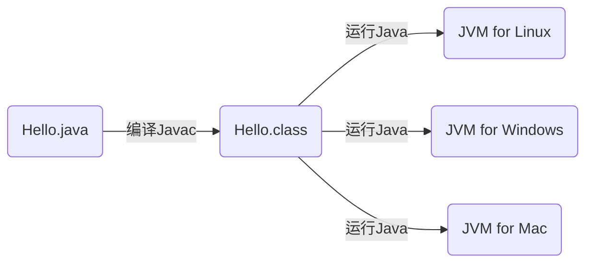
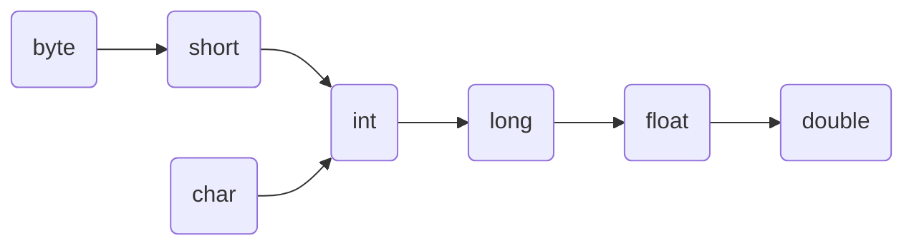
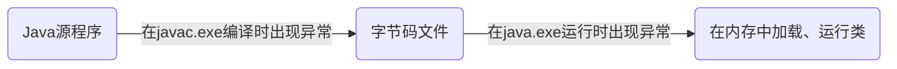
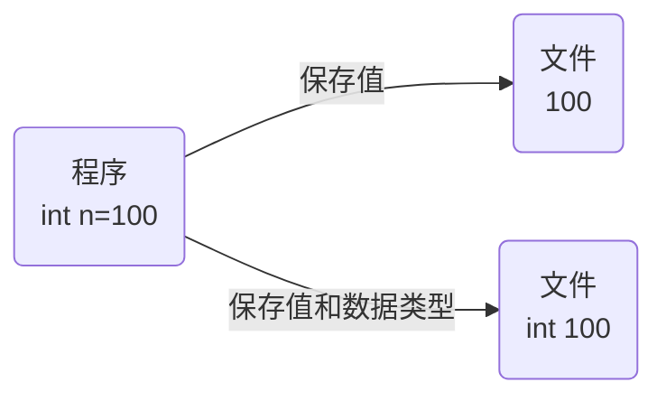

[TOC]

# 1 Java 基础

## 1.1 Java 语言发展史


可以看出由于 Java 的高频率更新，会造成 Java 开发者学习困难，所以衍生出了两个版本：过渡版本 和 长期支持版本(LTS)， 像 Java8.0、11.0和17.0都是 LTS 版本，降低了JAVA 开发者的学习成本

**Java 发展历程中重要的三个版本：**

- Java 5.0: Java 的第一个大版本号更新
- Java 8.0：目前市场上大多数公司使用的版本
- Java17.0：课程中学习的版本

## 1.2 Java 语言跨平台原理

平台指的就是操作系统，包括了:

- Windows
- Mac
- Linux

Java 程序可以在任意操作系统上运行，主要是 Java 应用程序通过提供给对应的 JVM 来实现跨平台性


> 总结：在需要运行 Java 应用程序的操作系统上，安装一个与操作系统对应的 Java 虚拟机（JVM，Java Virtual Machine）即可


## 1.3 JRE 和 JDK

### 1.3.1 JRE

JRE，英文全称 Java Runtime Environment，是<font color="red"> Java 程序的运行时环境，包含了 JVM 和运行时所需要的核心类库</font>


### 1.3.2 JDK

JDK，英文全称 Java Development Kit，是 <font color="red">Java 程序开发的工具包，包含 JRE 和开发人员使用的工具</font>，其中的开发工具包含了：<u>编译工具（Javac.exe）和运行工具（Java.exe）</u>

如果我们想要开发一个全新的 Java 程序，那么必须安装 JDK


### 1.3.3 JDK、JRE 和 JVM 的关系


### 1.3.4 JDK 的下载和安装

oracle 官方官网：[传送入口](https://www.oracle.com/cn/)


下载好之后一路傻瓜式安装即可，这里提出建议：

1. 安装路径不要存在中文、空格或其他特殊字符
2. 所有的开发工具最好同一安装目录


### 1.3.5 JDK 的安装目录

安装好 JDK 后，其文件目录结构如下：


**分析**

| 目录名称                     | 说明                                                        |
| ---------------------------- | ----------------------------------------------------------- |
| <font color="red">bin</font> | 该路径存放了 JDK 的各种工具。Javac 和 Java 就是在这个目录中 |
| conf                         | 该路径下存放了 JDK 相关的配置文件                           |
| include                      | 该路径下存放了一些平台特定的头文件                          |
| jmods                        | 该路径下存放了 JDK 的各种模块                               |
| legal                        | 该路径下存放了 JDK 各模块的授权文档                         |
| lib                          | 该路径下存放了 JDK 工具的一些补充 JAR 包                    |

> 其他文件均为说明文档


## 1.4 常见的 DOS 命令

1. 打开命令提示符，使用快捷键 win + R
2. 在运行程序的输入：cmd 或者 powershell 打开终端命令行

**常用命令**

| 操作          | 说明                 |
| ------------- | -------------------- |
| `盘符名称:`   | 切换盘符             |
| `dir`         | 查看当前路径下的内容 |
| `cd 目录路径` | 进入某个目录         |
| `cd ..`       | 回退到上一级目录     |
| `cd \`        | 回退到盘符目录       |
| `cls`         | 清屏                 |
| `exit`        | 退出命令提示符窗口   |
| `esc`         | 清除当前行输入内容   |


## 1.5 path 环境变量的配置

### 1.5.1 为什么要配置 path 环境变量

开发 Java 程序，需要使用 JDK 提供的开发工具，而这些工具在 JSK 的安装目录的 bin 目录下，这就会导致我们每次在调用的时候都需要补全这些工具的完整路径，<font color="red">为了能够在任意路径下使用这些工具，我们就需要配置 path 环境变量</font>

### 1.5.2 配置环境变量并进行验证


配置完成之后，我们来进行验证：

在命令行窗口输入`javac`，如果出现版本和工具等信息就说明配置成功


## 1.6 HelloWorld 案例

### 1.6.1 Java 程序开发运行流程

开发 Java 程序，需要三个步骤：

1. 编写程序
2. 编译程序（Javac 工具实现）
3. 运行程序（Java 工具实现）




> 现在，普遍认为 Java 是一门解释型语言，因为 Java 运行运行时，是在 JVM（Java 虚拟机）上对 class 文件进行逐行解释执行的。但是 Java 应该是介于解释型和编译型之前，因为它的第一步 javac 其实还是一个编译的过程。


### 1.6.2 HelloWorld 代码编写

```java
// 创建一个 HelloWorld 的公用的类
public class HelloWorld {
    // main 方法是程序的主入口
    public static void main(String[] args) {
        System.out.println("Hello World");
    }
}
```

> 注意：文件名和类名需要保持一致，即这个文件名应该叫做：HelloWorld.java

**代码执行步骤：**

1. 编译

   ```bash
   javac 文件名.java
   ```

2. 运行（上一步编译后会生成一个以 .class 结尾的类）

   ```bash
   java 类名
   ```


# 2 Java 语法

在介绍 Java 语法之前，我们首先要了解到 Java 开发的注意事项和细节说明：

1. Java 源文件以 `.java` 为扩展名。源文件的基本组成是类（class）

2. Java 应用程序的执行入口为 `main()` 方法，它具有固定的书写格式：`public static void main(String[] args) {…}`

3. Java 中每条语句都是以 `;` 结束的

4. <strong style="color:red">一个 Java 源文件中只有一个 public 类，其他类的个数不限，</strong>

   > 因为源文件名唯一，而 public 类名和源文件名对应，所以 public 类应该也只能写一个

5. 类中都可以拥有自己的 `main()` 方法


## 2.1 注释

注释是在程序<font color="red">指定位置</font>添加的<font color="red">说明性的信息</font>

> 注释不参与程序的运行，仅是起到说明性文字的作用

注释的分类：

- 单行注释

  ```java
  // 注释信息
  ```

- 多行注释

  ```java
  /* 注释信息 */
  ```


文档注释：注释内容可以被 JDK 提供的工具 <strong style="color:red">Javadoc</strong> 所解析，生成一套以网页文件形式体现的该程序的说明文档，一般写在类

```bash
javadoc -d 文件夹名 -xx -yy Demo.java
```

示例：

```java
/**
 * @author administrator
 * @version 1.0
 */
public class Demo {
    public static void main(String[] args) {
    }
}
```


------

可用的注释参数如下：

| 标签         | 描述                                                   | 示例                                                         |
| ------------ | ------------------------------------------------------ | ------------------------------------------------------------ |
| @author      | 标识一个类的作者，一般用于类注释                       | @author description                                          |
| @deprecated  | 指名一个过期的类或成员，表明该类或方法不建议使用       | @deprecated description                                      |
| @docRoot     | 指明当前文档根目录的路径                               | Directory Path                                               |
| @exception   | 可能抛出异常的说明，一般用于方法注释                   | @exception exception-name explanation                        |
| @inheritDoc  | 从直接父类继承的注释                                   | Inherits a comment from the immediate surperclass.           |
| @link        | 插入一个到另一个主题的链接                             | {@link name text}                                            |
| @linkplain   | 插入一个到另一个主题的链接，但是该链接显示纯文本字体   | Inserts an in-line link to another topic.                    |
| @param       | 说明一个方法的参数，一般用于方法注释                   | @param parameter-name explanation                            |
| @return      | 说明返回值类型，一般用于方法注释，不能出现再构造方法中 | @return explanation                                          |
| @see         | 指定一个到另一个主题的链接                             | @see anchor                                                  |
| @serial      | 说明一个序列化属性                                     | @serial description                                          |
| @serialData  | 说明通过 writeObject() 和 writeExternal() 方法写的数据 | @serialData description                                      |
| @serialField | 说明一个 ObjectStreamField 组件                        | @serialField name type description                           |
| @since       | 说明从哪个版本起开始有了这个函数                       | @since release                                               |
| @throws      | 和 @exception 标签一样.                                | The @throws tag has the same meaning as the @exception tag.  |
| @value       | 显示常量的值，该常量必须是 static 属性。               | Displays the value of a constant, which must be a static field. |
| @version     | 指定类的版本，一般用于类注释                           | @version info                                                |


## 2.2 关键字

关键字：就是被 Java 语言赋予了<font color="red">特定含义的单词</font>

特点：

- 关键字的字母**全部小写**
- 常用的代码编辑器，针对关键字都有特殊的颜色标记


## 2.3 常量

常见的常量有如下类型：

| 常量类型   | 说明                                                    | 举例                      |
| ---------- | ------------------------------------------------------- | ------------------------- |
| 字符串常量 | 用<strong style="color:red">双引号</strong>括起来的内容 | "Hello world"             |
| 整型常量   | 不带小数的数字                                          | 666, -8                   |
| 浮点型常量 | 带小数的数字                                            | 13.14                     |
| 字符常量   | 用<strong style="color:red">单引号</strong>括起来的内容 | 'A',  '0'                 |
| 布尔常量   | 布尔值，用来表示真假                                    | 只有两个值：true 和 false |
| 空常量     | 一个特殊的值，空值                                      | 只有一个值：null          |

> 空常量不能直接输出


## 2.4 数据类型


数据类型内存占用和取值范围

				HTML


​					
​				
​				
​						
​				
​			 
​    
​        
​            数据类型
​            关键字
​            内存占用
​           	取值范围


​    
​    
​    	
​        	整数
​            byte
​            1
​            -128~127


​        
​            short
​            2
​            -32768~32767        	


​        
​            int
​            4
​            -2的31次方到2的31次方-1        	


​        
​            short
​            2
​            -2的63次方到2的63次方-1        	


​        
​        	浮点数
​            float
​            4


​        
​        
​            double
​            8


​        
​        
​        	字符
​            char
​            2
​            0~65535


​        
​        	布尔
​            boolean
​            1
​            true, false


​    
​

:warning:**注意**

1. 在 Java 中，char 占 2 个字节，而在 C / C++ 中，char 只占 1 个字节
2. <strong style="color:red">在 Java 中，字符串只能使用双引号包裹</strong>
3. 浮点数在计算机中存储形式是由符号位（0 为正，1 为负） + 尾数位 + 指数位（加固定偏移 127）。并且尾数部分可能丢失，造成精度损失，因而小数都是近似值


**字符类型的注意事项**

1. Java 中允许使用转义字符 `\` 来将其后的字符转变为特殊字符型常量。例如：`char c = '\t'`

2. Java 中，char 的本质是一个整数，在输出时，会输出 Unicode 对应的字符

3. 可以直接给 char 赋一个整数，输出时，会按照对应的 Unicode 编码输出对应字符

   ```java
   char a = 97;
   System.out.println(a);	// a
   ```


:herb: **扩展：字符编码表**

1. ACSII：一共 128 个字符，每个字符占 1 个字节
2. Unicode：固定大小的编码表，字母和汉字统一使用 2 个字节
3. UTF-8：万国码，字母占 1 个字节，汉字占 3 个字节
4. GBK：可以表示汉字，并且范围很大，字母占 1 个字节，汉字占 2 个字节
5. GB2312：和 GBK 一样可以表示汉字，但是范围小于 GBK
6. BIG5：繁体中文，适用于台湾、香港


## 2.5 变量

**变量**：在程序运行过程中，其值可以发生改变的量

变量定义的格式：

桥接模式强调对象要拥有两个维度的变化，简化了多级继承关系，但同时增加了聚合对象的内聚方法，具有一定的局限性，并且提高了系统程序的复杂程度


变量在使用的时候具有以下注意事项：

- 变量名不能重复

- 变量未赋值，不能使用

- long 类型的变量定义的时候，为了防止整数过大，后面需要加上 L

- float 类型的变量定义的时候，为了防止类型不兼容，后面需要加上 F

  > 浮点数默认是 double 类型


**:herb:扩展：类型字面量后面添加尾缀**

在 Java 中，当我们给变量赋值时，其中 `float`、`double`、`long` 类型的字面量后面需要添加尾缀 `f或F`、`d或D`、`l或L`来进行说明

```java
long n1 = 100L;
float n2 = 10.2F;
double n3 = 3.1415D;
```

我们对以下情况进行说明：

- **情况1**：将整型赋值给 `float`、`double`、`long` 类型变量时由于存在自动类型转换，因而不会报错

  ```java
  long n1 = 5;		// int --> long
  float n2 = 10;		// int --> float
  double n3 = 20;		// int --> doulbe
  ```

- **情况2**：将浮点数直接赋值给 `float` 类型变量，由于 JVM 中默认的浮点型为 `doulbe`，因而会报错

  ```java
  float n1 = 1.2; // 报错
  float n2 = 1.2F;
  ```


## 2.6 标识符

标识符：就是给<u>类、方法、变量</u>等起名字的符号

标识符的定义规则：

- 由数字、字母、下划线（_）和美元符（$）组成
- 不能以数字开头
- 不能是关键字
- 区分大小写

约定规则（规范）：

1. 声明<font color="red">方法或变量</font>的时候我们建议使用小驼峰命名法（例如：firstName）
2. 声明<font color="red">类</font>的时候我们建议使用大驼峰命名法（例如：Student）
3. 声明常量时，所有的字母都大写，多单词时每个单词用下划线连接


## 2.7 类型转换

类型转换分为以下两类：

1. 自动类型转换
2. 强制类型转换

### 2.7.1 自动类型转换

把一个表示<u>数据范围小</u>的数值或者变量赋值给另一个表示<u>数据范围大</u>的变量

表示数据范围从小到大图：



:bell:**自动类型转换的细节**

1. 多种类型数据混合运算时，系统会自动将所有的数据转换为容量最大的那种数据类型，然后再进行计算

2. byte 和 short 无法与 char 进行自动类型转换

3. <strong style="color:red">byte、short 和 char 在计算时，首先会转换为 int 类型</strong>

   ```java
   byte a = 1;
   byte b = 2;
   byte c = a + b; // 错误，a + b 的结果会自动转换为 int 类型，不能使用 byte 接收
   ```

4. boolean 类型不参与转换


### 2.7.2 强制类型转换

把一个表示<u>数据范围大</u>的数值或者变量赋值给另一个表示<u>数据范围小</u>的变量

语法格式如下：

```java
目标数据类型 变量名 = (目标数据类型)值或者变量;
```

> 强制数据类型转换可能会造成数据精度丢失

:bell:**强制类型转换的细节**

1. char 可以保存 int 类型的常量值，但不能保存 int 类型的变量值，需要进行强转

   ```java
   char c1 = 100;      // 正确
   int m = 100;
   char c2 = m;        // 错误
   char c3 = (char)m;  // 正确
   ```


### 2.7.3 基本数据类型和 String 类型的转换

- 基本数据类型 => String ：加空字符串即可（`data + ""`）
- String => 基本数据类型：通过基本类型的包装类调用的 `parseXXX()` 方法即可

```java
int n1 = 100;
float f1 = 10.10F;
double d1 = 4.5;
boolean b1 = true;

String s1 = n1 + "";
String s2 = f1 + "";
String s3 = d1 + "";
String s4 = b1 + "";

int num1 = Integer.parseInt(s1);
float num2 = Float.parseFloat(s2);
double num3 = Double.parseDouble(s3);
boolean num4 = Boolean.parseBoolean(s4);
```


## 2.8 运算符和表达式

- 运算符：对常量或者变量进行操作的符号
- 表达式：用运算符把常量或者变量连接起来的==符合 Java 语法==的式子

### 2.8.1 算术运算符

| 符号 | 作用 |
| ---- | ---- |
| +    | 加   |
| -    | 减   |
| *    | 乘   |
| /    | 除   |
| %    | 取余 |

<font color="red">注意事项：整数操作只能得到整数，要想得到小数，必须要有浮点数参与运算</font>


### 2.8.2 字符和数值的 "+" 操作

**数值的 "+" 操作**

拿字符与数值进行 "+" 操作时，字符会转换为对应的 ASCII 码值

算术表达式中包含多个基本数据类型的值的时候，整个算术表达式的类型会自动进行提升

提升规则：

- byte 类型，short 类型和 char 类型将被提升到 int 类型

- 整个表达式的类型会自动提升到表达式中最高等级操作数同样的类型

  > 等级顺序：byte, short, char → int → long → float → double


**字符串的 "+" 操作**

- 当 "+"操作中出现字符串时，这个 "+" 的作用是<font color="red">字符串连接符</font>，而不是算术运算符
- 在 "+" 操作中，如果出现了字符串，就是连接运算符，否则就是算术运算符，当连续进行 "+" 操作时，从左到右依次执行


### 2.8.3 赋值运算符

| 符号 | 作用       |
| ---- | ---------- |
| =    | 赋值       |
| +=   | 加后赋值   |
| -=   | 减后赋值   |
| *=   | 乘后赋值   |
| /=   | 除后赋值   |
| %=   | 取余后赋值 |

注意：**扩展的赋值运算运算符隐含了强制类型转换**，例如：

```java
short i = 100;
i += 100;
```

等价于

```java
short i = 100;
i = (short)(i + 100);
```


### 2.8.4 自增自减运算符

| 符号 | 作用 | 说明        |
| ---- | ---- | ----------- |
| ++   | 自增 | 变量的值加1 |
| --   | 自减 | 变量的值减1 |

注意事项：

- ++ 和 -- 既可以放在变量的后面，也可以放在变量的前面
- 单独一行使用的时候，++ 和  -- 无论是放在变量的前面还是后面，结果是相同的
- 参与操作的时候，如果放在变量的后面，先拿变量参与操作，后自增或自减；如果放在变量的前面，先拿变量自增或自减，后拿变量参与操作

 

### 2.8.5 关系运算符

| 符号 | 说明             |
| ---- | ---------------- |
| ==   | 判断是否相等     |
| !=   | 判断是否不相等   |
| >    | 判断是否大于     |
| <    | 判断是否小于     |
| >=   | 判断是否大于等于 |
| <=   | 判断是否小于等于 |

> 关系运算符的返回结果为 boolean 类型，要么为 true，要么为 false


### 2.8.6 逻辑运算符

| 符号 | 作用                                                         |
| ---- | ------------------------------------------------------------ |
| &    | 逻辑与                                                       |
| \|   | 逻辑或                                                       |
| ^    | 逻辑异或（a 和 b 一个为 true，一个为 false，返回结果才为 true） |
| !    | 逻辑非                                                       |


### 2.8.7 短路逻辑运算符

| 符号 | 作用   |
| ---- | ------ |
| &&   | 短路与 |
| \|\| | 短路或 |

注意事项：

- 逻辑与 &，无论左边真假，右边都要执行;

  短路与 &&，如果左边为真，右边执行；<font color="red">如果左边为假，右边不执行</font>

- 逻辑或 |，无论左边真假，右边都要执行

  短路或 ||，如果左边为假，右边才执行；<font color="red">如果左边为真，右边不执行</font>

最常用的逻辑运算符：&&、||、!


**逻辑运算符和短路逻辑运算符的公式关系**

| a     | b     | a&b   | a&&b  | a\|b  | a\|\|b | !a    | a^b   |
| ----- | ----- | ----- | ----- | ----- | ------ | ----- | ----- |
| true  | true  | true  | true  | true  | true   | false | false |
| true  | false | false | false | true  | true   | false | true  |
| false | true  | false | false | true  | true   | true  | true  |
| false | false | false | false | false | false  | true  | false |


### 2.8.8 三元运算符

三元运算符的语法格式：

```java
关系表达式? 表达式1 : 表达式2;
```

> - 如果值为 true，表达式 1 的值就是运算结果；
>
> - 如果值为 false，表达式 2 的值就是运算结果


## 2.9 数据输入

在编程中，需要接收用户输入的数据，就可以使用键盘输入语句来获取。首先需要一个扫描器（对象），就是 Scanner

Scanner 使用的基本步骤

1. 导包

   ```java
   import java.util.Scanner;	// 将 java.util 下的 Sanner 类导入
   ```

2. 创建 Scanner 对象实例

   ```java
   Scanner scanner = new Scanner(System.in);
   ```

3. 接受数据

   ```java
   int i = scanner.next();	// 接收字符串
   int i = scanner.nextInt();	// 接收int
   int i = scanner.nextDouble();	// 接收double
   ```


## 2.10 数据输出

- `printf()`：与 C 语言特性相同，可用于格式化输出
- `print()`：标准输出，输出完毕后光标定位到行末，不换行
- `println()`：与 `print()` 类似，但输出完毕后会回车换行，将光标定位到下一行行首

> Java 中推荐使用后面两种，当输出的参数为对象时，其底层会调用 `toString()`

```java
System.out.printf("a=%d",a);
System.out.print("对象A=" + A); 		// 不换行
System.out.println("对象A=" + A);		// 自动换行
```


## 2.11 转义字符

| 转义字符 | 作用     |
| -------- | -------- |
| `\t`     | 制表符   |
| `\n`     | 换行符   |
| `\\`     | 一个 `\` |
| `\'`     | 一个 `'` |
| `\r`     | 回车符   |

:alarm_clock:**注意区分回车和换行**

回车是指将光标定到当前行的最前面，而换行则是另起一行，用下面示例来说明：

```java
public class Demo {
    public static void main(String[] args) {
        System.out.println("冷水解冻比\r热水解冻好");
        System.out.println("--------------------");
        System.out.println("冷水解冻比\n热水解冻好");
    }
}
```

执行结果如下：


# 3 循环分支语句

## 3.1 流程控制

流程控制语句分类：

- 顺序结构
- 分支结构
- 循环结构

## 3.1 分支语句

### 3.1.1 if…else 语句

语法格式如下：

```java
if(关系表达式) {
	语句块1;
} else {
	语句块2;
}
```

我们再升级一点，有 if…else if… else 语句，语法格式如下：

```java
if (关系表达式1) {
	语句块1;
} else if (关系表达式2){
	语句块2;
} else {
	语句块3;
}
```


### 3.1.2 switch 语句

switch 的语法格式如下：

```java
switch(表达式) {
	case 值1:
		语句体1;
		break;
	case 值2:
		语句体2;
		break;
	…
	default:
		语句体 n+1;
		[break;]
}
```

格式说明：

1. 表达式的取值可以是 byte、short、int 、char、JDK5 以后可以是枚举，JDK7 之后可以是 String
2. case：后面需要跟的是和表达式进行比较的值
3. break：表示中断，结束的意思，用来结束 switch 语句
4. default：表示当所有的情况都是不匹配的时候，就执行该处的内容

## 3.2 循环语句

循环结构的组成：

1. 初始化语句：用于表示循环开启时的起始状态
2. 条件判断语句：用于表示循环反复执行的条件
3. 循环体语句：用于表示循环反复执行的内容
4. 条件控制语句：用于表示循环执行中每次变化的内容

### 3.2.1 for 循环语句格式

```java
for (初始化语句; 条件判断语句; 条件控制语句) {
	循环体语句;
}
```

:small_red_triangle:**注意事项**

1. 循环条件是返回一个布尔值的表达式

2. `for(;循环条件;)` 中的初始化和变量迭代可以写到其他地方，但是两边的分号不能省略

3. 循环初始值可以有多条初始化语句，但要求类型一样，并且中间用逗号分隔；循环变量迭代也可以有多条变量迭代语句，中间用逗号分隔

   ```java
   for (int i = 0, j = 0; i < 3; i++, j += 2) {
       System.out.println("i=" + i + "," + "j=" + j);
   }
   ```

   


### 3.2.2 while 循环体语句

基本格式：

```java
while(条件判断语句) {
	循环体语句;
}
```

完整格式：

```java
循环变量初始化语句;
while(条件判断语句) {
	循环体语句;
	条件控制语句
}
```

流程图如下：


### 3.2.3 do…while 循环语句

语法格式如下：

```java
do {
	循环体语句;
}while(条件判断语句);
```

```java
初始化语句;
do {
	循环体语句;
	条件控制语句;
}while(条件控制语句)
```

:bookmark_tabs:**说明**

1. `do`、`while` 都是关键字
2. `do…while` 语句是先执行循环体后进行判断

循环流程图如下：


### 3.2.4 三种循环的区别

- for 循环和 while 循环先判断条件是否成立，然后再决定是否执行循环体（先判断后执行）
- do…while 循环先执行一次循环体，然后判断条件是否成立，是否继续执行循环体（先判断后执行）

**for 和 while 的区别：**

- for 循环的条件控制语句所控制的自增变量，因为归属 for 循环的语法结构中，在 for 循环结束后，就不能再次被访问到
- 条件控制语句所控制的自增变量，对于while 循环来说不归属于其语法结构中，在 while 循环结束后，该变量还可以继续使用

### 3.2.5 循环控制语句

- continue 用于跳出本次循环
- break 用于结束本层循环

:alarm_clock:**break 语句的细节**

1. 可以为每层循环外面添加 label 标签，搭配 break 指定跳出哪一层循环，示例代码如下：

   ```java
   label1:
   for (int i = 0; i < 4; i++) {   // 外循环
       label2:
       for (int j = 0; j < 3; j++) {   // 内循环
           if (i == 2) {
               break label1;	// 当 if 循环满足条件时跳出直接跳出外层循环
           }
           System.out.println("i: " + i + ";j: " + j);
       }
   }
   ```

2. 当 break 标签没有搭配 label 标签使用时，默认跳出的是离 `break` 语句最近的一层循环

3. 在实际开发过程中，尽量不要使用 label 标签


:alarm_clock:**continue 语句的细节**

`continue` 语句和 `break` 语句类似，都可以搭配 labekl 标签使用


## 3.3 return 语句

`return` 语句使用在方法中，表示跳出所在的方法，而如果 `return` 语句写在 `main()` 方法中，会直接跳出程序


## 3.4 扩充：Random 库的使用

random 用于<font color="red">生成一个随机数</font>

使用步骤：

1. 导包

   ```java
   import java.util.Random
   // 导包的动作必须出现在类定义的上面
   ```

2. 创建对象

   ```java
   Random r = new Random();
   ```

3. 获取随机数

   ```java
   int number = r.nextInt(10);	// 获取数据的范围：[0, 10)
   ```


# 4 IDEA 工具的使用

## 4.1 IDEA 概述

1. IDEA 全称是 [Intellij IDEA](https://www.jetbrains.com/idea/) ，是用于Java 语言开发的**集成环境**

   >集成环境：把代码<u>编写、编译、执行、调试</u>等多种功能综合到一起的<u>开发工具</u>

2. 它是业界公认的目前用于 Java 程序开发最好的工具

3. IDEA 是 JetBrains 公司的产品，总部位于捷克的首都布拉格

4. 除了支持 Java 开发，还支持 HTML、CSS、PHP、MySQL、Python 等


Java 的另一款 IDE（集成开发环境）为 [Eclipse](https://www.eclipse.org/) 

1. Eclipse 是一个<u>开源的、基于 Java</u> 的可扩展平台
2. 最初是由 IBM 公司耗资 3000 万美金开发的下一代 IDE
3. 2001 年 11 月贡献给开源社区


## 4.2 使用 IDEA 创建 Java 项目

1. 创建项目：【File】=> 【new】=> 【Project】，并选择好<u>开发语言与 JDK 版本（推荐 java 8即 JDK1.81）</u>

   

2. 填好项目名称和选择路径

   

   > 注意：路径最后一定要加上项目名称，否则 IDEA 会将目录当做项目根目录

3. 在 `src` 文件夹下创建类：【右键 src】 => 【new】=> 【Java class】


## 4.3 IDEA 相关配置

1. 字体配置：【Editor】=> 【Font】
2. 编码配置：【Editor】=> 【File Encoding】
3. 文本颜色配置：【Editor】=> 【Color Scheme】=>【Java】


## 4.4 IDEA 中的项目结构

就目前而言，项目结构的文件树如下：

```
Demo: 项目名称                    
├─ out: 该存放用于存放编译后的 .class 文件                  
│  └─ production        
│     └─ Demo           
│        └─ Demo.class  
├─ src: 源文件夹                  
│  └─ Demo.java         
└─ Demo.iml             
```

> :bulb:在终端使用 `tree` 命令可以快速生成文件树


## 4.3 IDEA 中内容辅助键和快捷键

**快速生成语句**

1. 快速生成main 方法：`psvm + Tab/Enter`

   ```java
   public static void main(String[] args) {
   }
   ```

2. 快速生出输出语句：`sout + Tab/Enter`

3. 快速生成迭代器遍历代码：`itit + Tab/Enter`

4. 快速生成增强 for 循环：`I + Tab/Enter` 

**内容辅助键**

Ctrl + Alt + Space（内容提示、代码补全等）

**快捷键**

- 注释
  - 单行注释：Ctrl + /
  - 多行注释：Ctrl + Shift + /
- 格式化：**Ctrl + Alt + L**
- 将当前行的代码复制到下一行：Ctrl + D
- 快速删除一行：Ctrl + Y
- 生成构造方法：Alt + Insert
- 查看一个类的层级关系：Ctrl + H
- 将贯标放在一个方法上，输入 Ctrl + B ，可以快速定位到是哪个类的方法
- 自动分配变量名，通过在后面添加 `.var`
- 自动补齐左边：Ctrl + Alt + V
- 选中多行：alt + 鼠标滑动
- 新建一行，并且光标定位新行：Shift + Enter
- 快速生成代码块（例如：异常处理，for循环）：Ctrl + Alt + T
- 快速生成代码块提示键：Ctrl + J
- IDEA 中 structure 面板：Alt + 7
- 查看接口的子接口和实现子类：Ctrl + Alt + B
- 重写父类方法：Ctrl + O
- 将小写转换为大写：Ctrl + Shift + U

**万能快捷键**

- Alt + Enter：可以导入配置类

**自己配置快捷键**

在 【Keymap】里面的【Editor Actios】中进行配置，例如：

- 向下复制整行：Duplicate Entire Lines
- 删除当前行：Delete Line 


## 4.4 IDEA 模板

利用模板我们可以快速搭建好我们想要的代码，例如：main 、psvm 、sout、sou 搭配 tab 键就可以快速生成代码，这些就是模板。

查看 / 编辑 模板：file --> setting --> editor --> Live templates 


## 4.5 IDEA 配置

### 4.5.1 配置代码根据屏幕宽度自动换行


## 4.4 IDEA 中模块操作

**新建模块**


**删除模块**


<font color="red">注意：在目录结构中的删除仅仅是不显示，实际上并没有删除磁盘的模块，要想彻底删除，需要到文件夹总手动删除模块</font>

**导入模块**

File → Project Structure → :heavy_plus_sign: → import module


## 4.5 解决 IDEA 中没有创建 package 的选项

在 IDEA 中，有时我们无法右键发现没有 package 这个选项，可以根据如下步骤来解决：

1. 右键 src 文件夹（或其他文件夹），找到 【mark Directory as】 → 【Resources Root】

   

2. 重新右键，就会先又出现了 package 选项

   


## 4.6 解决 IDEA 中代码注释无法与代码对齐的问题

IDEA 中代码注释默认是顶格对齐的，如下，这样看起来十分地不舒服


我们需要到 IDEA 的设置进行修改，找到【Editor] → 【Code Style】 --> 选择需要的修改的语言，将配置设置如下图：


## 4.6 断点调试

在开发过程中，如果我们想要查找错误，那么可以使用**断点调试**来一步一步查看源码执行的过程，进而发现错误所在。

:small_red_triangle:**注意：在断点调试过程中，是运行状态，是以对象的运行类型来执行的**


断点调试：是指在程序的某一行设置一个断点（breakpoint），调试时，程序运行到该行就会停住，然后一步一步往下调试，调试过程中可以看到各个变量当前的值，出错的话，调试到出错的代码行即显示错误，停止，分析该错误。

> "断点调试" 的术语： Debug


**断点调试快捷键**

- F7：跳入（step into），跳入方法
- F8：跳出（step over），用于逐行执行
- Shift + F8：跳出（step out），跳出方法
- F9：resume，执行到下一个断点


:herb:**扩展：跳入方法无效的解决方法**

我们第一次使用 IDEA 工具时，使用 F7 跳入方法时可能会失效，解决方法有如下两种：

1. 使用 force step into：快捷键为 Alt + Shift + F7

2. 在 setting 中进行配置即可：

   Settings --> Build、Execution --> Deployment --> Debugger --> stepping，在 Do not step into the classes 配置项中取消勾选 `java.*` 和 `javax.*` 即可

   


:bell:**小技巧**

<strong style="color:red">在 Debug 的过程中，支持动态下断点</strong>


**案例：使用 Debug 查看对象的创建过程**

```java
// 创建对象的流程
// (1) 加载类信息
// (2) 初始化：2.1 默认初始化 2.2 显示初始化 2.3 构造器初始化
// (3) 返回对象的地址
```


## 4.7 IDEA 中恢复默认配置

双击 `shift` --> `Restore default settings`


## 4.8 对 IDEA 中类图的分析

对下面的类

```java
public class person {
    private String name;
    private int age;
    
    public void say() {}

    public person(String name, int age) {
        this.name = name;
        this.age = age;
    }

    public String getName() {
        return name;
    }

    public int getAge() {
        return age;
    }
    
    class job {}
}
```

我们查看其类图：

<center>
    
    
</center>


上面有一个 properties（属性）字段，千万不要和 fields 搞混了，properties 在这里指的是通过 getter 或 setter 设置的属性


## 4.9 解决 IDEA 中只显示集合数据部分内容

在调试代码时，我们有时查看组合数据类型的数据时只展示部分，如下：


我们只需要按下面操作即可：


# 5 数组

数组（array）是一种用于存储==多个相同类型数据==的数据结构，同时数组也是一种数据类型，为<strong style="color:red">引用类型</strong>

**使用数组时的注意事项**

1. 数组是<strong style="color:red">多个相同类型元素的组合</strong>，实现对这些数据的统一管理

2. <strong style="color:red">数组中的元素可以是任意数据类型</strong>，包括基本类型和引用类型，但不能混用

3. 数组创建后，如果没有赋值，有默认值，例如：

   - **`int` 、`byte`、`short`、`long`**：0
   - **`float`、`double`**：0.0
   - **`char`**：`\u0000`
   - **`boolean`**：false
   - **`String`**：null

   > :warning:**注意：`\u0000` 代表空字符，属于控制字符，也叫作不可显字符，与空格 `\u0020` 不同，下面用示例进行说明：**
   >
   > ```java
   > System.out.println("\u0000".length());  // "\u0000" 长度为1
   > System.out.println(" ".length());       // 空格"\u0020" 长度为1
   > System.out.println("".length());        // 空字符串的长度为0
   > ```

4. 数组下标从 0 开始

5. 数组的使用步骤：1. 声明数组并开辟空间；2. 给数组各个元素赋值； 3. 使用数组

6. 数组下标不能超过指定的范围，否则会报**越界**错误：`Index out of bounds`

7. 数组属于引用类型，数组型数据是对象


**示例**

```java
int[] a = new int[5];
System.out.println("a@" + a[0]);    // a@0

char[] b = new char[5];
System.out.println("b@" + b[0]);    // b@

float[] c = new float[5];
System.out.println("c@" + c[0]);    // c@0.0

boolean[] d = new boolean[5];
System.out.println("d@" + d[0]);    // d@false

String[] e = new String[5];
System.out.println("e@" + e[0]);    // e@null
```


## 5.1 数组定义格式

```java
// 格式1
数据类型[] 变量名;		

// 格式2
数据类型 变量名[];
```

这两种的定义格式不同在于：

```java
int[] arr;	// 定义了一个 int 类型的数组，数组名是 arr

int arr[];	// 定义了一个 int 类型的变量，变量名是 arr 数组
```


## 5.2 数组初始化

Java 中的数组必须<font color="red">先初始化，然后才能使用</font>

> 所谓初始化：就是为数组中的元素分配内存空间，并未每个元素赋值


**动态初始化**

动态初始化指的是：初始化时只指定数组长度，由系统为数组分配初始值

语法格式如下：

```java
数据类型[] 变量名 = new 数据类型[数组长度];
```


**静态初始化**

静态初始化：初始化时指定每个数组元素的初始值，由系统决定数组长度

语法格式如下：

```java
数据类型[] 变量名 = new 数据类型[]{数据1, 数据2, 数据3, …}
```

简化格式如下：

```java
数据类型[] 变量名 = {数据1, 数据2, 数据3,…}
```


## 5.3 数组元素访问

```java
// 数组变量访问方式
格式: 数组名

// 数组内部保存的数据的访问方式
格式: 数组名[索引]
/*
	@ 索引是从 0 开始
	@ 索引是连续的
*/
```

**demo**

```java
int[] arr = new int[3];
System.out.println(arr);        // [I@776ec8df
System.out.println(arr[0]);     // 0
System.out.println(arr[1]);     // 0
System.out.println(arr[2]);     // 0
```

指向如下：


>- 红色边框矩形代表的是 栈内存：存储局部变量
>- 蓝色边框矩形代表的是 堆内存：存储 new 出来的实体或对象
>- 每一个通过 new 出来的实体或对象都存在一个地址值，使用完毕后，会在 GC 机制（垃圾回收机制）下被回收

栈内存中存放的是数组变量 arr 的首地址，堆内存中存放的是 arr 中每个元素具体的值，寻值的过程就是首先从栈内存中获取 arr 的地址，之后根据索引去获取对应的值

换言之，<strong style="color:red">对于基本数据类型的直接赋值，拷贝 / 传递 方式为【深拷贝 / 值传递】，而对于引用数据类型，拷贝 / 传递 方式为为【浅拷贝 / 引用传递】</strong>


## 5.4 内存分配

Java 程序在运行时，需要在内存中分配空间。为了提高运算效率，就对空间进行了不同区域的划分，因为每一片区域都有特定的处理数据方式和内存管理方式。

数组在初始化时，会为存储空间田间默认值：

- 整数：默认值是 0
- 浮点数：默认值是 0.0
- 布尔值：默认值是 false
- 字符：默认值是 空字符
- 引用数据类型：默认值是 null


## 5.5 数组操作的两个常见小问题

1. 索引越界：访问了数组中不存在的索引对应的元素，造成索引越界问题

2. 空指针异常：访问的数组已经不再指向堆内存的数据，造成空指针异常

   ```java
   int[] arr = new int[3];
   System.out.println(arr[2]);
   // 把 null 赋值给数组
   arr = null;
   System.out.println(arr[0]);
   ```

   

   >null 表示空值，引用数据类型的默认值


## 5.6 数组的遍历

获取数组元素的个数：直接通过内置方法 length 来获取数组元素的个数，例如：`arr.length`


## 5.7 数组动态扩容

```java
// 1. 定义初识数组 arr
int[] arr = {1, 2, 3};
// 2. 定义一个新的数组，依次将 arr 的元素拷贝到新数组中
int[] newArr = new int[arr.length + 1];
for(int i = 0; i < arr.length; i++) {
    newArr[i] = arr[i];
}
// 3. 将 4 赋给 newArr 最后一个元素
newArr[newArr.length - 1] = 4;
// 4. 让 arr 指向 newArr，同时 arr 在GC机制下自动回收
```


# 6 类和对象

## 6.1 类和对象的概念

**对象**：即客观存在的事物都属于对象

**类**：即对一类具有共同==属性==和==行为==的事物的抽象

**类与对象的关系：**

- 类是对象的模板
- 对象是类的实例
- 类是对象的数据类型
- 类是具有相同属性和行为的对象的抽象


## 6.2 类的介绍

类的组成：==属性==和==行为==

- 属性：在类中通过==成员变量==来体现
- 行为：在类中通过==成员方法==来体现（和前面的方法相比去掉 static 关键字即可）

类的定义格式如下：

```java
public class 类名 {
	// 成员变量
	数据类型1 变量1;
	数据类型2 变量2;
	…
	// 成员方法
	方法1;
	方法2;
	…
}
```

**dmeo**

```java
public class Phone {
    // 成员变量
    String brand;
    int price;

    // 成员方法
    public void call() {
        System.out.println("打电话");
    }
    public void send() {
        System.out.println("发短信");
    }
}
```


## 6.3 对象的属性和行为

- 属性：<font color="red">对象具有的各种特征</font>

- 行为：对象能够进行的操作


> 属性在 Java 中，也可以被称呼为成员变量或filed(字符)，属性既可以是基本数据类型，也可以是引用类型（对象、数组）

:warning:**属性的注意事项**

1. 属性的定义语法同变量，不同是可以添加访问修饰符，例如：<strong style="color:orange">`访问修饰符 属性类型 属性名;` / ` 属性类型 属性名;`</strong>
2. 属性的定义类型可以为任意类型，包含基本类型和引用类型
3. 属性如果不赋值，有默认值，规则与数组一致


## 6.4 对象的基本使用方法

**创建对象**

```java
类名 对象名 = new 类名();
// 例如：Phone p = new Phone();
```

**使用对象**

```java
// 1. 使用成员变量
对象名.变量名		// 例如 p.brand
    
// 2. 使用成员方法
对象名.方法名()	// 例如 p.call()
```

**demo**

```java
public class PhoneDemo {
    public static void main(String[] args) {
        // 创建对象
        Phone p = new Phone();
        // 使用成员变量
        p.brand = "小米";
        p.price = 2999;
        System.out.println(p.brand);
        System.out.println(p.price);

        // 使用成员方法
        p.call();
    }
}
```


## 6.5 对象内存布局

我们以下面代码为例，来讲述对象在内存中布局：

```java
Cat cat = new Cat();
cat.name = "小白";
cat.color = "白色";
cat.age = 12;
```

布局图如下：


**说明**

1. 当 Cat 类创建出一个实例对象后，JVM 会进行下面两件事：

   - 在栈中开辟一块空间存放实例对象的地址

   - 加载类，将类的属性信息和方法信息放到方法区中

2. 在堆中分配空间，用来存储实例对象的属性，进行默认初始化

3. 把为存储实例对象的属性开辟的空间的地址赋给 cat，cat 就指向创建的实例对象

4. 进行指定初始化，这里区分不同属性的数据类型所做出的动作：

   - 如果属性为引用数据类型，那么属性的地址存放在堆内存中，值会存放到方法区的常量区内

   - 如果属性为基本数据类型，那么属性值就直接存放到堆内存中

 

:herb:**练习：下面是韩顺平老师给的一道习题，请自己思考**


## 6.6 成员变量

成员变量即<strong style="color:red">定义在类中的变量</strong>，与局部变量区分开：


- 成员变量：位于类中但是在方法外的变量，例如上图的 name 和 age 就是一个成员变量，<u>作用域为整个类</u>
- 局部变量：位于方法中的变量，如上图的 i 和 j，<u>作用域为其所在的代码块中</u>


| 区别           | 成员变量                                         | 局部变量                                                     |
| -------------- | ------------------------------------------------ | ------------------------------------------------------------ |
| 类中位置不同   | 类中方法外                                       | 方法内或者方法声明内                                         |
| 内存中位置不同 | 堆内存                                           | 栈内存                                                       |
| 生命周期不同   | 随对象的创建而创建，随对象的销毁而销毁，周期较长 | 随方法的调用而存在，随方法的调用结束而销毁，周期较短         |
| 初始化值不同   | 有默认的初始化值                                 | <strong style="color:red">没有默认的初始化值，必须先定义，赋值后才能使用</strong> |
| 修饰符不同     | 全局变量可以添加修饰符                           | 局部变量不能添加修饰符                                       |
| 作用域范围不同 | 全局变量（属性）可以被本类或其他类使用           | 局部变量只能在本类对应的方法中使用                           |


## 6.7 成员方法

在类中除了定义成员方法之外，有时还需要定义一些行为，例如：人除了年龄、姓名这些属性，还需要一些行为，像跑步、学习等等，我们将这些行为称为成员方法（简称 "方法"）

### 6.7.1 方法的定义

方法的定义格式如下：

```java
访问修饰符 返回数据类型 方法名(参数列表) {
	语句;
	return 返回值;
} 
```

- 访问修饰符：可选，用来控制访问权限

  > 主要包括：public、protected、默认、private

- 返回数据类型

  - 一个方法最多只能有一个返回值，如果想要返回多个值，可以考虑数组或对象
  - 如果方法要求返回数据类型，则方法体中最后的执行语句必须为 `return` 语句，并且返回的数据类型和要求的一致或兼容
  - 如果返回数据类型是 `void`，那么方法体中可以没有 `return` 语句，或者只写 `return ;`

- 方法名遵循小驼峰命名法


:warning:**注意**

- 方法定义时，参数中的数据类型与变量名都不能缺少，缺少其中一个，程序将报错
- 方法定义时，多个参数之间使用逗号分隔
- 方法调用时，参数的数量与类型必须与方法定义中的设置相匹配，否则程序将报错

### 6.7.2 方法的调用机制


### 6.7.3 方法的优点

1. 提高代码复用性（方法的本质还是个函数）
2. 将实现的细节封装起来，只暴露对外层的接口，供其他用户调用


### 6.7.4 方法的传参机制

**基本数据类型传参机制**：<strong style="color:red">深拷贝，在方法中对参数的改变不会影响到原始的参数值</strong>

我们以下面的代码为例：

```java
public class Demo2 {
    public static void main(String[] args) {
        int a = 10;
        int b = 20;
        AA aa = new AA();
        aa.swap(a, b);
        System.out.println("在main方法中，a: " + a + ",b: " + b);    // 在main方法中，a: 10,b: 20
    }
}

class AA {
    public void swap(int a, int b) {
        System.out.println("在swap方法中，交换前a: " + a + ",b: " + b);    // 在swap方法中，交换前a: 10,b: 20
        int temp = a;
        a = b;
        b = temp;
        System.out.println("在swap方法中，交换后a: " + a + ",b: " + b);    // 在swap方法中，交换后a: 20,b: 10
    }
}
```

传参机制原理如下：


**引用数据类型的传参机制**：<strong style="color:red">浅拷贝，在方法中对参数的改变会影响到原始的参数值</strong>

```java
public class Demo2 {
    public static void main(String[] args) {
        int[] arr = {1, 2, 3};
        AA aa = new AA();
        aa.change(arr);
        System.out.println("在 main 方法中，a[0] 的值为：" + arr[0]);  // 在 main 方法中，a[0] 的值为：100
    }
}

class AA {
    public void change(int[] arr) {
        arr[0] = 100;
    }
}
```

原理图如下：


```java
public class Demo2 {
    public static void main(String[] args) {
        Person p = new Person();
        p.name = "张三";
        p.age = 18;
        AA aa = new AA();
        aa.change(p);
        System.out.println(p.age);  // 20
        System.out.println(p.name); // 李四
    }
}
class Person {
    String name;
    int age;
}
class AA {
    public void change(Person p) {
        p.age = 20;
        p.name = "李四";
    }
}
```


**练习题：将对象传入一个方法中，在方法内，将其指向 null，在 main 方法中对象是否也指向空**

答案：main 方法中对象不指向 null，main主栈中对象 p 和 change 新栈中 p 并不是同一个 p。

```java
public class Demo2 {
    public static void main(String[] args) {
        Person p = new Person();
        p.name = "张三";
        p.age = 18;
        AA aa = new AA();
        aa.change(p);
        System.out.println(p.age);  // 18
    }
}
class Person {
    String name;
    int age;
}
class AA {
    public void change(Person p) {
        p = null;
    }
}
```

简图如下：


### 6.7.5 方法的递归调用


### 6.7.6 方法的重载

Java 中允许<strong style="color:red">同一个类</strong>中，存在多个<strong style="color:red">同名</strong>的方法，但是要求其<strong style="color:red">参数列表不同</strong>

> 形参列表不一致体现在：<strong style="color:red">参数个数不同或者参数类型不同</strong>

**重载（overload）的好处**

1. 减轻了<u>起名</u>的麻烦
2. 减轻了<u>记名</u>的麻烦

:warning:**注意**：<strong style="color:red">返回值并不能作为方法的重载条件</strong>，也即下面的写法是错误的：

```java
/ 无返回值
void test(int a) {
    System.out.println("type int");
}

// 返回值为int
int test(int a) {
    return a;
}
```

**demo**

```java
public static void main(String[] args) {
    int result1 = sum(10, 20);
    System.out.println(result1);
    double result2 = sum(10.0, 20.0);
    System.out.println(result2);

}
// 求两个 int 类型数据和的方法
public static int sum(int a, int b) {
    return a + b;
}
// 求两个 double 类型的数据和方法
public static double sum(double a, double b) {
    return a + b;
}
```


### 6.7.7 可变参数

在定义方法时，在**最后一个形参前添加三个点 `...`** ，用来表示该形参可以接收多个参数值，并且多个参数值被以<strong style="color:red">数组</strong>的形式传入，该参数即为可变参数。

基本语法如下：

```java
访问修饰符 返回类型 方法名(数据类型 ...形参名) {
	// …
}
```

:warning:**注意事项**

1. 可变参数只能作为函数最后一个参数，前面可以有也可以没有其他参数
2. 一个函数最多只能有一个可变参数
3. 可变参数的本质其实就是数组


**demo**

```java
public class Demo2 {
    public static void main(String[] args) {
        Solution s = new Solution();
        System.out.println(s.sum(1, 2, 3));			// 6
        System.out.println(s.sum(1, 2, 3, 4));		// 10
        System.out.println(s.sum(1, 2, 3, 4, 5));	// 15

    }
}

class Solution {
    public int sum(int ...params) {
        int res = 0;
        for(int i = 0; i < params.length; i++) {
            res += params[i];
        }
        return res;
    }
}
```


## 6.8 构造方法

构造方法，又称为构造器（constructor），是类的一种特殊的方法，<strong style="color:red">主要用来完成对新对象的初始化</strong>，语法如下：

```java
[修饰符] 方法名(形参列表) {
	// 方法体
}
```

- 构造器的修饰符可以默认，也可以是 public、protected、private
- 构造器没有返回值
- 方法名必须和类名一致
- 在创建对象时，系统会自动地调用该类的构造器来完成对对象的初始化

示例代码如下：

```java
public class Demo2 {
    public static void main(String[] args) {
        Person p1 = new Person("Smith", 80);
        System.out.println(p1.name);    // Smith
        System.out.println(p1.age);     // 80
    }
}

class Person {
    String name;
    int age;

    // 1. 构造器没有返回值，也不能写 void
    // 2. 构造器名和类名一致
    // 3. (String pName, int pAge) 是构造器形参列表，规则和成员方法一样
    public Person(String pName, int pAge) {
        name = pName;
        age = pAge;
    }
}
```

:warning:**注意事项**

1. 一个类可以定义多个不同的构造器，即构造器重载

2. 构造器名和类名保持一致

3. 构造器没有返回值

4. 在创建对象时，系统会自动调用该类的构造器

5. 如果程序员没有定义构造器，系统会自动给类生成一个默认的无参构造器（也称为 "默认构造器"）

   ```java
   public class Demo2 {
       public static void main(String[] args) {
           Dog d = new Dog();
       }
   }
   
   class Dog {
       /* default constructor
          Dog() {
   
           }
       */
   }
   ```

   使用 `javap` 命令进行反编译，可以看到出现了默认构造器

   

6. 一旦定义了自己的构造器，默认的构造器就被覆盖了，就不能再使用默认的无参构造器，除非显式地定义，例如：`Person{}`

   > 无参构造最主要的作用就是实现方法重载，即可以在创建的类中不传入任何值，后续通过 `.` 的形式添加


**练习**

要求：在前面定义的 Person 类中添加两个构造器：

1. 第一个无参构造器：利用构造器设置所有人的 age 属性初始值为 18
2. 第二个为带 `pName` 和 `pAge` 两个参数的构造器，使得每次创建 Person 类对象的同时初始化对象的 age 和 name 属性值。分别是用不同的构造器，创建对象。

```java
class Person {
    String name;
    int age;

    public Person() {
        age = 18;
    }
    
    public Person(String pName, int pAge) {
        name = pName;
        age = pAge;
    }
}
```


### 6.8.1 加上构造器的对象创建过程详解

对下面案例的对象创建过程进行分析：

```java
class Person {
    int age = 10;
    String name;
    Person(String n, int a) {
        name = n;
        age = a;
    }
}

Person p = new Person("张三", 18);
```


## 6.9 this 关键字

<strong style="color:red">`this` 是对当前对象的引用</strong>，`this` 主要有以下用途：

1. `this` 关键字可以用来访问本类的属性、方法和构造器

2. `this` 用于区分当前类的属性和局部变量

   > 在构造器中，我们利用 `this` 就可以解决参数命名不统一的问题（要是直接命名一致，构造器中变量就成为了局部变量），可以使用如下构造方式：
   >
   > ```java
   > // demo1
   > Person(String name, int age) {
   >  // name 和 age 均为局部变量，而this.name 和 this.age 则为类的成员变量
   >  this.name = name;
   >  this.age = age;
   > }
   > ```
   >
   > ```java
   > // demo2
   > public void f3() {
   >  String name = "John";
   >  // 直接访问name,采取就近原则，这里最近的name为方法中的name，值为 John
   >  System.out.println(name);
   >  // 通过 this. 的方式访问到的是成员变量
   >  System.out.println(this.name);
   > 
   > }
   > ```

3. 访问成员方法语法： **`this.方法名(参数列表)`** 

   ```java
   class Test {
       public void f1() {
           System.out.println("f1() method");
       }
   
       public void f2() {
           System.out.println("f2() method");
   
           // 调用f1的方法1
           f1();
   
           // 调用f2的方法2
           this.f1();
       }
   }
   ```

4. 访问构造器语法：**`this(参数列表)`**（<strong style="color:red">注意只能在构造器中使用，并且 `this` 必须放置于构造器中的第一条语句</strong>）

5. `this` 不能在类定义的外部使用，只能在类定义的方法中使用

 


# 7 包

## 7.1 包的基本介绍

当开发人员组内，两个开发人员都想要创建一个 Cat 类，这时候就需要用到包来进行分类。

**包的三大作用**

1. 区分相同名字的类
2. 当类很多时，可以很好地管理类
3. 控制访问范围

**包的基本语法**

```java
package com.xxx
```

:spiral_notepad:**说明**

1. package：表示打包
2. com.xxx：表示包名


## 7.2 包原理

包的本质：就是<strong style="color:red">创建不同的文件夹来保存类文件</strong>

IDEA 中创建包的步骤如下：<u>右键 src --> new Package</u>

示例：创建 com.xiaoming 和 com.xiaoqiang 两个包，里面都添加 Dog 类，之后在 Use.java 中使用

```
src                
├─ com             
│  ├─ use          
│  │  └─ Use.java  
│  ├─ xiaoming     
│  │  └─ Dog.java  
│  └─ xiaoqiang    
│     └─ Dog.java  
└─ Demo.java       
```

```java
package com.use;

import com.xiaoming.Dog;

public class Use {
    public static void main(String[] args) {
        Dog dog1 = new Dog();
        com.xiaoqiang.Dog dog2 = new com.xiaoqiang.Dog();
        System.out.println(dog1);   // com.xiaoming.Dog@1b6d3586
        System.out.println(dog2);   // com.xiaoqiang.Dog@4554617c
    }
}
```


## 7.3 包的命名规则

命名规则：<strong style="color:red">只能包含数字、字母、下划线、小圆点`.`，但不能用数字开头，不能是关键字或保留字</strong>

```
demo.class.exec1	// 错误，class 是关键字
demo.12a		    // 错误，不能以数字开头
demo.ab12.oa		// 正确
```

包名一般书写规范为：**com.公司名.项目名.业务模块名**

以新浪公司为例：

```java
com.sina.crn.user	// 用户管理中的用户模块
com.sina.crn.order	// 用户管理中的订单模块
com.sina.crn.utils	// 用户管理中的工具模块
```


## 7.4 Java 中常用的包

一个包下，包含很多的类，Java 中常用的包有：

1. `java.lang.*`：lang 包是基本包，<strong style="color:orange">默认引入，不需要再引入</strong>
2. `java.util.*`：util 包，系统提供的工具包
3. `java.net.*`：网络包，网络开发
4. `java.awt.*`：用于制作界面开发，GUI


## 7.5 包的使用

导包：包的导入直接使用 `import` 关键字即可，语法如下：

```java
import 包名;
```

**示例**

```java
import java.utils.Arrays;	// 按需导入
import java.utils.*			// 全部导入
```

```java
import java.util.Arrays;

public class Use {
    public static void main(String[] args) {
        // 使用 utils 包下的 Arrays 类进行数组排序
        int[] arr = {-1, 20, 2, 30, -100};
        Arrays.sort(arr);
        for (int i = 0; i < arr.length; i++) {
            System.out.print(arr[i] + " ");
        }
    }
}
```


:warning:**注意事项**

1. `package` 的作用是**声明当前类所在的包，需要放在类的最上面，一个类中最多只有一句 `package`**
2. `import` 指令位置放在 `package` 下面，在类定义前面，可以有多句且没有顺序
3. 类的导入推荐使用按需导入，全部导入会影响运行效率


# 8 访问修饰符

Java 提供四种访问控制修饰符号，<strong style="color:red">用于控制方法和属性（成员变量）的访问权限（范围）</strong>

1. 公开级别：用 **`public`** 修饰，对外公开
2. 受保护级别：用 **`protected`** 修饰，对**子类和同一个包中的类**公开
3. 默认级别：没有修饰符号，向**同一个包的类**公开
4. 私有级别：用 **`private`** 修饰，只有**类本身**可以访问，不对外公开

|  修饰符   |        同类        |        同包        |        子类        |       不同包       |
| :-------: | :----------------: | :----------------: | :----------------: | :----------------: |
|  private  | :heavy_check_mark: |        :x:         |        :x:         |        :x:         |
|   默认    | :heavy_check_mark: | :heavy_check_mark: |        :x:         |        :x:         |
| protected | :heavy_check_mark: | :heavy_check_mark: | :heavy_check_mark: |        :x:         |
|  public   | :heavy_check_mark: | :heavy_check_mark: | :heavy_check_mark: | :heavy_check_mark: |

:star:**补充：默认和 `public` 也可以用来修饰类，并且遵循上述访问权限的特点** 


# 9 面向对象三大特征

面向对象编程有三大特征：<strong style="color:red">封装、继承和多态</strong>


## 9.1 封装

封装（encapsulation）：指的是把抽象出的数据（属性）和对数据的操作（方法）封装到一起，数据被保护在内部，程序的其他部分只有通过被授权的操作（方法），才能对数据进行操作。

> 电视机就是最为典型的封装的例子

**封装的好处**

1. 隐藏实现细节
2. 可以对数据进行验证，保证安全合理

### 9.1.1 封装的实现步骤

1. 将属性私有化 private
2. 提供一个公共的（public）set 方法，用于修改属性
3. 提供一个公共的（public）get 方法，用于获取属性值


**练习**：封装一个程序，要求不能随便查看认得年龄、工资等隐私，并对设置的年龄进行合理的验证，年龄合理就设置，否则给默认值（年龄在 1~120 ，工资不能直接查看，name 的长度在 2~6 之间）

```java
class Person {
    public String name;
    private int age;
    private double salary;

    public String getName() {
        return name;
    }

    public void setName(String name) {
        if(name.length() >= 2 && name.length() <= 6) {
            this.name = name;
        } else {
            System.out.println("名字长度不对");
            this.name = "佚名";
        }

    }

    public int getAge() {
        return age;
    }

    public void setAge(int age) {
        if(age >= 1 && age <= 120) {
            this.age = age;
        } else {
            System.out.println("年龄设置不合理");
            this.age = 18;  // 一旦年龄设置不合理，使用默认年龄
        }
    }

    public double getSalary() {
        return salary;
    }


    public void setSalary(double salary) {
        // 设置薪水这里可以考虑权限判断
        this.salary = salary;
    }

    public String info() {
        return "my name is " + this.name + ", my age is " + this.age + ", my salary is " + this.salary;
    }
}
```

> 在 IDEA 中运行的时候，第一次运行项目需要设置好主类，可以通过右键运行，或者使用快键键 Ctrl + Shift + F10


### 9.1.2 封装与构造器

在上一个案例中，我们使用了 setter 和 getter 来设置和获取属性值，对数据起到防护作用，下面我们需要添加构造器在类中：

```java
public Person(String name, int age, double salary) {
    setName(name);
    setAge(age);
    setSalary(salary);
}
```

注意这种写法，里面不能使用 `this.name = name;` 这种设置值的形式，否则外部会绕过防护，直接通过构造器来对数据进行修改。


## 9.2 继承

继承（extends）：指的是子类继承父类的属性和行为，使得子类对象（实例）拥有父类的实例域和方法 ，或者说继承就是基于已有的类派生出新的类

> - 父类：又称为基类（或超类），里面的属性和方法为共有的
> - 子类：又称为派生类，里面拥有自己私有的属性和方法
> - 子类一旦继承了父类，就立即拥有的父类的属性和方法

示例图如下：


继承的语法如下：

```java
class 子类 extends 父类 {
	
}
```


**继承的优点**

1. 提高代码的复用性
2. 提高代码的扩展性和维护性


### 9.2.1 继承的使用

我们在使用继承的时候要注意：

**Rule1:**  <strong style="color:red">子类继承了所有的属性和方法，但是私有属性和方法不能在子类直接访问，要通过公共的方法去访问</strong>

```java
// 父类
public class Base {
    public int n1 = 1;
    protected int n2 = 2;
    int n3 = 3;
    private int n4 = 4;

    public int print_4() {
        return this.n4;
    }
}
```

```java
// 子类
public class Sub extends Base {
    public void say() {
        /**
         * @n1 public
         * @n2 protected
         * @n3 default
         * @n4 private
         */
        System.out.println(n1 + n2 + n3);
        // 子类通过父类中公共的方法print_4()得到n4这个私有属性
        System.out.println(print_4());
    }
}
```


**Rule2:**  <strong style="color:red">子类的构造器中会默认调用 `super()` 方法，因而子类必须调用父类的构造器，完成父类的初始化</strong>

```java
// 父类构造器
public Base() {
    System.out.println("Base...");
}

// 子类构造器
public Sub() {
    System.out.println("Sub...");
}
```

当调用子类的方法时，打印顺序如下：


**Rule3:**  <strong style="color:red">当创建子类对象时，不管使用子类的哪个构造器，默认情况下总会去调用父类的无参构造器；如果父类没有提供无参构造器，则必须在子类的构造器中用 `super()` 去指定使用哪个构造器完成对父类的初始化工作，编译不会通过</strong>

**例1：在 Rule 示例基础上，将子类构造器增加一个带参构造器**

```java
public Sub() {
    System.out.println("Sub...");
}

public Sub(String name, int age) {
    System.out.println("Base(String name, int age)...");
}
```

在创建两个对应的 Sub 对象后：

```java
Sub s = new Sub();
System.out.println("---------------");
Sub s2 = new Sub("ls", 10);
```

代码的执行结果如下：


> 无论使用子类那个构造器，都先会执行父类的无参构造器


**例2：去掉父类的无参构造器后，子类必须通过 `super()` 指定调用父类的哪个构造器，否则报错**

```
// 父类使用有参构造器去覆盖无参构造器
public Base(String name, int age) {}
```

```java
// 子类构造器
public Sub() {
    super("Smith", 20);
    System.out.println("Sub...");
}

public Sub(String name, int age) {
    super("Jack", 20);
    System.out.println("Base(String name, int age)...");
}
```


**rule4:**  <strong style="color:red">`super()` 只能在构造器中使用，并且必须放在构造器的第一行</strong>


**rule5:**  <strong style="color:red">`super()` 和 `this()` 都只能放在构造器第一行，因此这两个方法不能共存在一个构造器中</strong>

> :bell:`super()` 和 `this()` 的区别
>
> - `super()` 用于调用父类的构造器
> - `this()` 用于调用同类中的重载构造器
>
> > 无论是 `super()` 还是 `this()` ，他们都只能放在构造器中使用，并且必须放在第一行


**rule6:**  <strong style="color:red">Java 中所有的类都是 Object 类的子类</strong>

> 在 IDEA 中，我们可以使用快捷键 Ctrl + H 查看类的继承关系


**rule7:**  <strong style="color:red">父类构造器的调用不限于直接父类，可以一直往上追溯到顶级父类</strong>


**rule8:**  <strong style="color:red">子类最多只能继承一个父类（指直接继承），即 Java 是单继承机制</strong>


**rule9:**   <strong style="color:red">不要滥用继承，子类和父类之间必须满足 `is` 的逻辑关系</strong>

例如：

```
Person is a music	// ×
Cat is Animal		// √ 
```


### 9.2.2 继承的本质

我们对下面的代码进行分析：

```java
class GradPa {
    String name = "大头爷爷";
    String hobby = "旅游";
}

class Father extends GradPa {
    String name = "大头爸爸";
    int age = 40;
}

class Son extends Father {
    String name = "大头儿子";
}
```

当我们创建一个 Son 对象后，类的加载过程如下：


这里注意：**继承中可以存在同名属性**，他们在加载过程中，会放到堆中不同的空间，当我们从 Son 这里子类中取 name 字段时，查找过程时逐步向上的，先 子类 ，子类中没有 name，就向上查找，查找链：**子类 --> 父类 --> 祖父类 --> … --> Object**


### 9.2.3 super 关键字

**基本介绍**：`super` 代表父类的引用，用于访问<u>父类的属性、方法、构造器</u>

用途如下：

1. 访问父类的属性：`super.属性名`

   > 注意：访问不到父类的私有（private）属性

2. 访问父类的方法：`super.方法名(参数列表)`

   > 注意：访问不到父类的私有（private）方法

3. 访问父类的构造器：`super(参数列表)`

   > 注意：`super(参数列表)` 只能放在构造器的第一句

> <strong style="color:red">super() 只能在构造器中使用</strong>

### 9.2.4 使用 super 的一些细节

1. 使用 `super` 调用父类的构造器的好处：分工明确，父类属性由父类初始化，子类属性由子类初始化
2. 当子类中有和父类中的成员（属性或方法）重名时，为了访问父类的成员，必须通过 `super` 。如果没有重名，使用 `super`、`this` 或直接访问是一样的效果。
3. `super` 对父类或以上的祖父类中成员的访问遵循就近原则

示例代码如下：

```java
public void test() {
    // 1. 直接调用方法，查找路线为：本类中的say方法 -> 父类中的say方法 -> …… -> Object 中的say方法 -> cannot access
    say();

    // 2. 通过 this. 的方式调用，效果等同于直接调用 say
    this.say();

    // 3. 通过 super. 的方式调用，直接跳过本类，调用父类的 say 方法
    super.say();
}
```


:herb:**扩展：super 和 this 的比较**

| 区别点     | this                                                       | super                                      |
| ---------- | ---------------------------------------------------------- | ------------------------------------------ |
| 访问属性   | 访问本类的属性，如果本类没有此属性则从父类中继续查找       | 访问父类中的属性                           |
| 调用方法   | 访问本类中的方法，如果本类中没有此方法，则从父类中继续查找 | 直接访问父类中的方法                       |
| 调用构造器 | 调用本类构造器，必须放在构造器的首行                       | 调用父类的构造器，必须放在子类构造器的首行 |
| 特殊       | 是当前对象的引用                                           | 子类中对父类对象的引用                     |


### 9.2.5 方法重写（Overwrite）

方法重写（Overwrite）和方法重载不同，方法重写指的是：<strong style="color:red">如果子类存在一个方法与父类相同，那么子类的这个方法就会重写（或覆盖）父类的方法，我们将其称为方法重写</strong>

> 注意：这里的方法相同，包括<strong style='color:red'>方法名、参数列表、返回类型相同或者子B类返回类型是父类返回类型的子类</strong>

```java
// 父类
public Object fn() {
    return null;
}

// 子类
public String fn() {
    return null;
}
// String 是 Object 的子类，所以没有问题
```

最后：<strong style="color:red">子类方法不能缩小父类方法的访问权限</strong>，该原因和里式替换原则有关


## 9.3 多态

多态（polymorphic）：指的是同一个行为具有不同的表现形式或形态的能力。

- 多态就是同一个接口，使用不同的实例而执行不同的操作。
- h多态建立在封装和继承的基础上

> 例如：在不同的软件界面下按 F1 这个快捷键，弹出的功能是不同的，另外重写和重载也是多态的一种体现


### 9.3.1 对象的多态

**核心**

1. 一个对象的编译类型和运行类型可以不一致
2. 编译类型在定义对象时，就确定了，不能改变
3. 运行类型是可以变化的
4. 编译类型看定义是 `=` 的左边，运行类型看 `=` 的右边

例如：

```java
Animal animal = new Dog()  
// animal 变量的编译类型是 Animal ，运行类型是 Dog
    
animal = new Cat()
// animal 的运行类型变成了 Cat，而编译类型仍然是 Animal
```

示例：animal 和子类 Dog、Cat 均有 `cry()` 这个方法，请观察代码的逻辑


```java
// animal 的编译类型是 Animal, 运行类型为 Dog
Animal animal = new Dog();
// 运行时，执行到下面该行，由于 animal 的运行类型是 Dog,所以 cry 就是Dog的 cry
animal.cry();       // Dog 在汪汪叫...
// 运行时，执行到下面该行，由于 animal 的运行类型修改为了 Cat,所以执行的就是 Cat的cry
animal = new Cat();
animal.cry();       // Cat 在喵喵叫...
```


**案例：使用多态解决主人喂食问题**

背景：主人喂猫吃鱼，喂狗吃骨头


```java
// Animal.java
public class Animal {
    private String name;

    public Animal(String name) {
        setName(name);
    }

    public String getName() {
        return name;
    }

    public void setName(String name) {
        this.name = name;
    }
}
```

```java
// Food.java
public class Food {
    private String name;

    public Food(String name) {
        setName(name);
    }

    public String getName() {
        return name;
    }

    public void setName(String name) {
        this.name = name;
    }
}
```

```java
// Cat.java
public class Cat extends Animal {
    public Cat(String name) {
        super(name);
    }
}

// Dog.java
public class Dog extends Animal {
    public Dog(String name) {
        super(name);
    }
}
```

```java
// Bone.java
public class Bone extends Food {
    public Bone(String name) {
        super(name);
    }
}

// Fish.java
public class Fish extends Food {
    public Fish(String name) {
        super(name);
    }
}
```

```java
// Use.java
public class Use {
    public static void main(String[] args) {
        Dog dog = new Dog("大黄");
        Cat cat = new Cat("小喵");
        Bone bone = new Bone("大骨棒");
        Fish fish = new Fish("鲫鱼");
        feed(dog, bone);
        feed(cat, fish);
    }

    public static void feed(Animal animal, Food food) {
        System.out.println("主人给" + animal.getName() + "喂" + food.getName());
    }
}
```


### 9.3.2 向上转型

多态的前提：**两个对象（类）存在继承关系**

多态的<strong style="color:red">向上转型:</strong>

1. 本质：父类的引用指向子类的对象
2. 语法：`父类类型 引用名 = new 子类类型()`
3. 特点
   - 编译类型看左边，运行类型看右边
   - 可以调用父类中的所有成员（需遵循访问权限）
   - <strong style="color:red">不能调用子类中特有成员</strong>
   - 最终运行效果看子类的具体实现

示例代码如下：

```java
// Animal.java
public class Animal {
    public void run() {
        System.out.println("run...");
    }

    public void eat() {
        System.out.println("eat...");
    }
}
```

```java
// Cat.java
public class Cat extends Animal {
    public void run() {
        System.out.println("cat run...");
    }

    public void swim() {
        System.out.println("cat swim...");
    }

}
```

```java
Animal animal = new Cat();
// 向上转型可以调用父类的全部方法(需遵守访问权限)
animal.eat();   // eat...
// 执行时看子类，从下往上查找
animal.run();   // cat run...
// 不能调用子类特有的方法，因为在编译阶段，是由编译类型决定
//animal.swim();
```


### 9.3.3 向下转型

1. 语法：`子类类型 引用名 = (子类类型) 父类引用`
2. 注意
   - 只能强转父类的引用，不能强转父类的对象
   - 要求父类的引用必须指向的是当前目标类型的对象
   - 可以调用子类类型中所有成员

**示例代码**

```java
Animal animal = new Cat();
// 此时 animal的运行类型变成Cat，并且赋给了编译类型为 Cat 的cat变量
// animal只有是对目标类型Cat的引用才能向下转型
Cat cat = (Cat) animal;
cat.swim();
```

以下为错误用法：

```java
Animal animal_2 = new Animal();
Cat cat = (cat) animal_2; 
```


### 9.3.4 属性重写问题

<strong style="color:red">属性没有重写之说！！！属性的值看编译类型</strong>

```java
public class polyDetail {
    public static void main(String[] args) {
        // 属性没有重写之说，属性的值看编译类型
        Base base = new Sub();
        System.out.println("@first: " + base.count);    // @first: 10

        Sub sub = new Sub();
        System.out.println("@second: " + sub.count);    // @second: 20

    }
}
// 父类
class Base {
    int count = 10;
}

// 子类
class Sub extends Base {
    int count = 20;
}
```


### 9.3.5 instanceof 比较操作符的讨论

我们都知道，无论是在 Java，还是 Python、Javascript 中，都存在 instanceof 比较操作符，**用来判断对象的类型是否为 xx 类型或 xx 类型的子类型**。<u>那么这个对象的类型在 Java 中，指的是 对象的编译类型，还是 对象的运行类型呢？</u>

下面，我们用代码进行观察说明：

```java
public class instanceOfDetail {
    public static void main(String[] args) {
        AA aa = new BB();
        /**
         * judge1: 如果依据是对象的编译类型，那么第一条语句应该输出true,第二条语句输出false
         * judge2: 如果依据是对象的编译类型，那么第一条语句应该输出true,第二条语句输出true
         */
        System.out.println(aa instanceof AA);   // true
        System.out.println(aa instanceof BB);   // true
        // 结论：instanceof 判断的是对象的运行类型
    }
}

class AA {}

class BB extends AA {}
```

所以，<strong style="color:red">`instanceof` 操作符的判断依据是对象的运行类型，而不是编译类型</strong>


### 9.3.6 动态绑定机制（重要）

Java 的动态绑定机制是指：

1. 当调用对象方法的时候，该方法会和该对象的<strong style="color:red">内存地址 / 运行类型</strong>绑定
2. 当调用对象属性时，没有动态绑定机制，<strong style="color:red">哪里声明，哪里使用</strong>

演示代码如下：

```java
public class Dynamic {
    public static void main(String[] args) {
        A a = new B();  // 向上转型
        System.out.println(a.sum());    // 30
        System.out.println(a.sum1());   // 20
    }
}
// 父类
class A {
    public int i = 10;

    public int sum() {
        return getI() + 10;
    }

    public int sum1() {
        return i + 10;
    }

    public int getI() {
        return i;
    }
}

class B extends A {
    public int i = 20;
    /*public int sum() {
        return i + 20;
    }*/

    /*public int sum1() {
        return i + 20;
    }*/

    public int getI() {
        return i;
    }
}
```

**分析**

1. `a.sum()` 由于 a 的运行类型是 B 类，所以调用的是 B 类中的 `sum()` 方法，但是 B 类中没有 `sum()` 方法，向上查找，使用 A 类的 `sum()` 方法，在 A 类的 `sum()` 方法中，<strong style="color:red">`getI()` 使用的是 B 类的 `getI()`</strong>（因为方法是和对象的运行类型绑定的，在这里也就是 子类 / B 类），子类 `getI()` 使用当前类中 `i`，所以最终的结果为 20 + 10 = 30
2. `a.sum1()` 同样地，会跳出 B，直接找到 A 类的 `sum1()`，`sum1()` 中的 `i` 同样使用当前类中 `i`，也就是 10，最终返回结果为 10 + 10 = 20


### 9.3.7 多态数组

**定义一个父类的对象数组，里面存放子类或父类的对象**，使用时，可以直接调用父类的属性和方法，如果需要对某些对象单独设置可以调用子类特有方法，可以使用 `instanceof` 进行判断类，将这些类向下转型即可。


### 9.3.8 多态参数

**方法定义的形参为父类类型，实参类型允许为子类类型。**


# 10 Obejct 类

Obejct 类位于 Java.lang 包中，换言之，<u>使用 Object 里面的方法，我们是不需要导入任何包的</u>


## 10.1 equals

在介绍 equals 这个方法前，我们先了解 `==` ：

1. `==` 即可以判断基本类型，又可以判断引用类型
2. `==` 如果判断的是基本类型，判断的是值是否相等
3. `==` 如果判断的是引用类型，判断的是地址是否相等，即判定是不是同一个对象

```java
// A 是 B 的父类
B obj1 = new B();
B obj2 = obj1;
A obj3 = obj2;
System.out.println(obj1 == obj2);   // true
System.out.println(obj1 == obj3);   // true
```


在介绍完 `==` 后，我们来引入 `equals()` 方法，该方法是 Object 类中的方法，<strong style="color:red">比较的是两个对象的引用</strong>

> `equals()` 默认判断的是地址是否相等，子类中往往重写该方法，用于判断内容是否相等，例如 String 、Interger 中的 `equals()` 方法都将 Object 中的 `equals()` 方法重写了，用来判断值是否相等

```java
Integer int1 = new Integer(1);  
Integer int2 = new Integer(1);  
System.out.println(int1 == int2);	// false
System.out.println(int1.equals(int2));	// true
System.out.println("----------------");
String str1 = new String("hello");  
String str2 = new String("hello");  
System.out.println(str1 == str2);	// false
System.out.println(str1.equals(str2));	// true
```

:herb:**补充**

对于直接赋值的字符串字面量，Java 会先将其从字符串常量池（String Pool）中去寻找是否有一样的字符串，如果存在，则直接引用，如果不存在，则通过 `new String()` 进行创建。演示代码如下：

```java
String str_lit1 = "hello";
String str_lit2 = "hello";
System.out.println(str_lit1 == str_lit2);       // true
System.out.println(str_lit1.equals(str_lit2));  // true
// str_lit2 是对 str_lit1 的引用，所以两者完全相同
```


**源码查看**

Object类 `equals()` 方法源码：

```java
public boolean equals(Object obj) {
     return (this == obj);
}
```

String类 `equals()` 方法源码：

```java
public boolean equals(Object anObject) {
    if (this == anObject) {
        return true;
    }
    if (anObject instanceof String) {
        String anotherString = (String)anObject;
        int n = value.length;
        if (n == anotherString.value.length) {
            char v1[] = value;
            char v2[] = anotherString.value;
            int i = 0;
            while (n-- != 0) {
                if (v1[i] != v2[i])
                    return false;
                i++;
            }
            return true;
        }
    }
    return false;
}
```


## 10.2 hashCode

`hashCode()` 用于返回该对象的哈希码值，支持此方法是为了提高哈希表的性能。

对 hashCode 的概括：

1. hashCode 主要是为了提高具有哈希结构的容器的效率
2. 两个引用，如果指向的是同一个对象，则哈希值是相同的，反之，哈希值是不同的
3. 哈希值主要是根据地址号来确定的，但哈希值 ≠ 地址
4. 通过 `hashCode()` 计算出来的哈希值为十进制（Dec）

**示例**

```java
A a1 = new A();
A a2 = a1;
A a3 = new A();
System.out.println(a1.hashCode());  
System.out.println(a2.hashCode());
System.out.println(a3.hashCode());
// a1.hashCode = a2.hashCode ≠ a3.hashCode
```


## 10.3 toString

`toString()` 返回的是该对象的字符串。

**概括**

1. 默认返回：<strong style="color:red">全类名(包名 + 类名) + @ + 哈希值的十六进制</strong>
2. 子类往往重写 `toString()` 方法

**示例**

```java
A a = new A();
System.out.println(a.toString());
System.out.println(Integer.toHexString(a.hashCode()));
```

> `toString()` 方法的源码如下：
>
> ```java
> public String toString() {
>  return getClass().getName() + "@" + Integer.toHexString(hashCode());
> }
> ```


**利用 `toString()` 完成代码重写**

```java
public class toString_test {
    public static void main(String[] args) {
        A a = new A("zs", 19);
        System.out.println(a.toString());
    }
}

class A {
    private String name;
    private int age;

    public A(String name, int age) {
        this.name = name;
        this.age = age;
    }

    @Override
    public String toString() {
        return "A{" +
                "name='" + name + '\'' +
                ", age=" + age +
                '}';
    }
}
```


## 10.4 finalize

当垃圾回收器确定不存在对该对象的更多引用时，由对象的垃圾回收器调用此方法。

**解释**

1. 当对象被回收时，系统自动调用该对象的 **`finalize`** 方法，子类可以重写该方法，做一些释放资源的操作
2. 回收的时机：当某个对象没有任何引用时，则 JVM 就认为该对象是一个垃圾对象，就会使用垃圾回收机制来销毁该对象，在销毁该对象前，会先调用 finalize 方法
3. 垃圾回收机制的调用是由系统来决定的（即自己的 GC 算法），也可以通过 `System.gc()` 主动触发垃圾回收机制

```java
public class Finalize {
    public static void main(String[] args) {
        Car bmw = new Car("宝马");
        // 当我们将 bmw 的引用指向 null，原先创建 Car 对象就成为了垃圾
        // 程序可以在 finalize 中，写自己的业务逻辑代码（比如：释放资源；数据库连接或者打开文件）
        bmw = null;
        System.gc();    // 主动调用垃圾回收器
        System.out.println("程序运行结束...");
    }
}

class Car {
    private String name;

    public Car(String name) {
        this.name = name;
    }

    // 重写 finalize 方法（如果不重写，那么就会调用 Object 类下的 finalize 方法）
    @Override
    protected void finalize() throws Throwable {
        //System.out.printf("垃圾回收");
        System.out.println("垃圾回收...");
    }
}
```

执行结果如下：

```
垃圾回收...
程序运行结束...
```

> 这里特别有意思，就是如果重写方法里面使用的是 `printf` 语句进行打印，那么无法显示出来，只有使用 `println` 语句打印才能显示


# 11 课程项目

## 11.1 零钱通


## 11.2 房屋出租


# 12 类变量和类方法

## 12.1 类变量

类变量（又称为静态变量 / 属性）是该类的<strong style="color:red">所有对象共享的变量</strong>，任何一个该类的对象去访问它时，取到的都是相同的值，同样任何一个该类

**定义类变量**

```java
访问修饰符 static 数据类型 变量名	// 推荐
static 访问修饰符 数据类型 变量名
```

**访问类变量**

```java
类名.类变量名		// 推荐
对象名.类变量名
```

> - 类变量是随类的加载而创建，所以即使没有创建对象实例也可以访问
> - 类变量的访问权限和普通变量的访问权限一致


**示例：现在设计一个 "孩子类"，里面有name 、 count 属性和 join 方法，当创建一个 child 后，自动加入到游戏中，并且人数自增**

```java
public class ClassDemo {
    public static void main(String[] args) {
        Child child1 = new Child("蜘蛛精");
        child1.join();
        child1.count++;

        Child child2 = new Child("蛇精");
        child2.join();
        child2.count++;

        Child child3 = new Child("蝎子精");
        child3.join();
        child3.count++;

        // 类变量可以通过类名直接访问
        System.out.println("目前游戏一共有" + Child.count + "孩子参加游戏...");
    }
}

class Child {
    private String name;
    // 定义一个类变量（静态属性），为所有的 Child 对象所共享
    public static int count = 0;

    public Child(String name) {
        this.name = name;
    }

    public void join() {
        System.out.println(this.name + "参加到游戏中...");
    }
}
```


## 12.2 类变量内存布局

- 在 JDK 7 之前，类变量被认为被存放在方法区的一个叫做 "静态域" 的空间
- 在 JDK 7 之后，类变量被认为被存放在堆空间中

示例图如下：

<center>
    
    
</center>


而不管是那种说法，我们都应该记住两点：

1. static 变量是同一个类所有对象共享
2. static 变量在类加载的时候就生成了


## 12.3 类变量使用的注意事项

1. 使用类变量的时机

   当我们需要让某个类的所有对象都共享一个变量时，就可以考虑使用类变量。例如：定义学生类，统计学生一共交了多少钱

2. 类变量与实例变量的区别

   类变量是该类的所有对象所共享的，而实例变量是每个对象所独享的

3. 加上 `static` 的变量称为类变量 / 静态变量，否则称为实例变量 / 普通变量 / 非静态变量

4. 类变量的生命周期随类的加载开始，随类的消亡而消亡


## 12.4 类方法

类方法，也叫作静态方法。

**定义**

```java
访问修饰符 static 数据返回类型 方法名() {}	// 推荐
static 访问修饰符 数据返回类型 方法名() {}
```

**调用**

```java
类名.类方法名	// 推荐
对象名.类方法名
```


**示例：学生缴学费**

```java
public class ClassMethodDetail {
    public static void main(String[] args) {
        Stu tom = new Stu("tom");
        tom.payFee(100);

        Stu rose = new Stu("rose");
        rose.payFee(200);

        Stu.getTotalFee();
    }
}

class Stu {
    private String name;
    // 定义一个静态变量，用来统计学生累计所交学费数额
    public static double fee = 0;

    public Stu(String name) {
        this.name = name;
    }

    public void payFee(double fee) {
        Stu.fee += fee;
    }
    // 1. 当方法使用 static 修饰之后，该方法就是静态方法
    // 2. 静态方法就可以访问静态属性,非静态方法无法访问静态属性
    public static void getTotalFee() {
        System.out.println("收到的总学费为:" + Stu.fee + "元");
    }
}
```


:film_projector:**应用场景**

类方法在 Java 中的一个典型的应用场景就是：Java 程序员在开发的时候，往往会将一些通用的方法，设计成静态方法，这样，可以直接通过类来获取，例如：`Object.equals()`、`Arrays.sort()` 等等，我们也可以自己编写一个工具类：

```java
public class tools {
    public static void main(String[] args) {
        MyUtils myUtils = new MyUtils();
        System.out.println(myUtils.add(1.2, 2.4));
    }
}
// 制作一个自己工具类
class MyUtils {
    public static double add(double m, double n) {
        return m + n;
    }
}
```


## 12.5 类方法的注意事项

1. 类方法和普通方法都是随着类的加载而加载，将结构信息存储在方法区，但是不同之处在于：<strong style="color:red">类方法中无 `this` 的参数，普通方法中隐含着 `this` 的参数</strong>
2. 类方法可以通过类名调用，也可以通过对象名调用；但普通方法只能通过对象进行调用
3. 类方法中不允许使用和对象有关的关键字，例如：`super` 和 `this`
4. <strong style="color:red">类方法只能访问类变量或类方法</strong>
5. 普通方法既可以访问静态成员，又可以访问非静态成员


## 12.6 main 的语法

对 `main()` 方法的解释：

```java
public static main(String[] args) {}
```

1. `main()` 是由 JVM 调用的

2. 由于 JVM 和 `main()` 并不同属于一个类，所以访问的权限只能是 `public`

3. JVM 在执行 `main()` 方法时不必创建对象，所以该方法必须是 `static`

4. `String` 类型的数组参数中保存的是执行 Java 命令时传递所运行类的参数，语法如下：

   ```bash
   java 执行的程序 参数1 参数2 参数3 …
   ```

   

**示例**

```java
// Hello.java
public class Hello {
    public static void main(String[] args) {
        for(int i = 0; i < args.length; i++) {
            System.out.println("the " + (i + 1) + " arguments is : " + args[i]);
        }
    }
}
```


:alarm_clock:**特别提醒**

1. 在 `main()` 方法中，我们可以直接调用 `main()` 方法所在的类的静态方法或静态属性
2. 但是，不能直接访问该类中的非静态成员，必须创建该类的一个实例对象后，才能通过这个对象去访问类中的非静态方法

**示例**

```java
public class Main01 {
    public static int n = 10;
    public int m = 20;

    public static void say() {
        System.out.println("static method...");
    }
    
    public void talk() {
        System.out.println("Not static method...");
    }
    public static void main(String[] args) {
        // 1. 在 main 方法中，可以直接调用 main 中的静态属性和静态方法
        System.out.println(n);
        say();

        // 2. 对于 main 中非静态属性和方法，必须要先创建该类的实例后才能使用
        Main01 main01 = new Main01();
        System.out.println(main01.m);
        main01.talk();
    }
}
```


:herb:**补充：在 IDEA 中动态传参**

之前，我们如果想要在执行 Java 程序时动态传参需要依靠 CMD 命令行来实现，如果我们想要让下面的代码在执行的同时可以传入参数：

```java
public class Main02 {
    public static void main(String[] args) {
        for (String arg : args) {
            System.out.println(arg);
        }
    }
}
```

方法如下：


## 12.7 代码块

代码块又称为<strong style="color:red">初始化块</strong>，属于类中的成员（即是类的一部分），类似于方法，将逻辑语句封装在方法体中，通过 `{}` 包围起来

> 但和方法不同，没有方法名，没有返回，没有参数，只有方法体，而且不用通过对象或类显示调用，而是加载类时，或创建对象时隐式调用

**基本语法**

```java
[修饰符] {
	代码;
};
```

**说明**

1. 修饰符可选，可选项为 `static`
2. 使用 `static` 修饰的代码块为静态代码块，没有 `static` 修饰的代码块为普通代码块 / 非静态代码块
3. 逻辑语句可以为任何逻辑语句（输入、输出、方法调用、循环、判断等）
4. `;` 可以写，也可以省略


代码块可以分为<u>静态代码块和非静态代码块</u>，下面将考虑在**类中方法外**的情况

```java
public class CodeBlock02 {
    public static void main(String[] args) {
        // 1. 创建对象实例时，类被加载，调用 static 代码块，并且只调用 1 次
        A a1 = new A();
        System.out.println("================");
        A a2 = new A();
        System.out.println("================");
        // 2. 创建子类 B实例对象，类由于在前面已经被加载，所以不会执行 static 代码块，但是由于创建了 B实例对象，所以 A类实例对象一定会被创建，A 中非静态代码块会被调用
        B b1 = new B();
    }
}

class A {
    public int n = 10;

    {
        System.out.println("执行A的非静态代码块...");
    }

    static {
        System.out.println("执行A的静态代码块...");
    }

    public A() {
        System.out.println("A中构造器被调用...");
    }
}

class B extends A {

    public int n = 20;

    {
        System.out.println("执行B的非静态代码块...");
    }

    static {
        System.out.println("执行B的静态代码块...");
    }
    public B() {
        System.out.println("B中构造器被调用...");
    }
}
```

执行结果如下：

```
执行A的静态代码块...
执行A的非静态代码块...
A中构造器被调用...
================
执行A的非静态代码块...
A中构造器被调用...
================
执行B的静态代码块...
执行A的非静态代码块...
A中构造器被调用...
执行B的非静态代码块...
B中构造器被调用...
```

:spiral_notepad:**总结**

1. 对于类中方法外的代码块，使用 `static` 修饰的代码块为静态代码块，而不使用 `static` 修饰的代码块为非静态代码块

2. 静态代码块的作用：对类进行初始化。<strong style="color:red">它随类的加载而执行，并且只执行一次</strong>

   > 类被加载的时机：
   >
   > 1. 创建对象实例
   > 2. 创建子类对象实例，父类也会被加载
   > 3. 使用类的静态成员（静态属性、静态方法）

3. <strong style="color:red">非静态代码块，在创建对象实例时，会被隐式调用</strong>，换言之，对象被创建一次就被调用一次

   > 只是使用类（包括子类）的静态成员，会调用静态代码，但是非静态代码块并不会执行


### 12.7.1 代码块的执行顺序1（重点、难点）

创建一个对象时，在一个类调用的顺序是：

1. **调用静态代码块和静态属性初始化**

   > 注意：静态代码块和静态属性初始化调用的优先级是一样的，如果有<u>多个静态代码块和多个静态变量初始化，则按他们定义的顺序调用</u>）

2. **调用非静态代码块和非静态属性的初始化**

   > 注意：非静态代码块和非静态属性初始化调用的优先级是一样的，如果有<u>多个非静态代码块和多个非静态属性初始化，则按照定义顺序调用</u>

3. **调用构造方法**

测试代码如下：

```java
public class CodeBlockDetail {
    public static void main(String[] args) {
        A a = new A();
    }
}

class A {
    // 无参构造器


    public A() {
        System.out.println("构造器被调用...");
    }

    // 静态属性初始化
    private static int n1 = getN1();
    // 非静态属性初始化
    private int m = getN2();

    // 静态代码块
    static {
        System.out.println("A 的静态代码块...");
    }

    // 非静态代码块
    {
        System.out.println("A 的非静态代码块...");
    }

    public static int getN1() {
        System.out.println("getN1 被调用...");
        return 100;
    }

    public static int getN2() {
        System.out.println("getN2 被调用...");
        return 200;
    }
}
```

**执行结果**

```
getN1 被调用...
A 的静态代码块...
getN2 被调用...
A 的非静态代码块...
构造器被调用...
```


### 12.7.2 代码块的执行顺序2（重点、难点）

接下来，我们理清代码块在继承中是一个怎样的执行顺序。

<strong style="color:red">在构造器的前面其实隐含了 `super()` 和调用非静态代码块，静态相关的代码块，静态属性初始化在类加载之前就已经执行完毕，因此是优先与构造器和非静态代码块执行的</strong>，演示代码如下：

```java
public class CodeBlockDetail02 {
    public static void main(String[] args) {
        BB bb = new BB();
    }
}

class AA {
    {
        System.out.println("AA 非静态代码块...");
    }
    public AA() {
        System.out.println("AA 构造器被调用...");
    }
}

class BB extends AA {
    {
        System.out.println("BB 的非静态代码块...");
    }
    public BB() {
        /*
        隐含了
        1. super()
        2. 调用普通（非静态）代码块
         */
        System.out.println("BB 构造器被调用...");
    }
}
```


:pencil:**总结**

当创建一个子类对象（继承关系）时，他们的静态代码块，静态属性初始化、非静态代码块、非静态属性初始化、构造方法的调用顺序如下：

1. 父类的静态代码块和静态属性初始化（优先级相同，按定义顺序执行）
2. 子类的静态代码块和静态属性初始化（优先级相同，按定义顺序执行）
3. 父类的非静态代码块和非静态属性初始化（优先级相同，按定义顺序执行）
4. 父类的构造方法
5. 子类的非静态代码块和非静态属性初始化（优先级相同，按定义顺序执行）
6. 子类的构造方法

```java
public class CodeBlockDetail03 {
    public static void main(String[] args) {
        BBB bbb = new BBB();
    }
}

class AAA {
    public AAA() {
        System.out.println("AAA 构造器被调用...");
    }

    // 非静态属性初始化
    public int n = getN1();

    // 静态属性初始化
    public static int m = getN2();

    // 非静态代码块
    {
        System.out.println("AAA 的非静态代码块...");
    }

    // 静态代码块
    static {
        System.out.println("AAA 的静态代码块...");
    }

    public int getN1() {
        System.out.println("AAA 的非静态属性初始化...");
        return 10;
    }

    public static int getN2() {
        System.out.println("AAA 的静态属性初始化...");
        return 20;
    }

}
class BBB extends AAA {
    public BBB() {
        System.out.println("BBB 构造器被调用...");
    }

    // 非静态属性初始化
    public int n = getN1();

    // 静态属性初始化
    public static int m = getN2();

    // 非静态代码块
    {
        System.out.println("BBB 的非静态代码块...");
    }

    // 静态代码块
    static {
        System.out.println("BBB 的静态代码块...");
    }

    public int getN1() {
        System.out.println("BBB 的非静态属性初始化...");
        return 10;
    }

    public static int getN2() {
        System.out.println("BBB 的静态属性初始化...");
        return 20;
    }

}
```

代码的执行结果如下：

```
AAA 的静态属性初始化...
AAA 的静态代码块...
BBB 的静态属性初始化...
BBB 的静态代码块...
BBB 的非静态属性初始化...
AAA 的非静态代码块...
AAA 构造器被调用...
BBB 的非静态属性初始化...
BBB 的非静态代码块...
BBB 构造器被调用...
```


## 12.8 静态方法和属性的典型应用场景 -- 单例设计模式

> 设计模式：是指在大量的时间中总结和理论化之后优选的代码结构、编程风格以及解决问题的思考方法

单例：即单个实例，是指采取一定的方法保证在整个的软件系统中，对某个类只能存在一个对象实例，并且该类只提供一个取得其对象实例的方法。

单例设计模式有两种：（1）饿汉式；（2）懒汉式

**饿汉式实现步骤如下**：

1. 构造器私有化 ==> 防止直接通过 new 关键字创建实例
2. 类的内部创建对象
3. 向外暴露一个静态的公共方法

**代码实现**

```java
public class Hunger {
    public static void main(String[] args) {
        // 直接通过方法获取对象
        GirlFriend instance1 = GirlFriend.getInstance();
        System.out.println(instance1.toString());

        // 后续再次使用该方法获取的对象是同一个
        GirlFriend instance2 = GirlFriend.getInstance();
        System.out.println(instance1 == instance2);
    }
}

// 只能有一个女朋友
class GirlFriend {
    private String name;
    // 为了能够直接通过 GirlFriend 这个类来获取 rose 对象。需要将其修饰为 static 属性
    private static GirlFriend rose = new GirlFriend("rose");
    // 1. 将构造器私有化
    // 2. 在类的内部直接创建
    // 3. 提供一个公共的static方法，返回rose对象
    private GirlFriend(String name) {
        this.name = name;
    }

    // 因为只有静态方法才能调用静态变量，所以对外暴露的方法也需要使用 static 进行修饰
    public static GirlFriend getInstance() {
        return rose;
    }

    @Override
    public String toString() {
        return "GirlFriend{" +
                "name='" + name + '\'' +
                '}';
    }
}
```


饿汉式示例代码

```java
public class Idler {
    public static void main(String[] args) {
        Cat cat = Cat.getInstance();
        System.out.println(cat.toString());
    }
}

class Cat {
    private String name;
    private static Cat cat;
    private Cat(String name) {
        this.name = name;
    }

    public static Cat getInstance() {
        // 使用的时候才创建对象，并且会根据是否为空来防止重复调用构造器
        if(cat == null) {
            cat = new Cat("goofy");
        }
        return cat;
    }

    @Override
    public String toString() {
        return "Cat{" +
                "name='" + name + '\'' +
                '}';
    }
}
```


:vs:**饿汉式 VS 懒汉式**

1. 二者最主要的区别在于创建对象的时机不同：<strong style="color:orange">饿汉式是在类加载的时候就创建了对象实例，而懒汉式是在使用时才创建</strong>
2. 饿汉式不存在线程安全问题，而懒汉式存在线程安全问题
3. 饿汉式存在浪费资源的可能 。因为如果程序员一个对象实例都没有使用，那么饿汉式创建的对象就浪费了，懒汉式是使用时才创建，就不存在该问题
4. 在 Java SE 标准类中，`java.lang.Runtime` 就是经典的单例模式


# 13 final

`final` 译为 "最后的，最终的"

<strong style="color:red">`final` 可以修饰类、属性、方法或局部变量。</strong>

1. 当不希望类被继承时，可以用 `final` 修饰
2. 当不希望父类的某个方法被子类覆盖 / 重写（override）时，可以用 `final` 关键字修饰
3. 当不希望类中的某个属性的值被修改，可以用 `final` 修饰
4. 当不希望某个局部变量被修改时，可以使用 `final`  修饰

**示例**

```java
final class A {
    public final void say() {
        System.out.println("final method can not be modified");
    }

    final static int N = 100;
    
    final String STR = "zs";
}
```


:postal_horn:**关键细节**

1. `final` 修饰的属性又叫做常量，一般使用 `XX_XX_XX` 命名
2. <strong style="color:red">`final` 修饰的属性在定义时，必须赋初值，并且以后不能修改</strong>，赋值可以在如下位置：
   - 定义时，如 `public final double TAX_RATE = 0.08`
   - 在构造器中
   - 在代码块中
3. 如果 `final` 修饰的属性是静态的，则初始化的位置只能是：
   - 定义时
   - 在静态代码块内，不能在构造器中赋值
4. `final` 类不能继承，但是可以实例化对象
5. 如果类不是 `final` 类，但是含有 `final` 方法，则该方法虽然不能重写，但是可以被继承

```java
class AA {
    // final 定义的常量赋值位置1：在定义时赋初值
    public final double TAX_RATE1 = 0.08;
    public final double TAX_RATE2;
    public final double TAX_RATE3;
    
    public AA() {
        // 赋值位置2：在构造器中赋值
        TAX_RATE2 = 1.2;
    }

    {
        // 赋值位置3：在代码块中赋值（代码块其实就是构造器的一种补充机制）
        TAX_RATE3 = 8.8;
    }
}
```


6. 一般而言，如果一个类已经是 `final` 类，就没有必要将方法修饰为 `final` 方法
7. `final` 不能修饰构造方法（即构造器）
8. <strong style="color:red">`final` 和 `static` 往往搭配使用，效率更高，不会导致类加载，底层编译器做了优化处理</strong>
9. 包装类（`Integer`、`Double`、`Float`、`Boolean`）等都是 final 类型，String 也是 `final` 类型，不能会继承或重写


<u>我们对第八条进行代码测试：</u>

当我们没有将 `final` 和 `static` 搭配使用时：

```java
class C {
    public static int n = 10;

    static {
        System.out.println("加载类的信息...");
    }
}
```

在调用 `C.n` 时，代码的执行结果为：

```
加载类的信息...
10
```

而当我们使用 `final` 和 `static` 搭配使用时：

```java
class C {
    public final static int n = 10;

    static {
        System.out.println("加载类的信息...");
    }
}
```

当我们调用 `C.n` 时，执行结果如下：

```
10
```

**结论：当 `final` 和 `static` 搭配使用时，Java 底层做了优化处理，调用时不会加载类信息**


# 14 抽象

 父类的某些方法，需要声明，但是又不确定如何实现时，可以将其声明为抽象方法，那么这个类就是抽象类，示例代码如下：

```java
abstract class A {
    /*
    1. 所谓抽象方法就是没有实现的方法
    2. 抽象方法没有方法体
    3. 一般而言，抽象类会被继承，有子类来实现抽象方法
    4. 当一个类中存在抽象方法时，需要将该类声明为 abstract 类
     */
    public abstract void method();
}
```


## 14.1 抽象类的介绍

1. 用 `abstract` 关键字类修饰一个类时，这个类就是抽象类

   ```java
   访问修饰符 abstract 类名 {}
   ```

2. 用 `abstract` 关键字修饰一个方法时，这个方法就是抽象方法

   ```java
   访问修饰符 abstract 返回类型 方法名(参数列表);	// 没有方法体
   ```

3. 抽象类的价值更多作用是在于设计，是设计者设计好之后，让子类继承并实现抽象类

4. 抽象类，在面试中被问较多，在框架和设计模式中使较多


## 14.2 对抽象的细节的探讨

1. <strong style="color:red">抽象类不能被实例化</strong>

2. 抽象类不一定要包含 `abstract` 方法。也就是说抽象类可以没有 `abstract` 方法

   ```java
   // 抽象类可以没有抽象方法
   abstract class A {}
   // 有抽象方法，则该类必须是一个抽象类
   abstract class B {
       public abstract void say();
   }
   ```

3. 一旦包含了 `abstract` 方法，则这个类必须声明为 `abstract` 

4. `abstract` 只能用来修饰类和方法，不能修饰属性和其他的

5. 抽象类可以有任意成员（抽象类还是类），例如：非抽象方法、构造器、静态属性等等

6. 抽象方法不能有主体

   ```java
   public abstract void say{}; // 错误写法
   ```

7. 如果一个类继承了抽象类，则它必须实现抽象类的所有抽象方法，除非它自己也声明为了抽象类

   ```java
   abstract class A {
       public abstract void say();
   
       public abstract void look();
   }
   
   abstract class B extends A {}
   
   class C extends B {
       // 这里，C 类继承了B，而由于 B 继承的是 A，所以要实现A中所有的抽象方法
       // 所谓的实现，其实就是添加方法体
       @Override
       public void say() {
   
       }
   
       @Override
       public void look() {
   
       }
   }
   ```

8. 抽象方法不能使用 `private`、`final` 和 `static` 来修饰，因为这些关键字和重写都是相违背的


## 14.3 抽象类的经典应用场景 -- 模板设计模式

场景模拟：

（1）现有多个类，完成不同的任务 job

（2）要求：要求统计得到各自完成任务的时间


```java
// Template
abstract class Template {
    public abstract void job(); // 抽象工作类
    public void calculateTime() {
        long start = System.currentTimeMillis();
        job();
        long end = System.currentTimeMillis();
        System.out.println("耗时: " + (end - start) + " ms");
    }
}
```

```java
// A
public class A extends Template {
    public void job() {
        long sum = 0L;
        for (int i = 0; i < 200000000; i++) {
            sum += i;
        }
    }
}
```

```java
public class B extends Template {
    public void job() {
        long sum = 0L;
        for (int i = 0; i < 800000000; i++) {
            sum += i;
        }
    }
}
```

```java
// Use
public class Use {
    public static void main(String[] args) {
        A a = new A();
        a.calculateTime();
        B b = new B();
        b.calculateTime();
    }
}
```


# 15 接口

## 15.1 快速入门

USB 插槽就是现实中的接口，我们可以把手机、U 盘都插在电脑的 USB 插槽上，从而不用担心那个插槽时专门插那个的


```java
// UsbInterface
public class Camera implements UsbInterface {
    public void start() {
        System.out.println("相机开始工作...");
    }

    public void end() {
        System.out.println("相机停止工作");
    }
}
```

```java
// Phone
public class Phone implements UsbInterface {
    public void start() {
        System.out.println("手机开始工作...");
    }

    public void end() {
        System.out.println("手机停止工作...");
    }
}
```

```java
// Camera
public class Camera implements UsbInterface {
    public void start() {
        System.out.println("相机开始工作...");
    }

    public void end() {
        System.out.println("相机停止工作");
    }
}
```

```java
// Computer 用来承载接口
public class Computer {
    public void work(UsbInterface usbInterface) {
        usbInterface.start();
        usbInterface.end();
    }
}
```

```java
// Use 
public class Use {
    public static void main(String[] args) {
        Computer computer = new Computer();
        Phone phone = new Phone();
        Camera camera = new Camera();
        computer.work(phone);
        computer.work(camera);
    }
}
```


## 15.2 接口的基本介绍

接口就是给出一些没有实现的方法，封装到一起，到某个类要使用的时候，再根据具体情况把这些方法写出来。语法如下：

```java
interface 接口名 {
	// 属性
	// 方法
}
```

```java
class 类名 implements 接口 {
	// 自己属性
	// 自己方法
	// 必须实现的接口的抽象方法
}
```

:spiral_notepad:**备注**

1. 在 JDK 8.0 之前，接口里的所有方法都没有方法体，即都是抽象方法
2. 在 JDK 8.0 之后，<strong style="color:orange">接口可以有静态方法，默认方法，也就是说接口中可以有方法的具体实现</strong>

```java
public interface An_interface {
    // 1. 写属性
    public int n = 100;
    // 2. 写方法
    public void say();

    // 3. 在 JDK8 后（包括JDK8），可以有默认实现方法
    default public void ok() {
        System.out.println("ok...");
    }
    
    // 4. 在 JDK8 后（包括JDK8），可以有静态实现方法
    public static void cry() {
        System.out.println("cry...");
    }
}
```

:warning:**注意事项**

1. 接口不能被实例化

2. 接口中所有的方法是 `public ` 方法，接口中抽象方法，可以不用被 `abstract` 修饰

3. 一个普通类实现接口，就必须将该接口的所有方法实现

   > 在 IDEA 中，可使用 Alt + Enter 快速解决

4. 抽象类实现接口，可以不用实现接口的方法

5. 一个类可以同时实现多个接口

   ```java
   interface IA {
       void hi();
   }
   
   interface IB {
       void say();
   }
   
   class Pig implements IA, IB {
       public void hi() {}
   
       public void say() {}
   }
   ```

6. <strong style="color:red">接口中的属性只能是 `final` 的，而且是 `public static final` 修饰符</strong>，比如：`int a = 10;` 实际上是 `public static final int a = 10;`（要求必须初始化）

7. 接口中的属性的访问形式：`接口名.属性名`

8. 接口不能继承其它的类，但是可以继承多个别的接口

   ```java
   interface IC extends IA, IB {} 
   ```

9. <strong style="color:red">接口的修饰符只能是默认的或者 `public` ，这点和类相似</strong>


**练习：判断下列语法是否正确，如果正确，那么输出是多少**

```java
public class InterfaceExercise {
    public static void main(String[] args) {
        B b = new B();
        System.out.println(b.a);    // 23
        // B实现了接口A，那么自然也可以用到A中的属性和方法
        System.out.println(B.a);    // 23
        System.out.println(A.a);    // 23
    }
}

interface A {
    int a = 23;
}

class B implements A {}
```


## 15.3 接口和继承的比较

1. 当子类继承了父类，就自动拥有了父类的功能
2. 如果子类需要扩展功能，可以通过实现接口的方法扩展
3. 总结：<strong style="color:red">实现接口是对 Java 单继承机制的一种补充</strong>


```java
public class ExtendsVsInterface {
    public static void main(String[] args) {
        LittleMonkey mike = new LittleMonkey("Mike");
        mike.climb();
        mike.fly();
        mike.swim();
    }
}

class Monkey {
    private String name;

    public Monkey(String name) {
        this.name = name;
    }

    public void climb() {
        System.out.println("Monkey can climb Mountain");
    }
}


interface Bird {
    void fly();
}

interface Fish {
    void swim();
}

class LittleMonkey extends Monkey implements Fish, Bird {
    public LittleMonkey(String name) {
        super(name);
    }


    @Override
    public void fly() {
        System.out.println("Little Monkey learn flying");
    }

    @Override
    public void swim() {
        System.out.println("Little Monkey learn swimming");
    }
}
```


:bookmark_tabs:**补充**

1. 接口和继承解决的问题不同
   - 继承的主要价值在于：解决代码的复用性和可维护性
   - 接口的主要价值在于：设计好各种规范（方法），让其他类去实现这些方法
2. 接口比继承更加灵活
   - 接口相较于继承更加灵活，继承是满足 `is` 的关系，而接口只需要满足 `like` 的关系
3. 接口在一定程度上实现代码解耦（即：接口规范性 + 动态绑定性）


## 15.4 接口多态特性

1. 多态参数：在前面的 USB 接口案例中，`UsbInterface usb`  既可以接收手机对象，又可以接收相机对象，就体现了接口多态

   > <strong style="color:red">接口引用可以指向实现了接口的类的对象</strong>

2. 多态数组

   ```java
   public class InterfacePoly {
       public static void main(String[] args) {
           Usb[] usb = new Usb[2];
           usb[0] = new MyWatch();
           usb[1] = new MyPhone();
           /*
           对 usb 这个多态数组进行遍历，当遇到 MyWatch 的实例对象时，要进行判断，然后使用其特殊方法 viewTime
            */
           for (int i = 0; i < usb.length; i++) {
               usb[i].call();
               if(usb[i] instanceof MyWatch) {
                   ((MyWatch) usb[i]).viewTime();
               }
               
           }
   
       }
   }
   
   interface Usb {
       void call();
   }
   
   class MyPhone implements Usb {
       public void call() {
           System.out.println("用手机打电话...");
       }
   }
   
   class MyWatch implements Usb {
       public void call() {
           System.out.println("用手表打电话...");
       }
   
       public void viewTime() {
           System.out.println("用手表看时间...");
       }
   }
   ```

3. 接口的多态传递

   ```java
   public class InterfacePolyPass {
       // 接口类型的变量可以指向实现该接口的对象实例
       IG ig = new Teacher();
   
       // 如果 IG 继承了 IH ，而 Teacher 实现了 IG 接口，那么实际上相当于 Teacher 也实现了 IH 接口
       IH ih = new Teacher();
   }
   interface IH {}
   
   interface IG extends IH {}
   
   class Teacher implements IG {}
   ```


# 16 内部类

一个类的内部又完整地嵌套了另一个类结构。被嵌套的类称为内部类（inner class），嵌套其他类的类称为外部类（outer class）。是我们类的第五大成员。<strong style="color:red">内部类最大的特点就是可以直接访问私有属性，并且可以体现类与类之间的包含关系。</strong>

> 类的五大成员：属性、方法、构造器、代码块、内部类

**基本语法**

```java
class Outer {		// 内部类
	class Inner {	// 外部类
	
	}
}

class Other {		// 外部其他类

}
```


**内部类的分类**

- 定义在外部类<u>局部位置</u>上（比如说方法内）：
  1. 局部内部类（有类名）
  2. 匿名内部类（无类名）
- 定义在外部类的<u>成员位置</u>上：
  1. 成员内部类（没有 `static` 修饰）
  2. 静态内部类（使用 `static` 修饰）


## 16.1 局部内部类

局部内部类是定义在<strong style="color:red">外部类的局部位置</strong>，比如方法中，并且有类名

局部类的特点如下：

1. 可以直接访问外部类的所有成员，包含私有的
2. <strong style="color:red">不能添加访问修饰符，因为它的地位就是一个局部变量。</strong>局部变量是不能使用修饰符的，但是可以使用 `final` 修饰，因为局部变量也可以使用 `final`
3. 作用域：**仅仅在定义它的方法或代码块中**
4. 局部内部类访问外部类的成员的访问方式：直接访问
5. 外部类访问局部内部类的的成员的访问方式：创建对象 --> 再访问（注意：必须在作用域内）

6. 外部其他类不能访问局部内部类
7. 如果外部类和局部内部类的成员重名时，默认采取就近原则，如果想要访问外部类的成员，使用 `外部类名.this.成员` 的方式去访问

:question:**对 `外部类名.this.成员` 的解读**

<strong style="color:red">`外部类名.this` 的本质就是外部类的对象，哪个对象调用 `m1` ，`外部类名.this` 就是哪个对象</strong>


```java
public class LocalInnerClass {
    public static void main(String[] args) {
        Outer outer = new Outer();
        outer.m1();

    }
}

class Outer {
    // 私有属性
    private int n1 = 100;

    // 私有方法
    private void m2() {
        System.out.println("我是外部类的私有方法 m2...");
    }
    public void m1() {
        // 1. 局部内部类是定义在外部类的局部位置，通常在方法
        // 2. 不能添加访问修饰符，但是可以使用 final 修饰，表示该内部类是无法被继承的
        class Inner01 {
            private int n1 = 200;
            // 3. 局部内部类中可以直接访问外部类的所有成员，包括私有的
            public void f1() {
                // 如果外部类和局部内部类的成员重名时，默认采取就近原则，如果想要访问外部类的成员，使用 外部类名.this.成员 的方法去访问
                System.out.println("内部类中的n1的值为：" + n1);
                System.out.println("外部类中的n1的值为：" + Outer.this.n1);
                m2();
            }
        }

        final class Inner02 {}

        // 4. 外部类在方法中，可以直接创建 Inner01 的对象，然后调用方法即可
        Inner01 inner01 = new Inner01();
        inner01.f1();

    }
    // 在代码块中，也可以使用定义局部内部类
    {
        class Inner03 {}
    }
}
```


## 16.2 匿名内部类（重要）

匿名内部类：是定义在外部类的局部位置，比如方法中，并且没有类名（似乎就是匿名代码块），语法如下：

```java
new 类或接口(参数列表) {
	// 类体
};
```

匿名内部类的特点：

1. 本质是类
2. 内部类
3. 该类没有名字
4. <strong style="color:red">同时是一个对象</strong>


示例代码如下：

```java
/**
 * 演示匿名内部类的使用
 */
public class AnonymousInnerClass {
    public static void main(String[] args) {
        Outer outer = new Outer();
        outer.method();
    }
}

// 外部类
class Outer {
    private int n1 = 10;    // 属性

    public void method() {
        /**
         * 基于接口的匿名内部类
         * 需求：使用 IA ，并创建对象
         * 传统方式：单独定义一个类，用来实现接口，之后创建对象
         * 但是如果现在该类有很多并且只需使用一次，后面就不再使用，那么单独创建类就显得十分冗余
         * 解决方案：使用匿名内部类来简化开发
         */

        IA tiger = new IA() {
            public void cry() {
                System.out.println("老虎叫唤...");
            }
        };

        /**
         * 上述匿名类等同于创建如下代码
         * class Outer$1 implements IA {
         *      public void cry() {
         *          System.out.println("老虎叫唤...");
         *      }
         * }
         *
         * JDK 底层在创建匿名内部类之后，立马创建 Outer$1 实例，并且把地址返回给 tiger
         * 注意: 匿名内部类使用一次后就不能再使用
         * 备注：使用 getClass 可以看到运行类型的对象的类
         */
        tiger.cry();
        System.out.println(tiger.getClass());

    }
}

interface IA {
    void cry();
}
```

> 在使用内部类时，`new IA() {}` 中可以传入参数，传入的参数通过 `IA` 接口的构造器

:spiral_notepad:**注意事项**

1. 匿名内部类可以直接访问类的所有成员，包含私有的
2. 不能添加访问修饰符，因为它的地位就是一个局部变量
3. 作用域：仅仅在定义它的方法或代码块中
4. 匿名内部类访问外部类成员的方式：直接访问
5. 外部其他类不能访问匿名内部类（因为匿名内部类是一个局部变量）
6. 如果外部类和匿名内部类的成员重名，匿名内部类访问的话，默认遵循就近原则，如果想访问外部类的成员，则可以使用 `外部类名.this.成员` 去访问

> 匿名内部类的语法比较奇特，因为匿名内部类即是一个类的定义，同时它本身也是一个对象，因此从语法上看，它既有定义类的特征，也有创建对象的特征

:film_projector:**匿名内部类实践**

示例代码

```java
public class AnonymousInnerClassTest {
    public static void main(String[] args) {
        f1(new IB() {
           public void show() {
               System.out.println("show method...");
           }
        });
    }
    // 静态方法，形参为接口类型
    public static void f1(IB ib) {
        ib.show();
    }
}

interface IB {
    void show();
}
```

> 直接将匿名内部类作为参数传入

背景：

1. 有一个铃声**接口 Bell**，里面有一个 **`ring()`** 方法
2. 有一个手机类 CellPhone，具有闹钟功能 alarmclock，参数是 Bell 类型
3. 测试手机类的闹钟功能，通过匿名内部类（对象）作为参数，打印："懒猪起床了"
4. 再传入另一个匿名内部类（对象），打印："小伙伴上课了"

```java
public class AnonymousInnerClassTest02 {
    public static void main(String[] args) {
        CellPhone cellPhone = new CellPhone();
        cellPhone.alarmClock(new Bell() {
            public void ring() {
                System.out.println("懒猪起床了");
            }
        });
        cellPhone.alarmClock(new Bell() {
            public void ring() {
                System.out.println("小伙伴上课了");
            }
        });
    }
}

interface Bell {
    void ring();
}

class CellPhone {
    public void alarmClock(Bell bell) {
        bell.ring();
    }
}
```


## 16.3 成员内部类

成员内部类是定义在外部类的成员位置，并且没有 `static` 修饰。

1. 可以直接访问外部类的所有成员，包含私有的

   ```java
   class Outer01 {
       private int n1 = 100;
       public String name = "张三";
   
       class Inner01 {
           public void say() {
               // 成员内部类可以直接访问类中所有的成员，包含私有的
               System.out.println("n1 = " + n1 + ", name = " + name);
           }
       }
   }
   ```

2. 可以添加任意访问修饰符（`public`、`protected`、`默认`、`private`），因为它的地位就是一个成员

3. 成员内部类访问外部类成员可以直接访问

4. 外部类访问成员内部类：先创建对象，再访问

   ```java
   // 外部类使用成员内部类
   public void createInnerClass() {
       Inner01 inner03 = new Inner01();
       inner03.say();
   }
   ```

5. 外部其他类访问成员内部类

   ```java
   // 方式1: 先创建外部类实例，之后再创建内部类
   Outer01 outer01 = new Outer01();
   // 相当于把 new Inner01() 当做是实例对象的成员
   Outer01.Inner01 inner01 = outer01.new Inner01();
   // OR 简写形式
   Outer01.Inner01 inner01 = new Outer01().new Inner01();
   //----------------------------------------------------
   // 方式2：先在内部类中定义一个方法，用来返回内部类
   /*public Inner01 getInstance() {
       return new Inner01();
   }*/
   Outer01.Inner01 inner02 = outer01.getInstance();
   inner02.say();
   ```

6. 如果外部类和内部类的成员重名时，内部类访问的话，默认遵循就近原则，如果想要访问外部类的成员，则可以使用 `外部类名.this.成员` 去访问


## 16.4 静态内部类

静态内部类是定义在外部类的成员位置，并且有 `static` 修饰

1. 可以直接访问外部类的所有静态成员，包含私有的，但是不能直接访问非静态成员

2. 可以添加任意访问修饰符（public、protected、默认、private），因为它的地位就是一个成员

3. 作用域：同其他的成员，为整个类体

   ```java
   class Outer {
       private int n = 10;
       private static int m = 20;
   
       static class Inner {
           public void say() {
               System.out.println(m);
               //System.out.println(n); // 不能访问外部类非静态成员
           }
       }
   }
   ```

4. 静态内部类访问外部类可以直接访问

5. 外部类访问静态内部类：先创建对象，再访问

6. 外部其他类访问静态内部类可以直接通过类名访问

   ```java
   // 外部其他类使用静态内部类,可以直接通过类名访问
   // 通过外部类名来创建内部类实例
   Outer.Inner inner = new Outer.Inner();
   inner.say();
   ```

   > 注意：`new` 只有在遇到 `()` 时，才被认为创建了一个实例对象

7. 如果外部类和静态内部类的成员重名，静态内部类访问时，默认遵循就近原则，如果想要访问外部类的成员，则可以使用 `外部类类名.成员` 访问（静态内部类中无法访问外部类中非静态成员，也就是无法通过 `外部类名.this.成员` 来访问外部非静态成员）

   ```java
   class Outer {
       private static int m = 10;
   
       static class Inner {
           int m = 20;
           public void say() {
               System.out.println("内部类的成员m的值: " + m); // 不能访问外部类非静态成员
               System.out.println("外部类的静态成员m的值: " + Outer.m);
           }
       }
   }
   ```


# 17 枚举

枚举对应英文 "enumeration"，简写为 `enum`

1. 枚举是一组常量的集合
2. 理解：枚举属于一种特殊的**类**，里面只包含一组**有限的特定的对象**


## 17.1 自定义实现枚举

设计自定义实现枚举，思路如下：

1. 构造器私有化
2. 本类内部创建一组对象
3. 对外暴露对象（通过为对象添加 `public final static` 修饰符）
4. 可以提供 getter，但是不提供 setter

```java
public class SelfDefineEnumType {
    public static void main(String[] args) {
        System.out.println(Season.SPRING);
        System.out.println(Season.SUMMER);
        System.out.println(Season.AUTUMN);
        System.out.println(Season.WINTER);
    }
}

// 演示自定义枚举实现
class Season {
    private String name;    // 季节名
    private String desc;    // 描述

    // 构造器私有化，防止通过 new 创建其他对象
    private Season(String name, String desc) {
        this.name = name;
        this.desc = desc;
    }

    // 设置 getter,不另外设置 setter,以免被修改
    public String getName() {
        return name;
    }

    public String getDesc() {
        return desc;
    }

    // 定义四个对象限制范围，同时使用 static 修饰使得可以直接通过类名获取，使用 final 修饰使得防止被修改
    public static final Season SPRING = new Season("春天", "温暖");
    public static final Season SUMMER = new Season("夏天", "炎热");
    public static final Season AUTUMN = new Season("秋天", "凉爽");
    public static final Season WINTER = new Season("冬天", "寒冷");

    @Override
    public String toString() {
        return "Season{" +
                "name='" + name + '\'' +
                ", desc='" + desc + '\'' +
                '}';
    }
}
```


## 17.2 通过 enum 创建枚举

变化的地方有如下几点：

1. 使用 **`enum`** 关键字替代 **`class`**
2. 将创建对象语句修改为 **`常量名(实参列表)`**
3. 如果枚举对象有多个，使用 `,` 分隔
4. 如果使用 `enum` 来实现枚举，要求将枚举对象放到最前面


```java
enum Season2 {

    SPRING("春天", "温暖"),
    SUMMER("夏天", "炎热"),
    AUTUMN("秋天", "凉爽"),
    WINTER("冬天", "寒冷");
    private String name;    // 季节名
    private String desc;    // 描述

    // 构造器私有化，防止通过 new 创建其他对象
    private Season2(String name, String desc) {
        this.name = name;
        this.desc = desc;
    }

    // 设置 getter,不另外设置 setter,以免被修改
    public String getName() {
        return name;
    }

    public String getDesc() {
        return desc;
    }

    // 定义四个对象限制范围，同时使用 static 修饰使得可以直接通过类名获取，使用 final 修饰使得防止被修改

    @Override
    public String toString() {
        return "Season2{" +
                "name='" + name + '\'' +
                ", desc='" + desc + '\'' +
                '}';
    }
}
```


## 17.3 enum 实现枚举的注意事项

**:herb:扩展：使用 javap 工具进行反编译查看底层实现**


:warning:**注意事项**

1. 当我们使用 `enum` 关键字开发一个枚举类，默认会继承 Enum 类，而且是一个 `final` 类，可以使用 `javap` 工具来进行测试，对上面的 Season2.class 反编译的结果如下：

   ```java
   final class com.enumType.Season2 extends java.lang.Enum<com.enumType.Season2> {
     public static final com.enumType.Season2 SPRING;
     public static final com.enumType.Season2 SUMMER;
     public static final com.enumType.Season2 AUTUMN;
     public static final com.enumType.Season2 WINTER;
     public static com.enumType.Season2[] values();
     public static com.enumType.Season2 valueOf(java.lang.String);
     public java.lang.String getName();
     public java.lang.String getDesc();
     public java.lang.String toString();
     static {};
   }
   ```

2. 如果使用无参构造器创建枚举对象，则实参列表和小括号都可以省略，也就是说 `Spring()` 可以直接简写为 `Spring`

3. 当有多个枚举对象时，使用 `,` 间隔，最后使用 `;` 结尾

4. 枚举对象必须放在枚举类的行首

:memo:**观察下面案例**

```java
public class EnumTypeDemo02 {
    public static void main(String[] args) {
        Gender boy = Gender.BOY;
        Gender girl = Gender.GIRL;
        System.out.println(boy);    // BOY
        System.out.println(girl);   // GIRL 
    }
}

enum Gender {
    BOY, GIRL;
}
```

- 创建枚举类会继承 Enum 类，Enum 中存在 `name` 和 `ordinal` ，同时拥有自己的 `toString()` 方法，返回就是 `name`，当创建枚举对象时，会将枚举对象的枚举常量名称赋给 `name`，最后输出使用时，隐式调用了 `toString()` 方法


## 17.4 Enum 成员方法

| 方法名        | 解释说明                                                     |
| ------------- | ------------------------------------------------------------ |
| `toString()`  | 返回当前枚举对象名，子类可重写                               |
| `name()`      | 返回当前枚举对象名，子类不可重写                             |
| `ordinal()`   | 返回当前对象的序列号                                         |
| `values()`    | 返回当前枚举类中所有的常量                                   |
| `valueOf()`   | 将字符串转换为枚举对象，要求字符串必须为已有的常量名，否则会报异常 |
| `compareTo()` | 比较两个枚举常量，返回的是序列号之差                         |

**示例**

```java
// 1. toString() 方法
Gender boy = Gender.BOY;
System.out.println(boy);    // 默认调用 toString()，输出值：BOY

// 2. name() 方法
System.out.println(boy.name()); // BOY

// 3. ordinal() 方法，序列号从 0 开始
System.out.println(boy.ordinal());  // 0

// 4. values() 方法
Gender[] values = Gender.values();
// 使用增强型 for 循环去遍历
for (Gender value : values) {
System.out.println(value);
}
// 5. valueOf() 方法
Gender girl = Gender.valueOf("GIRL");
System.out.println(girl);   // GIRL

// 6. compareTo() 方法
System.out.println(Gender.BOY.compareTo(Gender.GIRL));  // -1
```


## 17.5 enum 使用细节

1. 使用 `enum` 关键字后，就不能再继承其他类，因为 `enum` 会隐式继承 `Enum`，而 Java 是单继承机制

2. 枚举类和普通类一样，可以实现接口，如下：

   ```java
   enum 类名 implements 接口1, 接口2 {}
   ```

**示例**

```java
public class EnumTypeDemo03 {
    public static void main(String[] args) {
        Music.CLASSIC_MUSIC.playMusic();

    }
}

interface Play {
    void playMusic();
}

enum Music implements Play {
    CLASSIC_MUSIC;

    @Override
    public void playMusic() {
        System.out.println("播放经典的音乐");
    }
}
```


# 18 注解

注解（Annotation）也被称为**元数据（MetaData）**，用于修饰解释<u>包、类、方法、属性、构造器、局部变量</u>等数据信息。

1. 和注释一样，<strong style="color:red">注解不影响程序逻辑，但注解可以被编译或运行，相当于嵌入代码中的补充信息</strong>
2. 在 JavaSE 中，注解的使用目的比较简单，例如标记过时的功能，忽略警告等。在 JavaEE 中注解占据了更重要的角色，例如用来配置应用程序的任何切面，代码 JavaEE 旧版中所遗留的繁冗代码和 XML 配置等。


## 18.1 基本 Annotation 

使用 Annotation 时，要在其前面增加 `@` 符号，并把 `Annotation` 当做一个修饰符使用，用于修饰它支持的程序元素，三个最基本的 Annotation 如下：

1. `@Override`：限定某个方法，是重写父类方法，<strong style='color:red'>该注解只能用于方法</strong>
2. `@Deprecated`：用于表示某个程序元素（类、方法等）已过时
3. `@SuppressWarnings`：抑制编译警告

**说明**

- `@Override` 我们在前面已经使用过很多，主要还是用用来作为语法校验的，当添加前面添加了该注解的方法并不会去重写方法，编译器报错。如果可以看底层代码：

  ```java
  @Target(ElementType.METHOD)	// 在这里表示Override只能用于方法
  @Retention(RetentionPolicy.SOURCE)
  public @interface Override {
  }
  ```

  > :warning:**注意**
  >
  > - `@interface` 不是接口，它表示一个注解类
  > - `@Target` 是修饰注解的注解，称为元注解

- `@Deprecated` 底层代码如下：

  ```java
  @Documented
  @Retention(RetentionPolicy.RUNTIME)
  @Target(value={CONSTRUCTOR, FIELD, LOCAL_VARIABLE, METHOD, PACKAGE, PARAMETER, TYPE})
  public @interface Deprecated {
  }
  ```

  用于修饰一个元素，表示该元素过时，但是过时 ≠ 不能用，只是不推荐使用，该注解可以用来做到新旧版本的兼容和过渡

- `@SuppressWarnings` 用来抑制警告信息的，例如想要抑制全部警告信息，可以使用如下方式：

  ```java
  @SuppressWarnings({"all"})
  ```

  源码

  ```java
  @Target({TYPE, FIELD, METHOD, PARAMETER, CONSTRUCTOR, LOCAL_VARIABLE})	// 说明了抑制的对象
  @Retention(RetentionPolicy.SOURCE)
  public @interface SuppressWarnings {
      /**
       * The set of warnings that are to be suppressed by the compiler in the
       * annotated element.  Duplicate names are permitted.  The second and
       * successive occurrences of a name are ignored.  The presence of
       * unrecognized warning names is <i>not</i> an error: Compilers must
       * ignore any warning names they do not recognize.  They are, however,
       * free to emit a warning if an annotation contains an unrecognized
       * warning name.
       *
       * <p> The string {@code "unchecked"} is used to suppress
       * unchecked warnings. Compiler vendors should document the
       * additional warning names they support in conjunction with this
       * annotation type. They are encouraged to cooperate to ensure
       * that the same names work across multiple compilers.
       * @return the set of warnings to be suppressed
       */
      String[] value();	// 传入进去的是警告类型的数组，并且为字符串数组
  }
  ```

  介绍其中一部分警告：

  1. `unchecked`：忽略没有检查的警告
  2. `rawtypes`：忽略没有指定泛型的警告
  3. `unused`：忽略没有使用某个变量的警告错误


## 18.2 元注解（了解）

元注解：JDK 的元 Annotation 用于修饰其他 Annotation

> 元注解本身意义不大，主要是为了看源码时能了解到作用

元注解的种类：

1. `Rentation`：注定注解的作用范围，三种分别是 SOURCE、CLASS、RUNTIME
2. `Target`：指定注解使用的地方
3. `Documented`：指定该注解是否会在 javadoc 体现
4. `Inherited`：子类会继承父类注解


# 19 异常处理（Exception）

异常是程序中的一些错误，Java 中会因为程序出现了这些错误而无法进行下去，而如果程序遇到一些无足轻重的小错误也直接停止运行，显然程序的健壮性是不高的，所以 Java 提供了一种异常处理机制来解决这以问题。

```java
int num1 = 10;
int num2 = 0;

try {
    int res = num1 / num2;
} catch (Exception e) {
    System.out.println(e.getMessage());
}

System.out.println("程序继续执行...");
```

> IDEA 中对代码进行异常处理的快捷键：选中代码后 -> Ctrl + Alt + T -> 按6（或选中try-catch）


## 19.1 异常概念

Java 语言中，<strong style="color:red">将程序执行中发生的不正常情况称为 "异常"</strong>

>注意：开发过程中的<u>语法错误和逻辑错误</u>都不是异常

执行过程中发生的异常事件可以分为两类：

1. `Error`：即 "错误"，Java 虚拟机无法解决的严重问题。如：JVM 系统内部错误、资源耗尽等严重情况。

   > 例如：`StackOverflowError` （栈溢出）和 OOM（out of memory）
   >
   > > 请注意：`Error` 是严重错误，会导致程序崩溃

2. `Exception`：其他因为编程错误或偶然的外在因素导致的一般性问题，可以使用针对性的代码进行处理

   > 例如：空指针访问（NullPointerException），试图读取不存在的文件（FileNotFoundException），网络连接中断等等
   >
   > > Exception 分为两大类：<strong style="color:orange">运行时异常</strong>（程序运行时，发生的异常）和<strong style="color:orange">编译时异常</strong>（编程时，编译器检查出来的异常）


## 19.2 异常体系图





:spiral_notepad:**小结**

1. 异常分为两大类：编译时异常和运行时异常
2. 运行时异常是编译器检查不出来的异常。一般是指编程时的逻辑错误，是程序员应该避免其出现的错误。`java.lang.RuntimeException` 类及它的子类都是运行时异常
3. 对于运行时异常，可以不作处理，因为这类异常很普遍，若全处理可能会对程序的可读性和运行效率产生影响
4. 编译时异常，是编译器要求必须处置的异常


## 19.3 五大运行时异常

常见的运行时异常有五类：

1. NullPointerException：空指针异常，当应用程序试图在需要对象的地方使用 null 时，抛出异常

   ```java
   String name = null;
   System.out.println(name.length());
   ```

2. ArithmeticException：数学运算异常，当出现异常的运算条件时，就会抛出此异常，最常见的例如<u>除零异常</u>

3. ArrayIndexOutOfBoundsException：<u>数组下标越界异常</u>，用非法索引访问数组时抛出的异常。如果索引为负或大于等于数组大小，则该索引为非法索引

   ```java
   int[] arr = {1, 2, 3};
   for (int i = 0; i <= arr.length; i++) {
       System.out.println(arr[i]);
   }
   ```

4. ClassCastException：类型转换异常，当试图将对象强制转换为不是实例的子类时，抛出异常

   ```java
   public class Exception2 {
       public static void main(String[] args) {
           A a = new B(); // 向上转型
           C c = (C)a;
           // B、C 继承 A，但是 B 和 C 之间没有任何关系，将 C 类的引用指向 B 将会发生类型转换异常
       }
   }
   class A {}
   class B extends A {}
   class C extends A {}
   ```

5. NumberFormatException：数字格式不正确异常，当应用程序试图将字符串转换成一种数值类型，但该字符串不能转换为适当格式时，抛出该异常

   ```java
   String name = "abc123";
   // 将 String 转换成 int
   int num = Integer.parseInt(name);
   System.out.println(num);
   ```


:herb:**扩展：常见的编译异常**

- SQLException：操作数据库时，查询表可能发生异常

- IOException：操作文件时，发生的异常

- FileNotFoundException：当操作一个不存在的文件抛出异常

  > 该异常为 IOException 的子类

- ClassNotFoundException：加载类，而该类不存在时抛出异常

- EOFException：操作文件，到文件末尾，发生异常

- IllegalArgumentException：参数异常


## 19.4 异常处理机制

异常处理的方式主要有以下两种：

1. `try-catch-finally`：程序员在代码中捕获发生的异常，自行处理
2. `throws`：将发生的异常抛出，交给调用者（方法）来处理，最顶级的处理者就是 JVM


**`try-catch-finally` 的执行流程**

```java
try {
    // 代码可能会出现异常
} catch(Exception e) {
    // 捕获异常
    // 1. 当异常发生时，系统将异常封装成 Exception 对象 e，传递给 catch
    // 2. 得到异常对象后，程序员自己处理
    // 注意：如果没有发生异常，catch 代码块将不执行
} finally {
    // 不管 try 代码块是否有异常发生，始终要执行 finally 代码
    // 所以，通常将释放资源的代码，放在 finally 中
}
```


**`catch` 的处理机制**


- 当 `f2()` 出现错误时，可以选择向上抛出给调用 `f2()` 的方法，也可以直接在本层使用 `try-catch-finally` 进行处理

- 当一直抛出到顶层的处理程序 JVM 时，JVM 会直接打印出异常信息，并退出程序

- 如果程序员没有显式指明异常处理方法，那么默认是 `throws`  

  所以 `main()` 方法的完整程序函数定义格式为：

  ```java
  public static void main(String[] args) throws Exception {}
  ```


**演示代码**

```java
// 如果 try 代码块有多个异常，可以使用多个 catch 分别捕获不同的异常，进行相应的处理
// 但要求子类异常写在前面，父类异常写在后面
try {
    Person person = new Person();
    person = null;
    person.getName();

    int num1 = 1;
    int num2 = 0;
    System.out.println(num1 / num2);
} catch(NullPointerException e) {
    System.out.println("空指针异常");
} catch(ArithmeticException e) {
    System.out.println("算术异常");
}
```

- `try` 的代码块中只能捕获一次异常，例如上述代码中同时存在 `NullPointerException` 和 `ArithmeticException` 两种异常，但只会触发最前面的异常，也就是 `NullPointerException` 
- 捕获多个异常，子类一定要写在前面，父类写在后面，如果反过来则无意义
- 可以进行 `try-finally` 配合使用，这种用法**相当于没有捕获异常**，因此程序会直接崩掉，这种写法的应用场景就是执行一段代码，不管是否发生异常，都必须执行某个业务逻辑


**案例1**

观察分析以下代码

```java
public class Exception2 {
    public static void main(String[] args) throws Exception {
        System.out.println(method());   // 最终打印结果为 4
    }

    public static int method() {
        try {
            String[] names = new String[3]; // String 数组
            if (names[1].equals("tom")) {       // 空指针异常
                System.out.println(names[1]);
            } else {
                names[3] = "tom";
            }
            return 1;
        } catch(ArrayIndexOutOfBoundsException e) {
            return 2;
        } catch(NullPointerException e) {
            return 3;       // 捕获异常，但被 finally 代码块中的 return 语句抑制
        } finally {
            return 4;   // return 4 会突然执行
        }
    }
}
```


**案例2**

```java
public class Exception2 {
    public static void main(String[] args) throws Exception {
        System.out.println(method());   // 最终的打印结果仍然为 4
    }

    public static int method() {
        int i = 1;
        try {
            ++i;    // 执行到此处，i 自增变为了 2
            String[] names = new String[3]; 
            if (names[1].equals("tom")) {   
                System.out.println(names[1]);
            } else {
                names[3] = "tom";
            }
            return 1;
        } catch(ArrayIndexOutOfBoundsException e) {
            return 2;
        } catch(NullPointerException e) {
            return ++i;      // 捕获异常，i 再次自增变为了 3
        } finally {
            return ++i;     // 最终执行时，i 再次自增，返回 i 的值 4
        }
    }
}
```


**案例3**

```java
public class Exception2 {
    public static void main(String[] args) throws Exception {
        System.out.println(method());   // 最终的打印结果为 3
    }

    public static int method() {
        int i = 1;
        try {
            ++i;    // 执行到此处，i 自增变为了 2
            String[] names = new String[3];
            if (names[1].equals("tom")) {
                System.out.println(names[1]);
            } else {
                names[3] = "tom";
            }
            return 1;
        } catch(ArrayIndexOutOfBoundsException e) {
            return 2;
        } catch(NullPointerException e) {
            return ++i;      // 使用 temp 临时变量保存 i 的值(此时值为 3)，等待 finally 执行完毕后再执行
        } finally {
            ++i;        // i = 4
            System.out.println("i=" + i);   // i = 4
        }
    }
}
```

  **对于 `try-catch-finally` 代码的执行顺序小结**

1. 如果没有出现异常，则**执行 `try` 块中所有语句**，不执行 `catch` 块中的语句，如果有 `finally`，最后还需要执行 `finally` 里面的语句
2. 如果出现异常，则 `try` 块中异常发生后，**`try` 块剩下的语句不再执行**。将执行 `catch` 块中的语句，如果有 `finally`，最后还需要执行 `finally` 里面的语句


**案例：如果用户输入的不是一个整数，就提示他反复输入，直到输入一个整数为止**

```java
public class Exception3 {
    public static void main(String[] args) {
        Scanner scanner = new Scanner(System.in);
        int num = 0;
        String inputStr = "";
        while(true) {
            System.out.println("请输入一个整数：");
            inputStr = scanner.next();
            try {
                num = Integer.parseInt(inputStr);
                break;
            } catch (NumberFormatException e) {
                System.out.println("您输入的不是一个整数，请重新输入：");
            }
        }
        System.out.println("您输入的整数数值为：" + num);
    }
}
```


## 19.5 throws 使用细节

1. 如果一个方法（中的语句执行时）可能生成某种异常，但是并不能确定如何处理这种异常，则此方法应显示地声明抛出异常，表明该方法将不对异常进行处理，而**由该方法的调用者负责处理**

2. 在方法声明中用 `throws` 语句可以声明抛出异常的列表，`throws` 后面的异常类型可以是方法中产生的异常类型，也可以是它的父类

   ```java
   public void f1() throws FileNotFoundException, NullPointerException {
       FileInputStream fis = new FileInputStream("D://a.txt");
   }
   ```


:warning:**注意事项**

- 对于编译异常，程序中必须使用 `try-catch` 或 `throws` 进行处理
- 对于运行时异常，程序中如果没有处理，默认就是 `throws` 的方式处理
- 子类重写父类的方法时，对抛出异常的规定：子类重写父类的方法，所抛出的异常类型要么和父类抛出的异常一致，要么为父类抛出异常类型的子类型
- 在 `throws` 过程中，如果有方法 `try-catch`，就相当于处理异常，就可以不必 `throws`

```java
public static void f1() {
    f2();   // 调用出现错误
    /* 原因
    1. 因为 f2 方法抛出的是一个编译异常
    2. 所以当调用 f2 时，f2 将编译异常抛出给了 f1,f1 需要显示地进行处理
     */
}

public static void f2() throws FileNotFoundException {
    FileInputStream fis = new FileInputStream("D://a.txt");
}
```

```java
public static void f3() {
    f4();   // 这里不会报错
    /*原因
    * 1. f4 抛出的是运行时异常
    * 2. 在 java 中，并不要求程序员显式处理，因为有默认处理机制
    * */
}

public static void f4() throws ArithmeticException {}
```


## 19.6 自定义异常

当程序中出现了某些 "错误"，但该错误信息并没有在 Throwable 子类中描述处理，这个时候可以自己设计异常类，用于描述错误信息。

自定义异常的步骤：

1. 定义类：自定义异常类名，让其继承 Exception 或 RuntimeException
2. 如果是继承 Exception ，那么该异常属于编译异常
3. 如果是继承 RuntimeException，那么该异常属于运行异常


:hourglass:**案例：当我们接收 Person 对象年龄时，要求范围在 18 - 120 之间，否则抛出一个自定义异常（要求：继承 RuntimeException），并给出提示信息**

```java
public class CustomException {
    public static void main(String[] args) {
        int age = 121;
        if(!(age >= 0 && age <= 120)) {
            throw new AgeException("年龄不0-120之间");
        }
    }
}

// 自定义一个异常
class AgeException extends RuntimeException {
    public AgeException(String message) {
        super(message);
    }
}
```


:alarm_clock:**提醒**

一般情况下，我们自定义异常是继承 RuntimeException，这样就可以直接使用默认处理机制，如下：

```java
public class CustomException {
    public static void main(String[] args) throws AgeException {	// 将自定义异常做成编译异常导致这里需要显式抛出异常
        int age = 121;
        if(!(age >= 0 && age <= 120)) {
            throw new AgeException("年龄不0-120之间");
        }
    }
}

// 自定义一个异常
class AgeException extends Exception {
    public AgeException(String message) {
        super(message);
    }
}
```


## 19.7 throw 和 throws 的区别

|        | 意义                     | 位置       | 后面跟随的东西 |
| ------ | ------------------------ | ---------- | -------------- |
| throws | 异常处理的一种方式       | 方法声明处 | 异常类型       |
| throw  | 手动生成异常对象的关键字 | 方法体中   | 异常对象       |


**分析题**

```java
public class ThrowAndThrows {
    public static void main(String[] args) {
        try {
            ReturnExceptionDemo.methodA(); // 1
        } catch(Exception e) {  //5
            System.out.println(e.getMessage()); //6
        }
        ReturnExceptionDemo.methodB();  // 7
    }
}

class ReturnExceptionDemo {
    static void methodA() {
        try {
            System.out.println("进入方法 A");   // 2
            throw new RuntimeException("抛出异常"); // 4
        } finally {
            System.out.println("进入A方法的finally中");   // 3
        }
    }

    static void methodB() {
        try {
            System.out.println("进入方法 B");   // 8
            return ;    // 10
        } finally {
            System.out.println("调用B方法的finally"); // 9
        }
    }
}
```


## 19.8 本章作业

编写一个应用程序，用于计算两个数相除，要求如下：

1. 接收命令行的两个参数（整数），计算两数相除
2. 计算两个数相除，要求使用 `cal(int n1, int n2)` 方法
3. 对数据接收不正确、缺少命令行参数、除 0 进行异常处理


# 20 常用类

## 20.1 包装类（Wrapper）

包装类：针对八种基本数据类型相应的引用类型

| 基本数据类型 | 包装类      |
| ------------ | ----------- |
| boolean      | Boolean     |
| char         | Character   |
| byte         | ==Byte==    |
| short        | ==Short==   |
| int          | ==Integer== |
| long         | ==Long==    |
| float        | ==Float==   |
| double       | ==Double==  |

> 高亮的包装类，他们的父类都是 `Number`

**Number 类图**


### 20.1.1 装箱和拆箱

**包装类和基本数据类型的转换**

1. JDK 5 之前的手动装箱和拆箱方式

   > - 装箱：基本类型 -> 包装类型
   > - 拆箱：包装类型 -> 基本类型

2. JDK 5 以后（含 JDK 5）使用自动装箱和拆箱方式

   > 自动装箱底层调用的是 `valueOf()` 方法，例如：`Integer.valueOf()`

**示例代码如下**

```java
// JDK5 是手动装箱和拆箱
int n1 = 100;
// 手动装箱方法1
Integer integer1 = new Integer(n1);
// 手动装箱方法2
Integer integer2 = Integer.valueOf(n1);

// 手动拆箱
int i = integer1.intValue();

// JDK5 之后，采用自动装箱和拆箱
int n2 = 200;
Integer integer3 bao n2;
/*
底层代码：
public static Integer valueOf(int i) {
    if (i >= IntegerCache.low && i <= IntegerCache.high)
        return IntegerCache.cache[i + (-IntegerCache.low)];
    return new Integer(i);
}
 */

// 自动拆箱
int n3 = integer3;
```


:hourglass:**测验**

**以下代码是否正确？**

```java
Double d = 100d;    // 正确，自动装箱 Double.valueOf(100d)
Float f = 1.5f;     // 正确，自动装箱 Float.valueOf(1.5f)
```

**下面代码的执行结果为？**

```java
Object obj1 = true ? Integer.valueOf(1) : Double.valueOf(2);
System.out.println(obj1);   // 代码的执行结果为 1.0，请注意：我们需要将三元运算符视为一个整体，返回结果的精度应该以代码中最高精度为准（在这里即 double）
```

**下面代码的执行结果为？**

```java
Object obj2 = null;
if(true) {
    obj2 = new Integer(1);
} else {
    obj2 = new Double(2);
}
System.out.println(obj2);   // 代码的执行结果为 1，分支语句中代码块的是独立的
```


### 20.1.2 包装类方法

**包装类与 String 之间的相互转换**

```java
// 包装类(以 Integer 为例) -> String
Integer i = 100;    // 自动装箱
// 方式1
String str1 = i + "";
// 方式2
String str2 = i.toString();
// 方式3
String str3 = String.valueOf(i);

// String --> 包装类
String str4 = "1234";
Integer i2 = Integer.parseInt(str4);    // 自动装箱
Integer i3 = new Integer(str4); // Integer 类中拥有许多构造器，其中有一个就是当输入参数为字符串时，利用 parseInt 将其转换为整型
```


**Integer 类和 Character 常用的方法**

```java
System.out.println(Integer.MIN_VALUE);  // 返回最小值
System.out.println(Integer.MAX_VALUE);  // 返回最大值

System.out.println(Character.isDigit('a')); // 判断是否为数字
System.out.println(Character.isLetter('a')); // 判断是否为字母

System.out.println(Character.isUpperCase('a')); // 判断是否为大写
System.out.println(Character.isLowerCase('a')); // 判断是否为小写

System.out.println(Character.isWhitespace('a')); // 判断是否为空格

System.out.println(Character.toUpperCase('a')); // 转成大写
System.out.println(Character.toLowerCase('a')); // 转成小写
```


### 20.1.3 Integer 创建机制

`Integer.valueOf()` 的源码为：

```java
public static Integer valueOf(int i) {
    if (i >= IntegerCache.low && i <= IntegerCache.high)
        return IntegerCache.cache[i + (-IntegerCache.low)];
    return new Integer(i);
}
```

通过阅读上述源码，我们可以发现：

- 当 i（value）的值在 $[\mathrm{IntegerCache.low}, \mathrm{IntegerCache.high}]$ 时，即 $[-128, 127]$ 之间时，会直接返回已提前创建好的包装类
- 如果 i（vaue）的值不在上述范围内，则会创建一个包装类


接下来，我们来观察一段代码，判断其输出结果：

```java
// == 比较引用类型时，是比较其底层地址是否相同
// 1. 创建的是两个不同的对象，因而返回 false
Integer i = new Integer(1);
Integer j = new Integer(1);
System.out.println(i == j); // false

// 2. 由于 m 和 n 的范围在 [-128, 127]，所以并不会创建新的对象，返回结果为 true
Integer m = 1;
Integer n = 1;
System.out.println(m == n); // true

// 3. 由于 x 和 y 的范围不在 [-128, 127]，所以会先创建新的对象，返回结果为 false
Integer x = 128;
Integer y = 128;
System.out.println(x == y); // false
```


**Integer 面试题**

```java
Integer i1 = new Integer(127);
Integer i2 = new Integer(127);
System.out.println("@1:" + (i1 == i2));   // false

// 示例2
Integer i3 = new Integer(128);
Integer i4 = new Integer(128);
System.out.println("@2:" + (i3 == i4)); // false

// 示例3
Integer i5 = 127;
Integer i6 = 127;
System.out.println("@3:" + (i5 == i6));   // true

// 示例4
Integer i7 = 128;
Integer i8 = 128;
System.out.println("@4:" + (i7 == i8));   // false

// 示例5
Integer i9 = 127;
Integer i10 = new Integer(127);
System.out.println("@5:" + (i9 == i10));  // false

// 示例6
Integer i11 = 127;
int i12 = 127;
System.out.println("@6:" + (i11 == i12));  // true
// 与基本数据类型进行比较，只需要比较其值是否相等即可

// 示例7
Integer i13 = 128;
int i14 = 128;
System.out.println("@7:" + (i13 == i14)); // true
```


## 20.2 String 类

- `String` 对象用于保存字符串，也就是一组字符序列

- 字符串常量对象使用双引号（""）括起来的字符序列，例如："Hello"

- 字符串的字符**使用 Unicode 字符编码，一个字符（不区分字母还是汉字）占两个字节**

- 字符串拥有非常多的构造器

  

- `String` 类是 `final` 类，不能被其他的类继承；`String` 的底层是通过 `private final char value[]` 属性来存放字符串内容的

  > `value` 是一个 `final` 类型，不可以被修改（是指不可更改 value 的地址，但是可以修改数组中的每个字符的值）

  ```java
  final char[] value = {'a', 'b', 'c'};
  char[] v2 = {'1', '2', '3'};
  value[0] = 'H'; // 可以
  value = v2; // 错误
  ```


String 的类图如下：


**说明**

- `String` 实现了 `Serializable`，说明 `String` 可以串行化（可以在网络中传输）
- `String` 实现了 `Comparable` 接口，说明 `String` 对象可以比较
- `CharSequence` 是字符序列化


### 20.2.1 创建 String 对象

创建 String 对象有两种方式：

1. 直接赋值

   ```java
   String s = "Hello";
   ```

2. 调用构造器

   ```java
   String s = new String("Hello");
   ```

**说明**

1. 方式一：先从常量池中查看是否有 "Hello" 的数据空间，如果有，则直接指向；如果没有则重新创建，然后指向。s 最终指向的是常量池的空间地址
2. 方式二：先在堆中创建空间，里面维护了 `value` 属性，指向常量池的 "Hello" 空间，如果常量池中没有 "Hello"，则重新创建；如果有，直接通过 `value` 指向。s 指向的是堆中的空间地址


:hourglass:**练习**

**练习1**

```java
String a = "Hello";
String b = new String("Hello");
System.out.println(a.equals(b));    // true
System.out.println(a == b); // false
System.out.println(a == b.intern());    // true
System.out.println(b == b.intern());    // false
// s.intern() 实际上返回的是字符串的值在常量池的地址，对于最后一个判断，由于 b 指向的是堆的地址，而 b.intern() 指向的是字符串在常量池的地址，所以两者不相等
```


**练习2**

```java
Person p1 = new Person();
p1.name = "Tom";
Person p2 = new Person();
p2.name = "Tom";

System.out.println(p1.name.equals(p2.name));    // true
System.out.println(p1.name == p2.name); // true
System.out.println(p1.name == "Tom");   // true

String s1 = new String("abc");
String s2 = new String("abc");
System.out.println(s1 == s2); // false
```


### 20.2.2 String 对象特性

1. `String` 是一个 `final` 类，代表不可变的字符序列
2. 字符串是不可变的。一个字符串对象一旦被分配，其内容是不可变的

**问1：以下语句创建了几个对象？请画出内存布局图**

```java
String s1 = "Bob";
s1 = "Alice";
```

答：创建了两个对象，分别是 "Bob" 和 "Alice"，内存布局图如下：


**问2：以下语句创建了几个对象？**

```java
String a = "Hello" + "Java";
```

- 这段代码，编译器会进行优化，判断创建的常量池，是否有引用指向
- 也就是说上述代码等价为 `String a = "HelloJava"`，因而只会创建一个对象

**问3：以下语句创建了几个对象？请画出内存布局图**

```java
String a = "Hello";
String b = "abc";
String c = a + b;
```

答：三个。执行过程如下，

1. 先创建一个 `StringBuilder sb = StringBuilder()`，底层 value 的容量大小为 16
2. 执行 `sb.append("Hello")`
3. 执行 `sb.append("abc")`
4. `String c = sb.toString()`


:bookmark:**小结**

对于 `String c = "ab" + "cd"`，字符串字面量相加，最终指向池；而对于 `String c = a + b` 这种变量相加，最终指向堆


**案例：对下列代码进行分析，并画出内存图**

```java
public class StringDemo4 {
    public static void main(String[] args) {
        Test t = new Test();
        t.change(t.str, t.ch);
        System.out.print(t.str + " and ");
        System.out.println(t.ch);
        // 最终打印结果为 hsp and hava
    }
}

class Test {
    String str = new String("hsp");
    final char[] ch = {'j', 'a', 'v', 'a'};
    public void change(String str, char ch[]) {
        str = "java";
        ch[0] = 'h';
    }
}
```

内存图如下：


### 20.2.3 String 常用方法

`String` 下面的方法有很多，这里我们列举一些比较常用的方法：

- `equals`：区分大小写，判断内容是否相等
- `equalsIgnoreCase`：忽略大小写，判断内容是否相等
- `length`：返回字符串的长度
- `indexOf`：获取字符在字符串中第一次出现索引的位置（索引从 0 开始），没找到则返回 -1
- `lastIndexOf`：获取字符在字符串中最后 1 次出现的索引（索引从 0 开始），没找到则返回 -1
- `subString`：截取指定范围的子串
- `trim`：去除前后空格
- `charAt`：获取某索引处的字符，<strong style="color:red">注意在 Java 中，不能使用 `str[index]` 这种形式获取索引处字符</strong>

对上面方法，我们主要介绍一下  `subString()` 方法

```java
str.subString(beginIndex)	// 截取字符串 [beginIndex:] 部分
str.subString(beginIndex, endIndex)	// 截取字符串 [beiginIndex, endIndex) 部分
```


- `toUpperCase`：将字符串中字符全部转换为大写
- `toLowerCase`：将字符串中字符全部转换为小写
- `concat`：拼接字符串
- `replace`：替换字符串中的字符
- `split`：分割字符串，<strong style="color:red">对于某些分割字符串，我们需要进行转义，例如：`|`、`\\`</strong>
- `compareTo`：该方法是继承自  `Comparable` 类中的方法，用于按字典顺序比较两个字符串大小，==返回值为两个字符串的差值==
- `toCharArray`：将 String 转换为 char[]
- `format`：格式化字符串
  - `%s`：字符串
  - `%c`：字符
  - `%d`：整型
  - `%±m.nf`：浮点型（会进行四舍五入，m 用来控制宽度，n 用来控制精度，`+` 表示右对齐（默认），`-` 表示左对齐）

```java
// 1. concat 可以进行链式拼接
String str1 = "life".concat(" is ").concat("short"); // life is short

// 2. replace 会将字符串中所有的 target 替换成 replacement，注意 replace 方法对原字符串是没有影响的
String str2 = str1.replace("short", "long");

// 3. split 用于分隔字符串，返回值为一个字符串数组
String poem = "锄禾日当午,汗滴禾下土,谁知盘中餐,粒粒皆辛苦";
String[] poemArr = poem.split(",");
// 如果出现特殊字符，需要进行转义
String path = "D:\\aaa\\bbb";
String[] pathArr = path.split("\\\\");
System.out.println(pathArr[1]);
```


对于 `compareTo` 方法，我们直接将源码展示，可以更加直观了解底层逻辑：

```java
while (k < lim) {
    char c1 = v1[k];
    char c2 = v2[k];
    if (c1 != c2) {
        return c1 - c2;
    }
    k++;
}
return len1 - len2;
```

**`format` 格式化字符**

```java
String name = "张三";
int age = 20;
Double score = 87.1654;
char gender = '男';
String formatString = "我的姓名是%s，性别为%c，年龄为%d岁，本次语文考试成绩为%.2f分";
System.out.println(String.format(formatString, name, gender, age, score));
// 我的姓名是张三，性别为男，年龄为20岁，本次语文考试成绩为87.17分
```


## 20.4 StringBuffer

1. `StringBuffer` 的直接父类是 `AbstractStringBuilder`
2. `StringBuilder` 实现了 `Serializable`，即 `StringBuffer` 的对象可以串行化
3. 在其父类 `AbstractStringBuilder` 中有属性 `char[] value`，不是 `final` 类型，该 value 数组用来存放字符串内容，其都是存放在堆中
4. `StringBuffer` 是一个 `final` 类，不能被继承 
5. `StringBuffer` 字符内容是存在 `char[] value` 中，所以在修改时，不需要每次都更新地址（创建新的对象）


**String :vs: StringBuffer**

1. `String` 保存的是字符串常量，里面的值不能更改，每次 `String` 类的更新实际上就是更改地址，效率低

   > `private final char  value[]`

2. `StringBuffer` 保存的是字符串变量，里面的值可以更改，并且不用**每次**都更新地址（只有当容量不够时需要扩容，然后更新地址），效率高，数据存放在堆中

   > `char[] value`


### 20.4.1 StringBuffer 转换

StringBuffer 的构造方法如下：


示例代码如下：

```java
// 1. 创建一个默认大小为 16 的char[], 用于存放字符内容
StringBuffer stringBuffer1 = new StringBuffer();

// 2. 通过构造器指定 char[] 大小
StringBuffer stringBuffer2 = new StringBuffer(100);

// 3. 通过给一个 String 创建 StringBuffer ，char[] 的大小就是 str.length() + 16
StringBuffer stringBuffer3 = new StringBuffer("Hello");
```

>注意：这里的 "大小" 指的是分配的空间大小，但是实际长度要以使用空间大小为准，也就是说通过 `length()` 得到的是使用空间大小，而不是分配空间大小


:star:**`String` 与 `StringBuffer` 之间的相互转换**

```java
// String --> StringBuffer
// 方式1：使用 StringBuffer 构造器
String s = "Hello World";
StringBuffer stringBuffer = new StringBuffer(s);

// 方式2：使用 append() 方法
StringBuffer stringBuffer1 = new StringBuffer();
stringBuffer1 = stringBuffer1.append(s);

// StringBuffer --> String
// 方法1：利用 toString 方法
String str = stringBuffer.toString();

// 方法2：利用 String 构造器方法
String str1 = new String(stringBuffer1);
```


### 20.4.2 StringBuffer 常用方法

```java
StringBuffer stringBuffer = new StringBuffer();

// append 方法在 StringBuffer 末尾处添加字符串
stringBuffer.append("张三丰").append("赵敏").append("周芷若");
System.out.println(stringBuffer);   // 输出结果为：张三丰赵敏周芷若
/*
这里解释一下为什么输出结果为一串字符串？
我们通过查看其底层代码可以看到，其实底层使用了 String.valueOf(Object o) 方法将 StringBuffer 转换成为了字符串
 */
// delete 方法删除了索引为 >= start && < end 处的字符串
stringBuffer.delete(3, 5);
System.out.println(stringBuffer);   // 张三丰周芷若

// 使用 replace 进行替换, 将 [start, end) 范围的字符串替换为 "赵敏"
stringBuffer.replace(3, 6, "赵敏");
System.out.println(stringBuffer);   // 张三丰赵敏

// indexOf 方法查找指定的字符串第一次出现的索引位置，如果没有找到则返回 -1
System.out.println(stringBuffer.indexOf("赵敏")); // 3

// insert 方法用于 offset 位置处插入字符串(或其他数据类型，java底层会进行处理，例如布尔型就通过 String.valueOf(b) 进行装箱)
System.out.println(stringBuffer.insert(5, "周芷若"));

// length 方法用于获取 StringBuffer 的长度
System.out.println(stringBuffer.length());  // 8
```


### 20.4.3 StringBuffer 练习

**习题1：观察下面的代码，判断是否会报错；若不报错，输出结果为什么？**

```java
String str = null;

StringBuffer sb = new StringBuffer();
sb.append(str);
System.out.println(sb.length());	// 4
System.out.println(sb);				// null

StringBuffer sb1 = new StringBuffer(str);
System.out.println(sb.length());	// NullPointerException
```

分析：如果我们想要判断可以去观察底层源码，对于使用 `append()` 方法将 `String` 转换为 `StringBuffer`，我们通过调试代码可以追溯到以下代码：

```java
private AbstractStringBuilder appendNull() {
        int c = count;
        ensureCapacityInternal(c + 4);
        final char[] value = this.value;
        value[c++] = 'n';
        value[c++] = 'u';
        value[c++] = 'l';
        value[c++] = 'l';
        count = c;
        return this;
    }
```

所以，Java 会将 null 处理为字符串 "null"  存放到 value 数组中，所以第一段代码正常输出，输出结果为 4


对于直接通过构造器的方式，将 null 专转换为字符串，可以看到底层代码为：

```java
public StringBuffer(String str) {
    super(str.length() + 16);
    append(str);
}
```

代码执行到 `str.length()` 必然会抛出空指针异常，所以第二段代码将会报错


**习题2：输入商品名称和商品价格，要求打印效果示例如下：**

```
输入: 123564.59
输出: 123,564.59
```

要求：<u>价格小数点前面，每三位使用逗号分隔</u>

```java
Scanner scanner = new Scanner(System.in);

String price = scanner.next();

StringBuffer sb = new StringBuffer(price);
for(int i = sb.indexOf("."); i - 3 > 0; i -= 3) {
    sb.insert(i - 3, ",");
}

System.out.println(sb);
```


## 20.5 StringBuilder

**基本介绍**

1. 一个**可变的字符序列**。此类提供一个与 `StringBuffer` 兼容的 API，但**不保证同步**（<strong style="color:red">StringBuilder 不是线程安全</strong>）。该类被设计**用作 StringBuffer 的一个简易替换**，用在字符串缓冲区被单个线程使用的时候。如果可能，建议优先采用该类，因为在大多数实现中，它比 `StringBuffer` 要快
2. 在 `StringBuilder` 上的主要操作是 `append` 和 `insert` 方法，可重载这些方法，以接收任意类型的数据


> `StringBuilder` 和 `StringBuffer` 类似，都继承了`AbstractStringBuilder`，并且都实现了 `Serializable`（说明两者都可以试下串行化）
>
> > 所谓 "串行化" 是指对象可以在网络中传输，也可以保存到文件中

**补充说明**

- `StringBuidler` 和 `StringBuffer` 类似，都是 `final` 类，不能被继承
- `StringBuilder` 对象字符序列仍然是存放在其父类 `AbstractStringBuilder` 的 `char[] value` 中，因此字符序列位于堆中
- `StringBuilder` 没有做互斥的处理，即没有 `synchronized` 关键字，因此在单线程的情况下使用 `StringBuilder`


**`String`、`StringBuilder` 和 `StringBuffer` 的比较**

1. `String`：属于不可变字符序列，效率低，但是复用性高
2. `StringBuffer`：可变字符序列，效率较高（增删），线程安全
3. `StringBuilder`：可变字符序列，效率最高，线程不安全

:warning:**String 的注意事项**

对于一个字符串，如果我们多次改变其内容，例如：

```java
String s = "a";
for (int i = 0; i < 10000; i++) {
    s += "a";
}
```

这样操作，会导致创建大量的字符串对象存放在内存中，降低效率。

**结论：如果我们要对字符串做大量修改，请不要使用 `String`**

测试程序如下：

```java
long startTime = 0L;
long endTime = 0L;
String str1 = "";
startTime = System.currentTimeMillis();

// 1. 使用 StringBuffer 类型的运行效率
StringBuffer str2 = new StringBuffer("");
startTime = System.currentTimeMillis();
for (int i = 0; i < 80000; i++) {
    str2.append(String.valueOf(i));
}
endTime = System.currentTimeMillis();
System.out.println("使用 StringBuffer 的运行时间为：" + (endTime - startTime));

// 2. 使用 StringBuilder 类型的运行效率
StringBuilder str3 = new StringBuilder("");
startTime = System.currentTimeMillis();
for (int i = 0; i < 80000; i++) {
    str3.append(String.valueOf(i));
}
endTime = System.currentTimeMillis();
System.out.println("使用 StringBuilder 的运行时间为：" + (endTime - startTime));

// 3. 测试 String 类型的运行效率
for (int i = 0; i < 80000; i++) {
    str1 += i;
}
endTime = System.currentTimeMillis();
System.out.println("使用 String 的运行时间为：" + (endTime - startTime));
```

随机测试结果为：


**使用原则**

1. 如果字符串存在大量的修改操作，一般使用 `StringBuffer` 或 `StringBuilder`
2. 如果字符串存在大量的修改操作，并在单线程的情况，使用 `StringBuilder`
3. 如果字符串存在大量的修改操作，并在多线程的情况，使用 `StringBuffer`
4. 如果我们字符串很少修改，被多个对象引用，使用 `String`，比如配置信息


### 20.5.1 字符串处理作业

:memo:**作业1：完成指定字符串反转**

示例：将 "a<strong style="color:red">bcde</strong>f" 反转为 "a<strong style="color:red">edcb</strong>f"

提示：编写方法 `public static String reverse(String str, int start, int end)` 搞定

```java
public static void main(String[] args) {
    String str = "abcdef";
    System.out.println(reverse(str, 1, 4));
}

public static String reverse(String str, int start, int end) {
    if(!(str != null && start >= 0 && end > start && end < str.length())) {
        throw new RuntimeException("参数不正确");
    }
    char temp = ' ';
    char[] arr = str.toCharArray();
    for(int i = start, j = end; i < j ; i++, j--) {
        temp = arr[i];
        arr[i] = arr[j];
        arr[j] =temp;
    }

    return new String(arr);
}
```


:memo:**作业2：注册处理问题**

输入用户名、密码、邮箱，如果信息录入正确，则提示注册成功，否则生成异常对象。

要求：

（1）用户名长度为 2 或 3 或 4

（2）密码的长度为 6，要求全是数字

（3）邮箱中包含 `@` 和 `.`，并且 `@` 在 `.` 的前面

```java
public static void main(String[] args) {
    String name = "张三";
    String pwd = "123456";
    String email = "3160259@qq.com";

    try {
        userRegister(name, pwd, email);
        System.out.println("恭喜您，注册成功！");
    } catch (Exception e) {
        System.out.println(e.getMessage());
    }


}


public static void userRegister(String name, String pwd, String email) {
    if(name == null || pwd == null || email == null) {
        throw new RuntimeException("参数不能为空");
    }

    int userLength = name.length();
    if(!(userLength >= 2 && userLength <= 4)) {
        throw new RuntimeException("用户名长度要求为2或3或4");
    }

    if(!(pwd.length() == 6 || isDigital(pwd))) {
        throw new RuntimeException("要求密码长度为6并且全为数字");
    }

    int i = email.indexOf("@");
    int j = email.indexOf(".");
    if(!(i > 0 && j > i)) {
        throw new RuntimeException("要求邮箱有@和.，并且@在.之前");
    }
}

public static boolean isDigital(String str) {
    char[] chars  = str.toCharArray();
    for(char ch : chars) {
        if(ch < '0' || ch > '9') {
            return false;
        }
    }
    return true;
}
```


:memo:**作业3：人名处理**

编写 Java 程序，例如：

- 输入形式为：Willian Jeffrson Clinton
- 输出形式为：Clinton, Willian .j 

```java
public static void main(String[] args) {
    String name = "Willian jeffrson Clinton";
    printName(name);
}

public static void printName(String name) {
    if(name == null) {
        System.out.println("输入的名字不能为空");
        return ;
    }

    String[] fields = name.split(" ");
    if(fields.length != 3) {
        System.out.println("名字的长度得为3");
    }

    String finalName = String.format("%s, %s .%c", fields[2], fields[0], Character.toUpperCase(fields[1].charAt(0)));
    // 或者 fields[1].toUpperCase().charAt(0)

    System.out.println(finalName);

}
```


:memo:**作业4：统计字符**


:memo:**作业5：String 内存布局图**


## 20.6 Math

| 方法     | 说明     |
| -------- | -------- |
| `abs`    | 绝对值   |
| `pow`    | 求幂     |
| `ceil`   | 向上取整 |
| `floor`  | 向下取整 |
| `round`  | 四舍五入 |
| `sqrt`   | 求开方   |
| `random` | 求随机数 |
| `max`    | 求最大值 |
| `min`    | 求最小值 |

返回一个 [a, b] 的整数？

```java
int x = (int) ((a + Math.random() * (b - a + 1)));
```


## 20.7 Arrays

`Arrays` 中包含了一系列静态方法，用于管理或操作数组（比如：排序和搜索）


### 01 toString()

**示例**

```java
public static void main(String[] args) {
    Integer[] arr = {1, 2, 3, 4};
    System.out.println(Arrays.toString(arr));
    // [1, 2, 3, 4]
}
```

**查看源码**

```java
StringBuilder b = new StringBuilder();
b.append('[');
for (int i = 0; ; i++) {
    b.append(String.valueOf(a[i]));
    if (i == iMax)
        return b.append(']').toString();
    b.append(", ");
}
```


### 02 sort()

```java
Integer[] arr = {1, 2, 3, 4};
 Arrays.sort(arr);   // 默认排序
// 定制排序
Arrays.sort(arr, new Comparator() {
    @Override
    public int compare(Object o1, Object o2) {
        Integer i1 = (Integer) o1;
        Integer i2 = (Integer) o2;
        return i1 - i2;
    }
});

System.out.println(Arrays.toString(arr));  // [1, 2, 3, 4]
```

对于源码，我们主要看这面这一段：

```java
while (left < right) {
    int mid = (left + right) >>> 1;
    if (c.compare(pivot, a[mid]) < 0)
        right = mid;
    else
        left = mid + 1;
}
assert left == right;
/*
这段代码始终无法理解，印象中这段代码是用来进行二分查找的，应该是自己境界没到，以后再回过头来看
*/
```

> 通过动态绑定机制，最终底层中的 `compare()` 方法使用的是自己的匿名内部类中的 `compare()` 方法


**使用冒泡排序模拟 Arrays 排序**

```java
public static void main(String[] args) {
    int[] arr = {-1, -10, 2, 5, 10};
    BubbleSort(arr, new Comparator() {
        @Override
        public int compare(Object o1, Object o2) {
            int i1 = (Integer) o1;
            int i2 = (Integer) o2;
            return i2 - i1;
        }
    });
    System.out.println(Arrays.toString(arr));	// [10, 5, 2, -1, -10]
}

public static void BubbleSort(int[] arr, Comparator c) {
    int temp = 0;
    for (int i = 0; i < arr.length - 1; i++) {
        for (int j = 0; j < arr.length - 1 - i; j++) {
            if (c.compare(arr[j], arr[j+1]) > 0) {
                temp = arr[j];
                arr[j] = arr[j + 1];
                arr[j + 1] = temp;
            }
        }
    }
}
```

总结：对于定制排序，其实就是自己实现 `Comparator` 接口里面的 `compare` 方法，再通过动态绑定机制（即 `c.compare()`）将排序的结果由自己决定（是升序还是降序）


### 03 binarySearch

```java
int[] arr = {1, 2, 3, 4, 5};
int index = Arrays.binarySearch(arr, 5);
System.out.println(index);  // 4
```

> 使用 `binarySearch` 有一点需要注意的是：<strong style="color:red">要求数组必须是有序的</strong>

我们查看源码：

```java
private static int binarySearch0(int[] a, int fromIndex, int toIndex,
                                 int key) {
    int low = fromIndex;
    int high = toIndex - 1;

    while (low <= high) {
        int mid = (low + high) >>> 1;
        int midVal = a[mid];

        if (midVal < key)
            low = mid + 1;
        else if (midVal > key)
            high = mid - 1;
        else
            return mid; // key found
    }
    return -(low + 1);  // key not found.
}
```

会发现，如果通过 二分查找 没有找到对应数值，那么返回的 `key = - (low + 1)`，其中 low 代表本应该存在的位置。


### 04 copyOf

`copyOf` 用于拷贝数组

```java
Integer[] arr = {1, 2, 3, 4, 5};
// 表示从 arr 数组中，拷贝 newLength 个元素到 newArr 数组中
Integer[] newArr = Arrays.copyOf(arr, 3);
System.out.println(Arrays.toString(newArr));    // [1, 2, 3]

// 如果拷贝的长度大于了原数组的长度，那么则会在新数组后面添加 null 来补
Integer[] newArr1 = Arrays.copyOf(arr, 6);
System.out.println(Arrays.toString(newArr1));   // [1, 2, 3, 4, 5, null]
```

> 注意：`newLength` 的长度必须为非负整数


### 05 fill

`fill` 用于填充数组

```java
Integer[] num = new Integer[]{1, 2, 3, 4, 5};
Arrays.fill(num, 99);
System.out.println(Arrays.toString(num));   // [99, 99, 99, 99, 99]
```


### 06 equals

```java
Integer[] arr1 = {1, 99, 23, 120};
Integer[] arr2 = {1, 99, 23, 120};
Integer[] arr3 = {2, 99, 23, 120};
System.out.println(Arrays.equals(arr1, arr2));  // true
System.out.println(Arrays.equals(arr1, arr3));  // false
```


### 07 asList 用于将数组转换成为集合

```java
// asList 方法会将数组数据转成一个 LiSt 集合
List asList = Arrays.asList(1, 2, 3, 4, 5);
System.out.println(asList); // [1, 2, 3, 4, 5]
```


:hourglass:**练习**

题目：自定义 Book 类，里面包含有 name 和 price，要求如下：

（1）按照 price 从小到大排序

（2）按照 price 从大到小排序

（3）按照名字的长度从长到短排序

(提示：使用前面学习过的通过匿名内部类来实现 Comparator 接口完成。)

```java
import java.util.Arrays;
import java.util.Comparator;

public class ArraysTest {
    public static void main(String[] args) {
        Book[] books = new Book[4];
        books[0] = new Book("红楼梦", 100);
        books[1] = new Book("金瓶梅新", 90);
        books[2] = new Book("青年文摘", 5);
        books[3] = new Book("Java从入门到放弃", 300);

        // (1) 按照价格升序排列
        Arrays.sort(books, new Comparator<Book>(){
            @Override
            public int compare(Book o1, Book o2) {
                double priceDiff =  o1.getPrice() - o2.getPrice();
                if(priceDiff > 0) {
                    return 1;
                } else if(priceDiff < 0) {
                    return -1;
                } else {
                    return 0;
                }
                // 升序排序，如果想要改成降序排序，只需交换顺序即可
            }
        });

        System.out.println(Arrays.toString(books));

        // (3) 按照名字从长到短排列
        Arrays.sort(books, new Comparator<Book>() {
            @Override
            public int compare(Book o1, Book o2) {
                return o2.getName().length() - o1.getName().length();
            }
        });

        System.out.println(Arrays.toString(books));
    }
}

class Book {
    private String name;
    private double price;

    public Book(String name, double price) {
        this.name = name;
        this.price = price;
    }

    public String getName() {
        return name;
    }

    public double getPrice() {
        return price;
    }

    @Override
    public String toString() {
        return "Book{" +
                "name='" + name + '\'' +
                ", price=" + price +
                '}';
    }
}
```


## 20.8 System 

System 常用方法：

1. `exit`：退出当前程序
2. `arraycopy`：复制数组元素，其底层是通过 `Arrays.copyOf()` 完成复制数组
3. `currentTimeMillis`：返回当前时间距离 1970-1-1 的毫秒数
4. `gc`：运行垃圾回收机制

**示例**

```java
// exit 退出当前程序
System.out.println(1);
System.exit(0); // 0 表示一个状态值，表示正常状态
System.out.println(2);
```

```java
int[] a = {1, 2, 3};
int[] b = new int[5];
/*
Params:
    src – the source array.
    srcPos – starting position in the source array.
    dest – the destination array.
    destPos – starting position in the destination data.
    length – the number of array elements to be copied.
 */
System.aBirraycopy(a, 0, b, 1, 3);
// 从源数组的第0个位置拷贝3个元素，到目标数组的第一个位置
System.out.println(Arrays.toString(b)); // [0, 1, 2, 3, 0]
```

```java
System.currentTimeMillis();	// 返回 1970-1-1 UTC距离现在的毫秒数
```


## 20.9 BigInteger 和 BigDecimal

**应用场景**

1. BigInteger 适合保存比较大的整型
2. BigDecimal 适合保存精度更高的浮点数

**示例代码**

```java
BigInteger bigInteger = new BigInteger("239999999999999999999999999999999999999");
BigInteger bigInteger1 = new BigInteger("33");

System.out.println(bigInteger);

// 在对 BigInteger 进行加减乘除时，不能直接使用算法运算符对其操作，而应该使用其对应的方法
// add 用于对 BigInteger 做加法
BigInteger result = bigInteger.add(bigInteger1);
System.out.println(result);

// subtract 用于做减法
BigInteger result1 = bigInteger.subtract(bigInteger1);
System.out.println(result1);

// multiply 用于做乘法
BigInteger result2 = bigInteger.multiply(bigInteger1);
System.out.println(result2);

// divide 用于做触发
BigInteger result3 = bigInteger.divide(bigInteger1);
System.out.println(result3);
```


```java
BigDecimal bigDecimal = new BigDecimal("1291.121111111111111111");

BigDecimal bigDecimal1 = new BigDecimal("1.99");

BigDecimal result1 = bigDecimal.add(bigDecimal1);
BigDecimal result2 = bigDecimal.subtract(bigDecimal1);
BigDecimal result3 = bigDecimal.multiply(bigDecimal1);
BigDecimal result4 = bigDecimal.divide(bigDecimal1, BigDecimal.ROUND_CEILING);  // 保留的精度为【分子】(也就是被除数)的精度
System.out.println(result4);
// 注意：在使用 BigDecimal 做 divide 除法时，可能会抛出 ArithmeticException 异常
// 原因：BigDecimal 是一个高精度数值，一旦出现做除法得出的是一个无理数的情况，也就是就会出现除不尽的情况，于是抛出错误
// 解决方法：在调动 divide 方法时，指定精度即可
```

> 银行的数据库存储金钱时，使用的数据类型就是 BigDecimal

## 20.10 Date

### 20.10.1 第一代日期类

1. Date：精确到毫秒，代表特定的时间

2. 它允许进行格式化（日期 -> 文本）、解析（文本 -> 日期）和规范化

   

示例代码如下：

```java
import java.text.ParseException;
import java.text.SimpleDateFormat;
import java.util.Date;

public class DateTest01 {
    public static void main(String[] args) throws ParseException {
        Date date = new Date();
        // 默认输出的格式为：Sat Feb 25 18:29:06 CST 2023
        // 注意：这里引用的是 java.util.Date 包，而不是 java.sql.Date 包

        // 创建 SimpleDateFormat 对象，可以指定相应的格式
        SimpleDateFormat sdf = new SimpleDateFormat("yyyy年MM月dd日 HH:mm:ss E");
        String format = sdf.format(date);   // 将日期转换为指定格式的字符串
        System.out.println("当前日期 = " + format);
        // *当前日期 = 2023年02月25日 19:19:55 星期六*
        System.out.println("----------------");

        // 使用 Date(long)构造器指定时间，传入的参数为毫秒数
        Date date1 = new Date(0);
        System.out.println(date1);  // Thu Jan 01 08:00:00 CST 1970

        // 将一个格式化的字符串解析为日期
        System.out.println("----------------");
        Date parse = sdf.parse(format);
        System.out.println(parse);
    }
}
```

> 注意：`Date` 中很多方法和构造器都已经过时，在 JDK 8 中仅剩 `Date()` 和 `Date(long)` 两个构造器


### 20.10.2 第二代日期类

第二代日期类，主要就是 Calendar（日历）类。

1. `Calendar` 是一个抽象类，并且构造器的可见性为 `protected`
2. 可以通过 `getInstance()` 来获取实例
3. `Calendar` 提供了大量的方法和字段给程序员

**示例代码**

```java
// 创建日历类对象
Calendar c = Calendar.getInstance();

// 获取日历对象的某个字段
System.out.println("年：" + c.get(Calendar.YEAR));
// 由于 month 的取值范围为 [0, 11]，所以需要 + 1
System.out.println("月：" + (c.get(Calendar.MONTH) + 1));
System.out.println("日：" + c.get(Calendar.DAY_OF_MONTH));
System.out.println("小时：" + c.get(Calendar.HOUR_OF_DAY));
System.out.println("分钟：" + c.get(Calendar.MINUTE));
System.out.println("秒：" + c.get(Calendar.SECOND));
// 注意：Calendar 没有专门的格式化方法，所以需要程序自己来组合显示
```


### 20.10.3 第三代日期类

JDK 1.0 中包含一个 java.util.Date 类，但是它的大多数方法已经从 JDK 1.1 引入 Calendar 类之后被弃用了，而 Calendar 也存在如下问题：

1.  可变性：像日期和时间这样的类应该是不可变的
2.  偏移性：Date 中的年份是从 1900 开始的，而月份都是从 0 开始的
3.  格式化：格式化只对 Date 有用，而对 Calendar 无用
4.  此外，它们都不是线程安全的；不能处理润秒

**JDK 8 开始引入 `LocalDate`、`LocalTime`、`LocalDateTime`** 

- `LocalDate` ：只包含日期，可以获取日期字段
- `LocalTime`：只包含时间，可以获取时间字段
- `LocalDateTime`：包含日期 + 时间，可以获取日期和时间字段

**示例代码**

```java
// 使用 now() 返回表示当前日期时间的对象
LocalDateTime ldt = LocalDateTime.now();
System.out.println(ldt);

System.out.println("年=" + ldt.getYear());
System.out.println("月(Eng)=" + ldt.getMonth());
System.out.println("月(Num)=" + ldt.getMonthValue());
System.out.println("日=" + ldt.getDayOfMonth());

System.out.println("时=" + ldt.getHour());
System.out.println("分=" + ldt.getMinute());
System.out.println("秒=" + ldt.getSecond());
```


**使用日期格式对象 `DataTimeFormatter` 来进行格式化**

一些格式化控制符如下（从手册中截取部分）


使用方法如下：

```java
LocalDateTime ldt = LocalDateTime.now();
DateTimeFormatter dateTimeFormatter = DateTimeFormatter.ofPattern("yyyy年MM月dd日 HH时mm分ss秒");
String format = dateTimeFormatter.format(ldt);
System.out.println(format);
```


**时间戳  Instant**

Instant 提供了一系列和 Date 类进行转换的方式

- `Instant` → `Date`：`Date date = Date.from(instant)`
- `Date` → `Instant`：`Instant instant = date.toInstant()`

```java
// 1. 通过静态方法 now() 获取当前时间戳对象
Instant now = Instant.now();
System.out.println(now);

// 2. 通过 from 可以把 Instant 转成 Date
Date date = Date.from(now);
System.out.println(date);

// 3. 通过 date 中的 toInstant() 可以把 date 转成 Instant 对象
Instant instant = date.toInstant();
System.out.println(instant); 
```

:star:**区分 `LocalDateTime` 和 `Instant`** 

```
LocalDateTime是系统所在时区的时间点，它是替代旧版Calendar的；Instant是不带时区的时间点，默认是UTC时间点；Instant是 精确到纳秒级别的，可以跟Date相互转换
```


:kiwi_fruit:**了解：第三代日期类更多方法**

- `MonthDay` 类：检查重复事件
- 是否为闰年
- 增加日期的某个部分
- 使用 `plus` 方法测试增加时间的某个部分
- 使用 `minus` 方法测试查看一年前和一年后的日期

```java
// 查看 200 天后的日期
LocalDateTime ldt1 = ldt.plusDays(200);
System.out.println(dateTimeFormatter.format(ldt1));

// 查看 100 分钟前的日期
LocalDateTime ldt2 = ldt.minusMinutes(100);
System.out.println(dateTimeFormatter.format(ldt2));
```


# 21 集合

集合的框架体系如下：


在前面，我们保存多个数据使用的是数组，但是数组也存在一些不足之处，如下：

1. 长度开始时必须指定，而且一旦指定，不能更改
2. 保存的数据类型必须一致
3. 使用数组进行增加/删除比较麻烦

所以，Java 便引入了集合，集合存在以下优点：

1. 可以<strong style="color:red">动态保存</strong>任意多个对象，使用方便
2. 提供了一系列方便的操作对象的方法，例如：`add`、`remove`、`set`、`get` 等
3. 使用集合添加、删除新元素简洁明了


## 21.1 集合的框架体系图


<center>
    
    
</center>


> 左图为单列集合，右图为双列集合
>
> > 所谓单列集合是指，集合每个元素是单个对象；而双列集合是指，集合中每个元素都是以键值对的形式存在

示例代码如下

```java
ArrayList arrayList = new ArrayList();
arrayList.add("jack");
arrayList.add("tom");

HashMap hashMap = new HashMap();
hashMap.put("NO1", "北京");
hashMap.put("NO2", "上海");
```


## 21.2 Collection 接口

`Collection` 是一个接口，其定义如下：

```java
public interface Collection<E> extends Iterable<E>
```

特点：

1. `Collection` 实现子类可以存放多个元素，每个元素可以是 `Object`
2. 有些 `Collection` 的实现类，可以存放重复的元素，有些不可以
3. 有些 `Collection` 的实现类，有些是有序的 （List），有些是无序的（Set）
4. `Collection` 接口没有直接的实现子类，是通过它的子接口 `Set` 和 `List` 实现的

**`Collection` 接口中集成的方法：**

1. `add`：添加单个元素
2. `remove`：删除指定元素
3. `contains`：查找元素是否存在
4. `size`：获取元素个数
5. `isEmpty`：判空
6. `addAll`：添加多个元素
7. `containsAll`：查找多个元素是否都存在
8. `removeAll`：删除多个元素

接下来，我们以实现了 `Collection` 的 `ArrayList` 为例：

```java
List list = new ArrayList();
list.add("jack");
list.add(10);   // 自动装箱
list.add(true);
System.out.println("list=" + list);

list.remove(0); // 删除第一个元素
list.remove(true); // 指定删除元素 true
System.out.println("list=" + list);

// contains 用于查找某个元素是否存在
System.out.println(list.contains(10));  // true

// size 获取元素个数
System.out.println(list.size());

// 判空
System.out.println(list.isEmpty());

// clear 用于清空
list.clear();
System.out.println("list=" + list);

// addAll 用于添加多个元素
ArrayList arrayList = new ArrayList();
arrayList.add("红楼梦");
arrayList.add("三国演义");
arrayList.add("西游记");
arrayList.add("水浒传");

list.addAll(arrayList);
System.out.println("list=" + list);;


// containsAll 判断是否有多个元素存在
list.containsAll(arrayList);

// removeAll 一次删除多个元素
list.add("聊斋");
list.removeAll(arrayList);
System.out.println("list=" + list);
```


## 21.2 集合遍历

### 21.2.1 迭代器遍历


- `Iterator` 对象称为迭代器，主要用于遍历 `Collection` 集合中的元素
- 所有实现了 `Collection` 接口的集合类都有一个 `iterator()` 方法，用以返回一个实现了 `Iterator` 接口的对象，即可以返回一个迭代器
- `Iterator` 仅用于遍历集合，本身并不存放对象


**Iterator 接口的方法**


> `Iterator` 指向的不是元素，而是元素之间的间隔，通过 `next()` 得到的才是对应的元素

<strong style="color:red">在调用 `iterator.next()` 方法之前必须要调用 `iterator.hasNext()` 进行检测</strong>。若不调用，且下一条记录无效，直接调用 `iterator.next()` 会抛出 NoSuchElementException 异常。

```java
import java.util.ArrayList;
import java.util.Collection;
import java.util.Iterator;

public class CollectionDemo {
    @SuppressWarnings({"all"})
    public static void main(String[] args) {
        Collection col = new ArrayList();
        col.add(new Person("红楼梦", "曹雪芹", 89.19));
        col.add(new Person("水浒传", "施耐庵", 70.80));
        col.add(new Person("三国演义", "罗贯中", 85.33));

        Iterator iterator = col.iterator();
        // 使用 while 循环遍历
        while(iterator.hasNext()) {
            // 由于 col 中可以添加多种数据类型，但他们都是 Object 的子类，所以使用 Object 接收
            Object o = iterator.next();
            System.out.println("obj=" + o);
        }

        /*
        此时，迭代器中所有元素都已经遍历完成，如果我们希望能够再次遍历迭代器，可以重置迭代器
        iterator = col.iterator();
         */

    }
}

class Person {
    private String name;
    private String author;
    private double price;

    public Person(String name, String author, double price) {
        this.name = name;
        this.author = author;
        this.price = price;
    }

    @Override
    public String toString() {
        return "Person{" +
                "name='" + name + '\'' +
                ", author='" + author + '\'' +
                ", price=" + price +
                '}';
    }
}
```


### 21.2.2 增强 for 循环遍历

增强 for 循环，可以代替 iterator 迭代器

特点：增强 for 循环其实就是简化版的 iterator，本质是一样的，只能用于遍历集合或数组

```java
// 该段代码沿用前面的数据
for(Object book : col) {
    System.out.println("obj=" + book);
}
```

> 注意
>
> - 增强 for 循环，不仅可以用于 `Collection`，同样地，可以用于数组
> - 增强 for 循环的底层原理仍然是迭代器 iterator


## 21.3 List 接口方法

List 接口是 `Collection` 接口的子接口

1. List 集合类中元素有序（即添加顺序和取出顺序一致），且可重复
2. List 集合中每个元素都有其对应的顺序索引，即支持索引


List 集合里添加了一些根据索引来操作集合元素的方法：

1. `void add(int index, Object ele)`：在 index 位置插入 ele 元素
2. `boolean addAll(int index, Collection eles)`：从 index  位置开始将 eles 中的所有元素都添加进来
3. `Object get(int index)`：获取指定 index 位置的元素
4. `int indexOf(Object o)`：返回 o 在集合中首次出现的位置
5. `int lastIndexOf(Object o)`：返回 o 在集合中最后出现的位置
6. `Object remove(int index)`：移除指定 index 位置的元素，并返回此元素
7. `Object remove(Object o)`：移除出现的第一个指定元素
8. `Boolean set(int index, Object ele)`：设置指定 index 位置的元素，相当于替换
9. `List subList(int fromIndex, int toIndex)`：返回从 fromIndex 到 toIndex 位置的子集合


**示例代码**

```java
List list = new ArrayList();
// 添加顺序和排列顺序一致,并且添加的元素可以重复
list.add("jack");
list.add("tom");
list.add("tom");
list.add("mary");
System.out.println("list=" + list);

// add 可以直接在末尾添加元素，也可以用于在指定位置插入元素
list.add(1, "Bob");

// addAll 用于批量添加元素
ArrayList list1 = new ArrayList();
list1.add("graph");
list1.add("orange");
list.addAll(0, list1);
System.out.println("list=" + list);

// get 用于获取指定 index 位置的元素
// 注意：List 和 String 类似，都不能直接通过"[]"的形式获取指定索引元素，得使用其内置的方法

System.out.println(list.get(0));

// indexOf 返回obj在集合中首次出现的位置
System.out.println(list.indexOf("tom"));

// lastIndexOf 用于返回obj在集合中最后出现的位置
System.out.println(list.lastIndexOf("tom"));

// remov
e 用于指定索引的元素
list.remove(0);

// remove 用于移除指定元素
list.remove("tom");

// set 用于重新设置元素(替换)，不能越界
list.set(0, "Jack");

// 返回子集合,返回为 [fromIndex, endIndex)
List childList = list.subList(0, 3);
System.out.println("childList=" + childList);
```


## 21.4 List 的遍历

对于 List 集合（像常用的三种实现类：ArrayList、LinkedList、Vector）的遍历除了使用 iterator 遍历和增强 for 循环遍历之外，还可以使用普通的 for 循环进行遍历，示例代码如下：

```java
for (int i = 0; i < list.size(); i++) {
    System.out.println(list.get(i));
}
```


:hourglass:**练习：List 排序**

使用 List 的实现类添加三本图书，并遍历，打印效果如下：

```
名称: xx		价格: xx		作者: xx
名称: xx		价格: xx		作者: xx
名称: xx		价格: xx		作者: xx
```

要求：

1. 按价格从低到高进行排序（使用冒泡法）
2. 要求使用 ArrayList、LinkedList 和 Vector 三种集合实现类进行实现

```java
import java.util.ArrayList;
import java.util.List;
@SuppressWarnings({"all"})
public class ListSort {

    public static void main(String[] args) {
        List books = new ArrayList();
        books.add(new Book("红楼梦", 65.98, "曹雪芹"));
        books.add(new Book("水浒传", 59.19, "施耐庵"));
        books.add(new Book("西游记", 64.00, "吴承恩"));

        bubbleSort(books);

        for (Object o : books) {
            System.out.println(o);
        }

    }

    public static void bubbleSort(List list) {
        int listSize = list.size();
        for (int i = 0; i < listSize - 1; i++) {
            for (int j = 0; j < listSize - 1 - i; j++) {
                Book b1 = (Book)list.get(j);
                Book b2 = (Book)list.get(j + 1);
                if(b1.getPrice() > b2.getPrice()) {
                    list.set(j, b2);
                    list.set(j + 1, b1);
                }
            }
        }
    }

}
@SuppressWarnings({"all"})
class Book {
    private String name;
    private double price;
    private String author;

    public Book(String name, double price, String author) {
        this.name = name;
        this.price = price;
        this.author = author;
    }

    public String getName() {
        return name;
    }

    public double getPrice() {
        return price;
    }

    public String getAuthor() {
        return author;
    }

    @Override
    public String toString() {
        String formatter = "名称: %-6s    价格: %-6.2f    作者: %-6s";
        return String.format(formatter, name, price, author);
    }
}
```


### 21.4.1 ArrayList 的注意事项

- ArrayList 允许存放所有元素，包括 null（底层会将 null 转换为字符串 "null" 记性存储）
- Array 底层是通过数组来实现数据存储的
- `ArrayList` 基本上是与 `Vector` 等同的，除了 `ArrayList` 是 线程不安全（执行效率高），在多线程情况下，不建议使用 `ArrayList`


## 21.5 List 实现类底层源码分析

### 21.5.1 ArrayList 扩容机制

1. ArrayList 中维护了一个 Object 类型的数组 elementData

   ```java
   transient Object[] elementData;
   ```

   > `transient` 表示 "瞬间的"、"短暂的"，使用该字段修饰表示该属性不会被序列化

2. 当创建 ArrayList 对象时，如果使用的是无参构造器，则初始的 elementData 的容量为 0，第 1 次添加，则扩容 elementData 为 10，如需要再次扩容，则扩容 elementData 为 1.5 倍

   ```
   0 -> 10 -> 10 + 10/2 -> 15 + 15/2 -> ……
   ```

3. 如果使用的是指定大小的构造器，则初识 elementData 容量为指定大小，如果需要扩容，则直接扩容 elementData 为 1.5 倍

   ```
   initCap -> initCap + initCap / 2 -> ……
   ```

**调试代码**

```java
ArrayList list = new ArrayList();

for(int i = 0; i < 10; i++) {
    list.add(i);
}

for(int i = 10; i < 20; i++) {
    list.add(i);
}
```

其调试过程我们用下面的简化图来说明：


## 21.5.2 Vector  底层剖析

Vector 的定义如下：

```java
public class Vector<E> extends AbstractList<E> implements List<E>, RandomAccess, Cloneable, java.io.Serializable
```

- `Vector` 底层也是一个对象数组

  ```java
  protected Object[] elementData;
  ```

- `Vector` 是线程同步的，即线程安全的，`Vector` 类的操作方法带有 `synchronized` ，表明是线程安全的


**`Vector` :vs:`ArrayList`** 

|           | 底层结构             | 版本    | 线程（同步）安全 | 扩容倍数                                                     |
| --------- | -------------------- | ------- | ---------------- | ------------------------------------------------------------ |
| ArrayList | 可变数组             | JDK1.2  | 不安全，效率高   | 如果有参构造器1.5倍递增；如果是无参，第一次为10，后面按1.5倍递增 |
| Vector    | 可变数组（Object[]） | JDK 1.0 | 安全、效率不高   | 如果是无参，默认是10，满后就按2倍扩容；如果指定大小，每次满后直接2倍扩容 |


### 21.5.3 LinkedList 底层剖析

**介绍**

1. `LinkedList` 底层实现了<strong style="color:red">双向链表和双端队列</strong>的特点
2. 可以添加任意元素 （元素可以重复），包括 nulll
3. 线程不安全，没有实现同步

**底层操作机制**

1. `LinkedList` 底层维护一个双向链表
2. `LinkedList` 中维护了两个属性 first 和 last 分别指向首节点和尾节点
3. 每个节点（node 对象），里面又维护了 prev、next、item 三个属性，其中 prev 指向前一个节点，next 指向后一个节点，最终实现双向链表
4. <strong style="color:red">`LinkedList` 元素的添加和删除，都不是通过数组完成的，可以通过直接修改  last  和  prev 指针即可，所以效率较高</strong>


自定义一个 Node 来实现简单的双向链表

```java
public class LinkedListDemo1 {
    public static void main(String[] args) {
        Node jack = new Node("jack");
        Node tom = new Node("tom");
        Node bob = new Node("bob");

        // 连接三个结点，形成双向链表
        jack.next = tom;
        tom.next = bob;
        bob.prev = tom;
        tom.prev = jack;

        Node first = jack;  // 让first引用指向jack，就是双向链表的头结点
        Node last = bob;    // 让last引用指向bob，就是双向链表的尾结点

        System.out.println("------------");
        // 从头到尾遍历
        while(first != null) {
            System.out.println(first);
            first = first.next;
        }

        System.out.println("------------");

        // 双向链表添加和删除数据
        Node smith = new Node("smith");
        // 在 tom 和 bob 中间添加 smith
        tom.next = smith;
        smith.next = bob;
        bob.prev = smith;
        smith.prev = tom;
        
        System.out.println("------------");
        // 从尾到头遍历
        while(last != null) {
            System.out.println(last);
            last = last.prev;
        }
    }
}

// 创建一个 Node 类，每个Node代表链表上的一个节点
class Node {
    public Object item;
    public Node prev;
    public Node next;

    public Node(Object item) {
        this.item = item;
    }

    @Override
    public String toString() {
        return "Node{" +
                "item=" + item +
                '}';
    }
}
```


**LinkedList 对 add 方法源码剖析**

调试代码：

```java
LinkedList linkedList = new LinkedList();
linkedList.add(1);
linkedList.add(2);
```


**LinkedList 对 remove 底层源码剖析**

LinkedList 的 `remove()` 一共有三种，如下：

- `remove(int index)`
- `remove()`：默认删除第一个元素，底层是通过调用 `removeFirst()` 来实现的
- `remove(Object o)`

对于 `removeFirst()` 其最核心的代码如下：

```java
private E unlinkFirst(Node<E> f) {
    // assert f == first && f != null;
    final E element = f.item;
    final Node<E> next = f.next;
    f.item = null;
    f.next = null; // help GC
    first = next;
    if (next == null)
        last = null;
    else
        next.prev = null;
    size--;
    modCount++;
    return element;
}
```

示意图如下：


**一些操作方法示例**

```java
LinkedList linkedList = new LinkedList();

// 添加节点
linkedList.add(1);
linkedList.add(2);

// 获取节点,索引从0开始
System.out.println(linkedList.get(0));

// 修改节点
linkedList.set(0, 999);

// 删除节点
linkedList.remove(1);
```


## 21.6 List 集合的选择

**ArrayList 和 LinkedList 的比较**

|            | 底层结构 | 增删的效率               | 改查的效率 |
| ---------- | -------- | ------------------------ | ---------- |
| ArrayList  | 可变数组 | 较低，主要是通过数组扩容 | 较高       |
| LinkedList | 双向链表 | 较高，通过链表追加       | 较低       |

**选择方案**

1. 如果我们改查的操作多，选择 ArrayList

   > 修改时，可以直接通过索引定位

2. 如果我们增删的操作多，选择 LinkedList

3. 一般而言，在程序中，80%~90% 都是查询，因此大部分情况下，我们会选择 ArrayList

4. 在一个项目中，根据业务灵活选择，也可以一个模块使用的 ArrayList，另一个模块是 LinkedLIst


## 21.7 Set 接口方法

1. `Set` 是无序的，不能依靠索引定位

   > 其接口对象存放的数据是无序的，即添加的顺序和取出的顺序不一致，但是<strong style="color:red">取出的顺序是固定的</strong>

2. `Set` 中不允许重复元素，所以最多包含一个 null

3. JDK8 API 中 `Set` 接口的实现类如下：

   

**`Set` 的常用方法**

`Set` 接口和 `List` 接口一样都是 `Collection` 的子接口，因此常用方法类似


**`Set` 接口的遍历方式**

1. 可以使用迭代器遍历
2. 增强 for 循环
3. <u>不能使用索引（即普通 for 循环）遍历</u>

```java
Set set = new HashSet();
set.add("john");
set.add("lucy");
set.add("jack");
set.add(null);
set.add(null);  // 再次添加 null

System.out.println("set=" + set);   // set=[null, john, lucy, jack]

set.remove(null);
```


### 21.7.1 HashSet

- HashSet 实现了 Set 接口

- HashSet 底层是 HashMap

  ```java
  public HashSet() {
      map = new HashMap<>();
  }
  ```

- HashSet 不保证元素是有序的，即不能保证存放元素的顺序和取出顺序一致

- 不能有重复元素/对象

> HashSet 的方法 add 、remove 方法在执行完毕后都会返回一个布尔值，表示删除的成功与否


**面试题**  

```java
import java.util.HashSet;

@SuppressWarnings({"all"})
public class HashSetDemo {
    public static void main(String[] args) {
        HashSet set = new HashSet();
        set.add(new Dog("Peter"));  // true
        set.add(new Dog("Petter")); // true
        System.out.println("set=" + set); // set=[Dog{name='Petter'}, Dog{name='Peter'}]

        System.out.println("------------------");

        set.add(new String("Peter"));   // true
        set.add(new String("Peter"));   // false
        System.out.println("set=" + set);   // set=[Dog{name='Petter'}, Dog{name='Peter'}, Peter]
    }
}

class Dog {
    private String name;
    public Dog(String name) {
        this.name = name;
    }

    @Override
    public String toString() {
        return "Dog{" +
                "name='" + name + '\'' +
                '}';
    }
}
```

- 对于添加不同的 Dog 对象，两次添加成功应该不用过多讨论
- 但是对于添加不同的 String  对象，请问为什么第一次添加成功，第二次会添加失败？
- 这就涉及到 `HashSet` 的 `add()` 方法底层原理，将在后面说明


### 21.7.2 HashSet 底层机制说明

说明：`HaspSet` 底层为 HashMap，HashMap 底层为【数组 + 链表 + 红黑树】

为了便于理解，这里将模拟简单的【数组 + 链表结构】

```java
public class HashSetStructure {
    public static void main(String[] args) {
        // 模拟一个 HashSet 的底层（HashMap的底层结构）

        // 创建一个数组，数组的类型是 Node[]
        // 有些人，直接将 Node[] 数组称为 table
        Node[] table = new Node[16];

        // 创建结点
        Node john = new Node("John", null);
        table[2] = john;
        Node jack = new Node("jack", null);
        john.next = jack;   // 让 jack 结点挂载到 john 节点后面
        Node rose = new Node("rose", null);
        jack.next = rose;

        // 将lucy放在table表中索引为3的位置
        Node lucy = new Node("lucy", null);
        table[3] = lucy;
    }
}

class Node {    // 结点，存储数据，可以指向下一个结点，从而形成链表
    Object  item;   // 存放数据
    Node next;  // 指向下一个结点

    public Node(Object item, Node next) {
        this.item = item;
        this.next = next;
    }
}
```

结构图如下：


> 像这种数组 + 链表的数据结构存储效率非常高，并且当数组中的某个链表过长时，java 底层还会将其转换为树的结构，效率就更高了


#### 01 HashSet 扩容机制

1. HashSet 底层是 HashMap

2. 添加一个元素时，先得到 hash 值，之后将其转换为索引值，即：$\mathrm{hash}\,\,\Longrightarrow \mathrm{index}$

3. 找到存储数据表 table，查看该索引位置是否已经存放有元素

   - 如果没有，则直接加入
   - 如果有，调用 `equals` 进行比较，如果相同，就放弃添加；如果不相同，则<u>添加到链表结点最后</u>

4. 在 Java8 中，如果满足以下条件，那么将会将链表转换成红黑树：

   - $\mathrm{NUMBEROFNODE} \geq \mathrm{TREEIFY\_THRESHOLD(8)}$
   - $\mathrm{SIZEOFTABLE} \geq \mathrm{MIN\_TREEIFY\_CAPACITY(64)}$

   > 即每条链上结点个数大于等于8，并且 table 大小超过64，则会进行树化

> 我们在了解了整个 `HashSet` 底层原理后，也能够懂得为什么，通过 `new String()` 创建出来的两个字符串对象，在值相同的情况下无法重复添加，原因就在于 String 类中重写了 `equals` 方法，只需要判断两个字符串的值是否相等


#### 02 HashSet 源码剖析

**调试代码**

```java
HashSet hashSet = new HashSet();
hashSet.add("java");
hashSet.add("php");
hashSet.add("java");
```


1. 执行 `new HashSet()`，代码进行构造器

   ```java
   public HashSet() {
       map = new HashMap<>(); // 创建一个 HashMap
   }
   ```

2. 执行 `add()`

   ```java
   public boolean add(E e) {
       return map.put(e, PRESENT)==null;
   }
   ```

   > 注意：这里的 PRESENT 其实就是一个空对象，起到占位的作用，底层代码为：
   >
   > ```java
   > private static final Object PRESENT = new Object();
   > ```

3. 执行 `put()`，该方法会执行 `hash(key)`，得到  key 对应的 hash 值（这个值不完全等于 `hasCode()` 值）

   ```java
   public V put(K key, V value) {	// key: "java" value: PRESENT
       return putVal(hash(key), key, value, false, true);
   }
   ```

   > 这里我们到底层去看看 `hash(key)` 是如何计算的
   >
   > ```java
   > static final int hash(Object key) {
   >  int h;
   >  return (key == null) ? 0 : (h = key.hashCode()) ^ (h >>> 16);
   > }
   > ```

4. `putVal()` 方法十分复杂，具体代码可以自己调试查看，这里以图文来解析

   ```java
   final V putVal(int hash, K key, V value, boolean onlyIfAbsent,
                  boolean evict) {
       Node<K,V>[] tab; Node<K,V> p; int n, i;	// 定义了辅助变量
       // table 就是 HashMap 的一个数组，类型是 Node[]
       if ((tab = table) == null || (n = tab.length) == 0)
           // 如果table为null或者长度为0，则进行扩容
           n = (tab = resize()).length;
       if ((p = tab[i = (n - 1) & hash]) == null)
           // 根据 key 值得到的 hash 去计算 key 应该存放到 table 表中的那个索引位置，并且在该位置的对象赋给p
           // 1. 如果 p 为空，表示还没有存放过数据，就创建Node(key="java" value=PRESENT)
           // 2. 将创建的Node结点放到tab[i]中
           tab[i] = newNode(hash, key, value, null);
       else {
           Node<K,V> e; K k;
           // 如果当前索引位置对应的链表的第一个元素和准备添加的key的hash值相同
           // 并且满足下面两个条件之一：
           //(1)准备加入的key和p指向的Node结点的key是同一个对象
           //(2)或者p指向Node结点的key的equals()方法和准备加入的key比较后相同
           // 则不能加入
           if (p.hash == hash &&
               ((k = p.key) == key || (key != null && key.equals(k))))
               e = p;
           // 再判断p是否为一颗红黑树，如果是一颗红黑树，则调用puTreeVal()
           else if (p instanceof TreeNode)
               e = ((TreeNode<K,V>)p).putTreeVal(this, tab, hash, key, value);
           else {
               // 如果table对应的索引位置已经是一个链表，就使用for循环比较
               //(1)就依次和该链表的每一个元素比较后，都不相同，则加入到该链表的最后
              	//(2)在依次和该链表的每个元素比较过程中，如果有相同的情况，就直接break
               for (int binCount = 0; ; ++binCount) {
                   //在遍历链表的过程中，如果没有相同的元素，就直接将新增元素插入到链表的最后
                   if ((e = p.next) == null) {
                       p.next = newNode(hash, key, value, null);
                       // 注意在把元素添加到链表后，需要立即判断该链表是否已经达到8个结点，如果达到，则将当前链表转化成红黑树
                       // 在转成红黑树时，还会进行判断table的长度是否大于等于64，如果没有达到，则先进行扩容
                       if (binCount >= TREEIFY_THRESHOLD - 1) // -1 for 1st
                           treeifyBin(tab, hash);
                       break;
                   }
                   // 如果有相同的元素，则直接 break 终止遍历
                   if (e.hash == hash &&
                       ((k = e.key) == key || (key != null && key.equals(k))))
                       break;
                   p = e;
               }
           }
           if (e != null) { // existing mapping for key
               V oldValue = e.value;
               if (!onlyIfAbsent || oldValue == null)
                   e.value = value;
               afterNodeAccess(e);
               return oldValue;
           }
       }
       ++modCount;
       // 当数组大小超过threshold就进行扩容，刚起步时 threshold 的大小为 12
       if (++size > threshold)
           resize();
       // HashMap 留给子类的方法，对于 HashMap 而言，该方法为空方法，例如留给子类去完成双向链表或有序链表而设计的
       afterNodeInsertion(evict);
       // 返回为 null,代表成功，如果不成功则返回旧的值
       return null;
   }
   ```


#### 03 HashSet 扩容和转成红黑树机制补充

1. HashSet 底层是  HashMap，第一次添加时，table 数组扩容到 16。
   $$
   \mathrm{threshold} = 16 \times \mathrm{loadFactor} = 12
   $$

   > - threshold：临界值
   > - loadFactor：加载因子（值为0.75）

2. 如果 table 数组增大到了临界值 12，就会扩容到 $\mathrm{16} \times \mathrm{2}=\mathrm{32}$ ，新的临界值就是 $32 \times 0.75=24$，依次类推

3. 在 Java8 中，如果一条链表的元素个数达到 `THREEIFY_THRESHOLD(默认为8)`，并且  table 的大小大于等于 `MIN_TREEIFY_CAPACITY(默认为64)`，就会将链表树化（转化成红黑树）

我们对于数组扩容机制很好测试，但是链表树化就比较难办，因而只有当元素的 `hasCode()` 值相同时，并且元素不相同或通过 `equals()` 判断相同后才能进行添加。此时可以使用以下代码进行测试：

```java
import java.util.HashSet;
@SuppressWarnings({"all"})
public class HashSetResizeTest {
    public static void main(String[] args) {
        HashSet hashSet = new HashSet();

        for (int i = 0; i <= 12; i++) {
            hashSet.add(new A(i));
        }
    }
}

class A {
    private int n;

    public A(int n) {
        this.n = n;
    }

    @Override
    public int hashCode() { // 重写 hashCode，使得不同A对象通过hashCode得到的值相同
        return 100;
    }
}
```

调试过程记录：

1. `i=1` 时成功添加第一个元素，此时 table 数组直接扩大到 16
2. `i=8` 时已经成功添加 8 个元素，此时达到了 `THREEIFY_THRESHOLD`，但是数组长度没有达到 `MIN_TREEIFY_CAPACITY`，所以选择为数组扩容到 32
3. `i=9` 时，第二次扩容，数组被扩容到64
4. `i=10` 时，由于此时 table 数组大小已经达到了 64，所以再次向链表中添加元素时，原先的链表就已经转换成为了一颗红黑树


#### 04 对加载因子 loadFactor 的解析

在上述测试中，我们仍然遗留了一个问题没有解决：<strong style="color:red">数组扩容的元素包不包括挂载在链表上的元素呢？</strong>

答案是<strong style="color:red">肯定的，挂载在链表上的元素也会被算到整个table数组的长度中</strong>，所以当第一次元素的个数达到 12 时，数组就会进行扩容，我们可以用下列代码进行测试：

```java
import java.util.HashSet;
@SuppressWarnings({"all"})
public class HashSetResizeTest {
    public static void main(String[] args) {
        HashSet hashSet = new HashSet();

        for (int i = 0; i < 7; i++) {
            hashSet.add(new A(i));
        }

        for (int i = 0; i < 7; i++) {
            hashSet.add(i);
        }

    }
}

class A {
    private int n;

    public A(int n) {
        this.n = n;
    }

    @Override
    public int hashCode() { // 重写 hashCode，使得不同A对象通过hashCode得到的值相同
        return 100;
    }
}
```


#### 05 HashSet 习题

**习题1**：定义一个 Employee 类，该类包含：`private` 成员属性 name，age，要求如下：

1. 创建 3 个 Employee 放入 HashSet 中
2. 当 name 和 age 的值相同时，认为是相同员工，不能添加到 HashSet 集合中

```java
import java.util.HashSet;
import java.util.Objects;
@SuppressWarnings({"all"})
public class HashSetTest02 {
    public static void main(String[] args) {
        HashSet hashSet = new HashSet();
        hashSet.add(new Employee("张三", 20));
        hashSet.add(new Employee("张三", 20));
        hashSet.add(new Employee("李四", 21));
        hashSet.add(new Employee("李四", 20));
        System.out.println("---------");
        for (Object o : hashSet) {
            System.out.println(o);
        }

    }
}
@SuppressWarnings({"all"})
class Employee {
    private String name;
    private int age;

    public Employee(String name, int age) {
        this.name = name;
        this.age = age;
    }


    @Override
    public boolean equals(Object o) {
        if (this == o) return true;
        if (o == null || getClass() != o.getClass()) return false;
        Employee employee = (Employee) o;
        return age == employee.age && Objects.equals(name, employee.name);
    }

    @Override
    public int hashCode() {
        return Objects.hash(name, age);
    }

    @Override
    public String toString() {
        return "Employee{" +
                "name='" + name + '\'' +
                ", age=" + age +
                '}';
    }
}
```

> IDEA 中利用快捷键 Alt + Insert 可以快速重写 `equals()` 和 `hashCode()` 方法

 

**习题2**：定义一个 Employee 类，该类包含：private 成员属性 name，salary，birthday，其中 birthday 为 MyDate 类型（属性包括：year、month、day），要求：

1. 创建 3 个 Employee 放入 HashSet 中
2. 当 name 和 birthday 的值相同时，认为是相同员工，不能添加到 HashSet 集合中

> 这题就没有意思了，代码可以通过 IDEA 的快捷键快速生成，总是就是对于 MyDate 和 Employee 两个类，我们都要重写其 `equals()` 和 `hashCode()` 即可


###  21.7.3 LinkedHashSet

**说明**

1. `LinkedHashSet` 是 `HashSet` 的子类
2. `LinkedHashSet` 底层是一个 `LinkedHashMap` ，底层维护了一个 【数组 + 双向链表】
3. `LinkedHashSet` 根据元素的 `hashCode()` 值来决定元素的存储位置，同时使用链表维护元素的次序，这使得元素看起来是以插入顺序保存的
4. `LinkedHashSet` 不允许添加重复元素


**`LinkedHashSet` 结构我们使用如下图进行说明：**


1. 在 `LinkedHashSet` 中维护了一个 hash 表和双向链表（`LinkedHashSet` 有 head 和 tail）

2. 每一个结点都有 before 和 after 属性，这样可以形成双向链表

3. 在添加一个元素时，先求 hash 值，再求索引，确定该元素在 hashTable 中的位置，然后将添加的元素加入到双向链表中（如果已经存在，则不添加）

   ```java
   tail.nxt = newElement;
   newElement.pre = tail;
   tail = newElement;
   ```

4. 如此一来，我们能确保插入顺序和遍历顺序一致

```java
Set set = new LinkedHashSet();
set.add(new String("AA"));
set.add(456);
set.add(456);
set.add("Bob");
// 1. LinkedHashSet 添加顺序和取出顺序一致
// 2. LinkedHashSet 底层维护的是一个 LinkedHashMap(HashMap的子类)
// 3. LinkedHashSet 底层结构（数组 table + 双向链表）
// 4. 第一次添加时，直接将数组 table 扩容到 16，存放的结点类型为 LinkHashMap$Entry
// 5. 数组是 HashMap$Node[]，其中存放的元素/数据是LinkedHashMap$Entry类型
// 5.1 我们可以看出，HashMap$Node[] 是作为多态数组使用的，通过查看底层源码会发现 entry 和 Node 存在继承关系
/*
public class LinkedHashMap<K,V> extends HashMap<K,V> implements Map<K,V>
 */
```


## 21.8 Map

1. Map 与 Collection 并列。用于保存具有映射关系的数据：Key-Value

   > 相较于 Map，Collection 其实底层也是 Key-Value 结构，但是 Key 是存放的 item，而 Value 为 PRESENT 空对象用来占位 

2. Map 中的 Key 和 Value 可以是任何引用类型的数据，会封装到 HashMap$Node 对象中

   > `$` 符号表示：内部类，即 Node 是 HashMap 的内部类

3. Map 中 Key 不允许重复，原因和 HashSet 一样

   > :cry:有点糟糕，这个还真不知道为啥

   ```java
   Map map = new HashMap();
   map.put("NO1", "Bob");
   map.put("NO2", "Jack");
   map.put("NO1", "Henry");    // 当 key 相同时，会直接将 value 替换
   System.out.println("map=" + map);   // map={NO2=Jack, NO1=Henry}
   ```

4. Map 中的 Value 可以重复

5. Map 中的 Key 可以为 null，Value 也可以为 null，但是注意 Key 为 null  的只能有一个，Value 为 null 的可以有多个

6. 常用 String 类作为 Map 的 Key

7. Key 和 Value 存在单向一对一的关系，即我们通过 Key 可以找到对应的 Value

   ```java
   map.get("NO1")
   ```


### 21.8.1 剖析 Map 的数据结构（重要）

1. 在 Map 的 tabel 表中，每一个结点都是 `HashMap$Node` 类型 

   ```java
   HashMap$Node node = newNode(hash, key, value, null);
   ```

2. 为了方便程序员的遍历，Map 中创建有 EntrySet 集合，该集合中存放的元素的类型为 Map.Entry，每个 Map.Entry 都存放一组 K-V，也就是：

   ```java
   EntrySet<Entry<K, V>>
   ```

3. EntrySet 定义的类型为 Map.Entry， 但是实际上存放的还是 `EntryMap$Node`，这是因为 `HashMap$Node implements Map.Entry`

   ```java
   Map map = new HashMap();
   map.put("NO1", "Bob");
   Set set= map.entrySet();
   System.out.println(set.getClass()); // class java.util.HashMap$EntrySet
   for (Object o : set) {
       System.out.println(o.getClass());   // class java.util.HashMap$Node
   }
   ```

   ```java
   // 查看底层 Node 的定义
   static class Node<K,V> implements Map.Entry<K,V>
   ```

4. 我们可以通过 `getKey()` 和 `getValue()` 来获取 entry 的键和值

   ```java
   for (Object o : set) {
       // 向下转型,将 Object 向下转换为 Map.Entry
       Map.Entry entry = (Map.Entry) o;
       System.out.println(entry.getKey() + "-" + entry.getValue());
   }
   ```

5. 通过 `keySet()` 和 `values()` 可以分别得到键和值的集合

   ```java
   // 通过 keySet() 得到map的键的集合
   Set set1 = map.keySet();
   System.out.println(set1); // [NO2, NO1]
   System.out.println(set1.getClass());    // class java.util.HashMap$KeySet
   
   Collection values = map.values();
   System.out.println(values); // [Alice, Bob]
   System.out.println(values.getClass());  // class java.util.HashMap$Values
   ```


Map 底层的存储结构如下所示：


### 21.8.2 Map 接口方法

| 方法        | 说明                |
| ----------- | ------------------- |
| put         | 添加                |
| remove      | 根据键删除映射关系  |
| get         | 根据键获取值        |
| size        | 获取元素个数        |
| isEmpty     | 判断元素个数是否为0 |
| clear       | 清除                |
| containsKey | 查找键是否存在      |

示例代码如下：

```java
Map map = new HashMap();
map.put("Alice", "Bob");
map.put("Alice", "Jack");   // 将key为Alice的node中的value替换为Jack
map.put("Rose", "Henry");
map.put(null, new Book("King"));
map.put("NO1", null);
System.out.println("map=" + map);

// 通过 get 获取值
map.get("NO1");
// remove 删除键值对
map.remove(null);

// size 获取元素个数
System.out.println(map.size());

// isEmpty 判断 map 是否为空
System.out.println(map.isEmpty());

// clear 清空 map
map.clear();

// containsKey 查找键是否存在
System.out.println(map.containsKey("Alice"));
```


### 21.8.3 Map 接口遍历方式

Map 的遍历方法如下：

```java
Map map = new HashMap();
map.put("NO1", "banana");
map.put("NO2", "orange");
map.put("NO3", "pineapple");
// 方法1: 先取出所有的key, 通过key来取出对应的value
Set keySet = map.keySet();
// 1.1 增强 for
for (Object key : keySet) {
    System.out.println(key + "-" + map.get(key));
}

System.out.println("------------------");
// 1.2 迭代器
Iterator iterator = keySet.iterator();
while (iterator.hasNext()) {
    Object key = iterator.next();
    System.out.println(key + "-" + map.get(key));
}

System.out.println("------------------");
// 方法2: 将map中所有的values取出
Collection values = map.values();
// 增强for循环、迭代器这里就省略, 和前面的一样...

// 方法3：通过 EntrySet 获取
Set set = map.entrySet();
Iterator iterator1 = set.iterator();

// 3.1 增强 for 循环
for (Object entry : set) {
    Map.Entry m = (Map.Entry) entry;
    System.out.println(m.getKey() + "-" + m.getValue());
}

System.out.println("------------------");
// 3.2 迭代器
while (iterator1.hasNext()) {
    Object next = iterator1.next();
    Map.Entry m = (Map.Entry) next; // 这里其实next的运行类型为HashMap$Node,由于由于Node是HashMap的静态内部类，无法直接使用，所以使用它使用的接口Map.entry
    // 为什么 HashMap 无法直接使用静态内部类 Node，而 Map可以直接使用其接口Entry？
    System.out.println(m.getKey() + "-" + m.getValue());
}
```


### 21.8.4 HashMap 底层机制及源码剖析

HashMap 存储的示意图如下：


**说明**

1. （K, V）是一个 Node 实现了 Map.Entry 

   > 注意：Node 是 HashMap 中的一个静态内部类，而 Entry 是 Map 的一个接口

2. JDK7.0 的 HashMap 底层实现是【数组 + 链表】，JDK 8.0 底层实现是【数组 + 链表 + 红黑树】


**HashMap 的扩容机制**

1. HashMap 底层维护了 Node 类型的数据 table，默认是 null
2. 当创建对象时，将加载因子（loadFactor）初始化为 0.75
3. 当添加 key-val 时，通过 key  的哈希值得到在 table 中的索引，然后判断该索引处是否有元素，如果没有元素则直接添加。如果索引处有元素，<strong style="color:red">继续判断该元素的 key 是否和准备加入的 key 相等，如果相等则直接替换 val；如果不相等，则需要判断是树结构还是链表结构，做出相应处理。</strong>如果添加时发现容量不够，则需要扩容
4. 第 1 次添加，则需要扩容 table 容量为 16，临界值（threshold） 为 12
5. 以后再扩容，则需要扩容 table 的容量为原来的 2 倍，临界值也随之扩大 2 倍，依次类推
6. 在 Java8 中，如果一条链表的元素个数超过了 TREEIFY_THRESHOLD（默认为 8），并且 table 的大小 >= MIN_TREEIFY_CAPACITY（默认为 64），就会进行树化（红黑树）


**底层源码解析**

调试代码如下：

```java
HashMap hashMap = new HashMap();
hashMap.put("java", 1);
hashMap.put("php", 2);
hashMap.put("java", 3);
```

对于 HashMap 的底层源码其实在之前已经做过分析，这里只对添加相同的 key 的部分代码做出讲解：

```java
// 对索引位置进行判空，索引i=(n-1) & hash --> 只取table索引范围内的hash的0和1
if ((p = tab[i = (n - 1) & hash]) == null)
    tab[i] = newNode(hash, key, value, null);
else {
    Node<K,V> e; K k;	// 作为辅助变量存在
    // 对table索引位置进行hash判等，当key值或者通过重写equals方法判等的值相等，则使用e指向table[i]
    if (p.hash == hash &&
        ((k = p.key) == key || (key != null && key.equals(k))))
        e = p;
    // 如果当前的table的已有Node是红黑树，就按照红黑树的方式处理
    else if (p instanceof TreeNode)
        e = ((TreeNode<K,V>)p).putTreeVal(this, tab, hash, key, value);
    else {
        // 如果找的节点，后面跟的是一串链表，就循环比较
        // 对链表进行查询判断，如果找到hash值相同，并且key值与通过重写equals判等的值相同则直接break,否则挂载到链表的最后
        for (int binCount = 0; ; ++binCount) {
            if ((e = p.next) == null) {
                p.next = newNode(hash, key, value, null);			
                // 判断binCount的值是否大于等于7（即链表中结点个数大于等于8），如果达到则对链表进行树化
                if (binCount >= TREEIFY_THRESHOLD - 1) // -1 for 1st
                    treeifyBin(tab, hash);
                break;
            }
            if (e.hash == hash &&
                ((k = e.key) == key || (key != null && key.equals(k))))
                break;
            p = e;
        }
    }
    // 找到了与k相同的结点
    if (e != null) { // existing mapping for key
        // 数值替换
        V oldValue = e.value;
        if (!onlyIfAbsent || oldValue == null)
            e.value = value;
        afterNodeAccess(e);
        return oldValue;
    }
}
```

> 这里还是补充一下，进行了 treeify 后，链表并不会马上进行树化，而是需要满足 table 的大小达到 64，否则仍然数组扩容
>
> ```java
> if (tab == null || (n = tab.length) < MIN_TREEIFY_CAPACITY)
>  resize();
> ```


**HashMap 树化机制**


### 21.8.5 Hashtable 

**基本介绍**

1. 存放的元素为<strong style="color:red">键值对</strong>
2. <strong style="color:red">Hashtable 的键和值都不能为 null</strong>，否则会抛出NullPointerException
3. Hashtable 使用方法基本上和 HashMap 一样
4. <u>Hashtable 是线程安全的，而 HashMap 是线程不安全的</u>

**示例代码**

```java
hashtable.put(1, "Jack");
hashtable.put(1, "Bob");    // 替换
hashtable.put(null, "Alice");   // NullPointerException
hashtable.put(2, null); // NullPointerException
```


**Hashtable 底层的扩容机制**

1. Hashtable 底层维护的是一个 `Hashtable$Entry[]`

2. 初次添加 K-V 时，数组扩容到 11，阈值的计算方式如下：

   ```java
   threshold = (int)Math.min(newCapacity * loadFactor, MAX_ARRAY_SIZE + 1);
   // private static final int MAX_ARRAY_SIZE = Integer.MAX_VALUE - 8;
   //  Integer.MAX_VALUE = 2147483647
   // 换言之 MAX_ARRAY_SIZE 取值为 2147483639，+1 后就变成了 2147483640
   ```

   所以第一次阈值为 8

3. 数组的长度超过 8 后就会进行第二次扩容，扩容的公式如下：

   ```java
   int newCapacity = (oldCapacity << 1) + 1;
   ```

   也就是说，当数组的长度达到 9 后，newCapacity 的值就变成了 $22+1=23$

4. 之后也是依次类推...


**Hashtable :vs: HashMap**

|           | 版本 | 线程安全（同步） | 效率 | 允许null键null值 |
| --------- | ---- | ---------------- | ---- | ---------------- |
| HashMap   | 1.2  | 不安全           | 高   | 允许             |
| Hashtable | 1.0  | 安全             | 低   | 不允许           |


### 21.8.6 Properties

1. Properties 类继承自 Hashtable 类并且实现了 Map 接口，也是使用一种键值对的形式来保存数据
2. 它的使用特点和 Hashtable 类似
3. Properties 还可以用于从 xxx.properties 文件中，加载数据到 Properties 类对象，并进行读取和修改
4. 说明：工作后，xxx.properties 文件通常作为配置文件，该知识点会在 IO 流提到

示例代码如下：

```java
Properties properties = new Properties();
properties.put("John", 100);
properties.put("Lucy", 100);
properties.put("Lic", 200); // 如果存在相同的key，那么value会被替换

// 通过key获取对应值
System.out.println(properties.get("Lic"));	// 200
System.out.println(properties.getProperty("Lic"));	// null

// 删除
properties.remove("Lic");

// 修改
properties.put("John", 200);
```

:warning:**注意区分 getProperty 和 get **

- `getProperty()` 只有得到的 Value 是 String，那么则会返回该 String，否则返回的就是 null

  ```java
  // getProperty 的底层源码
  public String getProperty(String key) {
      Object oval = super.get(key);
      String sval = (oval instanceof String) ? (String)oval : null;
      return ((sval == null) && (defaults != null)) ? defaults.getProperty(key) : sval;
  }
  ```

- `get()` 直接返回 Obejct 类型的 Value


## 21.9 集合选型规则

1. 先判断存储的类型（一组对象【单列】或一组键值对【双列】）

2. 一组对象：Collection 接口

   - 允许重复：List

     - 增删多：LinkedList，底层维护了一个【双向链表】
     - 改查多：ArrayList，底层维护了一个 【Object 类型的可变数组】

   - 不允许重复：Set

     - 无序：HashSet，底层是 HashMap，维护了一个哈希表，即【数组+链表+红黑树】

     - 排序：TreeSet

       > TreeSet 底层其实就是 TreeMap

     - 插入和取出顺序一致：LinkedHashSet，维护了【数组+双向链表】

       > LinkedHashSet 底层其实是 LinkedHashMap，而 LinkedHashMap 底层其实就是 HashMap

3. 一组键值对：Map

   - 键无序：HashMap，【底层是 哈希表 —— JDK7，底层是 数组+链表+红黑树 —— JDK8】
   - 键排序：TreeMap
   - 键插入和取出顺序一致：LinkedHashMap
   - 读取文件：Properties


## 21.10 TreeSet 

1. 当我们使用 TreeSet 无参构造器创建 TreeSet 时，对于String类的key而言，默认是字典序；对于Integer类的key而言，默认是大小排序
2. 我们可以使用 TreeSet 提供的一个无参构造器，里面传入一个比较器，TreeSet 按照比较器的规则进行排序

**源码解析** 

我们以 String 的 `compareTo()` 方法（字典序）作为比较的依据，如下：

```java
TreeSet treeSet = new TreeSet(new Comparator() {
    @Override
    public int compare(Object o1, Object o2) {
        return ((String)o1).compareTo((String)o2);
    }
});
```

步骤如下：

1. 将 comparator 传入 TreeMap

   ```java
   // 1. 将 comparator 传给TreeSet构造器
   public TreeSet(Comparator<? super E> comparator) {
       this(new TreeMap<>(comparator));
   }
   
   // 2. 在构造器中，又会将comparator传到TreeMap中，并将其挂载到this.comparator中
   public TreeMap(Comparator<? super K> comparator) {
       this.comparator = comparator;
   }
   ```

2. 在调用 `treeSet.add()` 方法后，底层会执行如下代码：

   ```java
   if (cpr != null) {	// cpr就是创建的comparator对象
       do {
           parent = t;
           cmp = cpr.compare(key, t.key);	// 通过动态绑定机制，调用comparator对象的compare方法
           if (cmp < 0)
               t = t.left;
           else if (cmp > 0)
               t = t.right;
           else	// 如果相等，则返回0,该key就没有加入
               return t.setValue(value);
       } while (t != null);
   }
   ```

   

**示例代码**

**01 以字符串的大小作为比较依据**

```java
TreeSet treeSet = new TreeSet(new Comparator() {
    @Override
    public int compare(Object o1, Object o2) {
        // 升序排列，如果想要倒序排序，则只需要交换位置即可
        return ((String)o1).compareTo((String)o2);
    }
});
```

```java
treeSet.add("li");
treeSet.add("jack");
treeSet.add("tom");
treeSet.add("bob");
treeSet.add("Alice");

System.out.println("treeSet=" + treeSet);   // treeSet=[Alice, bob, jack, li, tom]
```


**02 以字符串长短作为比较依据**

```java
TreeSet treeSet = new TreeSet(new Comparator() {
    @Override
    public int compare(Object o1, Object o2) {
        return ((String)o1).length() - ((String)o2).length();
    }
});
```

```java
treeSet.add("li");
treeSet.add("jack");
treeSet.add("tom");
treeSet.add("bob"); // 当以长度作为比较，那么由于bob长度和tom相同，所以将不会加入进来
treeSet.add("Alice");

System.out.println("treeSet=" + treeSet);   // treeSet=[li, tom, jack, Alice]
```


## 21.11 TreeMap

TreeMap 的底层原理在 TreeSet 中已经介绍过 了，基本使用方法和 TreeSet 也基本类似

示例代码如下：

```java
TreeMap treeMap = new TreeMap(new Comparator() {
    @Override
    public int compare(Object o1, Object o2) {
        // 按字符串从大到小排序
        return ((String)o2).compareTo((String)o1);
    }
});

treeMap.put("jack", "杰克");
treeMap.put("Mary", "玛丽");
treeMap.put("mike", "麦克");
treeMap.put("Alice", "爱丽丝");
System.out.println("treeMap=" + treeMap);	// treeMap={mike=麦克, jack=杰克, Mary=玛丽, Alice=爱丽丝}
```


## 21.12 Collections 工具类

1. Collections 工具类是一个操作 <u>Set、List 和 Map 等集合</u>的工具类
2. Collections 中提供了一系列静态的方法对集合元素进行**排序、查询和修改**等操作


**01 排序操作（均为 static 方法）**

1. `reverse(List)`：反转 List 中的元素的顺序
2. `shuffle(List)`：对 List 集合中的元素进行随机排序
3. `sort(List)`：根据元素的自然顺序对指定的 List 集合元素按升序排序
4. `sort(List, Comparator)`：根据指定的 Comparator 产生的顺序对 List 集合元素进行排序
5. `swap(List, int, int)`：将指定 List 集合中的 i 处元素和 j 处元素进行交换

```java
// 创建 ArrayList 集合用来测试
List list = new ArrayList();
list.add("a");
list.add("b");
list.add("c");
list.add("d");

// 1. reverse 用来列表反转
Collections.reverse(list);
System.out.println("list=" + list);

// 2. shuffle 对list集合进行洗牌(随机排序)
Collections.shuffle(list);
System.out.println("list=" + list);

// 3. sort 会按照元素的自然顺序进行排列
Collections.sort(list);

// 4. 在sort中传入比较器进行指定排序
Collections.sort(list, new Comparator() {
    @Override
    public int compare(Object o1, Object o2) {
        // 在这里可以添加一些校验代码
        return ((String)o2).compareTo((String)o1);
    }
});

System.out.println("list=" + list);

// swap对list集合中的i和j处元素进行交换
Collections.swap(list, 0, 1);
System.out.println("list=" + list);
```


**02 查找、替换（均为static方法）**

1. `Object max(Collection)`：根据元素的自然顺序，返回给定集合中的最大元素
2. `Object max(Collection, Comparator)`：根据 Comparator 指定的顺序，返回给定集合中的最大元素
3. `Object min(Collection)`
4. `Object min(Collection,  comparator)`
5. `int frequency(Collection, Object)`：返回指定集合中指定元素的出现次数
6. `void copy(List dest, List src)`：将 src 中的内容复制到 dest
7. `Boolean replaceAll(List list, Object oldVal, Object newVal)`：使用新值替换 List 对象中所有旧值

```java
List list = new ArrayList();
list.add("jack");
list.add("orange");
list.add("pencil");
list.add("henry");
list.add("smith");
list.add("orange");

// 1. max: 根据自然顺序返回集合中的最大值
Object maxObj = Collections.max(list);
System.out.println("max=" + maxObj);

// 2. max(list, comparator): 根据比较器的指定顺序取取集合中最后一个元素
Object customMaxObj = Collections.max(list, new Comparator() {
    @Override
    public int compare(Object o1, Object o2) {
        return ((String)o2).compareTo((String)o1);
    }
});

System.out.println("customMax=" + customMaxObj);

// 3. min 的使用方法和 max 的使用方法相同
// 4. freqency 用于返回指定集合中指定元素出现的次数
System.out.println(Collections.frequency(list, "orange"));

// 5. cpoy 将 src 的内容复制到 dest 中
// 注意：dest 的大小一定要大于等于 src 的大小，否则会抛出异常
/*if (srcSize > dest.size())
    throw new IndexOutOfBoundsException("Source does not fit in dest");
*/
List list1 = new ArrayList();
for (int i = 0; i < list.size(); i++) {
    list1.add("");
}

// 拷贝数组
Collections.copy(list1, list);
System.out.println("list1=" + list1);

// replaceAll 用于替换
Collections.replaceAll(list1, "orange", "橙子");
System.out.println("list1=" + list1);
```


# 22 泛型（generic）

我们首先来观察一组示例代码：

```java
import java.util.ArrayList;
@SuppressWarnings({"all"})
public class Generic01 {
    public static void main(String[] args) {
        ArrayList arrayList = new ArrayList();
        arrayList.add(new Dog("小黄"));
        arrayList.add(new Dog("小白"));
        arrayList.add(new Dog("大黄"));

        /* 缺陷1: 没有对加入的数据类型进行限制，在遍历的时候就会出现类转换异常
        arrayList.add(new Cat("小花"));
         */

        for (Object o : arrayList) {
            // 缺陷1: 遍历时每次都要向下转型
            Dog d = (Dog)o;
            System.out.println(d.getName());
        }
    }
}

class Dog {
    private String name;

    public Dog(String name) {
        this.name = name;
    }

    public String getName() {
        return name;
    }

    public void setName(String name) {
        this.name = name;
    }
}

class Cat {
    private String name;

    public Cat(String name) {
        this.name = name;
    }

    public String getName() {
        return name;
    }

    public void setName(String name) {
        this.name = name;
    }
}
```

通过上述代码，我们可以得出传统集合存在的缺陷：

1. 不能对加入到集合中的数据类型进行<strong style="color:red">约束</strong>（不安全）
2. 遍历的时候，需要进行<strong style="color:red">类型转换</strong>，如果集合中数据量较大，对效率有影响

于是，我们便引出泛型来解决这一问题。


## 22.1 泛型入门

泛型的好处：

1. 编译时，会检查添加元素的类型，提高了安全性
2. 减少了类型转换的次数，提高的效率
   - 不使用泛型：Dog --> Object --> Dog，先添加 Dog 类，在放入时，将 Dog 向上转型为 Object，取出时，还要转回 Dog 类
   - 使用泛型：Dog --> Dog --> Dog，放入和取出时，不需要进行转型
3. *在 IDEA 中不会出现编译警告*

**示例代码**

```java
import java.util.ArrayList;

public class Generic02 {
    public static void main(String[] args) {
        ArrayList<Person> list = new ArrayList<Person>();
        list.add(new Person("Bob"));
        list.add(new Person("Alice"));

        for (Person person : list) {
            System.out.println(person.getName());
        }
    }
}

class Person {
    private String name;

    public Person(String name) {
        this.name = name;
    }

    public String getName() {
        return name;
    }

    public void setName(String name) {
        this.name = name;
    }
}
```


## 22.2 泛型说明

泛（广泛）型（类型）=> Integer、String、Dog

1. 泛型又称为参数化类型，是 JDK5.0 出现的新特性，解决数据类型的安全性问题
2. 在**类声明或实例化**时只需要指定好需要的具体类型即可

3. Java 泛型可以保证<u>如果程序在编译时没有发出警告，运行时就不会产生 ClassCastException 异常</u>，同时，代码会更加简洁、健壮
4. 泛型的作用：<strong style="color:red">可以在类声明时通过一个标识表示类中某个属性的类型，或者是某个方法的返回值类型，或者是参数类型</strong>

**示例**

```java
public class Generic03 {
    public static void main(String[] args) {
        Customer<String> stringCustomer = new Customer<String>("pen");
        // 将泛型定义为 String，那么当编译通过后，Customer类中的属性s为String类型(即所有通过E都会被String替代，类似于c++的模板类)
        /*
        特别说明：E具体的数据类型在定义Cusstomer对象的时候指定，即在编译期间，就确定E的类型
        */
    }
}

// 在声明类时，在类声明中通过一个标识来表示类中某个属性的类型
class Customer<E> {
    E s;    // E 表示s的数据类型，该数据类型在定义Customer对象的时候指定，即在编译期间，就确定E的类型

    // E 还可以作为参数类型
    public Customer(E s) {
        this.s = s;
    }

    // E 还可以作为返回类型
    public E f() {
        return s;
    }
}
```


## 22.3 泛型的声明和实例化

**声明** 

```java
interface 接口<T>{}
// OR
class 类 <K,V>{}
```

**说明**

1. 其中，T、K、V 不代表值，而是表示类型
2. 泛型中符号可以自定义，常用 T 表示（即 Type 的缩写）

**泛型的实例化**

需要在类名后面指定类型参数的值（类型），如：

```java
ArrayList<String> strList = new ArrayList<String>();
Iterator<Customer> iterator = customer.iterator();
```


**示例**

```java
import java.util.*;

public class Generic04 {
    public static void main(String[] args) {
        // 使用泛型给HashSet添加3个学生对象
        HashSet<Student> s1 = new HashSet<Student>();
        s1.add(new Student("张三", 18));
        s1.add(new Student("李四", 19));
        s1.add(new Student("王五", 20));
        // 使用泛型给HashMap添加3个<String, Student>学生对象
        HashMap<String, Student> s2 = new HashMap<String, Student>();
        s2.put("202026703000", new Student("milan", 38));
        s2.put("202026703001", new Student("smith", 48));
        s2.put("202026703002", new Student("bob", 49));
        // 当指定了key和value的泛型后，对应的Map.Entry和Iterator也会附带泛型
        Set<Map.Entry<String, Student>> entrySet = s2.entrySet();
        /*public Set<Map.Entry<K,V>> entrySet() {
            Set<Map.Entry<K,V>> es;
            return (es = entrySet) == null ? (entrySet = new HashMap.EntrySet()) : es;
        }*/
        Iterator<Map.Entry<String, Student>> iterator = entrySet.iterator();
        /*public final Iterator<Map.Entry<K,V>> iterator() {
            return new HashMap.EntryIterator();
        }*/
        while (iterator.hasNext()) {
            Map.Entry<String, Student> next =  iterator.next();
            System.out.println(next.getKey() + "-" +  next.getValue());
        }
    }
}

class Student {
    private String name;
    private int age;

    public Student(String name, int age) {
        this.name = name;
        this.age = age;
    }

    @Override
    public String toString() {
        return "Student{" +
                "name='" + name + '\'' +
                ", age=" + age +
                '}';
    }
}
```


## 22.4 使用泛型的注意事项

1. 泛型（T、E）指定的数据类型必须为引用类型，不能是基本类型

   ```java
   List<Integer> list = new ArrayList<Integer>();  // 正确示例
   List<int> list1 = new ArrayList<int>(); // 错误示例
   ```

2. 给泛型指定具体类型后，可以传入该类型或者其子类类型

3. 泛型使用形式

   ```java
   List<Integer> list1 = new ArrayList<Integer>();
   // 缺省运行类型的泛型，编译器会自动进行类型推断(推荐)
   List<Integer> list2 = new ArrayList<>();
   ```

4. 如果没有给类型指定泛型，那么默认是 Object，写法如下：

   ```java
   ArrayList arrayList = new ArrayList();
   // 等价于 ArrayList<Object> arrayList = new ArrayList<>();
   ```


**习题**

定义 Employee 类

1. 该类包含 private 成员变量 name，salary，birthday，其中 birthday 为 MyDate 类的对象
2. 为每一个属性定义  getter 和 setter 方法
3. 重写 `toString()` 方法，输出 name，salary，birthday
4. MyDate 类中包含：private 成员变量 year、month、day，并为每个属性设置 getter 和 setter
5. 创建该类的三个对象，并把这些对象放入 ArrayList 集合中（ArrayList 使用泛型定义），对集合中的元素进行排序，并遍历输出

```java
import java.util.ArrayList;
import java.util.Comparator;

public class HomeworkDemo {
    public static void main(String[] args) {
        ArrayList<Employee> employees = new ArrayList<>();
        employees.add(new Employee("jack", 20000, new MyDate(2001, 1, 1)));
        employees.add(new Employee("jack", 15000, new MyDate(2002, 2, 10)));
        employees.add(new Employee("jack", 17000, new MyDate(2001, 12, 1)));

        employees.sort(new Comparator<Employee>() {
            @Override
            public int compare(Employee emp1, Employee emp2) {
                // 首先对传入的参数进行验证
                if(!(emp1 != null && emp2 != null))
                    throw new RuntimeException("数组中存在空对象");

                int i =  (emp1.getName()).compareTo((emp2.getName()));
                if(i != 0)
                    return i;
                else
                    return (emp1.getBirthday()).compareTo(emp2.getBirthday());

            }
        });

        for (Employee emp : employees) {
            System.out.println(emp);
        }

    }
}

class Employee {
    private String name;
    private double salary;
    private MyDate birthday;

    public Employee(String name, double salary, MyDate birthday) {
        this.name = name;
        this.salary = salary;
        this.birthday = birthday;
    }

    @Override
    public String toString() {
        return "Employee{" +
                "name='" + name + '\'' +
                ", salary=" + salary +
                ", birthday=" + birthday +
                '}';
    }

    public String getBirthday() {
        return birthday.toString();
    }

    public String getName() {
        return name;
    }

    public double getSalary() {
        return salary;
    }
}

class MyDate {
    private int year;
    private int month;
    private int day;

    public MyDate(int year, int month, int day) {
        this.year = year;
        this.month = month;
        this.day = day;
    }

    @Override
    public String toString() {
        return year + "-" + month + "-" + day;
    }
}
```


## 22.5 自定义泛型

**基本语法**

```java
class 类名<T,R...> {
	// 成员
}
```

:warning:**注意细节**

1. 普通成员可以使用泛型（属性、方法）
2. <strong style="color:red">使用泛型的数组，不能初始化</strong>
3. <strong style="color:red">静态方法中不能使用类的泛型</strong>
4. 泛型类的类型，是在创建对象时确定的（因为创建对象时，需要指定确定类型）
5. 如果在创建对象时，没有指定类型，默认为 Object

```java
// 1. Tiger 后面携带泛型，所以我们把Tiger称为自定义泛型
// 2. T,R,M 都是泛型的标识符，一般用单个大写字母表示
// 3. 泛型标识符可以有多个
// 4. 普通成员可以使用泛型(属性，方法)
class Tiger<T,R,M>{
    String name;
    R r;
    M m;
    // 不能直接写T[] ts = new T[10],因为数组在new的时候不能确定T的类型，也就无法在内存中开辟空间
    T[] ts;

    // 泛型不能用到静态属性和静态方法时，因为在类加载时，对象还没有创建,所以JVM在编译时无法确定对应的类型，也即无法完成初始化
    //static T t;
}
```


### 22.5.1 自定义泛型接口

**基本语法**

```java
interface 接口名<T,R...> {}
```

注意事项

- 接口中，静态成员也不能使用泛型
- 泛型接口的类型，在<strong style="color:orange">继承接口</strong>或者<strong style="color:orange">实现接口</strong>时确定的
- 没有指定类型，默认为 Object

**示例代码**

```java
interface IUsb<U,R> {
    // 接口中所有属性默认是static，所以不能使用泛型修饰
    //U u;
    // 普通方法中，可以使用接口泛型
    R getU(U u);

    void hi(R r);

    // 接口中的默认方法也可以使用泛型
    default void say(R r) {

    }
}
// 在继承接口时指定接口泛型的类型
interface IA extends IUsb<String, Double> {}

// 当我们去实现IA接口时指定了泛型的类型，所以AA在实现接口方法时，对应的方法就有具体的类型
class AA implements IA {
    @Override
    public Double getU(String s) {
        return null;
    }

    @Override
    public void hi(Double aDouble) {

    }

    @Override
    public void say(Double aDouble) {
        IA.super.say(aDouble);
    }
}
```


### 22.5.2 自定义泛型方法

**基本语法**

```java
修饰符 <T,R..>  返回类型 方法名(参数列表){}
```

**注意细节**

1. 泛型方法，可以定义在普通类中，也可以定义在泛型类中

   ```java
   class Fish {
       public <T,R> void eat(T t, R r) {} 
   }
   ```

2. <strong style="color:red">当泛型方法被调用时，类型就会被确定</strong>

   ```java
   Fish fish = new Fish();
   fish.eat("鱼饵", 100);    // 当调用方法时，传入参数，编译器就会自动确定类型
   ```

3. `public void eat(E e){}` ，修饰符后没有 `<T,R..>`，所以该方法并不是一个泛型方法，只是使用了泛型

**习题**

```java
public class CustomGeneric {
    public static void main(String[] args) {
        Apple<String,Integer,Double> apple = new Apple<>();
        apple.fly(10);  //  Integer
        apple.fly(new Mouse()); // Mouse
    }
}

class Apple<T,R,M>{
    public <E> void fly(E e) {
        System.out.println(e.getClass().getSimpleName());
        // getClass 会取出全包名+运行类型
        // getSimpleName 只会取出运行类型
    }

    public void run(M m) {}

}

class Mouse {}
```


## 22.6 泛型的继承和通配

1. 泛型不具备继承性，如下写法是<u>错误</u>的：

   ```java
   ArrayList<Object> strings = new ArrayList<String>();
   ```

2. 泛型的通配符

   - `<?>`：支持任意泛型类型
   - `<? extends A>`：支持 A 类以及 A 类的子类，规定了泛型的上限
   - `<? super A>`：支持 A 类以及 A 类的父类，不限于直接父类，规定了泛型的下限

**示例代码**

```java
import java.util.ArrayList;
import java.util.List;

public class Generic06 {
    public static void main(String[] args) {
        List<Object> list1 = new ArrayList<>();
        List<String> list2 = new ArrayList<>();
        List<A> list3 = new ArrayList<>();
        List<B> list4 = new ArrayList<>();
        List<C> list5 = new ArrayList<>();
        
        printCollection1(list1);    // √
        printCollection1(list2);    // √
        printCollection1(list3);    // √
        printCollection1(list4);    // √
        printCollection1(list5);    // √
        
        printCollection2(list1);    // ×
        printCollection2(list2);    // ×
        printCollection2(list3);    // √
        printCollection2(list4);    // √
        printCollection2(list5);    // √
        
        printCollection3(list1);    // √
        printCollection3(list2);    // ×
        printCollection3(list3);    // √
        printCollection3(list4);    // ×
        printCollection3(list5);    // ×
        
        

    }

    // List<?> 表示运行接收List的任意泛型
    public static void printCollection1(List<?> a) {
    }

    // List<? extends A> 表示支持List携带的泛型为A或者A的子类
    public static void printCollection2(List<? extends A> b) {
    }

    // List<? super A>表示支持List携带的泛型为A或者A的父类
    public static void printCollection3(List<? super A> c) {
    }
}

class A {
}

class B extends A {
}

class C extends A {
}
```


## 22.7 JUnit

为什么需要 JUnit？

1. 一个类中有很多功能代码需要测试，为了测试，就需要写到 main 方法中
2. 如果有多个功能代码测试，就需要通过注释来回注销，切换很麻烦
3. Java 中引入  JUnit ，使得我们可以直接运行一个方法，并给出相关信息

**基本介绍**

1. JUnit 是一个 Java 语言的单元测试框架

2. 多数 Java 的开发环境都已经集成了 JUnit 作为单元测试的工具

   > 目前一般使用 JUnit5

3. 使用方法：<strong style="color:red">在方法前面添加注释 `@Test`，之后点击左边出现的箭头即可直接运行测试</strong>

   > 第一次使用时需要使用 Alt + Enter 引入 框架

**图例**


## 22.8 本章习题

定义个泛型类 DAO\<T\> ，在其中定义一个Map 成员变量，Map 的键为 String 类型，值为 T 类型。
分别创建以下方法：
(1) `public void save(String id, T entity)`：保存 T 类型的对象到 Map 成员变量中
(2) `public T get(String id)`: 从 map 中获取 id 对应的对象
(3) `public void update(String id, T entity)`：替换 map 中 key 为 id 的内容改为 entity 对象
(4) `public List<T> list()`：返回 map 中存放的所有 T 对象
(5) `public void delete(String id)`: 删除指定 id 对象
定义一个 User 类: <u>该类包含 private成员变量 (int 类型) id，age; (String 类型) name。</u>
创建 DAO 类的对象，分别调用其 save、 get、update、 list、 delete 方法来操作 User 对象，使用 JUnit 单元测试进行测试

```java
// User
public class User {
    private String id;
    private int age;
    private String name;

    public User(String id, int age, String name) {
        this.id = id;
        this.age = age;
        this.name = name;
    }

    public String getId() {
        return id;
    }

    public void setId(String id) {
        this.id = id;
    }

    public int getAge() {
        return age;
    }

    public void setAge(int age) {
        this.age = age;
    }

    public String getName() {
        return name;
    }

    public void setName(String name) {
        this.name = name;
    }

    @Override
    public String toString() {
        return "User{" +
                "id=" + id +
                ", age=" + age +
                ", name='" + name + '\'' +
                '}';
    }
}
```

```java
// DAO
import java.util.*;

public class DAO<T> {
    private Map<String, T> map = new HashMap<>();

    public void save(String id, T entity) {
        map.put(id,entity);
    }

    public T get(String id) {
        return map.get(id);
    }

    public void update(String id, T entity) {
        map.put(id, entity);
    }

    // 返回map中存放的所有T对象
    // 方法：遍历map，将其中的value到ArrayList
    public List<T> list() {
        ArrayList<T> list = new ArrayList<>();

        Set<String> keySet = map.keySet();
        for (String key : keySet) {
            list.add(map.get(key));
        }

        return list;
    }

    public void delete(String id) {
        map.remove(id);
    }
}
```

```java
// Homework01
import java.util.List;

public class Homework01 {
    public static void main(String[] args) {

    }

    @Test
    public void testList() {
        DAO<User> dao = new DAO<>();
        dao.save("001", new User("001", 10, "Jack"));
        dao.save("002", new User("002", 20, "Mary"));
        dao.save("003", new User("003", 30, "Bob"));

        List<User> list = dao.list();
        System.out.println("list=" + list);

        System.out.println("003=" + dao.get("003"));
    }
}
```


# 23 坦克大战

## 23.1 Java 绘图


上图即为 Java 坐标体系，X 轴正方向向右，Y 轴正方向向下，坐标 (x, y) 表示该点在水平方向距离点原点 x 的距离，垂直方向距离原点 y 的距离

除此之外，我们需要知道计算机在屏幕上显示的内容都是由屏幕上的每一个像素组成的，例如计算机显示的分辨率为 $800 \times 600$，表示计算机屏幕上一共有 480000 个像素点，因而 <strong style="color:red">像素是一个密度单位，而不是一个长度单位</strong>，也因此无法与【厘米】 这样的单位进行比较


### 23.1.1 绘图入门

**绘图原理**

Component 类提供了两个和绘图相关的最重要方法：

1. `paint(Grapgics g)` 用于绘制组件的外观
2. `repaint()` 刷新组件的外观

**参考代码**

```java
import javax.swing.*;
import java.awt.*;

public class DrawCircle extends JFrame {    // JFrame对应窗口，我们可以理解为一个画框
    private MyPanel mp = null;
    public static void main(String[] args) {
        new DrawCircle();
        System.out.println("exit");
    }

    public DrawCircle() {   // 构造器
        // 初始化面板
        mp = new MyPanel();
        // 将面板放入窗口(画框)
        this.add(mp);
        // 设置窗口大小
        this.setSize(400, 300);
        // 设置为可显示的
        this.setVisible(true);
        // 当点击窗口的"×"，程序自动退出
 		this.setDefaultCloseOperation(JFrame.EXIT_ON_CLOSE);
    }
}

// 先定义一个MyPanel，继承JPanel类，画图形就在画板上画
class MyPanel extends JPanel {
    @Override
    public void paint(Graphics g) {
        // g 相当于画笔
        super.paint(g); // 调用父类方法完成初始化
        // drawOval用于画圆
        g.drawOval(10, 10, 100, 100);
    }
}
```

**注意**：当我们成功创建面板（MyPanel）后，会自动调用 `paint()` 方法

`paint()` 方法调用的时机有如下几种情况：

1. 当组件第一次在屏幕上显示的时候，程序会自动调用一次
2. 窗口最小化，再最大化
3. 窗口的大小发生变化
4. `repaint()` 函数被调用


### 23.1.2 Graphics 类中的常用方法

1. 画直线 `drawLine(int x1,int y1,int x,int y2)`

   > (x1, y1) 为起点坐标，(x2, y2) 为终点坐标

2. 画矩形边框 `drawRect(int x, int y, int width, int height)`

   > (x, y) 为矩形左上角的点

3. 画椭圆边框 `drawOval(int x, int y, int width, int height)`

4. 填充矩形 `fillRect(int x, int y, int width, int height)`

5. 填充椭圆 `fillOval(int x, int y, int width, int height)`

6. 画图片 `drawImage(Image img, int x, int y,..)`

7. 画字符串 `drawString(String str, int x, int y )`

8. 设置画笔的字体 `setFont(Font font)`

9. 设置画笔的颜色 `setColor(Color c)`

这里主要演示画图片的代码

```java
// 1. 获取图片资源, /bg.png 表示从该项目的根路径去获取图片资源
Image image = Toolkit.getDefaultToolkit().getImage(Panel.class.getResource("/bg.png"));
//(10, 10) 表示起始坐标(左上角点)，175-width,221-height，this-observer
g.drawImage(image, 10, 10, 175, 221, this);
```

和画字符串的代码

```java
// 设置画笔的颜色和字体
g.setColor(Color.red);
g.setFont(new Font("楷书", Font.BOLD, 50));
// (100, 100)表示左下角的位置
g.drawString("天天向上", 100, 100);
```


### 23.1.3 绘制坦克

代码已被打包压缩，这里就不进行展示


### 23.1.4 事件处理机制

我们对键盘事件进行监听来控制物体的移动，示例代码如下：

```java
import javax.swing.*;
import java.awt.*;
import java.awt.event.KeyEvent;
import java.awt.event.KeyListener;

public class BallMove extends JFrame {
    MyPanel mp = null;
    public static void main(String[] args) {
        new BallMove();
    }

    public BallMove() {
        mp = new MyPanel();
        this.add(mp);
        this.setSize(400, 400);
        // 让窗口 JFrame 可以监听到面板里发生的键盘事件
        this.addKeyListener(mp);
        this.setDefaultCloseOperation(JFrame.EXIT_ON_CLOSE);
        this.setVisible(true);
    }
}

// KeyListener 是监听器，可以用来监听键盘事件
class MyPanel extends JPanel implements KeyListener {
    // 为了使得小球可动，应将其设置为变量
    int x;
    int y;
    @Override
    public void paint(Graphics g) {
        super.paint(g); // 调用父类的paint方法进行重绘、刷新屏幕等操作
        g.setColor(Color.black);
        g.fillOval(x, y, 20, 20);
    }

    // 有字符输出时，事件触发
    @Override
    public void keyTyped(KeyEvent e) {

    }

    // 某个键被按下时，事件触发
    @Override
    public void keyPressed(KeyEvent e) {
        //System.out.println(e.getKeyChar());
        switch(e.getKeyCode()) {
            case KeyEvent.VK_DOWN:
                y++;
                break;
            case KeyEvent.VK_UP:
                y--;
                break;
            case KeyEvent.VK_RIGHT:
                x++;
                break;
            case KeyEvent.VK_LEFT:
                x--;
                break;
            default:
                break;
        }
        this.repaint();
    }

    // 某个键松开时，事件触发
    @Override
    public void keyReleased(KeyEvent e) {
    }
}
```


Java 的事件处理是采取 "委派事件模型"， 当事件发生时，产生事件的对象（即事件源），会把此 "信息" 传递给 "事件的监听者" 处理

> 这里所谓的 "信息" 实际上就是 java.awt.event 事件类库里的某个类所创建的对象，把它称为 "事件的对象"


- 事件源：事件源是一个产生事件的对象，比如：按钮、窗口、键盘

- 事件：事件就是承载事件源状态改变时的对象，例如：键盘事件KeyEvent，该对象中会保存当前事件很多信息。`java.awt.event` 和 `javax.swing.event` 包中定义了各种事件类型

  > 其他事件还有：KeyEvent、MouseEvent、TextEvent、WindowEvent、ItemEvent、FocusEvent

- 事件监听器：事件监听者其实就是实现了某个事件监听器接口的类


## 23.2 进程和线程

- 程序：即为了完成特定任务，用某种语言编写的一组指令的集合

- 进程是指运行中的程序，比如我们使用 QQ，就启动了一个进程，操作系统就会为该进程分配内存空间

  > 进程是程序的一次执行过程，或者是正在运行的一个程序，是动态过程，有自己的产生、存在和消亡的过程

- 线程由进程创建的，是进程的一个实体，一个进程可以有多个线程

### 23.2.1 并发并行

- 单线程：同一个时刻，只允许执行一个线程
- 多线程：同一时刻，可以执行多个线程，例如：一个 QQ 进程可以打开多个聊天窗口，该窗口就是一个线程，又像迅雷可以同时下载多个文件，每个下载任务也都是一个线程

---

- 并发：同一时刻在微观上，是多个任务交替执行，单核 CPU 实现的多任务就是并发
- 并行：同一个时刻，多个任务同时执行，多核 CPU 可以实现并行

:herb:**扩展：查看自己电脑的 CPU 数量**

```java
Runtime runtime = Runtime.getRuntime();
int cpuNums = runtime.availableProcessors();    // 获取当前电脑CPU数量
System.out.println(cpuNums);
```


### 23.2.2 线程的基本使用

**创建线程**

创建线程的方式有如下两种：

1.  继承 Thread 类，重写 run 方法
2.  实现 Runnable 接口，重写 run 方法


我们将通过下面的案例来体验线程的创建和使用：

（1）请编写程序，开启一个线程，该线程每隔 1 s，就会控制台输出 "Hello"，当输出次数达到 10 次后，结束该线程，请使用 JConsole 监控线程的执行情况，并画出程序示意图

```java
public class ThreadUse01 {
    public static void main(String[] args) {
        // 创建 Cat 对象，可以当做线程使用
        Person person = new Person();
        person.start(); // 启动线程
    }
}

// 1. 当一个类继承了 Thread 类，该类就可以当做线程使用
// 2. 我们会重写run方法，写上自己的业务逻辑
class Person extends Thread {

    int times = 0;
    // 该线程每隔 1s,在控制台输出 "Hello"

    @Override
    public void run() {
        do {
            System.out.println("Hello");
            try {
                Thread.sleep(1000);
            } catch (InterruptedException e) {
                throw new RuntimeException(e);
            }
        } while (++times != 10);
    }
}
```

示意图如下：


当程序启动后，main 这个主线程会开始运行，当执行到 start 方法，就会又会开启一个 Thread-0 子线程，同时不会影响主线程的运行，我们可以通过下面的代码进行验证：

```java
public class ThreadUse01 {
    public static void main(String[] args) throws InterruptedException {
        // 创建 Cat 对象，可以当做线程使用
        Person person = new Person();
        person.start(); // 启动线程
        System.out.println("主线程继续执行" + Thread.currentThread().getName());
        for(int i = 0; i < 10; i++) {
            System.out.println("主线程 i=" + i);
            Thread.sleep(1000);
        }
    }
}

// 1. 当一个类继承了 Thread 类，该类就可以当做线程使用
// 2. 我们会重写run方法，写上自己的业务逻辑
class Person extends Thread {
    int times = 0;
    // 该线程每隔 1s,在控制台输出 "Hello"

    @Override
    public void run() {
        do {
            System.out.println("子线程" + Thread.currentThread().getName() + "执行: " + "Hello");
            try {
                Thread.sleep(1000);

            } catch (InterruptedException e) {
                throw new RuntimeException(e);
            }
        } while (++times != 10);
    }
}
```

我们可以在控制台查看代码的执行结果：


> 我们可以看到，主线程和子线程交替执行

使用 JConsole 进行监控，使用方法，运行 Java 程序，打开终端，输入 JConsole


:warning:**注意**

1. 进程在初次运行时，会自动开启主线程（main），主线程可以开启多个子线程，每个子线程成也可以继续向下开启子线程
2. <strong style="color:red">主线程和其他子线程的退出顺序不是固定</strong>，也就是说，主线程可以在子线程退出之前退出，两者是不会产生影响的
3. 当进程中所有线程全部都结束时，进程会自动关闭退出

:thought_balloon:**思考：为什么我们开启进程使用的 `start()` 方法，而不是直接调用类中的 `run()` 方法？**

答：如果我们直接调用 `run()` 方法，那么其实还是在主线程中执行的，并不会单独开启一个子线程，程序会一直阻塞在 `run()` 方法中，待其执行完毕后才会继续往下执行。效果图如下：


我们也可以查看源码

```java
// 1. 首先会执行 start0 
public synchronized void start() {
	start0();
}

// 2. start0() 是native方法，由 JVM 调用，底层通过 c/c++ 实现，因此真正实现多线程效果的是 start0()，而不是 run
private native void start0();
```


**创建线程的方式二 —— 通过实现 Runnable 接口**

说明：

1. Java 是单继承的，在某些情况下，一个类可能已经继承了某个父类，这时候再用继承 Thread 类方法来创建线程显然是不可能的
2. Java 设计者们提供了另外一种方式来创建线程，就是通过实现 Runnable 接口来创建线程

```java
public class ThreadImplement {
    public static void main(String[] args) throws InterruptedException {
        System.out.println(Thread.currentThread().getName());
        // 这两步是最关键的，用到了设计模式中代理模式
        Thread thread = new Thread(new Dog());
        thread.start();

        for (int i = 0; i < 100; i++) {
            System.out.println("main线程正在进行: " + i);
            Thread.sleep(1000);
        }
    }
}

class Dog implements Runnable {
    @Override
    public void run() {
        String threadName = Thread.currentThread().getName();
        System.out.println(threadName);
        for (int i = 0; i < 10; i++) {
            System.out.println("现在处于" + threadName + "子线程中...: " + i);
            try {
                Thread.sleep(1000);
            } catch (InterruptedException e) {
                throw new RuntimeException(e);
            }
        }
    }
}
```


**习题：多线程售票模拟**

```java
public class SellTicket {
    public static void main(String[] args) {
        Seller seller1 = new Seller();
        Seller seller2 = new Seller();
        Seller seller3 = new Seller();

        // 会出票数超卖的问题
        seller1.start();
        seller2.start();
        seller3.start();
    }
}

class Seller extends Thread {
    private static int ticket = 50;

    @Override
    public void run() {
        while (true) {
            if(ticket <= 0) {
                System.out.println("售票结束...");
                break;
            }

            try {
                Thread.sleep(50);
            } catch (InterruptedException e) {
                throw new RuntimeException(e);
            }

            String name = Thread.currentThread().getName();
            System.out.println("当前窗口" + name + "售出一张票，剩余票数为：" + (--ticket));
        }
    }
}
```

> 该代码存在 "超卖" 问题，例如：假如现在票数剩2，seller1 和 seller2 恰好 sleep，ticket 还没自减，此时 tiket 为 3，seller3 也可以正常 "穿透"，那么在最后就会出现票数剩余 -1 的情况，显然这是不能接收的


### 23.2.3 通知线程退出

**基本说明**

1. 当线程完成任务后，会自动退出
2. 我们还可以<strong style="color:red">通过使用变量来控制 `run()` 退出的方式停止线程</strong>，即**通知方式**

**示例代码**

```java
public class NoticeStopping {
    public static void main(String[] args) throws InterruptedException {
        T t = new T();
        t.start();

        Thread.sleep(2000);
        t.setLoop(false);   // main 休眠完毕后执行 setter,将终止子进程
    }
}

class T extends Thread {
    private boolean loop = true;    // 设置控制变量

    @Override
    public void run() {
        while(loop) {
            try {
                Thread.sleep(100);
            } catch (InterruptedException e) {
                throw new RuntimeException(e);
            }

            System.out.println(Thread.currentThread().getName() + "线程正在运行...");

        }

        System.out.println("子线程运行结束...");
    }

    public void setLoop(boolean loop) {
        this.loop = loop;
    }
}
```


### 23.2.4 线程中断

线程常用方法如下：

1. `setName()`：设置线程名称，使之于参数 name 相同
2. `getName()`：返回该线程的名称
3. `start()`：使该线程开始执行；Java虚拟机底层调用该线程的 `strat0()` 方法
4. `run()`：调用线程对象 `run()` 方法
5. `setPriority()`：更改线程的优先级
6. `getPriority()`：获取线程的优先级
7. `sleep()`：在指定的毫秒数内让当前正在执行的线程休眠（暂停执行）
8. `interrupt()`：中断线程

**注意事项和细节**

1. `start()` 底层会创建新的线程，调用 `run()`，`run()` 其实就是一个简单的方法调用，不会启动新线程

2. 线程优先级的范围

   ```java
   /**
    * The minimum priority that a thread can have.
    */
   public final static int MIN_PRIORITY = 1;
   
   /**
    * The default priority that is assigned to a thread.
    */
   public final static int NORM_PRIORITY = 5;
   
   /**
    * The maximum priority that a thread can have.
    */
   public final static int MAX_PRIORITY = 10;
   ```

3. `interrupt()` 用于中断线程，并不是结束线程，一般用于中断正在休眠的线程

4. `sleep()` 是 Thread 的静态方法，使当前线程休眠

**示例**

```java
public class ThreadMethod01 {
    public static void main(String[] args) throws InterruptedException {
        AA aa01 = new AA();
        aa01.setName("thread$01");
        aa01.setPriority(10);
        AA aa02 = new AA();
        aa02.setName("thread$02");
        aa01.start();
        aa02.start();
        Thread.sleep(3000);
        for (int i = 0; i < 5; i++) {
            System.out.println(i);
        }
        aa01.interrupt();
    }
}

class AA extends Thread {
    @Override
    public void run() {
        String name = Thread.currentThread().getName();
        while(true) {
            for(int i = 0; i < 10; i++) {
                System.out.println(name + "正在运行..");
            }
            try {
                Thread.sleep(10000);
            } catch (InterruptedException e) {
                System.out.println(name + "被中断...");
            }

        }
    }
}
```


### 23.2.5 线程插队

1. yield：线程的礼让，让出 CPU，让其他线程执行，但是由于礼让的时间不确定，所以不一定礼让成功
2. join：线程的插队。插队的线程一旦插队成功，则肯定先执行完插入的线程所有的任务

**案例：main 线程创建一个子线程，每隔 1s 输出 "Hello"，输出 20 次，main 线程每隔 1s，输出 "hi"，也会输出 20 次，要求：两个线程同时执行，当主线程输出 5 次后，就让子线程 运行完毕，主线程再继续**

```java
public class ThreadMethod02 {
    public static void main(String[] args) throws InterruptedException {
        SubThread subThread = new SubThread();
        subThread.start();
        for (int i = 0; i < 20; i++) {
            if (i == 5) {
                subThread.join();
                // 线程的礼让
                //Thread.yield();
            }
            System.out.println("hi");
        }
    }
}

class SubThread extends Thread {
    @Override
    public void run() {
        for (int i = 0; i < 20; i++) {
            System.out.println("Hello");

            try {
                Thread.sleep(1000);
            } catch (InterruptedException e) {
                throw new RuntimeException(e);
            }
        }
    }
}
```


### 23.2.6 守护线程

首先，我们需要区分用户线程和守护线程：

- 用户线程：也叫作工作线程，当线程的任务执行完或收到外部"通知"结束
- 守护线程（Daemon）：一般是为工作线程服务的，当所有的用户线程结束，守护线程会自动结束
- 常见的守护线程：垃圾回收机制

```java
public class GuardThread {
    public static void main(String[] args) throws InterruptedException {
        MyDaemon myDaemon = new MyDaemon();
        // 在启动之前需要先设置守护线程
        myDaemon.setDaemon(true);
        myDaemon.start();
        for(int i = 0; i < 10; i++) {
            Thread.sleep(1000);
            System.out.println("宝强在辛苦地工作~~~");
        }

    }
}

class MyDaemon extends Thread {
    @Override
    public void run() {
        for(;;) {
            System.out.println("马蓉和宋喆在愉快地聊天...");
            try {
                Thread.sleep(1000);
            } catch (InterruptedException e) {
                throw new RuntimeException(e);
            }
        }
    }
}
```


### 23.2.7 线程的生命周期

我们可以通过查看 JDK8 的官方文档，来了解线程有哪些状态：


**完整的线程流图如下：**


我们也可以通过代码进行演示：

```java
public class ThreadState {
    public static void main(String[] args) throws InterruptedException {
        BB bb = new BB();
        System.out.println(bb.getName() + "的当前的状态为: " + bb.getState());
        bb.start();
        while (Thread.State.TERMINATED !=  bb.getState()) {
            System.out.println(bb.getName() +  "的当前的状态为: "  + bb.getState());
            Thread.sleep(500);
        }

        System.out.println(bb.getName() + "的当前的状态为: " + bb.getState());
    }
}

class BB extends Thread {
    @Override
    public void run() {
        for(int i = 0; i < 20; i++) {
            System.out.println("子线程正在运行: " + i + " ...");
            try {
                Thread.sleep(1000);
            } catch (InterruptedException e) {
                throw new RuntimeException(e);
            }
        }
    }
}
```


### 23.2.8 线程同步机制

线程同步机制是指：在多线程编程时，一些敏感数据不允许被多个线程同时访问，此时就使用同步访问访问技术，保证数据在任何时刻最多只有一个线程访问，以保证数据的安全性。

Java 里实现同步的方式有多种，其中最简单的方式便是使用 **`synchronized`** 关键字，使用方式如下：

1. 同步代码块

   ```java
   synchronized(对象) {  // 得到对象的锁后，才能操作同步代码
       // 需要被同步的代码块
   }
   ```

2. 放在方法声明中，表示整个方法为同步方法

   ```java
   public synchronized void m(String name) {
       // 需要被同步的代码
   }
   ```


### 23.2.9 互斥锁

1. Java 中，引入了对象互斥锁的概念，来保证共享数据操作的完整性

2. 每个对象都对应一个可称为 "互斥锁" 的标记，整个标记用来在任意时刻，只能有一个线程访问该对象

3. 关键字 `synchronized` 与对象的互斥锁联系。当某个对象用该关键字修饰时，表明该对象在任意时刻只能由一个线程访问

4. 同步的局限性：会导致程序的执行效率降低

5. 同步方法（非静态）的锁可以是 this，也可以是其他对象（要求是同一个对象）

   ```java
   public void demo() {
       synchronized (this) {
           // 代码块
       }
   }
   ```

6. 同步方法（静态）的锁为当前类本身

   ```java
   public static void demo2() {
       synchronized (LockDemo.class) { // LockDemo 为当前类的类名
           // 代码块
       }
   }
   ```

:warning:**注意**

1. 同步方法如果没有用 `static` 修饰，那么默认锁对象为 `this`
2. 如果方法使用 `static` 修饰，默认所对象为 `当前类.class`

> 最后，在选择是同步代码块还是同步方法上，我们尽量同步代码块，因为锁的范围越小，代码执行效率会更高。然后就是特别重要的一点就是<strong style="color:red">多个线程锁的对象必须为同一个对象</strong>


### 23.2.10 线程死锁和释放锁

多个线程都占用了对方的锁资源，但是不肯相让，就会产生死锁。

**死锁模拟**

```java
public class DeadLock_ {
    public static void main(String[] args) {
//模拟死锁现象
        DeadLockDemo A = new DeadLockDemo(true);
        A.setName("A 线程");
        DeadLockDemo B = new DeadLockDemo(false);
        B.setName("B 线程");
        A.start();
        B.start();
    }
}

class DeadLockDemo extends Thread {
    static Object o1 = new Object();//    保证多线程，共享一个对象,这里使用  static
    static Object o2 = new Object();
    boolean flag;

    public DeadLockDemo(boolean flag) {//构造器
        this.flag = flag;
    }

    @Override
    public void run() {
        //下面业务逻辑的分析
        //1.   如果flag为T,线程A就会先得到/持有o1对象锁,然后尝试去获取o2对象锁
        //2.   如果线程A得不到o2对象锁，就会Blocked
        //3.   如果flag为F,线程B就会先得到/持有o2对象锁,然后尝试去获取o1对象锁
        //4.   如果线程B得不到o1对象锁，就会Blocked
        if (flag) {
            synchronized (o1) {//对象互斥锁,下面就是同步代码
                System.out.println(Thread.currentThread().getName() + "进入1");
                synchronized (o2) {  // 这里获得li对象的监视权
                    System.out.println(Thread.currentThread().getName() + "进入2");
                }
            }
        } else {
            synchronized (o2) {
                System.out.println(Thread.currentThread().getName() + "进入3");
                synchronized (o1) {  //    这里获得  li  对象的监视权
                    System.out.println(Thread.currentThread().getName() + "进入4");
                }
            }
        }
    }
}
```


### 23.2.11 释放锁

**释放锁的情况**

1. 当前线程的同步方法、同步代码块执行结束
2. 当前线程在同步代码块、同步方法中遇到 break、return
3. 当前线程在同步代码块、同步方法中出现了未处理的 Error 或 Exception，导致异常结束
4. 当前线程在同步代码块、同步方法中执行了线程对象的 `wait()` 方法，当前线程暂停、并释放锁

**以下情况不会释放锁**

1. 线程执行同步代码块或同步方法时，程序调用 `Thread.sleep()` 或 `Thread.yield()` 方法暂停当前线程的执行，不会释放锁

2. 线程执行同步代码块时，其他线程调用了该线程的 `suspend()` 方法将该线程挂起，该线程不会释放锁

   > 应尽量避免使用 `suspend()` 和 `resume()` 来控制线程，方法不再推荐使用


## 23.3 IO 流

### 23.3.1 常用的文件操作

File 的类图如下所示：


其中，主要是实现了**串行化和比较**

**创建文件**

1. `new File(String pathName)`：根据路径构建一个 File 对象
2. `new File(File parent, String child)`：根据父目录文件 + 子路径构建
3. `new File(String parent, String child)`：根据父目录 + 子路径构建

**演示案例：请使用以上三种方式分别在 D 盘下创建 file01.txt、file02.txt、file03.txt**

```java
public static void createFile01() throws IOException {
    String filePath1 = "d:\\file01.txt";
    File file = new File(filePath1);

    file.createNewFile();
}

public static void createFile02() throws IOException {
    File parentFile = new File("d:\\");
    String fileName = "file02.txt";
    File file = new File(parentFile, fileName);

    file.createNewFile();
}

public static void createFile03() throws IOException {
    String parentName = "D:\\";
    String childName = "file03.txt";
    File file = new File(parentName, childName);

    file.createNewFile();
}
```


**获取文件信息**

File 类中的方法有很多，常见有如下几种：

1. getName：获取文件名
2. getAbsolutePath：获取文件的绝对路径
3. getParent：获取文件的父级目录
4. length：获取文件大小（字节）
5. exists：判断文件是否存在
6. isFile：判断是否是一个文件
7. isDirectory：判断是否是一个目录


**目录操作和文件删除**

- delete：删除文件
- mkdir：创建目录，例如：`D:\\a`
- mkdirs：创建多级目录，例如：`D:\\a\\b\\c`


### 23.3.2 IO 流原理和分类

1. I/O 是 Input/Output 的缩写，I/O 技术是非常实用的技术，用于处理数据传输，如读/写文件，网络通讯等
2. Java 程序中，对于数据的输入/输出操作以  "流(stream) " 的方式进行。
3. Java.io 包下提供了各种 "流" 类和接口，用以获取不同种类的数据，并通过方法输入或输出数据
4. 输入 Input：读取外部数据（磁盘、光盘等存储设备的数据）到程序（内存）中
5. 输出  Output：将程序（内存）数据输出到磁盘，、光盘等存储设备 中


**流的分类**

1. 按操作数据单位不同分为

   - 字节流（8 bit）二进制文件

     > 使用二进制文件虽然效率低，但是可以进行差错检验，确保文件传输过程中不会出现损失

   - 字符流（按字符）文本文件

     > 字符所占字节数与文件编码有关

2. 按数据流的流向不同分为

   - 输入流
   - 输出流

3. 按流的角色

   - 节点流
   - 处理流 （包装流）

   | 抽象基类 | 字节流       | 字符流 |
   | -------- | ------------ | ------ |
   | 输入流   | InputStream  | Reader |
   | 输出流   | OutputStream | Writer |

   > 1. 上面的四个类都是抽象类（abstract）
   > 2. Java 的 IO 流共涉及 40 多个类，实际上非常规则，都是从上面的四个抽象类中派生出来的
   > 3. 由这四个类派生出来的子类名称都是 以其父类名作为子类名后缀的


> "流" 即是传输数据的载体


#### 01 InputStream

**read() 单字节读取**

```java
public void readFile01() throws IOException {
        String filePath = "d:\\test.txt";
        int readData = 0;
        FileInputStream fileInputStream = null;
        // 创建 FileInputStream 用于读取文件
        try {
            fileInputStream = new FileInputStream(filePath);
            // read() 方法用于读入缓冲区的总字节数，每次读取一个字节，如果没有更多的数据，如果到达文件末尾则返回 -1
            while((readData = fileInputStream.read()) != -1 ) {
                System.out.print((char)readData); // 转成字符形式，但需要注意编码格式，当文件中包含中文字符，会乱码
            }
        } catch (IOException e) {
            throw new RuntimeException(e);
        } finally {
            // 关闭流，释放资源
            fileInputStream.close();
        }
    }
```

> 单字节读取效率较慢


**`read(byte[] b)` 多字节读取**

```java
public void readFile02() throws IOException {
    String filePath = "d:\\test.txt";
    // 记录该次读取的字节数
    int readLen = 0;
    // 定义字节数组
    byte[] buf = new byte[8]; // 一次读取8个字节
    FileInputStream fileInputStream = null;
    // 创建 FileInputStream 用于读取文件
    try {
        fileInputStream = new FileInputStream(filePath);
        // read(byte[] b) 用于从该输入流读取最多b.length字节的数据到字节数组。 此方法将阻塞，直到某些输入可用
        while((readLen = fileInputStream.read(buf)) != -1 ) {
            System.out.print(new String(buf, 0, readLen));
        }
    } catch (IOException e) {
        throw new RuntimeException(e);
    } finally {
        // 关闭流，释放资源
        fileInputStream.close();
    }
}
```


#### 02 FileOutputStream

示例代码如下：

```java
public void writeFile() {
    String filePath = "D:\\a.txt";
    FileOutputStream fileOutputStream = null;
    try {
        // 得到输出流对象，当文件不存在时会自动
        fileOutputStream = new FileOutputStream(filePath);

        // 如果想要追加，可以，可以像下面的这种写法
        /**
         *  fileOutputStream = new FileOutputStream(filePath, true);
         */
        // 写入字符
        String str = "Hello,World";
        fileOutputStream.write(str.getBytes()); // getBytes方法用于将字符串转化为char数组

    } catch (IOException e) {
        throw new RuntimeException(e);
    }
}
```


#### 03 FileReader

FileReader 相关方法：

1. `new FileReader(File/String)`
2. `read`：读取单个字符，返回该字符，如果到文件末尾则返回 -1
3. `read(char[])`：批量读取多个字符到数组，返回读取到的字符数，如果到文件末尾返回  -1

**本节相关 API**

```java
new String(char[]): 将 char[] 转换为 String
new String(char[], off, len): 将 char[] 的指定部分转换成 String
```

**示例代码：从 stroy.txt 文件中读取文件**

```java
/**
 * 单个字符读取文件
 * @throws IOException
 */
@Test
public void fileReaderTest() throws IOException {
    String path = "d:\\story.txt";
    int data = 0;
    FileReader fileReader = null;
    // 1. 创建 FileReader 对象
    try {
        fileReader = new FileReader(path);
        while((data = fileReader.read()) != -1) {
            System.out.print((char) data);
        }
    } catch (IOException e) {
        throw new RuntimeException(e);
    } finally {
        if(fileReader != null) {
            fileReader.close();
        }
    }
}

/**
 * 多字符读取文件
 */
@Test
public void fileReaderTest01() throws IOException {
    String path = "d:\\story.txt";
    FileReader fileReader = null;
    // 定义读取字节的数组
    char[] buf = new char[8];
    int byteLen = 0;

    try {
        fileReader = new FileReader(path);
        while((byteLen = fileReader.read(buf)) != -1) {
            System.out.print(new String(buf, 0, byteLen));
        }
    } catch (IOException e) {
        throw new RuntimeException(e);
    } finally {
        if(fileReader != null) {
            fileReader.close();
        }
    }

}
```


#### 04 FileWriter

常用方法：

1) new FileWriter(File/String)：覆盖模式，相当于流的指针在首端
2) new FileWriter(File/String,true): 追加模式，相当于流的指针在尾端
3) write(int):写入单个字符
4) write(char[]):写入指定数组
5) write(char[],off,len):写入指定数组的指定部分
6) write (string) : 写入整个字符串
7) write(string,off,len): 写入字符串的指定部分

> 相关API: String类： toCharArray:将String转换成char[]

:warning:**注意**

```
fileWriter使用后，必须要关闭(close)或刷新(flush)，否则无法写入到指定的文件中
```

**示例：将 "风雨之后，定见彩虹" 写入到 note.txt 文件中**

```java
public void fileWriter() throws IOException {
    String path = "d:\\note.txt";
    FileWriter fileWriter = null;

    try {
        fileWriter = new FileWriter(path, true);    // 将模式设置为追加模式
        String str = "风雨之后，定见彩虹";
        fileWriter.write(str.toCharArray());
        //fileWriter.write(str);
        //fileWriter.write(str, 0, 5);

    } catch (IOException e) {
        throw new RuntimeException(e);
    } finally {
        //fileWriter.flush();
        // close 表示flush+关闭文件
        fileWriter.close();
    }
}
```


### 23.3.3 文件拷贝


```java
import java.io.FileInputStream;
import java.io.FileOutputStream;
import java.io.IOException;

public class FileCopy {
    public static void main(String[] args) throws IOException {
        /**
         * 思路分析
         * 1. 创建文件的输入流，将文件读入到程序中
         * 2. 创建文件的输出流，将读取到的文件数据，写入到指定位置
         */
        String src = "d:\\wb.png";
        String dest = "d:\\wb2.png";
        // 设置字节数组，一次读取多个字节
        byte[] buf = new byte[8];
        FileInputStream fileInputStream = null;
        FileOutputStream fileOutputStream = null;
        // 设置读取的长度
        int byteLen = 0;
        try {
            fileInputStream = new FileInputStream(src);
            fileOutputStream = new FileOutputStream(dest);

            while((byteLen = fileInputStream.read(buf)) != -1) {
                fileOutputStream.write(buf, 0, byteLen);
            }
            System.out.println("拷贝成功");

        } catch (IOException e) {
            throw new RuntimeException(e);
        } finally {
            if(fileInputStream != null) {
                fileInputStream.close();
            }

            if(fileOutputStream != null) {
                fileOutputStream.close();
            }
        }
    }
}
```


### 23.3.4 节点流和处理流

1. 节点流是底层流，<strong style="color:red">直接操作数据源</strong>
2. 处理流即<strong style="color:red">包装流</strong>，对节点流进行了包装，使用了修饰器设计模式，不会直接与数据源相连


处理流其实底层是将 writer 或 reader 作为成员变量，可以直接将节点流传入构造器后直接使用。

```java
// BufferedReader
public class BufferedReader extends Reader {
    private Reader in;
    private char cb[];
}

// BufferedWriter
public class BufferedWriter extends Writer {
    private Writer out;
    private char cb[];
}
```

处理流的功能主要体现在下面两个方面：

1. 性能的提高：主要通过增加缓冲的方式来提高输入输出的效率
2. 操作的便捷：处理流可能提供了一系列便捷的方法来一次输入输出大批量的数据，使用更加灵活方便


#### 01 BufferedReader

```java
public void BufferReaderTest() throws Exception {
    String path = "d:\\test.txt";
    BufferedReader bufferedReader = new BufferedReader(new FileReader(path));
    // 存储每一行的字符串
    String line = "";
    // 如果读取的字符串不为空，则一直按行读取
    while((line = bufferedReader.readLine()) != null) {
        System.out.println(line);
    }

    // 关闭流，这里需要注意的是真正需要关闭的是节点流，但处理流底层做了处理，当关闭处理流时，节点流也会随之关闭
    bufferedReader.close();
}
```


#### 02 BufferedWriter

**示例：将两行 "Hello, world" 写入 newFile.txt 文件中**

```java
public void bufferedWriterTest() throws Exception {
    String path = "d:\\newFile.txt";
    BufferedWriter bufferedWriter = new  BufferedWriter(new FileWriter(path));
    bufferedWriter.write("Hello, World");
    bufferedWriter.newLine();   // 插入换行
    bufferedWriter.write("Hello, World");
    // 关闭外层流
    bufferedWriter.close();
}
```


#### 03 BufferedInputStream 和 BufferedOutputStream

<strong style="color:red">BufferedInputStream 和 BufferedOutputStream 可以用来处理二进制文件</strong>，例如：<u>视频、音频、图片、doc、pdf</u>  等

**案例：使用字节处理流来拷贝文件**

```java
public void bufferCopyTest() throws IOException {
    String src = "d:\\高山流水.mp3";
    String dist = "d:\\消愁.mp3";
    BufferedInputStream bis = null;
    BufferedOutputStream bos = null;

    try {
        bis = new BufferedInputStream(new FileInputStream(src));
        bos = new BufferedOutputStream(new FileOutputStream(dist));

        // 定义字节数组
        byte[] buf = new byte[1024];
        int byteLen = 0;
        while ((byteLen = bis.read(buf)) != -1) {
            bos.write(buf, 0, byteLen);
        }

    } catch (IOException e) {
        throw new RuntimeException(e);
    } finally {
        if(bis != null) {
            bis.close();
        }

        if(bos != null) {
            bos.close();
        }
    }
}
```


#### 04 对象处理流



为了能够做到在文件中保存基本数据类型或对象，我们需要做的就是对其进行<strong style="color:red">序列化和反序列化</strong>的操作

- 序列化：就是在保存数据时，保存<u>数据的值和数据类型</u>
- 反序列化：就是在恢复数据时，恢复<u>数据的值和数据类型</u>
- 需要让某个对象支持序列化机制，则必须要让其类是可序列化的，为了让某个类是可序列化的，就必须让其实现下面两个接口之一：
  - Serializable	// 这是一个标记接口，里面没有方法
  - Externalizable  // 该方法有方法需要实现，因此一般而言我们使用上面的接口

**案例1：使用 ObjectOutputStream 序列化基本数据类型和一个  Dog 对象（name, age），并保存到 data.dat 文件中**

```java
import java.io.FileOutputStream;
import java.io.ObjectOutputStream;
import java.io.Serializable;

public class ObjectOutput_ {
    public static void main(String[] args) throws Exception {
        String path = "d:\\data.dat";   // 序列化后，不是保存文本，而是按照它的格式来保存的
        ObjectOutputStream oos = new ObjectOutputStream(new FileOutputStream(path));

        oos.writeInt(100); // int  -> Integer(实现了Serializable)
        oos.writeBoolean(true);    // boolean -> Boolean
        oos.writeChar('a');  // char -> Character
        oos.writeDouble(9.5);   // double -> Double
        oos.writeUTF("江西师范大学"); // String
        oos.writeObject(new Dog("小黄")); // Dog 是一个实现了 Serializable 的类
        oos.close();
    }
}


class Dog implements Serializable {
    private String name;

    public Dog(String name) {
        this.name = name;
    }
}
```


**案例2：使用 ObjectInputStream 读取 data.dat 并反序列化恢复数据**

```java
import java.io.FileInputStream;
import java.io.ObjectInputStream;

public class ObjectInputStream_ {
    public static void main(String[] args) throws Exception {
        String path = "d:\\data.dat";

        ObjectInputStream ois = new ObjectInputStream(new FileInputStream(path));

        //  注意: 读取（反序列化）的顺序要和序列化的顺序一致，否则会抛出异常
        System.out.println(ois.readInt());
        System.out.println(ois.readBoolean());
        System.out.println(ois.readChar());
        System.out.println(ois.readDouble());
        System.out.println(ois.readUTF());
        System.out.println(ois.readObject());
        ois.close();
    }
}
```

**注意事项**

1. 读写顺序要一致

2. 要求序列化或反序列化对象，需要使用 Serializable

3. 序列化的类中建议添加 SerialVerionUID，为了提高版本的兼容性

   ```java
   private static final long serialVersionUID = 1;
   ```

   > 该字段相当于做了一个版本控制

4. 序列化对象时，默认将里面所有属性都进行序列化，但除了 `static` 或 `transient` 修饰的成员

   > transient 即为 "瞬间的"，如果我们不需要类中某个字段不被序列化，可以使用 transient 修饰

5. 序列化对象时，要求里面所有属性的类型也需要实现序列化接口

6. **序列化具备可继承性**，也就是如果某类实现了序列化，那么它的子类也默认实现了序列化


#### 05 标准输入输出流

|                      | 编译类型    | 运行类型            | 默认设备 |
| -------------------- | ----------- | ------------------- | -------- |
| System.in(标准输入)  | InputStream | BufferedInputStream | 键盘     |
| System.out(标准输出) | PrintStream | PrintStream         | 显示器   |

```java
// System.in 的编译类型为 InputStream，其运行类型为 BufferedInputStream
System.out.println(System.in.getClass());   // BufferedInputStream

// System.out 编译类型为 PrintStream,
System.out.println(System.out.getClass());  // PrintStream
```


#### 06 转换流

Java 中转换流有两种，分别是 `InputStreamReader` 和 `OutputStreamWriter`，转换流主要是将字节流转换成字符流，用于处理文件乱码的问题

:four_leaf_clover: 我们现在举一个例子，假如现在有一个文件采用的是 ANSI（国标码）编码，在中国地区即为 GBK 编码，我们如果使用 UTF-8 去解码，那么就会就会出现问题，所以我们需要使用转换流，<strong style="color:red">转换流虽然是一个字符处理流，但是底层是对字节流的 "包装"，在传入字节流时，可以指定编码格式</strong>


**介绍**

- `InputStreamReader`：`Reader` 的子类，可以将 `InputStream` （字节流）转换成 `Reader`（字符流）
- `OutputStreamWriter`：`Writer` 的子类，可以将 `OutputStream`（字节流）转换成 `Writer`（字符流）

```java
// InputStreamReader示例
String path = "d:\\a.txt";
// 1. 将FileInputStream转成为InputStreamReader,并指定编码格式
InputStreamReader isr = new InputStreamReader(new FileInputStream(path), "gbk");
// 2. 将InputStreamReader转换为BufferedReader
BufferedReader br = new BufferedReader(isr);
// 3. 读取
String s = br.readLine();
System.out.println("读取的内容=" + s);
// 5. 关闭外层流
br.close();

// OutputStreamWriter
String path = "d:\\b.txt";
OutputStreamWriter osw = new OutputStreamWriter(new FileOutputStream(path), "gbk");
osw.write("江西师范大学");
osw.close();
```


#### 07 打印流

打印流也有两种，分别为 **`PrintStream`** 和 **`PrintWriter`**

> 注意：打印流只有输出流，没有输入流

```java
// PrintStream 是标准输出，默认的输出位置为显示器
PrintStream out = System.out;
out.print("join, hello");
// 因为print底层使用的是write，所以我们可以直接调用write进行输出
out.write("john, hello".getBytes());

out.close();

// 修改打印流的位置
System.setOut(new PrintStream("d:\\a.txt"));
System.out.println("hello, world");  // 将文件输出到d盘下的a.txt中
```

```java
// PrintWriter构造器中可以传入一个Writer
// 将输出流的终点设置为显示器
PrintWriter printWriter = new PrintWriter(System.out);
printWriter.print("beijing, hello");
// 注意一定要关闭一下，否则无法将缓冲区内容推到设备上
printWriter.close();

// 将输出流的终点设置为文件
PrintWriter printWriter1 = new PrintWriter("d:\\a.txt");
printWriter1.print("shanghai, hello");
printWriter1.close();
```


#### 08 Properties 

Properties 在我们前面介绍集合的时候提到过，该类作为 Hashtbale 的子类，可以用于作为配置文件使用，使用图例如下：


`.properties` 配置文件里面的里面的数据有一定的格式，采取 `key=value` 的形式

> :warning:注意：键值对的 "="两边不需要有空格，键和值不需要使用引号括起来，默认类型为  String

**常用方法**

1. `load`：加载配置文件的键值对到 Properties 对象

2. `list`：将数据显示到指定设备

3. `getProperty(key)`：根据键获取值

4. `setProperty(key, value)`：设置键值对到 properties 对象中

5. `store`：将 Properties 中的键值对存储到配置文件中，在 IDEA 中，保存信息到配置文件，如果含有中文，会存储为 Unicode 编码

   > Unicode 查询网址：https://tool.chinaz.com/tools/unicode.aspx

**示例代码**

```java
// 使用Properties类来读取文件

// 1. 创建Properties 对象
Properties properties = new Properties();
// 2. 加载指定配置文件
properties.load(new FileReader("Demo/src/mysql.properties"));
// 3. 把k-v显示在控制台
properties.list(System.out);

// 4. 使用getProperty来获取值
Object userName = properties.get("user");
Object pwd = properties.get("pwd");
System.out.println("用户名: " + userName + ";密码: " + pwd);
```

```java
// 使用Properties类来读取文件

// 1. 创建Properties 对象
Properties properties = new Properties();
// 2. 加载指定配置文件
properties.load(new FileReader("Demo/src/mysql.properties"));
// 3. 把k-v显示在控制台
properties.list(System.out);

// 4. 使用getProperty来获取值
Object userName = properties.get("user");
Object pwd = properties.get("pwd");
System.out.println("用户名: " + userName + ";密码: " + pwd);
```

```java
// 使用Properties类来读取文件

// 1. 创建Properties 对象
Properties properties = new Properties();
// 2. 加载指定配置文件
properties.load(new FileReader("Demo/src/mysql.properties"));
// 3. 把k-v显示在控制台
properties.list(System.out);

// 4. 使用getProperty来获取值
Object userName = properties.get("user");
Object pwd = properties.get("pwd");
System.out.println("用户名: " + userName + ";密码: " + pwd);
```


# 24 网络编程


# 25 反射（reflection）

反射的应用场景：<strong style="color:red">通过外部文件配置，在不修改源码的情况下来控制程序</strong>，同时这也符合 OCP 原则

**示例**

```java
// 简化从 properties 文件得到配置信息
String classPath = "com.reflection_.Cat";
String methodName = "say";

// 1. 使用反射机制加载类
Class<?> aClass = Class.forName(classPath);
// 2. 通过cls得到加载的类com.reflection_.Cat
Object o = aClass.newInstance();
// 3. 通过cls得到加载类的方法
Method method = aClass.getMethod(methodName);
// 4. 通过方法对象来实现调用方法
method.invoke(o);
/*
    1. 传统方法: 对象.方法()
    2. 反射机制: 方法.invoke(对象)
*/
```


## 25.1 反射机制原理图

**Java 程序在计算机中共有三个阶段：**

- 编译阶段
- 类加载阶段
- 运行阶段

在类加载阶段时，完成反射机制，即创建一个 Class 类，类中存放对应对象的成员变量、构造器、成员方法等对象数组，我们可以利用 `forName()` 获取对应对象的相关类信息，之后就可以通过类信息去进行操作，具体图例如下：


**反射机制能够实现的操作：**

1. 在运行时判断任意一个对象所属的类
2. 在运行时构造任意一个类的对象
3. 在运行时得到任意一个类所具有的的成员变量和方法
4. 在运行时调用任意一个对象的成员变量和方法
5. 生成动态代理


## 25.2 反射机制相关的类

反射类相关的主要类：

1. `java.lang.Class`：代表一个类，Class 对象表示某个类加载后在堆中的对象
2. `java.lang.reflect.Method`：代表类的方法
3. `java.lang.reflect.Field`：代表类的成员变量
4. `java.lang.reflect.Constructor`：代表类的构造方法

**示例代码**

```java
public class ReflectionTest02 {
    public static void main(String[] args) throws ClassNotFoundException, InstantiationException, IllegalAccessException, NoSuchFieldException, NoSuchMethodException {
        String classPath = "com.reflection_.Dog";
        Class<?> aClass = Class.forName(classPath);
        Object o = aClass.newInstance();
        Field name = aClass.getField("name");
        System.out.println(name.get(o));
        // getField 无法得到私有属性，如果使用则会抛出异常 NoSuchFieldException
        //Field age = aClass.getField("age");   // age 为私有属性
        //System.out.println(age.get(o)); // NoSuchFieldException


        // 通过getConstructor得到构造器，里面传入对应的形参类型的Class对象，如果没有则默认使用无参构造器
        Constructor<?> constructor1 = aClass.getConstructor();
        Constructor<?> constructor2 = aClass.getConstructor(String.class,int.class);
        System.out.println(constructor1);
        System.out.println(constructor2);

        /** Dog.java
         * public class Dog {
         *     public String name="旺财";
         *     private int age = 3;
         *
         *     public Dog(String name, int age) {
         *         this.name = name;
         *         this.age = age;
         *     }
         *
         *     public Dog() {}
         * }
         */
    }
}
```


## 25.3 反射调用的优化

:four_leaf_clover:**反射优点和缺点**

1. 优点：可以动态创建和使用对象（也是框架底层核心），使用灵活，没有反射机制，框架技术就失去了底层支撑
2. 缺点：使用反射基本是解释执行，对执行速度有影响


:reminder_ribbon:**反射调用优化——关闭访问检查**

1. Method、 Field 和 Constructor 对象都有 `setAccessible()` 方法
2. `setAccessible()` 方法是<strong style="color:red">启动和禁用访问安全检查开关</strong>
3. 参数值为 true 表示反射的对象在使用时取消访问检查，提高反射的效率。参数值为 false 则表示反射的对象执行访问检查


## 25.4 Class 类

Class 类的类图如下：


关于 Class 类的介绍：

1. Class 也是类，它继承 Object 类

2. Class 类对象不是 new 出来的，而是系统创建的

   ```java
   /*
   	当我们通过 new 创建一个对象时，类加载器ClassLoader会调用loadClass将类信息加载到内存中
   */
   public Class<?> loadClass(String name) throws ClassNotFoundException {
       return loadClass(name, false);
   }
   ```

3. 对于某个类的 Class 类对象，在内存中只有一份，因为类只加载一次

   ```java
   // 取得Class对象的引用
   Class<?> cls1 = Class.forName("com.reflection_.Dog");
   
   Class<?> cls2 = Class.forName("com.reflection_.Dog");
   
   System.out.println(cls1 == cls2);   // true
   // 通过newInstance创建新的类对象
   Object o1 = cls1.newInstance();
   Object o2 = cls1.newInstance();
   
   Object o3 = cls2.newInstance();
   System.out.println(o1 == o2);   // false
   System.out.println(o1 == o3);   // false
   ```

4. 每个类的实例都会记得自己是由那个 Class 实例所生成的

5. 通过 Class 可以完整地得到一个类的完整结构，通过一系列 API

6. Class 对象是存放在堆中

7. 类的字节码是二进制数据，是放在方法区的，有的地方称为类的元数据（包括方法代码、变量名、方法名、访问权限等等）

**Class 类常用的方法**


**示例**

```java
// 取得Class对象的引用, <?> 表示不确定的Java类型
Class<?> cls = Class.forName("com.reflection_.Dog");

System.out.println(cls);    // 输出cls所属的类 class com.reflection_.Dog
System.out.println(cls.getClass()); // 输出运行类型 class java.lang.Class
// 1.得到包名
System.out.println(cls.getPackage().getName()); // com.reflection_
// 2. 得到全类名
System.out.println(cls.getName());  // com.reflection_.Dog
// 3. 创建对象实例
Dog dog = (Dog) cls.newInstance();
// 4. 获取属性
Field name = cls.getField("name");
// 5. 赋值
name.set(dog, "小花");
System.out.println(name.get(dog));
// 6. 得到所有的属性
Field[] fields = cls.getFields();
for (Field f : fields) {
    // 输出属性字段的名称
    System.out.println(f.getName());
}
```


## 25.5 获取 Class 对象

如果我们从获取 Class 的时机分类，那么我们主要有三种方法：

1. 在编译阶段：通过 `Class.forName()` 获取
2. 在类加载阶段：通过 `类.class` 获取
3. 在 Runtime 运行阶段：通过 `对象.getClass()` 获取

**01 forName**

前提：<strong style="color:red">已知一个类的全类名</strong>，且该类在类路径下，可通过 Class 类的经验方法 `forName()` 获取，可能抛出 classNotFoundException 

应用场景：<u>多用于配置文件，读取类全路径和加载类</u>


**02 类.class**

前提：<strong style="color:red">已知具体的类</strong>，通过 `类.class` 获取，该方式最为安全可靠，程序性性能最高

应用场景：<u>多用于参数传递，比如通过反射得到对应构造器对象</u>


**03 获取 Class 类对象**

前提：已知某个类的实例，调用该实例的 `getClass()` 方法获取 Class 对象

应用场景：通过创建好的对象，获取 Class 对象


**04 其他方式**

1. 通过类加载器获取类对象

   ```java
   Dog dog1 = new Dog();
   ClassLoader cl = dog1.getClass().getClassLoader();
   Class<?> aClass = cl.loadClass("com.reflection_.Dog");
   ```

2. 基本数据类型可以直接通过 `.class` 获取其对应的 Class 对象

   ```java
   Class<Integer> integerClass = int.class;
   Class<Double> doubleClass = double.class;
   ```

3. 包装数据类型直接通过 `.TYPE` 得到 Class 对象

   ```java
   Class<Integer> type1 = Integer.TYPE;
   Class<Double> type2 = Double.TYPE;
   ```


:herb:**扩展：具有 Class 对象的类型**

- 外部类、成员内部类、静态内部类、局部内部类、匿名内部类
- interface
- 数组
- enum
- annotation
- 基本数据类型
- void

**示例**

```java
Class<String> stringClass = String.class;   // 外部类
Class<Serializable> serializableClass = Serializable.class; // 接口
Class<Integer[]> aClass = Integer[].class;  // 数组
Class<float[][]> aClass1 = float[][].class; // 二维数组
Class<Deprecated> deprecatedClass = Deprecated.class; // 注解
Class<Thread.State> stateClass = Thread.State.class;    // 枚举
Class<Void> voidClass = void.class; // void
```


## 25.6 类加载

反射机制是 Java 实现动态语言的关键，也是通过反射机制实现类动态加载的

1. 静态加载：编译时加载相关类，如果没有则报错，依赖性太强
2. 动态加载：运行时加载需要的类，如果运行时不用该类，即使不存在该类，则不报错，降低了依赖性

**类加载时机**

1. 通过 new 创建对象时：静态加载
2. 当子类被加载时，父类也加载：静态加载
3. 调用类中的静态成员：静态加载


### 25.6.1 类加载流程图


### 25.6.2 获取类结构信息


## 25.7 反射爆破

所谓 "反射爆破" 即，我们可以通过 "爆破" 的形式来强行使用私有构造器，私有方法和设置私有属性，爆破的实现都是通过 `setAccessible(true)` 来实现。


### 25.7.1 构造器爆破

**测试类**

```java
// User
class User {
    // 两个属性
    private int age;

    private String name;

    // 三个构造器
    public User() {}    // 无参构造器

    public User(String name) {
        this.name = name;
    }
    
    private User(int age, String name) {
        this.age = age;
        this.name = name;
    }

    // 一个重写方法
    @Override
    public String toString() {
        return "User{" +
                "age=" + age +
                ", name='" + name + '\'' +
                '}';
    }
}
```

**示例代码**

```java
// 1. 首先获取 User 类的 Class 对象
Class<?> userClass = Class.forName("com.reflection_.User");
// 2. 通过public的无参构造器创建实例
Object o1 = userClass.newInstance();
// 3. 通过public的有参构造器创建实例
// 3.1 首先得到类对象的对应构造器
Constructor<?> constructor = userClass.getConstructor(String.class);
// 3.2 通过构造器自带的newInstance来创建实例
Object o2 = constructor.newInstance("Bob");

// 4. 通过非public的有参构造器创建实例
Constructor<?> declaredConstructor = userClass.getDeclaredConstructor(int.class, String.class);
// 私有构造器即使得到，也无法直接使用，需要将其"爆破"
declaredConstructor.setAccessible(true);
Object o3 = declaredConstructor.newInstance(18, "李四");
```


### 25.7.2 属性爆破

**测试类**

```java
// Student
class Student {
    public int age;
    private static String name;
    public Student() {}
}
```

**示例代码**

```java
// 首先得获得student对象引用
Class<?> cl = Class.forName("com.reflection_.Student");
// 创建实例
Object o = cl.newInstance();
// 1. 得到public属性，再通过反射操作属性
Field age = cl.getField("age");
age.set(o, 88);


// 2. 得到private属性，爆破之后，再通过反射操作属性
Field name = cl.getDeclaredField("name");
name.setAccessible(true);
name.set(o, "tom");
// 也可以传入null，因为name是一个静态属性，静态属性为所有实例对象共有(包括null)
name.set(null, "jack");

```


### 25.7.3 爆破方法

**测试类**

```java
class Boss {
    public int age;
    private static String name;

    public Boss() {}

    private static String say(int n, String s, char c) {
        return n + " " + s + " " + c;
    }
}
```

**示例代码**

```java
Class<?> cl = Class.forName("com.reflection_.Boss");
// 创建对应实例,使用Object接收
Object o = cl.newInstance();
// 获取静态方法
Method say = cl.getDeclaredMethod("say", int.class, String.class, char.class);
// 爆破后，再通过反射机制调用
say.setAccessible(true);
System.out.println(say.invoke(o, 1, "2", '3'));
// 对于静态方法，o 同样可以使用 null 替代
System.out.println(say.invoke(null, 1, "2", '3'));
```


# 26 JDBC

1. JDBC（Java Database connect） 为访问不同的数据库<strong style="color:red">提供了统一的接口，为使用者屏蔽了细节问题。</strong>
2. Java 程序员使用 JDBC ，可以连接任何提供了 JDBC 驱动程序的数据库系统，从而对数据库进行各种操作。


> 数据库厂商规定一个统一的接口，各产商提供实现 Java 接口的驱动，当我们在 Java 程序中加载驱动完成后，即可直接通过 JDBC  来操作相应的数据库


## 26.1 JDBC 快速入门

JDBC API 是一系列的接口，它统一和规范了应用程序和数据库的连接、执行 SQL 语句，并得到返回结果的各类操作，相关类和接口在 java.sql 和 javax.sql 包中


**JDBC 程序编写步骤**

1. 注册驱动 —— 加载 Driver 类
2. 获取连接 —— 得到 Connection
3. 执行增删改查 —— 发送 SQL 给 mysql 执行
4. 释放资源 —— close


**示例**

事先在 test_db 数据库中创建一张 actor 表，并加入一些数据

```mysql
use test_db;

CREATE TABLE actor(
	id INT PRIMARY KEY AUTO_INCREMENT,
	name VARCHAR(32) NOT NULL DEFAULT '',
    sex CHAR(1) NOT NULL DEFAULT '女',
    birthday DATE,
    phone VARCHAR(11)
);

INSERT INTO actor values(1, 'Tom', '男', '2017-01-01', '18779673005');
INSERT INTO actor values(2, 'Jack', '男', '2018-12-01', '15367531004');
INSERT INTO actor values(3, 'Rose', '女', '2018-10-12', '19830052005');
INSERT INTO actor values(4, 'Alice', '女', '2020-09-11', '13828974321');
INSERT INTO actor values(5, 'Bob', '男', '2019-11-11', '16956579897');
```

在 Java 工程中新建 lib 文件，并 【Add as Library】，将驱动粘贴到里面


**示例代码**

```java
import com.mysql.cj.jdbc.Driver;

import java.sql.Connection;
import java.sql.SQLException;
import java.sql.Statement;
import java.util.Properties;

public class JDBCTest02 {
    public static void main(String[] args) throws SQLException {
        // 1. 注册驱动 new com.mysql.cj.jdbc.Driver(),旧版 com.mysql.jdbc.Driver已经被废弃
        Driver driver = new Driver();
        // 2. 得到连接
        /**
         * jdbc:mysql 表示一个协议
         * localhost 为主机名
         * 3306 监听的端口号
         * test_db 需要连接的数据库
         */
        String url = "jdbc:mysql://localhost:3306/test_db";
        // 将用户名和密码放入到Properties对象中
        Properties properties = new Properties();
        properties.setProperty("user", "root");
        properties.setProperty("password", "486101620");
        // 建立连接，connect() 位置：java.sql包下的Driver类中
        Connection connect = driver.connect(url, properties);

        // 3. 执行sql语句
        String sql = "INSERT INTO actor VALUES(7, '张学友', '男', '1980-11-11', '110')";
        // statement 是用于执行静态sql并返回其生成的结果的对象
        Statement statement = connect.createStatement();
        int affectRows = statement.executeUpdate(sql);    // 如果是 DML 语句，返回就是受影响的行数
        System.out.println(affectRows > 0 ? "成功" : "失败");

        // 4. 关闭连接资源
        statement.close();
        connect.close();
    }
}
```


## 26.2 连接数据库的 5 种方法

我们之前已经介绍过第一种方式，接下来介绍后面 4 种方式

**方式 2：通过反射机制动态加载**

```java
// 直接使用 new com.mysql.cj.jdbc.Driver 方式属于静态加载，灵活性差，依赖性强
// 第二种方式我们使用反射机制来通过类对象得到类的实例，动态加载，更加灵活
// 1. 获取 Driver 类对象
Class<?> aClass = Class.forName("com.mysql.cj.jdbc.Driver");
// 2. 得到类的实例
Driver driver = (Driver)aClass.newInstance();

String url = "jdbc:mysql://localhost:3306/test_db";
// 将用户名和密码放入到Properties对象中
Properties properties = new Properties();
properties.setProperty("user", "root");
properties.setProperty("password", "486101620");
// 建立连接，connect() 位置：java.sql包下的Driver类中
Connection connect = driver.connect(url, properties);
System.out.println(connect);
```


**方式3：使用 DriverManager 进行统一的注册和管理**

```java
// 1. 使用反射机制得到 Driver 类对象
Class<?> aClass = Class.forName("com.mysql.cj.jdbc.Driver");
// 2. 创建类的实例
Driver driver = (Driver)aClass.newInstance();
// 3. 创建 url 和 用户名、密码
String url = "jdbc:mysql://localhost:3306/test_db";
String user = "root";
String password = "486101620";

// 4. 使用DriverManger替代Driver进行连接
DriverManager.registerDriver(driver);
Connection connection = DriverManager.getConnection(url, user, password);
System.out.println(connection);
```


**方式4：使用反射机制自动完成注册驱动**

```java
// 自动完成驱动注册(使用最多的方式)
Class.forName("com.mysql.cj.jdbc.Driver");
String url = "jdbc:mysql://localhost:3306/test_db";
String user = "root";
String password = "486101620";

Connection connection = DriverManager.getConnection(url, user, password);
System.out.println(connection);
```

自动注册驱动的原理，我们可以通过 Driver 的底层代码得到：

```java
static {
    try {
        DriverManager.registerDriver(new Driver());
    } catch (SQLException var1) {
        throw new RuntimeException("Can't register driver!");
    }
}
```

<strong style="color:red">当我们使用反射调用 Driver 时，会自动调用 Driver 类中的静态代码块，完成驱动的注册</strong>

:bulb:**提示**

1. MySQL 驱动5.1.6（包括现在的8）无需 `Class.forName("com.mysql.jdbc.Driver")` 或 `Class.forName("com.mysql.cj.jdbc.Driver")`
2. 原因：从 JDK1.5 之后使用了 JDBC4，不需要显示调用 `class.forName` 注册驱动，而是自动调用驱动 jar 包下的 META-INF\services\java.sql.Driver 文本中的类名称进行注册 

3. 不过推荐还是添加上调用语句，这样看起来更加清晰


**方式5：使用配置文件，连接数据库更加灵活**

```properties
# mysql.properties
user=root
password=486101620
url=jdbc:mysql://localhost:3306/test_db
driver=com.mysql.cj.jdbc.Driver
```

```java
// 通过读取配置文件的方式来连接数据
Properties properties = new Properties();
properties.load(new FileReader("Demo/src/mysql.properties"));

String driver = properties.getProperty("driver");
String url = properties.getProperty("url");
String user = properties.getProperty("user");
String password = properties.getProperty("password");

Class.forName(driver);
Connection connection = DriverManager.getConnection(url, user, password);
System.out.println(connection);
```


## 26.3 ResultSet 

ResultSet 表示数据库结果集的数据表，通常通过执行查询数据库的语句生成。 

`ResultSet`对象保持一个光标指向其当前的数据行。 <strong style="color:red">最初，光标位于第一行之前。  `next`方法将光标移动到下一行，并且由于在`ResultSet`对象中没有更多行时返回`false`  </strong>，因此可以在`while`循环中使用循环来遍历结果集。

```java
Properties properties = new Properties();
properties.load(new FileReader("Demo/src/mysql.properties"));

String driver = properties.getProperty("driver");
String url = properties.getProperty("url");
String user = properties.getProperty("user");
String password = properties.getProperty("password");

Class.forName(driver);
Connection connection = DriverManager.getConnection(url, user, password);

// 执行静态sql语句，并返回其生成结果的对象
Statement statement = connection.createStatement();

// 编写sql语句
String sql = "select * from actor";

// 执行给定的sql语句，该语句返回单个ResultSet对象
ResultSet resultSet = statement.executeQuery(sql);

// 使用while取出数据
while(resultSet.next()) {
    // 可以使用列名或数字取出指定列，列数从1开始
    int id = resultSet.getInt("id");
    String name = resultSet.getString("name");
    Date birthday = resultSet.getDate("birthday");
    System.out.println(id + "\t" + name + "\t" + birthday);
}

// 最后一定要关闭连接
resultSet.close();
statement.close();
connection.close();
```


## 26.4 SQL 注入

**基本介绍**

1. Statement 对象用于执行静态 SQL 语句并返回其生成的结果的对象

2. 在连接建立后，需要对数据库进行访问，执行命令或是 SQL 语句，可以通过以下三种接口：

   - Statement

     > <strong style="color:red">存在 SQL 注入的风险</strong>

   - PreparedStatement

     > 预处理

   - CallableStatement

     > 调存储过程

**:leaves:SQL 注入**


SQL 注入是利用某些系统没有对用户输入的数据进行充分的检查，而在用户输入数据中注入非法的 SQL 语句段或命令，恶意攻击数据库。

<strong style="color:green">要防范 SQL 注入，只需要使用 PreparedStatement（Statement）的扩展取代 Statement 即可。</strong>

**SQL 注入示例**

```mysql
use test_db;

-- 演示 sql 注入问题
-- 创建一张管理员表
CREATE TABLE admin (
    `name` VARCHAR(32) NOT NULL UNIQUE,
    pwd VARCHAR(32) NOT NULL DEFAULT ''
) CHARACTER SET utf8;

-- 添加数据
INSERT INTO admin VALUES('tom', '123');

--  正常DQL
SELECT * FROM admin WHERE `name` = 'tom' AND pwd = '123';

-- SQL 注入, name = 1' OR ; pwd = OR '1' = '1, 此时也能查询到管理员信息
SELECT * FROM admin WHERE `name` = '1' OR ' AND pwd = 'OR '1' = '1';
```

**JDBC 实践演示**

```java
Scanner sc = new Scanner(System.in);
System.out.print("请输入用户名: ");
String input_name = sc.nextLine();  // 注意：如果想要演示sql注入则需要使用nextLine, 不能使用 next,因为next 遇到空格会断开
System.out.printf("请输入密码: ");
String input_pwd = sc.nextLine();

Properties properties = new Properties();
properties.load(new FileReader("Demo/src/mysql.properties"));

String driver = properties.getProperty("driver");
String url = properties.getProperty("url");
String user = properties.getProperty("user");
String password = properties.getProperty("password");

Class.forName(driver);
Connection connection = DriverManager.getConnection(url, user, password);

Statement statement = connection.createStatement();

// 创建sql语句, 注意 sql 语句中的属性值的单引号不要漏掉
String sql = "select  name ,  pwd        from  admin  where  name ='"
        + input_name +  "'  and pwd  =  '"  +  input_pwd  + "'";

// 执行DQL,得到结果集
ResultSet resultSet = statement.executeQuery(sql);

if(resultSet.next()) {
    System.out.println("Welcome!!!");
} else {
    System.out.println("Bad~~");
}

// 关闭连接
resultSet.close();
statement.close();
connection.close();

/**
 * 当我们输入：name = 1' OR , pwd = OR '1' = '1, 可以发现注入成功
 */
```


## 26.5 预处理查询

我们首先查看 PreparedStatement 的类图：


> 从上图，我们可以知道，PreparedStatement  其实就是 Statement 的子接口，所它本身继承了 Statement 的全部抽象方法

使用 PreparedStatement ，它解析的 sql 语句形式如下：

```java
String sql = "SELECT COUNT(*) FROM admin WHERE user_name = ? AND pwd = ?";
```

1. PreparedStatement  执行的 SQL 语句的参数用问号 `?` 来表示，调用 PreparedStatement   对象的 `setXxx()` 方法来设置这些参数，其中里面恶意传入两个参数
   - <strong style="color:red">参数1：int 类型，表示要设置的 SQL 语句中的参数的索引，从 1 开始</strong>
   - 参数2：设置 SQL 语句中的参数的值
2. 调用 `executeQuery()`：执行一个 DQL，返回 ResultSet 对象
3. 调用 `executeUpdae()`：执行 DML，返回 int 类型，代表受影响的行数

**预处理的优点**

1. 不再使用 `+` 拼接  SQL 语句，减少语法错误
2. <strong style="color:orange">有效解决了 SQL 注入问题</strong>
3. 大大减少了编译次数，效率较高

对上面的代码进行修改，我们使用 PreparedStatement 进行预处理，如此便可以防止到 sql 注入：

```java
Scanner sc = new Scanner(System.in);
System.out.print("请输入用户名: ");
String input_name = sc.nextLine();  // 注意：如果想要演示sql注入则需要使用nextLine, 不能使用 next,因为next 遇到空格会断开
System.out.printf("请输入密码: ");
String input_pwd = sc.nextLine();

Properties properties = new Properties();
properties.load(new FileReader("Demo/src/mysql.properties"));

String driver = properties.getProperty("driver");
String url = properties.getProperty("url");
String user = properties.getProperty("user");
String password = properties.getProperty("password");

Class.forName(driver);
Connection connection = DriverManager.getConnection(url, user, password);

// 创建sql语句, 注意 sql 语句中的属性值的单引号不要漏掉
String sql = "SELECT * FROM admin WHERE name=? AND pwd=?";
// preparedStatement 对象是实现了 PreparedStatement 接口的实现类的对象
PreparedStatement preparedStatement = connection.prepareStatement(sql);
// 给 ? 赋值
preparedStatement.setString(1, input_name);
preparedStatement.setString(2, input_pwd);

// 执行DQL,得到结果集(注意: 这里执行query时不需要再传入sql语句，因为在之前已经实现预处理过，如果写入，则会出现sql语法错误)
ResultSet resultSet = preparedStatement.executeQuery();

if(resultSet.next()) {
    System.out.println("Welcome!!!");
} else {
    System.out.println("Bad~~");
}

// 关闭连接
resultSet.close();
preparedStatement.close();
connection.close();
```


## 26.6 JDBC API 

我们对 JDBC API 做出如下总结：


## 26.7 JDBCUtils 开发

在 JDBC 操作过程这种，**获取连接和释放资源**是经常用到的，我们可以将其封装到 JDBC 连接的工具类 JDBCUtils 中（放在新建的 utils 包中）

```java
package com.JDBCTEST.utils;

import java.io.FileInputStream;
import java.io.IOException;
import java.sql.*;
import java.util.Properties;

public class JDBCUtils {
    // 1. 定义相关的属性(4个)，因此中只需要一份，我们可以将其做成 static
    private static final String user; // 用户名
    private static final String password; // 密码
    private static final String url;  // 数据库url
    private static final String driver;   // Driver驱动


    // 2. 在static代码中对私有属性进行初始化
    static {
        Properties properties = new Properties();
        try {
            properties.load(new FileInputStream("Demo/src/mysql.properties"));

            // 读取相关的属性值
            user = properties.getProperty("user");
            password = properties.getProperty("password");
            url = properties.getProperty("url");
            driver = properties.getProperty("driver");
        } catch (IOException e) {
            // 1. 在实际开发中，我们可以将编译异常转成运行异常
            // 2. 这时调用者，可以选择捕获该异常，也可以选择默认处理该异常
            throw new RuntimeException(e);
        }
    }

    // 提供连接数据库的方法
    public static Connection getConnection() {
        try {
            return DriverManager.getConnection(url, user, password);
        } catch (SQLException e) {
            throw new RuntimeException(e);
        }
    }

    // 提供关闭相关资源
    public static void close(ResultSet resultSet, Statement statement, Connection connection) {
        // 当执行查询操作时，resultSet 为null，就不需要关闭
        try {
            if(resultSet != null) {
                resultSet.close();
            }

            if(statement != null) {
                statement.close();
            }

            if(connection != null) {
                connection.close();
            }
        } catch (SQLException e) {
            throw new RuntimeException(e);
        }
    }
}
```


## 26.8 JDBC 操作事务

1. JDBC 程序中当一个 Connection 对象创建时，默认情况下是自动提交事务：每次执行一个 SQL 语句时，如果执行成功，就会向数据库自动提交，而不能回滚
2. JDBC 程序中为了让多个 SQL 语句作为一个整体执行，需要<strong style="color:orange">使用事务</strong>
3. 调用 Connection 的 **`setAutoCommit(false)`** 可以取消自动提交事务
4. 在所有的 SQL 语句都成功执行后，调用 Connection 的 **`commit()`** 方法提交事务
5. 在其中某个操作失败或出现异常时，调用 Connection 的 `rollback()` 进行回滚事务

**准备 account 表**

```mysql
-- 模拟经典的转账问题
USE test_db;
DROP TABLE account;
CREATE TABLE account(
    id INT PRIMARY KEY AUTO_INCREMENT,
    `name` VARCHAR(32) NOT NULL DEFAULT '',
    balance DECIMAL(18,2) NOT NULL DEFAULT 0
);

INSERT INTO account VALUES(null, '马云', 3000);
INSERT INTO account VALUES(null, '马化腾', 2000);
```

**示例代码**

```java
import com.JDBCTEST.utils.JDBCUtils;   // 注意：提前准备自己的 JDBCUtils 工具包

import java.sql.Connection;
import java.sql.PreparedStatement;
import java.sql.SQLException;

public class JDBCTest04 {
    public static void main(String[] args) throws SQLException {
        // 准备好连接对象
        Connection connection = null;
        // 事先准备要sql语句
        String sql01 = "UPDATE account SET balance = balance - 100 WHERE id = 1";
        String sql02 = "UPDATE account SET balance = balance + 100 WHERE id = 2";
        // 准备好预处理对象
        PreparedStatement preparedStatement = null;

        connection = JDBCUtils.getConnection();

        try {
            // 执行第一条sql
            preparedStatement = connection.prepareStatement(sql01);
            preparedStatement.executeUpdate();

            int i = 1/0;    // 抛出异常，中断程序
            // 执行第二条sql
            preparedStatement = connection.prepareStatement(sql02);
            preparedStatement.executeUpdate();

        } catch (SQLException e) {
            throw new RuntimeException(e);
        } finally {
            JDBCUtils.close(null, preparedStatement, connection);
        }
    }
}
```

程序由于出现异常而被中断，此时，id=1 的用户转给的钱 "不翼而飞"。

修改代码如下：

```java
// 准备好连接对象
Connection connection = null;
// 事先准备要sql语句
String sql01 = "UPDATE account SET balance = balance - 100 WHERE id = 1";
String sql02 = "UPDATE account SET balance = balance + 100 WHERE id = 2";
// 准备好预处理对象
PreparedStatement preparedStatement = null;

connection = JDBCUtils.getConnection();
// 将 connection 设置为不自动提交
connection.setAutoCommit(false);

try {
    // 执行第一条sql
    preparedStatement = connection.prepareStatement(sql01);
    preparedStatement.executeUpdate();

    int i = 1/0;    // 抛出异常，中断程序
    // 执行第二条sql
    preparedStatement = connection.prepareStatement(sql02);
    preparedStatement.executeUpdate();

    // 提交事务，注意提交事务不能写到 finally 语句中，因为finally语句是必执行的
    connection.commit();
} catch (SQLException e) {
    // 当捕获到sql异常时，进行回滚
    // 注意：前面的算术异常只是为了做演示方便，这里不需要捕获算术等其他异常
    // 当出现异常后进行回滚操作
    connection.rollback();
    System.out.println("交易异常，请重新尝试");
    throw new RuntimeException(e);
} finally {
    JDBCUtils.close(null, preparedStatement, connection);
}
```


## 26.9 批处理

1. 当需要成批插入或者更新记录时，可以采用 Java 的**批量更新机制**，这一机制允许多条语句一次性提交给数据库批量处理。通常情况下比单独提交处理更有效率
2. JDBC 的批量处理语句包括下面方法：
   - `addBatch()`：添加需要批量处理的 SQL 语句或参数
   - `executeBath()`：执行批量处理语句
   - `clearBatch()`：清空批处理包的语句

3. JDBC 连接 MySQL 时，如果需要使用批处理功能，一定要在 url 中添加参数 <strong style="color:red">`rewriteBathedStatements=true`</strong>

4. 批处理往往和 PreparedStatement 搭配使用，既可以减少编译次数，又可以减少运行次数，极大地提高效率

**新建测试表**

```mysql
CREATE TABLE admin2(
    id INT PRIMARY KEY AUTO_INCREMENT,
    user_name VARCHAR(32) NOT NULL,
    `password` VARCHAR(32) NOT NULL
);
```

首先，我们需要到自己的配置文件的 url 后面添加`rewriteBathedStatements=true`

```properties
url=jdbc:mysql://localhost:3306/test_db?rewriteBathedStatements=true
```

**示例代码**

```java
// 演示Java的批处理
Connection connection = JDBCUtils.getConnection();
String sql = "INSERT INTO admin2 VALUES(null,?,?)";
PreparedStatement preparedStatement = connection.prepareStatement(sql);

// 统计时间
long start = System.currentTimeMillis();
for (int i = 0; i < 5000; i++) {
    preparedStatement.setString(1, "person" + i);
    preparedStatement.setString(2, "123456");
    preparedStatement.addBatch();
    // 当存在1000条记录时，再批量执行
    if((i+1)%1000 == 0) {
        preparedStatement.executeUpdate();
        // 当满了1000条后，执行完毕需要清空数据池
        preparedStatement.clearBatch();
    }
}
long end = System.currentTimeMillis();
System.out.println("花费的总时间为: " + (end - start));
// 关闭连接
JDBCUtils.close(null, preparedStatement, connection);
```

**源码解析**

```java
// 这里可能是由于我与韩老师的MySQL版本不同，查看到的底层源码也不同
public void addBatch(Object batch) {
    if (this.batchedArgs == null) {
        this.batchedArgs = new ArrayList();
    }

    this.batchedArgs.add(batch);
}
```

总之，当我们添加了开启 rewriteBathedStatements 后，通过 `addBatch()` 方法，底层会创建一个 ArrayList 列表 batchedArgs，里面的 elementData 中存放着 preparedStatement 对象，每次执行完毕后，我们都需要清空列表，列表由于类型是 ArrayList，扩容机制也相同，初始是 10 ，后面每次不够就按 1.5 倍的扩容速度增长。


## 26.10 数据库连接池

**引入背景**：<u>传统连接弊端分析</u>

1. 传统的 JDBC 数据库连接使用 DriverManager 来获取，每次向数据库建立连接的时候都要将 Connection 加载到内存中，再验证 <u>IP 地址、用户名和密码</u>（0.05s ~ 1s）。需要数据库连接的时候，就向数据库要求一个，频繁地进行数据库连接操作将占用很多的系统资源，容易造成服务器崩溃。

2. 每一次数据库连接，使用完后都得断开，如果程序出现异常而未能关闭，将导致数据库<strong style="color:orange">内存泄漏</strong>，最终将导致重启数据库

   > 内存泄漏（Memory Leak）是指程序中已动态分配的堆内存由于某种原因程序未释放或无法释放，造成系统内存的浪费，导致程序运行速度减慢甚至系统崩溃等严重后果

3. 传统获取连接的方式，不能控制创建的连接数量，若连接过多，也可能导致内存泄漏，MySQL 崩溃

   

4. 解决传统开发中的数据库连接问题，可以采用数据库连接池技术（connection pool）


**原理**


1. <strong style="color:green">预先在缓冲池中放入一定数量的连接</strong>，当需要建立数据库连接时，只需从 "缓冲池" 中取出一个，使用完毕后再返回去
2. <strong style="color:green">数据库连接池负责分配、管理和释放数据库连接</strong>，它允许应用程序重复使用一个现有的数据库连接，而不是重新建立一个
3. 当应用程序向连接池请求的连接数超过最大连接数量时，这些请求将被<strong style="color:green">加入到等待队列</strong>中

**数据库连接池种类**

1. JDBC 的数据库连接池使用 `javax.sql.DataSource` 来表示，<u>DataSource 只是一个接口</u>，该接口通常由第三方提供实现

2. <strong style="color:orange">C3P0</strong> 数据库连接池，速度相对较慢，稳定性不错

   > 老牌数据库连接池，向 hibernate、spring 都是用它

3. DBCP 数据库连接池，速度相关 C3P0 较快，但不稳定

4. Proxool 数据库连接池，有监控连接池状态的功能，稳定性较 C3P0 差一点

5. BoneCP 数据库连接池，速度快

6. <strong style="color:orange">Druid</strong>（德鲁伊）是阿里提供的数据库连接池，集 DBCP 、C3P0 、Proxool 优点与一身的数据库连接池，应用广泛


### 26.10.1 C3P0 

> C3P0 jar 包下载地址：https://sourceforge.net/projects/c3p0/?source=navbar
>
> :warning:注意：如果使用的 C3P0 版本号为 0.9.5.5，那么则需要引入下面 mchange-commons-java-0.2.19.jar 和 c3p0-0.9.5.5.jar 两个 jar 包

**示例代码**

```java
import com.mchange.v2.c3p0.ComboPooledDataSource;

import java.io.FileReader;
import java.sql.Connection;
import java.util.Properties;

public class C3P0Pool {
    public static void main(String[] args) throws Exception {
        // 1. 创建一个数据源对象
        ComboPooledDataSource comboPooledDataSource = new ComboPooledDataSource();

        // 2. 通过配置文件mysql.propertied获取相关连接信息
        Properties properties = new Properties();
        properties.load(new FileReader("Demo/src/mysql.properties"));

        String driver = properties.getProperty("driver");
        String url = properties.getProperty("url");
        String user = properties.getProperty("user");
        String password = properties.getProperty("password");

        // 给数据源 comboPooledDataSource设置相关的参数
        // 注意，此时连接池的管理交由 comboPooledDataSource,而不是 DriverManager
        comboPooledDataSource.setDriverClass(driver);
        comboPooledDataSource.setJdbcUrl(url);
        comboPooledDataSource.setUser(user);
        comboPooledDataSource.setPassword(password);

        // 初始化连接数
        comboPooledDataSource.setInitialPoolSize(10);
        // 配置最大连接数，最大扩容到 50 个连接，如果超过 50 个，那么则会进行等待队列
        comboPooledDataSource.setMaxPoolSize(50);
		
        // 测试5000次连接和关闭所耗费的时间
        long start = System.currentTimeMillis();
        for(int i = 0; i < 5000; i++) {
            // 从连接池中得到连接
            Connection connection = comboPooledDataSource.getConnection();
            // 关闭连接
            connection.close();
        }
        long end = System.currentTimeMillis();
        System.out.println("总共耗费时间为: " + (end - start));
    }
}
```


**方式2： 使用配置文件模板**

C3P0 的压缩包中还给我们提供了 XML 配置文件，里面写好了配置文件的模板，我们不能随意更改，文件名为 c3p0-config.xml，内容如下：

```xml
<c3p0-config>
    <!-- 使用默认的配置读取连接池对象 -->
    <default-config>
        <!--  连接参数 -->
        <!--  驱动名称  -->
        <property name="driverClass">com.mysql.cj.jdbc.Driver</property>
        <!--  数据库URL  -->
        <property name="jdbcUrl">jdbc:mysql://localhost:3306/test_db</property>
        <!--  用户名  -->
        <property name="user">root</property>
        <!--  密码  -->
        <property name="password">486101620</property>

        <!-- 连接池参数 -->
        <!--  初始连接数量  -->
        <property name="initialPoolSize">5</property>
        <!--  最大连接数  -->
        <property name="maxPoolSize">10</property>
        <!--  超时时间  -->
        <property name="checkoutTimeout">3000</property>
    </default-config>

    <!-- 命名的配置,可以通过方法调用实现 -->
    <named-config name="test">
        <property name="user">root</property>
        <property name="password">486101620</property>
        <property name="jdbcUrl">jdbc:mysql://localhost:3306/test_db</property>
        <property name="driverClass">com.mysql.cj.jdbc.Driver</property>
        <!-- 如果池中数据连接不够时一次增长多少个 -->
        <property name="acquireIncrement">5</property>
        <!-- 初始化数据库连接池时连接的数量 -->
        <property name="initialPoolSize">20</property>
        <!-- 数据库连接池中的最大的数据库连接数 -->
        <property name="maxPoolSize">25</property>
        <!-- 数据库连接池中的最小的数据库连接数 -->
        <property name="minPoolSize">5</property>
    </named-config>
</c3p0-config>
```

我们将其拷贝到 src 文件夹下。

**示例代码**

```java
ComboPooledDataSource comboPooledDataSource = new ComboPooledDataSource("test");  // 这里如果不传入参数，那么使用默认配置
Connection connection = comboPooledDataSource.getConnection();

System.out.println("Welcome");
connection.close();
```


### 26.10.2 Druid

> Druid jar 包官方下载地址：https://repo1.maven.org/maven2/com/alibaba/druid/

**MySQL8.x 版本 druid.properties配置文件**

```properties
# 配置一个在连接池中最小生存的时间，单位是毫秒
spring.datasource.minEvictableIdleTimeMillis=30000
spring.datasource.maxEvictableIdleTimeMillis=180000
#驱动加载
driverClassName=com.mysql.cj.jdbc.Driver
#注册驱动
url=jdbc:mysql://localhost:3306/test_db?useUnicode=true&characterEncoding=UTF-8&userSSL=false&serverTimezone=GMT%2B8
#连接数据库的用户名
username=root
#连接数据库的密码
password=123456
#初始化时池中建立的物理连接个数。
initialSize=2
#最大的可活跃的连接池数量
maxActive=5
#获取连接时最大等待时间，单位毫秒，超过连接就会失效。配置了maxWait之后，缺省启用公平锁，并发效率会有所下降， 如果需要可以通过配置useUnfairLock属性为true使用非公平锁。
maxWait=3000
```

示例代码如下：

```java
Properties properties = new Properties();
properties.load(new FileReader("Demo/src/druid.properties"));

// 创建一个指定参数的数据库连接池
DataSource dataSource = DruidDataSourceFactory.createDataSource(properties);
Connection connection = dataSource.getConnection();
System.out.println("Success");
connection.close();
```


**Druid 工具类**

```java
import com.alibaba.druid.pool.DruidDataSourceFactory;

import javax.sql.DataSource;
import java.io.FileReader;
import java.sql.Connection;
import java.sql.ResultSet;
import java.sql.SQLException;
import java.sql.Statement;
import java.util.Properties;

public class JDBCUtilsByDruid {
    private static DataSource ds;


    static {
        Properties properties = new Properties();
        try {
            properties.load(new FileReader("Demo/src/druid.properties"));
            ds = DruidDataSourceFactory.createDataSource(properties);
        } catch (Exception e) {
            throw new RuntimeException(e);
        }
    }

    public static Connection getConnection() throws SQLException {
        return ds.getConnection();
    }

    public static void close(ResultSet resultSet, Statement statement, Connection connection) {
        try {
            if (resultSet != null) {
                resultSet.close();
            }

            if (statement != null) {
                statement.close();
            }

            if (connection != null) {
                connection.close();
            }
        } catch (SQLException e) {
            throw new RuntimeException(e);
        }
    }
}
```


## 26.11 Apache — DBUtils

**引入问题**

在之前我们使用的 ResultSet 对象存在以下问题：

1. 在关闭连接后，不能使用结果集
2. 不利于数据管理（只能使用一次）


我们希望能在 Java 中建立一个单独的类，与数据库表的字段对应，用来存储 ResultSet 里面的每条记录，该类又被称为 <u>JavaBean、PoJO（Plain Old Java Object，简单 Java 对象）或者 Domain</u>，该类会以 ArrayList 的形式存储。

我们先考虑使用自己的方法来实现，后面再引入工具类

```java
import com.JDBCTEST.utils.JDBCUtilsByDruid;
import org.junit.jupiter.api.Test;

import java.math.BigDecimal;
import java.sql.Connection;
import java.sql.PreparedStatement;
import java.sql.ResultSet;
import java.util.ArrayList;
import java.util.Date;  // 注意：不要使用java.sql.Date
public class DruidTest {
    @Test
    public void DruidTestMethod() throws Exception {
        // 准备ArrayList
        ArrayList<Actor> actor = new ArrayList<Actor>();
        Connection connection = JDBCUtilsByDruid.getConnection();
        // 组织一个sql
        String sql = "SELECT * FROM actor";
        PreparedStatement preparedStatement = connection.prepareStatement(sql);
        ResultSet resultSet = preparedStatement.executeQuery();
        while(resultSet.next()) {
            int id = resultSet.getInt("id");
            String name = resultSet.getString("name");
            String sex = resultSet.getString("sex");
            Date birthday = resultSet.getDate("birthday");
            String phone = resultSet.getString("phone");
            actor.add(new Actor(id, name, sex, birthday, phone));
        }

        JDBCUtilsByDruid.close(resultSet, preparedStatement, connection);

        // 断开连接后使用数据
        System.out.println(actor);


    }
}

class Actor {
    /**
     * 注意
     * 对于Bean中的每个数据类型推荐使用包装类，例如id如果使用基本数据类型int，那么当传入null时则会报错；
     * 对于Decimal数据类型，我们使用 BigDecimal 接收
     */
    private Integer id;
    private String name;
    //private Character sex;
    private String sex;
    private Date birthday;
    private String phone;

    // 保留无参构造器，供反射机制使用
    public Actor(){}

    public Actor(Integer id, String name, String sex, Date birthday, String phone) {
        this.id = id;
        this.name = name;
        this.sex = sex;
        this.birthday = birthday;
        this.phone = phone;
    }

    public Integer getId() {
        return id;
    }

    public void setId(Integer id) {
        this.id = id;
    }

    public String getName() {
        return name;
    }

    public void setName(String name) {
        this.name = name;
    }

    public String getSex() {
        return sex;
    }

    public void setSex(String sex) {
        this.sex = sex;
    }

    public Date getBirthday() {
        return birthday;
    }

    public void setBirthday(Date birthday) {
        this.birthday = birthday;
    }

    public String getPhone() {
        return phone;
    }

    public void setPhone(String phone) {
        this.phone = phone;
    }

    @Override
    public String toString() {
        return "Actor{" +
                "id=" + id +
                ", name='" + name + '\'' +
                ", sex='" + sex + '\'' +
                ", birthday=" + birthday +
                ", phone='" + phone + '\'' +
                '}';
    }
}
```


### 26.11.1 ApDBUtils

1. `commons-dbutils` 是 Apache 提供的一个开源的 JDBC 工具类库，它是对 JDBC 的封装，使用它能极大简化 JDBC 编码工作量

   > commons-dbutils [下载传送门](http://commons.apache.org/proper/commons-dbutils/download_dbutils.cgi)

2. DbUtils 类

   - QueryRunner 类：该类封装了 SQL 的执行，是线程安全的，可以实现增、删、查、批处理
   - 使用 QueryRunner 类实现查询
   - ResultSetHandler 接口用于处理 java.sql.ResultSet，将数据按要求转换为另一种形式

**常见类**

- ArrayHandler：将结果集中的第一行数据转成对象数组
- ArrayListHandler：将结果集中的每一行数据都转成一个数组，再存放到 List 中
- BeanHandler：将结果集中的第一行数据封装到一个对应的 JavaBean 实例中
- BeanListHandler：将结果集中每一行数据都封装到一个对应的 JavaBean 实例中，存放到 List 里
- ColumnListHandler：将结果集中的某一列的数据存放到 List 中
- KeyedHandler(name)：将结果集中的每行数据都封装到 Map 里，再把这些 map 再存到一个 map 里，其 key 为指定的 key
- MapHandler：将结果集中的第一行数据封装到一个 Map 里，key 是列名，value 就是对应的值
- MapListHandler：将结果集中的每一行数据都封装到一个 Map 里，然后在存放到 List

**示例代码**

```java
import com.JDBCTEST.utils.JDBCUtils;
import com.JDBCTEST.utils.JDBCUtilsByDruid;
import org.apache.commons.dbutils.QueryRunner;
import org.apache.commons.dbutils.handlers.BeanListHandler;
import org.junit.jupiter.api.Test;

import java.sql.Connection;
import java.sql.SQLException;
import java.util.List;

public class ApDBUtilsTest {
    // 使用apache-DBUtils + Druid 完成对表的 CRUD
    @Test
    public void testQueryMany() throws SQLException {
        // 1. 得到连接(Druid)
        Connection connection = JDBCUtilsByDruid.getConnection();
        // 2. 创建 QueryRunner(ApDBUtils)
        QueryRunner queryRunner = new QueryRunner();
        // 3. 执行 sql 语句，返回 ArrayList 结果集
        String sql = "SELECT id, name FROM actor WHERE id >= ?";   // 如果我们只查询 id、name,那么其他字段都会以 null 替代
        // 4. 使用query方法将得到的信息存储到 list 接口中
        /**
         * connection 连接
         * sql 执行的sql语句
         * BeanListHandler 将 resultSet 放到 Actor 对象中，再封装成 ArrayList 返回
         * 底层利用反射机制，去获取Actor类的属性
         * 1 就是给 sql 中的占位符 ? 的赋值，可以有多个，为可变参数
         */
        List<Actor> list = queryRunner.query(connection, sql, new BeanListHandler<>(Actor.class), 1);
        for (Actor actor : list) {
            System.out.println(actor);
        }

        // 我们只需要关闭 connection,其他的底层已经帮助我们关闭完成
        JDBCUtils.close(null, null, connection);
    }
}
```

**核心源码分析**

```java
PreparedStatement stmt = null;
ResultSet rs = null;
T result = null;

try {
    stmt = this.prepareStatement(conn, sql);
    this.fillStatement(stmt, params);	// 将占位符进行填充
    rs = this.wrap(stmt.executeQuery());	// 执行 sql,返回 reusultSet
    result = rsh.handle(rs);	// 处理resultSet,利用反射分析class结构，将其转化为ArrayList存储
} catch (SQLException var33) {
    this.rethrow(var33, sql, params);
} finally {
    try {
        this.close(rs);
    } finally {
        this.close(stmt);	// 关闭 preparedStatement
        if (closeConn) {
            this.close(conn);	// 关闭 connection
        }

    }
}

return result;
```


:star:**其他类的使用**

**01 查询单行 —— BeanHandler**

```java
String sql = "SELECT * FROM actor WHERE id = 4";
Actor a = queryRunner.query(connection, sql, new BeanHandler<>(Actor.class));
```


**02 查询单行单列 —— 即单个数据信息**

```java
String sql = "SELECT name FROM actor WHERE id = 4";
Object o = queryRunner.query(connection, sql, new ScalarHandler());
```


### 26.11.2 ApDBUtilsDML

```java
// update
String sql = "UPDATE actor SET name= ? WHERE id = 2";
int affectedRow = queryRunner.update(connection, sql, "wan");

// insert
String sql2 = "INSERT INTO actor VALUES(null, ?, ?, ?, ?)";
int affectedRow2 = queryRunner.update(connection, sql2, "jackson", "男", "1997-09-10", "119");

// delete
String sql3 = "DELETE FROM actor WHERE id = ?";
int affectedRow3 = queryRunner.update(connection, sql3, 1);

System.out.println(affectedRow3 > 0 ? "执行成功" : "执行失败");
```


## 26.12 BasicDAO

在之前的  apache-dbutils + Druid 简化了 JDBC 的开发，但是还是存在以下不足：

1. SQL 语句时固定的，不能通过参数传入，通用性不好，需要进行改进，更方便执行 CRUD
2. 对于 select 操作，如果有返回值，返回类型不能固定，需要使用泛型
3. 将来要处理的表很多，业务复杂，不可能全靠一个 Java 类实现

为了解决上面出现的问题，我们需要对整个系统进行分层，其中存储数据的部分我们称为 DAO 层


DAO 的基本说明：

1. DAO：Data Access Object，即数据访问对象
2. 每个 DAO 层中通用类，我们称为 BasicDao，专门与数据库进行交互，完成对数据库的 CRUD 操作
3. 在 BasicDao 基础上，创建子类，实现 数据库 - DAO- JavaBean 三者联系

### 26.12.1 BasicDAO 分析

我们首先需要创建相应的包，层次结构如下

```
├─dao: 用来操作和管理数据
├─domain: 数据库表与 JavaBean 的映射
├─jdbc: 操作数据库代码
├─jdbc: 测试代码
└─utils: 工具类
```

BasicDAO 开发

```java
package arch.dao;

import com.JDBCTEST.utils.JDBCUtilsByDruid;
import org.apache.commons.dbutils.QueryRunner;
import org.apache.commons.dbutils.handlers.BeanHandler;
import org.apache.commons.dbutils.handlers.BeanListHandler;
import org.apache.commons.dbutils.handlers.ScalarHandler;

import java.util.List;
import java.sql.Connection;
import java.sql.SQLException;

public class BasicDAO<T> {
    private QueryRunner qr = new QueryRunner();
    private Connection connection = null;
    // 开发通用的 DML 操作
    public int update(String sql, Object... param) {
        try {
            connection = JDBCUtilsByDruid.getConnection();

            return qr.update(connection, sql, param);
        } catch (SQLException e) {
            throw new RuntimeException(e);
        } finally {
            JDBCUtilsByDruid.close(null, null, connection);
        }
    }

    // 开发通用的 DQL 操作
    // 1. 返回多个对象，即查询的结果为多行
    /**
     *
     * @param sql sql语句，可以有占位符?
     * @param clazz 传入一个Class对象，例如 Actor.class
     * @param param 传入占位符对应的具体的值
     * @return 返回对应的 ArrayList 集合
     */
    public List<T> queryMulti(String sql, Class<T> clazz, Object... param) {
        try {
            connection = JDBCUtilsByDruid.getConnection();
            return qr.query(connection, sql, new BeanListHandler<T>(clazz), param);
        } catch (SQLException e) {
            throw new RuntimeException(e);
        } finally {
            JDBCUtilsByDruid.close(null, null, connection);
        }
    }

    // 2. 返回单个对象
    public T querySingle(String sql, Class<T> clazz, Object... param) {
        try {
            connection = JDBCUtilsByDruid.getConnection();
            return qr.query(connection, sql, new BeanHandler<T>(clazz), param);
        } catch (SQLException e) {
            throw new RuntimeException(e);
        } finally {
            JDBCUtilsByDruid.close(null, null, connection);
        }
    }

    // 返回单行单列（单值）
    public Object queryObject(String sql, Object... param) {
        try {
            connection = JDBCUtilsByDruid.getConnection();
            return qr.query(connection, sql, new ScalarHandler<>(), param);
        } catch (SQLException e) {
            throw new RuntimeException(e);
        } finally {
            JDBCUtilsByDruid.close(null, null, connection);
        }
    }

}
```


