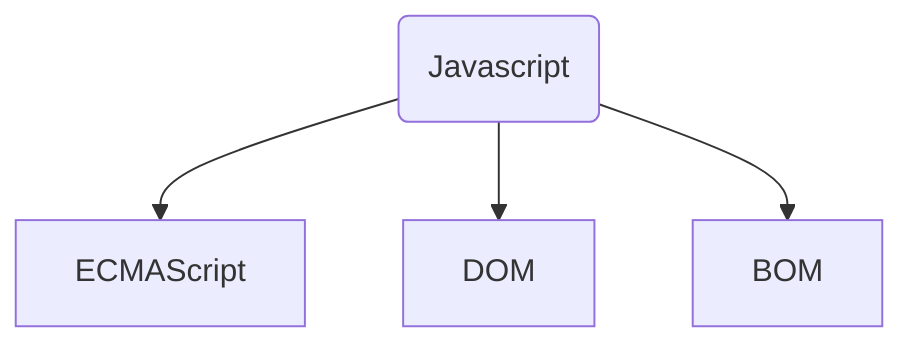
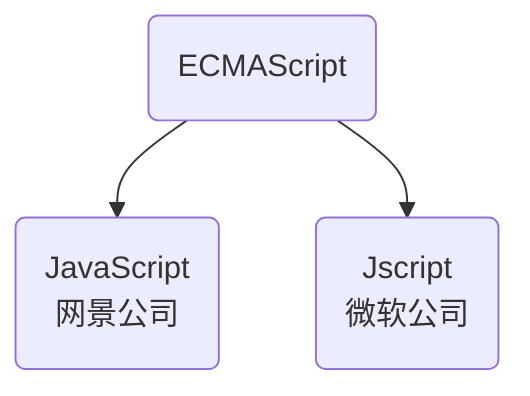
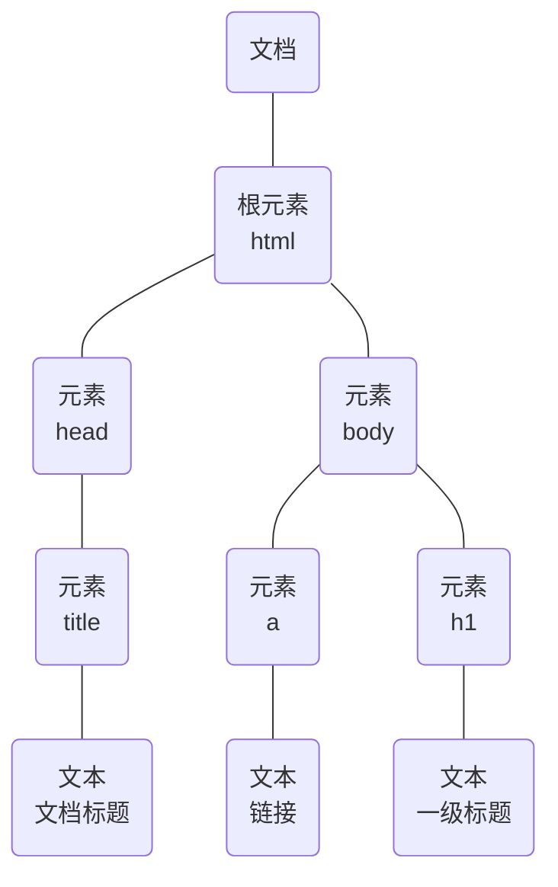
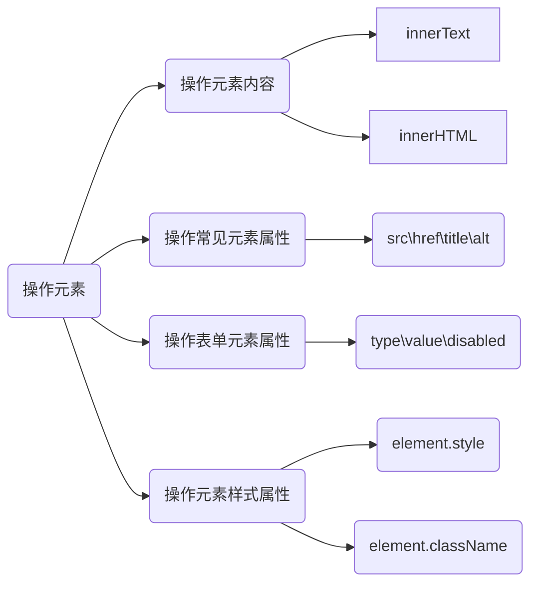
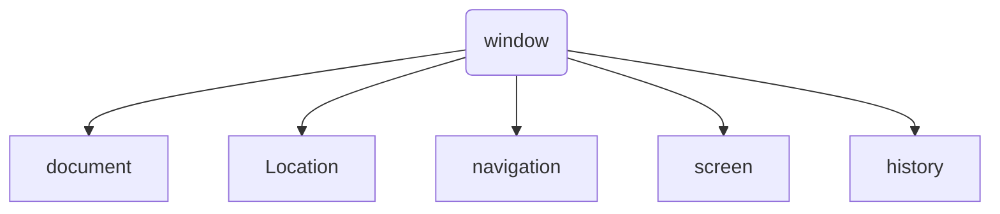

笔记内容来自于黑马程序员的的 pink 老师，感谢 pink 老师的悉心教导，所学终身受益！

[toc]

# 1 Javascript 基础

## 1.1 初识 Javascript 

 **Javascript 历史**

- 创始人：Brendan Eich 
- Brendan Eich 任职的网景公司最初命名为 LiveScript , 后来与 Sun 公司合作后将其改名为 Javascript

**Javascript 是什么**

<font color="red">Javascript 是基于对象和事件驱动的客户端脚本语言，主要用来 Web 前端开发</font>


**Javascript 的作用**

- 表单动态校验（密码强度检测） --- JS 产生最初的目的
- 网页特效
- 服务端开发（Node.js）
- 桌面程序（Electron）
- APP（Cordova）
- 控制硬件 --- 物理网（Ruff）
- 游戏开发（cocos2d-js）


**HTML/CSS 和 JS 之前的关系**

- HTML/CSS 标记语言都属于==描述类语言==，而 JS 脚本语言属于==编程类语言==

- HTML 决定结构 ，CSS 决定样式，JS 决定交互（或行为）
- JS 主要用来实现==业务逻辑和页面控制==


**JS 的语言特性**

- 解释型脚本语言：其源代码不需要编译就可以通过浏览器解释运行
- 面向对象
- 数据安全性：JS 不允许访问本地磁盘，也不能将数据存到网络服务器中，不允许对网络文档进行修改和删除，只能通过浏览器进行信息浏览和动态交互
- 跨平台性：JS 在运行时只依赖浏览器，与操作环境无关，只要有支持 JS 的浏览器就可以正确地运行
- 动态性：JS 是动态的，是通过事件驱动的

## 1.2 浏览器执行 JS 的过程

浏览器分成两部分：<font color="red">渲染引擎和 JS 引擎</font>

- 渲染引擎：用来解析 HTML 和 CSS ，俗称 内核，比如 Chrome 浏览器的 blink，老版本的 Webkit
- JS引擎：也称为 JS 解释器，用来读取网页中的 JS 代码，对其处理后运行，比如 Chrome 的V8

> 浏览器本身并不会执行 JS 代码，而是通过内置的 JS 引擎来逐行解释执行代码


## 1.3 JS 的组成



- ECMAScript 是 Javascript 的语法
- DOM (document object model)是页面文档对象模型
- BOM (broswer object model)是浏览器对象模型

### 1.3.1 ECMAScript 

**ECMAScript** 是由 ECMA国际（原欧洲计算机制造协会）进行标准化的一门编程语言，这种语言在 万维网上应用广泛，它往往被称为 Javascript 或 Jscript ，但实际上后两者是 ECMAScript 语言的实现和扩展



###  1.3.2 DOM -- 文档对象模型

**文档对象模型**是 W3C 组织推荐的处理可扩展标记语言的<font color="red">标准编程接口</font>，通过 DOM 提供的接口可以对页面上的各种元素进行操作（大小、位置、颜色等）


### 1.3.3 BOM -- 浏览器对象模型

**浏览器对象模型**提供了独立于内容的，可以与浏览器窗口进行互动的对象结构，通过 BOM 可以操作浏览器窗口，比如弹出框、控制浏览器跳转、获取分辨率等。


# 2 JS 语法编程

## 2.1 JS的三种书写位置

JS 有三种书写位置，分别为<font color="red">行内式、内嵌式和外链式</font>

### 2.1.1 行内式

行内式的 JS 直接写到元素的内部

分为两种：<font color="red">使用 "javascript:"调用和结合事件调用</font>

**结合事件驱动**

```html
<input type="button" value="确定" onclick="alert('点秋香')">
```

**使用 "javasript:" 调用**

```html
<a href="javascript:alert('Hello World!');">欢迎来到JS的世界</a>
```

- 可以单行或少量的 JS 代码写在HTML 标签的事件属性中，如 ： onclick
- 注意单双引号的使用：<font color="red">在 HTML 中我们推荐使用双引号，JS 中我们推荐使用单引号</font>
- 这种写法引号易错，引号多层嵌套时，非常容易混淆
- 不易阅读
- 特殊情况下使用


### 2.1.2 内嵌式

```js
<script>
    alert('Hello World!');
</script>
```

- 可以将多行代码写到 script 标签中
- 内嵌式可以用作学习时的演示方法

### 2.1.3 外链式

```js
<script src="my.js"></script>
```

- 引用外部 JS 文件的 script 标签中间不可以写代码
- 适合于 JS 代码量比较大的情况


## 2.2 JS 注释

### 2.2.1 单行注释

```js
// 我是一个注释
```

- 在 VS code 中的快捷键：Ctrl + /

### 2.2.2 多行注释

```js
/* 我是一串
注释 */
```

- 在 VS code 中的快捷键：Ctrl + Shift + /

## 2.3 JS 中输入输出语句

| 方法               | 说明                           | 归属   |
| ------------------ | ------------------------------ | ------ |
| `alert(msg)`       | 浏览器弹出警示框               | 浏览器 |
| `console.log(msg)` | 浏览器控制台打印输出信息       | 浏览器 |
| `prompt(info)`     | 浏览器弹出输入框，用户可以输入 | 浏览器 |


## 2.4 变量

### 2.4.1 什么是变量

<font color="red">变量是程序在内存中申请的一块用于存放数据的空间，其值可以发生改变。</font>

### 2.4.2 变量的使用

变量在使用时分为两步：

1. 声明变量
2. 赋值

**声明变量**

```js
//声明变量
var age; 
var my_name, gender;
var my_name="张三",gender="男",age=10;
var my_name=your_name="张三"
// 这里注意：name 在 JS 中属于保留关键字，我们在实际开发尽量不要使用
```

- var 是一个 JS 关键字，用来声明变量，我们使用 var 声明具有全局和局部作用域的变量

- 使用 var 可以一次声明一个或多个变量，多个变量之间使用逗号分隔

- 我们还可以通过 var 初始化一个变量

- **JS 中允许多变量同时初始化**

  > 声明一个变量并赋值，我们称之为<font color="red">变量的初始化</font>


### 2.4.3 变量的语法扩展

**更新变量**

一个变量被重复赋值后，它原有的值就就会被覆盖，变量值将以最后一次赋值为准，如下：

```js
var my_name = 'pink';
console.log(my_name);
// 更新变量
my_name = 'xzh';
console.log(my_name);
```

> JS 不同于 C 语言等强类型语言，可以重复声明，重复声明后面的值会替换前面声明的值，如下：
>
> ```js
> var my_name = 'pink';
> // 重复声明
> var my_name = 'xzh';
> ```

**声明变量的特殊情况**

| 情况                        | 说明                     | 结果                |
| --------------------------- | ------------------------ | ------------------- |
| `var age;console.log(age);` | 只声明，不赋值           | undefined           |
| `console.log(age);`         | 不声明，不赋值，直接使用 | 报错（not defined） |
| `age=10;console.log(age);`  | 不声明，只赋值           | 10                  |

:bell:小贴士

> 由于 JS 是一门解释型的脚本语言，会对代码进行逐行解释，如果其中一行报错，后面的语句也无法执行

### 2.4.4 变量的命名规范

JS 中的变量名<font color="red">由字母(A-Za-z)、数字(0-9)、下划线(_)、美元符号($)组成</font>

:heavy_exclamation_mark:<font color="red">**注意事项**</font>

- 严格区分大小写，`var app;` 和 `var App;` 是两个变量
- 不能以数字开头,18age 是错误的命名
- 不能使用关键字、保留字。例如：var、for、while
- 变量名最好具有一定的意义，便于后期开发人员的阅读、维护
- 遵循驼峰命名法或下划线分割法

```js
//这里我们对name这个特殊的关键字进行回顾
console.log(name);	//按变量提升的想法，原本的输出的结果为 undefined
```

但是实际上，最终的输出结果为：


结果为空，原因在于 `name` 在 JS 中是一个关键字，默认值是一个==空的字符串==

### 2.4.5 交换两个变量的值

#### 2.4.5.1 方法一:设置一个中间变量

```js
var temp,a,b;
temp = a;
a = b;
b = temp;
```

#### 2.4.5.2 方法二：利用 ES6的解构复制语句

```js
let a = 1, b = 2;
[a,b] = [b,a];
console.log(a,b);
```

### 2.4.6 变量小结

1. 为什么需要变量？
   - 因为我们的一些数据需要保存起来，以便修改和复用
2. 变量是什么？
   - 变量就是一个容器，用来存放数据的，方便我们以后使用里面的数据
3. 变量的本质是什么？
   - 在内存里申请一块空间，用于存储数据
4. 变量的使用方法
   - 我们在使用变量的时候，一定要先声明变量，然后进行赋值
5. 什么是变量的初始化？
   - 变量的初始化是指在声明一个变量的同时进行赋值

## 2.5 数据类型

### 2.5.1 数据类型简介

在计算机中，不同的数据所需占用的存储空间是不同，为了便于==把数据分成所需内存大小不同的数据，充分利用存储空间==，于是定义了不同的数据类型

变量是用来存储值的所在处，他们有名字和数据类型，变量的数据类型决定了如何将代表这些值的位存储到计算机的内存中，<font color="red">Javascript 是一种弱类型或者说动态语言</font>，这意味着<font color="red">不用提前声明变量的类型，在程序运行过程中，类型会被自动确定</font>

```js
var x = 6;			// x 为数字
x = "bill";			// x 为字符串
```

我们观察上述代码会发现，JS 中变量的数据类型是**可变**的，JS 用于动态数据类型，其变量的类型是由<font color="red"> JS 引擎根据 等于号（=）右边的变量值的数据类型来判断的</font>


### 2.5.2 简单数据类型

| 简单数据类型 | 说明                                                         | 默认值    |
| ------------ | ------------------------------------------------------------ | --------- |
| Number       | 数字型，包含整型值和浮点型值                                 | 0         |
| Boolean      | 布尔值类型，如 true 和 false，等价于 1 和 0                  | false     |
| String       | 字符串类型，字符串类型通常都由引号包裹                       | ""        |
| Undefined    | 当我们声明了一个变量但是却没有赋值时，此时变量的数据类型为 Undefined | undefined |
| Null         | `var a = null;`声明了变量 a 为控制                           | null      |

> 引用数据类型有：Object

#### 2.5.2.1 数字型

**数字类型进制**

最常见的进制有==二进制、八进制、十进制、十六进制==

```js
// 二进制的数字序列范围为: [0,1]
var num1 = 10; 		//对应十进制中的2
// 八进制以数字0开头，其数字序列范围为: [0-7]
var num2 = 010;		//对应十进制中的8
// 十六进制以数字0x开头，其数字序列范围为：[0-9]以及[a-f]或[A-F]
```


**数字型范围**

JS 中数值的最大值和最小值

```js
// 数字类型的最大值
console.log(Number.MAX_VALUE);
// 数字类型的最小值
console.log(Number.MIN_VALUE);
// 数字类型的无穷大
console.log(Infinity);
// 数字类型的无穷小
console.log(-Infinity);
// NaN, not a number
console.log('pink老师' - 100);  // 最终显示的结果为 NaN
```

最终的显示结果如下：


> NaN 是 JS 中的一种特有的数据类型，表示非数值，是指程序运行时由于某种原因发生计算错误，产生了没有意义的数值
>
> - NaN 是一个不明确，不固定的值，换言之，任意两个 NaN 都是不相等的


**isNaN() 函数**

`isNaN()`这个方法用来判断非数字，并且返回一个值，如果是数字返回的值是 false，如果不是数字返回的是 true

```js
console.log(isNaN('pink老师'));
```

在控制台显示的结果为：


#### 2.5.2.2 字符串类型 String

字符串类型可以是引号中的任意文本，其中值会被==引号==包裹

```js
// 正确定义方式
var my_string = '冰糖葫芦';
console.log(my_string);    
// 错误定义方式
var my_string1 = 鸡汤来咯;
console.log(my_string1);
```

执行结果如下：


除此之外，JS 可以用 单引号嵌套双引号，或者用双引号嵌套单引号（==外单内双，内单外双==）

```js
var my_str = "我是一个'高富帅'的程序员";
var my_str = '我是一个"高富帅"的程序员';
```


**转义字符**

**转义字符**通常也称为控制字符，它是以反斜线开头且不可显示的特殊字符，利用转义字符可以在字符串中添加一些不可显示的特殊字符或者避免引号匹配的问题

| 转义符 | 解释说明                   |
| ------ | -------------------------- |
| `\n`   | 换行符，n是 newline 的意思 |
| `\\`   | 斜杆                       |
| `\""`  | 双引号                     |
| `\t`   | 缩进                       |
| `\b`   | 空格，b 是 blank 的意思    |


#### 2.5.2.3 boolean 类型

JS 中的布尔类型的值有 true 、false 两种，当我们让布尔类型参与运算时，true = 1 , false = 0

```js
console.log(true+1);	// 结果为2
console.log(false+1);	// 结果为1
```


#### 2.5.2.4 Undefined 和 Null

一个变量被声明之后没有赋值会有一个默认值undefined(如果用加号连接，会出现相连的情况)

```js
var str;
console.log(str)            //undefined
var ude = undefined;        
console.log(ude + 'pink');  //undefinedpink
console.log(ude + 1);       //NaN
console.log(ude + 1);      //NaN
```

一个声明变量给 null 值，里面存的值为空

```js
var vari = null;
console.log('你好' + vari);     //你好null
console.log(11 + vari);         //11
console.log(true + vari);       //1
```

#### 2.5.2.5 typeof 检测变量的数据类型

```js
var data1 = 10.1;
console.log(typeof(data1)); //number
var data2 = 'pinkl老师';
console.log(typeof(data2)); // string
var data3 = null;   
console.log(typeof(data3)); // object
var data4 = undefined;
console.log(typeof(data4)); // undefined
var data5 = false;
console.log(typeof(data5)); // boolean
```

执行结果为：


> 除了 typeof，我们判断数据类型还可以使用 instanceof，它用于检测构造函数的 prototype 属性是否出现在某个实例对象的原型链上


## 2.6 字符串长度以及拼接

字符串的长度是由若干字符组成的，这些字符的数量就是字符串的长度。通过字符串的 length 属性可以获取整个字符串的长度

```js
var my_str = "我要成为一个程序猿！";	// 这里必须要使用中文的感叹号，否则会出现错误
console.log(my_str.length);
```

执行结果如下：


**字符串拼接**

- 多个字符串之间可以使用加号"+"进行拼接，其拼接方式为<font color="red">字符串 + 任何类型 = 拼接之后的新字符串</font>
- 拼接前会把字符串相加的任何类型转成字符串再拼接成一个新的字符串

```js
console.log('沙漠' + '骆驼');
console.log('pink老师' + '8');
console.log('12' + 12);
console.log(12 + 12 + '12');
```

执行结果如下：


<font color="red">"+"号拼接口诀：数值相加、字符相连</font>


**字符串拼接强化**

字符串与变量相连，需要将变量单独"拎出来"作为一个单项式存在

```js
var age = 18;
console.log('pink老师' + age + '岁');
```

- 我们不能将变量添加引号或者是将变量融入到字符串中，这些做法都是错误的


## 2.7 字面量

字面量是在源代码中一个固定值的表示法，通俗来说，就是字面量如何表达这个值

- 数字字面量：8,9,0
- 字符串字面量：'黑马程序员'，'大前端'
- 布尔字面量：true、false

## 2.8 数据类型转换

<font color="red">使用表单、prompt获取的数据默认是字符串类型的，此时就不能直接简单的进行加法运算，而需要转换变量的数据类型。</font>

数据类型转换就是指把一种数据类型的变量转换成另外一种数据类型

通常情况下，我们有如下三种转换方案：

- 转换为字符串类型
- 转换成数字类型
- 转换为布尔型

### 2.8.1 转换为字符串

| 方式               | 说明                         | 案例                                     |
| ------------------ | ---------------------------- | ---------------------------------------- |
| toString()         | 转成字符串                   | `var num = 10;var str = num.toString();` |
| String()强制转换   | 转成字符串                   | `var num = 10;var str = String(num);`    |
| **加号拼接字符串** | 和字符串拼接的结果都是字符串 | `var num = 10;num = num  + '';`          |

- toString() 和 String() 的使用方式不一样，toString() 是一个**方法**，而 String() 则属于**强制类型转换**
- 三种转换方式，我们更倾向于第三种使用加号拼接的方式来实现字符串转换的效果，这一种方式也被称为**隐式转换**

### 2.8.2 *转换为数字型

| 方式                       | 说明                             | 案例                |
| -------------------------- | -------------------------------- | ------------------- |
| `parseInt(string)`函数     | 将 string 类型转换成整数数值型   | parseInt('78')      |
| `parseFloat(string)`函数   | 将 string 类型转换成浮点数值类型 | parseFloat('78.78') |
| Number() 强制转换函数      | 将 string 类型转换成数值型       | Number('12')        |
| js 隐式转换(`-`、`*`、`/`) | 利用算术运算隐式转换成数值类型   | '12'-0              |

:bell:**parseInt 的妙用:去单位**

```js
// 利用 parseInt 我们可以取出数值后面的单位,但不能去除前面字符
console.log(parseInt('120px'));     // 120
console.log(parseInt('rem120px'));  //aN
```

如果我们使用 Number 来强制类型转换，则会有如下情况出现：

| 待转数据           | Number           |
| ------------------ | ---------------- |
| 纯数字字符串       | 转换为对应的数字 |
| 空字符串           | 0                |
| 数字开头的字符串   | NaN              |
| 非数字开头的字符串 | NaN              |
| null               | 0                |
| undefined          | undefined        |
| false              | 0                |
| true               | 1                |

:herb:**`parseInt()` 函数详解**

`parseInt()` 函数的语法格式如下：

```js
parseInt(string, radix)
```

- `string`：要被解析的值，类型是一个字符串，如果不是一个字符串，那么将会通过`toString()`函数将其解析为一个字符串
- `radix`：可选，表示前面的数值字符串的基数
- 返回值：是一个解析出来的十进制整数

**示例**

```js
parseInt('111', 2)	// 将 '111' 看做是二进制数，返回十进制数 => 7
```

:warning:注意：

- 如果输入的 string 以 `0x` 或 `0X` 开头，会被假定为 16 进制
- 如果输入的 string 以 `0` 开头，会被假定为 8 进制或者 10 进制，具体选择那个取决于实现，也就是 string 里面是否有出现超过 8 进制范围的数字。所以，我们推荐 **使用 `parseInt()` 时，一定要指定一个 radix**
- 如果以其他的开头，radix 默认是 10 进制


### 2.8.3 转换为布尔型

| 方式           | 说明                 |
| -------------- | -------------------- |
| Boolean() 函数 | 其他类型转换成布尔值 |

- 代表<font color="red">空、否定的值</font>会被转换为 false，如'0'、NaN、null、undefined
- 其余值都会被转换为 true

**示例：**

```js
console.log(Boolean(''));       // false
console.log(Boolean(0));        // false
console.log(Boolean(NaN));      // false
console.log(Boolean(null));     // false
console.log(Boolean(undefined));// false
console.log(Boolean('小白'));   // true
console.log(Boolean(12));       // true
```


## 2.9 拓展阅读值标识符、关键字、保留字

### 2.9.1 标识符

标识(zh&imacr;)符：就是指开发人员为变量、属性、函数、参数取的名字

> 标识符不能是关键字或保留字。


### 2.9.2 关键字

JS 中内置的具有特殊意义的字，不能再使用他们充当变量名、方法名。

包括：break、case、catch、continue、default、delete、do、else、finally、function、if、in、new、return、void、typeof等等


### 2.9.3 保留字

保留字实际上就是==预留==的关键字，虽然现在还不是关键字，但在未来可能成为关键字，同样不能使用他们当变量名或方法名，其中最为典型就是 let


## 2.10 运算符

运算符（operator）也被称为<font color="red">操作符</font>，适用于实现赋值、比较和执行算术运算等功能的符号

### 2.10.1 算法运算符

| 运算符 | 说明     |
| ------ | -------- |
| +      | 加运算   |
| -      | 减运算   |
| *      | 乘运算   |
| /      | 除运算   |
| %      | 取模运算 |
| ++     | 自增运算 |
| --     | 自减运算 |

**浮点数运算存在精度问题**

浮点数值的最高精度是 17 位小数，但是在进行算术运算时其精确度远远不如整数

```js
console.log(0.1 + 0.2);
console.log(0.00000007 * 100000000);  
```

执行结果为：


所以，我们可以得出一个重要的结论：<font color="red">不要直接判断两个浮点数是否相等</font>

**自增运算和自减运算**

自增和自减运算符都分为前置自增、自减和后置自增、自减

前置自增或自减的运算顺序是：<font color="red">先自增或自减，后返回值</font>

后置自增或自减的运算顺序是：<font color="red">先返回值，后自增或自减</font>

<font color="red">前置和后置如果单独使用，那么效果是相同的</font>

### 2.10.2 比较运算符

概念：比较运算符（关系运算符）是<font color="red">两个数据进行比较时所使用的运算符。</font>比较运算符后，会返回一个布尔值（true / false）作为比较运算的结果。

| 运算符 | 说明                               |
| ------ | ---------------------------------- |
| <      | 小于号                             |
| >      | 大于号                             |
| >=     | 大于等于号                         |
| <=     | 小于等于号                         |
| ==     | 判断号（会转型）                   |
| !=     | 不等号                             |
| ===    | 恒等于（要求值和数据类型都一致）   |
| !==    | 不恒等于（要求值和数据类型都一致） |

:bell:`==`和 `===` 的区别

```js
console.log(18 == '18');    // true
console.log(18 === '18');   // false
```

其实也就是：`==`只对值进行判断，在判断的时候会进行转换数据类型，转换之后如果值相等，那么就判断为 true ，反之为 false；而`===`会同时对值和数据类型进行判断，如果其中有一项不满足，那么就返回 false

### 2.10.3 逻辑运算符

概念：逻辑运算符是用来进行布尔值运算的运算符，其返回值也是布尔值，后面开发中经常用于多个条件的判断。

| 逻辑运算符 | 说明   |
| ---------- | ------ |
| &&         | 逻辑与 |
| \|\|       | 逻辑或 |
| ！         | 逻辑非 |

**短路运算（逻辑中断）**

短路运算的原理：当有多个表达式（值）时，左边的表达式值可以确定结果时，就不再继续运算右边的表达式的值

1. 逻辑与
   - 语法：表达式1 && 表达式2
   - 如果第一个表达式的值为真，则返回表达式2
   - 如果第一个表达式的值为假，则返回表达式1
2. 逻辑或
   - 语法：表达式1 || 表达式2
   - 如果第一个表达式为真，则返回表达式1
   - 如果第一个表达式为假，则返回表达式2

示例：

```js
var num = 0;
console.log(123 || num++);
console.log(num);
```

执行结果如下：


### 2.10.4 赋值运算符

概念：用来把数据赋值给变量的运算符

| 赋值运算符 | 说明                       |
| ---------- | -------------------------- |
| =          | 直接赋值                   |
| +=、-=     | 加、减 一个数后再赋值      |
| *=、/=、%= | 乘、除、取模一个数后再赋值 |

### 2.10.5 运算符优先级

| 优先级 | 运算符     | 顺序                     |
| ------ | ---------- | ------------------------ |
| 1      | 小括号     | （）                     |
| 2      | 一元运算符 | ++ 、--、 ！             |
| 3      | 算术运算符 | 先 * 、 /、 % 后 +、-    |
| 4      | 关系运算符 | >、 >=、 <、 <=          |
| 5      | 相等运算符 | `==`、`!=`、`===`、`!==` |
| 6      | 逻辑运算符 | 先 && 后 \|\|            |
| 7      | 赋值运算符 | =                        |
| 8      | 逗号运算符 | ，                       |

- 一元运算符中<font color="red">逻辑非优先级很高</font>
- 逻辑与的运算符比逻辑或的优先级高


# 3 JS 流程控制

## 3.1 流程控制

流程控制主要有三种结构，分别是<font color="red">顺序结构、分支结构和循环结构</font>，这三种结构代表三种代码的执行顺序。


## 3.2 顺序结构

顺序结构是程序中最简单、最基本的流程控制，它没有特定的语法结构，程序会按照<font color="red">代码的先后顺序，依次执行</font>，程序中大多数的代码都是这样执行的

## 3.3 分支结构 

由上到下执行代码的过程中，根据==不同的条件==，执行==不同的路径代码==，从而得到==不同的结果==

JS 中提供了两种分支结构语句

- if…else 语句
- switch 语句

### 3.3.1 if…else 语句

语法如下：

```js
if(条件表达式1){
	语句块1;
}else if(条件表达式2){
	语句块2;
}else{	
	语句块3;
}
```

**案例：判断闰年**

```js
var year = prompt("请输入判断年份:");
if((year % 400 === 0) || (year % 100 !== 0 && year % 4 === 0)){
    console.log(year + '是一个闰年');
} else {
    console.log(year + '是一个平年');
}
```


### 3.3.2 三元运算符

```js
// 语法格式
条件表达式 ？ 表达式1 : 表达式2;
```

**示例1：使用三元运算符来判断闰年与否**

```js
var year = prompt("请输入判断年份:");
var str = (year % 400 === 0) || (year % 100 !== 0 && year % 4 === 0) ? year + '是一个闰年': year + '是一个平年';
console.log(str);
```


### 3.3.3 switch 语句

switch 语句也是多分支语句，功能等同于 if…else 语句，但是不同之处在于 ，switch 语句只能==针对表达式的值做出判断==，从而决定执行那一段代码

```js
switch(表达式){
	case 值1:
		语句块1;[break;]
    case 值2:
		语句块2;[break;]
	…
    case 值n:
		语句块n;[break;]
	default:
		语句块n+1;[break;]
}
```

我们也可以将分支条件进行整合，例如：“

```js
switch(表达式) {
	case 值1:
	case 值2:
		语句块;
		[break;]
}
```

:heavy_exclamation_mark:注意事项：

- switch 里面的值通常是整数或字符串常量
- break 语句用来中止程序继续执行，如果不添加，啥问题出 语句一直往下执行，直到遇到 break 或 全部执行完
- switch 里面的值和 case 后面的值 必须是全等才能匹配成功，就是说其值和类型都必须相同

### 3.2.4 if…else 语句和 switch 语句的区别

1. 一般情况下，他们两个语句可以相互转换
2. switch 语句通常用来处理 case 比较确定值的情况，而 if…else 语句更加灵活，常用与哦安短范围
3. 当分支比较少时，if…else 语句的执行效率比 switch 语句高
4. 当分支比较多时，switch 语句的执行效率比较高，并且结构也更加清晰

## 3.4 循环结构

在程序中，一组<font color="red">被重复执行的语句被称之为循环体</font>，能否继续执行取决于循环的<font color="red">终止条件</font>。由循环体以及循环的终止条件组成的语句，被称之为<font color="red">**循环语句**</font>

在 JS 中，主要有三种类型的循环语句

- for循环
- while 循环
- do…while 循环

### 3.4.1 for 循环

for 循环的语法格式如下：

```js
for(初值表达式;循环条件表达式;循环变量更新表达式){
	//循环体
}
```


**断点调试**

<font color="red">断点调试可以帮助我们观察程序的运行过程</font>

Chrome 中按F12 → sources → 找到需要调试的文件 → 在程序的某一行设置断点

- Watch：监视，通过 watch 可以监视变量的值的变化
- F11：程序单步执行

:heavy_exclamation_mark:注意事项

- 当我们设置好断点后，必须重新刷新浏览器才调试才能起效果

**使用断点调试来观察 for 循环的执行步骤**

1. 现在 VS code 中加入下面这一段循环代码

   ```js
   for(var i = 1;i < 100;i++){
       console.log('我是pink老师');
   }
   ```

2. 打开浏览器，找到 sources(或源代码)，双击选中需要调试的行

   

3. F5 刷新浏览器

   

   > 有浅蓝色底色的即为当前正在运行代码

4. 添加观察对象

   

5. 接着按 F11 跟进调试

6. 调试完成后，再双击取消选中之前调试的行即可

**结论：**

我们通过调试 for 循环的执行过程可知其执行顺序为：

初值表达式 → <u>循环条件表达式 → 循环体 → 循环变量更新表达式</u> → <u>循环条件表达式 → 循环体 → 循环变量更新表达式</u> → … → 循环结束


**循环经典案例：打印九九乘法表**

```js
for(var i=1;i<=9;i++){
    for(var j=1;j<=i;j++){
        // console.log(j + '*' + i + '=' + i*j + '\t');
        // 由于 console.log 每打印一句会自动换行，因此我们采取另一种写法
        str += j + 'x' + i + '=' + i*j + '\t';
    }
    str += '\n';
}
```

执行结果如下：


### 3.4.2 while 循环

while 循环可以在条件表达式为真的前提下，循环执行循环体，直到表达式中的条件为 false 时退出循环，其语法结构如下：

```js
while(条件表达式){
	//循环体
}
```

**注意事项：**

- 循环体代码执行完毕后，程序会继续判断执行条件表达式，如果条件仍为 true，则会继续执行循环体，直到循环条件为 false 时，整个循环过程才会结束


### 3.4.3 do…while 循环

do…while 循环语法如下：

```js
do {
	// 循环体
}while(条件表达式);
```

注意事项：

- do…while 循环和 while 循环的不同之处在于：do…while 是先执行循环体，再来进行判断循环条件，而 while 循环是先判断循环条件再来执行循环体，也就是 do…while  循环里面的循环体至少执行一次

### 3.4.4 循环控制语句

在 JS 中具有两个关键字用来进行循环控制的，分别是`break`和`continue`

- `continue` 关键字用于立即==跳出本次循环==，继续下一次循环，而本次循环体中`continue`后面的代码块就会少执行一次

- `break`关键字用于立即跳出整个循环


# 4 命名规范以及语法格式

## 4.1 标识符命名规范

- 变量、函数的命名必须要有意义
- 变量的名称一般用名词
- 函数的名称一般用动词

## 4.2 操作符规范

- 操作符左右两侧尽量各保留一个空格


## 4.3 其他规范

if 和判断条件外的大括号以及 for 和 判断条件外的大括号尽量保留有衣个空格

```js
if (true) {
	
}
for (var i = 0;i <= 100;i++) {
	
}
```


# 5 数组

## 5.1 数组的概念

数组是指<font color="red">一组数据的集合</font>，其中每个数据被称作元素，在数组中可以存放任意类型的元素。


## 5.2 创建数组

JS 中创建数组有两种方式：

- 利用 new 创建数组
- 利用数组字面量创建数组

### 5.2.1 利用 new 创建数组

```js
var arr = new Array();	// 创建一个新的空数组
```


### 5.2.2 利用 字面量 创建数组

```js
// 1. 使用数组字面量方式创建空的数组
var arr = [];
// 2. 使用数组字面方式创建带初始值的数组
var arr = ['小白', '小黑', '大黄'];
```


## 5.3 访问数组元素

### 5.2.1 通过数组的索引

<font color="red">索引（下标）</font>：用来访问数组元素的序号（数组下标从0开始）

> 数组可以通过索引来访问、设置、修改对应的数组元素，我们可以通过"数组名[索引]"的形式来获取数组中的元素

### 5.2.2 遍历数组

如果我们遍历数组，那么我们可以通过==循环==实现

<font color="red">遍历：就是把数组中的每个元素从头到尾都访问一次</font>

```js
var arr = ['red','green','pink','blue'];
for (var i = 0;i < arr.length;i++) {
	console.log(arr[i]);
}
```

上面有一点需要记住的就是：我们如果在不知道数组中元素的个数情况下，想要遍历一遍数组，可以通过 `arr.length `的 length 方法来动态获取数组的长度。


## 5.4 数组中新增元素

### 5.4.1 通过修改 length 长度新增数组元素

- 可以通过修改 length 长度来实现数组扩容的目的
- length 属性是可读写的

```js
var arr = ['red','green','pink'];
arr.length = 5;	// 通过修改 length 的值来试下动态扩容
console.log(arr);
console.log(arr[3]);
console.log(arr[4]);
```

执行结果如下：


> "prototype"指的是原型的意思

### 5.4.2 通过修改数组索引号的形式追加数组元素

```js
var arr = ['red','green','yellow'];
arr[3] = 'white';
console.log(arr);
```

- 修改数组索引的方式除了可以实现追加元素之外，还可以实现修改元素
- 不能直接给数组名赋值，否则会覆盖以前的数据


## 5.5 *数组方法

### 5.5.1 静态方法

**01 Array.isArray()**

用于判断传入的参数是否为一个数组

```js
Array.isArray([1, 2, 3]);  // true
Array.isArray({foo: 123}); // false
Array.isArray('foobar');   // false
Array.isArray(undefined);  // false
```


**02 Array.from()**

对一个类似数组或可迭代对象创建一个新的、浅拷贝的数组实例

```js
console.log(Array.from('foo'));
// Expected output: Array ["f", "o", "o"]

console.log(Array.from([1, 2, 3], x => x + x));
// Expected output: Array [2, 4, 6]
```


### 5.5.2 实例方法

**01 concat()** 

连接两个或多个数组，不改变原来的数组

```js
let arr1 = [1, 2, 3];
let arr2 = [4, 5, 6];
let arr3 = [7, 8, 9];
let arr4 = arr1.concat(arr2, arr3);
console.log(arr4);
```


**02 join()**

将数组转换为字符串，可以指定分隔符，默认的分隔符为逗号

```js
let arr = [1, 2, 3];
console.log(arr.join());    // 1,2,3
console.log(arr.join(';')); // 1;2;3
```


**03 push() && unshift()**

- `push()` 用于向数组末尾添加一个或多个元素，并返回新的长度
- `unshift()` 用于向数组的开头添加一个或多个元素，并返回新的长度


**04 shift() && pop()**

- `shift()` 删除并返回数组的第一个元素
- `pop()` 删除并返回数组的最后一个元素


**05 sort()**

用于数组排序，默认按升序进行排序，也可以根据传入的回调自定义排序

```js
let arr = [{
    name:'Tom',
    age:18
},{
    name:'Bob',
    age:22
},{
    name:'Alice',
    age:19
}];

arr.sort((a, b) => a.age - b.age);  // 对数组中元素按照年龄进行升序
arr.sort((a, b) => b.age - a.age);  // 对数组中元素按照年龄进行降序
```


**06 reverse()**

反转数组


**07 splice()** 

通过删除或替换现有元素或者原地添加新的元素来修改数组，并以数组形式返回被修改的内容，此方法会改变原数组。

```js
splice(start)
splice(start, deleteCount)
splice(start, deleteCount, item1)
splice(start, deleteCount, item1, item2, itemN)
```

**示例**

```js
const months = ['Jan', 'March', 'April', 'June'];
months.splice(1, 0, 'Feb');
// Inserts at index 1
console.log(months);
// Expected output: Array ["Jan", "Feb", "March", "April", "June"]

months.splice(4, 1, 'May');
// Replaces 1 element at index 4
console.log(months);
// Expected output: Array ["Jan", "Feb", "March", "April", "May"]
```


**08 indexOf() && lastIndexOf()**

- `indexOf()` 返回在数组中待查找元素的第一个索引位置
- `lastIndexOf()` 返回在数组中待查找元素的最后一个索引位置

```js
indexOf(searchElement)
indexOf(searchElement, fromIndex)

lastIndexOf(searchElement)
lastIndexOf(searchElement, fromIndex)
```


**09 find() && findIndex()**

es6 新增方法，返回满足测试函数的第一个元素

```js
const array1 = [5, 12, 8, 130, 44];

const found = array1.find(element => element > 10);

console.log(found);
// Expected output: 12
```


## 案例1：数组去重

### 方法一：双重 for 循环，利用 splice 函数去重

```js
var arr = ['pink','green','pink','orange','black','pink','blue','blue','blue','skyblue'];
for (var i = 0; i < arr.length; i++) {
    for (var j = i + 1; j < arr.length; j++) {
        if (arr[i] == arr[j]) {
            arr.splice(j,1);
            j--;   // 由于将j所在的位置元素删除，所以通过j--和j++来判断j的下一个元素
        }
    }
}
console.log(arr);
```

当我们缺少`j--`并出现三个相同数据以上数据相连 ，显示结果如下：


### 方法二：ES6常用方法，set 去重


## 案例2：翻转数组

### 方法一：利用 reverse 方法

```js
var arr = [1,2,3,4,5,6,7,8,9,10,11];
console.log(arr.reverse());
```

> 这种方式：优雅！


### 方法二：循环遍历同时进行反转

```js
var arr = [1,2,3,4,5,6,7,8,9,10,11];
for (var i = 0; i < parseInt(arr.length/2); i++) {  
    // 这里特别需要注意，js 由于是弱类型语言，arr.length/2 这里的计算结果为5.5,而不是 5
    arr[i] = arr[i]^arr[arr.length-i-1];
    arr[arr.length-i-1] = arr[i]^arr[arr.length-i-1];
    arr[i] = arr[i]^arr[arr.length-i-1];
}

console.log(arr);
```


## 案例3：冒泡排序

冒泡排序：是一种盘排序算法，和冒泡一样，将小的元素（或大的元素）"浮"上来，将大的元素（或小的元素）沉下去

```js
var arr = [10,9,8,7,6,5,4,3,2,1];
for (var i = 0; i < arr.length - 1; i++) {  // 外层管趟数
    for (var j = 0; j < arr.length -i - 1; j++) {   // 里层管交换次数
        if (arr[j] > arr[j+1]) {
            var temp = arr[j];
            arr[j] = arr[j+1];
            arr[j+1] = temp;
        }
    }
}
console.log(arr);
```


# 6 函数

## 6.1 函数的概念

函数：<font color="red">就是封装了一段可被重复调用执行的代码块。</font>通过函数可以实现大量代码的重复使用。


## 6.2 函数的声明和调用

函数的声明语法如下：

```js
function 函数名([参数1],[参数2]…) {
	// 函数体
    [return 表达式;]
}
```


调用函数的语法如下：

```js
// 调用函数
函数名([参数1],[参数2],…);
```


:heavy_exclamation_mark:<font color="red">注意：声明函数本身并不会执行代码，只有调用函数时才会执行函数体代码</font>


## 6.3 形参和实参

- 形参：在声明函数的小括号中的参数为形参

- 实参：在函数调用的小括号中的参数是实参

| 参数 | 说明                                                       |
| ---- | ---------------------------------------------------------- |
| 形参 | 形式上的参数，函数定义的时候传递的参数，当前并不知道是什么 |
| 实参 | 实际上的参数，函数调用的时候传递的参数，实参是传递给形参的 |

<font color="red">参数的作用：在函数的内部，某些值是不固定的，我们可以通过参数在调用函数时传递不同的值进去</font>


**函数形参和实参的匹配问题**

- 实参的个数 = 形参的个数：正常输出
- 实参的个数 > 形参的个数：会取到形参的个数
- 实参的个数 < 形参的个数：多余的形参定义为 undefined 


## 6.4 函数的返回值 return

函数的返回值是指<font color="red">函数在调用后获得的数据</font>，我们通过 `return` 语句<font color="red">得到返回值并退出函数</font>

注意事项：

- `return` 除了得到返回值外，还可以用于中止函数
- 如果没有 `return`，那么返回值是 undefined 

 

**break、continue、return 之间的区别**

- `break`：结束当前循环体
- `continue`：跳出本次循环，继续执行下次循环
- `return`：不仅可以退出循环，还能够返回 `return ` 语句中的值，同时还可以结束当前函数体内的代码


## 6.5 arguments 的使用

当我们不确定实参传递的个数时候，我们可以通过 arguments 来获取。在 JS 中，arguments 实际上它是当前函数的一个<font color="red">内置对象</font>。所有函数都内置了一个 arguments 对象， arguments 对象中<font color="red">存储了传递的所有实参</font>

示例：

```js
function fn() {
    console.log(arguments);
    console.log(arguments.length);
    console.log(arguments[2]);
}
fn(1,2,3);
```

执行结果如下：


<font color="red">arguments 展示形式是一个伪数组</font>，伪数组具有以下形式：

- 具有 length 属性
- 按索引方式存储数据
- 不具有数组的 push、pop 等方法


## 6.6 函数的两种声明方式

- 利用函数关键字自定义函数（即是我们一般使用 function 声明函数的方法）

- 函数表达式（匿名函数）

  ```js
  var 变量名 = function(){
  	// 函数体
  }
  ```

匿名函数示例：

```js
var fun = function(aru) {
	console.log(aru);
}
fun('pink老师')
```


## 6.7 函数的作用域

### 6.7.1 作用域概述

通常来说，一段程序代码中所用到的名字并不总是有效和可用的，而限定这个名字的<font color="red">可用性代码范围</font>就是这个名字的<font color="red">作用域</font>。作用域的使用提高了程序逻辑的局部性，增强了程序的可靠性，减少了名词冲突。

- ES6 之前分为：全局作用域 、局部作用域
  - 全局作用域：整个 script 标签内的程序或者是一个单独的 js 文件
  - 局部作用域：也称为函数作用域，在函数内部就是局部作用域，这个代码的名字只在函数内部其效果
- ES6 之后新增：块级作用域
  - 块级作用域：位于花括号`{}`内的程序代码


### 6.7.2 变量的作用域

变量的作用域：我们按照数据作用域的不同可以分为全局变量、局部变量、块级变量

- 全局变量：在全局作用域下的变量
  1. 在函数体外声明的变量
  2. ~~在函数内省略 var 关键字声明的变量~~
- 局部变量：在局部作用域下的变量
  1. 在函数体内利用 var 关键字定义的变量称为局部变量
  2. 注意：<font color="red">如果局部变量和全局变量同名，那么在函数体内，只有局部变量是有效的</font>
- 块级变量：在块级作用域下的变量，它仅在包含它的最小代码块中有效
  1. 用 ES6 中标准中新增的 let 关键字声明的变量

从**执行效率**的角度：

- 全局变量只有在浏览器关闭的时候才会销毁，比较占用内存资源
- 局部变量在当我们程序执行完毕就会销毁，比较节约内存资源


**示例：**

```js
if (3 < 5) {
    var num = 10;
}
console.log(num);
// num 是全局变量
if (3 < 5) {
    let aru = 10;
}
console.log(aru);
// aru 是块级变量
```

执行结果如下：


**作用域链**

内部函数访问外部函数的变量，采取的是链式查找的方式来决定取哪个值，这种结构我们称为作用域链

```js
// 全部作用域
var num = 10;
// 第一层局部作用域
function fn() {
    var num = 20;
    // 第二层局部作用域
    function fun() {
        console.log(num);
    }
    fun();
}
fn();
```

执行结果如下：


作用域链分析图：


## 6.8 预解析

JS 代码是由浏览器中的 JS 解析器来执行的。JS 解析器在运行 JS 代码的时候，分成两步：<font color="red">预解析和代码执行</font>

预解析：<font color="red">JS 引擎会把 JS 里面中所有 var 还有 function 提升到当前作用域的最前面</font>，代码执行的时候，会按照代码书写的顺序从上往下执行

预解析分为==变量预解析（变量提升）==和==函数预解析（函数提升）==

- 变量提升：就是把所有的变量声明提升到当前的作用域前面，但是==不会提升赋值操作==
- 函数提升：就是把所有的函数提升到前面作用域的前面，不调用函数

**示例**

**分析1**：将变量声明写到变量输出的后面

```js
console.log(num);
var num = 10;
```

执行结果：


问：为什么不是报错：<font color="red">"num is not defined"</font>

答：因为存在变量提升，JS 解析器会将变量的声明的提到最前面，但不会将赋值操作带上，所以上述代码和下面的代码的作用是一样

```js
var num;
console.log(num);
num = 10;
```


**分析2：**将匿名函数调用放在匿名函数的声明之前

```js
fun();
var fun = function() {
    console.log(22);
}
```

执行结果如下：


原因很简单，也是由于变量提升，代码作用同下：

```js
var fun;
fun(); // 此时 fun 还没有接受到匿名函数，只是一个普通变量
var fun = function() {
    console.log(22);
}
```


**分析3：**将函数调用放在函数声明之前

```js
fun();
function fun() {
    console.log(22);
}
```

执行结果如下：


程序正常执行，就是由于函数提升，会先将函数的声名提到最前面


预解析案例1：

```js
var num = 10;
fun();
function fun() {
	console.log(num);
	var num = 20;
	console.log(num);
}
```

先进行预解析，转化成如下代码：

```js
var num;
function fun() {
	console.log(num);
	var num = 20;
	console.log(num);
}
fun();
```

执行结果如下：


# 7 对象

## 7.1 什么是对象

在 JS 中，对象是一组==无序==的==相关属性和方法==的集合，所有的事物都是对象，例如字符串、数值、数组、函数等

对象是由==属性==和==方法==组成的

- 属性：事务的行为，在对象中用属性来表示
- 方法：事物的行为，在对象中用方法来表示


## 7.2 为什么需要对象

保存一个值时，我们可以使用变量；保存多个值（一组值）时，可以使用数组；保存一个事物的完整信息，我们就需要用到对象

> 之所以，保存一个事物的完整信息，我么用对象，而不用数组是因为数组里面的元素是无序，类似于集合，我们无法建立一一对应的关系，可能会造成混淆，而对象类似于字典，我们可以通过创建对象，能够明确地知道值所对应的属性是什么


## 7.3 创建对象的三种方式

在 JS 中，现阶段我们有三种创建对象（object）的方式：

- 利用**字面量**创建对象
- 利用 **new Object** 创建对象
- 利用**构造函数**创建对象

### 7.3.1 利用字面量创建对象

对象字面量：就是花括号`{}`里面包含了表达这个具体事务（对象）的属性和方法

- 对象里面的元素，我们采取键值对的形式，它们之间使用逗号分隔
- 调用对象的属性或方法，我们采取：
  - `对象名.属性名` 或 `对象名.方法名()`的形式
  - `对象名['属性名']` 或 `对象名['方法名()']`

```js
// 创建空对象
var obj = {};

// 创建对象并调用
var obj = {
    uname: 'zhang san',
    age: 18,
    gender: 'male',
    sayHi: function() {
        console.log('hi');
    }
};
console.log(obj.uname);
console.log(obj.sayHi());
```


### 7.3.2 变量、属性、函数、方法的区别

- 变量和属性是相同的，它们都是用来存储数据的
  - 变量单独声明并赋值，使用的时候直接写变量名
  - 属性在对象里面不需要声明，使用的时候必须 `对象.属性` 或 `对象['属性']`
- 函数和方法都是用于实现某种功能
  - 函数是单独声明的，并且调用的函数名是单独存在的
  - 方法在对象里面，调用的时候使用 `对象.方法()`


### 7.3.2 利用 new Object() 创建对象

语法如下：

```js
var obj = new Object();
// 添加属性
obj.name = 'zhang san';
obj.age = 18;
obj.gender = 'male';
obj.sayHi = function() {
    console.log('hi');
}
```


### 7.3.3 利用构造函数创建对象

无论是利用 new Object 还是字面量的形式创建对象，一次都只能创建一个对象，如果我们想要一次创建多个函数，那么我们可以使用构造函数的方法

<font color="red">构造函数就是把对象里面的一些相同的属性和方法抽象出来封装到函数里面</font>

构造函数：是一种特殊的函数，主要用来初始化对象，即为对象成员变量赋初值，它总是与 new 运算符一起使用，我们把对象中一些公共的属性和方法抽取出来，然后封装到这个函数里面。

**创建构造函数的语法如下：**

```js
function 构造函数名(参数) {
	this.属性 = 值;
	this.方法 = function(){}
}
```

- 构造函数的函数名首字母需要大写
- 构造函数不需要 return 就可以返回结果

**案例**：创建"四大天王"的对象

- 相同的属性：名字、年龄、性别

- 相同的方法：唱歌

```js
// 创建构造函数
function Star(uname, age, gender) {
    this.uname = uname;
    this.age = age;
    this.gender = gender;
}
var ldh = new Star('刘德华',17,'男');
var zxy = new Star('张学友',19,'男');
console.log(ldh.uname, ldh.age, ldh.gender);
console.log(zxy.uname, zxy.age, zxy.gender);
```

执行结果如下：

```js
// 创建构造函数
function Star(uname, age, gender) {
    this.uname = uname;
    this.age = age;
    this.gender = gender;
    this.sing = function(aru) {
        console.log(aru);
    }
}
// 初始化数据
var ldh = new Star('刘德华',17,'男');
var zxy = new Star('张学友',19,'男');
// 打印数据
console.log(ldh.uname, ldh.age, ldh.gender);
console.log(zxy.uname, zxy.age, zxy.gender);
// 使用方法
ldh.sing('十七岁');
zxy.sing('李香兰');
```

执行结果如下：


### 7.3.4 构造函数和构造对象

构造函数泛指某一大类，类似于 java 里面的类（class）,对象特指是一个具体的事物

<font color="red">我们利用构造函数创建对象的过程，我们也称为对象的实例化</font>

- 构造函数，如 Stars()，抽象了对象的公共部分，封装到了函数里面，它泛指某一大类
- 创建对象，如 new Stars()，特指某一个，<font color="red">通过 new 关键字创建对象的过程我们称之为对象的实例化</font>

**new 构造函数的过程**

1. new 构造函数可以在内存中创建一个空对象
2. this 指向刚才创建的空对象
3. 执行构造函数里面的代码，给这个空对象添加属性和方法
4. 返回这个对象（所以构造函数里面不需要 return ）

## 7.4 遍历对象

<font color="red">for…in 语句</font>用于对数组或者对象的属性进行循环操作

语法格式如下：

```js
for (变量 in 对象) {
	
}
```

**示例：**

```js
function Star(uname, age, gender) {
    this.uname = uname;
    this.age = age;
    this.gender = gender;
}
// 初始化数据
var ldh = new Star('刘德华',17,'男');
var zxy = new Star('张学友',19,'男');
// 使用for…in 进行循环遍历
for (var k in ldh) {
    console.log(k,ldh[k]);  // 注意这里只能使用中括号来获取属性值
}
```

执行结果如下：


> 我们也可以通过 for…in 来获取方法，但一般情况下，我们并不会通过 for…in 来获取方法


## 7.5 JS内置对象

### 7.5.1 内置对象的概念 

JS 中对象分为三种：<font color="red">自定义对象、内置对象、浏览器对象</font>

 - 前面两种对象是 JS  基础内容，属于 ECMAScript ；第三个浏览器对象属于 JS 独有
 - 内置对象就是指 JS 语言自带的一些对象，这些对象供开发者使用，并提供了一些常用的或是最基本而必要的功能（属性和方法）
 - JS 中给我们提供的内置对象包括了：Math、Date、Arrary、String等

为了开发方便，我们很多时候需要通过查阅文档来知道可以使用那些属性和方法，这里提供 [MDN](https://developer.mozilla.org/zh-CN/)

### 7.5.2 内置对象Math

| 方法                         | 说明               |
| ---------------------------- | ------------------ |
| Math.PI                      | 圆周率             |
| Math.max(num1,[num2,num3,…]) | 最大值             |
| Math.min(num1,[num2,num3,…]) | 最小值             |
| Math.pow(base,exponent)      | 返回基数的指数次幂 |
| Math.abs(x)                  | 返回x的绝对值      |
| Math.floor(x)                | 向下取整           |
| Math.ceil(x)                 | 向上取整           |
| Math.random()                | 生成随机数         |

**这里我们着重讲一下 `Math.random()`**

`Math.random()`函数随机返回一个==浮点==，伪随机数的范围在 [0,1)，拓展公式：

```js
// 如果我们想要得到两个数之间的随机整数，并且包含这两个整数
// 方式1
Math.floor(Math.random() * (max- min + 1)) + min;

// 方式2
parseInt(Math.random()*(max - min + 1) + min, 10)
```


### 7.5.3 封装自己的数学对象

**demo：**自己仿照 Math 对象自己封装一个 myMath 对象

```js
var myMath = {
    PI: 3.1415195354,
    max: function() { 
        var MAX = arguments[0];
        for (var i = 1; i < arguments.length; i++) {
            if (arguments[i] > MAX) {
                MAX = arguments[i];
            }
        }
        return MAX;
    },
    min: function() {
        var MIN = arguments[0];
        for (var i = 1; i < arguments.length; i++){
            if(arguments[i] < MIN) {
                MIN = arguments[i];
            }
        }
        return MIN;
    }
}
// 测试调用
console.log(myMath.PI);

console.log(myMath.max(1,5,9));

console.log(myMath.min(1,5,9));
```

### 7.5.4 日期对象

前面的 Math 并不是一个构造器，但是 Date 是一个构造器，我们只能调用 Date 构造函数来实例化日期对象

```js
//创建 Date，如果没有参数，则会返回当前系统的时间
var now = new Date();
console.log(now);
```

执行结果如下：


**Date() 构造函数的参数**

如果括号里面有时间，就返回参数里面的时间，例如日期格式字符串为

'2022-09-13' 或 '2022/9/13'


**日期对象中的一些常见方法名**

| 方法名        | 说明                      |
| ------------- | ------------------------- |
| getFullYear() | 获取当前年份              |
| getMonth()    | 获取当前月份（0-11）      |
| getDate()     | 获取当天日期（0-31）      |
| getDay()      | 获取星期几（周日0-周六6） |
| getHours()    | 获取当前小时              |
| getMinutes()  | 获取当前分钟              |
| getSeconds()  | 获取当前秒钟              |


**获取时间戳**

Date() 对象是基于 1970 年 1 月 1 日（世界标准时间）起的总的毫秒数

我们可以通过其中的 `valueOf()` 和 `getTime()`来获取时间戳，也可以通过 `+new  Date()`来获取总的毫秒数，还可以通过 HTML5 新增的标签来获取

```js
var date = new Date();
// 通过 valueof 和 getTime 来获取时间戳
console.log(date.valueOf());
console.log(date.getTime());
// 简单写法：通过 + Date() 来获取时间戳
var now = +new Date();
console.log(now);
// 通过 HTML5 新增的标签来获取这总的毫秒数
console.log(Date.now());
```

**获取某月的天数**

我们要获取某月的天数，其实可以转换一下，<font color="red">某月的最后一天就是某月的天数</font>

我们在了解如果创建该月最后一天的 Date 实例前，需要弄明白一个转换：

当使用 Date 构造函数创建实例对象时，如果数值大于或小于合理范围时，相邻的数值会被调整，例如 `new Date(2022, 10, 31)` 等价于 `new Date(2022, 11, 1)`  

```js
var date_1 = new Date(2022, 11, 0);     
var date_2 = new Date(2022, 11); 		// 缺省day时，day 默认值为 1       
var date_3 = new Date(2022, 11, 1);

var date_difference  = date_3 - date_1; // 日期差值

console.log("#1 " + date_1);            // 2022-11-30
console.log("#2 " + date_2);            // 2022-12-01
console.log("#3 " + date_3);            // 2022-12-01
console.log(date_difference);           // 输出毫秒数
```

输出的显示结果如下：


所以，如果我们想要获取某月的时间戳，可以使用：

```js
new Date(y, m + 1, 0).getDate()		// 获取 m 月的天数
```


了解一些名词术语：

- `UTC`：世界标准时间，和 GMT 同义，北京时间要比世界标准时间早 8 个小时


## 7.6 数组对象

### 7.6.1 数组对象的创建

- 字面量方式
- new Array()

```js
// 1. 利用数组字面量
var arr1 = [1, 2, 3];
console.log(arr1);
// 2. 利用 new Array();
var arr2 = new Array();
console.log(arr2);
//3 . 创建数组，里面包含了两个空元素
var arr3 = new Array(2);
console.log(arr3);
//4. 创建数组，并且初始化
var arr4 = new Array(2,3); // 相当于创建了一个数组[2,3]
console.log(arr4);  
```

执行结果如下：


### 7.6.2 检测是否为数组

`instanceof` 运算符用来<font color="red">判断一个对象是否属于某个指定的类或其子类的实例</font>

示例如下：

```js
var arr = [];     // 数组
var obj = {};     // 对象
console.log(arr instanceof Array);	// true
console.log(obj instanceof Array);	// false
```


方法二：利用 Array 里面的方法`Array.isArray(参数)` 

（H5 里面新增的方法，IE9 以上才支持）

```js
var arr = [];     // 数组
var obj = {};     // 对象
console.log(Array.isArray(arr));    // true
console.log(Array.isArray(obj));    // false
```


### 7.6.3 添加删除数组元素的方法

#### 7.6.3.1 添加数组元素 -- push

`push`方法用于在我们数组的末尾添加一个或多个数组元素

- `push`完毕后会有一个返回值，返回的结果是新数组的长度，同时原数组也有一个返回值，就是新数组
- `push`一次添加多个元素，多个元素之间使用逗号分隔，同时这些元素按照顺序依次添加到原数组尾

```js
// demo
var arr = [1, 2, 3];
console.log(arr.push(4,'pink')); // 同时向数组追加 4 和 pink
console.log(arr);
```

执行结果如下：


#### 7.6.3.2 添加数组元素 -- unshift

`unshift` 方法用于在我们数组的前面添加一个或多个数组元素 

- `unshift`诸多原理同 `push`，但是有一点一定要区分，就是`unshift`在数组==前面==添加多个元素时，从添加元素序列==从后往前插入==，而 `push`在数组==后面==添加多个元素时，从添加元素序列==从前往后插入==
- 或者我们将其看做一个整体，插入方式不变

```js
var arr = [1, 2, 3];
console.log(arr.unshift(4, 'pink'));
console.log(arr);
```

执行结果如下：


#### 7.6.3.3 删除数组元素 -- pop

`pop`用于删除数组的最后一个元素，方法括号里面不跟参数

- `pop` 一次只能删除一个元素
- `pop` 具有返回值，返回值是删除的元素

```js
// demo
arr = [1, 2, 3];
console.log(arr.pop());
console.log(arr);
```

执行结果如下：


#### 7.6.3.4 删除数组元素 -- shift

`shift`用于删除数组的第一个元素，其他的特性与 `pop`基本相同，李荣方法里不带参数，一次只能删除一个元素


### 7.6.4 翻转数组和数组排序

数组翻转可以借助 `reverse` 方法

```js
// demo
arr.reverse();
```

数组排序可以借助 `sort` 方法

```js
// demo
arr.sort();	// 按升序排列，但是对个位数有效
```

`sort` 的专用写法（有效写法）

```js
// demo
arr = [11, 21, 3, 77, 8];
arr.sort(function(a,b) {
//    return a - b;  // 按升序排列，其实就是 a-b > 0 ,a与b 交换位置 
//    return b - a;  // 按降序排列，其实就是 b-a > 0 ,b与a 交换位置
});
console.log(arr);
```


### 7.6.5 数组索引方法

| 方法名        | 说明                           | 返回值                            |
| ------------- | ------------------------------ | --------------------------------- |
| indexOf()     | 数组中查找给定元素的第一个索引 | 如果存在则返回索引号，否则返回 -1 |
| lastindexOf() | 在数组中的最后一个索引         | 如果存在则返回索引号，否则返回 -1 |

> indeOf 后面可以接两个参数，第一个参数代表的是需要查找的字符，第二参数代表查找的起始位置

```js
// demo
 var arr = ['red', 'green', 'blue','red'];
 console.log(arr.indexOf('blue'));
 console.log(arr.lastIndexOf('red'));
```


**案例：利用数组索引去重**

```js
var arr = [1, 2, 2, 3, 5, 5, 6, 5, 10, 8, 1];    

function unique(arr) {
    var newarr = [];
    for(var i = 0; i < arr.length; i++) {
        if (newarr.indexOf(arr[i]) === -1) {
            newarr.push(arr[i]);
        }
    }
    return newarr;
}
var newarr = unique(arr);
console.log(newarr);
```


**案例：查找某个字符出现的位置以及次数**

```js
var str = 'abbyyfoxzoompop';
var index = str.indexOf('o');
var num = 0;
while (index != -1) {
    num++;
    console.log(index);
    index = str.indexOf('o', index+1);
}
console.log('o 出现的次数为:' + num );
```


### 7.6.6 数组转换为字符串

| 方法名         | 说明                                                         | 返回值         |
| -------------- | ------------------------------------------------------------ | -------------- |
| toString()     | 把数组转换成字符串，逗号分隔每一项                           | 返回一个字符串 |
| join('分隔符') | 方法用于把数组中的所有元素转换为一个字符串（默认是用逗号分隔） | 返回一个字符串 |

```js
// demo
var arr = ['blue', 'green', 'pink', 'white'];
console.log(arr.toString());
console.log(arr.join());
console.log(arr.join('-'));
console.log(arr.join('&'));
```

执行结果如下：


## 7.7 基本包装类型

我们先来观察下面一组案例：

```js
var str = 'andy';
console.log(str.length);
// 输出结果为 4
```

这里我们提出疑问：**对象** 和 **复杂数据类型** 才会有属性和对象，为什么简单数据类型也会有属性和对象呢？

这是因为 JS 中为我们提供了三种特殊的引用类型： **String、Number、Boolean**

**基本包装类型**就是把简单数据类型包装成复杂数据类型，这样基本数据类型就有这些属性和方法

按道理，基本数据类型是没有属性和方法的，而对象才有属性和方法，但上面的代码却可以执行，是因为 JS 会把基本数据类型包装称为了复杂数据类型，执行过程如下：

```js
// 1. 生成临时变量，把简单数据类型包装为复杂数据类型
var temp = new String('andy');
// 2. 赋值给我们声明的字符变量
str = temp;
// 3. 销毁临时变量
temp = null;
```

## 7.8 字符串的不可变

指的是里面的值不变，虽然看上去内容发生改变，但是是在内存中单独开辟了一个内存空间，同时指针指向的是这个内存空间。

demo:

```js
var str = 'andy';
str = 'red';
```

演示效果如下：


## 

## 7.9 *根据位置返回字符

| 方法名            | 说明                                          | 使用                             |
| ----------------- | --------------------------------------------- | -------------------------------- |
| charAt(index)     | 返回指定位置的字符（index 字符串的索引号）    | str.charAt(num)                  |
| charCodeAt(index) | 获取指定位置的字符的 ASCII 码（index 索引号） | str.charCodeAt(num)              |
| str[index]        | 获取指定位置处字符                            | HTML5，IE8+ 支持和 charAt() 等效 |


**案例：利用 `charAt`统计出现次数最多的字符** 

```js
var str = 'abbyyfoxzoompop';
var o = {};
for (var i = 0; i < str.length; i++) {
    var temp = str.charAt(i);
    if (o[temp]) {      // o  存在 temp 属性
        o[temp]++;
    } else {
        o[temp] = 1;
    }
}
console.log(o);    
var MAX = 0;
var ch = '';
for (var k in o) {

    if ( o[k] > MAX) {
        MAX = o[k];
        ch = k;
    }
}
console.log('出现次数最多的字符是:' + ch + '出现次数为:' + MAX);
```


## 7.10 *字符串操作方法

**拼接和截取字符串**

| 方法名                   | 说明                                                         |
| ------------------------ | ------------------------------------------------------------ |
| concat(str1,str2,str3,…) | concat() 方法适用于连接两个或多个字符串，拼接字符串，等效于 +， + 更常用 |
| substr(start,length)     | 从 start 位置开始（索引号），length 的个数                   |
| slice(start, end)        | 从 start 位置开始，截止到 end 位置，end 取不到               |
| substring(start,end)     | 从 start 开始，截取到 end 位置，end 取不到，基本和 slice 相同，但是不接受 负值 |

**替换和分割字符串**

| 方法名  | 说明                            |
| ------- | ------------------------------- |
| replace | str.replace(原字符串，新字符串) |
| split   | str.split(分割字符串)           |


**字符串转换的大小写转换**

| 方法名        | 说明     |
| ------------- | -------- |
| toUpperCase() | 转化大写 |
| toLowerCase() | 转换小写 |

# 8 JS 简单类型和复杂数据类型

## 8.1 简单类型与复杂类型

简单类型又叫做<font color="red">基本数据类型</font>或<font color="red">值类型</font>，复杂类型又叫做<font color='red'>引用类型</font>

- 值类型：在存储时变量中存储的值是值本身，因此又叫做值类型
  - string、number、boolean、undefined、null
- 引用类型：复杂数据类型，在存储时变量中存储的仅仅是地址（引用），因此又叫做引用数据类型
  - 通过 new  关键字创建的对象（系统对象、自定义对象），如 Object、Array、Date 等


## 8.2 堆和栈空间分配的区别

堆和栈 空间分配区别：

1. 栈（操作系统）：由操作系统自动分配释放存放函数的参数值、局部变量的值等。其操作方式类似于数据结构的栈。<font color="red">简单数据类型存放到栈里面</font>
2. 堆（操作系统）：存储复杂类型（对象），一般由程序员分配释放，若程序员不释放，则由垃圾回收机制回收。<font color="red">复杂数据类型存放到堆里面</font>

## 8.3 简单类型传参

函数的形参也可以看做是一个变量，当我们把一个值类型作为参数传给函数的形参时，其实是把变量在栈空间的值复制了一份给形参，那么==在 方法内部对形参做任何修改，都不会影响到外部变量==。

```js
function fn(a) {
    a++;    // 当变量x传入函数时，形式参数的值自增，但不会影响到实际参数 x 的值
    console.log(a);
}
var x = 10;
fn(x);
console.log(x);
```

执行结果为：


## 8.4 复杂类型传参

函数的形参也可以看做一个变量，当我们把引用类型变量传给形参，其实是把变量在栈空间保存的堆地址复制给了形参，形参和实参保存的是同一个堆地址，所以操作的是同一个对象


# 9 Web API 和 API

API  是一些预先定义的函数的，目的是提供应用程序与开发人员基于软件或硬件得以访问的一组例程的能力，而又无需访问源码，或理解尾部工作机制的细节

Web API 是浏览器提供的一套操作浏览器功能和页面元素的 API（BOM 和 DOM）


# 10 DOM

## 10.1 DOM 简介

DOM ，英文全称为  Document Object Model，中文名为 文档对象模型，是 W3C 组织推荐的处理可扩展标记语言（HTML 或 XML）的标准编程接口

W3C 已经定义了一系列的 DOM 接口，通过这些 DOM 接口可以改变网页的内容、结构和样式


## 10.2 DOM 树



- 文档：一个页面就是一个文档，DOM 中使用 document 表示
- 元素：页面中所有的标签都是元素，DOM 中使用 element
- 节点：网页中所有的内容都是节点（标签、属性、文本、注释等），DOM 中使用 node 表示

<font color="red">**注意：DOM 把以上内容都看做对象**</font>

## 10.3 获取元素

DOM 提供给我们获取页面中的元素可以使用以下几种方式：

- 根据 ID 获取
- 根据标签名获取
- 通过 H5 新增的方法获取
- 特殊元素获取

### 10.3.1 根据 ID 获取

使用 getElementById() 方法可以获取带有 ID 的元素对象

**语法如下：**

```js
var element = document.getElementById(id);
```

- id 是大小写敏感的字符串
- 返回的是一个元素对象，如果当前文档中拥有特定 ID 的元素不存在则返回 null

```html
<div id="timer">2019-09-09</div>
<script>
    // 因为页面文档从上往下加载,所以先得有标签,所以我们 script 写到标签的下面
    var timer = document.getElementById('timer');
    console.log(timer);
    console.log(typeof(timer));
</script>
```

执行结果如下：


### 10.3.2 根据标签名获取

使用 getElementsByTagName() 方法可以返回带有指定标签名<font color="red">对象的集合</font>

语法格式如下：

```js
var elements = document.getElementsByTagName(name);
// element.getElementsByTagName(name);
```

:heavy_exclamation_mark:注意：父元素必须是<font color="red">单个对象（必须指明时那一个元素对象）</font>，获取的时候不包括父元素自己

```html
<ul>
    <li>知否知否，应是绿肥红痩</li>
    <li>知否知否，应是绿肥红痩</li>
    <li>知否知否，应是绿肥红痩</li>
    <li>知否知否，应是绿肥红痩</li>
    <li>知否知否，应是绿肥红痩</li>
</ul>
<script>
    var lis = document.getElementsByTagName('li');
    console.log(lis);
    console.log(lis[0]);
    // 如果页面中只有一个 li，返回还是伪数组的形式
    // 如果页面中压根没有这个元素，返回的还是伪数组的形式
</script>
```

在上述代码中，假如文档中存在诸多 ul ，我们要想获取第一个 ul 里面的 li ，那么我们可以通过下面的这种方式：

1. 首先为第一个 ul 添加上指定的 id：first
2. 通过`document.getElementById`来获取第一个 ul
3. 之后再通过这个捕获元素来抓取第一个 ul 里面的 小 li

```js
var ft = document.getElementById('first');
// 父元素一定要指定标签名，必须是单个元素，获取的时候不能包括父元素自己
var lis = ft.getElementsByTagName('li');
console.log(lis);
```


### 10.3.3 H5 新增获取元素方式

```js
document.getElementsByClassName('类名');	// 根据类名返回元素对象的集合
```

```js
document.querySelector('选择器');	// 根据指定选择器返回第一个元素对象
```

```js
document.querySelectorAll('选择器');	// 根据指定选择器返回所有元素对象
```

对于 querySelector 选择器，这里有必要说明，里面的参数可以是：

- .className
- #id
- tagName


### 10.3.4 获取 body 元素和 html 元素

```js
// 获取 body 元素
var bodyEle = document.body;
console.log(bodyEle);
```

```js
// 获取 HTML 元素
var htmlEle = document.documentElement;
console.log(htmlEle);
```


## 10.4 事件基础

### 10.4.1 事件概述

<font color="red">JS 使我们有能力创建动态页面，而事件是可以被 JS 侦测到的行为</font>


### 10.4.2 事件三要素

- 事件源：事件被触发的对象
- 事件类型：触发的事件
- 事件处理程序：通过一个函数赋值的方式完成对事件的处理


### 10.4.3 执行事件的步骤

1. 获取事件源
2. 注册事件（绑定事件）
3. 添加事件处理程序（采取函数赋值形式）


### 10.4.4 修改元素内容

```js
element.innerText
```

> 从起始位置到终止位置的全部内容，但它去除 html 标签，同时空格和换行也会去掉

```js
element.innerHTML
```

> 起始位置到终止位置的全部内容，包括 html 标签，同时保留空格和换行

**示例：通过点击按钮显示当前日期**

```js
<button>点击显示当前时间</button>
<div>现在时间</div>
<script>
    // 1. 获取元素
    var btn = document.querySelector('button');
    var div = document.querySelector('div');
    // 2. 注册事件
    btn.onclick = function() {
        div.innerText = getDate();
    }
    function getDate() {
        var date = new Date();
        var year = date.getFullYear();
        var month = date.getMonth();
        var day = date.getDate();
        return '今天是' + year + '年' + month + '月' + day + '日';
    }
</script>
```


### 10.4.5 innerText 和 innerHTML 的区别

```html
<div></div>
<script>
    // 1. 获取元素
    var div = document.querySelector('div');
    // 2. 跳过注册事件，直接进行修改比对
    // 使用 innerText 对 div 中的内容进行修改
    div.innerText = '<strong>你干嘛，哎呦</strong>';
</script>
```

执行结果如下：


我们可以看到本来 `<strong></strong>`标签在 HTML 中是用于加粗显示的，但是在 InnerText 属性中并没有显示出现

现在我们将 `innerText` 改为 `innerHTML`，之后执行结果如下：


这两者的区别在于：

- innerText 不识别 html 标签，是非标准的
- innerHTML  识别 html 标签，是 W3C 标准写法
- innerText 会把文本的空格和换行去除，但是 inneHTML 不会把文本的空格和换行去除


### 10.4.6 操作元素 -- 修改元素属性

常用的可操作的元素属性如下：

```
innerHTML、innerText 用于修改元素内容
src、href 用于修改 a 标签的属性
id、alt、title 
…
```


### 案例：通过点击不用的按钮来显示不同的图片

```html
<div>
    <button id = "ldh">刘德华</button>
    <button id = "zxy">张学友</button>
</div>


```

```js
<script>
    // 1.获取元素
    var ldh = document.querySelector('#ldh');
    var zxy = document.querySelector('#zxy');
    var img = document.querySelector('img');
    // 2. 注册事件
    zxy.onclick = function() {
        img.src = 'images/zxy.jpg';
    }
    ldh.onclick = function() {
        img.src = 'images/ldh.jpg';
    }
</script>
```

效果图如下：


### 10.4.7 操作元素 -- 修改表单属性

利用 DOM 可以操作如下的表单属性：

```
type、value、checked、selected、disabled
```

**案例：操作表单属性来修改表单的属性值**

```html
<button>按钮</button>
<input type="text"  value = '请输入搜索内容'>
```

```js
<script>
    // 1. 获取元素
    var btn = document.querySelector('button');
    var ipt = document.querySelector('input');
    // 2. 注册事件，编写事件处理程序
    btn.onclick = function() {
        // 注意，这里我们不能直接使用 innerHTML 修改表单内容，因为这个只适用于普通标签
        ipt.value = '被点击了';
        // 再来增加了一个点击一次后，按钮元素被禁用
        this.disabled = true;
        // this 指向事件函数的调用者，在这里 this == btn
    }
</script>
```

效果图如下：


### 重要案例：显示隐藏密码明文

算法重要思想：利用一个 flag 变量，通过判断 flag 的值来控制 input 是文本框还是密码框

```css
/* CSS 样式表 */
* {
    margin: 0;
    padding: 0;
}
.box {
    position: relative;
    margin: 100px auto;
    width: 300px;
    height: 30px;
    border-bottom: 1px solid red;
}
input {
    position: absolute;
    width: 240px;
    height: 30px;
    left: 0;
    bottom: 0;
    border: 0;
    outline: 0;
    padding-left: 10px;
}
img {
    position: absolute;
    right: 0;
    bottom: 0;
    height: 30px;
}
```

```html
<!-- HTML 结构 -->
<div class="box">
    <input type="password">
    
</div>
```

```js
// JS 行为
// 获取元素
var ipt = document.querySelector('input');
var img = document.querySelector('img');

var flag = 0;
// 注册事件，同时设置事件处理程序
img.onclick = function() {
    // 每次一点击，状态发生改变             
    flag = !flag;  
    if (flag == 0) {
        img.src = 'images/open.png';
        ipt.type = 'text';
    } else {
        img.src = 'images/close.png';
        ipt.type = 'password';               
    }
}
```

### 10.4.8 操作元素 -- 修改样式属性

我们可以通过 JS 修改元素的大小、颜色、位置等样式

```js
// 1. 行内样式操作
element.style
```

```js
// 2. 类名样式操作
element.className
```

**示例：通过点击进行更改背景颜色**

```css
/* CSS 样式 */
div {
    width: 200px;
    height: 200px;
    background-color: pink;
}
```

```html
<!-- HTML 结构 -->
<div></div>
```

```js
// JS 行为
// 获取元素
var div = document.querySelector('div');
// 注册事件 处理程序
div.onclick = function() {
    // 修改样式属性,注意 CSS 样式到了 JS 一律改成驼峰命名法
    this.style.backgroundColor = 'purple';  
}
```

注意：

1. JS 里面的样式时采取驼峰命名法，比如：fontSize、backgroundColor
2. JS 修改 style 样式操作，产生的是行内样式， CSS 权重较高


### 案例：仿淘宝关闭二维码

核心思路 ：利用 CSS 样式的显示和隐藏完成

```css
/* CSS 样式表 */
* {
    margin: 0;
    padding: 0;
}
.banner {
    position: relative;
    margin: 100px auto;
    width: 160px;
    height: 180px;
    border: 1px solid #DEE1E0;
}

.banner h4{
    font-size: 14px;
    text-align: center;
    height: 20px;
    line-height: 20px;
    color: #F5834C;
}
.cancel {
    position: absolute;
    top: -1px;
    left: -17px;
    height: 15px;
    width: 15px;
    line-height: 15px;
    text-align: center;
    border: 1px solid #DEE1E0;
    color: #F5834C;
    cursor: pointer;
}
```

```html
<!-- HTML 结构 -->
<div class="banner">
    <div class="cancel">×</div>
    <h4>淘宝下载</h4>      
         
</div>
```

```js
// JS 行为
// 1. 获取元素
var cancel  = document.querySelector('.cancel');
var banner = document.querySelector('.banner');
// 注册事件、事件处理程序
cancel.onclick = function() {
    banner.style.display = 'none';
}
```

效果图如下：


### 案例：循环精灵背景图

```css
/* CSS样式 */
* {
    margin: 0;
    padding: 0;
}
li {
    list-style: none;
}
a {
    text-decoration: none;
}
.box {
    margin: 100px auto;
    width: 276px;
    height: 236px;
    /* border: 1px solid red; */
    /* background-color: pink; */

}
.box li {
    float: left;
    margin-left: -1px;
    margin-top: -1px;
    height: 78px;
    width: 68px;
    border: 1px solid #F3F3F3;
    transition: all .3s;
}
.box li i {
    display: block;
    margin: 20px auto;
    width: 24px;
    height: 24px;
    background: url(images/sprite.png) no-repeat;
}
.box li p {
    font-size: 12px;
    text-align: center;
    margin-top: -15px;
    color: #484848;
}
.box li:hover {
    position: relative;
    border-color: #FEA278;
    /* transform: scale(1.1); */
    box-shadow: 0 0 3px rgb(179, 178, 178);
} 
```

```html
<!-- HTML 结构 -->
<div class="box">
    <ul>
        <li>
            <a href="#">
                <i></i>
                <p>充话费</p>
            </a>
        </li>
        <li>
            <a href="#">
                <i></i>
                <p>旅行</p>
            </a>
        </li>
        <li>
            <a href="#">
                <i></i>
                <p>车险</p>
            </a>
        </li>
        <li>
            <a href="#">
                <i></i>
                <p>游戏</p>
            </a>
        </li>
        <li>
            <a href="#">
                <i></i>
                <p>彩票</p>
            </a>
        </li>
        <li>
            <a href="#">
                <i></i>
                <p>电影</p>
            </a>
        </li>
        <li>
            <a href="#">
                <i></i>
                <p>酒店</p>
            </a>
        </li>
        <li>
            <a href="#">
                <i></i>
                <p>理财</p>
            </a>
        </li>
        <li>
            <a href="#">
                <i></i>
                <p>找服务</p>
            </a>
        </li>
        <li>
            <a href="#">
                <i></i>
                <p>演出</p>
            </a>
        </li>
        <li>
            <a href="#">
                <i></i>
                <p>水电煤</p>
            </a>
        </li>
        <li>
            <a href="#">
                <i></i>
                <p>火车票</p>
            </a>
        </li>
    </ul>
</div>
```

```js
// JS 行为
var ft_box = document.querySelector('.box');
var i_pos = ft_box.getElementsByTagName('i');
for (var i = 0; i < i_pos.length; i++) {
    var index = i*44;
    i_pos[i].style.backgroundPosition = '0 -' + index + 'px';
}
```

最终显示效果如下：


### 案例：显示隐藏文本框内容

**期望实现效果：**当鼠标点击文本框时，里面的默认文字隐藏，当鼠标离开文本框时，里面的文字显示出来，类似与 placeholder，但不同的是该效果是一获得焦点，里面的提示文字信息消失

**案例分析：**首先表单需要两个新事件，获得焦点 onfocus，失去焦点 onblur

```js
<input type="text" value="手机">
<script>
    var text = document.querySelector('input');
    text.onfocus = function() {
        if(this.value == '手机')
        this.value = '';
    }
    text.onblur = function() {
        if (this.value == '') {
            this.value = '手机';
        }
    }
</script>
```

> 这里貌似是存在 bug，如果输入"手机"，那么失去焦点后，"手机"会被清除；而当我们输入空格后，失去焦点，反而不会出现清除的情况。这里只作为 demo，不多考虑业务逻辑


### 10.4.9 使用 clssName 修改样式属性

我们前面介绍了我们在 js 中可以通过 `element.style`修改样式属性，但是这个方法只适用于功能简单的样式属性（一次只能修改一个样式），如果遇到功能复杂的情况，那么就会显得十分繁琐

接下来介绍一种更加方便的做法，我们现在 CSS 中完成一个类的声明，之后事件触发后使用 `element.className`来指向这个类即可\

demo:

```css
/* CSS样式 */
.red {
    width: 200px;
    height: 200px;
    background-color: red;
}
.pink {
    width: 200px;
    height: 200px;
    background-color: pink;
}
```

```html
<!-- HTML 结构 -->
<div class="red"></div>
```

```js
// JS 行为
var div = document.querySelector('div');
div.onclick = function() {
    this.className = 'pink';
}
```


:heavy_exclamation_mark:<font color="red">注意：</font>

1. 如果样式修改较多，可以采取操作类名的方式更改元素样式
2. class 因为是一个保留字，因此使用 className 来操作元素类名
3. className 会直接更改元素的类名，会覆盖原先的类名
4. 修改的类名如果有多个，我们可以通过空格来分隔


### 案例：密码框验证信息

**期望效果**：我们设置密码时，如果格式不正确会弹出对应的错误提示信息

**案例分析**：

1. 首先判断的事件是表单失去焦点 onblur 
2. 如果输入正确则提示正确的信息，颜色为绿色小图标变化
3. 如果输入不是 6 位到 16 位。则提示错误信息，颜色为红色，小图标变化
4. 因为里面变化的样式较多，我们采取 className 修改样式

```css
/* CSS 样式 */
* {
    margin: 0;
    padding: 0;
}
.register {
    margin: 100px auto;
    height: 25px;
    width: 416px;
    /* border: 1px solid red;     */
}
.register input {
    margin-right: 20px;
    outline: none;
    vertical-align: middle;
}
.prompt {
    display: inline-block;    
    width: 200px;
    padding-left: 20px;
    /* border: 1px solid red; */
    background: url(images/mess.png) left center no-repeat;    
    font-size: 12px;
    color: #9FA19F;
}
.wrong {
    color: red;
    background-image: url(images/wrong.png);
}
.right {
    color: green;
    background-image: url(images/right.png);
}
```

```html
<!-- HTML 结构 -->
<div class="register">
    <input type="password">
    <p class="prompt">请输入6-16位密码</p>
</div>
```

```js
// JS 行为
var ipt = document.querySelector('input');
var pmt = document.querySelector('.prompt');
// 失去焦点 处理程序
ipt.onblur = function() {
    if ( this.value.length < 6 || this.value.length > 16 ) {
        pmt.innerHTML = '密码格式有误';
        pmt.className = 'prompt wrong';
    } else {
        pmt.innerHTML = '密码格式正确';
        pmt.className = 'prompt right';
    }
}
```

显示效果如下：


### 10.4.10 操作元素总结



## 10.5 *排他算法

**核心思想**：使用双重 for 循环，第一层 for 循环用来为每个子元素设置触发事件，第二层 for 循环用来清空每个子元素所带的样式属性，当事件触发时，指定子元素样式改变


**示例：百度换肤**

```css
/* CSS 样式 */
* {
    margin: 0;
    padding: 0;   
}
li {
    list-style: none;
}
body {
    background: url(images/1.jpg) no-repeat top;;
}
.baidu {
    height: 120px;
    width: 720px;
    margin: 100px auto;
    border: 1px solid pink;
}
.baidu li {
    float: left;
    padding: 10px;
}
.baidu li img {
    width: 160px;
    height: 100px;
    border-radius: 5px;
    /* border: 1px solid blue; */
}
```

```html
<!-- HTML 结构 -->
<ul class="baidu">
    <li></li>
    <li></li>
    <li></li>
    <li></li>
</ul>
```

```js
// JS 行为
var box = document.querySelector('.baidu');
var imgs = box.getElementsByTagName('img');
for(var i = 0; i < imgs.length; i++) {
    // 对每一个子元素都设置一个事件处理程序
    imgs[i].onclick = function() {
        document.body.style.backgroundImage = 'url('+ this.src +')';
    }
}
```

效果图如下：


## 案例：表格隔行变色

```css
/* CSS 样式 */
.tb_first {
    /* border: 1px solid red; */
    width: 800px;
    margin: 100px auto;
    font-size: 14px;
    text-align: center;
    /* 合并相邻单元格 */
    border-collapse: collapse;  
    /* color: #0000FF;  */
}
.tb_first thead {
    background-color: skyblue;
}
.tb_first tr {
    height: 30px;
}
.tb_first tbody td {
    border-bottom: 1px solid #D7D7D7;
    color: #0000FF;
}
```

```html
<!-- HTML 结构 -->
<table class = "tb_first">
    <thead>
        <tr>
            <th>代码</th>
            <th>名称</th>
            <th>最新公布净值</th>
            <th>累计净值</th>
            <th>前单位净值</th>
            <th>净值增长率</th>
        </tr>
    </thead>
    <tbody>
        <tr>
            <td>003526</td>
            <td>农银金穗3个月定期开放债券</td>
            <td>1.075</td>
            <td>1.079</td>
            <td>1.074</td>
            <td>+0.047%</td>
        </tr>
        <tr>
            <td>003526</td>
            <td>农银金穗3个月定期开放债券</td>
            <td>1.075</td>
            <td>1.079</td>
            <td>1.074</td>
            <td>+0.047%</td>
        </tr>
        <tr>
            <td>003526</td>
            <td>农银金穗3个月定期开放债券</td>
            <td>1.075</td>
            <td>1.079</td>
            <td>1.074</td>
            <td>+0.047%</td>
        </tr>
        <tr>
            <td>003526</td>
            <td>农银金穗3个月定期开放债券</td>
            <td>1.075</td>
            <td>1.079</td>
            <td>1.074</td>
            <td>+0.047%</td>
        </tr>
        <tr>
            <td>003526</td>
            <td>农银金穗3个月定期开放债券</td>
            <td>1.075</td>
            <td>1.079</td>
            <td>1.074</td>
            <td>+0.047%</td>
        </tr>
        <tr>
            <td>003526</td>
            <td>农银金穗3个月定期开放债券</td>
            <td>1.075</td>
            <td>1.079</td>
            <td>1.074</td>
            <td>+0.047%</td>
        </tr>
    </tbody>
</table>
```

```js
// JS 行为
var trs = document.querySelector('tbody').querySelectorAll('tr');
for (var i = 0; i < trs.length; i++) {
    // 启动事件 onmouseover,鼠标悬停经过
    trs[i].onmouseover = function() {
        this.style.backgroundColor = 'pink';
    }
    // 同时还需要启动鼠标离开事件 onmouseout
    trs[i].onmouseout = function() {
        this.style.backgroundColor = 'transparent';
    }
}
```

效果图如下：


## 案例：表单全选和取消全选

```css
/* CSS 样式 */
* { 
    margin: 0;
    padding: 0;
}
table {
    margin: 100px auto;
    text-align: center;
    border-collapse: collapse;
    width: 300px;
    height: 250px;
}
table thead tr {
    background-color: #0099CC;
    color: #fff;
}
table thead tr th:first-child {
    width: 50px;
}
table tbody tr td:first-child {
    width: 50px;
}
table tbody tr {
    background-color: #F0F0F0;
}
table td, th {
    border: 1px solid #D0D0D0;
}
table tr {
    height: 50px;
}
```

```html
<!-- HTML 结构 -->
<table>
    <thead>
        <tr>
            <th><input type="checkbox" class="j_th"></th>
            <th>商品</th>
            <th>价钱</th>                
        </tr>
    </thead>
    <tbody class="j_td">
        <tr>
            <td><input type="checkbox"></td>
            <td>iPhone8</td>
            <td>8000</td>
        </tr>
        <tr>
            <td><input type="checkbox"></td>
            <td>iPad Pro</td>
            <td>5000</td>
        </tr>
        <tr>
            <td><input type="checkbox"></td>
            <td>iPad Air</td>
            <td>2000</td>
        </tr>
        <tr>
            <td><input type="checkbox"></td>
            <td>Apple Watch</td>
            <td>2000</td>
        </tr>
    </tbody>
</table>
```

```js
// JS 行为
// 1. 全选和取消全选的做法
var j_th = document.querySelector('.j_th');
var j_tds = document.querySelector('.j_td').querySelectorAll('input');
j_th.onclick = function() {
    // console.log(this.checked);
    for (var i = 0 ; i < j_tds.length; i++) {
        j_tds[i].checked = this.checked;
        // 这里设计的很巧妙，子复选框跟随父复选框的状态
    }
}
// 2. 如果下面的子复选框全都被选中，那么父复选框也选中
for (var j = 0; j < j_tds.length; j++) {
    // var flag 
    j_tds[j].onclick = function() {
        var flag = true; // 这里使用反证法，flag 代表主复选框的状态，先假设其被选中
        for (var k = 0; k < j_tds.length; k++) {
            if (j_tds[k].checked == false) {
                flag = false;
                break;
            }
        }
        if (flag) {
            j_th.checked = true;
        } else {
            j_th.checked = false;
        }
    }
}
```

## 10.6 自定义属性的操作

### 10.6.1 获取属性值

- `element.属性`：获取属性值
- `element.getAttribute('属性');`

**区别**

- `element.属性`：获取内置属性值（元素本身自带的属性）
- `element.getAttribute('属性');`：主要获得自定义的属性（标准），是程序员自定义的属性

```js
//demo
<div id="demo">content</div>
<script>
    var div = document.getElementById('demo');
    console.log(div.getAttribute('id'));
</script>
```

执行结果为：


### 10.6.2 设置属性值

- `element.属性 = '值' ` ：设置内置属性值
- `element.setAttribute('属性', '值');`：设置自定义属性值


### 10.6.3 移除属性

```js
element.removeAttribute('属性');
```


## 示例：*tab 栏切换

```css
/* CSS 样式 */
* {
    margin: 0;
    padding: 0;
}
li {
    list-style: none;
}
.tab_list {
    margin: 100px auto 0;
    width: 594px;
    height: 40px;
    border: 1px solid #ccc;
    background-color: #F1F1F1;
}
.tab_list li {
    float: left;
    padding: 0 20px;
    /* height: 40px; */
    line-height: 40px;
}
.tab_list li:hover {
    color: #E1251B;    
}
.tab_whole .tab_con {
    width: 594px;
    margin: 0 auto;
}
.tab_whole .tab_list .list_current {
    background-color: #C81623;
    color: #fff;
}

.item {
    display: none;;
} 
```

```html
<!-- HTML 结构 -->
<div class="tab_whole">
    <div class="tab_list">
        <ul>
            <li class="list_current">商品介绍</li>
            <li>规格与包装</li>
            <li>售后保障</li>
            <li>商品评价(50000)</li>
            <li>手机社区</li>
        </ul>        
    </div>        
    <div class="tab_con">
        <div class="item" style="display: block;">商品介绍模块</div>
        <div class="item">规格与包装模块内容</div>
        <div class="item">售后保障模块内容</div>
        <div class="item">商品介绍模块内容</div>
        <div class="item">手机社区模块内容</div>
    </div>
</div>
```

```js
// JS 行为
var lis = document.querySelector('.tab_list').querySelectorAll('li');
var items = document.querySelector('.tab_con').querySelectorAll('.item');
for(var i = 0; i < lis.length; i++) {
    // 为5个小 li 设置索引号
    lis[i].setAttribute('index',i);
    lis[i].onclick = function() {                
        // 先将其他所有的选中状态清除,只留下自己的选中状态
        for  (var j = 0;  j < lis.length; j++) {
            lis[j].className = '';
        }
        this.className = 'list_current';                
        // 获取当前选中元素的索引号
        var index = this.getAttribute('index');
        // 让其他所有的内容隐藏
        for (var k = 0; k < items.length; k++) {
            items[k].style.display = 'none';
        }
        items[index].style.display = 'block';
    }
    // 鼠标悬停时获取当前的元素内容
    lis[i].onmouseover = function() {                              
        // 获取当前选中元素的索引号
        var index = this.getAttribute('index');
        // 让其他所有的内容隐藏
        for (var k = 0; k < items.length; k++) {
            items[k].style.display = 'none';
        }
        items[index].style.display = 'block';
    }
}
```

效果图如下：


## 10.7 H5 自定义属性

<font color="red">自定义属性的目的：是为了保存并使用数据。有些数据可以保存到页面中而不用保存到数据库中</font>

自定义属性获取是通过`getAttribute('属性');`获取

但是有些==自定义属性很容易引起歧义==，不容易判断是元素的内置属性还是自定义属性

### 10.7.1 设置自定属性 

为了防止混淆自定义属性和内置属性，H5 提供给我们自定义属性

H5 规定自定义属性以 `data-` 开头作为属性名并且赋值，例如：

```html
<div data-index = '2'> </div>
```

或者通过 `setAtttibute` 来设置自定义属性

```js
element.setAttribute('data-index', 2);
```

### 10.7.2 获取 H5 自定义属性

1. 兼容性获取：`element.getAttribute('date-index');`
2. H5 新增：`element.dataset.index`或者 `element.dataset['index']`，

> dataset 是一个集合，里面存放了所有以 data 开头的自定义属性，我们获取里面的自定义属性，需要以驼峰命名法的方式获取

**demo:**

```html
<div data-list-name = '2'></div>
<script>
    var div = document.querySelector('div');
    console.log(div.dataset.listName);
    console.log(div.dataset['listName']);
</script>
```

执行结果为：


## 10.8 节点操作

### 10.8.1 为什么学习节点操作

我们学习节点操作的目的还是为了获取元素

我们获取元素的方式有两种：

1. DOM 提供的方法来获取元素
   - 逻辑型不强，并且比较繁琐
2. 利用**节点**层级关系获取元素
   - 利用父子兄弟节点关系获取元素
   - 逻辑型强，但是兼容性不好

**节点概述**

一般地，节点至少拥有 nodeType（节点类型）、nodeName（节点名称）和 nodeValue（节点值）这三个基本属性

- 元素节点 nodeType 为1
- 属性节点 nodeType 为2
- 文本节点 nodeType 为3（文本节点包含文字、空格、换行等）

我们在实际开发中，节点操作主要操作的是**元素节点**

### 10.8.2 节点操作之父节点

```js
node.parentNode
```

> 通过 parentNode 获得的是离元素最近的父级节点，如果找不到父节点则返回为空


### 10.8.3 节点操作之子节点

```js
parentNode.childNodes
// 标准
```

> `parentNode.childNodes` 返回包含指定节点的子节点的集合，该集合为即时更新的集合

<font color="red">注意：返回值里面包含了所有的子节点，包括元素节点、文本节点等</font>

我们如果只想获取里面的元素节点，则需要专门处理，所以我们一般不是提倡使用 childNodes

**dmeo**

```html
<!-- HTML 结构      -->
<ul>
    <li>文本1</li>
    <li>文本2</li>
    <li>文本3</li>
    <li>文本4</li>
    <li>文本5</li>
</ul>
```

```js
// JS 行为
var ul = document.querySelector('ul');
console.log(ul.childNodes);
// 这里我们在控制台可以查看到子节点一共有10个，其中包括了小 li 前面的换行符'\n'
for (var i = 0; i < ul.childNodes.length; i++) {
    if (ul.childNodes[i].nodeType == 1) {   // 选取其中有用的元素节点(元素节点1，属性节点2，文本节点3)
        console.log(ul.childNodes[i]);
    } 
}
```


**获取子节点的方式二：**

```js
parentNode.children
// 非标准
```

`parentNode.children`是一个只读属性，返回所有的==子元素节点==，它只返回子元素节点，其余节点不返回

> 虽然 `parentNode.children`是一个非标准，但是得到了各个浏览器的支持，因此我们可以放心使用

### 10.8.4 节点操作之第一个子元素和最后一个子元素

**获取第一个子节点**（如果找不到则返回 null）

```js
parentNode.firstChild
```

**获取最后一个子节点**（如果找不到则返回 null）

```js
parentNode.lastChild
```

**获取第一个子元素节点**（如果找不到则返回 null）

```js
parentNode.firstElementChild
```

**获取最后一个子元素节点**（如果找不到则返回 null）

```js
parentNode.lastElementChild
```

> 后面两个方法都有兼容性问题，IE9 以上才支持

为了照顾兼容性问题，又想要得到第一个和最后一个子元素节点，我们在实际开发中，可以像下面的这种写法：

```js
parentNode.children[i]
```

```js
// 获取第一个元素节点
parentNode.children[0]
// 获取最后一个节点
parentNode.children[parentNode.children.length-1]
```


### 案例：*下拉菜单

```css
/* CSS 样式 */
* {
    margin: 0;
    padding: 0;
}
a {
    text-decoration: none;
    font-size: 14px;
}
li {
    list-style: none;
}
.nav {

    width: 500px;
    /* height: 300px; */
    margin: 100px auto;
}
/* 现在这句好像可以不用添加 */
.nav>li {            
    position: relative;
    float: left;
    width: 100px;
    height: 40px;
    line-height: 40px; 
    text-align: center;
}
.nav ul {
    display: none;
    position: absolute;
    width: 100%;
    border-left: 1px solid #FECC5B;
    border-right: 1px solid #FECC5B;

}
.nav li a {
    /* 将  a 转化为块级元素 */
    display: block;
    width: 100%;
    height: 100%;
    line-height: 41px;
    color: #333;
}
.nav ul li {
    text-align: center;
    width: 100px;
    height: 40px;
    line-height: 40px;
    border-bottom: 1px solid #FECC5B;
}
.nav>li>a:hover {
    background-color: #eee;
}
.nav ul>li>a:hover {
    background-color: #FFF5DA;
}
```

```html
<!-- HTML 结构 -->
<ul class="nav">
    <li>
        <a href="#">微博</a>
        <ul>
            <li><a href="#">私信</a></li>
            <li><a href="#">评论</a></li>
            <li><a href="#">@我</a></li>
        </ul>
    </li>
    <li>
        <a href="#">博客</a>
        <ul>
            <li><a href="#">微博评论</a></li>
            <li><a href="#">未读提醒</a></li>
        </ul>
    </li>
    <li>
        <a href="#">邮箱</a>
        <ul>
            <li><a href="#">免费邮箱</a></li>
            <li><a href="#">VIP邮箱</a></li>
            <li><a href="#">企业邮箱</a></li>
            <li><a href="#">新浪邮箱客户端</a></li>
        </ul>
    </li>
    <li>
        <a href="#">移动客户端</a>
        <ul>
            <li><a href="#">新浪微博</a></li>
            <li><a href="#">新浪财经</a></li>
            <li><a href="#">新浪新闻</a></li>
        </ul>
    </li>
</ul>
```

```js
// JS行为
var nav = document.querySelector('.nav');
var lis = nav.children;
// 注意这里不是获取 ul>li>a ，而是获取整个ul>li，保证鼠标悬浮在
for (var i = 0; i < lis.length; i++) {
    lis[i].onmouseover = function() {
        this.children[1].style.display = 'block';
    }
    lis[i].onmouseout = function() {
        this.children[1].style.display = 'none';
    }
}
```

效果如下：


### 10.8.5 节点操作之兄弟节点

**返回当前元素的下一个兄弟节点，找不到则返回 null**，同样，也是包含所有的节点

```js
node.nextSibling
```

**返回当前元素的上一个兄弟节点，找不到则返回 null**，同样，也是包含所有的节点

```
node.previousSibling
```

**返回当前元素的下一个兄弟元素节点，找不到则返回 null**

```js
node.nextElementSibling
```

**返回当前元素的上一个兄弟元素节点，找不到则返回 null**

```js
node.previousElementSibling
```

> 注意：后面两个元素节点获取方法存在兼容性问题，IE9 以上才支持

解决兼容性问题的方法：<font color="red">自己封装一个兼容性的函数</font>

```js
function getNextElementSibling(element) {
    var el = element;
    while(el = el.nextSibling) {
        if (el.nodeTypoe == 1) {
            return el;
        }
        return null;
    }
}
```


### 10.8.6 节点操作之创建节点

```js
document.createElement('tagName')
```

`document.createElement()`方法创建出由 tagName 指定的 HTML 元素，因为这些元素原先不存在，是根据我们的需求动态生成的，所有我们也称为<font color="red">动态创建元素节点</font>


### 10.8.7 节点操作之添加节点

```js
node.appendChild(child)
```

`node.appendChild()`方法将创建的一个节点添加到指定父节点的==子节点列表末尾==，类似于 CSS 里面的 after 伪元素

如果我们想要在指定元素的前面插入子元素，可以使用下面的这种写法：

```js
node.insertBefore(child,指定元素)
```

`node.insertBefore()`方法将一个节点添加到父节点的==指定子节点的前面==，类似于 CSS 里面的 before 伪元素

我们想要在页面中添加元素，就需要分成两部分：

1. 创建元素
2. 添加元素

**demo**

```js
// 1.创建新的节点
var new_li = document.createElement('li');
// 2.添加节点到子元素列表末尾
// 首先获取父元素
var father = document.querySelector('ul');        
father.appendChild(new_li);
// 要求将节点添加到第一个子元素之前
var new_li2 = document.createElement('li');
father.insertBefore(new_li2,father.children[0]);
```


### 案例：简单版发布留言案例

```css
/* CSS 样式 */
* {
    margin: 0;
    padding: 0;
}
li {
    list-style: none;
}
.board {
    width: 500px;
    height: 50px;
    margin: 100px auto;
}
.board textarea {
    float: left;
    width: 390px;
    height: 50px;
    padding-left: 10px;
    margin-right: 10px;
    resize: none;
    outline: none;
    font-size: 16px;
}
.board button {
    float: left;
    width: 50px;
    height: 50px;
}
.board ul li {
    float: left;
    width: 50px;
    width: 500px;
    background-color: pink;
    margin: 10px 0;
}
```

```html
<!-- HTML 结构 -->
<div class="board">
    <textarea></textarea>
    <button>发帖</button>
    <ul></ul>
</div>
```

```js
// JS 行为
var board = document.querySelector('.board');
var btn = board.querySelector('button');
var text = board.querySelector('textarea');
var ul = board.querySelector('ul');
btn.onclick = function() {
    // 首先判断输入内容是否为空
    if (text.value == '') {
        alert('您还没有输入内容');
        return false;
    } else {
        var li = document.createElement('li');
        li.innerHTML = text.value;
        ul.appendChild(li);
    }
}
```

### 10.8.8 删除节点

```js
node.removeChild(child)
```

现在我们将上面写的留言板进行改进，添加一个删除的链接

**具体操作**如下：

1. 将原来的 innerHTML 通过加号进行字符串拼接

   ```js
   li.innerHTML = text.value + '<a href="javascript:;">删除</a>';
   ```

   > 这里添加`javascript:;`的目的是为了禁止链接跳转，除此之外，我们还可以通过使用`javascript:void(0);`

2. 在 CSS 里面将删除链接移动到留言盒子右边

   ```css
   .board ul li a {
       float: right;
   }
   ```

3. *删除元素，在 JS 文件中为每一个删除链接添加删除事件

   ```js
   // 这里一定要注意，删除事件一定要放在 btn.onclick 触发事件里面
   // 每次页面一刷新，JS 代码就执行且仅执行一次，要动态添加事件，就需要我们将其放在 btn.onclick 里面
   var as = ul.querySelectorAll('a');
   for (var i = 0; i < as.length; i++) {
       as[i].onclick = function () {
           ul.removeChild(this.parentNode);
       }
   }
   ```

效果图如下：


### 10.8.9 节点操作之复制节点

```js
node.cloneNode()
```

`node.cloneNode()`方法返回调用该方法的节点的一个副本，也称为克隆节点/拷贝节点

:heavy_exclamation_mark:注意：

- 如果括号里面的参数为<font color="red">空或者 false</font>，则是<font color="red">浅拷贝</font>，即只克隆复制节点本身，而不复制克隆里面的子节点
- 如果括号里面的参数为 <font color="red">true</font>，会复制节点本身以及里面所有的子节点

### 案例：动态生成表格

```css
/* CSS 样式 */
* { 
    margin: 0;
    padding: 0
}
table {
    width: 405px;
    border-collapse: collapse;
    margin: 100px auto;
}
table th {
    background-color: #CACDCA;
}
table tr {
    height: 30px;
}
table th,td {
    border: 1px solid #000;
    font-size: 14px;
    width: 100px;
    text-align: center;
}
```

```html
<!-- HTML 结构 -->
<table>
    <thead>
        <tr>
            <th>姓名</th>
            <th>科目</th>
            <th>成绩</th>
            <th>操纵</th>
        </tr>
    </thead>
    <tbody>

    </tbody>
</table>
```

```js
// JS 行为
// 提前准备好学生数据
var datas = [{
    name: '魏璎珞',
    subject: 'JavaScript',
    score: 100
}, {
    name: '弘历',
    subject: 'JavaScript',
    score: 98
}, {
    name: '傅恒',
    subject: 'JavaScript',
    score: 99
}, {
    name: '明玉',
    subject: 'JavaScript',
    score: 88
}, {
    name: '蓝玉',
    subject: 'JavaScript',
    score: 0
}];
var tbody = document.querySelector('tbody');
// 1在 tbody 里面创建行,行的个数取决于数组元素的个数
for ( var i = 0; i < datas.length; i++) {
    var tr = document.createElement('tr');
    tbody.appendChild(tr);
    // 2在每行中插入相应的数据
    for ( var j in datas[i]) {
        var td = document.createElement('td');
        td.innerHTML = datas[i][j];
        tr.appendChild(td);
    }
    //3 插入删除操作的元素
    var td_de = document.createElement('td');
    td_de.innerHTML = '<a href="javascript:;">删除</a>';
    tr.appendChild(td_de);  
}           
//4 为删除组件添加事件处理程序
var as = tbody.querySelectorAll('a');
for (var i = 0; i < as.length; i++) {
as[i].onclick = function() {
    tbody.removeChild(this.parentNode.parentNode);
    // ?注意：这里不能使用 as[i].parentNode.parentNode
    }
}
```

效果图如下：


### 10.8.10 三种动态创建元素的区别

动态创建元素有以下三种方式：

- `document.write()`
- `element.innerHTML`
- `document.createElement()`

**区别：**

1. `document.write()`是直接将内容写入页面的内容流，<font color="red">但是文档流执行完毕，则它会导致页面全部重绘</font>
2. innerHTML 是将内容写入某个 DOM 节点，不会导致页面全部重绘
3. innerHTML 创建多个元素效率更高（不要采取拼接字符串，而是采取数组拼接的方式），结构稍微复杂
4. `createElement()`创建多个元素效率稍低，但是结构更加清晰


## 10.9 DOM 重点核心回顾

DOM（文档对象模型）是 W3C 推荐的处理可扩展标记语言（HTML 或 XML）的标准编程接口

W3C 已经定义了一系列的 DOM 接口，通过这些接口可以改变网页的内容、结构和样式

1. 对于 JS 来说，为了能使 JS 操作 HTML ，JS 有自己的一套 DOM 编程接口

2. 对于 HTML 来说，DOM 使得 HTML 形成了一颗 DOM 树，包含了文档、元素、节点

   > - 一个页面就是一个文档，文档中所有的标签就是元素，文档中所有的内容都是节点
   > - 我们获取过来的 DOM 元素是一个对象，所以称为文档对象模型


### 10.9.1 创建元素

1. document.write()
2. innerHTML
3. createElement

### 10.9.2 增加元素

1. appendChild
2. insertBefore

### 10.9.3 修改元素

主要修改 DOM 的元素属性，dom 元素的内容、属性、表单的值等

1. 修改元素属性：src、href、title等
2. 修改普通元素内容：innerHTML、innerText
3. 修改表单元素：value、type、disabled 等
4. 修改元素样式：style、className


### 10.9.4 查找元素

1. DOM 提供的 API 方法：getElementById、getElementsByTagName 等古老的方法
2. H5 提供的方法：querySeletor、querySelectorAll (推荐)
3. 利用节点操作获取元素：parentNode、children、previousElementSibling、nextElementSibling


### 10.9.5 属性操作

主要针对自定义属性

1. setAttribute
2. getAttribute
3. removeAttribute


### 10.9.6 事件操作

给元素注册事件，采取的是：事件源.事件类型 = 事件处理程序

| 鼠标事件    | 触发条件     |
| ----------- | ------------ |
| onclick     | 点击         |
| onmouseover | 鼠标经过     |
| onmouseout  | 鼠标离开     |
| onfocus     | 获得鼠标焦点 |
| onblur      | 失去鼠标焦点 |
| onmousemove | 鼠标移动     |
| onmouseup   | 鼠标弹起     |
| onmousedown | 鼠标按下     |

## 10.10 事件高级

### 10.10.1 注册事件（绑定事件）

给元素添加事件，称为<font color="red">注册事件</font>或<font color="red">绑定事件</font>

注册事件有两种方式：<font color="red">传统方式和方法监听注册方式</font>

1. 传统注册方式

   - 传统注册方式的事件源通常以 "on" 开头，例如：onclick
   - 特点：注册事件的<font color="red">唯一性</font>
   - <font color="red">同一个元素同一事件只能设置一个处理函数</font>，最后注册的处理函数会覆盖前面的注册的处理函数

2. 方法监听注册方式

   - W3C 标准的推荐方式
   - `addEventListener()` 是一个方法
   - 在 IE9 之前不支持 `addEventListener()`，可以使用 `addEvent()`代替
   - 特点：同一个元素同一事件可以注册多个监听器
   - 多个注册事件之间按注册顺序顺次执行

   

### 10.10.2 addEventListener 事件监听方式

语法规则如下：

```js
eventTarget.addEventListener(type, listener[, useCapture])
```

`eventTarget.addEventListener()`方法将指定的监听器注册到 eventTarget （目标对象）上，当该对象触发指定的事件时，就会执行事件处理函数，该方法接收三个参数：

- <font color="red">type</font>：事件类型字符串，比如：click、mouseover（注意这里不要带 on）
- <font color="red">listener</font>：事件处理函数，事件发生时，会调用该监听函数
- <font color="red">useCapture</font>：可选参数，是一个布尔值，默认是 false（false 表示遵循冒泡事件，true 表示遵循捕获）

demo

```js
<button>点击</button>
<script>
    var bt = document.querySelector('button');
    bt.addEventListener('click', function() {
        alert('监听事件1');
    })
    bt.addEventListener('click',function() {
        alert('监听事件2');
    })
</script>
```

在上面的程序中，当我们点击按钮后，警示框1 和 警示框2 会顺次执行

### 10.10.3 attachEvent 注册事件

```js
eventTarget.attachEvent(eventNameWithOn,callback)
```

`eventTarget.attachEvent()`方法将指定的监听器注册到 eventTarget(目标对象) 上，当该对象触发指定时间，指定的回调函数就会被执行

该方法接收两个参数：

- <font color="red">eventNameWithOn</font>：事件类型字符串，比如onclick、onmouseover （注意：这里需要带上"on"）
- <font color="red">callback</font>：事件处理函数，当目标触发事件时回调函数被调用

### 10.10.4 删除事件（解绑事件）

1. 针对传统注册事件

   ```js
   eventTarget.onclick = null
   ```

2. 方法监听注册方式

   ```js
   // 1. 针对 addEventListener
   eventTarget.removeEventListerner(type,listener[,useCapture])
   // 2. 针对 attachEvent
   evenTarget.detachEvent(eventNameWithOn,callback)
   ```

**demo** 

```js
// 传统方式================================
var divs = document.querySelectorAll('div');
divs[0].onclick = function() {
    alert(11);
    divs[0].onclick = null;
}
// 监听方式==================================
divs[1].addEventListener('click', fn1); // 里面的 fn 不需要添加小括号
function fn1() {
    alert(22);
    divs[1].removeEventListener('click', fn1);
}
// 老版本监听方式=============================
divs[2].attchEvent('onclick',fn2);
function fn2() {
    alert(33);
    divs[2].detachEvent('onclick',fn2);
}    
// 注意：最后一种方法 IE9 以下才支持
```

### 10.10.5 *DOM 事件流

<font color="red">事件流</font>描述的是从<font color="red">页面中接受事件的顺序</font>

<font color="red">事件</font>发生时会在元素节点之间按照特定的顺序传播，这个传播过程即DOM 事件流


由上图，DOM 事件流分为三个阶段：

1. 捕获阶段
2. 当前目标阶段
3. 冒泡阶段

**备注：**

- 事件冒泡阶段：IE 最早提出，事件开始由最具体的元素接收，然后逐级向上传播到 DOM 最顶层节点的过程
- 事件捕获阶段：网景最高提出，由 DOM 最顶层节点开始，然后逐级向下传播到最具体的元素接收的过程

**注意：**

1. JS 代码中只能执行捕获或冒泡中的一个阶段
2. onclick 和 attachEvent 只能得到冒泡阶段
3. addEventListener(type, listener[,useCapture]) 第三个参数如果是 true ，表示在事件捕获阶段调用事件处理程序；如果是 false（默认是 false）,表示在事件冒泡阶段调用事件处理程序
4. 实际开发过程中，我们很少使用事件捕获，我们更关注事件冒泡
5. 有些事件是没有冒泡的，比如 onblur、onfocus、onmouseenter、onmouseleave
6. 事件冒泡有时候会带来麻烦，有时候又会帮助我们很巧妙地完成某些事件

**demo**

```js
var father = document.querySelector('.father');
var son = document.querySelector('.son');
// ================================================
// 捕获阶段，事件的执行顺序是从上往下
// document -> body -> .father -> .son
father.addEventListener('click', function() {
    alert('father');
},true);
son.addEventListener('click', function() {
    alert('son');
},true);
// ================================================
// 冒泡阶段，事件的执行顺序是从下往上
// .son -> .father -> body -> document
father.addEventListener('click', function() {
    alert('father');
},false);   // 或省略
son.addEventListener('click', function() {
    alert('son');
},false);   // 或省略
```

## 10.11 事件对象

### 10.11.1 什么是事件对象

```js
// 传统的事件处理程序
eventTarget.onclick = function(event) {}
// 对于老版本的 IE ，我们如果想要打印 event ，需要写：window.event ,或考虑到兼容性，可以写成 console.log(window.event | event)
// 方法监听注册方式
eventTarget.addEventListener('click',function(event) {})
// 这个 event 就是事件对象，我们也可以写成 e 或 evt
```

官方解释：event 对象代表事件的状态，比如键盘按键的状态、鼠标的位置、鼠标按钮的状态等

> 这个 event 是一个形参，系统帮我们设定为事件对象，不需要传递实参过去，当我们注册事件时，event 对象就会被系统自动创建，并依次传递给事件监听器（事件处理函数）

### 10.11.2 事件对象的常见属性和方法

| 事件对象属性方法    | 说明                                                   |
| ------------------- | ------------------------------------------------------ |
| e.target            | 返回触发事件的对象(标准)                               |
| e.srcElement        | 返回触发事件的对象(非标准，IE6-8)                      |
| e.type              | 返回事件的类型，比如 click（不带 on）                  |
| e.cancelBubble      | 该属性阻止冒泡(非标准，IE6-8)                          |
| e.stopPropagation() | 该属性阻止冒泡(标准)                                   |
| e.returnValue       | 该属性阻止默认事件(非标准,IE6-8使用，比如不让链接跳转) |
| e.preventDefault()  | 该属性阻止默认事件(标准)，比如不让 链接跳转            |

### 10.11.3 this 和 e.target 的区别

**demo**

```js
<div>123</div>
<script>
    var div = document.querySelector('div');
    div.addEventListener('click',function(e){
        console.log(this);
        console.log(e.target);
    })
</script>
```

执行结果如下：


我们可以看到在输出结果上`e.target`和`this`是一样的

但是两者是有区别的：

<font color="red">`e.target`返回的是触发事件的对象（元素），而 `this`返回的是绑定事件的对象（元素）</font>

**demo**

```js
<ul>
    <li>123</li>
</ul>
<script>
    var ul = document.querySelector('ul');
    ul.addEventListener('click',function(e){
        console.log(this);
        console.log(e.target);
    })
</script>
```

执行结果如下：


可以看到，this 打印的是绑定的事件 ul，而 e.target 指向的是 触发事件（这里我通过点击 li ，在冒泡阶段下触发 ul）li

**拓展内容1**

`e.target`存在兼容问题，IE678只支持`e.srcElement`，所以我们可以有一种兼容性写法如下：

```js
e = e | window.event;
var target = e.target || e.srcElement
```

**拓展内容2**

虽然 `this` 与`e.target`存在区别，但却与新兴属性 `currentTarget`基本相同，都是指向绑定的元素内容

 

### 10.11.4 阻止默认行为

**demo**

```js
<a href="https://www.baidu.com/">百度</a>
<form action="https://www.baidu.com/">
    <input type="submit" value="提交" name="sub">
</form>
<script>
    // 阻止默认行为。让链接不跳转，或者让提交按钮不提交
    var a = document.querySelector('a');
    a.addEventListener('click',function(e) {
        e.preventDefault(); // DOM 标准写法
    })
    // 传统注册方式
    a.onclick = function(e) {
        // 普通浏览器
        e.preventDefault();
        // IE678
        e.returnValue;
        // 我们也可以使用 return false,这种方法没有兼容性问题
        return false;
        // 但是 return 后面的代码块是不会执行的
    }
</script>
```

### 10.11.5 阻止事件冒泡

事件冒泡：开始由具体的元素接收，然后逐级向上传播到 DOM 最顶层节点

> 但是有时候冒泡也会带来坏处，例如我们如果同时为了父盒子盒子设置了触发事件，那么当我们点击子盒子，由于冒泡阶段的存在，父盒子的事件处理程序也会触发，但是我们只希望让子盒子的事件处理程序发生，这时候我们就需要使用冒泡阻止事件

**阻止冒泡事件**

- 标准写法

  ```js
  e.stopPropagation()
  ```

- 非标准写法（IE678使用）

  ```js
  e.cancelBubble  = true
  ```

**阻止事件冒泡的兼容性解决方案**

```js
if (e && e.stopPropagration) {
	e.stopPropagration();
} else {
	window.event.cancelBubble = true;
}
```

### 10.11.6 事件委托（代理、委派）

事件冒泡本身的特性，会带来坏处，也会带来一些<font color="red">意想不到的好处</font>，需要我们灵活掌握。

**demo**

```html
<ul>
    <li>文本1</li>
    <li>文本2</li>
    <li>文本3</li>
    <li>文本4</li>
    <li>文本5</li>
</ul>
```

在以前，如果我们想要通过点击 li 来 触发事件，则需要给每个 li 注册事件，如果 li 的数目较多或者是访问 DOM比较频繁，则会影响整个页面的交互就绪时间

**事件委托**

事件委托也称为事件代理，在 jQuery 里面称为==事件委派==

**事件委托的原理**

<font color="red">不用为每个子节点单独设置事件监听器，而是事件监听器设置在其父节点上，然后利用冒泡原理影响设置每个子节点</font>

**事件委托的作用**

我们只操作了一次 DOM ，提高程序的性能

```js
<ul>
    <li>文本1</li>
    <li>文本2</li>
    <li>文本3</li>
    <li>文本4</li>
    <li>文本5</li>
</ul>
<script>
    // 给父节点添加监听器，利用冒泡影响其下面的子节点
    var ul = document.querySelector('ul');
    ul.addEventListener('click',function() {
        alert('知否是否，点我应有尽有');
    })
</script>
```

### 10.11.7 禁止选中文字和禁止右键菜单

**demo**

```js
我是一段不愿意分享的文字
<script>
    // 禁止右键菜单
    document.addEventListener('contextmenu',function(e) {
        e.preventDefault(); // 禁止右键菜单的默认事件
    })
    // 禁止选中文字
    document.addEventListener('selectstart',function(e) {
        e.preventDefault();
    })
</script>
```

### 10.11.8 鼠标事件对象

event 对象代表事件的状态，跟事件相关的一系列信息的集合，现阶段我们主要用鼠标事件对象 MouseEvent 和键盘事件对象 KeyboardEvent

| 鼠标事件对象 | 说明                                        |
| ------------ | ------------------------------------------- |
| e.clientX    | 返回鼠标相对于浏览器窗口可视区的 X 坐标     |
| e.clientY    | 返回鼠标相对于浏览器窗口可视区的 Y 坐标     |
| e.pageX      | 返回鼠标相对于文档页面的 X 坐标（IE9+支持） |
| e.pageY      | 返回鼠标相对于文档页面的 Y 坐标（IE9+支持） |
| e.screenX    | 返回鼠标相对于电脑屏幕的 X 坐标             |
| e.screenY    | 返回鼠标相对于电脑屏幕的 Y 坐标             |

**可视区、页面文档、屏幕的区域如下：**


> 我们利用 getBoundingClientRect 方法可以获取当前元素相对于可视区，也就是 client 区的相对位置

### 案例：跟随鼠标的天使

案例分析：

1. 鼠标不断移动，使用鼠标移动事件：mousemove
2. 在页面中移动，给 document 注册事件
3. 图片要移动距离，而且不占位置，我们使用 绝对定位
4. 核心原理：每次鼠标移动，我们都会获得最新的鼠标坐标，把这个 x 和 y 作为图片的 top  和 left 值就可以移动图片

```
/* CSS 样式 */
img {
    position: absolute;
    /* top: 2px; */
}
```

```html
<!-- HTML 结构 -->

```

```js
// JS 行为
var pic = document.querySelector('img');
// 这里的事件是 mousemove ，不要写成了 mouseover
document.addEventListener('mousemove', function(e) {
    var x = e.pageX;
    var y = e.pageY;
    // 注意这里的单位千万不要拉下
    pic.style.left = x - 50 + 'px';     
    pic.style.top = y - 40 + 'px'; 
});
```

### 10.11.9 键盘事件

事件除了使用鼠标触发，还可以使用键盘触发

| 键盘事件   | 触发条件                                                     |
| ---------- | ------------------------------------------------------------ |
| onkeyup    | 某个键盘按键松开时触发                                       |
| onkeydown  | 某个键盘按键被按下时触发                                     |
| onkeypress | 某个键盘按键被按下时触发，<font color="red">但是它不识别功能键，例如：Ctrl、Shift、箭头等</font> |

注意：

1. 如果使用 addEventListener 不需要加 on
2. onkeypree 和前面两个的区别是，它不识别功能键，比如左右箭头、Shift
3. 三个事件的执行顺序为：keydown → keypress → keyup

### 10.11.10 键盘事件对象

| 键盘事件对象 | 说明                  |
| ------------ | --------------------- |
| keyCode      | 返回该键的 ASCII 码值 |

- keyup  和 keydown 事件不区分字母大小写，例如我们按下 a 和 A 都是 65
- keypress 事件区分字母大小写

### 案例：模拟京东输入内容

在京东商城的官网，有这么一个设计，当我们按下 s 键，光标就会自动定位到搜索框中


1. 核心思路：检测用户是否按下了 S 键，如果按下 S 键，就把光标定位到搜索框
2. 使用键盘对象中里面的 keyCode 判断用户是否按下 S 键
3. 搜索框获得焦点：使用 JS 里面的 focus 方法

```js
<input type="text" name="" id="">
<script>
    var search = document.querySelector('input');
    document.addEventListener('keyup',function(e) {     // 注意：这里最好不要使用 keydown ，否则会在获得光标的同时自动键入 keyCode
    // console.log(e.keyCode);
    if (e.keyCode === 83) {
        search.focus();     // keyCode 正确，搜索框获取焦点
    }
})
</script>
```

这里有两个我们需要关注的点：

1. 表单获得焦点，我们使用 `input.focus()`
2. 我们的监听事件最好选择 keyup，而不要选择 keydown ，如果我们选择 keydown ，那一按下 s 键事件触发的同时，会键入 s 字符，用户体验不佳

### 案例：模拟京东快递单号查询

我们在查询快递单号时，上面会有一个放大效果的查看框


```css
/* CSS 样式 */
* {
    margin: 0;
    padding: 0;
}

.search {
    position: relative;
    width: 210px;
    height: 26px;
    margin: 100px auto;
}

.search .con {
    display: none;
    position: absolute;
    width: 210px;
    height: 36px;
    line-height: 36px;
    /* background-color: rgba(0, 0, 0, .2); */
    top: -48px;
    left: 5px;
    border: 1px solid #ccc;
    box-shadow: 0 2px 4px rgba(0, 0, 0, .2);   
    font-size: 20px;  
        
}
.con:before {
    content: "";
    position: absolute;
    top: 35px;
    left: 26px;
    width: 0;
    height: 0;
    border-top: 10px solid #fff;
    border-right: 8px solid transparent;
    border-left: 8px solid transparent; 
}
.search input {
    width: 200px;
    height: 26px;
    outline: none;
    padding-left: 10px;
    border: 1px solid #000;
    font-size: 14px;
}
```

```html
<!-- HTML 结构 -->
<div class="search">
    <div class="con"></div>
    <input type="text" class="jd" placeholder="请输入您的快递单号">
</div>
```

```js
// JS 行为
var con = document.querySelector('.con');
var jd_input = document.querySelector('.jd');
jd_input.addEventListener('keyup', function() {
    if (this.value == '') {
        con.style.display = 'none'; 
    } else {
        con.innerHTML = this.value;
        con.style.display = 'block';
    }
})
// 当我们失去焦点，就隐藏盒子
jd_input.addEventListener('blur', function() {
    con.style.display = 'none';
})
jd_input.addEventListener('focus',function() {
    if (this.value == '') {
        con.style.display = 'none';
    } else {
        con.style.display = 'display';
    }
})
```

:heavy_exclamation_mark:<font color="red">注意：</font>

1. keydown 和 keypress 在文本框中的特点：这两个事件在文本还没有键入进去时就会触发
2. keyup 事件会在文本键入之后触发
3. 当我们失去焦点，就会隐藏这个 con 盒子
4. 当我们获得焦点，如果文本框中没有内容，依旧隐藏，一旦有内容则显示出来

**效果图如下：**


# 11 BOM 

## 11.1 BOM 概述

BOM，即浏览器对象模型，英文全称为 Brower Object Model ，它提供了独立于内容而与<font color="red">浏览器窗口进行交互的对象</font>，其核心是 ==window==

> BOM 缺乏标准，JS 语法的标准化组织是 ECMA ，DOM 的标准化组织是 W3C，BOM 最初是 Netscape  浏览器标准的一部分

**DOM 和 BOM 进行比较**

1. DOM 
   - 文档对象模型
   - DOM 就是把 ==文档== 看做一个 对象 
   - DOM 的顶级对象是 document
   - DOM 主要学习的是操作页面元素
   - DOM 是 W3C 标准规范
2. BOM 
   - 浏览器对象模型
   - 把 ==浏览器== 当做一个 对象
   - BOM 的顶级对象是 window
   - BOM 学习的是浏览器窗口交互的一些对象
   - BOM 是浏览器厂商在各自浏览器上定义的，兼容性较差

**BOM 的构成**



window 对象是浏览器的顶级对象，它具有双重角色：

1. 它是 JS 访问浏览器窗口的一个接口
2. 它是一个全局对象，定义在全局作用域中的变量，函数都会变成 window 对象的属性和方法

> 在调用的时候可以省略 window，前面学习的对话框都属于 window 对象方法，如：alert()、prompt()等

**demo**

```js
window.document.querySeletor()

var a = 10;
console.log(window.a)

console.log(window)
```

<font color="red">注意：window 下的一个特殊属性 window.name </font>

## 11.2 window 对象常见的事件

### 11.2.1 页面加载事件

在以前，如果我们想要使用 JS 文件，必须将 JS 文件放在 HTML 结构后面吗，这时候我们可以考虑使用下面的方法，待 window  将页面加载完了之后再导入 JS 文件

```js
window.onload = function() {}
// 或者
window.addEventListrener("load", function() {})
```

`window.onload`是窗口（页面）加载事件，当文档内容完全加载完成之后会触发该事件（包括图像、脚本文件、CSS 文件等），就调用处理函数

注意：

1. 有了`window.load`就可以把 JS 代码写到页面的上方，因为 onload 是等页面内容全部加载完毕之后再去处理函数
2. `window.onload`传统注册事件只能写一次，如果有多个，会以最后一个 `window.load`为准
3. 如果使用`addEventListener`则不会受限制

**窗口加载事件**

```js
document.addEventListener('DOMContentLoaded',function(){})
```

`DOMContentLoaded`事件触发时，仅当 DOM 加载完成，不包括样式表、图片、flash等等（IE9以上才支持）

> 如果页面的图片很多的话，从用户访问到 onload 触发可能需要教长的时间，交互效果就不实现，必然会影响用户的体验，。此时用 DOMContentLoaded 事件比较合适

### 11.2.2 调整窗口大小事件

```js
window.onresize = function(){}
// 或者
window.addEventListener("resize", function() {})
```

`window.onresize`是调整窗口大小加载事件，当触发时就调用处理函数

:heavy_exclamation_mark:<font color="red">注意：</font>

1. 只要窗口大小发生像素变化，就会触发这个事件
2. 我们经常利用这个事件完成响应式布局，`window.innerWidth`显示的是当前屏幕的宽度

### 11.2.3 定时器之 setTimeout

window 对象给我们提供了两种<font color="red">定时器</font>：

- `setTimeout()`
- `setInterval()`

**`setTimeout()`定时器**

```js
window.setTimeout(调用函数，[延迟的毫秒数])
```

`setTimeout()`方法用于设置一个定时器，该定时器在定时器到期后执行调用函数

- window 在调用的时候可以省略

- 延时时间默认单位是毫秒，我们也可以省略延时时间这个参数，如果省略，那么默认是0

- 页面中可能存在很多的定时器，我们经常给定时器加标识符

  

**demo**

我们通过 `setTimeout`来设置定时器，当时间到了之后在控制台显示弹出"爆炸了"

```js
function callback() {
    console.log('爆炸了');
}
setTimeout(callback, 2000);
```

> 这里我们还有另一种调用函数的写法（不推荐），如下
>
> ```js
> setTimeout('callback()',  2000);
> ```


**回调函数**

`setTimeout()`里面的这个调用函数我们也称为<font color="red">回调函数 callback</font>

而这个函数，需要<font color="red">等待时间</font>，时间到了才去调用这个函数，所以 `element.onclick = function(){}`里面的函数也是回调函数


### 11.2.4 清除定时器 clearTimeout

清除定时器的语法如下：

```js
window.clearTimeout( timeoutID)
```

> `clearTimeout()`方法取消了先前通过调用 setTimeout() 建立的定时器

注意：

1. window 可以省略
2. 清除的定时器一定要有自己的标识符

**demo**

```js
var timer = setTimeout(function(), 1000)
// 清除定时器
clearTimeout(timer)
```

### 11.2.5 setInterval() 定时器

```js
window.setInterval(回调函数, [间隔的毫秒数]);
```

`setInterval()`方法和`setTimeout()`最大的不同在于，`setInterval()`方法可以重复调用一个函数，每隔一段时间就会去调用一次回调函数，而 `setTimeout()`最多只能调用一次回调函数

注意：

1. window 可以省略
2. 这个调用函数可<font color="red">直接写函数，或者写函数名</font>或者采取字符串'<font color="#2889E6">函数名()</font>'三种形式

   ```js
   setInterval(fn, 1000)	// 1
   setInterval('fn()', 1000)	// 2
   setInterval(fn(), 1000) // 3
   // 这里面的 1 和 2 是等效的，和 3 不等效，如果函数 fn 是一个无返回值的函数，那么 3 式实际上就是 setInterval(undefined, 1000),也就说这个是无效的
   ```
3. 间隔的毫秒数省略默认是 0 ，如果写，必须是毫秒，表示每隔多少毫秒就自动调用这个函数
4. 因为定时器可能有很多，所以我们经常会给定时器赋值一个标识符


### 案例：倒计时效果

1. 因为倒计时是不断变化的，因此需要定时器来自动变化（setInterval）
2. 三个黑色盒子里面分别存放时分秒
3. 三个黑色盒子利用 innerHTML 放入计算的小时分钟秒数
4. <font color="red">注意：第一次执行的时候也有间隔的毫秒数，因此刚刷新的时候会有空白，我们可以使用函数封装的形式，这样可以先调用这个函数，防止刚开始刷新页面的时候有空白问题</font>

```css
/* CSS 样式 */
* { 
    margin: 0;
    padding: 0;
}
.box {
    width: 200px;
    margin: 100px auto;
}
.box span {
    display: inline-block;
    width: 40px;
    height: 40px;
    line-height: 40px;
    text-align: center;
    background-color: #333;
    color: #fff;
    font-weight: 900;
}
```

```html
<!-- HTML 结构 -->
<div class="box">
    <!-- 这里之间留一个空白符，使得冒号在中间显示 -->
    <span class="hour">1</span> <strong>:</strong>  
    <span class="minute">2</span> <strong>:</strong>
    <span class="second">3</span>
</div>
```

```js
// JS 行为
var input_time = + new Date('2022-09-19 18:00:00');
var hour = document.querySelector('.hour');
var minute = document.querySelector('.minute');
var second = document.querySelector('.second');
countdown(); // 在页面刚加载的时候调用一次函数
setInterval(countdown,1000);
function countdown() {
    var now_time = + new Date();
    var interval_time = parseInt((input_time- now_time) / 1000);
    var h,m,s;
    if (interval_time > 0) {
        h = parseInt(interval_time / 60 / 60) % 24;
        h = h > 10? h: '0' + h;
        m = parseInt(interval_time / 60) % 60;
        m = m > 10? m: '0' + m;                       
        s = interval_time % 60;
        s = s > 10? s: '0' + s;
    } else {
        h = m = s = '00';
    }
    hour.innerHTML = h;
    minute.innerHTML = m;
    second.innerHTML = s;
}
```

效果图如下：


### 11.2.6 清除 setInterval 定时器

```js
window.clearInterval(intervalID);
```

注意：

1. window 可以省略
2. 里面的参数就是定时器的标识符

###  案例：发送短信

**背景**

我们都知道，当我们在某个网站进行注册的时候，常常需要通过短信验证码来进行注册，而为了防止有人恶意地频繁请求验证码，需要我们设置间隔时间

**分析**

1. 按钮点击之后，会禁用 disabled 为 true
2. 同时按钮里面的内容会发生变化，注意 button 里面的内容通过 innerHTML 来进行修改
3. 里面的秒数是有变化的，因此需要用到定时器
4. 里面有一个变量，如果变量的值为 0时，我们需要停止定时器，并且复原按钮为初识状态

```js
手机号码：<input type="number"> <button>发送</button>
<script>
    var btn = document.querySelector('button');
    btn.addEventListener('click', function() {
        btn.disabled = true;
        var time = 3;
        var timer = setInterval(function() {
            if (!time) {
                clearInterval(timer);
                btn.innerHTML = '发送';
                btn.disabled = false;
                time = 0;
            } else {
                btn.innerHTML ='剩余' + time + '秒';
                time--;
            }
        },1000)
    })
</script>
```


效果图如下：


### 11.2.7 this 的指向问题

this 的指向在函数定义的时候是确定不了的，只有在函数执行的时候才能确定 this 到底指向谁，一般情况下 this 最终指向的是调用它的对象

- 在全局作用域或普通函数中，this 指向的是全局对象 window；在计数器中，this 指向的也是 window
- 方法调用中调用谁，this 就指向谁
- 构造函数中 this 指向构造函数的实例

```js
// 全局作用域下或者普通函数中 this 指向的是全局对象 window ,计时器里面的 this 指向的也是 window
console.log(this)
// setTimeout(function(){
//     console.log(this);
// })
// 2 方法调用中调用谁，this 就指向谁
var o ={
    sayHi: function() {
        console.log(this);
    }
}
o.sayHi();
// 3. 构造函数中 this 指向构造函数的实例
function Fun() {
    console.log(this)
}
var fun = new Fun();
```

执行结果为：


## 11.3 JS 执行机制

### 11.3.1 JS 同步和异步

<font color="red">JS 是单线程</font>

JS 语言的一大特点就是单线程，也就说，同一时间只能做一件事

但是单线程就意味着，所有的任务都需要放在队列中，只有前一个任务执行结束，后一个任务才会继续执行，这样所导致的问题就是：**如果 JS 执行的时间过长，就会造成页面的渲染不连贯，导致页面渲染加载阻塞的感觉**

为了解决这个问题，利用多核 CPU 的计算能力，HTML5 提出了Web Worker 标准，允许 JS 脚本创建多个线程，于是 JS 中出现了同步和异步

**demo1**

```js
console.log(1);
setTimeout(function() {
    console.log(2)
},1000)
console.log(3);
```

执行结果如下：


我们可以看到：浏览器的执行属性为 1 → 3 → 2，这是由于 JS 中存在异步机制，定时器中执行时间较长，JS 引擎就会先跳过 2 去打印 3

### 11.3.2 同步任务和异步任务

**同步任务**

所有的同步任务都在主线程执行，形成一个<font color="red">执行栈</font>

**异步任务**

JS 的异步是通过回调函数实现的

一般而言，异步任务有以下三种类型：

1. 普通类型，如 click、resize 等
2. 资源加载，如 load、error等
3. 定时器，包括 setInterval、setTimeout等

异步任务相关回调函数添加到<font color="red">任务队列</font>中（任务队列也成为消息队列）

**JS 执行机制**

1. 先执行执行栈中的同步任务
2. 异步任务（回调函数）放在任务队列中
3. 一旦执行栈中的所有同步任务执行完毕，系统就会按次序读取任务队列中的异步任务，于是被读取的异步任务结束等待状态，进入执行栈，开始执行

**demo**

```js
console.log(1);
setTimeout(function() {
    console.log(2)
},0)
console.log(3);
```

执行结果如下：


原理图如下：


**事件循环**


由于主线程不断的重复获得任务、执行任务、再获取任务、再执行，所以这种机制被称为<font color="red">事件循环</font>

## 11.4 location 对象常见属性

window 对象给我们提供了一个 <font color="red">location 属性</font>用于<font color="red">获取或设置窗体的 URL</font>，并且可以用于<font color="red">解析</font>，因为这个属性返回的是一个对象，所以我们将这个属性也称为 <font color="red">location 对象</font>

### 11.4.1 URL 

<font color="red">统一资源定位符（Uniform Resource Locator，URL）</font>是互联网上标准资源的地址，互联网上的每个文件都有一个唯一的 URL，它包含的信息指出文件的位置以及浏览器怎么处理它

URL 的一般语法格式为：

```
protocol :// hostname[:port] / path / [;parameters][?query]#fragment
```

| 组成     | 说明                                                         |
| -------- | ------------------------------------------------------------ |
| protocol | 通信协议，常用的 http、ftp、maito等                          |
| hostname | 主机名（域名）                                               |
| port     | 端口号，可选，省略时使用方案的默认端口号，如 http 的默认端口为80 |
| path     | 路径，由零或多个'/'符号隔开的字符串，一般用来表示主机上的一个目录或文件地址 |
| query    | 参数，以键值对的形式，通过 & 符号分隔开                      |
| fragment | 片段，# 后面的内容，常见于链接锚点                           |

### 11.4.2 location 对象的属性

| location 属性     | 返回值                                         |
| ----------------- | ---------------------------------------------- |
| location.href     | 获取或者设置整个 URL                           |
| location.host     | 返回主机（域名）和端口号，例如：127.0.0.1:5500 |
| location.hostname | 返回主机的域名，例如：127.0.0.                 |
| location.port     | 返回端口号，如果未写，则返回空字符串           |
| location.pathname | 返回路径                                       |
| location.search   | 返回参数                                       |
| location.hash     | 返回片段，# 后面的内容，常见于链接锚点         |

### 案例：5秒钟之后跳转页面

```js
<button>点击</button>
<div></div>
<script>
    var btn = document.querySelector('button');
    var div = document.querySelector('div');
    btn.addEventListener('click', function () {            
        var timer = 5;
        fn();
        setInterval(fn, 1000);                
        function fn() {
            if (!timer) {
                location.href = 'https://www.baidu.com/';
            } else {
                div.innerHTML = '将在' + timer + '秒后自动为您跳转到百度页面';
                timer--
            }
        }
    });
</script>
```

效果图如下：


### 案例：获取 URL

**案例分析**

1. 第一个登录页面，里面有提交表单，action 提交到 Index.html 页面
2. 第二个页面，可以使用第一个页面的参数，这样实现了一个数据不同页面之间的传递效果
3. 第二个页面之所以可以使用第一个页面的数据，是利用URL里面的 location.search 参数
4. 提取参数的步骤如下：
   - 第一步，利用 substr 去掉问号
   - 利用 split 函数将等号"="作为分隔符分割来将这个参数提取出来

代码如下：

源文件：

```html
<form action="index.html">
    用户名: <input type="text" name="uname">
    <input type="submit" value="登录">
</form>
```

跳转文件：

```js
<div></div>
<script>
    var params = location.search.substr(1);
    // console.log(params);
    var arr = params.split('=');
    var div = document.querySelector('div');
    div.innerHTML = arr[1] + '欢迎您！';
</script>
```

效果图如下：


### 11.4.3 location 对象的方法

| location 对象方法  | 返回值                                                       |
| ------------------ | ------------------------------------------------------------ |
| location.assign()  | 跟 href 一样，可以跳转页面（也称为重定向页面），记录历史可以回退页面 |
| location.replace() | 替换当前页面，因为不记录历史，所以不能回退页面               |
| location.reload()  | 重新加载页面，相当于刷新按钮(F5)，如果参数为 true，则强制刷新(Ctrl+ F5) |

:bell:强制刷新和刷新的区别？

```
有时候我们在打开页面时，浏览器会将之前浏览过的页面图片缓存在本地，所以我们第二次打开时速度会明显快得多，我们使用强制刷新可以重新向服务器请求读取的页面内容，这在测试页面中尤为有用
```

## 11.5 navigator 对象

navigator 对象包含了浏览器的诸多信息，它有很多属性，我们最常用的是 userAgent，该属性可以返回由客户机发送服务器的 user-agent 头部的值

下面代码可以判断用户用那个终端打开页面，实现跳转：

```js
if((navigator.userAgent.match(/(phone|pad|pod|iPhone|iPod|ios|iPad|Android|Mobile|BlackBerry|IEMobile|MQQBrowser|JUC|Fennec|wOSBrowser|BrowserNG|WebOS|Symbian|Windows Phone)/i))) {
    window.location.href = "";     //跳转到手机端的页面
 } else {
    window.location.href = "";     //跳转到pc端的页面
 }
```

使用 navigator 来获取当前的浏览器的类型：

```js
function getBrowser() {
    let browser = navigator.userAgent.toLowerCase();
    if (/chrome/.test(browser)) {
        return "chrome";
    } else if (/opera/.test(browser)) {
        return "opera";
    } else if (/safari/.test(browser)) {
        return "safari";
    } else if (/firefox/.test(browser)) {
        return "firefox";
    } else {
        return "unknown";
    }
}
console.log(getBrowser());
```

执行结果如下：


> 注意：该代码也并不能完全正确判断浏览器的类型，因为有的浏览器的用的内核属于别的浏览器，例如 Edge，它的navigator.userAgent 既有 Chrome，又有 Safari 
>
> 

## 11.6 history 对象

window 对象给我们提供一个 history 对象，与浏览器历史记录进行交互，该对象包含用户（在浏览器窗口中）访问过的URL

| history 对象方法 | 作用                                                         |
| ---------------- | ------------------------------------------------------------ |
| back()           | 页面回退功能                                                 |
| forward()        | 页面前进功能                                                 |
| go(参数)         | 前进后退功能。参数如果是1，前进一个页面；如果是-1，后退一个页面 |

语法如下：

```js
history.forword()
```

> history 对象一般在实际开发中比较少用，但是会在一些 OA 办公系统中见到

# 12 PC 端网页特效

## 12.1 元素偏移量 offset 系列

利用 offset 系列相关属性可以动态地得到该元素的位置（偏移）、大小等

- 获得元素距离带有定位父元素的位置
- 获得元素自身的大小（宽度、高度）
- 注意：返回的数值都不带单位

| offset  系列属性     | 作用                                                         |
| -------------------- | ------------------------------------------------------------ |
| element.offsetParent | 返回该元素带有定位的父级元素，如果父级都没有定位，会追溯到 body |
| element.offsetTop    | 返回元素相对带有定位父元素上方的偏移                         |
| element.offsetLeft   | 返回元素相对带有定位父元素做边框的偏移                       |
| element.offsetWidth  | 返回自身包括 padding、边框、内容区的宽度，返回的数值不带单位 |
| element.offsetHeight | 返回自身包括 padding、边框、内容区的高度，返回的数值不带单位 |

## 12.2 offset 与 style 的区别

**offset**

- offset 可以得到任意样式表中的样式值
- offset 系列获得的数值时没有单位的
- offsetWidth 包含 padding + border + width
- offsetWidth 等属性是只读属性，<font color="red">只能获取不能赋值</font>
- 所以，我们想要获得元素大小位置，用 offset 更加合适

**style**

- style 只能得到行内样式表中的样式值
- style.width 获得的是带有单位的字符串
- style.width 获得不包含 padding 和 border 的值
- style.width 是可读写属性，<font color="red">可以获取也可以赋值</font>
- 所以，我们想要给元素更改值，需要用到 style 

**demo**

```js
<div style="width: 200px;">offset</div>
<script>
    var div = document.querySelector('div');
    console.log(div.style.width);
    console.log(div.offsetWidth);
    console.log(div.style.height);
    console.log(div.offsetHeight);
</script>
```

执行结果如下：


> 我们可以看到 style 只能获得行内样式属性，而且返回数值带有单位，而 offset 可以获得任意样式表的属性，返回数值不带有单位


## 案例：获得鼠标在盒子内的坐标

```js
<div class="box"></div>
<script>
    var div = document.querySelector('.box');
    div.addEventListener('mousemove', function(e) {
        var x = e.pageX - this.offsetLeft;
        var y = e.pageY - this.offsetTop;
        this.innerHTML = 'x坐标是' + x + 'y坐标是' + y;            
    })
</script>
```

效果图如下：（这里给盒子的样式是为宽和高为200px，背景颜色为 pink）


## 案例：拖动模态框

弹出框，我们也称为模态框

1. 点击弹出层，会弹出模态框，并且显示灰色半透明的遮挡层
2. 点击关闭按钮，可以关闭模态框，并且同时关闭灰色半透明的遮挡层
3. 鼠标放到模态框最上面一行，可以按住鼠标拖拽模态框在页面中移动
4. 鼠标松开，可以停止拖动模态框移动

**核心：**

1. 鼠标按下（mousedown）时，获取鼠标在盒子里面的坐标
2. 鼠标移动（mousemove）时，使用鼠标坐标减鼠标在合理里面的坐标，借此来动态改变盒子位置
3. 鼠标松开（mouseup）时，就停止拖拽，就是可以让鼠标移动事件解除，实质是解除鼠标的动态坐标

```css
/* CSS 样式 */
* {
    margin: 0;
    padding: 0;
}
a {
    text-decoration: none;
    /* color: #000; */
}
.login-header {
    margin: 0 auto;
    width: 200px;
    height: 50px;
    line-height: 50px;
    text-align: center;
    /* background-color: rgba(0,0,0,.5); */
    font-size: 24px;
}
.login-header a {
    color: #000000;
}
.login {
    display: none;          
    /* 注意：使用 transform 是将固定定位或绝对定位的的盒子水平垂直居中， 所以这里盒子我们可以选择 absolute 或 fixed  */
    position: fixed;        
    left: 50%;
    top: 50%;
    width: 500px;
    height: 280px;
    background-color: #fff;
    box-shadow: 0 0 10px #EBEBEB;            
    transform: translate(-50%, -50%);
    z-index: 9999;
}
.login .close {
    position: absolute;
    top: -22px;
    right: -15px;
    content: "关闭";
    width: 40px;
    height: 40px;
    line-height: 40px;
    text-align: center;
    border-radius: 50%;
    border: 1px solid #EBEBEB;
    background-color: #fff;
    box-shadow: 0 0 10px #EBEBEB;            
    font-size: 14px;
    cursor: pointer;
}
.login .login-title {
    width: 100%;
    height: 30px;
    line-height: 30px;
    padding-top: 10px;
    text-align: center;
    margin: 0 auto 30px;
    /* background-color: pink; */
    font-size: 20px;
    cursor: move;
}
.login-input-content {
    height: 120px;            
    width: 400px;
    /* background-color: pink; */
    margin: 20px auto;
}
.login-input label {
    display: inline-block;
    width: 80px;
    height: 60px;
    line-height: 60px;
    text-align: right;
    padding-right: 20px;
    font-size: 14px;
}
.login-input input {
    width: 250px;
    height: 30px;
    /* line-height: 44px; */
    padding-left: 10px;
    border: 1px solid #EBEBEB;
    font-size: 14px;
    outline: none;
}
.login-button {
    width: 150px;
    height: 30px;
    line-height: 30px;
    margin: 0 auto;
    border: 1px solid #EBEBEB;
    text-align: center;
    background: #fff;
    font-size: 14px;

}
.login-button a {
    color: #000;
    display: block;
}
.login-mask {
    display: none;
    position: fixed;
    top: 0;
    left: 0;
    width: 100%;
    height: 100%;
    background-color: rgba(0, 0, 0, 0.2);
}
```

```html
<!-- HTML 结构 -->
<div class="login-header"><a href="javascript:;">点击，弹出登录框</a></div>
<div class="login">
    <div class="close">关闭</div>
    <div class="login-title">登录会员</div>
    <div class="login-input-content">
        <div class="login-input">
            <label for="uname">用户名:</label>
            <input type="text" placeholder="请输入用户名" name="info[uanme]" id="uname" >
        </div>
        <div class="login-input">
            <label for="pwd">登录密码:</label>
            <input type="password" placeholder="请输入登录密码" name="info[pwd]" id="pwd" >
        </div>
    </div>
    <div class="login-button"><a href="javascript:;">确认登录</a></div>
</div>
<!-- 遮罩层 -->
<div class="login-mask"></div>
```

```js
// JS行为
// 点击弹出层,模态框和遮挡层就会显示出来
var login = document.querySelector('.login');
var mask  = document.querySelector('.login-mask');
var closeButton = document.querySelector('.close');
var link = document.querySelector('.login-header');
var title = document.querySelector('.login-title');
link.addEventListener('click', function() {
    login.style.display = 'block';
    mask.style.display = 'block';
})
// 点击关闭按钮,模拟框和遮挡层全部隐藏
closeButton.addEventListener('click', function() {
    login.style.display = 'none';
    mask.style.display = 'none';            
})
// 拖拽原理：鼠标按下并且移动，之后松开鼠标
// 触发事件是鼠标按下 mousedown，鼠标移动 mousemove,鼠标松开 mouseup
// 鼠标的坐标减去鼠标在盒子内的坐标，就是模态框真正的坐标
title.addEventListener('mousedown', function(e) {
    var x = e.pageX - login.offsetLeft;
    var y = e.pageY - login.offsetTop;
    // (2) 鼠标移动的时候，把鼠标在页面中的坐标，减去 鼠标在盒子内的坐标就是模态框的left和top值
    document.addEventListener('mousemove', move)

    function move(e) {
        login.style.left = e.pageX - x + 'px';
        login.style.top = e.pageY - y + 'px';
    }
    // (3) 鼠标弹起，就让鼠标移动事件移除
    document.addEventListener('mouseup', function() {
        document.removeEventListener('mousemove', move);
    })
})
```

效果图如下：


注意点：

1. 刚开始写的时候 login 盒子使用了相对定位，盒子通过 `margin: 70px auto 0;` 来自适应水平居中，所以每次触发事件时，盒子都会在标准流中因为内外边距移动时发生错位
2. transform 用来给脱标的盒子水平垂直居中，而对于没有脱标的盒子（如 relative），只能实现水平居中

## 案例：京东放大镜效果

这个案例暂时先跳过


## 12.3 元素可视区 client 系列

client 就是客户端，我们使用 client 系列的相关属性来获取可视区的相关信息。通过 client 系列的相关属性来获取元素可视区的相关信息，通过 client 系列的相关属性可以动态的得到元素的边框大小、元素大小等

| client 属性          | 作用                                                         |
| -------------------- | ------------------------------------------------------------ |
| element.clientTop    | 返回元素上边框的大小                                         |
| element.clientLeft   | 返回元素左边框的大小                                         |
| element.clientWidth  | 返回自身包含 padding 、内容区的宽度，==不包含边框，返回的数值不带单位== |
| element.clientHeight | 返回自身包含 padding 、内容区的高度，==不包含边框，返回的数值不带单位== |

## 12.4 立即执行函数

立即执行函数，即不需要调用即可使用的函数，语法如下：

```js
(function(){})()
// 或者
(function(){}())
// 第二个小括号可以看做事调用函数，里面可以放实参，第一个小括号里面可以放形参
```

**demo**

```js
(function(a,b) {
    console.log(a+b);
})(1,2);
// 多个立即执行函数之间以分号相隔
(function(a,b) {
    console.log(a+b);
}(1,2));
```

<font color="red">主要作用：创建了一个独立的作用域，避免了命名冲突的问题</font>

## 案例：淘宝 flexible.js 源码分析

下面三种情都会刷新页面，都会触发 load 事件

1. a 标签的超链接
2. F5 或者刷新按钮（强制刷新）
3. 前进后退按钮

但是在 firefox  中，有一个 "往返缓存"，这个缓存中不仅保存着页面数据，还保存了 DOM 和 Javascript 的状态，实际上是将整个页面都保存了内存中

所以此时的后退按钮时不能刷新页面的

但我们可以通过 pageshow 事件触发，这个事件在页面显示时触发，无论页面是否来自缓存，在重新加载页面时，pageshow 会在 load 事件触发后触发；根据事件对象 persisted 来判断是否是缓存中的页面触发的 pageshow ，注意这个事件是给 window 添加的

## 12.5 scroll 系列

我们利用 scroll 系列的相关属性可以动态的得到钙元素的大小、滚动举例等

| scroll 系列属性      | 作用                                           |
| -------------------- | ---------------------------------------------- |
| element.scrollTop    | 返回被卷去的上侧距离，返回数值不带单位         |
| element.scrollLeft   | 返回被卷去的左侧距离，返回数值不带单位         |
| element.scrollWidth  | 返回自身实际的宽度，不含边框，返回数值不带单位 |
| element.scrollHeight | 返回自身实际的高度，不含边框，返回数值不带单位 |


## 案例：仿淘宝固定右侧侧边栏

案例分析：

1. 原先侧边栏是绝对定位
2. 当页面滚动到一定位置，侧边栏改为固定定位
3. 页面继续滚动，会让【返回顶部】显示出来

**核心重点：**

1. 需要用到页面滚动时间 scroll ，因为是页面滚动，所以事件源是 document
2. 滚动到某个位置，就是判断页面被卷去的上部值
3. 页面被卷去的头部，可以通过 `window.pageYOffset` 来获得，如果是被卷去的左侧，那么就使用 `window.pageXOffset`
4. 注意：元素被卷去的头部是`element.scrollTop`，如果页面被卷去的左侧是 `window.pageXOffset`

代码后序补上……


## 12.6 三大系列

| 三大系列            | 作用                                                         |
| ------------------- | ------------------------------------------------------------ |
| element.offsetWidth | 返回自身包括 padding、边框、内容区的宽度，返回的数值不带单位 |
| element.clientWidth | 返回自身包括 padding、内容去的宽度，不包含边框，返回的数值不带单位 |
| element.scrollWidth | 返回自身实际（包含超出）的宽度，不含边框，返回的数值不带单位 |

## 12.7 mouseenter 和 mouseover 的区别

- 当鼠标移动到元素上时就会触发 mouseenter 事件
- 类似 mouseover，它们两者之间的差别在于：mouseover 鼠标经过自身盒子会触发，经过子盒子也会触发，而mouseenter 只会经过自身盒子触发
- 原因在于 mouseenter 不会冒泡
- 跟 mouseenter 搭配鼠标离开 mouseleave 同样不会冒泡

## 12.8 动画函数封装

### 12.8.1 动画实现原理

<font color="red">核心原理：</font>通过定时器 setInterval 不断移动盒子的位置

实现步骤：

1. 获得盒子当前位置
2. 让盒子在当前位置加上一个移动距离
3. 利用定时器不断重复这个操作
4. 加一个结束定时器的条件
5. 注意此元素需要添加定位，才能使用 `element.style.left`

**demo**

```css
/* CSS 文件 */
div {
    position: absolute;
    width: 40px;
    height: 40px;
    background-color: pink;
}
```

```html
<!-- HTML 结构 -->
<div></div>
```

```js
// JS 文件
var div = document.querySelector('div');
var timer = setInterval(function() {
    if( div.offsetLeft >= 440) {
        clearInterval(timer);
    } else {
        div.style.left = div.offsetLeft + 5 +'px';
    }
}, 30);
```

### 12.8.2 简单动画封装

**demo**

```js
function animate(obj,target) {
    var timer = setInterval(function() {
    if( obj.offsetLeft >= target) {
        clearInterval(timer);
    } else {
        obj.style.left = obj.offsetLeft + 5 +'px';
    }
}, 30);
}
```

动画的封装中主要有两个参数：1.封装对象 obj；2.目标值 target


### 12.8.3 动画函数给不同元素记录不同定时器

如果多个元素都使用这个动画函数，每次都要使用 var 声明定时器，我们可以给不同的元素使用不同的定时器（自己专门用自己的定时器）

```js
function animate(obj,target) {
    clearInterval(obj.timer);	// 解决 bug 代码，先清除以前的定时器，只保留当前的定时器
    obj.timer = setInterval(function() {
    if( obj.offsetLeft >= target) {
        clearInterval(obj.timer);
    } else {
        obj.style.left = obj.offsetLeft + 5 +'px';
    }
}, 30);
}
```

我们这些书写有以下两个优点：

1. 解决了每次使用 var 声明时多开辟了一个内存空间，而将其转换为已存在对象的一个属性
2. 解决了易混淆的问题，使得每个定时器彼此可以区分

**注意上面代码的注释部分，我们为什么要先清除以前之前的定时器？**

```
这是因为动画封装函数常常是搭配事件，例如 click 的，假如我们此时不断点击事件源触发事件，这时指定元素就会存在多个定时器，造成 bug，这时候我们就需要先清除之前设置的定时器了
```

### 12.8.4 缓动动画原理

缓动动画就是让元素运动速度有所变化，最常见的是让速度慢慢地停下来

思路：

1. 让盒子每次移动的距离慢慢变小，速度就会慢慢落下来
2. 核心算法：$\left(目标值-现在的位置 \right) / 10$ 作为每次移动距离的步长

```js
var div = document.querySelector('div');
function animate(obj,target) {
    clearInterval(obj.timer);
    obj.timer = setInterval(function() {
    var step = (target - obj.offsetLeft) / 10;
    if( obj.offsetLeft >= target) {
        clearInterval(obj.timer);
    } else {
        obj.style.left = obj.offsetLeft + step +'px';
    }
}, 100);
}
animate(div, 500);
```

效果图如下：


### 12.8.5 缓动动画在多个目标值之间移动

我们在制作上面的缓动动画的时候是存在 bug 的，因为步长每次除以10 很有可能会出现小数，此时所停留的位置就无法达到 target 目标值，并且计数器也不会停止，所以为了使得动画体能在指定的位置停下，我们需要使用 Math.ceil 函数来进行取整:question:

> 这里之所以要使用 ceil 函数，而不是用 floor 或者 round 等其他函数，原因很简单，就是为了保证每次步长都必须大于0，动画体处于走动的状态，不然最后还是出现还没到达 target 就停滞的状态

```js
var div = document.querySelector('div');
var btn = document.querySelector('button');
function animate(obj,target) {
    clearInterval(obj.timer);
    obj.timer = setInterval(function() {
    var step = Math.ceil((target - obj.offsetLeft) / 10);
    if( obj.offsetLeft >= target) {
        clearInterval(obj.timer);
    } else {
        obj.style.left = obj.offsetLeft + step +'px';
    }
}, 15);
}
btn.addEventListener('click',function() {
    animate(div,500);
})
```

效果图如下：


我们现在想做出进一步的改进，那便是可以让动画体可以运动到800px，并且当我们点击 【走到500px】的按钮时，还可以回退。

这里需要注意一点就是，需要对 step 步进值做出修改，如果是负值，便需要向下取整，使用 Math.floor，原理同上

```css
/* CSS 文件 */
div {
    position: absolute;
    top: 100px;
    left: 0;
    width: 40px;
    height: 40px;
    background-color: pink;
}
```

```html
<!-- HTML 结构 -->
<button>开始走到500px</button>
<button>开始走到800px</button>
<div></div>
```

```js
// JS 文件
var div = document.querySelector('div');
var btn = document.querySelectorAll('button');
function animate(obj,target) {
    clearInterval(obj.timer);
    obj.timer = setInterval(function() {
    var step = (target - obj.offsetLeft) / 10;
    step = step > 0 ? Math.ceil(step) : Math.floor(step);
    if( obj.offsetLeft === target) { // 修改判断条件为等于
        clearInterval(obj.timer);
    } else {
        obj.style.left = obj.offsetLeft + step +'px';
    }
}, 15);
}
btn[0].addEventListener('click',function() {
    animate(div,500);
})
btn[1].addEventListener('click', function() {
    animate(div,800);
})
```

效果图如下：


### 12.8.6 给动画添加回调函数

**回调函数原理**：函数可以作为一个参数，将这个函数作为参数传到另一个函数里面，当那个函数执行完毕之后，再执行传进去的这个函数，这个过程就叫做<font color="red">回调</font>

回调函数需要写在定时器结束之后

修改后的 JS 文件：

```js
// JS 文件
var div = document.querySelector('div');
var btn = document.querySelectorAll('button');
function animate(obj,target,callback) {
    clearInterval(obj.timer);
    obj.timer = setInterval(function() {
    var step = (target - obj.offsetLeft) / 10;
    step = step > 0 ? Math.ceil(step) : Math.floor(step);
    if( obj.offsetLeft === target) { // 修改判断条件为等于
        clearInterval(obj.timer);
        if (callback) {     // 如果有回调函数,那么就进行调用
            callback();
        }
    } else {
        obj.style.left = obj.offsetLeft + step +'px';
    }
}, 15);
}
btn[0].addEventListener('click',function() {
    animate(div,500);
})
btn[1].addEventListener('click', function() {
    animate(div,800,function() {	// 这里多加一个函数参数
        div.style.backgroundColor = 'red';
    });
})
```

### 12.8.7 动画函数封装到一个单独的 JS 文件

因为以后会经常使用这个动画函数，可以单独封装到一个 JS 文件里面，使用的时候引用这个 JS 文件即可

```js
<script src="index.js"></script>
```


## 12.9 常见的网页特效案例

### 12.9.1 *网页轮播图

轮播图也称为焦点图，是网页中比较常见的网页特效

功能需求：

1. 鼠标经过轮播图，左右按钮显示，离开隐藏左右按钮
2. 点击右侧或左侧按钮，图片会发生改变
3. 点击小圆圈，可以播放相应的图片
4. 图片播放的同时，下面的小圆圈也跟随着一起发生改变
5. 鼠标不经过轮播图，轮播图自动播放
6. 鼠标经过，轮播图模块自动播放停止

:heavy_exclamation_mark:<font color="red">该案例过于复杂，请细细斟酌</font>

```css
/* CSS 样式 */
<style>
    * {
        margin: 0;
        padding: 0;
    }
    a {
        text-decoration: none; 
    }
    li {
        list-style: none;
    }
    .focus {
        position: relative;
        overflow: hidden;
        margin: 50px auto;
        width: 500px;
        height: 315px;
        /* border: 1px solid red; */
        border-radius: 10px;
    }
    .focus a {
        color: #fff;
    }
    /* 这里一定要给做动画的 ul 添加绝对定位，并且宽度足够大，能够容纳所有的image在一行显示*/
    .focus ul {
        position: absolute;
        width: 2500px;
    }
    .focus ul li {
        float: left;
        width: 500px;
        height: 100%;
    }
    .focus ul img {
        width: 100%;
    }
    .arrow_l, .arrow_r {
        display: none;
        position: absolute;  
        width: 20px;
        height: 32px;
        background-color: rgba(0,0,0,.2);
        line-height: 32px;
        font-size: 18px;
        z-index: 1;
    }
    .arrow_l:hover,.arrow_r:hover {
        background-color: rgba(0,0,0,.5);
    }
    .arrow_l {
        top: 50%;
        left: 0;
        transform: translateY(-50%);
        border-top-right-radius: 16px;
        border-bottom-right-radius: 16px;
        text-align: left;
    }
    .arrow_r {
        top: 50%;
        right: 0;
        transform: translateY(-50%);
        border-top-left-radius: 16px;
        border-bottom-left-radius: 16px;
        text-align: right;
    }
    .focus ol {
        position: absolute;
        bottom: 5px;
        left: 50%;
        transform: translateX(-50%);
        /* width: 120px; */
        height: 12px;
        background-color: rgba(255,255,255,.3);;
        border-radius: 5px;
        z-index: 1;

    }
    .focus ol li {
        /* position: absolute; */
        float: left;
        margin: 2px 5px;
        height: 8px;
        width: 8px;
        background-color: #fff;
        border-radius: 50%;
        cursor: pointer;

    }
    .focus ol .current {
        background-color: #FF5000;
    }
/* 链入外部 js 文件 */
</style>
<script src="js/animate.js"></script>
<script src="js/play.js"></script>
```

```html
<!-- HTML 文件 -->
<div class="focus">
    <!-- 左侧按钮 -->
    <a href="javascript:void(0);" class="arrow_l">&lt;</a>
    <!-- 右侧按钮 -->
    <a href="javascript:void(0);" class="arrow_r">&gt;</a>
    <!-- 轮播图片区 -->
    <ul>
        <li class="current"><a href="#"></a></li>
        <li><a href="#"></a></li>
        <li><a href="#"></a></li>
        <li><a href="#"></a></li>
    </ul>
    <!-- 底部圆圈 -->
    <ol></ol>
</div>
```

```js
// animate.js 文件
function animate(obj,target,callback) {
    clearInterval(obj.timer);
    obj.timer = setInterval(function() {
    var step = (target - obj.offsetLeft) / 10;
    step = step > 0 ? Math.ceil(step) : Math.floor(step);
    if( obj.offsetLeft === target) { // 修改判断条件为等于
        clearInterval(obj.timer);
        if (callback) {     // 如果有回调函数,那么就进行调用
            callback();
        }
    } else {
        obj.style.left = obj.offsetLeft + step +'px';
    }
}, 15);
}
```

```js
// play.js 文件
// DOM 结构生成后再加载 js 文件
window.addEventListener('load',function() {
    // 动态生成小圆圈-------------------------------
    var myFocus = document.querySelector('.focus');
    var ul = document.querySelector('ul');
    var ol = myFocus.querySelector('ol');
    var arrow_r = myFocus.querySelector('.arrow_r');
    var arrow_l = myFocus.querySelector('.arrow_l');
    var focusWidth = myFocus.offsetWidth;
    var num = 0;    // num 用来指示当前显示图片序号
    var circle = 0; // circle 用来控制小圆圈的序号
    // console.log(ol.children.length);

    for (var i = 0; i < ul.children.length; i++) {
        var li = document.createElement('li');
        li.setAttribute('index',i);
        ol.appendChild(li);    
        ol.children[0].className = 'current';
        // 小 li 的排他思想
        li.addEventListener('click', function() {
            // console.log(1);
            for (var j = 0 ; j < ol.children.length; j++) {
                ol.children[j].className = '';
            }
            this.className = 'current';
            var index = this.getAttribute('index');
            // 将点击事件与 num 绑定
            num = index;
            circle = index;
            animate(ul,-focusWidth*index);
        })
    }
    //############################################
    // 克隆第一张图片
    var first = ul.children[0].cloneNode(true);
    ul.appendChild(first);  
    //############################################  
    ol.style.width = ol.children.length * 18 + 'px';

    // 组件的显示和隐藏------------------------------
    myFocus.addEventListener('mouseenter', function() {
        arrow_l.style.display = 'block';
        arrow_r.style.display = 'block';
        // 鼠标经过，自动播放定时器停止
        clearInterval(timer);
        timer = null;
    });
    myFocus.addEventListener('mouseleave', function() {
        arrow_l.style.display = 'none';
        arrow_r.style.display = 'none';
        // 鼠标经过再开启
        timer = setInterval(function() {
            arrow_r.click();
        },2000)
    });
    // 点击右侧按钮，图片滚动一张
    // 无缝滚动：把 ul 的最后一个 li 复制到 ul 的最后，并且当图片滚动到克隆的最后一张图片时，让ul快速地、不做动画的跳转到最左侧：left设置为0，同时 num 设置为 0
    arrow_r.addEventListener('click',function() {
        // console.log(ol.children.length);
        if (num === ol.children.length ) {
            ul.style.left = 0;
            num = 0;
        }
        num++;
        animate(ul, -num*focusWidth);
        // 控制圆圈与右侧按钮一起滚动
        circle++;
        if (circle === ol.children.length) {
            circle = 0;
        }
        circleChange();
    });
    arrow_l.addEventListener('click',function() {
        // console.log(ol.children.length);
        if (num === 0 ) {
            num = ol.children.length ;
            ul.style.left = -num * focusWidth +'px';
        }        
        num--;
        animate(ul, -num*focusWidth);        

        // 控制圆圈与右侧按钮一起滚动
        circle--;
        if (circle < 0) {
            circle = ol.children.length - 1;
            // console.log(circle);
        }
        circleChange();
    });
    // 排他法清除小圆圈
    function circleChange() {
        for (var i = 0 ;i < ol.children.length; i++) {
            ol.children[i].className = '';
        }            
        ol.children[circle].className = 'current';
    };
    // 自动播放#########################################
    var timer = setInterval(function() {
        // 自动播放类似于点击右侧按钮
        // 此时我们使用手动调用右侧按钮点击事件 arrow_r.click()
        // 当我们给了一个元素监听事件,可以通过 Element.事件名() 来调用
        arrow_r.click();
    },2000);

})
```

效果图如下：


在设计的时候几个关键点：

1. 如何做到无缝连接？

   ```
   通过在尾部增加一个与第一张图片相同的元素节点，在移动到最后一张图片（克隆图片），继续往前移动时，以第一张图片作为过渡，迅速定位到第二张图片；当我们移动到第一张图片，继续往前移动时，以克隆图片作为过渡，迅速定位到倒数第二张图片（克隆图片作为倒数第一张）
   ```

2. 如何手动调用事件？

   ```
   在轮播图中，自动播放的效果等同于点击右侧按钮，所以我们可以通过 arrow_r.click() 直接使用前面的监听事件，语法形式为：element.event()
   ```

   

### 12.9.2 节流阀

节流阀的作用：<font color="red">防止轮播图按钮连续点击造成的播放过快</font>

我们在上面设计的轮播图存在一个问题，那就是当我们点击左右的按钮过快，图片会"唰唰地"闪过，这时候我们就需要使用节流阀来控制动画的闪过速度

节流阀的目的：<font color="red">当一个函数动画内容执行完毕，再去执行下一个函数动画</font>

核心实现思路：利用回调函数，添加一个变量来控制，锁住函数和解锁函数

```js
// 核心代码
if(flag){flag = false;do something}
// 之后利用回调函数，动画执行完毕
flag = true
```

我们以 arrow_r  点击事件为例：

```js
arrow_r.addEventListener('click',function() {
    // console.log(ol.children.length);
    if (flag) {
        flag = false;
        if (num === ol.children.length ) {
        ul.style.left = 0;
        num = 0;
    }
    num++;
    animate(ul, -num*focusWidth,function() {
        flag = true;
    });
    // 控制圆圈与右侧按钮一起滚动
    circle++;
    if (circle === ol.children.length) {
        circle = 0;
    }
    circleChange();
    }
});
```

:bell:回调函数的妙用

```js
if (callback){
	callback()
}
// 等同于
callback && callback()
```

> 其实应该是逻辑短路的妙用

### 12.9.3 返回顶部

滚动窗口至文档中的特定位置，主要使用语法

```js
window.scroll(x,y)
```

- 里面的 x, y 都是不带单位的
- 使用动画封装来使得过渡柔和

代码后面补……

### 案例：导航栏筋斗云指示框

**案例分析：**

- 鼠标经过某个小 li，筋斗云跟着到当前的小 li 位置
- 鼠标离开这个小 li，筋头云复原到原来的位置
- 鼠标点击了某个小 li，筋斗云就会留在点击这个小 li 位置

代码后面补……

# 13 移动端 JS 开发


# 14 本地存储

随着互联网的发展，基于网页的应用越来越广泛，同时设计也越来越复杂，为了满足各种各样的需求，会经常性地在本地存储大量数据，而不是仅仅存储在数据库中

**本地存储特性**

- 数据存储在用户的浏览器中
- 设置、读取方便、甚至页面刷新不丢失数据
- 容量较大，sessionStorage约5M，localStorage约20M
- 只能存储字符串，可以将 JSON.stringify() 编码后存储

## 14.1 sessionStorage

sessionStorage 的特性

1. 生命周期为关闭浏览器窗口
2. 在同一个窗口（页面）下数据可共享
3. 以键值对的形式存储使用

**存储数据**

```js
sessionStorage.setItem(key, value)
```

**获取数据**

```js
sessionStorage.getItem(key)
```

**删除数据**

```js
sessionStorage.removeItem(key)
```

**清空数据**

```js
sessionStorage.clear()
```

我们可以通过浏览器调试工具里面的 Application → Storage 进行查看


**demo**

```js
<input type="text" name="" id="">
<button class="st">存储数据</button>
<button class="get">获取数据</button>
<button class="del">删除数据</button>
<button class="cls">清空数据</button>
<script>
    var ipt = document.querySelector('input');
    var st = document.querySelector('.st');
    var get = document.querySelector('.get');
    var del = document.querySelector('.del');
    var cls = document.querySelector('.cls');
    st.addEventListener('click', function() {
        var val = ipt.value;
        sessionStorage.setItem('uname',val);
    })
    get.addEventListener('click', function() {
        var data = sessionStorage.getItem('uname');
        console.log(data);
    })
    del.addEventListener('click', function() {
        sessionStorage.removeItem('uname');
    })
    cls.addEventListener('click', function() {
        sessionStorage.clear();
    })
</script>
```

## 14.2 本地存储之localStorage

**localStorage 特点**

1. 生命周期永久有效，除非手动删除，否则即使我们关闭页面数据依然存在
2. 可以多窗口（页面）共享（同一浏览器可以共享）
3. 以键值对的形式存储使用

**存储数据**

```js
localStorage.setItem(key, value)
```

**获取数据**

```js
localStorage.getItem(key)
```

**删除数据**

```js
localStorage.removeItem(key)
```

**清空数据**

```js
localStorage.clearItem(key)
```


## 案例：记住用户名

1. 把数据存起来，用到本地存储
2. 关闭页面，也可以显示用户名
3. 打开页面，先判断是否有这个用户名，如果有，就在表单里面显示用户名，并且勾选复选框
4. 当复选框发生改变的时候触发 change 事件
5. 如果勾选，就存储，否则就移除

```js
<input type="text" name="" id="username"><input type="checkbox" name="" id="remember">记住用户名
<script>
    // 1.获取元素
    var usename = document.querySelector('#username');
    var remember = document.querySelector('#remember');
    // 2. 存储到本地
    remember.addEventListener('change', function() {
        if (this.checked) {
            localStorage.setItem('uname', username.value);
        } else {
            localStorage.removeItem('uname');
        }
    })
    // 3. 判断本地是否存储了数据，如果存储了则自动填充
    if (localStorage.getItem('uname')) {
        username.value = localStorage.getItem('uname');
        remember.checked = true;
    }
</script>
```

# 15  jQuery

**Javascript 库**：即 library，是一个<font color="red">封装</font>好的特定的<font color="red">集合</font>（方法和函数）。jquery  就是一个 JS 库，而我们以前学习的 JS 即即是

**常见的 JS 库**

- jQuery
- Prototype
- YUI
- Dojo
- Ext JS
- 移动端的 zepto

> 这些库都是原生 JS 的封装，内容都是用 JS 实现，我们主要学习 jquery

## 15.1 jQuery 概述

jquery 是一个快速的、简洁的 JS  库，其设计的宗旨是 "write less, Do more" ，即倡导简介、高效

> "j"就是 javascript，"Q"就是 query 查询，通过将 JS 里的 DOM 操作进行封装，我们可以快速的查询使用里面的功能

**优点**

- 轻量级，核心文件才十几 kb，不会影响页面加载速度
- 跨浏览器兼容，基本兼容了现在主流的浏览器
- 链式编程、隐式编程
- 对事件、样式、动画支持，大大简化了 DOM 操作
- 只会插件扩展开发，有着丰富的第三档插件，例如：树形菜单、日期空间、轮播图等
- 免费、开源

## 15.2 jQuery 的基本使用

jQuery 的[下载地址](https://jquery.com/)

版本：

- 1x：兼容 IE 678 等低版本浏览器，官网不再更新
- 2x：不兼容 IE 678 等低版本浏览器，官网不再更新
- 3x：不兼容 IE 678 等低版本浏览器，是官方目前主要维护的版本型号

打开官网，点击 download ，我们可以看到下面提供了各种版本型号：


这里我们主要关注红色边框圈出的版本，里面有两个型号：production 和 development，其中的 production 是生产使用的，里面的代码压缩的比较厉害，文件容量小；而 development 是开发者使用的，里面的保存了 JS 的基本格式，文件容量大

> 这里我们使用 production 型号的

我们创建一个 JS 文件夹，里面再创建一个 jquery.min.js 文件，将文件中代码复制到里面

> jQuery CDN（ Content Delivery Network） 链接：https://cdn.bootcdn.net/ajax/libs/jquery/3.6.3/jquery.js

**使用步骤**

1. 引入 jquery.min.js 文件
2. 使用即可

如何等待页面 DOM 加载完毕再去执行 JS 代码？

**入口函数**

**方法一**

```js
$(document).ready(function() {
	// js 代码
})
```

**方法二**

```js
$(function() {
	// JS 代码
})
```

1. 等待 DOM 结构渲染完毕即可执行内部代码，不必等到所有外部资源加载完成， jQuery 帮我们完成了封装
2. 相当于原生 JS 中的  DOMContentLoaded
3. 不同于原生 JS 中的 load 事件是等页面文档、外部 JS 文件、CSS 文件、图片加载完毕才能执行内部代码
4. 更推荐使用方法二

## 15.3 jQuery 的顶级对象 $

1. `$` 是 jQuery 的别名，在代码中可以使用 jQuery 代替`$`，但是一般为了方便，通常都直接使用 `$`

   ```js
   // 上面的入口函数代码2相当于
   jQuery(function() {})
   ```

2. `$`是 jQuery 的顶级对象，相当于原生 Javascript 中的 window。把元素利用 `$`包装成 jQuery 对象，就可以调用 jQuery 的方法

## 15.4 jQuery 对象和 DOM 对象

1. 用原生 JS 获取的对象就是 DOM 对象
2. jQuery 方法获取的元素就是 jQuery 对象
3. jQuery 对象本质是：利用 `$`对 DOM 对象包装后产生的一个新的对象（以伪数组的形式存储）

:heavy_exclamation_mark:<font color="red">注意：</font>

jQuery 对象只能使用 jQuery 方法，DOM 只能使用原生的  JS 的属性和方法

**demo**

```js
<div></div>
<script>
    var mynormalDiv = document.querySelector('div');
    var myQueryDiv = $('div');
    console.log(mynormalDiv);
    console.log(myQueryDiv);
</script>
```

执行结果如下：


**DOM 对象和 jQuery 对象相互转换**

DOM 对象和 jQuery 对象之间是可以相互转换的

因为原生 JS 比 jQuery 更大，原生的一些属性和方法 jQuery 没有给我们封装，所有我们想要使用这些属性和方法需要把 jQuery 对象转换成为 DOM 对象才能使用

1. DOM 对象转换为 jQuery 对象

   ```js
   $(DOM对象);
   ```

2. jQuery 对象转换为 DOM 对象

   ```js
   // 方法一
   $("DOM对象")[index]	// index 是索引号
   ```

   ```js
   // 方法二
   $("DOM对象").get(index)
   ```

**demo**

```js
<video src="videos/random.mp4" muted></video>
<script>
    $('video')[0].play();	// 方式一
    // play 是 js 原生自带的方法，作用为自动播放视频
    $('video').get(0).play();	// 方式二
</script>
```


## 15.5 jQuery 常用 API 导读

### 15.5.1 jQuery 基本和层级选择器

语法如下：

```js
$("选择器")	// 里面的选择器直接写 CSS 选择器即可，但是需要加上引号
```

| 名称       | 用法            | 描述                    |
| ---------- | --------------- | ----------------------- |
| ID 选择器  | $("#id")        | 获取指定的 ID 的元素    |
| 全选选择器 | $("*")          | 匹配所有的元素          |
| 类选择器   | $(".class")     | 获取同一类的 class 元素 |
| 标签选择器 | $("div")        | 获取同一标签的所有元素  |
| 并集选择器 | $("div,p,li")   | 选取多个元素            |
| 交集选择器 | $("li.current") | 选取交集元素            |

除了上面的这些层级选择器之外，还有一些层级选择器

| 名称       | 用法       | 描述                                                         |
| ---------- | ---------- | ------------------------------------------------------------ |
| 子代选择器 | $("ul>li") | 使用 > 号，获取亲儿子层级的元素；注意不会获取孙子层级的元素  |
| 后代选择器 | $("ul li") | 使用空格，代表后代选择器，获取 ul 下的所有 li 元素，包括孙子等 |

### 15.5.2 jQuery 隐式迭代

jQuery 设置样式

```js
$("DOM对象").css("属性","值")
```

jQuery 中遍历内部 DOM 元素（伪数组的形式存储）的过程就叫做<font color="red">隐式迭代</font>

### 15.5.3 jQuery 筛选选择器

| 语法       | 示例          | 描述                                                        |
| ---------- | ------------- | ----------------------------------------------------------- |
| :first     | $("li:first") | 获取第一个 li 元素                                          |
| :last      | $("li:last")  | 获取最后一个 li 元素                                        |
| :eq(index) | $("li:eq(2)") | 获取到的 li 元素中，选择索引号为 2 的元素（index从 0 开始） |
| :odd       | $("li:odd")   | 获取到的 li 元素中，选择索引号为奇数的元素                  |
| :ev        | $("li:even")  | 获取到的 li 元素中，选择索引号为偶数的元素                  |

### 15.5.4 jQuery 筛选方法 - 选取父子元素

| 语法               | 示例                            | 说明                                                  |
| ------------------ | ------------------------------- | ----------------------------------------------------- |
| parent()           | $("li").parent()                | 查找最近一级的父级                                    |
| children(selector) | $("ul").children("li")          | 相当于$("ul>li")，最近一级                            |
| find(selector)     | $("ul").find("li")              | 相当于$("ul li")，后代选择器                          |
| siblings(selector) | $(".first").siblings("li")      | 查找 first 这个类的 li 兄弟节点，==不包括本身==       |
| nextAll([expr])    | $(".first").nextAll()           | 查找当前元素之后所有的同辈元素                        |
| prevAll([expr])    | $(".first").preAll()            | 查看当前元素之前所有的同辈元素                        |
| hasClass(class)    | $("div").hashClass("protected") | 检查当前元素是否含有某个特定的类，如果有，则返回 true |
| eq(index)          | $("li").eq(2)                   | 相当于$("li:eq(2)"),index 从 0 开始                   |

相比`$("li:eq(2)")`来获取指定子元素的方法，我们更推荐使用 `$("li").eq(2)`，原因如下：

对于下面的 HTML 结构：

```html
<ul>
    <li>我是第1个标签</li>
    <li>我是第2个标签</li>
    <li>我是第3个标签</li>
    <li>我是第4个标签</li>
    <li>我是第5个标签</li>
</ul>
```

如果我们想要让索引号为 2 的小 li 的字体颜色变成红色，使用 原始的写法，我就必须通过"引引加加"来隔开选择器的引号，如下：

```js
var index  = 2;
$("ul li:eq("+index+")").css("color","red");   
```

而我们如果通过父元素的选择子元素的筛选方法就可以如下写：

```js
var index  = 2;
$("ul li").eq(index).css("color","red"); 
```

 

### 案例：下拉菜单重新使用 jQuery 做一遍

HTML 结构和 CSS 样式在 下拉菜单那一节已经写过，这里只是将 JS 用jQuery替代

```js
$(function() {
    // 鼠标经过
    $(".nav>li").mouseover(function() {
        // 将ul显示出来使用show()
        $(this).children('ul').show();
    });
    // 鼠标离开
    $(".nav>li").mouseout(function() {
        $(this).children("ul").hide();
    });
})
```

 

### 15.5.5 jQuery 里面的排他思想

```js
<button>点击</button>
<button>点击</button>
<button>点击</button>
<button>点击</button>
<button>点击</button>
<button>点击</button>
<script>
    // 借助隐式迭代，不必再使用 for 循环给每个 button 都添加事件元素
    $("button").click(function() {           

        // 清除其他按钮样式
        $(this).siblings("button").css("background","");             
        // 给当前按钮添加样式
        $(this).css("background","pink");

    });
</script>
```

### 案例：淘宝服饰精品案例

代码后序补上……


### 15.5.6 jQuery 链式编程

链式编程是为了节省代码量，让代码看起来更加优雅

**demo**：对于前面的排他思想，我们可以考虑一种更加优雅的写法，假如我们想要让前面的点击的按钮字体显示为红色，其他不变，可以在点击事件中写如下代码：

```js
$(this).css("color","red").siblings().css("color","")
```


### 15.5.7 jQuery 修改样式 CSS 方法

1. 参数只写属性名，则是返回属性值

   ```js
   $(function() {
       console.log($("div").css("width"));
   })
   // 返回结果为 200px(自己设置的)
   ```

2. 参数是属性名、属性值，逗号分隔，则是设置一组样式，属性必须加引号，值如果是数字可以不带单位和引号

   ```js
   $("div").css("height",300)
   ```

3. 参数如果是对象形式，方便设置多组样式，属性名和属性值用冒号分隔，属性可以不用加引号

   ```js
   $("div").css({
       height: 300,
       width: 300,
       backgroundColor: "pink",
       font-size: "20px"
   })
   ```

### 15.5.8 jQuery 修改样式操作类

**设置类样式和方法**

**添加类**

```js
$("div").addClass("类名");
```

**删除类**

```js
$("div").removeClass("类名");
```

**切换类**

```js
$("div").toggleClass("类名");
```


### 案例：tab栏切换

这里案例在之前之前学习原生 JS 的时候已经写过，现在只将 JQ 写法的代码贴出：

```js
$(function() {
    // 1. 点击上部的 li，当前的 li 添加 list_current 类，其余兄弟移除类
    $(".tab_list li").click(function() {
        $(this).addClass("list_current").siblings().removeClass("list_current");
        // 2. 获取当前的索引号
        var index = $(this).index();
        // console.log(index);
        // 3. 显示对应的模块,其余的 item 隐藏
        $(".tab_con .item").eq(index).show().siblings().hide();
    });
    $(".tab_list li").mouseover(function() {
        var index = $(this).index();
        // console.log(index);
        // 3. 显示对应的模块,其余的 item 隐藏
        $(".tab_con .item").eq(index).show().siblings().hide();
    })
})
```


### 15.5.9 jQuery 类操作和 className 的区别

原生 JS 中 className 会覆盖原先里面的类名，而 Jquery 里面的类操作只是对指定类进行操作，不会影响原先的类名


### 15.5.10 jQuery 显示和隐藏

1. 显示隐藏
   - show()
   - hide()
   - toggle()
2. 滑动
   - slideDown()
   - slideUp()
   - slideToggle()
3. 淡入淡出
   - fadeIn()
   - fadeOut()
   - fadeToggle()
   - fadeTo()
4. 自定义动画
   - animate()

#### 15.5.10.1 显示隐藏效果

**显示语法规范**

```js
show([speed,[easing],[fn]])
```

1. 参数都可以省略，无动画直接显示
2. speed：三种预定速度("slow","normal","'fast')或表示动画时长的毫秒数
3. easing：用来指定切换效，默认是 "swing"(先慢后快再慢)，可用参数"linear"(匀速)
4. fn：回调函数，在动画完成时执行的函数，每个元素执行一次

#### 15.5.10.2 滑动效果以及事件切换

**下滑效果语法规范**

```js
slideDown([speed,[easing],[fn]])
```

**上滑效果语法规范**

```
slideUp([speed,[easing],[fn]])
```

**滑动切换效果语法规范**

```js
slideToggle([speed,[easing],[fn]])
```

**事件切换**

```js
hover([over,]out)
```

1. oevr：鼠标经过就要触发（相当于 mouseenter）
2. out：鼠标离开就要触发（相当于 mouseleave）

**demo**

```js
$('div').hover(function(){
    $(this).slideDown(1000);
},function() {
    $(this).slideUp(1000);
});
```

这段代码的作用是当鼠标经过时，向下滑动；当鼠标离开时，向上滑动

事件切换 hover 如果只写一个函数，那么当鼠标经过和鼠标离开都会触发这个函数，我们将这个函数与 slideToggle 相结合，也可以实现上述的效果

```js
$('div').hover(function() {
	$(this).slideToggle();
});
```

####  15.5.10.3 JQ 停止动画排队 stop

我们利用 slide 和 toggle 效果相结合可以实现下拉菜单的效果，我们现在利用这个效果再来完成一次下拉菜单

```js
$(function() {
    $(".nav>li").hover(function() {
        $(this).children("ul").slideToggle();
    })
})
```

效果图如下：


我们从上图可以看到一个不好的效果，那就是响铃按钮的动画连续，这显得非常乱，如何解决这一问题，这就要说到我们的动画队列和其停止方法

**动画或效果队列**

动画或效果一旦触发就会执行，如果多次触发，就造成多个动画或者效果排队执行

**停止排队**

```js
stop()
```

1. `stop() `方法用于停止动画或效果
2. 注意：`stop()`写到动画或者效果的前面，相当于停止结束上一次的动画

**上面的代码改进写法**

```js
$(function() {
    $(".nav>li").hover(function() {
        $(this).children("ul").stop().slideToggle();
    })
})
```

效果图如下：


效果很明显，解决了上面的动画序列的问题

#### 15.5.10.4 淡入淡出效果以及突显显示案例

**淡入效果语法规范**

```js
fadeIn([speed,[easing],[fn]])
```
**淡出效果语法规范**

```js
fadeOut([speed,[easing],[fn]])
```
**淡入效果语法规范**

```js
fadeToggle([speed,[easing],[fn]])
```

**修改透明度**

```js
fadeTo(speed,opacity,[easing],[fn])
```

1. opacity透明度必须写，取值为 0-1 (0 表示完全透明，1表示完全不透明)
2. speed：三种预定速度之一的字符串（"show","normal","fast"）或表示动画时长的毫秒数值，必须写
3. easing：optional，用来指定切换效果，默认是"swing"，可用参数"linear"

#### 15.5.10.5 自定义动画

语法如下：

```js
animate(params,[speed],[easing],[fn])
```

1. params：想要更改的样式属性，以对象的形式传递，必须写。属性名可以不用带引号，如果是复合属性则需要采用驼峰命名法 ，例如 borderLeft，其余参数都可以省略
2. speed：三种预定速度或表示动画时长的毫秒数
3. easing：用来指定切换效果，默认是 "swing"，可用参数"linear"
4. fn：回调函数，在动画完成时执行的 函数，每个元素执行一次

**demo**

```js
<button>点击开启动画效果</button>
<div></div>
<script>
    $('button').click(function () {
        $("div").animate({
            left: 400,
            top: 400,
            opacity: .3
        }, 1000)
    })
</script>
```

效果图如下：


### 15.5.11 JQ 属性操作

#### 15.5.11.1 设置或获取元素的固有属性值 prop()

所谓元素固有属性就是元素本身自带的属性，比如 a 链接里面的 href，input 元素里面的 type

**获取属性语法**

```js
prop("属性")
```

**设置属性语法**

```js
prop("属性","属性值")
```

**demo**

```js
// 获取链接里面的 href 属性
$("a").prop("href")
// 设置链接的 title 属性
$("a").prop("title","都挺好");
```

例如：如果我们想要动态获取表单的复选框的选中状态，可以使用change 事件如下写：

```js
$("input").change(function() {
    console.log($(this).prop("checked"));
})
</script>
```


#### 15.5.11.2 设置或获取元素自定义属性值 attr()

**获取元素的自定义属性**

```js
attr("属性")
```

**设置元素的自定义属性**

```js
$("div").attr("index",2);
```


#### 15.5.11.3 数据缓存data()

data() 方法可以在指定的元素上存取数据，并不会修改 DOM 元素结构。一旦页面刷新，之前存放的数据都将被移除

**附加数据语法**

```js
data("name","value")	// 向被选元素附加数据
```

**获取数据语法**

```js
data("name")	// 向被选元素获取数据
```

同时，还可以读取 HTML5 自定义属性 data-index ，得到的是数字型，假如我们为一个 div 元素设置 data-index 属性，之后我们可以通过下面的操作来获取 data-index 的值（且返回的是数字型）

```js
$("div").data("index")
```

### 15.5.12 JQ 内容文本值

**普通元素内容 html() （相当于原生 innerHTML）**

```js
html()	// 获取元素的内容
```

```js
html("内容")	// 设置元素的内容
```

**普通元素文本内容 text()（相当于原生 innerText）**

```js
text()	// 获取元素文本内容
```

```js
text("内容")	// 设置元素的内容
```

表单的值（相当于原生 JS 中的 value）

```js
val()	// 获取表单元素的值
```

```js
val("内容")	// 设置表单元素的内容
```

### 15.5.13 JQ 元素操作

JQ 隐式迭代是对同一元素做了同样的操作。如果想要给同一元素做不同的操作，就需要使用到遍历

#### 15.5.13.1 遍历元素

**语法1**

```js
$("div").each(function(index, domEle) {
	// 函数体
})
```

1. `each()`方法遍历每一个元素，主要用 DOM 处理。
2. 里面的回调函数有 2 个参数：index 是每个元素的索引号，domEle 是每个 DOM 元素对象，不是 jQuery 对象
3. <font color="red">所以要想使用 jQuery 方法，需要给这个 DOM 元素转化为 jQuery 对象</font>

**demo**

```js
// 利用 each 将每个 li 设置不同的颜色
<ul>
    <li>1</li>
    <li>2</li>
    <li>3</li>
    <li>4</li>
</ul>
<script>
    var color = ["red","yellow","blue","green"];
    $("ul>li").each(function(index,domEle) {
        $(domEle).css("color",color[index]);
    });
</script>
```

显示结果如下：


**语法2**

```js
$.each(object,function(index,element) {
	// 函数体
})
```

1. `$.each()`方法可用于遍历任何对象，主要用于数据处理，比如数组、对象
2. 里面的函数有两个参数：index 是每个元素的索引号，element 遍历内容

```js
var color = ["red","yellow","blue","green"];
$.each(color,function(index,ele) {
    console.log(index,ele);
})
$.each({
    name: "xzh",
    gender: "male"
},function(index,ele) {
    console.log(index,ele);
})
```

总结：如果以后我们需要设置 DOM 就可以使用 `dom.each`；如果我们需要遍历数据，就可以使用 `$.each` 


#### 15.5.13.2 创建、添加和删除元素

**创建元素**

```js
$("<li></li>");
// 动态创建了一个 li 标签
```

**内部添加**

```js
element.append("内容")
```

把内容放入匹配元素内部的最后面，类似于原生 JS 里面的 apendChild

```js
element.prepend("内容")
```

把内容放入匹配元素内部的最前面

**外部添加**

```js
element.after("内容")	// 把内容放入目标元素后面
```

```js
element.before("内容") // 把内容放入目标元素前面
```

:heavy_exclamation_mark:注意：

- 内部添加元素，生成之后，他们是父子关系
- 外部添加元素，生成之后，他们是兄弟关系

**删除元素**

```js
element.remove()	// 删除匹配元素（本身）
```

```js
element.empty()		// 删除匹配的元素集合中所有的子节点
```

```js
element.html("")	// 清空匹配的元素内容
```


### 15.5.14 JQ 尺寸和位置


## 15.6 JQ 事件

### 15.6.1 JQ 事件注册

**单个事件注册**

```js
$("div").click(function() {
	// 事件处理程序
})
```

其他事件，例如：<u>mouseover、mouseout、blur、change、keydown、keyup、resize、scroll</u>

### 15.6.2 事件处理 on() 绑定事件

on() 方法优势1：

可以绑定多个事件，多个事件处理程序

```js
$("div").on(){{
	mouseover:function(){},
	mouseout:function(){},
	click:function(){}
}};
```

如果事件处理程序相同：

```js
$("div").on("mouseover, mouseout,click",function(){
	// 事件处理程序
});
```

**on() 方法优势2:**

可以事件委派操作。事件委派的定义就是，把原来加在子元素身上的事件绑定在父元素身上，就是把事件委派给父元素

**demo**

```js
$("ul").on("click","li",function(){})
// click 是绑定在 ul 身上的，但是触发的对象是 ul 里面的 li 
```

***on() 方法优势3：**

动态创建的元素，`on()`可以给动态生成的元素绑定事件

### 15.6.3 事件处理 off() 解绑事件

`off()`方法可以移除通过 `on()`方法添加的事件处理程序

**解除 DOM 对象中所有的点击事件**

```js
element.off()
```

**解除 DOM 对象中指定事件**

```js
element.off('事件名')
```

**解绑事件委托**

```js
element.off("事件","委托元素")
```

附：我们也可以通过 one() 来触发事件，通过 one() 设定的时间只能触发一次

```js
element.one("事件",function(){})
```


### 15.6.4 自动触发事件 trigger()

有些事件希望自动触发，比如轮播图中的自动播放功能和点击右侧按钮一致，可以利用定时器自动触发右侧点击事件，不必鼠标点击触发

**方法一**

```js
element.事件()
```

**方法二**

```js
element.trigger("事件")
```

**方法三**

```js
element.triggerHandler("事件")
```

- 方法三和前面两种方法的区别在于方法三不会触发默认事件，例如当我们为一个表单元素添加自动触发事件，默认会将光标定到表框中，而如果使用 `triggerHandler`则不会触发这个光标重定位到表框中的情况

## 15.7 JQ 事件对象

JQ 事件对象和原生 JS 中的事件对象大体相同

```js
element.on(events,[selector],function(event){})
```

- 阻止默认行为：`event.preventDefault()`或者`return false`
- 阻止冒泡：`event.stopPropagation()`
