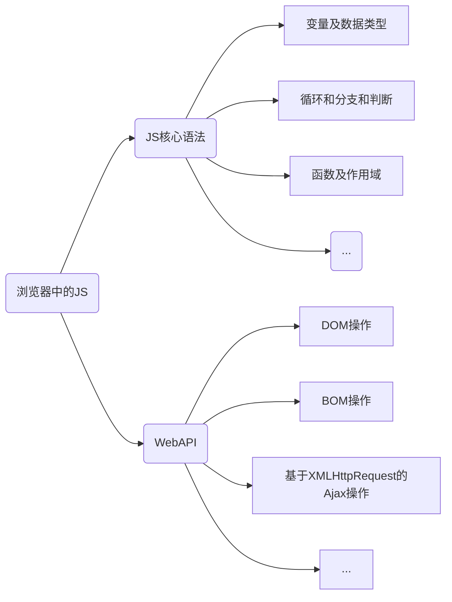

-- 笔记内容均来自 B 站黑马程序员官方视频，感谢黑马官方的悉心指导

---

:bulb:解决 B 站视频在浏览器中无法拖动进度条的限制

关闭网页自动复制，网页限制类插件，例如：simple slow copy 插件

---

[toc]

# 1 初识 Node.js

**回顾与思考**

:question: **思考1**：浏览器中的 JS 的组成部分




:question: **思考2**：为什么 JS 可以在浏览器中执行？

这是因为浏览器中内置了 JS 解析引擎，例如：

- Chrome => V8
- Firefox   => OdinMonkey（奥丁猴）
- Safri       => JSCore
- …


借助 Node.js  我们使用 Javascript 进行后端开发

## 1.1 什么是 Node.js

Node.js 是 一个基于 <strong style="color:red">Chrome V8</strong>  引擎的 <strong style="color:red">Javascript 运行时环境</strong>

Node.js 的[官网地址](https://nodejs.org/en/)

**注意：**

- 浏览器是 JS 的前端运行环境
- Node.js 是 JS 的后端运行环境
- **Node.js 中无法调用 DOM 和 BOM 等浏览器内置API**


**Node.js 可以做什么？**

Node.js 作为一个 JS 的运行环境，仅提供了基础的功能和 API，然而，基于 Node.js 提供的基础功能，官方提供了很多强大的工具和框架，如：

1. 基于 [Express 框架](https://expressjs.com/)，可以快速构建 Web 应用

   ```bash
   npm install express --save
   ```

2. 基于 [Electron 框架](https://www.electronjs.org/)，可以构建跨平台的桌面应用

3. 基于 [restify 框架](http://restify.com/)，可以快速构建 API 接口项目

4. 读写和操作数据库、创建实用的命令行工具辅助前端开发

## 1.2 Node.js 环境的安装

1. 进入 Node.js 的[官网](https://nodejs.org/en/)，点击下载

   

2. 下载安装完成之后查看已安装的 Node.js 的版本号

   打开终端，在终端输入命令 `node -v`查看已安装的版本号

   

## 1.3 使用 Node.js 运行 JS 代码

语法：

```bash
node js文件
```

我们如果想要立即定位到当前的路径，即命令行直接跳转到当前位置，可以使用 shift + 鼠标右键，选择在 powershell 中打开


:bell:powershell 和 cmd 的区别？

```
cmd 属于旧的windows的终端，后来微软对命令行工具进行升级，开发出了 powershell，因此 powershell 的功能更加丰富
```

**终端中的快捷键**

1. 使用`↑`键，可以定位到历史输入命令
2. 使用`tab`键，可以快速补全路径
3. 使用`esc`键，可以快速清空当前已经输入的命令
4. 使用`cls`命令，可以清空终端

# 2 fs-文件系统模块

## 2.1 什么是 fs 模块

<font color="red">fs 模块</font>是 Node.js 官方提供的、用来操作文件的模块。它提供了一系列的方法和属性，用来满足用户对文件的操作需求，例如：

- fs.readFile() 方法，用来读取指定文件中的内容
- fs.writeFile() 方法，用来向指定的文件中写入内容

## 2.2 fs-读取文件内容

**`fs.readFile()` 的语法格式如下：**

```js
fs.readFile(path[,options],callback)
```

- path：<strong style="color:red">必选</strong>，文件url
- options：可选，表示以什么==编码格式==来读取文件
- callback：<strong style="color:red">必选</strong>，文件读取完成之后，通过回调函数拿到读取的结果

**demo**

```js
// 1.导入 fs  模块，来操作文件
const fs = require('fs')
// 2. 调用 fs.readFile() 方法来读取文件
fs.readFile('test/test.txt','utf8',function(err,dataStr){
    console.log(err);
    console.log('------------');
    console.log(dataStr);
})
```

执行结果如下：


如果读取成功，那么返回的 err 结果为 null，相应的 dataStr 为文本内容，而读取失败，则会返回相应的错误信息，并且返回的文本信息为 undefined，例如，如果我将文件路径更改为一个未知路径，执行结果为：


**判断文件是否读取成功**

```js
// 1.导入 fs  模块，来操作文件
const fs = require('fs')
// 2. 调用 fs.readFile() 方法来读取文件
fs.readFile('jst','utf8',function(err,dataStr){
    if (err) {      // 如果 err 返回了内容则说明文件读取失败
        return console.log('文件读取失败!' + err.message) ;
    }
    // 如果 err 为 null 则说明文件读取成功
    console.log('文件读取成功，内容是：' + dataStr);
})
```

## 2.3 fs-写入文件内容

**`fs.writeFile()`语法格式如下：**

```js
fs.writeFile(file,data[,options],callback)
```

- 参数1：<strong style="color:red">必选</strong>，需要指定一个文件路径的字符串，表示文件的存放路径
- 参数2：必选，表示要写入的内容
- 参数3：可选，表示以什么格式写入文件内容，默认值是 utf8
- 参数4：必选，文件写入完毕之后的回调函数

**demo**

```js
// 1. 导入 fs 文件系统模块
const fs = require('fs')
// 2. 调用 fs.writeFile() 方法，写入内容
fs.writeFile('test/test.txt','abc','utf8',function(err) {
    if (err) {
        return console.log('文件写入失败，提示的错误信息为：' + err.message);
    }
    console.log('文件写入成功!');
    
})
```

<font color="red">注意：writeFile 会覆盖之前的文本内容，如果我们只是想要追加文本内容，可以使用 appendFile</font>

### 案例：考试成绩整理

现在我们需要将下面的数据转成每一行显示一组数据

```
小红=99 小白=100 小黄=70 小黑=66 小绿=88
```

将其转化为：

```
小红: 99 
小白: 100 
小黄: 70 
小黑: 66 
小绿: 88
```

核心实现步骤：

1. 导入 fs 模块
2. 使用 `fs.readFile()` 方法读取文件
3. 判断文件是否读取成功
4. 文件读取成功之后，处理成绩数据
5. 将处理完的成绩数据，调用 `fs.writeFile()`方法，写入到新文件中

```js
// 1. 导入 fs 模块
const fs = require('fs');

// 2. 调用 fs.readFile() 读取文件的内容
fs.readFile('test/score.txt','utf8',function(err,data) {
    // 3. 判断文件是否读取成功
    if(err) {
        return console.log('读取文件失败！返回的错误提示信息为：' + err.message);
    } 

    // 4. 处理读取的数据
    const oldArr = data.split(' ');
    var newArr = [];
    oldArr.forEach(item => 
        newArr.push(item.replace('=',':')))

    var newStr = newArr.join('\r\n');
    // console.log(newArr);
    fs.writeFile('test/score ok.txt',newStr,'utf8',function(err) {
        if (err) {
            return console.log("写入失败！错误信息：" + err.message);
        }
        console.log("写入成功！");
    })
})
```


## 2.4 fs-路径处理问题

在使用 fs 模块操作文件时，<strong style="color:red">如果提供的操作路径是以 ./ 或 ../ 开头的相对路径时，很容易出现路径动态拼接错误的问题</strong>，例如：我们在使用 VS code 打开工作目录，那么路径就是【该工作目录的路径 + 拼接路径】

出现错误的原因：代码在运行时，<strong style="color:red">会执行 node 命令时所处的目录，动态拼接出被操作文件的完整路径</strong>

- 解决方案1：使用**绝对路径**，但是需要将`\`进行转义，并且移植效果差

- 解决方案2：使用 `__dirname`来动态拼接完整路径（推荐）

  > `__dirname`是 node 中提供的一个关键字，用来存储<strong style="color:red">当前JS文件所在文件夹的绝对路径</strong>

# 3 path-路径模块

path 模块是 Node.js 官方提供的、用来处理路径的模块，它提供了一系列的方法和属性，用来满足用户对路径的处理需求，例如：

- `path.join()` 方法，用来将<font color="red">多个路径片段拼接成一个完整的路径字符串</font>
- `path.basename()`方法，用来从路径字符串中，将文件名解析出来

如果我们想要在 JS 代码中，使用 path 模块来处理路径，则需要使用下面的方式来导入它：

```js
const path = require('path')
```

## 3.1 path.join()

语法格式如下：

```js
path.join([..paths])
```

- paths：路径片段序列
- 返回值 ：`<string>`

```js
const path = require('path');
const pathStr1 = path.join('/a', '/b/c','../', 'e')
console.log(pathStr1);  // 输出结果：\a\b\e

const pathStr2 = path.join(__dirname, '/score.txt');
console.log(pathStr2);  // 输出结果：当前文件所在目录src\score.txt
```

:heavy_exclamation_mark:<font color="red">注意：</font>

- `../`会抵消前面一个路径字符
- 今后凡是涉及到路径拼接操作，都要使用 `path.join()` 方法进行处理，不要直接使用`+`进行字符串的拼接
- `path.join()` 中的参数是有顺序的，会从左到右进行拼接


## 3.2 path.basename()

使用 `path.basename()`方法，可以获取路径中的最后一部分，经常通过这个方法<font color="red">获取路径中的文件名</font>，语法格式如下：

```js
path.basename(path,[,ext])
```

- `path`：必选，表示一个路径的字符串
- `ext`：可选，表示文件的扩展名
- 返回的结果是 `<string>`，表示路径中的最后一部分（即索引文件名）

**demo**

```js
const fpath = 'a/b/c/index.html'
var fullName = path.basename(fpath);
console.log(fullName);  // index.html

var nameWithoutExt = path.basename(fpath, '.html');
console.log(nameWithoutExt);    // index
```


使用 `path.extname()`方法，可以获取路径中的扩展名部分：

```js
const fext = path.extname(fpath);	// .html
```


## 综合案例-时钟案例

在这个案例中，我们需要做的是将 css、JS、html 文件分离，分别存储到三个单独的文件 

**案例实现步骤**

1. 创建两个正则表达式，分别匹配 `<style>` 和 `<script>` 标签
2. 使用 fs 模块，读取需要被处理的 HTML 文件
3. 自定义 resolveCSS 方法，来写入 index.css 文件
4. 自动以 resolveJS 方法，来写入 index.js 脚本文件
5. 自定义 resolveHTML 方法，来写入 index.html 文件

# 4 http模块

**回顾**：什么是客户端、什么是服务器？

```
在网络节点中，负责消费资源的电脑，叫做客户端; 负责对外提供网络资源的电脑叫做服务器
```


http 模块是 Node.js 官方提供的，用来<font color="red">创建 Web 服务器</font>的模块，通过 http 模块提供的 `http.createServer()`方法，就能方便地把一台普通的电脑，变成一台 Web 服务器，从而对外提供 Web 资源服务

导入 http 模块的方法：

```js
const http = require('http')
```

## 4.1 进一步理解 http 模块的作用

服务器和普通电脑的区别在于，<strong style="color:red">服务器上安装了 Web 服务器软件，例如：IIS、Apache 等</strong>。通过安装这些服务器软件，就能把一台普通的电脑变成一台 Web 服务器

> 可以自行下载 phpstudy 来将本地电脑转换为一台 web 服务器

### 4.1.1 IP 地址

<font color="red">IP 地址</font>就是互联网上每台计算机的唯一地址，因此 IP 地址具有唯一性

IP 地址的格式：通常采用"<font color="blue">点分十进制</font>"表示成（<font color="red">a,b,c,d</font>）的形式，其中 a,b,c,d 通常是 0~255 之间的十进制整数

- 互联网中每台 Web 服务器都有自己的 IP 地址，通过`ping xxx`可以进行查看

  

- 在开发期间，自己的电脑即是一台服务器，也是一个客户端，为了方便测试，可以自己的浏览器中输入【127.0.0.1】这个 IP 地址，将自己的电脑当做一台服务器进行访问

### 4.1.2 域名和域名服务器

IP 地址由于不够直观，不便于记忆，于是人们又发明了另一套字符型的地址方案，即所谓的==域名（Domain Name）地址==

**IP 地址 和 域名 是一一对应的关系**，这份对应关系放在一种叫做==域名解析器==（DNS，Domain Name Server）的电脑中，使用者只需要记住域名即可访问对应的服务器，对应的转换工作交给域名解析器来完成

**注意:**

- 单纯使用 IP 地址，互联网中的电脑也能够正常工作但是有了域名的加持，能让互联网的连通变得更加方便
- 在开发测试期间， **127.0.0.1** 对应的域名就是 **localhost** ，它们都代表本地主机


### 4.1.3 端口号

在同一台电脑中，可以运行成百上千个 Web 服务，每个 Web 服务都对应一个唯一的端口号，客户端发送过来的网络请求，通过 端口号可以准确地交给对应的 Web 服务进行处理

**注意：**

1. 每个端口号不能同时被多个 Web 服务占用
2. 在实际应用中，URL 中的 80 端口号可以省略

**一些使用的查看端口号命令**

1. 查看本机开放的端口号

   ```bash
   netstat -an
   ```

2. 查看某个端口号是否被占用

   ```bash
   netstat -ano | findstr "xxx"
   ```

3. 查看某个端口号具体被什么程序占用

   ```bash
   tasklist | findstr "xxx"
   ```

## 4.2 创建基本的 Web 服务器

**步骤**

1. 导入 http 模块
2. 创建 Web 服务器实例
3. 为服务器实例绑定 request 事件，监听客户端的请求
4. 启动服务器

```js
// 1. 导入 http 模块
const http = require('http');
// 2. 创建 Web 服务器实例
const server = http.createServer()
// 3. 为服务器实例绑定 request 事件
server.on('request',(req,res) => {
    console.log('someone visit our web server!');
})
// 4. 启动服务器：调用服务器实例的 listen() 方法即可启动 Web 服务器实例
server.listen(8080, () => {
    console.log('http server running at http://127.0.0.1');
})
```


### 4.2.1 req 请求对象

只要服务器接受到客户端的请求，就会调用通过 `server.on()` 为服务器绑定的 request 事件处理函数，如果想在事件处理函数中，<font color="red">访问与客户端相关的数据或属性</font>，可以使用如下的方式：

```js
const http = require('http');
const server = http.createServer();

server.on('request',(req) => {
    // req 是请求对象，它包含了与客户端相关的数据和属性，例如：
    // req.url 是客户端请求的 url 地址
    // req.method 是客户端 method 请求类型
    const str = `Your request url is ${req.url},and request method is ${req.method}`;
    console.log(str);
})
server.listen(80, () => {
    console.log('http server running at http://127.0.0.1');
})
```

1. 我们在浏览器中打开`127.0.0.1`，输出内容是：

   ```
   Your request url is /,and request method is GET
   ```

2. 我们如果在浏览器中打开`127.0.0.1/index.html`，输出内容是：

   ```
   Your request url is /index.html,and request method is GET
   ```

3. 我们也可以在 postman 中输入更改请求方式为 post ，输入`127.0.0.1/about.html`，输出内容是：

   ```
   Your request url is /about.html,and request method is POST
   ```

### 4.2.2 res 响应对象

在服务器的 request 事件处理函数中，如果想要访问与<font color="red">服务器相关的数据或属性</font>，可以使用如下的方式：

```js
// 通过调用 res.end() 方法，向客户端响应一些内容
res.end(str)
```

:herb: 解决中文乱码的问题

我们通过  res 获取响应数据的时候，如果数据中存在中文，则会出现乱码的问题，这时候我们可以通过调用 `res.setHeader()`方法，设置 Content-Type 响应头，解决中文乱码的问题

```js
res.setHeader('Content-Type','text/html; charset=utf-8')
```


## 4.3 根据不同的 url 响应不同的 html 内容

**核心实现步骤**

1. 获取请求的url地址
2. 设置默认的响应内容为 404 not found
3. 判断用户请求的是否为`/`或`/index.html`等页面
4. 设置 Content-Type 响应头，防止中文乱码
5. 使用 `res.end()`把内容响应给客户端

**动态响应内容**

```js
const http = require('http');
const server = http.createServer();
server.on('request', (req, res) => {
    const url = req.url;        // 1. 获得请求的 url 地址
    let content =  null;
    if (url === '/' || url === '/index.html') { // 当获得的 url 地址为 / 或 /index.html
        content = '<h1>首页</h1>';
    }else if (url === '/about.html') { // 当用户请求的是 about.html 页面时
        content = '<h1>关于页面</h1>';
    } else {    // 当用户请求的是其他页面时，返回 404 not found!
        content = '<h1>404 Not found!</h1>';
    }
    res.setHeader('Content-type', 'text/html; charset=utf-8');  // 设置 Content-Type 响应头，防止中文乱码
    res.end(content);   // 将内容发送到客户端
})

server.listen(80, () => {       // 设置监听口
    console.log('http server running at http://127.0.0.1');
})
```


## 案例：时钟 Web 服务器


# 5 模块化

## 5.1 模块的基本概念

<font color="red">模块化</font>是指解决一个复杂问题时，自顶向下逐层把系统划分为若干模块的过程。对于整个系统来说，<font color="red">模块是可组合、分解和更换的单元</font>

**编程领域的模块化**

编程领域中的模块化，就会遵守规定的规则，把一个大文件拆成独立且相互依赖的多个小模块

把代码进行模块化拆分的好处：

1. 提高了代码的==复用性==
2. 提高了代码的==可维护性==
3. 可以实现==按需加载==

## 5.2 模块的分类

Node.js 中根据模块来源的不同，将模块分为三大类，分别是：

- 内置模块（内置模块是由 Node.js 官方提供的，例如：fs、path、http等）
- 自定义模块（由用户创建的每个 .js 文件，都是自定义模块）
- 第三方模块（由第三方开发出来的模块，并非官方提供的内置模块，也不是用户创建的自定义模块，使用前需要先下载）

**加载模块**

使用强大的 require() 方法，可以加载需要的内置模块、用户自定义模块和第三方模块进行使用，例如：

```js
// 1.加载内置的 fs 模块
const fs = require('fs')

// 2.加载用户自定义模块
const custom = require('./custom.js')

// 3. 加载第三方模块
const moment = require('moment')
```

<font color="red">注意：</font>

- 使用 `require()` 方法加载其他模块时，会执行加载模块中的代码
- 我们使用 require 方法加载模块时，可以不用添加 `.js`，node.js 会自动帮助我们检索补全


## 5.3 模块作用域

模块作用域和函数作用域类似，在自定义模块中定义的变量、方法等成员，只能在当前模块内被访问，这种模块级别的访问限制就叫做模块作用域

模块作用域的**特点**：

1. **防止全局变量的污染**：在被导入的模块中定义的全局变量无法在导入模块中使用


## 5.4 向外共享模块作用域中的成员

### 5.4.1 module 对象

在每个 `.js` 自定义模块中都有一个 module 对象，它里面存储了<font color="red">和当前模块有关的信息</font>

```js
console.log(module)
```

打印如下：


### 5.4.2 module 模块中的 exports 属性

在自定义模块中，可以使用 `module.exports` 对象，将模块内的成员共享出去，供外界使用

外界使用 `require()` 方法导入自定义模块时，得到的就是 `module.exports` 所指向的对象（默认为空对象{}）

**向外共享模块作用域中的成员demo**

```js
// 1.向 module.exports 对象上挂载 username 属性
module.exports.username = 'zhangsan';
// 2.向 module.exports 对象上挂载 sayHello 方法
module.exports.sayHello = function() {
    console.log("Hello!");
}

// 3. 让 module.exports 指向一个全新的对象
module.exports = {
    nickname: '小黑',
    sayHi() {
        console.log('Hi!');
    }
} 
```


### 5.4.3 exports 对象

Node 提供了 `exports` 对象。默认情况下，<font color="red">`exports` 和 `module.exports` 指向同一个对象。</font>

```js
// demo
console.log(exports);
console.log(module.exports);
console.log(exports === module.exports);
```

打印结果如下：


> 最终，向外共享的结果，永远是 `module.exports` 所指向的对象


### 5.4.4 exports 和 module.exports 的使用误区

**1.使用 `require()`导入模块时，得到的永远是 `module.exports` 指向的对象**

**解析**

创建两个 JS 文件，里面分别写入：

```js
// 1.js
module.exports = {
    gender: 'male',
    age: 18
}
exports = {
    sex: 'female',
    health: 'yes'
}
```

```js
// 2.js
const m = require('./1');
console.log(m);
```

执行结果如下：


基本原理是，当我们分别创建 `module.exports` 属性，系统分其分配了新的内存空间，且将导入模块指向了这个新的内存空间

**2.当我们为 `module.exports`挂载了属性，为`exports`分配了对象，导入模块仍然指向`module.exportts`**

```js
// 1.js
module.exports.gender = 'male';
exports = {
    sex: 'female',
    health: 'yes'
}
```

执行结果如下：


**3.当我们同时为`module.exports` 和 `exports`挂载属性，那么导入模块会将挂载属性全部合到一个对象中（如果属性冲突，那么冲突属性采用覆盖原则）**

```js
// 1.js
module.exports.gender = 'male';
exports.age = 18
```

执行结果如下：


**结论**：为了防止混乱，建议不要再同一个模块中同时使用 `exports`和 `module.exports`

## 5.5 commonJS 模块化规范

Node.js 遵循了 CommonJS 模块化规范，commonJS 规定<font color="red">模块的特性和各模块之间如何相互依赖</font>

commonJS 规定：

1. 每个模块内部，module 变量代表当前模块
2. module 变量是一个对象，它的 exports 属性是对外的接口
3. 加载某个模块，其实就是加载该模块的`module.exports` 属性

# 6 npm 和 包

## 6.1 什么是包

Node.js 中的<font color="red">第三方模块</font>又叫做<font color="red">包</font>

npm,Inc，这家公司旗下有一个全球最大的包共享平台：[传送入口](https://www.npmjs.com/)

该公司还提供了一个包管理工具，名字叫做 Node Package Manager (简称 npm 包管理工具)，这个包管理工具随着 Node.js 的安装包一起安装到了用户的电脑中


## 6.2 npm 格式化时间

1. 使用 npm 包管理工具，在项目中安装格式化时间的包 moment

   ```bash
   # 语法
   npm install packageName
   # 或者 
   npm i packageName
   ```

   ```bash
   # 安装 moment 包
   npm i moment
   ```

2. 使用 require() 导入格式化时间的包

3. 参考 moment 的官方 API 文档对时间进行格式化

   

   ```js
   const moment = require('moment');
   
   const dt = moment().format('YYYY-MM-DD HH:mm:ss');
   console.log(dt);
   ```

最终的执行结果如下：


## 6.3 解决 npm 下包速度慢的问题

当我们使用 npm 下包的时候，服务器位于国外，网络数据的传输需要经过漫长的海底光缆，因此下包速度慢

解决方案：使用淘宝 npm 镜像:mag:服务器

>镜像（Mirroring）是一种文件存储形式，一个磁盘上的数据在另一个磁盘上存在一个完全相同的副本即为镜像


**切换 npm 下包镜像源**

1. 查看当前包的镜像源

   ```bash
   npm config get registry
   ```

2. 将下包的镜像资源切换为淘宝镜像源

   ```bash
   // 方法一
   npm config set registry https://registry.npm.taobao.org
   // 方法二
   npm config set registry=https://registry.npm.taobao.org
   ```


**nrm 工具**

为了更方便的切换下包的镜像源，我们可以安装 nrm 这个小工具，利用 nrm 提供的终端命令，可以快速查看和切换下包的镜像源

1. 通过 npm 包管理器，将 nrm 安装为全局可用的工具

   ```bash
   npm i nrm -g
   # g 代表 gobal，表示将 nrm 安装为全局可用工具
   ```

2. 查看 nrm 是否安装成功

   ```bash
   nrm -V
   # 或者
   nrm -Version
   ```

3. 查看所有可用的镜像源

   ```bash
   nrm ls
   ```

4. 将下载的镜像源切换为 taobao

   ```bash
   nrm use taobao 
   ```

   

## 6.4 使用 npm 的其他注意点

初次安装包完成之后，在 node 的安装位置中会多出 一个node_modules 的文件夹和 package-lock.json 的配置文件


其中：

- node_modules 文件夹用来存放所有已安装到项目中的包。require() 导入第三方包时，就是从这个目录中查找并加载包的
- package-lock.json 配置文件用来记录 node_modules 目录下的每一个包的下载信息，例如包的名字、版本号、下载地址等

:herb: 拓展

1. 如果我们想要将 npm 包初始化，可以使用 `node init` 命令
2. 安装指定版本的包，可以使用`npm i 包名@版本号`
3. 包的版本号是以"点分十进制"形式进行定义的，总共有三位数字，例如【2.24.0】
   - 第 1 位数字：大版本；
   - 第 2 位数字：功能版本；
   - 第 3 位数字： BUG 修复版本 

## 6.5 包管理配置文件

npm 规定，在项目根目录中，必须提供一个叫做 package.json 的包配置管理文件。用来记录与项目有关的一些配置，例如：

- 项目的名称、版本号、描述等
- 项目中都用到了哪些包
- 哪些包只在开发期间会用到
- 哪些包在开发和部署时都需要用到

### 6.5.1 多人协作遇到的问题

我们在做项目时，有时会遇到第三方包的体积远大于源代码的体积，这就会导致团队成员之间共享代码的不便，这时候我们其实完全可以将第三包从项目中剔除，实现思路：

- 创建一个 package.json  的配置文件，用来记录添加哪些包，之后将 node_modules 文件夹，添加到 .gitignore 忽略文件中

 

### 6.5.2 快速创建 package.json 文件

npm 包管理工具提供了一个快捷命令，可以在<font color="red">执行命令所处的目录中，快速创建 package.json 这个包管理</font>

```bash
npm init -y
```

:heavy_exclamation_mark: 注意： 

- 上述命令只能在==英文的目录==下成功运行，所以项目文件夹的命令一定要使用英文名，不要使用中文（空格等特殊字符也不行），不能出现空格
- 运行 npm install 命令安装包的时候，npm 包管理工具会自动把包的名称和版本号，记录到 package.json 中


### 6.5.3 dependencies 节点

```bash
npm install 指定包名 -S
# 或者
npm install 指定包名 -save
```

package.json 文件中，有一个 dependencies j节点，专门用来记录我们使用 `npm install` 命令安装了哪些包

**demo**

刚打开项目文件夹时，默认是没有 dependencies 节点的，我们下载包（例如使用`npm i moment`命令之后），就可以看到这个节点，如下图：


### 6.5.4 一次性安装所有的包

如果我们一不小心将 node_modules 这个存放包的文件夹删除，但好在没在有删除 package.json 文件时，我们可以使用下面的命令来一次性安装之前记录在 package.json 中的所有依赖包：

```bash
npm install
# 或者
npm i
```


### 6.5.5 卸载包

```bash
npm uninstall 指定包名
```

注意：

- 我们在安装包时，install 可以简称为 `i`；卸载包时，uninstall 是的简写形式为 `uni`


### 6.5.6 devDependencies 节点

- 如果某些包<font color="red">只在项目开发阶段会用到，在项目上线之后用不到</font>，则建议把这些包记录在 devDependencies 节点中；
- 与之对应的，如果某些包<font color="red">在开发和项目上线之后都需要用到</font>，则建议把这些包记录到 dependencies 节点中

```bash
# 安装指定的包，并记录在 devDependencies 节点中
npm i 包名 -D
# 完整写法
npm i 包名 --save-dev
# 或者
npm i --save-dev 包名
```


## 6.6 包的分类

使用 npm 包管理工具下载的包，统共分为两大类，分别是：

- 项目包
- 全局包

### 6.6.1 项目包

那些安装到项目的 node_modules 目录中的包，都是项目包

项目包分为两类：

- 开发依赖包（被记录到 devDependencies 节点中）
- 核心依赖包（被记录大 dependencies 节点中）


### 6.6.2 全局包

在执行 npn  install 命令时，如果后面添加了`-g`参数，则会把包安装为全局包，默认安装位置如下：

```
C:\Users\username\AppData\Roaming\npm\node_modules
```

```bash
npm i 包名 -g 	# 安装全局包
npm uni 包名 -g   # 卸载全局包
```

注意：

- 只有==工具性质的包==，才有全局安装的必要性
- 判断某个包是否需要全局安装后才能使用，可以参考官方提供的说明文档


### 6.6.3 i5ting_toc 

i5ting_toc 是 npm 下的一个全局包，它可以将 md 文件转换为 html 页面，使用语法：

```bash
# 安装 i5ting_toc
npm i -g i5ting_toc

# 调用 i5ting_toc ，轻松实现 md 转化为 html
i5ting_toc -f 待转换的md文档路径 -o
```


### 6.6.4 规范的包结构

一个规范的包，它的组成结构，必须符合以下 3 点要求：

1. 包必须以单独的目录而存在
2. 包的顶级目录下必须要包含 package.json 这个包管理配置文件
3. package.json 中必须包含 name、version、main 这三个属性，分别代表 <font color="blue">包的名字、版本号、包的入口</font>

## 6.7 发布包


## 6.8 模块的加载效率


# 7 Express

## 7.1 什么是 Express 

官方给出的概念：Express 是基于 Node.js 平台，开发、快速、极简的 Web 开发框架

Express 的本质：就是一个 npm 上的第三方包，提供了快速创建 Web 服务器的便捷方法

[Express 官网传送门](https://www.expressjs.com.cn/)

对于前端程序员来说，最常见的有两种服务器，分别是：

- Web 网站服务器：专门对外提供 Web 网页资源的服务器
- API 接口服务器：专门对外提供 API 接口的服务器

使用 Express 可以很方便的创建 Web 网站服务器 和 API 接口服务器

**安装**

```bash
npm i express --save
```


**创建基本的服务器**

```js
// 1. 导入 express
const express = require('express');
// 2. 创建 Web 服务器
const app = express();

// 3. 调用 app.listen
app.listen(80, () => {
    console.log('express server running at http://127:0:0:1');
}) 
```


**监听 GET 请求**

通过 `app.get()` 方法，可以监听客户端的 GET 请求，具体语法如下：

```js
// 参数1：客户端请求的 URL 地址
// 参数2：请求对应的处理函数
//			req：请求对象(包含了与请求相关的属性和方法)
//			res: 响应对象(包含了与响应相关的属性与方法)
app.get('请求 URL', function(req,res) {
	// 处理函数
})
```


**监听 POST 请求**

通过 `app.post()` 方法，可以监听客户端的 POST 请求，具体的语法如下：

```js
// 参数1：客户端请求的 URL 地址
// 参数2：请求对应的处理函数
//			req：请求对象(包含了与请求相关的属性和方法)
//			res: 响应对象(包含了与响应相关的属性与方法)
app.post('请求 URL', function(req,res) {
	// 处理函数
})
```


**把响应的内容给客户端**

通过 `res.send()`方法，可以把处理好的内容发送给客户端

```js
app.post('url',(req, res) =>{
	res.send('请求成功')
})
```


**综合**

```js
// 1. 导入 express 模块
const express = require('express');
// 2. 创建 Web 服务器
const app = express();

// 3. 设置监听客户端 GET 和 POST 请求，并向客户端响应具体的内容
app.get('/user', (req, res) => {
    // 调用 express 提供的 res.send() 方法，向客户端响应一个 JSON 对象
    res.send({ 
        name: 'ls',
        age: 20,
        gender: 'male'
    })
})

app.post('/user', (req, res) => {
    // 调用 express 提供的 res.send() 方法，向客户端响应一个字符串
    res.send('请求成功')
})

// 4. 设置监听器
app.listen(80, (req, res) => {
    console.log('http server running at http://127.0.0.1');
})
```

我们使用 postman 来接受响应的内容：


***获取 URL 中携带的查询参数**

通过 `req.query` 对象，可以访问到<font color="red">客户端发送到服务器的参数</font>

> 默认情况下，req.query 返回的是一个空对象


**获取 URL 中的动态参数**

通过 `req.params` 对象，可以访问到 URL 中，通过`:`匹配到的动态参数：

```js
app.get('/user/:id', (req, res) => {
        // console.log(req.params);
        res.send(req.params);
})
```


**多参数写法（通过斜杆分割）**

```js
app.get('/user/:id/:name', (req, res) => {
        // console.log(req.params);
        res.send(req.params);
})
```


## 7.2 托管静态资源

express 提供了 `express.static()` 函数，通过它，我么可以非常方便地创建一个静态资源服务器，例如通过如下代码，就可以将 public 目录下的图片、CSS 文件、JS 文件对外开发访问了

```js
app.use(express, static('public'))
```

注意：Express 在指定的静态目录中查找文件，并对外提供资源的访问路径。因此，存放静态文件目录名不会出现在 URL 中。例如：我们访问 public 目录下的 css 目录下的style.css 文件：

```
http://localhost:80/css/style.css
```

:heavy_exclamation_mark:注意：

```
如果是我们是在 VS code 中打开工作目录，托管的静态资源是相对于工作目录的，而不是相对于执行 static 的文件的
```


**托管多个静态资源目录**

如果要托管多个静态资源，请多次调用 `express.static()` 函数

```js
app.use(express, static('public'))
app.use(express, static('files'))
```

访问静态资源文件时， `express.static()`函数会根据目录的添加顺序查找所需的文件，例如 public 和 files 文件夹中都有 index.html ，那么 Web 服务器最先托管<font color="red">前面文档</font>


**挂载路径前缀**

如果希望<font color="red">在托管的静态资源访问之前，挂载路径前缀</font>，则可以使用如下的方式：

```js
app.use('/public', express.static('public'))
```

现在，我们就可以通过带有 public 前缀地址来访问 public 目录中的文件：

```
http:localhost/public/index.html
```

## 7.3 nodemon

在编写调试 Node.js 项目的时候，如果修改了项目的代码，则需要频繁的手动 close 掉，然后再重新启动，非常繁琐，这时候，我们可以使用 nodeman 这个工具，来监听项目文件的变动，当代码被修改后，nodeman 会自动帮我们重启项目，极大方便了开发和调试

[nodemon 传送门](https://www.npmjs.com/package/nodemon)

**安装 nodemon**

```bash
npm i -g nodemon
```

**使用 nodemon 命令**

```bash
# 将原来的 node 命令执行代码的命令改成 nodemon 命令
nodemon app.js
```

---

:sparkles:解决 window 系统中进制运行脚本的问题

以管理员身份打开  ==powershell==  →  输入如下命令：

```bash
set-ExecutionPolicy RemoteSigned 
```

根据提示输入【A】即可


## 7.4 Express 路由

在 Express 中，路由指的是 <font color="red">客户端的请求 与 服务器处理函数之间的映射关系</font>

Express 中的路由分 3 部分组成，分别是<font color="red">请求的类型、请求的 URL 地址、处理函数</font>

```js
app.METHOD(PATH, HEADLER)
```


**路由的匹配过程**

每当一个请求到达服务器之后，<font color="red">需要先经过路由的匹配</font>，只有匹配成功之后，才会调用对应的处理函数

在匹配时，会按照==路由的顺序进行匹配，如果请求类型和请求的 URL  同时匹配成功==，则 Express 会将这次请求，转交到对应的 function 函数进行处理

**demo**

```js
// 挂载路由
app.get('/', (req, res) => {
  res.send('hello world.')
})
app.post('/', (req, res) => {
  res.send('Post Request.')
})
```


### 7.4.1 模块化路由

为了方便对路由进行模块化的管理，Express 不建议将路由直接挂载到 Web 服务器（例如：app）中，而是<font color="red">推荐将路由抽离为单独的模块</font>，步骤如下：

1. 创建路由模块对应的 .js 文件
2. 调用 `express.Router()` 函数创建路由对象
3. 向路由对象上挂载具体的路由
4. 使用 module.exports 向外共享路由对象
5. 使用 app.use() 函数注册路由模块

我们创建两个 js 文件：

```js
//====================mounRounter.js
// 1. 导入 express 模块
const express = require('express');
// 2. 创建 Web 服务器
const app = express();

// 3. 导入路由模块
const router = require('./router');
// 4. 注册路由模块
app.use(router);

// 5. 启动 Web 服务器
app.listen(80, () => {
    console.log('http://localhost:80');
})
```

```js
//=============rounter.js
// 1. 导入 express
var express = require('express');
// 2. 创建路由对象
var router = express.Router();
// 3. 挂载获取用户列表的路由
router.get('/user/list', function(req, res) {
    res.send('get user list');
})
// 4. 挂载添加用户的路由
router.post('/user/add', function(req,res) {
    res.send('Add new user');
})
// 5. 向外导出路由
module.exports = router;

```

最后使用 postman 进行测试：


注意：

- `app.use()`的作用就是用来注册全局中间件的


### 7.4.2 为路由模块添加前缀

```js
// 1. 导入路由模块
const router = require('./router');
// 2. 使用 app.use() 注册中间件，并同一添加前缀 api
app.use('/api',router);
```

## 7.5 Express 中间件

### 7.5.1 什么是中间件

中间件（Middleware），特指<font color="red">业务流程中的中间处理环节</font>


### 7.5.2 Express 中间件的调用流程

当一个请求到达 Express 服务器之后，可以连续调用多个中间件，从而对这次请求进行==预处理==


### 7.5.3 Express 中间件的格式

Express 的中间件，本质上就是一个 function 处理函数，Express 中间件的格式如下：


<font color="red">注意：中间件函数的形参列表中，必须包含 next 参数，而路由处理函数中只包含 req 和 res</font>


### 7.5.4 next 函数的作用

next 函数是实现<font color="red">多个中间件连续调用</font>的关键，它表示<font color="blue">把流转关系转交给下一个中间件或路由</font>


### 7.5.5 定义中间件函数

```js
const mw = function(req,res,next) {
    console.log('这是一个简单的中间件函数');
    // 把流转关系转交给下一个中间件或路由
    next();
} 
```


### 7.5.6 全局生效的中间件

客户端发起的任何请求，到达服务器之后，都会触发的中间件，叫做全局生效的中间件。通过调用 `app.use(中间件函数)`，可以定义一个全局生效的中间件，示例代码如下：

```js
const mw = function(req,res,next) {
    console.log('这是一个简单的中间件函数');
    // 把流转关系转交给下一个中间件或路由
    next();
} 

// 全局生效的中间件
app.use(mw)
```


### 7.5.7 中间件的作用

多个中间件之间，<font color="red">共享同一份 req 和 res</font>，基于这样的特性，我们可以在上游的中间件中，统一为 req 和 res 对象添加自定义的属性或方法，供下游的中间件或路由进行使用


示例：现在我们想要让每一个路由在请求到大服务器之后都会响应到客户端请求到达的时间

```js
const express = require('express');
const app = express();

const mw = function(req,res,next) {
    // 获得请求到达服务器的时间
    const time = new Date();
    req.startTime = time;
    // 把流转关系转交给下一个中间件或路由
    next();
} 
// 全局生效的中间件
app.use(mw);

app.get('/', (req, res) => {
    res.send('调用了 / 这个路由,请求的时间为：' + req.startTime);

})

app.get('/user', (req, res) => {
    res.send('调用了 /user 这个路由，请求的时间为：' + req.startTime);

})

app.listen(80, () => {
    console.log('http server listening on http://localhost');
})
```

效果如下：


### 7.5.8 定义多个全局中间件

可以使用 `app.use()` 连续定义多个全局中间件，客户端请求到达服务器之后，会按照中间件定义的先后顺序以此进行调用，示例如下：

```js
app.use(function(req,res,next) {
    console.log('调用了第一个全局中间件');
    next();
} );
app.use(function(req,res,next) {
    console.log('调用了第二个全局中间件');
    next();
} );
```


### 7.5.9 定义局部生效的中间件

<font color="red">不使用 `app.use()`定义的中间件，叫做局部生效的中间件</font>，示例如下：

```js
// 定义中间函数 mv1
const mw = function() {
    console.log('这是中间件函数');
    next();
}
// 当请求的 url 地址为 "/" 时，mw 这个中间件生效
app.get('/', mw, function(req, res) {
    res.send('Home page!');
})
// 路由中存在三个参数
// 参数1：请求的 URL 地址
// 参数2：中间件函数
// 参数3：路由处理函数
```


**定义多个局部中间件**

可以在路由中，通过如下两种等价的方式，使用多个局部中间件：

```js
// 方法1
app.get('/', mw1,mw2, (req, res) => { res.send('Home page!')})
// 方法2
app.get('/', [mw1,mw2], (req, res) => { res.send('Home page!')})
```


### 7.5.10 了解中间件的5个使用注意事项

1. 一定要<font color="red">在路由之前注册中间件</font>
2. 客户端发送过来的请求，<font color="
   red">可以连续调用多个中间件</font>进行处理
3. 执行完中间件的业务代码之后，<font color="red">不要忘记调用 next() 函数</font>
4. 为了防止<font color="red">代码逻辑混乱</font>，调用 next() 函数后不要写额外的代码
5. 连续调用多个中间件时，多个中间件之间，共享 req  和 res 对象


### 7.5.11 中间件的分类

#### 7.5.11.1 应用级别的中间件

通过 `app.use()` 或 `app.get()` 或 `app.post()` ，叫做应用级别的中间件，代码示例如下：

```js
// 应用级别的中间件（全局中间件）
app.use((req, res, next) => {
    next();
})

// 应用级别的中间件（局部中间件）
app.get('/',mw, (req, res) => {
    res.send('Home page!');
})

```


#### 7.5.11.2 路由级别的中间件

绑定在 `express.Router()` 实例上的中间件，叫做路由级别的中间件。它的用法和应用级别的中间件没有任何区别。只不过，应用级别中间件时绑定到 app 实例上，路由级别的中间件绑定在 router 实例上


#### 7.5.11.3 错误级别的中间件

错误级别中间件的作用：<font color="red">专门用来捕获整个项目中发生的异常错误，从而防止项目异常崩溃的问题</font>

格式：错误级别的中间件的 function 处理函数，必须有 4 个形参，形参从前到后，分别是`(err, req, res, next)`

```js
const express = require('express');
const app = express();

app.get('/', (req, res) => {
    throw new Error('服务器内部发生错误！') // 抛出一个自定义的错误
    res.send('Home page');
})

app.use((err, req, res, next) => {
    console.log('发生了错误：' + err.message);  // 在服务端打印错误消息
    res.send('Error!' + err.message);          // 向客户端响应错误信息
})

app.listen(80, () => {
    console.log('http server listening on http://127.0.0.1');
})
```

在 postman 中进行测试


:heavy_exclamation_mark:注意：操作级别的中间件，必须放在所有路由之前


#### 7.5.11.4 Express 内置的中间件

自 Express 4.16.0 版本开始，Express 内置了 3 个常用的中间件，极大提高了 Express 项目的开发效率和体验：

- `express.static`快速托管静态资源的内置中间件
- `express.json`解析 JSON 格式的请求体数据
- `express.urllencoded`解析 URL-encoded 格式的请求体数据

```js
// 配置解析 application/json 格式数据的内置中间件
app.use(express.json)
// 配置解析 application/x-www.for-urlencoded 格式数据的内置中间件
app.use(express.urlencoded({extended: false}))
```

**示例如下：**

```js
// 导入 express 模块
const express = require('express');
// 创建 express 的服务器实例
const app = express();
// 配置 express.json 中间件
app.use(express.json());
app.post('/user', (req, res) => {
    // 在服务器中, 可以使用 req.body 这个属性来接受客户端发送过来的请求体数据
    // 默认情况下, 如果不配置解析表单数据的中间件, 则 req.body 默认等同于 undefined
    console.log(req.body);
    res.send('OK');
})
app.listen(80, () => {
    console.log('listening on http://localhost:80');
})
```

之后我们到 postman 中进行发送请求体数据：


注意：

- 使用 postman 发送请求体数据时，我们需要切换到 body 一栏中，选择 raw （原生数据）中的 JSON 格式，在请求体中写入 JSON 格式的数据
- JSON 格式的数据必须要满足一下要求：
  1. 属性和字符类型的属性值都需要使用双引号包裹
  2. 数字类型的属性值可以不加引号
  3. 多个键值对之间以逗号分隔

接下来我们来介绍 express.urlencoded 这个中间件

我们添加代码`app.use(express.urlencoded({extended: false}));`

之后回到 postman 中重新发送请求：


### 7.5.11.5 第三方的中间件

非 Express 官方内置的，而是由第三方开发出来的中间件，叫做第三方中间件

例如： 在 expres@4.16.0 之前的版本中，经常使用 body-parser 这个第三方中间件，来解析请求体数据，使用步骤如下：

1.  运行`npm i body-parser`安装中间件
2. 使用 `require` 导入中间件
3. 调用 `app.use()`注册并使用中间件

```js
// 导入解析表单数据的中间件
const parser = require('body-parser');
app.use(parser.urlencoded({extended: false}));
```

注意：Express 内置的 express.urlencoded 中间件，就是基于 body-parser 这个第三方中间件进一步封装出来的

### 7.5.12 自定义中间件

**需求描述**

自己手动模拟一个类似于 express.urlencoded 这样的中间件，来解析 POST 提交到服务器的表单数据


### 7.5.13 express编写接口

```js
// createApiRounter 文件
const express = require('express');
// 创建服务器实例
const app = express();
app.use(express.urlencoded({extended: false}));
// 导入路由模块
const router = require('./api/apirounter');
// 注册路由中间件
app.use('/api', router)

app.listen(80, () => {
    console.log('http://localhost:80');
})
```

```js
// apirounter 文件
const express = require('express');
// 路由实例化
const router = express.Router();

//--------------编写 get 接口（路由）
router.get('/get', (req, res) => {
    const query = req.query;  // 通过 req.query 获取客户端发送给服务器的数据
    // 调用 res.send() 方法，向客户端响应处理的结果
    res.send({
        status: 0,      // 0 表示处理成功，1 表示处理失败
        msg: 'GET 请求成功',
        data: query     // 需要响应给客户端的数据
    })
})
//--------------编写 post 接口
router.post('/post', (req, res) => {
    const body = req.body;
    // 调用 res.send() 方法，把数据响应给客户端
    res.send({
        status: 0,        // 状态，0 代表成功，1 代表失败
        msg: 'POST 请求成功!',
        data: body        // 把客户端发送给服务器的响应体响应回到客户端
    })
})
// 挂载路由, 将对应路由暴露出去
module.exports = router;
```

- 当我们使用 get 去获取服务器相应的数据时，req.query 的值可以通过 postman 中的 params 或者直接在 get 后面的 url 后面添加` ?属性1=属性值1&属性2=属性值2…`;
- 当我们使用 post 去发送数据到服务器时，req.body 的值可以通过 postman 中的 body 中的 raw 格式 或者 xxx-www-form-urlencoding 格式进行发送数据到服务器

## 7.6 基于 cors 解决接口跨域问题

我们之前编写的 GET 和 POST 接口，存在一个严重的问题：<font color="red"> 不支持跨域请求</font>

:herb:跨域问题

```
浏览器安全的基石是"同源政策"(same-origin policy)
而跨域问题指的就是除非 A、B 网页同源，否则，A、B 网页不能共享一些数据，这些数据包括了：
(1) Coolie、LoacalStorage 和 IndexDB
(2) DOM 不能获取
(3) AJAX 请求不能发送
要同源则需要保证：协议相同、域名相同、端口相同
虽然这些都是基于安全性的考虑，但有些时候却不怎么好
```

**实验：解决跨域问题**

首先我们来看一下跨越问题

准备条件：导入一个在线的 jQuery  包，[网址传送口](http://staticfile.org/)


引入 jQuery 包

```js
<script src="https://cdn.staticfile.org/jquery/3.6.1/jquery.min.js"></script>
```

写入对应的 HTML 和 JS 代码

```js
<button id="btnGet">GET</button>
<button id="btnPost">POST</button>
<script>
   $(function () {
    $('#btnGet').on('click', () => {
        // 测试 GET 接口
        $.ajax(
            {
                type: 'GET',
                url: 'http://127.0.0.1/api/get',
                data: {
                    name: 'zs',
                    age: 20
                },
                success: function (res) {
                    console.log(res);
                }
            })
    });
    // 2. 测试 POST 接口
    $('#btnPost').on('click', () => {
        $.ajax({
            type: 'POST',
            url: 'http://127.0.0.1/api/post',
            data: {
                bookname: '水浒传',
                author: '施耐庵'
            },
            success: function (res) {
                console.log(res)
            },
        })
    });
}
</script>
```

我们在打开 Web 服务器之后，点击 GET 或者 POST 按钮会出现以下的错误：


这就是跨越问题，产生原因是不同源（这里显示的端口号不一致）

**解决跨域问题的两种方案：**

1. CORS （主流的结解决方案）
2. JSONP（有缺陷，只支持 GET 请求）


**使用 cors  中间件解决跨域问题**

1. 安装 cors 中间件

   ```bash
   npm i cors
   ```

2. 导入中间件

   ```js
   const cors = require('cors')
   ```

3. 配置中间件

   ```js
   app.use(cors())
   ```


当我们再次启动  Web 服务器，并打开html界面，点击 GET 和 POST ，我们可以得到响应的数据：


### 7.6.1 什么是 cors

CORS (Cross-Origin Resource Sharing，跨域资源共享) 由一些 HTTP 响应头组成，这些  HTTP 响应头<font color="red">决定浏览器是否阻止前端 JS 代码跨域获取资源</font>

浏览器的<font color="blue">同源安全策略</font>默认会阻止网页"跨域"获取资源，但是如果接口服务器配置了 CORS 相关的 HTTP 响应头，就可以解决浏览器端的跨域访问限制


**CORS 的注意事项**

1. CORS 主要<font color="blue">在服务器端进行配置</font>，客户端浏览器无须做任何额外的配置，即可请求开启 CORS 的接口
2. CORS 在浏览器中具有兼容性，只有支持 XMLHttpRequest level2 的浏览器，才能正常访问开启了 CORS 的服务器端口


### 7.6.2 CORS 响应头部 -Access-Control-Allow-Origin

CORS 响应头部可以携带一个 ==Access-Control-Allow-Origin== 字符，其语法如下：

```js
Access-Control-Allow-Origin: <origin> | *
```

其中，origin 参数的值指定了<font color="red">允许访问该资源的外域 URL</font>

例如，下面的字段值将只允许来自 `http://itcast.cn`的请求：

```js
res.setHeader('Access-Control-Allow-Origin','http://itcast.cn')
```


### 7.6.3 CORS 响应头部 - Access-Control-Allow-Headers

默认情况下， CORS 仅支持客户端向服务器发送如下 9 个请求头：

```
Accept、Accept-Language、Content-Language、DPR、Downlink、Save-Data、Viewport-Width、Content-Type(值仅限于text/plain multipart/form-data application/x-www-form-urlencoded 三者之一)）
```

如果客户端向服务器发送了额外的请求头信息，则需要在服务器端，通过 Access-Control-Allow-Header 对额外的请求头进行声明，否则这次请求会失败！

```js
// 允许客户端额外向服务器发送 Content-Type 请求头和 X-Custom-Header 请求头
// 注意：多个请求头事件使用英文的逗号分割
res.setHeader('Access-Control-Allow-Header', 'Content-Type, X-Custom-Header');
```


### 7.6.4 CORS 响应头部 - Access-Control-Allow-Methods

默认情况下，CORS 仅支持客户端发起 <font color="red">GET、POST、HEAD</font> 请求

如果客户端希望通过 PUT、DELETE 等方法请求服务器的资源，则需要在服务端，通过 Access-Control-Allow-Methods 来指明实际请求所允许使用的 HTTP 方法

```js
// 只允许 POST、GET、DELETE、HEAD 请求方法
res.setHeader('Access-Control-Allow-Methods', 'POST,GET,DELETE,HEAD');
// 允许所有的 HTTP 请求方法
res.setHeader('Access-Control-Allow-Methods', '*');
```


### 7.6.5 CORS 请求的分类

客户端在请求 CORS 接口时，根据<font color="red">请求方式和请求头的不同</font>，可以将 CORS 的请求分为两大类，分别是：

1. 简单请求
2. 预检请求


#### 7.6.5.1 简单请求

同时满足一下两大条件的请求，就属于简单请求：

1. 请求方式：GET、POST、HEAD 三者之一
2. HTTP 头部信息不超过以下几种字段：无自定义头部字段、Accept、Accept-language、Content-Language、DPR、Downlink、Save-Data、Viewport-Width、Width、Content-Type(只有三个值 application/x-www-form-urlencoded、multipart/form-data、text/plain)

#### 7.6.5.2 预检请求

只要符合以下任何一个条件的请求，都需要进行预检请求

1. 请求方式为 GET、POST、HEAD 之外的请求 Method 类型
2. 请求头中包含自定义头部字段
3. 向服务器发送 application/json 格式的数据

在浏览器与服务器正式通信之前，浏览器会先发送 OPTION 请求进行预检，以获知服务器是否允许该实际请求，所以这一次的 OPTION 请求称为"预检请求"。<font color="red">服务器成功响应预检请求之后，才会携带真实数据</font>


#### 7.6.5.3 简单请求和预检请求的区别

简答请求的特点：<font color="red">客户端与服务器之间只会发生一次请求</font>

预检请求的特点：<font color="red">客户端与服务器之间会发生两次请求，OPTION 预检请求成功之后，才会发起真正的请求</font>


## 7.7 JSONP 接口

### 7.7.1 JSONP 的概念和特点

概念：浏览器端通过`<script>`标签的 src 属性，请求服务器上的数据，同时，服务器返回一个函数的调用，这种请求数据的方式叫做 JSONP

特点：

1. JSONP 不属于真正的 Ajax 请求，因为它没有使用 XMLHttpRequest 这个对象
2. JSONP 仅支持 GET 请求，不支持 POST、PUT、DELETE等请求


### 7.7.2 创建 JSONP 接口的注意事项

如果项目中已经配置了 CORS 跨资源共享，为了防止冲突，必须在配置 CORS 中间件之前声明 JSONP 接口，否则 JSONP 接口会被处理成开启了 CORS 的接口，示例如下：

```js
// 优先创建 JSONP 接口（这个接口不会被处理成 CORS 接口）
app.get('api/jsonp', (req,res) => { })

// 再配置 CORS 中间件（后续的所有接口，都会被处理成 CORS 接口）
app.use(cors());
```


### 7.7.3 实现 JSONP 接口的步骤

1. 获取客户端发送过来的<font color="red">回调函数的名字</font>
2. 得到要通过 JSONP 形式<font color="red">发送客户端的数据</font>
3. 根据前两步得到的数据，<font color="red">拼接出一个函数调用的字符串</font>
4. 把上一步拼接得到的字符串，响应给客户端的 `<script>`标签进行解析执行

```js
// 在配置 cors 中间件之前，配置 JSONP 的接口
app.get('/api/jsonp', (req, res) => {
    // TODO 定义 JSONP 接口的具体实现过程
    // 1. 得到函数的名称
    const funcName = req.query.callback;
    // 2.定义要发送到客户端的数据对象
    const data = {name: 'zs', age: 22};
    // 3. 拼接一个函数的调用
    const scriptStr = `${funcName}(${JSON.stringify(data)})`;
    // 4. 把拼接好的字符串，响应给客户端
    res.send(scriptStr);
})
```

```js
//  为 JSONP 按钮绑定点击事件处理函数
$('#btnJP').on('click', function () {
    $.ajax({
        type: 'GET',
        url: 'http://127.0.0.1/api/jsonp',
        dataType: 'jsonp',	// 表示发起 JSONP 的请求
        success: function (res) {
            console.log(res)
        },
    })
})
```

效果图如下：


# 8 数据库

数据库的概念：<font color="red">用来组织、存储和管理数据的仓库</font>

## 8.1 数据库的分类

市面的数据库有很多种，常见的数据库有以下几个：

- MySQL（使用最广泛，流行度最高）
- Oracle（收费）
- SQL Server 
- Mongodb 

> 前三种数据库属于传统数据库（又叫做：关系型数据库 或 SQL 数据库）
>
> 而 Mongodb 属于新型数据库（又叫做：非关系型数据库 或 NoSQL 数据库），它在一定程度上弥补了传统数据库的缺陷


**传统数据库的数据组织结构**

在传统型数据库中，数据的组织结构分为数据库（database）、数据表（table）、数据行（row）、字段（field）这四大部分组成的

## 8.2 安装并配置 MySQL 模块

### 8.2.1 安装 MySQL 模块

mysql 模块是托管与 npm 上的第三方模块，它提供了在 Node.js  中连接和操作 MySQL 数据库的能力。安装语法如下：

```bash
npm i mysql
```


### 8.2.2 配置 mysql 模块

```js
// 1. 导入 mysql 模块
const mysql = require('mysql');
// 2. 建立与 MySQL 数据库的连接
const db = mysql.createPool({
    host: '127.0.0.1',      // 数据库的 IP 地址
    user: 'root',           // 登录数据库的账号
    password: 'admin123',  // 登录数据库的密码
    database: 'my_db_01'    // 指定要操作数据库名
})
```


### 8.2.3 测试 mysql 能否正常工作

调用 db.query() 函数，指定要执行的 SQL 语句，通过回调函数拿到执行结果;

```js
// 检测 mysql 模块能否正常工作
db.query('select 1', (err, results) => {
	if(err) return console.log(err.message);
	console.log(results)
})
```

显示结果如下：


:heavy_exclamation_mark: 这里需要注意的是，`select 1` 没有特殊的含义，仅仅只是一条测试用的查询语句

---

:bulb:解决如下错误：

```
Client does not support authentication protocol requested by server; consider upgrading MySQL client
```

如果我们在测试时出现上述错误，这是由于 mysql8.0 之后更改了加密方式，mysql_native_password → caching_sha2_password，而 node 不支持 8.0 以后的加密方式，所以我们更改其加密方式为 mysql_native_password

**解决方案：在本地更改回原来的加密方式**

1. 登录 mysql

   ```mysql
   mysql -u root -p
   ```

2. 修改密码（也可以不修改，第3步直接使用自己的密码）

   ```mysql
    ALTER USER 'root'@'localhost' IDENTIFIED BY '12345678' PASSWORD EXPIRE NEVER;
   ```

3. 修改加密方式

   ```mysql
   ALTER USER 'root'@'localhost' IDENTIFIED WITH mysql_native_password BY '12345678';
   ```

4. 进入 mysql 数据库，查看 user 的 plugin

   ```mysql
   use mysql;
   
   select user,host,plugin from user where user='root';
   ```

---


## 8.3 使用 mysql 模块操作 mysql 数据库

### 8.3.1 查询数据

```js
// 查询 users 表中所有的数据
const sqlStr = 'select * from account';     // 注意：这里请使用自己数据库中的表
db.query(sqlStr, (err, results) => {
    // 如果查询数据失败，那么返回响应的对应数据
    if(err) return console.log(err.mesaage);
    console.log(results);
})
```


### 8.3.2 插入数据

```js
// 1. 定义要插入到 users 表中的数据对象
const user = {username: 'Spider-man', password: 'pc123'};
// 2. 待执行的 SQL 语句，其中英文?表示占位符，同时要有一个非常重要的作用就是防止 mysql 注入问题
const sqlStr = 'insert into users(username, password) values(?,?)';
// 3. 使用数组的形式，依次为 ? 占位符指定具体的值
db.query(sqlStr, [user.username, user.password],(err, results) => {
    if(err) return console.log(err.message);
    if(results.affectedRows === 1) {      // 如果影响的行数为1，则说明插入成功
        console.log('插入数据成功');
    }
})向 users 表中新增数据，其中 username 为
```

**便捷的插入数据的方式**

向表中新增数据时，如果数据对象的属性和数据表中的字段是一一对应的，则可以通过如下的方式快速插入数据：

```js
// 1. 定义要插入到 users 表中的数据对象
const user = {username: 'Spider-man', password: 'pc123'};
// 2. 待执行的 SQL 语句，其中英文?表示占位符，同时要有一个非常重要的作用就是防止 mysql 注入问题
const sqlStr = 'insert into users set ?';
// 3. 使用数组的形式，依次为 ? 占位符指定具体的值
db.query(sqlStr, user, (err, results) => {
    if(err) return console.log(err.message);
    if(results.affectedRows === 1) {      // 如果影响的行数为1，则说明插入成功
        console.log('插入数据成功');
    }
})
```


### 8.3.3 更新数据

**更新数据**

```js
// -----------------更新数据
// 1. 要更新的数据对象
const user = {id:1, username: 'aaa', password: '000'};
// 2. 要执行的插入语句
const sqlStr = 'update users set username=?, password=? where id =?';
// 3. 调用 db.query() 执行 sql 语句的同时，使用数组依次为占位符提供的具体的值
db.query(sqlStr, [user.username, user.password, user.id], (err, results) => {
    if(err) return console.log(err.message);
    if(results.affectedRows === 1) {
        console.log('更新数据成功');
    }
})
```

**便捷的更新数据方法**

在便捷的更新数据方法中，我们同时是使用整体替代局部，占位符?里面的匹配对应的属性和属性值，只不过需要使用两个占位符，一个用来占位替代数据，一个占位替代条件

```js
// 1. 要更新的数据对象
const user = {id:1, username: 'bbb', password: '111'};
// 2. 要执行的插入语句
const sqlStr = 'update users set ? where id =?';
// 3. 调用 db.query() 执行 sql 语句的同时，使用数组依次为占位符提供的具体的值
db.query(sqlStr, [user, user.id], (err, results) => {
    if(err) return console.log(err.message);
    if(results.affectedRows === 1) {
        console.log('更新数据成功');
    }
})
```

### 8.3.4 删除数据

在删除数据时，推荐根据 id 这样的唯一标识，来删除对应的数据

```js
//--------------删除数据
// 1. 要执行的 SQL 语句
const sqlStr = 'delete from users where id=?';
// 2. 调用 db.query 执行 SQL 语句的同时，为占位符指定具体的值
// 注意：如果 SQL 语句中有多个占位符，则必须使用数组中每个占位符指定具体的值
// 如果 SQL 语句中只有一个占位符，则可以省略数组
db.query(sqlStr, 1, (err, results) => {
    if(err) return console.log(err.message);
    if(results.affectedRows === 1) {
        console.log('删除数据成功');
    }
})
```


**标记删除**

使用 delete 语句时，会真正地把数据从表中删除掉，为了保险起见，推荐使用<font color="blue">标记删除</font>的形式，来<font color="red">模拟删除的动作</font>

所谓的标记删除，就是在表中设置类似于 status 这样的状态字段，来标记当前这条数据是否被删除

```js
//----------------标记删除
const SQLStr = 'update users set status = ? where id=?';
db.query(sqlStr, [1, 1], (err, results) => {
    if(err) return console.log(err.message);
    if(results.affectedRows === 1) {
        console.log('标记删除成功！');
    }
})
```

> 使用标记删除的前提是表中含有 status 这个字段，这标记删除说是删除，实质确实更新操作


# 9 Web 开发模式

目前主流的 Web 开发模式一共有两种，分别是：

1. 基于<font color="red">服务器渲染</font>的传统 Web 开发模式
2. 基于<font color="red">前后端分离</font>的新型 Web 开发模式

## 9.1 服务器渲染的 Web 开发模式

服务器渲染的概念：服务器发送给客户端的 HTML 页面，是在服务器通过字符串的拼接，动态生成的，因此，客户端不需要使用 Ajax 这样的技术额外请求页面的数据，代码示例如下：

```js
app.get('/index.html', (req, res) => {
    // 1. 要渲染的数据
    const user = {name: 'zs', age: 20};
    // 2. 服务器端通过字符串的拼接，动态生成 HTML 内容
    const html = '<h1>姓名: ${user.name}, 年龄: {user.age}</h1>';
    // 3. 把生成好的页面内容响应给客户端，因此，客户端拿到的是带有真实数据的 HTML 页面
    res.send(html);
})
```


**这种模式的优缺点**

**优点：**

1. 前端耗时少，因为服务器端负责动态生成 HTML 内容，浏览器只需要直接渲染页面即可，尤其是移动端，更省电
2. 有利于 SEO，因为服务器端响应的是完整的 HTML 页面内容，所有爬虫更容易获取信息。更有利于 SEO（搜索引擎优化）

**缺点:**

1. 占用服务器端资源，即服务器端完成 HTML 页面内容的拼接，如果请求较多，会对服务器造成一定的访问压力
2. 不利于前后端分离，开发效率低，使用服务器渲染，则无法进行分工合作，尤其与前端复杂度高的项目，不利于项目高效开发

## 9.2 前后端分离的 Web 开发模式

前段后端分离的开发模式，依赖于 Ajax 技术的广泛应用，简而言之，前后端分离的 Web 开发模式，就是<font color="red">后端只负责 API 接口，前端使用 Ajax 调用接口的开发模式</font>

**这种模式的优缺点**

**优点：**

1. 开发体验好，前端专注于 UI 页面的开发，后端专注于 API 的开发，且前端有更多的选择性
2. 用户体验好，Ajax 技术应用官方，提高用户的体验，轻松实现页面的局部刷新
3. 减轻了服务器的渲染压力，因为页面最终是在每个用户的浏览器中生成的

**缺点：**

1. 不利于 SEO，但是可以利用 VUE、React 等前端框架 的 SSR（sever side render）技术能够很好地解决 SEO 问题


## 9.3 开发模式的选择

- 比如企业级网站，主要功能是展示而没有复杂的交互，并且需要良好的 SEO，则这时我们就需要使用服务器端进行渲染
- 而类似于后台管理项目，交互性较强，不需要考虑 SEO ，就可以使用前后端分离的开发模式
- 有时候为了兼顾首页的渲染速度和前段端分离的开发效率，一些网站采用了首屏服务器渲染 + 其他页面前段后分离的开发模式

## 9.4 身份认证

身份认证（Authentication）又称"身份验证"、"鉴权"，是指<font color="red">通过一定的手段，完成对用户身份的确认</font>

- 在 Web 开发中，使用身份认证最多的场景包括：<font color="red">手机验证码登录、邮箱密码登录、二维码登录等</font>


## 9.5 不同开发模式下的身份认证

对于服务器渲染和前后端分离这两种开发模式来说，分别有着不同的身份认证方案：

1. 服务器端渲染推荐使用 <font color="blue">Session 认证机制</font>
2. 前后端分离推荐使用 <font color="red">JWT 认证机制</font>


### 9.5.1 Session 认证机制

**HTTP 协议的无状态性**

HTTP 的无状态性，指的是<font color="red">客户端的每次 HTTP 请求都是独立的</font>，连续多个请求之间没有直接的关系，<font color="red">服务器不会主动保留每次 HTTP 请求的状态</font>

客户端通过 ==cookie== 可以突破 HTTP 状态的无状态性


**什么是 Cookie** 

Cookie 是存储在用户浏览器中一段不超过 4 KB 的字符串，它由一个名称（Name）、一个值（Value）和其他几个用于控制 Cookie <font color="blue">有效期、安全期、使用范围</font>的可选属性组成

不同域名下的 Cookie 各自独立，每当客户端发起请求时，会自动把<font color="red">当前域名下所有的未过期的 Cookie 一同发送到服务器</font>

Cookie 的几大特性：

1. 自动发送
2. 域名独立
3. 过期期限
4. 4KB 限制


我们在 Chrome 调试工具中可以通过 network → Headers 里面找到请求头相关信息：


对应的 Cookie 也可以在 Application → Cookie 中找到对留在浏览器中的 Cookie 


**cookie 不具有安全性**

由于 Cookie 是存储在浏览器中，而且浏览器中也提供了读写 Cokie 的API ，因此 <font color="red">Cookie 很容易伪造</font>，不具有安全性，因此我们这就用到 session 机制，原理图如下：


### 9.5.2 session 中间件的使用

**安装 express-session 中间件**

```bash
npm i express-session
```

**配置 express-session 中间件**

express-session 中间件安装成功之后，需要用过 `app.use()`来注册 session 中间件

```js
// 1. 导入中间件
var session = require('express-session');

// 2. 配置 session 中间件
app.use(session({
    secret: 'itcast',     // secret 属性的值可以为任意字符串
    resave: false,              // 固定写法
    saveUninitialized: true     // 固定写法
}))
```


**向 session 中存数据**

当 express-session 中间件配置成功之后，即可通过 req.session 来访问和使用 session 对象，从而存储用户的关键信息：

```js
app.post('api/post', (req, res) => {
    // 判断用户的登录信息是否正确
    if(req.body.username !=='admin' || req.body.password !== '000000') {
        return res.send({status: 1, msg: '登录失败'})
    }

    req.session.user = req.body;        // 用户的信息存储到 session 中
    req.session.ilogin = true;          // 用户的登录状态，存储到 session 中

    res.send({status: 0, msg: '登录成功'})
})
```


**从 session 中取数据**

```js
// 获取用户姓名的接口
app.get('/api/username', (req, res) => {
    // 判断用户是否登录
    if(!req.session.islogin) {
        return res.send({status: 1, msg: 'fail'})
    }

    res.send({status: 0, msg: 'success', username: req.session.user.username})
})
```


**清空 session**

调用 `req.session.destroy()` 函数，即可清空服务器保存的 session 信息

```js
// 退出登录的接口
app.use('api/logout', (req, res) => {
    // 清空当前客户端的 session 信息
    req.session.destroy();
    res.send({
        status: 0, 
        msg: '退出登录成功'
    })
})
```


### 9.5.3 JWT 认证机制

session 认证机制需要配合 Cookie 才能实现。由于 Cookie 默认不支持跨域访问，所以，当涉及到<font color="red">前端跨域请求后端接口的时候</font>，需要做很多额外的配置，才能实现跨域 Session 认证

注意：

- 当前端请求后端接口不存在跨域问题的时候，推荐使用 Session 身份认证机制
- 当前端需要<font color="red">跨域请求后端接口的时候，不推荐使用 Session 身份认证机制</font>，推荐使用 JWT 认证机制

#### 9.5.3.1 什么是 JWT

JWT（英文全称为：JSON Web Token）是目前最流行的跨域认证解决方案


#### 9.5.3.2 JWT 的工作原理


总结：用户的信息通过 Token 字符串的形式，保存在客户端浏览器中，服务器通过还原 Token 字符串的形式来认证用户身份


#### 9.5.3.3 JWT 的组成部分

JWT 通常由三部分组成，分别是 Header(头部)、Payload（有效荷载）、signature（签名）

三者之间使用英文的 "." 分隔，格式如下：

```js
Header.Payload.Signature
```

- Payload 部分才是真正的用户信息，它是用户信息经过加密之后生成的字符串
- Header 和 Signature 是安全性相关的部分，只是为了保证 Token 的安全性


其中：

- payload 部分才是真正的用户信息，它是用户信息经过加密信息生成的字符串
- Header 和 Signature 是安全性相关的部分，只是为了保证了 Token 的安全性

#### 9.5.3.4 JWT 的使用方式

客户端收到服务器返回的 JWT 之后，通常会将它存储在 local Storage 或 sessionStorage 中

此后，客户端每次与服务器通信，都要带上 JWT 的字符串，从而进行 JWT 放在 HTTP 请求头的 Authorization 字段中，格式如下：

```
Authorization: Bearer <token>
```


### 9.5.4  在 Express 中使用 JWT 

**安装 JWT 相关的包**

```bash
npm i jsonwebtoken express-jwt
```

其中：

- <font color="red">jsonwebtoken</font> 用于<font color='blue'>生成 JWT 字符串</font>
- <font color="red">express-jwt</font> 用于<font color="blue">将 JWT 字符串解析还原为 JSON 对象</font>

```js
// 1. 导入用于生成 JWT 字符串的包
const jwt = require('jsonwebtoken');
// 2. 导入用于将客户端发送过来的 JWT 字符串解析还原为 JSON 对象的包
const express = require('express-jwt');
```


**定义 secret 秘钥**

为了保证 JWT 字符串的安全性，防止 JWT 字符串在网络传输过程中被别人破解，我们需要专门定义一个用于加密和解密的secret 秘钥：

1. 当生成 JWT 字符串的时候，需要使用 secret 密码对用于的信息进行加密，最终得到加密好的 JWT 字符串
2. 当把 JWT 字符串解析还原为 JSON 对象的时候，需要使用 secret 密钥进行解密

```js
// 3. secret 密钥的本质：就是一个字符串
const secretKey = 'itheima No1 ^0^';
```


**在登录成功后生成 JWT 字符串**

```js
// 登录成功
// 在登录成功之后，调用 jwt.sign() 方法生成 jwt 字符串，并通过 token 属性发送给客户端
// 参数1：用户的信息对象
// 参数2：加密的秘钥
// 参数3：配置对象，可以配置当前的 token 的有效期
const tokenStr = jwt.sign({username: userinfo.username}, secretKey, {expiresIn: '30s'})
res.send({
    status: 200,
    message: '登录成功',
    token: tokenStr     // 要发送给客户端的字符串
})
```


**将 JWT 字符串还原为 JSON 对象**

客户端每次在访问那些有权限的接口的时候，都需要主动通过<font color="red">请求头中的 Authorization  字符</font>，将 Token 字符串发送到服务器进行身份认证

此时，服务器可以通过 express-jwt 这个中间件，自动将客户端发送过来的 Token 解析还原为 JSON 对象：

```js
// 使用 app.use 来注册中间件
// expressJWT({secret : secretKey}) 就是用来解析 Token 中间件的
// .unless({path: [/^\/api\//]}) 用来指定那些接口不需要访问权限
//app.use(expressJWT({secret : secretKey})).unless({path: [/^\/api\//]})
// 最新版本的 express-jwt 需要配置 algorithms 算法，所以正确写法如下：
app.use(
    expressJwt.expressjwt({ secret: secretKey, algorithms: ["HS256"] }).unless({
        path: [/^\/api\//],
    })
);
```


**使用 req.user 获取用户信息**

<font color="red">当 express-jwt 这个中间件配置成功之后，即可在那些有权限的接口中</font>，使用 req.auth (之前的版本是使用 req.user 来访问)对象，来访问从 JWT 字符串中解析出来的用户信息，示例代码如下：

```js
// 这是一个有权限的 API 的接口
app.get("/admin/getinfo", (req, res) => {
    // 配置了express-jwt中间件后可在有权限的接口获取用户信息
    res.send({
        status: 0,
        msg: "success",
        data: {
            username: req.auth.username,
        },
    });
});
```


**测试代码**

完整代码如下：

```js
const express = require('express');
const app = express();

// 1. 导入用于生成 JWT 字符串的包
const jwt = require('jsonwebtoken');
// 2. 导入用于将客户端发送过来的 JWT 字符串解析还原为 JSON 对象的包
// const expressJWT = require('express-jwt');
const expressJwt = require("express-jwt");

// 允许跨域资源共享
const cors = require('cors')
app.use(cors())

// 解析 post 表单数据的中间件
const bodyParser = require('body-parser')
app.use(bodyParser.urlencoded({ extended: false }))

// 3. secret 密钥的本质：就是一个字符串
const secretKey = 'itheima No1 ^0^';
//---------------登录接口
app.post('/api/login', (req, res) => {
    // 将 req.body 请求体中的数据，转换为 userinfo 常量
    const userinfo = req.body;
    // 登录失败
    if (userinfo.username !== 'admin' || userinfo.password !== '000000') {
        return res.send({ status: 400, msg: '登录失败' })
    }
    // 登录成功
    // 在登录成功之后，调用 jwt.sign() 方法生成 jwt 字符串，并通过 token 属性发送给客户端
    // 参数1：用户的信息对象
    // 参数2：加密的秘钥
    // 参数3：配置对象，可以配置当前的 token 的有效期
    const tokenStr = jwt.sign({ username: userinfo.username }, secretKey, { expiresIn: '30s' })
    res.send({
        status: 200,
        message: '登录成功',
        token: tokenStr     // 要发送给客户端的字符串
    })
})

// 使用 app.use 来注册中间件
// expressJWT({secret : secretKey}) 就是用来解析 Token 中间件的
// .unless({path: [/^\/api\//]}) 用来指定那些接口不需要访问权限
app.use(
    expressJwt.expressjwt({ secret: secretKey, algorithms: ["HS256"] }).unless({
        path: [/^\/api\//],
    })
);
// 这是一个有权限的 API 的接口
app.get("/admin/getinfo", (req, res) => {
    // 配置了express-jwt中间件后可在有权限的接口获取用户信息
    res.send({
        status: 0,
        msg: "success",
        data: {
            username: req.auth.username,
        },
    });
});

app.listen(80, () => {
    console.log('express server running at http:127.0.0.1');
})
```

我们使用 postman 来测试接口：

1. 首先使用 post 请求来发送请求体相关信息，包括了用户名和用户密码，得到相应的 token 

   

2. 接下来使用 GET 请求将获取到的 token 转换为 JSON 传回到客户端

   


**捕获解析 JWT 失败后产生的错误**

当使用 express-jwt 解析字符串时，如果客户端发送过来的 Token 字符串过期或不合法，会产生一个解析失败的错误，影响项目的正常运行，我们可以通过 Express 的错误中间件来捕获这个错误并进行相关的处理：

```js
// TODO_06 使用全局错误的中间件，捕获解析 JWT 失败后产生的错误
app.use((err, req, res, next) => {
    // 这次错误是由 token 解析失败导致的
    if(err.name === 'UnauthorizedError') {
        return res.send({
            status: 401,
            message: '无效的 Token'
        })
    }
    return res.send({
        status: 500,
        message: '未知的错误'
    })
}) 
```

效果图如下：


# 10 大项目

## 10.1 初始化

