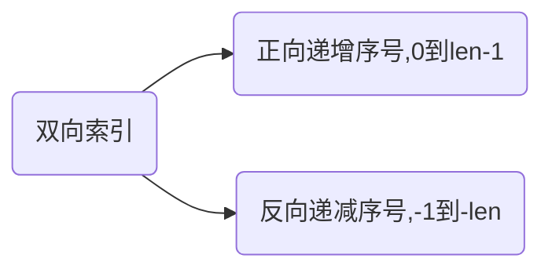
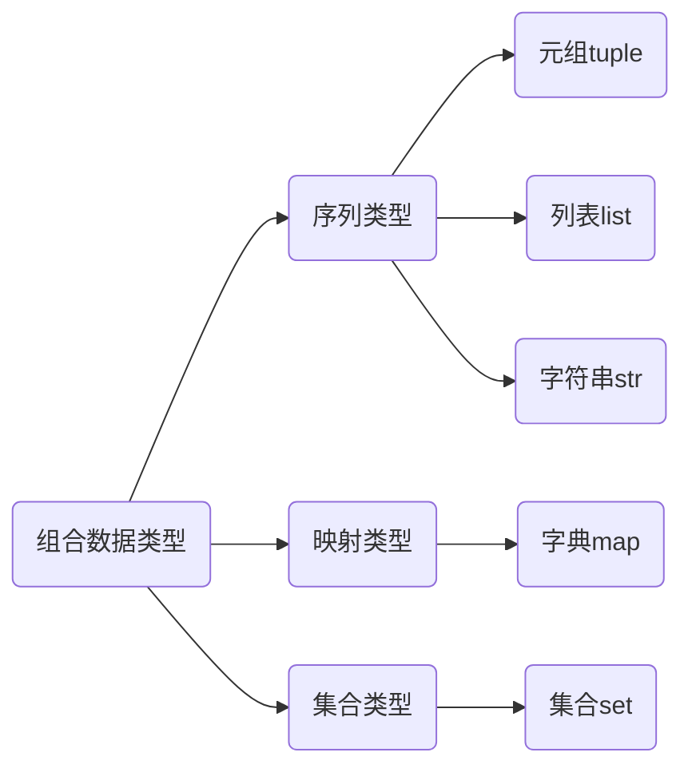

# 1 初识 Python

python 语言是一个<font color="red">语法简洁、跨平台、可扩展的开源通用的脚本语言</font>

python 语言的特点如下：

- 语言简洁：实现相同功能，Python 语言所需的代码行数远低于其他语言的代码行数
- 跨平台：可以在任何安装了解释器的计算机环境中执行
- 强制可读：Python 语言通过强制缩进来体现语句之间的逻辑关系，提高程序的可读性
- 开源：Python 源代码开发，可供任何人去修改、编辑
- 可扩展 + 可嵌入

## 1.1 注释

Python 中的注释有如下两类：

1. 单行注释

   ```python
   # 这一个单行注释
   ```

2. 多行注释

   ```python
   '''
   	这是一个多行注释
   '''
   ```

**注释的用途：**

1. 标明作者和版权信息
2. 解释代码原理或用途
3. 辅助程序调试


## 1.2 命名和保留字

Python 中允许采用<u>大写字母、小写字母、数字、下划线和汉字等字符及其组合</u>给变量命名，我们称该变量名为标识符

标识符的命名也有一些要求：

- 首字母不能是数字

- 中间不能出现空格，长度没有限制

- 不能与 python 中的保留字重名，例如：

  ```
  False、True、with、yield、pass、as、def、raise、global、def、except、lambda、for、from…
  ```

标识符也有一些特性：

1. 标识符对大小写敏感


```
以下不属于Python语言保留字的是( )
A.do
B.while
C.True
D.pass
正确答案: A
```


## 1.3 turtle 库


## 1.4 双向索引

Python 语言中，字符串使用单引号 `''` 或者双引号 `""` 括起来的零个或多个字符，字符串的索引包含两种序号体系



Python 中的字符串提供区间访问，采用 [N:M] 的格式，表示字符串中从 N 到 M(<strong style="color:red">不包含M</strong>)的子字符串，同时 N 和 M 为字符串的索引号，可以<strong style="color:red">统一采用正向索引或反向索引，也可以统一使用反向索引，还可以混合使用正向索引和反向索引</strong>


## 1.5 多种赋值语句

python 中使用等号 `=` 进行赋初值，相较于 C 语言中赋值，python 的赋值形式多样化，包括：

1. 连等赋值

   ```python
   a = b = c = 1
   # 我们都知道，在 C 语言中，多个变量连续初始化是不被允许的，也就是说 int a=b=c=1 这中写法会报错
   ```

2. 拆包赋值

   ```python
   a, b = 1, 2
   ```

3. 拆包赋值搭配占位符`_`和`*`

   ```python
   a = range(10)
   _, b, *c = a
   # b = 1
   # c = [2, 3, 4, 5, 6, 7, 8, 9]
   ```

4. **同步赋值**

   ```js
   # <变量1>, …, <变量N> = <表达式1>, …, <表达式N>
   # 交换 a 和 b
   a, b = b, a
   ```

   :small_red_triangle:<font color="red">注意：Python 解释器会先执行右侧的表达式，再将计算的结果赋值给左边</font>

同步赋值在 Python 中是一个比较实用的概念，利用它我们可以比较简洁地实现变量的交换，我们举例如下：

```python
a = 1
b = 2
a, b = 3, a
print(b)	# 1
```


## 1.6 基本的内置函数

### 1.6.1 input() 

`input()` 用于给从控制台获得用户输入

```js
a = input('提示语句')
```

- 提示语句是可选，例如：

  ```python
  a = input('请输入a的值:')
  print(a)
  ```

  

- <font color="red">特别注意：无论用户输入的是字符还是数字，`input()` 函数统一按照字符串类型输出</font>


### 1.6.2 eval()

`eval()` 函数时 Python 中一个十分重要的函数，它的作用是：

<font color="red">解析字符串形式的表达式，并返回执行的结果</font>

```python
print(eval('1 + 2'))            # 3
print(eval("1.1 + 1.2"))        # 3.3
print(eval("[1, 2]"))           # [1, 2]
print(eval("(1, 2)"))           # (1, 2)
```

**反例：**

```python
print(eval("102C"))     # SyntaxError: invalid decimal literal
eval("1 + 2", "1 + 2")  # TypeError
```


### 1.6.3 print()

`print()` 为一个打印语句

- 当输出纯字符信息时，可以直接将输出内容传递给 `print()` 
- 当输出为变量值，一般需要进行格式化

**格式化方式1：使用 format() 方法**

使用 `format()` 需要我们设置槽位来放置变量，槽的内部样式如下：

```python
{<参数序号> : <格式控制标记>}
```

- 参数序号表示处理的是第几个参数，默认是槽的索引号

  > 如果所有槽都没有指定参数序号，那么参数的个数必须和槽的个数相同，否则报错 `IndexError`

- 格式控制标记用控制显示时的格式

  |   `:`    | `<填充>`                           |                     `<对齐>`                     |     `<宽度>`     |                `<,>`                 |                 `<.精度>`                  |                `<类型>`                |
  | :------: | ---------------------------------- | :----------------------------------------------: | :--------------: | :----------------------------------: | :----------------------------------------: | :------------------------------------: |
  | 引导符号 | 用于填充的单个字符（默认空格填充） | `< 左对齐` `> 右对齐` `^ 居中对齐`（默认左对齐） | 槽的设定输出宽度 | 数字的千位分隔符，适用于整数和浮点数 | 浮点数小数部分的精度或字符串的最大输出长度 | 整数类型 b,c,d,o,x,X；浮点数e、E、f、% |

  对于类型，我们有必要深入了解一下：

  - 整数类型
    - b：输出整数的二进制方式
    - c：输出整数对应的 Unicode 字符
    - d：输出整数的十进制方式
    - o：输出整数的八进制方式
    - x：输出整数的小写十六进制
    - X：输出整数的大写十六进制
  - 浮点数输出格式
    - e：输出浮点数对应的小写字母 e 的指数形式
    - E：输出浮点数对应的大写字母 E 的指数形式
    - f：输出浮点数的标准浮点形式
    - %：输出浮点数的百分形式

**示例**

```python
# 1. 参数序号
s = "{1}的{2}是{0}"
print(s.format("奶奶", "爸爸", "妈妈"))
# 爸爸的妈妈是奶奶

# 2. 字符串的一些格式控制
s = "PYTHON"
print("{0:30}".format(s))       # PYTHON   
print("{0:^30}".format(s))      #             PYTHON            
print("{0:*^30}".format(s))     # ************PYTHON************
print("{:.3}".format(s))        # PYT

# 3. 整数的格式控制
s = 123
print("{}".format(s))       # 123
# print("{:6.4d}".format(s)) # valueError:Precision not allowed in integer format specifier
print("{0:b}, {0:c}, {0:o}, {0:d}, {0:x}, {0:X}".format(s))     # 1111011, {, 173, 123, 7b, 7B

# 浮点数的格式控制
s = 3.1415                 
print("{:%}".format(s))     # 314.150000%
print("{:e}".format(s))     # 3.141500e+00  (默认保留6位小数)
print("{:.2E}".format(s))   # 3.14E+00
print("{:.2f}".format(s))   # 3.14
```


:herb:**扩展：使用 format 对浮点数进行格式控制时的精度问题**

1. 一般情况下，指定保留小数的位数，并四舍五入
2. 当小数有 n+1 位，需要保留 n 位小数，且恰好第 n+1 位为 5，第 n 位为 0，那么将不会进位

```python
print('{:.2f}'.format(2.5051))  # 2.51
print('{:.2f}'.format(2.515))   # 2.52
print('{:.2f}'.format(2.505))   # 2.50
```

[]()

## 1.7 基本数据类型

Python 中有如下数据类型：

- 整型

- 浮点型

- 复数类型（`a + bj` 或者 `a + bJ`）
  - 通过 `z.real` 获取实数部分
  - 通过 `z.imag` 获取虚数部分

  > 对于复数类型，无论它的实数部分还是虚数部分，都是浮点数

- 字符型

- 布尔型（True 和 False）

整数类型的四种进制：

| 进制种类 | 引导符号   | 描述             |
| -------- | ---------- | ---------------- |
| 十进制   | 无         | 默认，1010,-425  |
| 二进制   | `0b`或`0B` | `0b101`、`0B101` |
| 八进制   | `0o`或`0O` | `0o17`、`0O17`   |
| 十六进制 | `0x`或`0X` | `0x1f`、`0X1F`   |


:thinking:**思考题**

1. 既然浮点数可以表示所有的整数数值，Python 为什么还要同时提供整数和浮点数两种数据类型？

   ```
   首先，浮点数是不能表示所有的整数数值的；
   其次，浮点数不仅在表达一些小数的时候会产生误差，在表示大整数时，也会有误差，而int类型不会；
   并且，浮点数能够存储的数据范围是有限的，而整数理论上是无限的
   举个很简单的例子,int(a/b)并不是在任何时候都等于a//b的
   ```


## 1.8 运算符

### 1.8.1 基本算术运算符

大家熟知的运算符，像`+`、`-`、`*` 、`%`在这里就不过多赘述，主要介绍一下`/` 和 `//`，以及`**`

**`/` 和 `//` 的区别**

- 在 Python 2.x 的时候，两个整数的一般除法 `/` 返回的是一个整数；
- 到了 Python 3.x 的时候，两个整数的一般除法 `/` 返回的是一个浮点数，整数除法使用的是 `//` 
- 但是使用 `//` 得到的不一定是整数，也可能是整数，当被除数和除数有一方为浮点数的时候，得到的将是一个带`.0`的浮点数

```python
print(3 / 2)        # 1.5
print(3 // 2)       # 1
print(3.0 // 2)     # 1.0
print(3 // 2.0)     # 1.0
```


**幂运算符`**`**

`**` 在 python 是作为幂运算符来使用，对于 `a**b`，a 作为底数，而 b 作为指数


### 1.8.3 逻辑运算符

在 Python 中，没有 `&&`、`||`、`!`，取而代之的是 `and` 、`or` 、`not`

这里我们需要重点说明的是 `and` 和 `or` ，他们属于逻辑==短路==运算符，具有以下规律：

- `and`：寻找第一个为假的表达式，并最终将表达式的结果返回，若没有找到，则取最后一个表达式的值
- `or`：寻找第一个为真的表达式，并最终将表达式的结果返回，若没有找到，则取最后一个表达式的值


## 1.9 数值操作

### 1.9.1 内置的数值运算函数

| 函数                   | 描述                                     |
| ---------------------- | ---------------------------------------- |
| `abs(x)`               | x 的绝对值（x 可以是整数、浮点数、复数） |
| `divmod(x, y)`         | (x//y, x%y)，输出的结果为一个二元组形式  |
| `pow(x, y [,z])`       | `(x**y)%z`                               |
| `round(x [, ndigits])` | 对 x 四舍五入，保留 ndigits 位小数       |
| max(x1, x2, …, xn)     | 取参数中最大值                           |
| min(x1, x2, …, xn)     | 取参数中最小值                           |

> `abs()` 计算复数的绝对值时，是二维坐标中复数位置到坐标原点的长度

:sparkles:**`abs()` 和 `fabs()` 的区别**

- `abs()` 是内置的函数，不需要导入模块，而 `fabs()` 则需要导入 math 模块才可以使用

- `fabs()` 只适用于 float 或 integer 类型，而 `abs()` 还可以用于复数类型 ，如果我们使用 `fabs()` 来计算复数类型，那么就会报错如下：

  ```
  TypeError: must be real number, not complex
  ```


### 1.9.2 内置的数字类型转换函数

| 函数              | 描述                                                         |
| ----------------- | ------------------------------------------------------------ |
| int(x)            | 将 x 转换为整数，x 可以是浮点数或字符串                      |
| float(x)          | 返回浮点数 x 或者字符串 x 对应的浮点数类型                   |
| complex(re[, im]) | 生成一个复数，实部为 re，虚部为 im，re 可以是整数、浮点数或字符串，im 可以是整数、浮点数但不能是字符串 |


### 1.9.3 math 库

math 库的数学常数

| 常数       | 数学表示            |
| ---------- | ------------------- |
| `math.pi`  | $\pi$               |
| `math.e`   | $e$                 |
| `math.inf` | $\infty$            |
| `math.nan` | $NaN$，非浮点数标记 |

math 库中常见的数值计算函数

| 函数                 | 描述                     |
| -------------------- | ------------------------ |
| `math.fabs()`        | 返回 x 的绝对值          |
| `math.fmod(x,y)`     | 返回 x 与 y 的模         |
| `math.fsum([x,y,…])` | 浮点数精确求和           |
| `math.ceil()`        | $\lceil x \rceil$        |
| `math.floor()`       | $\lfloor x \rfloor$      |
| `math.gcd(a,b)`      | 返回 a 和 b 的最大公约数 |
| `math.sqrt(x)`       | $\sqrt{x}$               |

:small_red_triangle:注意：`math.fsum([x,y,…])` 函数在数学求和运算中十分有用，里面的参数为一个存储多个数据的列表，例如：

```python
print(0.1 + 0.2 + 0.3)				# 0.6000000000000001
print(math.fsum([0.1, 0.2, 0.3]))	# 0.6
```


## 1.10 字符串类型及相关操作

### 1.10.1 字符串的基本操作

字符串是字符的序列表示，可以由一对单引号(' ')，双引号(" ")，三引号(''' ''')构成，其中单引号和双引号表示单行字符串，作用相同，而三引号类似于 JS 里的模板字符串，可以用于单行或多行字符串

字符串里的基本操作

| 操作符         | 描述                                        |
| -------------- | ------------------------------------------- |
| `x + y`        | 字符串拼接                                  |
| `x*n` 或 `n*x` | 复制  n 次字符串 x                          |
| `x in s`       | 判断 x 是否是 s 的子串                      |
| `str[i]`       | 索引，返回第 i 个字符                       |
| `str[N:M]`     | 切片，返回索引第 N 到 第 M 的子串，不包括 M |

**示例**

```python
s = "PYTHON"
x = "ON"
print(s + x)        # PYTHONON
print(s*2)          # PYTHONPYTHON
print(x in s)       # True
print(s[:])         # PYTHON
print(s[0:])        # PYTHON
print(s[:-1])       # PYTHO
print(s[0:-1])      # PYTHO
```


### 1.10.2 格式控制符

- `\n`：换行
- `\t`：水平制表
- `\"`：双引号
- `\'`：单引号
- `\\`：反斜杆


### 1.10.3 内置的字符串处理函数

| 函数     | 描述                                      |
| -------- | ----------------------------------------- |
| `len(x)` | 返回字符串 x 的长度                       |
| `str(x)` | 返回任意类型 x 所对应的字符串形式         |
| `chr(x)` | 返回 Unicode 编码 x 对应的单字符          |
| `ord(x)` | 返回单字符对应的 Unicode 编码             |
| `hex(x)` | 返回整数 x 对应十六进制数的小写形式字符串 |
| `oct(x)` | 返回整数 x 对应的八进制数的小写形式字符串 |

- "chr"  是 "charcode" 的缩写， "ord" 是 "ordinal" 的缩写

```python
# len 里面的参数必须是字符串
print(len("1212"))      # 4
# chr 里面的参数必须是 Unicode 编码格式
print(chr(90))          # Z
# ord 里面的参数必须要是字符串
print(ord('Z'))         # 90
# str 里面的参数可以为任意类型
print(str({1, 2, 3}))   # {1, 2, 3}
```


> :warning:**注意：Python 没有自动类型转换，不同的类型不能直接进行算术运算，例如 "1" + 1 会报错 `TypeError`**


### 1.10.4 内置的字符串处理方法

在 Python 解释器内部，**所有的数据类型都采用面向对象的方式实现，封装为一个类**，字符串也是一个类，它有需要内置的方式，如下：

| 方法                              | 描述                                                         |
| --------------------------------- | ------------------------------------------------------------ |
| `str.lower()`                     | 将 str 的全部字符串小写，并且存储在一个副本中                |
| `str.upper()`                     | 将 str 的全部字符串大写，并且存储在一个副本中                |
| `str.isnumeric()`                 | 当 str 所有的字符都是数字时，返回 True，否则返回 False       |
| `str.isspace()`                   | 当 str 所有的字符都是空格，返回True，否则返回 False          |
| `str.split(sep=None,maxsplit=-1)` | 根据 sep 分割字符串，将分割的元素以列表的形式返回，默认以空格分割，maxsplit 表示最大分割次数 |
| `str.replace(old, new[,count])`   | 返回字符串 str 的副本，将所有的 old 子串替换为 new 子串，并且 指定前 count 次 old 被替换 |

> 字符串的比较从左到右按照 ACSII 的顺序进行比较


# 2 分支、循环、控制语句

## 2.1 程序流程图


## 2.2 分支结构

<strong style="color:red">Python 中没有 switch-case 语句</strong>

python 中多分支语句为：`if-elif-else`


## 2.3 循环语句

1. 遍历循环

   ```python
   for <循环变量> in <遍历结构>:
   	<语句块>
   # 1. 循环 N 次（变量从 0 到 n-1）
   for i in range(n)
   
   # 2. 遍历文件中的每一行
   for line in fn
   
   # 3. 遍历字符串
   for c in s
   
   # 4. 遍历列表
   for item in ls
   ```

2. 无限循环

   ```python
   while <循环条件>:
   	<语句块>
   ```


## 2.4 循环控制语句

1. break：跳出本层循环
2. continue：结束当次循环，进入到下一次循环


# 3 Python 进阶

## 3.1 程序的异常处理

Python 用异常对象（except oject）表示异常情况，遇到错误后，会引发异常。如果异常对象未被处理或捕获，程序就会用所谓的回溯（Traceback）来终止执行。

### 3.1.1 error 对象

 在 python 中，所有的异常必须为一个派生子 BaseException 的类的实例，主要包括如下


### 3.1.2 异常处理结构

python 中主要是通过 try…except 来实现异常处理，其基本格式如下：

```python
try:
	<语句块1>
except <异常类型>:
	<语句块2>
```

**进阶写法**

```python
# 多异常处理语句
try:
	<语句块1>
except <异常类型1>:
	<语句块2>
except <异常类型2>:
	<语句块3>
except <异常类型3>:
	<语句块4>
…
```

```python
# 多层次异常处理
try:
	<语句块1>
except <异常类型1>:
	<语句块2>
else:
	<语句块3>
finally:
	<语句块4>
```

对于多层次异常处理，我们做出解释：

- 如果 try 语句中没有发生异常，那么程序的执行顺序是：try -->else --> finally
- 如果 try 语句中发生异常，那么程序的执行顺序是：try --> except --> finally
- 也就是说，无论是否发生异常，finally 语句是一定会执行的


### 3.1.3 raise 抛出异常

raise 的基本格式如下：

```python
raise [exceptionName [(resson)]]
```

也就存在以下三种情况：

1. `raise`：单独一个 raise，引发当前上下文中捕获的异常，或默认引发 `RuntimeError` 异常
2. `raise exceptionName`：表示引发执行类型的异常
3. `raise exceptionName(reason)`：在引发指定类型的异常的同时，附带异常的描述信息

```python
# 1. raise 单独作为一条语句
try:
    raise		# 但是这种写法已经不提倡，在 Pycharm 会飘红
except RuntimeError:
    print("引发异常")
    
# 2. raise 在抛出异常名的同时，附带异常的提示信息
try:
    a = input("输入一个数：")
    if not a.isdigit():
        raise ValueError("a 必须是数字")
except ValueError as e:
    print("引发异常：", repr(e))
'''
	输入一个数：a
	引发异常： ValueError('a 必须是数字')
'''
```

 


## 3.2 函数

Python 中使用 `def` 保留字定义一个函数，语法形式如下：

```python
def <函数名>(<参数列表>):
	<函数体>
	return <返回值列表>
```

:warning:**注意**

1. Python 是解释执行的，所以函数必须先定义、后调用

   ```python
   def fn():
       print("函数被调用了")
   fn()
   ```

2. 如果函数的调用在定义之前，就会报错 NameError

   ```python
   fn()        # NameError: name 'fn' is not defined
   def fn():
       print("函数被调用了")
   ```

3. 函数之间的调用不受限制

   ```python
   def fn1():
       fn2()
   def fn2():
       print("fn2被调用了")
   fn1()       # fn2被调用了
   ```

4. 语句对函数的调用，必须要在函数定义之后，包括直接调用和间接调用

   ```python
   def fn1():
       fn2()
   fn1()       # NameError: name 'fn2' is not defined
   def fn2():
       print("fn2被调用了")
   ```

   

### 3.2.1 lambda 函数

`lambda` 关键字用于定义匿名函数，语法格式如下：

```python
<函数名> = lambda (<参数列表>) : <表达式>
```


### 3.2.2 函数的参数传递

<font color="red">定义函数的参数称为形式参数，调用函数的参数称为实际参数</font>

在 Python 中，我们定义函数的同时可以直接为这些参数指定默认值，当函数调用时,如果不为这些参数指定值，那么使用默认值替代，我们称这种参数为**可选参数**

```python
def dup(_str, _times=2):
    print(_str*_times)


dup("Hello")                # HelloHello
dup("Hello", 4)             # HelloHelloHelloHello
dup(_times=4, _str="Hello") # HelloHelloHelloHello
```

在函数定义时，如果不确定调用函数时传入的参数个数时，我们也可以通过在参数前增加星号（`*`）实现，<font color="red">带有星号的可变参数只能出现在参数列表的最后</font>，即**不定参数**

```python
def f_sum(_a, *_b):
    print(type(_b))
    for i in _b:
        _a += i
    return _a


print(f_sum(1, 2, 3, 4, 5))
'''
<class 'tuple'>
15
'''
```


### 3.2.3 return 返回语句

<strong style="color:red">Python 中 return 可以返回多个值，多个值以元组类型保存</strong>，例如：

```python
x = func(1, 2)
print(type(x), x)   # <class 'tuple'> (2, 1)
```


### 3.2.4 全局变量和局部变量

- 全局变量是指<u>在函数外定义的变量</u>
- 局部变量是指<u>在函数内定义的变量</u>


对于值类型，在函数中创建的变量相当于局部变量，对其值的修改不会影响外部环境，并且在函数调用执行完成之后，该变量会被回收；

对于引用类型，在函数中引用引用类型的变量，对其值的修改会影响到外部环境

**示例**

```python
x = 1   # x 是全局变量
def fn1():
    x = 10

    
fn1()
print(x)    # 1
```

```python
x = []  # x 是引用数据类型
def fn1(_a):
    x.append(_a)


fn1(1)
print(x)    # [1]
```


:herb:**global** 关键字

在 Python 的函数中，我们也可以<font color="red">通过 global 关键字来声明全局变量</font>

**示例**

```python
x = 1   # x 是全局变量
def fn():
    global x    # 使用 global 来声明全局变量
    x = 10


fn()
print(x)    # 10
```

> :warning:注意：`global` 关键字不能进行初始化


## 3.3 Python 内置函数

### 3.3.1 all()

`all()` 函数一般针对组合数据类型，如果其中每个元素都是 True，则返回 True；如果存在一个元素为 False，则返回 False

```python
ls = [1, 2, 3, 4, 0]
print(all(ls))  # False
```

> :warning:注意：如果组合数据类型为空，那么返回值也是 `True`；对于字典类型，会将字典中的键都取出来进行判断

### 3.3.2 any()

`any()` 函数与 `all()` 函数相反，只要组合数据类型中有一个为 True，则返回 True；如果组合数据类型中全为 False，则返回 False

```python
ls = {0, None, None, 0, 0}
print(any(ls))  # False
ls = {1, 0, 1, 0}
print(any(ls))  # True
```


### 3.3.3 hash()

`hash()` 函数<strong style="color:red">对于能够计算哈希的类型返回哈希值</strong>

- 可计算哈希的类型包括整型（哈希固定）、布尔型（哈希固定）、浮点型（哈希不固定）、字符串（哈希不固定）
- 可计算哈希的类型不包括复合数据类型，例如：列表、字典、集合等等

```python
str = "Hello World"
print(hash(str))    # 哈希不固定
num = 123
print(hash(num))    # 哈希固定为 123
bl = True
print(hash(bl))     # 哈希固定为 1
```


### 3.3.4 id()

`id()` 函数<strong style="color:red">对每一个数据返回唯一的编号，数据不同</strong>

```python
list_1 = {1, 2, 3, 4}
list_2 = {2, 1, 4, 3}
print(id(list_1) == id(list_2)) # False
```


### 2.3.5 reversed()

`reversed()` 函数用于返回组合数据类型的逆序形式（不能用于无序的组合数据类型，例如集合、字典）

```python
ls = [5, 2, 1, 0]
print(list(reversed(ls)))   # [0, 1, 2, 5]
```


### 2.3.6 sorted()

`sorted()` 函数<strong style="color:red">对一个序列进行排序，默认是从小到大排序</strong>

```python
sorted(ls [,reverse=False])
```

**示例**

```python
ls = [5, 1, 0, 2]
print(sorted(ls))                   # 升序
print(sorted(ls, reverse=True))     # 降序
```


### 2.3.7 type()

`type()` 函数用于返回每个数据对应的数据类型

**示例**

```python
var_1 = 1               # int
var_2 = True            # bool
var_3 = 1.2             # float
var_4 = "Hello World"   # str
var_5 = [1, 2, 3]       # list
var_6 = {1, 2, 3}       # set
var_7 = (1, 2, 3)       # tuple
var_8 = {1: 2}			# dict
```


### 2.3.8 zip()

`zip()` 的作用就如同它的名字，用于压缩，官方文档的解释是：<font color="red">创建一个迭代器，用于聚合迭代器的每个元素</font>，**如果每个迭代器不等长，以最短的为准**

```python
a = ['a', 'b', 'c', 'd']
b = [1, 2, 3, 4]
result = zip(a, b)
print(list(result))     # [('a', 1), ('b', 2), ('c', 3), ('d', 4)]
# print(dict(result))
```

我们还可以还原 `zip(rags)`

```python
result = zip(a, b)
origin = list(zip(*result))		# [('a', 'b', 'c', 'd'), (1, 2, 3, 4)]
```


# 4 组合数据类型



## 4.1 序列类型

**序列类型的特点：**

1. 支持成员运算符（`in`）
2. 拥有长度计算函数（`len()`）
3. 支持分片（`[]`）
4. 双向索引体系（有序）

**序列类型的通用操作符和函数**

| 操作符             | 描述                                                   |
| ------------------ | ------------------------------------------------------ |
| x in s             | 判断 x 是否为 s 的元素                                 |
| x not in s         | 如果 x 是否不为 s 的元素                               |
| s + t              | 组合序列 s 和 t                                        |
| s * n 或 n * s     | 将序列复制 n 次                                        |
| s[i]               | 索引，返回序列的第 i 个元素                            |
| s[i: j]            | 分片，返回序列中第 i 到第 j-1 个元素的序列（不包括 j） |
| s[i: j: k]         | 步骤分片                                               |
| len(s)             | 序列s的元素个数                                        |
| min()              | 序列s中的最小元素                                      |
| max()              | 序列s中的最大元素                                      |
| s.index(s[i[, j]]) | 序列s中从i到j 位置中第一次出现元素x的位置              |
| s.count(x)         | 序列s中出现x的总次数                                   |


:spiral_notepad:**序列类型的注意点**

1. 序列类型是一维向量，元素之间存在先后关系，可以通过序号访问
2. 序列类型主要包括：<u>字符串、元组、列表</u>
3. 元组和字符串一旦创建就无法修改
4. 元组类型除了表达固定数据项外，还可以用于：<u>函数多返回值、多变量同步赋值、循环遍历</u>等


### 3.1.1 列表类型

**列表**中特有的函数或方法

| 函数或方法                    | 描述                                                 |
| ----------------------------- | ---------------------------------------------------- |
| `del ls[i: j]`                | 删除列表 ls 第 i 到第 j 项数据，等价于 ls[i: j] = [] |
| `del ls[i: j: k]`             | 删除列表 ls 第 i 到第 j 项以 k 为步数的数据          |
| `ls += lt` 或 `ls.extend(lt)` | 将列表 lt 添加到 ls 中                               |
| `ls *= n`                     | 更新 ls，其元素重复 n 次                             |
| `ls.append(x)`                | 在列表 ls 最后添加一个元素 x                         |
| `ls.clear()`                  | 删除 ls 中全部元素                                   |
| `ls.copy()`                   | 拷贝 ls 的元素                                       |
| `ls.insert(i, x)`             | 在列表 ls 的第 i 个位置增加元素 x                    |
| `ls.pop(i)`                   | 在 ls 中弹出元素 i，默认弹出最后一个元素             |
| `ls.remove(x)`                | 将列表中出现的第一个元素 x 删除                      |
| `ls.reverse()`                | 反转列表                                             |


:herb:**数组和列表的区别**

1. **数组是静态的，而列表是动态的**，创建一个数组时，必须提前指定数组的大小，而列表则没有预分配大小的要求和限制，创建列表变量时不需要知道元素个数
2. **数组要求元素类型一致，列表则不需要**


## 4.2 集合类型

集合是包含0个或多个数据项的==无序==组合，集合中的元素==不可重复==，并且只能是==固定数据类型==，例如<font color="red">整数、浮点数、字符串、元组</font>等都可以作为集合的元素，而<font color="red">列表、字典和集合</font>类型本身都是可变数据类型，不能作为集合的元素出现

由于集合是无序类型，<font color="red">它没有索引和位置的概念，不能分片，但是可以动态增加或删除</font>

我们可以通过函数 `set()` 来生成集合，由于集合中的元素是独一无二的，所以我们可以利用集合来==去重==

**集合类型的操作符**

| 操作符                             | 描述                                   |
| ---------------------------------- | -------------------------------------- |
| `S-T` 或 `S.difference(T)`         | 返回一个新的集合，为集合S和集合T的差集 |
| `S-=T` 或 `S.difference_update(T)` | 更新集合S，为S和T的差集                |
| `S&T`或`S.intersection(T)`         | 返回一个新集合，为S和T的交集           |
| `S&=T`或`S.intersection_update(T)` | 更新集合S，为S和T的交集                |
| `S^T`                              | 返回一个新集合，为S\|T-S&T             |
| `S|T`或`S.union(T)`                | 返回一个新集合，为S和T的并集           |
| `S|=T`或`S.update(T)`              | 更新集合S，为S和T的并集                |
| `S<=T`或`S.issubset(T)`            | 判断S是否与T相同或S是T的子集           |
| `S>=`或`S.isupperset(T)`           | 判断S是否与T相同或S是T的超集           |

**集合类型的操作方法或操作函数**

| 操作函数或方法 | 描述                                                       |
| -------------- | ---------------------------------------------------------- |
| `S.add(x)`     | 如果x不在集合S中，将x增加到s                               |
| `S.clear()`    | 移除S中所有的数据项                                        |
| `s.copy()`     | 返回S的一个副本                                            |
| `S.pop()`      | 随机弹出S中的元素                                          |
| `S.discard(x)` | 如果x在S中，移除该元素；如果不在，不报错                   |
| `S.remove(x)`  | 如果x在集合S中，则移除该元素；如果不在则产生 KeyError 异常 |
| `len(S)`       | 返回集合S中元素的个数                                      |
| `x in S`       | 判断x是否在S中                                             |
| `x not in S`   | 判断x是否不在S中                                           |


## 4.3 字典类型

Python 语句中的字典通过大括号建立起来，主要是通过映射来实现的，建立模式如下：

```python
{<键1>:<值1>, <键2>:<值2>, …}
```

字典类型的特点：

1. 字典里面的每一个元素（即每一对键值对）之间<strong style="color:red">没有顺序且不能重复</strong>

   > 这里的 "重复" 包括了 key 值唯一，不能重复

2. 字典是实现键值对映射的数据结构，它<strong style="color:red">采用固定数据类型的键作为索引</strong>，换言之，列表、集合、字典都不能作为映射的键

3. 字典的长度是可变的，可以通过键来实现 CRUD

4. 通过 `dict()` 将其他类型转化为字典类型，定义一个空字典，<strong style="color:red">我们可以使用 `dict()` 或 `{}`</strong>

   > 通过 `{}` 创建的是字典，而不是字符串


### 4.3.1 字典类型的函数和方法

| 函数或方法                  | 描述                                               |
| --------------------------- | -------------------------------------------------- |
| `<d>.keys()`                | 返回所有的键信息                                   |
| `<d>.values()`              | 返回所有的值信息                                   |
| `<d>.items()`               | 返回所有的键值对                                   |
| `<d>.get(<key>, <default>)` | 键存在则返回相应值，否则返回默认值                 |
| `<d>.pop(<key>, <default>)` | 键存在则返回相应值，同时删除键值对，否则返回默认值 |
| `<d>.clear()`               | 删除所有的键值对                                   |
| `del <d>[<key>]`            | 删除字典中的某一个键值对                           |
| `<key> in <d>`              | 判断 key 是否在字典中                              |

> 如果我们想要增加一个键值对可以通过中括号（[]）的形式添加；字典没有 `remove()` 方法 


:warning: **注意事项**：Python 不允许同时对键和值进行遍历

```python
demo = {"China": "Beijing", "Japan": "Tokyo"}
for k, v in demo:
    print(k, v)     # ValueError
```


解决方法1：使用 `dict[key]`的形式来获取键所对应的值

```python
demo = {"China": "Beijing", "Japan": "Tokyo"}
for k in demo:
    print(k, demo[k])
```


解决方法2：使用 `dict.items()` 的方法

```python
demo = {"China": "Beijing", "Japan": "Tokyo"}
for k, v in demo.items():
    print(k, v)
```


# 4 模块

Python 中提供了许多库供我们使用有一些是 Python 内置的，有一些则是需要我们自己导入，我们需要使用 `pip` 命令导入


## 5.1 pip 命令

`pip` 的全称是：package  installer for python，是 Python 的包管理工具

### 5.1.1 换源

由于 Python 仓库的服务器设置在国外，国内下载速度十分慢，所以我们需要更换镜像

**查看当前镜像地址**

```bash
pip3 config list
```

**更换默认源**

```bash
pip config set global.index-url https://pypi.tuna.tsinghua.edu.cn/simple/
```

**国内常用镜像源**

```
http://mirrors.aliyun.com/pypi/simple/ 		# 阿里云
https://pypi.mirrors.ustc.edu.cn/simple/  	# 中国科技大学
http://pypi.douban.com/simple/  			# 豆瓣
https://pypi.tuna.tsinghua.edu.cn/simple/ 	# 清华大学 
```

> 建议使用以 https 开头的镜像源


### 5.1.2 安装和卸载

**安装库的最新版本**

```bash
pip install package_name
```

**指定安装库的版本**

```bash
pip install package_name==版本号
```

**卸载库**

```bash
pip uninstall package_name
```


### 5.1.3 查看当前已经安装的库

```bash
pip list
```


### 5.1.4 升级

```bash
# 查看当前 pip 的版本
pip --version
# 升级当前的 pip 库
pip install --upgrade pip
# 升级第三方包
pip install --upgrade package_name
```


## 5.2 jieba

jieba 库是 Python 中一个非常重要的第三方中文分词函数库。

我们如果要使用首先就得安装和引用：

```bash
# 安装 jieba 库
pip install jieba 
```

```python
# 引用 jieba 库
import jieba
```

jieba 库支持三种分词模式：

1. 精确模式：将句子最精确地切开，适合文本分析
2. 全模式：将句子中所有可以成词的词语都扫描出来，速度非常快，但不能消除歧义
3. 搜素引擎模式：在精确模式下，对长词再次切分，提高召回率，适合于搜索引擎分词

| 函数                          | 描述                                         |
| ----------------------------- | -------------------------------------------- |
| `jieba.cut(s)`                | 精确模式，返回一个可迭代的数据类型           |
| `jieba.cut(s, cut_all=True)`  | 全模式，输出文本s中所有可能出现的单词        |
| `jieba.cut_for_search(s)`     | 搜索引擎模式，适合搜索引擎建立索引的分词结果 |
| `jieba.lcut(s)`               | 对应`cut(s)`，返回的是一个列表               |
| `jieba.lcut(s, cut_all=True)` | 对应`cut(s, cut_all=True)`，返回的是一个列表 |
| `jieba.lcut_for_search(s)`    | 对应`cut_for_search(s)`，返回的是一个列表    |
| `jieba.add_word(w)`           | 向分词库中添加新词 w                         |


# 6 文件相关操作

文件可以分为：

- 文本文件：由单一特定的编码字符组成
- 二进制文件：由 0 和 1 组成

Python 中对文件的操作步骤：

1. 打开
2. 操作
3. 关闭

文件的打开模式：

```python
<变量名> = open(<文件路径>, <打开模式>)
```

**打开模式分类**

| 文件的打开模式 | 含义                                                         |
| -------------- | ------------------------------------------------------------ |
| 'r'            | 只读模式，如果文不存在，返回异常 FileNotFoundError，默认值   |
| 'w'            | 覆盖写模式，文件不存在则创建，存在则完全覆盖                 |
| 'x'            | 创建写模式，文件不存在则创建，存在则返回异常 FileExistsError |
| 'a'            | 追加写模式，文件不存在则创建，存在则在文件最后追加内容       |
| 'b'            | 二进制文件模式                                               |
| 't'            | 文本文件模式，默认值                                         |
| '+'            | 与 r/w/x/a 一同使用，在原功能的基础上增加读写功能            |

> 前四种模式可以和后三种模式搭配使用，其中特别注意 'r+' 模式，这种模式相当于 'r' + 'a' 模式


:small_red_triangle:<font color="red">们在打开文件并对文件操作完毕之后，一定要记得关闭文件，否则文本会一直处于被占用的状态</font>

我们可以用如下写法来完成打开 => 操作 => 关闭这一系列的操作：

```python
try:
	f = open('path', 'r')
	print(f.read())
finally:
	if f:
		f.close()
```

但是这种写法过于繁琐，Python 3.x 为我们提供了 `with` 关键字来帮助我们自动调用 `close()` 函数

```python
with open('path', 'r') as f:
	print(f.read())
```


:star:**对文件模式的补充说明**

1. 当使用 `a+` 模式打开时，可读可写，只是在读文件的时候会发现读出来的数据为空。

   **原因**：在 `a+` 模式下，是在文件末尾添加内容，所以此时光标指向的是文件末尾，自然读不到数据

   ```python
   f = open('a.txt', 'a+')
   f.write("abc")
   print(f.read())     # 内容为空
   f.close()
   ```

2. 当使用 `w+` 模式时，可读可写，但是如果想要读取内容的话，只能在写的时候，同时读取其中的内容，相当于只能读取刚才写入的内容，无意义

3. 当使用 `r+` 模式时，可读可写，但是必须要保证文件存在，每次写入，光标都会从文件首部开始，属于覆盖写，但是如果读取，即使用了 `read()` 后，再写入就属于追加写

   ```python
   f = open('test.txt', 'r+')
   f.write('我不会喜欢你')       # 内容为：我不会喜欢你
   f.close()
   # 第二次写入
   f = open('test.txt', 'r+')
   f.write('其实我')
   f.close()                       # 内容为： 其实我喜欢你
    
   # 第三次写入
   f = open('test.txt', 'r+')
   print(f.read())                # 内容为： 其实我喜欢你
   f.write(', I love you')
   f.close()                        # 内容为：  其实我喜欢你， I love you
   ```


