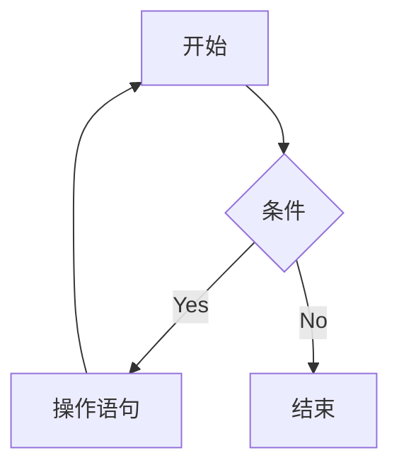
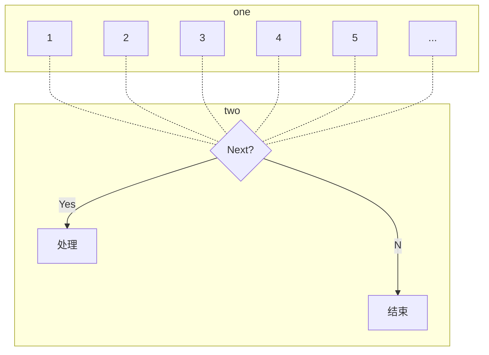

> Life is short ，you need Python

Python的英文即==蟒蛇==，取自 BBC 一款电视剧里面的角色==派森== 

[toc]


# 解释器

计算机不能直接理解任何除机器语言以外的语言，所以必须要把程序员所写程序语言翻译成机器语言，计算机才能执行程序。==将其他语言翻译成机器语言的工具，被称为编译器==

编译器翻译的方式有两种：一种是==编译==，另一种是==解释==。两种方式之间的区别在于==翻译的时间点的不同==。当编译器以解释方式运行的时候，也称为==解释器==

解释器是对每一行逐行翻译后再逐条执行，而编译器是首先对整段代码进行编译之后生成可执行文件执行，从这一点来看，编译器型语言的执行速度是要快于解释型语言的，因为只需要执行一次，但解释型语言的跨平台性要强于编译型语言


# Python 环境安装（windows）

进入 Python 官网（https://www.python.org/）找到 Download,下载最新版本

进入安装界面


进入到下一界面后，默认全选


在下一界面中，我们可以看到 Python  的安装路径非常长，不利于下次中寻找，可以更改安装位置


之后点击安装即可，安装完成后选择关闭禁用路径长度限制


# 第一个 Python 程序


```python
print("Hello World!")
```


打开cmd ，输入 python ,进入控制台后输入 python 代码即可


# PyCharm 开发工具的安装

PyCharm 集成开发工具（IDE），是全球 Python 开发者，使用最频繁的工具

我们首先进入官网进行安装（https://www.jetbrains.com.cn/en-us/pycharm/）

安装的过程一直点击 next 即可

我们在安装完成过后，打开界面，选择新建 project 


在选择好工程路径后，添加 Python 解释器，会发现显示 `<No interpreter>`,这时候我们选择右边的添加解释器，选择本地解释器中的系统解释器，软软件会帮助我们自动识别


在点击 OK 后选择 创建，这时候我们的工程就已经创建完成。

之后我们再在工程文件下面新建一个 Python 文件


至此，我们就可以开始愉快地书写代码了


# PyCharm 的基础使用

1.修改主题


2.修改默认字体和大小


在 settings 里面找到 font ,之后就可以直接对字体样式和字体大小进行修改

我们也可以在设置里面的 keymap 中设置快捷键，选择添加鼠标快捷方式


将 increase font size 的快捷键设置为 Ctrl + wheel up,将decrease font size 的快捷键设置为 Ctrl + wheel down 

3.将界面设置为中文

在 plugins 里面找到简体中文语言包，下载安装即可


同时我们还可以添加翻译插件 Translation


4.常用快捷键

ctrl + alt + S：打开软件设置

ctrl + D：复制当前代码

shift + alt + page up/down：将当前代码上移或下移

ctrl + shift + F10：运行当前代码

shift + F6：重命名文件

ctrl + A：全选

ctrl + c/v/x：复制、粘贴、剪切

ctrl + F：搜索


# 字面量

<table>
    <tr>
        <th><center>类型</center></th>
        <th><center>描述</center></th>
        <th><center>说明</center></th>
    </tr>
    <tr>
       <td rowspan="4">数字(Number)</td>
       <td rowspan="4">支持<br>
        	<ul>
                <li>整数</li>
                <li>浮点数</li>
                <li>复数(complex)</li>
                <li>布尔(bool)</li>
           </ul>
        </td>
        <td>整数(int),例如：10、-10</td>
    </tr>
   	<tr>
        <td>浮点数(float),如：13.14、-13.14</td>
    </tr>
   	<tr>
    	<td>复数(complex),如：4+3i</td>
    </tr>
    <tr>
    	<td>布尔(bool),例如：true、false</td>
    </tr>
    <tr>
    	<td>字符串(String)</td>
        <td>描述文本的一种数据类型</td>
        <td>字符串是由任意数量的字符组成</td>
    </tr>
    <tr>
    	<td>列表(List)</td>
        <td>有序的可变序列</td>
        <td>Python 中使用最频繁的数据类型，可有序记录一堆数据</td>
    </tr>
    <tr>
    	<td>元组(Tuple)</td>
        <td>有序的不可变序列</td>
        <td>可有序记录一堆不可变的 Python 数据集合</td>
    </tr>
    <tr>
    	<td>集合(Set)</td>
        <td>无序的不重复集合</td>
        <td>可无序记录一堆不重复的 Python 数据集合</td>
    </tr>
   	<tr>
    	<td>字典(Dictionary)</td>
        <td>无序 Key-value 集合</td>
        <td>可无序记录一堆 key-value 型的 Python 数据集合</td>
    </tr>
</table>


​    字面量：代码中的固定值被称为字面量


# 注释

注释：在代码中对程序代码进行解释说明的文字

作用：注释不是程序，不能被执行，它只是对程序代码进行解释说明，让别人可以看懂程序代码的作用，增强程序的可读性

1.单行注释

语法

```python
# 这是一个注释
```

注意：#号和注释内容一般建议以一个空格隔开


2.多行注释

语法

```python
"""
	我是一个多行注释
"""
```


# 变量

变量：在程序运行时，能存储计算结果或能表示值的抽象概念

语法格式

```python
变量名称 = 变量值
```

举例：

```python
money = 10
print("我钱包里面有", money)   # 字符串之间拼接可以逗号"，"连接，但后面必须要加空格
# 单行注释出现在行内时，前面需要加上两个空格
```


## 小测试

```python
# 钱包余额，初识余额50
money = 50
# 冰淇淋10元
iceCream = 10
# 可乐5元
Coco = 5
print("当前钱包余额：", 50, '元')
print("购买了冰淇淋,花费：", 10, '元')
print("购买了可乐,花费：", 5, '元')
print("最终，钱包剩余：", 35, '元')
```


# 数据类型

目前入门阶段，我们主要接触的如下三种类型

| 类型   | 描述             | 说明                           |
| ------ | ---------------- | ------------------------------ |
| string | 字符串类型       | 用双引号引起来的数据都是字符串 |
| int    | 整型（有符号）   | 数字类型，存放整数             |
| float  | 浮点型（有符号） | 数字类型，存放小数             |


## 查看数据类型：type()语句的使用

1.直接打印输出类型信息

```python
# 1.在 print 语句中，直接输出类型信息
print(type("黑马程序员"))
print(type(666))
print(type(13.14))

```

2，用变量存储 type() 类型结果

```python
# 2.用变量存储 type() 结果
type1 = type("黑马程序员")
type2 = type(666)
type3 = type(13.14)
print(type1, type2, type3)

```

> 之所以可以使用变量储存变量的类型信息是由于 type() 会给出返回值

3.除了直接查看字面量的类型，我们还可以通过 type() 查看变量存储的数据的类型

问：变量有类型？

答：我们通过 type(变量) 可以输出类型，查看的是<font color="red">数据的类型</font>,因为变量是无类型的，但是它存储的数据有类型。而字符串变量表示变量存储了字符串而不是表示变量就是字符串。


# 数据类型转换

## 为什么要转换类型？

数据类型，在特定场景下，是可以相互转换的，例如字符串转数字或者数字转字符串

而数据类型转换是我们日后经常使用的功能,例如：

1. 从文件中读取的数字，默认是字符串，需要我们转换为数字
2. 后序学习的 input() 语句，默认结果是字符串，如果需要数字，那么也需要我们进行转换
3. 将数字转换为字符串用以写出到外部系统
4. …


## 常见的转换语句

| 语句（函数） | 说明                  |
| ------------ | --------------------- |
| int(x)       | 将 x 转换为一个整数   |
| float(x)     | 将 x 转换为一个浮点数 |
| str(x)       | 将 x 转换为字符串     |

> 同前面学习的 type() 语句类似，转换语句也是有返回值的

<font color="red">注意：任何类型都可以转换为字符串，但字符串如果想要转化为数字，就必须要保证字符串里面的内容是数字才行</font>


## 整数与浮点数之间的转换

```python
# 整数转化为浮点数
a = 12
b = float(a)
print(type(b), b)

# 浮点数转化为整数
a = 13.14
b = int(a)
print(type(b), b)  # 丢失精度
```

最终显示结果为：

```
<class 'float'> 12.0
<class 'int'> 13
```


# 标识符

标识符：是用户在编程时所使用的的一系列名字，用于给变量、类、方法等命名


## 标识符的命名规则

Python 中，标识符命名的规则主要有3类：

- 内容限定
- 大小写敏感
- 不可使用关键字

标识符命名中，只允许出现英文、中文、数字和下划线（_）这四类元素，其他的内容都不被允许，但不推荐使用中文。<font color="red">数字不允许作为首字符出现</font>

一些关键字是以大写字母开头，例如

```python
False
True
None
```

当我们取名为 false、true、none 这些以小写字母开头的英文单词时也是不会产生冲突的


## 变量的命名规范

1.见名知义

2.下划线命名法

多个单词组合变量名，用下划线作为分隔符

3.英文字母全小写

命名变量中的英文字母，应全部小写


# 运算符

## 算术运算符

| 运算符 | 描述   |
| ------ | ------ |
| +      | 加     |
| -      | 减     |
| *      | 乘     |
| /      | 除     |
| //     | 取整除 |
| %      | 取余   |
| **     | 指数   |


## 赋值运算符

| 运算符 | 描述                           |
| ------ | ------------------------------ |
| =      | 将等号右边的结果赋值给等号左边 |


## 复合赋值运算符

将基本运算符和赋值运算符相结合

| 运算符 | 描述             |
| ------ | ---------------- |
| +=     | 加法赋值运算符   |
| -=     | 减法赋值运算符   |
| *=     | 乘法赋值运算符   |
| /=     | 除法赋值运算符   |
| //=    | 取整除赋值运算符 |
| **=    | 幂赋值运算符     |
| %=     | 取模赋值运算符   |

# 字符串扩展

## 字符串的三种定义方式

字符串在 Python 中有多种定义方式

1. 单引号定义法：name = '黑马程序员'

2. 双引号定义法：name = "黑马程序员"
3. 三引号定义法：name = """黑马程序员"""

> 注意：三引号注释法和多行注释的写法相同，同样支持换行操作，但如果我们使用变量去接受它的时候，他就转换成为了字符串


## 字符串的引用嵌套

当我们想要定义的字符串本身是包含单引号、双引号自身时，我们可以有多种解决方案，如下：

- 单引号定义法，可以内含双引号
- 双引号定义法，可以内含单引号
- 可以使用转义字符（\）来将引号解除效用，变成普通字符

```python
print('我在b站看"黑马程序员"')
print("我在b站看'黑马程序员'")
print("我在b站看\"黑马程序员\"")

```


## 字符串拼接

如果我们有两个字符串字面量，先要将其拼接为一个字符串，那么可以通过 "+" 连接这两个字面量即可，当然，"+" 也可以用于变量与变量或变量与字面量

```python
name = "itheima"
print("我的名字是：" + name + ",可以教大家IT技能")

```

现在想问：我们是否可以通过 "+" 将字符串与数字类型进行拼接呢？例如如下代码：

```python
name = "itheima"
tel = 4006189098
print("我的名字是：" + name + ",可以教大家IT技能" + "电话是：" + tel)

```

我们会发现运行出错，提示错误信息：

```
TypeError: can only concatenate str (not "int") to str
```

所以我们得出结论：==字符串拼接无法和非字符串类型进行拼接==


## 字符串格式化

拼接字符串的缺点：

1. 变量过多，拼接起来比较麻烦
2. 字符串无法和数字或其他类型进行拼接

1.占位式拼接

通过 `%s` 来实现占位式拼接，其中：

- % 表示：占位
- s 表示：将变量转换为字符串并放入占位的地方

例1：

```python
name = "黑马程序员"
message = "学IT就来 %s" % name
print(message)
```

例2：

```python
class_num = 57
avg_salary = 16781
message = "Python 大数据学科，北京%s期，毕业平均工资%s" % (class_num, avg_salary)
print(message)

```

<font color="red">注意：多个变量占位，变量要用括号括起来，并按照占位的顺序填入</font>


Python中，其实支持非常多的数据类型占位

最常用的是如下三类：

| 格式符号 | 说明                             |
| -------- | -------------------------------- |
| %s       | 将内容转换成字符串，放入占位位置 |
| %d       | 将内容转换成整数，放入占位位置   |
| %f       | 将内容转换为浮点型，放入占位位置 |

```python
name = "传智播客"
set_up_year = 2006
stock_price = 19.19
message = "我是%s，创立于%d,今日股票价格为%.2f" % (name, set_up_year, stock_price)
print(message)
```


## 数字精度控制

我们可以使用辅助符号"m.n"来控制数据的宽度和精度

- m：控制宽度，要求是数字，设置的宽度小于数字自身，不生效
- .n：控制精度，要求是数字，会对小数的<font color="red">四舍五入</font>

例如：

```python
number = 13.145
num = "%6.2f" % number
print(num)

```

在控制台显示的结果为：

```
 13.14 # 可以看到最左边有一个空格占位，并且小数点也算一个宽度
```


## 快速格式化

语法

```python
f"内容{变量}"
```

> 特点：1.不限制数据类型；2.不做精度控制

举例如下：

```python
name = "传智播客"
set_up_year = 2006
stock_price = 19.99
print(f"我是{name},我成立于{set_up_year},今天的股价是{stock_price}")
```


## 表达式的格式化

表达式的定义：一条具有明确执行结果的代码语句

表达式的格式化指的是在无需使用变量进行数据存储的时候，可以直接格式化表达式，简化代码

例1：

```python
print("1 * 1 的结果为 %d" % (1*1))
```

例2：

```python
print(f"1 * 1 的结果为 {1*1}")
```

例3：

```python
print("字符串在 Python 中的类型是：%s" % type("字符串"))
```


# 数据输入语句

- 数据输出：print
- 数据输入：input

使用方法：

1. 使用 `input()` 语句可以从键盘中获取输入
2. 使用一个变量接受（存储）input  语句获取的键盘输入数据即可

```python
print("请告诉我你是谁")
name = input()
print("我知道了，你是: %s" % name)
```

当然，提示信息也可以写到 input 里面，例如：

```python
name = input("请告诉我你是谁?")
print("我知道了，你是: %s" % name)
```

显示结果如下:


总结

1. `input()`语句功能是，获取键盘输入的数据
2. 可以使用：input(提示信息)，用以在使用者输入内容之前提示信息
3. 要注意，无论键盘输入什么类型的数据，获取到的数据永远都是<font color="red">字符串类型</font>


# 布尔类型和比较运算符

布尔类型的字面量：

- True：表示真
- False：表示假

比较运算符

| 运算符 | 描述                               |
| ------ | ---------------------------------- |
| ==     | 判断内容是否相等                   |
| !=     | 判断内容是否不相等                 |
| >      | 判断左侧内容是否大于右侧内容       |
| <      | 判断运算符左侧内容是否小于右侧内容 |
| >=     | 判断左侧内容是否大于等于右侧内容   |
| <=     | 判断左侧内容是否小于等于右侧内容   |


# if-else + if-elif-else 判断语句

## if 语句的基本格式

  语法格式

```python
if condition:
	expression1
    exoression2
    …
# 表达式的前面需要有四个空格作为缩进
```

练习案例：

1.通过input语句，获取键盘输入，为变量age赋值。（注意转换成数字类型
2.通过if判断是否是成年人，满足条件则输出提示信息，如下：

```
欢迎来到黑马儿童游乐场，儿童免费，成人收费。
请输入你的年龄：30
您已成年，游玩需要补票10元。
祝您游玩愉快。
```

代码如下：

```python
print("欢迎来到黑马儿童游乐场，儿童免费，成人收费。")
age = input("请输入你的年龄：")
age = int(age)
if age >= 18:		# 比较的对象必须是同类型
    print("您已成年，游玩需要补票10元。")
    print("祝您游玩愉快。")
```


## if else 语句的组合用法

语法格式：

```python
if condition:
	expression1
    expression2
    ……
else:
    expression1
    expression2
    ……
```


## if-elif-else 语句

语法格式

```python
if condition_1:
	expression1
    expression2
    ……
elif condition_2:
    expression1
    expression2
    ……
elif condition_n:
    expression1
    expression2
    ……
else 
	expression1
	expression2
    ……
```

例如：

```python
height = int(input("请输入您的身高(cm):"))
vip_level = int(input("请输入你的VIP等级(1-5):"))
if height < 120:
    print("您的身高小于120cm,可以免费！")
elif vip_level > 3:
    print("您的VIP等级大于3，可以免费！")
else:
    print("抱歉，你的条件不满足免费要求，需要购票！")

```

> 其实我们会发现，上述的一个简单的判断需要购票程序尚且有不完善的地方，比如同时满足身高小于120cm并且VIP等级大于3时输出的语句中只涉及到身高，但却与VIP等级无关，这是由于多级判断是互斥且有序的


## 判断语句的嵌套

基础语法：

```python
if condition1:
	expression1;
    expression2;
    …
    if condition2:
        expression1;
        expression2;
        …
```

如上，只有当第一个条件满足的时候才会去执行第二个条件

嵌套的关键在于：==空格缩进==

通过空格缩进来决定语句之间的==层次关系==

除此之外，如果一个判断语句要关联多个判断可以使用 and 或者 or 作为联结词


## 综合案例

案例：定义一个数字（1~10，随机产生），通过3次判断来猜出数字，每次猜不中会提示大了或者小了

```python
import random
num = random.randint(1, 10)      # 1.随机产生一个1-10范围内的数字
# 2.通过if判断语句进行数字的猜测
flag = True
count = 1
while flag:
    print("这是您的第%d次回答" % count)
    guess = int(input("请输入您猜测的数字:"))
    if count < 3 and guess < num:
        print("小了")
        count = count + 1
    elif count < 3 and guess > num:
        print("大了")
        count = count + 1
    elif count < 3 and guess == num:
        print("回答正确")
        break
    else:
        print("您一共回答了%d次都没有回答正确，正确答案为%d" % (count, num))
        break

```

> 注意：
>
> Python 没有自增和自减运算符：Python 里面的数值和字符串之类都是不可变对象，对不可变对象操作的结果都会产生一个新的对象。在 C/Java 中，会把变量的数据改变，而变量指向的内存地址不发生改变，而在 Python 解释器中，是先创建运算出来的新的对象，再将这个地址分配给该变量。


# 循环语句

## while 循环

### 基础语法

```python
while condition:
	expression1
	expression2
	…
# 只要条件满足就会一直循环下去
```

例1：打印100次"小美，我喜欢你"

```python
i = 0
while i < 100:
    print("小美，我喜欢你")
    i += 1
```

例2：通过 while 循环求 1-100 的和

```python
i = 1
Sum = 0
while i <= 100:
    Sum += i
    i += 1
print("1+2+……+100 结果为 %d" % Sum)

```

 

### while 无限循环

我们找到，当 while 循环里的条件为 True 时，循环就会一直执行下去，所以当我们需要写一个无限循环语句时可以这么写：

```python
flag = True
while flag:
	expression
	…
```


### while 循环语句的嵌套循环

语法

```python
while condition1:
	expression
	…
	while condition2:
		expression
		…
```

案例：打印九九乘法表

```python
i = 1
while i <= 9:
    j = 1       # 每次内层循环结束后 j 的值都需要重置为1
    while j <= i:
        print("%d * %d = %d\t" % (j, i, i*j), end="")       # 通过在最后添加一个 end = ""来强制不换行
        j += 1
    print()		#print()就相当于一个换行，而如果我们写print('\n')就会换行两次
    i += 1

```


## for 循环

除了 while 循环语句，Python 同样提供了 for 循环语句。两者能完成的功能基本差不多，但仍然有一些区别：

- while 循环的循环条件是自定义的，<font color="red">自行控制循环条件</font>
- for 循环是一种"轮询"机制，是对一批内容进行<font color="red">逐个处理</font>

while 循环控制机理如下：



for 循环控制机理如下：



for 循环语法

```python
for 临时变量 in 待处理数据集(序列)
	expression
```

for 循环需要注意的点：

- 无法定义循环条件，只能被动地取出数据处理
- 要注意，循环内的语句，需要有空格处理


练习：统计字符串" itheima "中字符"a"的个数

```python
count = 0
for var in "itheima":
    if var == "a":
        count += 1
print(f"字符串\"itheima\"中一共有{count}个\"a\"")

```


### range 语句

在 for 循环语句的语法中，待处理数据集，严格意义上来说，称之为：<font color="red">序列类型</font>

序列类型是指：其内容可以一个个依次取出来的一种类型，包括：

- 字符串
- 列表
- 元组
- …

语法1：

```python
range(num)
```

获取的是一个从 0 开始，到 （num-1） 结束的数字序列

> 例如，我们通过range(5) 可以得到的序列为：{0,1,2,3,4}


语法2:

```python
range(num1,num2)
```

获取的是一个从 num1 开始，到 （num2-1）结束的数字序列（不包含 num2 本身）


语法3：

```python
range(num1,num2,step)
```

获取的是一个从 num1 开始，到 （num2-1） 结束的数字序列，其中步长为 step


### for 循环临时变量作用域

观察下列代码：

```python
for i in range(5):
	print(i)
print(i)
```

思考，代码的最后一行`print(i)`可以正确执行吗？

当我们放到编译器里面去执行发现可以成功执行，显示为：

```
0
1
2
3
4
4
```

其实这种写法，从规范上来说是不可以的，但实际上可以，这就涉及到 range 的变量作用域

对于 for 循环的临时变量，在编程规范上，作用域只限定在 for 循环内部，但如果在外部访问临时变量，实际上是可以访问到的，以后如需访问临时变量，可以预先在循环外定义它


# 循环控制语句

在 Python 中，循环控制语句有两类：continue 和 break

1.continue语句：终端本次循环，进入到下一循环

例如：

```python
for i in range(1,100):
	语句1
	continue
	语句2
```

在上述代码中，语句2是不会被执行的

2.break语句：结束本层循环


# 函数

函数的定义：组织好的，可以重复使用的，用来实现特定功能的<font color="red">代码段</font>

例如，`len()`作为 Python 内置的函数，可以直接使用，用来统计字符串的长度

语法：

```python
def function_name([...]args):
	函数体
    return 返回值
```


函数的作用：<font color="red">提高程序的复用性、减少重复性代码、提高开发效率</font>

函数使用的注意事项：

- 参数和返回值可以省略
- 函数必须先定义后使用
- 函数的参数数量不熟限制，中间以逗号","分隔
- 函数体在遇到 return 语句后，函数执行结束

 

## 函数返回值之 None 类型

在前面，我们知道 我们在编写函数时，可以省略返回值，那么当没有返回值的时候，此时返回给开发人员的是一个 None 

- None:空，没有实际意义

如下的两端代码，其作用是完全相同的

代码段1：

```python
def print_name():
    print("我是 itheima ")
```

代码段2：

```python
def print_name():
    print("我是 itheima ")
    return None
```

我们查看其类型：

```
函数 print_name 的类型为 <class 'NoneType'>
```


### None 的使用场景

1.用在函数无返回值中

2.用在 if 判断中

- 在 if 判断终，None 等同于 False
- 一般用于在函数中主动返回 None，配合 if 判断做相关处理

3.用于声明无内容的变量上

- 定义变量，但暂时不需要变量有具体值，可以用 None 来代替

示例:

```python
def check_age(age):
    if age >= 18:
        return True
    else:
        return None
# 我们在定义完函数之后最好空出两行


my_age = int(input("请输入您年龄:"))
if not check_age(my_age):
    print("您还未成年")
else:
    print("您已成年")


```


## 函数的说明文档

语法如下：

```python
def func(x,y):
	"""
	函数说明
	:param x:形参x的说明
	:param y:形参y的说明
	:return:返回值的说明
	"""
	函数体
	return 返回值
```


## 函数的嵌套使用

函数的嵌套调用：在一个函数中，调用另外一个函数

执行流程：函数A中执行到调用函数B的语句，会将函数B全部执行完成后，继续执行函数A 的剩余内容


## 变量在函数中的作用域

### 局部变量和全局变量

局部变量：作用范围在函数内部，在函数外部无法使用

全局变量：在函数内部和外部均可使用的变量


### 将函数定义的局部变量转化为全局变量的方法

使用 global 关键字

语法

```python
global variable
```


示例：

```python
num = 100


def test_a():
    print(f"test_a:{num}")


def test_b():
    global num
    num = 500
    print(f"test_b:{num}")


test_a()
test_b()
print(num)
```

运行结果如下：

```
test_a:100
test_b:500
500
```

从上述运行结果可以看出，在函数 test_b 中num已经通过 global转化为一个全局变量


## 函数综合案例

案例：设计一个黑马ATM，条件如下：

定义一个全局变量：money，用来记录银行卡余额（默认5,000,000）
定义一个全局变量：name，用来记录客户姓名（启动程序时输入）
定义如下的函数：

- 查询余额函数
- 存款函数
- 取款函数
- 主菜单函数

要求：

- 程序启动后要求输入客户姓名
- 查询余额、存款、取款后都会返回主菜单
- 存款、取款后，都应显示一下当前余额
- 客户选择退出或输入错误，程序会退出，否则一直运行

代码如下：

```python
# 定义全局变量
money = 5000000
name = None
# 要求客户输入姓名
name = input("请输入您的姓名：")


# 定义查询函数
def query(show_header):
    if show_header:     # 通过传入的参数show_header来控制是否打印“查询余额”语句
        print("--------------查询余额--------------")
    print(f"{name},您好，你的余额剩余：{money}元")


# 定义存款函数
def saving(data):
    global money
    money += data
    print("--------------存款------------------")
    print(f"{name},您好,你存款{data}元成功")
    # 调用query函数查询余额
    query(False)


# 定义取款函数
def get_money(data):
    global money
    money -= data
    print(f"{name},您好,你取款{data}元成功")
    # 调用query函数查询余额
    query(False)


# 定义主菜单函数
def main():
    print("---------------主菜单----------------")
    print(f"{name},您好，欢迎来到黑马银行ATM。请选择操作：")
    print("查询余额\t[输入1]")
    print("存款\t[输入2]")
    print("取款\t[输入3]")
    print("退出\t[输入4]")
    return input("请输入您的选择：")


# 设置无限循环
while True:
    keyboard_input = main()
    if keyboard_input == "1":
        query(True)
        continue
    elif keyboard_input == "2":
        data = int(input("您想要存入的金额为："))
        saving(data)
        continue
    elif keyboard_input == "3":
        data = int(input("您想要取出的金额为："))
        get_money(data)
        continue
    else:
        print("退出程序成功")
        break
```


# 数据容器

## 数据容器入门

Python 中的数据容器：一种可以<font color="blue">容纳多份数据</font>的数据类型,容纳的每一份数据称之为一个<font color="blue">元素</font>。

每一个元素，可以是任意类型的数据，如字符串、数字、布尔等


数据容器根据容器特点的不同，如：

- 是否支持重复元素
- 是否可以修改
- 是否有序等

分为5类，分别是：

==列表(list)、元组(tuple)、字符串(str)、集合(set)、字典(dict)==


## 列表

列表的基本语法如下：

```python
# 字面量
[元素1,元素2,元素3,…]

# 定义变量
变量名称 = [元素1,元素2,元素3,…]

#定义空列表
变量名称 = []
变量名称 = list()
```

列表中的<font color="red">每一个数据，称之为元素</font>

- 以`[]`作为标识符	
- 列表中的每一个元素之间用逗号 "," 隔开

示例

```python
person_info = ["Diana", 18, "女", "本科"]
print(person_info)
print(type(person_info))
```

运行结果如下：

```
['Diana', 18, '女', '本科']
<class 'list'>
```

<font color="red">注意：列表可以一次存储多个数据，且可以为不同的数据类型，支持嵌套。</font>例如：我们可以这么写`[[1, 2, 3], [1, 2, 3]]`


### 列表的下标索引

如下图


我们可以直接通过小标来取得特定位置的数据

正向索引：从前向后的方向，<font color="orange">从0开始，依次递增</font>

反向索引：从后向前的方向，<font color="orange">从-1开始，依次递减</font>


示例：

```python
person_info = ["Diana", 18, "女"]
# 正向索引的结果
print(person_info[0])
print(person_info[1])
print(person_info[2])

# 反向索引的结果
print(person_info[-1])
print(person_info[-2])
print(person_info[-3])
```

显示结果为：

```
Diana
18
女
女
18
Diana
```


### 嵌套列表

当出现嵌套列表如下时，我们应该如何取得指定元素呢？


这里和二维数组类似，我们可以使用二维列表

例如如果我们想要取出 list1 中的 元素0可以通过 `list[0][0]`来获取

> 注：不管是一维的还是二维的,要注意下标索引的取值范围，超出范围无法取出元素，并且会报错


### 列表的常用操作

列表除了可以：

- 定义
- 使用下标索引获取值

此外，列表也提供了一系列功能：

- 插入元素
- 删除元素
- 清空元素
- 修改元素
- 统计元素个数

等等功能，这些功能我们都称之为：<font color="red">列表的方法</font>


函数是一个封装的代码单元，可以提供特定功能。

在 Python 中，如果将函数定义为 class （类）的成员，那么函数会称之为：方法

方法和函数功能相同，有传入参数，有返回值，只是方法的使用格式不同

函数的使用：`num = add(1,2)`

方法的使用：`student = Student()`	`num = student.add(1.2)`


#### 列表的查询功能

语法

```python
list.index(Value)
```

功能：查找指定元素在列表的下标，如果找不到，将会报错 `ValueError`

> index 就是列表对象(变量)内置的方法

示例：

```python
mylist = ["itcast", "itheima", "python"]
it = mylist.index("itheima")
print(it)
```

返回结果为：

```
1
```


#### 列表的修改功能

##### 插入元素

语法：

```python
list.insert(index,value)
```

示例：

```python
mylist = ["itcast", "itheima", "python"]
mylist.insert(1, "itcard")
print(mylist)
```

显示结果为：

```
['itcast', 'itcard', 'itheima', 'python']
```

所以我们可以看到，insert 方法会在 索引所在元素的前面插入


#### 追加元素

追加方式1

语法：

```python
list.append(value)
```

使用 append 追加元素，会将指定元素追加到列表的尾部


追加方式2

语法：

```python
list.extend(其他数据容器)
```

将其他数据容器的内容取出，依次追加到列表尾部

```python
my_list = [1, 2, 3]
my_list.extend([4, 5, 6])
print(my_list)		# 结果为：[1, 2, 3, 4, 5, 6]
```


### 删除元素、清空列表

语法1：

```python
del list[index]
```

语法2：

```python
list.pop(index)
```

使用 pop 这个方法，会删除指定索引的元素，并返回删除的元素

示例：

```python
mylist = ["itcast", "itheima", "python"]
element = mylist.pop(2)
print(f"通过 pop 方法取出元素后列表的内容为：{mylist},取出的元素是：{element}")
```

最终显示结果为：

```
通过 pop 方法取出元素后列表的内容为：['itcast', 'itheima'],取出的元素是：python
```

语法3：

```python
list.remove(value)
```

功能是删除列表的第一个元素匹配项


清空列表内容

```python
list.clear()
```

示例：

```python
my_list = [1, 2, 3]
RE = my_list.clear()
print(my_list, RE)
```

最终显示的结果为：

```
[] None
```

将 my_list 清空后，里面没有元素，返回值为 None


### 统计某元素在列表中的数量

语法:

```python
list.count(value)
```


### 列表的特点

- 可以容纳多个元素（上限为 $2^{63}-1$）
- 可以容纳不同类型元素(混装)
- 数据是有序存储的(有下标序号)
- 允许重复数据存在
- 可以修改（增、删等）


### 列表的遍历

将容器内的元素依次取出的行为，称之为：遍历、迭代

列表循环之 while 循环

语法：

```python
index = 0
while index < len(my_list):
	函数体
	# 在函数体中必须要有循环转态改变语句，即index += 1
```

列表循环之 for 循环

语法：

```python
for var in my_list:
	函数体
```


while 循环和 for 循环的不同：

1.在循环控制上：

- while 循环<font color="red">可以自定义循环条件</font>，并自行控制
- for 循环<font color="red">不可以自定义循环控制条件</font>，只能从一个个地从容器中取出数据

2.在无限循环上：

- while循环<font color="red">可以</font>通过条件控制做到无限循环
- for 循环理论上不可以，因为被遍历的容器容量并不是无限的

3.在使用场景上：

- while 循环适用于任何想要循环的场景
- for 循环适用于，遍历数据容器的场景或简单的固定次数循环场景


## 元组

### 为什么需要元组

元组有一个最大的特点：<font color="red">元组一旦定义完成，就不可修改</font>

所以，当我们需要==在程序内封装数据==，但又==不希望封装的数据被篡改==，那么元组就是一个很好的选择


### 定义元组

元组定义：定义元素使用<font color="orange">小括号</font>，且使用<font color="orange">逗号 "," </font>隔开各个数据，<font color="orange">数据可以是不同类型的数据</font>

```python
# 定义元组字面量
(元素, 元素, 元素, …, 元素, 元素)

# 定义元组变量
变量名称 = (元素, 元素, 元素, …, 元素, 元素)

# 定义空元祖
变量名称 = ()			# 方式1
变量名称 = tuple()		# 方式2
```

示例：

```python
# 定义一个元素的元组
t1 = ("hello", )
print(type(t1))

t2 = ("hello")
print(type(t2))
```

这时候我们在控制台查看打印结果：

```
<class 'tuple'>
<class 'str'>
```

我们会发现，如果我们要定义一个元素的元组，那么后面<font color="red">必须要跟上一个逗号</font>

同样的，和列表类似，元组也支持嵌套，可以通过二维元组来取指定值

### 元组的相关操作

| 编号 | 方法       | 作用                                             |
| ---- | ---------- | ------------------------------------------------ |
| 1    | index()    | 查找某个数据，如果数据存在返回对应下标，否则报错 |
| 2    | count()    | 统计某个数据在当前元组出现的次数                 |
| 3    | len(tuple) | 统计元组内元素个数                               |


元组不支持修改，但可以修改元组内的 list 内容

示例：

```python
# 修改元组
t1 = (1, 2, 3)
t1[0] = 2
print(t1)
```

这时候会提示我们：

```
TypeError: 'tuple' object does not support item assignment
```

但是我们却可以修改元组里面嵌套的列表的数据：

```
t2 = ([1, 2, 3], [4, 5, 6])
t2[0][0] = 2
print(t2)
```

结果为：

```
([2, 2, 3], [4, 5, 6])
```


### 元组的特点

- 可以容纳多个数据
- 可以容纳不同类型的数据（混装）
- 数据是有序存储的（下标索引）
- 允许重复数据存在
- <font color="red">不可以修改</font>（但可以修改里面嵌套的 list 元素的值）


### 练习案例：元组的基本操作

定义一个元组，内容是：("Jay", 11, ["football", "music"])，记录的是一个学生的信息(姓名，年龄，爱好)
请通过元组的功能（方法），对其进行以下操作：

- 查询其年龄所在的下标位置
- 查询学生的姓名
- 删除学生爱好中的football
- 增加爱好：coding到爱好list内

```python
pt1 = ("Jay", 11, ["football", "music"])

# 查询其年龄所在的下标位置
num = pt1.index(11)
print(f"其年龄所在的下标位置为{num}")

# 查询学生姓名
name = pt1[0]
print(f"这位学生姓名为：{name}")

# 删除学生爱好中的 football
pt1[2].remove("football")
print(f"删除 football 后元组为：{pt1}")

# 增加爱好
pt1[2].append("coding")
print(f"增加爱好 coding 后元组为：{pt1}")

```


## 字符串的定义和操作

字符串是字符的容器，一个字符串可以存放任意数量的字符。

例如，字符串"itheima"


和其他容器（列表、元组）类似，字符串也可以通过小标进行访问

- 从前向后，下标从 0 开始
- 从后向前，下标从 -1 开始

同元组一样，字符串是一个：<font color="red">无法修改的数据</font>的数据容器

所以：

- 修改指定小标的字符
- 移除特定下标的字符
- 追加字符等

均无法完成。如果必须要做，<font color="red">只能得到一个新的字符串，旧的字符串是无法修改的</font>

### 字符串的查找

语法

```python 
str.index("search_str")
```

示例：

```python
# 查找字符串 "itheima and itcast"中字符串 "and" 所在位置
my_str = "itheima and itcast"
data = my_str.index("and")
print(f"字符串 \"itheima and itcast\"中字符串 \"and\" 所在位置为：{data}")
```

在控制台的显示结果为：

```
字符串 "itheima and itcast"中字符串 "and" 所在位置为：8
```


### 字符串的替换

语法：

```python
str.replace(old_str,new_str)
```

功能：将字符串的==全部==的==旧字符串==部分替换为==新字符串==部分

注意：<font color="red">不是修改字符串本身，而是得到一个新字符串</font>

示例：

```python
# 将字符串中 it 替换为 IT
my_str = "itheima and itcast"
new_str = my_str.replace("it", "IT")
print(f"替换后的字符串为：{new_str}")

```

最终的显示结果为：

```
替换后的字符串为：ITheima and ITcast
```


### 字符串的分割

语法：

```
str.split(分隔字符串)
```

功能：按照指定的字符串的分隔字符串，将字符串分割为多个字符串，并存入列表对象中

注意：<font color="red">字符串本身不变，而是得到一个列表对象</font>


### 字符串的规整操作

语法

```python 
str.strip()
```

如果 方法 strip 中没有参数，那么将会删除空白符，包括`'\n'`、`'\r'`、`'\t'`、`' '`；而如果有参数（例如字符串），会将<font color="red">去除字符串中参数涉及的字符</font>

示例：

```python
my_str1 = " itheima and itcast  "
print(my_str1.strip())

my_str2 = "12itheima and itcast21"
print(my_str2.strip("12"))
```

最终的显示结果为：

```
itheima and itcast
itheima and itcast
```


### 统计字符串中某字符的出现次数

语法

```python 
str.count(str1)
```

功能：统计字符串 str 中出现的 str1 次数


### 统计字符串的长度

 语法

```python 
num = len(str)
```


### 字符串的特点

字符串作为数据容器，有如下特点：

- <font color="red">只可以存储字符串</font>
- 长度任意(取决于内存大小)
- 支持下标索引
- 允许重复字符串存在
- <font color="red">不可以修改</font>


补充：字符串之所以可以被称之为一个数据容器，主要是因为字符串可以看做是字符的容器，支持下标索引等特性


## 数据容器(序列)的切片

### 什么是序列

序列是指：内存连续、有序，可使用下标索引的一类数据容器。列表、元组、字符串均可以视为序列。<font color="red">序列支持切片</font>

> 切片：从一个序列中，取出一个子序列

语法

```ppython
序列[start:end:step]
```

表示从序列中，从指定位置开始，依次取出元素，到指定位置结束，得到一个新序列

注意：

- 起始下标和结束下标可以留空，留空代表从头/尾开始
- 步长是1 时可以省略；步长为 N 时，表示每隔 N-1 个元素取一次；步长为负数表示，反向取
- 取的最终结果不包含 end 索引所代表的的数值

示例：

```python
my_list = [0, 1, 2, 3, 4, 5, 6, 7]
result = my_list[::-1]
print(result)       # 结果为 [7, 6, 5, 4, 3, 2, 1, 0]

```

所以我们可以看出当步长取负的时候，其实可以看做<font color="red">将 start 和 end 反过来取</font>

```python
my_list = [0, 1, 2, 3, 4, 5, 6, 7]
result1 = my_list[1::1]
print(result1)
# 显示结果为：[1, 2, 3, 4, 5, 6, 7]

result2 = my_list[1:7:1]
print(result2)
# 显示结果为：[1, 2, 3, 4, 5, 6]
```


### 练习：切片的切片实践

有字符串："万过薪月，员序程马黑来，nohtyP学"

请使用学过的任何方式，得到”黑马程序员”

可用方式参考：

- 倒序字符串，切片取出或切片取出，然后倒序
- split分隔"，"replace替换"来"为空，倒序字符串

代码如下：

```python 
my_str = "万过薪月，员序程马黑来，nohtyP学"
my_reverse_str = my_str[::-1]
my_new_str = my_reverse_str.replace("来", "")
my_str_slice = my_new_str.split("，")        # 这里注意分割符是中文的逗号
print(my_str_slice[1])
```


## 数据容器之集合

### 为什么要使用集合

通过特性来分析：

- 列表可修改、支持重复元素且有序
- 元组、字符串不可修改、支持重复元素且有序

局限性在于，无论是列表，还是元组、字符串<font color="red">都支持重复元素</font>

而如果场景要求对内容进行去重操作就不好处理了，而集合最大的特点在于：<font color="red">不支持元素的重复（自带去重功能）、并且内容无序</font>

基本语法：

```python 
# 定义集合字面量
{元素, 元素, …, 元素}

# 定义集合变量
变量名称 = {元素, 元素, …, 元素}

# 定义空集合
变量名称 = set()
```

和列表、元组、字符等定义基本相同：

- 列表：[]
- 元组：()
- 字符串：""
- 集合：{}


### 集合常见操作 - 修改

因为集合是无序的，所以<font color="red">集合不支持：下标索引访问</font>

但是集合和列表一样，是允许修改的所以我们来看看集合的修改方法：


#### 添加元素

```python
set.add(element)
```


#### 移除元素

```python
set.remove(element)
```


#### 随机取出元素

```python
element = set.pop()
```


#### 清空元素

```python
set.clear()
```


#### 取出两个集合的差集

```python
set3 = set1.difference(set2)
```

解释：取 set1- set2，得到一个新集合 set3（<font color="red">set1 和 set2 保持不变</font>）


#### 消除两个集合的差集

```python
set1.difference_update(set2)
```

如下图，


消除两个集合的差集， set1 会减去重复部分元素，而 set2 保持不变


#### 集合合并

```python
set3 = set1.union(set2)
# 作用同下
set3 = set2.union(set1)
```

解释：set1 和 set2 都不会发生改变，最终返回值是 $ set1 \cup set2$


#### 统计元素个数

```python
num = len(set)
```

示例;

```python
set1 = {1, 2, 3, 4, 5, 1, 2, 3, 4, 5}
num = len(set1)
print(f"集合中元素个数一共有{num}个")		# 一共有5个
```


#### 集合的遍历

由于集合不支持索引，所以不能使用 while 循环，我们只能使用 for 循环去遍历

```python
for element in set:
	函数体
```


#### 集合的特点

- 可以容纳多个数据
- 可以容纳不同类型的数据（混装）
- <font color="red">数据是无序的，不支持下标索引</font>
- <font color="red">不允许重复存在</font>
- 可以修改
- 支持 for 循环（不支持 while 循环）


## 数据类型之字典

### 字典的定义

字典的定义同样使用 =={}==，不过存储的元素是一个个的<font color="red">键值对</font>，语法如下：

```python
# 定义字典字面量
{key:value, key:value, key:value,…,, key:value}

# 定义字典变量
my_dict = {key:value, key:value, key:value,…,, key:value}

# 定义空字典
my_dict = {}		#空字典的定义方式1
my_dict = dict()	#空字典的定义方式2
```

字典同集合一样，不可以使用下标索引，但可以使用 Key 值来获取对应的 Value，并且 Key 值不能重复

> 字典中的 Key 不能重复，一旦出现两个一模一样的 Key ，那么后面的 `Key:Value` 会覆盖前面的`Key:Value` 


### 获取字典的 Value

语法

```python 
dict[Key]
```

举例如下：

```python
my_dict = {"王力宏": 99, "周杰伦": 88, "林俊杰": 77}
print(my_dict["王力宏"])       # 控制台结果为 99
```


### 字典的嵌套

字典的 Key 和 Value 可以任意数据类型（Key 不可以为字典）

举例如下：

现有需求如下：记录学生各科的考试成绩

|  姓名  | 数学 | 语文 | 英语 |
| :----: | :--: | :--: | :--: |
| 王力宏 |  76  |  77  |  75  |
| 周杰伦 |  87  |  88  |  86  |
| 林俊杰 |  98  |  99  |  97  |

我们首先梳理结构，如下：

```
{
	"姓名"：{
		"语文":score1,
		"数学":score2,
		"英语":score3
	}
}
```

示例代码如下：

```python
# 定义嵌套字典
stu_score_dict = {
    "王力宏": {
        "语文": 77,
        "数学": 76,
        "英语": 75
    }, "周杰伦": {
        "语文": 88,
        "数学": 87,
        "英语": 86
    }, "林俊杰": {
        "语文": 99,
        "数学": 98,
        "英语": 97
    },
}

print(f"学生的考试信息为：{stu_score_dict}")
# 获取嵌套字典里面的信息
# 查看周杰伦的语文信息
score = stu_score_dict["周杰伦"]["语文"]
print(f"周杰伦的语文成绩为：{score}")

```


### 字典的注意事项

- 键值对的 Key 和 Value 可以是任意类型(Key 不可为字典)
- 字典内<font color="red"> Key 不允许重复</font>，重复添加等同于覆盖原有数据
- 字典<font color="red">不可用下标索引</font>，而是通过 Key 检索 Value


### 字典的常用操作

#### 新增元素 / 更新元素

语法

```python
dict[Key] = Value
```

说明：如果 Key 在原来的字典中的不存在，那么此操作相当于新增；如果 Key 在原来的字典中已经存在，那么此操作相当于更新元素


#### 删除元素

返回指定 Key 的 Value ，同时字典被修改，指定 Key 的数据被删除

语法

```python
Value = dict.pop(Key)
```

示例：

```python
stu_score = {
    "王力宏": 77,
    "周杰伦": 88,
    "林俊杰": 99
}

Value = stu_score.pop("王力宏")
print(Value)
print(stu_score)
```

最终显示结果为：

```
77
{'周杰伦': 88, '林俊杰': 99}
```


#### 清空字典

语法

```python
dict.clear()
```

功能：字典被修改，元素被清空


#### 获取全部的 Key

语法

```python
keys = dict.keys()
```

示例：

```python
stu_score = {
    "王力宏": 77,
    "周杰伦": 88,
    "林俊杰": 99
}

print(stu_score.keys())
```

显示结果为：

```
dict_keys(['王力宏', '周杰伦', '林俊杰'])
```


#### 遍历字典

方式1：通过获取到全部的 key 来完成遍历

```python
keys = dict.keys()
for key in keys:
	函数体
```

示例：

```python
stu_score = {
    "王力宏": 77,
    "周杰伦": 88,
    "林俊杰": 99
}
keys = stu_score.keys()
for key in keys:
    print("%s - %d" % (key,stu_score[key]))

```

显示结果为：

```
王力宏 - 77
周杰伦 - 88
林俊杰 - 99
```

方式2：直接对字典进行 for 循环，每一次循环都可以直接得到 Key

```python
for key in dict:
	函数体
```

示例：

```python
stu_score = {
    "王力宏": 77,
    "周杰伦": 88,
    "林俊杰": 99
}
for key in stu_score:
    print("%s - %d" % (key, stu_score[key]))
```

显示结果同方式1

> 由于字典无法通过索引来获取特定值，所以无法通过 while 循环遍历


#### 统计字典的元素数量

```python
num = len(dict)
```


#### 字典的特点

- 可以容纳多个数据
- 可以容纳不同类型的数据
- <font color="red">每一份数据都是 KeyValue 键值对</font>
- <font color="red">可以通过 Key 获取 Value， Key 不可重复(重复会覆盖)</font>
- 不支持下标索引
- 可以修改
- 支持 for 循环，不支持 while 循环


## 五类数据容器的对比

五类数据容器：列表、元组、字符串、集合、字典

|          | 列表                               | 元组                               | 字符串                          | 集合                            | 字典                              |
| -------- | ---------------------------------- | ---------------------------------- | ------------------------------- | ------------------------------- | --------------------------------- |
| 元素数量 | 支持多个                           | 支持多个                           | 支持多个                        | 支持多个                        | 支持多个                          |
| 元素类型 | 任意                               | 任意                               | <font color="red">仅字符</font> | 任意                            | <font color="red">Key 限制</font> |
| 下标索引 | 支持                               | 支持                               | 支持                            | <font color="red">不支持</font> | <font color="red">不支持</font>   |
| 重复元素 | 支持                               | 支持                               | 支持                            | <font color="red">不支持</font> | <font color="red">不支持</font>   |
| 可修改性 | 可以                               | <font color="red">不可以</font>    | <font color="red">不可以</font> | 可以                            | 可以                              |
| 数据有序 | 是                                 | 是                                 | 是                              | <font color="red">否</font>     | <font color="red">否</font>       |
| 使用场景 | 可修改、可重复的一批数据的记录场景 | 不可修改、可重复的一批数据记录场景 | 一串字符的记录场景              | 不可重复的数据记录场景          | 以 Key检索 Value 的数据记录场景   |


## 数据容器的通用操作

首先，在遍历上：

- 五类数据容器都支持 for 循环遍历
- 列表、元组、字符串支持 while 循环，但集合、字典不支持（无法下标索引）


除了遍历这个共性外，数据容器可以通用非常多的功能方法：

- len()：统计容器的元素个数
- max()：统计容器的最大元素
- min()：统计容器的最小元素

> 这里学习一个小操作：在 PyCharm 中，可以使用 shift + alt + 鼠标拖拽 实现跨行选中


除了下标索引这个共性外，还可以通用类型转换：

- list(容器)：将给定容器转换为列表
- str(容器)：将给定容器转换为字符串
- tuple(容器)：将给定容器转换为元组
- set(容器)：将给定容器转换为集合

需要注意的是：当我们将字符串转换为列表、元组时会将字符串中每个字符取出来单独作为一个元素，而当我们将字典转换为列表、元组时，会将其中的 Key 取出来单独作为一个元素，而将 Value 舍弃。而列表、字符串、元组、集合无法转换为字典


### 容器的通用排序功能

语法

```python
sorted(容器, [reverse = True])
```

排序的结果返回一个列表对象


## 拓展-字符串大小比较的方式

字符串进行比较就会基于<font color="red">数字的码值大小</font>进行比较的，主要看的是==字典序==。

字符串比较大小时，是一位一位地比较大小，当出现其中一位比较大时，那么这个字符串整体而言比另一个字符串大


# 函数进阶

## 函数的多返回值

如果一个函数要有多个返回值，可以在 return 语句中，写多个返回值，返回值之间通过逗号分隔，接收返回值时，同样地，按照返回值的顺序，用多个变量去接收，中间用逗号分隔

示例如下：

```python
def test_return():
	return 1, 2
x, y = test_return()
print(x)
print(y)
```


## 函数的多种参数使用形式

### 位置参数

位置参数：调用函数时根据函数定义的<font color="red">参数位置来传递参数</font>

```python
def user_info (name, age, gender):
    print(f"您的名字是{name},年龄是{age},性别是{gender}")


user_info("TOM", 20, "男")
```

注意：传递的参数和定义的参数的<font color="red">顺序以及个数</font>必须一致


### 关键字参数

关键字参数：函数调用时通过 "键  = 值" 的形式传递参数

作用：可以让函数更加清晰、容易使用，同时也<font color="red">清除了参数的顺序需求</font>

```python
def user_info (name, age, gender):
    print(f"您的名字是{name},年龄是{age},性别是{gender}")


# 关键字传参
user_info(name="小明", age=20, gender="男")
# 不按照固定顺序
user_info(name="小明", age=20, gender="男")
# 可以和位置参数混用，位置参数必须放在前，且匹配参数顺序
user_info("小明", gender="男", age=20)

```


### 缺省参数

缺省参数：也称为默认参数，用于定义函数，为参数提供默认值，调用函数时可不传该默认参数的值（注意：所有位置参数必须出现在默认参数前，包括函数定义和调用）

作用：当调用函数时没有传递参数，就会默认使用缺省参数对应的值

```python
def user_info (name, age, gender="男"):
    print(f"您的名字是{name},年龄是{age},性别是{gender}")


user_info("TOM", 20)
user_info("TOM", 20, "女")
```

<font color="red">注：我们也可以不使用默认值，当自己设定了值，缺省参数就会优先按设定值取，并且设置的默认值统一都要放在最后</font>


### 不定长参数

不定长参数：也称为可变参数，用于不确定调用的时候会传递多少个参数（不传递参数也可以）的场景

作用：当调用函数时不确定参数个数时，可使用不定长参数

不定长参数的类型：

- 位置传递
- 关键字传递


#### 位置传递的不定长

语法

```python
def user_info(*args):		# args 不是强制要求，只是规范，也可以写 a,b,c……
    print(args)


user_info("TOM")
user_info("TOM", 20)
"""
	显示结果为：
	('TOM',)
    ('TOM', 20)
"""
```

注意：传递的<font color="red">所有参数</font>都会被 <font color="red">args 变量收集</font>，它会根据传进的参数位置合并为一个元组(tuple)，<font color="red">args 是元组类型</font>，这就是位置传递


#### 关键字传递的不定长

语法

```python
def user_info(**kwargs):		# kwargs 不是强制要求，只是规范
    print(kwargs)


user_info(name="TOM", age=18, id=110)
"""
	显示结果为：
	{'name': 'TOM', 'age': 18, 'id': 110}
"""
```

注意：参数是 " 键=值 "形式的情况下，所有的 <font color="red">" 键=值 "</font> 都会被 <font color="red">kwargs 接受</font>，同时会根据 " 键=值 "组成<font color="red">字典</font>


### 总结

1.掌握位置参数

根据参数位置来传递参数


2.掌握关键字参数

- 通过 " 键=值 " 的形式传递参数，可以不限参数顺序
- 可以和位置参数混用，位置参数必须要在前


3.掌握缺省参数

不传递数值时会使用默认的参数值

默认值的参数必须定义崽最后


4.掌握不定长参数

- 位置不定长以 * 号标记一个形式参数，以==元组==的形式接受参数，形式参数一般命名为 args
- 关键字不定长以 ** 号标记一个形式参数，以==字典==的形式接受参数，形式参数一般命名为 kwargs


## 匿名函数

### 函数作为参数传递

函数作为参数传递时，属于==计算逻辑的传递==，而非数据的传递

例如：

```python
def test_func(plus):
    result = plus(1, 2)
    print(result)


def compute(x, y):
    return x+y


test_func(compute)
```

对比函数的嵌套：

```python
def test_func():
    result = compute(1, 2)
    print(result)


def compute(x, y):
    return x+y


test_func()
```

当我们查看 test_func 的参数类型时会发现，其类型为：<class "function">

如果被调用函数名和函数参数名相同，此时也可以省略参数，直接调用，但这其实是函数的嵌套。

函数作为参数传入时，传入的是逻辑而非数值，也就是说，像上面的 compute 具体是完成什么逻辑运算（加、减、乘、除…）都非函数 test_func 所管


### lambda 匿名函数

函数的定义中

- def 关键字，可以定义<font color="red">带有名称</font>的函数
- lambda 关键字，可以<font color="red">定义匿名</font>函数

有名称的函数，可以基于名称<font color="red">重复使用</font>

无名称的匿名函数，只可<font color="red">临时使用一次</font>

语法

```python
lambda 传入参数:函数体(一行代码)
```

注意：函数体，就是函数的执行逻辑，只能写一行代码，无法写多行

示例：

```python
def test_func(plus):
    result = plus(1, 2)
    print(result)


test_func(lambda x, y: x+y)
# 在匿名函数中，可以省略 return，函数体的执行结果会直接作为返回值返回给形式参数
```


# python 的文件

## 文件编码概念

编码技术：翻译的规则，记录了如何将内容翻译为二进制，以及如何将二进制翻译回可识别的内容

计算机中有许多可用编码：

- UTF-8
- GBK
- BIG5
- …

UTF-8 是目前全球通用的编码格式

除非有特殊需求，否则，一律以 UTF-8 进行文件编码即可


总结：

什么是编码？

编码就是一种规则集合，记录了内容和二进制间进行相互转换的逻辑


## 文件的读取操作

对文件的基本操作，大致可以分为三个步骤：

1. 打开文件
2. 读写文件
3. 关闭文件


### open():打开文件

语法

```python
open(name, mode, encoding)
```

name：是要打开的目标文件名的字符串（可以包含文件所在的具体路径）

mode：设置打开文件的模式（访问模式），包括：只读、写入、追加等

encoding：编码格式（推荐使用 UTF-8）

| 模式 | 描述                                                         |
| :--- | :----------------------------------------------------------- |
| r    | 以只读方式打开文件。文件指针将会放在文件的开头。这是<font color="red">默认模式</font> |
| w    | 打开一个文件只用于写入。如果该文件已存在则打开文件，并从头开始编辑，<font color="red">原有内容会被删除</font>。如果该文件不存在，创建新文件 |
| a    | 打开一个文件用于追加。如果该文件已存在，<font color="red">新的内容将会被写入到已有内容之后</font>。如果该文不存在，创建新文件进行写入 |

示例：

```python
f = open("day02.py", "r", encoding="UTF-8")
# encoding 的顺序不是第三位，所以不能使用位置参数，用关键字参数直接指定
```

注意：此时的 "f" 是 open 函数的文件对象，对象是 Python 中一种特殊的数据类型，拥有属性和方法，可以使用`对象.属性`或`对象.方法`对其进行访问


### read()：读取文件

语法

```python
文件对象.read(num)
```

说明：num表示要从文件中读取的数据的长度(单位是字节)，如果没有传入 num , 那么就表示读取文件总所有的数据


#### `readlines()` 方法

readlines 可以按照行的方式把整个文件中的内容进行一次性读取，并且返回的是一个<font color="red">列表</font>，其中每一行为列表中的一个元素

示例1:

```python
f = open("day02.py", "r", encoding="UTF-8")
# encoding 的顺序不是第三位，所以不能使用位置参数，用关键字参数直接指定
print(f"读取10个字节的结果：{f.read(10)}")
print(f"第二次读取的结果：{f.read()}")

```

day02.py 的文件内容为：

```python
number = 13.145
num = "%6.2f" % number
print(num)
```

显示结果为：

```
读取10个字节的结果：number = 1
第二次读取的结果：3.145
num = "%6.2f" % number
print(num)
```

我们会发现，当我们连续多次读取文件时，本次读取文件的内容会从上一次读取文件的结尾开始，也就说此时光标发生改变，起始位置发生变化了


示例2：

```python
f = open("day02.py", "r", encoding="UTF-8")
print(f.readlines())
```

显示结果为：

```
['number = 13.145\n', 'num = "%6.2f" % number\n', 'print(num)\n']
```


#### `readline()` 方法

readline 这个方法：一次读取一行内容，而 readlines 方法会直接读取文件的全部内容

```python
f = open("day02.py", "r", encoding="UTF-8")
print(f.readline())
print(f.readline())
print(f.readline())
```

显示结果为：

```
number = 13.145

num = "%6.2f" % number

print(num)
```


#### for 循环读取文件行

```python
f = open("day02.py", "r", encoding="UTF-8")
for line in f:
    print(f"每一行的数据为：{line}")
```


### close():关闭文件

语法

```python
f.close()
```

如果我们不关闭文件对象，也就是不调用 close()，同时程序也没有停止运行，那么这个文件将一直被 Python 程序占用


### 读操作相关方法

with open 语法

```python
with open("day02.py", "r", encoding="UTF-8") as f:
    for line in f:
        print(f"每一行数据为：{line}")
# 当我们执行完对象里面的语句块之后，程序会自动帮助我们关闭文件对象
```

> 通过 with open 语法打开文件，可以自动关闭


### 练习

将下列内容保存到 .txt 文档中，并命名为 ：word.txt ，读取文件，统计其中 itheima 单词出现次数

```
itheima itcast python
itheima python itcast
beijing shanghai itheima
shenzhen guangzhou itheima
wuhan hangzhou itheima
zhengzhou bigdata itheima
```

代码如下：

```python
f = open("word.txt", "r", encoding="utf-8")
count = 0       # count 用于统计字符串"itheima"的个数
for line in f.readlines():
    line = line.strip()     # strip 用来列表每行最后的换行符
    lt = line.split(" ")
    for var in lt:
        if var == "itheima":
            count += 1
print(f"文本中的字符串\"itheima\"的个数为{count}")
# 最后统计的结果为6
```


## 文件的写入

文件的写入语法

```python
f.write(content)
```

文件的内容刷新语法

```python
f.flush()		
```

注意：

- 直接调用 write ，内容并未真正写入文件，而是会积攒在程序的内存中，称之为缓冲区
- 当我们调用 flush 的时候，内容才会真正写入文件
- 这样做是为了避免频繁的操作硬盘，导致效率下降

示例：

```python
f = open("word.txt", "w", encoding="utf-8")
f.write("Hello World!")
f.close()       # close方法内置了flush功能
f = open("word.txt", "r", encoding="utf-8")
print(f.read())
```

注意：

1. w 模式下，如果文件不存在，会创建新文件
2. w 模式下，文件存在，会首先清空原有的内容
3. close() 方法，本身内置了 flush() 的功能


### 文件的追加操作

语法

```python
# 打开文件，通过 a 模式打开即可
f = open('python.txt', 'a'， encoding='UTF-8')
# 文件写入
f.write(content)
# 内容刷新
f.flush()
```

注意：

- a 模式，文件不存在会创建文件
- a 模式，文件存在会在最后，追加写入文件

如果想要在追加内容中换行可以使用`\n`


## 文件的综合案例


# Python 异常、模块与包


## 异常

### 什么是异常？

当我们检测到一个错误时，<font color="red">Python 解释器就无法继续执行了</font>，反而出现了一些错误的提示信息，这就是所谓的"异常"

例如：当我们以"r"方式打开一个不存在的文件 

```python
f = open('test.txt', 'r')
```

执行结果：


我们可以看到提示的错误信息为：FileNotFoundError，即文件没有找到


### 异常的捕获

#### 为什么要捕获异常

当我们的程序遇到了 BUG ，那么接下来会有两种情况：

- 整个程序因为一个 BUG 而停止运行
- 对 BUG 进行提醒，整个程序继续允许

捕获异常的作用在于：提前假设某处会出现异常，提前做好准备，当真的出现异常的时候，可以有后序手段

基本语法

```python
try:
	可能发生错误的代码
expect:
	如果出现异常执行的代码
```

快速入门：

需求：尝试以 "r" 模式打开文件，如果文件不存在，那么就以 "w" 方式打开

```python
try:
	f = open('linux.txt', 'r')
expect:
    f = open('linux.txt', 'w')
```


### 捕获指定异常

异常有很多种，例如：NameError、ZeroDivisionError、FileNotFoundError等，我们如果想要当出现指定错误才执行异常语句时，可以这么设定：

```python
try:
	print(name)
except NameError as e:
	print("name变量名称未定义错误")
```

> "e" 相当于变量，里面存放着异常语句的错误提示信息

```python
try:
    print(name)
except NameError as e:
    print("出现了变量未定义的异常")
    print(e)
```

执行结果为：

```
出现了变量未定义的异常
name 'name' is not defined
```

这时候，如果我们修改异常为 "除零" 异常，显示如下：

```python
try:
    result = 1/0
except NameError as e:
    print("出现了变量未定义的异常")
```

执行结果：

```
ZeroDivisionError: division by zero
```

我们可以看到，异常处理不会去理会 "1/0" 的这个错误


### 捕获多个异常

示例：

```python
try:
    result = 1/0
    print(resul)
except (NameError, ZeroDivisionError) as e:
    print("出现了变量未定义的异常或除零异常")

```

其实，当我们在 except 后面没有添加任何内容的时候，这时相当于捕获所有异常

```python
try:
	异常语句
except Exception as e:		# 这段代码的效用等同于 except:
	异常处理语句
```


### 异常 else

else 表示的是如果没有异常执行的代码

语法

```
try:
	异常语句
except: 
	异常处理语句
else:
	无异常执行语句
```


### finally 语句

finally  表示的是无论是否异常都要执行的代码，例如关闭文件，示例如下：

```python
try:
	f = open('test.txt', 'r')
except:
	f = open('test.txt', 'w')
else:
	print("No panic")
finally:
	f.close()
```

注意：这里当我们没有 test.txt 文件时，出现异常后执行异常处理语句，这时候代码段`f = open('test.txt', 'w')`会创建一个新的文件，所以我们不管是一开始有没有 test.txt 文件，我们最后都需要关闭这个文件


### 异常的传递性

函数之间的嵌套会将异常传递


## 模块

### 什么是模块

Python 模块（Module），是一个 <font color="red">Python 文件</font>，以<font color="red"> .py </font>结尾。模块功能定义<font color="red">函数、类和变量</font>。模块里面也能包含可执行的代码。


模块的作用：一个模块就是一个工具包。每一个工具包中都有各种不同的工具供我们实现不同的功能。


### 模块的导入方式

模块在使用之前需要先导入，导入的语法如下：

```python
[from 模块名] import [模块 | 类 | 变量 | 函数 | *] [as 别名]
```

常用的组合形式如：

```python
import 模块名

from 模块名 import 类、变量、方法等

from 模块名 import *

import 模块名 as 别名

from 模块名 import 功能名 as 别名
```

当我们需要使用的时候，语法

```python
import 模块名
模块名.功能名()
```

##### 案例：导入 time 模块

```python
import time
print("开始")
time.sleep(1)
# 让程序睡眠1s(阻塞)
print("结束")
```

我们可以看到在控制台，先打印完"开始"后，等待了 1s 后才开始打印"结束"

我们按住 Ctrl + 鼠标左键 可以直接看到包内的程序代码

##### 案例：导入sleep方法

```python
from time import sleep
print("开始")
sleep(1)
print("结束")
```

> 这种情况下，time模块中只有 sleep 功能能够使用，我们也可以使用 `from time import sleep`来导time模块的全部功能


##### as 定义别名

基本语法

```python
# 模块定义别名
import 模块名 as 别名

# 功能定义别名
from 模块名 import 功能 as 别名
```

示例：

```python
# 模块别名
import time as tt
print("start")
tt.sleep(1)
print("end")
```

```python
# 模块别名
from time import sleep as sl
print("start")
sl(1)
print("end")
```


### 总结

什么是模块？

- 模块就是一个 Python 文件，内含类、函数、变量等，我们可以通过导入来使用

导入模块的注意事项：

- from 、as 都可以省略，但 import 必须要有
- 通过 "." 来确定层级关系
- 模块的导入一般写在代码文件的开头位置


### 自定义模块并导入

Python 已经帮助我们实现了很多模块，但是有时候我们需要一些个性化模块，这里可以通过自定义模块实现

自定义模块的方法很简单，自己单独创建一个文件，之后使用 Import 导入即可

<font color="red">注意事项：当导入多个模块的时候，且模块内有同名功能，当调用这个同名功能的时候，调用到的是后面导入模块的功能</font>


#### 测试模块

##### `__main__`

在实际开发中，当一个开发人员在编写完一个模块后，为了让模块能够在项目中达到想要的效果，通常会在 python 文件中添加一些测试信息，例如：

```python
def test(a, b):
	print(a+b)
test(1, 1)
```

问题：

此时，无论是当前文件，还是其他已经导入了该模块的文件，在运行的时候都会自动执行 test 函数的调用

解决方案：

```python
def test(a+b):
	print(a+b)
 
 
# 只在当前文件中调用该函数，其他导入的文件内不符合该条件，则不执行 test 函数调用
if __name__ == '__main__':
	test(1, 1)
```


##### `__all__ `

如果一个模块文件中有`__all__`变量，当使用`from xxx import *`导入时，只能导入这个列表中的元素

例如：

```python
__all__ = ['test_A']


def test_A():
	print('testA')
    
    
def test_B():
	print('testB')
# 此时我们只能调用模块里面的test_A()
```

注意：如果我们手动导入包时将不会有问题，例如`from xxx import test_B`，在这时候是可以使用的，也就是说 `__all__`和`from xxx import *`是绑定的，和其他的导入方式无关。

此外，变量`__all__`是列表存储数据的


## Python 包

### 为什么要引入"包" 概念？

基于 Python 模块，我们在编写代码的时候，可以导入许多外部代码来丰富功能，但是如果 Python 的模块太多了，就可能早造成一定的混乱，所以为了方便管理，我们引入==包==的概念

我们可以认为：<font color="red">一个包，就是一堆同类型功能的集合体</font>‘

在Python 程序的生态中，有许多的第三方包（非 Python 官方），可以极大帮助我们提高开发效率，如：

- 科学计算中常用的包：numpy 包
- 数据分析中常用的包：pandas 包
- 大数据计算中常用的包：pyspark、apache-flink 包
- 图形可视化中常用的包：matplotlib、pyecharts
- 人工智能常用的包：tensorflow

### 安装第三方包

安装第三方包非常简单，只需要使用 Python 内置的 pip 程序即可

我们打开 cmd 程序，输入：

```
pip install 包名
```


#### pip 的网络优化

由于 pip 默认连接的是国外的网站进行包的下载，所以下载速度会比较慢

我们可以 通过如下命令，让其连接国内的网站进行包的安装：

```
pip install -i https://pypi.tuna.tsinghua.edu.cn/simple 包名称
```


### PyCharm  内置安装外部报的程序


选择解释器设置：


在这里我们可以看到我们已经安装的包的包名


点击左上角的 "+" 号


搜索到自己想要安装的包后，添加镜像，就可以开始下载了，选择下载，最后我们可以在右下角的进度条中看到下载成功


## 综合案例：自定义工具包


# Python 基础综合案例-数据可视化


## JSON 数据格式

什么是 JSON ？

- JSON 是一种轻量级的==数据交互格式==。可以按照 JSON 指定的格式去组织和封装数据
- JSON 本质上是一个带有特定格式的==字符串==

主要功能：JSON 就是一种在各个编程语言中流通的数据格式，负责在不同的编程语言中的数据传递和交互，类似于：

- 国际通用语言 - 英语
- 中国的通用语言 -普通话


### JSON 格式数据转化

```
# JSON 的数据格式可以是：(类似于字典)
{"name": "admin", "age": 18}

# JSON 的数据格式也可以是：(类似于列表，列表里面嵌套字典)
[{"name": "admin", "age": 18}, {"name": "root", "age": 16}]
```


### Python 数据和 JSON 数据的相互转化

```python
# 导入 JSON 模块
import json

# 准备符合 json 格式要求的 Python 数据
data = [{"name": "老王", "age": 16}, {"name": "张三", "age": 20}]

# 通过 json.dumps(data)方法把 Python 数据转换为 json 数据
data = json.dumps(data)

# 通过 json.loads(data) 方法把 json 数据转化为 python 数据
data = json.loads(data)
```

分析：

首先我们现观察转换成的 json 数据

```python
# 导入 JSON 模块
import json

# 准备符合 json 格式要求的 Python 数据
data = [{"name": "老王", "age": 16}, {"name": "张三", "age": 20}]

# 通过 json.dumps(data)方法把 Python 数据转换为 json 数据
data = json.dumps(data)
print(data)
```

执行结果为：

```
[{"name": "\u8001\u738b", "age": 16}, {"name": "\u5f20\u4e09", "age": 20}]
```

我们发现中文在 json 中的编码方式不正确，无法正确显示，这时可通过添加 `ensure_ascii = False`来使得中文正常显示

```python
# 导入 JSON 模块
import json

# 准备符合 json 格式要求的 Python 数据
data = [{"name": "老王", "age": 16}, {"name": "张三", "age": 20}]

# 通过 json.dumps(data)方法把 Python 数据转换为 json 数据
data = json.dumps(data, ensure_ascii=False)
print(data)
```

执行结果：

```
[{"name": "老王", "age": 16}, {"name": "张三", "age": 20}]
```


## pyecharts 模块

如果想要做出数据可视化效果图，可以借助 [pyecharts](https://pyecharts.org/#/) 模块来完成

概况：

Echarts 是个由百度开源的数据可视化，凭借着良好的交互性，精巧的图表设计，得到了众多开发者的认可。而Python是门富有表达力的语言，很适合用于数据处理.当数据分析遇上数据可视化时 pyecharts 诞生了。


pyecharts 提供了[画廊](https://gallery.pyecharts.org/#/)，我们在画廊里可以看到各种用 pyecharts 做出的图。


### 下载 pyecharts 包

在 cmd 命令行里面输入：

```
pip install pyecharts
```

即可


### 基础使用

基础折线图

```python
# 基础折线图
# 导包，导入line功能构建的折线图对象
from pyecharts.charts import Line

# 得到折线图对象
line = Line()
# 添加x轴数据
line.add_xaxis(["中国", "美国", "英国"])
# 添加y轴数据
line.add_yaxis("GDP", [30, 20, 10])
# 生成图表
line.render()
```

执行完成之后，可以发现文件列表中多出了一个 HTML 文件


在浏览器中打开即可看到所完做出的图：


### pyecharts 的配置选项

pyecharts 模块中有很多的配置选项，常用到的有两个类别的选项：

- 全局配置选项
- 系列配置选项
