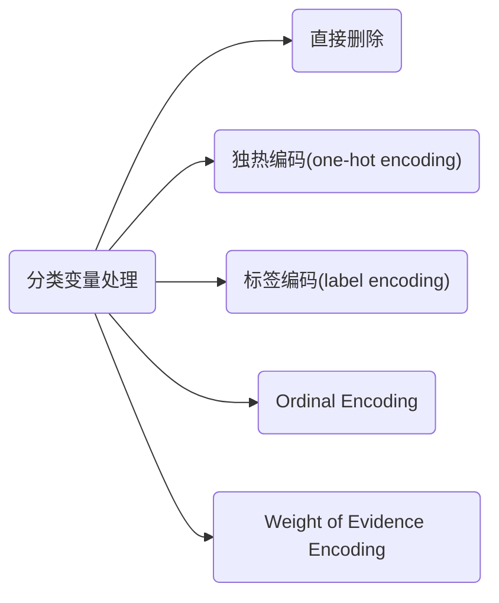
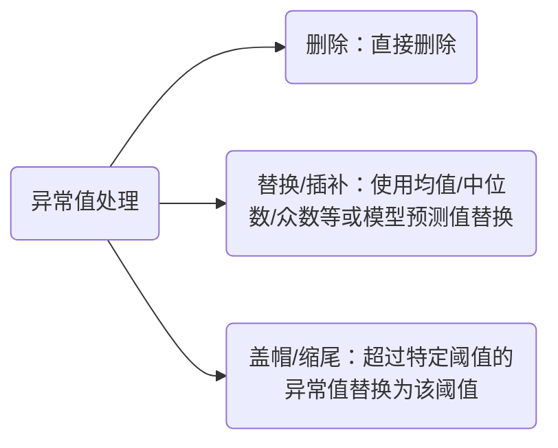
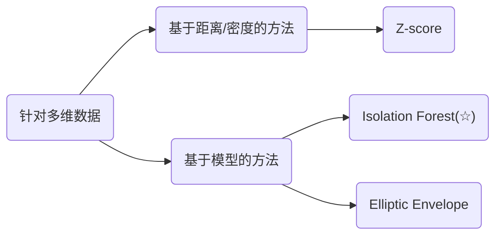
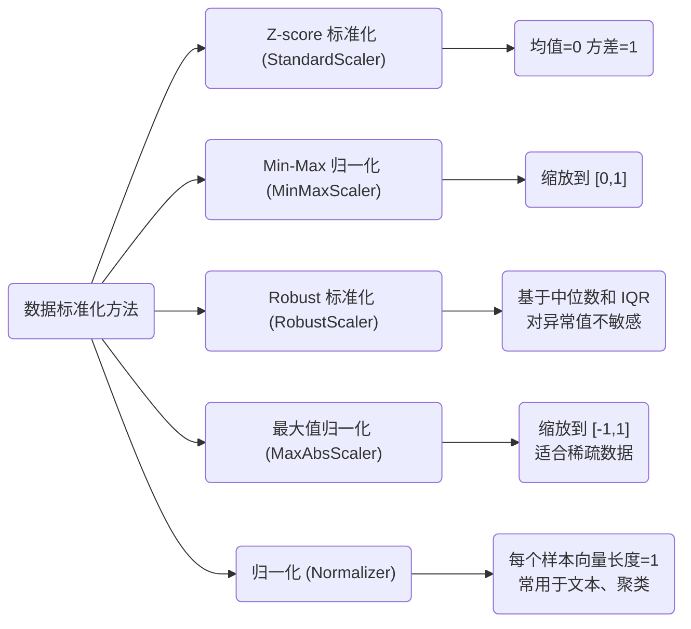
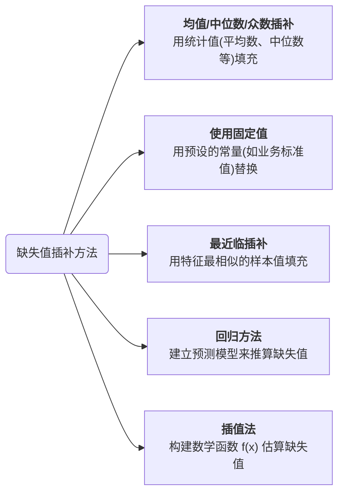
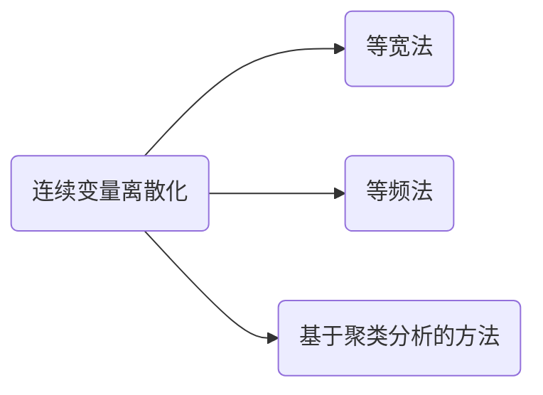

> [!tip]
>
> 以下内容主要讲述数据预处理相关方法

# 1 分类变量处理

## 1.1 为什么要对分类变量进行处理

在数据挖掘中，算法可以直接处理数值型变量，但是无法直接处理分类变量。但是，如果分类变量直接使用 0, 1, 2 等随机不同的数值代表一个类型，会让模型误认为这是一个数值型变量，导致结果错误。

因此，我们需要对分类变量（名词性属性）进行单独处理。

常见的分类变量处理方法：



## 1.2 直接删除

该方式直接将某些分类变量直接去除，不参与建模。

实现方法很简单，使用 `pandas.DataFrame` 将其格式化表格数据结构，再用 `.drop(column=[column name])` 将其列删除或者使用 `.drop([index])` 删除行

```
import pandas as pd

df = pd.DataFrame({
    "ID": [1, 2, 3],
    "City": ["Beijing", "Shanghai", "Guangzhou"],
    "Education": ["Bachelor", "Master", "High School"]
})

# 删除索引为 1 的行
df = df.drop(index=[1])
print(df)
```


> [!note]
>
> 该方法可以用于简化模型，避免维度灾难，但可能会丢失有用信息


## 1.3 独热编码

**将分类变量转换为若干二进制的形式**，如下图。


> [!warning]
>
> 独热编码应用场景广泛，但是仅适用于==类别不多==且==类别之间无序==的变量，例如 "性别（男 / 女）"。
>
> 当类别过多时，使用独热编码会导致维度过大，从而陷入维度诅咒


**实现**

1. 调用 pandas 库中的 `.get_dummies()`

   ```python
   df_onehot = pd.get_dummies(df, columns=["City"])
   ```

2. 调用 sklearn 中的 `.preprocessing.OneHotEncoder()`

   ```python
   from sklearn.preprocessing import OneHotEncoder
   
   encoder = OneHotEncoder(sparse_output=False)
   city_encoded = encoder.fit_transform(df[["City"]])
   ```


## 1.4 标签编码

这种方法即是我们最开始说的，将每个类别转换为对应的数值，这样做的优点是实现简单，并且不会增加维度，但是缺点就是<u>在线性模型中会被误认为是 "**有序数值**"</u>，虽然在基于树的模型（决策树，Random Forest, XGBoost）中可以避免这一问题，但仍然不推荐使用

实现方法：`sklearn.preprocessing.LabelEncoder`

```python
from sklearn.preprocessing import LabelEncoder

le = LabelEncoder()
df["City_Label"] = le.fit_transform(df["City"])
print(df)
```


## 1.5 顺序编码

即按照类别的==自然顺序==进行数值编码。

> 例如：教育水平（小学=1， 中学=2， 大学=3），满意度等级（差=1， 一般=2， 好=3）

优缺点：

- 优点：能体现等级关系
- 缺点：不适用于无序变量

**使用方法**

```python
from sklearn.preprocessing import OrdinalEncoder

# 教育水平有天然顺序：High School < Bachelor < Master
education_order = [["High School", "Bachelor", "Master"]]

encoder = OrdinalEncoder(categories=education_order)
df["Education_Ordinal"] = encoder.fit_transform(df[["Education"]])
print(df)
```


## 1.6 WOE 编码

主要是根据类别在不同目标变量上的分布，计算证据权重（WOE）。计算公式如下：
$$
WOE=ln{\frac{Proportion\ of\ Good\ in\ Category\ i}{Proportion\ of\ BAD\ in\ Category\ i}}
$$

> [!warning]
>
> WOE 编码仅适用于二分类任务，而且计算也相对复杂


# 2 异常值处理

异常值是指样本中明显异于其他值的点。打个比方，羊群中会有走散的羊，而我们要做的就是找打这只落单的羊并把它赶回羊群。

异常值处理主要有如下方法：



## 2.1 检测异常值

针对**单变量，近似正态分布**的数据:

1. $3\sigma$ 原则

   异常值：
   $$
   |x-\mu|>3\sigma
   $$

   ```python
   import numpy as np
   
   data = np.array([90, 95, 100, 105, 5000])
   mean, std = data.mean(), data.std()
   outliers = data[np.abs(data - mean) > 3 * std]
   print(outliers)  # [5000]
   ```

2. IQR 法（四分位距，箱线图原理）

   异常值：
   $$
   x<Q 1-1.5 I Q R \quad \text { or } \quad x>Q 3+1.5 I Q R
   $$

   ```python
   import pandas as pd
   
   data = pd.Series([90, 95, 100, 105, 5000])
   Q1, Q3 = data.quantile(0.25), data.quantile(0.75)
   IQR = Q3 - Q1
   outliers = data[(data < Q1 - 1.5 * IQR) | (data > Q3 + 1.5 * IQR)]
   print(outliers.tolist())  # [5000]
   ```


而对于适合多维数据，主要有如下方法：



而 Isolation Forest 方法更常被使用，且<u>适合大规模、多维数据</u>，常用于建模竞赛和工业应用。

```python
from sklearn.ensemble import IsolationForest

X = [[90], [95], [100], [105], [5000]]
clf = IsolationForest(contamination=0.1)  
y_pred = clf.fit_predict(X)
print(y_pred)  # -1 = outlier, 1 = normal
```


:bell: 如何用 Matlab 快速查找异常值？

Matlab 提供给了我们一个很方便的方法 `.isoutlier()`

```matlab
TF = isoutlier(A,method)
```

其中 method 可选参数如下：


## 2.2 替换异常值

当我们检测到异常值后，可以进行替换，常见的方法有均值、中位数、众数等

1. 在 Matlab 中，使用 `filloutliers()` 方法

   ```python
   B = filloutliers(A, fillmethod, findmethod)
   ```

   `findmethd` 可选字段：

   

2. 在 Python，scikit-learn 也提供给我们相应的方法 `SimpleImputer`

   ```python
   from sklearn.impute import SimpleImputer
   
   # 1. 找到异常值并替换成 NaN
   # 2. 再用中位数填充
   imputer = SimpleImputer(strategy='median')
   data['value'] = imputer.fit_transform(data[['value']])
   ```


# 3 标准化处理

## 3.1 为什么要进行标准化？

标准化的作用：**消除量纲差异，让特征处于同一尺度，提高模型训练的效率和效果**。

> [!note]
>
> 例如：如果身高的范围在 160-190(cm)，而体重的范围在 40-80(kg)，那么训练出来的模型权重更偏向身高，因此我们需要将其处于同一尺度进行度量




## 3.2 Z-score 标准化（StandScaler）

使数据均值为 0，方差为 1
$$
x^{\prime}=\frac{x-\mu}{\sigma}
$$

```python
from sklearn.preprocessing import StandardScaler
import numpy as np

X = np.array([[1, 200],
              [2, 300],
              [3, 400],
              [4, 500]])

scaler = StandardScaler()
X_scaled = scaler.fit_transform(X)

print("Z-score 标准化结果：\n", X_scaled)
```


## 3.3 Min-Max 归一化（MinMaxScaler）

将数据放缩到 [0, 1]，公式如下：
$$
x^{\prime}=\frac{x-\min }{\max -\min }
$$

```python
from sklearn.preprocessing import MinMaxScaler

scaler = MinMaxScaler()
X_scaled = scaler.fit_transform(X)

print("Min-Max 归一化结果：\n", X_scaled)
```


## 3.4 Robuster 标准化（RobustScaler）

公式：
$$
x^{\prime}=\frac{x-\text { median }}{I Q R}
$$
适合于基于中位数和四分位距，适合有异常值的数据。

```
from sklearn.preprocessing import RobustScaler

scaler = RobustScaler()
X_scaled = scaler.fit_transform(X)

print("Robust 标准化结果：\n", X_scaled)
```


## 3.5 最大值归一化（MaxAbsScaler）

将数据范围控制在 [-1, 1]，保持其稀疏性
$$
x^{\prime}=\frac{x}{|x|_{\max }}
$$

```python
from sklearn.preprocessing import MaxAbsScaler

scaler = MaxAbsScaler()
X_scaled = scaler.fit_transform(X)

print("MaxAbs 归一化结果：\n", X_scaled)
```


## 3.6 Matlab 快速调用

Matlab 中也提供给我们标准化的方法 

```matlab
N = normalize(A, dim, method, methodtype)
```

其中 

- dim: 维度，默认为 1（代表按列标准化）

- method

  

- methodtype

  


> [!tip]
>
> 零一均值规范化用途广泛，但是受均值和标准差受离散点影响较大，常常需要修改上述变换，例如用中位数代表均值，用绝对标准差 $\delta^*=\sum_{i=1}^n\left|x_i-W\right|$
> $$
> x^*=\frac{x-\bar{x}}{\delta}
> $$


# 4 缺失值处理

常见的缺失值插补方法主要有如下几种：



## 4.1 Python 实现

若要删除缺失值，用 `.isnull()` 进行判断后再进行删除即可；若想要插补，参考下面内容。


使用 Scikit-learn 中的 `impute ` 类

```python
from sklearn.impute import SimpleImputer
```

参数列表

- **`missing_values`**：指定缺失值的符号，默认 `np.nan`。
- **`strategy`**：填补方法，常用选项：
  - `"mean"` → 用列的均值替换（仅数值）
  - `"median"` → 用列的中位数替换（仅数值）
  - `"most_frequent"` → 用列中出现次数最多的值替换（适合分类变量）
  - `"constant"` → 用固定值替换，需搭配 `fill_value`
- **`fill_value`**：当 `strategy="constant"` 时使用，默认 `0`。


**示例：使用均值填充缺失值**

```python
import numpy as np
import pandas as pd
from sklearn.impute import SimpleImputer

# 构造数据
df = pd.DataFrame({
    "A": [1, 2, np.nan, 4, 5],
    "B": [7, np.nan, 9, 10, 11]
})

# 创建 Imputer
imputer = SimpleImputer(strategy="mean")

# 进行拟合和转换
df_imputed = imputer.fit_transform(df)

# 转换回 DataFrame
df_imputed = pd.DataFrame(df_imputed, columns=df.columns)
print(df_imputed)

```


## 4.2 Matlab 实现

同理，删除的方法结合 `ismissing()` 和 `rmmissing()`，示例如下：

```matlab
% 构造一个包含缺失值的表格
T = table([1; 2; NaN; 4], [5; NaN; 7; 8], {'a'; 'b'; 'c'; ''}, ...
          'VariableNames', {'A', 'B', 'C'});

disp('原始数据：');
disp(T);

% --- 方法 1：使用 ismissing() 检测缺失值 ---
missingMask = ismissing(T);   % 返回逻辑矩阵
disp('缺失值位置 (true 表示缺失)：');
disp(missingMask);

% --- 方法 2：使用 rmmissing() 删除缺失值 ---
T_clean = rmmissing(T);       % 默认删除含缺失值的行
disp('删除缺失值后的数据：');
disp(T_clean);
```


插补用 `fillmissing()`

```matlab
F = fillmissing(A,method)
```


# 5 重复值处理

## 5.1 为什么要对重复值进行处理？

若样本中含有相同的重复数据，将会导致样本不唯一，使得机器学习算法对同一样本反复学习，容易导致模型过拟合问题。因此，去重是数据挖掘中的一个必备过程。


## 5.2 Python 实现

调用 `.drop_duplicates()` 即可

```python
import pandas as pd

# 构造示例数据
data = {
    "ID": [1, 2, 2, 3, 4, 4, 5],
    "Score": [90, 85, 85, 88, 92, 92, 95]
}
df = pd.DataFrame(data)

print("原始数据：")
print(df)

# --- 方法 1：去掉完全重复的行 ---
df_unique = df.drop_duplicates()
print("\n去重后的数据（完全重复）：")
print(df_unique)

# --- 方法 2：按某列去重（如 ID） ---
df_unique_id = df.drop_duplicates(subset=["ID"], keep="first")
print("\n按 ID 去重后的数据：")
print(df_unique_id)
```


## 5.3 Matlab 实现

使用 `unique()`

```python
% 构造示例数据
ID = [1; 2; 2; 3; 4; 4; 5];
Score = [90; 85; 85; 88; 92; 92; 95];
T = table(ID, Score);

disp('原始数据：');
disp(T);

% --- 方法 1：去掉完全重复的行 ---
T_unique = unique(T, 'rows');
disp('去重后的数据（完全重复）：');
disp(T_unique);

% --- 方法 2：按某列去重（如 ID） ---
[~, idx] = unique(T.ID, 'first');  % 保留首次出现的 ID
T_unique_id = T(idx, :);
disp('按 ID 去重后的数据：');
disp(T_unique_id);
```


# 6 连续变量离散化

连续型变量离散化后适合应用到相应的对应离散特征更友好的算法，例如 Naive Bayes、Decision Tree。常见方法如下：


