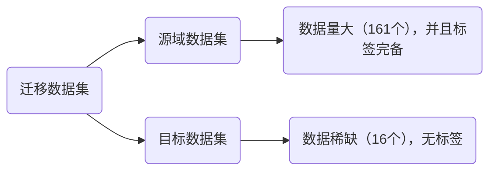
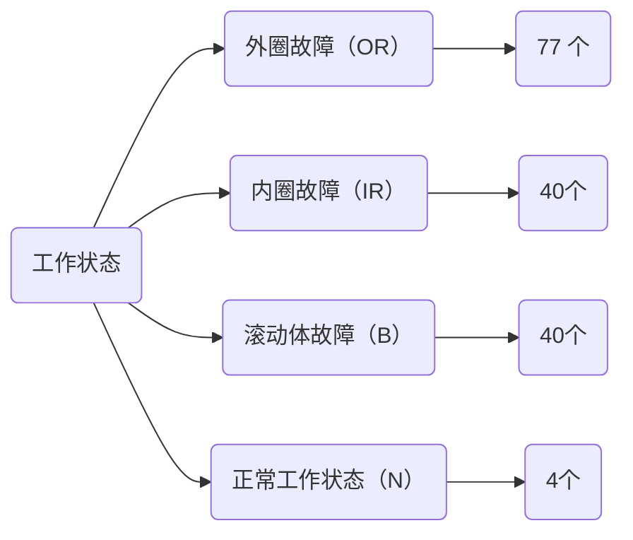
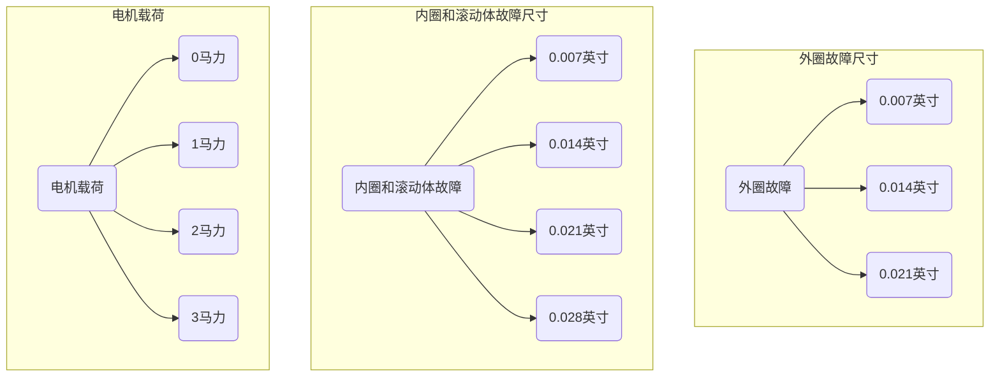
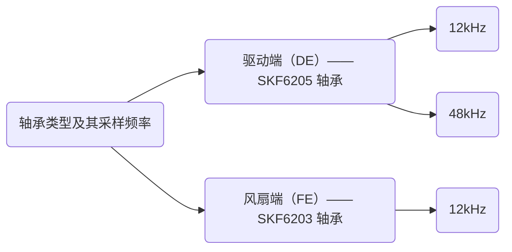
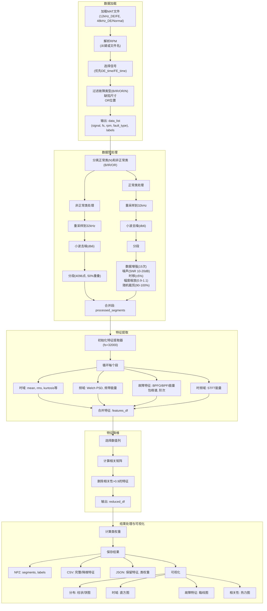

# 1 问题分析

## 1.1 问题描述

1. **数据分析与故障特征提取：**请考虑目标域的迁移任务，从提供的源域数据中筛选部分数据组成数据集。结合轴承故障机理，选择合适的方法或指标对有代表性的源域数据进行**特征分析，**并对整体数据集进行**特征提取**，用于后续诊断任务。（源域数据可选用其他公开轴承数据集，但应标明出处）。
2. **源域故障诊断：**在任务1提取的故障特征基础上，划分源域训练集与测试集。设计合适的诊断模型实现源域诊断任务，并对诊断结果进行评价。
3. **迁移诊断：**在任务2设计的诊断模型基础上，充分考虑源域与目标域的共性与差异特征，设计合适的迁移学习方法，构建目标域诊断模型，对目标域未知标签的数据进行分类和标定，给出迁移结果的可视化展示和分析，并给出数据对应的标签。
4. **迁移诊断的可解释性：**可解释性是机器学习领域的重要研究方向之一。由于机器学习模型的“黑箱”问题，其迁移和诊断过程难以被观测和理解，这可能造成使用者对模型结果的不信任或盲目信任，进而影响诊断模型的应用。迁移诊断可解释性研究的核心目标是解决迁移学习模型在跨工况、跨设备故障诊断中的透明性问题，提高诊断人员对迁移过程和诊断模型输出的理解和信任度。请考虑任务3中模型的结构设计、迁移过程和决策过程，结合轴承故障特点与故障机理，对迁移诊断的事前/迁移过程/事后（任选一点或多点）可解释性进行分析。

## 1.2 数据集描述

数据集构成如下：

> [!tip]
>
> 因此，由于目标数据集稀少，因此这里提出使用[]

故障类别（即轴承工作状态）

故障参数

轴承类型以及采样频率

## 1.3 涉及概念

:bell:**迁移学习技术**

- 核心思想：是指将在一个任务或领域中学到的知识迁移到另一个相关但是不同的任务或者领域
- 结合本题：本题要求将轴承故障数据进行分析，<strong style="color:orange">提取具有代表性的轴承故障特征[特征提取]</strong>，结合<strong style="color:orange">[迁移学习]将诊断知识迁移到实际运营的列车数据</strong>，用于<strong style="color: skyblue">缓解样本不平衡问题</strong>

> [!note]
>
> 轴承故障特征可从<u>时域、频域、时频域和二维图像</u>等维度等维度进行分析 --> <strong style="color:skyblue">[多视图]</strong>

# 2 解决思路

## 2.1 数据分析与故障特征提取

### 2.1.1 数据分析

1. 目标域转速约 600 RPM，而源域数据的 RPM 在 1730 ~ 1797 之间。

2. 目标域频率为 32kHz，源域为 12kHz 和 48kHz，<strong style="color:orange">需要将所有选定的源域数据和所有目标域数据统一采样到同一个频率</strong>。例如，将源域数据频率全部<strong style="color:orange">[重采样]</strong>为 32 kHz，或者全部降采样为 12 kHz（提升效率）。

3. 噪声水平不同。源域是“轻微噪声”的实验环境 ，目标域是“复杂运行环境” ，噪声和干扰更强。

   > 这里还存在距离问题。距离故障轴承较近的采集位置振动传递路径短，故障信号的幅值更明显，远端则由于传递路径较长而产生衰减

**筛选策略**

- 统一工况：选择固定的载荷（如 1 马力或 2 马力）下的所有故障类型，减少源域内部的复杂性
- 数据量均衡：源数据中只有 4 个正常样本，远少于故障样本数量（157个），因此需要对故障样本进行欠采样或后续处理中对正常样本采用过采样平衡数据集

**数据预处理**

- 重采样：将源域和目标域数据集统一重采样到一个相同的频率
- 信息切片/分段：原始信息比较长（有 8s 左右），可将其切割为若干个小样本（如 2048 个点位一个样本），用于扩充数据集

### 2.1.2 特征提取

虽然转速不同导致绝对频率值不同，但故障冲击的“模式”是相似的。

应用**包络谱分析（Envelope Spectrum Analysis）**。先对信号进行希尔伯特变换，得到包络信号，再对包络信号做FFT。这能有效提取出由周期性冲击引起的低频故障特征频率（BPFO, BPFI, BSF）及其谐波。 

流程框架图

