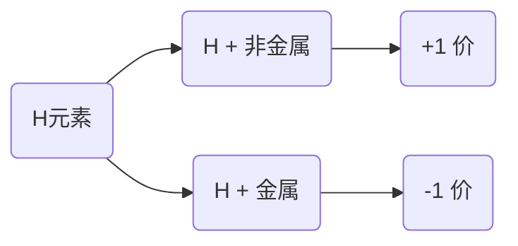
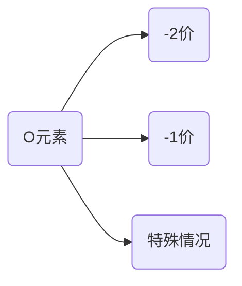

# 1 电解质的基本概念

## 1.1 电解质与非电解质定义

1. 电解质：在水溶液<strong style="color:red">或</strong>熔融状态下能够导电的<u>化合物</u>（*酸、碱、活泼金属氧化物、大多数盐*）

   > $CH_3COOPb$ 是盐类，但是它不属于电解质

2. 非电解质：在水溶液<strong style="color:red">和</strong>熔融状态下都不能导电的<u>化合物</u>

3. 电解质与非电解质的相同之处，在于它们都是<strong style="color:red">化合物</strong>。所以<strong style="color:red">单质、混合物既不属于电解质，也不属于非电解质</strong>

4. 电解质一定是本身含有离子或能电离出离子的化合物。有些化合物的水溶液能导电，但溶液中的离子不是该化合物自身所电离产生的,故不属于电解质而是非电解质。如$SO_2、SO_3、CO_2、NH_3$等。但它们与水反应生成的$H_2SO_3、H_2SO_4、H_2CO_3,、NH_3·H_2O$等能发生电离，是电解质。

5. $BaSO_4$等难溶于水的盐，其水溶液几乎不导电，是因为溶解的量很少，离子浓度很小。但$BaSO_4$溶解的部分能全部电离，并且$BaSO_4$，故$BaSO_4$等难溶盐是电解质

## 1.2 电解质的电离

电离：电解质溶于水或受热熔化时，形成**自由移动离子**的过程。

## 1.3 强电解质与弱电解质

强电解质：在水溶液（或熔融状态下）能<strong style="color:red">完全电离</strong>的电解质

种类：

1. 强酸：六大强酸
2. 强碱：四大强碱
3. 大多数盐：$NaCl、KI、Ca(NO_3)、CH_3COONa$
4. 活泼金属氧化物：$Na_2O、MgO、CaO、Al_2O_3$

弱电解质：溶于水后只能<strong style="color:red">部分电离</strong>的电解质

种类：弱酸、弱碱、<strong style='color:red'>水</strong>

**重要概念**

- 划分强、弱电解质的唯一标准是看电解质是否完全电离
- 电解质的强弱与其**溶解性**无关
- 电解质的强弱与溶液的**导电性**没有必然关联。强电解质溶液的导电性不一定强。<strong style="color:red">导电性的强弱取决于溶液中自由移动的离子浓度 / 电荷量</strong>

## 1.4 课后练习

1. 溶于水能导电的化合物不一定是电解质（√）

   > $SO_2、CO_2$

2. 电解质不一定能导电，能导电的物质不一定是电解质（√）

   >电解质只有处于水溶液或者熔融状态下才能导电，金属能够导电，但却不是电解质

3. 电解质不一定易溶于水，易溶于水的化合物不一定是电解质（√）

   > $C_6H_{12}O_6(葡萄糖)、C_2H_5OH(乙醇)$都是易溶于水但是不导电

4. 不是电解质的物质不一定就是非电解质（√）

5. 虽然$Na_2O$溶于水所得溶液中导电的离子不是它本身产生的，但它却是电解质（√）

   > 熔融状态下能导电

6. 自由移动的离子数目多的溶液一定比自由移动的离子数目少的溶液导电能力强（×）

   > 和离子浓度有关，离子数目多，但是溶液体积大，离子浓度小

# 2 离子方程式

离子方程式：用实际参加反应的离子符号来表示反应的式子

## 2.1 书写步骤

## 2.2 拆写规律

1. 强酸、强碱、易溶于水的盐类写成离子形式
2. 单质、氧化物、气体、难溶物、弱电解质一律写成化学式

## 2.3 课后练习

# 3 电解质与导电性

- 能导电的物质不一定是电解质，电解质不一定能导电
- 溶于水能导电的化合物不一定是电解质
- 电解质的强弱与导电性的强弱没有必然的关系
- 导电性强弱主要取决于离子浓度与电荷量

**练习1**

**答案**

（1）④、⑧

（2）①、③、⑤、⑧、⑨、⑩

（3）②、⑥、⑦

（4）①、②、③、⑧、⑨、⑩

**练习2**

（1）亮
（2）逐渐变暗

（3）逐渐变亮

**练习3**

答案：C

# 4 与量有关的离子方程式的书写

**配平技巧**

1. **少量定为 1**，过量者要多少有多少
2. 先写中和，后写沉淀
3. 少量这符合化学式比例，过量者不一定

## 4.1 一般型

<strong style="color:orange">$NaHCO_3$溶液与 $Ca(OH)_2$溶液反应</strong>

（1）$NaHCO_3$少量

$HCO_3^- + OH^- + Ca^{2+} = CaCO_3\downarrow + H_2O$

（2）$Ca(OH)_2$少量

$Ca^{2+} + 2OH^- + 2HCO_3^- = CaCO_3\downarrow + CO_3^{2-} + 2H_2O$

<strong style="color:orange">$Ca(HCO_3)_2$溶液与$Ca(OH)_2$溶液反应</strong>

（1）$Ca(HCO_3)_2$少量

$2Ca^{2+} + 2HCO_3^- + 2OH^- = 2CaCO_3\downarrow + 2H_2O$

两边同时 $\div 2$ ，得到的最终的离子方程式为：

$Ca^{2+} + HCO_3^- + OH^- = CaCO_3\downarrow + H_2O$

（2）$Ca(OH)_2$少量

$Ca^{2+} + HCO_3^- + OH^- = CaCO_3\downarrow + H_2O$

<strong style="color:orange">$CO_2$通入$NaOH$溶液中</strong>

（1）$CO_2$少量

首先，我们需要知道 $CO_2$ 与水的反应：

$CO_2 + H_2O \rightleftharpoons H_2CO_3$

之后 $H_2CO_3 + 2OH^- = CO_3^{2-} + 2H_2O$

合并即可得到：

$CO_2 + 2OH^- = CO_3^{2-} + H_2O$

（2）$CO_2$过量

$CO_2 + OH^- = HCO_3^-$

> 总结：少量 $CO_2$ 生成 $CO_3^{2-}$，过量 $CO_2$ 生成 $HCO_3^-$

<strong style="color:orange">$CO_2$通入澄清石灰水中</strong>

（1）$CO_2$少量

$CO_2 + 2OH^- + Ca^{2+} = CaCO_3\downarrow + H_2O$

（2）$CO_2$过量

$CO_2 + OH^- = HCO_3^-$

## 4.2 竞争型

口诀：强者先行、弱者排队

<strong style="color:orange">$NH_4HSO_4$ 溶液与 $NaOH$ 溶液反应</strong>

（1）$NaOH$ 不足

$H^+ + OH^- = H_2O$

（2）$NaOH$ 过量

$NH_4^+ + H^+ + 2OH^- = NH_3\cdot H_2O + H_2O$

## 4.3 难溶与微溶的权衡

口诀：难溶者先沉淀，微溶者后沉淀

$Mg(HCO_3)_2$溶液与 $Ca(OH)_2$ 溶液反应

（1）$Ca(OH)_2$ 少量

$Ca^{2+} + 2OH^- + 2HCO_3^- + Mg^{2+} = CaCO_3\downarrow + MgCO_3\downarrow + 2H_2O$

（2）$Mg(HCO_3)_2$ 少量

$Mg^{2+} + 2HCO_3^- + 2Ca^{2+} + 4OH^- = Mg(OH)_2\downarrow + 2CaCO_3\downarrow + 2H_2O$

# 5 离子方程式正误判断

**注意点1：看离子反应是否符合客观事实**

答案：

（1）错误。最后生成的是 $Fe^{2+}$ , $Fe$ 与盐酸、硫酸发生反应生成的是 $Fe^{2+}$，而与硝酸、氯气（$Cl_2$）发生反应生成的是$Fe^{3+}$

（2）错误。$K、Ca、Na$ 属于活泼金属，他们会直接与水发生反应

（3）错误。烧碱是 $NaOH$ 的俗称，生石灰是 $CaO$ 的俗称，--石灰乳、澄清石灰水--

（4）错误。$CaCl_2$ 无法与 $CO_2$ 发生反应

**注意点2：电荷守恒**

（1）错误

（2）错误

（3）错误

**注意点3：看是否符合拆写规则**

答案：

（1）错误。醋酸不能拆

（2）错误。氢氧化铜不能拆

（3）正确

（4）错误。碳酸氢钙可以拆

（5）错误。氧化钙不能拆

（6）错误。氢氧化钙能拆

（7）错误。氨水不能拆

（8）:star:浓硫酸指的是浓度在 98% 以上的硫酸溶液，由于水的含量少，所以电离出的 $H^+$ 数目少，是不能拆的

**注意点4：观察方程式中是否有遗漏的离子反应**

答案：

（1）错误。$OH^-$ 与 $Cu^+$ 也会发生反应

（2）错误。$H^+$ 与 $OH^-$ 发生反应

（3）错误。缺少 $HCO_3^-$ 与 $OH^-$ 的反应

> 化学反应的本质：旧化学键的断裂和新化学键的生成

**注意点5：看反应物或产物配比是否正确**

**答案**

（1）错误

（2）错误

（3）正确

**注意点6：观察是否符和题目设定条件，如少量 / 过量 / 滴加顺序**

**答案**

（1）错误

（2）错误

（3）正确

（4）错误

# 6 氧化还原反应

## 6.1 化合价判断

1. 因为化合价是元素在形成化合物时表现出来的性质，所以<strong style="color:red">单质的化合价为0</strong>

2. 有些元素在化合物中化合价只有一种，判断化合物的化合价时优先决定

   

   - $Li、Na、K、Rb、Cs$：+1 价

     > $Ag$：+1 价

   - $Mg、Ca、Sr、Ba$：+2 价

     > $Zn$：+2 价

   - $Al$：+3 价

   - $F$：-1 价

     > $OF_2$ 中 $O$ 的化合价为 +2 价

   

- H 与非金属结合的化合物：$H_2S、NH_3、N_2H_4、CH_4$

  > 特例：$SiH_4(硅烷)、B_2H_6$ 中 H 为 -1 价
  >
  > $N_2H_4$俗称联氨，其结构式如下：
  >
  > 

- H 与金属结合的化合物：$NaH、CaH_2$

- -2 价：$SO_2、SO_3、P_2O_5、C_6H_{12}O_6$
- -1 价：$H_2O_2、Na_2O_2、CaO_2$
- 特殊情况：$KO_2$（超氧化钾） 里显$-\frac{1}{2}$ 价、$OF_2$ 里显 +2 价

|            | IVA(C、Si) | VA(N、P) | VIA(S) | VIA(Cl、Br) |
| ---------- | ---------- | -------- | ------ | ----------- |
| 最高化合价 | +4         | +5       | +6     | +7          |
| 最低化合价 | -4         | -3       | -2     | -1          |

**过渡金属元素的化合物**

- $\overset{+2}{Fe}O、\overset{+3}{Fe_2}O_3$

  > 氧化亚铁：黑色；氧化铁：红棕色

- $Fe_3O_4$ 可以看成是 $FeO \cdot Fe_2O_3$

- $\overset{+1}{K_2}\overset{+6}{Fe}\overset{-2}{O_4}(高铁酸钾)、K_3[\overset{+3}{Fe}\overset{-1}{(CN)_6}]、\overset{+2}{Fe}\overset{-1}{S_2}、CuFe\overset{-2}{S_2}$

$Ti、V、Cr、Mn$ 的最高化合价分别是：+4、+5、+6、+7

示例：$\overset{+4}TiO_2、\overset{+5}{V_2}{O_5}、\overset{+6}{Cr}O_4^{2-}、\overset{+6}{Cr_2}O_7^{2-}、\overset{+7}MnO_4^{-}$

> 氰根离子（$CN^-$）

> $KCrO_4$ 溶液：黄色；$K_2CrO_4$溶液：橙红色 ；$KMnO_4$溶液：紫红色

## 6.2 氧化还原反应的基本概念

$\left\{ \begin{array}{l}
	\text{氧化反应：反应过程中，失去} e^-,\text{化合价升高}\\
	\text{还原反应：反应过程中，得到} e^-,\text{化合价降低}\\
\end{array} \right.$

$\left\{ \begin{array}{l}
	\text{氧化剂：帮助别人氧化的物质，本身被还原}\\
	\text{还原剂：帮助别人还原的物质，本身被氧化}\\
\end{array} \right.$

$\left\{ \begin{array}{l}
	\text{氧化性：物质得} e^-\text{的能力(氧化性强弱)}\\
	\text{还原性：物质失} e^-\text{的能力(还原性强弱)}\\
\end{array} \right.$

$\left\{ \begin{array}{l}
	\text{氧化产物：被氧化所生成的产物}\\
	\text{还原产物：被还原所生成的产物}\\
\end{array} \right.$

> 一般而言，还原剂 $
> \overset{\text{失}e^-}{→}
> $ 氧化产物，氧化剂 $
> \overset{\text{得}e^-}{→}
> $ 还原产物

:bell:**口诀**

- 升、失、氧化、还原剂、具有还原性
- 降、得、还原、氧化剂、具有氧化性

**常见的氧化剂和还原剂**

> $H_2+Cl_2\,\,\triangleq \,\,HCl\uparrow$，$
> H_2+CuO\triangleq Cu+H_2O
> $

:spiral_notepad:**备注**

1. 若元素处于最高价态，则只表现氧化性，作氧化剂

   > $KMnO_4、K_2Cr_2O_7、HNO_3、H_2SO_4$

2. 若元素处于最低价态，则只表现还原性，作还原剂

   > 金属单质、$S^{2-}、Cl^{-}、Br^-、I^-$

3. 若元素处于中间价态，则既表现氧化性又表现还原性，既可作氧化剂也可作还原剂

   > $Fe^{2+}、H_2O_2、SO_2$

    
    
    

## 6.3 电子转移表示法

电子转移的表示方法有如下两种写法：

- 双线桥
- 单线桥

### 6.3.1 双线桥法

概念：表示<strong style="color:red">同一元素</strong>反应前后变化，体现 【谁变成谁】

步骤：标价态 → 连双线（一条是由氧化剂里面的得电子元素指向还原产物对应元素，另一条由还原剂里面失电子的元素指向氧化产物里对应的元素）→ 注得失

（1）$\mathrm{Fe}_2\mathrm{O}_3+3\mathrm{CO}\triangleq 2\mathrm{Fe}+3\mathrm{CO}_2$

（2）$3 \mathrm{Cu}+8 \mathrm{HNO}_3=3 \mathrm{Cu}\left(\mathrm{NO}_3\right)_2+2 \mathrm{NO} \uparrow+4 \mathrm{H}_2 \mathrm{O}$

（3）$2 \mathrm{KMnO}_4 \triangleq \mathrm{K}_2 \mathrm{MnO}_4+\mathrm{MnO}_2+\mathrm{O}_2 \uparrow$

（4）$\mathrm{KClO}_3 \text { 与 } \mathrm{MnO}_2 \text { 在高温共热条件下反应 }$

### 6.3.2 单线桥法

概念：表示<strong style="color:red">反应物之间</strong>的电子转移，体现【谁给谁】

步骤：标价态 → 连单线（始于被氧化物质中化合价升高的元素，止于被还原物质中化合价降低的元素）→ 标出转移电子的总数

（1）$
\mathrm{CuO}+\mathrm{H}_2\triangleq \mathrm{Cu}+\mathrm{H}_2\mathrm{O}
$

（2）$2 \mathrm{Al}+6 \mathrm{HCl}=2 \mathrm{AlCl}_3+3 \mathrm{H}_2 \uparrow$

（3）$
2\mathrm{KNO}_3+3\mathrm{C}+\mathrm{S}\triangleq \mathrm{K}_2\mathrm{S}+\mathrm{N}_2\uparrow +3\mathrm{CO}_2\uparrow 
$

（4）$4 \mathrm{FeS}_2+11 \mathrm{O}_2=2 \mathrm{Fe}_2 \mathrm{O}_3+8 \mathrm{SO}_2$

# 7 钠与氯

## 7.1 钠

### 7.1.1 钠的物理性质

1. 颜色：银白色，有金属光泽

2. 密度：$\rho \left( H_2O \right) >\rho \left( Na \right) >\rho \left( \text{煤油} \right) \,\,$

   > $Na$ 会浮在水面上，沉在煤油底下，所以**钠可以使用煤油保存以达到隔绝空气**的作用

3. 熔点：低于 $100\degree$

4. 硬度：质地柔软、软压变形、可以用**小刀切割**

### 7.1.2 钠的化学性质

>  $Na$ 被氧化后失去最外层的一个电子达到稳定结构（符合稀有气体最外层电子分布）

从上图可以得出结论：<strong style="color:red">$Na$ 具有还原性</strong>

**钠单质与氧气的反应**

1. $4Na+O_2=2Na_2O\left( \text{失去金属光泽} \right)$
2. $2Na+O_2\triangleq 2Na_2O_2\left( \text{淡黄色} \right)$

> :small_red_triangle:注意：这里需要说明一点的是，$Na_2O$ 也可以继续被氧化成为 $Na_2O_2$

:star:**钠久置之后生成$Na_2CO_3$中间的演化过程**

$Na\,\,\overset{O_2}{\rightarrow}Na_2O\overset{H_2O}{\rightarrow}NaOH\overset{CO_2\left( \text{潮解} \right)}{\longrightarrow}NaCO_3\cdot 10H_2O\overset{\text{风化}}{\rightarrow}NaCO_3$

:heavy_check_mark:**钠单质与水的反应**

- 化学方程式：$
  2Na+2H_2O=2NaOH+H_2\uparrow $
- 离子方程式：$
  2Na+2H_2O=2Na^++2OH^-+H_2\uparrow 
  $

:thinking:**对反应现象的探讨**

操作：将 Na 单质加入到酚酞 + 水的溶液

现象：

1. "浮"：钠单质浮在水面上

   >$\rho \left( H_2O \right) >\rho \left( Na \right)$

2. "熔"：钠单质逐渐被<strong style="color:red">熔化</strong>

   > $Na$与$H_2O$反应放出大量热，并且$Na$熔点低，会被熔化

3. "游"：钠单质在水面上游动

4. "响"：反应过程中"嘶嘶"作响

   > 反应放出氢气

5. "红"：溶液变红

   > 反应生成的 $NaOH$ 遇到酚酞变成红色

:heavy_check_mark:**钠单质与盐溶液的反应**

$Na$与$CuSO_4$溶液反应，反应为一个连续的过程，会生成**蓝色絮状**的氢氧化铜沉淀，而不是单纯的置换反应，如下：

1. $2Na+2H_2O=2NaOH+H_2\uparrow$
2. $CuSO_4+2NaOH=Na_2SO_4+Cu\left( OH \right) _2\downarrow$

:warning:下列写法错误：

$2Na+Cu^{2+}=2Na^++Cu\left( \times \right)$

### 7.1.3 课后练习

**答案**

（1）错误。硬度低

（2）正确。钠属于活泼金属元素，在自然界中以化合物的形式存在，尤其以 $NaCl$ 居多

（3）正确。钠已经处于最低价态：0

（4）错误。淡黄色固体

（5）错误。还可以生成氧化钠

（6）错误。盐酸中氢离子多，反应剧烈

（7）错误。生成的是氢氧化铜沉淀（蓝色絮状）

### 7.1.4 钠的化合物

|                  |          $Na_2O$           |                     $Na_2O_2$                      |
| ---------------- | :------------------------: | :------------------------------------------------: |
| 阳离子:阴离子    |  2 ($Na^+$): 1($O^{2-}$)   |             2($Na^+$) : 1($O_2^{2-}$)              |
| 化合物类型       |  离子化合物（碱性氧化物）  |       离子化合物（非碱性氧化物、为过氧化物）       |
| 颜色、状态       |         白色、固体         |                    淡黄色、固体                    |
| 性质             |     具有碱性氧化物通性     |             具有强氧化性、不具有漂白性             |
| 特点             | 不稳定，加热生成 $Na_2O_2$ |                       较稳定                       |
| 与水             |     $Na_2O+H_2O=2NaOH$     |         $2Na_2O_2+2H_2O=4NaOH+O_2\uparrow$         |
| 与盐酸           |  $Na_2O+2HCl=2NaOH+H_2O$   |      $2Na_2O_2+4HCl=4NaCl+2H_2O+O_2\uparrow $      |
| 与二氧化硫       |   $Na_2O+SO_2=Na_2SO_3$    |              $Na_2O_2+SO_2=Na_2SO_4$               |
| 与品红、石蕊反应 |  遇品红不变色；遇石蕊变蓝  | 品红因被氧化而褪色；遇石蕊先变蓝，后褪色（被漂白） |

>- $O_2^{2-}$ ：过氧根离子
>- 碱性氧化物的通性与酸反应生成盐和水；与酸性氧化物反应生成盐；与水反应生成对应的碱（其中只有碱金属与钙锶钡可以与水反应
>- 碱金属：IA 族中除 H 以外的其他金属元素
>- 过氧化钠在与水和盐酸反应时，既充当氧化剂，又充当还原剂
>- 过氧化钠与水反应还会生成过氧化氢，而过氧化氢具有漂白性，所以溶液被漂白褪色

**酸碱指示剂**

| 指示剂 | 变色范围   | 酸性 | 碱性 |
| ------ | ---------- | ---- | ---- |
| 甲基橙 | 3.1 ~ 4.4  | 红   | 黄   |
| 石蕊   | 5.0 ~ 8.0  | 红   | 蓝   |
| 酚酞   | 8.2 ~ 10.0 | 无   | 红   |

> 品红不是酸碱指示剂，但是可以用来检测 $SO_2$ 等氧化性物质，当遇到这些氧化性强的物质，会从红色褪色为无色

### 7.1.5 碳酸钠和碳酸氢钠的比较

| 物质                 | 碳酸钠（$Na_2CO_3$）                                         | 碳酸氢钠（$NaHCO_3$）                                        |
| -------------------- | ------------------------------------------------------------ | ------------------------------------------------------------ |
| 俗名                 | 纯碱、苏打                                                   | 小苏                                                         |
| 色、态               | 白色粉末                                                     | 细小白色晶体                                                 |
| 溶解性               | 易溶于水                                                     | 在水中溶解度比$Na_2CO_3$小                                   |
| 热稳定性             | 稳定、受热难分解                                             | 受热易分解：<strong style="color:red">$2NaHCO_3\triangleq Na_2CO_3+CO_2\uparrow +H_2O$</strong> |
| 与$NaOH$反应         | 不反应                                                       | $HCO_3^-+OH^-=CO_3^{2-}+H_2O$                                |
| 与$Ca(OH)_2$反应     | $Ca^{2+}+{CO_3}^{2-}=CaCO_3\downarrow $                      | 存在少量和过量的区别                                         |
| 与可溶性钙、钡盐反应 | $Ca^{2+}+CO_3^{2-}=CaCO_3\downarrow\\Ba^{2+}+CO_3^{2-}=BaCO_3\downarrow$ | 无沉淀产生                                                   |
| 用途                 | **①制酸剂**；②清洗剂；②洗涤剂                                | **①烘焙；②干粉灭火器**                                       |

> 相互转换：
> 

:herb:**补充**

- 碳酸氢钠中的碳酸根离子存在氢键，所以溶解度小（目前了解即可）
- 制酸剂是一种药物，作用是中和酸性物质，例如胃酸，治疗胃溃疡或胃穿孔；烘焙是利用碳酸氢钠加热产生的$CO_2$来使面包变得蓬松，干粉灭火器是利用碳酸氢钠加热产生的$CO_2$来挤占和隔绝氧气，使得空气中氧气变得稀少
- <strong style="color:red">纯碱不是碱</strong>

**验证碳酸钠和碳酸氢钠的热稳定性的套管实验**

- 甲：$NaHCO_3$；乙：$Na_2CO_3$

  > 原因：碳酸钠的热稳定性大于碳酸氢钠

**碳酸钠和碳酸氢钠的鉴别**

若两者都是固体

1. 利用溶解度：碳酸钠的溶解度大于碳酸氢钠
2. 加酸：反应快，立即冒泡的是碳酸氢钠，反之则是碳酸钠
3. 加热：加热分解就是碳酸氢钠，反之则是碳酸钠

若两者都是溶液

1. PH 值：$ph(Na_2CO_3)>ph(NaHCO_3)$

2. 加酸：逐滴加酸，立即冒泡的是碳酸氢钠，反之为碳酸钠

3. 加入**可溶性钙盐或钡盐**：产生白色沉淀的为碳酸钠，反之为碳酸氢钠

   > :warning:注意：不能使用氢氧化钙或氢氧化钡

**碳酸钠与碳酸氢钠的除杂**

| 混合物                        | 除杂方法以及试剂     |
| ----------------------------- | -------------------- |
| $Na_2CO_3$固体（$NaHCO_3$）   | 加热                 |
| $Na_2HCO_3$溶液（$Na_2CO_3$） | 通入**足量**的$CO_2$ |
| $Na_2CO_3$溶液（$NaHCO_3$）   | 加入**适量**的$NaOH$ |

### 7.1.6 焰色试验

>------ 试验（test）和实验（experiment）：实验是为了得到一个有规律性的结论，而试验是为了验证某种猜想

概念：很多金属或他们的化合物在灼烧的时候都会使火焰呈现特征颜色，根据火焰呈现的**特征颜色**，可以判断试样所含的金属元素，化学上把这样的定性分析操作称为焰色反应。

**试验操作**

> - **洗**的目的： 去除表面的其他金属或金属化合物的杂质（例如：铁久置生成氧化物），排他其他杂质的影响
> - **烧**到与原来颜色相同为止：排除其他焰色对试验的观察的影响

1. 蘸取碳酸钠溶液做焰色试验：火焰呈<strong style="color:red">黄色</strong>；蘸取碳酸钾溶液做焰色试验，<strong style="color:red">透过蓝色钴玻璃观察，火焰呈现紫色</strong>

   > 通过蓝色钴玻璃的观察的原因：钠和钾难以分离，所以钾粉里面可能存在钠，所以要使用蓝色钴玻璃去除黄光的影响
2. **焰色试验产生的火焰颜色与元素的存在状态无关**，例如灼烧钠的单质化合物时，火焰颜色均为黄色
3. 不能用铜丝或玻璃丝代替铂丝

   >原因：$Cu$ 的焰色是绿色，会影响试验观察，玻璃丝（$Na_2SiO_3$）里面有 $Na$ 单质，也会影响观察，而铁丝和铂丝焰色比较微弱
4. <strong style="color:red">焰色试验属于物理变化，不属于化学变化</strong>

[试验链接观察](https://www.bilibili.com/video/BV1zK4y1t73v/?spm_id_from=333.788.recommend_more_video.0&vd_source=1196492d1b62ce51a99239bb8005ee49)

**课后练习**

## 7.2 氯

# 8 物质的量

1. 概念：表示含有一定数目粒子的集合体，是国际单位制中七个基本物理量之一

   > 物质的量的单位是`mol`，其他 6 个基本单位分别为：长度（米）、质量（千克）、时间（秒）、电流（安培）、热力学单位（开尔文）和发光强度（坎德拉）

2. 符号及单位：符号为 `n`，单位为摩尔（可简称为 "摩"，符号为`mol`）
3. 计量对象：原子、分子、离子、原子团、电子、质子、中子

:pushpin:**特别提醒**

1. <strong style="color:red">物质的量主要是针对微观粒子而言的</strong>，像宏观物体，例如汽车、人、大树、硬币等不能用摩尔来进行计量
2. <strong style="color:red">使用 `mol` 作为单位时，必须说明粒子的名称或写出化学式</strong>，例如：$1 mol H_2$、$1molH^+$，而不能说成 $1mol氢$

## 8.1 阿伏伽德罗常数

> 常量（数）：固定不变的数值；变量：数值不固定的数，像数学里面常说的 $x$ （也即未知数）就是最为典型的变量

1. 定义：1 mol 粒子集合体所含的粒子数<strong style="color:red">约</strong>为 $6.02\times10^{23}$

   > 1 mol 任何粒子的粒子数叫做阿伏伽德罗常数，符号为 $N_A$，通常用 $6.02\times10^{23} mol^{-1}$ 表示
   >
   > - 阿伏伽德罗常数具有单位：$mol^{-1}$

2. 物质的量（$n$）、阿伏伽德罗常数（$N_A$）与粒子数（$N$）之间的关系：$n=\frac{N}{N_A}$

## 8.2 摩尔质量

1. 定义：单位<u>物质的量</u>的物质所具有的的质量。符号为 `M`，单位为 `g/mol` （或 **$g\cdot mol^-$**）
2. 数值：摩尔质量以 `g/mol` 为单位时，<strong style="color:red">在数值上等于该粒子的相对原子质量或相对分子质量</strong>
3. 物质的量（$n$）、质量（$m$）和摩尔质量（$M$）之间的关系：$n=\frac{m}{M}$

:herb:**补充：相对原子质量（$A_r$）或相对分子质量（$M_r$）的计算**

概念：以 $C-12$ 原子质量的$\frac{1}{12}$作为标准，任意一个原子的真实质量与其的比值称为相对原子质量

> 相对原子质量 = 质子数 + 中子数

**常见的相对原子质量表**

| 元素名称 | 元素符号 | 相对原子质量 |
| -------- | -------- | ------------ |
| 氢       | H        | 1            |
| 碳       | C        | 12           |
| 氮       | N        | 14           |
| 氧       | O        | 16           |
| 钠       | Na       | 23           |
| 镁       | Mg       | 24           |
| 铝       | Al       | 27           |
| 硅       | Si       | 28           |
| 磷       | P        | 31           |
| 硫       | S        | 32           |
| 氯       | Cl       | 35.5         |
| 钾       | K        | 39           |
| 钙       | Ca       | 40           |
| 锰       | Mn       | 55           |
| 铁       | Fe       | 56           |
| 铜       | Cu       | 64           |
| 锌       | Zn       | 65           |
| 银       | Ag       | 108          |
| 碘       | I        | 127          |
| 钡       | Ba       | 137          |
| 金       | Au       | 197          |

## 8.3 摩尔体积

1. 定义：单位物质的量的气体所占的体积，符号为 $V_m$
2. 表达式：$V_m=\frac{V}{n}$；单位为 `L/mol`（或 $L\cdot mol^{-1}$）
3. 气体的摩尔体积与气体所处的<strong style="color:orange">温度</strong>与<strong style="color:orange">压强</strong>有关

4. 在标准状况下（$0\degree C\text{、}101kPa$），气体的摩尔体积<strong style="color:red">约</strong>为 <strong style="color:red">$22.4 L\cdot mol^{-1}$</strong>
   - 在标准状况下，1 mol 任何气体所占的体积均为 22.4 L
   - 使用条件：1. 物质的聚集状态一定要是**气体（可以是混合气体）**，条件必须是**标准状况下**

## 8.4 阿伏伽德罗定律 

概念：<strong style="color:red">同温同压</strong>下，<strong style="color:red">相同体积</strong>的任何气体（包括混合气体）都含有<strong style="color:red">相同数目的粒子（分子）</strong>

:warning:**特别注意**

这里同温同压下，并且体积相同的气体，仅仅是气体分子数目相等，但原子数不一定相等，例如在标况下，22.4L 的氢气（$H_2$）和22.4L 的氦气（He），气体分子数目比是 $1:1$，但是原子数目比却是 $2:1$

**练习：一定温度和压强下，2 体积的 $AB_2$ 气体和 1 体积的 $B_2$ 气体化合生成 2 体积的气态化合物，则化学反应方程式为？**

1. $1:2$
2. $1:2$
3. $5:6$
4. $2:11$

> 密度公式：$\rho =\frac{m}{v}$

5. $4:11$

:small_red_triangle:**特别提醒**

摩尔质量和相对分子质量（相对原子质量）的区别：<strong style="color:red">它们在数值上是相同的，但是单位不同，摩尔质量单位为：$g \cdot mol^{-1}$，而相对分子质量（相对原子质量）的单位为 1。</strong>

:bell:**重要推论**

与此息息相关的是理想气体状态方程：

引申一下就是：

> R -- 普适常量

**练习1**

答案：D

**练习2**

答案：A

**练习3**

## 8.5 物质的量浓度

1. 定义：以单位体积溶液中所含溶质B（B 代表各种溶质）的物质的量来表示溶液组成的物理量，叫做溶质B的物质的量浓度

   >溶质 + 溶剂 = 溶液
2. 表达式：$C_B=\frac{n_B}{V_{溶液}}$
3. 单位：物质的量浓度常用单位为：$mol \cdot L^{-1}$

**答案**

A. 区分溶剂和溶液，在这道题中，水充当溶剂，错误

B. 未在标况下，气体的摩尔体积未知，无法计算 HCL 的物质的量，错误

C. V(溶质) + V(溶剂) 不一定等于 V(溶液)，只有溶质和溶剂密度相等的情况下，体积相加才等于 V(溶液)。像酒精 + 水的体积小于两者体积之和，错误

D. 正确

### 8.5.1 物质的量浓度和质量分数

| 项目       | 物质的量浓度 $c$                                             | 质量分数 $w$                                                 |
| ---------- | ------------------------------------------------------------ | ------------------------------------------------------------ |
| 概念       | 以**单位体积溶液**中所含**溶质的物质的量**来表示溶液组成的物理量 | 以**溶质的质量**与**溶液的质量**的比值来表示溶液的组成的物理量 |
| 溶质的单位 | $mol$                                                        | $g$                                                          |
| 溶液的单位 | $L$                                                          | $g$                                                          |
| 表达式     | $c_B=\frac{n_B}{V}$                                          | $w=\frac{m(溶质)}{m(溶液)} \times 100 \%$                    |

> 换算公式：$c=\frac{1000\rho w}{M}$

:bulb:**常识**

- $98\% 的浓H_2SO_4$的密度为 1.84 $g \cdot cm^{-3}$，物质的量浓度为 18.4 $mol \cdot L^{-1}$

### 8.5.2 溶液中离子浓度的关系与电荷守恒

1. 溶液中离子浓度的关系：强电解质在水溶液中完全电离，离子浓度之比等于化学式中离子的数目（下标）之比

2. 溶液中的电荷守恒：电解质溶液中阳离子所带的正电荷总数 = 阴离子所带的负电荷总数

   > 解题技巧：阳离子放一边，阴离子放一边，电荷数往前乘

$Na_2SO_4$溶液中离子物质的量溶度的关系式：
$$
c\left( Na^+ \right) +c\left( H^+ \right) \,\,=\,\,2c\left( SO_{4}^{2-} \right) +c\left( OH^- \right)
$$
**习题**

（1）$m_1\times w_1=m_2\times w_2$

（2）$c_1\times V_1=c_2\times V_2$

（3）$m_1 = m_2$

**答案：B**

**摩尔质量八卦图**

### 8.5.3 实验：配置一定物质的量浓度的溶液

> :warning:**注意**
>
> - 玻璃仪器：烧杯、玻璃棒、容量瓶、胶头滴管、量筒……
> - 填写容量瓶前面要写全具体的容量大小，例如：100ml 容量瓶、250ml 容量瓶等；容量瓶常见规格：25，50，100，250，500，1000mL

> 药匙的 "匙" 读音

胶头滴管图如下：

**一定物质的量浓度溶液的配置步骤**

以配制 500ml 0.1 mol/L 的 $Na_2CO_3$ 溶液为例，整个配制过程如图所示：

步骤如下：

1. 计算：需要的 $Na_2CO_3$ 固体为 <u>5.3</u> g

2. 称量：用托盘天平称量 $Na_2CO_3$ 固体

   > 称：称固体；量：量溶液 。"固称液量"

3. 溶解：将称好的 $Na_2CO_3$ 固体用适量蒸馏水溶解

   > 不能在量筒、容量瓶内溶解或反应，因为量筒和容量瓶均不能充当反应仪器

4. 移液：待烧杯中的 <u>溶液冷却至室温</u> 后，用玻璃棒引流，将溶液注入 <u>500ml 容量瓶</u>中

5. 洗涤：用少量蒸馏水洗涤烧杯内壁和玻璃棒 2 ~ 3 次，将洗涤液注入容量瓶，轻轻摇动容量瓶，使溶液混合均匀

6. 定容：将蒸馏水注入容量瓶，<strong style="color:red">当页面距瓶颈刻度线 1 ~ 2 cm 处时，改用胶头滴管滴加蒸馏水至凹液面最低处与刻度线相切</strong>

7. 摇匀：盖好瓶塞，反复**上下颠倒**，摇匀

:spiral_notepad:**备注**

1. 玻璃棒的作用：
   - 加速溶解
   - 引流
   - 防止因受热不均匀而引起的飞溅

最后**误差分析**，请自己查找资料自行研究。

## 8.6 物质的量习题

### 01 物质的量计算公式考察题型

1. a g $H_2SO_4$ 中 b 个氧原子，则阿伏伽德罗常数为_____________________
2. 已知 $1.505 \times 10^{23}$ 个 $X$ 气体分子的质量为 8 g，则 X 气体的摩尔质量为_____________________

**综合题**

### 02 阿伏伽德罗定律题型

**例1**

**例2**

1. 取**等质量**的钠、镁、铝分别和足量盐酸反应，在相同条件下，产生的氢气的体积之比 _____________________
2. 取**等物质的量**的钠、镁、铝分别和足量盐酸反应，在相同条件下，产生的氢气的体积之比 _____________________
3. 若产生**相同体积（同温同压下）**的氢气，所需钠、镁、铝三种金属的物质的量之比是 ___________________，质量之比是 ___________________

### 03 摩尔质量和十字交叉法

**例1**

参考链接：https://www.bilibili.com/video/BV1894y197We/?from=search&seid=10292694242064157241&spm_id_from=333.337.0.0&vd_source=1196492d1b62ce51a99239bb8005ee49

**例2**

### 04 溶液的稀释

**例1**

**例2**

**例3**

### 05 差量法

参考链接https://www.bilibili.com/video/BV1ZF411K7DW/?from=search&seid=10920014671205852014&spm_id_from=333.337.0.0&vd_source=1196492d1b62ce51a99239bb8005ee49

**例1**

**例2**

