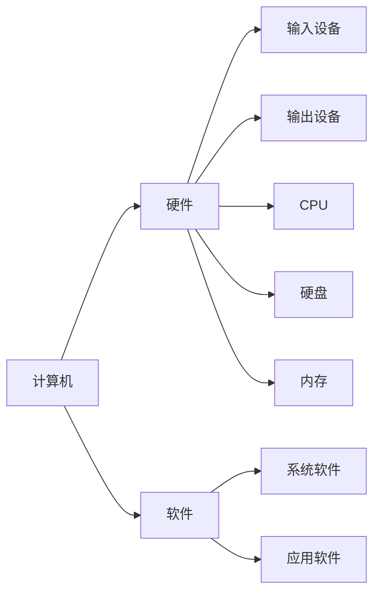

# mermaid 绘制流程图、时序图、甘特图

## 一、流程图

### 进入作图模式

三个反引号 ` + mermaid

### 指定绘制方向

`graph LR`：从左向右的横向

`graph TB`：从上至下的纵向(似乎 TD 也可以？？？)

> 对方向的解释：一共四个方向：top、right、bottom、left，LR即 left → right , TD即 top →  bottom

### 指定元素形状

| **id样式** |                  **id含义**                   |
| :--------: | :-------------------------------------------: |
|   id( )    |      圆角矩形结点（也可以叫圆角矩形框）       |
|   id [ ]   |                矩形结点 (默认)                |
|  id(( ))   |                   圆形结点                    |
|   id{ }    |                   棱形结点                    |
|   id > ]   |              开口向右的旗帜结点               |
|   id [ <   | 开口向左的旗帜结点（ 试了一下发现这个不存在） |
|  id[/ \\]  |                     梯形                      |
|  id[\\ /]  |                    倒梯形                     |
| id[\\ \\]  |                  平行四边形                   |
|  id[/ /]   |                反向平行四边形                 |


## 指定结点的线

| **连接线类型** | **表示符号** | **加长表示** |
| -------------- | ------------ | ------------ |
| 箭头           | -->          | --->         |
| 直线           | ---          | ----         |
| 虚线           | -.-          | -…-          |
| 加粗箭头       | ==>          | ===>         |
| 加粗直线       | ===          | ====         |
| 虚线箭头       | -.->         | -…->         |

### **中间添加文本表示**

| **类型**      | **表示符号** |
| ------------- | ------------ |
| 箭头+文字     | --text-->    |
| 直线+文字     | --text---    |
| 虚线+文字     | -.text.--    |
| 加粗箭头+文字 | =.text.==>   |
| 加粗直线+文字 | \==text==>   |
| 虚线箭头+文字 | -.text.->    |

## 其他类型箭头

| **类型** | **表示方法** |
| :------: | :----------: |
|   箭头   |      –>      |
|   黑圆   |      –o      |
|   黑×    |      –x      |


## 一对多

演示代码：(常规版本)

```
flowchart LR
    A --> B
    A --> C
    
    B --> D
    C --> D
```

演示代码：(简化版本)

```
flowchart LR
    A --> B & C --> D
```


## 注释

在 mermaid 中，行注释使用`%%`开头。


### 思维脑图

```
graph LR
计算机 --> 硬件
硬件 --> 输入设备
硬件 --> 输出设备
硬件 --> CPU
硬件 --> 硬盘
硬件 --> 内存

计算机 --> 软件
软件 --> 系统软件
软件 --> 应用软件
```




