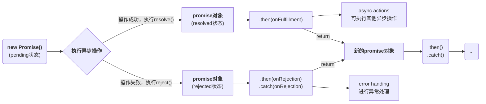
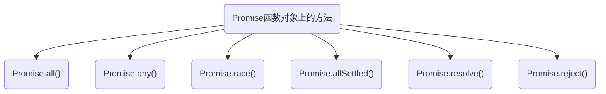
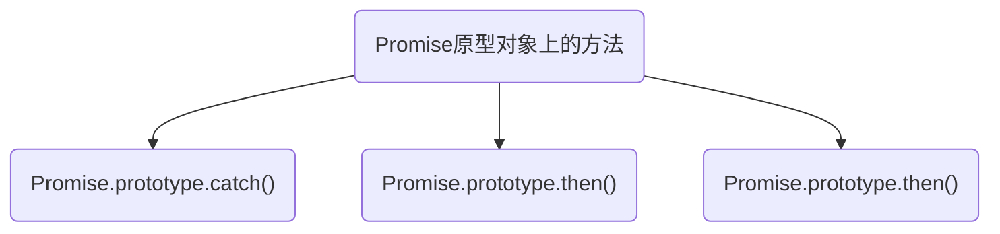

# 1 准备知识

## 1.1 区别实例对象和函数对象

1. 实例对象：`new` 函数产生的对象，简称为对象
2. 函数对象：将函数作为对象使用，简称为函数对象


## 1.2 两种类型的回调函数

### 1.2.1 同步回调

同步回调：立即执行，完全执行完了之才结束，不会放入到回调队列中

> 例如：数据遍历相关的回调函数、promise 的 executor 函数

```js
const arr = [1, 2, 3]
arr.forEach(item => {
    console.log(item);
})

console.log('forEach之后...');
```

代码执行结果如下：


### 1.2.2 异步回调

异步回调：不会立即执行，会放入回调队列中将来执行

> 例如：定时器回调、Ajax 回调、promise 回调

```js
setTimeout(() => {
    console.log('setTimeout...');
}, 0)
console.log('setTimeout之后...');
```

代码执行结果如下：


## 1.2 JS 的 error 处理

### 1.2.1 错误类型

当运行时错误产生时，`Error` 对象会被抛出。`Error` 对象也可以用于用户自定义的异常的基础对象

**常见的内置错误**

- `ReferenceError`：无效引用，即引用的变量不存在

  ```js
  console.log(a);
  ```

  

- `TypeError`：变量或参数不属于有效类型

  ```js
  let a = null;
  console.log(a.index);
  ```

  

- `RangeError`：数值变量或参数超出其有效范围

  ```js
  // 以递归调用为例
  function fn() {
      fn()
  }
  fn()
  ```

  

- `SyntaxError`：语法错误

  ```js
  const c = """"
  ```

  

**`Error` 对象的内置参数**

| 属性    | 描述                                    |
| ------- | --------------------------------------- |
| name    | 设置或返回错误名                        |
| message | 设置或返回错误消息                      |
| stack   | 整个 Error 的错误对象，包括函数的调用栈 |


### 1.2.2 捕获和抛出错误

**捕获异常的语法如下**

```js
try {
	// 测试代码
} catch(e) {
	// 处理异常
} finally {
	// 最终执行代码
}
```

**抛出异常代码如下**

```js
throw exception
```


**示例**

```js
function fn() {
    if(Date.now() % 2 == 1) {
        console.log('当前时间为奇数');
    } else {
        throw new Error('当前时间为偶数，无法执行任务')
    }
}

try {
    fn()
} catch(e) {
    alert(e.message)    // 指定处理异常
}
```


# 2 promise 介绍

promise 是异步编程中的一种解决方案，相较于传统的解决方案 —— 回调函数和事件，更为合理与强大。**promise 对象用于表示一个异步操作的最终完成（或失败）及其结果值。**

通俗讲，promise 是一个承诺，承诺不一定能够完成，但是无论是否能够完成都会有一个结果，一个 `Promise` 必然处于以下几种状态之一：

-  待定（pending）：初始状态，既没有被兑现，也没有没被拒绝
- 已兑现（fulfilled）：意味着操作成功完成
- 已拒绝（rejected）：意味着操作失败

**状态改变**

1. pending => fulfilled：操作成功时的状态转移
2. pending => rejected：操作失败时的状态转移

> 说明：状态转移只有这两种，promise 对象只能改变一次，无论成功还是失败，都会有一个结果数据，成功的结果数据一般称为 value，失败的结果数据一般称为 reason


**promise 运行的基本流程**



> resolved 状态和 fulfilled 的状态其实是一回事，并且在 Chrome 的 V8 引擎中，完成态就被称为 fulfilled，后面我们都会以 fulfilled 来进行表示


## 2.1 promise 概念

1. 抽象表达

   - promise 是 ES6 中新增的技术

   - promise 是 JS 中进行<strong style="color:red">异步编程</strong>的新的解决方案

     > 旧方案是单纯使用回调函数

2. 具体表达

   - 从语法上来说：promise 是一个<strong style="color:red">构造函数</strong>
   - 从功能上来说：promise 对象是用来封装一个异步操作并可以获取其成功 / 失败的结果值


## 2.2 promise 的使用

构造函数 `Promise()` 内部存在一个**执行器函数（executor）**，该执行器函数又接收两个参数，第一个为操作成功的回调函数，被称为 `resolve()`；第二个为操作失败的回调函数，被称为 `reject()`

> 注意：`executor` 执行其函数是同步回调函数

示例代码如下：

```js
const p = new Promise((resolve, reject) => {    // 执行器函数
    setTimeout(() => {
        const now = Date.now();
        if(now % 2 == 0) {
            // 1. 如果成功则调用resolve函数
            resolve('当前时间为偶数，可以继续执行，time=' + now)
        } else {
            // 2. 如果失败则调用reject函数
            reject('当前时间为奇数，拒绝向下执行，time=' + now)
        }
    }, 0)
})

p.then(
    // 1. 接收成功回调的value,OnResolved
    value => {
        console.log('成功的回调', value);
    },
    // 2. 接收失败回调的reason,OnRejected
    reason => {
        console.log('失败的回调', reason);
    }
)
```

执行结果：


## 2.3 promise 的优势

1. 指定回调函数的方式更加灵活

   - 旧的指定方式是：必须要在启动异步任务之前指定回调函数
   - promise 的指定方式是：启动异步任务 => 返回 promise 对象 => 给 promise 对象绑定回调函数（甚至可以在异步任务结束后指定一个或多个）

2. <strong style="color:red">支持链式调用，可以解决回调地狱问题</strong>

   - 什么是回调地狱?

     <strong style="color:red">回调函数嵌套调用，外部回调函数异步执行的结果是嵌套的回调函数执行的条件</strong>

   - 回调地狱的缺点

     - 不便于阅读
     - 不便于异常处理

   - 解决方案

     promise 链式调用

     > 用于解决回调地狱问题，但是只是简单地改变格式，并没有彻底解决上述问题，一定要利用 promise 再加上 await 和 async 关键字实现异步传同步

   - 终极解决方案

     promise + async / await

### 2.3.1 指定回调函数的方式更加灵活

使用 `Promise`，我们既可以在异步任务启动前创建回调函数，也可以在启动后创建回调函数

我们那下面的代码作对比即可：

1. 传统的纯回调函数（MDN上的伪代码示例）

   ```js
   // 成功的回调函数
   function successCallback(result) {
     console.log("音频文件创建成功：" + result);
   }
   
   // 失败的回调函数
   function failureCallback(error) {
     console.log("音频文件创建失败：" + error);
   }
   
   createAudioFileAsync(audioSettings, successCallback, failureCallback)
   ```

   这里在创建音频文件之前，我们必须要先指定成功的回调函数和失败的回调函数

2. promise 写法

   对于 promise ，我们可以像下面这种写法，回调函数在前或在后都可以

   ```js
   const promise = createAudioFileAsync(audioSettings);
   promise.then(successCallback, failureCallback);
   ```


### 2.3.2 解决回调地狱

**回调地狱**指的是<strong style="color:red">回调函数嵌套调用，外部回调函数异步执行的结果是嵌套的回调函数执行的条件</strong>

我们以 MDN 上的伪代码做演示：

1. 多重异步操作的传统做法

   ```js
   doSomething(function(result) {
     doSomethingElse(result, function(newResult) {
       doThirdThing(newResult, function(finalResult) {
         console.log('Got the final result: ' + finalResult);
       }, failureCallback);
     }, failureCallback);
   }, failureCallback);
   ```

2. `promise` 链式调用

   ```js
   // 把回调绑定到返回的 Promise 上，形成一个 Promise 链
   doSomething().then(function(result) {
     return doSomethingElse(result);
   })
   .then(function(newResult) {
     return doThirdThing(newResult);
   })
   .then(function(finalResult) {
     console.log('Got the final result: ' + finalResult);
   })
   .catch(failureCallback);	// 这里只要成功回调中任意一个环节出了错误，都会跳到catch中的错误回调中去执行，这种情况称为异常传透
   ```

   调用格式如下：

   ```js
   const p = new Promise(resolve=>{}, reject=>{});
   p.then(value=>{}, reason=>{})
   .then(value=>{}, reason=>{})
   .then(value=>{}, reason=>{})
   ...
   ```

   > 注意：每层回调都必须要有返回值，否则，callback 将无法获取上一个 `promise` 的结果。这里使用箭头函数，`() => x` 将比 `() => {return x;}` 的形式简洁得多，但我们都知道，如果我们函数体内有多条语句，还是需要使用后面的写法

### 2.3.3 终极方案：使用 async / await

在之前，我们使用 `promise` 的链式调用解决了回调地狱的问题，但是还是存在一个问题，就是存在回调函数（的形式），如果我们想要实现纯粹的同步编码方式，就需要用到 `async / await` ，上述的代码我们就可以写成如下形式：

```js
async function request() {
  try {
    const result = await doSomething()
    const newResult = await doSomethingElse(result)
    const finalResult = await doThirdThing(newResult)
    console.log('Got the final result: ' + finalResult);
  } catch (error) {
    failureCallback(error)
  }
}
```

> `async / await` 是 ES8 新推出的一个更加优雅的异步编程解决方案，它可以使用异步代码操作变得像同步代码一样，简洁而直观


# 3 Promise API

> :bell:**Tip**
>
> Promise  API 可以参考MDN 的中文文档：[传送门](https://developer.mozilla.org/zh-CN/docs/Web/JavaScript/Reference/Global_Objects/Promise/all)


## 3.1 Promise 函数对象上的方法





### 3.1.1 `promise.all()`

`promise.all()` 方法用于接收一个 promise 的 iterable 类型（注：Array、Map、Set 都属于 ES6 中 iterable 类型）的输入，并且只返回一个 `Promise` 实例。它等待所有的 promise 完成，或者第一个失败的 promise。

```js
Promise.all(iterable);
```

- `iterable`：一个可迭代对象，如 `Array` 或 `String`


### 3.1.2 `Promise.resolve()`

`Promise.resolve(value)` 方法返回一个以给定值解析后的 `Promise` 对象，语法如下：

```js
Promise.resolve(value)
```

> `Promise.resolve()`其实是一个语法糖，也就是说：
>
> ```js
> const p1 = Promise.resolve('foo')
> // 等价于
> const p1 = new Promise(resolve => {
>     resolve('foo')
> }
> ```

**参数**

- value 的值可以为一个 promise 对象（这种形式感觉有点鸡肋）

  ```js
  const p1 = Promise.resolve('foo');
  const p2 = Promise.resolve(p1);
  
  console.log(p1 === p2);	// true
  ```

- value 的值为也可以为一个 thenable 对象

  **thenable 对象是什么？**

  <u>所谓的thenable对象指的是具有then方法的对象</u>，如下：

  ```js
  let thenable = {
  	then: function(resolve, reject) {
          resolve(...params)
      }
  }
  
  const p3 = Promise.resolve(thenable)
  ```
  
  将 `thenable` 对象转为 `Promise` 对象，并立即执行对象的 then 方法
  
- 参数是没有 then 方法的对象，或者参数不是对象

  ```js
  Promise.resolve('Hello Wolrd')
  ```

  返回一个状态为 fulfilled 新的 Promise 对象，并且参数传入下一个 then 方法

- 不带任何参数

  ```js
  Promise.resolve()
  ```

  返回一个状态为 fulfilled 的 Promise 对象


**示例**

```js
const p1 = Promise.resolve('foo');
console.log(p1);    // fulfilled
let thenable = {
    then: function(resolve, reject) {
        resolve(41);        
    }
}
const p2 = Promise.resolve(thenable);
console.log(p2) // fulfilled
p2.then(
    value => {    
        console.log(value);
        console.log(p2);   // fulfilled
    },
)
```

执行结果如下：


### 3.1.3 `Promise.reject()`

`Promise.reject()` 方法返回一个带有拒绝原因的 `Promise` 对象

语法如下：

```js
Promise.reject(reason)
```


### 3.1.4 `Promise.allSettled()` 

`Promise.allSettled()` 方法以 `Promise` 组成的可迭代对象作为输入，当输入的所有的 `Promise` 都已完成（无论是操作成功还是失败）时，返回的 `Promise` 将兑现，语法如下：

```js
Promise.allSetlled(iterable)
```

- 返回值：一个 promise 实例对象

**示例**

```js
const p1 = Promise.resolve('one')

const p2 = Promise.reject('two')

const p3 = new Promise((resolve, reject) => {
    setTimeout(() => resolve('three'), 1000)
})
const p4 = Promise.allSettled([p1, p2, p3]).then(
    value => {
        console.log(value);
    }
)
console.log(p4);
```

执行结果如下：


### 3.1.5 `Promise.race()`

`Promise.race(iterable)`方法返回一个 promise，"race" 本身就有"赛跑"的意思，<strong style="color:red">一旦迭代器中某个 promise 解决或拒绝就会立即返回该 promise 对象</strong>，语法如下：

```js
Promise.race(iterable)
```

**示例**

```js
const p1 = new Promise((resolve, reject) => {
    setTimeout(resolve, 500, "one")
})
const p2 = new Promise((resolve, reject) => {
    setTimeout(resolve, 100, "two")
})

const p3 = Promise.race([p1, p2]).then(
    value => {
        console.log(value); // "two", 两个都完成，但是 p2 更快
    }
)
console.log(p3);   // 状态为"fulfilled"，但是结果要看情况而定，所以为 undefined
```

执行结果如下：


 

### 3.1.6 `Promise.any()`

`Promise.any()` 接收一个由 `Promise` 所组成的可迭代对象，该方法会返回一个新的 `Promise`，一旦可迭代对象内的任意一个 `Promise` 变成了兑现状态，那么由该方法所返回的 `Promise` 就会变成兑现状态，语法如下：

```js
Promise.any(iterable)
```


## 3.2 Promise原型对象上的方法





### 3.2.1 `Promise.prototype.catch()`

`catch()` 方法返回一个 `Promise`，并且处理拒绝的情况，语法如下：

```js
p.catch(onRejected);

p.catch(function(reason) {
	// 拒绝
})
```


### 3.2.2 `Promise.prototype.then()`

`then()` 方法返回一个 `Promise` 对象，它最多可以有两个参数：<strong style="color:red">Promise 成功和失败的回调函数</strong>

**语法**

```js
p.then(onFulfilled[, onRejected]);

p.then(value => {
  // fulfillment
}, reason => {
  // rejection
});
```


### 3.2.3 `Promise.prototype.finally()`

**`finally()`** 方法返回一个 `Promise`。在 promise 结束时，无论结果是 fulfilled 或者是 rejected，都会执行指定的回调函数。

**语法**

```js
p.finally(onFinally);

p.finally(function() {
   // 返回状态为 (resolved 或 rejected)
});

```


# 4 Promise  的几个关键性问题

## 4.1 如何改变 promise 的状态

改变 promise 状态一共有如下三种情况：

1. `resolve(value)`：如果当前是 `pedding` 状态就会变为 `resolved` 状态
2. `reject(value)`：如果当前是 `pedding` 状态就会变成 `rejected` 状态
3. 抛出异常：如果当前是 `pedding` 状态就会变成 `rejected` 状态

**示例**

```js
const p = new Promise((resolve, reject) => {
    resolve('one')  // fulfilled
})
```


```js
const p = new Promise((resolve, reject) => {
    reject('two')	// rejected
})
```


```js
const p = new Promise((resolve, reject) => {
    throw new Error('whoops')
    // 这里并不局限于抛出Error对象，也可以是普通字符
})
```


## 4.2 一个 Promise 指定多个成功/失败的回调，是否都会调用？

<strong style="color:red">答：当 Promise 改变为对应状态时，其设置的回调的都会被调用</strong>

**示例**

```js
const p = new Promise((resolve, reject) => {
    resolve('one')
})
p.then(
    value => {
        console.log('the first fulfillment');
    },
)
p.then(
    value => {
        console.log('the second fulfillment');
    },
)
```

执行结果如下：


## 4.3 改变 Promise 状态和指定回调函数的先后顺序

这个顺序是<strong style="color:red">不固定的</strong>，主要取决我们书写的代码

- 如果先指定的回调，那当状态发生改变时，回调函数就会调用，得到数据
- 如果先改变的状态，那当指定回调时，回调函数就会被调用，得到数据

```js
new Promise((resolve, reject) => {
    resolve('one')  // 先将状态改变，同时绑定数据
}).then(
    value => {  // 后指定回调函数，异步执行回调函数
        console.log(value);
    }
)
```

```js
new Promise((resolve, reject) => {
    setTimeout(() => {  
        resolve('one')      // 后改变状态(同时绑定数据)，异步执行回调函数
    }, 1000)

}).then(
    value => {
        console.log(value); // 先指定回调函数，保存当前指定的回调函数
    }
)
```


## 4.4 `promise.then()`返回的新promise的结果状态

<strong style="color:red">答：由 `then()` 指定的回调函数执行的结果决定</strong>

**具体说明**

1. 如果抛出异常，新 promise 变成 rejected，reason 为抛出的异常
2. 如果返回的是非 promise 的任意值，新 promsie 变成 resolved，value 为返回的值
3. 如果返回的是另一个新的 promise，则 promise 的结果就会变成新的 promise 的结果

**示例**

I - 返回非 promise 的任意值，例如：undefined

```js
new Promise((resolve, reject) => {
    resolve('Success')
}).then(
    value => {
        console.log('onFulfillment1()');
    },
    reason => {
        console.log('onRejection1()');
    }
).then(
    value => {
        console.log('onFulfillment2()');
    },
    reason => {
        console.log('onRejection2()');
    }
)
```

执行结果如下：


流程如下：


II - 抛出异常

```
new Promise((resolve, reject) => {
    resolve('Success')
}).then(
    value => {
        console.log('onFulfillment1()');
        throw new Error('Whoops')   // 抛出异常
    },
    reason => {
        console.log('onRejection1()');
    }
).then(
    value => {
        console.log('onFulfillment2()');
    },
    reason => {
        console.log('onRejection2()');
    }
)
```

执行结果如下：


流程如下：


III - 返回新的 promise 对象

```js
new Promise((resolve, reject) => {
    resolve('Success')
}).then(
    value => {
        console.log('onFulfillment1()');
        return Promise.resolve('Success2')  // 返回一个成功的promise对象
    },
    reason => {
        console.log('onRejection1()');
    }
).then(
    value => {
        console.log('onFulfillment2()');
    },
    reason => {
        console.log('onRejection2()');
    }
)
```

执行结果如下：


操作流程如下：


## 4.5 promise 如何串联连多个操作任务？

<strong style="color:red">答：通过 then 方法的链式调用来串连多个同步 / 异步任务</strong>

**说明**

- 如果是同步任务，可以直接通过 return 返回对应的结果值
- 如果是异步任务，则需要将其封装为一个 promise 对象后再使用 resolve 或 reject 返回值

**示例**

```js
new Promise((resolve, reject) => {
    setTimeout(() => {
        console.log('执行任务1(异步)');
        resolve(1)
    }, 1000);
}).then(
    value => {
        console.log('执行任务1的结果：', value);
        console.log('执行任务2(同步)');
        return 2
    }
).then(
    value => {
        console.log('任务2的结果为：', value);
        return new Promise((resolve, reject) => {
            setTimeout(() => {
                console.log('执行任务3(异步)');
                resolve(3)
            }, 1000)
        })
    }
).then(
    value => {
        console.log('任务3的结果为：', value);
    }
)
```

执行结果如下：


# 5 自定义 promise


# 6 async 和 await

:spiral_notepad:知识点归纳

1. async 函数
   - 函数的返回值为 promise 对象
   - promise 对象的结果值由 async 函数执行的返回值决定
2. await 函数
   - await 右侧的表达式一般为 promise 对象，但也可以是其它的值
   - 如果表达式是 promise 对象，await 返回的是 promise 成功的值
   - 如果表达式是其它值，直接将此值作为 await 的返回值
3. 注意事项
   - await 必须写在 async 函数里面，但 async 函数中可以没有 await
   - 如果 await 的 promise 失败，就会抛出异常，需要通过 try…catch 来捕获异常


async 函数语法如下：

```js
async function name(param0) {
  statements
}

async function name(param0, param1, /* … ,*/ paramN) {
  statements
}
```


async 函数可能包含 0 个或多个 await 表达式，<strong style="color:red">await 表达式会暂停整个 async 函数的执行进程并让出控制权，只有当其等待的基于 promise 的异步操作被兑现或被拒绝后才会恢复进程，promise 的解决值会被当做该 await 表达式的返回值</strong>

<strong style="color:red">async 函数一定会返回一个 promise 对象，如果返回值不是 promise 对象，则会隐式地被包装在一个 promise 中</strong>

```js
async function foo() {
    return 1
}
const result = foo();
console.log(result);
```

执行结果如下：


换言之，上述代码等价于：

```js
async function foo() {
    return Promise.resolve(1)
}
```


await 关键字只能在 async 函数中使用，如果 async 函数体外使用则会报 `SyntaxError` 错误，如下：

```js
const result = await 1;
```

报错如下：


await 关键字用于<strong style="color:red">等待一个 promise 兑现并获取它兑现之后的值</strong>，语法如下：

```js
await expression;
```

**示例**

```js
async function foo() {
    const result1 = await Promise.resolve(1);
    console.log(result1);   // 1
    const result2 = await 2;
    console.log(result2);   // 2
    try {
        const result3 = await Promise.reject(3)
    } catch(err) {
        console.log(err);   // 3
    }
}
foo()
```


# 7 异步之宏队列与微队列

**原理图**


**说明**

1. JS 中用来存储执行回调函数的队列有两种：<strong style="color:red">宏队列和微队列</strong>
2. 宏队列：用来保存待执行的宏任务（回调），比如：定时器回调 / DOM事件回调 / Ajax 回调
3. 微队列：用来保存待执行的微任务（回调），比如：Promise 回调 / MutationObserver 回调
4. JS 执行的顺序：同步任务 ==> 异步任务中的微队列 ==> 异步任务中的宏任务
   - JS 引擎（解释器）首先必须先执行所有的初始化同步任务代码
   - 每次准备取出第一个宏任务执行前，都要将所有的微任务一个一个取出来执行

**示例**

```js
// 异步任务代码
setTimeout(() => {
    console.log('timeout callback1()...');
    Promise.resolve(3).then(
    value => {
        console.log('promise onFulfillment3()：',value);
    }
);
}, 0);

setTimeout(() => {
    console.log('timeout callback2()...');
}, 0);

Promise.resolve(1).then(
    value => {
        console.log('promise onFulfillment1()：',value);
    }
);

Promise.resolve(2).then(
    value => {
        console.log('promise onFulfillment2()：', value);
    }
);
// 同步代码
console.log('begin-------------');
```

执行结果如下：


# 8 面试题

## 8.1 代码段分析1

```js
setTimeout(() => {
    console.log(1);
}, 0)
new Promise((resolve) => {
    console.log(2);
    resolve()
}).then(() => {
    console.log(3);
}).then(() => {
    console.log(4);
})
console.log(5);
```

打印输入结果的顺序为：

2 ==> 5 ==> 3 ==> 4 ==> 1


:herb:**解释说明**

```
promise 执行器（executor）和 then 方法都是同步的，而 then 里面的回调函数是异步的，所以会先打印出 2，之后就是 5，同步执行完毕后执行异步，promise 的 then 里面的回调函数放到微队列中，而定时器回调放到宏队列中，所以异步执行的顺序是: 3、4、1
```

> :small_red_triangle:注意： 并不是所有的回调都是异步的，像 forEach 循环遍历里面的回调就是同步执行的


## 8.2. 代码分析段2

```js
const first = () => (new Promise((resolve, reject) => {
    console.log(1);
    let p = new Promise((resolve, reject) => {
        console.log(2);
        setTimeout(() => {
            console.log(3);
            resolve(4);
        }, 0)
        resolve(5)
    })
    resolve(6)
    p.then((arg) => {
        console.log(arg);
    })
}))

first().then(
    (arg) => {
        console.log(arg);
    }
)
console.log(7);
```

首先，我们直接看最后输出的顺序：1 ==> 2 ==> 7 ==> 5 ==> 6 ==> 3


:herb:**解释说明**

```
首先，我们需要理清好代码结构，代码是 promise 中嵌套着一个 promise，同时外部有一个同步打印的代码，promise 执行器中的代码是同步的，所以会先打印出：1、2、7，之后代码执行到定时器时，将定时器回调放到宏队列中，接下来执行到 resolve(5)，p 的状态会里面由 pedding ==> fulfullment，同时执行 p.then 里面的回调，打印出 5，再来到 resolve(6)，first() 的 then 立即被调用，打印出 6，最后就是执行定时器，打印出3，后面虽然 resolve(4)，但是由于 p 的状态已经发生改变，所以改行代码无效
```

